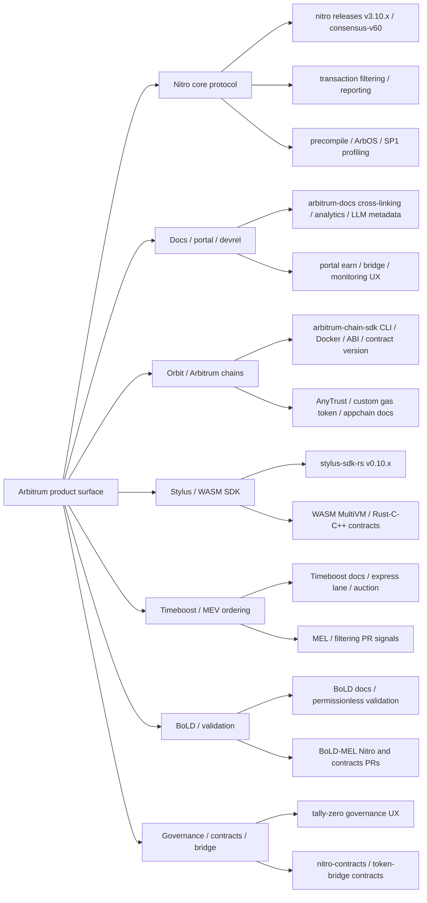

# Arbitrum 近期开发与叙事分析 - Draft Round 1

## 1. Executive Summary

本轮 draft 按重启后的 scope 重新执行：**先扫描 repo universe，再按近 3 个月活跃度排序，最后才进入 PR 和叙事分析**。抓取窗口为 **2026-02-24T00:00:00Z 至 2026-05-23T21:32:40Z**。Seed org 为 `OffchainLabs` 和 `ArbitrumFoundation`；共发现 **149 个公开 seed-org repo**，其中 **70 个 include-candidate、1 个 strategic appendix、13 个 archived、19 个 fork、4 个 OffchainLabs-owned but non-Arbitrum/Prysm 类 repo、42 个 unrelated repo**。实际拉取近窗指标的 repo 为 **98 个**，其中 **59 个进入 Arbitrum product-surface ranking**。[G1][G2][G3]

数据排序结果显示，Arbitrum 近三个月的工程重心不是单一 "Nitro + Stylus" 预设结论，而是一个更具体的组合：

1. **Core protocol / Nitro 仍是最高强度工程面。** `OffchainLabs/nitro` 排名第 1：256 个 created PR、186 个 merged PR、1,310 个 default-branch commits、53 个 commit-active days、34 个 human contributors、22 个 release signal，score 0.935897。代表 PR 显示重点集中在 Nitro release train、CI/reliability、transaction filtering / delayed inbox / precompile gating、BoLD/MEL、SP1/profiling、Timeboost-adjacent filtering/reporting。[G3][G7]
2. **Developer docs / portal / devrel 是第二层高活跃面。** `arbitrum-docs` 第 2，175 created PR / 162 merged PR / 1,136 commits；`arbitrum-portal` 第 3，153 created PR / 121 merged PR。docs 的 W21 PR 数上升到 29，明显是近期 cross-linking、analytics、LLM/compliance、SDK/docs migration 等开发者入口改造。[G4][G5]
3. **Foundation/governance UI 和 chain deployment tooling 进入 Top 5。** `tally-zero` 第 4，显示 DAO / proposal / delegation UX 投入；`arbitrum-chain-sdk` 第 5，显示 Orbit / chain deployment / CLI / script packaging 仍有产品化活动。但 `arbitrum-chain-sdk` 的 `open_backlog_all_age=52` 与 `open_prs_created_in_window=15` 必须分开看：它是战略重要 repo，但不能因为历史 backlog 很大而被误判为比 docs/portal 更强的近期吞吐。[G3][G7]
4. **Stylus 是稳定 release / SDK 方向，而不是最高 PR 吞吐方向。** `stylus-sdk-rs` 第 6，44 created PR / 33 merged PR / 7 release signal，近窗发布 v0.10.2、v0.10.3、v0.10.4、v0.10.5、v0.10.6、v0.10.7。叙事上 Stylus 仍强，但数据上它是 "release cadence + docs/tooling hardening"，不是排名第一的工程投入。[G3][G7][O1]
5. **Orbit / appchain 叙事有官方资料和 Top repo 支撑，但近期代码证据分散。** `arbitrum-chain-sdk`、`arbitrum-chain-playbook`、`orbit-monitoring-tools`、`orbit-cli-tools`、`arbitrum-orbit-deployment-ui` 都有近窗活动；但除 chain-sdk 外，PR 量不高。应写成 "deployment tooling and chain template productization continues"，而不是 "Orbit core protocol sprint dominates".[G3][O2][O3]
6. **Timeboost 与 BoLD 的叙事强度高于 repo-rank 强度。** Timeboost 官方 docs 已将其定义为 Arbitrum chains 的 transaction ordering policy，可让 chain owners capture MEV、保持 250ms block cadence、通过 express lane / auction 机制保留用户体验；BoLD docs 将其定义为 permissionless validation dispute protocol。GitHub 侧，Nitro 和 nitro-contracts 出现 MEL / BoLD / transaction filtering / OSP contracts / ResourceConstraintManager 相关 PR，但不少仍 open、draft 或 "DO NOT MERGE"。因此二者应标为 strong narrative + active implementation signal，而非全部 production-shipped。[G7][O4][O5]
7. **对 Mantle 的竞争启示：Arbitrum 正把 "developer surface + appchain customization + MEV monetization + permissionless validation + multi-VM" 打包。** Mantle 短期应建立 watchlist 和 dashboard；中期原型验证 proof/validator monitoring、MEV/preconfirmation/order-flow telemetry、appchain template、paymaster/payment/enterprise demo；长期不要直接复制 Stylus/Orbit/Timeboost，而要把 EVM compatibility、EigenDA / data availability、MNT liquidity、enterprise/payment distribution 做成自己的可验证差异化。

结论置信度：GitHub ranking / PR metric 为 **high**；代表 PR 分类为 **medium-high**（基于 title/body/recent PR manual spot-check，不是全量 diff review）；Stylus/Orbit/Timeboost/BoLD 官方叙事为 **high**；生态采用与竞争归因为 **medium**，因为公开 GitHub 和 docs 无法证明内部 staffing 或商业 pipeline。

## 2. Item Findings

### item-1: GitHub org universe discovery and inclusion rules

**执行口径。** 使用 GitHub REST API via `gh` token，对 `OffchainLabs` 与 `ArbitrumFoundation` 做 `/orgs/{org}/repos?per_page=100&type=all` 分页扫描，记录 repo metadata、topics、language、archived/fork/template、default branch、stars/forks、created/pushed/updated time。随后对 2026-02-24 之后 pushed 的非 archived / 非 fork repo 拉取 PR、commits、release 和 open backlog 指标。抓取脚本和原始结果已随本 draft 存放在 `source-data/github-activity/`。[G1][G2]

**Discovery funnel (diag-1).**

| Step | Count | 处理 |
|---|---:|---|
| Seed org repos: `OffchainLabs` + `ArbitrumFoundation` | 149 | 全量 inventory |
| Archived | 13 | 排除出 activity ranking，保留 inventory |
| Fork | 19 | 排除出 activity ranking，避免 upstream sync 噪声 |
| OffchainLabs-owned but non-Arbitrum product surface | 4 | `prysm`, `prysm-web-ui`, `prysm-documentation` 等，排除 rank |
| Unrelated / no clear Arbitrum product link | 42 | 排除 rank |
| Strategic appendix | 1 | `OffchainLabs/go-ethereum`，作为 dependency/fork/prover-adjacent 观察，不进入产品动量排名 |
| Include-candidate | 70 | 进入 product-surface 排名或 appendix |
| Metric repos crawled | 98 | 包含候选、排除项、appendix，用于验证噪声和排除理由 |
| Rankable Arbitrum product repos | 59 | 进入 leaderboard |

**关键排除判断。** `OffchainLabs/prysm` 在窗口内有 381 created PR / 243 merged PR / 68 commit-active days，按裸活跃度会排在许多 Arbitrum repo 之前；但其 description 和 topics 显示是 Ethereum proof-of-stake/Prysm 工作，不是 Arbitrum L2 competitor surface，因此明确排除。`OffchainLabs/go-ethereum` 有 31 created PR / 18 merged PR / 29 commit-active days，是 Arbitrum fork/dependency/prover-adjacent repo，只进入 strategic appendix，不进入 Arbitrum product momentum rank。[G3]

**Related org caveat.** 本轮完整可复现数据集覆盖 `OffchainLabs` 和 `ArbitrumFoundation` seed org。其他 Arbitrum ecosystem repo（例如 third-party Orbit chain、Stylus examples outside seed org、DAO/forum/off-chain dashboards）只作为 narrative / ecosystem sources，不进入 core ranking。这样做牺牲了 long-tail ecosystem breadth，但避免把非官方项目活跃度误写成 Arbitrum core team momentum。

### item-2: Activity data pipeline, ranking formula, and Top repo selection

**指标定义。**

- `pr_created`: 窗口内 created PR 数。
- `pr_merged`: 窗口内 merged PR 数，以 `merged_at` 计。
- `open_prs_created_in_window`: 当前 open 且创建于窗口内的 PR。
- `open_backlog_all_age`: 抓取时所有 open PR，不限创建时间。**该字段只报告 backlog，不进入 score**，以响应 draft guardrail。
- `commit_active_days`: default branch 在窗口内有 commits 的自然日数。
- `unique_human_contributors`: human PR authors + commit authors 去 bot 后 union。
- `release_signal`: 窗口内 releases/tags 数。

默认公式：

```text
activity_score =
  0.40 * normalized_pr_created
+ 0.20 * normalized_pr_merged
+ 0.20 * normalized_commit_active_days
+ 0.15 * normalized_unique_human_contributors
+ 0.05 * normalized_release_signal
```

**Top repo leaderboard (diag-2).**

| Rank | Repo | Cluster | Score | PR created | PR merged | Open PRs created in window | Open backlog all-age | Commit active days | Human contributors | Release signal | Decision |
|---:|---|---|---:|---:|---:|---:|---:|---:|---:|---:|---|
| 1 | `OffchainLabs/nitro` | core-protocol-node | 0.935897 | 256 | 186 | 23 | 47 | 53 | 34 | 22 | selected deep |
| 2 | `OffchainLabs/arbitrum-docs` | developer-tooling-docs | 0.749102 | 175 | 162 | 29 | 34 | 78 | 23 | 0 | selected deep |
| 3 | `OffchainLabs/arbitrum-portal` | developer-tooling-docs | 0.513589 | 153 | 121 | 6 | 12 | 46 | 6 | 0 | selected deep |
| 4 | `OffchainLabs/tally-zero` | foundation-ecosystem-devrel | 0.257726 | 65 | 59 | 3 | 3 | 31 | 3 | 0 | selected |
| 5 | `OffchainLabs/arbitrum-chain-sdk` | orbit-appchain-tooling | 0.221132 | 70 | 29 | 15 | 52 | 15 | 8 | 3 | selected with backlog caveat |
| 6 | `OffchainLabs/stylus-sdk-rs` | stylus-wasm-sdk | 0.185792 | 44 | 33 | 2 | 6 | 17 | 5 | 7 | selected |
| 7 | `OffchainLabs/arbitrum-chain-actions` | contracts-bridge-governance | 0.141859 | 27 | 18 | 10 | 14 | 21 | 6 | 0 | selected |
| 8 | `OffchainLabs/nitro-testnode` | core-protocol-node | 0.094593 | 16 | 7 | 8 | 16 | 7 | 10 | 0 | appendix / test infra |
| 9 | `OffchainLabs/token-bridge-contracts` | bridge/contracts | 0.084529 | 25 | 17 | 5 | 19 | 2 | 5 | 0 | selected bridge appendix |
| 10 | `OffchainLabs/arbitrum-sdk` | SDK | 0.082160 | 17 | 10 | 7 | 20 | 8 | 5 | 1 | selected SDK appendix |
| 11 | `OffchainLabs/arbitrum-testnode` | core-protocol-node | 0.071451 | 6 | 4 | 2 | 2 | 12 | 2 | 8 | appendix |
| 12 | `OffchainLabs/arbitrum-monitoring` | observability-infra-ci-release | 0.065071 | 15 | 8 | 6 | 15 | 6 | 4 | 0 | appendix |
| 13 | `OffchainLabs/nitro-contracts` | contracts-bridge-governance | 0.063722 | 18 | 2 | 14 | 37 | 1 | 7 | 0 | strategic watch |
| 14 | `OffchainLabs/nitro-precompile-interfaces` | precompile/interfaces | 0.060172 | 5 | 5 | 0 | 1 | 8 | 6 | 0 | appendix |
| 15 | `OffchainLabs/arbitrum-token-lists` | data-indexer-analytics | 0.050652 | 12 | 2 | 9 | 13 | 3 | 5 | 0 | ecosystem appendix |

**Sensitivity check.**

| Weighting | Top 10 |
|---|---|
| Default | `nitro`, `arbitrum-docs`, `arbitrum-portal`, `tally-zero`, `arbitrum-chain-sdk`, `stylus-sdk-rs`, `arbitrum-chain-actions`, `nitro-testnode`, `token-bridge-contracts`, `arbitrum-sdk` |
| PR-heavy | `nitro`, `arbitrum-docs`, `arbitrum-portal`, `tally-zero`, `arbitrum-chain-sdk`, `stylus-sdk-rs`, `arbitrum-chain-actions`, `token-bridge-contracts`, `nitro-testnode`, `arbitrum-sdk` |
| Commit-heavy | `nitro`, `arbitrum-docs`, `arbitrum-portal`, `tally-zero`, `arbitrum-chain-sdk`, `stylus-sdk-rs`, `arbitrum-chain-actions`, `nitro-testnode`, `arbitrum-testnode`, `arbitrum-sdk` |
| Contributor-heavy | `nitro`, `arbitrum-docs`, `arbitrum-portal`, `arbitrum-chain-sdk`, `tally-zero`, `stylus-sdk-rs`, `nitro-testnode`, `arbitrum-chain-actions`, `nitro-contracts`, `arbitrum-sdk` |

结论：Top 7 高度稳定；第 8-13 位会因 contributor / commit 权重移动。`nitro-contracts` 在 contributor-heavy 下进入 Top 10，但默认分数低，且 `open_backlog_all_age=37`、`open_prs_created_in_window=14`、`pr_merged=2`，应作为 contracts/BoLD/MEL watch item，而不是近期吞吐型 Top repo。[G3]

### item-3: Active repo overview and cluster map

**Cluster map.**

| Cluster | Repos in Top / appendix | 近期信号 |
|---|---|---|
| core-protocol-node | `nitro`, `nitro-testnode`, `arbitrum-testnode`, `nitro-mocks` | Nitro release train、validator/BoLD/MEL、transaction filtering、ArbOS/precompile gating、testnode ops |
| developer-tooling-docs | `arbitrum-docs`, `arbitrum-portal`, Foundation docs, tutorials | docs cross-linking、analytics、LLM/compliance、portal earn/bridge UX、developer onboarding |
| foundation-ecosystem-devrel | `tally-zero`, Foundation newsletter signup | proposal/delegation/security-council election UX, DAO visibility |
| orbit-appchain-tooling | `arbitrum-chain-sdk`, `chain-playbook`, `orbit-monitoring-tools`, `orbit-cli-tools`, deployment UI | deployment CLI/scripts、chain configuration、private RPC endpoint、inbox allow list、AnyTrust/custom chain docs |
| stylus-wasm-sdk | `stylus-sdk-rs`, many Stylus examples/workshops | Rust/WASM SDK release cadence, verification fixes, docs deprecations |
| contracts-bridge-governance | `arbitrum-chain-actions`, `nitro-contracts`, Foundation governance | upgrade files、MEL/OSP contracts、ResourceConstraintManager、proposal data UX |
| timeboost-sequencing-mev | `timeboost-test`, Nitro PRs, docs/spec repos | official Timeboost docs + Nitro filtering/reporting/MEL PRs; repo volume low outside Nitro |
| data-indexer-analytics | `arbitrum-token-lists`, subgraphs, retryable trackers | low/medium; mostly ecosystem list and monitoring |

**Repo x week PR-created heatmap (diag-3, Top 10).**

| Repo | W09 | W10 | W11 | W12 | W13 | W14 | W15 | W16 | W17 | W18 | W19 | W20 | W21 | Momentum |
|---|---:|---:|---:|---:|---:|---:|---:|---:|---:|---:|---:|---:|---:|---|
| `nitro` | 16 | 38 | 28 | 31 | 35 | 25 | 31 | 22 | 19 | 6 | 2 | 2 | 1 | 高位但 5 月 created PR 明显降温；release still active |
| `arbitrum-docs` | 5 | 8 | 9 | 11 | 14 | 12 | 9 | 12 | 24 | 15 | 13 | 14 | 29 | 5 月升温，docs/devrel 重投入 |
| `arbitrum-portal` | 10 | 18 | 15 | 12 | 8 | 11 | 6 | 30 | 7 | 5 | 9 | 11 | 11 | W16 burst 后维持 |
| `tally-zero` | 0 | 0 | 0 | 0 | 7 | 7 | 0 | 9 | 7 | 11 | 6 | 10 | 8 | 3 月后稳定活跃 |
| `arbitrum-chain-sdk` | 6 | 7 | 5 | 1 | 20 | 3 | 6 | 8 | 5 | 3 | 4 | 0 | 2 | W13 burst 后平稳 |
| `stylus-sdk-rs` | 0 | 1 | 15 | 3 | 0 | 6 | 4 | 3 | 0 | 0 | 3 | 6 | 3 | release-driven cadence |
| `arbitrum-chain-actions` | 0 | 0 | 1 | 0 | 1 | 2 | 2 | 1 | 5 | 7 | 7 | 0 | 1 | W17-W19 upgrade-action burst |
| `nitro-testnode` | 0 | 3 | 1 | 1 | 0 | 2 | 1 | 1 | 0 | 6 | 0 | 1 | 0 | test infra burst |
| `token-bridge-contracts` | 5 | 5 | 1 | 1 | 8 | 2 | 0 | 0 | 1 | 2 | 0 | 0 | 0 | March bridge work, then taper |
| `arbitrum-sdk` | 0 | 3 | 0 | 1 | 6 | 3 | 2 | 0 | 1 | 1 | 0 | 0 | 0 | low steady |

### item-4: Cross-repo PR taxonomy and development direction analysis

PR 分类先用 title/body/cluster rule-based pass，再对 high-signal samples 做人工核验。分类不是 mutually exclusive full diff audit，主要用于方向判断。[G5][G6][G7]

**PR category matrix (diag-4).**

| Repo | Dominant categories | Representative PRs | Status read | Narrative meaning | Mantle relevance |
|---|---|---|---|---|---|
| `nitro` | observability/CI/release 87; core-protocol-node 74; cleanup/deps 31; stylus 20; timeboost 15; BoLD 10 | [`#4680`](https://github.com/OffchainLabs/nitro/pull/4680) Post-MEL assertions in BoLD open; [`#4679`](https://github.com/OffchainLabs/nitro/pull/4679) SP1 profiling merged; [`#4643`](https://github.com/OffchainLabs/nitro/pull/4643) BoLD with MEL open draft; [`#4619`](https://github.com/OffchainLabs/nitro/pull/4619) filtering-report RPC merged; [`#4637`](https://github.com/OffchainLabs/nitro/pull/4637) serialized chain config merged | mix of merged/open/draft | Nitro is still release/ops core; BoLD/MEL/Timeboost-adjacent changes are active but not uniformly shipped | high: monitor proof, validator, sequencing, release train |
| `arbitrum-docs` | developer docs 68; infra/analytics 60; deps 45 | [`#3317`](https://github.com/OffchainLabs/arbitrum-docs/pull/3317) launch-chain cross-linking merged; [`#3314`](https://github.com/OffchainLabs/arbitrum-docs/pull/3314) stylus cross-linking open; [`#3305`](https://github.com/OffchainLabs/arbitrum-docs/pull/3305) LLM-compliance / agent discovery merged | mostly docs/website merged | Arbitrum is making docs an active product surface | medium-high: Mantle docs/DX gap |
| `arbitrum-portal` | cleanup/deps 71; infra/UX 52; docs 20; contracts 8 | [`#329`](https://github.com/OffchainLabs/arbitrum-portal/pull/329) earn gas estimation fallbacks merged; [`#331`](https://github.com/OffchainLabs/arbitrum-portal/pull/331) vercel cache/rate limiting merged; [`#323`](https://github.com/OffchainLabs/arbitrum-portal/pull/323) bridge withdrawal fetch perf merged | portal UX/perf activity | Arbitrum is investing in user-facing earn/bridge entrypoints | medium: Mantle app portal/payments UX |
| `tally-zero` | governance/contracts 17; foundation/devrel 15; cleanup 15; infra 10 | [`#58`](https://github.com/OffchainLabs/tally-zero/pull/58) security council election execution details merged; [`#65`](https://github.com/OffchainLabs/tally-zero/pull/65) proposal lifecycle quorum display merged; [`#66`](https://github.com/OffchainLabs/tally-zero/pull/66) proposer cancel pending proposal open | governance UX | DAO/proposal transparency as ecosystem operations surface | medium: governance UX for Mantle |
| `arbitrum-chain-sdk` | infra/release 50; cleanup 12; Stylus 3; Orbit 2 | [`#713`](https://github.com/OffchainLabs/arbitrum-chain-sdk/pull/713) ABI schema generation open; [`#711`](https://github.com/OffchainLabs/arbitrum-chain-sdk/pull/711) chain-sdk docker image open; [`#709`](https://github.com/OffchainLabs/arbitrum-chain-sdk/pull/709) getChainContractVersions open; [`#698`](https://github.com/OffchainLabs/arbitrum-chain-sdk/pull/698) inbox allow list functions merged | backlog-heavy; mixed open/merged | Orbit deployment tooling is active but queue-heavy | high: appchain tooling lessons |
| `stylus-sdk-rs` | cleanup/release 21; infra 12; docs 8; Stylus core 3 | [`#438`](https://github.com/OffchainLabs/stylus-sdk-rs/pull/438) v0.10.7 changelog merged; [`#430`](https://github.com/OffchainLabs/stylus-sdk-rs/pull/430) verification fixes merged; [`#424`](https://github.com/OffchainLabs/stylus-sdk-rs/pull/424) deprecate `reentrant` docs merged; [`#419`](https://github.com/OffchainLabs/stylus-sdk-rs/pull/419) new stylus prefix docs merged | release + verification + docs | Stylus SDK is maturing rather than exploding in PR volume | medium: language/SDK moat, not directly portable |
| `arbitrum-chain-actions` | infra/release 13; deps 11; contracts 2 | [`#93`](https://github.com/OffchainLabs/arbitrum-chain-actions/pull/93) pack 3.2.0 upgrade files open; [`#76`](https://github.com/OffchainLabs/arbitrum-chain-actions/pull/76) 3.2.0 action open; [`#75`](https://github.com/OffchainLabs/arbitrum-chain-actions/pull/75) publish npm merged | upgrade-package tooling | Chain upgrade action packaging | medium: release/upgrade runbooks |
| `nitro-contracts` | contracts 5; cleanup 5; BoLD 2; Orbit 2; Timeboost/MEL 1 | [`#432`](https://github.com/OffchainLabs/nitro-contracts/pull/432) MEL OSP contracts open DO NOT MERGE; [`#427`](https://github.com/OffchainLabs/nitro-contracts/pull/427) MEL rollup contracts open DO NOT MERGE; [`#425`](https://github.com/OffchainLabs/nitro-contracts/pull/425) 0-level BoLD PoC open; [`#416`](https://github.com/OffchainLabs/nitro-contracts/pull/416) BaseFeeManager open | mostly open / PoC | Strategic but not throughput-ranked | high watch, low shipped confidence |
| `token-bridge-contracts` | cleanup 7; infra 7; contracts 6; Orbit 2 | [`#200`](https://github.com/OffchainLabs/token-bridge-contracts/pull/200) YBB token name/symbol merged; [`#197`](https://github.com/OffchainLabs/token-bridge-contracts/pull/197) polling/verification deployment script open; [`#195`](https://github.com/OffchainLabs/token-bridge-contracts/pull/195) fee-on-transfer handling merged | bridge/token support work | bridge/product integration, not core narrative | medium |

### item-5: Major feature changes and architecture shifts in selected repos

#### 5.1 Nitro release, reliability, and core protocol hardening

`nitro` had 22 release signals in the window, including `v3.10.1` on 2026-05-19, `v3.10.0` on 2026-05-11, multiple `v3.10.0-rc.*`, `v3.9.9`, `v3.9.8`, and `consensus-v60-rc.*` tags.[G7]

Representative PRs suggest four subthemes:

- **Release / test stability / CI hardening**: CI fixes, flaky system tests, SP1 image env, profiling infra, coverage components, Docker/go version changes.
- **Transaction filtering / reporting / delayed inbox**: `Add ReportFilteredTransactions RPC endpoint`, `Add SQS integration and report forwarder`, `Report filtered regular/delayed txns`, `transaction-filterer` work. Some PRs are merged, others closed unmerged or open; the safe interpretation is active iteration around filtering/reporting infra, not a single shipped feature.
- **ArbOS/precompile/gas gating**: PRs around precompile version gating and `ArbitrumUnsignedTx` marshaling indicate ongoing protocol correctness work.
- **BoLD / MEL / SP1**: open/draft PRs around Post-MEL assertions, BoLD with MEL, BoLD state provider spawner selection, SP1 profiling. These are high strategic signal, but review status remains mixed.

Mantle implication: track Nitro releases and PR clusters weekly. The most transferable lessons are release-hardening, validator/proof monitoring, transaction filter/report observability, and operator runbooks. BoLD/MEL implementation details are Arbitrum-specific and require architecture translation.

#### 5.2 Developer docs and portal as active product surfaces

`arbitrum-docs` and `arbitrum-portal` ranking above Stylus and chain SDK is the clearest data-driven surprise. Docs PRs include cross-linking across launch-chain/node/build/stylus/bridge, JSON-RPC docs, Inkeep/PostHog analytics wiring, `llm.txt`, and "agent discovery" / LLM-compliance work. Portal PRs show earn and bridge UX/performance changes, monitoring RPC migration, Sentry centralization, pricing data, gas fallback, and rate limiting.[G7]

Interpretation: Arbitrum is investing in developer discovery and user-facing portal UX as part of the competitive surface. This is not "protocol-only" competition. For Mantle, docs, portal, SDK examples, and payment/bridge/earn workflows should be treated as product infrastructure, not afterthoughts.

#### 5.3 Orbit / chain deployment tooling

`arbitrum-chain-sdk` is Top 5 by recent activity, with open PRs for ABI schema generation, chain-sdk Docker image, `getChainContractVersions`, private RPC endpoint option, workflow scripts as CLI commands, inbox allow-list functions, and viem upgrade. `arbitrum-chain-playbook`, `orbit-monitoring-tools`, `orbit-cli-tools`, `arbitrum-orbit-deployment-ui`, and `arbitrum-testnode` provide lower-volume supporting signals.[G3][G7]

Official docs present Arbitrum chains as application-specific chains/appchains and list configurable dimensions such as custom gas token, data availability choices, BoLD/permissioned validators, Timeboost, and account abstraction; AnyTrust docs explain the lower-cost DA tradeoff with a data availability committee assumption.[O2][O3]

Interpretation: Orbit/appchain is a real official product line, and chain-sdk shows recent tooling activity. However, code activity is not broad enough to claim an Orbit engineering sprint dominates the whole org. Treat it as strategic productization, not highest throughput.

#### 5.4 Stylus / WASM SDK maturity

Official docs define Stylus as adding a second coequal WASM VM to the EVM, enabling EVM-compatible smart contracts in languages compiling to WASM such as Rust, C, and C++; Solidity and Stylus contracts are interoperable.[O1] GitHub ranking shows `stylus-sdk-rs` is active but not top 3: 44 created PR, 33 merged, 17 commit-active days, 5 human contributors, 7 release signals. Recent releases v0.10.2 through v0.10.7 show a steady SDK cadence.[G3][G7]

Representative PRs are mostly version bumps, verification fixes, docs deprecations, and prefix/doc updates, plus Nitro PRs around Stylus test deps and SP1 profiling. Thus the correct finding is: Stylus remains a strong differentiation narrative and a maintained SDK surface, but recent PR volume looks like maturing DX/release work rather than a large architecture rewrite.

#### 5.5 Timeboost / MEV and ordering market

Official Timeboost docs call it a transaction ordering policy for Arbitrum chains, intended to let chain owners capture MEV, reduce spam, preserve fast block times, and protect against harmful MEV. The docs also state the auction winner gets a temporary time advantage, block cadence continues at 250ms, and non-express-lane transactions may wait for the next block.[O4]

GitHub evidence in the window is concentrated in Nitro PRs around transaction filtering/reporting and `nitro-contracts` MEL/OSP contract PRs, plus low-volume `timeboost-test`. Several contract PRs are open or marked DO NOT MERGE. Therefore Timeboost is strong official narrative + partial code signal, not fully inferable as "shipped everywhere."

Mantle implication: build a MEV/order-flow dashboard and compare Arbitrum Timeboost with Base Flashblocks / preconfirmation and Mantle's own sequencer economics. Avoid announcing a Timeboost clone without first validating business model, user protection assumptions, and appchain owner economics.

#### 5.6 BoLD / permissionless validation and security posture

Official BoLD docs describe it as a dispute protocol enabling permissionless validation for Arbitrum chains.[O5] GitHub evidence includes open/draft Nitro and nitro-contracts PRs around Post-MEL assertions, BoLD with MEL, state provider spawner selection, 0-level BoLD PoC, and OSP/Rollup contract changes.[G7]

Interpretation: BoLD is strategically central to Arbitrum's security narrative, but the near-window PR evidence has mixed status. Public L2Beat identifies Arbitrum One as Stage 1 in the risk framework, while Mantle's public page indicates lower stage/risk maturity than leading optimistic rollups; these pages should be used as public risk framing, not as proof that every BoLD-adjacent PR is production-ready.[M1][M2]

Mantle implication: track BoLD and L2Beat risk changes as a board-level competitor signal. Borrow monitoring, alerting, validator docs, and proof reproducibility discipline; do not assume Nitro-specific BoLD contracts map cleanly to Mantle's OP-derived architecture.

### item-6: Development activity trend and engineering organization signal

**Momentum summary.**

- `nitro` created PR volume is high across the full window but falls sharply after W17. This likely reflects release branch/cutover rhythm after v3.10.x and consensus-v60 RC activity, not an abandonment signal, because release tags remain high.
- `arbitrum-docs` accelerates in W17-W21, peaking at 29 PRs in W21. This is the most recent rising repo and suggests developer-content and discovery work is a current focus.
- `arbitrum-portal` has a W16 burst and then stable activity, with concrete earn/bridge/performance PRs.
- `tally-zero` becomes active from W13 onward and stays stable, indicating governance/proposal UI investment.
- `arbitrum-chain-sdk` has W13 burst and then lower but persistent activity; because open backlog all-age is 52, it needs backlog monitoring.
- `stylus-sdk-rs` tracks releases rather than large weekly PR volume.

**Backlog risk signals.**

| Repo | open_prs_created_in_window | open_backlog_all_age | Interpretation |
|---|---:|---:|---|
| `arbitrum-chain-sdk` | 15 | 52 | strategic but backlog-heavy; do not over-rank by backlog |
| `nitro-contracts` | 14 | 37 | many open strategic contracts/BoLD/MEL PRs; low merged throughput |
| `arbitrum-docs` | 29 | 34 | recent docs burst still open; current momentum high |
| `nitro` | 23 | 47 | large repo with historical + current queue; score comes from throughput, not backlog |
| `arbitrum-token-bridge` | 6 | 40 | stale bridge backlog risk; not Top selected |
| `ArbitrumFoundation/governance` | 3 | 27 | governance repo has old queue; rank remains low |

This explicitly addresses the review caveat: stale all-age open PR queues are diagnostic risk fields only, not score inputs.[G1][G3]

### item-7: Narrative evidence map from GitHub activity to public messaging

**Narrative evidence matrix (diag-6).**

| Narrative | GitHub evidence | Official/governance evidence | Ecosystem / metric evidence | Confidence | Meaning |
|---|---|---|---|---|---|
| Nitro reliability / protocol release train | `nitro` rank #1; 22 release signals; v3.10.1/v3.10.0; PR clusters around CI, filtering, precompile, SP1 | Nitro release pages and docs | Arbitrum remains large TVL ecosystem; DeFiLlama Arbitrum latest API TVL snapshot ~696M USD at query time, third-party metric | high | Core protocol maintenance remains strongest engineering signal |
| Developer surface / docs / portal | `arbitrum-docs` #2, `arbitrum-portal` #3; docs W21 surge | Arbitrum docs; portal product pages | docs and portal are official entrypoints | high | Arbitrum competes on onboarding and product UX, not only infra |
| Stylus / MultiVM | `stylus-sdk-rs` #6; v0.10.x releases; docs/verification PRs; Nitro Stylus test deps | Stylus docs: WASM VM, Rust/C/C++, EVM interoperability | Awesome Stylus/examples; many example repos low activity | medium-high | Strong differentiation narrative; recent work is SDK maturity |
| Orbit / appchains | `arbitrum-chain-sdk` #5; chain-playbook/orbit-monitoring lower-volume; chain-actions | Arbitrum chains docs list appchain use, custom gas token, AnyTrust, Timeboost, BoLD options | Portal chains endpoint blocked in this run; ecosystem adoption not fully quantified | medium | Strategic product line; code evidence concentrated in tooling |
| Timeboost / MEV ordering | Nitro filtering/reporting PRs; `nitro-contracts` MEL PRs; `timeboost-test` low-volume | Timeboost docs define auction/express-lane mechanism and MEV capture | No independent revenue/adoption data verified | medium | Strong narrative; implementation status mixed/open |
| BoLD / permissionless validation | Nitro/nitro-contracts BoLD/MEL PRs, some open/draft | BoLD docs describe permissionless validation; L2Beat public risk page | Stage/risk framing from L2Beat | medium | Important security narrative, but PR status requires caution |
| Governance / foundation strategy | `tally-zero` #4; Foundation governance repo lower rank but visible | DAO / governance repo and proposal UX | Security council / delegates visible through governance surfaces | medium | Arbitrum invests in DAO UX/operations; not proof of decentralization by itself |

### item-8: Deep dives for discovered strategic clusters

#### Cluster A: Core protocol / Nitro / proof-sequencing internals

Selected repos: `nitro`, `nitro-testnode`, `arbitrum-testnode`, `nitro-contracts` as strategic contracts watch.

The cluster dominates by throughput and releases. It supports narratives around Nitro reliability, fraud proof / validation, Timeboost/MEL, and operations. The strongest claim is not a new single flagship feature; it is that Arbitrum has a mature, high-frequency release machine around Nitro. The weaker claim is "BoLD/MEL/Timeboost are fully shipped by recent PRs"; many representative PRs are open/draft.

Threat to Mantle: **high** for security/reliability narrative and operator maturity. Transferability: observability/release/proof monitoring are borrowable; Nitro-specific BoLD/MEL details are not directly portable.

#### Cluster B: Developer surface / docs / portal

Selected repos: `arbitrum-docs`, `arbitrum-portal`, `arbitrum-sdk`.

This cluster is a data-first surprise: docs + portal outrank chain SDK and Stylus. The recent PRs include cross-linking, analytics, LLM metadata, portal earn/bridge fixes, gas fallback, pricing, and monitoring. Arbitrum is turning docs and portal into a product-growth layer.

Threat to Mantle: **medium-high** because developer acquisition often follows docs/examples/portal quality before protocol nuance. Transferability: directly borrowable through docs information architecture, on-chain task examples, analytics, and wallet/bridge/earn UX.

#### Cluster C: Orbit / Arbitrum chains / chain SDK

Selected repos: `arbitrum-chain-sdk`, `arbitrum-chain-actions`, `arbitrum-chain-playbook`, `orbit-monitoring-tools`.

Official docs make Arbitrum chains a broad configurable appchain story: EVM-compatible smart contracts, self-managed infrastructure, custom gas token, AnyTrust/Alt-DA, Timeboost, BoLD/validators, account abstraction. GitHub shows chain-sdk activity around ABI schema, Docker images, contract version lookup, CLI workflow commands, inbox allow-list, private RPC endpoint. However, backlog is high and many recent PRs remain open.

Threat to Mantle: **high as narrative/product packaging**, medium as current code-throughput. Transferability: appchain template, deployment checklist, monitoring and custom gas token UX are prototype-worthy; Orbit/AnyTrust internals are not directly portable.

#### Cluster D: Stylus / MultiVM

Selected repos: `stylus-sdk-rs`, example repos, docs.

Stylus is a real differentiation surface: the official docs position it as a second coequal WASM VM with Rust/C/C++ and EVM interoperability. GitHub activity is mostly SDK release cadence, verification fixes, docs, examples, and dependency hardening. This means the narrative is stronger than the PR-rank position but not unsupported.

Threat to Mantle: **medium-high for developer mindshare**, especially high-performance Rust/WASM applications. Transferability: low for architecture; high for "developer language expansion" as a strategic benchmark.

#### Cluster E: Governance / contracts / bridge

Selected repos: `tally-zero`, `nitro-contracts`, `token-bridge-contracts`, `ArbitrumFoundation/governance`.

`tally-zero` shows strong governance UX investment: proposal lifecycle, quorum display, security council election details, delegate pages. `nitro-contracts` and `token-bridge-contracts` have strategically important but backlog-heavy PRs. This cluster is important for ecosystem operations and risk posture, but evidence quality varies by repo.

Threat to Mantle: **medium**. Transferability: governance UI, proposal lifecycle transparency, and bridge deployment script hardening are borrowable; Arbitrum-specific OSP/MEL contract changes need architecture review.

### item-9: Competitor positioning: Arbitrum vs Optimism/Base, zkSync, Starknet, and Mantle

**Comparison matrix (diag-7).**

| Dimension | Arbitrum | Optimism / Base | zkSync | Starknet | Mantle implication |
|---|---|---|---|---|---|
| Core tech route | Nitro optimistic rollup + Stylus WASM MultiVM + BoLD fraud proof direction | OP Stack / Superchain standardization / interop; Base adds high-performance UX and Flashblocks-like cadence in its own product route | ZK Stack / ZK Chains / Elastic Network, standardized ZK engine, shared bridge; Prividium for private enterprise chains | Cairo/STARK, SN Stack, STWO/prover, appchain/game/account UX | Mantle should not compete as "generic OP Stack"; emphasize EigenDA, EVM compatibility, MNT liquidity, enterprise/payments |
| Appchain strategy | Orbit / Arbitrum chains, custom gas token, AnyTrust/Alt-DA, Timeboost/BoLD options | Superchain standardization and interop; custom gas token and op-deployer route, stronger shared governance constraints | ZK Chains fully interoperable in Elastic Network; Prividium private-chain positioning | SN Stack with battle-tested/customizable/appchain flavors | Mantle needs a clear appchain/payment/enterprise package if it wants this lane |
| Developer language moat | Solidity + Stylus Rust/C/C++/WASM interoperability | Solidity/EVM-first; OP/Reth/Kona/operator stack | Solidity/EVM-ish zkSync tooling, ZK Stack customization | Cairo as distinct language + provable programming | Mantle's near-term advantage remains EVM compatibility; MultiVM copy is long-term, not quick response |
| MEV / ordering / latency | Timeboost: auctioned temporary advantage / express lane, chain owner MEV capture | Base/OP emphasizes preconfirmations/Flashblocks and Superchain interoperability | ZK finality/proof route, not same MEV narrative | Preconfirmed / full-node work in Starknet ecosystem | Mantle should monitor MEV/preconf UX and sequencer revenue design |
| Security / decentralization | BoLD permissionless validation narrative; L2Beat Stage framing | Cannon/fault proof, governance registry, Superchain standard config | Validity proof trust model and ZK engine | STARK proof stack and decentralization roadmap | Mantle must make Stage/proof/security roadmap legible and evidence-backed |
| Ecosystem/GTM | Arbitrum One/Nova, Orbit chains, DAO/Foundation, portal/docs | Base distribution + Superchain network effects | Enterprise/private ZK chain and Elastic interoperability | Appchain/gaming/account UX, BTC/privacy narratives | Mantle should avoid pure infra language; package concrete use-case demos |

**Positioning read.** Arbitrum's differentiated claim is not simply "largest optimistic rollup"; it is increasingly a bundle of **customizable chains + MultiVM contracts + MEV/order-flow monetization + permissionless validation + mature developer surface**. Optimism/Base is more standardized/interoperable and Base-led UX/performance; zkSync is ZK-chain/enterprise privacy/interoperability; Starknet is non-EVM proof/language/appchain/gaming. Mantle should position against the bundle, not against any single feature.

### item-10: Mantle competitive implications and action plan

**Mantle response matrix (diag-8).**

| Arbitrum signal | Evidence strength | Threat level | Transferability | Recommended action | Horizon |
|---|---|---|---|---|---|
| Nitro high-throughput release train | high | high | medium | Weekly watchlist for Nitro releases, BoLD/MEL, Timeboost/filtering, consensus-v60; classify merged/open/draft separately | now |
| Docs/portal/devrel active as product | high | medium-high | high | Build Mantle docs/portal gap audit, add runnable payment/bridge/enterprise demos, add analytics and LLM-readable docs metadata | now |
| Orbit / chain SDK and custom chain packaging | medium-high | high | medium | Prototype Mantle appchain / enterprise / payment deployment package with explicit EigenDA/MNT constraints; do not copy Orbit internals | 1-2 quarters |
| Stylus / MultiVM language moat | medium-high | medium-high | low technical / high strategic | Monitor Stylus adoption and SDK releases; Mantle should improve Solidity/EVM DX first, then evaluate WASM only if demand exists | mid-term |
| Timeboost / MEV auction | medium | medium-high | medium | Build sequencing / MEV / preconfirmation telemetry; compare Timeboost vs Flashblocks vs Mantle roadmap; model revenue/user harm tradeoffs | now to mid-term |
| BoLD permissionless validation | medium | high | medium-low | Track L2Beat stage/risk, BoLD docs, validator starter kit, Nitro/nitro-contracts PRs; implement proof/validator monitoring for Mantle's own stack | now |
| Governance / tally-zero UX | medium | medium | high | Improve governance proposal/delegation/security council visibility; make upgrade lifecycle explorable | mid-term |

**Must monitor now.**

1. `OffchainLabs/nitro`, `arbitrum-docs`, `arbitrum-portal`, `arbitrum-chain-sdk`, `stylus-sdk-rs`, `nitro-contracts`, `arbitrum-chain-actions` weekly PR/merge/open backlog.
2. `open_backlog_all_age` vs `open_prs_created_in_window`, especially for chain-sdk, nitro-contracts, token bridge, governance.
3. BoLD/MEL PR status: merged/open/draft/DO NOT MERGE; map to release tags before making security claims.
4. Timeboost docs/spec and code: express lane, auction, MEV capture, user protection assumptions, and whether it becomes default for Arbitrum chains.
5. Stylus SDK release cadence and developer adoption evidence beyond example repos.

**Borrow or prototype.**

- Docs/portal analytics and LLM-ready docs metadata.
- Appchain/enterprise deployment checklist and template, adjusted to Mantle architecture.
- Proof/validator monitoring dashboards and release-risk checklists.
- Sequencer/MEV/preconfirmation dashboard; model revenue/user protection before productizing.
- Governance proposal lifecycle and security council/election visibility.

**Avoid / do not overfit.**

- Do not present Stylus/WASM as a Mantle short-term roadmap without direct developer demand and architecture validation.
- Do not copy Orbit/AnyTrust claims into Mantle without an appchain product and DA/security model.
- Do not treat Timeboost as "MEV solved"; its official docs expose tradeoffs around express-lane advantage and delayed non-express-lane transactions.
- Do not use all-age stale backlog as activity evidence.
- Do not generalize a single high-activity docs/portal sprint into protocol dominance.

**Short / mid / long term.**

- Short term: establish Arbitrum competitor dashboard from the committed `github-activity` schema; run Mantle docs/portal/DX comparison; publish internal PR taxonomy updates weekly.
- Mid term: prototype Mantle proof/validator monitoring, preconfirmation/MEV telemetry, and payment/appchain demo packages.
- Long term: define Mantle's distinct bundle: EVM compatibility, EigenDA/data availability, MNT liquidity, enterprise/payment distribution, and measurable security-stage progress.

## 3. Diagrams

### diag-5: Discovered Architecture Map



### diag-6: Timeline

| Date / week | GitHub / official signal | Evidence strength | Interpretation |
|---|---|---|---|
| 2026-W09..W13 | `nitro` high PR volume, v3.9/v3.10 RC train | high | protocol/release sprint |
| 2026-03-11 | `arbitrum-chain-sdk` v0.26.0 | medium-high | Orbit tooling release cadence |
| 2026-04-08..2026-05-19 | `stylus-sdk-rs` v0.10.3..v0.10.7 | high | Stylus SDK maturity/release train |
| 2026-W17..W21 | `arbitrum-docs` surge, W21=29 PRs | high | docs/devrel current momentum |
| 2026-05-11 / 2026-05-19 | Nitro v3.10.0 / v3.10.1 | high | release train active despite lower PR-created in late May |
| 2026-W17..W19 | `arbitrum-chain-actions` upgrade-action burst | medium | chain upgrade packaging |
| Window-long | Timeboost and BoLD docs are live; code evidence mixed/open | medium | strong narrative, active implementation signal, shipped scope caveat |

## 4. Source Coverage

| Requirement | Coverage |
|---|---|
| src-1 github_org_inventory | Met for `OffchainLabs` and `ArbitrumFoundation`; 149 repo inventory in `seed-org-repos.json` |
| src-2 github_activity_metrics | Met for 98 metric repos; 59 rankable product-surface repos; query/script and README committed |
| src-3 github_pr_data | Met for selected top repos through `github-metrics.json` and `representative-prs.json`; full PR body/diff not stored for every PR |
| src-4 github_code_analysis | Partial: representative PR title/body/status and selected diff/path inferences inspected; not a full file-level diff audit across 25+ PRs |
| src-5 official_arbitrum_sources | Met at narrative level: Arbitrum docs for Stylus, Arbitrum chains, AnyTrust, Timeboost, BoLD, release pages |
| src-6 official_repo_release_sources | Met for `nitro`, `stylus-sdk-rs`, `arbitrum-chain-sdk`, `arbitrum-sdk`; many repos have no releases |
| src-7 governance_sources | Partial: `tally-zero`, `ArbitrumFoundation/governance`, BoLD docs, L2Beat risk framing; no full DAO proposal corpus crawl |
| src-8 orbit_stylus_timeboost_bold_sources | Met for docs/spec-level coverage; code evidence varies by direction |
| src-9 competitor_sources | Met via existing internal competitor final sections plus official Optimism/ZKsync/Starknet docs checked during draft |
| src-10 onchain_or_metrics_data | Partial: L2Beat and DeFiLlama spot checks only; no full Orbit chain adoption dataset |
| src-11 internal_research | Met: Optimism, Starknet, Sui, Base/Mantle impact, Stage 1 research used as comparison frame |
| src-12 industry_commentary | Light; draft intentionally prioritizes primary docs/GitHub and existing internal research |
| src-13 mantle_sources | Met through Mantle architecture docs, L2Beat Mantle page, and internal Mantle/Base impact research |

## 5. Gap Analysis

1. **Related org breadth**: data-grade ranking is limited to seed orgs. Third-party Orbit chains, partner repos, ecosystem dashboards, and closed/private repos are outside the committed crawl.
2. **Representative PR depth**: classification uses PR metadata/title/body samples and manual spot checks, not a full diff-level review for every high-signal PR.
3. **Open PR status caveat**: BoLD/MEL/Timeboost-related PRs often appear as open, draft, or DO NOT MERGE. Draft language avoids shipped claims unless release/tag evidence exists.
4. **Orbit adoption metrics**: official docs and chain tooling exist, but portal chains endpoint returned 403 in this run and no complete Orbit chain adoption dataset was captured.
5. **L2Beat/DeFiLlama volatility**: market and risk pages are time-sensitive and third-party; use them as framing, not as immutable facts.
6. **Score interpretation**: score measures recent public GitHub activity, not headcount, roadmap priority, economic value, or private work.

## 6. Sources

### Committed GitHub source artifacts

- [G1] `source-data/github-activity/metadata.json` - crawl window, scoring weights, guardrail.
- [G2] `source-data/github-activity/seed-org-repos.json` - seed org inventory.
- [G3] `source-data/github-activity/leaderboard.tsv` and `github-metrics.json` - ranked metrics.
- [G4] `source-data/github-activity/weekly-pr-created-heatmap.tsv` - weekly PR-created trends.
- [G5] `source-data/github-activity/category-counts.tsv` - rule-based PR categories.
- [G6] `source-data/github-activity/representative-prs.json` - representative PR samples.
- [G7] GitHub PR/release URLs embedded in tables above.

### Official / public sources

- [O1] Arbitrum Docs, "A gentle introduction to Stylus": https://docs.arbitrum.io/stylus/gentle-introduction
- [O2] Arbitrum Docs, "Overview of Arbitrum chains": https://docs.arbitrum.io/launch-arbitrum-chain/a-gentle-introduction
- [O3] Arbitrum Docs, "AnyTrust Protocol": https://docs.arbitrum.io/how-arbitrum-works/deep-dives/anytrust-protocol
- [O4] Arbitrum Docs, "How Timeboost works": https://docs.arbitrum.io/how-arbitrum-works/timeboost/gentle-introduction
- [O5] Arbitrum Docs, "Overview of BoLD": https://docs.arbitrum.io/how-arbitrum-works/bold/gentle-introduction
- [C1] Optimism Docs, Interop explainer: https://docs.optimism.io/op-stack/interop/explainer
- [C2] OP Stack interop specs: https://specs.optimism.io/interop/overview.html
- [C3] ZKsync Docs, ZK Stack: https://docs.zksync.io/zk-stack
- [C4] ZKsync Docs, ZK Chains: https://docs.zksync.io/zk-stack/zk-chains
- [C5] ZKsync Docs, Prividium overview: https://docs.zksync.io/zk-stack/prividium/overview
- [C6] Starknet SN Stack: https://www.starknet.io/sn-stack/
- [M1] L2Beat Arbitrum risk page: https://l2beat.com/scaling/projects/arbitrum
- [M2] L2Beat Mantle risk page: https://l2beat.com/scaling/projects/mantle
- [M3] Mantle architecture docs: https://docs.mantle.xyz/network/system-information/architecture
- [M4] DeFiLlama Arbitrum API spot check: https://api.llama.fi/protocol/arbitrum

### Internal research used for comparison

- `202606-internal-sharing/research-sections/competitor-optimism/final.md`
- `202606-internal-sharing/research-sections/competitor-starknet/final.md`
- `202606-internal-sharing/research-sections/competitor-sui/final.md`
- `base-azul-upgrade/research-sections/mantle-impact-assessment/final.md`
- `mantle-stage1-rollup/research-sections/stage1-case-studies/final.md`
- `mantle-stage1-rollup/research-sections/upgrade-exitwindow-securitycouncil/final.md`

## 7. Revision Log

| Round | Action | Notes |
|---:|---|---|
| 1 | initial-deep-draft-after-503-recovery | Produced new data-driven draft from approved restarted outline; did not reuse the superseded Nitro/Stylus-only draft. |
| 1 | guardrail-addressed | `open_backlog_all_age` reported separately from `open_prs_created_in_window` and excluded from activity score. |
| 1 | source-artifacts-committed | Added reproducible GitHub crawl script and JSON/TSV outputs under `source-data/github-activity/`. |
