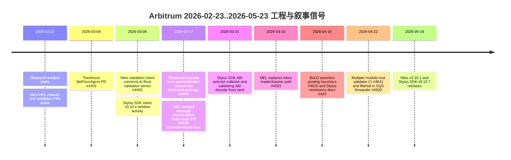
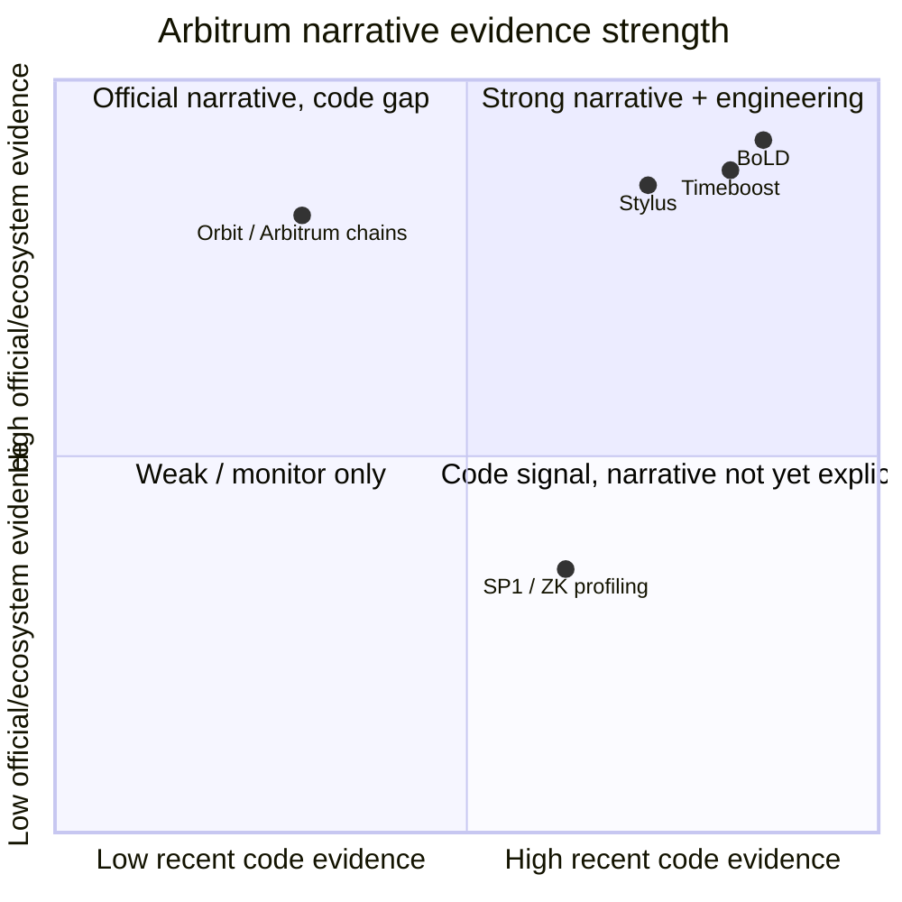
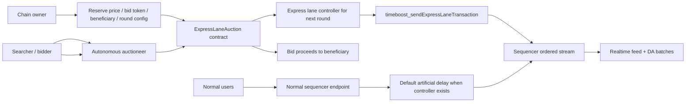
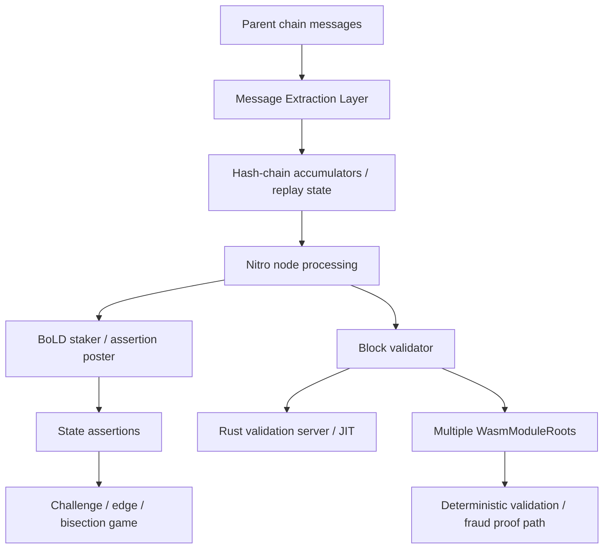
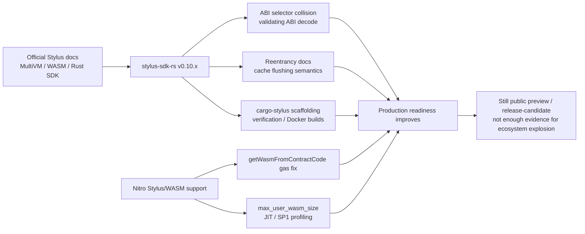
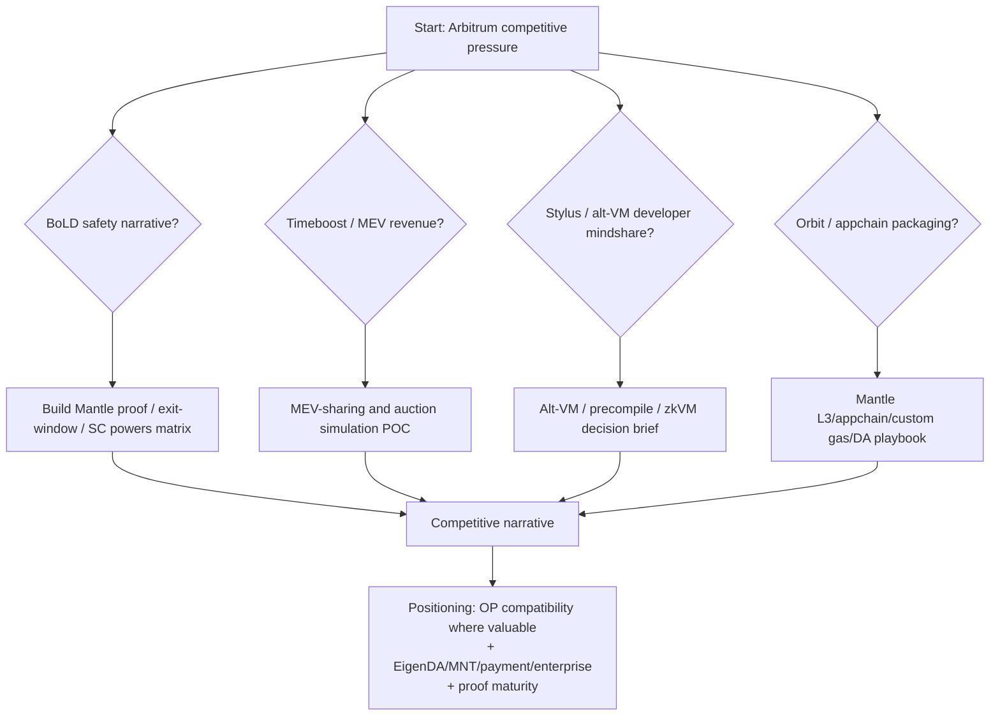

# Arbitrum 近期开发与叙事分析 - Final

## 1. Executive Summary

本轮研究的核心判断是：Arbitrum 近三个月的工程重心不是单一的 "Orbit 扩张" 或 "Stylus 爆发"，而是更偏底层安全、排序机制、验证路径与 SDK/DX 的组合推进。`OffchainLabs/nitro` 在 2026-02-23 至 2026-05-23 窗口内有 257 个 PR，其中 169 merged、22 open、66 closed；`OffchainLabs/stylus-sdk-rs` 有 44 个 PR，其中 31 merged、2 open、11 closed。Nitro PR 热区集中在 BoLD/MEL/validator、sequencer/filtered tx、Timeboost、Stylus/validation、SP1/profiling、release/CI；Stylus SDK 则明显进入 v0.10.x release hardening、ABI/security audit fix、cargo-stylus verification 与 scaffolding 修复阶段。

对 Mantle 来说，最重要的不是 PR 数量本身，而是 Arbitrum 叙事正在变成一个可组合技术栈：Stylus 提供多 VM / WASM 合约开发者心智，Timeboost 提供排序权市场和 chain-owner revenue 叙事，BoLD 提供 permissionless validation / Stage 1+ 安全叙事，Orbit/Arbitrum chains 提供 appchain/custom gas/AnyTrust/Alt-DA 配置叙事。这个组合对 OP Stack 系竞争者形成了多维压力：Optimism 讲 Superchain 标准化与互操作，Base 讲 Coinbase 分发与 Base-owned client/performance，Arbitrum 则讲可定制 Nitro stack、多语言合约、MEV 内生化和 permissionless fraud proof。

但证据强度必须分层：

- **BoLD**：高工程证据 + 高官方文档证据。近期 Nitro PR 包括 assertion posting heuristics、MEL/BoLD 兼容、WasmModuleRoot spawner、validator/JIT/CI 测试等；官方 docs 写明 BoLD 已在 Arbitrum One、Nova、Sepolia active，并支持 permissionless validation，但对自定义 Arbitrum chains 建议默认保持 permissioned validation。
- **Timeboost**：高工程证据 + 高官方文档证据。近期 Nitro PR 将 express lane service/tracker 移入 `timeboost` 包、增加 BidFloorAgent、express lane transaction logging；官方 docs 写明 Timeboost 已 live on Arbitrum One/Nova，Arbitrum chains 可选择采用，但对多数链仍是 alpha/not formally supported and usually not recommended unless there is substantial DeFi/MEV activity.
- **Stylus**：中高工程证据 + 高官方文档证据。`stylus-sdk-rs` v0.10.3 -> v0.10.7 连续 release，重点是 ABI selector collision、validating ABI decode、reentrancy docs、verification/reproducible Docker build、scaffolding fixes；Nitro 侧也有 gas charge、max_user_wasm_size、SP1 profiling 和 validator/JIT 相关 PR。官方 docs 仍把 Stylus 标为 public preview / release-candidate，所以不能写成完全稳定生态。
- **Orbit / Arbitrum chains**：低近期 Nitro 代码证据 + 高官方产品文档证据。窗口内没有直接命中 `Orbit` 标题的 Nitro PR；只有 AnyTrust、custom genesis / chain config、custom gas token、DA/DAC 相关邻近改动。Orbit narrative 主要由官方 Arbitrum chains docs、AnyTrust/custom gas token/DAC/BoLD/Timeboost adoption docs 和生态页面支撑；工程上应写为 "成熟产品化文档和配置面持续存在，但近三个月核心 Nitro PR 没有显示 Orbit 是最高强度开发主线"。

Mantle 的竞争启示：短期需要建立 Arbitrum PR/watchlist 和叙事 rebuttal，特别跟踪 BoLD/Stage 1、安全委员会/exit window、Timeboost auction、Stylus SDK releases 和 Orbit chain configuration；中期可以分别原型化 MEV-sharing/preconfirmation、L3/appchain/custom gas token、WASM/alt-VM developer funnel；长期要明确 Mantle 是继续强调 OP Stack compatibility + EigenDA/MNT/enterprise/payment，还是补出自己的 "多 VM / appchain / ordering market / proof maturity" 组合叙事。直接复制 Timeboost、Stylus 或 Orbit 都不稳妥，因为它们分别引入公平性/监管、VM 安全审计/工具链碎片化、appchain demand/bridge/ops 的成本。

## 2. Item Findings

### item-1: GitHub 活动基线、数据口径与 PR 分类方法

**研究窗口**：2026-02-23 至 2026-05-23。查询/验证日期为 2026-05-23。核心仓库为 `OffchainLabs/nitro` 与 `OffchainLabs/stylus-sdk-rs`。

**查询方法**

```shell
gh pr list --repo OffchainLabs/nitro --state all \
  --search 'created:2026-02-23..2026-05-23' \
  --limit 1000 \
  --json number,title,state,author,createdAt,mergedAt,closedAt,url,labels,baseRefName,headRefName,changedFiles,additions,deletions

gh pr list --repo OffchainLabs/stylus-sdk-rs --state all \
  --search 'created:2026-02-23..2026-05-23' \
  --limit 1000 \
  --json number,title,state,author,createdAt,mergedAt,closedAt,url,labels,baseRefName,headRefName,changedFiles,additions,deletions
```

**PR baseline**

| Repo | Created PR | Merged | Open | Closed unmerged | Earliest / latest created | Merge latency p50 / p75 / p90 |
|---|---:|---:|---:|---:|---|---|
| `OffchainLabs/nitro` | 257 | 169 | 22 | 66 | 2026-02-23 / 2026-05-17 | 1.37d / 5.07d / 11.02d |
| `OffchainLabs/stylus-sdk-rs` | 44 | 31 | 2 | 11 | 2026-03-06 / 2026-05-19 | 0.014d / 0.18d / 3.01d |

**周粒度趋势**

| Week | Nitro created / merged / open / closed | Stylus SDK created / merged / open / closed | 解读 |
|---|---|---|---|
| 2026-W09 | 18 / 15 / 1 / 2 | 0 / 0 / 0 / 0 | Nitro 窗口启动，MEL/validator 工作已在推进 |
| 2026-W10 | 38 / 29 / 0 / 9 | 1 / 1 / 0 / 0 | Nitro 高峰；Timeboost BidFloorAgent、Rust validator、AnyTrust fix 等进入 |
| 2026-W11 | 28 / 22 / 3 / 3 | 15 / 8 / 0 / 7 | Stylus SDK 出现安全/工具链 PR 密集期 |
| 2026-W12 | 31 / 23 / 1 / 7 | 3 / 3 / 0 / 0 | Nitro MEL/hash-chain、Timeboost port 延续 |
| 2026-W13 | 35 / 27 / 2 / 6 | 0 / 0 / 0 / 0 | Nitro 继续高强度；MEL/JIT/validation PR 大量合并 |
| 2026-W14 | 25 / 18 / 0 / 7 | 6 / 6 / 0 / 0 | Stylus v0.10.3/v0.10.4 release；Nitro MEL transition |
| 2026-W15 | 31 / 15 / 5 / 11 | 4 / 4 / 0 / 0 | BoLD/MEL open PR 增多；Stylus reentrancy docs |
| 2026-W16 | 22 / 9 / 3 / 10 | 3 / 3 / 0 / 0 | Nitro release/CI/filtered tx；Stylus v0.10.5 |
| 2026-W17 | 19 / 8 / 1 / 10 | 0 / 0 / 0 / 0 | Nitro SP1 profiling、AnyTrust open fix |
| 2026-W18-W20 | 10 / 3 / 6 / 1 | 12 / 6 / 2 / 4 | Nitro PR 创建明显减少；Stylus v0.10.6/v0.10.7 |

**作者集中度**

| Repo | Top authors in window | 结构信号 |
|---|---|---|
| `nitro` | `pmikolajczyk41` 60, `joshuacolvin0` 42, `bragaigor` 30, `ganeshvanahalli` 22, `MishkaRogachev` 18, `mahdy-nasr` 15, `app/dependabot` 14 | Offchain Labs core contributors 主导；bot/deps 占比可见但不是主导 |
| `stylus-sdk-rs` | `rory-ocl` 23, `joshuacolvin0` 12, `app/dependabot` 6 | Release 与 SDK hardening 高度集中，说明仓库更像产品 SDK release train |

**标题关键词分类只作为热区 proxy，不能等同最终功能归因**

| Category | Nitro title hits | Stylus SDK title hits | 证据解释 |
|---|---:|---:|---|
| BoLD / assertion / challenge / validator / MEL | 37 | n/a | Nitro 近期最高信号之一；与 validator、MEL、WasmModuleRoot、assertion posting 重叠 |
| Timeboost / express lane / auction / bid | 4 | n/a | 数量少但都是高信号 merged PR，直接落在 `timeboost/` |
| Stylus / WASM / gas / precompile / validation | 38 | 44 total repo | Nitro 和 SDK 双侧推进；SDK 侧更多 release/security/DX |
| Orbit / AnyTrust / DAS / custom genesis / chain config | 7 | n/a | 没有直接 Orbit title hit；只有 AnyTrust / genesis / serialized chain config 邻近证据 |
| Sequencer / batch / filtered tx / delayed inbox / MEL | 48 | n/a | Nitro 节点/排序/消息抽取重构主线 |
| SP1 / ZK / prover / profiling | 30 | n/a | 说明证明/重放/profiling 也在推进，但不是本研究主叙事 |
| Release / CI / deps / Docker / SBOM | 53 | 11 | 两仓都有 release hardening，Stylus SDK release cadence 更集中 |
| ABI / selector / decode | n/a | 5 | SDK 安全性和 Solidity/EVM 兼容边界 |
| Verification / audit / reentrancy / path security | n/a | 9 | v0.10.x 生产可用性修补信号 |

**代表 PR 选择规则**

本 draft 没有强行让每个叙事类别拥有同等数量代表 PR。优先选取：merged 状态、高信号路径、PR body 有动机说明、文件路径可验证、与官方 docs 形成双证据链、对 Mantle 决策有直接意义的 PR。Orbit 部分则明确报告低代码证据，使用官方 Arbitrum chains/AnyTrust/custom gas token/BoLD/Timeboost docs 支撑产品叙事，并降低信心。

### item-2: Nitro 核心协议与节点架构开发方向

Nitro 近期的核心工程方向可以拆成五条主线：MEL/消息抽取层替换旧 inbox reader/tracker、BoLD/validator hardening、Timeboost 模块化、Stylus/validation compatibility、release/CI/ops。它不像 Optimism 近期 op-reth/EOL 那样表现为客户端迁移，也不像 Base 那样集中于单链性能产品，而是围绕 Nitro 自身的 fraud proof、sequencer/message pipeline 和 appchain configuration 面做持续硬化。

**代表 PR 与架构影响**

| PR | 状态 | 目录/文件 | 架构影响 |
|---:|---|---|---|
| [#4593](https://github.com/OffchainLabs/nitro/pull/4593) `[MEL] Use message extractor to completely replace inbox reader and tracker code` | merged 2026-04-10 | `arbnode/inbox_reader.go`, `arbnode/inbox_tracker.go`, `arbnode/mel/*`, many system tests | 高。MEL 直接替换旧 inbox reader/tracker dependency，影响节点处理 parent-chain messages 的路径 |
| [#4520](https://github.com/OffchainLabs/nitro/pull/4520) `[MEL] Change delayed msg accumulation from merkle tree to hash-chain` | merged 2026-04-02 | `arbnode/mel/*`, `mel-replay/*` | 高。delayed message accumulator 从 merkle partials 转为 hash-chain，减少状态和升级复杂度 |
| [#4597](https://github.com/OffchainLabs/nitro/pull/4597) `Enable transitioning of node to using MEL when previously ran with Inbox Reader-Tracker` | merged 2026-04-14 | `arbnode/db/schema`, `arbnode/mel/runner`, `arbnode/node.go`, `execution/gethexec` | 高。支持已有节点从旧路径迁移到 MEL，且 PR body 明确旧方式不能重启 |
| [#4434](https://github.com/OffchainLabs/nitro/pull/4434) `Coordinate the Block and MEL Validators` | merged 2026-03-02 | `staker/*`, `arbnode/mel/*`, `system_tests/message_extraction_layer_validation_test.go` | 高。MEL validator 与 block validator 协调，影响 validation pipeline |
| [#4450](https://github.com/OffchainLabs/nitro/pull/4450) `Nitro validation client connects to the Rust validation server` | merged 2026-03-06 | `crates/validator`, `system_tests/rust_validation_test.go` | 中高。Go/Nitro validation client 与 Rust validation service 互通 |
| [#4565](https://github.com/OffchainLabs/nitro/pull/4565) `Enable JIT validation for MEL` | merged 2026-04-06 | `crates/jit`, `crates/validation`, `validator/server_jit` | 中高。MEL 字段进入 JIT validation |
| [#4631](https://github.com/OffchainLabs/nitro/pull/4631) `Add CI tests for multiple module roots for Validator` | merged 2026-04-22 | `.github/workflows/_validation-tests.yml`, `scripts/extract-dockerfile-module-roots.sh` | 中。多 Wasm module root validation CI，支持历史/新机器根兼容 |
| [#4620](https://github.com/OffchainLabs/nitro/pull/4620) `Add SQS integration and report forwarder for filtered transactions` | merged 2026-04-22 | `cmd/filtering-report`, `util/sqsclient` | 中。filtered transaction observability / external reporting |
| [#4637](https://github.com/OffchainLabs/nitro/pull/4637) `Replace Genesis.Config with serialized chain config` | merged 2026-04-15 | `cmd/genesis-generator`, `cmd/nitro/init`, `go-ethereum` submodule | 中。chain config/genesis path hardening；对 Orbit/appchain 间接相关 |

**Release engineering**

`gh release list --repo OffchainLabs/nitro` 显示窗口内 release cadence 很密：v3.9.6、v3.9.7、v3.9.8、v3.9.9、v3.10.0、v3.10.1 以及多版 v3.10.0-rc、consensus-v60 alpha/rc。最新 Nitro release 快照为 `Arbitrum Nitro v3.10.1`（2026-05-19）。这说明 Nitro 不是只在 feature branch 上开发，而是有持续发布和 backport/RC 轨道。

**Mantle 映射**

- 可借鉴：MEL 这种把 L1/L2 message extraction 从旧 reader/tracker 路径重构为更确定的 validation/replay surface，对任何 rollup 客户端都有工程参考价值；multi-module-root validator CI、JIT validation、filtered-tx reporting 也适合纳入 Mantle 节点可靠性 watchlist。
- 难迁移：BoLD/MEL/validator 许多设计与 Nitro fraud proof、WASM module root、Arbitrum rollup contracts 强绑定，不能直接套到 OP Stack/Mantle fork。
- 需要跟踪：Nitro release notes、v3.10.x consensus-v60/ArbOS 方向、SP1 profiling 是否从实验转向正式 proving roadmap。

### item-3: Stylus WASM 智能合约生态与 `stylus-sdk-rs` 进展

Stylus 的近期证据更像 "public preview 到更可用 SDK/DX 的 hardening"，不是生态突然爆发。官方 docs 明确 Stylus 允许 Rust/C/C++ 等可编译到 WASM 的语言写 EVM-compatible 合约，EVM 与 WASM 合约可以互相调用，WASM VM 是 coequal second VM；但 docs 也保留 `release-candidate` / `public preview` 语义。

**SDK / CLI release cadence**

| Release | Date | PR 证据 |
|---|---|---|
| v0.10.3 | 2026-04-08 | [#418](https://github.com/OffchainLabs/stylus-sdk-rs/pull/418) |
| v0.10.4 | 2026-04-09 | [#423](https://github.com/OffchainLabs/stylus-sdk-rs/pull/423) |
| v0.10.5 | 2026-04-16 | [#426](https://github.com/OffchainLabs/stylus-sdk-rs/pull/426) |
| v0.10.6 | 2026-05-16 | [#433](https://github.com/OffchainLabs/stylus-sdk-rs/pull/433) |
| v0.10.7 | 2026-05-19 | [#438](https://github.com/OffchainLabs/stylus-sdk-rs/pull/438) |

**高信号 SDK PR**

| PR | 状态 | 文件/路径 | 含义 |
|---:|---|---|---|
| [#401](https://github.com/OffchainLabs/stylus-sdk-rs/pull/401) `detect ABI selector collisions at compile time` | merged 2026-03-30 | `stylus-proc/src/macros/public/*`, fail tests | 合约 ABI safety：同一 public block 内 selector collision 编译时报错，减少 runtime ambiguity |
| [#415](https://github.com/OffchainLabs/stylus-sdk-rs/pull/415) `Use validating ABI decode variants (audit L-12)` | merged 2026-03-31 | `stylus-proc`, `stylus-sdk/src/abi/mod.rs` | 安全修复：改用 validating ABI decode，拒绝 trailing bytes |
| [#424](https://github.com/OffchainLabs/stylus-sdk-rs/pull/424) `deprecate reentrant feature flag and rewrite reentrancy docs` | merged 2026-04-16 | `stylus-core`, `stylus-proc`, `stylus-sdk` docs | 安全语义修正：强调 storage cache flushing，而不是一刀切 reentrant guard |
| [#416](https://github.com/OffchainLabs/stylus-sdk-rs/pull/416) `Fix cargo stylus new scaffolding and improve smoke test` | merged 2026-03-31 | `cargo-stylus`, `stylus-tools`, smoke tests | DX 修复：新项目 scaffolding、lockfile、local SDK development |
| [#430](https://github.com/OffchainLabs/stylus-sdk-rs/pull/430) `Fixes for verification arising from cargo-stylus merge` | merged 2026-05-15 | `Dockerfile`, `cargo-stylus deploy/verify`, reproducible build | verification / reproducible Docker build 默认行为，影响 Arbiscan/contract verification UX |
| [#411](https://github.com/OffchainLabs/stylus-sdk-rs/pull/411) `send transaction in codehash-keepalive instead of read-only call` | merged 2026-03-19 | `stylus-tools/src/ops/codehash_keepalive.rs` | 生产可用性修复：原命令只做 read-only simulation，没有实际延长 codehash TTL |

**Nitro 侧 Stylus / WASM / validation 相关 PR**

| PR | 状态 | 含义 |
|---:|---|---|
| [#4546](https://github.com/OffchainLabs/nitro/pull/4546) `fix gas charge of getWasmFromContractCode` | merged 2026-03-23 | ArbOS precompile gas charge 修复 |
| [#4476](https://github.com/OffchainLabs/nitro/pull/4476) `Handle missing max_user_wasm_size` | merged 2026-03-06 | Rust validation side 对 Go JSON omitempty 行为兼容 |
| [#4679](https://github.com/OffchainLabs/nitro/pull/4679) `SP1 profiling infrastructure` | merged 2026-04-29 | 记录 transfer/solidity/stylus/stylus_heavy/mixed block profiles；说明 WASM/Stylus workloads 是 proving/profiling 关注对象 |

**成熟度判断**

- 安全与 ABI：`selector collision`、validating ABI decode、reentrancy docs、OpenZeppelin audit reports 共同显示 SDK 在补 contract developer footguns。
- Tooling：`cargo stylus new`、verification、Docker reproducible builds、codehash keepalive 修复说明 "能部署、能验证、能保持 callable" 是当前重点。
- 生态：官方 docs 指向 Awesome Stylus、Stylus Saturdays、Telegram/Discord；这是生态培育信号，但本 draft 没有抓取足够链上部署/TVL/active contracts 数据，不能写成 "Stylus 生态爆发"。
- 公共预览：官方 docs `Public preview: what to expect` 仍提示 early and often、public preview、release-candidate，所以生产采用结论必须保守。

**Mantle 含义**

Stylus 对 Mantle 的威胁不是短期夺走 Solidity 开发者，而是打开了非 Solidity / Rust / C/C++ / compute-heavy contracts 的叙事空间。如果 Mantle 回应，应先做开发者 funnel 和可验证 POC：EVM+precompile/alt-VM/zkVM/Wasmtime-based coprocessor 哪条路线都需要安全审计、ABI/bridge/tooling、debugger、verification、gas metering 和 examples。直接复制 WASM VM 会带来非常高的 VM 安全和工具链成本。

### item-4: Orbit L3 / AnyTrust 生态扩展与应用链叙事

该项必须从 guardrail 出发：窗口内 Nitro PR 没有直接 `Orbit` 标题命中。标题关键词中 `orbit|anytrust|DAS|custom da|native token|chain info|init message|genesis` 只得到 7 条，其中真正高信号的是 AnyTrust / chain config / genesis 邻近改动，而不是 Orbit product 的新功能 PR。

**近期 Nitro 邻近证据**

| PR | 状态 | 类别 | 解读 |
|---:|---|---|---|
| [#4517](https://github.com/OffchainLabs/nitro/pull/4517) `Handle too-short AnyTrust batches as empty batches` | merged 2026-03-18 | AnyTrust reliability | AnyTrust batch edge case hardening |
| [#4636](https://github.com/OffchainLabs/nitro/pull/4636) `AnyTrust: preserve recorded keyset-tree preimages on discarded batches` | open | AnyTrust validator determinism | PR body 明确 invalid-data batch may stall validation / assertion confirmation / withdrawals；未合并，只能作 active issue signal |
| [#4637](https://github.com/OffchainLabs/nitro/pull/4637) `Replace Genesis.Config with serialized chain config` | merged 2026-04-15 | chain config/genesis | 对 appchain/Orbit-style deployment 间接有用，但不是 Orbit feature |
| [#4650](https://github.com/OffchainLabs/nitro/pull/4650) `Do not set init.empty to true when init.genesis-json-file is set` | merged 2026-04-16 | init/genesis | 部署/初始化 hardening |

**官方产品文档证据**

Arbitrum docs 已经把 "Arbitrum chains" 定义为 using Arbitrum Nitro codebase 的可部署、可配置链；功能表包括 dedicated throughput、EVM+、custom gas token、Rollup/AnyTrust/Alt-DA、BoLD、Timeboost、governance、force inclusion 等。AnyTrust docs 描述 DAC/DAS、keyset threshold、lower fee / higher throughput tradeoff；custom gas token docs 描述 AnyTrust 和 Rollup 模式下 ERC-20 gas token 要求、fee handling、L2/L3 限制；DAC docs 给出 chain owner 和 DAC member 的配置清单。

**结论：低代码证据，不等于低产品叙事**

| 维度 | 证据等级 | 判断 |
|---|---|---|
| 近三个月 Nitro Orbit feature PR | 低 | 未找到直接 Orbit title hit；仅 AnyTrust/genesis/config 邻近 |
| 官方 docs / product surface | 高 | Arbitrum chains/Orbit 文档已覆盖 DA、custom gas、BoLD、Timeboost、deployment 和 maintenance |
| 生态采用 / chain listing | 中低 | 本轮没有完整抓取官方 ecosystem/portal/onchain data；只能说 Orbit narrative 存在，不能量化新增链/TVL |
| 与 Superchain 竞争 | 中 | Arbitrum docs 强调 deployable configurable chains；Optimism 研究显示 Superchain 强调 shared standardization / interop。差异成立，但 Orbit 近期工程强度不应夸大 |

**Mantle 含义**

Orbit 对 Mantle 的启示主要在 product packaging：appchain/L3/custom gas token/DA choice/chain owner economics，而不是近期 Nitro PR 强度。Mantle 如果讲 L3/enterprise/appchain，必须补 "部署 playbook + DA/bridge/ops + custom gas + governance + monitoring + economic model"，不能只复用 Orbit 叙事标签。

### item-5: Timeboost 拍卖机制、排序权市场与 MEV 叙事

Timeboost 是本轮中证据链最完整的叙事之一。代码上，Nitro 近期有 4 条高信号 Timeboost/express lane/auction PR；官方 docs 上，Timeboost gentle introduction 和 Arbitrum chains adoption guide 明确说明它是 transaction ordering policy，而不是 "用户无 MEV" 的万能保护。

**代码证据**

| PR | 状态 | 文件 | 含义 |
|---:|---|---|---|
| [#4456](https://github.com/OffchainLabs/nitro/pull/4456) `Add support to timeboost auctioneer for BidFloorAgent` | merged 2026-03-06 | `timeboost/auctioneer.go`, `cmd/autonomous-auctioneer/config.go`, tests | auctioneer 支持 bid floor agent，直接关系 reserve/min bid 策略 |
| [#4484](https://github.com/OffchainLabs/nitro/pull/4484) `Move express lane service and tracker from gethexec to timeboost package` | merged 2026-03-17 | `timeboost/express_lane_service.go`, `express_lane_tracker.go`, `contract_adapter.go`, `config.go` | 架构信号强：Timeboost 从 geth execution layer 解耦成 self-contained package |
| [#4512](https://github.com/OffchainLabs/nitro/pull/4512) `Port - Add support to timeboost auctioneer for BidFloorAgent (#4456)` | merged 2026-03-20 | port PR | release branch/backport 信号 |
| [#4588](https://github.com/OffchainLabs/nitro/pull/4588) `Log submitted express lane transactions like eth_sendRawTransaction` | merged 2026-04-07 | express lane tx logging | observability / RPC behavior alignment |

**官方机制说明**

Arbitrum docs 将 Timeboost 定义为 transaction ordering policy：offchain auction 决定每轮 express lane controller；默认 round duration 60s，auction closes 15s before round；非 express lane tx 在有 controller 的 round 默认加 200ms artificial delay；express lane controller 只是获得 temporary time advantage，不能重排交易、不能保证 top-of-block、不能保证利润。Arbitrum chains adoption guide 同时提示 Timeboost 对大多数链不推荐，除非有 substantial DeFi / MEV activity，因为 auctioneer 运营成本、用户体验延迟、收益不确定。

**叙事拆分**

| 语义 | 可写结论 | 不应写成 |
|---|---|---|
| 排序机制 | Modified FCFS ordering policy with express lane auction | 完全去中心化排序或公平排序已解决 |
| MEV capture | Chain owner 可捕获部分 MEV / bid proceeds | 最终用户完全免受所有 MEV |
| 用户保护 | Private mempool + limited temporary advantage 减少 front-running/sandwich 风险 | 无 MEV、无搜索者优势 |
| 收入 | Bids can be paid in ERC-20 and beneficiary configurable | 收入确定、所有链都适合 |
| 应用链配置 | Arbitrum chains 可选择采用、配置 auction contract/auctioneer/sequencer | 默认所有 Orbit/Arbitrum chains 都应启用 |

**Mantle 含义**

Timeboost 值得 Mantle 做机制研究和 POC，特别是排序权拍卖、MEV-sharing、sequencer revenue、preconfirmation/express lane、wallet/RPC disclosure；但不应直接复制。风险包括 searcher capture、公平性叙事、非 express lane 用户感知变差、监管/拍卖收入归属、链上收益如何分配给 DAO/应用/用户。更稳妥路线是先做 "透明 MEV dashboard + preconfirmation UX + optional auction simulation"，再决定是否进入生产排序策略。

### item-6: BoLD 争议协议、permissionless validation 与 Stage 1 安全叙事

BoLD 在本轮证据中呈现为 "已上线后的 hardening + MEL/validator/validation compatibility 继续推进"。官方 docs 写明 BoLD active on Arbitrum One, Arbitrum Nova, Arbitrum Sepolia，目标是 permissionless validation、bounded delay 和 improved withdrawal security；同时对自定义 Arbitrum chains 明确建议 upgrade to BoLD but keep validation permissioned，且 BoLD for L3s not yet supported at the time of writing。

**近期工程证据**

| PR | 状态 | 文件/路径 | 解读 |
|---:|---|---|---|
| [#4615](https://github.com/OffchainLabs/nitro/pull/4615) `Improve Assertion Posting Heuristics` | merged 2026-04-16 | `bold/assertions/poster.go`, catchup tests | assertion poster 持续推进 assertion chain，修复 swallowed errors / context cancellation |
| [#4680](https://github.com/OffchainLabs/nitro/pull/4680) `[MEL] Support Posting and Watching Post-MEL Assertions in BoLD` | open | `bold/*`, `staker/*`, `validator/*` | open PR；显示 post-MEL assertion path 正在做 BoLD 适配 |
| [#4647](https://github.com/OffchainLabs/nitro/pull/4647) `BoLD state provider selects spawner by WasmModuleRoot` | open | `staker/bold/bold_state_provider.go`, `stateless_block_validator.go` | open PR；多 WasmModuleRoot / spawner 选择，影响历史/新 validation root |
| [#4487](https://github.com/OffchainLabs/nitro/pull/4487) `Fix bold StopWaiter lifecycle` | merged 2026-03-13 | BoLD lifecycle | reliability |
| [#4631](https://github.com/OffchainLabs/nitro/pull/4631) `Add CI tests for multiple module roots for Validator` | merged 2026-04-22 | validation CI | 支持 BoLD / validation 多 module root |
| [#4434](https://github.com/OffchainLabs/nitro/pull/4434) `Coordinate the Block and MEL Validators` | merged 2026-03-02 | `staker`, `mel_validator` | BoLD/MEL validation surface |

**官方治理/安全边界**

BoLD docs 关键点：

- former protocol used allowlisted validators; BoLD enables anyone to challenge and defend state assertions on supported chains.
- disputes are time bounded；docs 给出 equivalent to two challenge periods plus Security Council grace period 等口径。
- proposer/challenge bonding is material: Arbitrum One docs 使用 WETH bond，讨论 resource exhaustion、bonding pools、reimbursements、defender bounty、DAO treasury。
- Arbitrum chains adoption guide 强烈建议非 Arbitrum One/Nova/Sepolia 的链先 keep validation permissioned，因为 permissionless mode 有 resource exhaustion、liveness/delay、infra cost 风险。

**L2Beat / Stage 语义 caveat**

官方 BoLD docs 将 BoLD 连接到 L2Beat Stage 2 aspiration，但本 draft 没有在当前轮完整抓取 L2Beat live risk page 并核对 every risk gate。应保守写法：BoLD 强化 Arbitrum 的 Stage 1/Stage 2 安全叙事和 permissionless validation 方向，但不能把 "BoLD active" 自动等同 "所有 Stage 2 条件已满足"。

**Mantle 映射**

- 对 Mantle 的压力：用户安全叙事会比较 "是否 permissionless validation / fraud proofs live / challenge period bounded / exit window clear"。
- 可借鉴：validator UX、watchtower/proposer distinction、bonding pool 叙事、challenge monitoring、resource-exhaustion risk docs、Security Council grace period disclosure。
- 不可直接迁移：BoLD 的 assertion/edge/bisection/one-step proof、WASM module root、Nitro contracts 强绑定。Mantle 若走 OP Stack fault proof、ZK/OP Succinct 或 EigenDA+validity route，必须重建自己的安全论证。

### item-7: 开发活跃度趋势与工程组织信号

`nitro` 在 3 月初至 4 月中旬保持高活动，4 月下旬至 5 月中旬创建 PR 减少；这更像一个 release/hardening wave 的尾部，而不是开发停止。`stylus-sdk-rs` 的活动呈 release train 特征：多个 release PR 很快合并，重大安全/DX PR 出现在 3 月中下旬和 5 月中旬。

**活动结构**

| 信号 | Nitro | Stylus SDK |
|---|---|---|
| PR 总量 | 257 | 44 |
| 合并率 | 169/257 = 65.8% | 31/44 = 70.5% |
| p50 merge latency | 1.37 天 | 0.014 天，很多 release bump 几分钟合并 |
| 大 PR | #4520 1071 additions / 1392 deletions；#4597 1312 additions；#4593 838 additions / 481 deletions | #401 796 additions；#416 204 additions；#430 133 additions |
| 模块集中度 | MEL/validator/BoLD/Timeboost/filtered tx/release | release/ABI/security/cargo-stylus/verifier |
| 外部贡献者 | 少量可见，如 `uprotocore`, `tomsdy`, `Shresth79`, `js360000`; core contributors 主导 | 极集中在 OCL authors |

**叙事事件与代码支撑**

| 叙事 | 工程支撑 | 官方/生态支撑 | Confidence |
|---|---|---|---|
| BoLD permissionless validation | Strong: BoLD/MEL/validator PRs | Strong: BoLD docs/adoption docs | high |
| Timeboost ordering market | Strong: `timeboost/` PRs | Strong: Timeboost docs/adoption docs | high |
| Stylus maturity | Medium-high: SDK releases/security/DX + Nitro fixes | Strong: Stylus docs, audit reports, examples | medium-high |
| Orbit expansion | Low recent Nitro direct PR evidence | Strong docs, weaker current ecosystem data in this pass | medium narrative, low engineering-current |
| ZK/SP1/profiling | Medium: SP1 profiling PRs | Weak in official narrative for this scope | inference / monitor |

**与 Optimism/Base 的可比口径**

既有内部研究显示 Optimism monorepo PR 量远高于 Nitro，但 OP Stack monorepo 是多组件上游控制面；Base 近期样本达到 GitHub CLI 1000 PR cap，但 Base codebase/release 模式和 PR 粒度不同。不能只用绝对 PR 数比较。更可比的判断是：Optimism 的叙事从 OP Stack 维护转向 Superchain interop + op-reth/Kona；Base 转向 Base-owned client + Flashblocks/Beryl；Arbitrum 转向 Nitro hardening + Stylus + Timeboost + BoLD + configurable chains。

### item-8: 叙事变化：Stylus + Orbit + Timeboost + BoLD 的组合定位

Arbitrum 的近期叙事可以总结为 "多 VM + 可定制 appchain + 排序权市场 + permissionless fraud proof"。其中前三者服务增长/开发者/链 owner，BoLD 服务安全/去中心化/withdrawal trust。

**叙事矩阵**

| Narrative | Code evidence | Official / governance / ecosystem evidence | Status | Caveat |
|---|---|---|---|---|
| Stylus: multi-language / WASM smart contracts | `stylus-sdk-rs` v0.10.x releases; #401/#415/#424/#430/#416; Nitro #4546/#4476 | Arbitrum Stylus docs, public preview docs, audit reports | public preview / release-candidate hardening | 不能写成完全 stable 或广泛主网采用 |
| Orbit / Arbitrum chains: configurable appchains | weak recent Nitro direct Orbit evidence; AnyTrust/genesis/config PRs | Arbitrum chains docs, AnyTrust/DAC/custom gas token docs, chain SDK docs | productized docs / deployment surface | 近期 code velocity 不能夸大；ecosystem metrics 未完整抓取 |
| Timeboost: ordering rights / MEV capture | #4456/#4484/#4512/#4588 | Timeboost docs + chain adoption guide | live on One/Nova; alpha for custom chains | 不是无 MEV、公平排序已解决 |
| BoLD: permissionless validation / bounded disputes | #4615/#4680/#4647/#4434/#4631 | BoLD docs + adoption guide + audit docs | active on One/Nova/Sepolia; generally available for L2s | L3 not supported; custom chains recommended permissioned |

**与 Optimism Superchain 的竞争不是同一维度**

- Optimism/Superchain：shared governance, registry, interop, standardization, op-supernode / dependency set。适合多链共同标准和流动性/消息互操作叙事。
- Arbitrum/Orbit：deployable configurable chain, custom gas token, AnyTrust/Alt-DA, chain owner economics, optional Timeboost/BoLD。适合 appchain/L3/enterprise/custom stack 叙事。
- Base：Coinbase distribution, Base-owned client/performance, Flashblocks, asset/payment product surface。适合产品化和分发叙事。
- Mantle：若只讲 "OP Stack + EigenDA + MNT"，会缺少 Arbitrum 这种组合式技术叙事和 Base 的产品分发叙事。

### item-9: 与 Optimism Superchain / Base Stack / Mantle 的竞争对比

| 维度 | Arbitrum | Optimism / Superchain | Base | Mantle 当前可防守点 |
|---|---|---|---|---|
| 技术栈 | Nitro / WASM fraud proof / Stylus MultiVM / BoLD / Timeboost | OP Stack / op-reth / Kona / op-supernode / Superchain Registry | Base-owned Reth/consensus, Flashblocks, Multiproof/Beryl from internal research | OP Stack compatibility, EigenDA/DA strategy, MNT economics |
| 生态扩张 | Arbitrum chains / Orbit, AnyTrust, custom gas, chain owner governance | Superchain shared standardization and interop | Coinbase distribution and Base Stack | Enterprise/payment/appchain narrative can combine DA+MNT |
| MEV / latency / ordering | Timeboost express lane auction; FCFS modified by 200ms delay for non-express lane | Interop and preconfirm work; not same auction narrative | Flashblocks low-latency pending state | Can study preconfirmation + MEV-sharing without committing auction |
| 安全与去中心化 | BoLD active on One/Nova/Sepolia; permissionless validation narrative | Cannon/Kona fault proof and Superchain governance | TEE/ZK Multiproof direction | Need Stage 1 / proof / exit window / Security Council narrative clarity |
| Developer mindshare | Stylus Rust/C/C++/WASM + EVM interop | Solidity/EVM + OP Stack compatibility | Coinbase tooling/wallet/onramp/paymaster | Need better tooling and public benchmarks |
| Product packaging | Optional BoLD/Timeboost/custom gas/AnyTrust/docs | Shared network / governance / interop | Coinbase product rails | Can package "DA + MNT + appchain + payment/enterprise" more coherently |

**Competitive interpretation**

Arbitrum 的独特压力在于它不是单一 tradeoff。Stylus 攻击开发者语言栈；BoLD 攻击安全/去中心化叙事；Timeboost 攻击 sequencer revenue / MEV / appchain economics；Orbit/Arbitrum chains 攻击 appchain/custom stack 市场。Mantle 如果只回应其中一个点，会显得被动。更好的回应是按层拆解：

1. 安全：Mantle 的 Stage 1 / fraud proof / ZK / Security Council / exit window 路线图必须能和 BoLD 叙事同台比较。
2. 经济：Mantle 需要有自己的 sequencer revenue / MEV transparency / DA cost / MNT gas/economics 叙事。
3. 开发者：Mantle 不一定复制 Stylus，但要说明为什么 EVM compatibility + chosen extensions 更符合目标场景。
4. Appchain/enterprise：Mantle 若要讲 L3/enterprise/payment，需要给出部署、DA、bridge、ops、custom gas、governance 的完整 playbook。

### item-10: 对 Mantle 的竞争启示与行动建议

**必须跟踪 / 防守**

| Watch item | Why it matters | Evidence level | Immediate action |
|---|---|---|---|
| BoLD / permissionless validation / Stage rhetoric | 用户安全、提款、去中心化、L2Beat risk pie 都会被拿来比较 | code + official docs | 建 Mantle Stage 1/Stage 2 narrative matrix：proof status、challenge period、exit window、SC powers |
| Timeboost / ordering-right auction | 影响 sequencer revenue、MEV、应用链商业模式 | code + official docs | 做 mechanism memo：auction, preconfirmation, MEV-sharing, RPC transparency |
| Stylus v0.10.x SDK hardening | 非 Solidity 开发者和 compute-heavy 合约叙事 | SDK PR + docs | 做 alt-VM decision brief：EVM precompile / zkVM / WASM VM / coprocessor |
| Orbit / AnyTrust / custom gas token | appchain/enterprise/custom gas/DA 竞争 | official docs, low recent Nitro code | 做 Mantle appchain packaging：DA, bridge, gas token, ops, governance, monitoring |
| Nitro MEL/validator/SP1 profiling | 客户端和 proving hardening | code evidence | 跟踪 Nitro release notes 和 PRs；筛出可迁移 reliability practices |

**可借鉴设计**

1. Stylus：不要直接复制 VM，先借鉴 "SDK examples + verification + audit findings + public preview docs + release cadence" 的开发者 funnel。
2. Orbit：借鉴部署 playbook、custom gas token、DA/DAC、RaaS guidance、chain owner governance，而不是只宣传 L3。
3. BoLD：借鉴 permissionless validation 文档化、watchtower/proposer distinction、bonding pool/reimbursement、resource exhaustion risk disclosure。
4. Timeboost：借鉴 express lane / auction 机制设计和收益透明度，先做模拟和 dashboard。
5. Nitro release discipline：借鉴 dense changelog、RC release、CI hardening、module-root compatibility tests。

**需要谨慎验证或不宜照搬**

| Design | Risk |
|---|---|
| 直接复制 Timeboost auction | 可能引入 searcher capture、公平性争议、用户 200ms 延迟感知、监管/收益归属问题 |
| 直接引入 WASM VM | VM sandbox、gas/ink metering、ABI compatibility、audits、verification、debugger、tooling成本极高 |
| 复制 Orbit/L3 narrative | 如果没有明确 appchain demand、bridge/ops/DA 能力，会变成空泛叙事 |
| 将 BoLD 经验外推到 OP Stack/ZK | BoLD 与 Nitro contracts/WASM fraud proof 强绑定，不能直接成为 Mantle 安全保证 |
| 用 PR 数量做竞品强弱判断 | monorepo 粒度、release branch、bot/deps、small PR style 差异太大 |

**短中长期行动**

| Timeframe | Action | Output |
|---|---|---|
| 0-4 周 | 建 Arbitrum evidence dashboard | Nitro/Stylus SDK PR watchlist、BoLD/Timeboost/Stylus/Orbit source tracker、weekly deltas |
| 0-4 周 | 安全叙事对照 | Mantle vs Arbitrum BoLD vs OP fault proof: proof status, validator permissioning, exit window, SC powers |
| 1-3 个月 | Timeboost / MEV-sharing POC | Auction simulation, preconfirm/express lane UX mock, revenue/fairness risk memo |
| 1-3 个月 | Appchain/custom gas token playbook | Mantle L3/enterprise deployment template: DA, bridge, gas token, governance, monitoring |
| 1-6 个月 | Developer tooling response | Precompile/zkVM/WASM/coprocessor choice memo; examples + verification + audit plan |
| 6-12 个月 | Long-term positioning | "OP compatibility where valuable + EigenDA/MNT/payment/enterprise + proof maturity" coherent roadmap |

## 3. Diagrams

### diag-1: 近三个月关键事件时间线



### diag-2: 叙事证据强度矩阵



### diag-3: Timeboost 机制拆解



### diag-4: BoLD / MEL / validator engineering surface



### diag-5: Stylus maturity path



### diag-6: Mantle action matrix



## 4. Source Coverage

| Source requirement | Coverage | Evidence used | Gap / caveat |
|---|---|---|---|
| GitHub PR data: `OffchainLabs/nitro` | Good | 257 PR metadata cache from `gh pr list`; representative `gh pr view` for #4456, #4484, #4512, #4588, #4615, #4680, #4647, #4434, #4450, #4520, #4597, #4593, #4565, #4631, #4517, #4636, #4637, #4546, #4476, #4679, #4620 | `gh pr list` returns PRs in window; category counts are title regex and overlapping |
| GitHub PR data: `OffchainLabs/stylus-sdk-rs` | Good | 44 PR metadata cache; representative PRs #401, #415, #424, #416, #430, #411, #438 and release list v0.10.3-v0.10.7 | Release bump PRs inflate activity speed; ecosystem adoption not measured onchain |
| Code snapshots | Good | `OffchainLabs/nitro@6dce8d13902649a1acdfd3f2504129f1f5612358`; `OffchainLabs/stylus-sdk-rs@a811b1530dd55b711b6949f6fc823bdef30d2366` | Did not diff every PR; reviewed representative PR files and current head paths |
| Official Arbitrum docs | Good | `OffchainLabs/arbitrum-docs@92a1f4fbd09ebc54e6422a01a56bb487c1a561c7`: Timeboost gentle intro, Timeboost for Arbitrum chains, BoLD overview, BoLD adoption, Stylus gentle intro, Stylus public preview, Arbitrum chains overview, AnyTrust/custom gas/DAC docs | Docs clone partial checkout was messy due filtered clone timeout; files were fetched via GitHub API at HEAD |
| Governance / DAO | Partial | BoLD docs discuss DAO treasury, Security Council grace period, bond/reimbursement; Timeboost docs discuss chain owner beneficiary/auction configuration | Full Arbitrum governance forum crawl not completed; claims are kept to official docs/code or marked as inference |
| L2Beat / Stage | Partial | BoLD docs reference L2Beat Stage framing; page URL noted as `https://l2beat.com/scaling/projects/arbitrum` | Live L2Beat current risk gate not fully parsed in this round; Stage conclusion remains conservative |
| Orbit ecosystem / chain data | Partial / weak | Official Arbitrum chains / AnyTrust / custom gas token / DAC docs | No complete chain list / TVL / tx volume scrape; Orbit expansion claims downgraded |
| Internal competitor context | Good | Existing `competitor-optimism` and `competitor-base` drafts/finals in repo used for comparative framing | Time-sensitive Optimism/Base conclusions should be refreshed before final aggregated report |

**Source URLs used**

- Nitro PR query and representative PRs: `https://github.com/OffchainLabs/nitro/pulls?q=created%3A2026-02-23..2026-05-23`
- Stylus SDK PR query and representative PRs: `https://github.com/OffchainLabs/stylus-sdk-rs/pulls?q=created%3A2026-02-23..2026-05-23`
- Nitro releases: `https://github.com/OffchainLabs/nitro/releases`
- Stylus SDK releases: `https://github.com/OffchainLabs/stylus-sdk-rs/releases`
- Timeboost docs: `https://docs.arbitrum.io/how-arbitrum-works/timeboost/gentle-introduction`, `https://docs.arbitrum.io/launch-arbitrum-chain/configure-your-chain/common/mev/timeboost-for-arbitrum-chains`
- BoLD docs: `https://docs.arbitrum.io/how-arbitrum-works/bold/gentle-introduction`, `https://docs.arbitrum.io/launch-arbitrum-chain/configure-your-chain/common/validation-and-security/bold-adoption-for-arbitrum-chains`
- Stylus docs: `https://docs.arbitrum.io/stylus/gentle-introduction`, `https://docs.arbitrum.io/stylus/concepts/public-preview-expectations`
- Arbitrum chains / Orbit docs: `https://docs.arbitrum.io/launch-arbitrum-chain/a-gentle-introduction`
- AnyTrust and custom gas token docs: `https://docs.arbitrum.io/launch-arbitrum-chain/features/common/data-availability/choose-anytrust`, `https://docs.arbitrum.io/launch-arbitrum-chain/features/common/gas-and-fees/choose-custom-gas-token`
- L2Beat Arbitrum page: `https://l2beat.com/scaling/projects/arbitrum`

## 5. Gap Analysis

1. **Outline file status mismatch**：outline frontmatter 仍为 `status: candidate`，但 Multica review verdict 和 Orchestrator dispatch 已批准进入 deep draft。本 draft 在 metadata 中记录该 provenance，没有修改 outline。
2. **Orbit 近期代码证据弱**：窗口内未找到直接 Orbit title hit；AnyTrust/genesis/config PR 只能支持 "配置面/可靠性邻近"，不能支持 "Orbit 近三个月核心工程大爆发"。Orbit narrative 使用官方 docs 和生态语义，confidence 降级。
3. **治理论坛覆盖不完整**：BoLD/Timeboost 的官方 docs 足以支持机制和状态，但没有完整爬取论坛 proposal、Snapshot/Tally 投票和 AIP text。最终前若要外发，需补 governance citations。
4. **链上/ecosystem metrics 缺失**：没有抓取 Orbit 新增链、TVL、交易量、活跃地址、Stylus active contracts 等数据。生态采用强弱不能量化。
5. **L2Beat live risk 未完全解析**：BoLD 与 Stage 2 的关系只按官方 docs 保守表达，不能把当前 L2Beat risk gate 作为已核验事实。
6. **PR 分类为 overlapping title regex**：分类数量用于发现热区，不是独立归属。代表 PR 和代码/文档双证据比分类数更重要。
7. **SP1/ZK 方向仅作为 monitor**：Nitro 有 SP1 profiling evidence，但本研究范围没有足够官方叙事和 roadmap support，不纳入主结论。

## 6. Revision Log

| Round | Action | Scope | Notes |
|---:|---|---|---|
| 1 | create_deep_draft | all 10 outline items | Produced Chinese evidence-gated draft from outline commit `2baa81e158fc0fa9b17664e4fca9598ea17ee7be`; applied review guardrail by downgrading Orbit code evidence and avoiding forced PR coverage symmetry |
