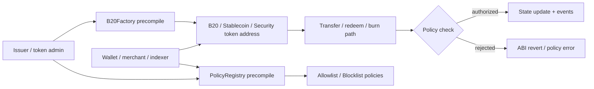
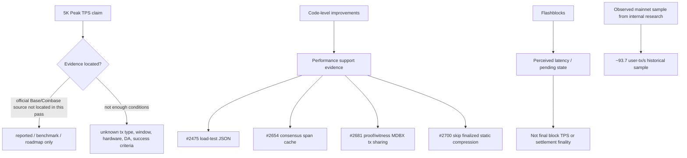
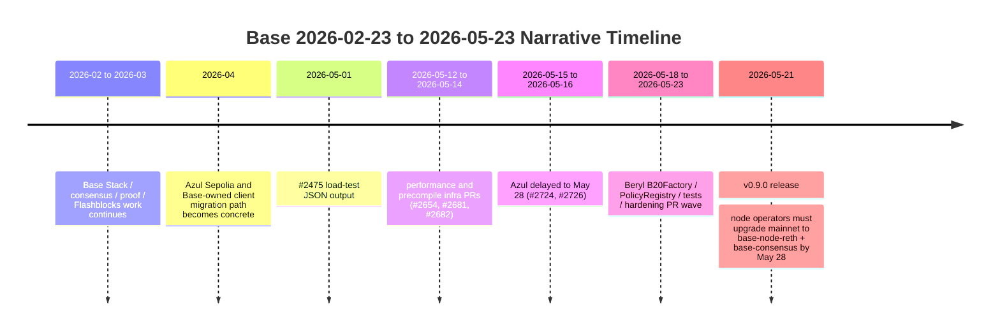
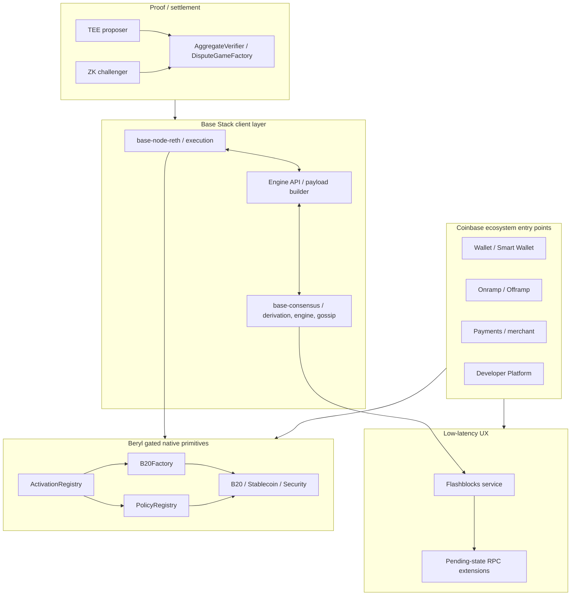

# Base 近期开发与叙事分析 - Round 1 Draft

## 1. Executive Summary

Base 近三个月的研发节奏不能被简化为"追 TPS"或"脱离 OP Stack"。更准确的判断是：Base 正在把自己从 OP Stack 链上的一个高流量 L2，推进成 Coinbase 主导的 Base Stack：执行层和共识层由 `base-node-reth` + `base-consensus` 一方客户端承接，Flashblocks 和 Multiproof 继续服务低延迟与安全叙事，Beryl 则把资产发行和策略控制推进到 Base-native precompile 层。但这些能力处于不同成熟阶段：Azul 已有 mainnet code-set timestamp 和 v0.9.0 node-operator upgrade 说明；Beryl 的 B20Factory、PolicyRegistry、ActivationRegistry 等实现和测试已经密集合并，但 `base/base@92abf0a` 中 mainnet/sepolia/devnet/zeronet 的 `beryl_timestamp` 仍为 `None`，因此不能写成主网或测试网已上线能力。

截至 2026-05-23，GitHub 数据本身显示出很强的工程强度。`gh pr list --repo base/base --state all --search 'created:2026-02-23..2026-05-23' --limit 1000` 返回了 GitHub CLI 能取到的最近 1000 个 PR，最早创建时间已被截断到 2026-03-28，说明真实三个月总量高于 1000。这个可复现样本中有 737 个 merged、209 个 closed、54 个 open；前 15 位作者贡献高度集中，`refcell` 337 个、`danyalprout` 81 个、`0x00101010` 76 个、`jackchuma` 69 个、`mw2000` 64 个。关键词查询也显示热区：`consensus` 456、`reth` 185、`flashblocks` 153、`proofs` 133、`precompile` 135、`policy` 85、`beryl` 30、`azul` 25。这些是 GitHub search query count，不等于严格分类总数，但足以说明近期活动主要围绕 Base-owned client、Flashblocks/proofs、Beryl precompiles 和 release hardening。

性能叙事必须保守。本文没有找到足以把"5K Peak TPS"写成 Base mainnet sustained TPS 的 primary evidence。可确认的证据是：(i) 代码中有 load-test、proof/RPC、consensus span cache、compression、Flashblocks cached execution 等优化 PR；(ii) 既有内部研究在一个历史样本中观察到 Base 约 93.7 user-tx/s，而 Mantle 约 0.7-1.0 TPS，且 Mantle 主要 demand-bound；(iii) Base Flashblocks 是低延迟预确认/ pending-state UX，不等于 L1 settlement finality 或 sustained block TPS。因此本文将 5K 写作 reported/benchmark/roadmap 口径，直到官方 Base/Coinbase source 或可复现 benchmark/mainnet metrics 证明具体测试条件、交易类型、峰值窗口和持续时间。

对 Mantle 的启示是分层行动，而不是照搬 Base Stack。短期应补齐可公开校验的性能/延迟 dashboard、稳定币支付与资产发行 demo、paymaster/赞助交易、PR/roadmap 透明度和开发者文档。中期可原型化 Flashblocks/preconfirmation UX、Policy Registry 应用层或 system-contract 版本、稳定币 gas/payment path。长期才评估 op-reth/Base Stack/Reth 迁移、企业/支付 L3 和合规资产发行平台。不能把 Base 的 benchmark peak 当成 Mantle 当前必须达到的 sustained TPS；Mantle 的 immediate gap 是需求、开发者心智、支付/资产发行产品闭环和叙事可信度。

## 2. Item Findings

### item-1: 研究窗口、数据集与统计方法

**研究窗口**：2026-02-23 至 2026-05-23，撰写/验证日期为 2026-05-23。核心仓库为 `base/base`，代码快照为 `92abf0ae5e4a3efb66fa4bf8946ec23bd7e8bc8e`，release 快照重点使用 `v0.9.0`（2026-05-21）。

**PR 数据查询**

| 数据集 | 查询语句 | 结果 | Caveat |
|---|---|---:|---|
| 最近三个月 PR 样本 | `gh pr list --repo base/base --state all --search 'created:2026-02-23..2026-05-23' --limit 1000 --json number,title,state,author,createdAt,mergedAt,closedAt,url` | 1000 returned: 737 merged / 209 closed / 54 open | GitHub CLI 返回 capped 1000；样本最早创建时间为 2026-03-28，不覆盖完整窗口 |
| Azul keyword | same window + `azul` | 25 | Search count；可能含 docs/release/fix PR，不等于人工分类 |
| Beryl keyword | same window + `beryl` | 30 | Search count；Beryl 近期集中在 2026-05-13 之后 |
| Flashblocks keyword | same window + `flashblocks` | 153 | Search count；含 RPC、tests、docs、infra |
| Consensus keyword | same window + `consensus` | 456 | Search count；说明 base-consensus 是主热区之一 |
| Reth keyword | same window + `reth` | 185 | Search count；含 base-node-reth、proof/RPC/execution work |
| Precompile keyword | same window + `precompile` | 135 | Search count；含 Beryl、Osaka/P256、ZKVM precompile map |
| Policy keyword | same window + `policy` | 85 | Search count；含 B20 policy tests/fixes，也含非 Beryl policy wording |

**去重与归因规则**

- 以 PR 为最小单位，merged PR 作为 stronger evidence；open PR 只能支持 POC/roadmap/under-review。
- 同一功能的 fix/hardening/test follow-up 不重复宣称新能力，只作为 maturity evidence。
- Dependabot/formatting/CI/docs-only 不进入关键功能判断，除非它影响 release/activation。
- PR keyword count 仅作为热度 proxy；最终分类以标题、状态、代码路径、release notes 和源码快照交叉校验。
- 证据等级使用：`merged-code`、`open-pr`、`release-note`、`official-doc/blog`、`internal-research`、`mainnet-data`、`benchmark/reported`、`inferred`。

**关键时间敏感 caveat**

Azul 与 Beryl 必须分开：`base/base@92abf0a` 中 mainnet `azul_timestamp: Some(1_779_991_200)`、sepolia `azul_timestamp: Some(1_776_708_000)`；但 mainnet/sepolia/devnet/zeronet 的 `beryl_timestamp` 均为 `None`。因此本文把 Azul 写成 code-set/release-driven upgrade path，把 Beryl 写成 merged implementation + gated feature，不写成 active network capability。

### item-2: Base 近三个月 PR 活动总览与活跃度趋势

1000 条 PR 样本的结构说明 Base 的研发节奏非常高，但也说明本研究不能给出完整三个月总数。GitHub capped 样本从 2026-03-28 到 2026-05-23 已经达到 1000 个 PR；如果把窗口前段 2026-02-23 至 2026-03-27 纳入，真实总量更高。此前用 GitHub Search API 获得的部分周数据也支持 2 月底至 3 月中旬已有较高活动：2026-02-23..2026-03-01 total 114 / merged 89；2026-03-02..03-08 total 201 / merged 149；2026-03-09..03-15 total 148 / merged 133；2026-03-16..03-22 total 211 / merged 146（后续 open/closed 因 search rate limit 未完整抓取）。

**样本作者集中度**

| Rank | Author | PR count in returned 1000 |
|---:|---|---:|
| 1 | refcell | 337 |
| 2 | danyalprout | 81 |
| 3 | 0x00101010 | 76 |
| 4 | jackchuma | 69 |
| 5 | mw2000 | 64 |
| 6 | niran | 42 |
| 7 | leopoldjoy | 31 |
| 8 | wlawt | 31 |
| 9 | haardikk21 | 27 |
| 10 | eric-ships | 25 |
| 11 | ygd58 | 24 |
| 12 | meyer9 | 22 |
| 13 | rayyan224 | 22 |
| 14 | BrianBland | 21 |
| 15 | app/github-actions | 14 |

**活动阶段判断**

- **3 月底至 4 月**：Base-owned consensus/execution、Flashblocks、proof infrastructure 继续收敛，围绕 Azul readiness 和 Base Stack migration 打底。
- **5 月上旬**：load-test、proof/RPC 性能、consensus span cache、static-file compression、Azul delay/release hardening 增多。
- **5 月中下旬**：Beryl native precompile work 爆发，PR #2682、#2728、#2753、#2770、#2771、#2778、#2788、#2797、#2810、#2821、#2822、#2832、#2857、#2865、#2876、#2887、#2892 在 2026-05-13 至 2026-05-23 之间密集合并。

**代表性 PR 清单**

| PR | 状态 | 合并/状态时间 | 类别 | 核心含义 |
|---:|---|---|---|---|
| #2475 | merged | 2026-05-01 | performance/load-test | load-tests JSON 输出，为后续 benchmark 可观测性打底 |
| #2654 | merged | 2026-05-14 | consensus perf | span cache 加速，PR 标题指向 consensus hot path |
| #2681 | merged | 2026-05-14 | proof/RPC perf | proof/witness request 共享 MDBX read transaction |
| #2682 | merged | 2026-05-14 | Beryl/precompile infra | port Tempo precompile macros + EVM storage provider |
| #2700 | merged | 2026-05-19 | performance | finalized static files skip compression |
| #2724/#2726 | merged | 2026-05-16/15 | Azul release | delay Azul to May 28 / backport |
| #2728 | merged | 2026-05-18 | Beryl token | ERC-20 transfer interface for DefaultToken, no policies |
| #2753 | merged | 2026-05-18 | Beryl TokenFactory | TokenFactory precompile + B-20 address routing |
| #2770 | merged | 2026-05-19 | Beryl PolicyRegistry | policy registry precompile + token policy wiring |
| #2771 | merged | 2026-05-21 | Beryl/B20 ABI | B20 Base Std interface alignment |
| #2788 | merged | 2026-05-20 | Beryl test | devnet E2E coverage for B20, activation registry, policy registry |
| #2810 | merged | 2026-05-21 | Beryl test | execution coverage for Beryl native precompiles |
| #2821 | merged | 2026-05-21 | proofs/precompile | ZKVM precompile provider uses installed Base precompile map |
| #2822 | merged | 2026-05-23 | Beryl policy tests | action tests for policy-gated B20 transfers |
| #2863 | merged | 2026-05-22 | DX/AA types | EIP-8130 AA transaction types, type-level only |
| #2868 | open | open as of 2026-05-23 | RPC guard | reject EIP-8130 tx at RPC boundary, confirming #2863 is not execution support |
| #2872 | open | open as of 2026-05-23 | consensus | conductor SSZ-binary commit endpoint opt-in |
| #2887 | merged | 2026-05-23 | B20Security policy | default redeem sender policy to ALWAYS_BLOCK |
| #2892 | merged | 2026-05-23 | Beryl fix | fix B20 factory address; latest shallow clone HEAD |

### item-3: PR 分类框架：从维护性改动到战略性能力建设

Base 的近期 PR 可以按"功能成熟度 + 叙事价值"分类，而不是按标题关键词直接归因。下表是 draft 级分类矩阵。

| 类别 | 搜索/样本信号 | 代表 PR / code | 状态 | 技术目标 | 叙事含义 | Mantle 影响 |
|---|---:|---|---|---|---|---|
| Azul / Base Stack | `azul` 25；release v0.9.0 | #2724/#2726；`crates/common/chains/src/config.rs`；v0.9.0 | Azul code-set + release readiness | base-node-reth + base-consensus upgrade path, Osaka readiness | 从 OP Stack follower 转为 Base-owned client | 高：Mantle 需区分 OP Stack 跟随、op-reth、Base Stack 三条路线 |
| Beryl / precompiles | `beryl` 30；`precompile` 135 | #2682/#2753/#2770/#2771/#2810/#2822/#2892；`crates/common/precompiles/*` | merged-code, not network-active | B20Factory、PolicyRegistry、ActivationRegistry、B20 variants | 协议级资产发行/策略原语 | 高：值得 prototype，但不能照搬 governance/liability |
| Performance / 5K | `load-tests` 104；proof/RPC PR | #2475/#2654/#2681/#2700/#2723 open | code/perf infra；5K unverified | benchmark infra, proof/RPC speed, consensus cache | 高吞吐/低延迟 narrative | 高：需 dashboard 反击，但不追未经证实 sustained TPS |
| Flashblocks | `flashblocks` 153 | #2247 open；`crates/common/flashblocks`、`crates/execution/flashblocks*` | running infra + ongoing work | sub-block pending state, RPC extensions, cached execution | UX latency, preconfirmation | 高：Mantle 可 POC 预确认 UX |
| Multiproof / proof | `proofs` 133 | `crates/proof/*` README；#2821 | merged/proof services | TEE proposer + ZK challenger + AggregateVerifier bindings | Stage 2/security path | 中高：与 Mantle proof roadmap 相关，但迁移成本高 |
| DX / EVM alignment | PR #2863/#2868；Osaka in Azul | `crates/common/evm/src/spec.rs` | partial | Osaka, P256, AA tx type struct, RPC guard | EVM parity + wallet/AA future | 中：Mantle 可跟踪 EIP-8130, P256/passkey |
| Coinbase ecosystem | official docs/blog + Base README | docs outside `base/base`; Base README distribution/tooling | product/docs evidence mixed | wallet/onramp/paymaster/payments/dev platform | chain + Coinbase distribution | 高：Mantle 的短板是分发和 product rails |
| Ops/testing/release | high PR volume | Beryl action/devnet tests, v0.9.0 release | strong | hardening before activation | execution discipline | 中：PR transparency and testing cadence 可借鉴 |

### item-4: Azul 升级与 Base Stack 独立路线的最新进展

Azul 的最新判断延续既有 `base-azul-upgrade` 研究，但需要用 2026-05-23 快照更新：`base/base@92abf0a` mainnet `azul_timestamp` 为 `1_779_991_200`，sepolia `azul_timestamp` 为 `1_776_708_000`；release `v0.9.0` 明确提醒 node operators 在 2026-05-28 前把 Base Mainnet nodes 升级到 `base-node-reth` 和 `base-consensus`，并说明 Azul readiness、Osaka support、proof RPC performance improvements。

**四层拆分**

| 层 | 判断 | Evidence | Caveat |
|---|---|---|---|
| 代码层 | Base 已形成一方客户端组合：`base-node-reth` 执行层 + `base-consensus` 共识/derivation | `Cargo.toml` workspace、`bin/consensus/README.md`、`crates/consensus/service/README.md`、v0.9.0 release | 两者仍是独立组件/二进制，不是完整单进程 |
| 规范层 | Base upgrades 独立于 Ethereum hardfork 可激活；Azul maps Osaka at Base layer | `crates/common/chains/src/chain.rs` says Base can hard fork independently | EVM/OP alloy/revm/settlement concepts仍复用 |
| 结算/桥层 | 仍是 Ethereum rollup，保留 OP 风格 derivation/portal/settlement 语义 | Base README: rollup built on Ethereum；旧 Azul research | 不能写成完全脱离 OP Stack/Superchain |
| 治理/生态层 | 继续处在 Coinbase + Base + broader Superchain/OP 叙事中 | 内部旧研究 + Base public positioning | 无公开证据显示 Base 退出 Superchain |

**对 Mantle 的意义**

Mantle 不应在内部分享中说"Base 已完全脱离 OP Stack"。更稳妥的表达是：Base 在客户端和升级节奏层形成 Base-owned stack；在桥接、settlement、Superchain/OP ecosystem 叙事上仍有连续性。Mantle 的路线选择应拆成三类：跟随 Optimism 主线、选择性移植 Base 的能力、或战略性评估 Base codebase。短期直接切 Base Stack 会带来 proof、derivation、ops、governance、Superchain compatibility 的维护成本；更现实的是先复制 benchmark discipline、preconfirmation UX、system-contract asset/policy 原型。

### item-5: Beryl 预编译合约系统：Token Factory、Policy Registry 与链上金融原语

Beryl 是本轮研究中最重要的新变化。与 Azul 主要服务客户端/证明/Osaka/Flashblocks 不同，Beryl 把 Base-native token and policy primitives 推进到 precompile 层。但 Review caveat 必须保留：`base/base@92abf0a` 的 `beryl_timestamp` 在 mainnet、sepolia、devnet、zeronet 均为 `None`，tests assert Beryl inactive for mainnet/sepolia/devnet/zeronet。因此 Beryl 应写成"merged implementation behind hardfork/activation gates"，不是 launched capability。

**Beryl 范围与状态**

| 组件 | Evidence | 当前判断 |
|---|---|---|
| Hardfork gate | `crates/common/chains/src/config.rs` beryl timestamps `None`; `ChainUpgrades` tests expect `ForkCondition::Never` | not active on public network configs in examined commit |
| Dynamic install | `crates/common/precompiles/src/provider.rs` installs B20Factory, B20 token lookup, PolicyRegistry, ActivationRegistry when `spec.upgrade() >= BaseUpgrade::Beryl` | merged-code, hardfork gated |
| ActivationRegistry | address `0x8453...0001`, feature ids for B20Token/B20Factory/PolicyRegistry/B20Stablecoin/B20Security | runtime feature gate inside Beryl |
| B20Factory | address `0xB20F...`, deterministic B20/Stablecoin/Security token address derivation, `createB20`, `getB20Address`, `isB20` | merged-code; latest #2892 fixed factory address |
| PolicyRegistry | address `0x8453...0002`, allowlist/blocklist, built-ins `ALWAYS_ALLOW_ID=0`, `ALWAYS_BLOCK_ID=(1<<56)|1`, max 64 accounts/batch | merged-code; policy admin model |
| B20 Security defaults | #2887 defaults `REDEEM_SENDER_POLICY` to `ALWAYS_BLOCK_ID` | merged-code hardening |
| Rich BaseToken/BaseAsset POC | #2660 open POC | roadmap/POC, not launched |

**资产发行/转账策略流程**

**Coinbase ecosystem significance**

Beryl 的策略价值很明显：如果 Token Factory 和 Policy Registry 最终上线，Base 可以为稳定币、证券型资产、商户积分、受限转账资产提供链级 primitives。它与 Coinbase Wallet、Smart Wallet、Developer Platform、onramp/offramp、Commerce、identity/KYC 等产品存在强战略互补。但当前公开 evidence 只证明了底层 primitives 的 merged-code 和 devnet/action tests；没有证明 Coinbase 具体产品已经把 Beryl 接入生产。因此本文将"Coinbase 生态意义"写成 strategic fit / likely platform option，而不是 already integrated product.

**风险**

- Protocol-layer policy 带来治理、责任和合规边界问题：谁是 activation admin、policy admin，谁承担错误冻结/错误放行责任。
- B20 与 ERC-20 流动性、钱包显示、indexer、bridge、CEX custody 的兼容需要验证。
- Dynamic precompile + runtime activation registry 增加调试复杂度；应用必须区分 hardfork active 与 feature active。

### item-6: 性能优化与 5K Peak TPS 叙事的证据拆解

本 draft 未找到 primary source 可证明 "5K Peak TPS" 是 Base mainnet sustained TPS。可以证明的是 Base 近期围绕性能做了大量工程，以及既有内部研究显示 Base 主网用户交易吞吐曾显著高于 Mantle 样本。

**口径拆分**

| 口径 | 当前证据 | 可写结论 |
|---|---|---|
| Peak TPS | 未找到 official primary source 支撑具体 5K 条件 | reported/benchmark-only; no sustained conclusion |
| Sustained mainnet TPS | 内部研究曾观察 Base ~93.7 user-tx/s 样本 | 可作为 historical observed sample，需标注窗口和方法 |
| Code-level optimization | #2475/#2654/#2681/#2700 + release v0.9.0 proof RPC perf | 支撑 Base 在持续优化 perf path |
| Flashblocks latency | `base-common-flashblocks` 和 `base-flashblocks` 支持 pending state/RPC/subscriptions | 支撑 perceived latency/UX，不等于 finality |
| Mantle comparison | 内部 `perf-gap-analysis-recommendations`：Mantle demand-bound，0.7-1.0 TPS | Mantle 不应盲目追 5K sustained；先做 demand + dashboard + quick wins |

**Guardrail**

内部分享建议用这样的句式："Base 正在用 Base Stack、Flashblocks、proof/RPC 优化和 load-test infra 支撑高吞吐叙事；5K Peak TPS 在本轮未能以 primary source 验证为主网 sustained TPS，因此只能作为 reported peak/benchmark 口径，并需与历史主网 sample、持续吞吐、用户感知延迟分开。"

### item-7: Flashblocks、Multiproof 与最终性/预确认叙事的组合

Flashblocks 和 Multiproof 是 Base 叙事组合的两端：前者解决用户/开发者感知延迟，后者解决安全和最终性路径。二者不能混用。

**Flashblocks evidence**

`crates/common/flashblocks/README.md` 把 Flashblocks 定义为 builder 在 full block sealed 之前广播的 sub-block updates；`crates/execution/flashblocks/README.md` 描述 pending block state、pending receipts、pending logs、`eth_subscribe("newFlashblocks")`、`eth_sendRawTransactionSync` 等 pending-state-aware RPC；`base-flashblocks-node` README 描述 node extension 如何通过 WebSocket 连接 flashblock service 并扩展 RPC。

**Multiproof evidence**

`crates/proof/proposer/README.md` 描述 TEE-based output proposer：从 L2 RPC/Rollup RPC/L1 RPC 取数，经 TEE enclave 生成 signed proposal，再通过 `DisputeGameFactory.createWithInitData()` 和 `AggregateVerifier + TEEVerifier` 上链验证。`crates/proof/challenge/README.md` 描述 ZK-proof dispute game challenger，扫描 `IN_PROGRESS` dispute games，分类 `InvalidTeeProposal`、`FraudulentZkChallenge`、`InvalidZkProposal`，通过 `nullify()`/`challenge()` 提交 dispute。

**语义边界**

| 概念 | 含义 | 禁止混用 |
|---|---|---|
| Flashblocks preconfirmation | builder 广播 pending/sub-block state，改善 pending RPC 和用户感知 | 不是 L1 finality，不是提款最终性 |
| L2 block finalization | Base rollup 的 safe/finalized L2 head 路径 | 不等于用户看到 Flashblocks 即不可逆 |
| Multiproof | TEE + ZK dispute/proof path，服务 Stage 2/security narrative | 不等于完全去中心化或无信任生产状态 |
| L1 settlement/withdrawal | L1 上的 dispute game/portal/finality 语义 | 不能用 TPS/Flashblocks 口径替代 |

对 Mantle 来说，Flashblocks 更适合作为中期 UX POC；Multiproof/TEE+ZK 则是长期安全路线参考，迁移或复刻成本远高于应用层功能。

### item-8: Coinbase 生态深度绑定与 Base 平台化叙事

Base 的平台化叙事有三层证据强度。

| 层 | Evidence | 判断 |
|---|---|---|
| Base 官方自我定位 | `base/base` README：Base 是 Ethereum rollup，提供 1-second / sub-cent transaction、official Base channels distribution、builder grants、tooling for AI/social/media/entertainment | official repo evidence；可引用 |
| Base Account / gasless UX | Base docs `Base Gasless Campaign`、`Sponsor Gas`、`Pay Gas in ERC20 tokens` 均把 Base Account、CDP Paymaster、gas credits、ERC20/USDC gas payment 连接起来 | 支持"钱包 + paymaster + Base UX"入口，不等于 Beryl |
| Coinbase product surface | CDP Paymaster、Onramp/Offramp、Non-custodial Wallet、Payments/x402 docs | 官方 product docs 可支持生态入口，但不自动证明 Beryl integrated |
| Beryl linkage | B20Factory/PolicyRegistry/ActivationRegistry merged-code | Strategic fit strong; production integration unverified |

Base 正从"L2 网络"向"Coinbase onchain platform 底座"演进的判断是合理的，但必须拆开事实与推断：事实是 Coinbase 拥有钱包、开发者平台、on/offramp、payments、paymaster、USDC/stablecoin distribution 等入口，Base 本身又在协议层推进 preconfirmation、proofs、native token/policy primitives。CDP Paymaster 官方文档明确其当前支持 Base Mainnet 与 Base Sepolia；CDP Onramp/Offramp 文档把 Base 列为支持的 L2 网络；CDP Payments overview 将 x402、onchain transfers、Payment Methods、Transfers 等放入统一 payments product surface；x402 docs 则把 HTTP-native payments 与 agent/AI 场景放进 Coinbase 的开发者叙事。推断是这些入口会与 Beryl 深度结合，服务发行方、商户、合规资产、钱包和机构场景。公开代码和官方产品 docs 尚不能证明 Coinbase 已把 Beryl 接入生产，因此不能把品牌/分发证据写成 Beryl 上线证据。

**对 Mantle 的威胁**

- 分发：Coinbase 官方渠道和 Base App/Wallet 心智可降低用户获取成本。
- 开发者：Base-owned docs、node tooling、preconfirmation RPC、Beryl primitives 给开发者更明确的能力地图。
- 稳定币/商户：如果 Beryl + Coinbase payments/onramp/paymaster 形成闭环，Base 将从普通 L2 变成链上支付/资产发行平台。
- 合规信任：Policy Registry 类型能力更适合发行方、商户和机构叙事，但也带来中心化/冻结争议。

### item-9: Base 叙事演变时间线与竞争定位

**Narrative -> technical evidence -> business meaning**

| Narrative | Technical evidence | Business meaning | Confidence |
|---|---|---|---|
| OP Stack member / low-cost L2 | Base README, Ethereum rollup framing | Base remains Ethereum-settled L2 with low-cost transaction pitch | high |
| Base Stack independence | v0.9.0, `base-node-reth` + `base-consensus`, Azul timestamps | Faster autonomous upgrade path and client ownership | high, with OP/Superchain caveat |
| High performance / low latency | Flashblocks crates/RPC, perf PRs, internal Base TPS sample | Developer/user UX advantage; benchmark discipline | medium; 5K sustained unverified |
| Protocol asset/policy primitives | Beryl precompiles merged behind gates | Potential asset issuance/compliance platform | medium; not activated |
| Coinbase onchain platform | Base official distribution/tooling positioning + Coinbase product ecosystem | Powerful go-to-market and product rails | medium; product integration depth unverified |

Base 的差异化不是单点 TPS，而是组合拳：Coinbase distribution + Base-owned client cadence + Flashblocks UX + Multiproof security path + potential Beryl asset/policy primitives。Mantle 当前叙事若仍只谈 high-performance L2、MNT ecosystem、modular DA，会在开发者和商户/资产发行方心智上显得不够产品化。

### item-10: 对 Mantle 的竞争启示与行动建议

| Base 能力 | 威胁等级 | Mantle 当前判断 | 可借鉴性 | 建议行动 | 时间窗 |
|---|---|---|---|---|---|
| Base-owned client / Azul | 高 | OP Stack/op-geth 路线需重新评估 | monitor/prototype | 评估 op-reth、Base Stack、Mantle 自有 fork 三方案，避免仓促迁移 | 0-6 个月 |
| Beryl TokenFactory/PolicyRegistry | 高 | 应用层可先做，协议层需治理 | prototype | 用 Solidity/system contract 做 asset factory + policy registry demo | 0-6 个月 |
| Flashblocks preconfirmation | 高 | UX 价值清晰 | prototype | 做预确认/fast pending RPC POC，先服务交易确认体验 | 3-9 个月 |
| 5K Peak TPS narrative | 中高 | Mantle demand-bound，不宜盲追 | borrow_now for dashboard, avoid overclaim | 建立 peak/sustained/mainnet/benchmark/latency dashboard，反制错误叙事 | 0-3 个月 |
| Coinbase distribution | 高 | Mantle 无同等 CEX/wallet 分发 | borrow framing | 打包"链 + 钱包/paymaster + 稳定币支付 + merchant/RWA demo" | 0-9 个月 |
| Multiproof TEE+ZK | 中 | 安全路线重要但迁移重 | monitor | 跟踪 proof roadmap，避免短期承诺 | 6-18 个月 |
| PR/release cadence | 中 | 可提升透明度 | borrow_now | 每双周公开 roadmap/benchmark/PR focus summary | 0-3 个月 |

**短期：立即防守/补齐**

1. 发布 Mantle 性能口径 dashboard：当前 TPS、峰值 TPS、sustained TPS、user-tx/s、gas/s、空块率、DA utilization、预确认/最终确认延迟分开。
2. 做支付/资产发行 demo：稳定币 gas/paymaster、merchant checkout、memo/reconciliation、policy registry app-layer prototype。
3. 建立竞品 PR tracker：Base PR 分类每周更新，重点监控 Beryl activation、5K source、Coinbase integration docs。

**中期：可借鉴设计**

1. Flashblocks/preconfirmation UX POC：优先服务钱包、DEX、支付确认体验。
2. Policy Registry / asset factory system contract：先在应用层控制风险，再评估 precompile 是否必要。
3. 稳定币支付路径：sponsorship/paymaster、USDC/USDT merchant demo、RWA/issuer onboarding kit。

**谨慎验证 / 避免**

1. 避免直接宣称"Base 已完全脱离 OP Stack"或"Mantle 必须切 Base Stack"。
2. 避免把 5K peak benchmark 当成 sustained mainnet requirement。
3. 避免在没有治理和责任边界前把 compliance policy 放进协议层。

## 3. Diagrams

### diag-1: PR 活动趋势摘要

| Window / Source | Created total | Merged | Closed | Open | Notes |
|---|---:|---:|---:|---:|---|
| 2026-02-23..2026-03-01 search API | 114 | 89 | 25 | 0 | partial exact weekly count |
| 2026-03-02..2026-03-08 search API | 201 | 149 | 52 | 0 | partial exact weekly count |
| 2026-03-09..2026-03-15 search API | 148 | 133 | 15 | 0 | partial exact weekly count |
| 2026-03-16..2026-03-22 search API | 211 | 146 | rate-limited | rate-limited | incomplete by state |
| 2026-03-28..2026-05-23 returned sample | 1000 | 737 | 209 | 54 | capped latest 1000; earliest returned 2026-03-28 |

### diag-2: PR 分类矩阵

见 item-3 表格。

### diag-3: Base Stack 能力架构图

### diag-4: Beryl Token Factory + Policy Registry 流程图

见 item-5 Mermaid。

### diag-5: 5K Peak TPS 证据拆解图

见 item-6 Mermaid。

### diag-6: Base 叙事演变时间线

见 item-9 Mermaid。

### diag-7: Mantle 竞争响应矩阵

见 item-10 表格。

## 4. Source Coverage

### 4.1 GitHub PR data (src-1)

| Source | Coverage |
|---|---|
| `gh pr list --repo base/base --state all --search 'created:2026-02-23..2026-05-23' --limit 1000` | 1000 PR returned; capped sample; state counts, earliest/latest, author concentration |
| Representative PRs | #2247, #2475, #2654, #2660, #2681, #2682, #2683, #2700, #2723, #2724, #2726, #2728, #2753, #2770, #2771, #2778, #2788, #2797, #2810, #2821, #2822, #2832, #2857, #2863, #2865, #2868, #2872, #2876, #2887, #2892 |
| Count | 30 PRs explicitly listed |

### 4.2 GitHub code analysis (src-2)

| File / release | Evidence used |
|---|---|
| `base/base@92abf0a` | code snapshot |
| `crates/common/chains/src/config.rs` | Azul timestamps; Beryl `None`; activation admin; gas/config boundaries |
| `crates/common/chains/src/chain.rs` | Base can hard fork independently; tests show Beryl `ForkCondition::Never` |
| `crates/common/precompiles/src/provider.rs` | Beryl dynamic precompile install condition |
| `crates/common/precompiles/src/activation/storage.rs` | ActivationRegistry address/features/admin gate |
| `crates/common/precompiles/src/b20_factory/storage.rs` | B20Factory address/create semantics |
| `crates/common/precompiles/src/policy/storage.rs` | PolicyRegistry address, built-ins, batch size, admin checks |
| `crates/common/flashblocks/README.md` | Flashblocks primitive type semantics |
| `crates/execution/flashblocks/README.md` | pending-state RPC/extensions |
| `crates/proof/proposer/README.md` | TEE proposer flow |
| `crates/proof/challenge/README.md` | ZK challenger flow |
| `crates/consensus/service/README.md` | Base consensus actor/service architecture |
| `v0.9.0` release | mainnet node operator upgrade by May 28; Azul readiness; proof RPC performance |

### 4.3 Official Base / Coinbase / benchmark / internal / Mantle coverage

| Requirement | Sources used | Status |
|---|---|---|
| official_base_sources | `base/base` README; `base/base` release `v0.9.0` (`https://github.com/base/base/releases/tag/v0.9.0`); Base Flashblocks Overview (`https://docs.base.org/base-chain/flashblocks/overview`); Base `newFlashblocks` API (`https://docs.base.org/base-chain/api-reference/flashblocks-api/newFlashblocks`); Base Flashblocks FAQ (`https://docs.base.org/base-chain/flashblocks/faq`); Base Gasless Campaign (`https://docs.base.org/base-account/more/base-gasless-campaign`); Base ERC20 paymaster guide (`https://docs.base.org/base-account/improve-ux/sponsor-gas/erc20-paymasters`); Flashblocks/precompile/proof READMEs in official repo | sufficient for Base release, Flashblocks, gasless/paymaster, and code evidence |
| coinbase_sources | CDP Paymaster Overview (`https://docs.cdp.coinbase.com/paymaster/introduction/welcome`); CDP Onramp/Offramp Overview (`https://docs.cdp.coinbase.com/onramp/introduction/welcome`); CDP Non-custodial Wallet docs (`https://docs.cdp.coinbase.com/wallets/non-custodial-wallets/overview`); CDP Payments Overview (`https://docs.cdp.coinbase.com/payments/overview`); x402 docs (`https://docs.cdp.coinbase.com/x402/welcome`) | sufficient for Coinbase ecosystem linkage; no Beryl production integration evidence, so Beryl linkage remains strategic/inferred |
| internal_research | `base-azul-upgrade/.../base-strategy-azul-overview/final.md`; `flashblocks-network-changes/final.md`; `multiproof-architecture/final.md`; `multiproof-provers-challengers/final.md`; `base-perf-analysis/.../perf-gap-analysis-recommendations/final.md`; `block-builder-flashblocks-throughput/final.md`; `mantle-base-codebase-evaluation/.../architecture-advantage-summary/final.md`; `performance-advantage-summary/final.md` | sufficient |
| onchain_or_benchmark_data | Internal Base vs Mantle user-tx/s sample; load-test PR #2475; perf PRs #2654/#2681/#2700; Base Flashblocks official docs for 200ms preconfirmation; no official 5K source found | insufficient for 5K claim; explicitly downgraded |
| comparative_mantle_sources | `base-perf-analysis` and `mantle-base-codebase-evaluation` finals | sufficient for recommendations |
| tracker_or_secondary_sources | GitHub PR tracker unavailable directly; GitHub source data used instead | gap; not blocker because primary GitHub data is stronger |

## 5. Gap Analysis

1. **Outline status mismatch**: persisted outline frontmatter is `status: candidate`, while Orchestrator consensus approved the outline. This draft proceeds because the issue state transition controls the workflow; final promotion should not edit the outline unless Orchestrator asks.
2. **Full three-month PR completeness**: GitHub CLI returned capped latest 1000 PRs; the earliest returned PR is 2026-03-28, so total PR count for 2026-02-23..2026-05-23 is undercounted. Query strings and limitations are documented.
3. **5K Peak TPS**: no primary source found in this pass to verify 5K as mainnet sustained TPS. All such language is downgraded to reported/benchmark/roadmap until proven.
4. **Beryl activation**: merged code and tests are strong, but `beryl_timestamp: None` means launched capability is not proven. Treat as gated implementation.
5. **Coinbase product integration**: strategic linkage is clear, but Beryl-to-Coinbase production integration is not proven. Need direct Coinbase docs/blog/API references before writing "integrated".
6. **On-chain metrics freshness**: internal Base/Mantle samples are useful but should be refreshed with live dashboards before final external-facing report if exact current TPS is required.
7. **OP Stack/Superchain**: Base Stack independence is code/client/release cadence level, not total settlement/governance/ecosystem separation.

## 6. Revision Log

| Round | Action | Scope | Notes |
|---:|---|---|---|
| 1 | create_deep_draft | all 10 outline items | Produced evidence-gated Chinese draft from approved outline; added PR dataset caveats, Beryl activation downgrade, OP Stack/Superchain caveats, and peak-vs-sustained TPS separation |
