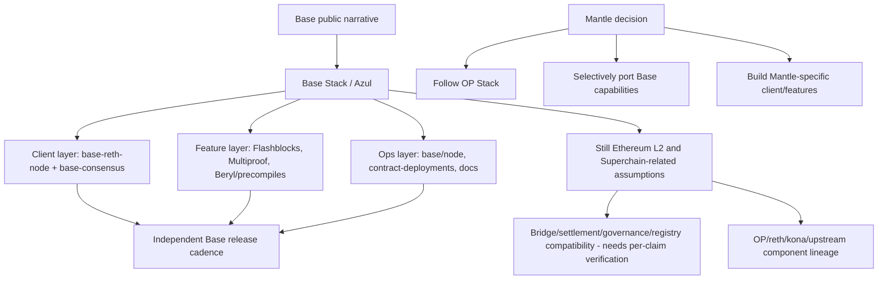
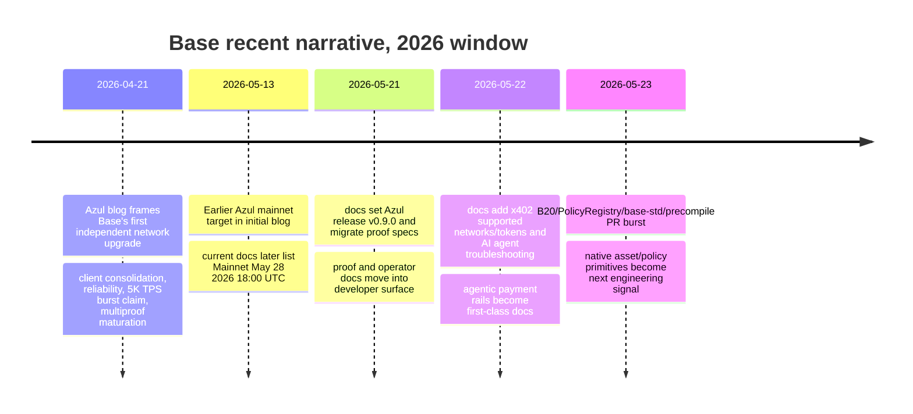

# Base 近期开发与叙事分析 - Round 2 Draft

## 1. Executive Summary

本轮研究先做 org/repo universe 扫描和活跃度排序，再进入 PR 深挖，没有预设 `base/base` 是唯一分析对象。抓取窗口为 GitHub Search 日期范围 **2026-02-24..2026-05-23**，REST 校验窗口为 **[2026-02-24T00:00:00Z, 2026-05-24T00:00:00Z)**。`base` GitHub org 当前有 **85 个公开 repo**；`base-org` 只有 **1 个 archived profile repo**；通过 GitHub Search、Base 官网/docs 链接和 Coinbase org 搜索发现的 Coinbase-wide repo 暂未形成可直接纳入 Base 工程结论的 primary evidence。最终纳入 Base-owned universe 的主 org 是 `base`，`base-org/.github` 保留在 universe 但排除活跃分析；Coinbase 通用产品 repo 只作为叙事/分发背景，不混入 Base 工程活动排名。

原始 PR 活动高度集中在 `base/base`。按本轮可复现的 GitHub Search 精确区间查询（`repo:{repo} is:pr created:2026-02-24..2026-05-23` / `merged:2026-02-24..2026-05-23`），`base/base` 为 **1,810 created PR / 1,377 merged PR**，第二梯队 `base/docs` 为 **242/97**，随后是 `base/contracts`、`base/contract-deployments`、`base/base-std`、`base/account-sdk`、`base/bridge-sdk`。去噪后的 REST 全量分页计数仍显示 `base/base` 和 `base/docs` 领先，但 `base/contract-deployments`、`base/contracts`、`base/base-std` 的相对顺序更接近，`base/bridge-sdk` 在过滤 docs/dependency/release 噪声后高于 `base/account-sdk`。最终深挖选择不变：`base/base` 是协议、客户端、Flashblocks、Multiproof、Beryl/precompile 的核心；`base/docs` 是 Azul、proof specs、x402/AI agents、post-Azul gas guidance 的叙事和开发者入口；`base/base-std`、`base/contracts`、`base/account-policies` 与 `base/contract-deployments` 指向预编译合约、B20/Policy Registry、桥和治理/部署操作；`base/account-sdk` 与 `base/skills` 则把 Base Account、USDC payments、agent payments 和 x402 变成产品化开发者表面。

近 3 个月的开发主线可以概括为五条：

1. **Base Stack 独立客户端路线正在工程化收敛。** 官方 Azul blog 称 Azul 是 Base 的 first independent network upgrade；当前 Base node-operator docs 列出 Mainnet activation 为 **2026-05-28 18:00 UTC**，并要求节点运营商迁移到 `base-reth-node` 和 `base-consensus`；`base/base` 代码中有 `crates/execution`、`crates/consensus`、`crates/proof`、`crates/common/precompiles`、`crates/execution/flashblocks` 等完整模块。这是客户端和 release cadence 的独立化，但不是 Base 退出 Superchain 的证据。
2. **Beryl / B20 / Policy Registry / precompile 工作在 2026-05 下旬集中爆发。** `base/base` 最新 PR 包括 `feat(precompiles): add base-common-precompiles crate and Beryl action tests`、`test(devnet): add B20 and PolicyRegistry E2E tests`、`fix(precompiles): Fix B20 Factory Address`；`base/base-std` 同期出现 `IPolicyRegistry`、policy slot packing、security token default policy、metadata roles、EIP-712 domain 等大量 PR。这说明资产发行/合规策略原语是近期最强新方向之一，但多个大 PR closed-unmerged 或仍 open，不能写成 mainnet-active capability。
3. **Flashblocks 已从叙事进入默认用户体验层。** Base docs 的 Flashblocks overview 写明 Base 使用 200ms incremental state updates、每 2s block 内约 10 个 Flashblocks，并称 Flashblocks are always live on Base；`base/base` 代码中有 Flashblocks-aware cached execution、metering、pending RPC 和 CLI 参数。它改善 preconfirmation/UX 延迟，不等于 L1 finality 或 DA-finalized throughput。
4. **Multiproof / proof / TEE+ZK 是安全叙事核心，但仍要区分成熟度。** Azul blog 将 withdrawals faster as the multiproof system matures 作为用户影响；`base/base` 近期 PR 有 `fix(proof): Fix SP1 Aggregation Serde`、`fix(proofs): Fix ZKVM Precompile Mapping`、`refresh succinct elf manifest` 等。代码活动强，但 "matures" 的措辞意味着不能把所有 proof 路线写成最终生产成熟。
5. **Base 叙事正在从 L2 基础设施扩展到 Coinbase 分发 + onchain economy + AI/payment rails。** Base Account docs强调 universal sign-on、one-tap USDC payments、Base Account SDK；Base Agents 页面强调 agent wallets、x402、service discovery、USDC payments；`base/docs` 和 `base/skills` 的 PR 活动也支持 AI agents / x402 / skills 方向。对 Mantle 的威胁不是单个 TPS 指标，而是客户端独立化、低延迟 UX、资产/策略原语、钱包/支付 SDK、Coinbase 分发和开发者文档的组合。

对 Mantle 的直接启示：短期应建立 `base/base`、`base/base-std`、`base/contracts`、`base/contract-deployments`、`base/docs`、`base/account-sdk` 的 watchlist；中期应做 Flashblocks-style preconfirmation UX POC、资产发行/Policy Registry 设计评审、Base Account/x402 支付体验对标、proof/finality 叙事模板；长期才评估是否选择性移植 Base Stack 能力或自建 Mantle-specific client path。不能直接照搬的部分包括 Coinbase 分发能力、Base Account 品牌入口、activation-gated precompile code，以及把 5K TPS burst 当作 sustained mainnet throughput。

## 2. Item Findings

### item-1: GitHub org/repo universe 发现与纳入边界

**执行顺序确认**：本 draft 先扫描 `base`、`base-org` 和发现的相关 org，再排序，再选择 deep-dive repo。查询方式以 GitHub REST/Search/`gh` 为主，官方 docs/blog 和 repo metadata 用于验证 ownership/linkage。

```shell
gh api --method GET --paginate '/orgs/base/repos?per_page=100&type=public'
gh api --method GET --paginate '/orgs/base-org/repos?per_page=100&type=public'
gh api -X GET search/issues -f q='repo:base/base is:pr created:2026-02-24..2026-05-23'
gh api -X GET search/issues -f q='repo:base/base is:pr merged:2026-02-24..2026-05-23'
gh api -X GET search/issues -f q='repo:base/docs is:pr created:2026-02-24..2026-05-23'
gh api -X GET search/issues -f q='repo:base/docs is:pr merged:2026-02-24..2026-05-23'
gh api --method GET '/repos/base/{repo}/pulls?state=all&per_page=100&sort=created&direction=desc'
```

#### diag-1: org/repo universe 与 include/exclude 表

| Source | 发现结果 | 纳入/排除 | 理由 | Confidence |
|---|---:|---|---|---|
| `base` GitHub org | 85 public repos；org 描述为 Base，blog 为 `base.org` | include | Base 官方 org；repo metadata、Base docs/blog 和 PR activity 均直接相关 | primary-verified |
| `base-org` GitHub org | 1 public repo：`base-org/.github`，archived | include universe / exclude ranking | legacy/profile org；无窗口内 PR；保留边界但不参与工程活跃度结论 | primary-verified |
| `coinbase` GitHub org search | 搜索 `base org:coinbase pushed:>=2026-02-24` 只发现 `coinbase/mesh-geth-sdk` 等 Coinbase-wide 结果 | exclude engineering ranking | 未见 Base 官方 repo linkage；Coinbase 通用产品活动不能等同 Base 工程活动 | primary-checked |
| GitHub topic/search `topic:base-chain` / `topic:base` | 大量社区/个人 repo、x402 demo、Base dapp | exclude engineering ranking / narrative only if official | 缺少 Base ownership 或官方维护证据；可作为生态噪声，不计入 Base team activity | search-observed |
| Base official docs/blog URLs | Azul、Flashblocks、Base Account、AI Agents/x402 | include as narrative/source evidence | 官方公开叙事与开发者表面，不直接参与 repo ranking | official-primary |

**Repo 类型标注摘要**：

| Repo | Type | Archived/fork | Recent push | 纳入结论 |
|---|---|---|---|---|
| `base/base` | core protocol/client monorepo | active, non-fork | 2026-05-23 | deep-dive P0 |
| `base/docs` | docs/developer portal/spec migration | active, non-fork | 2026-05-23 | deep-dive P0 for narrative/DX |
| `base/contracts` | L1/L2 contracts, bridge, proof tests | active, non-fork | 2026-05-22 | deep-dive P1 |
| `base/contract-deployments` | deployment tasks/governance ops | active, non-fork | 2026-05-22 | deep-dive P1 |
| `base/base-std` | Solidity interfaces/libraries/mock Base precompiles | active, non-fork | 2026-05-23 | deep-dive P1 |
| `base/account-sdk` | Base Account SDK / payments / subscriptions | active, non-fork | 2026-05-13 | deep-dive P1 for productized DX |
| `base/bridge-sdk` | bridge/Solana route SDK | active, non-fork | 2026-04-05 | deep-dive P2 |
| `base/account-policies` | account / policy contracts | active, non-fork | 2026-05-04 | deep-dive P2 |
| `base/skills` | agent skills / onchain tools | active, non-fork | 2026-05-22 | narrative/DX watch |
| `base/benchmark` | OP Stack benchmark tooling | active, non-fork | 2026-05-21 | performance watch, not enough PR evidence |
| `base/optimism`, `base/reth`, `base/rollup-boost` | forks/upstream adaptation | fork | 2026-03 to 2026-05 | exclude from direct Base-owned activity score; use only when PR/linkage points to Base integration |
| `base/web`, `base/guides`, `base/pessimism`, `base/infra` | archived/legacy | archived | mixed | exclude ranking; preserve historical context |

### item-2: 近 3 个月 repo 活跃度排名与 Top repo 选择

**Ranking formula.** 本轮 round-2 只修复 repo-ranking 证据层。排序使用 GitHub Search 原始总数、REST 全量分页验证、去噪后数量和近期 push/工程性质四类信号，避免把三种数据源混成单一 `Created PR / Merged PR` 标签。

`score = 45% search_created_PR_norm + 25% search_merged_PR_norm + 20% denoised_REST_created_norm + 10% qualitative_engineering_signal`

其中 `qualitative_engineering_signal` 只在 repo 类型与近期 PR title/path 明确对应 protocol/contracts/DX/product surface 时给分。`recent_push` 不进入公式权重，只作为 tie-breaker 和活跃性 sanity check。该 score 用于排序/选择，不作为精确工作量度量。

#### diag-2: repo-ranking 证据表（Search totals / 去噪数量 / REST 样本）

**精确查询记录。** 主 Search 总数使用单一日期范围 qualifier，格式为 `repo:{repo} is:pr created:2026-02-24..2026-05-23` 与 `repo:{repo} is:pr merged:2026-02-24..2026-05-23`。例如：

```shell
gh api -X GET search/issues -f q='repo:base/base is:pr created:2026-02-24..2026-05-23' --jq '.total_count'  # 1810
gh api -X GET search/issues -f q='repo:base/base is:pr merged:2026-02-24..2026-05-23' --jq '.total_count'   # 1377
gh api -X GET search/issues -f q='repo:base/docs is:pr created:2026-02-24..2026-05-23' --jq '.total_count'  # 242
gh api -X GET search/issues -f q='repo:base/docs is:pr merged:2026-02-24..2026-05-23' --jq '.total_count'   # 97
```

完整 Search 查询清单如下，均在 2026-05-23T22:16:17Z 左右重跑：

| Repo | Created query => total_count | Merged query => total_count |
|---|---|---|
| `base/base` | `repo:base/base is:pr created:2026-02-24..2026-05-23` => 1,810 | `repo:base/base is:pr merged:2026-02-24..2026-05-23` => 1,377 |
| `base/docs` | `repo:base/docs is:pr created:2026-02-24..2026-05-23` => 242 | `repo:base/docs is:pr merged:2026-02-24..2026-05-23` => 97 |
| `base/contracts` | `repo:base/contracts is:pr created:2026-02-24..2026-05-23` => 93 | `repo:base/contracts is:pr merged:2026-02-24..2026-05-23` => 59 |
| `base/contract-deployments` | `repo:base/contract-deployments is:pr created:2026-02-24..2026-05-23` => 91 | `repo:base/contract-deployments is:pr merged:2026-02-24..2026-05-23` => 76 |
| `base/base-std` | `repo:base/base-std is:pr created:2026-02-24..2026-05-23` => 78 | `repo:base/base-std is:pr merged:2026-02-24..2026-05-23` => 63 |
| `base/account-sdk` | `repo:base/account-sdk is:pr created:2026-02-24..2026-05-23` => 59 | `repo:base/account-sdk is:pr merged:2026-02-24..2026-05-23` => 24 |
| `base/bridge-sdk` | `repo:base/bridge-sdk is:pr created:2026-02-24..2026-05-23` => 53 | `repo:base/bridge-sdk is:pr merged:2026-02-24..2026-05-23` => 46 |
| `base/account-policies` | `repo:base/account-policies is:pr created:2026-02-24..2026-05-23` => 27 | `repo:base/account-policies is:pr merged:2026-02-24..2026-05-23` => 22 |
| `base/benchmark` | `repo:base/benchmark is:pr created:2026-02-24..2026-05-23` => 23 | `repo:base/benchmark is:pr merged:2026-02-24..2026-05-23` => 18 |
| `base/skills` | `repo:base/skills is:pr created:2026-02-24..2026-05-23` => 16 | `repo:base/skills is:pr merged:2026-02-24..2026-05-23` => 6 |

**数据源差异说明。** 审阅 spot check 使用的双 qualifier 写法（如 `created:>=2026-02-24 created:<2026-05-24`）本轮可复现为 `base/base` 2,477/1,886、`base/docs` 1,092/480，但 GitHub 返回的最早结果包含 2025 年 PR（例如 `base/base` #1 created at 2025-02-03，`base/docs` #1 created at 2025-04-30），说明该写法在 Search API 当前结果中没有按预期形成 AND 时间窗口。为了可复现并与 REST full-pagination window 对齐，本表采用单一 range qualifier；同时把审阅 spot-check 数字作为「差异来源」记录，不再把不同 query shape 的数字混为同一 raw total。

**去噪规则。** 去噪后数量来自 REST 全量分页（非一页抽样），窗口为 `[2026-02-24T00:00:00Z, 2026-05-24T00:00:00Z)`，然后剔除：

- bot author：`[bot]`、`dependabot`、`renovate`、`github-actions`；
- dependency churn：title 命中 `dependabot`、`renovate`、`dependency`、`dependencies`、`bump`、`lockfile`、`package-lock`、`pnpm-lock`、`yarn.lock`、`cargo update`、`go mod`；
- docs-only / typo：title 命中 `docs:`、`doc(...)`、`documentation`、`readme`、`typo`、`spelling`、`link fix`、`broken link`、`mintlify`、`chore(docs)`；
- release churn：title 命中 `release`、`changelog`、`version bump`、`set v[0-9]`。

这些规则会低估文档本身作为叙事/DX 信号的价值，因此 `base/docs` 仍保留为 P0 narrative/DX 深挖对象；去噪数量只用于避免把外部 typo、依赖更新和 release bump 当作协议工程投入。

| Raw rank | Repo | Search 总数（created / merged） | 去噪后数量（created / merged） | REST 样本（如适用） | Recent push | Raw signal | Noise / caveat | Denoised decision |
|---:|---|---:|---:|---|---|---|---|---|
| 1 | `base/base` | 1,810 / 1,377 | 1,672 / 1,285 | REST full pagination: 1,810 created, 1,377 merged | 2026-05-23 | 绝对主导；protocol/client/proof/precompile/Flashblocks | monorepo + large PR + release/test churn；部分 closed-unmerged | **Deep dive P0** |
| 2 | `base/docs` | 242 / 97 | 157 / 82 | REST full pagination: 242 created, 97 merged | 2026-05-23 | Azul docs, proof specs migration, x402/AI agents, post-Azul gas guidance | docs-only PR 不等同 protocol work；高 external typo/doc noise，但 docs 是叙事/DX 直接证据 | **Deep dive P0 for narrative/DX** |
| 3 | `base/contracts` | 93 / 59 | 79 / 58 | REST full pagination: 93 created, 59 merged | 2026-05-22 | proof tests, bridge accounting, finalization constants, security/invariant tests | contract maintenance + tests；需区分 protocol behavior vs test hardening | **Deep dive P1** |
| 4 | `base/contract-deployments` | 91 / 76 | 85 / 73 | REST full pagination: 91 created, 76 merged | 2026-05-22 | deployment task validation, signer tooling, nitro verifier id, ZK/TEE hash template | ops/release churn high；not feature by itself | **Deep dive P1 (ops/governance)** |
| 5 | `base/base-std` | 78 / 63 | 75 / 62 | REST full pagination: 78 created, 63 merged | 2026-05-23 | precompile interfaces, PolicyRegistry, B20/security-token semantics | 新 repo，PR compressed around launch; still many open/closed-unmerged | **Deep dive P1** |
| 6 | `base/account-sdk` | 59 / 24 | 32 / 11 | REST full pagination: 59 created, 24 merged | 2026-05-13 | Base Account SDK, payments, validation, account UI/docs | validation/docs/release PRs多；product SDK not chain protocol | **Deep dive P1 for Coinbase/Base product surface** |
| 7 | `base/bridge-sdk` | 53 / 46 | 50 / 45 | REST full pagination: 53 created, 46 merged | 2026-04-05 | Base-to-SVM route adapter, proof buffer fees, tx replacement, observability | activity clustered in early April; narrower bridge route | **Deep dive P2** |
| 8 | `base/account-policies` | 27 / 22 | 25 / 20 | REST full pagination: 27 created, 22 merged | 2026-05-04 | policy contracts | small authorship; complements base-std/precompile story | **Watch / P2** |
| 9 | `base/benchmark` | 23 / 18 | 23 / 18 | REST full pagination: 23 created, 18 merged | 2026-05-21 | OP Stack chain benchmarking | benchmark/tooling signal，不直接证明生产 TPS | **Performance watch only** |
| 10 | `base/skills` | 16 / 6 | 15 / 5 | REST full pagination: 16 created, 6 merged | 2026-05-22 | Base Skills for agents | agent tooling, not protocol; many open PRs | **Narrative/DX watch** |
| n/a | `base-org/.github` | 0 / 0 | 0 / 0 | no active REST sample needed | 2025-02-12 | profile repo | archived | exclude |
| n/a | `base/optimism`, `base/reth`, `base/rollup-boost` | not scored | not scored | not applicable | mixed | forks/upstream surfaces | fork sync can inflate signal | exclude from ranking; use as dependency context |

**Sensitivity check（round-2 rerun）**:

| View | Top outcome | Interpretation |
|---|---|---|
| Search created-only | `base/base` >> `base/docs` >> `base/contracts` ~= `base/contract-deployments` >> `base/base-std` >> `base/account-sdk` >> `base/bridge-sdk` | `base/base` remains dominant; docs remains second; contracts/deployments/base-std form second engineering tier |
| Search merged-only | `base/base` >> `base/docs` >> `base/contract-deployments` >> `base/base-std` >> `base/contracts` >> `base/bridge-sdk` | deployment ops and base-std work survive merge-only filter; contracts is still close behind |
| REST full-pagination validation | `base/base` and `base/docs` exactly match the single-range Search totals for created/merged counts | confirms round-1 Search totals came from the single-range query, not from a REST first-page sample |
| denoised created-only | `base/base` >> `base/docs` >> `base/contract-deployments` >> `base/contracts` >> `base/base-std` >> `base/bridge-sdk` >> `base/account-sdk` | after stripping docs/dependency/release churn, bridge-sdk rises above account-sdk, but both remain P1/P2 product/bridge surfaces |
| denoised merged-only | `base/base` >> `base/docs` >> `base/contract-deployments` >> `base/base-std` >> `base/contracts` >> `base/bridge-sdk` | merged engineering work still supports deep-diving protocol, docs/DX, deployment ops, base-std and contracts |
| non-protocol product surface | `base/docs`, `base/account-sdk`, `base/skills`, `base/bridge-sdk` | Base is investing in developer/payment/agent rails beyond core protocol |
| final selection impact | unchanged: `base/base`, `base/docs`, `base/contracts`, `base/contract-deployments`, `base/base-std`, `base/account-sdk`; plus `bridge-sdk`, `account-policies`, `skills`, `benchmark` as watch/P2 surfaces | corrected labels and counts do not overturn the conclusion; they clarify that `base/docs` is a narrative/DX P0, not protocol-code P0 |

### item-3: Top repo PR 活动基线与原始数据表

PR samples below are representative, not exhaustive. Search totals provide repo-level volume; PR samples provide classification evidence.

| Repo | PR | Title | State/status | Main signal | Source |
|---|---:|---|---|---|---|
| `base/base` | #2906 | fix(proof): Fix SP1 Aggregation Serde | merged 2026-05-23 | Multiproof / SP1 proof implementation hardening | https://github.com/base/base/pull/2906 |
| `base/base` | #2904 | fix(proofs): Fix ZKVM Precompile Mapping | merged 2026-05-23 | ZKVM/proof precompile mapping | https://github.com/base/base/pull/2904 |
| `base/base` | #2903 | chore(infra): Add Base Std Fork Tests | merged 2026-05-23 | Base Std integration testing | https://github.com/base/base/pull/2903 |
| `base/base` | #2902 | test(action-harness): Add B20 Security Tests | merged 2026-05-23 | B20/security token behavior | https://github.com/base/base/pull/2902 |
| `base/base` | #2892 | fix(precompiles): Fix B20 Factory Address | merged 2026-05-23 | B20 factory/precompile address correctness | https://github.com/base/base/pull/2892 |
| `base/base` | #2908 | feat(precompiles): add base-common-precompiles crate and Beryl action tests | closed-unmerged | Beryl/precompile test scaffolding; not accepted as-is | https://github.com/base/base/pull/2908 |
| `base/base` | #2909 | test(devnet): add B20 and PolicyRegistry E2E tests | closed-unmerged | B20/PolicyRegistry devnet tests; not accepted as-is | https://github.com/base/base/pull/2909 |
| `base/docs` | #1506 | docs(azul): add BASE_NODE_L2_ENGINE_AUTH_RAW to env mapping table and FAQ | open | Azul node operator/DX docs | https://github.com/base/docs/pull/1506 |
| `base/docs` | #1504 | docs: add x402 supported networks and tokens | open | x402 developer docs | https://github.com/base/docs/pull/1504 |
| `base/docs` | #1500 | docs(specs): migrate remaining proof spec pages from base/base | merged 2026-05-22 | proof specs moved to docs | https://github.com/base/docs/pull/1500 |
| `base/docs` | #1499 | docs(specs): migrate TEE provers spec from base/base | merged 2026-05-22 | TEE prover docs migration | https://github.com/base/docs/pull/1499 |
| `base/docs` | #1497 | set v0.9.0 release in Azul upgrade page | merged 2026-05-21 | Azul release doc status | https://github.com/base/docs/pull/1497 |
| `base/contracts` | #302 | chore: clean up L1 tests | merged 2026-05-22 | L1 contract test cleanup | https://github.com/base/contracts/pull/302 |
| `base/contracts` | #299 | test: add OptimismPortal2 and StandardBridge invariant tests | open | bridge/portal safety testing | https://github.com/base/contracts/pull/299 |
| `base/contracts` | #296 | fix: enforce balance-delta accounting in StandardBridge | open | bridge accounting correctness | https://github.com/base/contracts/pull/296 |
| `base/contracts` | #293 | Update finalization delay constants | merged 2026-05-18 | withdrawal/finality parameter ops | https://github.com/base/contracts/pull/293 |
| `base/contract-deployments` | #697 | feat: increase max gas limit on zeronet | open | performance/testnet config | https://github.com/base/contract-deployments/pull/697 |
| `base/contract-deployments` | #689/#688 | update nitro verifier id | merged 2026-05-21 | TEE/Nitro verifier deployment | https://github.com/base/contract-deployments/pull/689 |
| `base/contract-deployments` | #687 | Add ZK and TEE hash upgrade template | open | proof deployment governance template | https://github.com/base/contract-deployments/pull/687 |
| `base/base-std` | #74 | feat(security): default REDEEM_SENDER_POLICY to ALWAYS_BLOCK_ID at creation | merged 2026-05-22 | security token/policy default | https://github.com/base/base-std/pull/74 |
| `base/base-std` | #72 | chore: drop ISO 4217 allowlist for a format-only currency check (BOP-144) | merged 2026-05-22 | B20/token metadata semantics | https://github.com/base/base-std/pull/72 |
| `base/base-std` | #69 | feat: add BatchSizeTooLarge error to IPolicyRegistry | merged 2026-05-23 | PolicyRegistry API shape | https://github.com/base/base-std/pull/69 |
| `base/account-sdk` | #318 | test: add walletUrl validation and regression tests | open | account SDK validation hardening | https://github.com/base/account-sdk/pull/318 |
| `base/account-sdk` | #312 | fix: prevent empty attribution dataSuffix values | open | payment/account attribution hardening | https://github.com/base/account-sdk/pull/312 |
| `base/bridge-sdk` | #71 | feat(CHAIN-3416): estimate prove buffer fees at quote time | merged 2026-04-05 | bridge UX/proving fee estimation | https://github.com/base/bridge-sdk/pull/71 |
| `base/bridge-sdk` | #68 | feat: confirm EVM transactions after submission and handle replacements | merged 2026-04-03 | bridge transaction robustness | https://github.com/base/bridge-sdk/pull/68 |

### item-4: PR 分类体系与开发方向分布

#### diag-4: PR 分类矩阵

| Category | Evidence repos | Representative PR/docs | Status | Confidence | Interpretation |
|---|---|---|---|---|---|
| Base Stack / 客户端独立路线 | `base/base`, `base/node`, docs | Azul blog; node-operator upgrade docs; `docs/guides/UPGRADES.md`; `base-reth-node` / `base-consensus` requirement | testnet/docs-primary; Mainnet listed for 2026-05-28 18:00 UTC | primary-verified | independent client/release path is real, but not Superchain exit |
| Beryl / B20 / Policy Registry / precompiles | `base/base`, `base/base-std`, `base/account-policies` | base/base #2892, #2908, #2909; base-std #69/#72/#74 | mixed: merged-code + open + closed-unmerged | code-observed | strongest new protocol-product primitive, must caveat activation |
| Flashblocks / low latency UX | `base/base`, docs | Flashblocks docs; code paths in `crates/execution/flashblocks`, `cached_execution`, `metering` | mainnet/user-visible per docs; code-observed | primary-verified | 200ms preconfirmation UX; not finality or DA throughput |
| Multiproof / TEE / ZK / finality | `base/base`, `contract-deployments`, docs | base/base #2906/#2904; deployments #687/#689; Azul blog | merged-code + docs + deployment template | cross-verified | security/faster withdrawals narrative, still maturing |
| Contract/bridge safety and ops | `base/contracts`, `contract-deployments`, `bridge-sdk` | contracts #296/#299/#293; bridge-sdk #71/#68 | merged/open | code-observed | bridge/accounting/proving/finality hardening |
| Developer docs / migration / operator readiness | `base/docs`, `base/node` | docs #1506/#1497/#1500/#1499 | open/merged docs | primary-verified | Base is packaging protocol changes for operators/developers |
| Coinbase/Base product surface | `base/account-sdk`, docs, Base Account pages | Base Account docs; account-sdk README/search; account-sdk #318/#312 | productized SDK | official-primary | one-tap USDC payments and account UX are strategic distribution surface |
| AI agents / x402 / skills | `base/docs`, `base/skills`, Base Agents page | docs #1504; AI Agents docs; Base Agents page | docs/product ecosystem | official-primary | Base is positioning x402 + wallets + skills as agentic payment rails |
| Performance / benchmark | `base/base`, `base/benchmark`, Azul blog | Azul 5,000 TPS bursts; Flashblocks docs; benchmark repo | official claim + benchmark/tooling caveat | medium | burst/preconfirmation must not be compared to sustained mainnet TPS |

### item-5: Top 活跃 repo 的开发重点与重大变更深挖

| Change | Repo(s) | Evidence | Implementation status | Impact layer | Narrative meaning | Risk/limit |
|---|---|---|---|---|---|---|
| Azul independent upgrade and Base clients | `base/base`, `base/node`, docs/blog | Azul blog; node operator docs; code modules | testnet/docs-primary; current docs list Mainnet activation as 2026-05-28 18:00 UTC | client/release/ops | Base can ship Base-specific network upgrades faster | Does not prove exit from Superchain; activation status must be refreshed after May 28 |
| Beryl/precompile storage and macros | `base/base` | #2907, #2908; `crates/common/precompile-macros`, `precompile-storage`, `precompiles` | mixed; some PRs closed-unmerged, code observed in main checkout | EVM/precompile framework | Base is building native precompile/product primitives | Activation and accepted design need fresh verification |
| B20 Factory and security-token policy | `base/base`, `base/base-std` | #2892, #2887, #2899, base-std #74/#72 | merged-code + tests | asset issuance/compliance | token factory/security-token line is a strategic asset primitive | Needs docs/spec/mainnet status validation |
| PolicyRegistry API | `base/base`, `base/base-std` | #2909, base-std #69/#71/#77 | mixed; open/closed/merged | policy/compliance | composable transfer/issuer policies likely tied to regulated assets | Centralization and wallet/indexer support unknown |
| Proof stack fixes and deployment templates | `base/base`, `contract-deployments` | #2906, #2904, #687/#689 | merged/open | proof/finality/security | multiproof maturation continues post-Azul | Mature withdrawals/finality claims must be caveated |
| Flashblocks-aware execution and metering | `base/base`, docs | Flashblocks docs; code references to `flashblocks.cached-execution`, pending RPC, metering | docs says live; code-observed | sequencing/UX/RPC | low-latency user experience is a core differentiator | Preconfirmation is not hard finality |
| Base Account / SDK payment hardening | `base/account-sdk`, docs | Base Account docs; account-sdk #318/#312/#307; GitHub README | productized SDK, active hardening | wallet/payments/DX | Base competes through wallet/account distribution, not only L2 fees | Coinbase brand/distribution not portable to Mantle |
| x402/agent docs and skills | `base/docs`, `base/skills`, Base Agents page | docs #1504/#1507, AI Agents docs, Base Agents page | docs/product ecosystem | agent commerce/payments | Base is claiming the AI-payment standard lane | External ecosystem claims need adoption data |

### item-6: 开发活跃度趋势与工程组织信号

#### diag-3: weekly activity narrative

| Period | Visible signal | Interpretation |
|---|---|---|
| 2026-02-24 to 2026-04-20 | Azul prep, Flashblocks/docs, bridge-sdk route changes, contract/deployment hardening | pre-Azul migration and protocol/client stabilization |
| 2026-04-21 | Official Azul blog published; "first independent network upgrade" framing | narrative milestone, tied to client consolidation and performance/security claims |
| 2026-05-13 to 2026-05-28 window | Azul blog initially targeted May 13; current node-operator docs list Mainnet May 28, 2026 18:00 UTC | activation schedule changed or was updated; as of this draft's 2026-05-24 Asia/Shanghai runtime, Mainnet activation is still future and must be refreshed before presentation |
| 2026-05-21 to 2026-05-23 | Dense B20/PolicyRegistry/base-std/precompile/proof PR burst | post-Azul next wave shifts toward native asset/policy primitives and proof polish |
| 2026-05 docs/product wave | x402 supported networks/tokens, AI Agents troubleshooting, Base Account SDK validation | Base is turning infrastructure into payment/agent developer surface |

**Organization signal.** `base/base` PR volume indicates a high-throughput core team using small PRs plus test/review iteration. `base/base-std` has multiple authors touching policy, metadata, B20 and storage layout within a 48-hour period, suggesting feature hardening before a larger activation. `base/docs` has many external typo/help PRs, but merged proof spec migration and Azul release updates are strong official docs signals. `base/contract-deployments` contains ops/governance templates and signer/tooling changes, meaning proof and config changes are being packaged for deployment rather than left as code-only experiments.

### item-7: Base Stack 独立路线与 OP Stack/Superchain 关系

Base's independence claim should be written as **layered independence**, not "Base has left OP Stack/Superchain."

#### diag-5: Base Stack / OP Stack / Superchain 分层关系



**Precise statement**: Base is making its client stack and network upgrade cadence more independent through `base-reth-node`, `base-consensus`, Azul, Flashblocks, multiproofs and precompile work. It remains an Ethereum L2 and continues to depend on broader OP/Superchain lineage or interfaces in some layers. This draft found no primary source supporting "Base has completely exited Superchain"; such phrasing should be prohibited.

For Mantle, this means Base is both a competitor and a technology preview. The relevant question is not "should Mantle follow Base wholesale," but which capabilities can be selectively adopted without inheriting Base-specific assumptions: Flashblocks-style UX, proof/finality improvements, Beryl-like asset/policy primitives, release packaging, and docs/operator readiness.

### item-8: Beryl、预编译合约与资产发行/合规原语

Beryl/B20/PolicyRegistry is the strongest "new direction" signal in the PR data, but the status is mixed.

| Capability | Evidence | Status | Confidence | Mantle relevance |
|---|---|---|---|---|
| B20 Factory address | `base/base` #2892 merged | merged-code | code-observed | Watch exact system address and deployment model |
| B20 security token policy defaults | `base/base` #2887, `base/base-std` #74 | merged-code | code-observed | Design review for compliance/security-token flows |
| PolicyRegistry interface errors | `base/base-std` #69 | merged-code | code-observed | API semantics for policy batch limits |
| Policy storage layout | `base/base-std` #77 | open | code-observed | Storage compatibility risk before activation |
| Beryl action tests / common precompiles | `base/base` #2908 | closed-unmerged | low/needs follow-up | Do not treat as accepted implementation |
| Devnet B20 + PolicyRegistry E2E | `base/base` #2909 | closed-unmerged | low/needs follow-up | Indicates intent/test coverage, not shipping state |

**Interpretation.** Base is likely moving toward native asset issuance and policy/compliance primitives that can support stablecoins, security tokens, issuer/operator controls, and Coinbase product flows. The public evidence does **not** yet prove mainnet-active Token Factory or Policy Registry behavior. Draft/final should use labels like `merged-code`, `open-pr`, `closed-unmerged`, `feature-gated`, and `needs activation verification`.

### item-9: 性能、Flashblocks、Multiproof 与 5K Peak TPS 叙事拆解

The official Azul blog states Base had sustained multiple **5,000 TPS bursts** over the preceding two months. This should be treated as `official-claim / burst`, not sustained mainnet throughput. Existing internal Base performance research also warns that 5K TPS may refer to burst, preconfirmation, gas-throughput-equivalent, or future DA compression assumptions rather than DA-finalized sustained TPS.

| Claim | Evidence | Safe wording | Unsafe wording |
|---|---|---|---|
| Flashblocks latency | Base docs: 200ms incremental state updates, sub-blocks in 2s block, always live on Base | "Flashblocks improves perceived latency/preconfirmation UX" | "Flashblocks gives instant finality" |
| 5K TPS | Azul blog: sustained multiple 5,000 TPS bursts | "Base reports 5K TPS bursts; conditions must be refreshed/qualified" | "Base mainnet sustained throughput is 5K TPS" |
| Multiproof faster withdrawals | Azul blog says withdrawals get faster as multiproof matures | "Multiproof is a security/finality maturation track" | "Withdrawals are already fully fast-finalized under multiproof" |
| Benchmark repo | `base/benchmark` active, lower-confidence PR counts due rate limit | "Benchmark tooling exists and should be watched" | "Benchmark repo proves production capacity" |

### item-10: Coinbase 生态绑定、产品化与叙事时间线

#### diag-6: Base 叙事演变时间线



**Product linkage.** Base Account docs describe a Smart-Wallet-backed account layer with universal sign-on, one-tap USDC payments, private profile vault, multi-chain support, and Base Account SDK. The Base Account website emphasizes passkeys, sponsored transactions, spend permissions, batch operations, built-in onramps and payments. Base AI Agents docs and Base Agents page position x402, agent wallets, skills and service discovery as an agentic economy stack. GitHub evidence (`base/docs`, `base/account-sdk`, `base/skills`) shows matching docs/SDK/tooling work, but Coinbase internal product roadmaps remain invisible.

**Strategic inference.** Base is no longer only selling "cheap L2 blockspace." It is moving toward:

- Base Stack / Azul as faster independent shipping substrate;
- Flashblocks as low-latency app UX;
- Multiproof as security/finality narrative;
- Beryl/B20/PolicyRegistry as regulated/programmable asset primitive;
- Base Account / Base Pay / Account SDK as consumer and merchant payment entry;
- x402 / AI Agents / Skills as agentic payments and API-commerce rails;
- Coinbase distribution as non-portable channel advantage.

### item-11: 横向竞争定位与对 Mantle 的行动建议

#### diag-7: Mantle 竞争响应矩阵

| Threat / opportunity | Base evidence | Mantle implication | Action | Priority |
|---|---|---|---|---|
| Independent client/release velocity | Azul, `base/base`, `base/node` | Base can ship Base-specific UX/proof features faster than OP upstream | Build monthly Base Stack watchlist; map portable patches vs Base-specific assumptions | P0 |
| Flashblocks preconfirmation UX | docs + code | Low-latency UX becomes user-facing benchmark | Prototype preconfirmation UX in Mantle lab; separate UX latency from finality in narrative | P0 |
| B20/PolicyRegistry asset primitives | PR burst in `base/base` / `base-std` | Regulated/stablecoin/security-token primitives could become Base moat | Run design review for Mantle asset issuance/policy registry; do not copy without compliance/product owner | P1 |
| Multiproof / TEE+ZK | proof PRs, deployments templates, Azul blog | Security/finality narrative pressures optimistic-only messaging | Track exact withdrawal/finality status; prepare proof roadmap comparison | P1 |
| Base Account / USDC payments | Base Account docs, account-sdk | Coinbase wallet/account distribution is hard to replicate | Build Mantle payment SDK demo around existing wallets/paymasters/USDC rails; emphasize ecosystem-neutral design | P1 |
| x402 / agent payments | Base Agents/docs/skills | Base is claiming AI-payment default settlement lane | Evaluate x402 support and agent wallet guardrail examples on Mantle; identify partner APIs | P2 |
| Coinbase channel | Base/Coinbase product surface | Distribution moat, not open-source moat | Compete through ecosystem partners, incentives, integrations, and enterprise use cases | P2 |

**Short-term watchlist (monthly).**

- `base/base`: Beryl, precompiles, B20, PolicyRegistry, proofs, Flashblocks, release tags.
- `base/base-std`: interfaces, storage layout, policy defaults, security token semantics.
- `base/contracts` and `base/contract-deployments`: bridge/finality/proof deployment templates.
- `base/docs`: Azul/Flashblocks/x402/Base Account docs.
- `base/account-sdk` and `base/skills`: payment/account/agent developer surfaces.

**Do not directly copy.**

- Full Base Stack migration without validating Mantle's OP Stack dependency, EigenDA path, MNT economics, node ops cost, and proof roadmap.
- Coinbase-only distribution or Base Account assumptions.
- Beryl/PolicyRegistry code before activation/state layout/indexer/wallet implications are clear.
- 5K TPS burst claims as a sustained target.

### item-12: 证据完整性、反例和风险控制

#### diag-8: Key claims evidence map

| Claim | Primary evidence | Supporting evidence | Status/confidence | Final wording guardrail |
|---|---|---|---|---|
| `base/base` is top active repo | GitHub Search totals: 1,810 created / 1,377 merged PRs via exact range queries | REST full-pagination validation: 1,810 created / 1,377 merged; denoised 1,672 / 1,285 | primary-verified | Safe |
| Base activity is not only `base/base` | docs/contracts/deployments/base-std/account-sdk rankings with separate Search and denoised columns | repo metadata/push dates; representative PR samples | primary-verified | Safe with lower-volume caveat |
| Base Stack is independent | Azul official blog | node/operator docs, code modules | official-primary | Say "client/release stack independence"; not "left Superchain" |
| Flashblocks live on Base | Base Flashblocks docs | code modules | official-primary | Say "preconfirmation/perceived latency" |
| 5K TPS | Azul official blog | internal perf research caveats | official-claim | Say "bursts" and refresh before presentation |
| Beryl/B20/PolicyRegistry shipping | PR evidence | base-std PRs | mixed | Use status labels; no mainnet-active claim unless refreshed |
| Multiproof maturity | Azul blog, proof PRs | deployment templates | medium-high | Say "maturing" not complete |
| Coinbase ecosystem binding | Base Account / Agents docs | account-sdk / skills repo | official-primary + inferred | Separate product docs from internal Coinbase roadmap |

**Claims not supported / must be downgraded.**

- "Base has fully left OP Stack/Superchain" - unsupported by primary evidence.
- "Token Factory / Policy Registry are live on mainnet" - not proven by this draft.
- "Base sustained mainnet TPS is 5,000" - official source says bursts; mainnet sustained metrics require fresh data.
- "Coinbase-wide GitHub activity is Base engineering activity" - excluded by methodology.
- "Closed-unmerged PRs represent accepted design" - false; they only show experimentation or review history.

## 3. Diagrams

The required diagrams/tables are embedded above:

| ID | Location | Status |
|---|---|---|
| diag-1 | item-1 include/exclude org/repo universe table | produced |
| diag-2 | item-2 repo-ranking evidence table and denoised sensitivity view | produced |
| diag-3 | item-6 weekly narrative table | produced |
| diag-4 | item-4 PR classification matrix | produced |
| diag-5 | item-7 Mermaid architecture graph | produced |
| diag-6 | item-10 Mermaid timeline | produced |
| diag-7 | item-11 Mantle response matrix | produced |
| diag-8 | item-12 evidence map | produced |

## 4. Source Coverage

| Requirement | Coverage | Notes |
|---|---|---|
| src-1 GitHub org data | `base`, `base-org`, Coinbase/search exclusion checked | Boundary table retained from round 1 |
| src-2 GitHub PR analysis | Representative PRs across `base/base`, docs, contracts, deployments, base-std, account-sdk, bridge-sdk | Round-2 repo-ranking table records exact Search queries, REST full-pagination validation, denoised counts, and query-shape discrepancy |
| src-3 official Base docs/blog | Azul blog, Flashblocks docs, Base Account docs, AI Agents docs, Base Agents page | official primary |
| src-4 official Coinbase sources | Base Account / Coinbase-style product docs used; Coinbase org repos excluded unless Base-specific | Coinbase internal roadmap unavailable |
| src-5 internal existing research | Base Azul, Base performance, Mantle Base codebase evaluation scanned via local repo | used only for caveats and Mantle implications |
| src-6 PR Tracker | unavailable in issue/repo context | gap |
| src-7 on-chain/benchmark data | Azul 5K burst official claim + internal perf caveats; no fresh Dune/L2Beat pull | must refresh before presentation |
| src-8 comparison sources | OP/Superchain caveats from existing Mantle/Base/Optimism research | enough for caveats, not full OP comparison |

Key source links:

- Base Azul official blog: https://blog.base.dev/introducing-base-azul
- Base Azul node-operator upgrade docs: https://docs.base.org/base-chain/node-operators/base-v1-upgrade
- Base Flashblocks overview: https://docs.base.org/base-chain/flashblocks/overview
- Base Flashblocks FAQ: https://docs.base.org/base-chain/flashblocks/faq
- Base Account docs: https://docs.base.org/identity/smart-wallet/concepts/features/built-in/
- Base Agents page: https://www.base.org/agents
- Base AI Agents docs: https://docs.base.org/ai-agents/index
- `base/base`: https://github.com/base/base
- `base/docs`: https://github.com/base/docs
- `base/base-std`: https://github.com/base/base-std
- `base/contracts`: https://github.com/base/contracts
- `base/contract-deployments`: https://github.com/base/contract-deployments
- `base/account-sdk`: https://github.com/base/account-sdk

## 5. Gap Analysis

| Gap | Impact | Mitigation |
|---|---|---|
| GitHub Search query-shape discrepancy | `created:>=2026-02-24 created:<2026-05-24` spot check returns larger totals but also returns 2025 PRs in earliest-result inspection | Use exact single-range qualifiers `created:2026-02-24..2026-05-23` / `merged:2026-02-24..2026-05-23`; record discrepant spot-check numbers instead of mixing them into raw totals |
| Denoising is heuristic | Author/title filters cannot perfectly classify docs-only, dependency, release, or semantic engineering work | Keep Search totals, denoised counts, and representative PR evidence separate; avoid exact category percentage claims |
| PR Tracker series not accessible | Cannot compare Base tracker coverage vs GitHub raw data | Mark unavailable; do not rely on tracker |
| Azul mainnet activation and on-chain sustained TPS not refreshed after May 28 | 5K claim cannot be converted to sustained production metric; activation status may change after this draft | Refresh Base docs/status, L2Beat/growthepie/Dune before 2026-06-05 presentation |
| Beryl/Token Factory/PolicyRegistry activation unclear | High risk of overclaiming | Use implementation_status labels and avoid launched/mainnet wording |
| Coinbase internal roadmap private | Product strategy inference limited | Separate official product docs from strategic inference |
| `base/base` monorepo volume cap | Full semantic PR classification remains too large for manual review | Use representative samples + reproducible repo totals; do not claim exact category percentages |

## 6. Revision Log

| Round | Mode | Changes |
|---:|---|---|
| 1 | initial_deep_draft | Produced data-driven Base draft from approved outline. Added visible related-org include/exclude table, raw ranking plus denoised sensitivity view, Top repo selection rationale, PR classification, Base Stack/Superchain caveat, Beryl/PolicyRegistry status caveats, Flashblocks/5K TPS caveats, Coinbase product/narrative analysis, Mantle response matrix, source coverage and gap analysis. |
| 2 | targeted_revision | Fixed the repo-ranking evidence table only. Added exact GitHub Search query strings, separated Search totals from denoised REST counts and REST full-pagination validation, documented the reviewer spot-check query-shape discrepancy, reran sensitivity views, and confirmed the final deep-dive repo selection is unchanged. Other passed sections are preserved from round 1. |
