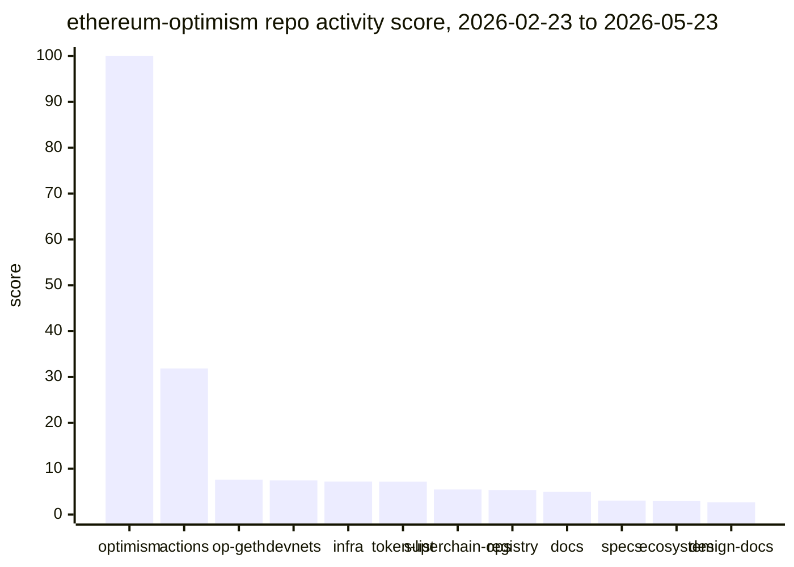
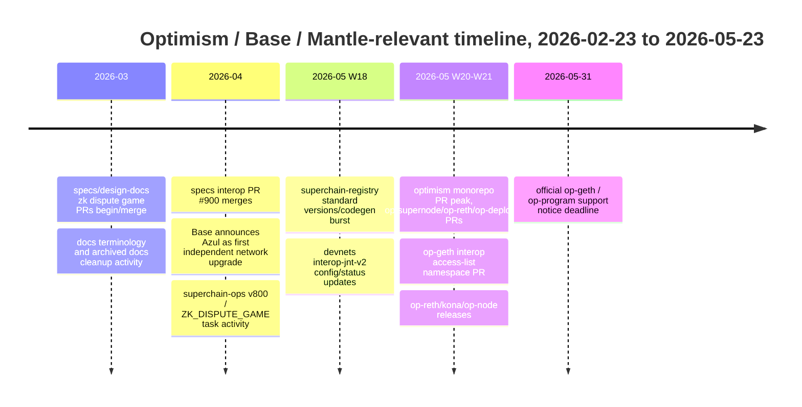
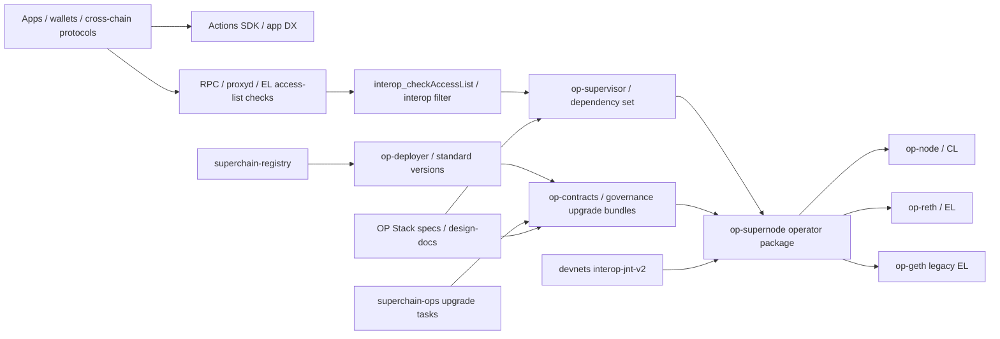

# Optimism 近期开发与叙事分析 - Round 1 Draft

## 1. Executive Summary

本轮重新研究没有沿用旧 Optimism artifact 的结论，而是先从 GitHub 可见组织清单做数据驱动扫描。抓取窗口固定为 **2026-02-23T00:00:00Z 至 2026-05-23T15:16:27Z**。主扫描对象是 `ethereum-optimism` GitHub organization；共发现 **139 个可见 repo**，其中 **53 个 archived、39 个 fork、105 个在窗口内无 PR/commit 活动**。`oplabs` 经 GitHub org API 验证为 **Origin Protocol Labs**，不是 OP Labs；`op-rs` 是独立 Rust 协议社区组织，未验证为 Optimism-owned primary org；`ethereum-optimism-archive` 未能通过 org API 访问。因此本 draft 只把 `ethereum-optimism/*` 作为 Optimism-owned primary evidence，其他 org 仅作为排除或背景风险处理。

核心结论：

1. **Optimism 近期工程活动高度集中在 `ethereum-optimism/optimism` monorepo。** 该 repo 在窗口内有 1,202 个新 PR、751 个 merged PR、761 个 commit、98 个 PR 作者，综合活跃度 score 100。第二名 `actions` 虽然 score 31.87，但主要是 DeFi Actions SDK / app-level DX，不是 OP Stack 核心协议。协议相关第二梯队是 `op-geth`、`devnets`、`infra`、`superchain-ops`、`superchain-registry`、`specs`、`design-docs`。
2. **开发重点正在从单纯 OP Stack 上游维护，转向 interop / op-supernode / op-supervisor、op-reth/kona、标准化部署与 governance registry。** `optimism` monorepo 最新 PR 中反复出现 `op-supernode`、`op-supervisor`、`interopgen`、`op-reth`、`kona`、`op-deployer`、`op-contracts/v7.0.0-rc.*`、`op-program` 等路径。`devnets` 与 `superchain-ops` 的活跃度显示这些变化不只是文档叙事，已经进入 devnet、upgrade task、registry/codegen 和 operator tooling。
3. **`op-geth` 仍活跃但更像 maintenance / compatibility surface，而不是新增战略重心。** 它在窗口内有 21 个 PR、12 个 merged PR、7 个 release；代表 PR 包括 engine API error refactor、superchain-registry bump、interop access-list namespace migration。官方 docs notice 同时写明 `op-geth` / `op-program` 支持到 **2026-05-31**，并要求迁移到 `op-reth` / `cannon-kona`，这使 Mantle 必须把执行层迁移或自维护作为 P0 watch item。
4. **叙事上，Optimism 更清晰地站在 "Superchain interoperability + standardization/governance + modular client stack"。** 这与 GitHub 活动互相支撑：interop specs、supernode/supervisor 代码、devnet、superchain registry、op-deployer/contracts release candidates 同时活跃。部分 proof / ZK dispute game 方向还处在 specs/design-docs/upgrade task 层，不能写成 mainnet-ready。
5. **Base 独立化不是 "离开 Superchain" 的同义词。** Base 官方 Azul blog 称 Azul 是 Base first independent network upgrade，targeting mainnet activation on 2026-05-13；技术内容包括 consolidating onto `base-reth-node` + `base-consensus`, dropping other clients, multiproofs, and Flashblocks payload changes. 这说明 Base 在 client / cadence / product-performance 叙事上独立化，但不能由此推断 Base 已退出 Superchain 或与 Optimism 治理完全脱钩。对 Mantle 来说，Base 路线是竞争压力和组件借鉴来源，不是唯一迁移路径。
6. **对 Mantle 的直接影响分四层：** P0 跟踪 op-geth EOL、op-reth/kona maturity、interop access-list / supervisor namespace、op-contracts v7 / registry upgrade；P1 做 op-supernode/operator packaging、devnet test harness、proof reproducibility POC；P2 谨慎评估 Base Stack / full Superchain governance / direct op-reth migration；叙事上强调 Mantle 的 DA/economics/MNT/enterprise/performance differentiation，避免只做 OP/Base follower。

置信度：GitHub 活动与 PR-level evidence 为 **high**；Base/Optimism positioning 为 **medium-high**；未来路线、mainnet activation、"资源迁移" 为 **medium**，因为只能从公开 PR、release、docs 推断，不能证明内部 staffing。

## 2. Item Findings

### Item 1 - GitHub org/repo 全量扫描、窗口定义与活跃度评分

**查询范围与时间。** 使用 `gh api` 对 `orgs/ethereum-optimism/repos` 做分页扫描，窗口为 `since=2026-02-23T00:00:00Z`。每个 repo 拉取：repo metadata、PR created/merged/open/closed、unique PR authors、bot PR、commit count、release list。抓取完成时间：2026-05-23T15:11:56Z；rate limit 检查显示 core remaining 4,741/5,000，search remaining 27/30，graphql remaining 4,789/5,000。期间一次 paginated PR request 出现 transient connection reset，已用 backoff 重跑并完成。

**组织 provenance。**

| org / repo source | 状态 | 本 draft 处理 |
|---|---|---|
| `ethereum-optimism` | GitHub org API 返回 login `ethereum-optimism`, name `Optimism`, public_repos 139 | 作为 Optimism-owned primary source |
| `oplabs` | GitHub org API 返回 name `Origin Protocol Labs`, description 指向 OriginProtocol | 排除；不是 OP Labs/Optimism primary org |
| `op-rs` | GitHub org API 返回 name `op-rs`, description `open source protocol rust`，未发现 Optimism ownership 证据 | 不作为 Optimism-owned evidence；仅背景 |
| `ethereum-optimism-archive` | org API 404 / 不可见 | 不纳入；不能猜测 ownership |
| forks / mirrors | 在 `ethereum-optimism` inventory 中标记 fork | 不进入 primary deep PR review，除非与 OP-owned operational surface 直接相关 |

**排序公式。**

```
score = 100 * (
  0.30 * PR_created_norm
  + 0.25 * PR_merged_norm
  + 0.25 * commit_count_norm
  + 0.20 * unique_PR_authors_norm
)
```

该 score 是 repo-level ranking，不等价于战略重要性。release/tag、issue/discussion、stars/forks 作为解释字段，不进入主 score，避免 token-list 或 historical repo 因 star/fork 被抬高。

**全 inventory 结果摘要。**

| 指标 | 数值 |
|---|---:|
| 可见 repo 总数 | 139 |
| archived repo | 53 |
| fork repo | 39 |
| 窗口内 PR=0 且 commit=0 | 105 |
| 窗口内有 PR 或 commit | 34 |

**Top 30 ranking。**

| rank | repo | provenance | lang | PR | merged | open | commits | authors | bot PR | score | note |
|---:|---|---|---|---:|---:|---:|---:|---:|---:|---:|---|
| 1 | `optimism` | active official | Go/Rust/Solidity | 1202 | 751 | 194 | 761 | 98 | 42 | 100.00 | monorepo: core protocol, clients, contracts, devnet tooling |
| 2 | `actions` | active official | TypeScript | 86 | 51 | 17 | 760 | 15 | 12 | 31.87 | DeFi Actions SDK / app-level DX |
| 3 | `op-geth` | active official | Go | 21 | 12 | 4 | 123 | 13 | 0 | 7.62 | execution client maintenance / interop compatibility |
| 4 | `devnets` | active official | Python | 63 | 61 | 1 | 61 | 9 | 0 | 7.44 | interop devnet configs and status |
| 5 | `infra` | active official | Go | 72 | 29 | 34 | 29 | 17 | 19 | 7.18 | proxyd / infra ops / CI |
| 6 | `ethereum-optimism.github.io` | active official | TypeScript | 35 | 6 | 26 | 18 | 27 | 2 | 7.17 | token list; high external contributor noise |
| 7 | `superchain-ops` | active official | Solidity | 50 | 36 | 5 | 36 | 9 | 0 | 5.47 | upgrade / Safe / operational tasks |
| 8 | `superchain-registry` | active official | Go | 40 | 19 | 7 | 20 | 15 | 0 | 5.35 | source of truth for Superchain chains/configs |
| 9 | `docs` | archived official | MDX | 26 | 10 | 6 | 40 | 13 | 0 | 4.95 | archived docs repo; use current docs site as primary |
| 10 | `specs` | active official | Python/MD | 15 | 6 | 8 | 7 | 11 | 0 | 3.05 | OP Stack specs |
| 11 | `ecosystem` | active official | TypeScript | 28 | 9 | 11 | 9 | 8 | 16 | 2.93 | ecosystem apps / release automation |
| 12 | `design-docs` | active official | markdown | 13 | 7 | 4 | 8 | 9 | 0 | 2.66 | design proposals / FMA docs |
| 13 | `factory` | active official | workflow | 18 | 17 | 0 | 17 | 1 | 0 | 1.78 | secure artifact build workflows |
| 14 | `circleci-utils` | active official | Python | 4 | 3 | 1 | 7 | 2 | 0 | 0.84 | CI utility |
| 15 | `monitorism` | active official | Go | 5 | 3 | 0 | 3 | 2 | 0 | 0.73 | monitoring suite |
| 16 | `op-injection-scanner` | active official | TypeScript | 3 | 3 | 0 | 6 | 1 | 0 | 0.58 | MCP prompt-injection scanner |
| 17 | `blob-archiver` | active fork | Go | 3 | 1 | 1 | 2 | 2 | 0 | 0.58 | fork; not primary protocol signal |
| 18 | `superchain-starter` | active official | TypeScript | 2 | 0 | 2 | 0 | 2 | 2 | 0.46 | Superchain starter |
| 19 | `supersim` | active official | Go | 2 | 0 | 2 | 0 | 2 | 1 | 0.46 | local multi-L2 dev env |
| 20 | `superchain-starter-superchainerc20` | active fork | TypeScript | 2 | 0 | 2 | 0 | 2 | 2 | 0.46 | interop example fork |
| 21 | `superchain-starter-xchain-flash-loan-example` | active fork | TypeScript | 2 | 0 | 2 | 0 | 2 | 2 | 0.46 | interop example fork |
| 22 | `bailiff` | active official | Go | 2 | 2 | 0 | 2 | 1 | 0 | 0.39 | ops/tooling |
| 23 | `presigner` | active official | Go | 1 | 1 | 0 | 3 | 1 | 0 | 0.36 | multisig tx presigner |
| 24 | `rollup-boost` | active fork | - | 5 | 0 | 5 | 0 | 1 | 5 | 0.33 | fork; bot-heavy |
| 25 | `op-analytics` | active official | Notebook | 1 | 1 | 0 | 1 | 1 | 0 | 0.30 | analytics |
| 26 | `synpress` | active fork | - | 2 | 0 | 2 | 0 | 1 | 2 | 0.25 | fork |
| 27 | `OPerating-manual` | active official | - | 1 | 0 | 1 | 0 | 1 | 0 | 0.23 | governance manual |
| 28 | `superchain-relayer` | active official | TypeScript | 1 | 0 | 1 | 0 | 1 | 1 | 0.23 | message relayer interface |
| 29 | `superchainerc20-starter` | active official | TypeScript | 1 | 0 | 1 | 0 | 1 | 1 | 0.23 | starter kit |
| 30 | `super-cli` | active official | TypeScript | 1 | 0 | 1 | 0 | 1 | 1 | 0.23 | Superchain CLI |

**Sensitivity check。**

| 单指标排序 | Top 10 |
|---|---|
| PR created | `optimism`, `actions`, `infra`, `devnets`, `superchain-ops`, `superchain-registry`, `ethereum-optimism.github.io`, `ecosystem`, `docs`, `op-geth` |
| commits | `optimism`, `actions`, `op-geth`, `devnets`, `docs`, `superchain-ops`, `infra`, `superchain-registry`, `ethereum-optimism.github.io`, `factory` |
| unique authors | `optimism`, `ethereum-optimism.github.io`, `infra`, `actions`, `superchain-registry`, `op-geth`, `docs`, `specs`, `devnets`, `superchain-ops` |

结论：Top 1 稳定为 `optimism`。Top 2-12 的排序会因指标不同移动，但协议相关深挖对象稳定落在 `op-geth`、`devnets`、`infra`、`superchain-ops`、`superchain-registry`、`specs`、`design-docs`；`actions`、token list、archived docs、ecosystem repos 作为 DX / ecosystem context，而不是 OP Stack core conclusions 的主证据。

### Item 2 - Top 活跃 repo 选择与概况

**深度 PR review Top set。** 为满足 scope control，deep PR review 不覆盖所有 1,202 个 monorepo PR，而是采用两层集合：

- **Data Top context set**：ranking Top 12 全部进入 overview 表。
- **Protocol-relevant deep set**：`optimism`、`op-geth`、`devnets`、`infra`、`superchain-ops`、`superchain-registry`、`specs`、`design-docs`。这些 repo 与 OP Stack client、interop、devnet、registry、contracts/governance、spec/design 有直接关系。
- **DX/ecosystem watch set**：`actions`、`ethereum-optimism.github.io`、`ecosystem`、`docs`。这些 repo 高活跃但混入 app-level、token-list、archived-docs 或 bot/dependabot activity，不能直接当作 protocol roadmap。

| repo | 功能定位 | 选择理由 | 是否 deep review |
|---|---|---|---|
| `optimism` | OP Stack monorepo: op-node, op-supernode, op-supervisor, op-reth, kona, op-program, op-deployer, op-contracts | activity absolute dominant; releases 49 since window | yes |
| `op-geth` | execution client fork | Mantle direct upstream risk; support/EOL notice; 7 releases | yes |
| `devnets` | devnet configs and deployment status | interop-jnt-v2 config/status PRs show rollout/testing activity | yes |
| `infra` | proxyd, op-acceptor, operational tooling | interop/proxyd namespace and infra changes affect operators/RPC | yes |
| `superchain-ops` | upgrade execution tasks, multisig/Safe operations | v800, OPCM, ZK_DISPUTE_GAME, migration task PRs | yes |
| `superchain-registry` | source-of-truth registry and standard versions | op-contracts RC entries, proof-game params, codegen updates | yes |
| `specs` | OP Stack specs | interop, SDM, zk dispute game, Osaka/Karst specs | yes |
| `design-docs` | design proposals / FMA docs | ZK dispute game, shared dispute game, compliance module, EIP-8130 | yes |
| `actions` | DeFi Actions SDK / app-level DX | high activity, but not core protocol | context only |
| `ethereum-optimism.github.io` | token list | high contributor count mostly token-list PRs | context only |
| `docs` | archived docs repo | activity exists but repo archived; current docs site used for primary docs | context only |
| `ecosystem` | ecosystem apps and automation | bot/deps-heavy | context only |

### Item 3 - Top repo PR 活动趋势、贡献者结构

| repo | PR | merged | human authors | bot PR | median merge hours | peak week | trend interpretation |
|---|---:|---:|---:|---:|---:|---|---|
| `optimism` | 1202 | 751 | 94 | 42 | 20.3 | 2026-W21 | Weekly PRs rose from 50 in W09 to 129 in W21; active development accelerated into May |
| `actions` | 86 | 51 | 13 | 12 | 54.3 | 2026-W16 | App/DX work; not protocol core |
| `op-geth` | 21 | 12 | 13 | 0 | 19.0 | 2026-W18 | Low but steady maintenance and compatibility work |
| `devnets` | 63 | 61 | 9 | 0 | 0.1 | 2026-W18 | Very fast merge latency; config/status automation and operational churn |
| `infra` | 72 | 29 | 16 | 19 | 11.9 | 2026-W13 | Infra/proxyd/CI changes; open PR load high |
| `ethereum-optimism.github.io` | 35 | 6 | 26 | 2 | 0.1 | 2026-W21 | Token submissions dominate; high external authors |
| `superchain-ops` | 50 | 36 | 9 | 0 | 43.9 | 2026-W20 | Upgrade/migration task activity concentrated in May |
| `superchain-registry` | 40 | 19 | 15 | 0 | 1.2 | 2026-W18 | Codegen and registry updates, with burst in W18-W21 |
| `docs` | 26 | 10 | 13 | 0 | 0.2 | 2026-W13 | Archived repo; current docs site should supersede |
| `specs` | 15 | 6 | 11 | 0 | 20.7 | 2026-W14 | Lower volume but high signal |
| `ecosystem` | 28 | 9 | 6 | 16 | 8.5 | 2026-W16 | bot/deps-heavy |
| `design-docs` | 13 | 7 | 9 | 0 | 217.8 | 2026-W17 | Long review cycles; design docs have high strategic signal |

**Contributor concentration.** In `optimism`, top PR authors were `ajsutton(256)`, `karlfloersch(84)`, `maurelian(66)`, `smartcontracts(57)`. This is a strong OP Labs/core-maintainer signal, not just community drive-by activity. `devnets` is concentrated around `jelias2(32)` and automation/bots; `superchain-ops` around `Wazabie`, `stevennevins`, `Ethnical`, `JosepBove`; `superchain-registry` around `opgitgovernance`, `stevennevins`, `Wazabie`.

### Item 4 - PR 分类体系与主要开发方向归因

Method: PR title/body keyword grouping was used only as a triage layer, then representative PRs were manually spot-checked by file paths/body. Counts below are **multi-label and directional**; they should not be added as totals.

| category | Directional evidence | representative PRs / sources | implementation status | Mantle impact |
|---|---|---|---|---|
| Superchain interop / dependency set | `optimism` PRs touch op-supernode/supervisor/interopgen; op-geth access-list namespace; devnet configs | [`optimism#20991`](https://github.com/ethereum-optimism/optimism/pull/20991), [`op-geth#791`](https://github.com/ethereum-optimism/op-geth/pull/791), [`devnets#333`](https://github.com/ethereum-optimism/devnets/pull/333), [`devnets#334`](https://github.com/ethereum-optimism/devnets/pull/334), [interop specs](https://specs.optimism.io/interop/overview.html) | merged/open mix; devnet/config active; not all mainnet-ready | direct watch; affects RPC namespace, EL/CL assumptions, operator packaging |
| op-supernode / op-supervisor / operator stack | op-supernode retry and op-supervisor cleanup/move PRs in monorepo; docs nav exposes current notices on interop/operator prep | [`optimism#20991`](https://github.com/ethereum-optimism/optimism/pull/20991), [`optimism#20997`](https://github.com/ethereum-optimism/optimism/pull/20997), [`optimism#20994`](https://github.com/ethereum-optimism/optimism/pull/20994) | active code, some open PRs | POC for Mantle operator packaging and observability |
| op-reth / Rust client / kona | op-reth payload service PR; releases `op-reth/v2.2.3`, `kona-node/v1.5.2`; official op-geth support notice | [`optimism#20983`](https://github.com/ethereum-optimism/optimism/pull/20983), [`op-reth/v2.2.3`](https://github.com/ethereum-optimism/optimism/releases/tag/op-reth%2Fv2.2.3), [op-geth deprecation notice](https://docs.optimism.io/notices/op-geth-deprecation) | active and released, but migration maturity must be validated | high; Mantle must evaluate shadow-node / Rust migration |
| Fault proof / Cannon / Kona / ZK dispute game | specs/design-docs PRs on zk dispute game, shared dispute game, FMA; superchain-ops tasks for ZK_DISPUTE_GAME | [`specs#896`](https://github.com/ethereum-optimism/specs/pull/896), [`specs#911`](https://github.com/ethereum-optimism/specs/pull/911), [`design-docs#368`](https://github.com/ethereum-optimism/design-docs/pull/368), [`design-docs#381`](https://github.com/ethereum-optimism/design-docs/pull/381), [`superchain-ops#1410`](https://github.com/ethereum-optimism/superchain-ops/pull/1410) | specs/design docs/upgrade tasks; mixed maturity | high but not "production-ready" unless specific chain/version verified |
| Contracts / governance / standardization | op-contracts v7 RC, SCR dep, registry standard version entries, OPCM upgrade tasks | [`optimism#20989`](https://github.com/ethereum-optimism/optimism/pull/20989), [`superchain-registry#1239`](https://github.com/ethereum-optimism/superchain-registry/pull/1239), [`superchain-ops#1424`](https://github.com/ethereum-optimism/superchain-ops/pull/1424), [`superchain-ops#1418`](https://github.com/ethereum-optimism/superchain-ops/pull/1418) | release candidate / registry / ops task | direct watch for Mantle bridge/contracts governance compatibility |
| Deployment / devnet / release engineering | 49 monorepo releases, devnet status online, CI migration, op-deployer artifacts | [`devnets#333`](https://github.com/ethereum-optimism/devnets/pull/333), [`superchain-ops#1423`](https://github.com/ethereum-optimism/superchain-ops/pull/1423), [`factory#38`](https://github.com/ethereum-optimism/factory/pull/38), [optimism releases](https://github.com/ethereum-optimism/optimism/releases) | active; some netchef/automation | medium-high; useful for Mantle release discipline |
| op-geth / execution maintenance | 21 PRs, 7 releases; engine API/refactor, registry bump, runtime images, access-list namespace | [`op-geth#790`](https://github.com/ethereum-optimism/op-geth/pull/790), [`op-geth#788`](https://github.com/ethereum-optimism/op-geth/pull/788), [`op-geth#794`](https://github.com/ethereum-optimism/op-geth/pull/794), [`op-geth releases`](https://github.com/ethereum-optimism/op-geth/releases) | maintenance-only / compatibility | critical for Mantle if still op-geth-derived |
| Docs / DX / ecosystem communication | `actions` and current docs show interop/app developer surface; token list and ecosystem repos noisy | [`actions#473`](https://github.com/ethereum-optimism/actions/pull/473), [Optimism docs notices](https://docs.optimism.io/notices/interop-prep) | app/DX; not protocol authority alone | medium; narrative and developer ecosystem |

### Item 5 - 重大功能变更与架构调整

#### 5.1 Superchain interop / op-supernode / supervisor

Evidence:

- [`optimism#20991`](https://github.com/ethereum-optimism/optimism/pull/20991) moves engine controller initialization into the `Start()` restart loop in `op-supernode/supernode/chain_container`, explicitly fixing persistent `ErrNoEngineClient` that blocked interop activity if the EL was unreachable at startup.
- [`op-geth#791`](https://github.com/ethereum-optimism/op-geth/pull/791) changes the access-list check from `supervisor_checkAccessList` to `interop_checkAccessList` and says the deprecated `supervisor` namespace will be removed after `optimism#20778` is deployed everywhere this op-geth talks to.
- `devnets#333/#334` update `dev/interop-jnt-v2` configs/status and add external annotations, showing interop work has active devnet surfaces.
- OP Stack specs have explicit interop and dependency-set pages: [overview](https://specs.optimism.io/interop/overview.html), [dependency set](https://specs.optimism.io/interop/dependency-set.html).

Interpretation: This is the strongest engineering-heavy direction. It is not just a blog narrative: code paths touch CL/EL coordination, access-list checks, engine-controller lifecycle, devnet configs, and operator workflows. However, many PRs are open or devnet-only, so final report should avoid phrasing this as fully mainnet active across Superchain.

Mantle implication: track namespace/API changes (`interop_*` vs `supervisor_*`), dependency-set semantics, supervisor failure modes, and op-supernode packaging. Any Mantle interop narrative should be gated on devnet test harness and explicit user-facing product commitment.

#### 5.2 op-reth / kona / Rust client stack

Evidence:

- [`optimism#20983`](https://github.com/ethereum-optimism/optimism/pull/20983) adds an OP-specific payload service builder to keep `op-reth` payload service on Tokio runtime until upstream reth OS-thread lifecycle is handled; files include `rust/op-reth/crates/node/src/payload_service.rs`.
- Monorepo releases in the window include `op-reth/v2.2.3` and `kona-node/v1.5.2` on 2026-05-18/19.
- Current Optimism docs notice [End of Support for op-geth and op-program](https://docs.optimism.io/notices/op-geth-deprecation) describes support through May 31, 2026 and migration to `op-reth` / `cannon-kona`.

Interpretation: The Rust path is real and urgent. It is not only a future aspiration: release tags exist, PRs fix concrete runtime lifecycle issues, and docs create an EOL pressure date. But "op-reth production replacement is low-risk" is unsupported; the PR evidence itself shows active bug-fixing around runtime teardown.

Mantle implication: run an op-reth/kona compatibility spike, including Mantle-specific economics/system tx/gas behavior, not a direct blind migration. If Mantle remains on op-geth after upstream support ends, it owns more security/maintenance risk.

#### 5.3 Contracts / registry / governance standardization

Evidence:

- [`optimism#20989`](https://github.com/ethereum-optimism/optimism/pull/20989) updates op-deployer's Superchain Registry dependency to include `op-contracts/v7.0.0-rc.3`.
- [`superchain-registry#1239`](https://github.com/ethereum-optimism/superchain-registry/pull/1239) adds new standard versions entries for `op-contracts/v7.0.0-rc.3`.
- `superchain-registry` has many automated codegen update PRs in May 2026.
- `superchain-ops` has V800, OPCM, permissioned-to-permissionless, and devnet upgrade task PRs such as [`#1410`](https://github.com/ethereum-optimism/superchain-ops/pull/1410), [`#1418`](https://github.com/ethereum-optimism/superchain-ops/pull/1418), [`#1423`](https://github.com/ethereum-optimism/superchain-ops/pull/1423), [`#1424`](https://github.com/ethereum-optimism/superchain-ops/pull/1424).

Interpretation: Optimism's "standardization" narrative is backed by registry and ops activity. The Registry is not passive documentation; it is a dependency for op-deployer and op-geth. This increases the cost for OP-derived chains that diverge from standard config/contract bundles.

Mantle implication: maintain a monthly diff dashboard against `superchain-registry`, `op-contracts`, `op-deployer`, and `superchain-ops`; map each upgrade bundle to Mantle's bridge/proxy/admin assumptions before borrowing.

#### 5.4 Fault proofs / ZK dispute game / proof reproducibility

Evidence:

- [`specs#896`](https://github.com/ethereum-optimism/specs/pull/896) and [`specs#911`](https://github.com/ethereum-optimism/specs/pull/911) address zk dispute game specs.
- [`design-docs#368`](https://github.com/ethereum-optimism/design-docs/pull/368), [`#369`](https://github.com/ethereum-optimism/design-docs/pull/369), [`#381`](https://github.com/ethereum-optimism/design-docs/pull/381) address zk dispute game / Super ZK Dispute Game / FMA material.
- [`superchain-ops#1410`](https://github.com/ethereum-optimism/superchain-ops/pull/1410) adds `ZK_DISPUTE_GAME` slot to OPCM upgrade; [`#1421`](https://github.com/ethereum-optimism/superchain-ops/pull/1421) guards against CANNON respected game type.
- `superchain-registry#1232` proposes standard proof-game timing params.

Interpretation: Strong signal that proof-system evolution is active, but the state is mixed: some specs/design docs open, some upgrade tasks merged, chain-specific activation requires separate validation. Treat as roadmap/upgrade-prep, not automatically live security.

Mantle implication: borrow reproducibility discipline and multi-proof/alt-proof evaluation framework; do not claim parity with Optimism/Base proof posture unless Mantle-specific prover/verifier, chain config, and governance paths are verified.

### Item 6 - 开发重点变化判断

| Claim | Evidence | Confidence | Caveat |
|---|---|---|---|
| Activity remains centered on `optimism` monorepo, not distributed across many repos | 1,202 PRs vs next repo 86; weekly PRs rising to W21 | high | monorepo can hide submodule shifts |
| Within/around monorepo, hot surfaces are interop/supernode/supervisor, op-reth/kona, deployer/contracts, proof systems | representative PRs and release tags | high | category counts are multi-label and overcount |
| `op-geth` is maintenance/compatibility rather than new-feature center | 21 PRs, 7 releases; docs EOL notice; access-list/runtime/registry fixes | medium-high | still critical because Mantle may depend on it |
| Registry/ops standardization is a real resource allocation line | `superchain-registry` and `superchain-ops` May burst | high | registry automation PRs may inflate activity |
| Optimism is responding to Base independence by emphasizing Superchain coordination / standardization | official interop/spec/docs + GitHub activity | medium | no direct official "response to Base" statement found; this is an inference |

Key comparison to old intuition: If the old analysis assumed only `optimism` and `op-geth`, it missed important second-tier activity in `devnets`, `superchain-ops`, `superchain-registry`, `infra`, `specs`, and `design-docs`. If it assumed `op-geth` is still the center of gravity, the new data contradicts that.

### Item 7 - Optimism 叙事演变

**Engineering-heavy + narrative-backed themes:**

- **Superchain interop:** specs pages exist, devnets are active, op-supernode/supervisor PRs are active, op-geth namespace migration references `interop_checkAccessList`.
- **Standardization/governance:** registry and ops repos are active; op-contracts v7 RC entries propagate through Registry and op-deployer.
- **Modular client stack:** op-reth/kona releases and op-geth/op-program support notice make the migration concrete.

**Narrative-heavy or not yet production-proven themes:**

- **ZK dispute game / Super ZK Dispute Game:** active specs/design docs and some ops tasks, but several PRs remain open and chain activation requires independent verification.
- **Full interop product readiness:** devnet and code evidence is strong, but final report should distinguish devnet/testnet/mainnet and avoid over-promising user-facing readiness.

**Evidence map.**

| Narrative | GitHub evidence | Official/public evidence | Draft judgment |
|---|---|---|---|
| Superchain interop | `optimism#20991`, `op-geth#791`, `devnets#333/#334`, specs interop pages | Optimism docs notices and specs | strong, active development |
| Standard chain/governance/control plane | `superchain-registry#1239`, `optimism#20989`, `superchain-ops#1418/#1424` | Registry and governance docs | strong for standardization |
| Client modularity / op-reth | `op-reth/v2.2.3`, `kona-node/v1.5.2`, `optimism#20983` | op-geth support notice | strong, with migration risk |
| Fault proof / ZK dispute | specs/design-docs/ops PRs | specs/design docs | medium; do not overstate deployment |
| Developer ecosystem / actions | `actions` 86 PRs | app docs / SDK repos | real but not protocol core |

### Item 8 - Base 独立化后的 Optimism 定位

Base official source [Introducing Base Azul](https://blog.base.dev/introducing-base-azul) states Azul is Base's first independent network upgrade, was live on Base Sepolia at publication, and was targeting Base Mainnet activation on 2026-05-13. The same source says Azul consolidates Base onto `base-reth-node` + `base-consensus`, drops support for other clients, includes multiproofs, and changes Flashblocks websocket payload size. Official GitHub repos also show [`base/base`](https://github.com/base/base) as "All components used to run Base" and [`base/node`](https://github.com/base/node) as "Everything required to run your own Base node"; `base/base` latest release at verification time was `v0.9.0` published 2026-05-21.

This supports the following distinction:

| Dimension | Optimism | Base | Mantle implication |
|---|---|---|---|
| Strategic center | Superchain coordination, interop, standardization, governance/control plane | Product/performance cadence, Coinbase distribution, independent client stack | Mantle should avoid choosing "follow OP" or "switch to Base" as a binary framing |
| Client path | OP mainline migration to op-reth/kona; op-geth EOL | Base-specific `base-reth-node` + `base-consensus` | Evaluate OP op-reth and Base stack separately |
| Proof direction | Cannon/Kona + ZK dispute game design/ops signals | Azul multiproof TEE + ZK | Mantle can borrow proof topology ideas but must map to its SP1/ZK/DA path |
| Interop | Superchain dependency set / supervisor / op-supernode | likely member/participant context, but Base client cadence independent | Do not equate Base tech independence with Superchain exit |
| Product narrative | multi-chain interoperability and governance | global finance, payments, performance, agents | Mantle needs own differentiation: MNT economics, DA/proof strategy, enterprise/perf |

Unsupported claim to avoid: "Base left Optimism/Superchain." The evidence supports "Base is technically independent in client stack and upgrade cadence"; it does not prove governance or ecosystem separation.

### Item 9 - 对 Mantle 的直接影响与竞争启示

#### Must Track / 防守

| Area | Why | Concrete watch item |
|---|---|---|
| op-geth EOL | official support notice creates near-term risk | `op-geth` releases, security fixes, EOL date, Mantle fork delta |
| op-reth/kona maturity | likely replacement path but still active bug-fix surface | shadow node, payload service lifecycle, historical sync, Mantle economics tests |
| interop access-list / supervisor namespace | RPC/API and validation changes can break derived stacks | `interop_checkAccessList`, dependency set, op-supernode failure modes |
| op-contracts v7 / registry | standard chain config and upgrade bundles affect compatibility | SCR standard versions, op-deployer dependency bumps, upgrade tasks |
| proof systems | Stage/security narrative pressure | Cannon/Kona reproducibility, zk dispute game specs, OP Succinct / SP1 interaction |

#### Worth POC / 值得借鉴

- op-supernode operator packaging and restart/error-handling model.
- devnet config/status discipline (`interop-jnt-v2` style).
- registry-driven standard version tracking.
- proof-game reproducibility and alt-proof evaluation framework.
- release dashboard that separates merged, released, testnet/devnet, and mainnet-active.

#### Caution / 不适合直接照搬

- Do not directly adopt full Superchain governance unless Mantle accepts governance/economic implications.
- Do not assume op-reth migration is "free"; Mantle-specific fee/MNT/system tx behavior needs golden tests.
- Do not treat Base Stack as a drop-in OP Stack replacement; Base has its own client and product cadence.
- Do not market interop as short-term product without devnet -> testnet -> mainnet evidence.

#### Competition narrative response

Mantle should frame itself as:

- OP-derived but not passively OP-following.
- DA/economics/product differentiated: MNT gas/economics, DA strategy, enterprise/payment/settlement workloads.
- Proof-roadmap aware: SP1 / OP Succinct / ZK path must be presented as Mantle-specific security evolution, not borrowed marketing.
- Performance pragmatic: use Base/Optimism learnings, but measure Mantle demand-bound vs supply-bound bottlenecks before promising Flashblocks-style gains.

### Item 10 - 证据完整性、反例和风险控制

| Risk | Draft handling |
|---|---|
| GitHub API pagination/rate-limit | Full visible inventory scanned; rate-limit state recorded; one transient reset retried |
| `optimism` monorepo hides path-level activity | Deep claims use representative path-level PRs, not only PR totals |
| Keyword category overcount | Category counts treated as directional; representative PRs manually spot-checked |
| High-activity repo may be low protocol relevance | `actions`, token list, archived docs, ecosystem separated as context |
| Low-activity repo may be strategic | `op-geth`, `specs`, `design-docs` included despite lower score |
| Open PR mistaken for shipped | Tables label open/merged/released/devnet/spec separately |
| Base independence overstated | Draft distinguishes technical/client independence from Superchain membership/governance |
| Non-official org contamination | `op-rs`, `oplabs`, archive/forks excluded unless ownership verified |

## 3. Diagrams

### diag-1 - Repo 活跃度排行榜



### diag-2 - Top repo PR 分类矩阵

| repo | dominant signal | secondary signal | representative PRs | status | Mantle impact |
|---|---|---|---|---|---|
| `optimism` | interop/supernode, op-reth/kona, contracts/deployer | CI/release, proof programs | `#20991`, `#20983`, `#20989` | open+merged+released | high |
| `op-geth` | execution maintenance | interop access-list namespace | `#790`, `#791`, `#788` | merged/open/closed mix | critical |
| `devnets` | interop-jnt-v2 devnet status/config | op-deployer artifacts | `#333`, `#334` | merged | high for test harness |
| `infra` | proxyd / infra / CI | interop namespace and consensus tracker | `#623`, `#622`, proxyd releases | open+merged | medium-high |
| `superchain-ops` | upgrade tasks / OPCM / v800 | proof-game migration | `#1410`, `#1418`, `#1423`, `#1424` | mostly merged/open | high |
| `superchain-registry` | standard versions / codegen | proof timing params | `#1239`, `#1232` | merged/open | high |
| `specs` | interop, SDM, zk dispute, Osaka/Karst | docs cleanup | `#900`, `#908`, `#896`, `#911` | merged/open | medium-high |
| `design-docs` | ZK dispute game / FMA | compliance module, EIP-8130 | `#368`, `#369`, `#381`, `#380` | merged/open | medium |

### diag-3 - 近 3 个月工程/叙事时间线



### diag-4 - Superchain interop / client stack relationship



### diag-5 - Optimism vs Base vs Mantle 定位对比

| Dimension | Optimism | Base | Mantle |
|---|---|---|---|
| Core narrative | Superchain coordination, interop, standardization | global finance, performance, independent Base stack | OP-derived L2 with DA/economics/product differentiation |
| Client path | op-reth/kona migration, op-geth EOL | base-reth-node + base-consensus | must choose OP mainline, Base-derived component, or self-maintain |
| Interop | dependency set, supervisor/supernode, Superchain registry | participates in broader OP/Superchain context but independent cadence | should validate before product commitment |
| Governance/control plane | Collective / Security Council / registry / op-contracts | Coinbase/Base-specific product cadence and governance topology | must preserve Mantle-specific governance/economics |
| Proof direction | Cannon/Kona + ZK dispute game design | multiproof TEE+ZK via Azul | SP1/OP Succinct/own proof route; verify per-chain |
| Competitive pressure on Mantle | upstream compatibility + Superchain narrative | product/performance/distribution | differentiation and execution discipline |

### diag-6 - Mantle response matrix

| Action bucket | Items | Impact | Confidence | Owner suggestion |
|---|---|---|---|---|
| Must track | op-geth EOL, op-reth/kona releases, interop namespace, op-contracts v7/SCR | critical | high | protocol/client lead |
| Must track | superchain-ops upgrade tasks, proof-game params, devnet statuses | high | medium-high | protocol/security |
| Worth POC | op-supernode packaging, interop devnet harness, registry diff dashboard | high | medium-high | infra/devops |
| Worth POC | shadow op-reth node with Mantle-specific golden tests | critical | medium | client team |
| Caution | full Base Stack migration, full Superchain governance adoption | high risk | medium | leadership + governance |
| Narrative response | DA/economics/MNT/enterprise/performance differentiation | medium-high | medium | strategy/ecosystem |

## 4. Source Coverage

| Requirement | Coverage | Notes |
|---|---|---|
| GitHub primary data | Met | Full `ethereum-optimism` visible repo inventory; PR/commit/release metrics; rate-limit caveat recorded |
| Repo-level PR evidence | Met | Representative PRs across monorepo, op-geth, devnets, infra, registry, ops, specs, design-docs |
| Optimism official docs/specs | Met | OP Stack specs interop pages, Optimism docs op-geth notice, GitHub releases |
| Base official/current sources | Partially met | Base Azul official blog/markdown, `base/base`, `base/node`, Base status page spot-check; did not rely on secondary sources for core Base claims |
| Existing Base/Mantle research | Used as context only | Local final sections cross-checked for Mantle framing; time-sensitive facts revalidated where possible |
| Secondary sources | Minimal | Not used for key claims except search discovery; final should prefer official links |

Primary source links used:

- GitHub org/repo/API: [`ethereum-optimism`](https://github.com/ethereum-optimism), [`optimism`](https://github.com/ethereum-optimism/optimism), [`op-geth`](https://github.com/ethereum-optimism/op-geth), [`devnets`](https://github.com/ethereum-optimism/devnets), [`infra`](https://github.com/ethereum-optimism/infra), [`superchain-ops`](https://github.com/ethereum-optimism/superchain-ops), [`superchain-registry`](https://github.com/ethereum-optimism/superchain-registry), [`specs`](https://github.com/ethereum-optimism/specs), [`design-docs`](https://github.com/ethereum-optimism/design-docs).
- Representative Optimism PRs: [`optimism#20991`](https://github.com/ethereum-optimism/optimism/pull/20991), [`optimism#20983`](https://github.com/ethereum-optimism/optimism/pull/20983), [`optimism#20989`](https://github.com/ethereum-optimism/optimism/pull/20989), [`op-geth#791`](https://github.com/ethereum-optimism/op-geth/pull/791), [`op-geth#790`](https://github.com/ethereum-optimism/op-geth/pull/790), [`devnets#333`](https://github.com/ethereum-optimism/devnets/pull/333), [`devnets#334`](https://github.com/ethereum-optimism/devnets/pull/334), [`superchain-registry#1239`](https://github.com/ethereum-optimism/superchain-registry/pull/1239), [`superchain-ops#1410`](https://github.com/ethereum-optimism/superchain-ops/pull/1410), [`specs#896`](https://github.com/ethereum-optimism/specs/pull/896), [`specs#900`](https://github.com/ethereum-optimism/specs/pull/900), [`specs#911`](https://github.com/ethereum-optimism/specs/pull/911), [`design-docs#368`](https://github.com/ethereum-optimism/design-docs/pull/368), [`design-docs#381`](https://github.com/ethereum-optimism/design-docs/pull/381).
- Releases: [`optimism releases`](https://github.com/ethereum-optimism/optimism/releases), [`op-geth releases`](https://github.com/ethereum-optimism/op-geth/releases).
- Official specs/docs: [OP Stack interop overview](https://specs.optimism.io/interop/overview.html), [Dependency Set spec](https://specs.optimism.io/interop/dependency-set.html), [End of Support for op-geth and op-program](https://docs.optimism.io/notices/op-geth-deprecation), [Optimism docs notices](https://docs.optimism.io/notices/interop-prep).
- Base official: [Introducing Base Azul](https://blog.base.dev/introducing-base-azul), [Introducing Base Azul markdown](https://blog.base.dev/introducing-base-azul.md), [`base/base`](https://github.com/base/base), [`base/node`](https://github.com/base/node), [Base Status](https://status.base.org/).

## 5. Gap Analysis

| Gap / unsupported area | Severity | Current handling |
|---|---|---|
| GitHub metrics do not include private repos or internal planning | medium | All "resource allocation" claims are public-evidence inferences |
| Path-level monorepo categorization is sampled, not exhaustive | medium | Use representative PRs; do not convert directional counts into precise category shares |
| `op-reth` production readiness not fully assessed | high | Mark as migration spike required |
| Interop mainnet readiness per chain not fully verified | high | Label as active/devnet/spec unless chain-specific evidence exists |
| Base Superchain membership/governance relation not fully revalidated in this pass | medium | Avoid "Base left Superchain" claim; only state Base client/cadence independence |
| Mantle production config not inspected in this draft | high | Mantle recommendations are watch/POC/gate items, not implementation assertions |
| `op-rs` / archive org ownership uncertain | low-medium | Excluded from primary evidence |
| L2Beat/on-chain governance / chain status not rechecked | medium | Not used as core support; final may add if needed |

**Claims not supported and should not appear in final without new evidence:**

- "Base has left the Superchain."
- "op-geth is dead today" or "op-geth no longer receives releases" (the data shows releases during the window).
- "op-reth is a drop-in production replacement for Mantle."
- "Superchain interop is mainnet-ready across all member chains."
- "ZK dispute game / Super ZK Dispute Game is fully deployed on OP Mainnet."
- "Mantle should join full Superchain governance."
- "High PR count in `actions` or token list proves Optimism protocol direction."

## 6. Revision Log

| Round | Action | Notes |
|---:|---|---|
| 1 | initial deep draft | Produced from approved outline commit `630e04dc4a754256d98343a22c8249929fe6b4a8`; carried forward org-provenance separation and scope-control caveats from outline review comment `2959bf6e-a192-4d5d-b8ef-44e25d9617c4`. |
