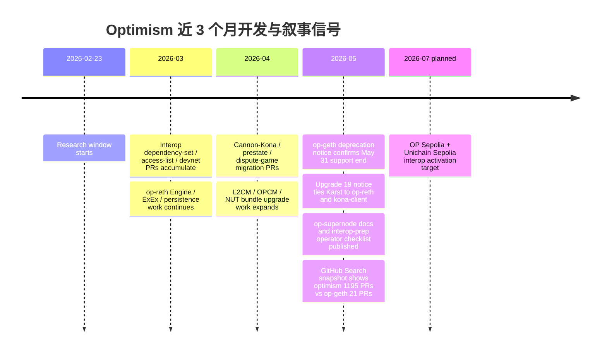
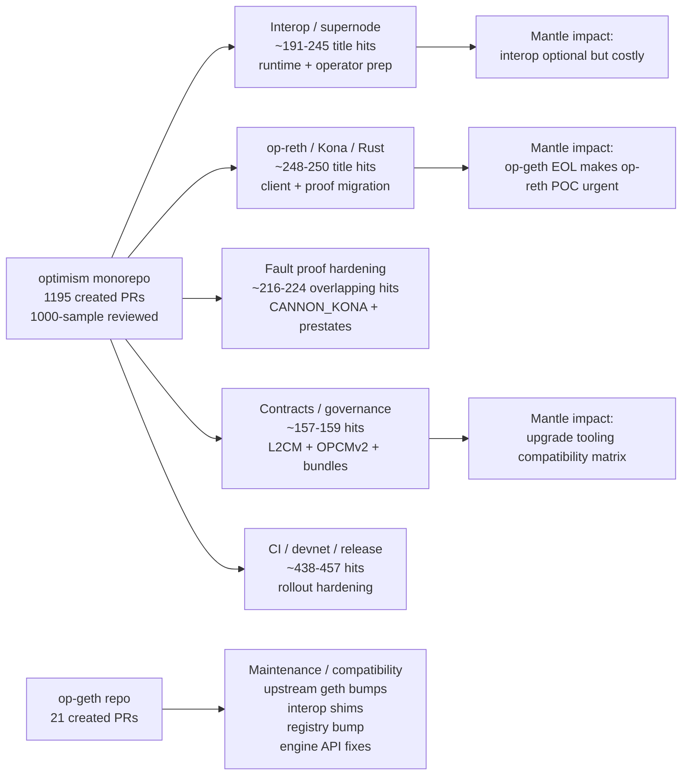
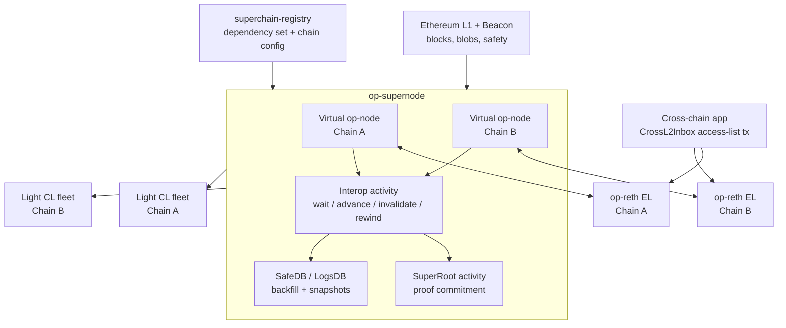
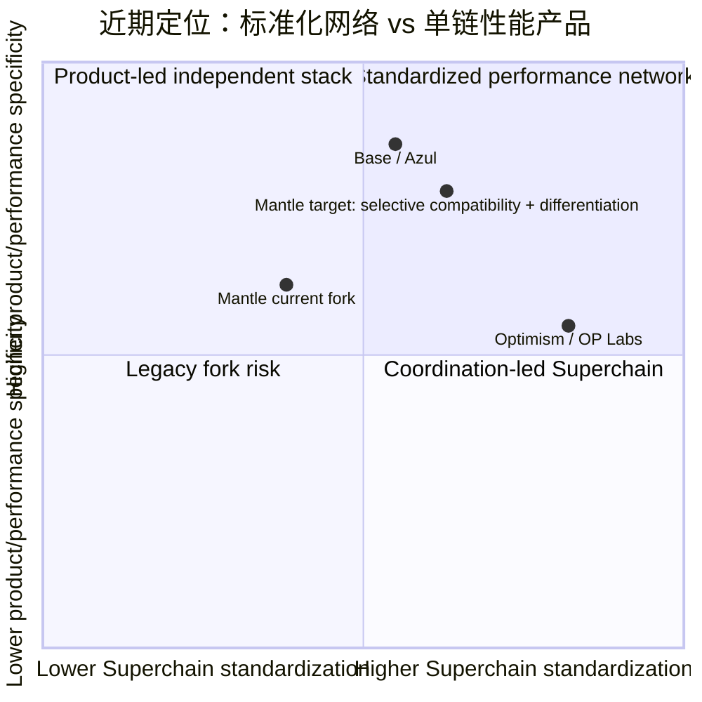
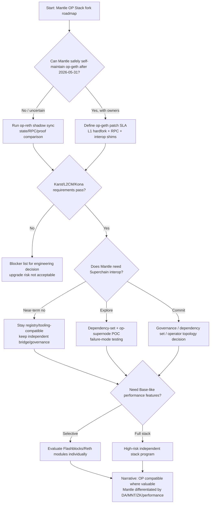

# Optimism 近期开发与叙事分析

## 1. Executive Summary

本轮研究的核心结论是：Optimism 近期的主线已经不能再被简化为"OP Stack 上游继续维护 op-node + op-geth"。从 2026-02-23 到 2026-05-23，`ethereum-optimism/optimism` 的 PR 活动量仍然非常高；更关键的是，官方 docs、代码路径和代表 PR 共同显示，Optimism 的工程重心正在转向三件事：Superchain interop / op-supernode 的多链运行时、op-reth / Kona 的 Rust 客户端与 fault-proof 路线、以及 L2CM / OPCMv2 / registry 驱动的多链标准化升级控制面。

可复现 GitHub Search 快照显示，`ethereum-optimism/optimism` 在窗口内约有 1195 个 created PR、188 个 open PR、1007 个 closed PR；另一个独立 merged-date 查询显示，约 779 个 PR 在 `2026-02-23..2026-05-23` 期间被合并。这里的 779 merged 不是说 1195 个 created PR 中已有 779 个在同一窗口内合并，因此不应与 created/open/closed 口径做精确状态分布加总。`ethereum-optimism/op-geth` 在同一窗口只有 21 个 created PR，其中 12 个在窗口内 merged、4 个 open、17 个 closed。后续复核时 GitHub API 已达到 rate limit，因此本 section 保留这些已抓取查询结果，并把重复查询失败列为 source gap。PR Tracker 每日报告在 issue 与仓库上下文中没有可访问路径或附件，本 section 按 dispatch caveat 标记为 unavailable，没有伪造 tracker 覆盖。

对 Mantle 最重要的决策含义：

- **op-geth 风险已从"上游更新较少"升级为"官方 EOL 和 Karst/Glamsterdam 不兼容"**。Optimism 官方 notice 写明 op-geth 支持到 2026-05-31；Karst / Upgrade 19 和 Glamsterdam 相关变更不会支持 op-geth。Mantle 如果继续维护 op-geth fork，需要把它视为自维护执行客户端路线，而不是继续等上游功能。
- **Interop 不是营销口号，已经有 operator topology 和代码路径**。OP Sepolia + Unichain Sepolia interop activation 目标在 2026 年 7 月；op-supernode、Light CL、dependency set、access-list validation、safe-head dependency check、cold-start/backfill/rewind hardening 都进入具体实现/运维阶段。但 production readiness 仍应标注为 active development / testnet rollout，而不是已成熟主网功能。
- **Fault proof 近期更像 hardening / migration / upgrade readiness，而不是全新叙事爆发**。Kona / CANNON_KONA、op-reth historical proofs、prestate、op-challenger 配置、Glamsterdam Defense 和 L2 gas/precompile 变更，说明重点在可复现、可迁移和升级边界。Mantle 若走 ZK / OP Succinct 路线，不能直接继承 OP Mainnet fault proof 安全叙事，但可以借鉴可复现 prestate、withdrawal proof retention 和 governance boundary。
- **Base 与 Optimism 的分化是"技术栈/节奏分化"，不是"Base 完全离开 Superchain"**。既有内部研究显示 Base Azul 更强调 base-reth-node、base-consensus、Multiproof、Flashblocks 和产品性能节奏；Optimism 当前更强调多链互操作、标准化 governance/upgrades 和 modular client stack。Mantle 不应把 Base 路线当成唯一迁移路径，也不能忽略 OP 上游标准化带来的兼容压力。
- **Mantle 的最务实路线是选择性跟踪，而不是全量追随或完全脱钩**。短期必须建立 op-geth EOL / op-reth / Karst / interop / op-contracts / registry watchlist；中期做 op-reth 并跑、historical proofs、interop dependency-set 和 L2CM upgrade tooling POC；长期再决定是否接入 Superchain interop、保持独立 fork、或吸收 Base-like Reth/Flashblocks 组件。

## 2. Item Findings

### item-1: PR 数据基线、口径和分类方法

本 section 使用三层口径：第一层是已抓取的 GitHub Search 总数；第二层是本地缓存 PR metadata 样本；第三层是对代表 PR 对应的 docs/code 文件做文件级验证。PR Tracker 每日报告未暴露路径，因此未纳入计数。

**PR baseline（window: 2026-02-23..2026-05-23，date_verified: 2026-05-23）**

| Repo | Created PR | Merged in window | Open | Closed | 口径与限制 |
|---|---:|---:|---:|---:|---|
| `ethereum-optimism/optimism` | 1195 | 779 | 188 | 1007 | 来自已执行 GitHub Search 查询；779 是窗口内 merged-date 查询结果，不一定是这 1195 个 created PR 的子集；closed 包含 merged；后续重复查询因 API rate limit 失败 |
| `ethereum-optimism/op-geth` | 21 | 12 | 4 | 17 | 来自已执行 GitHub Search 查询；12 是窗口内 merged-date 查询结果；窗口内 created PR 可人工枚举全部 21 个 |

**本地 PR metadata 样本**

| Repo sample | 样本规模 | State split | 说明 |
|---|---:|---|---|
| `optimism-prs-1000.json` | 1000 / 1195 | MERGED 627, CLOSED 205, OPEN 168 | 最近 1000 个 PR 样本，不等于全量；用于分类和代表 PR 选择；该 cache 未作为仓库 artifact 持久化 |
| `op-geth-prs.json` | 21 / 21 | MERGED 12, CLOSED 5, OPEN 4 | 覆盖窗口内全部 op-geth PR；该 cache 未作为仓库 artifact 持久化 |

**标题关键词分类只作为指示器，不能直接等同功能完成度**

| Category | optimism 1000-sample | op-geth all-21 | 解读 |
|---|---:|---:|---|
| Interop / dependency / access-list / LogsDB | 约 191-245 | 约 5-6 | interop 是最高信号类别之一；不同正则口径会显著改变计数 |
| op-supernode / supervisor / SafeDB / SuperRoot | 约 122-132 | 约 1 | supernode 已从 docs/spec 进入 runtime hardening |
| op-reth / Kona / Rust / proofs-history | 约 248-250 | 0 | 大量发生在 optimism monorepo Rust tree，不在 op-geth repo |
| Fault proof / Cannon / Kona / dispute / prestate | 约 216-224 | 0 | 与 op-reth/Kona 重叠较高，需按代表 PR/code 解释 |
| Contracts / governance / OPCM / L2CM / FeeVault | 约 157-159 | 0 | 体现多链 upgrade/control-plane 工程化 |
| op-geth keyword | 约 15 | 约 1 | op-geth 侧以维护/兼容 PR 为主 |
| CI / devnet / release / deps / test | 约 438-457 | 6 | 大仓噪音大，但也代表 rollout hardening 和 release engineering |

**代表 PR 选择规则**

本 section 选取代表 PR 时优先使用同时满足以下条件的 PR：标题明确指向协议/运行时/升级路径；能在 upstream docs 或当前代码路径中找到对应实现；对 Mantle 迁移/兼容/叙事有直接影响。没有把纯标题关键词当作功能完成证据。

**Mantle 决策含义**

PR 总量不是重点。重点是结构变化：`op-geth` 独立仓低活动量加官方 EOL，和 monorepo 中 interop / op-supernode / op-reth / Kona / contracts tooling 的高活动量，合在一起说明 Mantle 的上游跟踪面已经从一个执行客户端 repo 扩展为多组件、跨语言、跨治理控制面的 upgrade program。

### item-2: Superchain 互操作性与 op-supernode / supervisor 开发进展

Superchain interop 已经进入"testnet activation 准备 + operator topology 重构 + runtime hardening"阶段，但还不能写成成熟主网能力。官方 `interop-prep` notice 说明 OP Sepolia 与 Unichain Sepolia interop activation 目标在 2026 年 7 月；每个 operator 需要运行 op-supernode，并把其他 op-node fleet 切到 Light CL。notice 也明确 op-supernode 还没有 stable release，版本仍待 activation release candidate 固定。

**工程层拆解**

| 层级 | 近期证据 | 实现状态 | Mantle 影响 |
|---|---|---|---|
| Protocol / dependency set | `op-core/interop/depset/depset.go` 支持从 superchain-registry 加载 dependency set；op-node interop config 要求 InteropTime 与 DependencySet 配套 | active development / registry-driven | Mantle 若接入 interop，需要链配置、dependency set、governance update、registry 同步 |
| CL / op-supernode | `op-supernode` docs/README 描述 chain containers、virtual nodes、shared L1/beacon、Heartbeat/SuperRoot/Supernode/Interop activities；PR #20748 docs config guide，#20991 retry engine controller init | testnet rollout prep / runtime hardening | 运维拓扑从每链 op-node 变成 supernode + Light CL，监控/HA/rollback 复杂度上升 |
| Safety / backfill / reorg | PR #20855 SafeDB snapshot、#20823 interop activity startup、#20688 raft-wal-backed LogsDB、#20769 L1 reorg beyond cross-safe head、#20777 backfill default tied to expiry | hardening | Mantle 需要重点看 failure modes，而不是只看跨链消息 API |
| EL access-list / tx checks | `interop explainer` 描述 CrossL2Inbox access-list 预检查；op-geth PR #772/#776 reorg drop interop tx、#789 post-exec tx encoding、#791 interop_checkAccessList rename | EL integration / compatibility | 如果 Mantle 继续 op-geth fork，需要自维护这些 EL shim；若迁 op-reth，则走 OP 主路径 |
| Docs / rollout | `interop-prep.mdx`、`specialized-node-topology.mdx`、`supernode.mdx` 已经给 operator checklist、HA proxyd、Light CL 模式 | public operator readiness docs | 可以作为 Mantle 内部 POC checklist 基础 |

Interop 的安全模型不是简单的"跨链消息更快"。`interop explainer` 说明 destination block 只有在其引用的 initiating messages 达到同等 safety level 后才能 safe；在 unsafe latency 模式下，sequencer 接受了更多跨链 trust assumption，若 source sequencer equivocate，destination executing-message blocks 会被重组为 deposit-only blocks。这个模型对 Mantle 的意义是：接入 interop 不只是合约/bridge 工作，还要接入跨链安全等级、operator topology 和 dependency-set governance。

**结论**

Optimism 的 interop 叙事有真实工程支撑，但目前仍处 rollout 前夜。Mantle 可以借鉴 op-supernode 的 observability、dependency-set config、access-list precheck 和 failure-mode testing；但不应把 Superchain interop 当成 2026Q2 可直接承诺给 Mantle 用户的短期产品能力。

### item-3: OP Stack 模块化演进：op-reth、Rust 组件、op-supernode 与 op-geth 收敛/退场

这是本轮最明确的上游路线变化。Optimism 官方 `op-geth-deprecation` notice 写明：op-geth 支持到 2026-05-31，之后停止支持；Karst hardfork 的新功能只在 op-reth 上开发；op-program 同样走向 EOL，fault proof program 迁移到 kona-client；op-node 没有被弃用。`upgrade-19` notice 又明确 op-geth / op-program 不支持 Upgrade 19 / Karst，node operators 需要迁移到 op-reth / kona-client。

**op-reth / Rust 方向代表证据**

| 主题 | 代表 PR / 文件 | 含义 |
|---|---|---|
| Reth version / task lifecycle | #20459 bump reth v2.2.0；#20983 payload service Tokio task；#20984 reth-tasks teardown | op-reth 正在承担主执行客户端路线，且有 runtime stability work |
| Engine / ExEx / persistence | #20450 Wire Engine in ExEx；#20419 EngineState/Engine/Handle/task；#20411 engine buffer layer；#20414 persistence service | proof/indexing/engine state 走 Reth extension path |
| Historical proofs | #20487 wait for proofs ExEx store；#20707 strict proof-window semantics；#20793/#20797/#20828/#20858 proofs backfill/snapshot；docs `reth-historical-proofs.mdx` | withdrawal proving / permissionless FP 需要 op-reth historical state proofs |
| Kona / Cannon | #20470 cannon-kona default path；#20501 SuperPermissionedGameType via cannon-kona；#20717 interop trace-extension boundary；#20951 kona prestate build instructions | Rust fault proof program 成为 Karst 后主路径 |

**op-geth 21 个 PR 的性质**

窗口内 op-geth PR 更像维护尾声，而非功能平台。代表 PR 包括 #774/#782 merge upstream go-ethereum v1.17.x、#772/#776 interop tx reorg filtering、#789 post-exec tx encoding、#790 engine API errors、#788 bump superchain-registry、#785 embedded registry commit、#792 eth_baseFee RPC、#794 docker runtime base image。`superchain/chain.go` 中 `EmbeddedRegistryCommit()` 也显示 op-geth 仍在嵌入 registry snapshot，帮助 downstream 检测配置漂移；但这不是新功能路线。

**Mantle 路径选择**

| 路线 | 优势 | 风险 | 建议 |
|---|---|---|---|
| 继续自维护 op-geth / Mantle op-geth fork | 短期稳定，减少迁移成本 | Karst/Glamsterdam/op-reth-only features/EOL 后完全自担安全和兼容 | 只能作为过渡；必须建立 EOL 后 patch ownership |
| 跟随 op-reth | 对齐 OP 上游 Karst、interop、proofs-history、future features | Rust/Reth 运维、RPC 兼容、snapshot、fork patch 迁移成本 | 立即做 shadow sync、RPC/state-root 对比、historical proofs POC |
| Base-like Reth fork / independent stack | 可吸收性能/Flashblocks/Base 产品速度 | 更大 fork surface，与 OP standardization 脱钩 | 作为长期路线评估，不应替代短期 op-geth EOL 应对 |

### item-4: Fault proof 成熟度、Cannon/Kona 与 Stage 1 安全叙事

Fault proof 的近期信号不是"PR 少所以不重要"，而是"从上线叙事进入升级、可复现、客户端迁移和运维边界"。`upgrade-19` 将 CANNON_KONA 设为 respected game type，说明 Rust kona-client 将成为 Karst 后 withdrawal proof 主路径。`op-geth-deprecation` 同时要求 op-program 迁移到 kona-client。`reth-historical-proofs` guide 则说明 withdrawal proving 在 op-reth 上需要历史 L2 state：permissioned chains 需要几小时窗口，permissionless chains 需要约 28 天，默认 proofs-history window 约 30 天。

**近期 fault proof / security hardening 重点**

| 主题 | 证据 | 状态 | Mantle 映射 |
|---|---|---|---|
| Kona respected game type | `upgrade-19.mdx`：CANNON_KONA 成为 respected game type；CANNON 仅处理 in-flight games | proposed upgrade / Karst path | Mantle 若使用 OP fault proof，需要迁 kona-client/prestate/challenger |
| op-program EOL | `op-geth-deprecation.mdx`：op-program 到 Karst 前后结束主路径 | migration required | 不能继续依赖 op-program as-is |
| Historical proofs | `reth-historical-proofs.mdx`：op-reth proofs-history v2、eth_getProof retention、permissionless 约 28 days | operator requirement | Mantle withdraw/fault proof/OP Succinct 相关工具要复核 L2 proof window |
| Glamsterdam Defense | `upgrade-19.mdx`：BN256 pairing input size cap，预防 L1 gas repricing 破坏 proof replayability | hard fork prep | 对 ZK verifier 合约也有 gas/输入大小审计启示 |
| Interop proof surface | `op-supernode` SuperRoot activity；interop trace-extension boundary PR | active development | 跨链 dependency 会扩大 proof/verification surface |

对 Mantle 的直接判断：如果 Mantle 采用 ZK validity proof 或 OP Succinct 路线，OP Mainnet 的 Stage 1 / Cannon-Kona 成熟度不能直接迁移为 Mantle 安全保证；但 OP 的治理边界、permissionless challenge 运维、prestate reproducibility、historical proof retention、Security Council / Guardian rollback 边界，仍然是 Mantle 设计安全叙事时必须对照的 benchmark。

### item-5: Contracts、governance、upgrade tooling 与 Superchain 标准化

Optimism 的合约/治理工具线显示出一个明显方向：通过 L2CM、OPCMv2、op-deployer、superchain-registry、NUT bundle 和标准版本，把多链升级从"每条链单独 multisig 操作"推进到"registry + governance-approved bundle + tooling 执行"。

**代表证据**

| 主题 | 代表 PR / 文档 | 含义 |
|---|---|---|
| L2 Contract Manager | `upgrade-19.mdx`：L2CM 用 consensus-layer mechanism 升级 L2 predeploys；PR #20433 L2Config UseL2CM toggle；#20439 make l2cm default path；#20723 interop activation as L2CM bundle | L2 predeploy upgrade 成为标准化 protocol path |
| OPCMv2 / op-contracts v7 | `upgrade-19.mdx`：OPCMv2 是 Upgrade 19 首个使用版本；#20989 op-contracts v7.0.0-rc.3 tag | 合约升级接口重构，chain operators 需要适配 |
| NUT bundles / Karst | #20157 execute NUT bundles at Karst activation；#20205 EIP-7825 gas cap validation；#20722 save interop NUT bundle | hardfork/upgrade bundle 进入可审计 artifact |
| Upgrade execution gas/cost | #20977/#20986 increase costs/gas limits for ConditionalDeployer / L2ProxyAdmin upgradeExecution | 多链升级工具正在 hardening |
| Registry propagation | op-geth #788 registry bump；op-geth `EmbeddedRegistryCommit()`；op-node dependency set registry fallback | registry 成为 chain config / dependency set / version alignment 的关键控制面 |

**Mantle 影响**

Mantle 作为 fork 不会自动享受 Superchain governance 的标准升级路径。每次 OP 上游把 upgrade logic 下沉到 registry / L2CM / OPCMv2，Mantle 都要回答三件事：是否兼容同一 predeploy interface；是否保留自有 governance / multisig / portal 差异；是否能用 op-deployer/op-contracts tooling 不破坏 Mantle 自定义合约和 fee/economics。短期需要把 op-contracts v7、L2CM、OPCMv2、FeeVault、L2ProxyAdmin、Portal 和 ResourceConfig 放进 compatibility matrix。

### item-6: 叙事变化：从 OP Stack 上游到 Superchain interoperability / standardization

工程活动和官方文档共同显示，Optimism 的叙事主轴正在从"OP Stack 是所有主要 OP 链默认上游"转向"Superchain interoperability + standardization + modular client stack"。

**叙事映射**

| 叙事 | 工程证据 | 成熟度 | 对外含义 |
|---|---|---|---|
| Superchain 像一个统一网络 | interop explainer、CrossL2Inbox、dependency set、op-supernode、OP Sepolia + Unichain Sepolia activation prep | testnet rollout prep | 解决 liquidity fragmentation / app cross-chain composition |
| Standardized governance/upgrades | L2CM、OPCMv2、NUT bundle、superchain-registry、op-contracts v7 | upgrade proposal / tooling hardening | OP 不只提供代码，还提供多链升级控制面 |
| Modular multi-client OP Stack | op-reth、kona-client、op-supernode、Light CL、Rust docs | transition active | 从 Go monolith perception 转向 Rust/Reth/Kona 组件组合 |
| Fault proof maturity | CANNON_KONA respected game type、historical proofs、prestate instructions | migration/hardening | 从"上线 fault proof"转向"可持续运维和升级安全" |

这对 Mantle 的竞争语境很关键。Optimism 的优势叙事是网络效应、互操作、安全/治理标准和共享升级；它未必在单链性能或产品迭代速度上压制 Base。Mantle 若只说"我们是 OP Stack fork"，会显得处在旧叙事里；若只说"我们和 Base 一样独立优化"，又可能忽略 Superchain 标准化带来的生态压力。更可取的叙事是：Mantle 兼容 OP Stack 的关键标准、选择性吸收 op-reth/interop/tooling，但用 EigenDA/DA 策略、MNT 经济模型、ZK/OP Succinct、企业/支付/隐私场景和自有性能路线做差异化。

### item-7: 与 Base 脱离 / Base Stack 独立化后的定位对比

既有内部研究显示，Base Azul / Base Stack 的方向是 base-reth-node、base-consensus、Multiproof、Flashblocks、Engine API changes 和更快产品/性能迭代；但它同时仍有 Superchain membership、governance/registry/bridge assumptions 与 OP Stack legacy compatibility 的部分共享。不能把 Base 技术独立化简化成"离开 Superchain"。

**Optimism vs Base vs Mantle 定位**

| 维度 | Optimism / OP Labs | Base / Azul | Mantle |
|---|---|---|---|
| 主叙事 | Superchain interop、standardization、shared governance、multi-chain control plane | 产品性能、Base-specific stack、Flashblocks、Multiproof、faster release cadence | OP Stack fork + EigenDA/DA strategy + MNT economics + 自有场景 |
| Client stack | op-reth、kona-client、op-supernode、op-node Light CL | base-reth-node、base-consensus、Base-specific Engine changes | mantle op-geth / mantle-v2，需评估 op-reth/Reth 迁移 |
| Interop | Superchain dependency set / CrossL2Inbox / op-supernode | 可能参与 Superchain interop，但技术栈更独立 | 需选择接入、旁路兼容或保持独立 bridge |
| Governance/upgrades | L2CM、OPCMv2、Security Council、registry standard versions | 与 OP governance 保持一定关系但技术节奏独立 | 自有 governance/portal/bridge/fee 差异需适配 |
| 性能/产品 | 网络标准和多链协同优先 | Flashblocks / app UX / performance 优先 | 可借鉴 Base 性能组件，但不能忽略 EOL/interop 标准 |

**Mantle 的关键 takeaway**

Base 路线证明大型 OP Stack fork 可以为了产品性能进行深度客户端分化；Optimism 路线证明 OP 上游不会停留在 legacy op-geth，而会通过 op-reth、supernode 和标准化升级控制面继续推进。Mantle 的选择不是"Base or Optimism"二选一，而是建立一条分层路线：execution client 先解决 EOL，interop/registry 保持可选兼容，性能/DA/经济模型做自有差异化。

### item-8: 对 Mantle 的直接影响与竞争启示

**Mantle watchlist / action matrix**

| 类别 | 事项 | 时间敏感度 | 建议动作 | 证据等级 |
|---|---|---:|---|---|
| 必须跟踪 | op-geth EOL、Karst/Upgrade 19、Glamsterdam 不兼容 | 极高：2026-05-31 support window | 建立 Mantle op-geth patch owner；同时启动 op-reth shadow sync | official docs + code |
| 必须跟踪 | op-reth proofs-history v2、eth_getProof retention、withdrawal proving | 高 | 对 Mantle withdrawal/proof/OP Succinct 流程做 proof-window audit | official docs |
| 必须跟踪 | L2CM / OPCMv2 / op-contracts v7 / op-deployer | 高 | 建 compatibility matrix，逐项标注 Mantle predeploy/portal/fee 差异 | docs + PR samples |
| 必须跟踪 | Superchain registry dependency set / chain config propagation | 中高 | 用 Mantle chain config 做 registry-style drift check POC | code + docs |
| 值得借鉴 | op-supernode observability、LogsDB/SafeDB、cold-start/backfill/rewind hardening | 中 | 做 internal interop devnet / chaos drill，不急于产品承诺 | docs + PR samples |
| 值得借鉴 | access-list precheck / CrossL2Inbox message model | 中 | 对 Mantle bridge / messaging 做安全模型对照 | official docs |
| 值得借鉴 | upgrade bundle / NUT / governance-approved artifact | 中 | 把 Mantle upgrade runbook artifact 化，减少临场 multisig 风险 | PR samples |
| 谨慎 | 完整加入 Superchain governance / dependency set | 中长期 | 先列技术/治理/生态约束，不作为默认路线 | inference from docs |
| 谨慎 | 直接复制 Base Stack / Azul | 中长期 | 分模块评估 Flashblocks/Reth/Multiproof，不整体迁移 | internal research |
| 叙事回应 | Mantle 不是 legacy OP fork | 立即 | 对外强调：兼容关键 OP 标准 + 自有 DA/MNT/ZK/enterprise/performance 路线 | synthesis |

**建议路线**

1. **0-4 周：EOL 与 Karst readiness**
   - 固化 Mantle 当前 op-geth / mantle-v2 / op-node / op-contracts 版本矩阵。
   - 对照 `op-geth-deprecation` 和 `upgrade-19` 列出 Mantle 会被 Glamsterdam/Karst 影响的规则、precompile、proof、withdrawal、deposit、portal 和 upgrade execution 点。
   - 启动 op-reth shadow sync，比较 block hash、state root、RPC 输出、withdrawal proof、archive/historical proof 行为。

2. **1-3 个月：interop / registry / tooling POC**
   - 用 OP Sepolia + Unichain Sepolia interop checklist 建 Mantle 内部 dependency-set POC。
   - 评估 Mantle bridge/messaging 是否能映射 CrossL2Inbox access-list 模型。
   - 把 op-contracts v7 / L2CM / OPCMv2 与 Mantle 自有合约差异做 compatibility matrix。

3. **3-9 个月：客户端路线决策**
   - 决定 op-reth 迁移、Mantle Reth fork、或短期自维护 op-geth 的边界。
   - 如果保留 op-geth，明确 EOL 后安全 patch、L1 hardfork、RPC compatibility、interop shim 的 owner 和 release SLA。
   - 如果评估 Base-like components，分模块验证 Flashblocks / Reth / Engine API，而不是一次性迁移。

4. **持续：竞争叙事**
   - 对 Optimism：承认 Superchain 标准和 interop network effect，但强调 Mantle 可以选择性兼容并保持治理/DA/经济独立。
   - 对 Base：承认性能和产品速度压力，但避免把 Base Stack 说成唯一 OP fork 进化路线。
   - 对 Mantle：把 EigenDA、MNT gas/economics、ZK / OP Succinct、企业/支付/隐私场景、性能路线组合成正面叙事，而不是被动回应上游 EOL。

## 3. Diagrams

### diag-1: 2026-02-23 至 2026-05-23 关键事件时间线

### diag-2: 开发重心矩阵

### diag-3: Superchain interop / op-supernode architecture

### diag-4: Optimism vs Base vs Mantle 定位对比

### diag-5: Mantle 行动决策流

## 4. Source Coverage

| Source requirement | Coverage | Evidence used | Gap / caveat |
|---|---|---|---|
| src-1 PR Tracker reports | **Unavailable** | Issue references PR Tracker daily reports, but no report path or attachment was exposed in Multica issue comments or repo context | Not fabricated. This final section relies on GitHub/API snapshots + cached metadata + code/docs review |
| src-2 GitHub PR API | **Partial / sufficient for standard section** | Prior GitHub Search totals: optimism 1195 created / 779 merged during 2026-02-23..2026-05-23 / 188 open / 1007 closed; op-geth 21 created / 12 merged during the window / 4 open / 17 closed. Local analysis cache has 1000 optimism PR metadata and all 21 op-geth PRs | Repeat API calls on 2026-05-23 03:01 UTC hit GitHub rate limit; author stats in cache missing login field; `optimism-prs-1000.json` and `op-geth-prs.json` were analysis caches and are not persisted repository artifacts |
| src-3 Code analysis | **Partial** | `/tmp/optimism-competitor-research` files: `op-supernode/README.md`, docs audit-source paths, `op-core/interop/depset/depset.go`, op-node interop config; `/tmp/op-geth-competitor-research/superchain/chain.go`, post-exec tx / engine API files referenced by PR metadata | `/tmp/...` code/doc snapshots were analysis worktrees and are not persisted repository artifacts; this section did not review every representative PR diff and instead used merged-head code plus docs audit-source for file-level verification |
| src-4 Official docs | **Good** | `docs/public-docs/notices/op-geth-deprecation.mdx`, `interop-prep.mdx`, `upgrade-19.mdx`, `specialized-node-topology.mdx`, `op-stack/interop/supernode.mdx`, `interop/explainer.mdx`, `reth-historical-proofs.mdx`, execution client config docs | Docs are from local upstream snapshot; production activation dates may change after 2026-05-23 |
| src-5 Governance proposals | **Partial** | Upgrade 19 notice, Security Council / governance implications from prior Stage 1 internal research, L2CM / OPCMv2 docs references | Did not crawl full Optimism governance forum in this research pass; conclusions about governance are conservative |
| src-6 Internal research | **Good** | `base-azul-upgrade/research-sections/base-strategy-azul-overview/final.md`; `mantle-impact-assessment/final.md`; `base-vs-optimism-flashblocks/final.md`; `mantle-base-codebase-evaluation/.../architecture-advantage-summary/final.md`; `mantle-stage1-rollup/.../stage1-case-studies/final.md` | Internal sections have their own date scopes; used only for Base/Mantle positioning and Stage 1 context |
| src-7 Industry commentary | **Limited** | Primarily official Optimism docs plus internal Base research; no broad third-party media crawl | Acceptable for a decision-useful engineering section; market narrative should be refreshed before public use |
| src-8 Registry / chain data | **Partial** | Local `superchain-registry@6fe4a0b...`; op-geth `EmbeddedRegistryCommit()`; op-node dependency-set registry behavior | Did not query live L2Beat or on-chain contracts in this round |

**Outline metadata note**

The persisted outline file still has frontmatter `status: candidate`; however, Multica issue comment `Review Verdict: outline-approved` and the deep-draft dispatch explicitly approve it for Phase B. Per squad protocol, approval is tracked by Orchestrator state rather than file path. This final promotion did not modify the outline metadata.

## 5. Gap Analysis

1. **PR Tracker daily reports are unavailable**. This is the largest evidence gap relative to the outline. The final section explicitly avoids tracker-derived trend claims such as day-by-day velocity, missing days, or tracker/API reconciliation.
2. **GitHub API repeat queries are rate-limited**. This section uses earlier captured totals and local metadata caches. A reviewer with fresh API quota should rerun the exact search queries before using numeric precision externally.
3. **Keyword classification is overlapping and title-based**. Counts should be read as "where to inspect" rather than exact module ownership. Representative PR and code/docs evidence carry more weight than category counts.
4. **Governance forum coverage is incomplete**. Upgrade 19 and OP docs are enough to support the upgrade/control-plane conclusions, but Security Council / Guardian / protocol-version governance nuance should be expanded if this becomes an external-facing report.
5. **Interop production status may change quickly**. OP Sepolia + Unichain Sepolia activation was planned for July 2026 in the local docs snapshot; versions and timestamps were still TBD. Any final report after activation should refresh these notices.
6. **Mantle codebase-specific compatibility remains a follow-up engineering task**. This section identifies watchlist items, but it does not inspect Mantle's live fork line by line. The next useful artifact for Mantle engineering would be a compatibility matrix against Mantle's actual op-geth, op-node, op-contracts and bridge versions.

## 6. Revision Log

| Round | Action | Notes |
|---:|---|---|
| 1 | Initial deep draft | Produced from approved outline commit `7ae20ea376b65f08a79a90660e1fbd6cc01487cb`; carried forward review caveats on unavailable PR Tracker data and Mantle-focused scope |
| 1 | Final promotion | Promoted approved draft commit `ebcb034f2d45b56347eafdbec8da8dbbb3c735c0` to `final.md`; preserved source-cache transparency caveats and clarified that the 779 merged count is a merged-date window count, not necessarily the merged subset of the 1195 created PRs |
