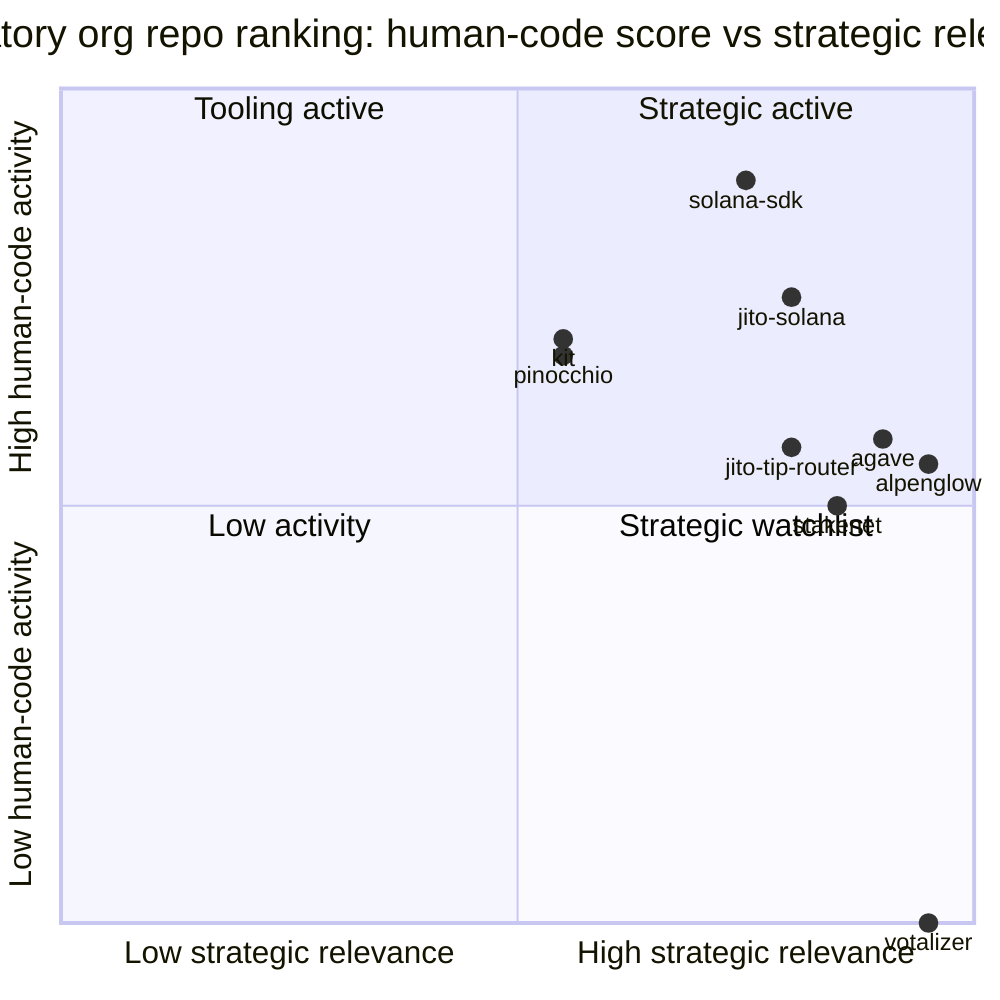
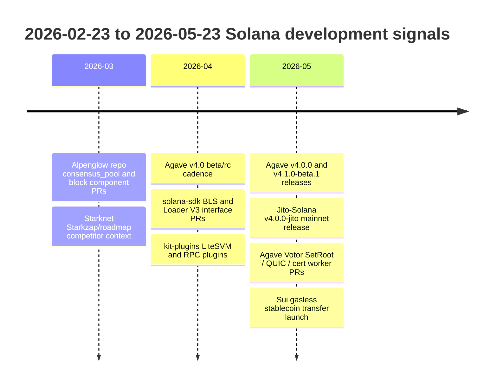
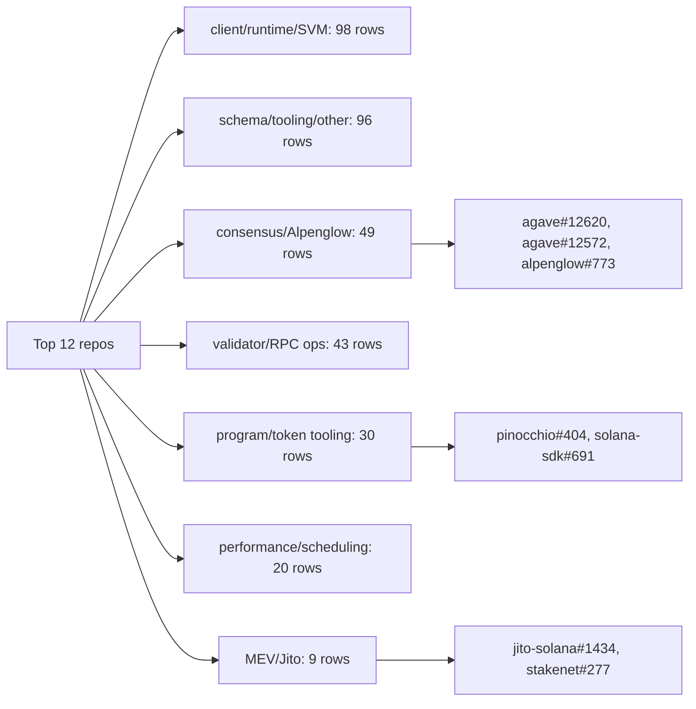
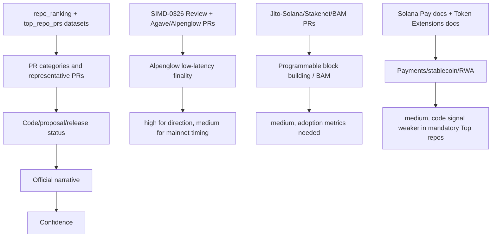
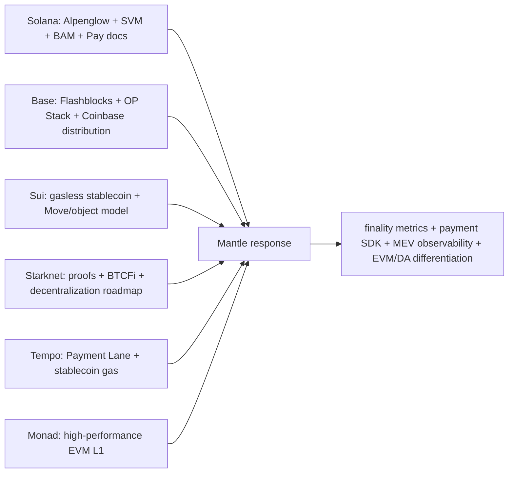
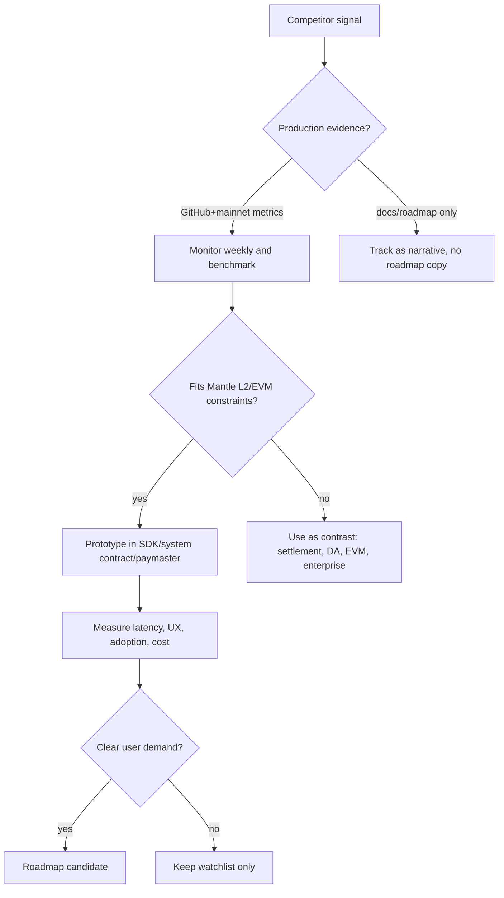

# Solana 近期开发与叙事分析

## 1. Executive Summary

本轮研究先按 Phase B gate 要求重建数据入口，而不是预设 `anza-xyz/agave` 或 `solana-labs/solana` 是近期唯一重点。GitHub 扫描覆盖 `solana-labs`、`anza-xyz`、`jito-foundation` 三个 mandatory org 的 219 个公开 repo，并另存 `solana-foundation`、`firedancer-io`、`jito-labs` 三个相关 org 的 discovery watchlist。数据窗口固定为 2026-02-23 至 2026-05-23，抓取时间为 2026-05-23T16:21:37Z。

最重要结论有三点：

1. **开发重心已经从 Solana Labs 历史仓库迁到 Anza/Jito 运行时、SDK、工具链和 validator infra。** 在 mandatory universe 中，`solana-labs` 116 个 repo 几乎全部低活跃或归档/历史化；Top 12 human-code activity repo 中 9 个来自 `anza-xyz`、3 个来自 `jito-foundation`，没有 `solana-labs` repo。
2. **近期 GitHub 活动的高频层不是单一 core client，而是 SDK/schema/tooling + Agave/Alpenglow + Jito BAM/staking infra 的组合。** Top repo 包括 `anza-xyz/solana-sdk`、`anza-xyz/kit`、`pinocchio`、`wincode`、`kit-plugins`、`mollusk` 等开发者/runtime 工具，也包括 `anza-xyz/agave`、`anza-xyz/alpenglow`、`jito-foundation/jito-solana`、`jito-tip-router`、`stakenet`。
3. **Solana 的公开叙事正在向"低延迟最终性 + 多 proposer/可编程排序 + 支付/稳定币/RWA 应用"收束。** GitHub 证据支持 Alpenglow/Votor、BLS、Agave v4、BAM、TPU/priority-fee bench、SVM/LiteSVM/tooling 的持续开发；但 Solana Pay、Token Extensions、stablecoin/RWA 的应用叙事主要来自官方 docs/news 和 ecosystem evidence，未在 mandatory Top repo 中形成同等强度的 code signal。

对 Mantle 的竞争启示：Solana 的压力不只是 TPS 叙事，而是把性能、最终性、应用级排序、支付 UX、validator/client infra 放进同一条路线。Mantle 不应照搬单体 L1 假设，但应立刻建立竞品 repo/PR watchlist、finality/latency dashboard、payment/DePIN UX 原型和 MEV/sequencer observability；中期需要把 OP Stack/EVM compatibility、EigenDA、MNT 激励、企业/支付集成包装成明确差异化，而不是只回应"更快"。

## 2. Reproducibility Gate

Phase B gate 要求的四组 mandatory dataset 已持久化在：

| Dataset | JSON | CSV | 说明 |
|---|---|---|---|
| repo universe | `202606-internal-sharing/research-sections/competitor-solana/datasets/repo_universe.json` | `202606-internal-sharing/research-sections/competitor-solana/datasets/repo_universe.csv` | mandatory org 全量公开 repo，共 219 行，含 archived/fork/template/zero-low-activity 后续 join 字段 |
| repo activity metrics | `202606-internal-sharing/research-sections/competitor-solana/datasets/repo_activity_metrics.json` | `202606-internal-sharing/research-sections/competitor-solana/datasets/repo_activity_metrics.csv` | 全量 repo per-repo metric rows，共 219 行 |
| repo ranking | `202606-internal-sharing/research-sections/competitor-solana/datasets/repo_ranking.json` | `202606-internal-sharing/research-sections/competitor-solana/datasets/repo_ranking.csv` | raw / human-code / strategic-low-activity 三套 sensitivity view 和 Top repo selection |
| top repo PRs | `202606-internal-sharing/research-sections/competitor-solana/datasets/top_repo_prs.json` | `202606-internal-sharing/research-sections/competitor-solana/datasets/top_repo_prs.csv` | Top 12 repo 的 PR rows，共 995 行，含分类、噪音标记、代表 PR 标记和 URL |

Companion artifacts:

- `202606-internal-sharing/research-sections/competitor-solana/datasets/extended_org_discovery.{json,csv}`：`solana-foundation`、`firedancer-io`、`jito-labs` discovery watchlist；未纳入本轮 Top ranking denominator，避免在 outline-approved gate 之后扩大 mandatory universe。
- `202606-internal-sharing/research-sections/competitor-solana/datasets/collect_activity.py`：可复跑 collector。JSON metadata 内含 exact REST/GraphQL/`gh` queries、pagination/rate-limit notes、scoring weights、normalization/de-noising 规则、duplicate/fork/rename handling。

每个 JSON dataset 的 `metadata` 均含 `fetch_timestamp`、`timezone`、`queries`、`pagination_notes`、`rate_limit_notes`、`archived_fork_template_flags`、`exclusions_applied`、`duplicate_fork_rename_handling`、`zero_low_activity_handling`。CSV rows 则把 `fetch_timestamp`、`timezone`、`window_start`、`window_end` 写入每行，且 `repo_activity_metrics.csv` / `repo_ranking.csv` 对每个 repo 保留 `zero_activity_flag`、`low_activity_flag`、archived/fork/template flags、ranking-stage noise fields 和 selection rationale。

Review Agent 可用以下方式独立复算 Top repo selection：读取 `repo_ranking.json` 的 `rows`，按 `human_code_activity_rank` 升序排序，取前 12 个 repo；或按 `selected_for_top_pr_analysis == true` 过滤。两者应得到同一集合：`anza-xyz/solana-sdk`、`jito-foundation/jito-solana`、`anza-xyz/kit`、`anza-xyz/pinocchio`、`anza-xyz/wincode`、`anza-xyz/kit-plugins`、`anza-xyz/agave`、`anza-xyz/mollusk`、`jito-foundation/jito-tip-router`、`anza-xyz/alpenglow`、`anza-xyz/tpu-tools`、`jito-foundation/stakenet`。

评分预注册规则已写入每个 JSON metadata：

- 权重：PR created 0.20、PR merged 0.18、default-branch commit count 0.16、unique contributors 0.12、active days 0.08、release count 0.08、issue activity 0.08、issue comments 0.04、recent acceleration 0.06。
- 标准化：每个 metric 以 mandatory universe 内 `log1p(metric) / max(log1p(metric))` 归一化；raw activity 与 human-code activity 分开。
- 去噪：bot / dependabot / renovate、docs-only、CI-only、release/changelog automation、generated/snapshot、dependency bump、formatting/lockfile 等在 ranking 阶段标记；human-code view 用 `human_code_pr_*` 计数，并对 archived/template/fork repo 加 penalty。
- 身份规则：以 GitHub repo id + full name 为 identity；fork/template/archive 不从 universe 删除，rename 仅在 GitHub 保持同 repo id 时自然延续，不把 active fork 与 upstream 合并计数。
- low/zero activity：`zero_activity_flag`、`low_activity_flag` 在全量 rows 中保留；strategic-low-activity watchlist 单列。

数据限制也已持久化：GraphQL metrics 对 `anza-xyz/rust`、`solana-labs/solana`、`solana-labs/token-list` 三个 repo 返回过 HTTP 502，本轮未静默补值。由于 `solana-labs/solana` 是历史/legacy repo，正文只把它作为迁移/历史风险讨论，不把 0 指标解释为真实无活动。

## 3. Item Findings

### item-1: 全量 org/repo 发现、扩展范围和活跃度评分

Mandatory universe 结果显示，2026 年 2-5 月 Solana 相关工程活动已高度集中在 Anza 和 Jito：

| Org | Repos | PR created | Human-code PR created | Default-branch commits | Top 12 selected |
|---|---:|---:|---:|---:|---|
| `anza-xyz` | 58 | 884 | 439 | 4,871 | 9 个 |
| `jito-foundation` | 45 | 219 | 144 | 1,082 | 3 个 |
| `solana-labs` | 116 | 5 | 2 | 0* | 0 个 |

`*` 见数据限制：`solana-labs/solana` GraphQL 502；多数 Solana Labs repo 本身是归档、legacy、example 或早期生态仓库。这个结果仍足以支持定性判断：近期开发组织边界已经从 Solana Labs 历史仓库迁移到 Anza/Jito。

Top 12 human-code activity ranking：

| Rank | Repo | Human-code score | Raw rank | PR created | PR merged | Commits | Contributors | 主信号 |
|---:|---|---:|---:|---:|---:|---:|---:|---|
| 1 | `anza-xyz/solana-sdk` | 0.889 | 2 | 91 | 76 | 314 | 24 | SDK / BLS / Loader / interfaces |
| 2 | `jito-foundation/jito-solana` | 0.747 | 4 | 94 | 41 | 1008 | 26 | Jito client / BAM / shred / runtime |
| 3 | `anza-xyz/kit` | 0.699 | 3 | 98 | 69 | 236 | 12 | JS/TS kit / RPC / client UX |
| 4 | `anza-xyz/pinocchio` | 0.679 | 7 | 54 | 44 | 50 | 19 | lightweight program SDK / Token-2022 |
| 5 | `anza-xyz/wincode` | 0.661 | 5 | 92 | 82 | 93 | 12 | serialization / ABI schema |
| 6 | `anza-xyz/kit-plugins` | 0.638 | 6 | 100 | 94 | 136 | 5 | LiteSVM/RPC/plugin tooling |
| 7 | `anza-xyz/agave` | 0.581 | 1 | 90 | 31 | 1165 | 42 | core client / runtime / Votor |
| 8 | `anza-xyz/mollusk` | 0.570 | 9 | 56 | 37 | 37 | 11 | program testing / SVM harness |
| 9 | `jito-foundation/jito-tip-router` | 0.570 | 12 | 34 | 23 | 19 | 2 | Jito reward/tip routing ops |
| 10 | `anza-xyz/alpenglow` | 0.548 | 14 | 25 | 21 | 21 | 12 | consensus prototype |
| 11 | `anza-xyz/tpu-tools` | 0.536 | 13 | 39 | 22 | 22 | 8 | TPU/priority-fee benchmarking |
| 12 | `jito-foundation/stakenet` | 0.502 | 18 | 20 | 16 | 16 | 3 | validator/stake/BAM adoption infra |

Strategic-low-activity watchlist 中最值得监控的是 `anza-xyz/votalizer`、`anza-xyz/validator-lab`、`anza-xyz/agave-geyser-plugin-postgres`、`jito-foundation/geyser-grpc-plugin`、`jito-foundation/jito-restaking-test-validator`、`jito-foundation/sv-manager`、`solana-foundation/solana-improvement-documents`、`firedancer-io/firedancer`。这些不进入本轮 Top PR analysis，并不等于不重要；只是近 3 个月 mandatory ranking 活动不足或属于扩展 org。

### item-2: Top 活跃 repo 的 PR 数据集、分类体系和代表 PR 选择

`top_repo_prs.{json,csv}` 记录了 Top 12 repo 的 995 条 PR rows。PR rows 口径是 created/merged/updated 落在窗口内，因此它适合做代表 PR 和 backlog/open 状态分析；repo-level created/merged metrics 才是 Top ranking 的主要口径。

Human-code PR category aggregation:

| Category | Rows | 解释 |
|---|---:|---|
| client_runtime_svm | 98 | Agave runtime、SDK interfaces、program loader、LiteSVM、SVM testing |
| other/schema-core | 96 | wincode、ABI/schema、zero-copy、generic library changes；部分应人工归入 SDK substrate |
| consensus_alpenglow | 49 | Votor/BLS/finality/vote/certificate/Alpenglow prototype |
| validator_ops_rpc | 43 | RPC、validator CLI、Jito operator/keeper、cluster/admin tooling |
| program_token_tooling | 30 | Pinocchio、Token-2022、program SDK、syscalls |
| performance_scheduling | 20 | TPU、priority fee、scheduler、latency/benchmark |
| mev_jito | 9 | BAM、bundle/shred/tip/stake signals |

代表 PR examples：

- `anza-xyz/agave#12620` merged：`votor: do not block on SetRoot`，PR body 说明 load 下 replay 忙会导致 `SetRoot` latency，并把 Votor root setting 改为 fire-and-forget。
- `anza-xyz/agave#12572` open preview：`Votor over datagram QUIC`，明确提到当前 Votor QUIC path 的 head-of-line blocking、ACK overhead、CPU/packet loss 问题，并写明 preview PR 不 intended to merge as-is。
- `anza-xyz/agave#12178` open：BLS certificate verification 独立 worker，减少批量证书验证影响 vote verification。
- `anza-xyz/alpenglow#773` merged：consensus pool slashing/conflicting vote 类型修正。
- `anza-xyz/solana-sdk#691` merged：SIMD-0432 Loader V3 interface，说明 SDK/interface repo 是 protocol change 的落地点之一。
- `anza-xyz/solana-sdk#694` merged：BLS test vectors；`#637/#662/#697/#702` 等同类 PR 说明 BLS support 是 SDK 层持续活动。
- `jito-foundation/jito-solana#1434` merged：更高效的 BAM retransmit；`#1431` shred rework、`#1447` shred multicast update order 共同指向 Jito client 的 block-building/shred path。
- `jito-foundation/stakenet#277` open：`running_bam` score，body 关联 JIP-28 "Accelerate BAM adoption"，说明 BAM adoption 正进入 validator/stake policy。
- `anza-xyz/kit-plugins#187` merged：all-in-one LiteSVM plugin，把 SVM local testing/client UX 下沉到 dev tooling。
- `anza-xyz/pinocchio#404` merged：Token-2022 Mint owner check 修复，说明 token/program tooling 仍在活跃维护。
- `anza-xyz/tpu-tools#56` merged：transaction-bench 支持随机/时间调度 priority fee，用于 stress fee markets。

### item-3: 数据驱动的近期开发重点与架构变更

**主线 A：Alpenglow/Votor 正从 research/prototype 进入 Agave integration hardening。** SIMD-0326 状态为 `Review`，明确把 Solana consensus 从 Proof-of-History + TowerBFT 改为 Alpenglow 的 Votor 部分，并把 Rotor、smart sampling、lazy execution 拆出后续 SIMD。PR 层面，`agave` 与 `alpenglow` 同时出现 Votor、certificate、BLS、SetRoot、datagram QUIC、vote/cert verification work。结论：这是实质性架构替换，但截至本 draft 仍是 proposal/review + dev/test integration，不应写成 mainnet-active。

**主线 B：Agave v4 和 Jito v4 release cadence 表明 validator/client 分支正在同步推进。** `anza-xyz/agave` 在窗口内发布 v4.0.0-rc.0、v4.0.0-rc.1、v4.0.0、v4.1.0-beta.1；`jito-foundation/jito-solana` 发布 v4.0.0-jito、v4.0.0-rc.*-jito、v3.1.*-jito。Jito release names 区分 Mainnet/Testnet，说明 Jito client 在跟进 Agave major release 的同时加入 BAM/Jito-specific changes。

**主线 C：SVM/runtime 的近期活跃度更多落在 SDK/interface/testing，而不是只落在 core validator repo。** `solana-sdk` 的 BLS、Loader V3、zero-copy、wincode schema；`pinocchio` 的 Token-2022/system/program helpers；`mollusk` 的 SVM/program test harness；`kit-plugins` 的 LiteSVM/RPC plugin，说明 Anza 正把协议/客户端变化拆到开发者可消费的 interface/tooling 层。

**主线 D：Jito 的 MEV 叙事从 "block engine" 扩展到 BAM + validator/stake adoption infra。** Jito BAM 官方材料把 BAM 描述为 block-building architecture，覆盖 BAM Nodes、BAM Validators 和 Plugins；BAM docs 又写明它构建在 Agave/Jito-Solana validator infrastructure 之上。GitHub 证据中，`jito-solana` 处理 BAM retransmit/shred/post-auth tasks，`stakenet` 把 BAM running score 纳入 steward logic，`jito-tip-router` 继续维护 operator/keeper/claim/tip distribution path。

**主线 E：支付/RWA/Token Extensions 是强叙事、弱 mandatory Top repo code signal。** Solana docs 显示 Solana Pay、accept payments、stablecoin/token extension solution pages 都在强化支付/稳定币发行叙事；Solana April 2026 ecosystem roundup 提到 RWA、stablecoin、settlement rail 相关进展。但 mandatory Top repo 中没有 `solana-pay` 或 `token-extensions` 专门 repo 进入 Top 12；相关 code signal 主要通过 `pinocchio` Token-2022 helpers、`kit`/`solana-sdk` interfaces 间接出现。

### item-4: 活跃度趋势、贡献者结构和组织重心变化

Top repo 的组织分布本身就是趋势信号：Solana Labs 几乎退出近期活跃中心，Anza 成为 core/client/tooling 主体，Jito 成为 MEV/validator-client/stake infra 主体。

贡献者结构上，`agave` contributor sample 最大（42），`jito-solana` 也较分散（26）；`kit-plugins`、`jito-tip-router`、`stakenet` contributor sample 较小，说明部分工具/ops repo 仍有较强团队集中度。Jito 的 `jito-tip-router` Top score 受 PR/release/ops 节奏拉高，但 contributor count 只有 2，应视为 narrow-maintainer infra。

趋势解读要谨慎：collector 的 Top PR dataset 包含 updated-in-window PR，所以旧 PR 在 evidence rows 中出现；Top ranking 的 `pr_created_count`/`pr_merged_count` 才是窗口内 activity denominator。若要做周粒度精准趋势，下一轮应对 Top repo 做 full pagination by created date，而不是依赖 updated window sample。

### item-5: 重大功能、proposal/SIMD 和 roadmap 状态校准

**Alpenglow / SIMD-0326**

- 状态：SIMD-0326 frontmatter 为 `status: Review`，feature key 仍待 accepted 后填写。
- 设计 delta：替换 PoH + TowerBFT 的 voting/finality logic，初始 SIMD 覆盖 Votor，不覆盖 Rotor、smart sampling、lazy execution。
- 性能/安全 claim：SIMD 与 Anza blog claim fast-finalization one round at 80% stake、slow-finalization two rounds at 60% stake、20+20 fault model、BLS aggregate certificates、vote 不再作为链上交易。
- Mainnet assumption：Anza26 写明 2026 focus 是把 Alpenglow 从 development clusters 推向 Q3 mainnet，仍需 stress-testing、rewards/incentives hardening、latency budgets。
- PR status：`agave#12620` merged、`alpenglow#773/#776/#772/#725` 等 merged，`agave#12572/#12178/#12572` 等 open/draft preview，说明 implementation hardening 正在进行。
- Residual risk：共识替换是 backward-incompatible big protocol change；SIMD 自身承认 migration challenging，且 VAT/validator cap/economics 等仍可能引发治理和 operator risk。

**Multiple Concurrent Proposers / APE / market structure**

Anza26 把 MCP 写为 2026 initiative，目标是把 transaction ordering enforcement 放到 in-protocol/replay stage，削弱单 leader monopoly，提高 censorship resistance。GitHub Top repo 中没有专门 MCP repo 入选，但 Agave/Jito/BAM/shred/TPU PR 与这条叙事相邻。结论：当前是 roadmap/narrative + adjacent infra signal，不是 mainnet-active fact。

**BAM / Jito**

Jito 官方 BAM blog 把 BAM 定位为 transaction sequencing / block-building architecture，BAM docs 说明其构建在 Agave/Jito-Solana 之上，并连接 Block Engine、BAM validators、plugins。GitHub PRs 支持 BAM 正在 Jito-Solana 和 Stakenet 中落地：retransmit、shred receiver、BAM URL updater、running_bam score。结论：BAM 是比普通 MEV block engine 更宽的 validator/block-building supply-chain 叙事，但 adoption 比例、stake share、plugin production readiness 需要独立链上/validator 数据验证。

**Token Extensions / Solana Pay / stablecoin**

Solana docs 把 Token Extensions/Token-2022 写成 asset/stablecoin feature base；Solana Pay docs 把支付请求编码、QR/link、transaction requests、reference/memo/reconciliation 写成开发者流程；stablecoin solution page 使用 $10B stablecoin supply、$200B monthly stablecoin transfers、median fee 等市场化数据。GitHub code signal 不足以证明这些 docs 对应近期 core repo 加速，但足以证明 Solana 的官方应用叙事在支付/稳定币/RWA 方向继续强化。

### item-6: Solana 近期叙事变化与生态战略调整

叙事可以拆成三层：

1. **Protocol performance narrative**：Anza26 的关键词是 increase bandwidth/reduce latency、Alpenglow Q3 mainnet target、MCP、XDP shred transmission、100M CU block limits、direct mapping、slot time under 400ms。GitHub Top repos 中 `agave`、`alpenglow`、`tpu-tools`、`solana-sdk` 的 Votor/BLS/TPU/priority-fee/SDK changes 与之匹配。
2. **Market-structure / MEV narrative**：Jito BAM 把 Solana 的 transaction pipeline 叙事从"高吞吐 L1"推向"可验证、隐私、可编程排序/区块构建市场"。这对交易、CLOB、perps、dark pools、high-frequency finance 叙事很关键。
3. **Payments / stablecoin / RWA narrative**：Solana official docs/news 正在把 Solana Pay、Commerce Kit、Token Extensions、stablecoin issuance、RWA ecosystem 组合成支付/企业资产 rails。该层 GitHub Top signal 较弱，应标注为 official narrative + ecosystem evidence，而不是 core protocol code trend。

负面或约束：

- Alpenglow 的 20+20 model 与 validator cap/VAT 改变 operator economics，不能简单等同于"更去中心化"。
- BAM 改善 sequencing/control 的同时，也可能加深 validator/client/Jito supply-chain 依赖，需要观察 stake adoption 和 plugin governance。
- Solana 的支付/RWA叙事有强 UX 和低费优势，但合规、merchant API、chargeback、fiat rails、privacy 都不是 L1 本身自动解决。
- 多客户端叙事需要把 Firedancer 单独跟踪；本轮 mandatory ranking 未覆盖 `firedancer-io` full activity，只做 extended discovery。

### item-7: 横向竞品对比与 Mantle 竞争压力分解

| 维度 | Solana | Base / OP Stack | Sui | Starknet | Tempo | Monad | Mantle implication |
|---|---|---|---|---|---|---|---|
| 低延迟体验 | Alpenglow target + Agave/Jito infra；mainnet仍待验证 | Base Flashblocks 200ms preconf，2s L2 block，L1 batch约分钟级 | Sui payments page claims 300ms finality；gasless stablecoin transfer 2026-05 announced | roadmap: sub-second preconfirmations, 2s block time later phase | Payment Lane + stablecoin gas，见内部 Tempo section | docs claim 400ms blocks/800ms finality | Mantle 需要明确 own finality/preconf roadmap，而不是只讲 DA/成本 |
| Developer compatibility | SVM/Kit/Pinocchio/Mollusk 强化原生生态 | EVM/OP Stack 分发强 | Move/object model，迁移成本高 | Cairo/STARK，强 proof narrative | EVM-compatible L1，但定制协议原语 | bytecode-compatible EVM | Mantle 的 EVM compatibility 仍是优势，但需补齐 latency UX |
| Payment/stablecoin | Solana Pay、Token Extensions、RWA/stablecoin docs/news | Base 受益 Coinbase distribution + EVM wallets | Gasless stablecoin transfers + Fireblocks support | BTCFi + account abstraction + paymaster | payment-first, stablecoin gas, Payment Lane | payment/high-frequency finance narrative | Mantle 可从支付 SDK、paymaster、stablecoin gas abstraction 原型切入 |
| MEV/sequencing | Jito BAM、MCP、leader/proposer改革 | Single sequencer + Flashblocks/op-rbuilder | object-centric execution，MEV结构不同 | distributed sequencer roadmap | Payment lane/order control | high-throughput EVM DeFi | Mantle 应把 sequencer/MEV observability 产品化 |
| Security/finality assumptions | 单体 PoS + Alpenglow governance/activation risk | Ethereum settlement + OP fault proof/challenge model | Sui validator set/object model | validity proof + decentralization roadmap | L1 BFT + custom stack | L1 BFT/EVM | Mantle 应把 Ethereum settlement/EigenDA tradeoff讲清楚 |

Base 对 Mantle 的近身压力最大，因为同为 EVM/OP-family UX，Base 已把 Flashblocks 200ms preconfirmation 写成开发者可消费文档。Sui 和 Tempo 在支付/gasless/stablecoin UX 上更激进。Monad 以 EVM compatibility + high performance 直接压 Mantle 的开发者迁移心智。Solana 则用非 EVM 路线证明"高性能 + 应用场景 + infra supply chain"可以形成综合叙事。

### item-8: Mantle 行动建议、监控指标和不确定性

**必须监控**

- Repo watchlist：`anza-xyz/agave`、`anza-xyz/alpenglow`、`anza-xyz/solana-sdk`、`anza-xyz/tpu-tools`、`jito-foundation/jito-solana`、`jito-foundation/stakenet`、`jito-foundation/jito-tip-router`；扩展 watch `firedancer-io/firedancer`、`solana-foundation/solana-improvement-documents`。
- Proposal watch：SIMD-0326 status、feature key、governance vote/activation schedule、Votor/Rotor/lazy execution follow-up SIMDs。
- Performance watch：mainnet slot time、finality latency、block CU limits、XDP/default rollout、Alpenglow test/mainnet metrics。
- BAM watch：JIP-28/JIP-31、BAM validator stake share、running_bam score、Jito-Solana release notes、plugin ecosystem。
- Payment watch：Solana Pay/Commerce Kit adoption、stablecoin transfer volume、Token Extensions issuer usage、RWA ecosystem data。

**可借鉴/可原型**

- PR-data-driven competitor dashboard：用本轮 dataset schema 固化为每周自动监控。
- Mantle finality/preconfirmation dashboard：对比 Base Flashblocks、Solana Alpenglow、Monad finality。
- Payment SDK prototype：stablecoin payment request、memo/reference reconciliation、merchant callback、paymaster/sponsored gas。
- MEV/sequencer observability：公开排序、latency、failed tx、priority fee、searcher/validator economics dashboard。
- Developer tooling：本地 OP Stack/L2 testing plugin、programmatic transaction planner、RPC error taxonomy。

**谨慎或不适合照搬**

- 不要照搬 Solana 单体 L1 validator hardware/networking 假设到 Mantle L2。
- 不要把 SVM/Sealevel/Token-2022 设计直接迁移到 EVM/OP Stack；可以借鉴 UX 和 observability。
- 不要把 Alpenglow/BAM roadmap 当生产事实；必须等 governance、release、mainnet activation 和 independent metrics。
- 不要把 Solana ecosystem roundup 的 RWA/stablecoin 数字当 Mantle 立即可复制的 adoption path；背后有发行方、钱包、custody、fiat rails 和 BD。

**短中长期建议**

- 短期：建立 weekly Solana/Base/Sui/Monad/Tempo watcher；对 Mantle 内部分享使用"数据入口 + narrative evidence matrix"格式，避免泛泛 TPS 对比。
- 中期：做 stablecoin payment SDK/paymaster 原型，与 enterprise/payment BD 结合；同时补 Mantle finality/sequencer/MEV public metrics。
- 长期：评估 appchain/L3、fast finality/preconfirmation、sequencer decentralization/MEV capture 和 EigenDA 叙事如何组合为 Mantle 独特路线。

## 4. Diagrams

### diag-1: 全量 repo 活跃度排名矩阵

### diag-2: PR/release/proposal timeline

### diag-3: PR 分类矩阵

### diag-4: GitHub activity 到叙事 claim 的证据链

### diag-5: Solana vs competitors

### diag-6: Mantle response decision flow

## 5. Source Coverage

| Requirement | Coverage | Representative sources |
|---|---|---|
| GitHub org API | Pass | `repo_universe.{json,csv}` metadata records REST `/orgs/{org}/repos` for `solana-labs`、`anza-xyz`、`jito-foundation` |
| GitHub activity API | Pass with caveats | `repo_activity_metrics.{json,csv}` and `repo_ranking.{json,csv}` include GraphQL query metadata and 219 rows; 3 GitHub 502 failures persisted |
| GitHub PR diff/file evidence | Partial pass | `top_repo_prs.{json,csv}` has 995 PR rows and sampled file lists; manually checked representative PR pages including Agave, Alpenglow, Jito-Solana, SDK, Pinocchio, TPU tools |
| Official docs/blog | Pass | Anza26, Anza Alpenglow, Jito BAM blog/docs, Solana Pay, Solana Token Extensions, Solana stablecoin/payment docs |
| Governance/proposals | Pass | SIMD-0326 Alpenglow; SIMD-0432 linked from `solana-sdk#691`; JIP-28 reference from `stakenet#277` |
| Release/changelog | Pass | Agave v4.0.0/v4.1.0-beta.1 releases; Jito-Solana v4.0.0-jito and v3.1.*-jito releases |
| On-chain/ecosystem data | Partial | Solana official stablecoin/RWA claims and ecosystem roundup used; independent dashboard/API validation remains gap |
| Competitor primary sources | Pass | Base Flashblocks/finality docs, Sui gasless stablecoin payments, Starknet roadmap/staking/docs, Tempo internal final section, Monad docs/blog |
| Internal research | Pass | `payment-tempo/final.md`; `enterprise-canton/final.md`; `enterprise-privacy/final.md` available for TW cross-linking |
| Expert commentary | Limited | Intentionally minimized; key facts anchored to primary sources |

Primary URLs used:

- https://www.anza.xyz/blog/anza26
- https://www.anza.xyz/blog/alpenglow-a-new-consensus-for-solana
- https://github.com/solana-foundation/solana-improvement-documents/blob/main/proposals/0326-alpenglow.md
- https://github.com/anza-xyz/agave/releases
- https://github.com/anza-xyz/agave/pull/12620
- https://github.com/anza-xyz/agave/pull/12572
- https://github.com/anza-xyz/solana-sdk/pull/691
- https://github.com/jito-foundation/jito-solana/releases
- https://github.com/jito-foundation/jito-solana/pull/1434
- https://github.com/jito-foundation/stakenet/pull/277
- https://www.jito.wtf/blog/introducing-bam/
- https://bam.dev/docs/
- https://solana.com/docs/payments/accept-payments/solana-pay
- https://solana.com/docs/payments/accept-payments
- https://solana.com/docs/tokens/extensions
- https://solana.com/solutions/stablecoins
- https://solana.com/news/solana-ecosystem-roundup-april-2026
- https://docs.base.org/base-chain/flashblocks/overview
- https://docs.base.org/base-chain/network-information/transaction-finality
- https://blog.sui.io/sui-launches-gasless-stablecoin-transfers/
- https://www.starknet.io/roadmap/
- https://www.starknet.io/blog/technical-roadmap/
- https://docs.tempo.xyz/protocol/blockspace/payment-lane-specification
- https://docs.monad.xyz/
- https://blog.monad.xyz/blog/how-monad-works

## 6. Gap Analysis

1. `solana-labs/solana` GraphQL metrics failed with HTTP 502. This is persisted and should not be hidden. Because the repo is historical and Solana Labs no longer appears as current activity center, this does not change Top 12 selection, but it affects exact org-level commit totals.
2. Full PR pagination for all Top repos by `created_at` was not performed; `top_repo_prs` is capped at 120 updated/merged/created-in-window rows per Top repo. Ranking remains recomputable from metrics datasets, but precise week-by-week PR creation trend needs a follow-up collector.
3. Firedancer is only in extended discovery, not mandatory Top ranking. A separate Firedancer-focused section would be needed to make production-client readiness claims.
4. On-chain adoption metrics for Solana Pay, Token Extensions, stablecoin supply/transfer volume, RWA, BAM validator share and Jito stake share were not independently recomputed. This draft treats official claims as narrative/ecosystem evidence unless backed by GitHub PR/release data.
5. Base/Sui/Starknet/Monad comparisons are source-calibrated but not benchmarked against live RPC measurements. Mantle action planning should use them as competitive positioning, not measured SLA proof.

## 7. Revision Log

| Round | Change |
|---|---|
| 1 | Initial deep draft. Generated mandatory datasets, selected Top repos data-first, analyzed PR categories, official roadmap/proposal state, Solana narrative shift and Mantle implications. |
