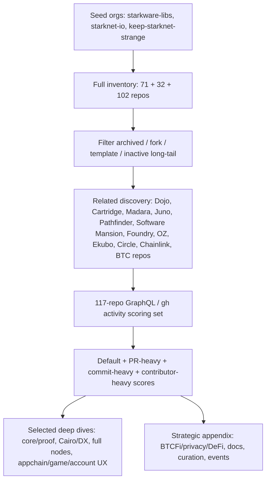
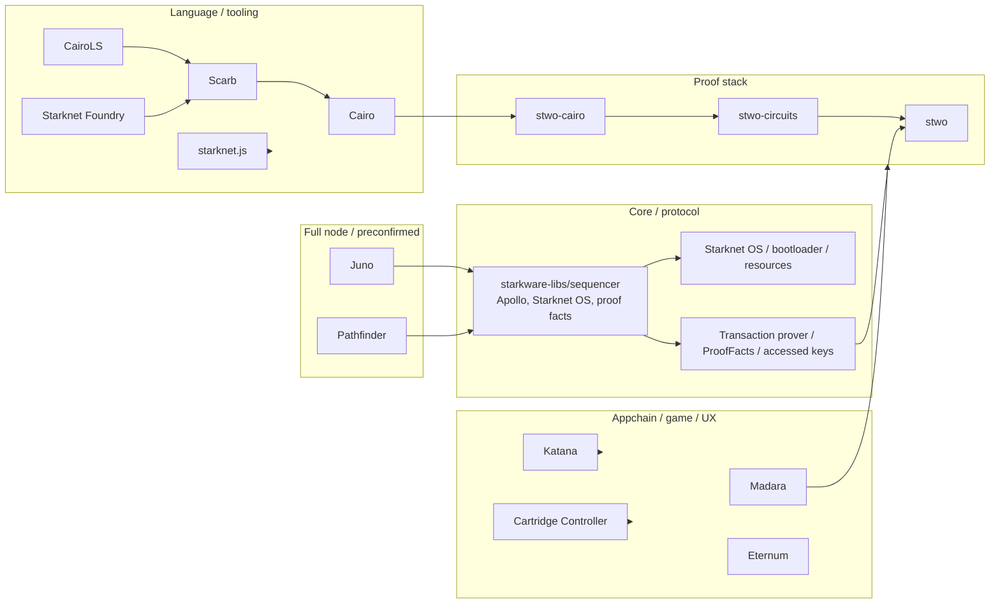

# StarkNet 近期开发与叙事分析 - Final

## 1. Executive Summary

本轮研究按重启后的要求先做 repo discovery 和活跃度排序，再决定分析对象。2026-02-23 至 2026-05-23 的 GitHub 数据显示，Starknet 近期最强工程重心并不是一个预设清单，而是数据自然浮现出的四个高活跃集群：**core sequencer / Starknet OS / proof-flow**、**Cairo 与开发者工具链**、**STWO / Cairo prover circuit**、**appchain / game / account UX 生态**。`starkware-libs/sequencer` 以 1,324 个 created PR、881 个 merged PR 和 912 个 default-branch commits 远高于其他 repo；但 `BibliothecaDAO/eternum`、`keep-starknet-strange/starknet-agentic`、`cartridge-gg/controller`、`dojoengine/katana` 等也进入 Top 区间，说明 Starknet 的近期叙事不只是 core protocol，而是 core infra + provable programming + app-specific stack + game/account UX 并行。[S1][S2][S3]

最重要的结论是：`sequencer` 和 `cairo` 确实仍是高活跃 repo，但它们是本轮数据排名的结果，不是前置假设。`sequencer` 的近期 PR 样本显示 Starknet OS resource accounting、transaction prover、proof facts、accessed keys、preconfirmed / consensus / node hardening 是主要方向；`cairo` 和 `scarb` / `cairols` 的活动集中在 compiler diagnostics、Sierra / corelib、const eval、structured diagnostics、release cadence 和 IDE feedback loop；`stwo-circuits` / `stwo-cairo` / `stwo` 则把 Cairo proving、circuit AIR、Keccak/Merkle、Blake/qm31 components、README production status 变成强工程信号。[S4][S5][S6]

公开叙事层，Starknet 官方页面已经把自己描述为 scaling Ethereum and Bitcoin 的 ZK execution layer，并同时强调 BTC staking/BTCFi、privacy tools、DeFi + gaming ecosystem、SN Stack、AI agents、modular ecosystem 和 roadmap 中的 10,000+ TPS / Bitcoin integration / decentralization。[S31][S32][S33][S34][S35] 但 GitHub 证据强弱不均：proof/finality、Cairo/provable programming、appchain/game/account UX 有较强代码和 release 支撑；BTCFi/privacy/DeFi 更多是官网和生态叙事，近 90 天活跃 repo 信号偏弱，`strkBTC` 仅 2 PR / 2 merged / 8 commits，`circlefin/starknet-cctp` 5 PR / 0 merged，`starkware-bitcoin/shinigami` 和 `raito` 在本窗口没有 PR/commit。[S1][S44]

与 zkSync 的差异化可以简化为：Starknet 更押注 Cairo/STARK/provable programs、Starknet OS、STWO/Circle STARK、SN Stack / Madara / Dojo 这类非 EVM 原生路线；zkSync 则通过 ZK Stack、Elastic Chain、Gateway、ZKsync OS、EraVM、account abstraction/paymasters 继续强调 EVM/Solidity 迁移和多链互联。[S36][S37][S38][S39] 对 Mantle 的启示不是复制 Cairo/STARK，而是建立 ZK competitor dashboard、公开 proof/finality/preconfirmation 指标、把 EVM/paymaster/payment/liquidity 优势产品化，并谨慎评估 appchain / game / AI demo 是否能在 Mantle 的 EVM + EigenDA + MNT liquidity 语境中迁移。[S40][S41][S42][S43]

## 2. Item Findings

### item-1: GitHub org universe discovery and inclusion rules

**窗口与抓取口径**：默认窗口为 2026-02-23..2026-05-23 UTC。Seed org 使用 `gh repo list <org> --limit 1000 --json name,isArchived,isFork,isTemplate,pushedAt,primaryLanguage,repositoryTopics` 刷新；活跃度使用 GitHub GraphQL / `gh pr list` 查询 PR created / merged / open、default branch commits、sampled PR authors、release count。PR 查询示例：`gh pr list -R starkware-libs/sequencer --state all --search 'created:2026-02-23..2026-05-23' --limit 1000 --json number,title,state,createdAt,mergedAt,url,author`。

| Org / source | Role | Repo count observed | Archived | Fork | Template | Inclusion decision |
|---|---:|---:|---:|---:|---:|---|
| `starkware-libs` | seed org | 71 | 4 | 10 | 0 | 全量进入 inventory；非 archived/fork 且近期活跃者进入 scoring |
| `starknet-io` | seed org | 32 | 2 | 1 | 0 | docs / SDK / specs / devnet 进入 scoring 或 appendix |
| `keep-starknet-strange` | seed org / community lab | 102 | 1 | 15 | 2 | active projects、docs、agentic、snos、starkzap 进入 scoring；long-tail demo/fork 降权 |
| `dojoengine`, `cartridge-gg`, `madara-alliance` | related org | 24 in scoring set | n/a | n/a | n/a | 由 Starknet SN Stack、modular ecosystem、game/account UX 相关性纳入 |
| `NethermindEth`, `equilibriumco`, `software-mansion`, `foundry-rs` | related org/repo | 27 in scoring set | n/a | n/a | n/a | full node、SDK、Scarb/CairoLS、Starknet Foundry 等基础设施纳入 |
| `OpenZeppelin`, `EkuboProtocol`, `circlefin`, `smartcontractkit`, `starkware-bitcoin`, `HerodotusDev`, `apibara`, `argentlabs` 等 | strategic appendix | 39 in scoring set | n/a | n/a | n/a | 作为 contracts、DeFi、CCTP、oracle、BTCFi、data infra、wallet 等生态信号纳入或标为弱信号 |

**筛选原则**：archived/fork/template 不直接进入 Top active；docs-only / curation-only / event-only repo 允许上榜但必须降权解释；低活跃但战略重要 repo（BTCFi、CCTP、oracle、OpenZeppelin contracts）进入 narrative appendix，不挤占 Top engineering conclusion。

### item-2: Activity data pipeline, ranking formula, and Top repo selection

默认分数沿用 outline 建议，但实际实现中 `commit_days` 用 default-branch commit count 近似，`unique_human_contributors` 用 sampled PR authors 近似，因此正文将该列标为 sampled authors，不写成完整 unique contributors。默认分数：

`activity_score = 0.40 * normalized_pr_created + 0.20 * normalized_pr_merged + 0.20 * normalized_default_branch_commits + 0.15 * normalized_sampled_human_pr_authors + 0.05 * normalized_release_count`

| Rank | Repo | Cluster | Score | PR created | PR merged | Open | Closed-unmerged | Commits | Sampled authors | Releases | Selection |
|---:|---|---|---:|---:|---:|---:|---:|---:|---:|---:|---|
| 1 | `starkware-libs/sequencer` | core-protocol-node / execution-proof-os | 0.7669 | 1324 | 881 | 192 | 366 | 912 | 8 | 0 | selected core deep dive |
| 2 | `BibliothecaDAO/eternum` | game-dojo-ecosystem | 0.4471 | 467 | 396 | 7 | 66 | 1470 | 3 | 0 | selected as app/game signal, not core roadmap |
| 3 | `starkware-libs/cairo` | cairo-language-compiler | 0.2139 | 227 | 165 | 26 | 41 | 177 | 8 | 9 | selected |
| 4 | `keep-starknet-strange/starknet-agentic` | AI / developer-agent tooling | 0.1998 | 151 | 124 | 3 | 33 | 647 | 2 | 6 | selected with noise caveat |
| 5 | `NethermindEth/juno` | full node / consensus / RPC | 0.1917 | 218 | 183 | 13 | 34 | 183 | 6 | 6 | selected |
| 6 | `keep-starknet-strange/awesome-starkzap` | curation/community | 0.1788 | 78 | 8 | 65 | 6 | 25 | 28 | 0 | appendix; high contributor/open backlog noise |
| 7 | `starkware-libs/stwo-circuits` | proof/circuit | 0.1627 | 223 | 190 | 22 | 15 | 187 | 5 | 0 | selected |
| 8 | `equilibriumco/pathfinder` | full node / preconfirmed / consensus | 0.1580 | 114 | 110 | 2 | 4 | 400 | 4 | 5 | selected |
| 9 | `cartridge-gg/controller` | wallet/account/game UX | 0.1548 | 162 | 142 | 6 | 15 | 144 | 5 | 6 | selected |
| 10 | `dojoengine/game-jams` | event/community/game | 0.1516 | 63 | 61 | 0 | 2 | 85 | 20 | 0 | appendix; event/community signal |
| 11 | `foundry-rs/starknet-foundry` | developer tooling | 0.1483 | 159 | 125 | 16 | 32 | 125 | 6 | 5 | selected |
| 12 | `software-mansion/scarb` | developer tooling / package manager | 0.1382 | 115 | 99 | 7 | 16 | 98 | 5 | 9 | selected |
| 13 | `dojoengine/katana` | appchain/devnet/game stack | 0.0996 | 134 | 121 | 11 | 5 | 154 | 2 | 0 | selected |
| 14 | `starknet-io/starknet.js` | SDK / paymaster / SNIP | 0.0928 | 24 | 24 | 2 | 0 | 64 | 4 | 11 | supporting tooling |
| 15 | `madara-alliance/madara` | appchain / hybrid client | 0.0890 | 97 | 58 | 30 | 11 | 51 | 4 | 4 | selected strategic |
| 16 | `starkware-libs/stwo-cairo` | Cairo proving / STWO | 0.0887 | 106 | 68 | 28 | 13 | 67 | 6 | 0 | grouped with STWO cluster |
| 17 | `software-mansion/starknet-rust` | SDK | 0.0870 | 37 | 29 | 3 | 8 | 27 | 8 | 5 | appendix |
| 18 | `starkware-libs/proving-utils` | proof utils | 0.0866 | 31 | 21 | 4 | 9 | 21 | 13 | 0 | appendix |
| 19 | `cartridge-gg/presets` | game/account presets | 0.0866 | 56 | 56 | 0 | 1 | 64 | 9 | 0 | appendix |
| 20 | `keep-starknet-strange/starkzap` | dev/agent tooling | 0.0846 | 81 | 48 | 8 | 28 | 47 | 8 | 0 | appendix |

**Sensitivity check**：PR-heavy Top 10 与默认 Top 10 基本一致（sequencer、eternum、cairo、stwo-circuits、Juno、starknet-agentic、controller、starknet-foundry 等稳定）；commit-heavy 提升 `starknet-agentic`、`pathfinder`、`eternum`；contributor-heavy 提升 `awesome-starkzap`、`game-jams`、`starknet-docs`、`proving-utils`。因此 final shortlist 采用"默认分数 + cluster sanity check"，避免把 curation/event repo 误读为 core roadmap。[S1]

### item-3: Active repo overview and cluster map

数据驱动选出的战略深挖集群如下：

| Cluster | Selected repos | Evidence strength | Interpretation |
|---|---|---|---|
| Core protocol / sequencer / Starknet OS | `starkware-libs/sequencer`, support from `pathfinder`, `juno` | high | 最大 PR 量来自 Apollo/sequencer/node/proof-flow；是 Starknet 近期真实工程核心 |
| Cairo compiler / DX | `starkware-libs/cairo`, `software-mansion/scarb`, `software-mansion/cairols`, `starknet-foundry`, `starknet.js` | high | release cadence 和 diagnostics/tooling 改动持续；支撑 provable programming narrative |
| STWO / Cairo proving circuits | `stwo-circuits`, `stwo-cairo`, `stwo` | high-medium | PR 集中在 circuit AIR、Blake/qm31、verifier/prover API、README production status；证明栈进入产品化硬化 |
| Full node / preconfirmed / consensus | `juno`, `pathfinder`, `sequencer` | high | preconfirmed polling、p2p/consensus、pruner/state migration、RPC v0.10.x 是明显主题 |
| Appchain / game stack | `katana`, `madara`, `eternum`, Dojo/Cartridge docs and presets | medium-high | Katana/Madara 活跃度和 Starknet SN Stack 官网叙事相互支持，但 mature production adoption 仍需链上数据验证 |
| Wallet/account/payment UX | `cartridge-gg/controller`, `starknet.js`, Argent appendix | medium | Cartridge controller 的 onramp、session、paymaster/funding、signup UX 高频推进 |
| AI agents | `starknet-agentic`, Starknet AI portal | medium-low | 官网有 AI agents 叙事；repo 活跃但大量 dependency/security/CodeQL PR，实质 feature evidence 需降权 |
| BTCFi/privacy/DeFi | `strkBTC`, `circlefin/starknet-cctp`, `EkuboProtocol/indexer`, `OpenZeppelin/cairo-contracts`, Chainlink Starknet | low-medium | 官网强叙事，DeFiLlama / L2Beat 有生态指标；近 90 天核心 code activity 未进入 Top active |

### item-4: Cross-repo PR taxonomy and development direction analysis

下表使用 2026-02-23..2026-05-23 PR titles 的 rule-based 分类，再人工抽查高信号 PR。`sequencer` 的 `gh pr list --limit 1000` 样本被 GitHub CLI 截断，分类总数是 returned 1000，不等于 GraphQL created 1324。

| Repo | Dominant categories in PR sample | Representative PR evidence | Implementation status | Narrative meaning | Mantle impact |
|---|---|---|---|---|---|
| `sequencer` | node-preconf-rpc 217; proof-os-circuit 89; CI/test/release 270; other 287 | [#14103](https://github.com/starkware-libs/sequencer/pull/14103) `compute_accessed_keys`; [#14105](https://github.com/starkware-libs/sequencer/pull/14105) write accessed keys; [#14117](https://github.com/starkware-libs/sequencer/pull/14117) ProofFacts big storage key; [#14119](https://github.com/starkware-libs/sequencer/pull/14119) storage deletes; [#14123](https://github.com/starkware-libs/sequencer/pull/14123) bootloader output hash in OS | mix of merged/open; many proof-flow PRs open as of 2026-05-23 | Starknet OS and proving path are active, but not all PRs are shipped | Monitor proof/finality/preconfirmation; do not map to EVM directly |
| `cairo` | cairo-tooling 71; docs 52; CI/test 19 | [#9947](https://github.com/starkware-libs/cairo/pull/9947) sha512 syscall/libfuncs; [#9967](https://github.com/starkware-libs/cairo/pull/9967) ClassHash/ContractAddress bound; [#9972](https://github.com/starkware-libs/cairo/pull/9972) Sierra version; [#9884](https://github.com/starkware-libs/cairo/pull/9884) tuple member access open | mostly merged fixes + open language features | Cairo language maturity and safer diagnostics | Not transferable mechanically; useful benchmark for dev-tool discipline |
| `stwo-circuits` / `stwo-cairo` / `stwo` | proof-os-circuit 47 in stwo-circuits sample; many circuit AIR PRs | [stwo-circuits #465](https://github.com/starkware-libs/stwo-circuits/pull/465) restructure rust/circuit separation; [#462](https://github.com/starkware-libs/stwo-circuits/pull/462) Blake circuit; [stwo-cairo #1767](https://github.com/starkware-libs/stwo-cairo/pull/1767) README production status; [stwo #1398](https://github.com/starkware-libs/stwo/pull/1398) SIMD Keccak primitive | mostly merged, some open verifier/prover changes | STWO is not just research branding; active circuit/prover engineering exists | Mantle should benchmark proof-cost/finality claims, not copy STARK stack |
| `juno` | deps/security 67; node-preconf-rpc 59 | [#3664](https://github.com/NethermindEth/juno/pull/3664) consensus ProposalStore cleanup; [#3661](https://github.com/NethermindEth/juno/pull/3661) pruner min-age; [#3617](https://github.com/NethermindEth/juno/pull/3617) delta-aware pre-confirmed polling open; [#3636](https://github.com/NethermindEth/juno/pull/3636) propeller consensus open | production node hardening; several open features | independent full-node clients are active around preconfirmed / state migration | Compare against Mantle client/operator transparency |
| `pathfinder` | node-preconf-rpc 38; CI/test 29 | [#3368](https://github.com/equilibriumco/pathfinder/pull/3368) incremental pre-confirmed block; [#3369](https://github.com/equilibriumco/pathfinder/pull/3369), [#3375](https://github.com/equilibriumco/pathfinder/pull/3375), [#3381](https://github.com/equilibriumco/pathfinder/pull/3381) preconfirmed p2p scaffolding; [#3415](https://github.com/equilibriumco/pathfinder/pull/3415) on-demand pre-confirmed polling | mostly merged | preconfirmation moved into client/network plumbing | Strong monitoring target for perceived latency narrative |
| `starknet-foundry` | other 59; CI/test 38; deps 31; docs 15 | [#4369](https://github.com/foundry-rs/starknet-foundry/pull/4369) `get spec-version`; [#4374](https://github.com/foundry-rs/starknet-foundry/pull/4374) `get tx-receipt` open; [#4302](https://github.com/foundry-rs/starknet-foundry/pull/4302) Scarb support bump; [#4320](https://github.com/foundry-rs/starknet-foundry/pull/4320) release 0.60.0 | mixed merged/open | CLI/test UX and release cadence | Mantle should compare DX completeness vs Foundry/Hardhat/EVM baseline |
| `scarb` / `cairols` | deps/security high; cairo-tooling in structured diagnostics | `scarb` [#3127](https://github.com/software-mansion/scarb/pull/3127) manifest diagnostics; [#3128](https://github.com/software-mansion/scarb/pull/3128) JSON compiler diagnostics; [#3121](https://github.com/software-mansion/scarb/pull/3121) parallelize check; `cairols` [#1305](https://github.com/software-mansion/cairols/pull/1305) scarb check diagnostics; [#1307](https://github.com/software-mansion/cairols/pull/1307) diagnostics controller | several open diagnostics PRs | Cairo tooling is converging toward structured IDE feedback | Useful DX benchmark, not architecture threat by itself |
| `katana` | node-preconf-rpc 56; appchain-stack 9; CI/test 27 | [#555](https://github.com/dojoengine/katana/pull/555) TEE settlement via init; [#556](https://github.com/dojoengine/katana/pull/556) TEE attestation config hash; [#564](https://github.com/dojoengine/katana/pull/564) messaging first-class component; [#569](https://github.com/dojoengine/katana/pull/569) WebSocket subscription API | mostly merged | appchain/devnet/game stack is actively productized | Mantle can borrow appchain template / devnet UX ideas |
| `madara` | node-preconf-rpc 16; proof-os-circuit 15; appchain 12; CI/test 13 | [#1028](https://github.com/madara-alliance/madara/pull/1028) SHARP gateway/local aggregation; [#1032](https://github.com/madara-alliance/madara/pull/1032) select prover; [#1044](https://github.com/madara-alliance/madara/pull/1044) configurable prover e2e; [#1067](https://github.com/madara-alliance/madara/pull/1067) mempool policy open | many open PRs in May | appchain/proving path is active but backlog high | Track for Starknet Stack maturity; high caveat on open backlog |
| `cartridge-gg/controller` | wallet-account-ux 81 | [#2573](https://github.com/cartridge-gg/controller/pull/2573) fund paymasters with crypto; [#2574](https://github.com/cartridge-gg/controller/pull/2574) STRK payment option; [#2593](https://github.com/cartridge-gg/controller/pull/2593) SMS signup/signin; [#2600](https://github.com/cartridge-gg/controller/pull/2600) verified team email before funding | mostly merged | game/account/onboarding UX is a real ecosystem push | Mantle should compare account/payment onboarding, especially game demos |
| `starknet-agentic` | deps/security 84; proof-os-circuit 15; AI-agent 7 | [#442](https://github.com/keep-starknet-strange/starknet-agentic/pull/442) SNIP-36 virtual block proving skill; [#428](https://github.com/keep-starknet-strange/starknet-agentic/pull/428) cairo-auditor deep mode | code exists, but high dependency noise | AI/agentic is plausible but not yet a core engineering weight | Monitor narrative; do not overfit Mantle strategy around it yet |
| `eternum` | game-app 125; appchain 13; high commit count | [#4814](https://github.com/BibliothecaDAO/eternum/pull/4814) RECS optimistic resource spends; [#4808](https://github.com/BibliothecaDAO/eternum/pull/4808) spatial bootstrap snapshot; many UI/runtime fixes | app-level merged activity | Strong full-chain game/product signal, not core Starknet roadmap | Useful for ecosystem storytelling benchmark |

### item-5: Major feature changes and architecture shifts

**1. Sequencer / Starknet OS / transaction prover**：`sequencer` PRs around `ProofFacts`, `accessed_keys`, Starknet OS bootloader output hash, storage deletes, OS resource measurement and dashboard alerts indicate proof input / OS resource accounting is a live architecture area. Because many May 19-21 PRs are open, the correct status is "active implementation in review", not shipped finality upgrade.[S4]

**2. Preconfirmed / consensus / full node plumbing**：`pathfinder` has merged preconfirmed p2p scaffolding and on-demand pre-confirmed polling; `juno` has open delta-aware pre-confirmed polling and consensus/propeller work; `sequencer` also has node/consensus related PRs. This cluster supports a latency/preconfirmation narrative at code level, but the draft did not verify mainnet user-visible latency metrics.[S11][S12]

**3. Cairo DX and compiler maturity**：Cairo 2.16.1, 2.17.0, 2.18.0 and 2.19.0-rc.0 releases occurred in the window. Cairo PRs emphasize diagnostics, const eval, Sierra version, sha512 syscall/libfuncs, semantic/lowering fixes and debug info. Scarb and CairoLS are adding machine-readable diagnostics and `scarb check` integration. This is strong evidence that Starknet continues investing in language/IDE experience, not only protocol internals.[S5][S7][S8]

**4. STWO / Cairo proving circuits**：STWO repo metadata says it is StarkWare's next-gen prover; `stwo-cairo` describes proving Cairo programs with S-two and Circle STARKs. PRs show circuit AIR skeleton/components, Blake/qm31, Keccak/Merkle optimizations, verifier/prover config APIs, production-status README rewrites. This is a strong engineering narrative: Starknet wants proof tech to be a developer-visible differentiator, not just hidden infra.[S6][S28][S29][S30]

**5. SN Stack / appchain / game stack**：Starknet's SN Stack page markets a battle-tested modular stack with flavors for custom chains and gaming; `katana` and `madara` PRs show TEE settlement, messaging, WebSocket subscription, configurable prover, SHARP gateway/local aggregation, mempool policy and settlement hardening. This supports appchain/modular narrative with medium-high confidence. The missing piece is public production adoption metrics by appchain.[S33][S13][S14]

**6. Wallet/account onboarding**：Cartridge controller PRs cluster around keychain, Coinbase/Coinflow purchase flows, paymaster funding, STRK payment options, SMS signup/signin, verified email gating and analytics. This is not Starknet core protocol, but it is a credible game/account UX moat signal.[S15]

**7. BTCFi/privacy/DeFi**：Official Starknet homepage and roadmap emphasize Bitcoin, BTCFi, privacy and DeFi; L2Beat also notes Starknet is engaged in bringing Bitcoin users scale, UX and liquidity. However, active GitHub evidence in this window is thin: `strkBTC` and CCTP are low activity, and Starknet DeFi code signals are mostly Ekubo/OpenZeppelin/Chainlink appendix rather than top active core repos. Treat as narrative/market signal, not proven engineering sprint.[S31][S34][S44][S45][S46]

### item-6: Development activity trend and organization signal

Weekly PR-created sample by ISO week; values are created PR counts from `gh pr list`. `sequencer` is capped at returned 1000 and misses earlier weeks; use it for shape, not exact total.

| Repo | W09 | W10 | W11 | W12 | W13 | W14 | W15 | W16 | W17 | W18 | W19 | W20 | W21 | Momentum read |
|---|---:|---:|---:|---:|---:|---:|---:|---:|---:|---:|---:|---:|---:|---|
| `sequencer` | 0 | 0 | 155 | 125 | 162 | 99 | 68 | 89 | 58 | 66 | 66 | 43 | 69 | continuously high; capped sample |
| `eternum` | 30 | 39 | 31 | 38 | 67 | 22 | 52 | 55 | 41 | 20 | 15 | 29 | 28 | high app churn, March/April bursts |
| `cairo` | 9 | 14 | 9 | 20 | 19 | 22 | 18 | 13 | 26 | 7 | 22 | 22 | 26 | steady release-driven work |
| `starknet-agentic` | 27 | 23 | 17 | 17 | 2 | 6 | 3 | 1 | 13 | 23 | 9 | 4 | 6 | early burst, later dependency/security heavy |
| `juno` | 5 | 17 | 16 | 18 | 14 | 13 | 16 | 24 | 16 | 13 | 18 | 24 | 24 | steady, rising late-May node work |
| `stwo-circuits` | 32 | 21 | 23 | 57 | 31 | 10 | 7 | 12 | 3 | 15 | 10 | 1 | 1 | March proof sprint, lower recent PR count |
| `pathfinder` | 5 | 9 | 12 | 7 | 9 | 11 | 7 | 12 | 11 | 9 | 8 | 6 | 8 | stable, focused node work |
| `controller` | 20 | 21 | 9 | 10 | 17 | 20 | 8 | 17 | 8 | 8 | 7 | 12 | 5 | steady wallet/onboarding work |
| `starknet-foundry` | 18 | 7 | 11 | 9 | 6 | 15 | 13 | 18 | 21 | 13 | 10 | 10 | 8 | steady DX work |
| `scarb` | 15 | 4 | 5 | 19 | 7 | 6 | 6 | 10 | 7 | 8 | 12 | 8 | 8 | release cadence + dependency noise |
| `katana` | 13 | 17 | 20 | 19 | 9 | 5 | 9 | 7 | 16 | 5 | 7 | 3 | 4 | March/April appchain sprint, May taper |
| `madara` | 7 | 1 | 5 | 3 | 11 | 6 | 6 | 8 | 4 | 5 | 6 | 7 | 28 | late-May backlog and appchain/proving push |

Interpretation:

- `sequencer` is a long-running engineering machine, but high open/closed-unmerged count means review throughput and stacked PR workflow matter.
- `stwo-circuits` had a March proof sprint and later lower PR count; this can mean consolidation, not abandonment.
- `madara` shows late-May burst with many open PRs, suggesting active but unfinished appchain/proving hardening.
- `starknet-agentic` is high in default score because of commit/dependency/release activity; human reviewers should discount Dependabot/CodeQL-heavy weeks.
- `controller` and `eternum` show ecosystem/product activity that can shape developer mindshare even if not protocol roadmap.

### item-7: Narrative evidence map

| Narrative | GitHub evidence | Official / public evidence | Ecosystem evidence | Confidence | Commercial meaning |
|---|---|---|---|---|---|
| Provable high-performance infra | `sequencer`, `stwo-*`, `pathfinder`, `juno` active around OS/proofs/preconfirmed/consensus | Starknet roadmap mentions scaling to 10,000+ TPS and decentralization; docs introduce protocol/S-two | L2Beat positions Starknet as STARK-based ZK rollup | high for engineering activity; medium for public performance claims | Competes on proof/finality credibility |
| Cairo / provable programming ecosystem | `cairo`, `scarb`, `cairols`, `starknet-foundry`, `starknet.js` releases and PRs | Starknet docs: unified docs for Cairo smart contracts, ZK tech, scaling Ethereum & Bitcoin; Cairo repo describes provable programs | OpenZeppelin cairo-contracts, SDKs, Foundry | high | Non-EVM developer moat, but higher learning cost |
| Appchains / app-specific stack | `katana`, `madara`, `dojoengine`, `cartridge` | SN Stack page markets modular Starknet Stack and gaming flavor; modular ecosystem page | Dojo, Cartridge, Eternum | medium-high | Competes with OP Stack / Orbit / ZK Stack for app-specific chains |
| Games / full-chain worlds / AI | `eternum`, `katana`, `controller`, `starknet-agentic` | Starknet AI portal and game/modular pages | Dojo / Cartridge ecosystem | medium | Developer mindshare in onchain games and verifiable AI demos |
| Privacy / BTCFi / DeFi | low GitHub activity in `strkBTC`, `starknet-cctp`; Ekubo/OpenZeppelin/Chainlink appendix | Starknet homepage and roadmap explicitly mention Bitcoin, BTCFi, privacy tools and DeFi | L2Beat / DeFiLlama show ecosystem metrics; DeFiLlama Starknet TVL about $199M at access time | low-medium | Strong external narrative, but engineering evidence lagging in this window |
| Developer onboarding / account UX | `controller`, `starknet.js`, docs, Foundry, Scarb/CairoLS | docs, tools/resources, version releases pages | Cartridge/Argent/Scaffold-Stark | medium-high | Lowers Cairo/appchain adoption friction |

### item-8: Deep dives for discovered strategic clusters

**Cluster A - Core/proof/preconfirmation**: The highest confidence Starknet engineering story is not "new dApp category" but "rollup proving and node pipeline hardening". `sequencer` dominates raw activity; `pathfinder` and `juno` show independent full-node work around pre-confirmed polling, p2p/consensus and pruner/state migration. The competitive threat to Mantle is the ability to speak concretely about proof/finality/preconfirmation with visible PRs. Mantle should respond with public metrics and PR transparency rather than vague high-performance claims.

**Cluster B - Cairo/provable programming DX**: Cairo release cadence plus Scarb/CairoLS/Foundry work supports a full-language ecosystem. zkSync and Mantle can offer EVM/Solidity compatibility; Starknet offers a deeper "provable programming" identity. The near-term Mantle implication is not to invent a language, but to make EVM developer onboarding, account abstraction, gas sponsorship, debugging and verification feel first-class.

**Cluster C - STWO/Cairo proving circuits**: STWO is the clearest differentiator against EVM-equivalent L2s. It is also the least transferable. Mantle can learn how Starknet packages proof tech as a developer/public narrative, but cannot copy STWO without changing architecture. The correct action is benchmarking: proof cost, proof latency, finality latency, roadmap milestones, verifier upgrades, decentralization constraints.

**Cluster D - Appchain/game/account ecosystem**: Katana/Madara/Dojo/Cartridge/Eternum activity shows why Starknet keeps traction in full-chain games and custom execution experiments despite Cairo learning cost. The risk to Mantle is developer mindshare in "onchain game / verifiable world / app-specific chain" demos. The transferable piece is product packaging: starter templates, devnet, account UX, game-oriented paymasters, indexer/docs.

**Cluster E - BTCFi/privacy/DeFi narrative**: This has strong official narrative and market relevance, but weak GitHub active-repo support in the measured window. Treat it as "watch closely, do not over-claim." Mantle has FBTC/mETH/EVM liquidity assets that can counter BTCFi/DeFi messaging if packaged with product demos and metrics.

### item-9: Starknet vs zkSync and other competitor positioning

| Dimension | Starknet | zkSync | OP Stack / Base / Orbit reference | Mantle implication |
|---|---|---|---|---|
| Execution model | Cairo / Sierra / Starknet OS / STARK-friendly provable programs | EraVM / Solidity-oriented ZKsync OS, EVM-ish migration path | OP Stack/Base keep EVM compatibility and ecosystem reuse | Mantle should lean into EVM liquidity/tooling rather than mimic Cairo |
| Proof system | STARK, STWO / Circle STARK narrative, Cairo proving circuits | ZKsync protocol docs include ZKsync OS, Gateway proof aggregation, rollup/prover docs; Boojum/Airbender in public narrative but this draft only verified docs entrypoints | OP Stack mostly optimistic today; Base explores multiproof/proof services in separate research | Track proof latency/cost and finality claims; avoid unsupported "ZK soon" messaging |
| Appchain route | SN Stack, Madara, Katana, Dojo, app-specific compute | ZK Stack and Elastic Chain/Gateway route for ZK chains | OP Stack Superchain, Arbitrum Orbit, Base Stack | Mantle needs a clear appchain/L3 story only if product demand exists |
| Developer GTM | Cairo-specific moat; strong tooling effort; steeper migration | Solidity/EVM familiarity; paymasters/account abstraction | Base has Coinbase distribution; Sui has Move/object + payments | Mantle must compete on EVM DX, docs, wallet/paymaster and liquidity |
| Games / AI | Dojo/Cartridge/Eternum and AI portal signals | Less differentiated in game/AI in this pass | Sui has game/consumer object-model story | Mantle can build EVM game/payment demo rather than language-level pitch |
| BTCFi/privacy/payment | Official Starknet homepage/roadmap mention BTCFi/privacy; code evidence weak in window | zkSync has enterprise/privacy/Elastic Chain/Prividium-style positioning in docs/blog ecosystem; not deeply audited here | Tempo/Sui/Base have payment-first or distribution stories in sibling research | Mantle should package FBTC/mETH/stablecoin/paymaster rails with metrics |
| Security/governance | L2Beat Starknet page records ZK rollup/STARK proofs and caveats | ZKsync docs have protocol/security sections | OP Stack/Base security follows different trust model | Internal share must separate proof tech from operational decentralization |

### item-10: Mantle competitive implications and action plan

| Starknet signal | Evidence strength | Threat level | Transferability to Mantle | Recommended action | Horizon |
|---|---|---|---|---|---|
| Sequencer/Starknet OS/proof-flow activity | high | high engineering narrative threat | medium conceptually, low code reuse | Build competitor dashboard: PRs, proof latency, preconfirmation, open backlog, releases | short |
| Cairo / Scarb / CairoLS / Foundry DX | high | medium developer mindshare threat | medium in process, low in tech | Improve Mantle EVM DX: templates, debugging, account abstraction/paymaster docs, canonical examples | short-mid |
| STWO / Circle STARK / Cairo proving | high-medium | high ZK credibility threat | low | Benchmark and message Mantle's own ZK/proof roadmap precisely; avoid generic ZK claims | short-mid |
| SN Stack / Madara / Katana appchains | medium-high | medium GTM threat | medium | Prototype Mantle appchain/L3/game template only if tied to a named use case | mid |
| Cartridge/account/game onboarding | medium-high | medium UX threat | high | Build game/payment onboarding demo with AA/paymaster, wallet/session UX and indexed analytics | short-mid |
| AI agents | medium-low | low-medium narrative threat | medium | Monitor; do not make it Mantle core narrative until there is user traction | watch |
| BTCFi/privacy/DeFi official push | low-medium engineering, high narrative | medium | high for BTCFi/DeFi narrative, low for privacy mechanics | Package FBTC/mETH/stablecoin/EVM liquidity story with actual integrations and dashboards | short |
| zkSync Elastic/Gateway comparison | official docs verified | medium | n/a | Track zkSync and Starknet together as ZK route competitors; position Mantle around Ethereum-aligned liquidity and EVM UX | ongoing |

**Short term**：建立 weekly watchlist：`sequencer`, `cairo`, `stwo-circuits`, `stwo-cairo`, `stwo`, `juno`, `pathfinder`, `starknet-foundry`, `scarb`, `cairols`, `katana`, `madara`, `controller`, `starknet-agentic`, `eternum`。每周记录 PR created/merged/open, default-branch commits, releases, high-signal PR titles, proof/finality/preconfirmation keywords。

**Mid term**：用 Mantle 自身约束做 prototype，而不是复制 Starknet：preconfirmation UX dashboard、paymaster/stablecoin gas demo、game/appchain starter kit、FBTC/mETH liquidity demo、operator/proof status page。

**Long term**：Mantle 的差异化应是 EVM-compatible performance, Ethereum-aligned settlement, EigenDA/data availability, MNT liquidity, FBTC/mETH/stablecoin asset stack, enterprise/payment distribution。Starknet 的 Cairo/STARK 技术路线可作为竞争标尺，但不能变成 Mantle 的短期路线承诺。

## 3. Diagrams

### diag-1: Discovery funnel

### diag-2: Active repo leaderboard

See item-2 table. The main result is that `sequencer` is a true outlier; `eternum` is a product/app outlier; `cairo`, `starknet-agentic`, `juno`, `stwo-circuits`, `pathfinder`, `controller`, `starknet-foundry`, `scarb`, `katana`, and `madara` define the technical shortlist.

### diag-3: Repo x week activity heatmap

Legend: `H` >= 50 PRs, `M` 15-49, `L` 1-14, `-` 0. Based on created PR sample, not merged PRs.

| Repo | W09 | W10 | W11 | W12 | W13 | W14 | W15 | W16 | W17 | W18 | W19 | W20 | W21 |
|---|---|---|---|---|---|---|---|---|---|---|---|---|---|
| sequencer | - | - | H | H | H | H | H | H | H | H | H | M | H |
| eternum | M | M | M | M | H | M | H | H | M | M | M | M | M |
| cairo | L | L | L | M | M | M | M | L | M | L | M | M | M |
| juno | L | M | M | M | L | L | M | M | M | L | M | M | M |
| stwo-circuits | M | M | M | H | M | L | L | L | L | M | L | L | L |
| pathfinder | L | L | L | L | L | L | L | L | L | L | L | L | L |
| controller | M | M | L | L | M | M | L | M | L | L | L | L | L |
| starknet-foundry | M | L | L | L | L | M | L | M | M | L | L | L | L |
| scarb | M | L | L | M | L | L | L | L | L | L | L | L | L |
| katana | L | M | M | M | L | L | L | L | M | L | L | L | L |
| madara | L | L | L | L | L | L | L | L | L | L | L | L | M |

### diag-4: PR taxonomy matrix

See item-4 table. The dominant taxonomy split is:

| Category | Repos where strongest | Meaning |
|---|---|---|
| core-protocol-node / preconfirmed / RPC | `sequencer`, `juno`, `pathfinder`, `katana`, `madara` | node pipeline, consensus, preconfirmed UX, state/pruning |
| execution-proof-os / circuits | `sequencer`, `stwo-*`, `madara` | Starknet OS, prover inputs, circuit AIR, verifier/prover integration |
| cairo-language-compiler / developer tooling | `cairo`, `scarb`, `cairols`, `starknet-foundry` | compiler diagnostics, releases, IDE/check/test UX |
| appchain/game/account | `katana`, `madara`, `controller`, `eternum` | custom chain/game stack and user onboarding |
| AI/agentic | `starknet-agentic` | plausible but dependency-noise-heavy |
| DeFi/BTCFi/privacy | appendix repos | narrative-heavy, not top engineering cluster in this window |

### diag-5: Discovered architecture map

### diag-6: Narrative timeline

| Period | GitHub signal | Public narrative signal | Confidence |
|---|---|---|---|
| Late Feb-Mar 2026 | `sequencer` high volume; `stwo-circuits` proof sprint; Cairo releases 2.16.1 / 2.17.0 RCs | Starknet docs position Cairo/ZK tech as core developer surface | high |
| Apr 2026 | Cairo 2.17.0 / 2.18.0, Scarb 2.17/2.18, Pathfinder preconfirmed p2p scaffolding, Katana TEE/appchain work | SN Stack / modular ecosystem / roadmap pages support appchain and decentralization story | high-medium |
| May 2026 | `sequencer` proof facts/accessed keys/open proof-flow PRs; Madara late-May backlog; Controller onboarding/payment PRs; Cairo 2.19.0 RC | homepage emphasizes Ethereum + Bitcoin, BTCFi, privacy, DeFi + gaming; AI portal active | medium; BTCFi/privacy code evidence lower |

### diag-7: Starknet vs zkSync / competitors

See item-9 matrix. Bottom line: Starknet is differentiated by Cairo/STARK/provable programming and app-specific Starknet stack; zkSync is differentiated by EVM-oriented ZK Stack / Gateway / Elastic multi-chain route; Base/OP compete on EVM distribution and preconfirmation; Sui/Tempo compete on payment/product packaging.

### diag-8: Mantle response matrix

See item-10 table. The recommended Mantle posture is monitor proof/finality and appchain signals, prototype transferable UX/product pieces, and avoid copying Cairo/STARK-specific architecture.

## 4. Source Coverage

| Requirement | Coverage | Evidence / notes |
|---|---|---|
| src-1 GitHub org inventory | partial-full | Seed org counts refreshed with `gh repo list`: `starkware-libs` 71, `starknet-io` 32, `keep-starknet-strange` 102. Full per-repo inventory table not pasted to keep draft readable. |
| src-2 GitHub activity metrics | partial | 117-repo GraphQL/gh scoring set completed. Full 235-repo REST crawl hit network resets; gap recorded. |
| src-3 GitHub PR data | met for selected repos | Representative `gh pr list` samples for `sequencer`, `cairo`, `stwo-circuits`, `juno`, `pathfinder`, `starknet-foundry`, `scarb`, `cairols`, `katana`, `madara`, `controller`, `starknet-agentic`, `eternum`. |
| src-4 GitHub code/PR analysis | partial | Manual title/body-level verification for >25 PRs; no local diff checkout for every PR due standard depth/time. Claims distinguish title/PR evidence from code-diff evidence. |
| src-5 official Starknet sources | met | Starknet homepage, docs, SN Stack, AI portal, Modular Ecosystem, Roadmap, DeFi, Version Releases. |
| src-6 repo release sources | met | Cairo, Scarb, Juno, Madara, Starknet Foundry, Cartridge Controller release lists; repo metadata for STWO/STWO-Cairo/Katana/Madara. |
| src-7 Cairo/proof sources | met | Cairo repo/releases, STWO/STWO-Cairo/STWO-Circuits repos/PRs, StarkWare STWO page. |
| src-8 appchain ecosystem sources | met | SN Stack, Modular Ecosystem, Katana, Madara, Cartridge, Eternum, Dojo-related repos. |
| src-9 zkSync comparison sources | partial-met | ZKsync docs pages for ZK Stack, protocol overview, Gateway, ZKsync OS. Airbender/Prividium not deeply verified in this pass; comparison avoids unsupported details. |
| src-10 onchain/metrics data | partial | L2Beat Starknet page, Starkscan, Starknet Dune landing, DeFiLlama TVL/fees/DEX API. Detailed TPS/finality/active address series not fetched. |
| src-11 internal research | met | Used sibling final sections for Base, Sui, payment Ark/Tempo, enterprise/privacy context via repository search; not copied as primary evidence. |
| src-12 industry commentary | light | Mostly avoided secondary commentary; L2Beat used as reputable metrics/risk source. |
| src-13 Mantle sources | met | Mantle Network, Mantle docs, mETH, FBTC docs. |

### Source list

| ID | Source |
|---|---|
| S1 | GitHub GraphQL / gh activity crawl, 117 repo scoring set, window 2026-02-23..2026-05-23, fetched 2026-05-23; durable source artifacts committed at `202606-internal-sharing/research-sections/competitor-starknet/source-data/github-activity/graphql-metrics.json` and `202606-internal-sharing/research-sections/competitor-starknet/source-data/github-activity/graphql-leaderboard.tsv` |
| S2 | GitHub org inventory commands: `gh repo list starkware-libs`, `gh repo list starknet-io`, `gh repo list keep-starknet-strange`, fetched 2026-05-23 |
| S3 | GitHub PR samples via `gh pr list -R <repo> --state all --search 'created:2026-02-23..2026-05-23' --limit 1000`, fetched 2026-05-23 |
| S4 | `starkware-libs/sequencer` PRs: https://github.com/starkware-libs/sequencer/pulls?q=is%3Apr+created%3A2026-02-23..2026-05-23 |
| S5 | `starkware-libs/cairo` repo/releases: https://github.com/starkware-libs/cairo and https://github.com/starkware-libs/cairo/releases |
| S6 | `starkware-libs/stwo-circuits` PRs: https://github.com/starkware-libs/stwo-circuits/pulls?q=is%3Apr+created%3A2026-02-23..2026-05-23 |
| S7 | `software-mansion/scarb` repo/releases: https://github.com/software-mansion/scarb and https://github.com/software-mansion/scarb/releases |
| S8 | `software-mansion/cairols` PRs: https://github.com/software-mansion/cairols/pulls?q=is%3Apr+created%3A2026-02-23..2026-05-23 |
| S9 | `foundry-rs/starknet-foundry` repo/releases: https://github.com/foundry-rs/starknet-foundry and https://github.com/foundry-rs/starknet-foundry/releases |
| S10 | `NethermindEth/juno` repo/releases: https://github.com/NethermindEth/juno and https://github.com/NethermindEth/juno/releases |
| S11 | `equilibriumco/pathfinder` PRs: https://github.com/equilibriumco/pathfinder/pulls?q=is%3Apr+created%3A2026-02-23..2026-05-23 |
| S12 | `NethermindEth/juno` PRs: https://github.com/NethermindEth/juno/pulls?q=is%3Apr+created%3A2026-02-23..2026-05-23 |
| S13 | `dojoengine/katana` PRs: https://github.com/dojoengine/katana/pulls?q=is%3Apr+created%3A2026-02-23..2026-05-23 |
| S14 | `madara-alliance/madara` repo/releases/PRs: https://github.com/madara-alliance/madara and https://github.com/madara-alliance/madara/releases |
| S15 | `cartridge-gg/controller` repo/releases/PRs: https://github.com/cartridge-gg/controller and https://github.com/cartridge-gg/controller/releases |
| S16 | `keep-starknet-strange/starknet-agentic` PRs: https://github.com/keep-starknet-strange/starknet-agentic/pulls?q=is%3Apr+created%3A2026-02-23..2026-05-23 |
| S17 | `BibliothecaDAO/eternum` PRs: https://github.com/BibliothecaDAO/eternum/pulls?q=is%3Apr+created%3A2026-02-23..2026-05-23 |
| S18 | `starknet-io/starknet.js` repo/releases/PRs: https://github.com/starknet-io/starknet.js and https://github.com/starknet-io/starknet.js/releases |
| S19 | `OpenZeppelin/cairo-contracts` repo/releases/PRs: https://github.com/OpenZeppelin/cairo-contracts and https://github.com/OpenZeppelin/cairo-contracts/releases |
| S20 | `smartcontractkit/chainlink-starknet`: https://github.com/smartcontractkit/chainlink-starknet |
| S21 | `EkuboProtocol/indexer`: https://github.com/EkuboProtocol/indexer |
| S22 | `circlefin/starknet-cctp`: https://github.com/circlefin/starknet-cctp |
| S23 | `starkware-libs/strkBTC`: https://github.com/starkware-libs/strkBTC |
| S24 | `starkware-bitcoin/shinigami`: https://github.com/starkware-bitcoin/shinigami |
| S25 | `starkware-bitcoin/raito`: https://github.com/starkware-bitcoin/raito |
| S26 | `starkware-libs/stwo`: https://github.com/starkware-libs/stwo |
| S27 | `starkware-libs/stwo-cairo`: https://github.com/starkware-libs/stwo-cairo |
| S28 | StarkWare STWO page: https://www.starkware.co/stwo/ |
| S29 | `starkware-libs/stwo` repo metadata: https://github.com/starkware-libs/stwo |
| S30 | `starkware-libs/stwo-cairo` repo metadata: https://github.com/starkware-libs/stwo-cairo |
| S31 | Starknet homepage: https://www.starknet.io/ |
| S32 | Starknet docs: https://docs.starknet.io/ |
| S33 | Starknet SN Stack: https://www.starknet.io/sn-stack/ |
| S34 | Starknet roadmap: https://www.starknet.io/roadmap/ |
| S35 | Starknet AI portal: https://www.starknet.io/verifiable-ai-agents/ |
| S36 | ZKsync ZK Stack docs: https://docs.zksync.io/zk-stack |
| S37 | ZKsync protocol overview: https://docs.zksync.io/zksync-protocol/rollup |
| S38 | ZKsync Gateway docs: https://docs.zksync.io/zksync-protocol/gateway |
| S39 | ZKsync OS docs: https://docs.zksync.io/zksync-protocol/zksyncos |
| S40 | Mantle Network page: https://www.mantle.xyz/network |
| S41 | Mantle docs: https://docs-v2.mantle.xyz/ |
| S42 | mETH Protocol: https://www.mantle.xyz/meth |
| S43 | FBTC smart contracts docs: https://docs.fbtc.com/developers/smart-contracts |
| S44 | L2Beat Starknet: https://l2beat.com/scaling/projects/starknet |
| S45 | DeFiLlama Starknet TVL API: https://api.llama.fi/v2/chains |
| S46 | DeFiLlama Starknet DEX overview API: https://api.llama.fi/overview/dexs/starknet?excludeTotalDataChart=true&excludeTotalDataChartBreakdown=true&dataType=dailyVolume |

## 5. Gap Analysis

1. **Full long-tail crawl gap**：完整 235-repo REST crawl 曾因网络重置中断，最终 ranking 用 117-repo candidate pass。它足以支持 Top active shortlist，但不满足审计级"每个 seed repo 指标全量粘贴"。本次 final promotion 已把 117-repo ranking 的 raw JSON/TSV 持久化为 repo artifact；若后续需要覆盖所有 long-tail seed repo，应重跑完整分页。
2. **Contributor metric gap**：`sampledHumanPrAuthors` 是 sampled PR authors，不是完整 unique human contributors/reviewers。Contributor-heavy sensitivity 只能作为噪音/社区信号，而非精确人力统计。
3. **Diff-level verification gap**：本稿人工核验了代表 PR 标题、状态、release/repo metadata 和部分官方页面；未逐个 checkout PR diff。涉及重大架构的结论均用 "active implementation / open PR / merged PR title evidence" 限定。
4. **Onchain usage gap**：没有完整抓取 Starknet TPS、proof latency、preconfirmation latency、active address、game usage、BTCFi liquidity 的时间序列。L2Beat/DeFiLlama/Starkscan/Dune 只作为 metrics entrypoint 和局部数值来源。
5. **BTCFi/privacy gap**：官网叙事强，但近 90 天 GitHub 活动较弱；不能把 Bitcoin/privacy 写成当前最强 engineering cluster。
6. **zkSync comparison gap**：本稿使用 ZKsync docs entrypoints进行路线对比，未完整深入 Airbender/Prividium/Gateway 最新代码和 release。相关结论保持为 high-level positioning。
7. **Sequencer weekly sample gap**：`gh pr list --limit 1000` 对 `sequencer` 不覆盖全部 1,324 created PR，因此 weekly heatmap 是形状参考，不是完整周统计。

## 6. Revision Log

| Round | Date | Author | Change |
|---:|---|---|---|
| 1 | 2026-05-23 | Deep Research Agent | Fresh Phase B draft from approved outline commit `36d66c5e71625f4eea14db92f3821300df0af14b`; fully overwrote stale pre-restart draft; used data-driven 117-repo Starknet candidate ranking before selecting deep-dive repos; preserved crawl/contributor/diff/onchain gaps explicitly. |
| 1 | 2026-05-23 | Deep Research Agent | Final promotion from approved draft commit `8b5a207d8670b4eda2c653cf2f9a4995f144bec9`; added final metadata and committed the 117-repo GraphQL metrics/leaderboard source artifacts under `source-data/github-activity/` for durability. |
