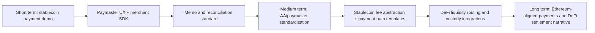

# Sui 近期开发与叙事分析

## 1. Executive Summary

Sui 近三个月的信号不是单一的 "gasless payments" 故事，而是 **高频工程推进 + 支付产品化 + Move/对象模型继续加深 + 数据/API 基础设施重构** 的组合。2026-02-23 至 2026-05-23，`MystenLabs/sui` full created-window dataset 记录 1,150 个新建 PR，其中采集时 868 个已 merged、165 个 closed-unmerged、117 个 open；另一个 merged-window 查询记录该窗口内合并 PR 919 个，因为它包含窗口前创建但窗口内合并的 PR。两组数据口径必须分开使用。

开发活跃度高，但不能把 1,150 个 PR 全部解释为协议创新。标签稀疏，标题关键词显示 CI/release/docs、Move、consensus、indexer/RPC/API、gasless/address-balance 都很活跃；其中 docs/CI/release/backport/revert/bot 贡献了明显噪音。更稳妥的判断是：Sui 核心团队保持很高迭代密度，且 4 月下旬到 5 月围绕 address balances、gasless stablecoin transfers、SDK/docs、rate limiter、kill switch 和 mainnet protocol config 形成了一条清晰支付产品化主线。

叙事层面，2026-05-20 Sui 官方 blog 将 gasless stablecoin transfers 包装为全球支付基础设施简化：用户和商户可在受限路径下无需 SUI 余额发送支持的 stablecoin。这个叙事由官方 docs、protocol config、validator admission/rate-limit 源码和多组 PR 支撑，是真实的协议/产品能力；但它不是任意交易免费，也不是通用 sponsor service。官方 docs 明确拥塞时 paid transaction 优先，eligible PTB shape 很窄，且 token allowlist、minimum amount、zero-gas 参数和 rate limit 均由协议配置/validator 验证约束。

这条支付叙事不是孤立出现的。Sui 官方在 2026-03-04 发布 USDsui / Bridge 稳定币 launch，2026-03-24 宣布 GraphQL RPC、gRPC、Archival Store 数据栈进入 production-ready，并设定 JSON-RPC 2026-07-31 deactivation deadline，2026-04-20 宣布 RedotPay 集成 SUI 和 USDC-Sui，2026-05-13 发布 programmable payments 叙事，随后 2026-05-20 发布 gasless stablecoin transfers。这说明 Sui 正在把 stablecoin liquidity、data access、custody/payment rails 和 zero-gas UX 串成一个 finance/payments story。

Fireblocks 需要保守写法。Sui 官方 blog 表述为 Address Balances 会由 Fireblocks 支持，gasless stablecoin transfers adoption 会随后跟进；但在本轮 Fireblocks 官方资料搜索中，没有找到 Fireblocks 独立确认 Sui gasless-specific support、PTB eligibility automation、zero-gas 参数自动设置或 Sui sponsor-sign-and-return API 的 material。按 review caveat，本稿将其标为 `not-found-after-search`，不从 Sui-side announcement 推断 Fireblocks 已支持完整 gasless path。

对 Mantle 的竞争启示：短期威胁不是 Sui 抢走所有 DeFi liquidity，而是它把 "用户无需持有原生 gas token 即可做稳定币转账" 变成了官方 blog、docs、SDK、protocol config、PR 和托管伙伴叙事串联的产品故事。Mantle 应优先补齐 EVM/OP Stack 语境下的 stablecoin payment UX、paymaster/gas sponsorship、merchant SDK、memo/reconciliation、托管平台接口盘点和官方叙事联动；不应直接复制 Sui 的 Move object/address-balance/gasless validation 机制。

## 2. Item Findings

### item-1: GitHub 活动基线与数据口径

#### Full PR Dataset Aggregate - 不与样本 PR 混用

| 口径 | 查询/数据 | 结果 | 用途 | Caveat |
|---|---:|---:|---|---|
| Created-window search total | `repo:MystenLabs/sui type:pr created:2026-02-23..2026-05-23` | 1,150 | 衡量窗口内新工作流入量 | GitHub Search API total；为避免 1000 cap，后续用三段日期 shard 导出 |
| Created-window sharded dataset | `/tmp/sui-pr-analysis/created-sharded.jsonl` | 1,150 unique PRs | 本稿 weekly created/state/author/title buckets 基础 | 包含 draft、bot、docs、CI、release/backport/revert；未按目录完整分类 |
| Created-window state at collection | same dataset | 868 merged / 165 closed-unmerged / 117 open | 衡量窗口内新建 PR 的采集时状态 | 不是窗口内 merged 总量 |
| Merged-window dataset | `/tmp/sui-pr-analysis/merged-window.jsonl` | 919 merged PRs | 衡量窗口内实际合并节奏和 merge latency | 包含窗口前创建但窗口内合并的 PR |
| Closed-window search total | `repo:MystenLabs/sui type:pr closed:2026-02-23..2026-05-23` | 1,141 | 交叉检查 close/merge 高活跃度 | GitHub closed 包含 merged 和 unmerged |
| Bot / draft / release-like noise | created-window local filters | bot 34; draft 78; revert-title 13; release/cherry/version-bump-like 71 | 防止将全部 PR 解释为战略开发 | 仅标题/author 规则，非人工全量标签 |
| Dependabot | search / local author filter | 0 dependabot-created found | 依赖更新噪音较低 | 其他 bot 仍存在 |

#### Weekly Activity Timeline - Created-window PRs

| Week of | Created | Merged from created-window | Closed-unmerged from created-window | Still open at collection |
|---|---:|---:|---:|---:|
| 2026-02-23 | 85 | 54 | 25 | 6 |
| 2026-03-02 | 93 | 77 | 9 | 7 |
| 2026-03-09 | 82 | 61 | 19 | 2 |
| 2026-03-16 | 91 | 77 | 11 | 3 |
| 2026-03-23 | 97 | 78 | 14 | 5 |
| 2026-03-30 | 85 | 70 | 8 | 7 |
| 2026-04-06 | 76 | 62 | 9 | 5 |
| 2026-04-13 | 100 | 69 | 21 | 10 |
| 2026-04-20 | 71 | 51 | 11 | 9 |
| 2026-04-27 | 84 | 63 | 10 | 11 |
| 2026-05-04 | 87 | 67 | 11 | 9 |
| 2026-05-11 | 111 | 83 | 14 | 14 |
| 2026-05-18 | 88 | 56 | 3 | 29 |

窗口末周 open 数偏高主要是右截断效应：2026-05-18 这一周距离采集时间很近，不能解释为开发质量下降。更重要的是 weekly created 基本维持在 70-111 的高位，没有单周断崖式收缩。

#### Merge Latency - Merged-window PRs

Merged-window dataset 共 919 个窗口内合并 PR；merge latency 从 `merged_at - created_at` 计算：

| Metric | Hours |
|---|---:|
| Average | 105.25 |
| p50 | 16.16 |
| p75 | 75.26 |
| p90 | 284.15 |

解释：p50 约 16 小时说明大量小 PR 合并很快；平均值和 p90 被 long-lived feature branches、draft/stacked PR、release/backport 或大规模重构拉高。因此它是"快合并小 PR + 少量长期大 PR"的混合分布，不应写成单一平均速度。

#### Authors / Labels / Title Buckets

Top authors by created-window PR count：`jessiemongeon1` 128, `stefan-mysten` 79, `tzakian` 75, `mystenmark` 67, `ebmifa` 62, `nickvikeras` 62, `cgswords` 49, `alex-mysten` 47, `andll` 45, `tnowacki` 42, `evan-wall-mysten` 41, `mwtian` 38。Top author 分布显示核心工程/文档/infra 人员主导，外部社区 PR 比例需要更深 GitHub identity 清洗后才能量化。

Labels 很稀疏：`Type: Documentation` 157；其他 label 基本不可用于严肃分类。Title keyword buckets 只能作为 proxy：`ci` 226, `move` 201, `consensus` 168, `docs` 151, `indexer` 101, `grpc/rpc` 77, `security` 58, `cli` 53, `address_balance` 50, `graphql` 46, `gasless` 27, `benchmark` 23, `wallet` 9。该 bucket 是多标签标题匹配，sum 大于 1,150，不是互斥占比。

### item-2: PR 分类体系与开发方向分布

下表是基于 full created-window title buckets + spot-checked representative PRs 的开发方向图谱。**数量列是 approximate title proxy，不是完整 directory/file analysis。代表 PR 只作样本证据，不代表该类所有 PR。**

| 开发方向 | Full dataset proxy | 代表 PR 样本 | 工程意图 | 可见影响 |
|---|---:|---|---|---|
| CI / release / 运维 | `ci` 226; release-like 71 | release/binary/homebrew/build 相关 PRs；`mainnet-v1.72.2` release | 维持多网络快速发版、二进制构建和 release train | 高 PR 数的一部分是工程运营，不等于协议创新 |
| Move / Framework | `move` 201 | [#25838](https://github.com/MystenLabs/sui/pull/25838) `[move] Add and enable the new VM`，542 files, merged 2026-03-16 | Move VM / compiler / framework 深层演进 | Move 开发者体验和运行时行为继续变化 |
| Consensus / execution / reliability | `consensus` 168; `benchmark` 23 | [#26727](https://github.com/MystenLabs/sui/pull/26727) `[consensus] add BlockV3`; #26730 gas priority admission queue | Mysticeti/validator/admission/execution 可靠性和优先级治理 | 支撑高性能 L1 与付费交易优先级叙事 |
| API / SDK / CLI / docs DX | `docs` 151; `cli` 53; `grpc/rpc` 77; `graphql` 46 | [#26705](https://github.com/MystenLabs/sui/pull/26705) rewrite Exchange Integration around gRPC and GraphQL | 从 JSON-RPC 走向 gRPC/GraphQL/typed data access，降低集成摩擦 | 交易所、钱包、支付应用和 indexer 使用新 API |
| Indexer / data / observability | `indexer` 101 | [#26403](https://github.com/MystenLabs/sui/pull/26403) track coin and address balances separately; [#26714](https://github.com/MystenLabs/sui/pull/26714) GraphQL resumable checkpoints, open | Address balances、streaming checkpoints、indexer schema 更新 | 支付/DeFi/分析工具需要支持 balance 与 coin 双路径 |
| Payments / gasless / address balances | `gasless` 27; `address_balance` 50 | #25854, #25866, #26156, #26417, #26426, #26504, #26576, #26700, #26760, #26763 | gasless stablecoin free tier、address-balance gas、rate limit、kill switch、docs validation | 官方支付叙事从文档/SDK/源码到 mainnet protocol config 打通 |
| Security / abuse control / testing | `security` 58 | #25854 rate limiter; #25866 DoS accounting; #26426 kill switch | 降低 free-tier abuse、拥塞和安全风险 | gasless 被限定为可控免费层，不是无限免费执行 |
| Wallet / ecosystem support | `wallet` 9 plus docs/API samples | wallet/docs/examples scattered | 支持用户身份、钱包和托管集成 | 数量不高，但和 payment docs/API 结合成 UX 层 |

### item-3: 重大功能变更与架构调整

#### Representative PR Sample - 仅作代表性证据

| Change | Representative evidence | Status | Impact scope | Narrative meaning | Confidence |
|---|---|---|---|---|---|
| Native gasless stablecoin transfers mainnet path | [#26417](https://github.com/MystenLabs/sui/pull/26417) mainnet stablecoin allowlist; [#26504](https://github.com/MystenLabs/sui/pull/26504) enable address balances and gasless on mainnet v125; [#26760](https://github.com/MystenLabs/sui/pull/26760) docs update | merged; docs/blog published 2026-05-20/22 | wallet, end user, stablecoin sender/recipient | Sui 将"无需 SUI 的 stablecoin transfer"产品化 | high |
| Gasless abuse controls | [#25854](https://github.com/MystenLabs/sui/pull/25854) gasless rate limiter; [#25866](https://github.com/MystenLabs/sui/pull/25866) count gasless tx for DoS; [#26156](https://github.com/MystenLabs/sui/pull/26156) cap tx size/TPS/compute; [#26426](https://github.com/MystenLabs/sui/pull/26426) kill switch | merged | validators, full nodes, protocol config | 免费层被明确限制和可关闭 | high |
| Address balances as fungible asset custody primitive | [#26532](https://github.com/MystenLabs/sui/pull/26532) design docs; [#26403](https://github.com/MystenLabs/sui/pull/26403) coin/address balances indexed separately; [#25760](https://github.com/MystenLabs/sui/pull/25760) backward compat | merged / docs | custodians, wallets, indexers, DeFi | 从 coin-object inventory 走向 address-owned balance UX | high |
| Move VM / framework large change | [#25838](https://github.com/MystenLabs/sui/pull/25838) new VM, 542 files | merged 2026-03-16 | Move developers, framework, execution | Move runtime 仍在快速演进，不只是支付叙事 | high |
| Consensus / admission queue iteration | [#26727](https://github.com/MystenLabs/sui/pull/26727) BlockV3; #26730 gas priority tx admission queue | merged near 2026-05-21 | validators, paid tx priority, congestion behavior | 高性能 L1 叙事继续由共识/执行 PR 支撑 | medium-high |
| GraphQL/gRPC/indexer migration | [#26705](https://github.com/MystenLabs/sui/pull/26705) exchange integration around gRPC/GraphQL; [#26714](https://github.com/MystenLabs/sui/pull/26714) resumable checkpoints subscription, open | mixed: merged + open | exchanges, indexers, SDK users | 数据接入和开发者体验成为工程主线 | medium-high |
| Docs as product surface | `Type: Documentation` 157; gasless docs validation [#26700](https://github.com/MystenLabs/sui/pull/26700) | merged | developers, partners, exchanges | Sui 将工程功能快速包装成外部可理解的 product docs | high |

这些样本支持的判断是：4-5 月支付主线很清晰，但 Sui 的底层工程并未停止在 consensus/Move/data access 上演进。对 Mantle 汇报时，应避免把 Sui 描述成"最近只做支付"。

### item-4: 开发活跃度趋势与工程组织信号

活跃度趋势较稳。Created PR 每周 70-111，merged-window 每周合并量大致维持高位；2026-05-11 周 created 111 是窗口峰值，随后 2026-05-18 周仍有 88 created，但 open 数上升到 29，主要受窗口右截断影响。

工程组织上有三个信号：

1. **核心团队集中主导。** Top authors 多为 Mysten/Sui 相关工程、docs、infra 贡献者；`sui-merge-bot[bot]` 21 个 PR 说明 release/version bump 自动化占一部分。
2. **快速小 PR + 长期大 PR 并存。** Merged-window p50 latency 16.16h，但 p90 284.15h；说明许多 docs/CI/small fix 很快合并，同时大 VM、streaming、forking stack、data infrastructure PR 保持长周期。
3. **叙事事件前有工程铺垫。** Gasless stablecoin blog 在 2026-05-20 发布，之前 3 月底到 5 月中旬已有 rate limiter、DoS accounting、min deposit、tx size/TPS、allowlist、kill switch、mainnet enable、simulation/docs 等 PR 铺垫。

与 Mantle 可比的不是"PR 数越多越好"，而是 Sui 能把 protocol config、validator admission、SDK/docs、partner narrative 和 release cadence 在短周期内串成一个外部可理解的 launch story。

### item-5: Gasless Stablecoin Payments / Fireblocks 叙事与实现边界

#### Official narrative arc

| Date | Official Sui source | Narrative signal | Connection to GitHub/source evidence |
|---|---|---|---|
| 2026-03-04 | [Sui Dollar (USDsui) Now Live on Sui](https://blog.sui.io/sui-dollar-launch-bridge/) | Native digital dollar for scalable finance and global payments; Bridge/Stripe company issuance angle | Stablecoin base for later gasless/payment UX |
| 2026-03-24 | [GraphQL and Archival Store Complete the Sui Data Stack](https://blog.sui.io/graphql-archival-store-sui-data-stack/) | gRPC + GraphQL RPC + Archival Store production-ready; JSON-RPC sunset date | Matches PR/API work around gRPC/GraphQL/exchange integration |
| 2026-04-08 | [The Sui Monthly: March 2026](https://blog.sui.io/sui-monthly-march-2026/) | $1T stablecoin transfer milestone, Sui Dollar, Hashi, developer infra | Supports finance/payments + developer infra dual narrative |
| 2026-04-20 | [RedotPay Integrates SUI and USDC-Sui](https://blog.sui.io/redotpay-integrates-sui-and-usdc-sui/) | Stablecoin-based payments fintech integration and global payout story | Ecosystem/partner payment rail, not protocol-level gasless evidence |
| 2026-05-13 | [The Future of Payments Is Programmable](https://blog.sui.io/the-future-of-payments-is-programmable/) | Programmability/compliance/payment rules as asset-level logic; previews gasless stablecoin barrier removal | Narrative bridge from Move/object model to payments infrastructure |
| 2026-05-20 | [Sui Launches Gasless Stablecoin Transfers](https://blog.sui.io/sui-launches-gasless-stablecoin-transfers/) | Protocol-level gasless stablecoin transfers, Address Balances, Fireblocks wording | Directly supported by gasless/address-balance PRs and docs/source |
| 2026-03-16 | [New Sui VM: Bug Bounty Now Open](https://blog.sui.io/new-sui-vm-bug-bounty-open/) | New VM, performance/memory/future Move features | Aligns with #25838 new VM PR and Move ecosystem investment |

#### Sui-side verified

Sui 官方 docs 将 gasless stablecoin transfers 描述为 qualified stablecoin P2P transfers：sender 不需要 SUI，gas price/budget/payment 为 zero/empty，SDK 在 gRPC/GraphQL transport 下可自动检测；拥塞时 paid transactions 优先。Docs 和源码都强调边界：token 必须在 protocol allowlist 中；当前 docs/code evidence 覆盖 USDC、USDSUI、SUI_USDE、USDY、FDUSD、AUSD、USDB 等 stablecoin；最低转账/余额阈值为 0.01 单位；PTB 只能走受限 Move calls，不能任意 object writes、swap、NFT mint 或 app interaction。

PR 与源码 evidence 对应：

- [#25854](https://github.com/MystenLabs/sui/pull/25854): gasless rate limiter，`crates/sui-core/src/gasless_rate_limiter.rs`。
- [#25866](https://github.com/MystenLabs/sui/pull/25866): gasless tx 计入 DoS protection。
- [#26156](https://github.com/MystenLabs/sui/pull/26156): 限制 gasless tx size/TPS/compute。
- [#26417](https://github.com/MystenLabs/sui/pull/26417): mainnet stablecoin allowlist for protocol v123。
- [#26426](https://github.com/MystenLabs/sui/pull/26426): TransactionDenyConfig kill switch。
- [#26504](https://github.com/MystenLabs/sui/pull/26504): enable address balances and gasless transactions on mainnet v125。
- [#26576](https://github.com/MystenLabs/sui/pull/26576): gasless simulate path `ValidDuring` expiration。
- [#26700](https://github.com/MystenLabs/sui/pull/26700), [#26760](https://github.com/MystenLabs/sui/pull/26760), [#26763](https://github.com/MystenLabs/sui/pull/26763): docs validation/update and explicit `gas_price=0` simulation fix。

因此，Sui-side gasless finding 是 high confidence：官方 blog/docs/source/PRs 相互印证。它的正确表述是 **protocol-level narrow free tier for allowlisted stablecoin transfers**，不是"所有 stablecoin payments free"。

#### Fireblocks boundary

Sui 官方 blog《Sui Launches Gasless Stablecoin Transfers, Simplifying Global Payments Infrastructure》称 Address Balances launched simultaneously and will be supported by Fireblocks, with adoption of gasless stablecoin transfers soon to follow。这个 statement 支持"Fireblocks 是 Sui 支付/托管叙事的一部分"，但不独立证明 Fireblocks 已支持完整 Sui gasless workflow。

本轮搜索 Fireblocks 官方资料后：

| Fireblocks question | Finding | Evidence status |
|---|---|---|
| Fireblocks 是否官方确认 Sui gasless-specific support？ | `not-found-after-search` | 未找到 Fireblocks 官方公告/API 文档明确确认 Sui gasless stablecoin free-tier eligibility 或 zero-gas build support |
| Fireblocks Gas Station 是否可直接类比？ | 不能直接类比 | Fireblocks Gas Station docs 描述 Ethereum and EVM-based networks auto-fuel base asset，不是 Sui-specific gasless PTB |
| Fireblocks Create Transaction API 是否证明 gasless？ | 否 | Create transaction docs 是通用交易 API 证据，不证明 Sui free-tier / PTB policy inspection |
| Fireblocks 在 Sui payment stack 的合理位置 | custody, policy, signing, reconciliation, potential future sponsor/key custody | 这是架构推断，应标注为 inference，而非 confirmed support |

对 Mantle 的启示是：托管伙伴叙事很有价值，但内部分享不能把 Sui-side blog 推断成 Fireblocks 已经提供 Sui-specific gasless Gas Station。

### item-6: Move 生态扩展与开发者叙事变化

Sui 近期不是只在做支付。`move` title bucket 201，且 [#25838](https://github.com/MystenLabs/sui/pull/25838) 这种 542-file new VM PR 说明 Move runtime/toolchain 仍是核心开发面。Address balances、funds accumulator、coin/balance conversion、sponsored/gasless flows 又把 Move object/accounting model 与支付叙事连接起来。

开发者叙事有三层：

1. **对象模型 / PTB / 并行执行。** Sui docs 继续把 everything-is-object、owned/shared/party ownership、PTB 和 Mysticeti/parallel execution 作为差异化基础。对支付、游戏、consumer app，这种对象模型可以表达 coin inventory、owned object、shared object 和 atomic PTB 组合。
2. **API 迁移。** Exchange Integration rewrite around gRPC and GraphQL、GraphQL streaming checkpoints、typed object/data access docs，说明 Sui 在推进从旧 JSON-RPC 到更结构化 data access 的迁移。
3. **Wallet/custodian UX。** Address balances 的核心开发者价值是消除 coin selection、object locking 和 gas coin inventory；gasless stablecoin docs 又把 SDK transport 与 zero-gas build 结合，降低钱包/托管接入门槛。

与 Aptos Move 相比，Sui 强调 object model、PTB、owned/shared object 和 address balances；与 EVM/Mantle 相比，优势是表达支付/游戏/对象组合时更原生，劣势是开发者迁移成本和生态资产/工具兼容性。

### item-7: 支付 / DeFi 方向发力与生态证据

Sui 的支付/DeFi 叙事需要分成三层，不能混在一起：

| 层 | Evidence | 结论 |
|---|---|---|
| Chain capability | Gasless stablecoin docs/source, Address Balances docs/source, Sponsored Transactions docs | Sui 在协议/SDK/validator 层确实降低了 stablecoin P2P transfer 的 gas friction |
| Product narrative | 2026-05-20 Sui gasless stablecoin blog; Payments docs page | 官方叙事从高性能 L1 扩展到 payments stack / global payments infrastructure |
| Ecosystem liquidity | DeFiLlama third-party snapshot | 有 DeFi/stablecoin liquidity，但需 caveat 指标口径和激励影响 |

Ecosystem snapshot (DefiLlama API, accessed 2026-05-23):

- Chain TVL: approximately $579.3M.
- Stablecoins circulating on Sui: approximately $595.8M pegged USD by DefiLlama stablecoins endpoint; visible sample includes USDC about $397.8M, USDSUI about $75.1M, FDUSD about $43.5M, BUCK about $25.9M, USDY about $23.1M, USDT about $14.7M, suiUSDe about $13.9M, AUSD about $1.9M.
- DEX overview for Sui: about $95.3M 24h, $540.4M 7d, $2.10B 30d volume; top 24h entries included DeepBook V3, Cetus CLMM, Bluefin Spot, Lotus Finance, Turbos.

这些数字支持"Sui 有支付/DeFi 叙事承载基础"，但不是独立证明商户支付 adoption。稳定币 liquidity、法币出入金、合规、商户 settlement、退款争议和托管集成仍依赖外部伙伴。

### item-8: 竞品定位：Sui 与其他 L1/L2/支付链的差异化

| Network / stack | Payment UX | Developer ecosystem | Institutional/custody angle | Finality / cost framing | Mantle implication |
|---|---|---|---|---|---|
| Sui | Native narrow gasless stablecoin transfer; sponsored tx; address balances | Move + object model + PTB; gRPC/GraphQL shift | Sui-side Fireblocks narrative; Fireblocks gasless-specific support not found | High-performance L1, Mysticeti, paid tx priority under congestion | Strong UX/narrative pressure; hard to copy mechanics directly |
| Mantle / Ethereum L2 | EVM paymaster/AA possible; stablecoin gas abstraction can be app/system-layer | Solidity/EVM liquidity and tooling | Can integrate Fireblocks/Coinbase/BitGo-style custody through EVM rails | L2 cost/security/liquidity tied to Ethereum ecosystem | Best response is EVM-aligned payments + DeFi settlement, not Move emulation |
| Solana | Low-fee L1, strong consumer/payment mindshare | Rust/Solana VM, mature consumer infra | Custody and institutional support broad | High throughput, local fee market narrative | Competes for consumer/payment attention, less differentiated on "gasless stablecoin" |
| Aptos | Move-adjacent; sponsored/gas abstraction patterns possible | Move, parallel execution, institutional positioning | Similar Move/institutional route | High-performance L1 | Sui's object/address-balance choices are key differentiation vs Aptos |
| Base | Coinbase distribution, USDC/consumer app funnel, EVM AA | EVM + Coinbase developer distribution | Coinbase custody/exchange rails | Ethereum L2 economics | Strongest EVM distribution benchmark for Mantle |
| Tempo | Payment-first EVM-compatible L1, stablecoin gas/payment lane | Custom Reth/L1 stack | Stripe/Paradigm payment-native narrative | Payment-specific blockspace/finality | Compare against Mantle for product primitives: memo, stablecoin gas, merchant APIs |
| Canton / Fireblocks-style infra | Enterprise workflow/custody/compliance, not open DeFi L1 | Daml/Canton or custody API stack | Strong institutional/privacy/compliance | Enterprise synchronization, not retail L1 UX | Useful for ToB/custody framing, not a replacement for Mantle DeFi rails |

Sui 的差异化不是单点 gasless，而是 object model + Move + high-performance L1 + payments UX + docs/source-backed launch narrative。Mantle 的反向定位应强调 Ethereum liquidity/EVM compatibility、AA/paymaster composability、institutional custody through existing EVM rails、and DeFi settlement rather than trying to look like a Move L1.

### item-9: 对 Mantle 的竞争启示与响应建议

#### Threat surface

1. **Onboarding friction.** Sui 用 native gasless stablecoin transfer 把"新用户没有 gas token"这个痛点做成官方产品，而 Mantle 若仍要求用户理解 MNT/ETH gas，会在支付 demo 中显得落后。
2. **Narrative packaging.** Sui 的强点是 blog + docs + protocol config + PR + source validation + partner name 同步出现；这是工程势能的对外包装能力。
3. **Object model differentiation.** Address balances、Coin/Balance/FundsAccumulator 和 PTB 组合在支付/游戏/consumer app 中有表达优势。
4. **Institutional adjacency.** Fireblocks 虽未独立确认 gasless-specific support，但托管伙伴名字足以增强机构可用性叙事。

#### Borrowable for Mantle

- Stablecoin payment SDK: payment request, token/amount/recipient, memo/order id, status webhook, retry/reconciliation.
- Paymaster/gas sponsorship: hide native gas token for stablecoin payment flows; support merchant-sponsored gas and user-paid stablecoin fee abstraction.
- SDK/API auto-detection: app SDK detects eligible payment path and sets fee/paymaster parameters automatically, analogous to Sui SDK gasless detection.
- Docs + code + PR launch discipline: official blog should point to docs, SDK examples, source/contract references, and partner integration boundaries.
- Merchant/custodian integration checklist: Fireblocks, Coinbase Prime, BitGo, Copper, exchanges and wallet infra should be mapped by exact API support, not marketing names.

#### Not directly portable

- Sui address balance is not ERC-20 balance; it is tied to Sui object/accounting/funds accumulator design.
- Sui native gasless validation is not an EVM precompile one can copy; Mantle would need AA/paymaster, bundler, system contract, sequencer policy, or app-level sponsorship design.
- Sui paid transaction priority vs gasless free tier maps poorly to OP Stack gas economics without explicit sequencer/builder policy design.
- Fireblocks support for Sui, even if later confirmed, is not automatically a Mantle advantage; Mantle needs separate EVM/Mantle-specific product work.

#### Roadmap

| Horizon | Mantle response | Rationale |
|---|---|---|
| Short term | Stablecoin payment demo, paymaster UX, merchant SDK skeleton, memo/reconciliation event standard, custody platform API support matrix | Can ship without protocol fork; directly counters Sui onboarding narrative |
| Medium term | AA/paymaster standardization, stablecoin fee abstraction, transaction path templates for merchant payments, indexed payment intents, DeFi liquidity routing | Converts demo into reusable platform primitives |
| Long term | "Ethereum-aligned payments and DeFi settlement layer" positioning, optional payment-specific sequencing policy, enterprise custody/compliance integrations | Differentiates from Sui/Tempo/Canton without abandoning EVM liquidity |

### item-10: 风险、开放问题与事实核验清单

- GitHub API rate limit occurred after core dataset export and several PR spot checks; final PR data should be re-run if exact reviewer/directory/file classification is needed.
- Current PR classification uses title/label proxies and representative sample PRs, not full changed-file directory analysis. Directory-level counts remain a gap.
- No local PR Tracker daily report covering this Sui window was found in the repo; `src-7` is marked insufficient/not-found for this draft.
- Fireblocks official Sui gasless-specific support is `not-found-after-search`; this is not evidence that Fireblocks will never support it.
- Sui docs/source are protocol-version sensitive. Allowlisted tokens, gasless TPS, computation units and SDK behavior may change after 2026-05-23.
- Ecosystem metrics from DefiLlama are third-party snapshots, not audited Sui Foundation metrics.
- Latest release checked was `mainnet-v1.72.2` (published 2026-05-20); this draft did not fully map every PR to release notes.
- Security/incident scan was limited to PR/release/docs signals under standard depth; no independent validator incident archive was exhaustively reviewed.
- The outline file frontmatter still says `status: candidate`; the approved gate is established by Multica review comment and Orchestrator dispatch, not by file mutation.

## 3. Diagrams

### diag-1: PR activity timeline

| Week | Created-window PRs | Merged-window signal | Notable events / representative samples |
|---|---:|---|---|
| 2026-02-23 | 85 | High daily merges begin | Release/build/Move maintenance; search window starts |
| 2026-03-02 | 93 | High | Reverts and GraphQL/indexer work visible |
| 2026-03-09 | 82 | High | Release snapshots; docs/indexer |
| 2026-03-16 | 91 | High | #25838 new Move VM merged; #25866 gasless DoS PR created |
| 2026-03-23 | 97 | High | Gasless helpers and address-balance compatibility work |
| 2026-03-30 | 85 | High | #25866 merged; gasless validation hardening |
| 2026-04-06 | 76 | Medium-high | #25854 gasless rate limiter merged |
| 2026-04-13 | 100 | High | Gasless min/size/TPS constraints; indexer changes |
| 2026-04-20 | 71 | Medium | #26264 remaining balance verification; address balances |
| 2026-04-27 | 84 | Medium-high | #26403 address balance indexing; release v1.71 train |
| 2026-05-04 | 87 | High | #26504 mainnet gasless/address balance enable; #26426 kill switch |
| 2026-05-11 | 111 | High | #26576 simulate expiration; v1.72 release train |
| 2026-05-18 | 88 | High but right-censored | 2026-05-20 gasless blog; #26727 BlockV3; #26705 exchange docs |

### diag-2: Development category matrix

| Category | Dataset proxy | Representative sample only | Strategic read |
|---|---:|---|---|
| CI/release/ops | 226 CI-title; 71 release-like | version bumps, binary builds, release workflows | Explains part of PR volume; release machine is active |
| Move/framework | 201 move-title | #25838 | Sui continues runtime/language investment |
| Consensus/execution | 168 consensus-title | #26727, #26730 | High-performance L1 narrative still backed by engineering |
| API/RPC/indexer | 101 indexer; 77 gRPC/RPC; 46 GraphQL | #26403, #26705, #26714 | Data access is a major dev-ex and ecosystem theme |
| Payments/address balances | 50 address_balance; 27 gasless | #25854, #26417, #26504 | Payment launch is backed by protocol/docs/source PRs |
| Docs/DX | 151 docs-title; 157 docs-label | #26700, #26760 | Docs are treated as product surface |
| Security/abuse | 58 security-title | #25854, #25866, #26426 | Free tier constrained with rate limit / kill switch |

### diag-3: Gasless stablecoin flow and Fireblocks boundary

```mermaid
sequenceDiagram
    participant U as User / Wallet
    participant C as Custodian / Fireblocks
    participant SDK as Sui SDK gRPC/GraphQL
    participant FN as Full node / Validator
    participant V as Protocol checks

    U->>SDK: Build stablecoin transfer PTB
    SDK->>SDK: Check token allowlist + PTB shape
    alt Custodied user
        U->>C: Request custody signature / policy approval
        C-->>U: Signature if policy passes
        Note over C: Fireblocks gasless-specific automation = not-found-after-search
    else Self-custody
        U->>U: Sign transaction
    end
    SDK->>FN: Submit gasPayment=[], gasPrice=0, gasBudget=0
    FN->>V: Validate gasless shape, amount, inputs, size
    V->>V: Check local + consensus gasless rate limit
    alt Eligible and not rate-limited
        V-->>FN: Admit, lower priority than paid tx under congestion
        FN-->>U: Effects / digest
    else Not eligible
        V-->>FN: Reject; use paid or sponsored path
    end
```

### diag-4: Sui vs Mantle / Base / Solana / Aptos / Tempo / Canton

| Dimension | Sui | Mantle | Base | Solana | Aptos | Tempo | Canton |
|---|---|---|---|---|---|---|---|
| Gas abstraction | Native narrow gasless stablecoin path + sponsored tx | Paymaster/AA possible, needs productization | AA/Paymaster + Coinbase distribution | Low fee, not same native stablecoin free tier | Move-based sponsorship possible | Stablecoin gas / payment lane | Enterprise fees/workflows |
| Dev ecosystem | Move/object/PTB | EVM/Solidity | EVM + Coinbase | Solana/Rust | Move | EVM-compatible custom L1 | Daml/enterprise |
| Payment narrative | Launched gasless stablecoin transfer story | Needs sharper packaging | USDC/consumer apps | Consumer/payments/DePIN | Move/institutional | Payment-first chain | Institutional settlement |
| Institution angle | Sui-side Fireblocks narrative | EVM custody rails to be activated | Coinbase institutional rails | Broad custody support | Institutional partnerships | Stripe/Paradigm | Strongest enterprise privacy/compliance |
| Mantle response | Learn UX/story, not mechanics | Own the EVM path | Benchmark distribution | Benchmark consumer speed | Benchmark Move story | Benchmark payment primitives | Benchmark ToB workflow |

### diag-5: Mantle response roadmap



## 4. Source Coverage

| Requirement | Coverage | Sources / notes |
|---|---|---|
| src-1 GitHub PR data | partial-full | GitHub Search API / `gh api` full created-window + merged-window exports; full raw temp exports under `/tmp/sui-pr-analysis/`; later API rate-limit prevents immediate rerun |
| src-2 PR samples | full for standard-depth narrative | Representative PRs: #25838, #25854, #25866, #26156, #26264, #26403, #26417, #26426, #26504, #26532, #26576, #26700, #26705, #26714, #26727, #26760, #26763 and release `mainnet-v1.72.2` |
| src-3 Official blog | full | Sui Blog: [Gasless Stablecoin Transfers](https://blog.sui.io/sui-launches-gasless-stablecoin-transfers/), [Sui Dollar / USDsui](https://blog.sui.io/sui-dollar-launch-bridge/), [GraphQL and Archival Store](https://blog.sui.io/graphql-archival-store-sui-data-stack/), [Sui Monthly March 2026](https://blog.sui.io/sui-monthly-march-2026/), [RedotPay Integration](https://blog.sui.io/redotpay-integrates-sui-and-usdc-sui/), [The Future of Payments Is Programmable](https://blog.sui.io/the-future-of-payments-is-programmable/), [New Sui VM](https://blog.sui.io/new-sui-vm-bug-bounty-open/) |
| src-4 Official docs | full | Sui docs: [Gasless Stablecoin Transfers](https://docs.sui.io/develop/transaction-payment/gasless-stablecoin-transfers), [Address Balances](https://docs.sui.io/onchain-finance/asset-custody/address-balances/), [Sponsored Transactions](https://docs.sui.io/develop/transaction-payment/sponsor-txn), [Payments](https://docs.sui.io/onchain-finance/payments), [Object Model](https://docs.sui.io/develop/sui-architecture/object-model), [Transaction Lifecycle](https://docs.sui.io/develop/transactions/transaction-lifecycle) |
| src-5 Source code | partial-full | `MystenLabs/sui@818f8d78f222b9279cb966a5754fb0a2c21d58b1`; code paths from prior verified research and current PR/source spot checks: gasless rate limiter, transaction validation, protocol config, gas charger, address balances/indexer |
| src-6 Partner docs | covered with negative finding | Fireblocks docs: [Gas Station](https://developers.fireblocks.com/docs/work-with-gas-station), [Create Transaction](https://developers.fireblocks.com/reference/create-transactions); Sui gasless-specific support = `not-found-after-search` |
| src-7 PR Tracker | not-found / insufficient | Local repo search did not find PR Tracker daily reports covering Sui window; draft relies on GitHub direct data |
| src-8 Ecosystem data | partial | DefiLlama chain TVL, stablecoins endpoint, DEX overview API accessed 2026-05-23; third-party snapshot caveat |
| src-9 Comparative sources | partial | Existing internal research: `202606-internal-sharing/research-sections/payment-tempo/final.md`, `enterprise-canton/final.md`, plus official project docs where referenced at high level |
| src-10 Internal research | full | `sui-gasless-stablecoin-payments/research-sections/sui-gasless-mechanism/final.md`; `sui-gasless-stablecoin-payments/research-sections/sui-payments-code-analysis/final.md`; this draft re-verifies current PR/blog/docs boundary rather than copying conclusions blindly |

## 5. Gap Analysis

1. **Directory-level full classification remains open.** This draft has full PR aggregate counts and title buckets, but not a full changed-file directory matrix for all 1,150 PRs. A next revision could enrich each PR with files changed through GitHub PR files API after rate limit resets.
2. **Reviewer/review-density not computed.** GitHub API export collected PR issue metadata, not review events; review density and reviewer concentration remain gaps.
3. **Release-note mapping is incomplete.** Latest release was checked, but every major PR was not mapped to mainnet/testnet/devnet release notes.
4. **Fireblocks negative finding is time-sensitive.** `not-found-after-search` is correct for this run, but should be rechecked before external publication.
5. **Ecosystem metrics are third-party.** DeFiLlama numbers are useful directional context but should not be presented as Sui-official adoption proof.
6. **Comparator depth is uneven.** Tempo/Canton comparisons benefit from existing internal research; Base/Solana/Aptos are used for strategic framing, not deeply re-researched in this draft.
7. **Incident/security scan is not exhaustive.** Security/abuse controls were traced through PRs and source, not through a full incident archive.

## 6. Revision Log

| Round | Action | Notes |
|---:|---|---|
| 1 | Initial deep draft | Produced from outline-approved dispatch for `competitor-sui`; applies caveats separating full PR dataset from representative PR samples and marking Fireblocks gasless-specific support as `not-found-after-search`. |
