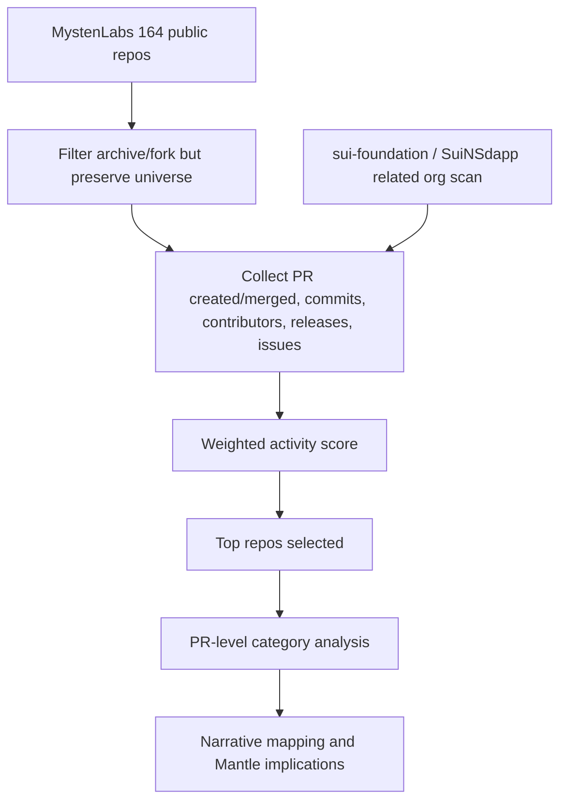
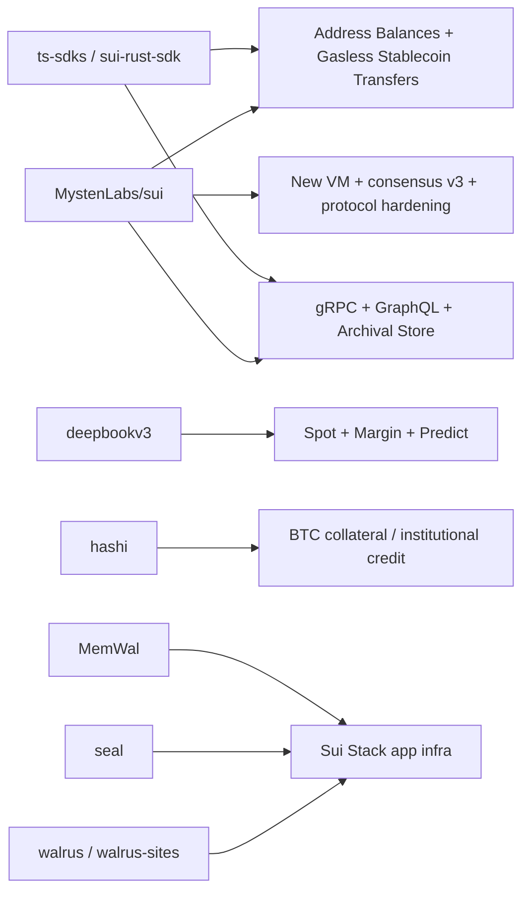

# Sui 近期开发与叙事分析 - Final

## 1. Executive Summary

本轮研究严格先做 repo discovery/ranking，再进入 PR 分析。2026-02-23 至 2026-05-23 窗口内，`MystenLabs` org 有 **164 个公开 repo**；通过 GitHub GraphQL/Search 按周分页抓取，得到 **2,966 个 created PR** 和 **2,410 个 merged PR**。在非 archive / 非 fork repo 中，用 `35% merged PR + 20% created PR + 20% default-branch commit + 15% non-bot PR contributors + 10% release/push recency` 的公式排序，Top 10 是：`sui`、`hashi`、`walrus`、`ts-sdks`、`sui-packages`、`MemWal`、`deepbookv3`、`seal`、`sui-stack-messaging`、`ts-sdks-incubation`。因此结论不是预设 `MystenLabs/sui` 为唯一对象，而是：`sui` 仍绝对主导协议/API/数据栈变更，但近期开发重心同时外溢到 Bitcoin finance (`hashi`)、Walrus storage、TypeScript SDK/payment kit、package metadata distribution、AI memory/messaging、DeepBook DeFi primitives、Seal encryption/key-server、Rust SDK / light-client / proofs。

最重要的开发方向有四条。第一，`MystenLabs/sui` 在 v1.71-v1.72 release train 中把 Address Balances 与 Gasless Stablecoin Transfers 推到 mainnet release notes 和 protocol config：PR #26504、#26417、#26448、#26700、#26763、#26604 等形成了 protocol config、allowlist、docs、SDK/simulate 的闭环。第二，数据访问栈继续从 JSON-RPC 迁移到 gRPC + GraphQL + Archival Store：官方 2026-03-24 blog 写明新数据栈 GA 且 JSON-RPC 将在 2026-07-31 停用，GitHub 中也能看到 GraphQL streaming、indexer-alt、cp_digests、gRPC metrics、JSON-RPC migration docs 的持续 PR。第三，DeFi 和支付叙事变得更产品化：DeepBook Predict testnet、DeepBook Spot/Margin、USDsui、suiUSDe、RedotPay、gasless stablecoin transfers 和 Hashi/BTC finance 同期出现，且 `deepbookv3`、`hashi`、`ts-sdks`、`sui` docs/code 有对应活动。第四，Sui Stack / app infrastructure 不是营销口号：`walrus`、`walrus-sites`、`seal`、`MemWal`、`sui-stack-messaging` 的 PR 与官方 blog 显示 Sui 正把 storage、encryption、messaging、AI memory 和 app developer rails 串成一组非 EVM app primitives。

叙事上，Sui 在这三个月从 "high-throughput Move L1" 明显收窄到几个更可销售的方向：**programmable payments / stablecoin UX、composable onchain finance、Bitcoin/institutional collateral、data/storage/encryption app stack、Move/object-model developer ergonomics**。这对 Mantle 的竞争启示很直接：Sui 的威胁不是单点 gasless，而是把协议级 UX、稳定币资产、托管/支付伙伴、DeepBook liquidity primitives、SDK/docs、数据栈和 app infra 放进同一条产品叙事。Mantle 如果只用 "EVM + low fees + EigenDA" 反击，会显得偏基础设施；短期应补齐 USDC/paymaster/gas sponsorship demo、merchant/payment SDK、可验证数据栈迁移路径和 DeFi primitive packaging，中期再评估 app-specific storage/privacy/messaging 与 BTC/stablecoin collateral primitives 是否值得生态层投入。

关键 caveat：Sui 官方 blog 声称 gasless stablecoin transfers 发布时 Address Balances 将获得 Fireblocks 支持，并称 gasless stablecoin adoption soon to follow；这不等于 Fireblocks 已自动识别 Sui gasless eligibility、自动设置 `gasPrice=0/gasBudget=0/gasPayment=[]`、或支持 Sui-specific sponsor-sign-and-return API。DefiLlama TVL/volume、stablecoin transfer volume 和 partner participation 也必须标注为第三方或官方叙事口径，不能当成代码事实。

## 2. Item Findings

### item-1: Org 与 repo universe 发现

**执行顺序确认**：本 draft 先执行 repo universe 扫描，再排序，再进入 PR 深挖。查询方式：

```shell
gh repo list MystenLabs --limit 1000 \
  --json name,url,description,isArchived,isFork,isPrivate,primaryLanguage,stargazerCount,forkCount,createdAt,updatedAt,pushedAt,defaultBranchRef,repositoryTopics

GitHub GraphQL search by week:
org:MystenLabs is:pr created:2026-02-23..2026-05-23
org:MystenLabs is:pr merged:2026-02-23..2026-05-23

Per repo:
defaultBranchRef.target.history(since:"2026-02-23T00:00:00Z", until:"2026-05-23T23:59:59Z").totalCount
releases(first:100, orderBy:{field:CREATED_AT,direction:DESC})
repo:MystenLabs/{repo} is:issue -is:pr updated:2026-02-23..2026-05-23
```

**Repo universe 结果**：

| Org / scope | Repo count | Created PR | Merged PR | 纳入/排除判断 |
|---|---:|---:|---:|---|
| `MystenLabs` | 164 public repos | 2,966 | 2,410 | 主分析对象；完整排序输入 |
| `sui-foundation` | 27 public repos | 17 | 4 | 主要为 awesome list、SIPs、audits、education；活跃度远低于 MystenLabs，作为生态/叙事辅助，不进 Top repo PR 深挖 |
| `SuiNSdapp` | 3 public repos | 0 | 0 | 基本无窗口内 PR；SuiNS 相关活跃代码主要在 `MystenLabs/suins-contracts` 与 `ts-sdks` package release 中观察 |
| `suinetwork` | n/a | n/a | n/a | GitHub owner handle 未识别为 org/user；不纳入 |

**类型分布**：`MystenLabs` 中既有 `sui` core monorepo，也有 Walrus/Seal/DeepBook/Hashi/MemWal 等产品或 infra repo，还有 SDK/docs/examples、fork/dependency 和 archive repo。Archived repo 如 `narwhal`、`mysten-infra` 保留在 universe 清单但不进入活跃排序；fork repo 如 `anemo`、`snarkjs`、`rapidsnark` 单列，不把上游同步误读为 Sui 研发重点。

### item-2: 活跃度公式、排名与 Top repo 选择

**排序公式**：

`score = 35 * norm(merged_pr) + 20 * norm(created_pr) + 20 * norm(default_branch_commit) + 15 * norm(non_bot_pr_authors) + 10 * recency`

其中 `recency = 70% release_count_norm + 30% pushed_at_recency`；`pushed_at_recency` 为最近 7 天 1.0、30 天内 0.7、90 天内 0.3、否则 0。归一化使用非 archive / 非 fork repo 内各指标最大值。该公式保留 outline 建议权重，并把 release/tag/default-branch push 放入 10% recency 维度。

**Top 25 排名表**：

| Rank | Repo | 类型 | Score | Created PR | Merged PR | Commits | Non-bot authors | Releases | Sensitivity notes |
|---:|---|---|---:|---:|---:|---:|---:|---:|---|
| 1 | `sui` | core protocol / monorepo | 81.88 | 1151 | 919 | 835 | 83 | 26 | PR / merged / contributors 均第 1，commit 第 2 |
| 2 | `hashi` | BTC finance / crypto infra | 27.12 | 364 | 320 | 386 | 13 | 0 | created 第 3，merged 第 2，commit 第 5 |
| 3 | `walrus` | storage / ecosystem infra | 26.98 | 364 | 270 | 284 | 19 | 22 | created 第 2，contributors 第 2，release 高 |
| 4 | `ts-sdks` | SDK/API/tooling | 23.44 | 182 | 159 | 158 | 16 | 100 | package release train 强；created/merged 第 5 |
| 5 | `sui-packages` | package metadata distribution | 23.00 | 0 | 0 | 2367 | 0 | 0 | commit 第 1，但全为 package poller/automation，需降级解释 |
| 6 | `MemWal` | AI memory / Walrus app | 18.40 | 184 | 161 | 498 | 8 | 6 | created 第 4，commit 第 4；新产品化信号 |
| 7 | `deepbookv3` | DeFi / DeepBook | 14.33 | 170 | 130 | 127 | 13 | 0 | DeFi repo 中最强；contributors 第 4 |
| 8 | `seal` | encryption / key server | 8.94 | 70 | 59 | 59 | 9 | 5 | 与 decentralized key server 叙事对应 |
| 9 | `sui-stack-messaging` | messaging / app infra | 8.22 | 47 | 49 | 150 | 7 | 0 | Sui Stack app infra signal |
| 10 | `ts-sdks-incubation` | SDK incubation | 8.17 | 8 | 6 | 522 | 1 | 3 | commit 第 3，但 PR 少，作为 SDK incubation 观察 |
| 11 | `sui-rust-sdk` | Rust SDK / light client | 8.14 | 48 | 41 | 90 | 11 | 0 | Rust/gRPC/proof client signal |
| 12 | `walrus-sites` | Walrus Sites | 7.40 | 53 | 47 | 43 | 5 | 6 | website/storage productization |
| 13 | `sui-move-bootcamp` | docs/education | 7.17 | 55 | 47 | 83 | 9 | 0 | developer education, not protocol |
| 14 | `fastcrypto` | crypto library | 6.85 | 41 | 28 | 28 | 9 | 3 | crypto/security/zkLogin support |
| 15 | `deepbook-sandbox` | DeFi tooling | 6.59 | 53 | 47 | 49 | 6 | 4 | DeepBook developer tooling |
| 16 | `suins-contracts` | SuiNS contracts | 5.01 | 23 | 19 | 19 | 4 | 0 | naming/onchain app |
| 17 | `tidehunter` | storage/db tooling | 4.85 | 3 | 1 | 165 | 2 | 0 | commit-heavy validator storage work |
| 18 | `suiup` | installer/toolchain | 4.79 | 37 | 21 | 21 | 4 | 5 | developer install UX |
| 19 | `evm-wal` | example/demo | 4.06 | 10 | 9 | 43 | 1 | 0 | Walrus EVM metadata demo |
| 20 | `wallet_blocklist` | wallet safety | 3.78 | 2 | 0 | 46 | 2 | 0 | operational safety |
| 21 | `mysten-sim` | simulation infra | 3.51 | 3 | 2 | 2 | 2 | 0 | simulation support |
| 22 | `ML-Shared-Docusaurus` | docs tooling | 3.50 | 4 | 3 | 16 | 1 | 0 | docs infra |
| 23 | `sagat` | app/demo | 3.37 | 17 | 18 | 13 | 1 | 0 | Sui aggregator app signal |
| 24 | `move-book` | docs/education | 3.34 | 10 | 7 | 9 | 4 | 0 | Move education |
| 25 | `rust-signers` | signer tooling | 3.30 | 0 | 0 | 19 | 0 | 2 | release/commit-only signer work |

**Top repo selection**：深挖对象选 `sui`、`hashi`、`walrus`、`ts-sdks`、`sui-packages`、`MemWal`、`deepbookv3`、`seal`，并用 `sui-rust-sdk`、`walrus-sites`、`fastcrypto` 作 supporting evidence。`sui-packages` 虽排第 5，但 2026-02-23..2026-05-23 的 2,344+ commits 几乎全是 `GitHub Actions package-graphql-poller: update package data`，因此不把它当作人工 PR 研发重心；它代表 Sui package metadata/index distribution 的自动化活跃度。

### item-3: Top repo PR 活动基线与趋势

| Repo | Created PR | Merged in created-window | Open | Closed-unmerged | Bot PR | Large PR (>1k add+del) | Top weeks |
|---|---:|---:|---:|---:|---:|---:|---|
| `sui` | 1151 | 868 | 118 | 165 | 28 | 204 | W20 111, W16 100, W13 97 |
| `hashi` | 364 | 312 | 20 | 32 | 0 | 28 | W14 42, W12 40, W21 38 |
| `walrus` | 364 | 258 | 23 | 83 | 51 | 41 | W10 48, W11 38, W12 38 |
| `ts-sdks` | 182 | 155 | 5 | 22 | 66 | 25 | W14 25, W10 24, W11 20 |
| `MemWal` | 184 | 161 | 11 | 12 | 0 | 58 | W13 49, W21 29, W16 22 |
| `deepbookv3` | 170 | 128 | 11 | 31 | 0 | 41 | W21 22, W12 20, W14 19 |
| `seal` | 70 | 55 | 7 | 8 | 0 | 6 | W10 16, W11 9, W18 7 |
| `sui-rust-sdk` | 48 | 41 | 0 | 7 | 0 | 10 | W19 11, W10 7, W20 7 |
| `walrus-sites` | 53 | 45 | 2 | 6 | 16 | 4 | W09 8, W11 8, W12 6 |
| `fastcrypto` | 41 | 27 | 10 | 4 | 0 | 4 | W21 10, W16 5, W17 5 |

**PR 分类结果（draft-level title/path classifier + representative PR inspection）**：

| Repo | 主分类分布 | 解释 |
|---|---|---|
| `sui` | protocol/core 361, SDK/API/docs 235, release/ops 190, tests/hardening 99, indexer/data 38, crypto/security 27 | Mainnet feature gates、new VM、consensus v3、GraphQL/gRPC/indexer、gasless/address balances 都在同一 monorepo |
| `hashi` | protocol/core 178, security/crypto 46, release/docs 41, API/DX 34, tests 33, observability 26 | Native BTC collateral / guardian / MPC / emergency pause / devnet docs |
| `walrus` | release/ops 129, API/DX 69, protocol/core 65, storage 59, indexer/obs 19 | Storage node reliability、contract upgrades、gRPC migration、Sui dependency bumps |
| `ts-sdks` | release/ops 62, API/DX 50, protocol/gasless 41, DeepBook/PAS/payment packages 10 | Payment Kit / gasless / package release train / docs |
| `MemWal` | Walrus memory/storage 70, API/DX 33, release/ops 28, tests 23, security/privacy 20 | Privacy-first AI memory on Walrus + Seal, relayer, OpenClaw plugin, docs |
| `deepbookv3` | DeFi 95, release/ops 23, tests 16, protocol 15, indexer/data 15 | Predict, Margin, oracle/runtime config, testnet iterations |
| `seal` | API/DX 25, release/ops 14, security/crypto 6, metrics/indexer 3 | Decentralized key server, aggregator retry, CLI/docs, release 0.6.7 |
| `sui-rust-sdk` | API/DX 29, protocol/proofs 12, crypto/security 3 | Light client, authenticated events, merkle/exclusion proofs, alpha gRPC APIs |

### item-4: PR 分类体系与开发方向分布

下表把 Top repo PR 归并成跨 repo 开发方向。数量不是官方 label，而是基于 title/path/representative PR 的研究分类。

| 方向 | 主要 repo | 代表 PR / release | 工程意图 | 叙事含义 |
|---|---|---|---|---|
| Address Balances / Gasless Stablecoin Transfers | `sui`, `ts-sdks` | `sui` #26504, #26417, #26448, #26700, #26763, #26604; `ts-sdks` #1070, #1079; `sui` mainnet-v1.72.2 | 协议级 address balance + gasless free-tier + SDK/docs/simulate support | Sui 把 stablecoin P2P payment UX 做成协议/SDK级能力 |
| Data stack: gRPC / GraphQL / Archival / JSON-RPC migration | `sui`, `sui-rust-sdk`, `ts-sdks` | `sui` #26414, #26590, #26705, #26716; `sui-rust-sdk` #260, #261, #262, #266 | 从 legacy JSON-RPC 迁移到 typed/streaming/proof-aware data stack | 开发者体验和 infra reliability 从 "链性能" 转到 "可用数据栈" |
| Consensus / execution / new VM / protocol hardening | `sui`, `fastcrypto` | `sui` #25838, #26727, #26693, #26396; `fastcrypto` #962, #960 | 新 VM、consensus v3 primitives、crypto correctness | 继续强化 high-performance L1 基础，但对外叙事不再只讲 TPS |
| Sui Stack storage / encryption / messaging / AI memory | `walrus`, `seal`, `MemWal`, `walrus-sites`, `sui-stack-messaging` | `walrus` #3407/#3406/#3309; `seal` #552/#557/#551; `MemWal` #184/#187/#188; `walrus-sites` #685/#682/#714 | 把 storage、key server、encrypted memory、sites、messaging 做成可组合 app infra | Sui 在争夺 consumer/app/AI agent infrastructure 心智 |
| DeFi primitives / DeepBook | `deepbookv3`, `sui`, `ts-sdks` | `deepbookv3` #1008, #1001, #1033; `sui` #26480, #25864; `ts-sdks` package releases | Spot/Margin/Predict 的 Move contracts、SDK/docs、oracle/runtime config | Sui 的 DeFi 叙事从 "DEX/TVL" 转向 "composable finance primitives" |
| BTC / institutional collateral | `hashi` | `hashi` #593, #591, #338, #274, #503; Sui blog 2026-03-19 | Native BTC collateral, guardian/MPC/KP rotation, emergency pause | 面向机构 BTC credit / compliant finance，而非纯 wrapped BTC |
| SDK/package/developer rails | `ts-sdks`, `sui-rust-sdk`, `suiup`, `sui-packages` | `ts-sdks` #1053/#929; `sui-rust-sdk` #260/#245; `sui-packages` package poller | Release train、typed clients、package metadata, docs/agent skills | 开发者体验被产品化，尤其围绕 payments/DeFi/data |

### item-5: 重大功能变更与架构调整

| 变更 | Repo / PR | 状态 | 影响对象 | 叙事含义 | Caveat |
|---|---|---|---|---|---|
| Address Balances + Gasless stablecoin free tier | `sui` #26504, #26417, #26448, #26700; mainnet-v1.72.2 | merged + release notes | users, wallets, custodians, SDKs | 消除 stablecoin P2P transfer 的 SUI gas token friction | 只覆盖 allowlisted stablecoin 和受限 PTB，不等于任意交易免费 |
| Gasless simulate / JSON-RPC expiration fixes | `sui` #26763/#26604, `ts-sdks` #1070 | merged | SDK/wallet/integration | 从 feature launch 进入 integration hardening | JSON-RPC fallback 仍需迁移和手动/SDK处理 |
| Mainnet allowlist and limits | `sui-protocol-config/src/lib.rs@818f8d7` | source snapshot | stablecoins USDC/USDSUI/SUI_USDE/USDY/FDUSD/AUSD/USDB | 支付叙事有代码配置支撑 | Version-sensitive；protocol config may change |
| New VM enablement | `sui` #25838; Sui blog 2026-03-16 | merged + public bounty | Move execution/runtime | 性能、memory overhead、future Move features | Deployment timing and exact mainnet activation require release mapping |
| Consensus v3 primitives | `sui` #26727 BlockV3, #26693 v3 Committee, #26396 DAG state children/per-round info | merged | validators/consensus | 继续优化 consensus internals | Not a user-facing feature by itself |
| gRPC/GraphQL/Archival data stack | Sui blog 2026-03-24; `sui` #26414/#26590/#26705/#26716; `sui-rust-sdk` #260/#261/#266 | mixed merged/open docs | dApps, exchanges, indexers | "production-grade data stack" and JSON-RPC sunset | JSON-RPC deactivation is future-dated 2026-07-31 |
| DeepBook Predict | `deepbookv3` #1008/#1001/#1033; Sui blog 2026-05-05; `sui` #26480 docs | testnet / merged code/docs | DeFi builders/traders | Options/binary/structured product primitive | Blog says testnet live, mainnet later in 2026 |
| Hashi BTC finance | `hashi` #593/#591/#338; Sui blog 2026-03-19 | active devnet/mainnet planned | BTC holders, lenders, institutions | Native BTC collateral, credit origination, institutional liquidity | Blog partner participation is commitment/pledge, not production volume |
| Seal decentralized key server | `seal` #552/#557/#551; Sui blog 2026-03-12 | testnet + releases | apps needing encryption/access control | Privacy/encryption layer for app stack | Mainnet support stated as coming next, not current in blog |
| Walrus / Walrus Sites hardening | `walrus` #3407/#3406/#3309; `walrus-sites` #685/#682/#714 | mixed open/merged | storage nodes, sites, apps | Storage layer and web/app hosting mature alongside Sui | Walrus has separate release train and product lifecycle |

**Gasless source snapshot**：`MystenLabs/sui@818f8d78f222b9279cb966a5754fb0a2c21d58b1` 的 `crates/sui-protocol-config/src/lib.rs` 在 protocol version 124 分支中启用 `enable_accumulators`、`enable_address_balance_gas_payments`、`enable_authenticated_event_streams`、`enable_coin_reservation_obj_refs`、`enable_gasless` 等，并在 mainnet 设置 `USDC, USDSUI, SUI_USDE, USDY, FDUSD, AUSD, USDB` 的 allowlist，每项最低 `10_000`（6 decimals，即 $0.01 单位）。同文件还设置 `gasless_max_tps = 300`、`gasless_max_computation_units = 5_000`、`gasless_max_tx_size_bytes = 16 * 1024`。`crates/sui-types/src/transaction.rs` 中 `is_gasless_transaction` 的核心条件是 empty gas payment + programmable transaction + gas price 0；gasless command validation 限制在 balance/coin/funds accumulator 的 allowlisted token 操作上。

### item-6: 开发活跃度趋势与工程组织信号

**活动趋势**：

- `sui` 全窗口每周都高强度，W20 达到 111 created PR；这与 5 月中旬 Address Balances / Gasless / data docs / consensus v3 的 release hardening 高峰一致。
- `hashi` 在 W12-W14 与 W21 活跃，说明 3 月官方叙事发布后仍有 guardian/MPC/KP rotation/emergency pause 等工程推进。
- `walrus` 在 W10-W12 早期高峰，W18-W20 又出现一波 contract upgrade / Sui dependency / gRPC migration / recovery work。
- `deepbookv3` W21 最活跃，和 Predict testnet 文档/代码迭代吻合。
- `ts-sdks` W10/W14 集中，且 release count 高达 100；这是 package release train 与 Payment Kit / DeepBook / Walrus / docs 版本化的强信号。

**贡献者集中度**：

| Repo | Top authors | 信号 |
|---|---|---|
| `sui` | `jessiemongeon1` 128, `stefan-mysten` 79, `tzakian` 75, `mystenmark` 67, `ebmifa` 62, `nickvikeras` 62 | Docs, Move/new VM, protocol config, data stack 多团队并行 |
| `hashi` | `zhouwfang` 122, `0xsiddharthks` 76, `dlukegordon` 52, `bmwill` 43, `Bridgerz` 41 | 新项目集中投入，非 bot |
| `walrus` | `halfprice` 82, `jessiemongeon1` 50, `dependabot` 40, `sadhansood` 37, `wbbradley` 33 | storage + docs + release ops |
| `ts-sdks` | `hayes-mysten` 69, `github-actions` 43, `clud-bot` 23, `tonylee08` 11 | SDK owner + automation/release |
| `deepbookv3` | `tonylee08` 88, `0xaslan` 45, `emmazzz` 9 | DeepBook product team集中 |

**工程组织判断**：Sui 的近期工作不是单一 release crunch，而是多 repo 并行产品化。`sui` monorepo 的协议/API/数据栈工作，与 `ts-sdks` 的 SDK/package release、`deepbookv3` 的 DeFi primitive、`hashi` 的 BTC finance、`walrus/seal/MemWal` 的 app infra 互相支撑。尤其 gasless stablecoin transfers 同时出现在 protocol config、release notes、docs、TS SDK、simulate/gRPC path 和官方 blog 中，这是比单个 PR 更强的产品化链条。

### item-7: Sui 官方叙事与公开信息时间线

| Date | Source | Narrative tag | 公开叙事 | GitHub 对应 |
|---|---|---|---|---|
| 2026-03-04 | Sui blog: USDsui live on mainnet via Bridge | stablecoin / payments | Sui Dollar live, Bridge/Stripe issuance, compliance-ready rails | gasless/address balance work later将该资产纳入 allowlist |
| 2026-03-10 | Sui blog: eSui Dollar / suiUSDe + DeepBook Margin | DeFi / synthetic dollar | synthetic dollar expands DeepBook Margin strategies | stablecoin allowlist includes SUI_USDE; DeepBook docs/code continue |
| 2026-03-12 | Sui blog: decentralized Seal Key Server testnet | privacy / app infra | threshold key management across independent operators | `seal` PRs/release 0.6.x, key-server metrics/retry/CLI |
| 2026-03-16 | Sui blog: New Sui VM bug bounty | execution / Move | new VM visible on GitHub, bug bounty at mainnet rates | `sui` #25838, #25857 and Move/new VM PR cluster |
| 2026-03-19 | Sui blog: Hashi on Sui | BTC finance / institutional | BTC-backed lending with BitGo/Bullish/Erebor/FalconX/Fordefi/Ledger named | `hashi` PRs around guardian, KP rotation, emergency pause, docs |
| 2026-03-24 | Sui blog: GraphQL and Archival Store data stack | developer infra | gRPC, GraphQL RPC, Archival Store GA; JSON-RPC sunset 2026-07-31 | GraphQL stream, indexer-alt, Rust SDK light client/proofs |
| 2026-03-31 | Sui blog: Messaging SDK Beta mainnet | app infra / messaging | encrypted wallet-linked communication using Groups, Seal, Walrus | `sui-stack-messaging`, `MemWal`, `seal`, `walrus` support repo activity |
| 2026-04-20 | Sui blog: RedotPay integrates SUI and USDC-Sui | payments / card | 7M+ RedotPay users can spend/send Sui-native assets on payment rails | payment docs + stablecoin/gasless later support |
| 2026-05-01 | Sui blog: DeepBook Spot & Margin primitives | DeFi | Spot/Margin live on mainnet, 20+ products, cumulative volume claim | `deepbookv3`, `ts-sdks` package releases, docs |
| 2026-05-05 | Sui blog: DeepBook Predict | DeFi / derivatives | Predict live on testnet; mainnet later in 2026 | `deepbookv3` Predict PRs; `sui` docs #26480 |
| 2026-05-13 | Sui blog: Future of Payments is Programmable | payments narrative | rules and transaction move together; gasless stablecoin removes barrier | Gasless PR cluster and payment docs |
| 2026-05-20 | Sui blog: Gasless Stablecoin Transfers | payments / stablecoin UX | supported stablecoins can be sent P2P without gas fees or SUI balance | mainnet-v1.72.2 release, #26504/#26417/#26448/#26700/#26763 |

PR Tracker daily reports: unavailable in issue/repo context, so no tracker-derived coverage is used.

### item-8: 支付、稳定币与机构托管叙事的代码支撑

**Official/code-supported claims**:

- Sui blog 2026-05-20 says gasless stablecoin transfers are a protocol-level feature for supported stablecoin P2P transfers without gas fees or separate SUI balance.
- `sui` mainnet-v1.72.2 release notes say the release introduces Address Balances and Gasless Stablecoin Transfers, and explicitly links both docs pages.
- `sui-protocol-config/src/lib.rs@818f8d7` sets mainnet stablecoin allowlist: `USDC, USDSUI, SUI_USDE, USDY, FDUSD, AUSD, USDB`, each with `10_000` minimum for 6-decimal tokens.
- `sui-types/src/transaction.rs` restricts gasless to empty gas payment + programmable transaction + price 0, then validates command types and allowlisted token fund types.
- `ts-sdks` #1070 sets `ValidDuring` expiration for gasless txs over JSON-RPC, and `ts-sdks` #1079 updates gasless stablecoin transfer docs.

**Fireblocks caveat**:

The Sui blog says Address Balances will be supported by Fireblocks at launch as part of Sui's finance/payments push, with adoption of gasless stablecoin transfers soon to follow. This supports "Fireblocks is a custody/policy/signing integration point around Sui Address Balances/gasless rollout." It does **not** prove that Fireblocks currently:

- auto-detects Sui gasless free-tier eligibility;
- auto-sets `gasPrice=0`, `gasBudget=0`, `gasPayment=[]`;
- inspects PTB calls against the gasless allowlist/minimums;
- provides a Sui-specific sponsor-sign-and-return or managed gas station API.

**Payments product interpretation**：Sui is packaging three layers together: native stablecoin issuance/liquidity (`USDsui`, `suiUSDe`, USDC-Sui), protocol UX (`Address Balances` + native gasless free tier), and merchant/custody distribution (`RedotPay`, Fireblocks support caveat). This is a stronger story than generic "sponsored tx": it gives app/wallet/business teams a narrow, cheap, easy onboarding path for digital dollar transfers.

### item-9: Move 生态、开发者体验与应用范式叙事

Sui's Move/developer narrative has three active surfaces:

1. **Execution / Move VM**: Sui blog 2026-03-16 says a new VM is publicly visible on GitHub, with goals around performance, memory overhead, and future Move language features. `sui` #25838 "Add and enable the new VM" and related Move IR / binary version PRs are among the largest PRs in the window. This supports a real execution-layer investment.
2. **Data access and SDKs**: Official 2026-03-24 blog says gRPC, GraphQL RPC, and Archival Store are GA and JSON-RPC will be deactivated on 2026-07-31. GitHub corroborates with `sui` GraphQL stream/indexer PRs, `sui-rust-sdk` light client / authenticated events / merkle proof PRs, and `ts-sdks` package/docs releases.
3. **App primitives beyond EVM patterns**: DeepBook, Walrus, Seal, MemWal, Messaging SDK, SuiNS, package metadata, and address balances rely on Sui's object/account-style hybrid rather than EVM account-only semantics. This is Sui's differentiation vs Aptos (Move peer) and EVM L2s: object model + PTB + address balances + programmable assets lets Sui market payments/DeFi/app UX as native rather than bolted-on.

Mantle implication: EVM compatibility remains a strong distribution advantage, but Sui is creating "why not EVM?" examples around gasless stablecoin transfers, onchain CLOB/options, wallet-linked encrypted messaging, and object/asset-level rules. Mantle's response should emphasize EVM/liquidity/security where it is stronger, while building concrete UX demos rather than abstract rebuttals.

### item-10: DeFi、生态战略与链上指标证据

**DeFi / ecosystem signals**:

- DeepBook Spot/Margin/Predict is the clearest code + blog-backed DeFi push. The 2026-05-01 blog frames Spot/Margin as live primitives, and 2026-05-05 blog says Predict is live on testnet with mainnet later in 2026. `deepbookv3` PRs show Predict oracle/runtime/config/exposure/position work, while `sui` docs add DeepBook Predict pages.
- `hashi` expands the DeFi surface toward BTC-backed lending and institutional credit. The Sui blog names BitGo, Bullish, Erebor Bank, FalconX, Fordefi, Ledger as committed/participant-style partners, but this should be read as launch/participation commitment, not proof of production lending volume.
- Stablecoins are not only payment rails; they also feed DeepBook Margin/Predict and Hashi credit origination. USDsui (Bridge/Stripe), suiUSDe (Ethena), USDC-Sui, and the gasless allowlist form a coherent stablecoin asset layer.

**Third-party metrics, with caveat**:

DefiLlama API snapshot on 2026-05-23 reports Sui chain TVL at about **$565.96M** for 2026-05-23 UTC. DefiLlama DEX overview for Sui reports approximately **$95.18M 24h DEX volume**, **$540.32M 7d**, **$2.10B 30d**, and **26 protocols**. These are useful market context but are third-party metrics, not Sui primary data, and may be affected by incentive campaigns, methodology changes, and protocol inclusion rules.

**Narrative interpretation**：Sui is not positioning as a payments-only chain like Tempo, nor as a private enterprise network like Canton. It is a high-performance general L1 trying to make stablecoin payments, DeFi primitives, app storage/encryption, and Move developer experience feel like one stack.

### item-11: 横向竞争定位：Sui vs Mantle / Solana / Aptos / Base / Tempo / Canton

| Dimension | Sui | Mantle implication |
|---|---|---|
| Stablecoin payment UX | Native gasless free tier for allowlisted stablecoin P2P transfers; address balances reduce coin-object management | Mantle can answer with ERC-4337/paymaster/USDC gas sponsorship, but must ship product-grade SDK/docs/merchant demo, not just protocol theory |
| Developer model | Move object model, PTBs, address balances, typed data stack | Mantle keeps EVM/Solidity liquidity advantage; needs better "what is easier on Mantle" examples |
| DeFi primitives | DeepBook Spot/Margin/Predict as shared CLOB/options primitives | Mantle DeFi should package shared liquidity, perps/options/RWA primitives, and incentives more clearly |
| App infra | Walrus, Seal, Messaging SDK, MemWal, Sui Stack | Mantle may not need native storage/encryption, but should decide whether to partner/integrate rather than ignore app infra narrative |
| Institutional / custody | Fireblocks support caveat, RedotPay, Bridge/Stripe USDsui, Hashi partner list | Mantle should prioritize custody/exchange/payments partner integration proof and compliance-ready flows |
| Performance/reliability | Consensus/new VM/data stack hardening | Mantle should expose comparable data availability, node/indexer, RPC, and app-latency reliability metrics |
| Solana comparison | Both are high-throughput general L1s; Sui differentiates with Move/object/PTB/gasless stablecoin path | Mantle should avoid competing on raw L1 throughput; focus Ethereum security/liquidity and EVM distribution |
| Aptos comparison | Both Move; Sui leans object model, PTB, DeepBook, Walrus/Seal, gasless payment UX | Mantle can frame Move ecosystems as non-EVM migration cost for Solidity teams |
| Base comparison | Base has Coinbase distribution/EVM; Sui has native Move/payment primitives and app infra | Mantle should learn from Base's product packaging and Sui's protocol UX, not copy either wholesale |
| Tempo/Canton comparison | Sui is open general L1 with payment UX; Tempo is payment-specialized; Canton is permissioned/institutional privacy | Mantle can position between open EVM liquidity and enterprise/payment verticals if it adds UX/compliance modules |

## 3. Diagrams

### diag-1: Repo Discovery -> Ranking -> PR Analysis Gate



### diag-2: Activity Score Formula

```text
score =
  35% merged PR norm
+ 20% created PR norm
+ 20% default branch commit norm
+ 15% non-bot PR contributor norm
+ 10% recency

recency =
  70% release count norm
+ 30% pushed_at recency
```

### diag-3: Recent Sui Development Themes



### diag-4: Sui vs Mantle Competitive Matrix

| 战场 | Sui 最新动作 | Mantle 可响应路径 |
|---|---|---|
| Payments | Gasless stablecoin free tier, Address Balances, USDsui/USDC/suiUSDe, RedotPay/Fireblocks caveat | Paymaster/AA + USDC gas, merchant SDK, reconciliation/memo/payment intent demo |
| DeFi | DeepBook Spot/Margin/Predict, Hashi BTC credit | Shared liquidity primitives, stablecoin/BTC/RWA collateral products, stronger app incentives |
| Developer data stack | gRPC/GraphQL/Archival GA, JSON-RPC sunset | RPC/indexer reliability dashboard, typed SDKs, migration guides |
| App infra | Walrus, Seal, Messaging SDK, MemWal | Integrate storage/privacy partners or define L2-native app infra stack |
| Execution model | Move object/PTB/new VM | EVM compatibility, Ethereum liquidity, account abstraction/product UX |

## 4. Source Coverage

| Requirement | Status | Evidence used |
|---|---|---|
| MystenLabs full org repo list | Covered | `gh repo list MystenLabs --limit 1000`, 164 repos |
| Related org discovery | Covered | `sui-foundation` and `SuiNSdapp` scanned; `suinetwork` handle not found |
| PR created/merged in exact window | Covered | GitHub GraphQL weekly pagination, 2,966 created / 2,410 merged |
| Commit/contributor/release ranking | Covered | GraphQL default branch history, release list, PR authors |
| Top repo PR table/category | Covered | Selected repo PR metadata + representative `gh pr view` |
| Official Sui blog/docs | Covered | Gasless, payments, DeepBook, Hashi, Seal, data stack, new VM, stablecoin posts |
| Source code verification | Covered | `sui-protocol-config/src/lib.rs`, `sui-types/src/transaction.rs`, selected PR file paths |
| Partner/third-party caveats | Covered | Fireblocks support caveat; DefiLlama metrics marked third-party |
| PR Tracker daily reports | Unavailable | No exposed path/attachment in issue/repo context; not used |

## 5. Gap Analysis

1. **PR Tracker unavailable**: Dispatch references PR Tracker daily reports, but no path or attachment was accessible. This draft relies on GitHub API exports and official/public sources.
2. **Public GitHub only**: Private roadmap work, internal design docs, non-public partner integration, and exact production rollout configs are invisible.
3. **Fireblocks boundary remains unresolved**: Sui official blog confirms Fireblocks support around Address Balances/gasless rollout, but no Fireblocks source was found confirming Sui-specific gasless automation or sponsor API behavior.
4. **Stablecoin transfer volume source quality**: Sui blog claims $1T stablecoin transfer volume since August 2025, but this draft does not independently reproduce that metric from on-chain data.
5. **DefiLlama market metrics are third-party**: TVL/DEX volume included for context only; not treated as primary proof of Sui strategy.
6. **sui-packages commit inflation**: Automated package poller commits dominate commit count; ranking table preserves this but the analysis does not treat it as human PR engineering.
7. **DeepBook Predict maturity**: Official blog says testnet live and mainnet later in 2026; code PRs support active buildout, but production/mainnet product usage is not yet shown.

## 6. Revision Log

| Round | Action | Target | Reason | Source |
|---:|---|---|---|---|
| 1 | Initial deep draft | `202606-internal-sharing/research-sections/competitor-sui/drafts/round-1.md` | Produced from approved outline and strict methodology gate: org-wide repo ranking before PR/narrative analysis | Orchestrator dispatch `b47e3121-5dd9-4ca5-8fbd-441cd33430fa` |
