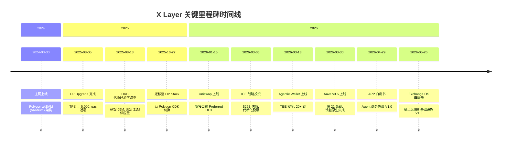
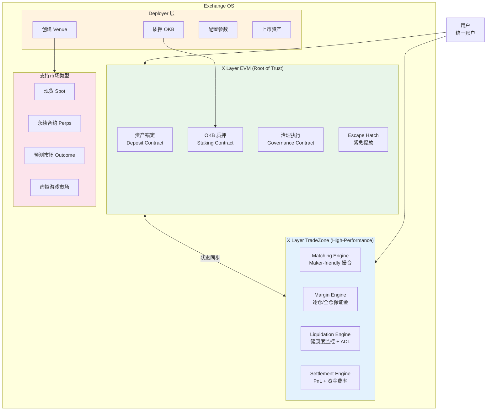
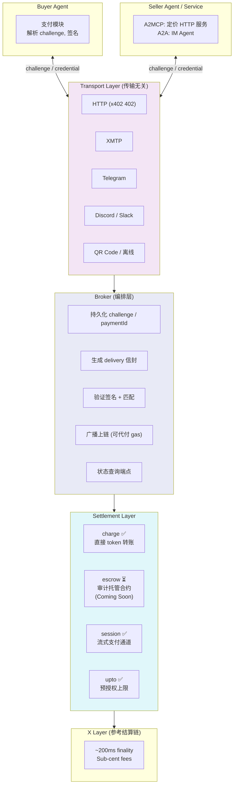

# X Layer 近期开发与叙事分析 — Draft Round 2

## 1. Executive Summary

X Layer 是 OKX 旗下的 Ethereum L2，以 OKB 为原生 gas token，当前定位为 "The New Money Chain"。本轮研究覆盖 X Layer 自 2024 年 3 月主网上线以来的架构演进（Polygon CDK/zkEVM → OP Stack）、`okx` GitHub Organization 近 3 个月活跃仓库扫描、Exchange OS 链上交易所基础设施新叙事、Agent Payments Protocol (APP) 与 Onchain OS 生态、OKX 生态整合策略，以及对 Mantle 的竞争启示。

**核心发现：**

1. **架构迁移已完成但 L2BEAT 分类存在风险标记。** X Layer 于 2025 年 10 月 27 日从 Polygon CDK/zkEVM (Validium) 迁移至 OP Stack，迁移动机包括 Polygon zkEVM Mainnet Beta 日落、OP Stack 生态规模（约 70% 的 Ethereum L2 活动）和 EVM 等效性优势。但 L2BEAT 仍将 X Layer 归类为 "Other"（非标准 Stage 分类），标注 proof system 未完全功能化、恶意 proposer 可终态化无效状态。TVS 仅 $10.23M，日均 UOPS 6.22。

2. **GitHub 活动集中在基础设施 fork、AI/Agent 和支付协议三个方向。** 通过 GitHub REST API 对 `okx` org 14 个活跃仓库的完整分页扫描（详见方法论附录），近 3 个月最活跃仓库为 `onchainos-skills`（1,282 commits / 26 PRs）、`optimism`（522 commits / 40 PRs）、`op-geth`（113 commits / 4 PRs）、`xlayer-reth`（88 commits / 107 PRs）、`op-succinct`（61 commits / 6 PRs）和 `xlayer-toolkit`（47 commits / 51 PRs）。`okx-xlayer` 作为独立 org 不存在，所有开发集中在 `okx` org 下。

3. **Exchange OS 是 X Layer 最重大的叙事升级。** 2026 年 5 月 26 日发布白皮书 V1.0，定位为 builder-first permissionless financial infrastructure。核心设计是双环境架构（X Layer EVM 锚定资产与治理 + X Layer TradeZone 高频撮合执行，300K TPS、毫秒级延迟），通过 OKB 质押的 permissionless 市场部署机制，支持现货、永续合约和预测市场。统一账户、共享流动性和跨市场资本效率为原生特性。

4. **APP 协议将 Agent 支付从"单次转账"升级到"完整商业关系"。** 2026 年 4 月发布白皮书，定义四种支付意图（charge 即时转账、escrow 托管、session 流式支付、upto 预授权计量），通过 Broker 角色进行链下编排 + 链上结算。**当前已上线三种支付类型**（one-time、batch、pay-as-you-go），**escrow 和争议解决标记为 "coming soon"**（协议层和产品层均未部署）。ERC-8183 定义 Agent commerce 的 Job escrow 原语。

5. **OKX 生态整合展现了交易所 L2 的最强分发能力。** Uniswap 2026 年 1 月上线（零接口费）、Aave v3.6 2026 年 3 月上线（X Layer 第 21 条链）、ICE（NYSE 母公司）2026 年 3 月战略投资 OKX 估值 $25B（$200M 投资 + 董事会席位 + 代币化股票合作）、OKB 2025 年 8 月完成 6500 万代币一次性销毁固定供应量至 2100 万。DeFiLlama 数据显示 X Layer DeFi TVL 为 $93.82M，显著高于 L2BEAT TVS 的 $10.23M（两者衡量口径不同）。

6. **对 Mantle 的竞争启示：** X Layer 的威胁不在于单一技术指标，而在于 OKX 全栈生态整合能力（120M+ 用户 → 钱包 → L2 → DeFi → Agent 支付 → 交易所级撮合）。Exchange OS 的"开放市场协议"模式和 APP 的 Agent 商务协议为 Mantle 在 DeFi 生态建设和 AI Agent 赛道提供了差异化参考。

## 2. Item Findings

### item-1: 架构迁移背景 — Polygon CDK/zkEVM 到 OP Stack

#### 完整迁移时间线

| 日期 | 事件 | 技术细节 |
|------|------|----------|
| 2024-03-30 | X Layer 主网上线 | 采用 Polygon zkEVM (Validium) 架构，使用 ZK 有效性证明 |
| 2025-08-05 | PP Upgrade 完成 | 集成最新 Polygon CDK 技术，TPS 提升至 5,000，gas 降至近零 |
| 2025-08-13 | OKB 代币经济学改革 | 一次性销毁 65,256,712 OKB，供应量固定为 21,000,000 |
| 2025-10-27 | 正式迁移至 OP Stack | 从 Polygon CDK/zkEVM 切换到 Optimism OP Stack 框架 |
| 2026-01-15 | Uniswap 上线 X Layer | 零接口费，Preferred DEX 地位（注：Uniswap 博客正文标注上线日期为 2026-01-15；博客元数据时间戳可能显示 2026-01-16，系 UTC 时区转换所致，事件日期以正文为准） |
| 2026-03-05 | ICE 战略投资 OKX | $25B 估值，$200M 投资，代币化股票合作 |
| 2026-03-18 | Agentic Wallet 上线 | TEE 私钥保护，支持 20 条链 |
| 2026-03-30 | Aave v3.6 上线 X Layer | 第 21 条链，OKX Wallet 原生集成 |
| 2026-04-29 | APP 白皮书发布 | Agent Payments Protocol V1.0 |
| 2026-05-26 | Exchange OS 白皮书发布 | 链上交易所基础设施 V1.0 |

**来源**: [X Layer Architecture Migration: From Polygon zkEVM to OP Stack](https://web3.okx.com/learn/x-layer-architecture-migration-from-polygon-zkevm-to-op-stack), [OKX PP Upgrade Announcement](https://www.okx.com/en-us/help/announcement-on-the-pp-upgrade-of-x-layer-and-optimisation-of-the-okb-gas), [Optimism Blog: OKX Migrates XLayer to the OP Stack](https://www.optimism.io/blog/okx-migrates-xlayer-to-the-op-stack), [Uniswap Blog](https://blog.uniswap.org/uniswap-is-now-live-on-x-layer)

#### 迁移动机分析

OKX 从 Polygon CDK 迁移至 OP Stack 的决策受三方面因素驱动：

**1. Polygon 生态方向的不确定性**

2025 年 Polygon 对技术栈进行了重大战略调整，包括宣布 Polygon zkEVM Mainnet Beta 日落。X Layer 作为 Polygon CDK 的早期采用者和核心贡献者，面临上游生态方向不确定性风险。Polygon CDK 的 Agglayer 整合路线虽然提供了跨链互操作能力（通过聚合证明实现 Polygon CDK 链之间的通信），但整体生态发展速度和开发者社区规模不及 OP Stack 生态。

**2. OP Stack 生态规模与工具链优势**

OP Stack 是当前部署最广泛的 Ethereum 扩容框架，支撑约 70% 的 Ethereum L2 活动和约 12% 的每日加密交易。标准工具（Hardhat、Foundry、Ethers.js）在 OP Stack 上无摩擦运行，而 zkEVM 方案在某些边缘案例中仍存在兼容性问题。OP Stack 基于修改版 Geth（op-geth）构建，实现了接近完全的 EVM 等效性，开发者可以直接从 Ethereum L1 迁移合约和工具链而无需修改。

**3. 升级节奏与向后兼容性**

Optimism 维护着频繁的升级计划并具有强大的向后兼容性保证，而 Polygon CDK 在 2025 年的战略调整为其长期方向引入了不确定性。

#### 关键技术变化

| 维度 | 迁移前 (Polygon CDK/zkEVM Validium) | 迁移后 (OP Stack) |
|------|------|------|
| **安全模型** | ZK 有效性证明：Prover 节点在每批 L2 交易后生成零知识证明，提交至 Ethereum L1 验证合约，验证通过后状态转换确认为有效且不可变 | Optimistic 欺诈证明：提交至 L1 的交易默认被假定有效，有一个挑战窗口（通常 7 天），任何人可提交欺诈证明争议无效状态转换 |
| **数据可用性** | Validium 模式将交易数据存储在链下，仅提交 ZK 证明和状态根至 L1，依赖 Data Availability Committee (DAC) 的信任 | OP Stack 标准配置将交易数据以 calldata 或 blobs（利用 EIP-4844）发布至 Ethereum L1，数据可用性由以太坊共识层保障 |
| **EVM 兼容性** | zkEVM 需要在 ZK 证明电路中实现 EVM 操作码，某些操作码（如 `SELFDESTRUCT` 和部分预编译合约）面临兼容性限制 | 基于 op-geth（修改版 Geth），实现接近完全的 EVM 等效性，合约可直接部署无需修改 |
| **跨链互操作** | 连接到 Polygon AggLayer，通过聚合证明实现 Polygon CDK 链间通信 | 独立 L2 运营，维护自主网络治理和运营自主权 |
| **节点软件** | Erigon-based 客户端 | op-geth |
| **确认机制** | ZK 证明验证后即时确认 | 欺诈证明挑战窗口（~7 天）后最终确认 |

**来源**: [X Layer Architecture Migration](https://web3.okx.com/learn/x-layer-architecture-migration-from-polygon-zkevm-to-op-stack)

#### L2BEAT 当前状态

迁移完成后，X Layer 在 L2BEAT 上的分类为 **"Other"**（非标准 Stage 分类），原因是 proof system 未完全功能化。具体风险标记包括：
- 恶意 proposer 可终态化无效状态，导致资金损失风险
- 合约可接收恶意代码升级
- 代码升级无延迟期
- TVS（Total Value Secured）仅 $10.23M
- 日均 UOPS 6.22

值得注意的是，L2BEAT 页面同时显示 "Built on OP Stack" 和 "Part of the Agglayer" 标签，描述为 "powered by the Agglayer CDK"，说明 X Layer 的实际架构可能是 OP Stack 为基础但仍保留了部分 Agglayer 集成。数据可用性标记为 "Ethereum with blobs"。

**来源**: [L2BEAT X Layer](https://l2beat.com/scaling/projects/xlayer)

### item-2: GitHub 活跃 Repo 概况与开发方向分析

#### 数据采集方法论与可复现性

**扫描范围**: `okx` GitHub Organization 下所有在 2026-02-26 之后有推送活动的公开仓库。`okx-xlayer` 作为独立 Organization 不存在（返回 404），所有 X Layer 相关开发集中在 `okx` org 下。

**查询时间（UTC）**: 2026-05-26T07:49:28Z 至 2026-05-26T07:58:19Z

**API 端点与计数规则**:

- **Commits 计数**: `GET https://api.github.com/repos/okx/{repo}/commits?since=2026-02-26T00:00:00Z&per_page=100`
  - 统计默认分支上自指定日期以来的所有 commit（包括 merge commit）
  - 当返回结果恰好 100 条时，判定为截断，通过 `&page=2`, `&page=3` ... 逐页获取直到返回数 < 100
  - 最终计数 = 所有页面返回数之和

- **PRs 计数**: `GET https://api.github.com/repos/okx/{repo}/pulls?state=all&per_page=100&sort=created&direction=desc`
  - 按创建时间降序返回所有状态（open/closed/merged）的 PR
  - 客户端过滤：仅统计 `created_at >= 2026-02-26` 的记录
  - 当页面 1 返回 100 条且全部在时间窗口内时，通过 `&page=2` 继续获取
  - 当页面返回的窗口内 PR 数 < 该页总数时，表明已跨越时间边界，停止分页

**截断处理与精确计数**:

以下仓库在初始查询中触发了 `per_page=100` 截断，均已完成完整分页以获得精确计数：

| 仓库 | 截断端点 | 分页页数 | 精确计数 | Round 1 近似值 | 差异 |
|------|----------|----------|----------|----------------|------|
| `onchainos-skills` | commits | 13 (12×100+82) | 1,282 | "100+" | 实际为 round-1 近似值的 12.8 倍 |
| `optimism` | commits | 6 (5×100+22) | 522 | "100+" | 实际为 round-1 近似值的 5.2 倍 |
| `op-geth` | commits | 2 (100+13) | 113 | "100+" | 差异 13% |
| `xlayer-reth` | PRs | 2 (100+7) | 107 | "100+" | 差异 7% |

以下仓库的 PR 端点虽然总返回数达到 100（截断），但时间窗口内的 PR 数量远小于 100，截断不影响 3 个月窗口内的计数准确性：

| 仓库 | 端点总返回 | 窗口内计数 | 截断影响 |
|------|-----------|-----------|----------|
| `optimism` PRs | 100 | 40 | 无（窗口内 PR 在第 1 页即结束） |
| `xlayer-toolkit` PRs | 100 | 51 | 无 |
| `op-geth` PRs | 100 | 4 | 无 |
| `xlayer-docs` PRs | 100 | 9 | 无 |

#### 活跃仓库总览

按功能方向分类，近 3 个月（2026-02-26 ~ 2026-05-26）活跃仓库如下：

**Tier 1: 基础设施层（OP Stack / 执行客户端）**

| 仓库 | Stars | Commits (3mo) | PRs (3mo) | 语言 | 说明 |
|------|-------|---------------|-----------|------|------|
| `optimism` | 5 | 522 | 40 | Go | Optimism fork，X Layer 核心 OP Stack 实现 |
| `xlayer-reth` | 14 | 88 | 107 | Rust | XLayer 定制 Reth 实现，针对 Optimism-based L2 优化 |
| `op-geth` | 7 | 113 | 4 | Go | OP Stack 修改版 Geth |
| `op-succinct` | 0 | 61 | 6 | Rust | SP1 ZK 证明引擎用于 OP Stack |
| `xlayer-toolkit` | 2 | 47 | 51 | Solidity | X Layer 开发与运维工具集 |
| `reth` | 2 | 4 | 4 | Rust | Reth 上游 fork |

`optimism` 的 522 commits 反映了 OP Stack 迁移后的持续维护和大量上游同步工作（包括 sync upstream v1.17.0、v1.16.13 等版本）以及 Native AA（Account Abstraction）等定制功能开发。`xlayer-reth` 的 107 PRs 表明 OKX 正在积极构建基于 Reth 的替代执行客户端（与 Base 的 `base-reth-node` 策略类似）。`op-geth` 的 113 commits 大部分为上游 fork 同步。`op-succinct` 是 SP1 ZK 证明系统在 OP Stack 上的实现，表明 X Layer 虽已迁移到 Optimistic Rollup，但仍在探索 ZK 证明路径（Succinct 的 Production-Grade Proving Engine）。

**Tier 2: AI / Agent 方向**

| 仓库 | Stars | Commits (3mo) | PRs (3mo) | 语言 | 说明 |
|------|-------|---------------|-----------|------|------|
| `onchainos-skills` | 272 | 1,282 | 26 | Rust | Onchain OS API 集成的 AI Agent Skills（钱包、代币发现、DEX swap、交易广播） |
| `agent-skills` | 118 | 3 | 12 | — | OKX CLI Agent Skills（交易、组合管理、市场数据、Grid/DCA 机器人） |
| `agent-trade-kit` | 312 | 3 | 7 | TypeScript | OKX 交易 MCP Server（现货/swap/期货/期权/Grid 机器人通过 MCP 连接 AI Agent） |
| `dapp-connect-agenticwallet` | 0 | — | — | Shell | Agentic Wallet DApp 连接 |

AI/Agent 方向是 `okx` org 中社区关注度（stars）最高的类别。`onchainos-skills` 以 1,282 commits（13 页分页获取）成为 `okx` org 近 3 个月 commit 活跃度最高的仓库，远超其他仓库，反映了 Onchain OS 核心 SDK 的高密度迭代开发。`agent-trade-kit`（312 stars）是 OKX 交易能力通过 MCP（Model Context Protocol）暴露给 AI Agent 的关键产品，代表了交易所 → AI Agent 的分发通道。

**Tier 3: 支付协议**

| 仓库 | Stars | Commits (3mo) | PRs (3mo) | 语言 | 说明 |
|------|-------|---------------|-----------|------|------|
| `base-contracts` | 0 | 44 | 2 | Solidity | ERC-8183 Agentic Commerce 参考实现 |
| `payments` | 2 | 35 | 10 | Go | 支付服务 |
| `mpp-specs` | 0 | 12 | 1 | Python | Machine Payments Protocol 规范 |

`base-contracts` 的 44 commits 集中在 ERC-8183（Agentic Commerce）的参考实现上，这是一个链上 Job escrow 原语，定义了 Client/Provider/Evaluator 三角色模型和 Open → Funded → Submitted → Completed 状态机，支持可选的 Hook 系统扩展。`mpp-specs` 维护 MPP 规范——APP 协议的 EVM wire format 基础。

**Tier 4: 文档与生态**

| 仓库 | Stars | Commits (3mo) | PRs (3mo) | 语言 | 说明 |
|------|-------|---------------|-----------|------|------|
| `xlayer-docs` | 962 | 12 | 9 | MDX | X Layer L2 文档（最高 stars 仓库） |
| `plugin-store` | 10 | 2 | — | Rust | 插件商店 |
| `wallet-core` | 68 | 2 | — | — | 基于 EIP-7702 的 OKX Wallet Core 实现 |

`xlayer-docs`（962 stars）是 `okx` org 内与 X Layer 直接相关的最高 stars 仓库，9 PRs 反映文档持续更新。`wallet-core` 基于 EIP-7702 实现模块化、安全、gas 优化的智能合约钱包。

**其他高活跃但非 X Layer 核心的仓库**

| 仓库 | Stars | 说明 |
|------|-------|------|
| `go-wallet-sdk` | 572 | 多链 Go 签名 SDK |
| `js-wallet-sdk` | 380 | 多链 TypeScript 签名 SDK |
| `dex-solana-binary` | 14 | Solana DEX 二进制 |

#### 开发方向分类总结

```
开发方向占比（基于 3 个月 commit 总量加权，总计 2,342 commits）:

AI / Agent 生态                  ████████████████████  ~55% (1,288 commits)
基础设施 (OP Stack / 执行客户端)  ██████████████░░░░░░  ~36% (835 commits)
支付协议                         ████░░░░░░░░░░░░░░░░  ~4% (91 commits)
文档与工具                       █░░░░░░░░░░░░░░░░░░░  ~1% (16 commits)
其他                             █░░░░░░░░░░░░░░░░░░░  ~4% (112 commits)
```

> **注**: Round 1 使用 `per_page=100` 截断近似值时，基础设施层因多个仓库被截断为"100+"而看似占比最高（~45%）。经完整分页后，`onchainos-skills` 的 1,282 commits 使 AI/Agent 方向的 commit 总量跃居首位。但 commit 数量不等于工程复杂度——基础设施层（`optimism` 522 + `xlayer-reth` 88 + `op-geth` 113）的单 commit 含代码量通常高于 SDK skills 仓库，且 PR 数量（基础设施 212 vs AI/Agent 45）更能反映结构化工程活动的规模。

**关键观察：**
- `onchainos-skills` commit 活跃度远超其他仓库（1,282 commits），但其 PR 数量（26）显示大量 commit 可能通过直接推送而非 PR 流程合并，暗示快速迭代的 SDK 开发模式
- 基础设施层 PR 数量最多（212 PRs），反映了更严格的代码审查流程和结构化工程实践
- 支付协议方向正在形成 ERC-8183 + MPP + APP 的三层标准体系
- `okx-xlayer` 不存在为独立 org，开发整合在 `okx` org 下，与 OKX 交易所级基础设施共享

#### GitHub API 查询 URL 完整参考

为便于独立复现，以下列出本次扫描使用的所有 GitHub REST API 查询 URL：

| 仓库 | Commits 查询 | PRs 查询 |
|------|-------------|----------|
| `optimism` | `https://api.github.com/repos/okx/optimism/commits?since=2026-02-26T00:00:00Z&per_page=100&page={1..6}` | `https://api.github.com/repos/okx/optimism/pulls?state=all&per_page=100&sort=created&direction=desc` |
| `xlayer-reth` | `https://api.github.com/repos/okx/xlayer-reth/commits?since=2026-02-26T00:00:00Z&per_page=100` | `https://api.github.com/repos/okx/xlayer-reth/pulls?state=all&per_page=100&sort=created&direction=desc&page={1..2}` |
| `onchainos-skills` | `https://api.github.com/repos/okx/onchainos-skills/commits?since=2026-02-26T00:00:00Z&per_page=100&page={1..13}` | `https://api.github.com/repos/okx/onchainos-skills/pulls?state=all&per_page=100&sort=created&direction=desc` |
| `op-succinct` | `https://api.github.com/repos/okx/op-succinct/commits?since=2026-02-26T00:00:00Z&per_page=100` | `https://api.github.com/repos/okx/op-succinct/pulls?state=all&per_page=100&sort=created&direction=desc` |
| `xlayer-toolkit` | `https://api.github.com/repos/okx/xlayer-toolkit/commits?since=2026-02-26T00:00:00Z&per_page=100` | `https://api.github.com/repos/okx/xlayer-toolkit/pulls?state=all&per_page=100&sort=created&direction=desc` |
| `base-contracts` | `https://api.github.com/repos/okx/base-contracts/commits?since=2026-02-26T00:00:00Z&per_page=100` | `https://api.github.com/repos/okx/base-contracts/pulls?state=all&per_page=100&sort=created&direction=desc` |
| `op-geth` | `https://api.github.com/repos/okx/op-geth/commits?since=2026-02-26T00:00:00Z&per_page=100&page={1..2}` | `https://api.github.com/repos/okx/op-geth/pulls?state=all&per_page=100&sort=created&direction=desc` |
| `payments` | `https://api.github.com/repos/okx/payments/commits?since=2026-02-26T00:00:00Z&per_page=100` | `https://api.github.com/repos/okx/payments/pulls?state=all&per_page=100&sort=created&direction=desc` |
| `mpp-specs` | `https://api.github.com/repos/okx/mpp-specs/commits?since=2026-02-26T00:00:00Z&per_page=100` | `https://api.github.com/repos/okx/mpp-specs/pulls?state=all&per_page=100&sort=created&direction=desc` |
| `xlayer-docs` | `https://api.github.com/repos/okx/xlayer-docs/commits?since=2026-02-26T00:00:00Z&per_page=100` | `https://api.github.com/repos/okx/xlayer-docs/pulls?state=all&per_page=100&sort=created&direction=desc` |
| `agent-trade-kit` | `https://api.github.com/repos/okx/agent-trade-kit/commits?since=2026-02-26T00:00:00Z&per_page=100` | `https://api.github.com/repos/okx/agent-trade-kit/pulls?state=all&per_page=100&sort=created&direction=desc` |
| `agent-skills` | `https://api.github.com/repos/okx/agent-skills/commits?since=2026-02-26T00:00:00Z&per_page=100` | `https://api.github.com/repos/okx/agent-skills/pulls?state=all&per_page=100&sort=created&direction=desc` |
| `wallet-core` | `https://api.github.com/repos/okx/wallet-core/commits?since=2026-02-26T00:00:00Z&per_page=100` | — |
| `plugin-store` | `https://api.github.com/repos/okx/plugin-store/commits?since=2026-02-26T00:00:00Z&per_page=100` | — |

### item-3: Exchange OS — 链上交易所基础设施新叙事

#### 背景与定位

Exchange OS 于 2026 年 5 月 26 日发布白皮书 V1.0，定位为 X Layer 的重大升级（a major upgrade to X Layer），是 builder-first permissionless financial infrastructure。通过 X Layer Improvement Proposal (XIP) 流程引入，全称 XIP-Exchange OS。

其核心命题是解决三个矛盾：
1. **市场创建权的中心化**: 市场需求增长速度超过基础设施响应速度，市场创建仍依赖平台审批
2. **用户体验的碎片化**: 用户的统一交易意图被分散到不同市场的独立账户、资金和风控系统中
3. **生态的孤岛化**: 流动性碎片化、订单流锁定在各自界面内、策略难以跨市场组合

**来源**: [Exchange OS Whitepaper V1.0](https://web3.okx.com/whitepaper/okx-exchange-os.pdf), [X Layer Official Site](https://web3.okx.com/xlayer)

#### 双环境架构

Exchange OS 构建在 X Layer 之上，采用双基础设施环境分离设计：

**X Layer EVM — 信任根（Root of Trust）**
- 处理所有与资产安全和治理权相关的链上操作
- 包括：用户资产锚定、Deployer 质押锁定/释放/罚没执行
- 关键属性：完全链上（透明可验证）、资金状态唯一真实来源、无特权操作者

**X Layer TradeZone — 高性能基础设施**
- 专为订单簿市场的低延迟撮合和实时保证金计算而构建
- 性能指标：**毫秒级撮合延迟、300K TPS 吞吐量**
- 用户 gas-free 交易
- 状态可由所有用户公开验证
- 内含四个引擎：
  1. **Matching Engine**: 执行 maker-friendly 的执行顺序保证
  2. **Margin Engine**: 实时保证金计算，支持逐仓和全仓模式
  3. **Liquidation Engine**: 持续监控账户健康度，触发减仓和 ADL（自动去杠杆）
  4. **Settlement Engine**: 交易结算、PnL 更新和资金费率结算

两个环境通过协议原生的状态同步机制保持一致。

```
┌─────────────────────────────────────────────────────┐
│                   Exchange OS                        │
│                                                     │
│  ┌───────────────────┐    ┌───────────────────────┐ │
│  │   X Layer EVM     │    │  X Layer TradeZone    │ │
│  │  (Root of Trust)  │◄──►│  (High-Performance)   │ │
│  │                   │    │                       │ │
│  │ • 资产锚定        │    │ • Matching Engine     │ │
│  │ • OKB 质押管理    │ 状 │ • Margin Engine       │ │
│  │ • 治理执行        │ 态 │ • Liquidation Engine  │ │
│  │ • Escape Hatch    │ 同 │ • Settlement Engine   │ │
│  │                   │ 步 │                       │ │
│  │ 完全链上          │    │ 300K TPS / ms 延迟    │ │
│  │ 无特权操作者      │    │ Gas-free 交易         │ │
│  └───────────────────┘    └───────────────────────┘ │
│                                                     │
│  ┌─────────────────────────────────────────────────┐ │
│  │            Deployer 市场部署层                    │ │
│  │  OKB 质押 → 创建 Venue → 配置参数 → 上市资产    │ │
│  │  支持: 现货 | 永续合约 | 预测市场 | 虚拟游戏市场  │ │
│  └─────────────────────────────────────────────────┘ │
└─────────────────────────────────────────────────────┘
```

#### 设计哲学

白皮书明确提出三条原则：
1. **Assets belong to the users** — 资产属于用户
2. **Markets belong to the deployers** — 市场属于部署者
3. **Infrastructure belongs to everyone** — 基础设施属于所有人

基础设施确保必须保持中立的能力（订单撮合、资产自托管、风险执行、最终结算）由协议层端到端处理。用户资金始终安全，订单撮合始终公平，无论哪个 Deployer 运营市场。

#### Permissionless 市场部署机制

**Venue 创建流程：**
1. Deployer 在 X Layer Staking Contract 中质押 OKB
2. 通过一次质押即可解锁跨现货、永续合约和预测市场的上市能力
3. 每个 Venue 可设置自身的风险偏好和服务范围（风险隔离）
4. Deployer 可选择提供 KYC 机构级服务或完全 permissionless Web3 体验

**Slot 机制：**
- Base Slots: 创建 Venue 时免费分配的基础上市容量
- Slot Auction: 超出 Base Slot 容量的上市需通过拍卖获取
- Deployer 在 Base Slot 容量内对上市资产有完全自主权

**罚没机制：**
- Deployer 的质押作为防止恶意或疏忽行为的经济担保
- 协议可按违规严重程度罚没部分质押
- 最终裁定由治理机制执行

#### 治理模型

Exchange OS 的治理遵循明确边界：治理保护协议，市场运营留给协议和 Deployer。
- Deployer 自主决定：上市资产、数据源、杠杆限制、费用模式（在协议允许的参数范围内）
- 协议强制限制：资金费率变动的严格上下限、数据源偏差阈值、最大杠杆和持仓上限
- 治理仅在需要人类判断时介入：裁决 Deployer 不当行为、授权紧急市场干预

#### 生态系统角色

白皮书定义了六类参与者：
1. **Deployer**: 识别市场需求并将其变为现实，质押 OKB 部署市场
2. **Issuer**: 提供可交易资产，只需发行一次即可被所有 Venue 上市
3. **Interface/Distribution**: 包括钱包、交易终端、AI Agent 平台、社交交易平台、聚合器
4. **Supporter**: 服务提供商（预言机、数据服务、跨链桥、云服务），Permissionless 接入
5. **Market Maker**: 提供流动性，享受 maker-friendly 撮合规则和跨市场资本效率
6. **Governance**: 去中心化治理模型，通过治理合约系统在 X Layer 上运行

#### 与 Mantle 的对比意义

Exchange OS 代表了一种与传统 CEX/DEX 二元叙事不同的第三条路径：**开放市场协议**。它不是一个交易所，而是一个让任何人都能部署交易所的协议。这对 Mantle 的 DeFi 生态建设有直接参考意义：

- Mantle 当前依赖独立 DeFi 协议（如 Agni、Merchant Moe）提供交易能力
- Exchange OS 提供了一种"协议级交易基础设施"思路，将撮合、保证金、清算、结算作为公共层
- 统一账户和共享流动性的设计消除了跨协议资本碎片化问题

### item-4: Agent Payments Protocol 与 Onchain OS 生态

#### Onchain OS 开发者平台

OKX Onchain OS 是 OKX 面向 AI 开发者的链上操作系统平台，处理每日超过 12 亿 API 调用，支持 $300M 全球日交易量，99.9% 正常运行时间，sub-100ms 响应时间。

**四大支柱：**
1. **Agentic Wallet**: AI Agent 专用链上钱包
2. **Payments**: Agent 支付基础设施（x402 + APP）
3. **Trade**: 跨 500+ DEX 的交易能力
4. **AI Toolkit**: 实时市场数据、代币发现、交易广播

**三种接入方式：**
- Skills / CLI: 通过 `okx` CLI 的即插即用技能
- MCP (Model Context Protocol): 通过 MCP server 连接 AI Agent
- Open API: 传统 REST API 接入

**来源**: [OKX Onchain OS](https://web3.okx.com/onchainos), [Onchain OS Dev Docs](https://web3.okx.com/onchainos/dev-docs/payments/overview)

#### Agentic Wallet

2026 年 3 月 18 日正式上线，是 AI Agent 持有资产并自主执行链上交易的专用钱包。

**核心特性：**
- **TEE 安全架构**: 私钥生成、存储和签名全部在 Trusted Execution Environment 内完成，Agent 可请求操作但无法提取密钥
- **多链支持**: 覆盖近 20 条网络（包括 Solana 和多条 EVM 链）
- **X Layer Gas-Free**: 在 X Layer 上执行无 gas 交易和支付
- **自然语言执行**: AI Agent 通过自然语言指令执行链上操作
- **风险评估**: 交易按风险分级，关键交易触发自动阻止
- **安全防护**: 自动身份验证、黑名单地址拦截、风险代币预警、异常检测即时阻止

**来源**: [OKX Agentic Wallet Launch](https://www.okx.com/en-us/learn/agentic-wallet), [OneKey Blog: OKX Agentic Wallet](https://onekey.so/blog/ecosystem/okx-onchain-os-launches-agentic-wallet-convenience-without-giving-up-user-control-20260318173612/)

#### Agent Payments Protocol (APP)

2026 年 4 月 29 日发布白皮书 V1.0，由 OKX OnchainOS 发布。APP 的核心定位公式：

**APP = MPP EVM + 四种意图信封 + Broker 编排 + 跨 IM/HTTP 传输**

**设计理念：从支付到商务**

APP 认为现有 Agent 支付方案（如 x402）解决了"单次转账"问题，但真实商务不是一次 `transferFrom`。APP 将交互单元从单次转账升级为完整商业关系：协商范围与价格、托管资金、计量消费、结算、争议解决、收入分成、结束计费周期。

**三层架构：**

```
┌─────────────────────────────────────────────────┐
│              Agent Payments Protocol              │
│                                                   │
│  ┌─────────────┐  ┌──────────────────────────┐  │
│  │  Buyer Agent │◄─┤     Transport Layer       │  │
│  │  (签名授权)  │  │  HTTP / IM / QR / 离线    │  │
│  └──────┬──────┘  │  XMTP / Telegram / Discord │  │
│         │         │  Slack / Email / SMS        │  │
│         │         └──────────────────────────┘  │
│         ▼                                        │
│  ┌──────────────────────────────────────────┐   │
│  │              Broker (编排层)              │   │
│  │  • 持久化 challenge/paymentId            │   │
│  │  • 生成 delivery 信封 (URL/card/QR/raw)   │   │
│  │  • 验证签名、匹配 challenge              │   │
│  │  • 广播上链（可代付 gas）                 │   │
│  │  • 状态查询端点                           │   │
│  └──────────────┬───────────────────────────┘   │
│                 ▼                                 │
│  ┌──────────────────────────────────────────┐   │
│  │         Settlement Layer (结算层)         │   │
│  │  X Layer (参考链, ~200ms finality)        │   │
│  │  • charge: 直接 token 转账     [已上线]   │   │
│  │  • escrow: 审计托管合约        [Coming Soon] │
│  │  • session: 流式支付通道       [已上线]   │   │
│  │  • upto: 预授权上限扣款        [已上线]   │   │
│  └──────────────────────────────────────────┘   │
└─────────────────────────────────────────────────┘
```

**四种支付意图与部署状态：**

| 意图 | 使用场景 | 结算时机 | 争议支持 | 签名时金额已知 | 部署状态 |
|------|----------|----------|----------|----------------|----------|
| **charge** (one-time) | 一次性转账（小费、固定价商品、单次 API 调用） | 即时 | — | 是 | **已上线** |
| **batch** | 高频微额支付（IoT、Agent-to-Agent 微交易） | 批量结算 | — | 是 | **已上线** |
| **session** (pay-as-you-go) | 流式计量（LLM 按 token 计费、API 按调用计费） | 通道关闭时 | — | 否（单价已知） | **已上线** |
| **upto** | 有上限的预授权（"最多 5000 token"） | Seller 使用报告后 | — | 否（上限已知） | **已上线** |
| **escrow** | 带交付验收的任务（自由职业、设计、代码） | 接受/争议解决后 | 是（可配置仲裁者） | 是 | **Coming Soon** |

> **协议层 vs 产品层 escrow 的区分**: APP 白皮书 V1.0 在协议层（Protocol Layer）将 escrow 定义为五种结算模式之一，指定了托管资金、交付验收、争议解决的完整语义。然而，在产品层（Implementation Layer / Payment SDK），escrow 明确标记为 "coming soon"，意味着 escrow 合约尚未部署到 X Layer 主网，开发者当前无法通过 SDK 调用 escrow 功能。同样，与 escrow 配套的争议解决（dispute resolution）机制也标记为 "coming soon"。因此，APP 协议的 escrow 能力目前是**规范已定义、实现未上线**的状态。
>
> **来源**: [OKX APP Learn Article](https://www.okx.com/en-us/learn/agent-payments-protocol) — 三处明确标注 "escrow, dispute resolution coming soon"

**两种部署形态：**
- **A2MCP (Agent-to-MCP)**: Buyer Agent 消费定价 HTTP 服务（通常通过 MCP tool 调用），challenge 通过 HTTP 返回（x402 风格的 402 响应）
- **A2A (Agent-to-Agent)**: Seller 是另一个通过 IM 网络可达的 Agent，challenge 通过 IM 消息传递（URL/card/QR），无需 HTTPS endpoint 或 webhook

**与 x402 和 MPP 的关系：**

APP 明确声明不是 x402 或 MPP 的竞争者，而是三者的组合产品化：
- **MPP**: APP 直接消费 MPP EVM 的 challenge/credential 信封，集成 MPP EVM 就是集成 APP charge
- **x402**: APP 与 x402 在 HTTP 请求层结构对齐（charge 可发出 x402 风格的 402），在 x402 适用的场景中 APP 退让，在对话离开 HTTP 或超出单次往返时 APP 扩展相同词汇表
- **定位**: x402 范围是单次 HTTP 402 往返，MPP 范围是 EVM 支付方法 wire format，APP 在相同基础上增加 escrow（规范已定义，实现 coming soon）、争议解决和非 HTTP 传输

**来源**: [APP Whitepaper V1.0](https://web3.okx.com/whitepaper/okx-app-whitepaper.pdf), [OKX APP Learn Article](https://www.okx.com/en-us/learn/agent-payments-protocol), [CryptoBriefing: OKX APP](https://cryptobriefing.com/okx-ai-agent-payments-protocol-launched/), [The Block: OKX APP](https://www.theblock.co/post/399490/okx-agent-payments-protocol-ai-business-cycles-quotes-disputes-transactions)

#### ERC-8183: Agentic Commerce

OKX 在 `okx/base-contracts` 仓库中维护 ERC-8183 的参考实现（44 commits，近 3 个月），定义了一个最小化的链上 Job escrow 原语：

**三角色模型：**
- **Client**: 创建并资助 Job
- **Provider**: 交付工作
- **Evaluator**: 证明完成或拒绝

**状态机：**
```
Open → Funded → Submitted → Completed | Rejected | Expired
```

每个状态转换强制执行基于角色的访问控制，资金在 Evaluator 完成验证或 Job 被拒绝/过期前保持在 escrow 中。

支持可选的 Hook 系统（`IERC8183Hook`），在不修改核心合约的情况下扩展行为：`beforeAction`（状态变更前调用，可 revert 阻止转换）和 `afterAction`（状态变更后调用，用于记账和副作用）。

> **注**: ERC-8183 的链上 escrow 是独立于 APP 协议层 escrow 的实现。ERC-8183 是一个通用的 Job escrow 标准，APP 的 escrow 意图可以选择使用 ERC-8183 合约作为结算后端，但两者的部署状态独立——ERC-8183 参考实现已在 `okx/base-contracts` 仓库中开发（44 commits），而 APP SDK 的 escrow 集成尚未上线。

**来源**: [okx/base-contracts GitHub](https://github.com/okx/base-contracts)

### item-5: OKX 生态整合与分发策略

#### DeFi 蓝筹协议部署

**Uniswap（2026 年 1 月 15 日上线）**
- Uniswap 全面部署在 X Layer 上，涵盖 Protocol、Web App、Wallet 和 Trading API
- **零 Uniswap Labs 接口费**，适用于所有 X Layer 上的 swap
- 交易成本低至 $0.01，支持 xBTC、USDT、USDG 等市场
- 获得 X Layer "Preferred DEX" 地位
- 计划在 X Layer 上部署 EIP-7702 delegation contracts

> **日期说明**: Uniswap 官方博客正文标注上线日期为 2026 年 1 月 15 日。Research Review Agent 指出博客发布元数据时间戳可能显示 2026-01-16，该差异最可能由 UTC 时区转换导致（美国时间 1 月 15 日发布 → UTC 时间可能跨入 1 月 16 日）。本研究以博客正文标注的**事件日期 2026-01-15** 为准。

- 来源：[Uniswap Blog](https://blog.uniswap.org/uniswap-is-now-live-on-x-layer)

**Aave v3.6（2026 年 3 月 30 日上线）**
- Aave 在 X Layer 上线，X Layer 成为 Aave 运营的第 21 条链
- 同日 Aave V4 发布，引入 hub-and-spoke 架构
- OKX Wallet 原生集成 Aave——用户可直接在钱包内存取、管理仓位、swap aTokens，无需打开独立界面
- 上线后 X Layer 交易量上升约 20%
- 来源：[CryptoNews: OKX Wallet Adds Aave](https://cryptonews.net/news/defi/32693688/), [CoinCentral: Aave on X Layer](https://coincentral.com/aave-launches-on-okxs-x-layer-bringing-defi-lending-to-ethereum-l2/)

#### ICE（NYSE 母公司）战略投资

2026 年 3 月 5 日，Intercontinental Exchange (ICE) 投资 OKX，估值 $25B：
- **投资规模**: 约 $200M，获得 OKX 董事会席位
- **代币化股票合作**: OKX 用户将可交易 NYSE 上市的代币化股票和衍生品（预计 2026 下半年上线）
- **数据授权**: ICE 将授权 OKX 的现货加密货币价格数据，支持推出美国合规加密期货产品
- **市场准入**: OKX 的约 120M 用户将可访问 ICE 的美国期货市场
- **战略意义**: 不仅是资本注入，更是 OKX 与传统金融基础设施的深度整合——市场设计、清算机制、风险监控、数据服务和机构入口
- OKB 在消息公布后一小时内最高上涨 58%
- 来源：[Fortune: ICE Invests in OKX](https://fortune.com/2026/03/05/okx-ice-intercontinental-exchange-investment-tokenized-securities-25-billio/), [The Block: ICE-OKX Deal](https://www.theblock.co/post/392397/nyse-parent-ice-invests-in-crypto-exchange-okx-at-25-billion-valuation-amid-tokenized-stocks-push-fortune), [CoinDesk: ICE-OKX Partnership](https://www.coindesk.com/business/2026/03/05/nyse-owner-ice-forges-strategic-partnership-with-crypto-exchange-okx)

#### OKB 代币经济学

2025 年 8 月 13 日完成的代币经济学改革标志着 OKB 从交易所实用代币向链级资产的转型：

- **一次性销毁**: 销毁约 65,256,712 OKB（价值约 $7.6B），占原总供应量的 50%+
- **固定供应量**: 21,000,000 OKB，智能合约升级永久移除铸造和销毁功能
- **不可变性**: 未来无回购、铸造或销毁，供应量由智能合约强制执行
- **多角色设计**: X Layer 原生 gas token + OKX 交易所手续费折扣 + OKX Jumpstart 参与权 + OKX Wallet/OKX Pay 跨链支付 + Exchange OS 质押部署
- **OKTChain 淘汰**: OKX 退役了 Ethereum L1 版 OKB 和原始 OKTChain/OKT 代币，所有流动性整合到 X Layer
- **去中心化验证**: 整个销毁过程链上记录可公开审查，审计报告包含区块级详情，无钱包持有超过 7% 供应量
- 来源：[OKX PP Upgrade Announcement](https://www.okx.com/en-us/help/announcement-on-the-pp-upgrade-of-x-layer-and-optimisation-of-the-okb-gas), [CryptoBriefing: OKB Tokenomics Upgrade](https://cryptobriefing.com/okb-tokenomics-upgrade-token-burn/), [KuCoin: OKX Burns $7.6B OKB](https://www.kucoin.com/news/articles/okx-burns-7-6b-worth-of-okb-slashing-supply-to-21m-as-x-layer-takes-center-stage)

#### 生态合作伙伴

X Layer 生态覆盖多个领域：
- **分析/数据**: Nansen, Chainalysis, Glassnode, Allium
- **DeFi/借贷**: Maple, Centrifuge, Aave
- **做市/交易**: GSR, Flowdesk, Kronos, Amber
- **预言机**: Pyth, Chainlink/CCIP, API3, Band Protocol
- **基础设施**: Alibaba Cloud, OP, Ankr, BlockPI, Blockdaemon, Blockaid
- **DEX**: Uniswap (Preferred DEX)
- **跨链**: Stargate
- 来源：[X Layer Ecosystem](https://web3.okx.com/xlayer)

#### 网络指标

| 指标 | 值 | 来源 |
|------|------|------|
| 平均交易成本 | ~$0.0005 | X Layer 官网 |
| 出块时间 | 1 秒 | X Layer 官网 |
| 平均 TPS | 5,000 | X Layer 官网 |
| 总地址数 | 4,000,000+ | X Layer 官网 |
| TVS (L2BEAT) | $10.23M | L2BEAT |
| DeFi TVL (DeFiLlama) | $93.82M | DeFiLlama API |
| 日均 UOPS | 6.22 | L2BEAT |

#### X Layer TVL 分析

X Layer 的 TVL 数据呈现出显著的口径差异：
- **L2BEAT TVS**（Total Value Secured）：$10.23M — 衡量通过桥接合约锁定的资产和原生铸造资产总和
- **DeFiLlama TVL**：$93.82M — 衡量 DeFi 协议中的锁仓价值总和（来源：[DeFiLlama API](https://api.llama.fi/v2/chains)，查询时间 2026-05-26）
- CoinGecko 排名 X Layer 为第 32 大区块链（按 TVL）
- 根据报道，Aave 上线前 X Layer TVL 约为 $25M，Aave 部署带动了约 20% 的交易量增长

**口径差异解读**: L2BEAT TVS 较低（$10.23M）是因为它仅衡量桥接到 X Layer 的资产，而 DeFiLlama 的 $93.82M 包含了 OKX 交易所直接向 X Layer 注入的流动性（如通过 OKX Wallet 零费用提款）。这一差异恰恰体现了交易所 L2 的独特优势——大量资产通过交易所内部通道进入 L2 生态，而非通过传统桥接路径。

### item-6: 对 Mantle 的竞争启示

#### 战略路径对比

| 维度 | X Layer (OKX) | Mantle (Bybit) |
|------|---------------|----------------|
| **交易所背景** | OKX，120M+ 用户，$25B 估值 | Bybit |
| **技术栈** | OP Stack（2025.10 从 Polygon CDK 迁移） | OP Stack（Mantle Network） |
| **原生代币角色** | OKB：gas + 交易费折扣 + Jumpstart + 支付 + Exchange OS 质押 | MNT：gas + 治理 + 质押 |
| **代币经济学** | 固定 21M 供应量，智能合约不可变 | 可变供应模型 |
| **DeFi 策略** | 蓝筹优先（Uniswap + Aave）+ Exchange OS 协议级交易 | 原生生态培育（Agni, Merchant Moe 等） |
| **AI/Agent 布局** | Onchain OS + APP 协议 + Agentic Wallet + ERC-8183 | 探索阶段 |
| **传统金融整合** | ICE 投资 + 代币化 NYSE 股票 + 合规期货 | — |
| **生态导流** | OKX 全栈整合（交易所 → 钱包 → L2 → DeFi → Agent） | 独立生态建设 |
| **L2BEAT 状态** | "Other"（proof system 未完全功能化） | Stage 0/1（取决于时间点） |

#### 关键竞争启示

**1. Exchange OS "开放市场协议" 模式**

X Layer 的 Exchange OS 代表了从"L2 上部署 DeFi 应用"到"L2 本身就是交易基础设施"的范式转移。对 Mantle 的参考：
- Mantle 是否需要在协议层提供交易基础设施（撮合、保证金、清算），还是继续依赖独立 DeFi 协议？
- 统一账户和共享流动性的设计可以消除跨协议资本碎片化——Mantle 生态中用户在 Agni、Merchant Moe 等协议之间的资金效率问题是否有类似解法？
- Exchange OS 的 OKB 质押 Deployer 模式是否启发 MNT 在生态中承担更多结构性角色？

**2. AI Agent 基础设施的先发布局**

OKX 在 AI Agent 赛道构建了完整的产品矩阵：
- Agentic Wallet（2026.03）→ APP 协议（2026.04）→ ERC-8183 标准 → Onchain OS 平台
- 相比之下，Base 的 x402 + Base Account SDK + Skills 构成了 Coinbase 生态的 Agent 方案

Mantle 在 Agent 基础设施方面的空白：
- 没有专用的 Agent Wallet
- 没有 Agent 支付协议
- 没有 MCP/Skills 开发者平台

这是短期内可弥补的 gap，但需要尽早确定策略方向：是自建、集成第三方（如 APP 本身是 open protocol），还是差异化竞争（如 Mantle 在 Agent 商务的特定垂直场景上深耕）。

**3. 交易所生态整合 vs 独立生态**

OKX 的策略是将交易所的全部能力（120M 用户、做市商网络、合规牌照、钱包、支付）作为 X Layer 的分发引擎：
- OKX Wallet 原生集成 Aave，用户在钱包内即可完成 DeFi 操作
- Uniswap 零费用 Preferred DEX 地位
- ICE 合作引入代币化传统金融资产

Mantle 的独立生态策略有其优势（更去中心化、更开放），但在以下方面面临劣势：
- 用户获取和留存依赖外部营销而非内部导流
- DeFi 协议部署缺乏"Preferred DEX"级别的深度合作
- 传统金融资产接入渠道有限

**4. 代币经济学对比**

OKB 的"一次性销毁 + 固定供应 + 多角色绑定"模式为 MNT 提供了参考：
- OKB 作为 gas token + 交易费折扣 + Exchange OS 质押的多角色设计，将代币效用深度绑定到 L2 生态
- 21M 固定供应量 + 合约级不可变性制造了强烈的稀缺性叙事
- MNT 可评估是否在 gas 和治理之外增加更多结构性角色（如协议部署质押、DeFi 激励权重等）

**5. 差异化机会**

Mantle 相对 X Layer 的潜在差异化方向：
- **更高的 L2BEAT 安全等级**: X Layer 仍是 "Other"，Mantle 可通过推进 Stage 1/2 建立信任优势
- **独立性**: Mantle 不依赖单一交易所的分发，在去中心化叙事上更有可信度
- **Enterprise 方向**: X Layer 聚焦于交易和 Agent 支付，Mantle 的 Enterprise blockchain 策略（如果落地）可以开辟不同赛道
- **数据可用性创新**: Mantle 的 DA 方案可以作为差异化技术点

**6. 潜在威胁**

- X Layer 的 Exchange OS + APP + ICE 合作形成了从 Agent 支付到传统金融资产交易的完整商业闭环
- OKX 120M 用户基础通过钱包和交易所直接导入 X Layer 生态
- OKB 代币经济学改革后的稀缺性叙事和价格表现（销毁后涨幅 170%）可能吸引投资者注意力
- 如果 Exchange OS Q3 如期上线（路线图显示 Q3 Open market deployment），将为 X Layer 带来独特的协议级交易量

## 3. Diagrams

### diag-1: X Layer 关键里程碑时间线



### diag-2: Exchange OS 双环境架构图



### diag-3: Agent Payments Protocol 三层架构图



### diag-4: X Layer vs Mantle 竞争维度对比矩阵

```
╔══════════════════════════╤═══════════════════════╤═══════════════════════╗
║ 维度                     │ X Layer (OKX)         │ Mantle (Bybit)        ║
╠══════════════════════════╪═══════════════════════╪═══════════════════════╣
║ 技术栈                   │ OP Stack              │ OP Stack              ║
║                          │ (2025.10 从 CDK 迁移) │ (原生)                ║
╟──────────────────────────┼───────────────────────┼───────────────────────╢
║ L2BEAT 分类              │ Other                 │ Stage 0/1             ║
║                          │ (proof 未功能化)       │                       ║
╟──────────────────────────┼───────────────────────┼───────────────────────╢
║ TVS/TVL                  │ TVS $10.23M           │ 较高                  ║
║                          │ DeFi TVL $93.82M      │                       ║
╟──────────────────────────┼───────────────────────┼───────────────────────╢
║ 代币经济学               │ OKB: 固定 21M 供应量  │ MNT: 可变供应模型     ║
║                          │ gas + 质押 + 折扣     │ gas + 治理 + 质押     ║
║                          │ + Exchange OS 部署    │                       ║
╟──────────────────────────┼───────────────────────┼───────────────────────╢
║ DeFi 生态                │ 蓝筹优先              │ 原生生态培育          ║
║                          │ (Uniswap+Aave)        │ (Agni, Merchant Moe)  ║
║                          │ + Exchange OS 协议级  │                       ║
╟──────────────────────────┼───────────────────────┼───────────────────────╢
║ AI/Agent 基础设施        │ ★★★★★                 │ ★☆☆☆☆                ║
║                          │ 全栈: Wallet+APP+     │ 探索阶段              ║
║                          │ ERC-8183+OnchainOS    │                       ║
║                          │ (escrow coming soon)  │                       ║
╟──────────────────────────┼───────────────────────┼───────────────────────╢
║ 交易所整合度             │ ★★★★★                 │ ★★★☆☆                ║
║                          │ 全栈: 120M 用户→      │ 有整合但不如 OKX      ║
║                          │ 钱包→L2→DeFi→Agent   │ 全面                  ║
╟──────────────────────────┼───────────────────────┼───────────────────────╢
║ 传统金融整合             │ ICE 投资 + 代币化     │ 有限                  ║
║                          │ NYSE 股票             │                       ║
╟──────────────────────────┼───────────────────────┼───────────────────────╢
║ 差异化优势               │ 交易所级撮合          │ L2BEAT 安全等级       ║
║                          │ Agent 支付生态        │ 独立性 / 去中心化     ║
║                          │ 传统金融桥接          │ Enterprise 方向       ║
╚══════════════════════════╧═══════════════════════╧═══════════════════════╝
```

## 4. Source Coverage

| 来源要求 ID | 类型 | 描述 | 最低数量 | 实际覆盖 | 状态 |
|-------------|------|------|----------|----------|------|
| src-1 | official_docs | X Layer 官方文档、Exchange OS 白皮书、APP 白皮书、架构迁移公告 | 4 | 6 (X Layer 官网, Exchange OS WP, APP WP, 架构迁移文章, PP Upgrade 公告, Agentic Wallet 公告) | ✅ 满足 |
| src-2 | code_analysis | okx GitHub Organization 活跃 repo 的 PR/commit 数据扫描 | 6 | 14 repos scanned with full pagination (optimism, xlayer-reth, onchainos-skills, op-succinct, xlayer-toolkit, base-contracts, op-geth, payments, mpp-specs, xlayer-docs, agent-trade-kit, agent-skills, wallet-core, plugin-store) | ✅ 满足（含完整 API URL 和分页文档） |
| src-3 | official_docs | OKX/Optimism/Aave/Uniswap 官方公告 | 3 | 4 (Optimism Blog: OKX Migrates, Uniswap Blog, Aave/OKX Launch Coverage, ICE Press Release) | ✅ 满足 |
| src-4 | industry_reports | 第三方行业媒体报道与分析 | 3 | 8+ (CryptoBriefing, The Block, Fortune, CoinDesk, CoinTelegraph, BingX, CoinCentral, Cryptonomist) | ✅ 满足 |
| src-5 | on_chain_data | X Layer 网络数据（TVL、TPS、地址数）— L2BEAT、DeFiLlama | 2 | 3 (L2BEAT TVS $10.23M/UOPS, X Layer 官网 TPS/地址数/交易成本, DeFiLlama API TVL $93.82M) | ✅ 满足（DeFiLlama 现已内联引用） |

## 5. Gap Analysis

| Gap ID | 描述 | 严重程度 | 可能的弥补方式 |
|--------|------|----------|----------------|
| gap-1 | X Layer 在 L2BEAT 同时标记为 "Built on OP Stack" 和 "Part of the Agglayer"，实际架构组合不完全清晰 | Minor | 需要检查 X Layer 代码仓库确认 Agglayer 组件是否仍在使用 |
| gap-2 | Exchange OS 白皮书为 V1.0 愿景文档，合约接口、精确风控参数和参考实现不在范围内 | Minor | 等待 Exchange OS Protocol Specification 发布 |
| gap-3 | APP 白皮书同为 V1.0，wire-format schemas 和安全分析维护在独立 spec 中 | Minor | 等待 APP Specification 发布 |
| gap-4 | 私有仓库不可见，OKX 可能有大量未公开的 X Layer 工程活动 | Medium | 无法弥补，需在结论中注明 |
| gap-5 | Exchange OS 和 APP 均为近期发布（2026.04-05），尚未有主网上线后的实际运行数据 | Medium | Q3 Exchange OS 上线后可获取实际数据 |
| gap-6 | Mantle 侧数据未在本研究中深入收集，对比维度中 Mantle 信息较薄 | Minor | 参考同项目其他研究 section 补充 |

## 6. Revision Log

| Round | Action | Scope | Notes |
|-------|--------|-------|-------|
| 1 | initial_draft | full | 首轮 deep draft，覆盖全部 6 个 outline items，基于 web research + GitHub API scan + 白皮书原文分析 |
| 2 | revision | targeted | 针对 Research Review Agent needs-attention 反馈（1 MAJOR + 4 MINOR）的定向修订：(1) [MAJOR] 添加完整 GitHub API 可复现性附录——14 个仓库的精确 API URL、分页页数、截断处理方式和计数规则，所有截断结果集均已完成完整分页获取精确计数（onchainos-skills 1,282 vs round-1 "100+"、optimism 522 vs "100+"、xlayer-reth PRs 107 vs "100+"、op-geth 113 vs "100+"）；(2) [MINOR] 替换已失效的 OKB Burn 来源链接（okx.com/learn/why-did-okb-burn → 404）为有效的 OKX 官方公告和 CryptoBriefing 报道；(3) [MINOR] 添加 DeFiLlama TVL $93.82M 内联引用，消除 round-1 gap-2；(4) [MINOR] 添加 Uniswap 上线日期说明（事件日期 2026-01-15 vs 博客元数据可能显示 2026-01-16 的 UTC 时区差异）；(5) [MINOR] 在 APP section 明确区分协议层 escrow（白皮书已定义语义）与产品层 escrow（Payment SDK "coming soon"，合约未部署），标注当前已上线的三种支付类型和两种 coming soon 功能 |
