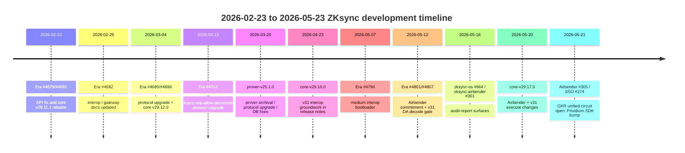
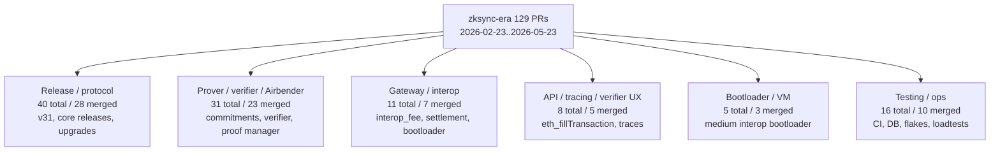
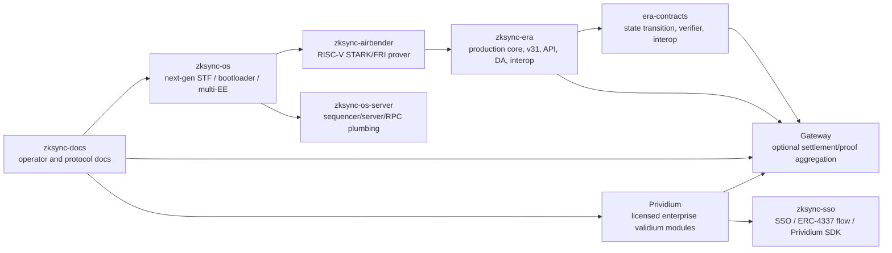
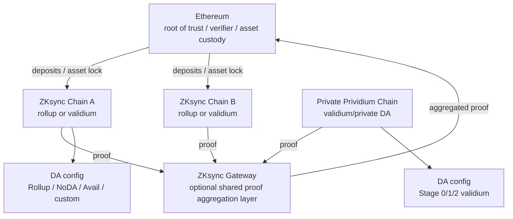
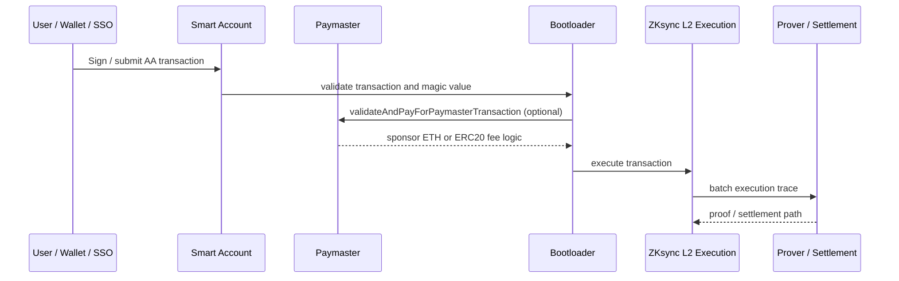
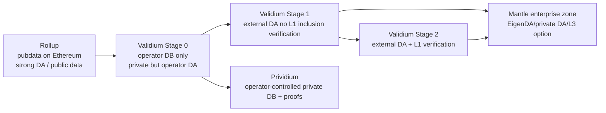
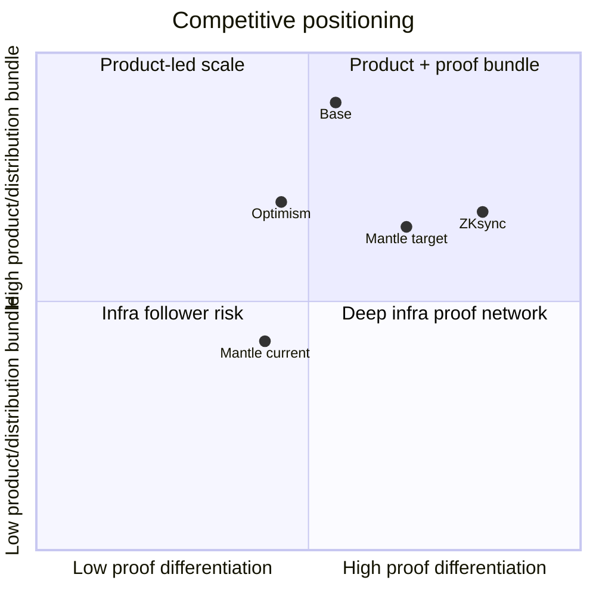

# zkSync 近期开发与叙事分析 - Final

## 1. Executive Summary

ZKsync 近三个月的事实底座可以分成两层：`matter-labs/zksync-era` 主仓仍在密集维护生产链、v31 升级、release、Gateway/interop 兼容、DA commitment、Airbender 接入和 API/verifier/prover 正确性；但下一代战略叙事的高强度研发已经明显外溢到 `zksync-os`、`zksync-airbender`、`zksync-os-server`、`era-contracts`、`zksync-sso`、`local-prividium` 和 `zksync-docs`。因此本文严格把 Era 主仓统计与 supporting repo 信号分开，不把跨仓库 PR 数加总为 Era core 活跃度。

在 2026-02-23 至 2026-05-23 的精确窗口内，GitHub Search API 对 `matter-labs/zksync-era` 返回 **129 个 created PR**，其中 **88 merged、20 open、21 closed-unmerged**，`incomplete_results=false`。`gh pr list` 同窗口拉取到 129 个 PR 元数据，周粒度趋势显示 3 月中旬、3 月末、4 月下旬是高峰；作者集中在 `zkzoomer`、`zksync-era-bot`、`Deniallugo` 等。按标题、labels、files changed 和 release notes 交叉分类，主仓近期最强信号是：release/protocol upgrade 约 40 个，prover/verifier/Airbender 约 31 个，Gateway/interop 约 11 个，API/tracing/verifier UX 约 8 个，bootloader/VM 约 5 个，testing/ops 约 16 个。这个分类是人工代表性 taxonomy，不是官方 label taxonomy，也不是穷尽/互斥的精确分账；PR baseline 仍以 129 total / 88 merged / 20 open / 21 closed-unmerged 为准。

工程结论不是 "Era 停止创新"，而是 "Era 变成生产升级和迁移承接面，下一代 proving/execution/enterprise/interop 在多仓并行推进"。Era release `core-v29.16.0` 明确包含 v31 interop groundwork；`core-v29.17.0` 明确包含 Airbender commitment variant、v31 execute changes、proof manager contract CI 和 verifier logging/hash 输出等。与此同时，`zksync-os` 窗口内至少拉取到最近 100 个 PR 样本，其中 51 merged、27 open、22 closed，最新 PR 集中在 bootloader zk tx flow、pubdata compression、storage write path、audit reports；`zksync-airbender` 窗口样本 94 个 PR，73 merged、9 open、12 closed，最新高信号包括 GKR unified circuit、V2 circuit tests、Veridise report、RISC-V verifier field perf。Supporting repos 是战略迁移信号，但不是 Era 主仓活跃度统计。

叙事上，ZKsync 正从 "zkEVM / ZK Rollup 技术领先" 转向 "ZK Stack + Elastic Chain/Gateway + ZKsync OS/Airbender + native AA + enterprise Prividium" 的组合叙事。成熟度必须分层：ZKsync Era 是生产网络；Gateway 是官方文档定义的 optional shared proof aggregation / settlement middleware，已有 whitelisting / migration / DA docs 和相关代码路径，但仍应对每条链标注接入状态；ZKsync OS Developer Preview 是 testnet / early-access 环境，官方 >15K TPS、250-500ms inclusion、Airbender 约 $0.0001/ERC20 transfer 和 ~1s block proof 等是官方 claim，本文不视为独立 benchmark；Prividium 是 licensed enterprise module + Validium/private DA product，公开 docs 给出架构和功能，production 客户/性能仍需逐项验证。

对 Mantle 的关键启示：短期不应把 ZKsync 的每个 performance phrase 当成已落地主网事实，但必须正视其组合叙事正在压缩 Mantle 的表达空间。ZKsync 用 validity proof + Gateway + native AA + Prividium 把 "正确性、互操作、账户体验、企业隐私" 打包成一条路线；Optimism 用 Superchain interop / op-reth / standardization 打包另一条路线；Base 用 Base Stack / Flashblocks / Beryl / Coinbase distribution 打包产品性能路线。Mantle 需要用 EigenDA、MNT economics、OP/EVM compatibility、SP1/OP Succinct validity path、enterprise L3/private DA zones 和更清晰的开发者 UX 形成反差，而不是只说 "OP Stack fork + low fees"。

## 2. Item Findings

### item-1: GitHub 数据基线、仓库边界与统计方法

**Evidence window**: 2026-02-23..2026-05-23。主要查询在 2026-05-23T04:14:27Z 前后完成。核心仓库为 `matter-labs/zksync-era`；supporting repos 只作为 ZKsync OS / Airbender / Gateway / Prividium / SSO / docs / contracts 信号，绝不与 Era 主仓 PR 数相加。

**Era 主仓 PR baseline**

| Query | Result | Evidence grade |
|---|---:|---|
| `repo:matter-labs/zksync-era is:pr created:2026-02-23..2026-05-23` | 129 total, incomplete_results=false | github_pr_api |
| same + `is:merged` | 88 | github_pr_api |
| same + `is:open` | 20 | github_pr_api |
| same + `is:closed -is:merged` | 21 | github_pr_api |
| `gh pr list --repo matter-labs/zksync-era --state all --search 'created:2026-02-23..2026-05-23' --limit 200` | 129 PR metadata returned | github_pr_api |

**周粒度趋势（按 createdAt ISO week）**

| Week | Total | Merged | Open | Closed-unmerged | Drafts |
|---|---:|---:|---:|---:|---:|
| 2026-W09 | 11 | 7 | 1 | 3 | 2 |
| 2026-W10 | 10 | 6 | 0 | 4 | 0 |
| 2026-W11 | 17 | 14 | 0 | 3 | 1 |
| 2026-W12 | 14 | 11 | 2 | 1 | 0 |
| 2026-W13 | 16 | 14 | 1 | 1 | 0 |
| 2026-W14 | 9 | 7 | 1 | 1 | 1 |
| 2026-W15 | 13 | 5 | 5 | 3 | 2 |
| 2026-W16 | 5 | 3 | 1 | 1 | 0 |
| 2026-W17 | 16 | 10 | 2 | 4 | 1 |
| 2026-W18 | 2 | 2 | 0 | 0 | 0 |
| 2026-W19 | 2 | 2 | 0 | 0 | 0 |
| 2026-W20 | 7 | 6 | 1 | 0 | 0 |
| 2026-W21 | 7 | 1 | 6 | 0 | 0 |

**作者集中度（Era 主仓）**

| Author | Count | Merged | Open | Closed |
|---|---:|---:|---:|---:|
| `zkzoomer` | 37 | 28 | 3 | 6 |
| `zksync-era-bot` | 21 | 16 | 2 | 3 |
| `Deniallugo` | 14 | 9 | 3 | 2 |
| `hatemosphere` | 7 | 7 | 0 | 0 |
| `StanislavBreadless` | 5 | 4 | 1 | 0 |
| `coffeexcoin` | 5 | 5 | 0 | 0 |
| `deniallugo-claude` | 5 | 2 | 2 | 1 |
| `tomg10` | 5 | 4 | 0 | 1 |

**清洗规则**

- Release PR、protocol-upgrade bot PR 单独保留，因为 ZKsync 的生产升级路径高度自动化；但在功能分类中不重复计算其背后的 feature PR。
- `external-contribution` PR 不自动降权；例如 `eth_fillTransaction`、contract verifier 修复和 v29->v31 upgrade path 都有外部贡献标签但涉及真实代码面。
- open PR 只支持 `open-pr` 或 `experimental` 结论，不写成 merged / production。
- `zksync-os` / Airbender / Prividium / SSO / docs PR 是 cross-repo signal，不纳入 Era core totals。

**Supporting repo quick baseline（同窗口，独立统计）**

| Repo | Returned sample | Merged | Open | Closed | Role |
|---|---:|---:|---:|---:|---|
| `matter-labs/zksync-os` | 100 returned sample | 51 | 27 | 22 | ZKsync OS STF / bootloader / pubdata / audits |
| `matter-labs/zksync-airbender` | 94 | 73 | 9 | 12 | RISC-V proof system / GKR / verifier / tests |
| `matter-labs/era-contracts` | 100 returned sample | 63 | 18 | 19 | v31 contracts / interop / verifier keys / audits |
| `matter-labs/zksync-docs` | 16 | 10 | 5 | 1 | ZKsync OS quickstart, v31 interop docs, audits |
| `matter-labs/zksync-sso` | 11 | 9 | 2 | 0 | SSO / ERC-4337 flow / Prividium SDK integration |
| `matter-labs/local-prividium` | 20 | 15 | 3 | 2 | local Prividium examples / synchronization |
| `matter-labs/zksync-os-server` | 100 returned sample | 65 | 22 | 13 | OS server / gateway launch / RPC / sequencer plumbing |

### item-2: `zksync-era` PR 活动总览与开发方向分类

**Representative classification matrix（Era only）**

Note: this matrix is a representative, non-exhaustive manual taxonomy for reading the 129-PR baseline. Row subtotals are not intended to reconcile exactly to 129 because some PRs span multiple buckets and two merged PRs were left outside the named buckets during manual grouping; use the verified baseline above for total/state counts.

| Category | Total | Merged | Open | Closed | Representative PRs | Maturity |
|---|---:|---:|---:|---:|---|---|
| Release / protocol upgrade | 40 | 28 | 5 | 7 | #4813, #4795, #4794, #4712, #4695, #4692 | merged-code / release-note |
| Prover / verifier / Airbender bridge | 31 | 23 | 4 | 4 | #4811, #4808, #4806, #4804, #4802, #4801, #4800, #4799 | mixed: merged-code + open-pr |
| Gateway / interop | 11 | 7 | 1 | 3 | #4793, #4781, #4777, #4775, #4725, #4682, #4687 | mixed: merged-code + open-pr |
| API / tracing / contract verifier | 8 | 5 | 2 | 1 | #4816, #4809, #4760, #4729, #4689, #4679 | merged-code / open-pr |
| Bootloader / VM | 5 | 3 | 1 | 1 | #4796, #4770, #4716, #4713, #4705 | mostly merged-code / tests |
| Testing / ops / reliability | 16 | 10 | 4 | 2 | #4820, #4819, #4803, #4737, #4727, #4726, #4710 | ops-hardening |
| Other / refactor / deployment | 16 | 10 | 3 | 3 | #4817, #4792, #4752, #4740, #4739 | mixed |

**Interpretation**

1. 主仓不是高吞吐 feature factory，而是生产协议升级和下一代迁移接口。v31、Gateway/interop、Airbender commitments、DA commitment decode、proof manager、verifier、contract verifier、API compatibility 是主线。
2. `zksync-era-bot` 的 release/protocol PR 很多，但不能当作噪声删除，因为它们代表 protocol-upgrade automation 和 release train。
3. API/tracing/verifier PR 对生态工具实际影响大：`eth_fillTransaction`、`debug_traceBlockByNumber`、contract verifier output selection / standard-json fields / raw stored EVM bytecode handling，都影响 wallet、explorer、debugger、合约验证服务。
4. Gateway/interop 不是只有 docs：`interop_fee` wire type、target settlement layer、GW gas costs、medium interop bootloader、gateway migration docs 和 v31 upgrade path 均出现在主仓或 contracts/docs 中。但 production status 仍应按 chain/operator 配置逐项验证。

**Release corroboration**

- `core-v29.16.0`（2026-04-23）release notes 包含 "lay groundwork for v31 interop (additive schema, fee fallback)"，以及 `interop_fee` pre-v31 compatibility / safety checks。
- `core-v29.17.0`（2026-05-20）release notes 包含 Airbender commitment variant、Draft v31、proof manager contracts CI、contract verifier bytecode hash logging、v31 execute changes。
- `prover-v25.1.0`（2026-03-20）release notes 包含 prover archived jobs cleanup、zksync-era-allow-decommits protocol upgrade、DB stale transaction rollback、proof archival flags。

### item-3: Era core、protocol upgrade、bootloader、prover / verifier 的近期重点

**High-signal PR/code reading**

| PR | State | Files / code surface | Finding | Evidence grade |
|---|---|---|---|---|
| #4813 `upgrade-circuit-divergency-before-v31` | merged | `core/Cargo.*`, `prover/Cargo.*`, `setup-data-gpu-keys.json`, VM benchmark | automated protocol upgrade tied to pre-v31 circuit divergence | merged-code |
| #4794 `support Era v29->v31 accepted upgrade path` | merged | `core/lib/types/src/protocol_upgrade.rs`, `eth_watch`, `upgrade-test`, `zkstack_cli` gateway/finalize migration | v29 to v31 upgrade path and local upgrade testing are being hardened | merged-code |
| #4712 `zksync-era-allow-decommits` | merged | core/prover Cargo version changes | protocol-upgrade automation continues in prover/core release path | merged-code |
| #4801 `Airbender commitment variant` | merged | `airbender_prover_interface`, `airbender_verifier`, DAL migrations, commitment generator | Era core is adding Airbender-specific batch commitment plumbing | merged-code |
| #4811 `Add snark proofs` | open | `airbender_prover_interface`, `airbender_proof_generation_dal`, handler tests | SNARK proof support for Airbender is under review, not landed | open-pr |
| #4807 `skip DA commitment decode before v31` | merged | `eth_client/src/contracts_loader.rs` | DA commitment parsing has version-gated compatibility risk around v31 | merged-code |
| #4796 `medium interop bootloader` | merged | `etc/multivm_bootloaders/vm_medium_interop/*`, `contracts/src/lib.rs` | interop bootloader artifacts exist in Era repo | merged-code |
| #4781 `interop_fee wire as u64` | merged | consensus proto / DAL / fee model / state keeper | interop fee moved through consensus/storage pipeline with safety checks | merged-code |
| #4809 `eth_fillTransaction` | merged | `web3_decl`, `api_server` eth namespace, VM tests | developer/wallet RPC compatibility improved | merged-code |
| #4682 `interop docs newest state` | merged | contracts/docs gateway / interop / chain management docs | protocol docs are being synchronized with current interop design | merged-code/docs |

**Production-impact assessment**

- **Mainnet / release path**: core releases v29.16.0/v29.17.0, protocol upgrade PRs, verifier / contract verifier fixes, API compatibility fixes. These have stronger production relevance.
- **Release pending / protocol version gated**: v31 execute changes, DA commitment decode before v31, interop fee compatibility, medium interop bootloader. These are real code but must be read as version-gated.
- **Open / experimental**: #4811 Airbender SNARK proofs, #4687 gateway migration with zksync-os, #2200 L1 interop contracts in `era-contracts`, ZKsync OS bootloader zk tx flow PRs.

**Risk notes**

- v31 migration combines contracts, server, bootloader, prover/verifier, DA commitment parsing and Gateway settlement assumptions; compatibility bugs may surface in external nodes, explorers, contract verifiers and debug RPCs.
- Airbender plumbing in Era core is not equivalent to "Airbender is universal mainnet prover for all workloads"; it shows migration readiness and commitment/proof data paths.
- DA commitment and `interop_fee` version gates should be monitored by Mantle if Mantle evaluates any ZK validity / custom DA / interop architecture, because these are exactly the surfaces that break tool assumptions.

### item-4: ZKsync OS、Airbender、Atlas 与 proving stack 的战略迁移信号

**Maturity label**: ZKsync OS Developer Preview / testnet for official docs claims; supporting repos show active code development; performance claims are official-claim, not independent benchmark.

Official ZKsync docs describe the ZKsync OS Developer Preview testnet as running the latest architecture introduced in the Atlas upgrade, with ZKsync OS, a new Sequencer and Airbender prover. Docs state ZKsync OS unifies execution and proving logic in Rust, compiling to x86 for sequencer runtime and RISC-V for Airbender, with "what you execute is what you prove" as the design goal. Docs also claim the Developer Preview supports a fully EVM-equivalent environment and gives early access to next-generation ZK Stack.

**Supporting repo evidence**

| Repo / PR | State | Code surface | Interpretation |
|---|---|---|---|
| `zksync-os` #673 `bootloader zk tx flow` | open | `basic_bootloader`, `transaction_flow/zk`, validation/refund modules | next-gen bootloader transaction path active, not merged |
| `zksync-os` #667 pubdata perf | merged | `flat_storage_model`, `pubdata_compression` | pubdata compression and storage diff performance are active OS work |
| `zksync-os` #664 audit reports | merged | multiple audit PDFs | security review artifacts are being added to repo |
| `zksync-airbender` #305 GKR unified circuit | open | compiled circuits, GKR circuits, prover tests, verifier tools | major proof-system work, open and very large |
| `zksync-airbender` #300 RISC-V verifier field perf | merged | `field/src/baby_bear/ext4.rs`, verifier flamegraphs | concrete verifier performance optimization |
| `zksync-airbender` #302 V2 tests | open | unit/fuzz/prover-verifier tests | V2 Airbender correctness coverage under review |
| `zksync-airbender` #301 Veridise report | open | audit PDF | security evidence being added, not merged at query time |
| `era-contracts` #2186 verifier key update | merged | `ZKsyncOSVerifierPlonk.sol`, scheduler key | ZKsync OS verifier key path touches contracts |

**Airbender official doc claims**

The Airbender docs describe a RISC-V 32I+M proof system using AIR constraints, optimized DEEP STARK/FRI, Mersenne31 field, Blake2s/Blake3 and a six-stage pipeline ending in an FFLONK SNARK wrapper for onchain verification. ZKsync OS docs claim Airbender can run on consumer GPUs, with roughly $0.0001 proving cost for ERC-20 transfers and horizontally scalable ~1 second block proofs.

**Confidence qualifier**

These performance figures are **official-claim / Developer Preview**. The repo evidence supports active implementation and optimization, but this draft did not locate independent reproducible benchmarks for the same hardware, transaction mix, batch size, finality definition and proving pipeline. Mantle should treat the proof-stack direction as strategically serious while avoiding slide claims like "ZKsync already proves all production blocks in 1s" unless a specific network and benchmark are cited.

### item-5: ZK Stack、Hyperchains、Elastic Chain / Gateway 与互操作进展

**Maturity label**: Gateway has official protocol documentation, governance whitelisting, local/mainnet/testnet migration docs, DA-validator docs and supporting code; per-chain production status must be verified separately.

ZKsync Gateway is defined in official docs as an optional shared proof aggregation layer / settlement layer for ZKsync chains, including rollups and validiums. It sits between ZKsync chains and Ethereum, aggregates proofs from multiple chains, submits aggregated proof to Ethereum, and preserves Ethereum as root of trust. Docs explicitly say Gateway is not a standalone application deployment or custody layer: assets on Gateway-connected chains remain locked on Ethereum, L1-to-L2 deposits originate from Ethereum, and contract deployment on Gateway requires whitelisting.

**Gateway / interop evidence stack**

| Layer | Evidence | Status |
|---|---|---|
| Governance | Gateway whitelisted as shared proof aggregation layer through ZIP-10 governance proposal | official-doc / governance |
| Operator migration | ZK Stack docs provide `zkstack chain gateway convert-to-gateway`, `migrate-to-gateway`, local multichain setup | official-doc / local + operator tooling |
| DA compatibility | Gateway DA docs require rollup chains to relay pubdata through L1Messenger and validiums to update DA validators for Gateway deployments | official-doc |
| Era core | #4781 `interop_fee`, #4775 target settlement layer, #4793 GW gas costs, #4796 interop bootloader, #4682 gateway/interop docs | merged-code |
| Contracts | `era-contracts` #2200 open L1 interop contracts; #2188 interop audit fix; v31 audit fixes | open-pr + merged-code |
| ZKsync OS migration | Era #4687 open gateway migration with zksync-os | open-pr |

**Technical model**

Gateway is best understood as **shared settlement/proof aggregation middleware**, not a general-purpose chain. Its competitive claim versus OP Superchain interop is different:

- OP Superchain interop centers on dependency sets, CrossL2Inbox, op-supernode / Light CL topology, access-list validation and shared governance/registry upgrade control.
- ZKsync Gateway centers on proof aggregation, settlement-layer choice, standardized interop between Gateway-connected ZK chains and Ethereum-anchored assets.
- Base Stack is more performance/product-driven, with Flashblocks/Base-owned client and Beryl primitives; it does not primarily compete as a proof aggregation network.

**Status caveat**

Official docs use present-tense product language, but the draft should not infer that every public ZKsync chain already settles through Gateway or that Gateway-mediated interoperability has reached broad production maturity. Treat as `official-doc + operator-tooling + selective code path`, and verify chain registry / actual settlement configuration before production claims.

### item-6: 原生账户抽象、Paymaster、SSO / Passkey 与开发者 UX 演进

**Baseline**: ZKsync native AA remains a structural differentiator because ZKsync accounts can initiate transactions and implement arbitrary logic; docs frame Smart Accounts and Paymasters as native protocol-level constructs, not just ERC-4337 mempool infrastructure.

Official AA docs state:

- Accounts in ZKsync Chains can initiate transactions like EOAs and also implement arbitrary logic like smart contracts.
- Smart Accounts support custom signature schemes, native multisig, spending limits and application-specific restrictions.
- Paymasters can sponsor fees and let users pay in ERC20 tokens.
- Account versioning and nonce ordering are part of the protocol model, with `Version1` as current supported account abstraction version.
- Paymaster verification rules are not fully enforced yet; docs warn non-compliant paymasters may stop working in the future.

**Recent engineering signals**

| Evidence | State | Interpretation |
|---|---|---|
| Era #4809 `eth_fillTransaction` | merged | improves wallet/developer RPC path; relevant to transaction UX and estimation |
| Era #4816 missing call traces in `debug_traceBlockByNumber` | open | debugging/tracing correctness still under active fix |
| Era #4679 `eth_call` deployment behavior | merged | API correctness for deployment simulation |
| `zksync-sso` #270 fully switch to ERC-4337 flow, drop legacy code, switch anvil to zksync-os | merged | SSO repo moved toward ERC-4337 style flow and OS dev stack |
| `zksync-sso` #273 Prividium account deployment registration | merged | SSO and Prividium integration active |
| `zksync-sso` #274/#271/#269 Prividium SDK bumps | merged | enterprise/private stack integration is moving in SSO tooling |

**Interpretation**

ZKsync's AA narrative is evolving from "native AA exists in Era" toward a UX layer spanning SSO/passkey-ish account flows, Prividium identity/permissioning and ERC-4337 compatibility. PR #270 is especially important because it says the SSO repo switches fully to ERC-4337 flow while using ZKsync OS for local anvil. This weakens a simplistic "native AA vs 4337" framing: ZKsync appears to be blending native AA substrate with ERC-4337-style developer flows where useful.

**Mantle comparison**

Mantle can implement sponsored transactions, ERC-4337 bundler/paymaster, app-layer smart accounts and passkey wallets without changing the L2 protocol. But ZKsync's deeper advantage is that account validation and paymaster semantics sit closer to the bootloader/protocol path. Mantle should avoid claiming parity with "native AA" unless it has protocol-level validation hooks, equivalent wallet support and debugger/RPC compatibility.

### item-7: Validium、Volition、Prividium 与混合数据可用性路线

**Maturity label**: ZK Stack Validium is official open-source architecture; Prividium is licensed enterprise product with public docs and examples; some modules are closed-source and production use requires commercial agreement.

Official ZK Stack Validium docs define DA stages:

- Stage 0: pubdata stored only in the database of node(s) running the chain.
- Stage 1: pubdata sent to a DA layer, but inclusion is not verified onchain.
- Stage 2: pubdata sent to a DA layer and inclusion is verified on L1 through verification bridges or ZK proofs.

Docs also state ZK Stack plans integrations with Avail, Celestia and EigenDA, and explain `L2DAValidator` / `L1DAValidator`, DA dispatcher, DA client, `data_availability` table and `pubdata_sending_mode: CUSTOM` configuration. Gateway DA docs add that rollups/validiums using Gateway must ensure compatible DA validator deployments.

**Prividium architecture from official docs**

Prividium docs say it operates as a permissioned ZKsync Chain where transaction inputs, calldata and full state are stored off-chain in an operator-controlled database. Only state roots and STARK proofs are submitted to Ethereum; L1 observers see state roots, metadata and proof hashes but no transaction inputs/addresses/calldata. Access control is enforced through Proxy RPC and Prividium API; roles and permissions are managed through Admin Dashboard; Okta and SIWE are supported. License docs say ZK Stack core components are open source, while Prividium permissioning, Proxy RPC, private explorer and operational tooling are closed-source licensed modules.

**Recent repo evidence**

| Repo / PR | State | Interpretation |
|---|---|---|
| `local-prividium` 20 PR sample, 15 merged | merged/open mix | local examples and sync updates remain active |
| `zksync-sso` #273/#274/#271/#269 | merged | Prividium SDK and account deployment registration are active in SSO stack |
| `zksync-docs` Prividium pages | official docs | product documentation expanded around Proxy RPC, permissions, SDK, explorer and license |
| Era #4807 DA commitment decode before v31 | merged | DA commitment compatibility is a live protocol concern |
| ZK Stack Validium docs | official docs | Stage 0/1/2 DA model and DA validator architecture documented |

**Security and product tradeoff**

Validium/Prividium preserves ZK validity of state transitions but weakens public data availability. For an enterprise chain, this is not automatically a flaw: operator-controlled data is often a compliance requirement. But it shifts user recovery, data withholding, audit export, disaster recovery and regulator access from trustless DA to legal/operational controls. The correct language is: "validity is cryptographically checked; data availability and privacy boundaries depend on operator / DA configuration."

**Mantle implication**

Mantle can borrow the product pattern more easily than the proof stack: private DA / enterprise L3 zones, Proxy RPC, permissioned explorer, RBAC, selective disclosure and compliance logs are realistic medium-term work. What cannot be directly copied is ZK Stack's bootloader/prover/Gateway assumption or Prividium closed modules. Mantle's EigenDA positioning is relevant: a Mantle enterprise zone can credibly offer private/custom DA options, but it must be explicit about DA trust and recovery.

### item-8: 叙事演变与 OP Rollup 阵营技术路线竞争

**ZKsync narrative shift**

The narrative has four reinforcing pillars:

1. **Validity + proof performance**: Airbender / ZKsync OS / Atlas claims.
2. **Network composability**: Elastic Chain / Gateway / proof aggregation / interop.
3. **Account UX**: native AA, paymaster, SSO, ERC-4337-style flows.
4. **Enterprise privacy**: Validium / Prividium / permissioned private chains.

**Comparison with OP/Base**

| Dimension | ZKsync | Optimism | Base | Mantle implication |
|---|---|---|---|---|
| Proof model | ZK validity, Airbender, Gateway aggregation | Fault proof / Kona / op-reth, standardization | Multiproof / Base-specific proof services | Mantle must clarify SP1/OP Succinct validity path and not rely on vague ZK language |
| Interop | Gateway / Elastic Chain / proof aggregation | Superchain interop, dependency set, op-supernode | Product-led Base Stack, may still interop via OP ecosystem | Mantle needs explicit bridge/interop roadmap |
| Execution stack | Era -> ZKsync OS, multi-EE design | OP Stack / op-reth / modular clients | base-node-reth + base-consensus | Mantle should state OP compatibility and Reth/op-reth tracking plan |
| AA | Native AA + paymaster + SSO | Mostly ERC-4337/app-layer | Smart Wallet/product distribution | Mantle can compete through app-layer AA now, protocol AA later only if justified |
| DA / enterprise | Rollup + Validium + Prividium | OP Stack DA choices but less enterprise privacy narrative | Coinbase distribution and Beryl policy primitives | Mantle has EigenDA/private DA/L3 zone angle |
| Distribution | ZKsync ecosystem / Elastic Network | Superchain network / governance | Coinbase users/dev platform | Mantle needs a sharper ecosystem/product wedge |

**Evidence strength**

- Strong: Era PR stats, release notes, official docs for AA/Gateway/Validium/Prividium, supporting repo PRs.
- Medium: narrative synthesis across code and docs.
- Weak / qualified: public ecosystem adoption metrics in this draft; DeFiLlama quick query returned clean Base and Mantle values but not a clean zkSync Era record, so no numerical TVL comparison is treated as authoritative here.

### item-9: 对 Mantle 的竞争启示与行动建议

**Mantle response matrix**

| Timeframe | Action | Why | Evidence basis |
|---|---|---|---|
| 30 days | Build a ZKsync watchlist: Era v31, Gateway settlement, Airbender SNARK proofs, ZKsync OS Developer Preview, Prividium SDK/license/docs | ZKsync's strategic work is cross-repo and can be missed if tracking only `zksync-era` | merged-code + open-pr + official-doc |
| 30 days | Publish internal clarity on Mantle proof path: OP fault proof, OP Succinct/SP1, validity proofs, DA assumptions | ZKsync and Base both compress proof narratives into product stories | internal-research + competitor docs |
| 30 days | Prototype app-layer AA/paymaster/passkey flows with hard UX metrics | ZKsync native AA remains a visible differentiator; Mantle can compete on UX before protocol changes | official-doc + Era API PRs |
| 60-90 days | Prototype private DA / enterprise L3 zone with Proxy RPC, permissioned explorer, RBAC, selective disclosure | Prividium is the most directly relevant enterprise threat | official-doc + internal Prividium research |
| 60-90 days | Add interop architecture evaluation: OP Superchain interop vs Gateway-like proof aggregation vs independent bridge | Mantle needs a crisp answer to Elastic Chain / Superchain narratives | ZKsync/Optimism docs + PRs |
| 6 months | Decide proof/interop/enterprise positioning: OP-compatible + EigenDA, ZK validity overlay, enterprise zones, or hybrid | Competitors are converging on bundled stack narratives | synthesis |

**Must-defend narratives**

- "ZK proof correctness" is becoming table stakes in competitor decks. Mantle should explain where ZK validity sits in its roadmap and what is live vs planned.
- "Elastic / Superchain interoperability" will pressure standalone L2 narratives. Mantle needs a credible interop story, even if it is staged.
- "Native AA / gasless UX" can be attacked by app-layer execution now; protocol AA should not be promised unless justified.
- "Enterprise Validium/private DA" is a real opportunity for Mantle because EigenDA and L3/private-zone architecture can support a differentiated answer.

**Do not copy blindly**

- Do not copy Gateway assumptions without a ZK proof aggregation stack and chain registry / settlement governance model.
- Do not equate Prividium privacy with trustless DA. It is private because data is operator-controlled; that is a product choice with recovery obligations.
- Do not repeat Airbender benchmark numbers as independent facts. Mark them official Developer Preview claims until independently tested.
- Do not claim ERC-4337 paymasters equal ZKsync native AA; present them as a pragmatic UX path.

## 3. Diagrams

### diag-1: 关键 PR、release 与迁移信号时间线

### diag-2: Era PR 分类矩阵

### diag-3: ZKsync 仓库与组件关系图

### diag-4: Elastic Chain / Gateway 架构图

### diag-5: Native AA / paymaster / SSO flow

### diag-6: DA 模式对比

### diag-7: ZKsync vs Optimism vs Base vs Mantle

## 4. Source Coverage

| Requirement | Coverage | Notes |
|---|---|---|
| src-1 github_pr_api | met | Era 129 PR count; state split; weekly trend; author distribution; representative PR file reads |
| src-2 cross_repo_github | met | zksync-os, zksync-airbender, era-contracts, zksync-docs, zksync-sso, local-prividium, zksync-os-server queried separately |
| src-3 code_analysis | met for standard depth | Representative PR files examined for protocol upgrade, Airbender, DA commitment, Gateway, bootloader, API, SSO, Prividium |
| src-4 official_docs | met | ZKsync OS, Airbender, Gateway, Gateway DA, Validium, AA, Paymasters, Prividium features/license docs via zksync-docs repo |
| src-5 official_blog_or_announcements | partial | Atlas / Gateway docs referenced; official blog claims are treated as official-claim, not independent fact |
| src-6 release_notes_and_protocol_upgrades | met | core-v29.16.0, core-v29.17.0, prover-v25.1.0 and release list reviewed |
| src-7 on_chain_or_ecosystem_data | partial/gap | L2Beat page loaded; DeFiLlama quick API did not return a clean zkSync Era record in this pass; no hard TVL comparison used |
| src-8 internal_research | met | Prior Prividium, enterprise privacy, Base, Optimism, Mantle impact sections reused for comparison only |
| src-9 competitor_primary_sources | met for comparison | Existing competitor-base and competitor-optimism sections used; Optimism/Base primary docs were already captured there |
| src-10 audit_security_or_governance | partial | ZKsync OS and Airbender audit-report PRs, Gateway ZIP-10, Prividium license docs; audit contents not fully reviewed |
| src-11 industry_commentary | limited | Standard-depth pass prioritizes primary sources; narrative synthesis is marked as inference |

### Selected Source Appendix

**Reproducible GitHub queries**

- Era total PR count: `gh api 'search/issues?q=repo:matter-labs/zksync-era+is:pr+created:2026-02-23..2026-05-23&per_page=1'`
- Era merged/open/closed-unmerged counts: same query plus `is:merged`, `is:open`, `is:closed -is:merged`
- Era metadata: `gh pr list --repo matter-labs/zksync-era --state all --search 'created:2026-02-23..2026-05-23' --limit 200 --json number,title,state,author,createdAt,mergedAt,closedAt,url,labels,isDraft`
- Supporting repos: same `gh pr list` pattern for `matter-labs/zksync-os`, `matter-labs/zksync-airbender`, `matter-labs/era-contracts`, `matter-labs/zksync-docs`, `matter-labs/zksync-sso`, `matter-labs/local-prividium`, `matter-labs/zksync-os-server`

**Representative PRs / releases**

- Era #4813 protocol upgrade: <https://github.com/matter-labs/zksync-era/pull/4813>
- Era #4794 v29->v31 upgrade path: <https://github.com/matter-labs/zksync-era/pull/4794>
- Era #4801 Airbender commitment: <https://github.com/matter-labs/zksync-era/pull/4801>
- Era #4811 Airbender SNARK proofs: <https://github.com/matter-labs/zksync-era/pull/4811>
- Era #4807 DA commitment decode: <https://github.com/matter-labs/zksync-era/pull/4807>
- Era #4796 medium interop bootloader: <https://github.com/matter-labs/zksync-era/pull/4796>
- Era #4781 interop fee consensus wire: <https://github.com/matter-labs/zksync-era/pull/4781>
- Era #4809 `eth_fillTransaction`: <https://github.com/matter-labs/zksync-era/pull/4809>
- Era core v29.16.0 release: <https://github.com/matter-labs/zksync-era/releases/tag/core-v29.16.0>
- Era core v29.17.0 release: <https://github.com/matter-labs/zksync-era/releases/tag/core-v29.17.0>
- Era prover v25.1.0 release: <https://github.com/matter-labs/zksync-era/releases/tag/prover-v25.1.0>
- ZKsync OS #673 bootloader zk tx flow: <https://github.com/matter-labs/zksync-os/pull/673>
- ZKsync OS #667 pubdata perf: <https://github.com/matter-labs/zksync-os/pull/667>
- ZKsync Airbender #305 GKR unified circuit: <https://github.com/matter-labs/zksync-airbender/pull/305>
- ZKsync Airbender #300 RISC-V verifier field perf: <https://github.com/matter-labs/zksync-airbender/pull/300>
- Era Contracts #2200 L1 interop contracts: <https://github.com/matter-labs/era-contracts/pull/2200>
- ZKsync SSO #270 ERC-4337 flow / ZKsync OS switch: <https://github.com/matter-labs/zksync-sso/pull/270>

**Official docs used**

- ZKsync OS Overview: <https://docs.zksync.io/zksync-network/zksync-os>
- Airbender Overview: <https://docs.zksync.io/zk-stack/components/zksync-airbender>
- Gateway Overview: <https://docs.zksync.io/zksync-protocol/gateway>
- Gateway Features: <https://docs.zksync.io/zksync-protocol/gateway/features>
- Gateway DA Considerations: <https://docs.zksync.io/zksync-protocol/gateway/da-considerations>
- Gateway settlement layer guide: <https://docs.zksync.io/zk-stack/running/gateway-settlement-layer>
- Native Account Abstraction: <https://docs.zksync.io/zksync-protocol/era-vm/account-abstraction>
- Paymasters: <https://docs.zksync.io/zksync-protocol/era-vm/account-abstraction/paymasters>
- Validium in ZK Stack: <https://docs.zksync.io/zk-stack/customizations/validium>
- Prividium Overview: <https://docs.zksync.io/zk-stack/prividium>
- Prividium Features: <https://docs.zksync.io/zk-stack/prividium/features>
- Prividium License Model: <https://docs.zksync.io/zk-stack/prividium/license>

## 5. Gap Analysis

- Ecosystem metrics gap: This draft does not provide authoritative zkSync Era TVL / active addresses / transaction counts because quick public API checks were inconsistent. Any slide with market metrics should refresh L2Beat / DeFiLlama / GrowThePie / explorer data separately.
- Independent benchmark gap: Airbender / ZKsync OS throughput, latency and proving-cost numbers are official Developer Preview claims. No independent benchmark with hardware, transaction mix, batch size and reproducibility was located in this pass.
- Gateway production adoption gap: Official docs and code paths exist, but per-chain production settlement configuration was not enumerated. Do not say "all Elastic Chain traffic settles through Gateway" without chain-level evidence.
- Prividium commercial adoption gap: Prior internal research records public claims and case studies; this draft validates current docs/license/modules but does not independently verify production deployments or customer transaction volume.
- Audit depth gap: `zksync-os` and `zksync-airbender` have audit-report PRs, but this draft did not read each PDF for unresolved findings.
- Classification caveat: Era PR categories are a transparent draft taxonomy based on titles, labels and representative file reads; they are not exact official categories and some PRs span multiple buckets.

## 6. Revision Log

| Round | Action | Target | Reason |
|---|---|---|---|
| 1 | initial_draft | all items | Produced Phase B draft from approved outline and Orchestrator guardrails |
