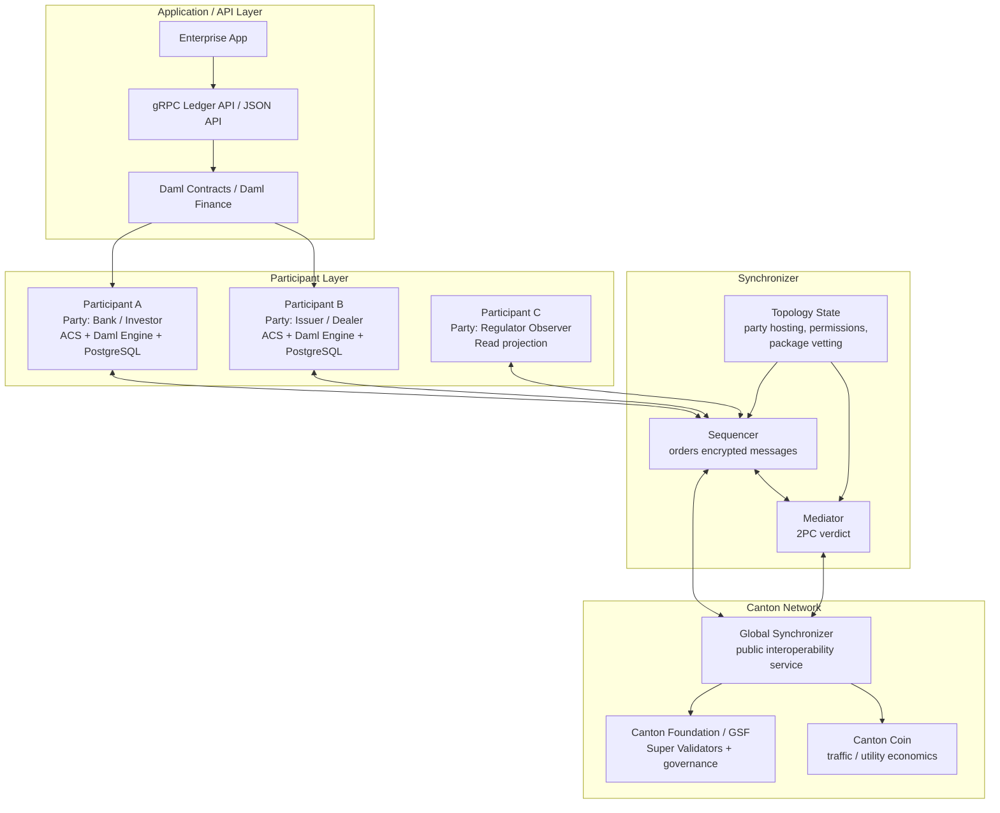
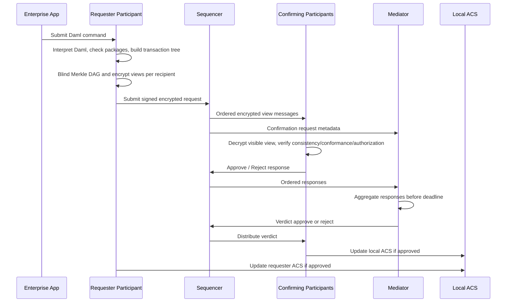
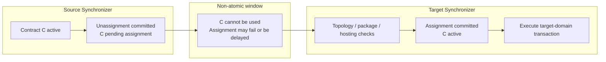
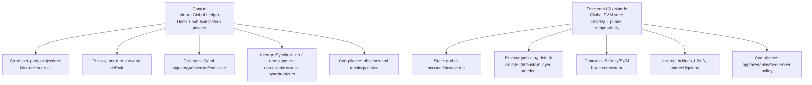
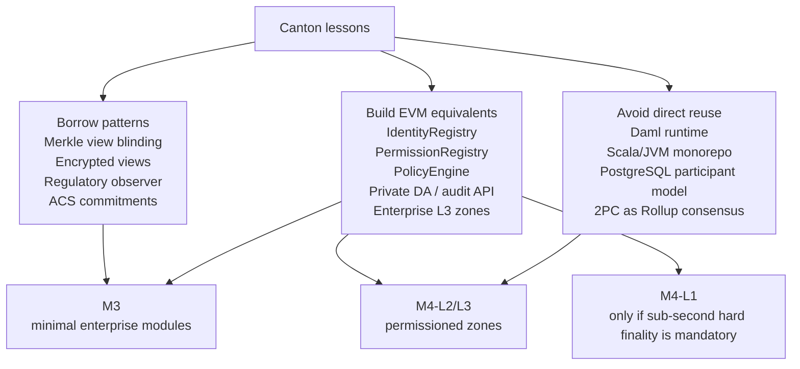

# Canton 企业级区块链详解

## 1. Executive Summary

Canton 的核心价值不是“把以太坊做成企业私有版”，而是为多机构金融工作流提供一种 **Virtual Global Ledger + need-to-know privacy + Daml 多方合约模型**。在 Canton 中，没有任何节点持有完整全局账本；每个 Participant 只持有自身 Party 相关的合约投影，Synchronizer 负责加密消息排序和 2PC 协调，Global Synchronizer 则作为公共互操作基础设施连接不同应用和子网。官方 3.5 文档称 Canton Network 是“public layer 1 blockchain network with privacy”，但实际权限模型是多层的：网络可公开，验证者/应用/拓扑/机构准入仍可受控。

对 Mantle ToB 的启示是：**Canton 的模式值得借鉴，但技术栈不应直接迁移**。Daml、Scala/JVM、Participant PostgreSQL 存储、Daml-LF 执行引擎和 2PC 协议深度耦合，与 Mantle 的 EVM 兼容、Solidity 生态和 Rollup 安全模型冲突。Mantle 更适合借鉴 Merkle-DAG 视图盲化、加密视图分发、监管 observer、拓扑/许可管理、ACS commitment、Sequencer/Mediator 职责分离这些设计思想，在 EVM/L2/L3 语境中重建等价能力。

企业采用证据需要谨慎表述。Broadridge DLR、GS DAP、HSBC Orion 等 Daml/Canton 相关金融应用显示了生产级金融工作流可行性；DTCC 在 2025-12-17 宣布与 Digital Asset/Canton 合作，目标是在 2026 上半年进入 controlled production MVP；JPMD 是 2026-01-07 公告的 phased integration throughout 2026，不是已上线生产部署；HQLAX 是战略投资和 planned migration；BNY、Nasdaq、S&P Global、Citi 等更多是投资、生态参与或伙伴信号，不能直接等同为 Canton 生产部署。

采用指标同样应保留口径差异。截至 2026-05-22，本稿保留四组不完全一致的 vendor/community 口径：Global Synchronizer 页面称每月 tokenizing $2T+ RWA；Digital Asset tokenization 页面称客户每月 tokenizing $1.5T+ real-world securities；Digital Asset 2025-12-04 新闻稿称 more than $6T assets onchain、over 600 institutions；2025-06-24 融资新闻稿称 nearly 400 ecosystem participants；CCTools 生态目录条目称其覆盖 450+ projects/apps/validators。它们都不是独立审计 TPS 或链上实时统计。

结论：Canton 是“金融机构协作网络”的标杆，不是通用公链替代品。它最适合多机构 DvP、债券/回购/抵押品流转、托管和监管可见性的复杂工作流；不适合无许可 DeFi、需要全局状态可组合性的应用、强公开可验证场景，或开发者生态依赖 Solidity/Foundry/OpenZeppelin 的产品。

## 2. Item Findings

### 2.1 item-1: 项目定位与企业级愿景

#### terminology_boundary

| 术语 | 本稿定义 | 不应混淆为 |
|------|----------|------------|
| Canton Protocol | Participant 与 Synchronizer 之间的分布式账本协议和隐私协调协议 | 一条单体链 |
| Canton Node | 运行 Canton 软件的节点进程，可是 Participant、Sequencer、Mediator 等 | 只代表 validator |
| Participant | 承载 Party、运行 Daml Engine、维护本地 ACS、提交/确认交易的机构侧节点 | 法律实体本身 |
| Party | 业务/法律实体的链上逻辑身份，可由一个或多个 Participant 托管 | 节点或账户地址 |
| Synchronizer | 协调服务，由 Sequencer + Mediator + ordering layer 组成 | EVM L2 sequencer |
| Canton Network | 围绕 Canton Protocol、Canton Coin、Canton Foundation/GSF 和应用生态形成的公共网络 | 单一应用链 |
| Global Synchronizer | 公共互操作 synchronizer，由 Super Validators/Governance 支撑，用于连接应用/子网 | 传统跨链桥或全局状态数据库 |

Canton 的产品叙事正在从 Digital Asset 的企业 DLT 技术栈演进为面向机构金融的公共 L1 网络。Digital Asset 官方集成文档称 Canton Network 是“public layer 1 blockchain network with privacy”，同时强调 network-of-networks：每个机构维护自己的 sub-ledger，通过 shared synchronization layer 连接。这个定位解决了企业链的典型矛盾：机构希望共享结算和流动性网络，但不能像公链那样让所有节点复制全部交易和持仓。

因此，Canton 的“企业级区块链愿景”有三层：

1. **业务层**：支持债券、回购、抵押品、基金份额、数字现金、清算结算、托管和市场基础设施的多方工作流。
2. **隐私层**：每个参与方只看自己有权看到的 sub-transaction projection，监管者可作为 observer 获得可审计视图。
3. **网络层**：通过 Global Synchronizer 和 Canton Coin 激励/费用模型，把多个应用、机构和同步域连接成可互操作市场。

**Source anchors**:
- 官方网络定位：[Canton Network Overview](https://docs.digitalasset.com/integrate/devnet/canton-network-overview/index.html)
- 网络规模和公共隐私叙事：[Digital Asset $135M funding release, 2025-06-24](https://blog.digitalasset.com/press-release/digital-asset-raises-135-million-to-accelerate-adoption-of-canton-network)
- 内部研究：[WHI-334 Canton 官方文档与白皮书调研](../../../mantle-enterprise-blockchain/research-sections/m1-independent-research/WHI-334-canton-docs-research.md), [WHI-348 Canton 章节](../../../mantle-enterprise-blockchain/research-sections/m2-cross-project-comparison/WHI-348-ch2-canton-draft.md)

**可信度**: high。官方文档、Digital Asset 新闻稿和内部架构研究一致；只有网络参与规模指标存在口径差异。

### 2.2 item-2: 架构全景 - Participant / Synchronizer / Global Synchronizer

#### architecture_component

| 组件 | 主要职责 | 持有状态 | 可见数据 | 关键依赖 |
|------|----------|----------|----------|----------|
| Application / Ledger API | 提交命令、读交易流、查询 ACS、集成业务系统 | 应用数据库可选 | 用户授权范围内的 ledger projection | gRPC Ledger API、JSON API、Daml bindings |
| Daml Engine | 解释 Daml-LF、检查合约逻辑和授权、生成交易树 | 包/模板元数据 | 本地 Participant 可见的合约和命令输入 | Daml-LF Engine、Package Store |
| Participant | 承载 Party，维护 ACS，构造/验证交易，发送确认 | PostgreSQL 中的 ACS、交易历史、包、拓扑快照 | 本节点托管 Party 的 projection；无法看到非相关交易内容 | Daml Engine、Synchronizer client、crypto keys |
| Sequencer | 排序和分发加密消息，提供安全多播 | 消息历史、排序状态、流量管理状态 | 加密 payload、接收者、大小、时间戳、request-level metadata | Ordering layer、topology snapshot |
| Mediator | 2PC 协调，聚合 confirmer 响应，出具 approve/reject verdict | 进行中确认请求和响应状态 | 需要确认的 Participant、确认/拒绝信号、deadline；不看合约明文 | Sequencer、confirmation policy |
| Topology Manager / State | 管理身份、Participant 权限、package vetting、Synchronizer 成员 | 拓扑交易 timeline | 拓扑变更公开给 Synchronizer 成员 | 签名、序列号、广播、future dating |
| Global Synchronizer | 公共互操作同步器，连接应用和资产网络 | Super Validator / network-level governance state | 与普通 Synchronizer 类似的协调数据；不应理解为全局明文账本 | Canton Foundation/GSF、Canton Coin |

Canton 交易路径可概括为：Requester Participant 运行 Daml Engine，生成 transaction tree 和按接收方加密的 view；Sequencer 给消息排序并分发；相关 Participants 解密自己的 view 并验证；Mediator 聚合确认结果，给出 verdict；各 Participant 根据 verdict 更新本地 ACS。

#### trust_boundary_and_failure_mode

| 边界 | 被攻破/失效后能做什么 | 不能做什么 | 缓解机制 |
|------|----------------------|------------|----------|
| Sequencer | 延迟/审查消息、观察元数据、在非 BFT 部署中影响排序 | 解密合约内容、伪造 Participant 签名、单方面批准无效交易 | BFT sequencing、write amplification、多 sequencer subscription、消息重放 |
| Mediator | 错误 reject、延迟 verdict、在单 mediator 模式审查交易 | 解密交易内容、绕过 confirmer 验证批准无效交易 | Mediator group threshold、deadline、审计日志 |
| Participant | 泄露本地可见 projection、恶意确认自己托管 Party 的无效交易 | 看到非托管 Party 的数据、伪造其他 Party 签名 | multi-hosted Party、ACS commitment、topology 权限 |
| Topology key | 错误授权 Party hosting、package vetting、Synchronizer membership | 绕过已签名拓扑验证、追溯改变历史交易 | namespace delegation、serial 防重放、broadcast-only topology transaction、future dating |

**Source anchors**:
- 拓扑状态机、广播和 future dating：[Topology management](https://docs.digitalasset.com/overview/3.4/explanations/canton/topology.html)
- Participant/Synchronizer 架构：[WHI-335 Canton 架构与隐私模型深度分析](../../../mantle-enterprise-blockchain/research-sections/m1-independent-research/WHI-335-canton-architecture-analysis.md)
- 源码结构和 Merkle/Daml/Mediator 实现：[WHI-336 Canton 代码库深度分析](../../../mantle-enterprise-blockchain/research-sections/m1-independent-research/WHI-336-canton-codebase-analysis.md)

**可信度**: 组件边界为 high；生产环境 Super Validator 运维细节为 medium，因为公开资料披露深度低于协议文档。

### 2.3 item-3: Daml 智能合约语言与授权模型

Daml 是 Canton 账本模型的核心，而不是可随意替换的合约语言。它把金融合同中的签署方、观察方、控制方、权利和义务作为一等概念，而不是依赖 Solidity 风格的任意 `modifier` 约定。

#### daml_contract_model

| 概念 | 含义 | 企业金融意义 |
|------|------|--------------|
| template | 合约类型，定义字段、signatory、observer、choice、ensure | 把金融产品/协议条款模型化 |
| signatory | 创建合约必须授权的 Party；义务不能在未授权下施加 | 债务、资产所有权、双方协议 |
| observer | 可见合约但不必授权创建；可用于监管/托管/报告 | 监管 observer、审计方、托管方 |
| choice | 可在合约上执行的动作；可以 consuming 或 non-consuming | 转让、结算、赎回、报告 |
| controller / actor | 可执行 choice 的 Party，运行时必须授权 | 操作权和业务流程控制 |
| Daml-LF / DAR / DALF | Daml 编译后的账本无关中间表示和包格式 | 版本化、内容寻址、package vetting |
| consume-create | 合约不可变；“修改”是 archive old + create new | 审计轨迹、并发安全、UTxO-like 资产转移 |

需要避免一个常见过度表述：Daml 不是“编译期保证所有授权正确”。更准确的模型是 **编译期结构约束 + Daml Engine 运行时强制执行**。编译器检查 Party 类型、signatory/controller 声明、choice 返回类型、确定性约束等；运行时账本模型检查 consistency、conformance、authorization。Digital Asset 的 Integrity 文档明确把有效账本定义为 consistency、conformance、authorization 三者同时满足，并说明 required authorizers 来自 signatories 和 controllers。

与 Solidity/EVM 相比，Daml 的优势是多方授权、确定性和隐私模型内生；劣势是开发者池小、工具生态弱、非 EVM、缺少 ERC 标准资产接口和 DeFi 可组合性。对 Mantle 来说，Daml 是理解企业合约语义的样板，不是可直接移植的运行时。

**Source anchors**:
- Daml 合约模型：[Daml: Define Contract Models Compactly](https://docs.digitalasset.com/overview/3.4/explanations/ledger-model/ledger-daml.html)
- 授权与有效账本：[Integrity](https://docs.digitalasset.com/overview/3.5/explanations/ledger-model/ledger-integrity.html)
- 内部授权修正：[WHI-335 §4 Daml 授权模型分析](../../../mantle-enterprise-blockchain/research-sections/m1-independent-research/WHI-335-canton-architecture-analysis.md)
- Daml Engine 可分离性和代码耦合：[WHI-336 §7 Daml Runtime Separability](../../../mantle-enterprise-blockchain/research-sections/m1-independent-research/WHI-336-canton-codebase-analysis.md)

**可信度**: high。官方 ledger model 与内部代码分析一致。

### 2.4 item-4: 隐私与合规模型 - Sub-transaction Privacy / Need-to-Know

Canton 的隐私不是 ZK 隐私，而是 **sub-transaction projection + Merkle DAG blinding + encrypted view distribution**。每个 action 的 informees 由 Daml 合约角色决定；每个 node 的 witnesses 是包含该 node 的子 action 的 informees 并集；projection 则把完整交易树裁剪为某组 Party 有权看到的子交易 DAG。官方 Privacy 文档说明，投影使一笔 DvP 交易在 Alice/Bob 与各自 Bank 眼中呈现不同视图，Bank 只看到自己相关资产转移，不知道完整交换原因。

#### privacy_visibility_model

| 角色 | 能看到 | 看不到 |
|------|--------|--------|
| Alice / Bob | 自己作为 informee/witness 的 DvP 根 action、相关 fetch/exercise/create、对手方必要输出 | 与自己无关的其他客户/机构合约 |
| Bank / Registrar | 自己发行/托管资产的 transfer/fetch/create projection | Alice/Bob 交易的完整商业原因和其他腿 |
| Regulator observer | 被模型显式加入 observer 的合约和事件 | 未被赋权或未披露的交易树 |
| Sequencer | 加密消息、接收者、大小、时间戳、部分 request metadata | Daml 业务逻辑、合约字段、Party 交易内容 |
| Mediator | confirmer、response、deadline、verdict | 合约明文、业务逻辑 |

#### compliance_auditability

Canton 的合规卖点来自“可审计隐私”而非“完全匿名”：

- **监管 observer**：合约模板可把监管者、托管方、审计方建模为 observer，使其获得实时投影。
- **审计轨迹**：Participant 本地持久化 ACS 和交易历史；不可变合约 + consume-create 模型保留生命周期链路。
- **数据主权 / GDPR**：不存在全局复制账本，机构只存自己有权看见的数据，本地数据可按辖区策略管理。
- **KYC/KYB 分离**：Canton 协议层处理 cryptographic identity / Party / Participant hosting；机构级真实身份、KYC/KYB、合规筛查通常在应用层和链下流程完成。
- **Selective disclosure**：Disclosure 允许通过链下通道将合约数据提供给非 stakeholder 后续使用；Divulgence 则描述非 stakeholder 因 projection 看到合约的场景。

限制同样明确：

1. **metadata leakage**：Sequencer 看不到内容，但能观察消息大小、频率、接收者等流量模式。
2. **非 ZK 隐私强度**：Canton 依赖加密路由和协议投影，不提供“明文从未被任何参与方知道”的数学证明。
3. **Participant 泄露风险**：一旦机构自己的 Participant 泄露，本地 projection 会泄露。
4. **无全局查询**：没有全局状态，自然也没有跨机构全局查询；报表需要应用层或监管 observer 设计。
5. **Observer 扩散风险**：增加监管/审计 observer 会扩大数据传播范围，必须设计最小可见性。

**Source anchors**:
- Projection / informee / witness / divulgence / disclosure：[Privacy](https://docs.digitalasset.com/overview/3.4/explanations/ledger-model/ledger-privacy.html)
- 视图盲化代码：[WHI-336 §3.3 Merkle Tree / TransactionView / EncryptedViewMessage](../../../mantle-enterprise-blockchain/research-sections/m1-independent-research/WHI-336-canton-codebase-analysis.md)
- 隐私边界分析：[WHI-335 §2 Merkle DAG 子交易树](../../../mantle-enterprise-blockchain/research-sections/m1-independent-research/WHI-335-canton-architecture-analysis.md)

**可信度**: 隐私语义为 high；合规实现为 medium，因为 KYC/KYB 真实流程多由应用和机构控制。

### 2.5 item-5: 互操作性设计 - 跨 Synchronizer、跨应用与资产流通

Canton 的互操作性不是传统跨链桥，也不是所有链共享同一个全局状态。它有两种不同层次：

1. **同一 Synchronizer 内的多方原子工作流**：多个 Participant 在同一 Synchronizer 上提交/确认同一 Daml 交易，Mediator 通过 2PC 给出唯一 verdict。
2. **跨 Synchronizer 合约移动**：通过 unassignment + assignment 把合约从源 Synchronizer 移到目标 Synchronizer，再在目标 Synchronizer 上参与后续交易。

官方 3.5 multi-synchronizer 文档明确说明 reassignment 是非原子的：它涉及 source/target 两个 Synchronizer 上的两个确认请求；unassignment 成功后，合约进入 pending assignment，在 assignment 完成前不能使用。这意味着它不能被表述为“跨链桥式原子结算”。Global Synchronizer 的价值更像公共协调点和网络互操作 backbone：当应用希望在共同同步域内协调资产和合约调用时，可以使用 Global Synchronizer；当资产跨多个 Synchronizer 迁移时，仍要面对非原子窗口、合约临时不可用、无跨 Synchronizer 全局排序和应用层争用处理。

#### interop_asset_flow

| 阶段 | 发生位置 | 关键状态 | 风险/约束 |
|------|----------|----------|-----------|
| Synchronizer 选择 | Participant / router | 选择目标 Synchronizer | 优先级、权限、package vetting、stakeholder hosting |
| Unassignment | Source Synchronizer | 合约在源域 pending assignment，不再可用 | 成功后若 assignment 不完成，合约卡住 |
| Assignment | Target Synchronizer | 合约在目标域 active，可继续交易 | 需要目标域权限、signatory confirmation、reassignment counter |
| 目标域执行 | Target Synchronizer | 目标域内 2PC 原子 verdict | 仅在目标 Synchronizer 内有因果排序 |
| 可选输出路由 | 多 Synchronizer | 输出合约再分配 | 应用需处理争用和非原子窗口 |

**Source anchors**:
- 非原子 reassignment 边界：[Multiple Synchronizers](https://docs.digitalasset.com/overview/3.5/explanations/canton/multi-synchronizer.html)
- Global Synchronizer 叙事：[The Global Synchronizer](https://www.canton.network/global-synchronizer)
- 内部故障矩阵：[WHI-335 §1.4 / §3.5.4](../../../mantle-enterprise-blockchain/research-sections/m1-independent-research/WHI-335-canton-architecture-analysis.md)

**可信度**: high。这是本轮 guardrail 中最重要的术语修正点。

### 2.6 item-6: 企业级应用案例与商业成熟度证据

#### enterprise_case_evidence

证据等级：

- **A: verified production / production-scale** - 有机构官方生产量或明确生产描述。
- **B: controlled production / announced production roadmap** - 已公告进入受控生产或阶段性上线，但尚未证明规模化常态运行。
- **C: completed pilot / live trial / PoC** - 已完成实盘/试点/PoC，但不是持续生产。
- **D: strategic investment / planned migration / ecosystem partner** - 投资、迁移计划、生态参与或合作意向。
- **E: ecosystem listing only** - 目录列名，不能作为部署证据。

| 机构/项目 | 用例 | 证据等级 | 截至 2026-05-22 的表述 | 主要来源 |
|-----------|------|----------|-------------------------|----------|
| Broadridge DLR | repo / tokenized real-asset settlement | A | Broadridge 2026-05-04 称 DLR 2026-04 处理日均 $368B、月近 $8T；产品为 distributed ledger repo 平台，常被 Canton/Daml 生态引用。 | [Broadridge Apr 2026 DLR release](https://www.broadridge.com/press-release/2026/broadridges-distributed-ledger-repo-achieves-268-percent-year-over-year-growth-in-april) |
| Goldman Sachs GS DAP | 多资产代币化发行和结算 | A/B | Digital Asset tokenization 页面列为客户案例，称发行/结算从 T+5 到 <60s；生产规模公开数据有限。 | [Digital Asset tokenization](https://www.digitalasset.com/use-cases/tokenization) |
| HSBC Orion | 数字债券生命周期、结算、回购 | A/B | Digital Asset 页面称 Orion 已完成 4 支数字债券，结算从 T+5 到 T+1；具体是否全部在 Canton Network 上需区分 Orion 私有/公共链架构。 | [Digital Asset tokenization](https://www.digitalasset.com/use-cases/tokenization) |
| Nasdaq carbon credits | 碳信用发行、结算、托管 | B | Digital Asset 页面称 Nasdaq carbon credit offering 使用 Daml smart contracts，可 standalone 或集成数据库/区块链；不等于公开 Canton Network 生产链上部署证明。 | [Digital Asset tokenization](https://www.digitalasset.com/use-cases/tokenization) |
| DTCC / DTC U.S. Treasuries | DTC-custodied UST tokenization | B | 2025-12-17 DTCC 官方公告：计划将 DTC 托管的一部分 U.S. Treasury securities mint on Canton，目标 2026H1 controlled production MVP，后续扩展取决于客户兴趣；DTCC 加入 Canton Foundation 共同治理角色。 | [DTCC release](https://www.dtcc.com/news/2025/december/17/dtcc-and-digital-asset-partner-to-tokenize-dtc-custodied-us-treasury-securities), [Canton DTCC page](https://www.canton.network/dtc-and-fed-eligible-securities-on-canton) |
| Canton UST working group | 24/7 on-chain financing / repo | C | Canton 页面称 2025-07 broad industry group completed live 24/7 trades，并完成 additional onchain repo transactions；属于实盘/行业试验信号，但需区别于长期生产量。 | [Canton DTC/Fed-eligible page](https://www.canton.network/dtc-and-fed-eligible-securities-on-canton) |
| J.P. Morgan Kinexys / JPMD | bank-issued USD deposit token on Canton | B/D | 2026-01-07 公告是“intention to collaborate”，2026 年分阶段整合，初期建立技术和商业框架；不能写成已生产部署。 | [PRNewswire / Canton Network release](https://www.prnewswire.com/news-releases/digital-asset-and-kinexys-by-jp-morgan-announce-intention-to-bring-usd-jpm-coin-jpmd-natively-to-the-canton-network-302654967.html) |
| HQLAX | collateral mobility / securities finance | D | 2026-04-21 宣布 Broadridge 和 Digital Asset 战略少数股权投资；planned migration to Canton Network，且 migration/board appointments subject to CSSF approval。 | [Broadridge HQLAX release](https://www.broadridge.com/press-release/2026/hqlax-announces-strategic-investments-from-broadridge) |
| BNY / iCapital / Nasdaq / S&P Global | strategic investors / future collaboration | D | 2025-12-04 Digital Asset 公告其战略投资，代表机构支持和潜在合作，不是生产部署证明。 | [Digital Asset strategic investments release](https://blog.digitalasset.com/press-release/digital-asset-announces-strategic-investments-from-bny-icapital-nasdaq-and-sp-global) |
| Citi / BNY / DTCC / others in ecosystem directory | ecosystem participation | D/E | 出现在 ecosystem/funding/governance/partner 语境中，只能作为生态信号；需逐机构找公告才能上升到生产证据。 | [Canton ecosystem directory](https://www.cantonecosystem.com/) |
| Bank of China / HKSAR green bond | tokenized green bond | C | 内部 WHI-334 将其列入完成案例；本轮未找到足够新鲜一手证据补强，保留为待复核案例。 | [WHI-334 §7.4](../../../mantle-enterprise-blockchain/research-sections/m1-independent-research/WHI-334-canton-docs-research.md) |

#### adoption metrics with source dates

| 指标 | 数值 | 来源与日期 | 本稿解释 |
|------|------|------------|----------|
| Monthly RWA tokenized on Global Synchronizer | $2T+ / month | Canton Global Synchronizer 页面，2026-05-22 访问 | vendor-reported，可能偏 Global Synchronizer / network venue 口径 |
| Monthly real-world securities tokenized by customers | $1.5T+ / month | Digital Asset tokenization 页面，2026-05-22 访问 | vendor-reported，customer/software 口径 |
| Assets onchain / institutions | more than $6T / over 600 institutions | Digital Asset strategic investments release, 2025-12-04 | vendor-reported，可能包含生态多资产累计/名义规模 |
| Ecosystem participants | nearly 400 | Digital Asset $135M funding release, 2025-06-24 | vendor-reported，早于 2025-12 数据 |
| Ecosystem directory coverage | 450+ projects/apps/validators | CCTools entry in cantonecosystem.com, 2026-05-22 访问 | community tooling coverage，不等同机构数或节点数 |

**Source anchors**:
- [The Global Synchronizer](https://www.canton.network/global-synchronizer)
- [Digital Asset tokenization use case](https://www.digitalasset.com/use-cases/tokenization)
- [Digital Asset strategic investments from BNY/iCapital/Nasdaq/S&P Global](https://blog.digitalasset.com/press-release/digital-asset-announces-strategic-investments-from-bny-icapital-nasdaq-and-sp-global)
- [Digital Asset $135M raise](https://blog.digitalasset.com/press-release/digital-asset-raises-135-million-to-accelerate-adoption-of-canton-network)
- [Canton ecosystem directory / CCTools entry](https://www.cantonecosystem.com/)

**可信度**: medium-high。生产/公告事实来自一手来源；规模指标均为 vendor/community 口径，未独立审计。

### 2.7 item-7: 优势、局限与适用场景边界

#### advantages

1. **子交易级隐私是结构性优势**：Canton 可在一笔多方交易中让不同参与方看到不同子树，这比 Fabric channel 或常规链下隐私更细。
2. **金融合约语义强**：Daml 的 signatory/observer/controller/consume-create 与金融合同、DVP、债券、回购、托管工作流天然贴合。
3. **可审计隐私**：监管 observer 和本地交易历史给审计留出原生路径，不必在“完全公开”和“黑盒 ZK”之间二选一。
4. **Participant-Synchronizer 分离**：排序、确认、执行、存储职责分离，降低单点可见性，并支持多 Synchronizer 水平扩展。
5. **企业采用信号强**：Digital Asset 与 DTCC、Goldman Sachs、Broadridge、BNY、Nasdaq、J.P. Morgan Kinexys 等机构存在公开合作、投资或应用案例。

#### limitations_open_questions

1. **非 EVM 和 Daml 生态小**：对需要 Solidity 工具链、ERC 标准和 DeFi 组合性的团队是明显门槛。
2. **没有全局状态和全局查询**：这既是隐私优势，也是分析、监管总账和跨应用查询的成本。
3. **跨 Synchronizer reassignment 非原子**：应用必须处理 pending assignment、争用和重试。
4. **metadata leakage 仍存在**：高敏感交易可能还需要 padding、批处理、mixing 或业务侧隔离。
5. **代码/运行时复用成本高**：Scala/JVM、sbt、Pekko/cats、PostgreSQL、Flyway、Daml-LF 组合对非 Scala 团队运维负担重。
6. **许可/发行物边界需要法务确认**：内部 WHI-336 判断 community/base 大部分核心模块 Apache-2.0，但 Docker 镜像和部分目录存在限制或 proprietary header。
7. **公开性能基准缺口**：大额名义金额并不能直接推导 TPS、延迟或故障恢复能力。

#### applicable scenarios

| 适合 | 不适合 |
|------|--------|
| 多机构 DvP、债券/回购/抵押品结算、托管网络、监管可见但交易保密的资本市场 | 无许可 DeFi、flash loan/全局状态组合性、高频公开交易、无需多方隐私的简单企业数据库 |
| 多方资产生命周期、合规 observer、需要机构间互操作和隐私的 RWA | 需要完全 public verifiability、无需信任安全或 ZK 隐私强保证的场景 |
| 参与方明确、法律主体清晰、愿意运行 Participant 或通过受托服务接入的企业场景 | 开发者长尾生态、快速部署普通 Solidity dApp、强依赖 Ethereum L1/L2 原子可组合性的场景 |

**可信度**: 技术边界为 high；商业成熟度为 medium，因为部分案例仍是公告或计划。

### 2.8 item-8: 对 Mantle ToB 业务的借鉴意义

Canton 给 Mantle 的真正价值是产品和架构设计语言，而不是代码复用。Mantle 的 ToB 路线必须保留 EVM 兼容、Solidity 工具链、L2/L3 生态、以太坊结算路径，同时补上企业隐私、许可、合规和审计层。

#### mantle_transferability: Borrow / Build / Avoid

| Canton 模式 | 建议 | Mantle 转译 |
|-------------|------|-------------|
| Merkle DAG / view blinding | Borrow pattern | 为隐私交易或企业 L3 设计子动作承诺树，向不同角色分发加密 view；不改变 EVM 全局状态前先从应用层/DA 层做 PoC |
| Encrypted view distribution | Borrow pattern | 在私有 DA、企业 RPC、permissioned sequencer pipeline 中分发 role-based encrypted payload |
| Regulatory observer | Borrow pattern | 通过合约级 observer role、viewing key、审计 API、监管节点解密授权实现 |
| Sequencer-Mediator 分离 | Borrow selectively | Mantle Sequencer 仍负责排序和可见交易；可引入独立 compliance/verdict service 对企业 zone 交易做 pre-execution policy verdict |
| Topology management | Build equivalent | 构建 EVM 兼容 IdentityRegistry、PermissionRegistry、Package/Contract Allowlist、PolicyEngine |
| ACS commitment | Build equivalent | 对企业 L3 / private DA 维护可验证状态摘要，供多方 reconciliation 和审计使用 |
| Daml signatory/observer/controller | Build equivalent in Solidity/precompiles | 不直接移植 Daml；用合约标准、predeploy 或 precompile 表达多方授权和监管可见性 |
| Daml Runtime / Daml-LF | Avoid | 与 Mantle EVM 兼容目标冲突，生态和运维成本过高 |
| Scala/JVM Canton monorepo | Avoid | 不作为 Mantle 核心执行层；仅做研究参考 |
| PostgreSQL Participant storage model | Avoid direct reuse | Mantle 可用索引器/私有 DA/企业数据仓库实现投影存储 |
| Cross-Synchronizer reassignment | Borrow lesson, not exact protocol | L2/L3 跨域资产流转需明确非原子窗口、锁定、失败恢复和用户 UX；DeFi 场景不能假装原子 |

#### Mantle path mapping

| 路径 | Canton 可借鉴点 | 建议 PoC |
|------|----------------|----------|
| M3 最小侵入 | observer、identity/predeploy、selective disclosure、audit log | 在现有 Mantle L2 上做 RWA 合规发行 demo：IdentityRegistry + TransferPolicy + AuditView API |
| M4-L1 独立链 | Pre-EVM 合规、BFT 快终局、zone 隔离、可验证隐私层 | 只在明确需要亚秒硬终局和不可绕过合规时考虑；投入大，不作为第一步 |
| M4-L2/L3 企业 Rollup | 多 zone、私有 DA、permissioned sequencer、加密 payload | 首选 ToB 实验路径：RWA Zone / Payment Zone / xStocks non-HFT Zone，保留 Mantle DeFi 主层 |

#### recommended first enterprise wedge

Mantle 的首个 ToB 切入点不应是“复制 Canton 做机构金融全网”，而应是 **EVM-compatible regulated asset workflow kit**：

1. **RWA/基金份额发行**：支持白名单、transfer restriction、issuer/regulator observer、选择性披露。
2. **DVP-like settlement demo**：不承诺 Canton 级子交易隐私，先实现 escrow + payment token + audit trail。
3. **Permissioned L3/Zone**：把机构交易和公开 DeFi 隔离，但通过桥和结算层保留流动性入口。
4. **审计与合规 API**：比“链上隐私”更容易被企业客户理解和采购。

**Source anchors**:
- Mantle 三路径和企业需求：[M4 rebuild architecture final](../../../mantle-enterprise-blockchain/research-sections/m4-rebuild-architecture/final.md)
- Base/Mantle 企业适配维度：[enterprise-tob-adaptability draft](../../../mantle-base-codebase-evaluation/research-sections/enterprise-tob-adaptability/drafts/round-1.md)
- Canton code reuse boundary：[WHI-336 Executive Verdict / §14 decision table](../../../mantle-enterprise-blockchain/research-sections/m1-independent-research/WHI-336-canton-codebase-analysis.md)

**可信度**: “避免直接复用 Canton 技术栈”为 high；具体 Mantle 路线建议为 medium，因为它依赖 Mantle 商业优先级和团队资源。

## 3. Diagrams

### diag-1: Canton 架构全景



### diag-2: Canton 交易提交与 2PC 确认流程



### diag-3: Sub-transaction Privacy 示例

```text
完整 DvP 交易树（逻辑视图，任何单节点通常不完整持有）

AcceptAndSettle(Alice, Bob)
├─ Fetch Bob's USD asset
├─ Exercise Transfer on Alice asset
│  └─ Create Bob receives asset
└─ Exercise Transfer on Bob asset
   └─ Create Alice receives asset

Alice projection:
AcceptAndSettle
├─ Fetch Bob asset reference / disclosed input
├─ Exercise Alice asset -> Bob
└─ Exercise Bob asset -> Alice

Bob projection:
AcceptAndSettle
├─ Fetch Alice asset reference / disclosed input
├─ Exercise Bob asset -> Alice
└─ Exercise Alice asset -> Bob

Bank 1 projection:
Exercise Alice-issued asset transfer
└─ Create Bob receives Bank 1 asset

Bank 2 projection:
Fetch Bob-issued asset
Exercise Bob-issued asset transfer
└─ Create Alice receives Bank 2 asset

Regulator projection:
Only contracts/templates where regulator is observer

Hidden subtrees are represented to non-entitled parties as hashes / omitted projections,
not as plaintext global state.
```

### diag-4: 跨 Synchronizer 资产流通与非原子窗口



### diag-5: Canton vs Ethereum L2 / Mantle 差异表



### diag-6: Mantle Borrow / Build / Avoid 决策图



## 4. Source Coverage

| 来源要求 | 覆盖度 | 证据 |
|-------------|----------|----------|
| src-1 internal_research | full | 已复用 WHI-334、WHI-335、WHI-336、WHI-348、M4 rebuild architecture、Base enterprise adaptability。 |
| src-2 official_docs | full | 已覆盖 Canton Network overview、ledger privacy、integrity、Daml model、topology、multi-synchronizer，以及 Canton Network Global Synchronizer 和 ecosystem 页面。 |
| src-3 whitepapers_and_specs | partial | 本稿引用官方网页文档和既有 WHI 对 Canton/Canton Coin/whitepaper 的总结；受 standard-depth 范围限制，未完整重读所有 PDF 白皮书。 |
| src-4 code_analysis | full | WHI-336 覆盖 Participant、Synchronizer、Mediator、MerkleTree、TransactionView、TopologyManager、Daml Engine 集成和 license 边界。 |
| src-5 enterprise_case_sources | full | 覆盖 DTCC、Broadridge、Digital Asset、PRNewswire/Canton Network、HQLAX/Broadridge、Digital Asset strategic investment 等一手或机构来源。 |
| src-6 comparative_sources | full | WHI-348、WHI-335、WHI-336、M4 architecture 和 Base enterprise adaptability 提供 Mantle/EVM 对照。 |
| src-7 data_freshness_validation | full | $2T+/month、$1.5T+/month、$6T/600、nearly 400、450+ 以及 JPMD/HQLAX/DTCC 的时间敏感声明已在 2026-05-22 重新核验。 |

## 5. Gap Analysis

1. **白皮书 PDF 重读不完整**：既有 WHI 研究已吸收 Canton/Canton Coin/Polyglot Canton 白皮书结论，但本轮 standard-depth 没有逐页重抽全部 PDF 论据；若用于对外投资级报告，应补做一次 PDF 级来源复核。
2. **生产部署分类仍需谨慎**：Digital Asset 客户页面常把 Daml/Canton 技术一起营销。GS DAP、HSBC Orion、Nasdaq carbon credits 等案例可能使用 Daml 软件和/或私有许可基础设施，不一定全部是 public Canton Network 生产部署。本稿将其标为 Daml/Canton-family 生产证据，而非一律标为 public Canton Network 生产证据。
3. **缺少独立性能数据**：vendor-reported 名义金额是强市场信号，但不能揭示 TPS、p99 延迟、故障恢复、validator 分布或实际链上吞吐。
4. **Global Synchronizer 治理细节不如协议文档透明**：公开来源描述 Canton Foundation/GSF、Super Validators、Canton Coin，但不足以完整审计治理风险。
5. **Mantle 路线转译需要产品验证**：Borrow / Build / Avoid 建议基于架构判断，但仍需通过 RWA issuer、payment、xStocks、机构钱包等客户发现验证采购意愿和优先级。

## 6. Revision Log

| Round | Change | Notes |
|-------|--------|-------|
| 1 | Initial deep draft | Produced from approved outline commit `7fc3cfd1b54f74df038643bc29ae6862e9b7ca0f`; incorporated outline review guardrails around case-study evidence, permission terminology, Global Synchronizer/reassignment boundary, and adoption metric attribution. |
