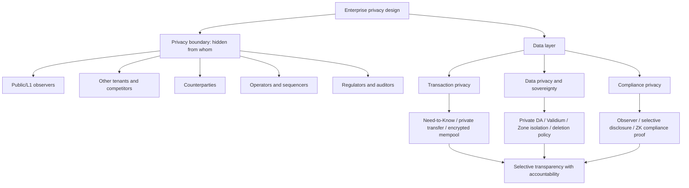
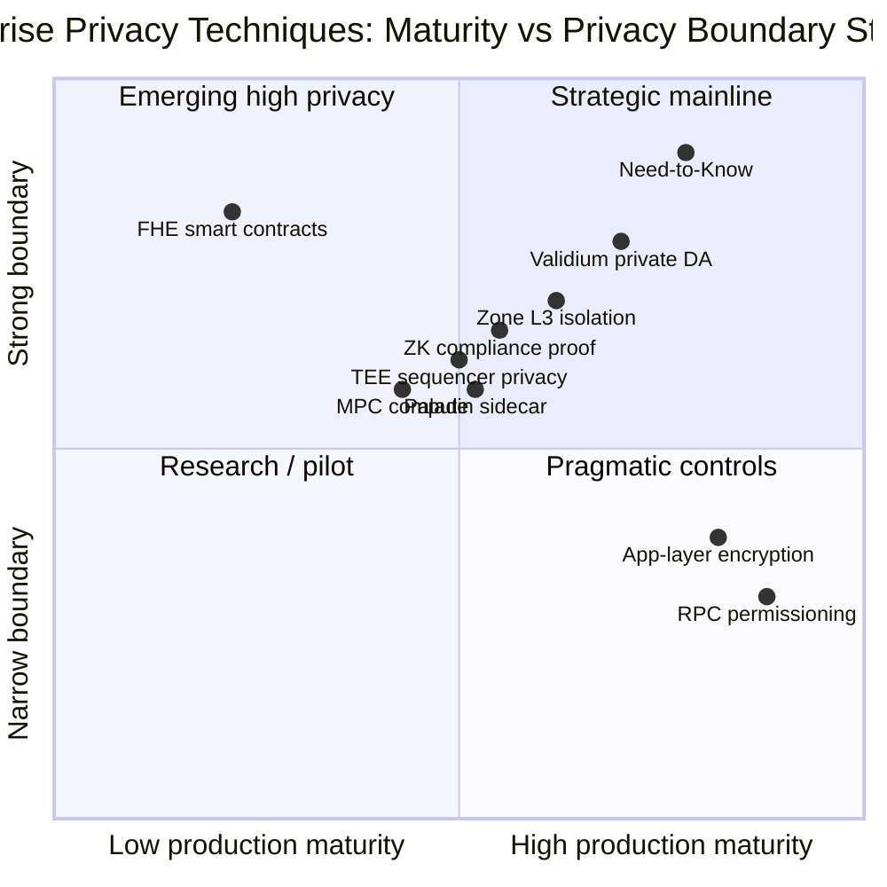
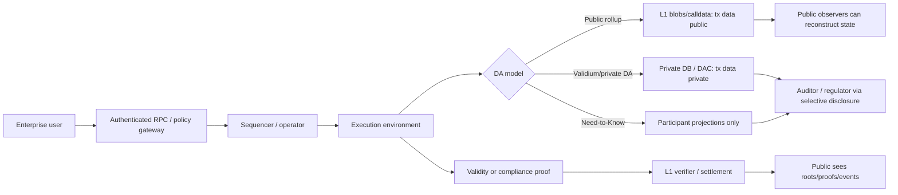
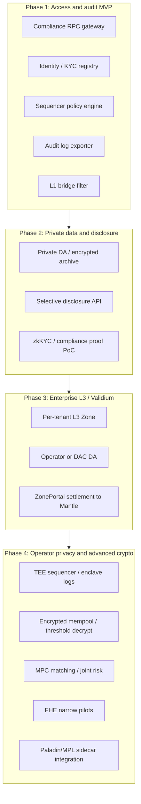
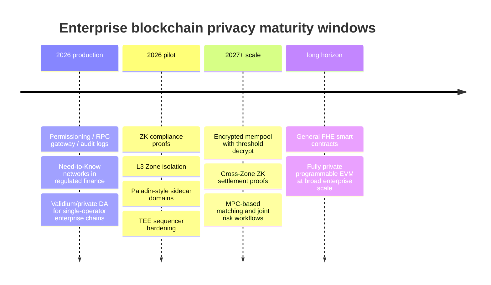

# 企业级区块链隐私技术综述

## Executive Summary

企业级区块链的隐私问题不是"把链变匿名"，而是**把可见性精确分配给交易参与方、运营方、审计方、监管方和公众观察者**。在企业场景中，隐私、审计和合规不是互相排斥的三件事，而是同一个数据可见性设计的三个出口：竞争者不应看到敏感交易，运营方或合规方可能必须看到明文，监管方需要可验证且可追责的选择性披露。

本研究的结论有五点：

1. **隐私边界先于密码学选择**。ZK、TEE、MPC、FHE 只是工具。真正决定企业隐私强度的是：完整交易数据发给谁，完整状态在哪里，什么数据进入 L1/公共 DA，监管和审计如何被授权访问。仓库既有 WHI-343/349 的核心结论仍成立：ZK validity proof 提升正确性和终局性，但如果交易数据仍公开发布到 L1，它不会自动带来数据隐私。

2. **短中期主线不是全栈 FHE/MPC，而是 Need-to-Know、Validium/private DA、Zone 隔离和企业中间件组合**。Canton 代表子交易级 Need-to-Know；Prividium 代表 "Prove-Not-Reveal" 的 Validium 模式；Tempo Zones 代表隔离 Zone + 加密桥接；Paladin 代表 EVM sidecar 隐私中间件。它们的共同点是先改变数据分发和可见性边界，再在边界处使用密码学证明。

3. **ZKP 是企业隐私中最可产品化的密码学路线，但主要价值分两类**：一类是 validity / settlement proof，证明状态转换正确；另一类是 privacy / compliance proof，证明某个隐私事实成立而不泄露原文。企业应用中最现实的 ZK 产品形态不是"所有交易都全隐私"，而是 ZK KYC membership、制裁筛查证明、储备/资产合规证明、隐私转账和跨域结算证明。

4. **TEE、MPC、FHE 的正确位置是组合层而非默认底座**。TEE 适合保护 sequencer/prover 私钥、加密 mempool、可信合规日志和 operator privacy，但必须承认硬件供应商、远程证明、侧信道和补丁治理风险。MPC 适合跨机构联合风控、阈值密钥、隐私撮合和多方清算，生产成熟度高于 FHE，但交互和参与方在线性限制明显。FHE 最能表达"对密文直接计算"的愿景，适合长期探索隐私 DeFi / 加密订单簿 / 监管查询，但 2026 年仍应按 research-to-pilot 而非通用生产能力评估。

5. **对 Mantle 的启示是分阶段组合，而不是主链私有化**。Mantle 公共主链不应直接承载高敏感明文业务。短期应优先做企业准入、合规审计、选择性披露和私有数据层；中期建设 private DA / Validium 或企业 L3 Zone；长期再把 operator privacy、encrypted mempool、ZK 合规证明、MPC/FHE、Paladin 类隐私中间件作为可插拔能力引入。

## Item Findings

### item-1: 企业级区块链隐私需求框架

#### privacy_boundary

企业隐私必须先回答 "privacy from whom"：

| 观察者 | 典型风险 | 企业要求 |
|---|---|---|
| 公众 / L1 观察者 | 重建交易、余额、业务规模和对手方关系 | 敏感业务数据不上公开 DA；只发布承诺、证明或摘要 |
| 其他租户 / 竞争机构 | 推断订单流、资金流、持仓、供应链关系 | 租户隔离、Need-to-Know、Zone/L3 隔离 |
| 交易对手 | 不应看到另一腿交易、内部成本、其他关联资产 | 子交易级视图或合约级选择性披露 |
| 运营方 / Sequencer | order flow、明文 payload、身份信息泄露 | 视场景决定：支付/RWA 可接受合规运营方可见；暗池/xStocks 需 encrypted mempool、TEE、MPC 或 ZK |
| 监管 / 审计方 | 需要合法访问但不能过度披露 | Observer、审计角色、Merkle export、ZK 合规证明、阈值解密 |

仓库既有 WHI-359 的表述最准确：隐私不是"encrypt everything"，而是"precisely control who can see what"。企业链的隐私是选择性透明，而不是无条件匿名。

#### data_location_and_da

数据位置比证明系统更重要：

| 数据类型 | 公开 Rollup | Validium/private DA | Need-to-Know | Zone/L3 |
|---|---|---|---|---|
| 原始交易 calldata | 公开进入 L1 blobs/calldata | 留在 operator / DAC 私有存储 | 只分发给相关 participant | 留在 Zone sequencer / DA |
| 完整状态 | 可由公众派生 | operator 私有 DB | 不存在单一全局完整状态 | Zone 内部状态 |
| 审计材料 | 公开但无角色语义 | operator 导出 / 审计 API | Observer / participant 本地 ACS | 加密归档 + 监管 API |
| 删除/驻留控制 | 极弱 | 强，取决于运营流程 | 强，各方本地控制 | 中高，取决于 Zone 运营 |

这直接决定 GDPR / 数据本地化 / 商业秘密保护的可行性。只要敏感数据进入不可删除的公共数据层，后续再加 ZK proof 也很难恢复企业级数据主权。

#### compliance_and_audit

企业隐私与合规不是冲突，而是同一个可见性矩阵的两列：

- **交易隐私**：对公众、竞争方和无关租户隐藏交易内容、金额、订单流和关系图。
- **数据隐私**：PII、合同条款、资产估值、KYC/KYB 材料、审计凭证不上公共链，可被删除、加密、分域留存。
- **合规隐私**：监管方可验证 KYC/AML/Travel Rule/制裁筛查结果，但不必暴露完整 PII 给每个交易对手。

因此 "fully public audit" 不是企业合规的理想形态；它可验证但过度披露。企业更需要最小披露审计。

#### source_confidence

| 结论 | source_confidence |
|---|---|
| 企业隐私核心是选择性可见性而非匿名 | high — 来自 WHI-343/346/349/359/366 多份内部研究交叉一致 |
| 公共 DA 与 GDPR/商业隐私存在结构性冲突 | high — 由公开 DA 数据不可删除和可派生状态直接推出 |
| 具体监管义务适配 | medium — 本文只做技术架构分析，不构成法律意见 |

### item-2: 既有企业链隐私范式复用

#### privacy_mechanism

本节把 outline 中扩展的路线收敛为比较性企业隐私模式，而不是等深度展开。

| 模式 | 代表 | 核心机制 | 隐藏对象 | 主要信任假设 | 适合场景 |
|---|---|---|---|---|---|
| Need-to-Know | Canton | 子交易 Merkle DAG 投影，参与方只接收自己的视图 | 对非相关方隐藏交易存在和内容 | 参与方验证 + synchronizer 排序/mediator 协调 | 银行间清算、DvP、供应链金融 |
| Validium / private DA | Prividium, ZK Stack, StarkEx-style validium | 数据链下，L1 只见状态根和 proof | 对 L1/公众隐藏交易数据 | operator/DAC 保证 DA；ZK 保证状态转换 | 单运营商企业链、机构结算、发行方平台 |
| Zone / L3 隔离 | Tempo Zones, OP/Orbit-style appchain | 独立执行环境 + 私有 DA + 认证 RPC | 对其他租户和公众隐藏 Zone 内状态 | Zone sequencer 可见明文；L2/L1 锚定 | 企业租户、多业务线、支付/稳定币 |
| 隐私中间件 / sidecar | Paladin, Besu-era privacy manager | 私有状态链下，公链仅承诺/nullifier/proof | 对基础链隐藏业务 payload | sidecar/notary/group 共识或 ZK domain | 快速引入 confidential transfer / private EVM groups |
| 应用层加密 | Nightfall, token-level encryption, encrypted memo | 链上存密文，授权方持钥 | 对公众隐藏字段 | 密钥管理和元数据泄漏风险 | 局部字段隐私、合规披露 |
| 身份/凭证隐私 | Polygon ID, zkKYC, Midnight-style selective disclosure | VC / ZK membership proof | 隐藏身份原文，证明资格 | issuer / credential registry / proof system | KYC-gated DeFi、合规准入 |

#### security_risks

- Need-to-Know 的主要风险是开发模型和执行语义不可迁移。Canton 的隐私粒度依赖 Daml、UTxO-like 合约和投影算法；EVM 账户模型只能借鉴思想，不能低成本复制同等级保证。
- Validium/private DA 的主要风险是 DA 降级。ZK proof 可证明状态转换正确，但不能保证 operator 持续提供历史数据、响应退出或合规导出。
- Zone/L3 的主要风险是 sequencer 可见性和元数据泄漏。Zone 隔离对公众有效，但 operator 默认看到明文，L2/L1 settlement event 仍可能泄漏活动量、时间和跨 Zone 流向。
- 隐私中间件的主要风险是与基础链最终性、费用、DA 和执行语义错配。Paladin 类 sidecar 不拥有排序和 DA 边界，适合产品化隐私网络或应用层能力，不应被误认为改造公共 L2 的完整方案。

#### evm_and_mantle_fit

| 模式 | 对 Mantle 可复用性 | 建议 |
|---|---:|---|
| Need-to-Know | 中低 | 借鉴 Merkle projection / Observer / audit role；不要承诺 Canton 级 EVM 原生隐私 |
| Validium/private DA | 高 | 作为企业 L3 / appchain / private DA 产品线的主线 |
| Zone/L3 隔离 | 高 | 最适合 Mantle 的中期企业隐私架构 |
| Paladin / sidecar | 中高 | 作为 MPL / 独立 Besu-QBFT 隐私网络或应用 sidecar 评估 |
| 应用层加密 | 中 | 适合字段级隐私和过渡方案，但需严格密钥治理 |
| zk identity | 高 | 适合短期合规准入和选择性披露产品化 |

#### source_confidence

| 模式 | source_confidence |
|---|---|
| Canton Need-to-Know | high — 内部 WHI-334/335/336/343/392 + 官方架构文档一致 |
| Prividium / Validium | medium-high — 内部 WHI-337/338/343/392 充分；部分商业部署和性能为官方/供应商声称 |
| Tempo Zone | medium-high — 内部 WHI-339/340/343/392 有代码分析；Zone validity proof 未上线需标注 |
| Paladin | medium — 内部 WHI-392 引用 Paladin 包；标准深度未重新审计全部 Paladin 代码和部署 |
| Nightfall/Midnight/Polygon ID | medium-low — 仅作为比较模式提及，未等深度展开 |

### item-3: ZKP 路线：zk-SNARKs、zk-STARKs 与企业隐私/合规证明

#### privacy_mechanism

ZKP 在企业链中有四种不同角色，必须分清：

1. **Validity proof**：证明状态转换正确。Mantle/SP1、Prividium STARK、ZK Stack/Airbender 等主要在这里发挥作用。它不自动隐藏输入数据。
2. **Privacy transaction proof**：证明一笔隐私转账守恒、授权、无双花，同时隐藏发送方/接收方/金额。Zcash、Aztec、Zeto 类属于此类。
3. **Compliance proof**：证明某个用户/交易满足 KYC、制裁筛查、额度、投资者资格、储备率等规则，而不泄露 PII 或完整账本。
4. **Cross-domain settlement proof**：证明某个私有域内资产锁定、清算或状态根有效，用于跨 Zone / L2 / L1 互操作。

#### zk-SNARKs vs zk-STARKs

| 维度 | zk-SNARKs | zk-STARKs | 企业含义 |
|---|---|---|---|
| 可信设置 | 常见 Groth16 需要 circuit-specific trusted setup；PLONK/KZG 需要通用 SRS | 通常 transparent，无 trusted setup | 金融机构偏好减少 ceremony 风险；但 SNARK 验证成本低 |
| 证明大小 | 小，链上验证便宜 | 大，验证/递归成本较高但可工程优化 | L1 gas 成本敏感时 SNARK 有优势 |
| 证明生成 | 电路工程成熟，Groth16/PLONK 工具多 | 对大规模计算和 zkVM 友好，常需重型 prover | 企业高吞吐需要 GPU/prover 运维 |
| 后量子叙事 | 依赖曲线离散对数，通常非后量子 | 基于哈希/FRI，常被描述为后量子友好 | 监管叙事上 STARK 有优势，但成本更高 |
| 开发者体验 | Noir/Circom/gnark 等成熟 | Cairo/STARK/zkVM 路径复杂度较高 | 企业产品更看重可维护性和审计性 |

#### performance_profile

ZKP 的性能瓶颈主要在证明生成，而不是验证。企业应用的设计原则是：

- 高频交易不要每笔都生成昂贵证明；应批量、聚合、递归或分层证明。
- 合规证明优先从窄命题开始，例如 "用户属于合格投资者集合"、"交易未超过额度"、"地址未在制裁集合"。
- validity proof 可作为结算正确性背书；privacy proof 应只覆盖真正需要保密的字段或工作流。
- 证明系统的可解释性很重要。监管方和审计方需要知道 proof statement 是什么，而不只是看到验证通过。

#### security_risks

- **电路/约束错误**：ZK 系统最危险的是 proof statement 写错，验证通过但业务规则未被证明。
- **trusted setup 风险**：Groth16 等路径需治理 ceremony、SRS 保管和升级。
- **隐私集合太小**：即便 proof 隐藏身份，membership set 太小也会暴露用户。
- **元数据泄漏**：时间、金额区间、交互图、gas、bridge event 可能破坏隐私。
- **升级和密钥治理**：verifying key、circuit version、proof format 改动需要审计和兼容策略。

#### maturity_and_adoption

ZK validity 已经是主流 L2 路线的一部分；ZK privacy 在通用企业 EVM 中仍未达到 "默认生产底座" 状态。更现实的成熟度排序是：

| 用途 | 2026 现实成熟度 | 说明 |
|---|---|---|
| L2 validity / settlement proof | production / scaling | 多个 L2 和 rollup 已使用 |
| zk identity / membership / simple compliance proof | pilot-to-production | 命题窄，容易产品化 |
| private transfer / shielded asset | pilot / specialized production | 需要钱包、view key、审计和合规设计 |
| general private smart contracts | emerging | Aztec/Aleo 等在推进，但企业就绪度需谨慎 |

#### source_confidence

| 结论 | source_confidence |
|---|---|
| ZK validity 不等于隐私 | high — 内部 WHI-343/349/341 反复验证 |
| SNARK/STARK 技术权衡 | high for qualitative; medium for concrete performance — 具体 benchmark 随实现和硬件变化 |
| Aztec/Aleo 企业级就绪度 | medium-low — 官方文档显示技术方向清晰，但企业生产部署、合规工具、审计和运维成熟度未在本轮充分核实 |

### item-4: TEE 路线：SGX、TDX、Nitro/SEV 与隐私执行环境

#### privacy_mechanism

TEE 在企业链隐私中的价值不是替代 ZK，而是补齐 "运营方也不该看到" 或 "密钥不该离开受保护边界" 的场景：

- **加密 mempool / private order flow**：sequencer 在 enclave 中解密、排序或批处理，减少 operator 员工/主机 OS 可见性。
- **prover / sequencer key protection**：签名密钥、prover attestations、batch signing keys 留在 enclave。
- **可信合规日志**：enclave 生成可远程证明的审计日志，证明某版本合规策略被执行。
- **operator privacy + ZK 双证明**：TEE 给低延迟执行和 attestation，ZK 给可验证正确性；二者组合而非互相替代。

#### trust_assumptions

| TEE 路线 | 信任来源 | 企业关注点 |
|---|---|---|
| Intel SGX | CPU enclave + Intel attestation | 历史侧信道/微码漏洞多，EPC 限制，供应商依赖 |
| Intel TDX | VM 级 trust domain | 更适合完整节点/VM 工作负载；生态仍在成熟 |
| AWS Nitro Enclaves | AWS Nitro hypervisor + attestation document | 云厂商锁定，适合企业 DevOps；与 Base multiproof 类路线相关 |
| AMD SEV-SNP | VM 内存加密 + integrity protection | 适合 confidential VM；远程证明和云支持需验证 |

#### performance_profile

TEE 的性能通常比 ZK/MPC/FHE 更接近原生执行，但有三类成本：

- enclave/VM 边界切换、I/O、vsock 通信成本；
- 内存限制和数据封装/解封装；
- 远程证明、密钥轮换、日志签名和审计链路成本。

对于高频支付和 sequencer 策略执行，TEE 是近期可用路线；对于证明全链状态转换正确，TEE attestation 的信任模型弱于 ZK proof。

#### security_risks

- **侧信道风险**：缓存、分支预测、内存访问、页面故障、计时等。
- **供应链和补丁治理**：硬件厂商、云厂商、微码更新成为信任根。
- **远程证明复杂度**：attestation quote/document 验证、证书链、revocation、measurement pinning 都是生产风险。
- **回滚/重放**：enclave 必须与外部持久状态、nonce、monotonic counter 或链上 checkpoint 绑定。
- **合规误用**：TEE 证明了某代码在某硬件边界中运行，不证明业务合规规则设计正确。

#### evm_and_mantle_fit

Mantle 的现实用法应分三层：

1. **短期**：TEE 用于 sequencer 合规策略日志、私钥保护、prover signing、operator process hardening。
2. **中期**：TEE + encrypted mempool 用于企业 L3 Zone，尤其 xStocks / dark pool / RWA order flow。
3. **长期**：TEE+ZK dual-proof 作为终局性和审计信心增强，但不要把它包装成交易隐私本身。

Base-codebase 研究对 TEE+ZK dual-proof 的 caveat 应沿用：它提升安全/审计信心和有条件最终性，不直接满足企业身份、准入、隐私和监管披露需求。

#### source_confidence

| 结论 | source_confidence |
|---|---|
| TEE 适合 key protection / encrypted mempool / audit log | medium-high — 官方 TEE 文档和内部 Base/Tempo 研究一致 |
| TEE 性能优于 ZK/FHE/MPC | medium — 定性成立，但具体开销依赖硬件、I/O、工作负载 |
| TEE 安全性声明 | medium-low for strong claims — 历史漏洞和供应商依赖要求逐案审计 |

### item-5: MPC 与 FHE 路线

#### MPC: 跨机构协作的现实可用边界

MPC 最适合参与方明确、计算命题窄、交互次数可控的跨机构任务：

| 用途 | 企业价值 | 成熟度 |
|---|---|---|
| 阈值签名 / 托管 / treasury | 私钥不在单点出现，适合机构托管 | production |
| 联合 KYC/AML / 风控 | 多机构共同计算风险分数或名单交集，不暴露原始客户数据 | pilot-to-production |
| 隐私撮合 / sealed-bid auction | 多方输入订单或报价，输出撮合结果 | pilot |
| 多方清算 / DvP | 跨机构共同确认两腿交易 | pilot / specialized |

MPC 的瓶颈是交互、在线性、网络延迟、参与方数量和恶意安全模型。它适合"跨机构共同算一件事"，不适合替代高吞吐链上执行。

#### FHE: 链上隐私计算的长期边界

FHE 的愿景是对密文直接执行计算，链和执行者都看不到明文。它最有吸引力的企业场景包括：

- 加密余额和 confidential token；
- 隐私 DeFi / 加密订单簿；
- 监管查询：对加密数据计算 aggregate risk / exposure；
- 链上投票、授信、报价、暗池撮合。

但 2026 年应保守评估：FHE 在通用 EVM 上的性能、开发体验、密钥管理、可审计性和组合性仍是主要障碍。fhEVM、Fhenix 等方向值得跟踪，但不应作为 Mantle 企业隐私近期主线。

#### performance_profile

| 技术 | 延迟/吞吐特征 | 主要成本 | 近期适配 |
|---|---|---|---|
| MPC | 网络交互主导，参与方越多越慢 | 在线性、轮次、恶意安全、预处理 | 联合风控、阈值密钥、隐私撮合 |
| FHE | 计算开销显著，依赖参数和硬件加速 | bootstrapping、密文膨胀、密钥管理 | narrow confidential apps / pilot |
| ZK | 证明生成重，验证相对轻 | prover、circuit、可信设置/递归 | validity、compliance proof、privacy tx |
| TEE | 接近原生但受 enclave I/O 限制 | 硬件信任、attestation、side channel | sequencer/operator privacy |

#### security_risks

- MPC：参与方掉线、阈值串谋、协议实现错误、预处理材料泄漏、审计难。
- FHE：参数选择、密钥管理、密文膨胀、噪声预算、开发者误用、side-channel 和 oracle 泄漏。
- 二者共同风险：业务结果本身可能泄漏输入信息。例如 aggregate 太细、查询次数太多、时间序列太密都会被反推。

#### source_confidence

| 结论 | source_confidence |
|---|---|
| MPC 在阈值签名/托管生产成熟 | high |
| MPC 用于通用跨机构隐私计算 | medium — 场景可行但协议和参与方设计决定成败 |
| FHE 通用链上隐私计算生产就绪 | low — 仍应按前沿探索处理 |
| FHE narrow apps / confidential token pilot | medium — 官方项目活跃，但需 benchmark 和审计补证 |

### item-6: 代表性项目隐私实现案例

#### case_cards

| 项目 | 隐私目标 | 技术栈/机制 | 数据可见性 | 合规/审计方式 | 成熟度 | Mantle 启示 | source_confidence |
|---|---|---|---|---|---|---|---|
| Canton | 多机构交易中每方只见自己应见部分 | Daml + Participant/Synchronizer + Merkle DAG projection | 无全局明文状态；sequencer 只见加密 blob | Observer、Daml roles、本地 ACS/审计日志 | production in regulated finance | 借鉴 Need-to-Know 和 Observer；不要承诺 EVM 原生等价复制 | high |
| Hyperledger Besu | Permissioned EVM + historically private tx groups | Java EVM client, permissioning, Tessera privacy manager historical model | privacy manager 分发私有 payload，链上 hash marker | on-chain permissioning + off-chain privacy manager | mature for permissioning; privacy tooling current state uncertain | 可复用 permissioning 思路；Tessera-style 隐私应谨慎评估现状 | medium-low for privacy current state |
| Prividium / ZKsync | 对 L1/公众隐藏交易，保留 Ethereum settlement proof | Validium + STARK + Proxy RPC + L1 filterer | operator 持有完整数据；L1 只见 root/proof | RBAC、Private Explorer、Merkle export、ZK compliance | pilot / commercial rollout | private DA + Proxy RPC + forced tx filter 是 Mantle L3 模板 | medium-high |
| Aztec | 通用可编程隐私智能合约 | private/public functions, notes/nullifiers, Noir | 用户本地/网络隐私状态；链上 commitments/nullifiers | view keys / app-specific disclosure 需设计 | emerging | 技术方向重要；企业产品化需等待 tooling、审计、合规成熟 | medium-low |
| Aleo | ZK 应用与隐私记录模型 | Leo/snarkVM, records/transitions/proofs | record owner 见明文，链上 proof/commitment | 应用自行设计披露 | emerging | 适合关注 zk app pattern，不是近期 EVM 企业底座 | medium-low |
| Paladin | EVM sidecar 私有状态和隐私 token/private EVM group | Noto/Zeto/Pente/Atom domains, Besu sidecar | base ledger 只见 commitments/nullifiers/proofs | Noto notary、Zeto KYC proof、Pente group endorsement | pilot-to-production candidate | MPL/独立隐私网络可比直接塞进 L2 更现实 | medium |
| Tempo Zones | 支付隐私 + Zone 隔离 + 合规策略 | Reth SDK L1 + Zone validium + ECIES deposits + TIP-403 | Zone sequencer 见明文；L1 不见 Zone tx | TIP-403、private RPC、sequencer audit | L1 production; Zone early/testnet | L3 Zone 是 Mantle 最直接中期路径 | medium-high |

#### Besu current-state caveat

Besu 的 permissioning 能力仍有高参考价值，但 Besu/Tessera 隐私工具链的当前状态需要单独验证。内部 WHI-342 把 Besu privacy groups / Tessera 作为生产级企业 EVM 历史路线；本轮外部检查显示 Tessera 生态和 Besu privacy 文档可能已发生收缩或迁移。本文因此只把 Besu 作为**permissioning + historical privacy pattern**，不把它作为 2026 默认推荐隐私栈。

#### Aztec/Aleo enterprise-readiness caveat

Aztec 和 Aleo 代表通用可编程隐私的长期方向，但它们与企业交付之间还缺四类能力：稳定主网/版本、企业身份与合规模块、审计/监管 view workflow、与 EVM/Mantle 生态的低摩擦集成。因此它们是 "watch closely / prototype selectively"，不是短期 ToB 主线。

### item-7: 技术路线对比矩阵

#### comparison_matrix

| 技术路线 | 隐私对象 | 对谁隐藏 | 信任假设 | 性能画像 | 审计/披露 | 成熟度 | Mantle fit |
|---|---|---|---|---|---|---|---|
| Need-to-Know | 子交易/合约视图 | 非相关方、竞争方 | 参与方验证 + 协调层 | 低密码学开销，中等协议复杂度 | Observer / explicit disclosure | production but non-EVM | 概念高，直接实现低 |
| Validium/private DA | 全链交易数据 | L1/公众 | operator/DAC DA + proof correctness | 高吞吐可行，prover/DA 运维 | operator export / Merkle / ZK | production/pilot | 高，企业 L3 主线 |
| Zone/L3 isolation | 租户/业务域状态 | 其他租户/公众 | Zone sequencer/operator | 高吞吐，跨 Zone 复杂 | private RPC / archive | pilot-to-production | 很高 |
| ZKP privacy/compliance | 输入、身份、规则事实 | 验证方/公众 | proof soundness, circuit correctness | prover 重，验证轻 | proof statement + view key | production for narrow; emerging for general | 高，先窄后宽 |
| TEE | 执行/密钥/order flow | 主机 OS/运营人员/部分 operator | 硬件+供应商+attestation | 近原生，I/O 限制 | signed logs / attestation | production infra, security caveats | 中高，operator privacy |
| MPC | 多方输入 | 其他参与方/计算方 | 阈值诚实/恶意安全 | 交互和网络限制 | transcript / result proof | production for TSS, pilot for compute | 中，跨机构协作 |
| FHE | 密文状态/计算输入 | 执行者/链 | FHE 参数/密钥治理 | 高计算开销 | decrypt policy / proof adjunct | research-to-pilot | 长期探索 |
| Paladin sidecar | 私有 token/private EVM state | base chain/公众 | sidecar domain trust/ZK/notary | 取决于 domain；费用和 DA 需设计 | domain-specific | pilot | 中，适合 MPL |
| 应用层加密 | 字段/payload | 公众 | 密钥管理 | 低到中 | reveal keys | mature primitive, weak metadata | 中，过渡方案 |

#### failure_modes

| 路线 | 典型失败模式 |
|---|---|
| Need-to-Know | 业务建模错误导致该披露的不披露或不该披露的披露；跨域原子性复杂 |
| Validium/private DA | operator/DAC 拒绝提供数据；退出机制不足；监管导出过度中心化 |
| Zone/L3 | sequencer 作恶/宕机；跨 Zone 非原子；settlement metadata 泄漏 |
| ZKP | 电路漏洞；trusted setup/verification key 风险；proof statement 不等于业务规则 |
| TEE | side-channel；attestation 配置错误；供应商撤销/补丁；回滚攻击 |
| MPC | 参与方掉线/串谋；协议实现 bug；网络延迟 |
| FHE | 性能不可接受；密钥/参数误配；查询泄漏 |
| sidecar | 与基础链 finality/DA/费用错配；私有状态恢复复杂 |

### item-8: 趋势判断与对 Mantle 的启示

#### trend_judgment

2026 视角下，企业链隐私的趋势不是某一种密码学突然替代全部架构，而是四层收敛：

1. **数据层收敛到 private DA / Validium / Zone**。企业最先要解决的是敏感数据不上公共链，而不是每个字段都做 FHE。
2. **准入和合规前置**。KYC/KYB、Travel Rule、sanctions、auditor role 会变成企业链的基础层，而不是应用临时功能。
3. **ZK 从 validity 扩展到 compliance**。ZK KYC、zk-sanctions、proof-of-reserve、proof-of-policy-compliance 比通用私有智能合约更快产品化。
4. **operator privacy 成为高端需求**。支付/RWA 可接受合规运营方可见；xStocks/dark pool/银行间敏感 order flow 会推动 encrypted mempool、TEE、MPC、应用 ZK。
5. **FHE 长期重要，但短期不会是主线**。它适合 Mantle 保持研究和合作窗口，而不是近期产品承诺。

#### Mantle roadmap

| 阶段 | 目标 | 能力 | 不应承诺 |
|---|---|---|---|
| 0-3 个月 | 企业隐私 MVP 边界 | 合规 RPC、准入、审计日志、L1 bridge filter、身份 registry 设计 | 不承诺主链隐私 |
| 3-9 个月 | 私有数据层和选择性披露 | private DA / encrypted archive / auditor API / zkKYC PoC | 不把加密 blob 说成完整 GDPR 合规 |
| 9-18 个月 | 企业 L3 Zone / Validium | per-tenant L3、private DA、ZonePortal、operator/DAC 模型 | 不承诺 operator 看不到明文，除非 TEE/encrypted mempool 上线 |
| 18+ 个月 | 高隐私组合能力 | encrypted mempool、TEE sequencer、ZK compliance proof、MPC matching、FHE pilot、Paladin/MPL integration | 不把 FHE/MPC 作为默认吞吐底座 |

#### evm_and_mantle_fit

Mantle 的优势是 EVM/L2 生态、公共结算、既有 ZK validity 方向和 L3/模块化扩展空间。短板是公共 DA、无原生身份/合规/隐私、sequencer 明文可见、L1 forced transaction 路径和企业审计工作流缺失。

因此 Mantle 企业隐私战略应是：

1. **公共主链保持公开可信结算层**：不要为了少数企业客户牺牲公共 L2 定位。
2. **企业隐私放到 L3/Validium/sidecar**：用隔离环境承载敏感数据。
3. **先产品化合规可见性，再产品化密码学隐私**：准入、审计、披露 API 比 FHE 更接近收入。
4. **把 sequencer 可见性转成合规资产，同时为高敏感场景预留 operator privacy 路线**。
5. **建立 source-confidence 驱动的技术承诺制度**：供应商性能/成熟度声称必须经 benchmark、审计、代码和客户证据验证后才能进入销售口径。

## Diagrams

### diag-1: 企业隐私需求层级图

### diag-2: 隐私技术全景矩阵

### diag-3: 企业交易可见性流图

### diag-4: Mantle 分阶段隐私路线图架构图

### diag-5: 2026 企业隐私技术成熟度路线图

## Source Coverage

### Internal research reused

| Source | Role in this draft | Coverage |
|---|---|---|
| mantle-enterprise-blockchain WHI-343 | Privacy paradigm comparison: Canton / Prividium / Tempo / Mantle baseline | full |
| WHI-346 | Compliance and audit matrix | full |
| WHI-349 | Enterprise patterns and Mantle default recommendations | full |
| WHI-359 / WHI-366 | Privacy/data sovereignty and L2/L3 Zone architecture | full |
| WHI-334/335/336 | Canton docs/architecture/codebase | partial-to-full |
| WHI-337/338 | Prividium docs/architecture | partial-to-full |
| WHI-339/340 | Tempo docs/code | partial-to-full |
| WHI-341 | Mantle baseline | partial-to-full |
| WHI-392 | Reference project slide-ready profiles including Paladin | full |
| mantle-base-codebase-evaluation enterprise/architecture finals | Mantle enterprise gaps, TEE+ZK caveats, Base codebase non-privacy conclusion | full |

### External sources checked in this pass

| Source class | Examples used for confidence calibration | Coverage |
|---|---|---|
| Official docs / specs | Canton architecture/docs; Hyperledger Besu docs/blog; Aztec docs; Aleo docs; ZKsync/Prividium public material; Paladin/Zeto docs; Intel/AWS/AMD TEE docs; Zama/fhEVM docs | partial-to-full |
| Regulatory sources | GDPR Article 17, FATF Travel Rule, MiCA framing | partial |
| Audit/security reports | Not exhaustively refreshed | gap |
| Academic papers / benchmarks | Not exhaustively refreshed in this standard-depth pass | gap |

### External source pointers

| Source | URL | Used for |
|---|---|---|
| Canton architecture docs | https://docs.canton.network/overview/learn/architecture | Participant / synchronizer / sequencer / mediator visibility model |
| Daml system architecture FAQ | https://docs.daml.com/ops/system_architecture_faq.html | Canton projections/views and sequencer payload encryption |
| LFDT blog: Sunsetting Tessera and Simplifying Besu | https://www.lfdecentralizedtrust.org/blog/sunsetting-tessera-and-simplifying-hyperledger-besu | Besu/Tessera current-state caution |
| ZKsync Prividium features | https://docs.zksync.io/zk-stack/prividium/features | Private execution, off-chain operator DB, commitments/proofs, selective disclosure |
| ZKsync Prividium product page | https://www.zksync.io/prividium | Enterprise claims and adoption figures, treated as vendor-reported |
| Aztec private state variables | https://docs.aztec.network/developers/docs/aztec-nr/framework-description/state_variables | Notes/nullifiers and private state model |
| Aztec keys docs | https://docs.aztec.network/developers/docs/foundational-topics/accounts/keys | Nullifier and viewing-key model |
| Aleo records docs | https://developer.aleo.org/concepts/fundamentals/records/ | Record model and private entries |
| Paladin documentation | https://lfdt-paladin.github.io/paladin/head/ | EVM programmable privacy framing |
| Paladin Zeto documentation | https://lfdt-paladin.github.io/zeto/latest/ | ZKP token domain, UTXO model, KYC/privacy policies |
| AWS Nitro Enclaves attestation docs | https://docs.aws.amazon.com/enclaves/latest/user/verify-root.html | Nitro attestation root-of-trust framing |
| AWS AMD SEV-SNP attestation docs | https://docs.aws.amazon.com/AWSEC2/latest/UserGuide/snp-attestation.html | SEV-SNP attestation report / VLEK trust chain |
| Zama docs | https://docs.zama.org/ | FHE/fhEVM capability framing |
| Zama protocol docs | https://docs.zama.org/protocol/protocol | Encrypted-state smart-contract architecture |
| GDPR Regulation 2016/679 | https://eur-lex.europa.eu/legal-content/FR-EN/ALL/?uri=CELEX%3A32016R0679 | Article 17 / right-to-erasure framing |
| FATF virtual-assets guidance | https://www.fatf-gafi.org/en/publications/Fatfrecommendations/Guidance-rba-virtual-assets.html | VASP AML/CFT and Travel Rule framing |
| MiCA Regulation 2023/1114 | https://eur-lex.europa.eu/legal-content/EN/ALL/?uri=CELEX%3A32023R1114 | EU crypto-asset regulatory framing |

## Gap Analysis

| Gap | Impact | Recommended next step |
|---|---|---|
| Besu privacy tooling current state not fully resolved | Avoid recommending Tessera/private tx groups as 2026 default | Run focused Besu/Tessera/Paladin current-state review before product decision |
| Aztec/Aleo enterprise readiness not deeply benchmarked | Prevent overclaiming programmable privacy maturity | Track mainnet status, audits, enterprise references, view-key/compliance tooling |
| FHE/MPC performance not benchmarked against Mantle workloads | Prevent unrealistic roadmap commitments | Define 2-3 narrow PoCs and benchmark latency, cost, auditability |
| TEE security claims need hardware-specific threat modeling | Avoid treating TEE as cryptographic proof | Require attestation design, side-channel posture, patch/revocation policy |
| Audit report coverage incomplete | Review may ask for stronger security evidence | Collect audits for Paladin/Zeto, Aztec, Aleo, fhEVM/FHEVM, proof systems, TEE integrations |
| Regulatory analysis is architectural, not legal | Avoid legal overreach in final report | Ask counsel or compliance specialist to review jurisdiction-specific claims |

## Revision Log

| Round | Date | Author | Changes |
|---|---|---|---|
| 1 | 2026-05-22 | Deep Research Agent | Initial deep draft. Covered all 8 outline items, 10 investigation fields, 5 diagrams. Applied outline-review guardrails: extra routes treated as comparative patterns; Besu, Aztec/Aleo, and FHE/MPC/TEE claims marked with source_confidence. |
