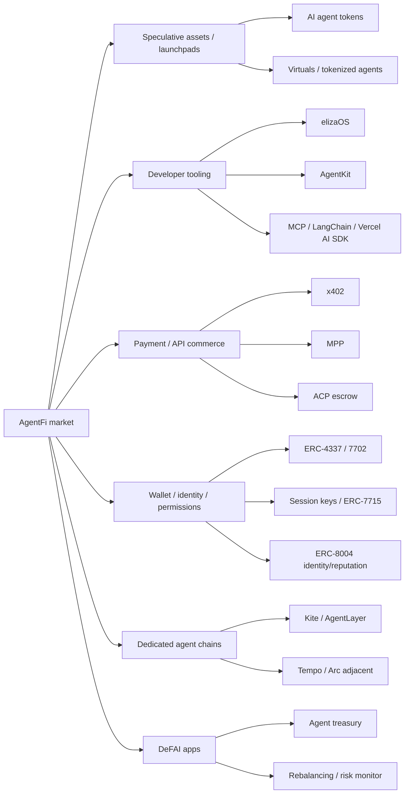
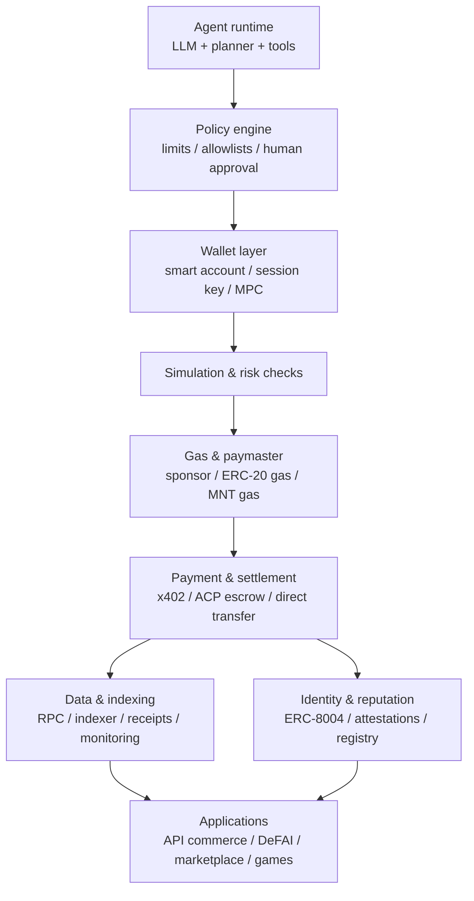
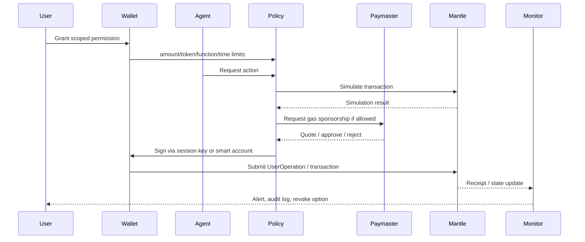

# AgentFi 叙事方向技术分析 - Draft Round 1

## 1. Executive Summary

一句话判断：AgentFi 对 Mantle 的契合度是 **中等/有条件**。它已经有清晰的市场注意力、开发者工具和早期支付协议，但真实 agent 经济活动仍明显小于 token 叙事；Mantle 可以把它作为 "EVM AgentFi settlement + yield/liquidity layer" 的可选叙事和生态实验，不应在现阶段把 AgentFi 写成主叙事。

三个机会：

- **市场注意力可用，但要降级解释**：CoinGecko AI Agents 类别在 2026-05-26 API 快照中约为 **$3.68B circulating market cap** 与 **$538M 24h volume**，Top tokens 为 Venice Token、Fetch.ai/ASI、Virtual Protocol、Kite、OriginTrail。该数字代表 token 资产热度，不代表真实 agent commerce TAM。
- **协议和工具开始出现真实入口**：x402 discovery API 在 2026-05-26 抓取到 **50,566 listed resources**、last-30-days `calls` 字段合计 **326,224**；DefiLlama Virtuals Protocol fees 快照显示 30d fees/revenue 约 **$411k**。这些数字更接近使用证据，但仍有重复计数、测试流量和口径偏差。
- **Mantle 有可切入技术面**：Mantle 具备 EVM/OP Stack 兼容、MNT gas、EigenDA/DA 成本优势、Skadi/ZK validity roadmap，以及 Etherspot/Particle 等第三方 AA 接入文档。短期可做 x402 exact payment、agent smart account/spend limit、paymaster demo 与 DeFAI treasury demo。

三个 caveats：

- **Base 和 Solana 已占据开发者入口**：Base 绑定 Coinbase AgentKit、CDP Wallet、Base Account、x402 与 Coinbase 分发；Solana 有 Solana Pay、pay-kit/MPP、低费低延迟和 SVM 支付 UX。Mantle 不能只靠 "也是 EVM L2" 夺取心智。
- **ACP/MPP/ERC-8183/ERC-8004 多数仍是早期标准或文档阶段**：x402 exact payment 有生产化 SDK/发现页和 live ecosystem；Virtuals ACP 是 demo/beta/docs；Solana MPP 是 active SDK + protocol proposal；ERC-8183 与 ERC-8004 应按 draft/experimental 处理。
- **Mantle 当前缺少第一方 AgentFi 产品面**：没有官方 agent SDK、agent registry、稳定的 paymaster/economics 包、x402/ACP settlement 示例、旗舰 AgentFi app 或可引用的 Mantle agent activity 数据。要讲 AgentFi，必须同时讲补齐路线和风险。

## 2. Item Findings

### item-1: 研究边界、术语定义与证据分级

本节将 AgentFi 限定为 "AI agent 与链上资产、钱包权限、支付/结算、服务发现、身份/信誉或 DeFi 策略执行发生可验证交互" 的集合。它不等同于所有 AI token，也不等同于 Web2 agent SaaS。

| 概念 | 本稿定义 | 纳入/排除 |
|---|---|---|
| AgentFi | agent 使用链上钱包、支付、结算或 DeFi 策略形成金融行为 | 纳入 |
| AI agent token | 以 agent/AI 为主题的 token、launchpad 或代理人格资产 | 纳入市场热度，但不直接计入真实使用 |
| agentic commerce | agent 发起、协商、支付、交付、评价服务的交易流程 | 纳入 |
| agent wallet | 由 agent runtime 控制但受策略限制的钱包或智能账户 | 纳入 |
| DeFAI | 用 agent 做组合管理、交易、风险监控、再平衡 | 纳入 |
| 纯聊天机器人 / 无链上结算 SaaS | 无链上支付、账户或结算证据 | 排除 |
| 只有 AI branding 的 meme token | 无 agent product 或链上执行证据 | 降级为 market sentiment，不作核心证据 |

证据等级按以下顺序使用：`official-primary` / `official-docs` / `open-source-code` / `onchain-data` / `market-data` / `media-reported` / `internal-research` / `inferred` / `unverified`。所有易变数据在本文中均记录访问日和口径；任何 market cap、24h volume、last-30-days calls、GitHub stars/forks 都只代表访问时点快照。

市场阶段标签：

- `narrative/speculative`：AI agent category token、agent launchpad token 与 meme-like assets。
- `developer-tooling`：elizaOS、AgentKit、x402 SDK、Solana pay-kit、AA provider docs。
- `early-product`：x402 paid API discovery、Virtuals fees、ACP demos/beta flows。
- `usage-proven`：已有可持续付费、留存、非刷量指标且口径可审计的链上 agent commerce；本文尚未找到足够强证据把整个 AgentFi 归入此阶段。
- `production-infra`：类似稳定币 rails、钱包/AA 基建、RPC/indexer SLA 的稳定生产能力；AgentFi 只局部触达，例如 x402 exact payment + facilitator/SDK，而非全栈成熟。

### item-2: 市场阶段与市场规模估算

AgentFi 的市场规模必须拆成三类：token 资产快照、协议/支付使用快照、开发者活动快照。三者不能互相替代。

#### 2.1 Volatile metrics snapshot

| 口径 | 数据快照 | 访问日 / 口径 | Evidence | Confidence | Caveat |
|---|---:|---|---|---|---|
| CoinGecko AI Agents category | Market cap 约 **$3.68B**；24h volume 约 **$538M**；24h mcap change 约 -0.08% | 2026-05-26T00:27:30Z；CoinGecko `/api/v3/coins/categories`，category id `ai-agents` | market-data | medium | 类别包含 AI/data/agent/token infra，不能等同真实 agent commerce |
| AI Agents top tokens | Venice Token ~$812M；Fetch.ai/ASI ~$523M；Virtuals ~$507M；Kite ~$450M；OriginTrail ~$181M | 2026-05-26T00:29Z；CoinGecko markets API | market-data | medium | Token market cap 波动大；FDV/circulating 口径需另查 |
| Virtuals Protocol fees | 24h ~$15.6k；7d ~$104k；30d ~$411k；all-time ~$70.5M；30d chain breakdown 主要在 Base | 2026-05-26；DefiLlama fees summary | onchain-data / protocol-data | medium | Fees/revenue 是 protocol activity proxy，不等于 ACP jobs 或 agent-to-agent payment volume |
| x402 discovery resources | Listed resources **50,566**；L30 calls 字段合计 **326,224**；called resources **39,798**；unique payers 字段合计 **72,141** | 2026-05-26T00:37:32Z；Coinbase CDP x402 discovery API paged fetch | usage-data / official API | medium-low | unique payers 是按 resource 字段求和，未跨资源去重；calls 可含测试/重复请求 |
| GitHub developer activity | elizaOS 18,455 stars / 5,550 forks / release v2.0.3 on 2026-05-20；x402 6,105 stars / 1,672 forks；AgentKit 1,239 stars / 723 forks；Solana pay-kit 59 stars / release v0.6.0 on 2026-05-20 | 2026-05-26；GitHub `gh repo view` | open-source-code | medium-high | Stars/forks 代表开发者注意力，不代表 production usage |

#### 2.2 Stage conclusion

| Segment | Current stage | 判断 |
|---|---|---|
| AI agent tokens / launchpads | `narrative/speculative` | Token 市值和交易量显著，但使用证据弱，容易被行情和 category 口径主导 |
| Agent framework / wallet SDK | `developer-tooling` | elizaOS、AgentKit、x402、Solana pay-kit、Base AI Agents 文档活跃，是最扎实的当前证据 |
| Paid API / machine payment | `early-product` | x402 discovery 有 live resources/calls；Solana MPP active SDK；但 volume、retention、真实买卖双方仍需更强链上验证 |
| Agent-to-agent commerce / ACP | `demo/beta/docs` | Virtuals ACP docs 有 escrow/evaluator/Proof of Agreement 设计和 demo，但 broad production 使用证据不足 |
| Production-grade autonomous DeFi | `early-product` 到 `unverified` | 多数案例仍是 human-in-the-loop、策略 bot 或 demo；需要安全/权限/责任边界才能进入 production-infra |

结论：AgentFi 已经不是纯概念，但仍不是成熟市场。对 Mantle 更合适的表达是 "有注意力、有可做 demo、有协议早期窗口，但需要产品化补齐才能变成可持续生态叙事"。

### item-3: 主要竞品格局

| Chain / Protocol | AgentFi 主张 | 技术栈与入口 | 分发渠道 | 使用证据 | 对 Mantle 压力 | Caveat |
|---|---|---|---|---|---|---|
| Solana | 低延迟低费 agent payment 与 consumer payment UX | Solana Pay、Token Extensions、pay-kit/MPP、x402-sdk initial、SVM、fee sponsorship | Solana Foundation、wallet/payment ecosystem | Solana Pay repo活跃；pay-kit v0.6.0；内部 Solana section 已审 | 在低费、支付 UX、agent micro-payment 上压制通用 L2 | MPP 是 protocol proposal；x402-sdk 为 initial Solana exact scheme |
| Base | EVM agent payment 默认入口 | Coinbase AgentKit、CDP Wallet、Base Account、x402、Base Skills、Flashblocks | Coinbase developer/consumer funnel | AgentKit/x402 开源活跃；x402 discovery 大量 Base/EVM resources；内部 Base section 已审 | 最强 EVM 竞品；Mantle 很难复制 Coinbase 分发 | Base docs/SDK adoption 不等同链上真实 agent revenue |
| Sui | Gasless stablecoin + object-level app infra | Sponsored tx、Address Balances、Walrus/Seal/MemWal、Move object model | Sui Stack app infra | 内部 Sui section 已审 | 在 gasless UX、asset object guardrails、app infra 上形成差异化 | 非 EVM；开发者迁移成本高 |
| Virtuals | Agent tokenization + ACP commerce layer | ACP registry、request/negotiation/transaction/evaluation、escrow、evaluator、Proof of Agreement | Virtuals token/agent ecosystem、Base 生态关联 | DefiLlama fees；ACP whitepaper/demo/beta docs | 抢占 "agent marketplace + token launchpad + commerce protocol" 心智 | ACP broad production metrics 不足；官方当前状态仍偏 demo/beta |
| AgentLayer | Dedicated agent infra / AgentChain / AgentOS 叙事 | 官方 whitepaper 侧重 agent 链、agent OS、跨 agent 协作 | 自有生态与 agent chain 叙事 | 本轮只取得官方材料入口，缺少可复核 usage data | 专用链能把 registry、wallet、marketplace 打包成默认产品 | 采用低信心处理，需进一步核验主网、开发者和交易数据 |
| Kite | Agent Passport / stablecoin settlement / agent chain 叙事 | 官方 docs/website 主张 agent-native infra、身份与结算；CoinGecko top token snapshot | 自有 token 与 agent infra branding | Kite token 位列 AI Agents top 5 market cap；官方 docs 需继续深挖 | 对 Mantle 的身份/结算叙事形成前置竞争 | Token 市值强于实际使用证据；采用低到中信心 |
| Tempo | Payment-first EVM L1 / MPP adjacent | Stablecoin gas、Payment Lane、access keys、channel reserve | Stripe/Paradigm payment narrative | 内部 Tempo section 已审 | 在 stablecoin-native machine payments 上强于通用 L2 | Mainnet/Presto 状态和 adoption 仍需按最新进展刷新 |
| Arc | Stablecoin finance L1 adjacent | USDC gas、CCTP、StableFX、compliance/finance rails | Circle ecosystem | 内部 Arc section 已审 | 在 institutional stablecoin settlement 上挤压 Mantle AgentFi 支付叙事 | AgentFi 不是 Arc 核心，但 agentic commerce 可借 stablecoin rails 外溢 |

竞品结论：Base 是 Mantle 在 EVM AgentFi 里最直接的对手；Solana 是低延迟/低费/支付 UX 标杆；Virtuals 是 agent marketplace 与 ACP 叙事锚点；Tempo/Arc 把 "机器支付/稳定币结算" 做成更清晰的支付基础设施叙事。Mantle 若进入 AgentFi，不应正面复制这些叙事，而应强调 EVM neutral settlement、DeFi/yield liquidity 与可验证账户权限。

### item-4: Agent 钱包、链上身份与账户抽象 / Session Key

AgentFi 的核心不是让 agent 持有一把热私钥，而是让 agent 在可审计策略内执行：

- **ERC-4337**：通过 UserOperation、EntryPoint、bundler、paymaster、factory 与 smart account validation，把 agent 行为从 EOA 直接签名转为可策略化账户执行。价值在于 gas sponsorship、ERC-20 gas、批量操作、多签/恢复/限额与模拟。
- **EIP-7702**：允许 EOA 设置代码/委托执行，为现有钱包用户引入临时 smart-account-like 能力。它降低迁移摩擦，但安全边界取决于钱包支持、委托代码审计、撤销路径和用户理解。
- **ERC-7579**：模块化 smart account 接口可把 validator、executor、hook、fallback handler 拆分，用于 session key、spend limit、function allowlist、rate limit 和 policy guardrail。
- **ERC-7715 / wallet permission request**：把 wallet permission 变成标准化 JSON-RPC 请求路径，适合 agent 请求 "在一段时间内、对某 token/合约/函数、在限额内执行" 的 scoped permission。
- **Session key / scoped permission**：必须包含 amount limit、token allowlist、contract/function allowlist、time window、rate limit、human approval threshold、kill switch/revocation。

Mantle 适配：Mantle 官方文档已列出 Etherspot 与 Particle Network 账户抽象集成路径。Particle 文档说明 Mantle Mainnet/Testnet 兼容，并可通过 SimpleAccount/Biconomy V2/CyberConnect 等方式执行 gasless sponsored transaction；Etherspot 教程使用 Mantle chainId 5000。这说明 Mantle 可以通过第三方 provider 补齐 AA 能力，但尚不等于 Mantle 具备官方第一方 agent wallet/paymaster SLA。

安全模型必须单独处理：

- prompt injection 诱导 agent 调用高权限 tool；
- tool-call hijack 或恶意 API response 替换交易参数；
- private-key leakage / MPC policy bypass；
- 无限授权、跨链 replay、session key 未撤销；
- agent collusion / evaluator collusion；
- 策略失败后的 chargeback、赔偿与审计责任。

因此 Mantle 的 AgentFi demo 不应从 "fully autonomous trading" 开始，而应从 human-approved execution 或 delegated scoped execution 开始。

### item-5: 低延迟、低 Gas 与执行环境需求

AgentFi 不只比较 TPS。一个 agent 执行链上任务通常包含：读链/读价格、模拟、策略判断、请求权限、签名/提交、paymaster/gas、确认/回滚、监控与对账。

| Workload | 延迟需求 | Gas/费用敏感度 | Mantle 适配判断 |
|---|---|---|---|
| API micro-payment / x402 paid request | API request/response 级，最好秒级或可异步验收 | 极高；单笔金额小，需要稳定币或 gas abstraction | 可用低费 L2 + facilitator；需要 x402 exact 支持、稳定 RPC 与 paymaster |
| Agent-to-agent service escrow | 分钟到小时级，更多关注争议处理和评价 | 中等；escrow、submit、evaluate 多笔 tx | 适合 EVM escrow 合约；需要 identity/reputation 与 evaluator 安全 |
| DeFAI rebalancing / treasury | 人类交互级到分钟级 | 中到高；multi-call 与 approval 成本敏感 | Mantle 的 DeFi/yield 资产更有叙事空间 |
| Trading / MEV-sensitive bot | 亚秒到秒级，关注 tail latency、private order flow | 高；失败交易成本和滑点关键 | Mantle 有 private tx pool/priority fee 设计，但不能直接对标 Solana 高频叙事 |
| Long-running workflow settlement | 异步结算即可 | 中等 | 适合 Mantle 作为低费结算层 |

Mantle v2 fee docs 显示费用由 L2 execution fee 与 L1 rollup fee 构成；EIP-1559 支持下推荐 base fee/priority fee 可控。Mantle 的独立 DA/EigenDA 设计可降低 batch data 成本，文档中还强调 high-gas dapps 相比原始 L1 rollup fee 可显著节省。Skadi 架构引入 ZK proving module、Ethereum DA blobs、op-batcher、ZK validity proofs、tx pool/private tx pool 与 priority fee ordering。

这支持 Mantle 讲 "可预测低成本 + EVM 合约可组合 + ZK validity roadmap"，但不能自动证明其适合所有高频 agent。AgentFi 的真实指标应包括 average/tail latency、success rate、failed tx cost、RPC rate limit、indexer freshness、finality assumptions、gas sponsorship cost 与 batching savings。

### item-6: Agent 间协作协议、支付通道与服务发现

| Protocol / Standard | Flow | Maturity label | 对 Mantle 的含义 | Caveat |
|---|---|---|---|---|
| x402 | HTTP request -> `402 Payment Required` -> signed payment payload -> facilitator/local verify -> settlement -> response | **production-like/live ecosystem** for exact payments；`upto`/batch settlement 更偏 spec/docs | Mantle 可优先做 x402 exact settlement demo 和 facilitator/plugin；不必先发明新协议 | Discovery calls/unique payers 不是去重支付量；网络标识口径不统一 |
| Virtuals ACP | Request -> Negotiation -> Transaction -> Evaluation；escrow holds payment/deliverables；Evaluator verifies Proof of Agreement | **demo/beta/docs** | 可作为 EVM escrow + evaluator + reputation 的参考设计 | ACP broad production usage 未核实；不要写成成熟标准 |
| Solana MPP / pay-kit | HTTP 402-like machine payment proposal；SDK 支持服务端/客户端、payment links、fee sponsorship、split payments、SPL/Token-2022、replay protection | **active SDK / protocol proposal** | 证明机器支付正在从 x402 扩展到多链；Mantle 可兼容而非硬分叉 | Session pay-as-you-go 未支持；生产 adoption 不明 |
| ERC-8183 Agentic Commerce | Job with escrowed budget；Open -> Funded -> Submitted -> Terminal；evaluator attests completion/rejection | **draft/experimental** | 可作为最小 EVM agent escrow 标准的观察对象 | 2026-02-25 创建，仍按 draft standard 处理 |
| ERC-8004 Trustless Agents | Identity Registry、Reputation Registry、Validation Registry；payments orthogonal | **draft/experimental** | 为 Mantle agent identity/reputation PoC 提供标准方向 | 不提供支付本身；Sybil/reputation 仍需经济设计 |
| Payment channels / streaming | Offchain vouchers/channel reserve/streaming settlement | **design option** | 高频 microcharge 可后续研究，不是 0-1 月 demo 必需项 | 状态通道 UX、liquidity lock、dispute window 增加复杂度 |

Mantle 的机会不是先做一套 Mantle-only agent protocol，而是先兼容 x402/ACP/ERC-style escrow：让 agent 支付、job escrow、评价/attestation 和 smart account permission 都能在 Mantle 上以低费结算。

### item-7: 主流 Agent 框架与链上交互模式

| Framework / Tooling | 语言 / 入口 | 钱包模型 | 支付模型 | 安全模型 | Mantle 接入成本 |
|---|---|---|---|---|---|
| elizaOS | TypeScript framework、CLI、web UI、plugins/actions/providers/services | 插件接入 EVM/Solana 等 wallet provider | 取决于插件；可接 x402/API payment | framework 层需限制 actions/tools 与 secrets | 中：写 Mantle plugin/action provider + docs/examples |
| Coinbase AgentKit | TypeScript/Python、CDP wallet、LangChain/Vercel AI SDK/MCP/OpenAI Agents SDK extensions | CDP/Privy/viem wallet providers | x402、stablecoin payments、onchain actions | CDP wallet policy + framework tool permission | 中高：可用 EVM chain config，但 Coinbase/Base 原生心智强 |
| x402 SDK | TypeScript/Rust 等 SDK 与 facilitator pattern | Client pays signed payload；server/facilitator verifies | HTTP 402 exact payment；batch/upto evolving | Payment payload verification、replay protection、settlement response | 中：Mantle 需 facilitator/network support 与 docs |
| Virtuals ACP SDK/docs | Framework-agnostic commerce flow | Agent identity + escrow wallet | Job escrow、evaluator settlement | Proof of Agreement、evaluator role、registry | 中高：需要合约/SDK/examples 与 usage source |
| LangChain / Vercel AI SDK / MCP | 通用 agent orchestration/tool-calling | 外接 wallet provider 或 MCP server | 通过 tool 接 x402/chain action | tool permissions、human approval、audit logs | 低到中：Mantle 可以提供 MCP server/skills |
| Solana/Base official agent tooling | 官方 docs、skills、wallet setup、payment examples | Chain-native wallets / CDP / Base Account / Solana keypair | Solana Pay/MPP/x402/Base payment docs | 官方示例 + wallet provider policy | 竞品强：Mantle 需要等价 "getting started" 包 |

链上交互模式可分为：read-only analytics、intent simulation、human-approved execution、delegated scoped execution、fully autonomous signing、multi-agent workflow。Mantle 最合理的第一阶段是 read-only + human-approved + scoped execution，而不是直接推 fully autonomous signing。

### item-8: Mantle 适配性评估

| Mantle 能力 | 当前状态 | 竞品差距 | 补齐方式 | 时间线 | Risk |
|---|---|---|---|---|---|
| EVM/OP Stack compatibility | 官方 docs 支持；Solidity/viem/AA provider 可复用 | Base 同样 EVM 且有 Coinbase 分发 | 建 Mantle AgentKit examples、elizaOS plugin、x402 demo | 0-1 月 | 只做 chain config 没有差异化 |
| AA / paymaster | Etherspot、Particle docs 支持 Mantle；第三方可用 | Base Account/CDP wallet 更强；Sui/Solana gasless UX 更直接 | 第一方文档、sponsored gas demo、policy template、provider SLA | 0-1 季度 | Paymaster economics 与 abuse control |
| Low fee / DA savings | MNT gas、L2/L1 fee split、EigenDA/DA savings、EIP-1559 | Solana/Tempo/Kite 可讲更强低延迟或 stablecoin-native | 强调 predictable cost + EVM composability；做 micro-payment benchmark | 0-1 季度 | RPC/indexer/finality UX 不能只靠 fee docs |
| ZK validity roadmap | Skadi/ZK proving module 与 validity proofs | zkSync/Starknet 等也可讲 ZK；Base distribution 更强 | 将 ZK 用于 institution-ready settlement，而非 agent buzzword | 中期 | Roadmap 不能替代当前产品 |
| DeFi/yield/liquidity | Mantle 有 mETH/cmETH/yield-bearing 生态叙事基础 | Base/Solana app density 更强；Arc/Tempo stablecoin positioning 更尖锐 | Agent treasury、portfolio rebalancing、yield policy vault demo | 0-2 季度 | 需要官方资产/流动性数据补证 |
| Private tx pool / priority fee | Mantle v2 docs 提到 tx pool/private tx pool/priority fee ordering | Solana/Jito/Base Flashblocks 在交易性能心智更强 | 用于 DeFAI anti-MEV / private order flow demo | 中期 | 生产 SLA 与 tooling 未证实 |
| Agent registry / reputation | 当前无第一方 AgentFi registry | Virtuals/AgentLayer/Kite 更专用 | ERC-8004-inspired PoC + attestations | 中期 | Sybil、评价造假、合规 |

建议定位：Mantle 不应说自己是 "agent-native chain"；更稳健的定位是 **EVM AgentFi settlement and yield layer**：用低费 EVM、AA/paymaster、DeFi/yield liquidity 和可验证策略账户承接 agent 的支付、托管、再平衡与结算。

短期可落地路线：

- x402 exact payment on Mantle demo：paid API request、facilitator verify/settle、USDC/USDT 或可用稳定币支付、MNT gas/paymaster。
- Agent smart account demo：Particle/Etherspot + session key/spend limit + revoke + human approval threshold。
- DeFAI treasury demo：agent 读取策略、模拟、多签/人审、在 Mantle DeFi/yield 资产中再平衡。
- Developer docs：Mantle chain config for AgentKit/elizaOS/viem、MCP server、example app、security checklist。

中期投入：

- 官方 paymaster/AA provider partnership 与 quota/SLA；
- agent registry/reputation PoC，参考 ERC-8004；
- ACP/escrow-compatible job contract，参考 ERC-8183 但明确 draft；
- stablecoin gas abstraction、x402 discovery listing、indexer/RPC freshness dashboard；
- grants/BD 争取一个旗舰 AgentFi app，而不是只发布文档。

### item-9: Mantle 挑战、不可照搬边界与差异化空间

Mantle 的主要挑战不是 "技术上能不能部署 EVM 合约"，而是 "为什么 agent 开发者不默认选择 Base/Solana/专用 Agent 链"。

| 挑战 | 影响 | 应对 |
|---|---|---|
| Base 分发与 AgentKit/x402 心智 | EVM agent developers 会自然进入 Coinbase/Base docs | 不复制 Coinbase funnel；做 Base-compatible x402 settlement + Mantle DeFi/yield extension |
| Solana 低延迟低费与支付 UX | 高频/微支付叙事上更直观 | 不拼单体 TPS；强调 EVM composability、policy accounts 与 treasury settlement |
| Sui/Kite/Tempo stablecoin/gasless/native agent infra | 这些链可把 gasless、identity、payment lane 写成一等公民 | Mantle 用 paymaster/stablecoin gas abstraction 补 UX，用 liquidity/yield 做差异化 |
| 缺少第一方 AgentFi SDK/registry | 生态项目启动成本高，叙事不尖锐 | 提供 AgentFi starter kit、MCP server、AA/paymaster docs、grant examples |
| RPC/indexer/finality UX | agent 高频调用需要可预测 SLA | 发布推荐 provider、rate limit、indexer freshness、test harness |
| 安全/责任 | agent 钱包损失会放大协议声誉风险 | 默认 scoped permission、人审阈值、revoke、audit log、policy simulation |
| 稳定币/支付伙伴证据不足 | x402/API commerce 更偏 stablecoin | 补齐官方稳定币、CCTP/bridge、paymaster 和 merchant/API partner 数据 |

差异化空间仍存在：EVM neutral settlement、mETH/cmETH/yield assets、DeFi liquidity、treasury incentives、ZK validity roadmap、agent treasury/portfolio management、跨 EVM agent operations。这些比 "Mantle 是最快 agent chain" 更可信。

### item-10: 最终评估表、契合度判断与行动建议

#### diag-1: AgentFi 最终评估表

| 维度 | 内容 |
|---|---|
| **市场阶段** | 整体处于 `narrative/speculative` + `developer-tooling` + `early-product` 混合阶段。AI agent token 已有交易热度，x402/AgentKit/elizaOS 等工具活跃，Virtuals/ACP 等 agent commerce 设计清晰，但 broad production agent economy 尚未被强证据证明。 |
| **市场规模** | 2026-05-26 CoinGecko AI Agents category 约 **$3.68B market cap / $538M 24h volume**；Virtuals Protocol DefiLlama fees 约 **$411k 30d**；x402 discovery 约 **50,566 resources / 326,224 L30 calls**；developer activity 以 elizaOS、x402、AgentKit、Solana pay-kit 为主。三类数字必须分开解释。 |
| **主要竞品** | Base 是最强 EVM 竞品，依靠 AgentKit/CDP/Base Account/x402/Coinbase 分发；Solana 依靠低费低延迟、Solana Pay、pay-kit/MPP；Sui 依靠 gasless stablecoin 与 object model；Virtuals 抢占 agent marketplace/ACP；AgentLayer/Kite 抢占专用 agent chain 叙事；Tempo/Arc 是 machine/stablecoin payment adjacent。 |
| **关键技术** | Smart account/AA、paymaster、session key/scoped permissions、wallet permission request、stablecoin/x402 payment、ACP/escrow/evaluator、identity/reputation/attestation、low-cost predictable execution、RPC/indexer freshness、policy simulation 与 audit/revocation。 |
| **Mantle 优势** | EVM/OP Stack 兼容，Solidity/viem/AA provider 可复用；MNT gas 与 EigenDA/DA 成本优势；Skadi/ZK validity roadmap；第三方 AA 文档可用；mETH/cmETH/yield 和 DeFi liquidity 可支撑 agent treasury/DeFAI settlement 叙事。 |
| **Mantle 挑战** | 缺少第一方 agent SDK/paymaster/registry/flagship app；Base 和 Coinbase 分发强；Solana/Tempo/Kite 在低延迟、stablecoin-native、agent-native 叙事更尖锐；Mantle 需要补稳定币 gas、x402/ACP examples、RPC/indexer SLA、安全 policy toolkit。 |
| **契合度判断** | **中等/有条件**。AgentFi 可以作为 Mantle 2026 叙事候选和生态实验，但当前证据不足以升为主叙事。若 0-1 月能做出 x402 + AA/paymaster + DeFAI treasury demo，1-2 季度补 SDK/partner/flagship app，契合度可从中低提升到中高。 |

内部分享可用表达：

- 一句话：AgentFi 对 Mantle 是 "可切入但不应过度承诺" 的中等契合叙事。
- 三个 proof points：AI Agents token category 有 $3B+ 注意力；x402/Virtuals/AgentKit/elizaOS 有 early product/tooling；Mantle 有 EVM+AA+低费+yields 的可落地组合。
- 三个 caveats：真实使用远小于市值；Base/Solana/Virtuals 已有更强入口；Mantle 需要先补官方工具、paymaster、registry 和旗舰应用。

行动建议：

| 时间线 | 建议 | 工程复杂度 | 证据需求 |
|---|---|---|---|
| 0-1 月 | x402 exact payment demo on Mantle；Agent smart account + spend limit + revoke demo；AgentKit/elizaOS/MCP examples；DeFAI treasury demo | 低到中 | Demo success、gas/cost benchmark、developer docs |
| 1-2 季度 | 官方 AA/paymaster partner package；x402 discovery/facilitator support；ACP/erc-style escrow PoC；stablecoin gas abstraction；grants for flagship app | 中 | Usage dashboard、partner confirmation、security review |
| 长期 | AgentFi-specific L3/appchain、privacy/TEE/ZK policy proofs、payment channels、institutional agent settlement | 高 | 市场使用验证、regulatory/security clarity、ecosystem traction |

### item-11: 风险、开放问题与事实核验清单

| 风险 / 开放问题 | 当前处理 | 后续核验 |
|---|---|---|
| AI Agents category 是否包含非 agent 项目 | 本稿仅作为 token market snapshot | 最终稿前刷新 CoinGecko/CMC，并拆出 Virtuals/Kite/FET 等组成 |
| x402 discovery 是否代表真实付费 API 使用 | 本稿按 resource/call discovery 指标降级处理 | 需要链上 settled volume、去重 payer/seller、测试流量过滤 |
| Virtuals ACP usage | 使用 DefiLlama Virtuals fees 作协议 activity proxy | 需解析官方 Dune/ACP job metrics，区分 launchpad fees 与 ACP jobs |
| Agent 是否 truly autonomous | 默认假设多数仍是 human-in-the-loop 或 scoped execution | 案例必须说明人工审批、权限边界与 revoke |
| ERC-8183/ERC-8004 成熟度 | 均按 draft/experimental | review 阶段需再次确认 EIP 状态与更新 |
| Mantle AA/paymaster 状态 | 以 Etherspot/Particle docs 证明第三方路径 | 需官方确认 provider SLA、paymaster economics、abuse control |
| Mantle stablecoin/native asset 状态 | 本稿仅作为路线与生态叙事处理 | 最终稿需补最新 Mantle stablecoin、CCTP、USDT0/AUSD/USDy/USDe 数据 |
| 安全责任 | 独立列出 prompt injection/key leakage/policy bypass | 需加入具体 audit/security sources 与 incident examples |

## 3. Diagrams

### diag-2: AgentFi 市场分层图

### diag-3: Competitor Matrix

See item-3 table above. The short ranking for Mantle pressure is:

| Rank | Competitor | Why it matters |
|---:|---|---|
| 1 | Base | EVM-native AgentKit/x402/CDP distribution; direct substitute for Mantle demos |
| 2 | Solana | Low-fee payment UX and active machine-payment SDKs |
| 3 | Virtuals | Owns agent token/ACP commerce narrative |
| 4 | Sui / Kite / AgentLayer | Non-EVM or dedicated agent-infra differentiation |
| 5 | Tempo / Arc | Stablecoin/machine-payment adjacent infrastructure |

### diag-4: AgentFi 技术栈架构图

### diag-5: Agent 钱包执行流程

### diag-6: x402 / ACP / MPP payment flow 对比

| Flow | Service discovery | Payment authorization | Settlement | Receipt / reputation | Best-fit use case |
|---|---|---|---|---|---|
| x402 exact | HTTP endpoint returns 402 requirements | Client signs payment payload | Direct/facilitator verify + settle | Payment response; app-specific logs | Paid APIs, inference, data endpoints |
| ACP | Agent registry / service offering | Negotiated job + Proof of Agreement | Escrow releases after evaluator decision | Evaluation/reputation hooks | Agent-to-agent services with deliverables |
| MPP | HTTP/payment method proposal | SDK-managed machine payment request | Solana/stablecoin payment flow | SDK/server receipts | Micro-payment APIs, payment links, fee-sponsored services |
| ERC-8183-style escrow | Job contract | Client funds budget; provider submits result | Evaluator attests complete/reject | Reason hash/attestation can feed reputation | Minimal EVM agent job escrow |

### diag-7: Mantle Fit Matrix

See item-8 table above.

### diag-8: Mantle 行动路线图

| Phase | Product | Technical deliverables | Success metric |
|---|---|---|---|
| 0-1 月 | "AgentFi on Mantle" demo pack | x402 exact demo, AA/session key, paymaster, revoke, DeFAI treasury example | Working public repo + gas benchmark + docs |
| 1-2 季度 | Developer and partner package | AgentKit/elizaOS/MCP integration, x402 discovery support, AA provider SLA, stablecoin gas abstraction | External developers ship first apps; measurable calls/tx |
| 2-4 季度 | Agent commerce primitives | ERC-8004-inspired registry, ERC-8183-like escrow, evaluator/attestation, grants | Non-test jobs, fees, active agent wallets |
| 长期 | Agent settlement specialization | L3/appchain option, payment channels, privacy/TEE/ZK policy proofs, institutional settlement | Repeat usage and differentiated Mantle-native apps |

## 4. Source Coverage

| Source group | Coverage in this draft | Key URLs / files | Confidence |
|---|---|---|---|
| Market data | CoinGecko AI Agents category and top token snapshot; DefiLlama Virtuals fees | `https://api.coingecko.com/api/v3/coins/categories`, `https://api.coingecko.com/api/v3/coins/markets`, `https://api.llama.fi/summary/fees/virtuals-protocol` | medium |
| x402 usage and docs | Discovery API paged fetch; x402 repo/docs flow and maturity | `https://api.cdp.coinbase.com/platform/v2/x402/discovery/resources`, `https://github.com/x402-foundation/x402`, `https://docs.x402.org/` | medium |
| Virtuals ACP | Commerce layer, technical deep dive, glossary | `https://whitepaper.virtuals.io/about-virtuals/commerce-layer.md`, `https://whitepaper.virtuals.io/about-virtuals/commerce-layer/technical-deep-dive.md`, `https://whitepaper.virtuals.io/about-virtuals/commerce-layer/acp-glossary.md` | medium |
| Ethereum standards | ERC-4337, EIP-7702, ERC-7579, ERC-7715, ERC-8183, ERC-8004 | `https://eips.ethereum.org/EIPS/eip-4337`, `https://eips.ethereum.org/EIPS/eip-7702`, `https://eips.ethereum.org/EIPS/eip-7579`, `https://eips.ethereum.org/EIPS/eip-7715`, `https://eips.ethereum.org/EIPS/eip-8183`, `https://eips.ethereum.org/EIPS/eip-8004` | medium-high for content; maturity subject to EIP status refresh |
| Agent framework docs/code | elizaOS, AgentKit, x402, Solana pay/pay-kit/x402-sdk GitHub metrics | `https://github.com/elizaos/eliza`, `https://github.com/coinbase/agentkit`, `https://github.com/solana-foundation/pay`, `https://github.com/solana-foundation/pay-kit`, `https://github.com/solana-foundation/x402-sdk` | medium-high |
| Base official docs/code | Base AI Agents/x402/Base Account/Skills evidence inherited from reviewed Base section and refreshed through official docs/repo pointers | `https://docs.base.org/ai-agents/index`, `https://github.com/base/docs`, `https://github.com/base/skills`, `https://github.com/base/account-sdk` | medium |
| Solana official docs/code | Solana Pay, pay-kit/MPP and Solana x402 SDK evidence inherited from reviewed Solana section and refreshed through repos | `https://github.com/solana-foundation/pay`, `https://github.com/solana-foundation/pay-kit`, `https://github.com/solana-foundation/x402-sdk` | medium |
| Sui / payment-chain context | Sui gasless stablecoin and app-infra context, Tempo/Arc payment-chain adjacent context | `202606-internal-sharing/research-sections/competitor-sui/final.md`, `payment-tempo/final.md`, `payment-ark/final.md` | medium-high as internal reviewed context |
| Dedicated agent chain context | AgentLayer/Kite treated as low-confidence competitor placeholders pending deeper primary-source validation | `https://whitepaper.agentlayer.xyz/`, `https://agentlayer.xyz/whitepaper`, `https://gokite.ai/`, `https://docs.gokite.ai/get-started-why-kite/tokenomics` | low |
| Mantle official docs | Architecture, fee mechanism, OP Stack/Ethereum differences, AA providers, RPC providers | `https://docs.mantle.xyz/network/system-information/architecture`, `https://docs.mantle.xyz/network/system-information/fee-mechanism`, `https://docs.mantle.xyz/network/for-developers/the-differences-between-mantle-op-stack-and-ethereum`, Mantle AA/RPC docs | medium |
| Internal research | Solana/Base/Sui/Tempo/Arc/narrative-analysis finals as context | `202606-internal-sharing/research-sections/competitor-solana/final.md`, `competitor-base/final.md`, `competitor-sui/final.md`, `payment-tempo/final.md`, `payment-ark/final.md`, `narrative-analysis/final.md` | high as internal reviewed context; not primary for new volatile AgentFi numbers |
| Security / wallet risk | Covered as threat model and design requirements, but not yet backed by a dedicated incident/audit source set | Requires adversarial-review follow-up on prompt injection, session-key abuse, paymaster abuse and smart-account permission incidents | low in this draft |

## 5. Gap Analysis

- **ACP metrics gap**：本稿未完成 Virtuals 官方 Dune/ACP job metrics 解析。DefiLlama Virtuals fees 是 protocol activity proxy，不能替代 ACP jobs、active wallets 或 Total aGDP。
- **AgentLayer/Kite gap**：已按专用 agent chain/identity/settlement 竞品纳入，但主网使用、开发者活跃、链上交易与真实 agent activity 证据不足。最终稿应补官方 docs 和链上数据，否则保持低信心。
- **x402 usage gap**：Discovery API 的 calls/resources 是 live ecosystem signal，但不是去重 settled payment volume。最终稿应争取补 facilitator volume、chain-level settled tx 或 seller/payer 去重口径。
- **Mantle stablecoin/yield gap**：本稿使用 Mantle yield/liquidity 作为路线判断，仍需补最新官方 stablecoin/native assets、CCTP/bridge、mETH/cmETH liquidity 与 DeFi TVL 数据。
- **AA/paymaster production gap**：Etherspot/Particle docs 证明第三方可用路径，不证明 Mantle 官方 production paymaster SLA。需要 provider confirmation、rate limit、sponsorship economics 和 abuse controls。
- **Security source gap**：本稿列出安全模型，但需要在 adversarial review 后加入更具体的 prompt injection、wallet permission、AA/paymaster abuse、session key incident/audit sources。
- **Data freshness**：所有 market/usage/developer activity 数字应在 2026-06-05 内部分享前再次刷新。

## 6. Revision Log

| Round | Change | Notes |
|---|---|---|
| 1 | Created deep draft | Produced Chinese structured research section from approved outline; separated token-market, protocol/payment usage and developer activity; labelled x402/ACP/MPP/ERC-8183/ERC-8004 maturity; concluded Mantle fit is medium/conditional. |
