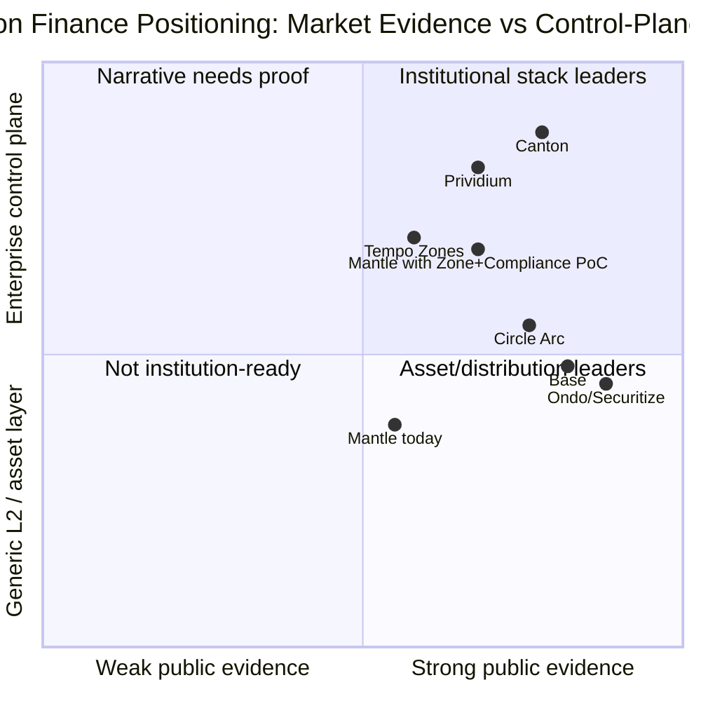
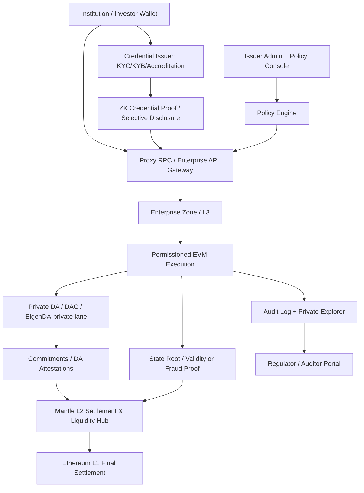
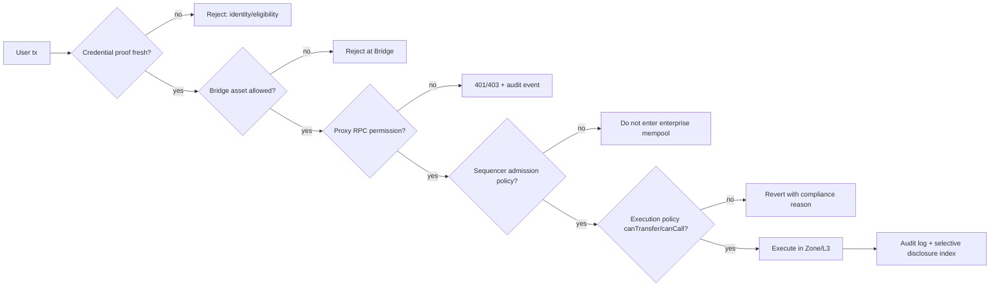
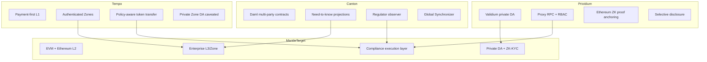
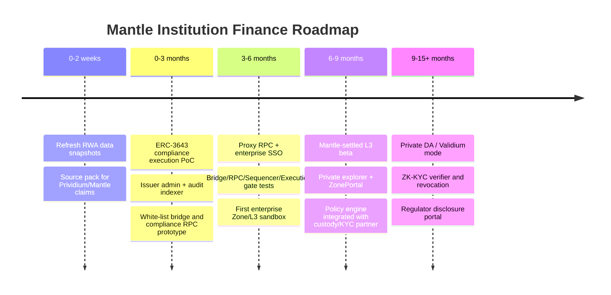
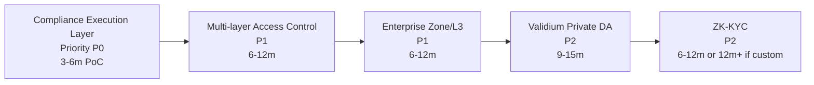

# 机构金融叙事方向技术分析 - Draft Round 1

## 1. Executive Summary

机构金融是 Mantle 值得争取的叙事方向，但不能被表述为 "Mantle 已具备机构金融全栈能力"。更准确的判断是：**叙事契合度强，短期产品成熟度中，底层合规/隐私技术完备度弱到中，必须通过分阶段 PoC 把可信证据补起来**。

RWA 市场已经从早期概念进入机构试点与局部规模化之间。按 RWA.xyz 口径，稳定币应单独处理：2026-05 的二手公开报道引用 RWA.xyz 视图显示非稳定币 tokenized RWA distributed value 约 $31B-$34B；若把 represented assets 也纳入，宽口径可到约 $406B；稳定币则是另一层现金与结算基础设施，约 $299B-$316B 量级。这个结论支持 "机构金融窗口真实存在"，但也说明市场离 mainstream adoption 仍远：非稳定币 RWA 相对全球金融资产仍是极小渗透率，且头部资产集中在国债、现金管理、黄金和部分信用产品。

机构需求不是单纯 "低费高 TPS L2"。银行、券商、资产管理人、发行方、托管人和监管方要的是一组同时成立的能力：KYC/KYB、AML/制裁筛查、投资者资格、白名单转让、Travel Rule 信息流、审计日志、监管 observer、选择性披露、数据驻留、交易对手隐私、私有 RPC/API、托管/钱包/后台系统集成和可解释的 finality。公共 EVM L2 能解决一部分可组合性和发行成本问题，但不能天然解决隐私、准入、合规证明和数据主权。

zkSync Prividium 是当前最贴近 "Ethereum-secured private institutional chain" 的对标样板。官方文档显示其组合为 Validium/private DA、Proxy RPC、SSO/SIWE、RBAC、contract/function-level permission、Selective Disclosure、L1 transaction filtering 和 Ethereum validity-proof anchoring。ZKsync 官网还宣称 35+ financial institutions validated architecture via demos，但本稿将其证据等级标为 vendor-claimed / narrative-strong：它能证明 ZKsync 在讲什么和产品边界是什么，不能单独证明 35+ 银行生产上线。

Mantle 的优势是有意义的：EVM/以太坊 L2 合法性、模块化 DA/EigenDA 经验、低费 DeFi 生态、mETH/yield 资产、USDY/mUSD RWA 集成、MI4 与 Securitize 的机构产品尝试、以及大型 Treasury/生态资源。问题也同样明确：Mantle 目前没有公开可验证的原生合规执行层、私有 Validium DA、四层准入控制、企业 Zone/L3 产品、ZK-KYC 栈或真实机构客户生产案例。也就是说，Mantle 有进入机构金融的 "基础资产和叙事资源"，但还没有 Prividium/Canton/Tempo Zones 那种可展示的完整企业控制面。

建议的最小可信路径是三阶段：

1. **0-3 个月：合规执行层 PoC**。以 ERC-3643/T-REX 风格 identity registry + compliance module 为起点，在 Mantle 上做 RWA issuer demo、白名单 bridge、合规 RPC、审计日志、issuer/admin dashboard、selective disclosure API。目标不是隐私链，而是证明 Mantle 可以承载 permissioned token lifecycle。
2. **3-6 个月：企业 Zone/L3 与多层准入 PoC**。构建 Mantle-settled enterprise L3/Zone 模板，覆盖 Bridge/RPC/Sequencer/Execution 四层准入、private explorer、operator audit 和 policy engine。目标是把公共 L2 与机构业务隔离。
3. **6-12+ 个月：Validium/private DA 与 ZK-KYC**。把敏感交易数据从公开 DA 分离，建立 private DA/DAC/EigenDA-private-lane 方案，接入 Privado ID / zkMe 类 credential proof、revocation 和监管披露。目标是从 "permissioned app" 升级到 "institution-ready settlement environment"。

最终判断：**机构金融对 Mantle 是强叙事窗口，但不是短期可无成本承诺的产品能力。** 对内部分享最稳妥的表达应是："Mantle 可以参照 Prividium 的 architecture pattern，先以 EVM/RWA/yield 生态为入口，逐步补齐合规执行层、企业 Zone、private DA 和 ZK-KYC；短期不要把 vendor demo、RWA 集成或 MI4 直接包装成银行级生产采用。"

## 2. Item Findings

### item-1: RWA 市场规模、阶段与数据口径

#### market_metric

本稿采用三层口径，避免把稳定币、distributed assets 和 represented assets 混成一个数字：

| 口径 | 2026-05 可用快照 | 是否包含稳定币 | 来源范围 | 解释 |
|---|---:|---|---|---|
| Non-stablecoin distributed RWA | 约 $31B-$34B | 不含 | 第三方文章引用 RWA.xyz 2026-05 view；RWA.xyz docs/页面用于方法论核验 | 可自由或相对自由转移的链上 RWA，是最适合与公链/L2产品关联的口径 |
| Distributed + represented RWA | 约 $406B | 不含 | Rekord 2026-05 报告引用 RWA.xyz | 包括 represented / platform-locked / permissioned 资产，更接近机构工作流曝光，但与 DeFi 可组合性距离更远 |
| Stablecoins | 约 $299B-$316B | 单独列示 | RWA.xyz stablecoin view / 第三方引用 | 是现金 leg、支付、赎回和抵押基础设施，不应并入非稳定币 RWA 来夸大证券/国债 tokenization 规模 |

来源锚点：RWA.xyz 文档说明其覆盖 tokenized assets、stablecoins、Treasuries、credit、commodities 等类别，并强调只列出把区块链作为 source of truth 的 tokenized assets；RWA.xyz 的 API/asset docs 显示其资产与聚合接口支持按 asset class、network、protocol 等维度查询。RWA.xyz 公开 treasury 页面在未登录 HTML 中显示 `as of 01/28/2026` 的 U.S. Treasuries 表：总值 $10.00B、61 assets、59,004 holders，且展示了 BlackRock BUIDL、Circle USYC、Ondo USDY、Franklin BENJI 等产品。2026-05 的更新数字来自公开报道对 RWA.xyz view 的引用：Cryptoadventure 2026-05-07 报道总 tokenized RWA value 约 $31.12B、stablecoin value 约 $299.30B；Rekord 2026-05 报告引用 RWA.xyz 称 distributed RWA value $33.7B、distributed+represented 约 $406B、tokenized Treasuries $15.35B。

#### market_stage

阶段判断：**institutional pilot -> scaling early phase**。

理由：

- 规模已明显超过概念验证阶段：非稳定币 distributed RWA 约 $31B-$34B，tokenized Treasuries 在 2026-05 宽口径报道中约 $15B 级别。
- 头部产品达到 $1B-$2B+ 级别：RWA.xyz 2026-01 public treasury snapshot 显示 BUIDL $1.88B、USDY $1.40B、BENJI $0.89B、OUSG $0.79B；2026-05 二手 RWA.xyz 引用将 BUIDL/USYC/USDY/BENJI 等头部产品继续置于 $1B-$2B+ 区间。
- 但 holder、二级流动性和 DeFi collateral 使用仍有限。很多产品是许可 investor base、qualified purchaser / Reg S / accredited investor 口径，不能等同于面向所有公链用户的无许可资产。
- 市场结构仍集中在低风险收益资产和现金管理：Treasuries、money market funds、gold 和 private credit 是主要分布；复杂证券、房地产、equities 的权利结构和二级市场更难。

#### source_anchor

| 事实 | 来源 | 快照/访问日期 | 稳定币口径 | 证据等级 |
|---|---|---|---|---|
| RWA.xyz 分类/覆盖方法 | RWA.xyz Documentation: Coverage & Classification, Taxonomy, API docs | accessed 2026-05-26 | 说明 stablecoins 为单独类别 | primary-methodology |
| U.S. Treasuries $10.00B、61 assets、59,004 holders | RWA.xyz Treasuries public page | page table says as of 2026-01-28; accessed 2026-05-26 | 不含稳定币 | primary-data-page but stale HTML snapshot |
| Total tokenized RWA about $31.12B; stablecoins about $299.30B | Cryptoadventure citing RWA.xyz | 2026-05-07 | 分列稳定币 | secondary citing primary dashboard |
| Distributed RWA $33.7B, represented $372.6B, total $406B excl. stablecoins, Treasuries $15.35B | Rekord citing RWA.xyz | May 2026 | 明确 excluding stablecoins | secondary citing primary dashboard |

**使用 caveat**：面向 2026-06-05 内部分享的 slide 不能直接固化本文数字；需要在 2026-06-04/05 用 RWA.xyz 登录导出或 API 重新抓取，并标注 selected view。

### item-2: 机构客户需求：合规、隐私、数据主权、审计与运营集成

#### institutional_requirement

机构金融需求可以拆为七类工程要求：

| 机构角色 | 核心需求 | 技术含义 | 对 Mantle 的影响 |
|---|---|---|---|
| 资产发行方 / fund sponsor | 投资者资格、申购赎回、转让限制、分红/利息、cap table 或 register | ERC-3643/identity registry、issuer admin、transfer agent API、NAV/oracle、audit trail | 短期最适合做 PoC |
| 银行 / 券商 / broker-dealer | KYC/KYB、AML、Travel Rule、制裁筛查、客户资产隔离、recordkeeping | 受信身份 issuer、policy engine、Travel Rule message/log、permissioned wallet/custody | 需要链下系统集成，不是合约能单独解决 |
| 托管人 / wallet provider | 权限、审批、MPC/HSM、地址白名单、密钥轮换、可恢复性 | enterprise wallet integration、session key、AA/paymaster、policy hooks | Mantle EVM 兼容是优势 |
| 做市商 / liquidity venue | 合规对手方、限额、订单隐私、结算 finality、风控 | private RPC、role-based execution、pre-trade checks、confidential order flow | 需要 Zone/private DA，公共主网不足 |
| 监管 / 审计方 | 可证明记录、选择性披露、不可篡改审计、合法访问 | observer role、Merkle export、selective disclosure portal、audit log retention | 需要产品级 disclosure workflow |
| 企业 treasury | 现金管理、收益、报表、ERP 对账、权限审批 | memo/reconciliation、invoice/order id、reporting API、banking/off-ramp | 可从 USDY/mUSD/mETH/yield 生态切入 |
| 跨境支付 / settlement network | 结算速度、费用、FX、Travel Rule、隐私 | payment rail、stablecoin gas UX、policy registry、zone isolation | 可借鉴 Tempo/Arc，但需明确支付边界 |

#### regulatory_sources

监管要求不是本文的法律意见，但会直接塑造技术边界：

- FATF Virtual Assets/VASP guidance and Recommendation 16/Travel Rule 要求 VASP 在虚拟资产转移中获取、保存并传输 originator/beneficiary 信息。这意味着机构链需要身份、信息传递、审计日志和 counterparty VASP 识别，而不只是地址白名单。
- ESMA/MiCA materials 显示 EU 对 crypto-asset white papers、CASP authorisation/register 和服务提供者监管有统一框架，说明面向欧洲机构时需要产品、发行人和服务提供商边界清楚。
- SEC 2026-01-28 Statement on Tokenized Securities 明确把 tokenized securities 视为以 crypto asset 形式记录/表示的 securities，tokenization 不改变 federal securities law 适用。这意味着 tokenized fund/security 在链上记录所有权时仍需要 transfer agent / broker-dealer / custody / exchange / clearing 等相关合规角色。

#### mantle_implication

Mantle 不应把 "EVM + 低费" 等同于 "机构 ready"。它可以作为工程底座，但还需要：

- 合规身份层：issuer / credential provider / ONCHAINID or VC identity。
- 策略层：可升级 compliance rules、jurisdiction、investor type、holding period、blacklist/sanctions。
- 审计层：链上事件、链下 KYC/Travel Rule proof、监管导出。
- 数据边界：哪些数据公开、哪些只给 operator、哪些可给 regulator。
- 运营集成：admin UI、custody、ERP/reconciliation、incident response、key management。

### item-3: 竞品与参考架构

#### competitor_capability

| 方案 | 核心定位 | 技术/产品能力 | 成熟度 | 证据强度 | Mantle 可迁移模式 |
|---|---|---|---|---|---|
| zkSync Prividium | Ethereum-secured private permissioned L2 / Validium | private DA/off-chain state, ZK proof to Ethereum, Proxy RPC, Okta/SIWE, RBAC, selective disclosure, L1 tx filtering | productized licensed enterprise stack; production depth未独立验证 | official docs high; 35+ institutions vendor-claimed | 架构模式最可借鉴：private chain + public proof + access control |
| Canton | 多机构金融 workflow network | Daml、need-to-know privacy、Participant/Synchronizer、observer、Global Synchronizer | 金融行业生产/准生产案例更多，但非 EVM | official/internal high; adoption metrics口径差异 | 借鉴 observer、子交易视图、监管披露，不迁移 Daml 栈 |
| Tempo Zones | 支付 L1 + enterprise private Zones | authenticated RPC、Zone isolation、encrypted deposit、policy mirroring、private DA | L1 已更成熟；Zones 仍早期，proof stub caveat | official/internal medium-high | 借鉴 Zone/L3 隔离与企业支付场景 |
| Circle Arc / Base | stablecoin / distribution / asset issuance | USDC gas、CCTP、Coinbase/Circle 分发、compliance primitives | 强分发，机构品牌强 | official/public high | Mantle 需用 yield/liquidity 和中立 L2 区分 |
| Ondo / Securitize / Franklin / BlackRock BUIDL | 资产发行与 tokenization infrastructure | tokenized treasuries、qualified investor rails、transfer agent/custody | 头部 RWA 产品成熟 | RWA/data + official filings high | 作为 Mantle 资产合作对象，而非基础链竞品 |

#### Prividium 拆解

Prividium 官方文档给出的核心是：

- 用户通过 Okta SSO 或 SIWE 认证；
- 所有调用经过 Proxy RPC；
- Proxy RPC 验证 JWT 与 wallet address，并按 contract/function/argument 权限检查；
- Admin Dashboard 管理角色与权限；
- 链运行于 Validium：state off-chain，batch 生成 ZK proof 与 state root 提交到 Ethereum；
- full RPC / explorer 只对 operator/internal systems 开放；
- auditor/regulator 可用 Selective Disclosure 查看获批数据；
- L1 forced transactions 是绕过 RPC 的风险，需要 PrividiumTransactionFilterer 类机制管控。

这对 Mantle 的核心启示是：机构 permissioning 不能只放在应用合约。只做合约白名单会被 RPC、bridge、forced inclusion、sequencer ordering、multicall、cross-chain message 等路径绕过。Prividium 把控制面放在 RPC + admin + L1 filter + private explorer + disclosure portal 组合中，这比单个 KYC 合约更接近机构产品。

#### adoption_evidence

Prividium 官网提到 "35+ financial institutions have validated the Prividium architecture" 和 cross-border payments / intraday repo live demos。本稿不将其写成 "35+ 银行生产上线"。证据等级如下：

| Claim | 本稿等级 | 理由 |
|---|---|---|
| Prividium 是 ZKsync 官方 licensed product | verified-primary | ZKsync docs/website 直接说明 |
| Validium/private DA + Proxy RPC + RBAC + selective disclosure | verified-primary | ZKsync docs 直接说明 |
| 35+ financial institutions validated architecture | vendor-claimed | 来自 ZKsync 官网/设计论文，缺少逐家机构公告 |
| 10,000+ TPS / sub-second latency / <$0.0001 tx proving cost | vendor-claimed performance | 不作为 Mantle 竞品量化事实，只作为 Prividium叙事强度 |

### item-4: Mantle 当前基线与可复用资产

#### mantle_baseline

| 维度 | Mantle 当前资产 | 证据等级 | 对机构金融价值 |
|---|---|---|---|
| EVM / Ethereum L2 | Mantle 官方网络页将其定位为 Ethereum L2 with modular architecture；开发者可复用 EVM 工具 | verified-primary | 降低发行方、托管方、DeFi/custody 集成成本 |
| EigenDA / modular DA | Mantle 2025-03 官方公告称 fully integrated EigenDA；此前 Mantle DA powered by EigenDA | verified-primary | 为未来 private DA/Validium 提供工程经验，但不是现成隐私 DA |
| RWA/yield 资产 | USDY/mUSD on Mantle 官方公告；Ondo USDY RWA.xyz 显示 Mantle network；mETH/yield ecosystem | verified-primary | 可作为企业 treasury / yield-bearing settlement 的资产入口 |
| MI4 / Securitize | BusinessWire/Securitize 报道 MI4 Fund with Securitize tokenization partner and Mantle Treasury up to $400M anchor | verified-official/press | 证明 Mantle 有机构产品尝试，但它是 tokenized fund 产品，不是合规链栈 |
| Treasury / ecosystem resources | Mantle 2025 blog 称 Treasury >$4B and on-chain finance vision | official-claimed | 能支持生态激励/BD/PoC，但不能替代产品证据 |
| ERC-3643/RWA demo | 本轮未找到公开 primary source | unverified | 只能列为内部/叙事待证实，不作为事实 |
| MIX4 | 未找到公开 Mantle MIX4 来源；可能是 MI4 误写 | unverified / possible MI4 | 若用于 slide，应改为 MI4 并引用 Securitize/Mantle press |

#### gap_baseline

Mantle 当前公开资料能支持 "institution-ready ingredients"，但不支持 "institution-ready stack already exists"：

- 没有公开可验证的 private Validium DA 产品。
- 没有原生合规执行层、policy engine 或 regulator observer。
- 没有 Prividium 式 Proxy RPC/RBAC/Selective Disclosure 产品。
- 没有企业 L3/Zone 模板的正式产品证据。
- 没有 ZK-KYC credential issuer/verifier/revocation stack。
- 没有公开机构客户生产案例；USDY/MI4 是资产/基金产品层证据，不是银行级链使用证据。

### item-5: Mantle 合规技术栈差距矩阵

复杂度估算假设：一个核心协议/infra 小组 6-10 人，能复用 OP Stack/Mantle/EVM 基础、第三方 identity/KYC provider、现有 indexer/explorer/RPC 基础设施；估算为 PoC 到可审查 beta，不等于多司法辖区生产上线。

| 技术组件 | 当前状态 | 目标状态 | 实现路径 | 复杂度 |
|---|---|---|---|---|
| Validium 隐私 DA | 部分基础。Mantle 有 EigenDA/modular DA 经验，但当前公共 L2 DA 不是机构私有 DA；敏感 payload 仍不应进入公共 DA | Enterprise L3/Zone 或 private L2 mode：交易数据留在 operator/DAC/private DA，L1/L2 只见 commitment/state root/proof；监管可授权读取 | 设计 private DA lane；定义 data commitment、DA attestation、recovery/exit、audit archive；评估 EigenDA private quorum、DAC 或 operator storage；与 validity/fraud proof 路线解耦 | very high，PoC 6-9 月，生产 12+ 月；最大风险是 DA withholding、退出、operator trust 和审计责任 |
| 合规执行层 | 弱到中。EVM 可部署 ERC-3643/T-REX 合约；有 USDY/MI4 等资产合作证据；无公开 Mantle-native policy engine | Identity Registry + Policy Engine + Audit Trail + Selective Disclosure + issuer/admin tooling，支持 ERC-3643 起点 | 先集成 ERC-3643/T-REX：ONCHAINID/claims、Compliance contract、trusted issuer registry；增加 admin dashboard、event indexer、policy simulation、审计导出；再抽象为 Mantle compliance SDK/predeploy | medium-high，PoC 3-4 月，beta 6-9 月；外部依赖是 KYC provider、legal policy 和 issuer workflows |
| 多层准入控制 | 弱。公共 RPC/bridge/sequencer/execution 默认开放；应用可白名单但绕过路径多 | Bridge -> RPC -> Sequencer -> Execution 四层准入一致；所有入口都能记录、拒绝和解释 | Bridge allowlist / asset-list；Proxy RPC/JWT/RBAC；sequencer mempool admission policy；execution precompile/modifier；L1 forced tx filter；multicall/AA/session-key bypass 测试 | high，6-12 月；最大风险是 censorship tradeoff、forced inclusion、用户体验和去中心化声誉 |
| 企业 Zone/L3 | 弱。没有公开产品化 enterprise Zone/L3；但 OP/EVM/L2 经验可复用 | Tenant/application-specific L3 settling to Mantle L2，支持 private DA、permissioned sequencer、private explorer、policy engine、ZonePortal | 基于 OP Stack/rollup-as-service 创建 L3 template；ZonePortal 控制 deposit/withdraw；每个 Zone 配置 DA、sequencer、policy、explorer、audit；用 Mantle L2 做 settlement/liquidity hub | high，PoC 4-6 月，生产 9-15 月；风险是运维成本、跨 Zone interop、finality 标签和升级治理 |
| ZK-KYC | 基本缺失。可接第三方 identity/ZK credential，但 Mantle 无公开自有栈 | Credential issuer -> holder wallet -> verifier contract/RPC policy；证明 KYC/KYB/eligibility/sanctions screening without raw PII；支持 revocation 和监管披露 | 集成 Privado ID / zkMe 类 VC+ZK proof；设计 trusted issuer registry、revocation tree、nullifier、proof freshness；把 proof 结果接入 ERC-3643、bridge/RPC policy 和 audit logs | high，6-12 月；若自研 circuits/issuer network 为 very high 12+ 月；最大风险是 issuer trust、revocation、UX 和法律承认 |

#### component_priority

优先级不是从最底层开始，而是从最能产生可信证据的组件开始：

1. 合规执行层：最快产出 RWA issuer demo。
2. 多层准入控制：把 "permissioned" 从 token 合约扩展到 chain access。
3. 企业 Zone/L3：隔离机构业务，避免污染公共 Mantle L2。
4. Validium/private DA：解决敏感数据不上公共 DA。
5. ZK-KYC：提升隐私和可组合准入，但必须建立在身份 issuer 与 policy layer 上。

### item-6: 技术路线图与分阶段落地路径

#### roadmap

| 阶段 | 时间 | 目标 | 可交付物 | 成功证据 |
|---|---|---|---|---|
| Phase 0: Evidence reset | 0-2 周 | 梳理公开可说事实和不能说事实 | RWA dashboard snapshot、Mantle RWA/MI4 source pack、Prividium evidence grading | slide 中所有数字有日期/口径；所有 adoption claim 有等级 |
| Phase 1: Compliance Execution PoC | 0-3 月 | 做出最小 permissioned RWA asset lifecycle | ERC-3643/T-REX demo、Identity Registry、Compliance Module、issuer admin、audit indexer、selective disclosure export | 可演示 whitelist mint/transfer/redeem/deny/audit；合规规则可升级 |
| Phase 2: Gated Access & Enterprise Sandbox | 3-6 月 | 把准入从 token 扩展到入口层 | Proxy RPC、JWT/SIWE/enterprise SSO、Bridge allowlist、sequencer admission mock、private explorer | 未授权 tx 在 RPC/bridge/execution 多层被拒；绕过路径有测试 |
| Phase 3: Enterprise Zone/L3 Beta | 6-9 月 | 把机构业务隔离到 Zone/L3 | Mantle-settled L3 template、ZonePortal、private DA option、policy engine、operator dashboard | 一个 RWA/payment/custody partner 可在独立 Zone 跑端到端流程 |
| Phase 4: Private DA / Validium & ZK-KYC | 9-15+ 月 | 从 permissioned sandbox 升级为 private settlement environment | DA commitment/proof、DAC/operator recovery、ZK credential verifier、revocation、regulator portal | 敏感交易不上公共 DA；KYC proof 不泄露 PII；审计可授权导出 |

#### implementation_complexity

Mantle 最不应该短期承诺的是 "bank-grade Prividium equivalent"。Prividium/ZKsync 的优势在于 ZK Stack 原生 Validium、proof pipeline、Elastic/Gateway、enterprise packaging 和 product docs 已经绑定。Mantle 若从 OP-derived / EigenDA / EVM 资产生态出发，更现实的路径是先做 **permissioned asset + compliance gateway**，再做 **enterprise L3**，最后做 **private DA + ZK compliance**。

#### impact_on_mainnet

- 公共 Mantle L2 不应默认 permissioned。机构金融能力应以 opt-in module、app-specific token、enterprise L3/Zone 或 parallel environment 存在。
- Bridge/RPC/sequencer gating 会引入 censorship tradeoff，应限制在 enterprise Zone 或 regulated app scope。
- Private DA/Validium 不应弱化公共主网退出和数据可用性承诺；必须明确与公共 Mantle L2 的安全边界不同。
- ZK-KYC 不应被包装为 "免 KYC"；它是减少 PII 披露的合规证明工具，底层 KYC issuer 仍然存在。

### item-7: 机构金融方向评估表格与契合度判断

| 维度 | 内容 |
|---|---|
| **市场阶段** | institutional pilot -> scaling early phase。RWA 非稳定币 distributed value 约 $31B-$34B（2026-05，RWA.xyz views via secondary citations），Treasuries 是最大类别；稳定币约 $299B-$316B 单独列为现金/结算层。市场已真实增长，但相对全球金融资产仍极小，尚非 mainstream adoption。 |
| **市场规模** | 窄口径：非稳定币 distributed RWA 约 $31B-$34B；宽口径：distributed+represented 约 $406B excluding stablecoins；U.S. Treasuries 2026-01 RWA.xyz public snapshot $10B，2026-05 secondary RWA.xyz citations 约 $15.35B；头部产品 BUIDL、USYC、USDY、BENJI/OUSG 在 $0.8B-$2B+ 区间，需发布前刷新。 |
| **主要竞品** | Prividium：private permissioned Validium + ZK proof + access control，架构证据强，采用/性能 claim 需降级；Canton：need-to-know privacy 和金融 workflow 标杆，非 EVM；Tempo Zones：企业隔离/支付 Zone 参考，Zones proof maturity caveat；Arc/Base：稳定币和分发强；Ondo/Securitize/Franklin/BlackRock 是资产发行基础设施。 |
| **关键技术** | Validium/private DA、合规执行层、Bridge/RPC/Sequencer/Execution 多层准入、企业 Zone/L3、ZK-KYC、Selective Disclosure、audit trail、issuer/admin tooling。关键不是单点合约，而是从身份到数据可见性到运营审计的一整套控制面。 |
| **Mantle 优势** | Ethereum L2/EVM 兼容，开发者和托管集成成本低；EigenDA/modular DA 经验可支撑 private DA 方向；USDY/mUSD 和 MI4/Securitize 显示 RWA/yield/机构产品入口；mETH/yield ecosystem 与 Treasury 可支撑流动性和 BD；公共 L2 可作为企业 Zone 的 settlement/liquidity hub。 |
| **Mantle 挑战** | 没有公开完整合规执行层、Prividium 式 Proxy RPC、私有 Validium DA、企业 Zone/L3、ZK-KYC 或生产级机构客户证据；从 PoC 到生产需要法律/BD/运营/托管/KYC provider 共同配合；public L2 与 permissioned enterprise 环境存在价值观和安全边界冲突。 |
| **契合度判断** | 分层判断：叙事契合度强；短期可验证产品契合度中；全栈技术完备度弱到中；商业采用证据弱。建议对外/内部表达为 "Mantle 可通过 RWA/yield + enterprise compliance PoC 进入机构金融"，不要表达为 "Mantle 已是 Prividium/Canton 等级企业链"。 |

### item-8: 内部分享 Section 3.3 结论包装与 caveat

#### narrative_fit

可进入内部分享的 5 个论点：

1. **RWA 市场真实，但要讲口径**：非稳定币 RWA 已是数百亿美元级，稳定币是数千亿美元级现金 leg；两者都重要，但不能混成一个数字。
2. **机构金融不是性能叙事，是控制面叙事**：机构要身份、权限、隐私、审计、选择性披露、数据主权和运营集成。
3. **Prividium 是可借鉴模式，不是 Mantle 可直接复制的现成能力**：Prividium 的价值在于 Validium/private DA + Proxy RPC + RBAC + selective disclosure + Ethereum proof anchoring 的组合。
4. **Mantle 的入口不是从零做银行链，而是从 EVM/RWA/yield 生态做最小合规产品**：USDY/mUSD、MI4、mETH 和 EigenDA/modular stack 是叙事资产。
5. **真正差距在五个组件**：Validium private DA、合规执行层、多层准入、企业 Zone/L3、ZK-KYC。短期先做合规执行层和 access gateway，长期再做 private DA 与 ZK compliance。

#### caveats

- RWA 数字必须在 2026-06-05 分享前刷新，并说明是否包含 stablecoins、represented assets、private credit 和 platform-locked assets。
- Prividium "35+ financial institutions" 只能写为 ZKsync vendor-claimed architecture validation / demos，除非找到逐家机构公告。
- Mantle "ERC-3643/RWA demo" 未找到公开 source，不应作为事实；可改写为 "Mantle 可用 ERC-3643/T-REX 作为 PoC 起点"。
- "MIX4" 未找到公开 source，建议确认是否指 MI4 / Mantle Index Four；MI4 可引用 Securitize/BusinessWire 作为 tokenized fund evidence。
- 隐私/合规不能由 ZK proof 单独解决；issuer trust、revocation、KYC provider、法律角色、审计流程仍然存在。

## 3. Diagrams

### diag-1: RWA/机构金融市场阶段与竞品地图

### diag-2: Mantle 机构金融合规技术栈目标架构

### diag-3: 多层准入控制流程图

### diag-4: Mantle vs Prividium vs Canton vs Tempo Zones

### diag-5: Mantle 分阶段路线图

### diag-6: 五组件差距矩阵视觉版

## 4. Source Coverage

### External sources

| Source | Type | Used for | Evidence note |
|---|---|---|---|
| [RWA.xyz Documentation - Home](https://docs.rwa.xyz/home) | primary methodology | RWA platform scope, API/data model | high for methodology |
| [RWA.xyz Documentation - Coverage](https://docs.rwa.xyz/methodology/coverage) and [Asset Classes](https://docs.rwa.xyz/frameworks/asset-classes) | primary methodology | stablecoin / tokenized asset classification | high |
| [RWA.xyz Documentation - Market Cap and Total Value](https://docs.rwa.xyz/methodology/market-cap-and-total-value) | primary methodology | market-cap / total-value measurement | high |
| [RWA.xyz Documentation - Assets API](https://docs.rwa.xyz/api/endpoints/assets) | primary methodology | API availability and aggregate query model | high; no API key used |
| [RWA.xyz Treasuries](https://app.rwa.xyz/treasuries) | primary dashboard page | U.S. Treasury product snapshot | high but public HTML snapshot says as of 2026-01-28 |
| [RWA.xyz USDY asset page](https://app.rwa.xyz/assets/USDY) | primary dashboard page | USDY structure and Mantle network presence | high for asset description; values may change |
| [Cryptoadventure, 2026-05-07, citing RWA.xyz](https://cryptoadventure.com/tokenized-rwa-market-crosses-31b-as-productive-collateral-takes-center-stage/) | secondary citing data | May 2026 total RWA and stablecoin values | medium; use as dated secondary |
| [Rekord State of RWA 2026](https://www.rekord.io/resources/research/state-of-rwa-2026) | secondary report citing RWA.xyz | May 2026 distributed/represented RWA and Treasuries | medium; needs refresh before slides |
| [ZKsync Prividium docs - Overview](https://docs.zksync.io/zk-stack/prividium/overview) | official docs | Prividium auth, Validium, selective disclosure | high |
| [ZKsync Prividium Proxy RPC](https://docs.zksync.io/zk-stack/prividium/proxy) | official docs | RPC access control and L1 forced tx caveat | high |
| [ZKsync Prividium product page](https://www.zksync.io/prividium) | official product page | product positioning, 35+ institution claim | high for ZKsync statement; adoption claim vendor-level |
| [ZKsync Validium docs](https://docs.zksync.io/zk-stack/customizations/validium) | official docs | DA layer and Validium stages | high |
| [Mantle EigenDA integration announcement](https://www.mantle.xyz/blog/announcements/mantle-network-eigenda) | official Mantle | EigenDA integration | high |
| [Mantle network page](https://www.mantle.xyz/network) | official Mantle | modular Ethereum L2 positioning | high |
| [Mantle USDY/mUSD announcement](https://www.mantle.xyz/blog/announcements/rwa-backed-usdy-live-on-mantle-musd-to-follow) | official Mantle | RWA-backed USDY on Mantle | high |
| [Mantle on-chain finance vision](https://group.mantle.xyz/ru/blog/announcements/innovating-the-future-of-on-chain-finance) | official Mantle | Treasury/yield ecosystem narrative | medium-high; marketing tone |
| [BusinessWire MI4 launch](https://www.businesswire.com/news/home/20250424178524/en/Mantle-Index-Four-MI4-Fund-Launches-with-Securitize-as-Tokenization-Partner-and-Mantle-Treasury-as-Anchor-Investor) | official press distribution | MI4/Securitize/Mantle Treasury anchor | high for announced product; may require browser access |
| [Securitize MI4 page](https://securitize.io/primary-market/mantle-index-four-fund) | official product page | MI4 availability | high |
| [ERC-3643 official site](https://www.erc3643.org/) | official standard org | permissioned token / ONCHAINID | high |
| [ERC-3643 Identity Registry docs](https://erc-3643.github.io/documentation/docs/suite/identity-registry/) | official docs | address -> ONCHAINID registry | high |
| [ERC-3643 Compliance Management docs](https://docs.erc3643.org/erc-3643/smart-contracts-library/compliance-management) | official docs | canTransfer / compliance module | high |
| [EIP-3643](https://eips.ethereum.org/EIPS/eip-3643) | formal standard | T-REX standard and compliance examples | high |
| [FATF Updated Guidance VA/VASP](https://www.fatf-gafi.org/content/dam/fatf-gafi/guidance/Updated-Guidance-VA-VASP.pdf) | regulatory source | Travel Rule / VASP controls | high; not legal advice; may block automated fetch |
| [ESMA MiCA page](https://www.esma.europa.eu/pl/node/201529) | regulatory source | EU MiCA register/whitepaper/CASP framing | high; not legal advice |
| [SEC Statement on Tokenized Securities, 2026-01-28](https://www.sec.gov/newsroom/speeches-statements/corp-fin-statement-tokenized-securities-012826-statement-tokenized-securities) | regulatory source | tokenized securities taxonomy and securities-law continuity | high; staff statement; may block automated fetch |
| [Privado ID intro](https://docs.privado.id/docs/introduction) | official docs | VC issuer-holder-verifier and ZK proof model | high |
| [Privado ID circuits docs](https://docs.privado.id/docs/verifier/circuits/) | official docs | selective disclosure, revocation, nullifiers | high |
| [zkMe zkKYC docs](https://docs.zk.me/hub/what/zkkyc) | official docs | zkKYC workflow and regulator key-shard model | medium-high |

### Internal research reused

| Internal section | Path | Reused conclusion |
|---|---|---|
| enterprise-canton | `202606-internal-sharing/research-sections/enterprise-canton/final.md` | Canton need-to-know privacy, observer roles, adoption evidence caveats |
| enterprise-privacy | `202606-internal-sharing/research-sections/enterprise-privacy/final.md` | privacy boundary before cryptography; Validium/private DA and Zone isolation as short/mid-term enterprise path |
| competitor-zksync | `202606-internal-sharing/research-sections/competitor-zksync/final.md` | ZKsync OS/Airbender/Prividium activity and enterprise caveats |
| payment-tempo | `202606-internal-sharing/research-sections/payment-tempo/final.md` | Tempo Zones authenticated RPC, private Zone caveats, payment-policy lessons |
| narrative-analysis | `202606-internal-sharing/research-sections/narrative-analysis/final.md` | competitive narrative map across Solana/Tempo/Arc/Base/OP/Arbitrum/ZKsync/Canton |

### Source requirement coverage

| Requirement | Coverage | Notes |
|---|---|---|
| src-1 on_chain_data | partial-to-sufficient for draft | RWA.xyz direct public pages + secondary May 2026 citations; no API key export. Must refresh before 2026-06-05 slides. |
| src-2 official_docs | full | ZKsync, Mantle, ERC-3643, RWA.xyz, Privado/zkMe, regulatory docs covered. |
| src-3 internal_research | full | Five prerequisite final sections reused. |
| src-4 industry_reports | partial | Rekord/Cryptoadventure secondary data plus BusinessWire/Securitize; no deep BCG/McKinsey/Citi forecast review in this standard pass. |
| src-5 regulatory_sources | partial-to-sufficient | FATF, ESMA MiCA, SEC tokenized securities; not legal opinion. |
| src-6 code_or_architecture_analysis | partial | Relies on internal prior code/architecture research for Prividium/Tempo/Mantle baseline; no fresh external repo code review. |
| src-7 adoption_evidence | partial | Prividium 35+ and Mantle ERC-3643/MIX4 claims downgraded where public evidence is weak or absent. |

## 5. Gap Analysis

1. **RWA live data gap**：RWA.xyz public app exposes some stale unauthenticated table snapshots and live app data is better accessed via account/API. This draft uses dated secondary May 2026 citations and flags refresh as mandatory.
2. **Prividium adoption gap**：Official ZKsync materials support architecture and vendor claims, but not independent bank-by-bank production verification.
3. **Mantle ERC-3643 demo gap**：No public primary source found for a Mantle ERC-3643/RWA demo. Do not use as factual evidence unless internal source is supplied.
4. **MIX4 ambiguity**：No public Mantle "MIX4" source found. MI4 is publicly evidenced and likely relevant; confirm naming before slides.
5. **Workload estimates are architecture estimates**：Complexity ranges assume a focused infra team and third-party identity/KYC integration. Production across jurisdictions could materially exceed estimates.
6. **No legal advice**：Regulatory sources are used to infer technical requirements, not to provide jurisdiction-specific legal conclusions.

## 6. Revision Log

| Round | Change | Rationale |
|---|---|---|
| 1 | Initial deep draft generated from approved outline | Covers all eight outline items, required evaluation table, five-row Mantle compliance stack matrix, diagrams, source coverage and guardrail caveats. |
