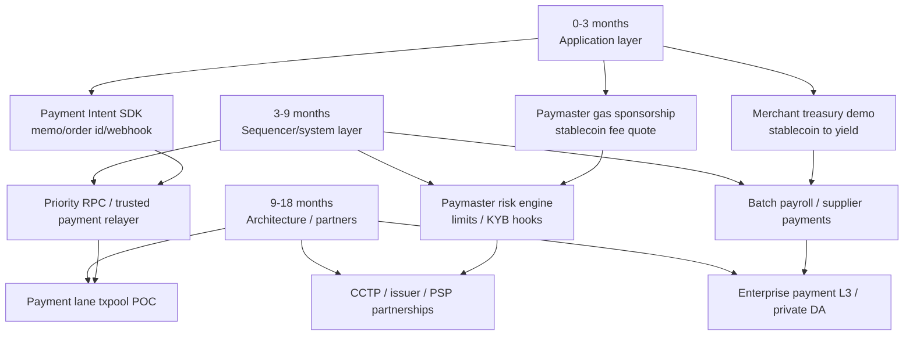

# Payment Chain 叙事方向技术分析

## 1. Executive Summary

对 Mantle 来说，Payment Chain 不应被包装成"马上与 Tempo / Arc 正面竞争的通用支付链"。更稳健的判断是：**稳定币支付市场的链上供给已经明显加速，但真实支付 adoption 仍由 Web2 支付公司、发行方、银行、PSP、托管和 off-ramp 网络分发；Mantle 更适合先切 B2B / treasury / merchant settlement，而不是零售 C2C 或 POS checkout。**

本稿的核心结论：

1. **市场阶段：早期商业化，而非成熟支付替代。** 2026-05-26 DefiLlama stablecoins API 快照显示全网稳定币流通规模约 **$320.7B**；Circle 2026 Q1 财报披露 USDC 季度链上交易量 **$21.5T**、期末流通 **$77.0B**。但 Visa Onchain Analytics 明确区分 total / adjusted / retail-sized stablecoin transactions，并说明需要剔除 bot 和人为放大量；因此不能把链上稳定币总转账量直接等同于真实支付 volume。
2. **竞品压力来自垂直整合，而不是单点性能。** Tempo 把 stablecoin gas、Payment Lane、memo / reconciliation、合规策略和亚秒 BFT 终局性打成 payments-first L1；Arc 把 USDC 原生 Gas、CCTP、StableFX、CPN 和 Circle 发行方关系打成 stablecoin finance L1；Sui 把 gasless stablecoin free tier、Address Balances、SDK 和托管/支付伙伴叙事打成 programmable payments UX。Mantle 的 EVM/L2 优势真实存在，但支付叙事锋利度弱于上述垂直项目。
3. **Mantle 的短期可行路径在应用层和 sequencer policy，不在共识层重构。** Paymaster / AA / EIP-7702 / merchant-sponsored gas、payment intent SDK、memo / order id、webhook、批量付款和稳定币计价 fee quote 都可以先做。Payment Lane 可做 priority RPC / trusted relayer / sequencer policy POC，但协议级 gas 分区和抗滥用规则会进入 OP Stack / op-geth / builder 改造区，不能写成轻量功能。
4. **B2B / treasury 是最适配子场景。** B2B invoice settlement、供应商付款、merchant treasury 和 payroll / batch payment 对退款、消费者保护、线下 POS 和强监管牌照的依赖低于 retail checkout；Mantle 的 DeFi / yield / mETH / cmETH / 流动性层可以把"支付后的资金管理"变成差异化。
5. **最终契合度建议拆分：B2B/treasury 为中-强，merchant treasury / batch payment 为中，agent micropayment 为中-观察，retail checkout 和 C2C remittance 为弱-中。** 对 Payment Chain 整体给单一"强"会过度乐观；Mantle 缺少原生发行方、CCTP 官方支持、Web2 merchant network、on/off-ramp、合规/对账标准和亚秒硬终局证据。

## 2. Item Findings

### item-1: 市场阶段与稳定币支付规模校准

稳定币已经是大规模链上结算资产，但"支付市场"需要从链上 transfer volume 中拆出来。全网供应量、USDC 交易量、Visa adjusted transaction 方法论和支付公司/发行方参与信号共同说明：供给侧 rails 已经很强，需求侧仍处早期商业化。

#### 支付市场证据表

| 证据对象 | 指标 / 结论 | source_date | accessed_at | evidence_confidence | caveat |
|---|---:|---|---|---|---|
| 全网稳定币供应 | DefiLlama stablecoins API 快照约 **$320.7B**，其中 USDT 约 $189.4B、USDC 约 $76.4B | 2026-05-26 API snapshot | 2026-05-26 | verified-data | 第三方聚合，口径随资产/链收录变化 |
| Mantle 稳定币供应 | DefiLlama chainCirculating 快照约 **$557.8M**，USDT 约 $364.5M、USDe 约 $123.1M、USDC 约 $35.7M | 2026-05-26 API snapshot | 2026-05-26 | verified-data | 反映链上资产规模，不等于支付 volume 或 Circle 原生 USDC |
| USDC 规模与周转 | Circle Q1 2026 财报：USDC 期末流通 **$77.0B**，Q1 onchain transaction volume **$21.5T**，同比 +263% | 2026-05-11 | 2026-05-26 | verified-primary | Circle 口径是 onchain transaction volume，不拆真实支付、交易所、做市、DeFi |
| 稳定币 adjusted volume 方法论 | Visa Onchain Analytics 提供 total / adjusted / retail-sized 视图，并说明剔除 bot 和人为膨胀 activity 的必要性 | dashboard live 2026-05-26 | 2026-05-26 | verified-primary | 页面可访问但本稿未直接导出底层数值；用于口径约束 |
| Remittance 痛点 | World Bank RPW 是跨境汇款费用权威来源，G20 目标长期要求降低成本、提升速度和透明度 | RPW / World Bank active dataset, accessed 2026-05-26 | 2026-05-26 | verified-primary | RPW 官网摘要 6.36% 已在市场规模证据表引用；最新 PDF / annex 的逐页精细数据未完整解析 |
| 支付公司进入 | Stripe / Tempo、Circle / Arc、PayPal / PYUSD、Visa stablecoin settlement、Coinbase / Base 共同强化 Web2 分发 | 2025-2026 official announcements / internal sections | 2026-05-26 | official-announcement | partner / product launch 不等于长期生产 volume |

#### 市场规模与支付痛点量化证据

| 指标 | 数据 | source_date | accessed_at | evidence_confidence | caveats |
|---|---:|---|---|---|---|
| 跨境支付市场规模估算 | McKinsey 估算 2024 年全球 cross-border payment flows 约 **$179T**，其中 lower-value flows 约占 **10%**（约 **$18T**）；FXC Intelligence 公开摘要估算 B2B cross-border payments **$39.3T(2023) -> $56.1T(2030)** | McKinsey 2025-04-25; FXC Intelligence public summary 2023-04-27 | 2026-05-26 | industry-report | McKinsey/FXC 为行业估算，口径不同：total flows / lower-value / B2B payment value 不能直接相加；FXC 原始报告需订阅，本稿用公开摘要数字 |
| 传统跨境汇款成本基准 | World Bank RPW 官网摘要显示全球发送小额跨境汇款平均成本为 **6.36%**，并提示 September 2025 report / Q3 2025 report and annex 可下载 | RPW homepage last update 2025-08-18; Q3 2025 report available | 2026-05-26 | verified-primary | 未全量解析最新 PDF / annex；引用官网摘要页作为最新可访问基准，适合作 remittance pain baseline，不代表 B2B 大额企业支付费率 |
| B2B 跨境结算延迟基准 | Swift 2024 speed update 称 Swift 网络上 **90%** cross-border payments reach destination bank within **1 hour**，但只有 **43%** reach end-customer account within **1 hour**；Swift GPI 产品页另称近 **60%** GPI payments 在 **30 分钟**内 credited to end beneficiaries、几乎 **100%** 在 **24 小时**内完成 | Swift speed update 2024-10-17; Swift GPI live page accessed 2026-05-26 | 2026-05-26 | verified-primary | Swift 口径覆盖 Swift 网络 / GPI，不覆盖所有企业付款；destination bank 与 end-customer credit 不同，beneficiary leg、合规审核、当地清算、cut-off、收款行处理和失败重试仍会造成延迟 |
| 稳定币支付市场渗透率估算 | McKinsey / Artemis 估算当前真实 stablecoin payment volume annualized 约 **$390B**，约占全球支付量 **0.02%**；其中 B2B stablecoin payments 约 **$226B/年**，约为全球 B2B payment volume **0.01%**，global payroll / remittances 约 **$90B/年**、低于该分段 **1%** | McKinsey / Artemis 2026-02-18 | 2026-05-26 | industry-analysis | 这是 true-payment activity 估算，非链上总转账量；必须与 Circle Q1 2026 USDC onchain transaction volume **$21.5T** 和 Visa adjusted methodology 分开，不能把链上总转账量等同支付渗透 |

阶段判断：Payment Chain 处在 **"基础设施供给快速建设 + 早期商业化验证"**。一方面，稳定币供应和链上交易量足以支撑 infra 叙事；另一方面，真实支付 adoption 的核心瓶颈仍是 off-ramp、商户关系、合规、退款/争议处理、税务和对账，而不是单纯链上吞吐。

### item-2: 传统跨境支付痛点与链上支付可替代边界

链上 rails 能改善的是 **资金移动速度、可编程性、全天候结算、透明状态、批量自动化和跨链/跨资产 composability**。它不能自动解决 KYC/KYB、AML/sanctions、消费者保护、chargeback、税务、发票、当地银行账户、PSP 合约、外汇牌照和商户结算。

| 痛点 | 链上稳定币能改善 | 仍依赖 Web2 / 金融机构 | Mantle 初期适配 |
|---|---|---|---|
| 跨时区与银行工作日 | 24/7 链上转账、快速 UX confirmation | 法币入出金、银行账本最终性、合规审核 | B2B / treasury 比 retail 更适合 |
| 手续费与 FX spread | 稳定币转账低链上费、可路由 DeFi liquidity | fiat FX、local payout、PSP/银行费率 | 可做 stablecoin treasury / RFQ demo |
| 透明度与状态跟踪 | tx hash、event、memo/order id、webhook | invoice、ERP、退款、失败重试、争议流程 | SDK + reconciliation 是短期重点 |
| 资金预置 | 稳定币余额和链上 liquidity 可降低部分 nostro 需求 | local bank float、监管资本、发行方 redeem | 适合企业资金管理叙事 |
| 风控与合规 | policy registry、allowlist、合约限额、审计日志 | KYC/KYB、AML vendor、sanctions screening、牌照 | 需 partner，不应由 L2 单独承诺 |

B2B invoice、merchant treasury、供应商付款和 payroll 的共同点是：付款双方身份更可控、支付频率/金额更稳定、可以接受 API/后台工作流，且退款/消费者保护压力低于零售。因此它们是 Mantle 更现实的 Payment Chain 切入口。

### item-3: 主要竞品与采用数据

本节只做 Mantle 视角下的合成比较；Tempo、Arc、Sui、Canton 的技术深挖见既有 final sections。

#### 竞品与采用证据表

| 方案 | 阶段 / 网络状态 | 支付定位 | 公开采用 / 信号 | source_date | accessed_at | evidence_confidence | 对 Mantle 压力 |
|---|---|---|---|---|---|---|---|
| Tempo | Existing internal `payment-tempo/final.md` 记录 mainnet / Presto 线路、状态页 operational、Payment Lane 和 stablecoin gas；生产交易量未量化 | payments-first EVM-compatible L1 | Stripe + Paradigm，设计伙伴 / partner logo；Payment Lane 和 TIP-20/TIP-403 是协议级支付原语 | internal final source date 2026-05-22 | 2026-05-26 | existing-research + verified-primary | finality、payment lane、stablecoin gas、merchant network |
| Circle Arc | `payment-ark/final.md` 记录测试网、主网 beta 预计 2026 夏季；Circle Q1 2026 披露 Arc token presale $222M @ $3B FDV | USDC-native stablecoin finance L1 | Circle pressroom: public testnet 100+ institutions；Circle Q1 2026: USDC $77B、Q1 volume $21.5T | 2026-05-11 / internal final 2026-05-23 | 2026-05-26 | verified-primary + existing-research | issuer ownership、USDC gas、CCTP、StableFX、CPN |
| Sui | `competitor-sui/final.md` 记录 v1.71-v1.72 gasless stablecoin PR/release train | programmable payments / gasless UX | Gasless stablecoin transfers、Address Balances、allowlisted stablecoins、RedotPay/Fireblocks caveated signal | internal final source window 2026-02-23..2026-05-23 | 2026-05-26 | existing-research + official-announcement | native UX、Move/object model、custody/payment partner |
| Base | General EVM L2，Coinbase 分发；可通过 paymaster / Flashblocks / onchain commerce 叙事承接支付 | onchain commerce and consumer distribution | Coinbase ecosystem、USDC liquidity、Paymaster / smart wallet / app distribution | internal narrative window 2026-02-24..2026-05-24 | 2026-05-26 | existing-research | Web2 distribution、wallet/account UX、USDC liquidity |
| Solana | 高吞吐通用 L1，PayFi、consumer、stablecoin / card rails 叙事强 | high-throughput payment / PayFi / consumer rails | Solana Pay、USDC/PYUSD、consumer wallet/card integrations，DeFiLlama TVL snapshot约 $5.42B | 2026-05-26 API snapshot + internal narrative | 2026-05-26 | verified-data + existing-research | latency/fee narrative、consumer ecosystem |
| Canton | Public L1 privacy network / institutional workflow network | institutional settlement, DvP, tokenized collateral | `enterprise-canton/final.md` 记录 Broadridge DLR、DTCC、JPM Kinexys intention 等机构信号；vendor network metrics需谨慎 | internal final source date 2026-05-22 | 2026-05-26 | existing-research | institutional trust、privacy、workflow semantics |
| Mantle | Ethereum-aligned L2；DefiLlama TVL snapshot约 $229.6M，stablecoins约 $557.8M | potential payment + treasury settlement layer | UR / DeFi / yield / modular DA / low fee；未见 Circle CCTP docs 支持 Mantle | 2026-05-26 API snapshot | 2026-05-26 | verified-data + inferred | 需从应用层补 payment UX 和 partners |

### item-4: 终局性要求：L2 软确认、preconfs 与 BFT 硬终局

支付讨论里最容易混淆的是"用户看到成功"、"商户可以放行"、"链上资金不可重组"和"法币清结算完成"。Tempo / Arc 的亚秒 BFT 终局性主要改善链上资金状态确定性；Mantle 的 L2 soft confirmation / preconf 路径主要改善 UX 和低额风险放行，但不能替代 Ethereum L1 finality 或 withdrawal / challenge 语义。

| 场景 | 需要的确认层级 | Tempo / Arc 优势 | Mantle 当前/可补救 | 结论 |
|---|---|---|---|---|
| Retail POS / 高即时放行 | 亚秒 UX + 商户风控 + 低重组风险 + 退款机制 | BFT hard finality 更适合"刷卡式"体验 | preconf + risk limit 可覆盖小额，但缺退款/PSP闭环 | Mantle 弱-中 |
| Online merchant checkout | 秒级 UX、订单状态、失败重试、webhook | hard finality + stablecoin gas 方便 | L2 soft confirmation + merchant policy 可行；需 SDK | Mantle 中 |
| B2B invoice | 分钟级到小时级通常可接受，重视对账与合规 | finality 优势不如 UX / API 重要 | L2 足够；可等待更多确认；重心在 API/对账/off-ramp | Mantle 中-强 |
| Treasury transfer | 大额需多签、风控、确认数、审计 | BFT finality 有帮助 | 可用限额、多签、延迟放行、risk reserve | Mantle 中 |
| Payroll / batch payment | 批量、失败重试、收款方 UX | fee predictability 重要 | Paymaster + batch contract + memo 可先做 | Mantle 中 |
| Agent / micropayment | 低费、低延迟、自动授权 | Arc nanopayment / Tempo MPP 叙事更强 | 可做 access key / session key / paymaster demo | Mantle 中-观察 |

工程含义：Mantle 不需要为了支付叙事立即追求 BFT L1 化。更现实的路线是 **preconf SLA + merchant risk policy + stablecoin paymaster + payment intent SDK**。只有当目标是高频零售 POS 或强 SLA merchant acquiring 时，才需要更重的 sequencer slashing、fast-finality gadget 或专用 payment zone。

### item-5: 原生稳定币 Gas、Paymaster 与账户体验

Tempo 和 Arc 的共同叙事是"用户不需要持有波动 gas token"。Sui 的 gasless stablecoin transfers 则证明通用链也可以把稳定币转账 UX 做得非常窄而强。Mantle 作为 EVM L2，最不应做的是替换 ERC-20 稳定币标准；最应先做的是 paymaster / AA / merchant-sponsored gas。

| 能力 | Tempo / Arc / Sui 实现 | Mantle 可实现路径 | 工程量 | 风险 |
|---|---|---|---|---|
| 用户无需 MNT/ETH gas | Tempo stablecoin gas；Arc USDC Gas；Sui gasless free tier | ERC-4337 Paymaster、EIP-7702、trusted relayer、merchant gas tank | 低-中 | Paymaster 资金池、DoS、滥用、失败重试 |
| 稳定币计价 fee quote | Arc USDC gas + EWMA；Tempo attodollars | 前端/SDK 给稳定币估价，后台换算 MNT/ETH gas | 低 | 拥堵时 quote 失效，商户补贴成本波动 |
| memo / order id / reconciliation | Tempo TIP-20 memo；传统 PSP 标准化 webhook | PaymentIntent 合约/SDK、event schema、merchant API | 低 | 标准不统一、索引器可靠性 |
| 批量付款 | Tempo batching / access key；Sui PTB | batch payment contract + AA session key | 低-中 | 部分失败、nonce、合规拒绝 |
| 权限/限额 | Tempo access keys / validity windows；AA session keys | passkey / P256 / WebAuthn wallet + spending policy | 中 | key recovery、权限泄漏 |
| 多币种费用 | Arc Paymaster + StableFX | Paymaster 支持 USDT/USDC/USDe，后台聚合 swap | 中 | 流动性、滑点、监管 |

建议优先级：

1. **0-3 个月**：稳定币 Payment Intent SDK、merchant demo、paymaster gas sponsorship、memo/order id、webhook、failed payment retry。
2. **3-9 个月**：system contract / predeploy 级 fee quote、paymaster risk engine、batch payroll、merchant treasury dashboard。
3. **9-18 个月**：协议级 fee market 或 stablecoin gas 抽象研究；只有在 product-market fit 明确后推进。

### item-6: Payment Lane、优先级通道与 Mantle Sequencer 改造可行性

Payment Lane 的本质不是"私有 mempool"，而是 **支付交易获得保留 blockspace / gas budget**。Tempo 的 `System / Payment / General` 分区和 `general_gas_limit` 让稳定币支付在通用合约拥堵时仍可被纳入区块。Mantle 可以借鉴，但要分层推进。

| Mantle 实现层 | 做法 | 收益 | 工程量 | 风险 | 是否建议 |
|---|---|---|---|---|---|
| 应用层 | merchant SDK、relayer、priority RPC、付款重试 | 最快验证支付需求 | 低 | 不能保证协议级容量 | 立即做 |
| Sequencer policy | trusted payment relayer allowlist、payment tag、soft reservation | 拥堵时改善支付纳入概率 | 中 | 公平性、审查、DoS、分类绕过 | POC |
| Txpool / payload builder | gas budget 分区、无状态 payment classifier、paymaster lane | 接近 Tempo Payment Lane | 高 | OP Stack 兼容、MEV、抗滥用、审计 | 需产品信号后做 |
| 协议/治理层 | 公开 SLA、slashing / bond、参数治理、监控 | 可销售的 payment SLA | 高 | 法律责任、运营责任 | 长期 |
| 企业 payment zone | L3 / appchain，permissioned sequencer，私有 DA | B2B/机构隔离和合规更强 | 高 | DA/退出/运营信任 | 长期可选 |

关键判断：对于 B2B invoice、treasury 和 payroll，Paymaster + SDK + risk policy 通常比 Payment Lane 更优先；对于 retail checkout / agent micropayment，在拥堵环境下 Payment Lane 才成为差异化。

### item-7: 法币 On/Off Ramp、Web2 分流与商业闭环

"支付需要通过 Web2 企业分流"这一论点成立。支付不是用户把 USDC 从 A 地址转到 B 地址这么简单，而是 payer / merchant / PSP / bank / issuer / compliance vendor / ERP 共同完成的业务闭环。

```mermaid
flowchart LR
  Payer[用户 / 企业付款方] --> OnRamp[On-ramp / Mint / Bank / Exchange]
  OnRamp --> Wallet[钱包 / AA / 托管 / UR-like account]
  Wallet --> Intent[Payment Intent SDK\namount / token / memo / invoice id]
  Intent --> Chain[Mantle settlement\npaymaster / preconf / batch]
  Chain --> Liquidity[DeFi liquidity / FX / yield\nmETH / cmETH / stable pools]
  Liquidity --> OffRamp[Off-ramp / PSP / Circle Mint / local payout]
  OffRamp --> Merchant[商户 / 供应商 / 员工 / treasury account]
  Merchant --> Recon[ERP / invoice / tax / refund / audit]
  Recon --> Intent

  Web2[Stripe / Circle / Visa / PayPal / Coinbase / Fireblocks / banks / PSPs] -.distribution, compliance, merchant relation.-> OnRamp
  Web2 -.custody, risk, payout.-> OffRamp
  MantleGap[Mantle gaps:\nCCTP native status / merchant API / off-ramp / compliance / dispute handling] -.needs partners.-> Web2
```

Mantle 可以控制链上结算、gas UX、支付 intent、批量付款、DeFi/yield 和部分风控策略；无法单独控制本地法币账户、支付牌照、退款争议、商户合同和银行卡/银行网络。因此，Payment Chain 叙事需要明确 partner-led go-to-market。

### item-8: Mantle 适配性评估与 B2B 子场景

#### Mantle 子场景契合度矩阵

| 子场景 | Mantle 优势 | 主要挑战 | 所需能力 | fit_assessment | source_date | accessed_at | evidence_confidence |
|---|---|---|---|---|---|---|---|
| B2B invoice settlement | EVM/L2、低费、DeFi liquidity、可等待确认、对账可 API 化 | off-ramp、KYB、ERP、供应商法币收款 | Payment Intent SDK、memo、paymaster、KYB/off-ramp partner | 中-强 | 2026-05-26 synthesis | 2026-05-26 | inferred from evidence |
| Merchant treasury settlement | 支付后资金可进入 yield / liquidity 管理 | merchant acquiring 和 fiat settlement 仍在链下 | merchant dashboard、stablecoin routing、yield policy | 中-强 | 2026-05-26 synthesis | 2026-05-26 | inferred |
| Payroll / batch payment | 批量合约、AA/session key、低费 | 税务、身份、失败重试、本地 off-ramp | batch payment + paymaster + CSV/API + compliance partner | 中 | 2026-05-26 synthesis | 2026-05-26 | inferred |
| Online merchant checkout | 可用 L2 soft confirmation + paymaster 实现体验 | 退款、chargeback、PSP、settlement SLA | checkout SDK、risk reserve、payment status webhook | 中 | 2026-05-26 synthesis | 2026-05-26 | inferred |
| Agent / micropayment | AA、session key、低费可做 demo | Arc/Tempo 叙事更强，经济性需实测 | access key、spending limits、nano-fee model | 中-观察 | 2026-05-26 synthesis | 2026-05-26 | inferred |
| Retail POS | 低延迟 UX 可以做小额试点 | 亚秒硬终局、退款/争议、merchant network 缺失 | preconf SLA、PSP partner、risk rules | 弱-中 | 2026-05-26 synthesis | 2026-05-26 | inferred |
| C2C remittance | 稳定币 rails 可用 | 钱包、gas、on/off-ramp、合规、local payout | consumer wallet + local payout network | 弱-中 | 2026-05-26 synthesis | 2026-05-26 | inferred |

Mantle 优势需要写具体：

- EVM/L2 与 Solidity 工具链降低应用和资产迁移成本。
- DeFi / liquidity / mETH / cmETH / yield 生态可承接"支付后资金管理"，这是 Tempo / Arc 不一定拥有的开放 DeFi 优势。
- Paymaster / AA / SDK 可以低成本补支付 UX，不必先改共识。
- 模块化 DA / 低费 / 高吞吐路线适合 batch settlement。
- 企业 privacy / L3 / validium 路线可作为长期 B2B 结算加分项，参考 `enterprise-privacy/final.md` 和 `enterprise-canton/final.md`。

Mantle 挑战也要写具体：

- L2 soft confirmation 与 Tempo / Arc BFT 硬终局存在结构差距。
- Circle CCTP supported chains / USDC primary docs 在既有 Arc section 中未列出 Mantle；因此不能把 Mantle 写成 Circle-native USDC / CCTP chain。
- 缺少 Stripe/Circle/Coinbase/Visa 级 Web2 分发。
- 缺少 payment-specific blockspace、merchant API、refund/dispute、invoice/reconciliation 标准。
- 支付 adoption 的关键链外能力需要合作伙伴和合规投入，非工程单点能解决。

#### Mantle network-state evidence table

| Mantle 相关能力 | 当前可写状态 | source_date | accessed_at | evidence_confidence | draft implication |
|---|---|---|---|---|---|
| 稳定币资产底座 | DefiLlama stablecoins API 显示 Mantle 稳定币约 $557.8M；可作为支付/treasury 资产底座的市场 context | 2026-05-26 API snapshot | 2026-05-26 | verified-data | 可支持 treasury / settlement 叙事，但不能证明支付 adoption |
| TVL / DeFi liquidity | DefiLlama chains API 显示 Mantle TVL 约 $229.6M | 2026-05-26 API snapshot | 2026-05-26 | verified-data | 可写作流动性和 yield context；不等于商户支付流量 |
| CCTP / Circle-native USDC | 既有 Arc final 复核 Circle primary docs 未列 Mantle；本稿不把 Mantle 写成 CCTP supported chain 或 Circle-native USDC chain | internal final source 2026-05-23; docs rechecked 2026-05-26 | 2026-05-26 | existing-research + verified-primary | 若要支付路线，需推动 Circle / issuer partnership 或使用非 CCTP 路由 |
| Paymaster / stablecoin gas | 本稿未找到足以证明 Mantle-native payment paymaster 已生产化的 primary source；只能写"可通过 EVM AA / ERC-4337 / relayer 路径实现" | draft research 2026-05-26 | 2026-05-26 | inferred / gap | 短期建议是 build / partner，不应写成现成功能 |
| Preconf / soft confirmation | 本稿未完成 Mantle preconf primary-source 核验；只能作为 L2 / sequencer policy 可研究能力，而非已上线支付 SLA | draft research 2026-05-26 | 2026-05-26 | inferred / gap | retail POS / hard-SLA merchant acquiring 不能依赖未核验 preconf 承诺 |
| UR / account distribution | UR 可作为生态/账户体验方向的候选入口，但本稿未完成 UR primary-source 深挖和支付生产数据核验 | draft research 2026-05-26 | 2026-05-26 | inferred / gap | 可列为潜在分发/钱包入口；不能当成支付采用证据 |
| Payment Lane / priority channel | 未见 Mantle 已有协议级 payment-specific blockspace 的核验证据；只能建议 priority RPC / sequencer policy POC | draft research 2026-05-26 | 2026-05-26 | inferred / gap | 作为中期工程探索，不作为当前能力 |

### item-9: 最终评估表、风险与事实核验清单

#### 最终 7-row assessment table

| 维度 | 内容 |
|---|---|
| 市场阶段 | 稳定币链上规模已进入大规模结算资产阶段，但真实支付仍是早期商业化。证据：DefiLlama 全网稳定币约 $320.7B；Circle Q1 2026 USDC onchain volume $21.5T；Visa adjusted methodology 说明需剔除 bot / inorganic activity。 |
| 市场规模 | 跨境支付 TAM 可用 McKinsey 2024 年 global cross-border payment flows **$179T**、lower-value flows 约 **10% / $18T**，以及 FXC Intelligence 公开摘要的 B2B cross-border payments **$39.3T(2023) -> $56.1T(2030)** 作区间锚；传统汇款痛点用 World Bank RPW 官网摘要 **6.36%** 平均成本；B2B 速度基准用 Swift 2024 **90%** 跨境支付 **1 小时**内到达 destination bank、但仅 **43%** **1 小时**内到 end-customer account，beneficiary leg / 合规审核仍可能延迟；稳定币真实支付渗透率仍低：McKinsey/Artemis 估算 stablecoin true payments annualized **$390B / 0.02%** of global payments，其中 B2B 约 **$226B / 0.01%** of global B2B payments。链上规模 context 仍为 DefiLlama 全网稳定币 **$320.7B**、Circle Q1 2026 USDC onchain volume **$21.5T**、Mantle 稳定币 **$557.8M**；不能把总 transfer volume 当 payment TAM。 |
| 主要竞品 | Tempo = payments-first L1 / Payment Lane / stablecoin gas；Arc = Circle / USDC Gas / CCTP / StableFX / CPN；Sui = gasless stablecoin UX；Base/Solana = 分发和高吞吐；Canton/Prividium = 机构工作流/隐私。 |
| 关键技术 | 四件事：finality policy、stablecoin gas / Paymaster、Payment Lane / sequencer policy、on/off-ramp + reconciliation。Mantle 短期强项在 Paymaster/SDK，短板在硬终局、原生稳定币和 Web2 分发。 |
| Mantle 优势 | EVM/L2、低费、DeFi/yield/liquidity、mETH/cmETH、AA/Paymaster 可快速落地、企业 L3 / private DA 可长期承接 B2B。适合讲 institution-ready settlement + treasury liquidity。 |
| Mantle 挑战 | 非原生发行方、CCTP/native USDC 证据不足、soft confirmation gap、缺少 merchant network/off-ramp/PSP API、支付专用 blockspace 和合规/对账标准缺失。 |
| 契合度判断 | 整体：中。分场景：B2B invoice / merchant treasury = 中-强；payroll/batch = 中；online merchant = 中；agent micropayment = 中-观察；retail POS / C2C remittance = 弱-中。 |

#### Presentation-ready statements

1. "Payment Chain 的机会不在把所有稳定币转账都算成支付，而在把 B2B / treasury / merchant settlement 的真实 workflow 做顺。"
2. "Tempo 和 Arc 的威胁不是 TPS，而是把稳定币 Gas、finality、payment lane、发行方/商户网络打包成一个垂直产品。"
3. "Mantle 最现实的切入不是复制一条支付 L1，而是先做 Paymaster + Payment Intent SDK + merchant treasury + DeFi yield 的组合。"
4. "如果没有 Web2 PSP / 银行 / 发行方 / off-ramp 合作，纯 crypto 支付很难 mass adoption；Mantle 需要 partner-led payment narrative。"
5. "Payment Chain 对 Mantle 的契合度应按子场景拆分：B2B/treasury 可进攻，retail/C2C 需要谨慎。"

## 3. Diagrams

### diag-1: 支付市场证据表

见 item-1 "支付市场证据表"。

### diag-2: 竞品与技术对比矩阵

| 维度 | Tempo | Circle Arc | Sui | Base / Solana | Canton / Prividium | Mantle |
|---|---|---|---|---|---|---|
| Finality | BFT hard finality 目标，生产 SLA 需实测 | Malachite BFT / deterministic finality，测试网数据 caveated | Sui fast finality / object model | Base: L2/preconf roadmap; Solana: fast L1 | Canton: workflow/synchronizer finality; Prividium: validium | L2 soft confirmation + possible preconf; L1/challenge finality另算 |
| Gas UX | stablecoin gas / sponsorship | USDC Gas / Paymaster / StableFX | gasless stablecoin free tier | Paymaster / wallet infra / low fees | enterprise fee model | Paymaster / AA 可做，协议层 stablecoin gas 未有 |
| Payment Lane | 核心差异化 | 无专用 lane | 无 EVM-style lane | mostly general blockspace | permissioned workflow | 可从 priority RPC / sequencer policy POC 开始 |
| On/off-ramp | Stripe network potential | Circle Mint / CPN / issuer network | Bridge/Stripe USDsui, RedotPay/Fireblocks caveated | Coinbase / Solana ecosystem | banks/institutions | 需要 partner；当前证据不足 |
| Adoption evidence | mainnet/status + partner logos; volume gap | 100+ testnet institutions; Circle Q1 financials | code/release + partner caveats | large ecosystems | institution workflows/vendor metrics | stablecoin + TVL data but payment adoption unproven |
| Trust boundary | new L1 + validator set | Circle-led L1 / issuer stack | Sui L1 | chain-specific | permissioned / privacy workflows | Ethereum-aligned L2 + sequencer/operator |
| Mantle lesson | Payment Lane, memo, stablecoin gas | CCTP/native USDC, StableFX, issuer-led GTM | narrow gasless UX productization | distribution matters | B2B workflow and privacy | position as settlement + treasury layer |

### diag-3: 支付商业闭环图

见 item-7 mermaid flowchart。

### diag-4: Mantle 子场景契合度矩阵

见 item-8 "Mantle 子场景契合度矩阵"。

### diag-5: Mantle payment narrative roadmap

### diag-6: 最终必填评估表

见 item-9 "最终 7-row assessment table"。

## 4. Source Coverage

| Requirement | Coverage |
|---|---|
| src-1 existing Tempo | Covered via `202606-internal-sharing/research-sections/payment-tempo/final.md`; caveats carried forward: partner depth, production volume, performance SLA, Zones proof maturity. |
| src-2 existing Arc | Covered via `payment-ark/final.md`; refreshed with Circle Q1 2026 pressroom facts. |
| src-3 existing Sui | Covered via `competitor-sui/final.md`; gasless stablecoin and Fireblocks caveats carried forward. |
| src-4 existing narrative | Covered via `narrative-analysis/final.md`; used for Base/Solana/payment narrative framing. |
| src-5 Canton / privacy | Covered via `enterprise-canton/final.md` and `enterprise-privacy/final.md`; used for B2B/enterprise workflow and privacy boundary. |
| src-6 official docs | Covered partly: Tempo/Arc/Sui/Base/Solana/Canton/Mantle official materials were checked where available; this draft relies heavily on existing final sections for deep project details. |
| src-7 market data | Covered: DefiLlama stablecoins/chains API, Circle Q1 2026, Visa Onchain Analytics methodology. Artemis/RWA.xyz not separately scraped due standard-depth scope. |
| src-8 industry reports | Partial: World Bank RPW homepage summary 6.36% average cost cited in market-size evidence table; FSB cross-border payments used for framework. Latest RPW PDF / annex fine-grained data not fully extracted; no unverified precision numbers beyond the homepage figure are used. |
| src-9 Web2 announcements | Covered via existing sections and official sources: Circle, Visa methodology, Stripe/Tempo, Sui/Fireblocks caveated, Coinbase/Base narrative. |
| src-10 technical standards | Covered conceptually: ERC-4337 / EIP-7702 / Paymaster / preconf / sequencer policy discussed; no code-level Mantle audit performed. |
| src-11 data integrity | Covered by dated evidence fields and caveats; high-risk adoption claims are downgraded unless official/primary. |

### Source appendix

| Source | URL / path | source_date | accessed_at | evidence_confidence | Used for |
|---|---|---|---|---|---|
| DefiLlama stablecoins API | `https://stablecoins.llama.fi/stablecoins?includePrices=true` | 2026-05-26 snapshot | 2026-05-26 | verified-data | Global and Mantle stablecoin supply |
| DefiLlama chains API | `https://api.llama.fi/v2/chains` | 2026-05-26 snapshot | 2026-05-26 | verified-data | Mantle/Base/Solana/Sui/Tempo TVL context |
| Circle Q1 2026 results | `https://www.circle.com/pressroom/circle-reports-first-quarter-2026-results` | 2026-05-11 | 2026-05-26 | verified-primary | USDC circulation, USDC onchain volume, Arc token presale |
| Visa Onchain Analytics | `https://visaonchainanalytics.com/` and `/transactions` | live dashboard accessed 2026-05-26 | 2026-05-26 | verified-primary | Stablecoin adjusted / retail-sized transaction methodology |
| World Bank RPW | `https://remittanceprices.worldbank.org/` | active dataset, accessed 2026-05-26 | 2026-05-26 | verified-primary | Remittance cost/speed framework; RPW homepage summary 6.36% average cost cited in market-size evidence table |
| FSB cross-border payments roadmap | `https://www.fsb.org/2025/10/g20-roadmap-for-cross-border-payments-consolidated-progress-report-for-2025/` | 2025-10 | 2026-05-26 | verified-primary | Cross-border payment targets framework |
| McKinsey lower-value cross-border payments | `https://www.mckinsey.com/industries/financial-services/our-insights/banking-matters/how-banks-can-win-back-lower-value-cross-border-payments-business` | 2025-04-25 | 2026-05-26 | industry-report | Cross-border payments market size and lower-value segment |
| FXC Intelligence B2B cross-border payments market sizing | `https://news.cision.com/fxc-intelligence/r/exclusive--global-b2b-cross-border-payments-to-grow-43--to--56tn-by-2030%2Cc3759860` | 2023-04-27 public summary | 2026-05-26 | industry-report | B2B cross-border payment value estimate |
| World Bank RPW homepage summary | `https://remittanceprices.worldbank.org/` | homepage update 2025-08-18; Q3 2025 report available | 2026-05-26 | verified-primary | Global remittance cost benchmark |
| Swift GPI product page | `https://www.swift.com/our-solutions/swift-gpi` | live page accessed 2026-05-26 | 2026-05-26 | verified-primary | GPI beneficiary credit speed benchmark |
| Swift cross-border payment speed update | `https://www.swift.com/es/node/309840` | 2024-10-17 | 2026-05-26 | verified-primary | Swift network destination-bank vs end-customer speed benchmark |
| McKinsey / Artemis stablecoin payments estimate | `https://www.mckinsey.com/industries/financial-services/our-insights/stablecoins-in-payments-what-the-raw-transaction-numbers-miss` | 2026-02-18 | 2026-05-26 | industry-analysis | Stablecoin true-payment volume and penetration estimate |
| Internal Tempo final | `202606-internal-sharing/research-sections/payment-tempo/final.md` | 2026-05-22 | 2026-05-26 | existing-research | Tempo Payment Lane, gas, finality, Mantle roadmap |
| Internal Arc final | `202606-internal-sharing/research-sections/payment-ark/final.md` | 2026-05-23 | 2026-05-26 | existing-research | Arc USDC Gas, CCTP, StableFX, testnet/mainnet caveats |
| Internal Sui final | `202606-internal-sharing/research-sections/competitor-sui/final.md` | 2026-05-23 | 2026-05-26 | existing-research | Sui gasless stablecoin transfer and Fireblocks caveat |
| Internal narrative final | `202606-internal-sharing/research-sections/narrative-analysis/final.md` | 2026-05-24 | 2026-05-26 | existing-research | Base/Solana/payment narrative framing |
| Internal Canton final | `202606-internal-sharing/research-sections/enterprise-canton/final.md` | 2026-05-22 | 2026-05-26 | existing-research | Institutional settlement and workflow comparison |
| Internal privacy final | `202606-internal-sharing/research-sections/enterprise-privacy/final.md` | 2026-05-26 repo state | 2026-05-26 | existing-research | Mantle enterprise privacy / L3 boundary |
| Circle CCTP docs | `https://developers.circle.com/cctp/concepts/supported-chains-and-domains` | live docs accessed 2026-05-26 | 2026-05-26 | verified-primary | CCTP support caveat; internal Arc final notes Mantle not listed |

## 5. Gap Analysis

1. **Visa / Allium 底层数值未导出**：本稿使用 Visa Onchain Analytics 的方法论和页面结构确认 total / adjusted / retail-sized 口径，但没有通过 Allium 底层 dataset 导出数值。若最终报告需要精确 adjusted stablecoin payment volume，应追加数据导出。
2. **World Bank RPW PDF / annex 细分数据未完整解析**：本稿已引用 RPW 官网摘要的全球平均汇款成本 6.36%（见市场规模证据表），但最新 PDF / annex 中的区域/通道/发送方式细分数据未完整解析。若最终报告需要更细粒度的汇款成本分析，应下载并解析最新 report / annex。
3. **Mantle 当前 preconf / UR / paymaster 状态未做代码级审计**：本稿使用公开材料、DefiLlama 数据和既有研究作战略判断。工程落地前应另做 Mantle repo / docs / product audit。
4. **Tempo / Arc / Sui adoption volume 仍多为官方或设计伙伴信号**：partner logo、testnet participation、hackathon、release notes不能等同于生产支付 volume。Draft 已降级为 caveat。
5. **CCTP / native USDC on Mantle 需以 Circle primary docs 为准**：既有 Arc section 指出 Circle primary docs 未列 Mantle；若 Circle 后续新增支持，最终稿需刷新。
6. **Payment Lane POC 需要安全设计**：tx classification、anti-DoS、fairness、MEV、compliance responsibility、public SLA 都还没有在本稿中展开到工程 spec。

## 6. Revision Log

| Round | Action | Summary |
|---|---|---|
| 1 | initial draft | Produced from approved outline commit `66274d5`; prioritized decision artifacts and dated evidence tables; reused existing Tempo/Arc/Sui/Base/Solana/Canton/privacy final sections instead of duplicating deep dives; added market evidence table, competitor/technology matrix, Mantle scenario-fit matrix, roadmap, and final 7-row assessment table. |
| 2 | targeted revision | Added compact quantitative market-size/payment-pain evidence table and replaced the final assessment table's market-size cell with dated figures; all other round-1 content, date-stamps, confidence fields, and caveats carried forward unchanged. |
