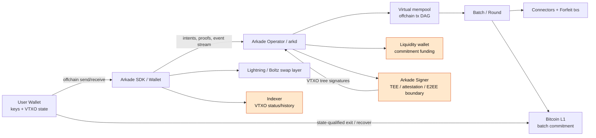
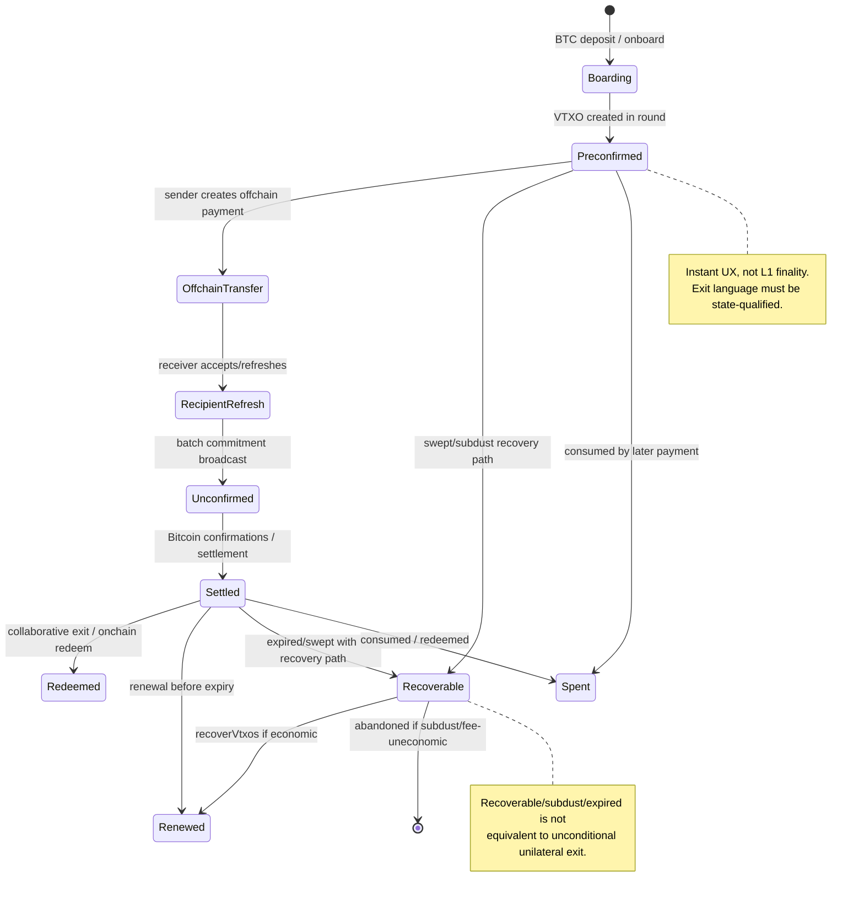
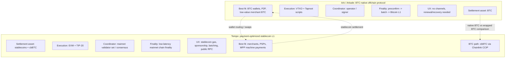
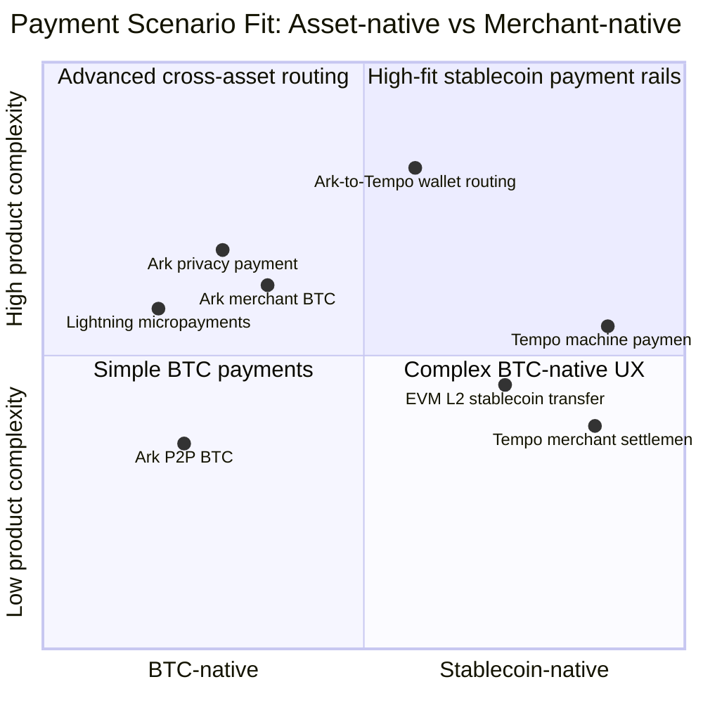
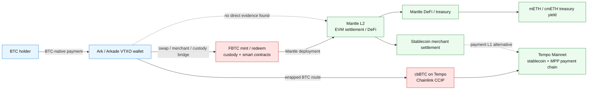

# Ark 支付链深度分析 - Round 2 Draft

## 1. Executive Summary

Ark 是 Bitcoin 原生链下支付协议路线中的重要分支：它试图让用户获得接近即时、低成本的 BTC 支付体验，同时把最终安全锚定回 Bitcoin L1。它的核心抽象是 VTXO（Virtual Transaction Output）：用户持有的是可由 Taproot / timelock / connector / forfeit 路径约束的链下所有权承诺，而不是长期运行的双向支付通道。相较 Lightning，Ark 的产品叙事更偏向"免通道管理、收款人无需入站流动性、批量分摊链上成本"；相较 Tempo，Ark 不是稳定币支付链，而是 BTC-native offchain payments。

当前必须把 Ark Protocol 的理论安全边界与 Arkade / arkd 的实现状态分开。协议层面可设计为 operator 不能任意盗取用户资金、用户在特定状态下可走链上退出；但 Arkade 文档与代码把 VTXO 分成 preconfirmed、unconfirmed、settled、recoverable、spent 等状态，且 recoverable、subdust、expired / swept VTXO 的退出或恢复路径并不等同于"用户永远可以单边退出"。因此本文避免使用无条件的 "users can always exit" 表述；所有退出判断均附状态、窗口、dust、fee-market 和 operator/live service 条件。

Arkade 还引入了一个对内部分享很重要的实现信任边界：Arkade Signer / TEE / remote attestation / E2EE。它把部分风险从单纯的 operator 诚实性转移到 signer 实现、TEE 供应链、远程证明、客户端验证与密钥生命周期管理。这个边界如果运行良好，可以降低 operator 直接作恶能力；如果证明链、enclave 代码或客户端验证弱化，则会形成新的集中化风险点。

支付场景上，Ark 更适合 BTC 持有者的低额 P2P、钱包内转账、商户 BTC 收款体验改善、Lightning 边缘互操作和 BTC liquidity entry；Tempo Mainnet 已于 2026-03-18 官方上线，定位为生产可用的 stablecoin payment L1，公开 RPC 已可供 builders 使用，并把 MPP（Machine Payment Protocol）、合作伙伴生态和稳定币 gas/sponsorship 作为主网叙事。[S29] 2026-05-15 Tempo 又宣布通过 Chainlink CCIP 支持 cbBTC，因此 BTC 流动性比较不能只看 Mantle/FBTC，还要区分 Ark native BTC、Mantle/FBTC 和 Tempo/cbBTC 三条路径。[S30] Mantle 目前未发现与 Ark 的直接官方合作或集成证据；Mantle 相关性应被表达为间接机会：BTC liquidity / FBTC / Tempo cbBTC / Mantle L2 / mETH / stablecoin settlement 之间的资产表达与路由设计，而不是既成生态绑定。

## 2. Item Findings

### item-1: Ark 项目定位、愿景与生态状态

**high_level_summary**: Ark 的定位是 Bitcoin 上的 server-assisted offchain payment protocol，通过 VTXO、operator / ASP、batch settlement 和退出路径提供即时支付 UX。Arkade / arkd 是当前最可见的实现与产品化栈，arkd README 明确标注 alpha software，不应把其能力当成成熟生产网络。Tempo 与 Ark 的叙事交集在"支付基础设施"，但底层资产、执行环境、安全锚和目标用户完全不同。

**primary_claims**:

1. Ark 的基本目标是使用 VTXO 表示链下可转移的 Bitcoin 所有权，并周期性结算到 L1；Ark Protocol 文档把 VTXO 作为 virtual UTXO 概念说明，并以 connectors / forfeit / batch 结构支撑链下更新与链上约束。[S1][S2]
2. Arkade / arkd 当前是 Ark 实现层而不是协议规范本身；arkd README 声明其为 Arkade instance 的 server implementation，支持 Bitcoin 网络列表，同时标注 alpha、not production。[S7]
3. Arkade 钱包和 SDK 侧已经覆盖 receive / send / settle / renewal / recovery 等流程，但这些接口依赖 operator、indexer、signer、wallet local state 与批处理 session。[S4][S8][S9][S10]
4. 未找到 Ark 与 Mantle 的官方直接合作、投资或集成公告；Mantle 相关分析只能作为间接生态机会。

**maturity_evidence**:

| 维度 | 证据 | 判断 |
|---|---|---|
| 协议文档 | ark-protocol.org 有 VTXO、connectors 等概念文档；Arkade docs 有 VTXO 状态、settlement、wallet operations、security pages | 中等：机制文档较丰富，但协议/实现边界需谨慎 |
| 实现代码 | arkade-os/arkd、arkade-os/ts-sdk 可见；arkd README 声明 alpha | 早期：可运行但不应按生产支付网络假设 |
| 支持网络 | arkd README 列出 regtest/testnet3/signet/mutinynet/mainnet 支持 | 支持并不等于生产安全成熟 |
| 钱包/SDK | TS SDK 中 VtxoManager、Wallet、providers、Boltz swap 包显示产品化尝试 | 钱包集成成本仍显著高于 EVM/stablecoin app |
| 生态 | 相比 Lightning 或稳定币链，商户、钱包、流动性提供者和 operator 数量仍待验证 | 最大不确定性来自网络效应 |

**open_questions**:

- Arkade 公开 mainnet 服务的流动性、在线率、operator 数量、用户规模没有找到可审计的官方统计。
- Ark Protocol 与 Arkade 实现之间的规范一致性需要持续跟踪，尤其是 signer/TEE、assets、Lightning swap 和 exit semantics。

### item-2: VTXO 模型、链下所有权转移与 Bitcoin 结算关系

**high_level_summary**: VTXO 是 Ark 的核心数据结构：它让用户在链下持有一段 Bitcoin 价值的可转移承诺，并通过 batch / tree / connector / forfeit / timelock 等结构约束 operator 和参与者。支付 UX 的"即时"来自链下签名、receipt / intent 与 operator 协调，不等于 Bitcoin L1 最终性。最终性应拆成三层：链下接收确认、batch commitment / settlement、可执行的 L1 退出或赎回路径。

**architecture_mechanism**:

1. **创建 / boarding**: 用户把 onchain BTC 进入 Arkade / Ark round，生成与 Ark address / Taproot script / signer pubkey 绑定的 VTXO。arkd README 中 operator 创建并管理 batch outputs，提供 commitment transaction liquidity。[S7]
2. **链下转移**: 发送方选择 spendable VTXO，构造 offchain receiver outputs；arkd `createOffchainTx` 会拒绝 onchain receiver，并校验接收地址的 signer pubkey 必须与 server signer 一致，说明 offchain 支付强绑定当前 Arkade signer / server 域。[S9]
3. **batch / round**: 多用户意图进入 batch session；client-lib `batch_session.go` 构造 intent、收集 signer sessions、订阅 inputs / signer topics 的 event stream，并在有 offchain output 时触发 VTXO tree signing。[S10]
4. **connector / forfeit**: connector 是约束旧 VTXO 花费、使 operator 能在用户双花或不合作时执行 forfeit 路径的关键部件。arkd covenantless builder 的 `VerifyForfeitTxs` 明确检查 connector output、VTXO input、Taproot script spend sig、taproot leaf script、forfeit closure script、CLTV 和 dust。[S2][S8]
5. **settlement / exit**: batch commitment 进入 Bitcoin 后，部分 VTXO 状态从 preconfirmed / unconfirmed 进入 settled；退出或恢复需要满足状态、timelock、dust、fee 和监控条件。[S3][S11]

**VTXO state precision**:

| 层级 | 状态 / 概念 | 可用语言 | 禁用语言 |
|---|---|---|---|
| Ark Protocol generic | VTXO 可通过预签 / Taproot / timelock / connector 约束链上退出路径 | "在满足脚本、timelock、费用和状态条件时，可走链上退出/赎回" | "用户永远都能退出" |
| Arkade implementation | preconfirmed | 可用于即时 UX，但尚未获得最终 L1 settlement；需关注 batch expiry / renewal | 不等同 L1 final |
| Arkade implementation | unconfirmed | 已进入链上交易确认等待或索引状态，仍受 Bitcoin mempool / confirmations 影响 | 不等同 settled |
| Arkade implementation | settled | 更接近已由 batch commitment 锚定；仍需看 VTXO script、expiry 与 fee | 不能忽略 exit storm / fee spike |
| Arkade implementation | recoverable | 可能来自 swept/expired 或 preconfirmed subdust 的恢复路径；TS SDK 将 swept still-spendable 与 preconfirmed subdust 做 recovery 策略 | 不应称为单边退出权完整保留 |
| Arkade implementation | spent | 已消费，不再作为可用支付输入 | 不应计入余额或退出权 |

**trust_and_security_assumptions**:

- VTXO 安全不是"operator 不存在"；而是 operator 不能在协议约束外直接拿走用户价值，但能影响活性、排序、费用、round availability 和用户恢复成本。
- Bitcoin L1 的 `nSequence`/CSV、CLTV、Taproot script 和 mempool/fee 规则是退出路径的现实边界；BIP-68 定义相对 lock-time 语义，BIP-112 通过 CHECKSEQUENCEVERIFY 将其带入脚本条件，Taproot / BIP-341 影响脚本路径表达和隐私/成本。[S16][S17][S18]
- 如果链上费用飙升或 mass exit，理论可退出并不自动等于经济上可退出；subdust VTXO 需要聚合到超过 dust/fee threshold 才现实。

**open_questions**:

- Arkade 文档中的 VTXO 状态机与当前 arkd / ts-sdk 最新代码是否逐项完全一致，仍需版本级审计。
- 当前 operator 如何公开其 round policy、liquidity depth、fee schedule、failure incident history，未找到统一 dashboard。

### item-3: Operator / ASP 信任模型、流动性模型与失效恢复

**high_level_summary**: Ark operator / ASP 不是托管方的简单替代词，而是 liquidity provider、batch coordinator、event stream server、indexer 和 signer 边界的一组服务集合。它的作恶能力主要集中在审查、延迟、拒绝服务、流动性耗尽、错误签名/不签名和状态可见性，而不是无条件盗取已按协议约束的用户资金。Arkade Signer / TEE 进一步把安全假设拆成 operator、signer、TEE vendor、remote attestation 和客户端验证五层。

**architecture_mechanism**:

| 角色 | 功能 | 失败模式 |
|---|---|---|
| Operator / Arkade server | 开 batch / round、接收 intents、广播 events、提供 offchain 支付协调 | 审查、停机、round starvation、fee policy 改变 |
| Liquidity provider / arkd-wallet | 提供 commitment transaction liquidity；也可作为 signer | 流动性不足、wallet compromise、liquidity recovery 延迟 |
| Indexer | 查询 VTXO、history、状态变化 | 状态滞后、隐私泄露、错误标记 spent/recoverable |
| Signer | 对 VTXO tree / batch 相关材料签名 | 拒签、误签、key compromise、attestation 验证失败 |
| Client wallet / SDK | 管理 keys、settlementConfig、renewal、recovery、watching | 本地状态损坏、未及时 renew、误用 recoverable/subdust |

**Arkade Signer / TEE / attestation / E2EE trust boundary**:

Arkade 的实现边界不能只说 "operator honest or malicious"。如果 signer 运行在 TEE 内，远程证明向客户端证明其运行的是预期代码，并通过端到端加密保护用户与 signer/session 之间的敏感材料，那么 trust boundary 被拆成：

1. **TEE 正确性**: enclave 隔离、side-channel 防护、vendor microcode/firmware 和 attestation service 必须可信。
2. **Attestation freshness**: 客户端必须验证 quote / measurement / policy，且不能接受过期或降级 signer。
3. **E2EE endpoint binding**: 加密通道必须绑定到 attested signer identity，而不是只绑定 TLS 域名。
4. **Signer key lifecycle**: signer pubkey、rotation、backup、revocation 和 compromise response 必须可解释。
5. **Operator / signer separation**: 如果 arkd-wallet 同时作为 liquidity provider 和 signer，部署便利性提升，但隔离性下降；arkd README 显示默认可用 wallet also as signer，也允许 custom signer。[S7]

这意味着 Arkade 的实际风险不是"operator 诚实即可"，而是"operator、signer、TEE、attestation client 和 wallet 状态共同正确"。在内部分享中应把它列为 material implementation risk。

**liquidity_model**:

- Operator 需要预置或动态提供 BTC liquidity 来创建 commitment transactions；round max participants、session duration、VTXO min/max、UTXO min/max 等配置会影响吞吐、成本和可用性。[S7]
- 收款人无需像 Lightning 那样预先获得 inbound channel capacity，这是 Ark 的支付 UX 优势；但 operator 需要有足够 liquidity 和 online capacity 来刷新 / settle / batch。
- 多 operator 互操作仍是开放问题：如果 offchain address signer pubkey 强绑定当前 operator/signer，跨 operator 支付需要 swap、bridge、重新 onboard 或协议级互操作。

**trust_and_security_assumptions**:

| 风险 | 严重度 | 说明 |
|---|---:|---|
| Operator 审查/拒绝服务 | High | 可阻断即时支付和 renewal，用户退回 L1 成本高 |
| Signer / TEE compromise | High | 可能破坏"operator 不能单独作恶"假设，需看具体 signer 协议 |
| Liquidity exhaustion | High | 支付网络可用性直接下降；operator 竞争不足会放大 |
| Exit storm + fee spike | High | 所有人同时退出时，L1 区块空间成为瓶颈 |
| State/indexer inconsistency | Medium | 可能导致钱包误判可用 VTXO、重复选择或 recovery 失败 |
| Single implementation maturity | Medium | arkd alpha 与 SDK 高频变更显示实现仍在快速演进 |

**open_questions**:

- Arkade Signer 的正式 threat model、attestation measurement、client verification path 是否已有稳定、可复现文档，需要在下一轮补强。
- 当前 operator 多样性、流动性储备和 fee schedule 缺少公开、可验证数据。

### item-4: 支付场景适配：即时支付、隐私支付、微支付与 Lightning 互操作

**high_level_summary**: Ark 的支付产品价值在于把 BTC 支付从通道管理中抽离，让普通用户像使用余额钱包一样收发小额 BTC。即时体验来自 operator 协调与 receiver trust in preconfirmation，而不是 L1 finality。它对 BTC-native P2P、小额商户收款、钱包内部支付和 Lightning 边缘互操作有吸引力；对稳定币支付、企业 reconciliation、机器支付和合规原生能力则不如 Tempo。

**payment_fit**:

| 场景 | Ark 适配 | 依据 |
|---|---:|---|
| BTC P2P 即时转账 | High | 免通道、收款人无需 inbound liquidity，offchain address 支付路径清晰 |
| 商户 BTC 收款 | Medium | 即时 UX 好，但 merchant settlement、operator availability、fee spike 和 accounting tooling 是约束 |
| 微支付 | Medium-High | 批量摊销 L1 成本适合低额；但 subdust/recoverable 处理复杂，dust threshold 仍存在 |
| 隐私支付 | Medium | VTXO / batch 可弱化单笔链上可见性，但 operator / indexer 可见支付图，receiver address/server domain 也会泄露元数据 |
| Lightning 互操作 | Medium | Arkade TS SDK 有 Boltz swap / Lightning 相关包，产品可做 swap bridge；协议层并非 Lightning replacement 的完全超集 |
| 稳定币支付 | Low-Medium | Arkade assets 方向可能承载 token，但稳定币发行、合规、商户结算和流动性深度远不如专用 stablecoin chain |
| 离线/弱在线 | Low-Medium | 用户无需保持 channel always-on，但仍需及时 renewal/recovery/exit monitoring |

**architecture_mechanism**:

- **Receiving payments**: Arkade docs 将 receive flow 包装为钱包操作；收款地址包含 signer/server 语义，接收方需要信任当前 Arkade domain 的状态更新。[S4]
- **Renewal / recovery**: TS SDK `VtxoManager` 默认启用 settlement behavior：3 天前 renewal、boarding sweep、recoverVtxos、getExpiringVtxos；这说明用户体验需要 background job 支撑，不是一次性离线收款即可永久安全。[S11]
- **Subdust handling**: SDK 只在 combined recoverable total 超过 dust threshold 时纳入 subdust，避免把小额输出锁死在不经济路径中。[S11]
- **Lightning / swap**: SDK repo 包含 `packages/boltz-swap` 和 vHTLC / swap manager 代码，说明互操作更像产品层 swap / bridge，而不是 Ark 和 Lightning 共享同一流动性图。[S12]

**trust_and_security_assumptions**:

- 商户若接受 preconfirmed VTXO，本质上是在接受 operator/session 提供的即时确认语义；高价值交易仍需等更强 settlement。
- 隐私提升主要来自 batch / offchain graph 不直接上链，但 operator / indexer 是强观察者；若支付产品需要合规审计，Tempo-style memo / policy registry 反而更直接。
- 微支付需要把 dust、recovery、fee 和 wallet background settlement 设计成用户不可见，否则会出现"余额能看见但不可经济退出"的问题。

**open_questions**:

- Arkade 真实商户 SDK、POS integration、invoice standard 和 accounting export 成熟度仍未找到足够证据。
- Lightning swap 的流动性、费用、失败恢复与隐私边界需要单独压测。

### item-5: Ark 与 Tempo 的差异、互补性和支付场景分工

**high_level_summary**: Ark 与 Tempo 代表两条不同支付路线。Ark 以 BTC 为资产和安全锚，牺牲通用智能合约与稳定币原生能力来改善 Bitcoin 支付 UX；Tempo Mainnet 已于 2026-03-18 官方上线，是 stablecoin payment-optimized L1，保留 EVM 熟悉度，同时把 fee、TIP-20、memo、sponsorship、scheduled/batched transactions、payment lanes、公开 RPC、MPP 和合作伙伴生态做成生产叙事。[S29] 二者更互补而非正面替代：Ark 解决 BTC-native holders 的支付入口，Tempo 解决企业/商户/机器支付的稳定币结算层，并通过 2026-05-15 官方 cbBTC / Chainlink CCIP 路径获得 wrapped-BTC 流动性入口。[S30]

**comparison_to_tempo**:

| 维度 | Ark / Arkade | Tempo |
|---|---|---|
| 结算资产 | BTC 原生；潜在 Arkade assets | 稳定币优先；gas 可用 USD stablecoins；通过 Chainlink CCIP 支持 cbBTC wrapped-BTC 流动性 |
| 安全锚 | Bitcoin L1 + offchain scripts / timelocks / operator coordination | 独立 L1 / validator set / Simplex consensus / EVM execution |
| 用户体验 | 免通道 BTC 支付；需 operator、renewal、recovery | 类 EVM 钱包 + stablecoin gas + sponsorship + batching |
| 最终性 | 即时 preconfirmation 与 L1 settlement 分层 | 主网生产网络；面向低延迟确定性；官方 README/docs 称 normal conditions sub-second finality |
| 费用 | batch 摊销 Bitcoin L1 fee；exit 时暴露于 BTC fee market | 低且可预测 stablecoin fee；TIP-20 transfer target sub-millidollar |
| 开发者 | Bitcoin/Ark-specific wallet + signer + VTXO model | EVM-compatible，Solidity/Foundry/Hardhat/JSON-RPC |
| 商户 reconciliation | 需要应用层处理 invoices/settlement | TIP-20 memo / commitment patterns / policy registry 更贴近商户账务；MPP 面向机器/代理支付身份、授权和结算语义 |
| 隐私 | 链上弱可见，operator/indexer 强可见 | 默认更可观测；future private token standard still coming soon |
| 合规 | Bitcoin-native，合规工具链较弱 | TIP-403 Policy Registry、issuer controls 更合规友好 |
| 机器支付 | 低额 BTC 可行，但 wallet state/renewal 较复杂 | sponsorship、scheduled/batched transactions 更适合 API/payment rails |
| BTC liquidity path | Native BTC VTXO / Bitcoin L1 exit | cbBTC on Tempo via Chainlink CCIP；不是 Bitcoin-native 退出权，而是 bridged wrapped-BTC 资产 |

**Tempo evidence**:

- Tempo README 明确其为 payments at scale blockchain，面向 stablecoin payments，高吞吐、低成本、金融机构/PSP/fintech 需求。[S13]
- TIP-20 被描述为 enshrined ERC-20 extensions，含 dedicated payment lanes、on-transfer memo / commitment patterns、TIP-403 policy registry。[S13]
- Tempo 支持 stablecoin gas，Fee AMM 自动把用户支付的 stablecoin fee 转换为 validator 偏好 stablecoin；TIP-20 transfer target sub-millidollar cost。[S13][S14]
- Tempo Transactions 支持 batched payments、fee sponsorship、scheduled payments 和 passkeys。[S13]
- Tempo 官方 Mainnet 公告写明 Tempo Mainnet 已于 2026-03-18 上线，builders 可使用 public RPC endpoints；公告还把 Bridge、Tempo Explorer、Developer Portal、partners / apps、过渡期的 testnet 继续运行和 Google Cloud 作为首批 validator 等列入主网启动叙事。[S29]
- Tempo 同一主网公告将 MPP（Machine Payment Protocol）列为面向 autonomous agents 的机器支付协议，强调 payment identity、authorization、funds management 和 privacy controls；这使 Tempo 的机器支付叙事强于 Ark 当前钱包/VTXO 模型。[S29]
- Tempo 2026-05-15 官方公告称 cbBTC on Tempo 通过 Chainlink CCIP 上线，用户可从 Base 或 Ethereum 转入 cbBTC，Chainlink 提供 Cross-Chain Token 标准和多层验证；因此 Tempo 已有官方 BTC liquidity path，但其信任模型是 bridged wrapped BTC，不等同 Ark native BTC。[S30]

**payment_fit**:

| 产品路线 | Ark 优先 | Tempo 优先 |
|---|---|---|
| BTC holder wallet | 是，native BTC | 有 cbBTC wrapped-BTC path，但不是 native BTC |
| Stablecoin merchant settlement | 否 | 是 |
| Cross-border payroll / refunds | 仅 BTC niche | 是 |
| DeFi / smart contract composability | 弱 | 强 |
| Privacy-sensitive BTC transfer | 中等 | 弱/待 private token |
| Web2 onboarding / gasless UX | 中等，需要托管式抽象 | 强，fee sponsorship 原生 |
| Machine / agent payments | 弱-中，需 wallet state 和 renewal | 强，MPP + sponsorship + stablecoin accounting |

**open_questions**:

- Tempo 已有官方主网与 cbBTC 公告；仍需跟踪 validator 去中心化、stablecoin issuer partnerships、Bridge/CCIP 风险、cbBTC 流动性深度和 production incident history。
- Arkade assets 是否会发展出足够强的 stablecoin path，目前只能作为可能性，不能当成既有能力。

### item-6: 与 Mantle 生态的潜在关联和可行动观察点

**high_level_summary**: 未发现 Ark 与 Mantle 的直接官方合作、投资、技术集成或正式提及。Mantle 相关性主要来自间接资产与支付栈互补：Ark 可能作为 BTC-native payment/liquidity entry，Mantle L2 / FBTC / mETH / DeFi 可作为 EVM 资产表达、收益和 stablecoin settlement 层；Tempo 则在主网后新增 cbBTC via Chainlink CCIP 的 BTC liquidity path，使 Mantle 的对比不再只是"Ark native BTC vs Mantle/FBTC"，而应拆成 Ark native BTC、Mantle/FBTC 和 Tempo/cbBTC 三种不同信任模型。这个判断必须带风险边界：Bitcoin-to-EVM bridge / custody / CCIP / compliance / UX complexity 是核心障碍。

**mantle_relevance**:

1. **Mantle L2 侧**: Mantle 官方页面将 Mantle 描述为 modular Ethereum L2，面向低费、高性能、EVM dApps；这使它适合作为稳定币、DeFi 和商户 settlement 的 EVM layer，而不是 BTC-native offchain payment layer。[S21]
2. **mETH 侧**: mETH Protocol 是 Mantle 维护的 Ethereum liquid staking / restaking product，用户存 ETH 获得 mETH receipt token，可在 DeFi 中使用；它与 Ark 的直接关系弱，但可用于支付生态中的 yield-bearing collateral / treasury 场景。[S22]
3. **FBTC 侧**: FBTC docs 将 FBTC 描述为 omnichain Bitcoin yield asset，1:1 backed with BTC，且在 Mantle 主网上部署 FireBridge/Minter/FToken/FeeModel/GovernorModule 等合约；这是 Ark/BTC liquidity 与 Mantle EVM 世界的最自然间接连接点。[S23][S24]
4. **Tempo/cbBTC 侧**: Tempo 的 cbBTC announcement 给出第三条 BTC exposure path：cbBTC 可通过 Chainlink CCIP 从 Base 或 Ethereum 进入 Tempo，适配 stablecoin payment L1 / EVM app 环境；它不是 Mantle 原生资产路径，但会影响"BTC liquidity + payment rails"竞品版图。[S30]
5. **Stablecoin settlement**: Mantle 若关注支付赛道，可把 Ark 视为 BTC inflow / wallet routing 入口，把 Tempo 或 EVM stablecoin rails 视为 settlement / merchant payout 层。

**风险边界**:

| 连接点 | 机会 | 风险 |
|---|---|---|
| Ark BTC payment -> FBTC mint | BTC 用户进入 Mantle DeFi | 需要 custody/merchant/mint process；非 trustless |
| Ark BTC payment -> Tempo cbBTC | 通过 wrapped BTC 进入 payment L1 app / EVM payment flow | 需要桥接、CCIP、cbBTC issuer/custody 和链间流动性；非 native BTC |
| Ark wallet -> Mantle stablecoin payout | 钱包层自动路由 BTC 到 stablecoin | 需 swap liquidity、bridge、KYC/AML、price risk |
| Mantle L2 merchant settlement | 低费 EVM 结算、DeFi composability | 商户更偏好稳定币，不一定需要 BTC-native Ark |
| mETH treasury / yield | 商户或 PSP treasury yield | 与支付路径相关性较弱，风险资产敞口不同 |
| Tempo/Mantle互补 | Tempo 做 payment L1，Mantle 做 DeFi/treasury | 跨链桥和 liquidity fragmentation |

**可行动观察点**:

- 是否出现 Arkade 与 FBTC、Mantle Bridge、Mantle ecosystem wallet 的官方集成。
- Arkade 是否支持稳定资产发行/转移，且有合规发行方或 merchant processor。
- Mantle 是否发布 Bitcoin liquidity / payment strategy，明确把 FBTC、mETH、stablecoins、Tempo/cbBTC 类 payment-chain wrapped BTC 和 L2 商户结算纳入同一产品叙事。
- Operator/ASP 多样性和 liquidity depth 是否足以支撑真实支付流量。

**open_questions**:

- 未找到 Ark/Mantle direct partnership；若内部分享需要提及，必须写作"potential / no direct evidence"。
- FBTC 与 cbBTC 的 trust model 都是 wrapped/custody/bridge-adjacent BTC exposure，与 Ark 的 Bitcoin-native VTXO 安全模型不同，不能混称为同一 BTC trustless path。

### item-7: 安全、隐私、可扩展性和开放问题清单

**high_level_summary**: Ark 最容易被过度乐观表述为"非托管、即时、低费、总能退出"；更准确的表达是：在特定 VTXO 状态、脚本路径、timelock、dust/fee 条件和 operator/signer 可用性假设下，用户可保留强于托管钱包的资金控制权。最大的系统性风险来自活性、退出拥堵、operator centralization、signer/TEE trust boundary、实现成熟度和 fee-market 外部性。

**risk matrix**:

| 风险 | 严重度 | 概率 | 说明 | 缓解 |
|---|---:|---:|---|---|
| Operator downtime / censorship | High | Medium | 即时支付、renewal、batch 都会受影响 | 多 operator、clear exit UX、watchtower |
| Exit storm on Bitcoin L1 | High | Medium | 大量用户同时退出时，fee 和 blockspace 可能吞噬小额 VTXO | fee reserve、batch recovery、limits |
| VTXO state misunderstanding | High | High | 把 recoverable/subdust/expired 误称为 always-exitable 会误导产品风险 | UI 状态分层、明确 docs |
| Signer / TEE compromise | High | Low-Medium | 实现安全边界转移到 attestation 与 enclave correctness | open measurements、client verification、key rotation |
| Liquidity exhaustion | High | Medium | operator 无法支持收款/settlement | reserve disclosure、multi-operator |
| Privacy leakage to operator/indexer | Medium | High | offchain graph 对服务方可见 | blinded protocols、client-side routing、policy disclosure |
| Code maturity / alpha | Medium | High | arkd README 明确 alpha，SDK 高频变更 | audit、version pin、staged rollout |
| Bitcoin policy / fee changes | Medium | Medium | mempool relay、dust、Taproot spend cost 影响退出经济性 | conservative limits、fee estimation |

**security layers**:

1. **Non-custodial claim**: Ark 可以比 custodial wallet 更强，因为用户持有 key/material 并可在条件满足时走 L1 path；但 operator 仍影响活性。
2. **Unilateral exit claim**: 只可在状态和经济条件限定下陈述。settled VTXO 与 recoverable/subdust/expired VTXO 不是同一退出权集合。
3. **Privacy claim**: 对链上观察者更弱可见，对 operator/indexer 更强可见。
4. **Scalability claim**: batch 摊销 L1 fee，但最终 fallback 仍回到 Bitcoin blockspace，不能无限扩展。
5. **TEE claim**: TEE 是风险转移，不是风险消除；应纳入 threat model。

**maturity_evidence**:

- arkd README 的 alpha disclaimer 是最高权重 maturity evidence。[S7]
- TS SDK changelog 和 VtxoManager 代码显示 recovery/renewal/cache/concurrency/dust 等工程问题仍在持续修复；这是早期协议产品化的正常状态，但不应忽视。[S11][S12]
- Tempo 需要按已上线主网的 production payment L1 评估：官方 mainnet 公告确认 2026-03-18 上线、公开 RPC endpoints、Bridge / Explorer / Developer Portal、partner apps、Google Cloud validator 和 MPP；与 Arkade/arkd alpha implementation 的成熟度指标不可直接用同一标尺比较，因为一个是主网 payment L1 stack，一个是 BTC offchain implementation。[S13][S29]

**open_questions**:

- Arkade signer/TEE 的可验证安全材料是否足够支撑生产支付风险评估。
- 是否存在公开第三方审计、bug bounty、incident postmortem、mainnet operator SLA。
- Bitcoin package relay / v3 policy / ephemeral anchors 等演进对 Ark exit/forfeit 成本的影响需要更细研究。

### item-8: 支付赛道趋势判断：Bitcoin 原生支付 vs 稳定币支付链

**high_level_summary**: 2026 支付叙事更可能分化为两层：BTC-native offchain payments 服务 Bitcoin holders 的支付可用性，stablecoin payment chains 服务商户、企业、机器和跨境结算。Ark 的战略价值在于保留 BTC 原生资产属性并改善 UX；Tempo 在 2026-03-18 主网上线后，战略价值从"潜在 stablecoin L1"变成生产 payment chain：低费、赞助、memo、compliance、EVM tooling、MPP 和公开 RPC/partner ecosystem 是其默认能力。[S29] 同时，2026-05-15 cbBTC on Tempo 使 BTC liquidity path 至少有三类：Ark native BTC、Mantle/FBTC wrapped BTC、Tempo/cbBTC via CCIP；Mantle 应更关注三者在钱包路由、BTC liquidity、stablecoin settlement 和 DeFi treasury 层的互补，而非押注单一协议替代全部支付需求。[S30]

**comparison_to_tempo**:

- **BTC as money vs stablecoin as unit of account**: Ark 强化 native BTC 支付体验，但 BTC 波动性和税务/会计处理仍限制商户采用；Tempo 以稳定币作为费用和转账单位，更贴近商户和企业账务，同时 cbBTC 支持让 BTC exposure 可进入 Tempo app 层。
- **Offchain scalability vs dedicated L1 scalability**: Ark 把大量支付留在链下，最终回到 Bitcoin；Tempo 把支付吞吐做进已上线主网的 L1 execution / consensus / blockspace design。
- **Privacy vs compliance**: Ark 对链上观察者有隐私优势，但 operator 可见；Tempo 默认更适合合规和 reconciliation，但隐私 token still coming soon。
- **Wallet UX**: Ark wallet 需要处理 VTXO state、renewal、recovery、operator selection；Tempo wallet 更接近 EVM familiar UX，并支持 sponsorship/passkeys 等抽象。Tempo 的 MPP 进一步把 machine/agent payment identity、authorization 和 funds management 变成协议叙事。

**payment_fit trend judgment**:

| 趋势 | 受益路线 | Mantle 应关注 |
|---|---|---|
| BTC holders 希望不用卖 BTC 也能支付 | Ark / wrapped BTC rails | 区分 Ark native BTC、FBTC mint/redeem、Tempo cbBTC、wallet routing |
| 商户希望稳定计价和低 reconciliation 成本 | Tempo / stablecoin L1 | Stablecoin settlement、merchant API、compliance |
| 用户希望 gasless / sponsored UX | Tempo | Mantle L2 account abstraction 与 sponsored tx |
| DeFi 希望 BTC liquidity 进入 EVM | Mantle / FBTC / Tempo cbBTC | Ark-to-FBTC / BTC liquidity path 与 Tempo/cbBTC path 都需要信任桥 |
| 机器支付/API payments | Tempo | Programmable stablecoin payments、MPP、scheduled/batched transfers |

**open_questions**:

- Tempo 已进入主网生产阶段；关键不再是"是否主网上线"，而是 issuer、PSP、merchant、validator decentralization、Bridge/CCIP 安全、cbBTC 流动性深度和监管认可。
- BTC-native payments 是否能形成足够 merchant network effect，是 Ark 路线的关键。
- Mantle 是否要自建支付产品、整合第三方 rails，或只做流动性/DeFi settlement layer，需要基于业务目标选择。

## 3. Diagrams

### diag-1: Ark / Arkade high-level architecture

### diag-2: VTXO lifecycle and payment flow

### diag-3: Ark vs Tempo comparison

### diag-4: Payment scenario fit matrix

### diag-5: Mantle potential linkage / risk-boundary graph

## 4. Source Coverage

| Requirement | Min | Covered | Status | Notes |
|---|---:|---:|---|---|
| src-1 official_docs: Ark Protocol / Arkade docs | 6 | 7 | Met | Ark VTXO/connectors, Arkade VTXO/settlement/security/receive/payment docs, arkd README |
| src-2 code_analysis: Ark/Arkade official GitHub | 2 | 5 | Met | arkd README, covenantless builder, send.go, batch_session.go, ts-sdk VtxoManager / Boltz swap |
| src-3 bitcoin_specs | 2 | 3 | Met | BIP-68, BIP-112, BIP-341 |
| src-4 tempo_official_docs | 5 | 5 | Met | Tempo README/docs plus official Mainnet and cbBTC announcements: TIP-20, stablecoin gas/Fee AMM, Tempo Transactions, performance/finality, public RPC/mainnet, MPP, cbBTC via Chainlink CCIP |
| src-5 mantle_official_sources | 3 | 4 | Met | Mantle Network page, mETH Protocol info, FBTC overview, FBTC contracts |
| src-6 industry_reports | 3 | 4 | Met | Stripe crypto/stablecoin page, Paradigm Tempo announcement, Visa stablecoin dashboard, a16z State of Crypto stablecoin context |
| src-7 expert_commentary | 2 | 2 | Met | Bitcoin Optech Ark technical topic page and CoinDesk interview/context used as expert/industry commentary only; no security conclusion depends solely on them |

### Key Sources

| ID | Category | Source |
|---|---|---|
| S1 | Ark official | Ark Protocol docs: VTXOs, `https://ark-protocol.org/intro/vtxos/index.html` |
| S2 | Ark official | Ark Protocol docs: Connectors, `https://ark-protocol.org/intro/connectors/index.html` |
| S3 | Arkade official | Arkade docs: VTXOs / VTXO concepts, `https://docs.arkadeos.com/learn/concepts/vtxos` |
| S4 | Arkade official | Arkade docs: Receiving payments, `https://docs.arkadeos.com/wallets/operations/receiving-payments` |
| S5 | Arkade official | Arkade docs: Settlement and finality, `https://docs.arkadeos.com/learn/core-concepts/settlement-and-finality` |
| S6 | Arkade official | Arkade docs: Security / trust model, `https://docs.arkadeos.com/learn/concepts/security` |
| S7 | Code | `arkade-os/arkd` README @ `299b7ad60d9fdfe7ebfc3c66366f2391f956045b` |
| S8 | Code | `arkade-os/arkd/internal/infrastructure/tx-builder/covenantless/builder.go` `VerifyForfeitTxs` @ `299b7ad60d9fdfe7ebfc3c66366f2391f956045b` |
| S9 | Code | `arkade-os/arkd/pkg/client-lib/send.go` `createOffchainTx` @ `299b7ad60d9fdfe7ebfc3c66366f2391f956045b` |
| S10 | Code | `arkade-os/arkd/pkg/client-lib/batch_session.go` batch / signer session flow @ `299b7ad60d9fdfe7ebfc3c66366f2391f956045b` |
| S11 | Code | `arkade-os/ts-sdk/packages/ts-sdk/src/wallet/vtxo-manager.ts` @ `0fa19be5f59d50435d19806ba182754b3689a80f` |
| S12 | Code | `arkade-os/ts-sdk/packages/boltz-swap` and `packages/ts-sdk` wallet code @ `0fa19be5f59d50435d19806ba182754b3689a80f` |
| S13 | Tempo official/code | `tempoxyz/tempo` README @ `4a11578111b57c5ceeab619ac9800b98f9c576dc`, `https://github.com/tempoxyz/tempo` |
| S14 | Tempo official | Tempo docs: protocol fees / Fee AMM / stablecoin gas, `https://docs.tempo.xyz/protocol/fees` |
| S15 | Tempo official | Tempo docs: performance / finality, `https://docs.tempo.xyz/learn/tempo/performance` |
| S16 | Bitcoin spec | BIP-68 relative lock-time, `https://bips.dev/68/` |
| S17 | Bitcoin spec | BIP-112 CHECKSEQUENCEVERIFY, `https://bips.dev/112/` |
| S18 | Bitcoin spec | BIP-341 Taproot, `https://bips.dev/341/` |
| S19 | Industry | Visa Onchain Analytics stablecoin dashboard, `https://visaonchainanalytics.com/` |
| S20 | Industry | a16z State of Crypto 2025 stablecoin / payments context, `https://a16zcrypto.com/posts/article/state-of-crypto-report-2025/` |
| S21 | Mantle official | Mantle Network page, `https://www.mantle.xyz/network` |
| S22 | Mantle official/product | mETH Protocol info, `https://meth-protocol.com/info` |
| S23 | FBTC official | FBTC overview, `https://docs.fbtc.com/` |
| S24 | FBTC official | FBTC smart contracts on Mantle, `https://docs.fbtc.com/developers/smart-contracts` |
| S25 | Industry / announcement | Stripe crypto/stablecoin use-case page covering Tempo, `https://stripe.com/use-cases/crypto` |
| S26 | Industry / announcement | Paradigm Tempo announcement, `https://www.paradigm.xyz/2025/09/tempo-payments-first-blockchain` |
| S27 | Expert commentary | Bitcoin Optech Ark protocol topic page, `https://bitcoinops.org/en/topics/ark/` |
| S28 | Expert commentary | CoinDesk interview/context on Ark, inbound liquidity, and Ark Labs, `https://www.coindesk.com/tech/2024/06/04/bitcoin-layer-2-ark-protocols-team-forms-new-firm-as-lightning-network-competitor` |
| S29 | Tempo official | Tempo blog: Mainnet is live, 2026-03-18, `https://tempo.xyz/blog/mainnet` |
| S30 | Tempo official | Tempo blog: cbBTC on Tempo via Chainlink CCIP, 2026-05-15, `https://tempo.xyz/blog/cbbtc-on-tempo` |

## 5. Gap Analysis

1. **Outline approval state mismatch**: the persisted outline frontmatter still says `status: candidate`. The issue thread supplies the actual approval gate via Review Verdict comment `976fe94b-e5f4-43bf-8dcf-ef89525d1641` and Orchestrator deep-draft dispatch `9cfed801-50f3-4c6a-8f3d-e0c3c8213f9e`. This draft records that approval source in metadata instead of mutating the outline.
2. **Arkade Signer / TEE public evidence gap**: enough evidence exists to flag the signer/TEE/attestation/E2EE trust boundary as material, but the draft did not fully verify a stable, version-pinned attestation spec or measurement registry. Treat all signer/TEE conclusions as risk framing, not audit verdict.
3. **VTXO state/version gap**: Arkade states (preconfirmed, unconfirmed, settled, recoverable, spent) are carried as required constraints, but a line-by-line reconciliation between latest docs, arkd, ts-sdk, and indexer state enums remains future work.
4. **Operator network data gap**: no authoritative public dataset was found for active Ark operators, liquidity depth, payment volume, round success rate, or exit incidents.
5. **Tempo production follow-up gap**: Tempo mainnet status is no longer a gap. Official material confirms Mainnet went live on 2026-03-18, public RPC endpoints are available, and cbBTC support via Chainlink CCIP was announced on 2026-05-15. Remaining gaps are production metrics: validator decentralization over time, public RPC reliability, partner/app traction, bridge/CCIP incident history, cbBTC liquidity depth, and real merchant/MPP payment volume.
6. **Mantle direct-link gap**: no direct Ark/Mantle partnership or integration evidence was found. All Mantle relevance is therefore framed as indirect opportunity and risk-boundary analysis.
7. **Industry reports as context only**: stablecoin payment trend sources are used to frame market direction, not to support protocol safety claims.

## 6. Revision Log

| Round | Date | Author | Notes |
|---:|---|---|---|
| 1 | 2026-05-22 | Deep Research Agent | Initial deep draft from approved outline. Carried three review constraints: VTXO state precision, Arkade Signer/TEE trust boundary, and five required diagrams including Mantle linkage graph. |
| 2 | 2026-05-22 | Deep Research Agent | Focused revision from draft review: updated Tempo to confirmed 2026-03-18 mainnet / public RPC posture, added MPP and partner ecosystem narrative, added 2026-05-15 cbBTC via Chainlink CCIP path, distinguished Ark native BTC vs Mantle/FBTC vs Tempo/cbBTC, revised diag-3 and diag-5, removed stale Tempo mainnet gap, and corrected impossible metadata timestamp. |
