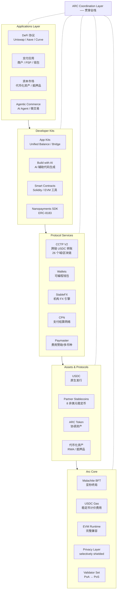
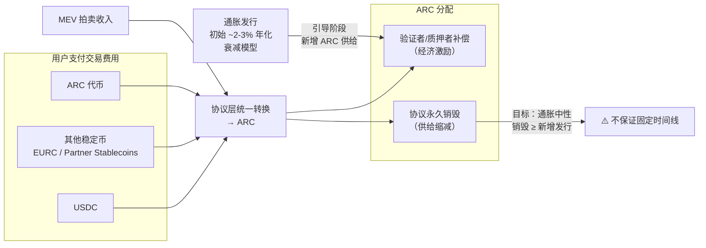
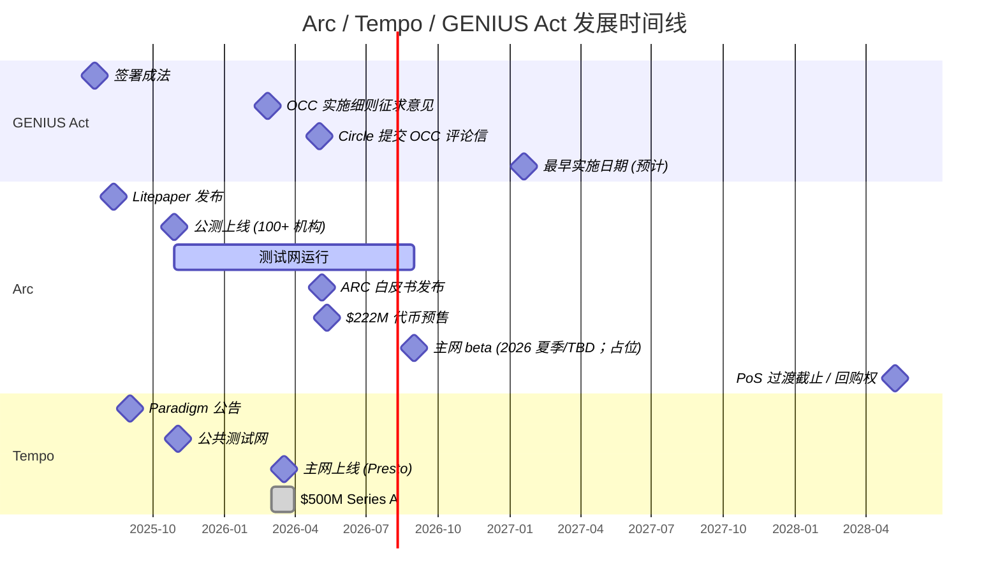
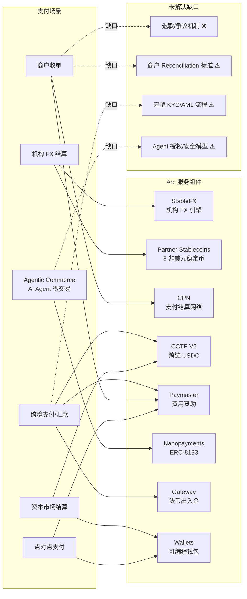

# Circle Arc 支付链深度分析

## 1. Executive Summary

Arc 是 Circle（USDC 发行方、纽交所上市公司 CRCL）构建的开放 Layer-1 区块链，定位为 "Economic OS for the internet"——专为稳定币金融（支付、结算、外汇、资本市场）设计的基础设施层。Arc 不是又一条通用 EVM 链，而是 Circle 从稳定币发行方向全栈金融基础设施构建者转型的战略载体。

**核心技术选择**：Malachite BFT 共识引擎（亚秒级确定性终局）、USDC 作为原生 Gas（消除波动代币依赖）、完整 EVM 兼容、合规导向的可选隐私（selectively shielded balances）、CCTP V2 跨链协议、抗量子设计路线图。

**发展阶段（date_verified: 2026-05-23）**：2025 年 8 月发布 litepaper、2025 年 10 月公测上线（100+ 机构参与）、2026 年 5 月发布 ARC 代币白皮书并完成 $222M 预售（a16z 领投 $75M，FDV $3B，预售条款来自二级媒体，非白皮书直接披露）、主网 beta 预计 **2026 年夏季，具体日期待定**。截至 2026 年 5 月 5 日，测试网已处理 244.1M 笔交易（evidence_confidence: verified-primary, source: ARC whitepaper PDF direct parse；Circle 2026 产品愿景博客在更早口径提及 "150+ million transactions"）。

**对 Mantle 的一句话启示**：Arc 验证了 "稳定币原生 L1" 这一产品范式的机构吸引力；Mantle 作为 Ethereum L2 无需复制其共识引擎，但应优先评估 Paymaster 稳定币 Gas UX、CCTP 集成和机构 FX 协议在自身架构中的落地路径。

## 2. Item Findings

### item-1: 项目定位与战略愿景

#### Circle 公司概况

Circle 是 USDC 的发行方；其 IPO 于 2025-06-04 定价，CRCL 于 2025-06-05 开始在 NYSE 交易（evidence_confidence: verified-primary, source: Circle pressroom IPO pricing release）。Q1 2026 财务数据（evidence_confidence: verified-primary, source: Circle Q1 2026 earnings）：

| 指标 | 数值 | 同比变化 |
|---|---|---|
| 营收与储备收入 | $694M | +20% |
| 调整后 EBITDA | $151M | +24% |
| 净利润 | $55M | -15%（运营支出增 76%，主因 IPO 后股权激励） |
| USDC 流通量 | $77B | +28% |
| 链上 USDC 季度交易量 | $21.5T | +263% |

#### Arc 的 "Economic OS" 定位

Arc 不是 Circle 的"副产品"，而是其战略核心转型的载体。Jeremy Allaire（Circle CEO）在预售披露中明确表示 Arc 的目标是 "run the actual economy"，不仅限于稳定币和支付。Circle 2026 产品愿景将整体架构定义为三大支柱（evidence_confidence: verified-primary, source: Circle blog "Building the Internet Financial System"）：

| 层级 | 定义 | 核心组件 |
|---|---|---|
| Foundation Layer | 区块链基础设施与跨链互操作 | Arc L1、CCTP、开发者工具 |
| Digital Assets Layer | 数字资产发行与管理 | USDC、EURC、USYC、xReserve Partner Stablecoins |
| Applications Layer | 企业级金融应用 | CPN（Circle Payments Network）、StableFX |

#### 发展时间线

| 时间节点 | 事件 | Evidence | Confidence |
|---|---|---|---|
| 2025.08 | Arc litepaper 发布 | Circle blog | verified-primary |
| 2025.10.28 | Arc 公测上线，100+ 机构参与 | Circle pressroom | verified-primary |
| 2025.10-2026.05 | 测试网运行，处理 244.1M 交易 | ARC 白皮书 PDF direct parse（截至 2026.05.05）；Circle 2026 产品愿景博客引用 "150+ million transactions"（更早口径） | verified-primary; 不同来源时间点不同，数字差异属正常 |
| 2026.05 | ARC 代币白皮书发布 | 官方白皮书 PDF direct parse | verified-primary |
| 2026.05.11 | $222M ARC 代币预售完成 | Bitcoin.com、CoinGecko 等二级资料 | secondary-only |
| 2026 年夏季（预计） | 主网 beta 上线，具体日期待定 | ARC 白皮书 PDF direct parse；Circle 公告 | verified-primary / official-announcement |
| 2028.05.08 | PoS 过渡截止/投资者回购权触发日 | 预售条款媒体报道 | secondary-only |

#### 战略背景：GENIUS Act 后的竞争防御

GENIUS Act 于 2025-07-18 签署成法（evidence_confidence: verified-primary, source: White House S.1582 signing notice），是美国首部联邦稳定币监管框架，要求 Permitted Payment Stablecoin Issuers (PPSIs) 满足 1:1 流动资产储备、赎回保障、风控和运营监管要求。OCC 于 2026 年 2 月 25 日发布实施细则征求意见稿，Circle 于 2026 年 5 月 1 日提交详细评论信（evidence_confidence: verified-primary, source: Circle GENIUS Act page, Circle OCC comment）。

GENIUS Act 的通过意味着银行和金融科技公司可以合规发行支付稳定币，Circle 面临 USDC 市场份额被侵蚀的风险。Arc 的战略意义在于：**通过拥有基础设施层，Circle 从 "发行方依赖第三方链分发" 转向 "发行方 + 结算层一体化"**，降低对 Ethereum、Solana 等第三方链的依赖，同时通过 StableFX、CPN、Partner Stablecoins 等平台服务构建网络效应护城河。

### item-2: 技术架构设计

#### Malachite 共识引擎

Malachite 最初由 Informal Systems 开发，是一个基于 Rust 的 BFT 共识引擎，内核继承自 Tendermint，吸取了维护 CometBFT（Go 实现）的经验教训。Circle 已接管 Malachite 的管理。

**性能基准**（evidence_confidence: verified-primary, source: Arc blog "Arc's Deterministic Finality"）：

| 参数 | 数值 | 条件 |
|---|---|---|
| 终局延迟 | ~780ms | 100 验证者，1 MB 区块 |
| 终局延迟（小网络） | 330-490ms | 地理分布式配置 |
| 吞吐量 | ~50,000 TPS / 13.5 MB/s | 取决于配置 |

⚠️ **以上均为测试网/基准测试数据，非主网生产性能。主网尚未上线，实际性能将取决于验证者规模、网络条件和交易负载。**

**架构设计要点**：

1. **双进程架构（Two-Binary System）**：共识与执行作为独立进程运行，通过 Engine API 边界通信。优势：可独立扩展硬件、安全隔离、执行层升级/停滞不影响共识终局性。
2. **区块引用传播（Block Reference Propagation）**：共识层只处理紧凑的区块引用，不处理完整交易 payload。决策路径保持低延迟，批量数据另行传播。
3. **定向 Liveness 子协议**：替代通用 gossip 网络，使用专用子协议实现可靠消息传递，降低关键路径上的消息复杂度。
4. **确定性终局（Deterministic Finality）**：一旦区块获得 2/3 验证者提交，即为终局。即使执行层升级或停滞也不影响终局性保证。

#### 验证者模型

Arc 采用渐进式去中心化路线（evidence_confidence: verified-primary, source: ARC whitepaper PDF direct parse + Circle 公告）：

- **初期：PoA（许可制验证者）**。验证者由 Circle 根据运营稳定性、地理多样性和监管合规性选择。
- **未来：PoS 过渡**。逐步向更广泛的金融机构开放验证者参与。
- **双层安全模型**：身份层（KYC/合规资质）+ 经济层（ARC 代币质押）。

⚠️ **PoA → PoS 过渡时间表尚未确定。2028.05.08 PoS 过渡截止/回购权触发日来自预售条款媒体报道，按 secondary-only 处理。**

#### USDC Gas 模型

Arc 的核心设计决策是使用 USDC 作为原生 Gas 代币（evidence_confidence: verified-primary, source: Arc blog "How Gas Works on Arc"）：

| 对比维度 | 传统区块链 | Arc |
|---|---|---|
| Gas 单位 | 相同 | 相同 |
| 每单位基础费 | 随需求波动 | 指数加权移动平均平滑 |
| Gas 代币价格 | 高度波动 | ≈ $1（USDC） |

**费用平滑机制**：Arc 不逐区块调整费用，而是使用指数加权移动平均（EWMA）的区块利用率，并设置严格的变动上下限（bounded base fee），抑制短期需求尖峰对费用的影响。

**Paymaster 多币种支持**：Circle Paymaster 将支持用 EURC 或其他资产支付交易费用，后台自动通过内置的稳定币 FX 引擎兑换为 USDC。

**对机构的意义**：稳定币计价的交易费用消除了波动性原生代币的依赖，使企业财务部门可以精确预测基础设施成本。这解决了机构采用区块链的最大障碍之一。

#### EVM 兼容性

Arc 提供完整 EVM 兼容，开发者可使用现有 Solidity/EVM 框架和工具（evidence_confidence: verified-primary, source: Arc docs）。这意味着现有 DeFi 协议（Uniswap、Aave、Curve 等）理论上可以低摩擦迁移部署。

#### 可选隐私控制

Arc 实现合规导向的可选隐私（evidence_confidence: verified-primary, source: CoinGecko、Arc blog）：

- **Confidential transfers**：屏蔽交易金额，保持地址可见。
- **TEE（可信执行环境）**：使用处理器内的安全区域保护敏感数据，即使操作系统也无法访问。
- **View keys**：密码学密钥，授予对特定交易详情的只读访问，用于机构审计。
- **opt-in 设计**：企业可选择性屏蔽敏感交易细节，同时保留可审计性。

这与 Tempo 的可选隐私 + Zones 企业隐私 L2 方案不同。Arc 的隐私更聚焦于 L1 层的交易级隐私，而非独立的企业隐私执行环境。

#### CCTP V2 跨链协议

CCTP（Cross-Chain Transfer Protocol）是 Circle 的原生跨链 USDC 转账协议，通过原生 burn-and-mint 机制实现 1:1 USDC 跨链（evidence_confidence: verified-primary, source: Circle infrastructure report + Circle developer docs supported chains/domains）：

| 指标 | 数值 | Date verified |
|---|---|---|
| Q3 2025 季度交易量 | $31B | 2026-05-23 |
| YoY 增长率 | 740% | 2026-05-23 |
| 覆盖网络数 | Circle CCTP 开发者文档列出 26 个 CCTP 支持区块链/域（含 Arc Testnet；BNB Smart Chain 标注 USYC only，USDC 支持除 BNB Smart Chain 外的 CCTP 域）；另有 Aptos/Noble/Sui 为 CCTP V1 legacy only | 2026-05-23 |
| 累计转账量 | $126B | 2026-05-23 (Circle 2026 产品愿景) |

Arc 作为 USDC 发行方构建的 L1，USDC 在 Arc 上是原生发行（非桥接），享有 CCTP 原生支持，这是任何第三方链无法复制的结构性优势。

#### 抗量子设计

Arc 制定了 4 阶段抗量子路线图（evidence_confidence: verified-primary, source: Arc blog "Arc's Quantum-Resistant Design"）：

| 阶段 | 内容 | 时间 |
|---|---|---|
| Phase 1 | 主网支持 post-quantum 签名方案（opt-in），用户可创建量子抗性钱包 | 主网上线时 |
| Phase 2 | 私有 VM 扩展量子抗性，保护机密工作流中的敏感状态和密钥材料 | 主网后近期 |
| Phase 3 | 基础设施加固：访问控制、云环境、HSM、数据保护和运营密码学全栈升级 | 中期 |
| Phase 4 | 验证者签名的 post-quantum 升级 | 长期（需充分性能测试和工具支持） |

#### MEV 保护

Arc 的 litepaper 和相关资料提到了 MEV 保护措施（evidence_confidence: official-announcement；具体实现细节待主网验证）：

- 私有/加密 mempool
- TEE 驱动的区块构建
- 密封竞价拍卖（sealed-bid auction）

⚠️ **MEV 保护的具体实现细节在公开文档中尚未完整披露，需待主网验证。**

### item-3: Circle 平台服务栈与支付场景适配

#### Circle StableFX

Circle StableFX 是机构级稳定币外汇引擎（evidence_confidence: verified-primary, source: Circle blog "Introducing Circle StableFX and Circle Partner Stablecoins"）：

- **RFQ 执行模式**：向多个流动性供应商请求报价，提供有竞争力的定价和最小滑点。
- **原子化链上结算**：交易要么完整完成，要么不发生（payment vs delivery atomicity），大幅降低结算风险。
- **24/7 运营**：可编程结算窗口和轧差配置（programmable settlement windows and netting）。
- **All-to-all 模型**：消除双边交易对手协议的需要。
- **准入门槛**：机构需通过 KYB（Know-Your-Business）和 AML 审查。
- **状态**：目前在 Arc 测试网上可用，预计 2026 年主网上线。

#### Circle Partner Stablecoins

Circle Partner Stablecoins 计划支持特定非美元区域稳定币在 Arc 上部署（evidence_confidence: verified-primary, source: Circle blog）：

| 合作方 | 代币 | 锚定货币/国家 |
|---|---|---|
| Avenia | BRLA | 巴西雷亚尔 |
| Beyond Digital | KRW1 | 韩国韩元 |
| Coins.ph | PHPC | 菲律宾比索 |
| Forte | AUDF | 澳大利亚元 |
| Juno | MXNB | 墨西哥比索 |
| JPYC | JPYC | 日本元 |
| Stablecorp | QCAD | 加拿大元 |
| ZAR Universal Network | ZARU | 南非兰特 |

参与者需满足技术、运营、储备和风控基准，获得 Circle 支付生态和 FX 交易基础设施的集成、流动性供应商接入和与 USDC 的互操作性。

#### Circle Payments Network (CPN)

CPN 自 2025 年 5 月上线以来，年化数十亿美元交易量，连接金融机构、PSP、VASP 和企业的全球支付结算网络（evidence_confidence: verified-primary, source: Circle 公告）。

#### 其他平台服务

| 服务 | 功能 |
|---|---|
| Circle Mint | 稳定币铸造/赎回（法币 ↔ USDC） |
| Wallets | 可编程钱包 |
| Contracts | 智能合约部署 |
| Gateway | 统一多链余额视图、法币出入金 |
| Paymaster | 费用赞助（用户无需持有 Gas 代币） |
| App Kits | 统一 SDK 体验（Unified Balance Kit、Bridge 等） |
| Build with AI | AI 辅助代码生成 |

#### 支付场景映射与未解决缺口

| 支付场景 | 关键 Arc 组件 | 产品价值 | 未解决问题 |
|---|---|---|---|
| 跨境支付/汇款 | 亚秒终局 + USDC Gas + CCTP 跨链 | 低成本、快速、稳定币计价的跨境转账 | 法币出入金依赖外部服务（Gateway/PSP）、收款方 off-ramp、当地支付牌照 |
| 机构 FX 结算 | StableFX + Partner Stablecoins | 24/7 原子化结算、多币种支持、消除双边协议 | 流动性深度依赖做市商参与、非美元稳定币采用度 |
| 资本市场结算 | 代币化抵押品 + 亚秒终局 + EVM | T+0 结算、可编程抵押品管理 | 监管合规（不同司法管辖区）、资产代币化标准 |
| Agentic Commerce | 低费用 + USDC Gas + ERC-8183 + nanopayments | AI Agent 自主支付、微交易（低至 $0.000001） | Agent SDK 仍在开发、安全/授权模型待成熟 |
| 商户收单 | CPN + Paymaster + 稳定币结算 | 即时结算、无 chargeback 周期 | 退款/争议机制缺失、商户 reconciliation、PSP API 层缺口 |
| 点对点支付 | USDC + EVM 钱包 | 低成本即时转账 | 钱包 UX、合规 KYC |

#### Agentic Commerce 详情

Arc 在 AI Agent 支付场景的布局较为积极（evidence_confidence: verified-primary, source: Arc blog、CrowdFund Insider）：

- **ERC-8183 标准**：定义 AI Agent 工作范围、资金托管、交付物提交和结果解析的链上流程。由 Virtuals Protocol 和以太坊基金会构建。
- **Nanopayments 框架**：Circle 发布了开发者指南和开源参考实现，支持高频、亚美分级别的 USDC 微交易（低至 $0.000001），适用于 GPU 按毫秒计费、API 微计费、Agent-to-Agent 交易等场景。
- **生态活动**：2026 年 1 月 Agentic Commerce on Arc 黑客松吸引 1,200+ 开发者；ETHGlobal HackMoney 2026 有 155 个团队参与 Arc 赛道。

### item-4: ARC 代币经济学与治理框架

#### 代币基本参数

（source_integrity: 官方 ARC 白皮书 PDF 已直接解析；白皮书未直接披露的预售条款单独标为 secondary-only）

| 参数 | 数值 | Evidence |
|---|---|---|
| 代币名称 | ARC | verified-primary: ARC whitepaper PDF direct parse |
| 初始总量 | 100 亿（10 billion） | verified-primary: ARC whitepaper PDF direct parse |
| 分配：生态系统 | 60%（token sales、developer grants、network growth programs、broader participation mechanisms） | verified-primary: ARC whitepaper PDF direct parse |
| 分配：Circle | 25%（协议开发、staking/governance、生态项目管理） | verified-primary: ARC whitepaper PDF direct parse |
| 分配：长期储备 | 15%（长期韧性、战略灵活性、经济稳定） | verified-primary: ARC whitepaper PDF direct parse |
| 预售数量 | 7.4 亿代币（740M tokens） | secondary-only: Bitcoin.com、CoinGecko 等二级资料 |
| 预售价格 | $0.30/token | secondary-only: Bitcoin.com、CoinGecko 等二级资料 |
| 预售总额 | $222M | secondary-only: Bitcoin.com、CoinGecko 等二级资料 |
| 全稀释估值（FDV） | $3B | secondary-only: Bitcoin.com、CoinGecko 等二级资料 |

⚠️ **白皮书直接说明 exact unlock and release schedules will be announced in coming months；因此锁定/解锁节奏不应从白皮书外推。**

#### ARC 五大结构功能

| 功能 | 描述 |
|---|---|
| 经济对齐（Economic Alignment） | 质押/委托/安全——ARC 质押为网络安全提供经济激励 |
| 平台效用（Platform Utility） | 费用折扣、全栈服务准入（持有 ARC 获得 Circle 平台服务优先级或折扣） |
| 费用捕获（Fee Capture） | 协议层费用转换与销毁，ARC 从网络活动中捕获价值 |
| 治理（Governance） | 经济参数投票——代币持有者参与协议治理决策 |
| 扩展效用面（Extended Utility） | 多链部署、专用通道、准入控制等未来扩展用例 |

#### 费用转换与销毁机制

所有协议费用最终在协议层转换为 ARC，然后分为两个方向（evidence_confidence: verified-primary, source: ARC whitepaper PDF direct parse）：

1. **验证者/质押者补偿**：分配给验证者和 ARC 质押者作为奖励。
2. **永久销毁**：部分 ARC 被协议永久销毁，减少流通供给。

MEV 拍卖收入同样通过此机制路由。

#### 通胀模型

- **初始阶段**：衰减通胀，约 2-3% 年化（用于引导生态）。
- **目标状态**：通胀中性（inflation-neutral）——销毁量完全抵消新增发行量。
- ⚠️ **白皮书直接说明通胀中性目标不保证固定实现时间线。**

#### 质押机制

- PoA 阶段：许可制验证者出块，代币持有者可委托质押。
- PoS 阶段（未来）：开放验证者参与。
- 奖励来源：通胀发行 + 费用衍生收入。

#### 治理框架

| 参与者 | 初始角色 |
|---|---|
| 代币持有者 | 经济参数投票 |
| 验证者 | 网络运营和安全 |
| Circle | 初始阶段主导协议规则、验证者准入、财政和网络管理 |
| 建设者 | 生态贡献和治理参与 |

采用"共享责任制"和"渐进去中心化"路线。五个决策域的初始治理分工由白皮书 Table 4 直接定义（evidence_confidence: verified-primary, source: ARC whitepaper PDF direct parse）。

#### 投资者保护条款

预售投资者享有以下保护（evidence_confidence: secondary-only, source: Bitcoin.com、CoinGecko 等二级资料；未在已解析白皮书文本中直接出现）：

- **多年锁定期**：至少在 PoS 过渡后 1 年开始解锁，最长可达 4 年。
- **回购权**：如果 Circle 在 **2028 年 5 月 8 日** 前未交付代币或未完成 PoS 过渡，投资者有权要求回购。

#### 先例意义与风险

- **上市公司代币预售先例**：此说法来自媒体转述和交易结构报道，需按 secondary-only 处理。
- **证券分类风险**：ARC 代币的法律性质（证券 vs 功能代币）可能面临监管不确定性。
- **Circle 25% 持仓的治理集中度**：在渐进去中心化过程中，Circle 对治理的实际控制力可能超出其代币持有比例。

### item-5: 机构生态与合作方版图

Arc 测试网（2025.10 上线）吸引了 100+ 机构参与（evidence_confidence: verified-primary, source: Circle pressroom）。以下按类别梳理关键参与者：

#### 资本市场机构

| 机构 | 方向 |
|---|---|
| Apollo | 代币化资产/抵押品结算 |
| BNY | 托管/资产服务 |
| ICE（纽交所母公司） | 交易所基础设施 |
| State Street | 资产管理/托管 |
| Invesco | 资产管理 |

#### 银行/资管

| 机构 | 方向 |
|---|---|
| BlackRock | 资产管理/代币化（也是预售投资者） |
| Goldman Sachs | 数字资产（Mathew McDermott 提供测试网背书） |
| HSBC | 跨境结算 |
| Deutsche Bank | 银行/结算 |
| Société Générale | 银行/DeFi |
| Standard Chartered | 银行/投资（也是预售投资者通过 SC Ventures） |
| SBI Holdings | 亚洲金融（也是预售投资者） |

#### 支付/金融科技

| 机构 | 方向 |
|---|---|
| Mastercard | 支付网络（Raj Dhamodharan 提供测试网背书） |
| Visa | 加密支付（Cuy Sheffield 提供测试网背书） |
| AWS | 云基础设施 |
| Coinbase | 交易所/托管 |
| Kraken | 交易所 |
| Robinhood | 零售交易 |
| ByBit | 交易所 |
| dLocal | 新兴市场支付 |
| Corpay | 企业支付 |
| Nuvei | 支付处理 |

#### DeFi/基础设施

| 机构 | 方向 |
|---|---|
| MetaMask | 钱包 |
| Ledger | 硬件钱包 |
| Fireblocks | 机构托管 |
| Chainlink | 预言机 |
| Alchemy | 开发者工具 |
| Thirdweb | 开发者工具 |
| Uniswap Labs | DEX |
| Aave | 借贷 |
| Curve | 稳定币 DEX |

#### 预售投资者

| 投资者 | 投资规模/备注 |
|---|---|
| a16z crypto | $75M（领投） |
| BlackRock | 参投 |
| Apollo Funds | 参投 |
| ICE | 参投 |
| ARK Invest | 参投 |
| Bullish | 参投 |
| Haun Ventures | 参投 |
| Standard Chartered Ventures | 参投 |
| SBI Group | 参投 |
| Janus Henderson Investors | 参投 |
| General Catalyst | 参投 |
| Marshall Wace | 参投 |
| IDG Capital | 参投 |

#### 参与深度评估

⚠️ **必须区分参与深度层级**（evidence_confidence: inferred；参与深度信息公开披露有限）：

| 层级 | 含义 | 代表性机构 |
|---|---|---|
| 测试网注册/Logo 参与 | 加入测试网、品牌露出 | 大部分 100+ 机构 |
| 验证者候选 | 参与验证者筛选 | 未公开具体名单 |
| 产品集成 | 在 Arc 上开发/部署具体产品 | Goldman Sachs（数字资产团队背书）、Mastercard/Visa（背书但集成深度不明） |
| 公开 Use Case | 发布基于 Arc 的具体用例 | 8 家 Partner Stablecoins 发行方 |
| 预售投资 | 财务承诺 | a16z、BlackRock、Apollo 等 13 家 |

**测试网参与 ≠ 主网承诺 ≠ 深度产品集成。** 100+ 机构的名单是强烈的信号，但不应过度解读为所有机构都已进入生产级部署。

#### Arc vs Tempo 投资者对比

| 维度 | Arc ($222M @ $3B FDV) | Tempo ($500M @ $5B) |
|---|---|---|
| 领投 | a16z crypto ($75M) | Thrive Capital + Greenoaks |
| 金融机构投资者 | BlackRock、Apollo、ICE、Standard Chartered、Janus Henderson、Marshall Wace | Sequoia、Ribbit Capital |
| 加密原生投资者 | a16z、Haun Ventures、Bullish、IDG Capital、General Catalyst | SV Angel |
| 融资结构 | 代币预售（ARC token） | 股权融资（Series A） |
| 机构偏向 | 传统金融/资本市场机构更突出 | VC/科技投资者更突出 |
| 重叠方 | 目前未发现明显重叠投资者 | — |

### item-6: 与 Tempo 的方案对比

以下对比基于本仓库已有 Tempo 研究（`202606-internal-sharing/research-sections/payment-tempo/final.md`）和公开资料。已完整携带 Tempo 研究中的 caveats。

#### 项目背景对比

| 维度 | Arc | Tempo |
|---|---|---|
| 背后公司 | Circle（USDC 发行方、NYSE 上市 CRCL） | Stripe（支付平台）+ Paradigm（VC） |
| 核心叙事 | 稳定币发行方构建自有基础设施 "Economic OS" | 支付平台构建 "payments-first blockchain" |
| 融资 | $222M 代币预售 @ $3B FDV | $500M Series A @ $5B |
| 公司类型 | 上市公司（IPO 于 2025-06-04 定价；CRCL 于 2025-06-05 开始在 NYSE 交易） | 私有公司（Stripe 未上市） |
| 主网状态 | 测试网运行中；主网 beta 预计 2026 年夏季，具体日期待定 | **已上线**（Tempo status 页显示 Mainnet / Mainnet public RPC / explorer operational；本仓库 Tempo final.md 同时记录 public code mainnet/Presto 线路）⚠️ Tempo final.md caveat: 真实交易量/活跃商户/生产伙伴深度未充分验证 |

#### 技术路线差异

| 维度 | Arc | Tempo |
|---|---|---|
| 共识引擎 | Malachite BFT（Tendermint 衍生/Rust） | Commonware Simplex BFT（Paradigm 自研/Rust） |
| 客户端 | 自研（未公开具体框架） | Reth SDK 深度 fork（26+ Rust crates） |
| 终局时间 | ~780ms（100 验证者）/ 330-490ms（小网络）⚠️ 测试网数据 | 目标 ~500-600ms ⚠️ Tempo caveat: 实际生产延迟、峰值吞吐和拥堵 SLA 不应从营销文案外推 |
| Gas 模型 | USDC 原生 Gas + EWMA 费用平滑 | 稳定币 Gas（attodollars 计价）+ 固定基础费 |
| 支付专用 blockspace | 无专用 Payment Lane | **有**：Payment Lane + gas 分区（System/Payment/General） |
| 稳定币标准 | 沿用 ERC-20 + Circle 原生发行 | TIP-20 协议级预编译（固定 6 位小数/memo/pause/role-based access） |
| 合规框架 | 可选隐私（selectively shielded balances、TEE、view keys） | TIP-403 合规策略注册表 + Zones 企业隐私 L2 |
| 隐私方案 | L1 层交易级可选隐私 | L1 透明 + Zones 早期隐私环境 ⚠️ Tempo caveat: Zones proof bytes 为空，not recommended for production |
| 跨链 | CCTP V2（原生 1:1 USDC 跨链；Circle 开发者文档列出 26 个 CCTP 支持区块链/域，含 Arc Testnet，另有 V1 legacy-only 网络） | 无内置跨链协议 |
| 抗量子 | 4 阶段路线图（主网即支持 opt-in PQ 签名） | 未公开抗量子计划 |
| MEV 保护 | 私有 mempool + TEE 区块构建 + 密封竞价 | 未在 Tempo 公开资料中突出 |
| 开源状态 | 已开源（Arc 节点） | 已开源（tempoxyz/tempo） |

#### 支付机制差异

| 维度 | Arc | Tempo |
|---|---|---|
| Payment Lane | 无——所有交易共享区块空间 | 有——TIP-20 支付交易享有保留容量，DeFi 拥堵不影响支付 SLA |
| FX 能力 | StableFX 机构级 RFQ + 原子化结算 + 8 Partner Stablecoins | StablecoinDEX / Fee AMM ⚠️ 流动性和经济性需验证 |
| 费用赞助 | Paymaster（支持多币种自动兑换） | fee payer 签名 + fee token/Fee AMM |
| Reconciliation | 标准 EVM 事件/logs | TIP-20 memo 字段 + 事件（更原生的订单对账支持） |
| 批量交易 | 标准 EVM batching | call batching + 二维 nonce + access keys |
| 账户体验 | 标准 EVM 钱包 | P256/WebAuthn/Keychain + access keys + validity windows |

#### AI/Agent 支付

| 维度 | Arc | Tempo |
|---|---|---|
| 框架 | ERC-8183 + Circle Nanopayments（开源参考实现） | Machine Payments Protocol (MPP) |
| 集成 | 开发者指南/黑客松/参考实现阶段 | **已上线/已发布支持**：Visa 为 Tempo MPP 发布 card specification 和 SDK，用于可信 autonomous agent payments（evidence_confidence: verified-primary, source: Visa primary article, 2026-03-18） |
| 微交易能力 | 低至 $0.000001 USDC | access key + channel reserve + validity windows |
| 生态 | 1,200+ 开发者参与黑客松、155 个团队参与 ETHGlobal | MPP 标准已有 Visa + Lightspark（比特币闪电网络）扩展 |

#### 共同点

两个项目在设计理念上有显著重叠：

1. 稳定币 Gas（无波动性代币）
2. EVM 兼容
3. 可选隐私（合规导向）
4. 机构验证者模型（许可制 → 开放）
5. 亚秒级确定性终局
6. GENIUS Act 合规基础

#### 互补性分析

Arc 和 Tempo 的定位存在差异化互补的可能：

- **Arc 更适合机构 FX/结算层**：StableFX、CCTP 跨链、资本市场机构生态（BlackRock、Goldman Sachs、ICE）。
- **Tempo 更适合商户/支付路由层**：Payment Lane、Stripe 商户网络、DoorDash/Shopify/Klarna 等消费互联网伙伴、MPP 机器支付。
- **潜在互联**：通过 CCTP 或其他跨链桥实现稳定币流动性互通。Arc 的 Partner Stablecoins 与 Tempo 的 StablecoinDEX 在多币种结算上可互补。

⚠️ **互补性是分析推断，非两个项目的公开合作计划。**

### item-7: 与 Mantle 生态的潜在关联与竞争分析

#### 竞争维度分析

| 维度 | 评估 |
|---|---|
| 定位差异 | Arc 是新 L1，Mantle 是 Ethereum L2（OP Stack）。定位不同，但在机构稳定币结算量上存在分流风险 |
| USDC 状态 | **关键事实（date_verified: 2026-05-23）**：Circle primary docs（CCTP supported chains/domains、USDC Contract Addresses、Circle Mint supported chains/currencies）均未列出 Mantle。因此，本 section 不应把 Mantle 视为 Circle-native USDC 或 CCTP supported chain；若 Mantle 上存在 USDC 资产，应先按非 Circle 原生/CCTP 支持处理，除非 Mantle 或 Circle 的一手文档另行证明。 |
| DeFi 虹吸风险 | Uniswap Labs、Aave、Curve 均参与 Arc 测试网。如果这些协议在 Arc 上的部署获得机构流动性，可能分流 Mantle 上的相应协议活跃度 |
| 稳定币 Gas | Arc 的 USDC Gas 模型对机构财务更友好；Mantle 使用 MNT 作为 Gas，但可通过 Paymaster 实现类似 UX |

#### 可借鉴的设计

| 设计 | Arc 实现 | Mantle 借鉴路径 | 工程复杂度 |
|---|---|---|---|
| 稳定币 Gas 模型 | 协议层 USDC 计价 | Paymaster 实现稳定币 Gas UX（无需协议层改造） | 低-中 |
| CCTP/跨链稳定币流动性 | 原生 USDC + CCTP V2 | 评估 CCTP 集成优先级（当前 Circle CCTP/native USDC primary docs 未列出 Mantle） | 中（需 Circle 合作） |
| 可选隐私 | selectively shielded balances + TEE + view keys | 对企业客户有参考价值；可考虑 L2 层的 ZK 隐私模块 | 高 |
| StableFX 链上 FX 引擎 | RFQ + 原子化结算 | Mantle DeFi 生态可考虑类似机构 FX 协议 | 中 |
| 机构验证者模型 | 许可制 + 经济层质押 | 对 Mantle 企业级部署有参考（但 L2 验证者模型不同） | N/A（架构差异） |

#### 不适合直接照搬的设计

1. **Malachite 共识引擎**：Arc 是全新 L1，共识引擎无法移植到 Mantle 的 OP Stack L2 架构。Mantle 的安全和终局性来自 L1/rollup 架构。
2. **USDC 原生 Gas**：Arc 在协议层使用 USDC 作为原生 Gas。Mantle 使用 MNT，协议层改造代价极高且影响代币经济学。应通过 Paymaster 在应用层实现类似 UX。
3. **Partner Stablecoins 生态**：Circle 的 Partner Stablecoins 是其平台服务的一部分，依赖 Circle 的发行方关系和合规框架。Mantle 无法直接复制，但可以吸引部分发行方在 Mantle 上桥接或原生发行。

#### 潜在合作路径

| 路径 | 描述 | 可行性 |
|---|---|---|
| CCTP 跨链桥 | Arc ↔ Mantle USDC 流动性互通 | 中（需 Circle 将 Mantle 纳入 CCTP 支持链；当前 Circle primary docs 未列出 Mantle） |
| DeFi 协议双重部署 | Uniswap/Aave/Curve 在两个链上的双重部署 | 高（已有先例） |
| 机构客户共享 | 机构在 Arc 结算、在 Mantle DeFi 生态做收益管理 | 中 |
| 稳定币 FX 流动性互联 | Arc StableFX 流动性 → Mantle DeFi 收益层 | 低-中（需跨链基础设施成熟） |

#### 对 Mantle 路线的建议

| 时间 | 层级 | 推荐动作 | 工程量级 |
|---|---|---|---|
| 短期（0-3月） | 应用/SDK | Paymaster 稳定币 Gas UX、CCTP 集成评估（是否推动 Circle 将 Mantle 纳入 CCTP）、稳定币支付 SDK | 低-中 |
| 中期（3-9月） | 协议/合约 | 机构 FX 协议探索（类 StableFX 的 RFQ 机制）、企业隐私模块评估 | 中 |
| 长期（9-18月） | 战略定位 | 支付赛道战略定位评估：Mantle 作为 DeFi/收益/流动性层 vs 支付结算层的差异化定位 | 战略决策 |

### item-8: 风险、开放问题与支付赛道趋势

#### 执行风险

| 风险 | 评估 |
|---|---|
| 主网未上线 | 预计 2026 年夏季，具体日期待定。测试网数据不代表主网表现 |
| PoA → PoS 过渡 | 时间表未定，截止日 2028.05.08 设置了最终期限 |
| 生态冷启动 | 主网需要从测试网参与者转化为实际交易量，跨越"测试网→生产"的鸿沟 |

#### 中心化风险

| 风险 | 评估 |
|---|---|
| Circle 主导 | 初期 Circle 控制验证者准入、协议规则、财政和网络管理 |
| 去中心化依赖治理移交 | 渐进去中心化路线无保证时间表 |
| 25% 代币持仓 | Circle 的治理控制力可能超出其 25% 持仓比例 |

#### 代币经济学风险

| 风险 | 评估 |
|---|---|
| 通胀中性不保证 | 销毁能否抵消新增发行取决于网络交易量 |
| 投资者保护条款 | 2028.05 回购权来自媒体披露的预售条款，若被触发可能对项目造成重大影响 |
| 监管不确定性 | 首家上市公司代币预售，证券分类风险 |
| 锁定期结束后抛压 | 740M 预售代币解锁可能造成市场压力 |

#### 竞争风险

| 竞品 | 威胁 |
|---|---|
| Tempo | **已上线主网**，生态策略更激进（Stripe 商户网络）、MPP 已有 Visa 集成。但 Tempo 也面临自身挑战：合作伙伴深度未验证、性能 SLA 未量化、Zones proof 未启用 |
| 通用 EVM 链 | Ethereum、Base、Solana 的流动性和开发者社区更成熟 |
| Tether 方案 | Tether 正在构建专有 L1（之前称为 Plasma，现可能更名），同期布局稳定币基础设施 |

#### 技术不确定性

| 不确定性 | 评估 |
|---|---|
| Malachite 大规模验证者集 | 仅有 100 验证者基准测试数据；数百/数千验证者的实际性能未知 |
| 可选隐私实现 | 具体 TEE + view key 实现待主网验证 |
| 抗量子性能影响 | PQ 签名可能增加交易大小和验证时间 |
| MEV 保护 | 具体实现细节公开信息有限 |

#### 支付场景适配限制

| 限制 | 说明 |
|---|---|
| 链上最终性 ≠ 法币最终性 | 亚秒终局指链上资金状态确定；不等价于银行清结算、合规审核、法币出入金完成 |
| 退款/争议机制 | 链上交易不可逆；退款/chargeback 需链下机制 |
| 商户 Reconciliation | PSP/API 层缺口；商户需要订单号 ↔ 交易哈希映射标准 |
| 法币出入金 | 依赖 Circle Mint/Gateway 和外部 PSP |

#### 支付赛道趋势判断

1. **稳定币发行方垂直整合（Circle Arc、Tether L1）vs 支付平台水平扩展（Stripe Tempo）**：两种模式正在形成。发行方通过构建自有 L1 实现从发行到结算的垂直一体化；支付平台通过构建支付优化链实现从商户端到链上的水平扩展。
2. **GENIUS Act 后竞争加剧**：银行和金融科技公司可以合规发行稳定币，Circle/Tether 的先发优势面临挑战。拥有基础设施层成为护城河构建的关键。
3. **从"测试网参与"到"生产级部署"的鸿沟**：Arc 100+ 机构参与测试网、Tempo 大量设计伙伴——这些都是强烈信号，但机构从签署 MOU/测试到实际生产部署之间存在显著鸿沟。**logo 参与 ≠ 生产集成**。
4. **AI Agent 支付的新竞争维度**：Arc（ERC-8183 + Nanopayments）和 Tempo（MPP + Visa 集成）都在争夺 agentic commerce 的标准和生态，这可能成为下一代支付基础设施的关键差异化因素。
5. **多链支付世界**：支付不会收敛到单一链上。CCTP、跨链桥和聚合路由将使稳定币流动性跨链流动。Arc 的 CCTP 优势和 Tempo 的 Payment Lane 优势可能各自在不同场景中胜出。

## 3. Diagrams

### diag-1: Arc 五层架构分层图

### diag-2: ARC 费用转换与代币经济学流程图

### diag-3: Arc vs Tempo 多维对比矩阵

| 维度 | Arc | Tempo |
|---|---|---|
| **项目背景** | Circle（USDC 发行方/NYSE 上市） | Stripe + Paradigm（支付平台/VC） |
| **共识机制** | Malachite BFT（Tendermint 衍生/Rust） | Commonware Simplex BFT（自研/Rust） |
| **终局时间** | ~780ms（100 验证者）⚠️ 测试网 | ~500-600ms ⚠️ 营销目标 |
| **Gas 模型** | USDC 原生 Gas + EWMA 平滑 | 稳定币 Gas（attodollars）+ 固定基础费 |
| **支付 blockspace** | 无专用 Payment Lane | ✅ Payment Lane + gas 分区 |
| **稳定币标准** | ERC-20（Circle 原生发行） | TIP-20 协议级预编译 |
| **隐私方案** | L1 可选隐私（TEE + view keys） | L1 透明 + Zones 早期隐私 |
| **FX 能力** | StableFX RFQ + 8 Partner Stablecoins | StablecoinDEX / Fee AMM |
| **跨链** | CCTP V2（26 个支持区块链/域，$126B 累计；Mantle 未列入 Circle docs） | 无内置跨链协议 |
| **AI/Agent 支付** | ERC-8183 + Nanopayments（开发中） | MPP（已上线 + Visa 集成） |
| **机构生态** | 金融/资本市场偏向（BlackRock/GS/ICE） | 商户/支付偏向（Stripe 网络/DoorDash/Shopify） |
| **发展阶段** | 测试网；主网 beta 预计 2026 年夏季，具体日期待定 | ✅ Mainnet/Presto 线路已存在；Tempo status 与本地 final.md 均支持，但生产采用深度仍需验证 |
| **估值/融资** | $222M token presale / $3B FDV | $500M Series A / $5B |
| **抗量子** | 4 阶段路线图 | 未公开 |
| **MEV 保护** | 私有 mempool + TEE + 密封竞价 | 未突出 |
| **Mantle 可借鉴性** | CCTP 集成、Paymaster、StableFX 模式 | Payment Lane、stablecoin gas、memo、policy registry |

### diag-4: Arc 发展时间线

注：Mermaid gantt 需要具体日期，Arc 的 `2026-08-31` 仅作为"2026 年夏季"可视化占位，不是官方主网 beta 日期；正文以"2026 年夏季，具体日期待定"为准。

### diag-5: Circle 平台服务与支付场景映射图

## 4. Source Coverage

| Requirement | Coverage |
|---|---|
| src-1 official_docs (Arc 官网/文档, min 3) | ✅ 使用 arc.io 官网、docs.arc.io 文档结构、Arc blog 技术文章。覆盖架构、共识、Gas、隐私、开发者工具 |
| src-2 whitepaper (ARC 代币白皮书, min 1) | ✅ 官方 ARC 白皮书 PDF 已直接解析。用于 244.1M 测试网交易、2026 年夏季主网预期、ARC 初始供应/分配、五大功能、staking、费用转换/销毁、通胀、治理框架等 primary claims |
| src-3 official_announcement (Circle 博客/公告, min 4) | ✅ 使用 5 篇 Circle 官方博客/公告：Arc 发布公告、公测上线、StableFX/Partner Stablecoins、2026 产品愿景、Arc + Circle 基础设施报告 |
| src-4 official_blog (Arc 博客技术文章, min 3) | ✅ 使用 3 篇 Arc 博客：Malachite 共识、Gas 机制、抗量子设计 |
| src-5 industry_reports ($222M 预售报道, min 2) | ✅ 使用 Bitcoin.com、CoinGecko 等二级资料作为 secondary-only evidence，用于白皮书未直接披露的预售数量、价格、金额、FDV、投资者保护条款 |
| src-6 existing_research (本仓库 Tempo 研究, min 1) | ✅ 使用 `202606-internal-sharing/research-sections/payment-tempo/final.md` 作为 Tempo 对比基线，携带全部 caveats |
| src-7 official_docs (Tempo 官方资料, min 2) | ✅ 使用本仓库 Tempo final.md、Tempo docs、Tempo status page、Tempo public repo baseline；主网/Presto 状态按 local baseline + status.tempo.xyz 处理 |
| src-8 official_announcement (Circle 基础设施报告, min 1) | ✅ 使用 Circle Internet Financial System Report（CCTP 交易量、生态概览），并补充 Circle developer docs 精确 CCTP 支持网络/域和 USDC/Circle Mint 支持链 |

**Sources Referenced**

Primary / official / local baseline:

- Arc official website: `https://www.arc.io/`
- Arc documentation: `https://docs.arc.io/`
- ARC token whitepaper PDF (directly parsed): `https://6778953.fs1.hubspotusercontent-na1.net/hubfs/6778953/PDFs/arc_whitepaper.pdf`
- Arc blog - Malachite consensus: `https://www.arc.io/blog/arcs-deterministic-finality-the-bespoke-consensus-layer-built-using-malachite`
- Arc blog - Gas mechanism: `https://www.arc.io/blog/how-gas-works-on-arc`
- Arc blog - Quantum-resistant design: `https://www.arc.io/blog/arcs-quantum-resistant-design-and-roadmap-why-it-matters`
- Circle pressroom - IPO pricing and NYSE trading date: `https://www.circle.com/pressroom/circle-announces-pricing-of-upsized-initial-public-offering`
- Circle blog - Arc introduction (2025.08): `https://www.circle.com/blog/introducing-arc-an-open-layer-1-blockchain-purpose-built-for-stablecoin-finance`
- Circle pressroom - Arc testnet launch (2025.10): `https://www.circle.com/pressroom/circle-launches-arc-public-testnet`
- Circle blog - StableFX & Partner Stablecoins: `https://www.circle.com/blog/introducing-circle-stablefx-and-circle-partner-stablecoins`
- Circle blog - 2026 product vision: `https://www.circle.com/blog/building-the-internet-financial-system-circles-product-vision-for-2026`
- Circle report - Arc and Circle infrastructure: `https://www.circle.com/reports/internet-financial-system/arc-and-circle-infrastructure`
- Circle - GENIUS Act page: `https://www.circle.com/genius-act`
- White House - S.1582 signed into law: `https://www.whitehouse.gov/briefings-statements/2025/07/the-president-signed-into-law-s-1582/`
- Circle developer docs - CCTP supported chains/domains: `https://developers.circle.com/cctp/concepts/supported-chains-and-domains.md`
- Circle developer docs - USDC contract addresses: `https://developers.circle.com/stablecoins/usdc-contract-addresses.md`
- Circle developer docs - Circle Mint supported chains and currencies: `https://developers.circle.com/circle-mint/references/supported-chains-and-currencies.md`
- Existing Tempo research: `202606-internal-sharing/research-sections/payment-tempo/final.md`
- Tempo docs: `https://docs.tempo.xyz/`
- Tempo status: `https://status.tempo.xyz/`
- Visa - card specification and SDK for Tempo MPP: `https://corporate.visa.com/en/sites/visa-perspectives/innovation/visa-card-specification-sdk-for-machine-payments-protocol.html`

Secondary:

- Bitcoin.com - $222M presale: `https://news.bitcoin.com/circle-pulls-222-million-from-blackrock-and-a16z-to-launch-arc-blockchain-at-3b-valuation/`
- CoinGecko - What is Arc: `https://www.coingecko.com/learn/what-is-arc-stablechain`
- CrowdFund Insider - Nanopayments: `https://www.crowdfundinsider.com/2026/05/278131-circle-introduces-nanopayments-framework-for-agentic-ai-economies-on-arc/`

## 5. Gap Analysis

1. **预售/投资者保护条款仍为 secondary-only**：官方 ARC 白皮书 PDF 已直接解析，可支持供应、分配、费用转换、staking、通胀和治理框架；但 740M/$0.30/$222M/$3B FDV、投资者回购权和锁定期等交易条款不在已解析白皮书文本中，仍按媒体报道处理。

2. **测试网数据不一致**：不同来源在不同时间点引用不同数字（Circle 2026 产品愿景："150+ million transactions"；白皮书发布时引用："244.1M as of May 5"；Arc 官网近期显示周交易量为零）。这可能反映测试网活动的间歇性或不同统计口径。Draft 中已标注差异，但无法确定最新准确数据。

3. **MEV 保护细节不足**：Arc 的 MEV 保护方案（私有 mempool、TEE 区块构建、密封竞价）在公开文档中缺乏具体实现细节。这些是 litepaper/概念层面的描述，需待主网验证。

4. **验证者列表未公开**：Arc 未公开具体的验证者候选机构名单。无法评估初期 PoA 验证者的组成和多样性。

5. **可选隐私实现深度不足**：TEE + view keys + selectively shielded balances 的具体技术实现（使用的密码学方案、性能开销、审计机制）在公开文档中尚未完整披露。

6. **Mantle 当前代码路径未审计**：与 Tempo 研究类似，本 section 对 Mantle 的建议基于 Mantle 常识、Circle primary docs 未列出 Mantle 的事实、以及 OP Stack 架构约束，未直接审计 Mantle 当前 repo。工程设计阶段应另开 Mantle-specific POC。

7. **Tether L1 竞品未深入分析**：Tether 的稳定币原生 L1 方案仅作为竞品提及，未做深度对比。如需要，应单独开题研究。

## 6. Revision Log

| Round | Change |
|---|---|
| 1 | Created first deep draft from approved outline `847d564cb45158773fe0fca7aff3d749522277ed`. Addressed review caveats: (1) re-verified volatile claims — testnet transaction counts (noted source discrepancy between 150M+ and 244.1M at different dates), Malachite performance (confirmed from Arc blog), $222M presale (confirmed from multiple media sources), Tempo mainnet status (confirmed launched 2026.03.18), Mantle USDC/CCTP status (confirmed: bridged USDC only, not on CCTP list). (2) Used Tempo `final.md` as authoritative comparison baseline with all caveats carried forward (partner production depth, SLA evidence absence, Zones proof maturity). Produced 5 diagrams: architecture stack, tokenomics flow, Arc vs Tempo comparison matrix, timeline gantt, and services-to-scenarios mapping. |
| 2 | Revised from round 1 after adversarial review. Directly parsed the official ARC whitepaper PDF and retagged whitepaper-backed tokenomics/staking/fee-conversion/governance/testnet/mainnet claims as `verified-primary`; moved presale and investor-protection terms not present in the whitepaper to `secondary-only`. Corrected Circle IPO timing to 2025-06-04 pricing / 2025-06-05 NYSE trading, GENIUS Act enactment to 2025-07-18, and Arc mainnet beta wording to "2026 年夏季，具体日期待定". Replaced weak evidence rows with exact Circle CCTP/USDC/Circle Mint docs, local Tempo final.md + Tempo status/docs, and Visa MPP primary source; removed search-snippet access note. |
