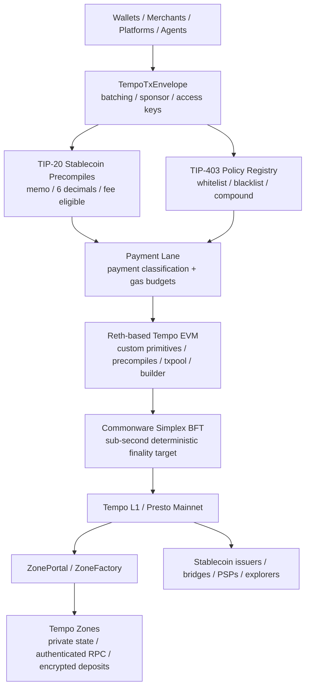
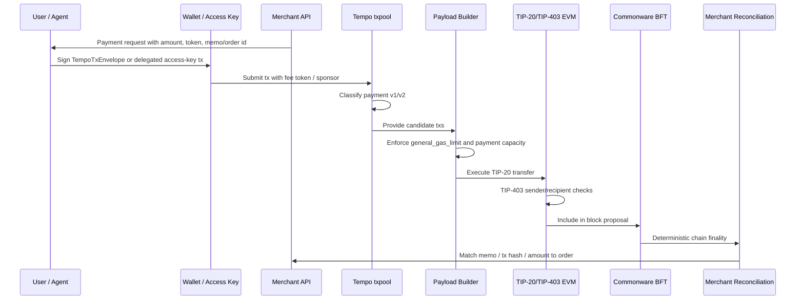
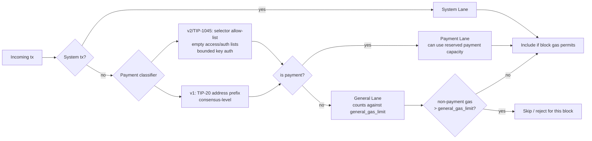
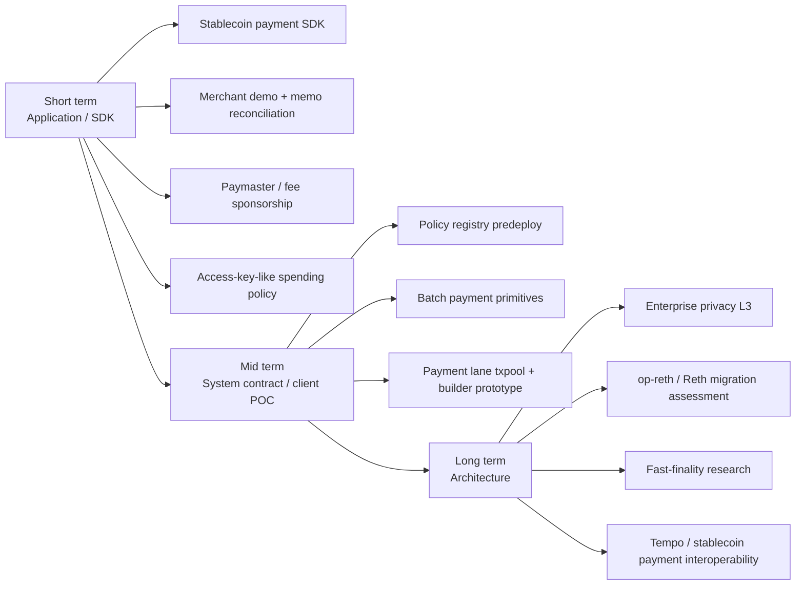

# Tempo 支付链分析

## 1. Executive Summary

Tempo 可以被概括为：由 Stripe 与 Paradigm 孵化、面向稳定币支付优化的 EVM-compatible L1。它不是在通用链上部署一组支付合约，而是把支付交易分类、稳定币发行/转账、合规策略、费用支付、账户认证和企业隐私 Zone 尽量下沉到协议和客户端层。对 Mantle 的最重要启示不是"迁移到 Tempo 的架构"，而是把支付场景拆成可落地的产品能力：稳定币 gas、费用赞助、memo/reconciliation、合规策略注册表、支付专用 blockspace 和企业隐私环境。

截至 2026-05-22，本 section 对易过期事实采用保守写法：Tempo L1 公共资料与代码均显示 mainnet/Presto 线路存在，官方状态页显示 Mainnet、Testnet、Faucet、Explorer、RPC 等服务 Operational；Tempo 公共代码仓库 `tempoxyz/tempo` 的源码引用精确锁定在 `4a11578111b57c5ceeab619ac9800b98f9c576dc`，workspace version 为 `1.7.1`，`crates/chainspec/src/constants.rs` 写明 mainnet/Presto T4 激活时间为 2026-05-18 14:00 UTC。旧资料 WHI-339 中"截至 2026 年 5 月主网未上线"已被 WHI-340 与本轮公开代码/状态页复核修正。Tempo Zones 仍应按早期/测试性质处理：Zones 仓库 README 明确 "not recommended for production use yet"，且 `crates/tempo-zone/src/batch.rs` 注释与代码显示 `verifierConfig` 和 `proof` 仍为空，真实 proof generation 尚未接入。

对 Mantle 的决策导向结论：

- **短期（应用/SDK 层）**：优先做稳定币支付 SDK、商户收款 demo、memo/reconciliation 标准、fee sponsorship/paymaster、access key 限额、P256/WebAuthn 或 AA 账户体验。这些不要求改客户端，投入可控。
- **中期（system contract / op-geth 层）**：探索 payment lane/priority lane 原型、合规策略 predeploy、稳定币 gas 抽象、批量付款原语。这里开始触及排序、gas 预算、预部署合约和索引器。
- **长期（客户端/架构级）**：评估 op-reth/Reth 迁移、企业隐私 L3/Zone-like appchain、BFT fast-finality gadget 或跨链支付结算合作。Commonware Simplex BFT、TIP-20 协议级预编译和 Zones Reth validium 实现都不适合直接照搬到当前 Mantle 架构。

## 2. Item Findings

### item-1: 项目定位、愿景与发展阶段校准

Tempo 的公开定位是 "payments-first blockchain"。Paradigm 的官方公告将其描述为面向高吞吐、低费用、亚秒最终性的 EVM-compatible L1，并强调由 Stripe 与 Paradigm 孵化、与设计伙伴共同构建。Tempo 官网展示的叙事也围绕全球支付、稳定币、商户/平台、企业和 agent commerce，而不是泛化 DeFi L1。

**事实校准（date_verified: 2026-05-22）**

| 主题 | 结论 | Evidence | Confidence |
|---|---|---|---|
| 定位 | 支付优先、EVM-compatible、general-purpose L1，但核心差异化服务稳定币支付 | Tempo 官网、Paradigm announcement、WHI-339 §1 | verified-primary |
| 孵化/背书 | Stripe + Paradigm；技术背景与 Reth/Foundry/Rust 生态相关 | Paradigm announcement、WHI-339 §1.2、Tempo repo dependencies | verified-primary |
| 合作伙伴 | 官网/公告显示大量设计伙伴与 logo；只能作为设计伙伴/生态接触证据，不能写成已上线深度集成 | Tempo 官网、Paradigm announcement | verified-primary, caveated |
| 网络状态 | WHI-339 的"主网未上线"已过期；公开代码和状态页支持 mainnet/Presto 已存在且服务 Operational | status.tempo.xyz；`tempoxyz/tempo` `constants.rs` mainnet 模块；WHI-340 §1 | verified-primary + verified-code |
| 版本 | L1 公共 repo review snapshot workspace `1.7.1`；既有 WHI-340 基于 `1.6.0`，实现细节需标注版本差异 | `tempoxyz/tempo` `Cargo.toml` | verified-code |
| Zones 状态 | Zones 独立仓库 `0.1.0`，README 明确 still under development / not production；主要面向 testnet | `tempoxyz/zones` README/Cargo.toml | verified-code |

Tempo 的目标用例应按"协议能力匹配度"排序：跨境稳定币汇款/付款、全球薪资和批量付款、嵌入式金融、商户收单、微支付/按用量计费、agent commerce、代币化存款与链上 FX。真正的商业闭环仍依赖发行方、KYC/AML、法币出入金、商户结算、退款争议处理与 API/PSP 系统；Tempo 解决的是链上支付 rails，不是完整 PSP。

### item-2: Tempo L1 架构总览：Reth SDK、Commonware BFT 与结算最终性

Tempo L1 的技术判断是"全栈定制客户端 + BFT 确定性最终性 + 协议级稳定币原语"。这与普通 EVM 链的差别在于：Tempo 修改了交易 envelope、header、chain spec、EVM precompiles、transaction pool、payload builder、fee model 与共识接入。

**Reth SDK / 客户端层**

WHI-340 将 Tempo L1 拆成 26 个 Rust crates，并指出关键模块包括 `crates/primitives`、`crates/chainspec`、`crates/evm`、`crates/precompiles`、`crates/payload/builder`、`crates/transaction-pool`、`crates/commonware-node`、`crates/node`。本轮公开 repo 复核显示 L1 workspace 已是 `1.7.1`，成员模块仍保持类似结构，且依赖 `paradigmxyz/reth` 特定 commit `1be17eb`。这说明 Tempo 不是单点 ExEx，而是对 Reth 节点栈的系统级 fork/assembly。

关键自定义包括：

- `TempoTxEnvelope`：自定义交易类型，支持 batching、费用赞助、P256/WebAuthn/Keychain、validity window、二维 nonce。
- `TempoHeader`：含毫秒 timestamp、`shared_gas_limit`、`general_gas_limit`、T4 后 consensus context。
- `TempoChainSpec`：mainnet/Presto、Moderato testnet、T0-T5 硬分叉调度、稳定币费用常量。
- `TempoEvmConfig` / precompiles：TIP-20、TIP-403、StablecoinDEX/Fee AMM、NonceManager、AccountKeychain、SignatureVerifier 等。
- payload builder 与 transaction pool：Payment Lane 分类、gas 分区和拥堵时跳过非支付交易。

**Commonware Simplex BFT / 共识层**

Tempo 的共识层基于 Commonware Simplex BFT。WHI-340 代码分析显示 `crates/commonware-node` 约 12k 行集成代码，含 consensus engine、application actor、DKG manager、epoch、subblocks、executor、feed、peer manager 等。L1 采用双网络/双 runtime：Reth devp2p 负责执行层同步，Commonware P2P 负责共识消息；这种隔离有利于低延迟支付系统避免执行负载直接拖慢共识。

需要保守表述性能：Tempo 文档和既有研究使用约 500-600ms 区块/最终性叙事，代码中可看到 payload builder 和 status/docs 对亚秒最终性的支持，但实际生产延迟、峰值吞吐和拥堵下 SLA 不应从营销文案外推。Commonware 也是 Tempo 深度使用的栈，独立生产用户和稳定 API 较少；对 Mantle 来说更适合作为 BFT fast-finality 设计参考，而非直接引入依赖。

**结算语义**

Tempo 是 L1，不锚定以太坊；Payment Lane 是 L1 区块空间和 gas 预算分区，不是支付通道，也不是独立结算层。Tempo 的"最终性"指链上资金状态经 BFT 确定后不可重组；这不等价于银行清结算、chargeback、AML 审核、法币出入金或商户争议处理完成。

### item-3: Payment Lane 与交易处理机制

Payment Lane 是 Tempo 最值得 Mantle 关注的协议设计。它把区块空间拆成 System、Payment、General 三类，并用 `general_gas_limit` / `shared_gas_limit` 对非支付交易设置硬约束，使 TIP-20 稳定币支付在通用合约/DeFi 拥堵时仍保留容量。

**核心机制**

| Lane | 职责 | 支付价值 | Evidence | Confidence |
|---|---|---|---|---|
| System Lane | 协议/系统交易、subblocks metadata、奖励等 | 协议维护不被普通交易挤出 | WHI-339 §2.2；public code `payload/builder` | verified-code |
| Payment Lane | TIP-20 相关支付交易 | 为稳定币支付提供 SLA-like blockspace | Tempo docs Payment Lane；WHI-340 §8 | verified-primary + verified-code |
| General Lane | DeFi、普通合约、非支付调用 | 不影响保留支付容量 | `general_gas_limit` code path | verified-code |

本轮公开代码复核要点：

- `crates/primitives/src/transaction/envelope.rs` 同时存在 `is_payment_v1()` 与 `is_payment_v2()`。v1 以 TIP-20 地址前缀为主；v2/TIP-1045 更严格，要求 selector allow-list、access list/authorization list 为空、AA calls 非空且 key authorization 受限。
- `crates/payload/builder/src/lib.rs` 在构建 payload 时计算 `shared_gas_limit`、`non_shared_gas_limit` 与 `general_gas_limit`。若交易不是 payment 且会超过 `general_gas_limit`，builder 会以 `ExceedsNonPaymentLimit` 跳过。
- `crates/chainspec/src/constants.rs` 写明 T1 后 `TEMPO_T1_GENERAL_GAS_LIMIT = 30_000_000`，并用 attodollars 基础费给 TIP-20 transfer 成本示例。

Payment Lane 的产品含义是"为支付交易预留链上容量"，不是完整支付产品。它不自动处理 KYC、账户冻结外的风控、发票/订单 reconciliation、退款/争议、法币兑换、商户费率或跨境合规。它也不同于 private mempool 或 MEV-protected lane：后者主要改变交易可见性/排序保护，Tempo 的设计则是协议级 gas 预算隔离。

#### 用户流程字段映射

| user_flow_step | Tempo 处理 | 主要证据 | limitation |
|---|---|---|---|
| 发起 | 商户/平台生成支付请求，包含 amount、token、memo 或订单 ID | WHI-339 TIP-20 memo；Tempo docs | 需要外部 PSP/商户 API 标准 |
| 认证/签名 | 用户、access key 或 fee payer 签名 `TempoTxEnvelope` | WHI-340 TempoTxEnvelope；public code | 钱包和托管方需要适配 P256/WebAuthn/Keychain |
| 合规检查 | TIP-403 对 sender/recipient 做双边策略检查 | WHI-340 TIP-403 | 只覆盖链上 token transfer policy，不覆盖完整 AML |
| 费用支付 | 使用 fee token / stablecoin gas / sponsorship | `TEMPO_T1_BASE_FEE` code | Fee AMM 流动性和经济性需验证 |
| lane 分类 | `is_payment_v1/v2` 做无状态支付分类 | public code `envelope.rs` | 错分/绕过风险需审计 |
| 执行 | TIP-20 precompile 执行转账并发事件 | WHI-339/WHI-340 | ABI 兼容不等于 ERC-20 全兼容 |
| 最终性 | Commonware BFT 确认 L1 block | WHI-340 Commonware integration | 实测延迟和拥堵 SLA 未量化 |
| reconciliation | 商户用 memo/事件/tx hash 对账 | 推导自 TIP-20 memo | 退款/争议仍需链下流程 |

### item-4: TIP-20、TIP-403、稳定币 gas 与账户体验

Tempo 将稳定币支付做成协议原语组合：

- **TIP-20**：协议级 token 标准，以 precompile 形式实现，不是普通 ERC-20 合约。WHI-339/WHI-340 均指出其固定 6 位小数、memo、pause、role-based access、reward distribution、DEX quote token、fee eligibility、Payment Lane 集成等特性。ABI 可兼容部分 ERC-20 调用，但 storage/indexing/decimals/policy 行为不能按普通 ERC-20 假设。
- **TIP-403**：合规策略注册表，提供 whitelist、blacklist、compound policy，所有 TIP-20 transfer 经过 sender/recipient 双边授权检查。WHI-340 明确这是 protocol-level precompile，依赖 Tempo storage provider 与 hardfork gating。
- **稳定币 gas**：Tempo 没有单独原生 gas token；费用以 attodollars 计价，用符合条件的 TIP-20 稳定币支付。公开代码 `TEMPO_T1_BASE_FEE = 20_000_000_000` attodollars/gas，并注释 50,000 gas TIP-20 transfer 约 $0.001。
- **费用赞助与 Fee AMM**：`TempoTxEnvelope` 支持 fee payer 签名，费用 token 可通过 fee token/Fee AMM/StablecoinDEX 处理。对用户体验来说，商户或钱包可以隐藏 gas token 和 gas price 波动。
- **账户体验**：P256/WebAuthn/Passkey、Keychain、access keys、call batching、valid_after/valid_before、二维 nonce 共同服务于支付自动化和企业权限管理。

集成要求不能低估。钱包需要显示 6 位小数、memo、合规拒绝原因、赞助费用和 fee token；商户系统要把 memo/tx hash/order id 映射到订单；托管平台要审计 fee sponsorship 与 access key 限额；发行方要迁移或桥接到 TIP-20，而不是直接复用现有 ERC-20 发行栈。

### item-5: 支付场景适配能力

| 场景 | 关键 Tempo 组件 | 产品价值 | 未解决问题 | Mantle 关联 |
|---|---|---|---|---|
| 跨境稳定币汇款/付款 | BFT finality、TIP-20、TIP-403、stablecoin gas、Payment Lane | 近实时链上结算、费用可预测、稳定币直付 | KYC/AML、FX、收款方 off-ramp、当地支付牌照 | 短期可做稳定币支付 SDK + 桥/路由聚合；中期考虑 payment lane 原型 |
| 商户收单/结算 | Payment Lane、memo、fee sponsorship、call batching | 订单 reconciliation 更直接，用户无需 gas token | 退款/争议、chargeback、发票税务、PSP API、商户结算周期 | Mantle 可先做 merchant demo、memo 标准和稳定币支付 checkout |
| 薪资/批量付款 | call batching、二维 nonce、access key、费用赞助 | 批量并行、限额授权、自动化付款 | 工资税/合规、失败重试、收款方身份与 off-ramp | Mantle 可用 AA/paymaster + batch contract 先实现应用层版本 |
| 微支付/按用量计费/agent commerce | 低固定费用、MPP/Channel Reserve、access key、validity windows | 支持机器对机器小额结算和限额自动扣款 | 私钥/授权滥用、争议、单笔经济性、链上拥堵实测 | Mantle 可先做 access-key-like spending policy，不急于改共识 |
| 企业隐私支付 | Zones、authenticated RPC、encrypted deposit、TIP-403 镜像 | 企业内部账本、私密交易、合规策略同步 | single sequencer、proof 未接入、DA 不公开、operator 可见明文 | 长期 L3/appchain blueprint；不能作为近期生产承诺 |
| 链上 FX/多稳定币结算 | StablecoinDEX/Fee AMM、quote token、fee token | 多稳定币付款与费用兑换 | 流动性深度、滑点、做市风险、发行方支持 | Mantle DeFi/收益层可成为跨链支付流动性来源 |

总体上，Tempo 对"链上资金移动"的适配度最高，对"完整支付业务"仍依赖链下系统。Mantle 若要学习，应先把产品边界说清楚：链上 rails、商户 API、合规/风控、法币出入金是四个不同层级。

### item-6: Zones L2 与企业/隐私支付能力

Zones 是 Tempo-native private chains，定位是将企业隐私需求放到独立 Zone 执行环境中，同时通过 Tempo L1 进行资产桥接、状态承诺和合规基础设施复用。它与 Tempo L1 的成熟度不同，必须分开描述。

**架构流程**

1. 通过 ZoneFactory 在 Tempo L1 部署 ZonePortal/ZoneMessenger，并生成 Zone genesis。
2. 用户将 TIP-20 token 存入 L1 ZonePortal；存款可普通存入，也可用 ECIES 加密 `to` 和 memo。
3. Zone sequencer 监听 L1 事件，构建 Zone block；README/guide 描述每个 L1 block 对应 Zone 处理节奏。
4. Zone 本地执行交易，RPC 层需要 signed authorization token；余额、交易、logs 等按 authenticated caller 过滤。
5. Sequencer 定期向 L1 ZonePortal `submitBatch`，提交 block transition、deposit queue transition 和 withdrawal queue hash。

**隐私与信任边界**

- 隐私主要来自独立状态、authenticated RPC、sanitized/filtered responses、encrypted deposits/withdrawals，而不是"Sequencer 不可见明文"。README 明确 Zone operator 对 state 具有 full visibility for compliance。
- 单 sequencer/Noop-style 架构适合企业自控环境，但不适合多方无信任共享账本。
- Zone 数据不等同于 rollup DA；外部观察者无法重放完整 Zone 状态。
- proof 状态是关键 caveat：`tempoxyz/zones` review snapshot `1ad6d4e40176d3addd9eeb17e1fc59db0affb016` 的 `crates/tempo-zone/src/batch.rs` 写明 proof validation 由 stub verifier 跳过，`submitBatch` 传入 `Bytes::new(), Bytes::new()`。因此只能说"proof slot/架构接口存在"，不能说生产 validity proof 已启用。

对 Mantle：Zones 是企业隐私 L3/appchain 的长期 blueprint，可借鉴 authenticated RPC、encrypted deposit、合规策略镜像、受控合约部署和 operator 可见/用户不可见的数据模型。但若 Mantle 直接承诺类似能力，需要补齐 proof/DA/退出/多方信任模型，不能复制一个仍处早期的 Reth Zone 实现。

### item-7: 竞品与替代方案对比

| 方案 | 最终性/延迟 | 费用/gas 体验 | 支付专用 blockspace | 合规/隐私 | 集成与信任边界 | 对 Mantle 可借鉴性 |
|---|---|---|---|---|---|---|
| 传统支付网络/PSP | 用户侧实时授权，清结算 T+0/T+N 不等 | 法币计价、商户费率清晰 | N/A | 成熟 KYC/AML/chargeback | 账户体系和牌照强，链上可编程性弱 | 商户 API、争议处理、reconciliation 是 Mantle 应补的链下层 |
| 普通 EVM L1/L2 稳定币支付 | 受链最终性和排序影响 | gas token/费用波动，AA 可改善 | 无协议级支付 lane | ERC-20 合规依赖发行方合约/RPC | 流动性强、钱包成熟，但拥堵时支付被挤出 | Mantle 当前最接近此类；可先做 UX/SDK 改良 |
| Tempo L1 | 目标亚秒确定性最终性，主网已存在但性能应继续实测 | stablecoin gas、固定基础费、fee sponsorship | 是，Payment Lane + gas 分区 | TIP-403；Zones 提供早期隐私环境 | 协议专有、发行方需 TIP-20、Commonware/Reth 耦合 | Payment Lane、stablecoin gas、memo、policy registry 最值得学 |
| Tempo Zones | Zone block 快，最终依赖 L1 batch/proof | 固定/受控环境 | 继承 L1 | authenticated RPC + encrypted deposit；operator 可见明文 | single sequencer，review snapshot proof bytes 为空 | 长期 L3/appchain blueprint，近期谨慎 |
| Sui gasless stablecoin transfers | Sui 官方/Fireblocks 资料称已支持 gasless stablecoin transfer 路径 | sponsor/free tier 改善用户 gas 体验 | 非 EVM payment lane | 依赖 Sui 对象模型和托管/机构集成 | 非 EVM，钱包/合约迁移成本高 | 对 Mantle 的启示是 gas sponsorship 与机构托管集成，而非架构迁移 |
| Canton Network | 面向机构同步与隐私协作 | 企业/机构账本模型 | 非公链 blockspace 叙事 | 强隐私、权限和合规协作 | Daml/机构网络，开放 DeFi 可组合性弱 | 适合作为企业合规/多方账本对照，不适合复制技术栈 |
| zkSync Prividium | 企业 EVM/Elastic Chain 方向 | EVM 友好，费用取决部署 | 非支付专用 | 隐私/准入控制/企业链 | ZKsync stack 绑定，企业部署模型 | 企业 EVM + permissioning 可参考，支付原语不如 Tempo 垂直 |

横向比较的关键结论：Tempo 把"支付链"做成协议级垂直整合，Sui 更强调 gasless UX 与机构 custody，Canton/Prividium 更偏企业隐私/权限协作，传统 PSP 则胜在完整商业闭环。Mantle 若进入支付赛道，不能只比较 TPS/最终性，必须同时补齐商户 API、稳定币流动性、合规策略、法币出入金与产品 SLA。

### item-8: 与 Mantle 的潜在关联、合作可能性与路线建议

**可直接借鉴（短期应用/SDK 层优先）**

1. 稳定币支付 SDK：封装支付请求、链上 tx、memo/order id、状态回调、失败重试。
2. Gas sponsorship / paymaster：让用户用稳定币或由商户赞助 gas，而不是暴露 MNT/ETH gas。
3. Memo/reconciliation 标准：把订单号、发票、收款方、结算批次映射为事件/索引规范。
4. Access key / spending policy：先用 AA 或智能合约钱包限制 token、额度、调用目标和过期时间。
5. TIP-403 风格策略注册表：用 Solidity predeploy/system contract 实现 whitelist/blacklist/compound policy，不必一开始做 precompile。

**需中期客户端或系统合约改造**

1. Mantle payment lane / priority lane prototype：在 op-geth 或 op-reth builder/txpool 中增加无状态分类和 gas 预算隔离。
2. 稳定币 gas 抽象：链级或系统合约层支持稳定币付费、费用兑换、退款和审计。
3. 批量付款/MPP：可先合约化实现，再评估是否需要更底层 channel reserve 或交易类型。

**不适合直接照搬**

1. Commonware Simplex BFT：Mantle 是 OP Stack L2，安全和最终性来自 L1/rollup 架构；直接接入 Commonware 会改变核心信任模型。
2. Reth 全栈 Tempo custom node：Mantle 当前 op-geth/OP Stack 工具链迁移成本高；op-reth 可作为长期评估，而不是短期依赖。
3. TIP-20 替代 ERC-20：Mantle 已有 ERC-20 稳定币生态，协议级 TIP-20 迁移会造成发行方、钱包、索引器和合规栈摩擦。
4. Zones Reth validium 实现：proof 未接入、single sequencer、testnet-only 限制决定它只能作为 blueprint。

**潜在合作路径**

- 流动性与跨链支付路由：Mantle 作为 DeFi/收益/流动性层，Tempo 作为支付结算入口，或反向从 Tempo 支付流量进入 Mantle yield/merchant treasury。
- 桥与基础设施：LayerZero、Relay、稳定币发行方、merchant API provider 可以成为共同接口。
- 企业客户联合探索：企业私有支付、payroll、merchant settlement、treasury automation。
- 技术共研：payment lane 参数、stablecoin gas、memo 标准、合规策略 registry。

**Mantle 路线图**

| 时间 | 层级 | 推荐动作 | 工程量级 | 风险 |
|---|---|---|---|---|
| 0-3 个月 | 应用/SDK | 稳定币收付款 SDK、merchant demo、memo/reconciliation、paymaster | 低-中 | 产品验证不足 |
| 3-9 个月 | system contract | 合规策略 registry、批量付款、access key/spending policy | 中 | 钱包/索引器适配 |
| 6-18 个月 | 客户端原型 | payment lane / priority lane txpool + builder POC | 中-高 | OP Stack 兼容、derivation 验证 |
| 12-24 个月 | 架构 | 企业隐私 L3、op-reth/Reth 评估、fast-finality research | 高 | 安全模型、proof/DA、生态迁移 |

### item-9: 风险、开放问题与事实核验清单

| 风险/问题 | 当前判断 | 后续核验 |
|---|---|---|
| 主网状态与活跃度 | mainnet/Presto 与状态页存在；但真实交易量、活跃商户、生产伙伴深度未充分验证 | 用 explorer/RPC 拉取区块、tx count、活跃地址、合约调用分布 |
| 合作伙伴深度 | 官网/公告是设计伙伴/生态背书，不等于已上线 | 查每个伙伴官方公告、产品页面、链上合约/流量 |
| 性能声明 | 亚秒最终性是设计目标/官方叙事；公开实测吞吐与拥堵行为需要更多数据 | 压测报告、主网 block interval、Payment Lane 饱和测试 |
| Payment Lane 攻击面 | v2/TIP-1045 加强 selector 和 access list 限制，但误分类/绕过仍需安全审计 | 阅读 T5 audit、fuzz tests、DoS case |
| TIP-20/TIP-403 生态摩擦 | protocol-level 原语强，但带来发行方/钱包/索引器迁移成本 | 调查主流稳定币是否发行 TIP-20、钱包支持状态 |
| 稳定币 gas 经济性 | 固定低费对 UX 友好，但拥堵和 validator economics 需验证 | 费用收入、subsidy、Fee AMM 流动性、T5 fee changes |
| Zones proof | review snapshot proof bytes 为空；README 不建议生产使用 | 跟踪 zones repo proof generation、verifier、audit、mainnet availability |
| 法币/合规最终性 | 链上最终性不等于支付业务最终性 | PSP/银行 partner integration、KYC/AML/chargeback 流程 |
| Mantle 移植成本 | SDK 层可行，客户端/架构级改动高风险 | op-geth/op-reth POC、derivation/gas accounting design review |

## 3. Diagrams

### diag-1: Tempo 支付链分层架构

### diag-2: 稳定币支付交易处理流程

### diag-3: Payment Lane gas 分区与分类

### diag-4: 对比矩阵

| 维度 | 传统 PSP | 普通 EVM 稳定币 | Tempo L1 | Sui gasless | Canton / Prividium |
|---|---|---|---|---|---|
| 支付 UX | 强，法币账户抽象 | 中，gas/钱包复杂 | 强，stablecoin gas + sponsorship | 强，gasless/sponsor | 企业系统友好 |
| Blockspace | N/A | 无支付隔离 | Payment Lane | 非 EVM payment lane | 私有/许可网络 |
| 最终性 | 授权快，清结算另算 | 链而异 | BFT 确定性目标 | Sui finality | 企业同步/rollup 模型 |
| 合规 | 成熟 | 合约/RPC/发行方 | TIP-403 | 托管/机构路径 | 强合规/权限 |
| 隐私 | 银行/PSP 内部 | 公链透明 | L1 透明；Zones 早期隐私 | 公链模型 | 企业隐私更强 |
| Mantle 借鉴 | 商户 API | 当前基础 | 支付专用设计 | gasless UX | 企业权限/隐私 |

### diag-5: Mantle 借鉴路线图

## 4. Source Coverage

| Requirement | Coverage |
|---|---|
| src-1 WHI-339 | Used for Tempo positioning, docs-derived architecture, TIP-20/TIP-403, Zones overview, partner categories, Mantle comparison. Caveated where outdated. |
| src-2 WHI-340 | Used for code-level corrections: mainnet status, Payment Lane v1/v2, gas constants, precompile characterization, proof empty bytes, Commonware integration. |
| src-3 WHI-348 | Used for cross-project framing, Mantle strategic recommendations, Canton/Prividium comparison caveats. |
| src-4 official docs | Used Tempo docs/site/status for positioning, connection/status, Payment Lane, fees, transactions, TIP-20/TIP-403 references. Some docs pages are rapidly evolving. |
| src-5 Tempo source code | Public `tempoxyz/tempo` review snapshot `4a11578111b57c5ceeab619ac9800b98f9c576dc`: `Cargo.toml`, `constants.rs`, `envelope.rs`, `payload/builder/src/lib.rs`. |
| src-6 Zones source code | Public `tempoxyz/zones` review snapshot `1ad6d4e40176d3addd9eeb17e1fc59db0affb016`: README, `Cargo.toml`, `batch.rs`, RPC auth/token modules. |
| src-7 Commonware | Used existing WHI-339/WHI-340 and public repo/docs evidence; Commonware details remain medium confidence due to limited protocol spec exposure. |
| src-8 official announcement | Paradigm announcement for Stripe/Paradigm incubation and payment-first positioning. |
| src-9 network/explorer/status | `status.tempo.xyz` plus Tempo mainnet code constants. Direct explorer quantitative activity was not scraped; listed as gap. |
| src-10 comparisons | Sui official blog for gasless stablecoin transfer/Fireblocks; existing WHI-348 for Canton/Prividium framing; further primary-source comparison depth remains a gap. |

**Primary / code sources referenced**

- Tempo official site: `https://tempo.xyz/`
- Tempo docs: `https://docs.tempo.xyz/`
- Tempo status: `https://status.tempo.xyz/`
- Paradigm announcement: `https://www.paradigm.xyz/2025/09/tempo-payments-first-blockchain`
- Tempo public repo: `https://github.com/tempoxyz/tempo` @ `4a11578111b57c5ceeab619ac9800b98f9c576dc`
- Zones public repo: `https://github.com/tempoxyz/zones` @ `1ad6d4e40176d3addd9eeb17e1fc59db0affb016`
- Sui official blog on gasless stablecoin transfers with Fireblocks: `https://blog.sui.io/sui-launches-gasless-stablecoin-transfers-with-support-from-fireblocks/`
- Internal existing research: `mantle-enterprise-blockchain/research-sections/m1-independent-research/WHI-339-tempo-docs-research.md`
- Internal existing research: `mantle-enterprise-blockchain/research-sections/m1-independent-research/WHI-340-tempo-code-analysis.md`
- Internal existing research: `mantle-enterprise-blockchain/research-sections/m2-cross-project-comparison/WHI-348-ch4-tempo-draft.md`

## 5. Gap Analysis

1. **链上活跃度未量化**：本 section 确认 mainnet/Presto 与状态页/代码事实，但未系统拉取 explorer/RPC 交易量、活跃地址、平均 block interval、Payment Lane 占比。内部分享若需要"采用程度"结论，应追加链上数据采集。
2. **合作伙伴深度不能外推**：官网/公告的 partner logo 只能证明合作/设计伙伴关系，不证明每家已上线支付流量或生产集成。
3. **性能声明缺少独立基准**：亚秒最终性、低费用、Payment Lane SLA 是官方设计目标和代码支持方向；拥堵、攻击、峰值吞吐需要独立压测或生产指标。
4. **Zones proof 未启用**：代码明确 proof bytes 为空；企业隐私支付只能按 blueprint/early testing 评价。
5. **Canton/Prividium 对比依赖既有研究**：本 section 未对这两个项目重新深挖最新文档；用于战略对照足够，但不适合作为最终竞品白皮书。
6. **Mantle 当前代码路径未复核**：本 section 基于 Mantle 常识和既有研究判断 op-geth/OP Stack 约束，未直接审计 Mantle 当前 repo。若要进入工程设计，应另开 Mantle-specific POC/review。

## 6. Revision Log

| Round | Change |
|---|---|
| 1 | Created first deep draft from approved outline `4c6a03ca9309f9371d13e09fb8150e4df7a01407`; incorporated WHI-339/WHI-340/WHI-348; refreshed mainnet/version/proof caveats using public Tempo and Zones repos plus official status/site sources; separated Mantle short-term SDK actions from mid/long-term client and architecture changes. |
