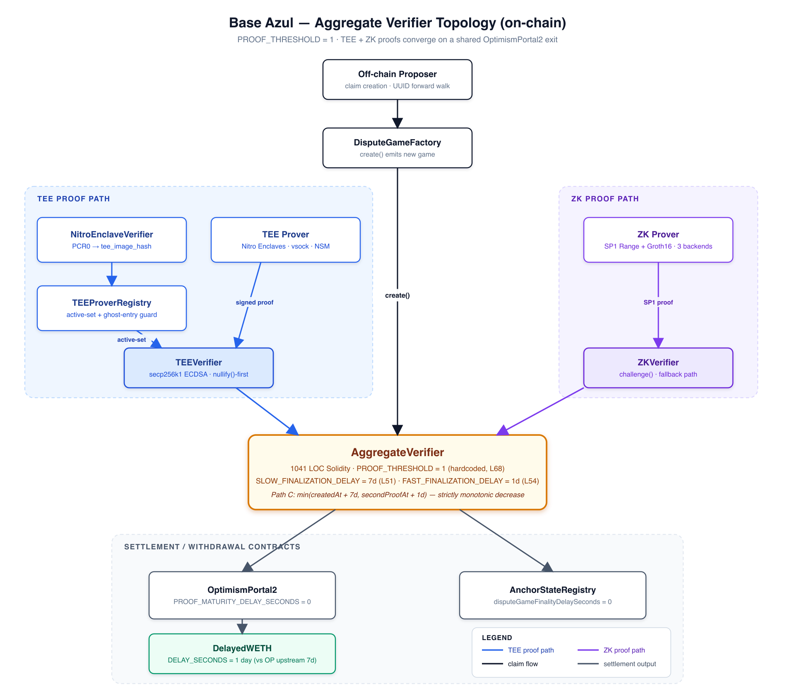
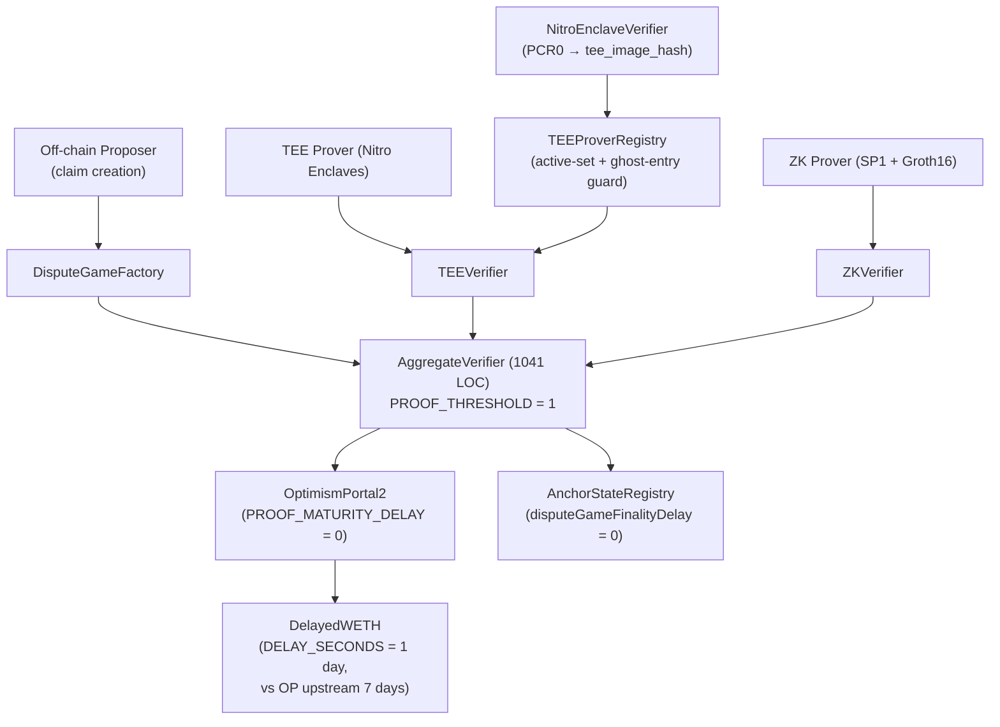
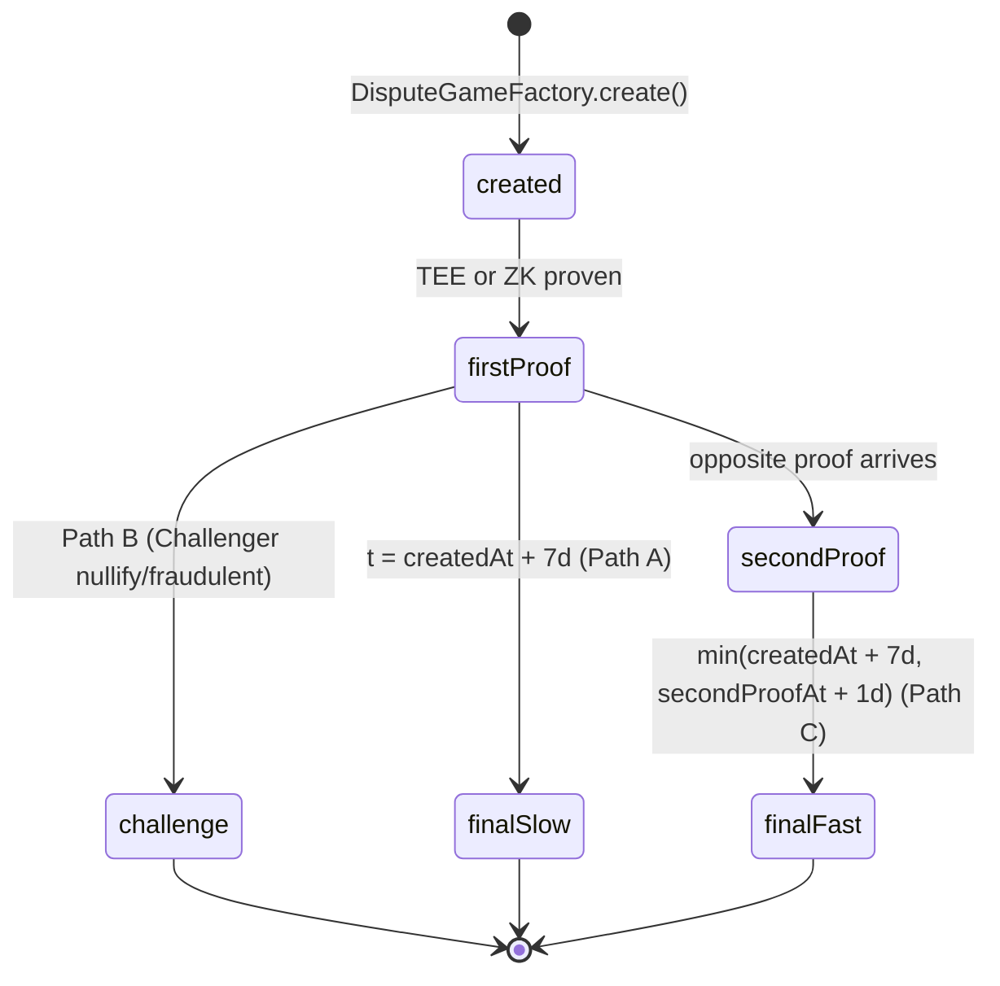
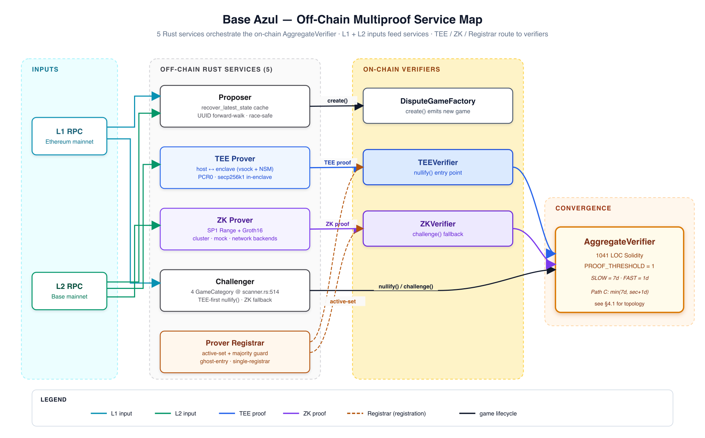
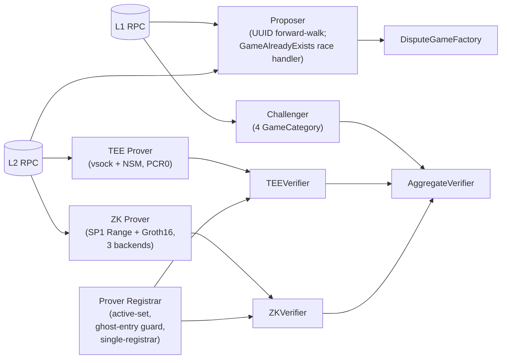
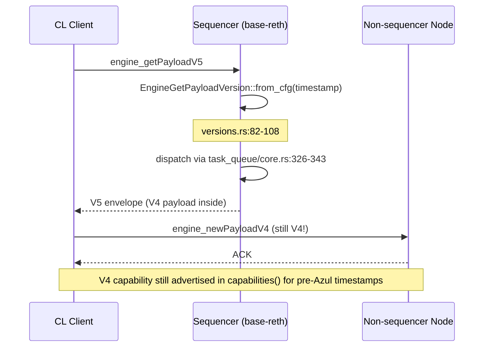

# Base Azul 升级解析 — 面向 Mantle 工程团队的终稿综述报告

| 字段 | 取值 |
|---|---|
| **Project slug** | `base-azul-upgrade` |
| **报告日期** | 2026-05-18 |
| **作者** | Technical Writer Agent（Multica Research Squad） |
| **代码仓库** | `Whisker17/multica-research` |
| **报告路径** | `base-azul-upgrade/report/final-report-zh.md` |
| **配图资源** | `base-azul-upgrade/report/assets/` —— §4.1 与 §5.1 已通过 `fireworks-tech-graph` 渲染为 PNG；其余图表保留为 Mermaid（详见 §10 方法学说明） |
| **聚合的研究 section** | 6 篇 —— 详见 §9 可追溯矩阵 |
| **上游证据截止日期** | 2026-05-17（research-sections 引用的快照） |

> **翻译说明**：为确保技术准确性，本报告对所有专有名词（合约名、代码标识符、EIP 编号、hardfork 名、库名、文件路径等）保留英文原文，仅对叙述性正文进行中文翻译。原英文报告位于 `final-report.md`。

## 摘要（Abstract）

Base **Azul** 是首次让 **Base 的 runtime 在三个层面同时脱离 OP Stack** 的升级（single-client `base-reth-node`、Multiproof aggregate verifier、network-layer 重写），同时仍保持在 Karst 等价的 EIP 范围内。本报告将六个研究 issue（WHI-27 到 WHI-32）按主题（而非按 issue）综合成一份文档。对 Mantle 工程团队而言，最重要的数字是 **13 个 canonical Azul features 中已有 6 个上线**，途径是 **Limb** hardfork（主网 2026-01-14）；其余 7 个分为 4 个 break-change 决策、1 个 verify-track 项、2 个仅 Base 才有的延后参考项。各 section 级别的结论、跨 section 冲突、集成 gaps 全部在 §6 与 §10 显式列出。

## 目录

1. 执行摘要 —— 请先读这一节
2. 主题 A —— Strategic Context：为何 Azul 脱离 OP Stack
3. 主题 B —— EVM 层（Osaka EIPs）以及 Base 如何接入
4. 主题 C —— Proof System 重构：on-chain Multiproof
5. 主题 D —— 链下证明基础设施（5 个 Rust 服务）
6. 主题 E —— Network & API 层（Flashblocks、eth/69、Engine V5、eth_config）
7. 主题 F —— 跨 section 综合分析：冲突、共识、gaps
8. 主题 G —— Mantle 影响评估与行动建议
9. 附录 —— 可追溯矩阵
10. 附录 —— 方法学说明与术语表

---

## 1. 执行摘要

**Azul 是什么？** 一次 Base 专属的 hardfork —— 不是 OP Stack 的小版本发布 —— 构建在三个支柱之上：

1. **`base-reth-node`** 替换原本的 `op-geth + op-node` 双 binary 栈，变成内嵌 REVM 的单一 Reth 派生客户端。（[base-strategy-azul-overview/final.md](../research-sections/base-strategy-azul-overview/final.md)）
2. **Multiproof aggregate verifier**，`PROOF_THRESHOLD = 1`，TEE + ZK 双 proof 汇合到同一个 `OptimismPortal2` 出口。Path-C "fast finality" 计算 `min(createdAt + 7d, secondProofAt + 1d)`，第二份佐证 proof 可以把退出延迟从 7 天压到 1 天，但不会反向延长。（[multiproof-architecture/final.md](../research-sections/multiproof-architecture/final.md)）
3. **网络层重写**，把 Flashblocks payload 精简、EIP-7642 `eth/69` wire、EIP-7910 `eth_config` JSON-RPC、Engine API V5 信封（内载仍是 V4 payload）一并整合。（[flashblocks-network-changes/final.md](../research-sections/flashblocks-network-changes/final.md)）

**EVM 层。** Azul 在五个 EVM EIP（7825、7823、7883、7939、7951）上**与 Ethereum Osaka 完全规范等价** —— 但 Base 是通过 REVM 中唯一一行 `BaseUpgrade::Azul => SpecId::OSAKA` 切换到 Osaka 语义，并对 per-tx gas cap 做了 **deposit transaction 豁免**。`p256Verify` precompile 从 Fjord / RIP-7212 的 3,450 gas 过渡到 **EIP-7951 的 6,900 gas**；旧的 3,450 是**被淘汰**而非"冲突"。（[osaka-evm-changes/final.md](../research-sections/osaka-evm-changes/final.md)）

**链下基础设施。** 由五个 **Rust 服务** 共同编排 Multiproof 体系：
Proposer（UUID forward-walk，不再有 backward scan）、Challenger（4 种 `GameCategory` 生命周期）、TEE Prover（Nitro Enclaves + NSM，签名密钥永不离开 enclave）、ZK Prover（SP1 Range + Groth16 Aggregation，3 个后端）、Prover Registrar（single-registrar 假设，针对 Solady `EnumerableSetLib` v0.0.245 bug 的 ghost-entry guard）。（[multiproof-provers-challengers/final.md](../research-sections/multiproof-provers-challengers/final.md)）

**Mantle 现状。** 13 个 canonical Azul features 中已有 6 个通过 **Limb**（2026-01-14）上线：EIP-7823、7883、7939、7951、7642、7910。**EIP-7825** 是唯一一个**未上线**的 EVM EIP —— `MaxTxGas` 常量虽然有定义，但 OP-Stack 在 `core/state_transition.go:510` 的 `!IsOptimism()` guard 让所有 OP 派生链（包括 Mantle）跳过强制执行。**Flashblocks** 处于 `partially_live`（`op-conductor` 中的管线代码已随 `mantle-v2@v1.5.4` 出货；主网部署配置和 Azul payload-schema 兼容性尚未验证）。Multiproof、TEE Prover、Engine API V5、`base-reth-node` 均为延后的 Base-only 参考项。（[mantle-impact-assessment/final.md](../research-sections/mantle-impact-assessment/final.md)）

**Mantle 的最高优先级行动清单**（按 deadline 紧迫度排序）：

| # | 事项 | 优先级 | Deadline 压力 |
|---|---|---|---|
| 1 | **EIP-7825 强制执行决策** —— 永久保留 OP-Stack 的 opt-out，**或**为 Mantle 单独 backport 绕过 `!IsOptimism()` 的强制执行。两种选择都要公开记录。 | 高 | 在任何"Mantle is Osaka-equivalent"公开声明之前 |
| 2 | **`op-geth` deprecation 应对** —— Mantle 的 `op-geth` fork 沿用上游的 EOL 时间 **2026-05-31**，仅在 Base Azul 代码层主网时间之后 3 天。要么延长 Mantle 内部的维护，要么承诺 `base-reth-node` 风格的 single-client 迁移。 | 高 | 2026-05-31 硬截止，无延期空间 |
| 3 | **Flashblocks verify-track** —— 确认主网 `op-conductor` 是否带着 `OP_CONDUCTOR_ROLLUPBOOST_WS_URL` 运行，payload schema 是否与 Azul 一致。管线代码位于 `op-conductor/rpc/ws/flashblocks_handler.go:1-100,180-248`。 | 中 | 在任何"Mantle supports Flashblocks"声明之前 |
| 4 | **Engine API V5 接线** | 低 | 阻塞在上游 Karst |
| 5 | **Permissionless ZK / Kailua harness** | 低 | 与未来 multi-prover 决策绑定 |

---

## 2. 主题 A —— Strategic Context：为何 Base Azul 脱离 OP Stack

### 2.1 三层脱离

Azul 是 Base 首次让 runtime、proof 系统、network 层同时偏离 OP Stack 默认值的 hardfork：

| 层 | Azul 之前的 Base | Azul 之后的 Base |
|---|---|---|
| **Execution client** | `op-geth`（Geth fork） | `base-reth-node`（Reth 派生，单 binary） |
| **Fault proof** | Cannon optimistic fault game | **AggregateVerifier**，带 TEE + ZK provers，`PROOF_THRESHOLD = 1` |
| **Spec governance** | `superchain-registry` 标准配置 | Base 自有 `specs.base.org` 定义，节奏领先于上游 OP Karst |

关键在于，**只有 EVM EIP 范围仍与上游共享**。Azul 刻意保持在 Karst 等价的 EIP 集合内，让 L1 合约表面（gas costs、opcode behavior、precompile addresses）与 Ethereum Osaka 保持互操作。

### 2.2 三大战略目标

研究共识识别出 Coinbase 公开声明的三个 Azul 目标：

1. **L2BEAT Stage-2 进阶** —— 用 `PROOF_THRESHOLD=1` 的 aggregate verifier（multi-prover，happy path 无人签名）替代 Security Council 的 veto。
2. **更快的退出** —— Path-C `min(7d, secondProofAt + 1d)` 在双 proof 一致时把最坏情况下的提款延迟缩短 7 倍。
3. **性能 / UX 延迟** —— Flashblocks 200ms 预确认，payload schema 精简到对前一个 block 的最小必要 diff。

### 2.3 13 个 canonical features 清单（压缩版）

| # | Feature | 层级 |
|---|---|---|
| 1 | EIP-7823（MODEXP 1024-byte cap） | EL |
| 2 | EIP-7825（per-tx gas cap 16,777,216） | EL |
| 3 | EIP-7883（MODEXP gas 公式） | EL |
| 4 | EIP-7939（CLZ opcode） | EL |
| 5 | EIP-7951（p256Verify 6,900 gas） | EL precompile |
| 6 | EIP-7642（eth/69 wire） | Network |
| 7 | EIP-7910（`eth_config` RPC） | Network/API |
| 8 | Flashblocks（200ms 预确认 payload） | Network/API |
| 9 | Engine API V5 信封 | Network/API |
| 10 | AggregateVerifier / Multiproof | Proof |
| 11 | TEE Prover（Nitro Enclaves，TDX 风格） | Proof |
| 12 | ZK Prover（SP1 Range + Groth16） | Proof |
| 13 | `base-reth-node` 单客户端 | Runtime |

### 2.4 激活的双轨情况（CONFLICT 已标记）

- **Sepolia testnet**：在 L1 timestamp `1_776_708_000`（2026-04-20 18:00 UTC）激活。截至报告截止日已有约 27 天的实际运行数据。
- **Mainnet**：`base/base` 配置常量为 `1_779_991_200`（2026-05-28 18:00 UTC）。但 `specs.base.org` 的 canonical specs 页面把 Azul 主网仍标为 **TBD**。所以 2026-05-28 这个日期属于 **code-set / spec-TBD** —— 它反映了链上代码意图和 Coinbase Azul 博客的官宣，但截至截止日尚未在 `specs.base.org` 上正式 finalize。

→ 所有依赖具体 Azul 主网日期的 Mantle 规划都应把 2026-05-28 视为"意图"，在排定不可逆操作之前先重新核对 `specs.base.org`。已记录于 §6（冲突）与 §10（caveats）。

---

## 3. 主题 B —— EVM 层对齐（Osaka EIPs）

### 3.1 五个 EVM EIP，一行开关

Base 通过 REVM 中的一行开关同时实现了 5 个 Osaka EVM EIPs：

```rust
BaseUpgrade::Azul => SpecId::OSAKA,
```

每条 per-EIP 行为（CLZ opcode、MODEXP gas 重新公式化、p256Verify gas、MODEXP 1024-byte cap、per-tx gas cap）都从 REVM 的 `SpecId::OSAKA` 表继承。这是有意识的"thin diff"选择：Base **不**为这些 EVM EIPs 维护任何 Azul 专属的副本。

### 3.2 EIP-7825 与 deposit transaction 豁免

EIP-7825 把单笔交易 gas 限定为 `2^24 = 16,777,216`。Base 在 REVM 的 `validate_env` 中引入了 **deposit transaction 豁免**：

> 若交易为 OP-Stack deposit transaction（`tx_type == 0x7E`），跳过 per-tx gas cap。这保留了 OP-Stack 的不变量 —— L1 → L2 deposit 永远必须可包含，即使其 L1 来源 gas limit 超过 cap。

这是 Base 在 EL 层**唯一**一处长期与上游 Ethereum Osaka 偏离的代码级差异。

### 3.3 p256Verify gas 过渡（表面矛盾，已澄清）

| 时代 | Gas |
|---|---|
| Fjord / RIP-7212（pre-Azul 历史） | 3,450 |
| Azul / EIP-7951（当前） | **6,900** |

某些旧版 Base 资料中出现的 3,450 是 **Fjord 激活时的 cost**，已被 Azul 淘汰。这两个数字是同一个 precompile 的**先后状态**，并非矛盾。Mantle 自己从 Everest（3,450）过渡到 Limb（6,900）也是这一变化的镜像。

### 3.4 op-geth 过渡 pin 与 EOL

Base 把 `op-geth` 锁定到 `v1.101702.2-rc.3`（commit `e8800cf`）作为过渡参考。上游客户端团队对 `op-geth` 的支持将在 Karst / Upgrade-19 窗口之后于 **2026-05-31** 终止 —— 仅在 Base Azul 主网代码层时间之后 **3 天**。2026-05-31 之后，Base 默认 `base-reth-node` 为 canonical 节点 binary。（[osaka-evm-changes/final.md item-6](../research-sections/osaka-evm-changes/final.md)）

### 3.5 已识别 Gap（G-6）

op-geth pin 缺少一个针对 EIP-7823 oversize（>1024 byte）MODEXP 输入拒绝路径的单元测试。功能覆盖依赖于 REVM 和集成测试套件；如果下游 consumer 仅把 op-geth 代码路径用于测试，拒绝路径只是间接被覆盖。（[osaka-evm-changes/final.md §5 Gap Analysis](../research-sections/osaka-evm-changes/final.md)）

---

## 4. 主题 C —— On-Chain Proof System 重构（Multiproof）

这是 Azul 中架构层面最有创新的部分。完整的代码级走读在 [multiproof-architecture/final.md](../research-sections/multiproof-architecture/final.md)；下面是为 Mantle 工程师抽取的不变量摘要。

### 4.1 Aggregate Verifier 拓扑



<details>
<summary>Mermaid 源码（供编辑使用）</summary>



</details>

**关键不变量**（均为 `AggregateVerifier.sol` 中的硬编码常量）：

| 常量 | 取值 | 行号 |
|---|---|---|
| `PROOF_THRESHOLD` | 1 | L68 |
| `SLOW_FINALIZATION_DELAY` | 7 days | L51 |
| `FAST_FINALIZATION_DELAY` | 1 day | L54 |

`PROOF_THRESHOLD = 1` 是 **硬编码常量**，不是部署时参数。任意一个 valid 的 TEE 或 ZK proof 都能满足 threshold；第二个 proof 的作用是通过 Path C **加速** finality，而非降低安全底线。

### 4.2 三条 finality 路径



| 路径 | 触发 | 决议 |
|---|---|---|
| **A** | 单 proof，无第二 proof | `createdAt + 7d`（slow） |
| **B** | Challenger nullify / fraudulent ZK | 通过 `nullify()` 早期终止 |
| **C** | TEE 与 ZK 双 proof 均有效 | `min(createdAt + 7d, secondProofAt + 1d)` |

Path C 的 min 由 `AggregateVerifier.sol` 第 776 行的 `FixedPointMathLib.min` 实现。函数 `_decreaseExpectedResolution()` 是**严格单调递减**的 —— 第二个 proof 只会把决议时间往前拉，从不延后。（[multiproof-architecture/final.md item-6](../research-sections/multiproof-architecture/final.md)）

### 4.3 TEEVerifier / ZKVerifier —— Signer 注册 vs Proof 提交

TEE 通路是有意为之的**两级系统**：

1. **Signer 注册** 走 `NitroEnclaveVerifier`，它会校验 Nitro Enclave 的 attestation document（PCR0、PCR1、PCR2），并推导 `tee_image_hash = keccak256(PCR0)`。只有在 `TEEProverRegistry` active set 上的 enclave image 才能注册签名密钥。
2. **Proof 提交** 用前一步注册的密钥进行 `secp256k1` ECDSA 签名。Enclave attestation **不会**每次 proof 都重新检查 —— 这是让 per-block TEE proving 可行的延迟优化。

关键不变量：**签名私钥永不离开 enclave**。host 进程可以关闭、重启或被篡改 —— registry 通过 PCR0 绑定，只有相同的 code image 才能再次签名。

### 4.4 DelayedWETH —— 1 天 vs OP 上游 7 天

`DelayedWETH.DELAY_SECONDS` 是 **immutable 的构造函数参数**（第 40 行）；Base 把它设为 **1 day**，而 OP Stack 上游为 7 days。一个 14 天的 bond rescue window（`claimCredit()` 第 602-609 行）确保接收人未及时领取时不会永久损失。（[multiproof-architecture/final.md item-4](../research-sections/multiproof-architecture/final.md)）

### 4.5 OptimismPortal2 + AnchorStateRegistry 的零值

在 Azul 下，`OptimismPortal2.PROOF_MATURITY_DELAY_SECONDS` 和 `AnchorStateRegistry.disputeGameFinalityDelaySeconds` 都设为 **0**。所有 finality 的代价都被收纳进 `AggregateVerifier` 内部 —— 周边的这些延迟被清零，避免在 AggregateVerifier 之上再叠加。

### 4.6 已识别 Gaps（G-1 到 G-7）

记录在 [multiproof-architecture/final.md §5 Gap Analysis](../research-sections/multiproof-architecture/final.md)。对 Mantle 最相关的两项：

- **G-2**：`PROOF_THRESHOLD = 1` 是硬编码，所以未来若要切换到"要求双 proof"的模式，需要合约重部署，无法通过治理调用。
- **G-7**：链上没有机制可以"退役"被攻陷的 TEE enclave image，除了从 `TEEProverRegistry` active set 中移除 —— 由于 `tee_image_hash` 由 PCR0 内容寻址，固定的 image 不能被静默修补。

---

## 5. 主题 D —— 链下证明基础设施（5 个 Rust 服务）

这 5 个 Rust 服务是 §4 中链上合约的运行时对应物。完整架构见 [multiproof-provers-challengers/final.md](../research-sections/multiproof-provers-challengers/final.md)。

### 5.1 服务图谱



<details>
<summary>Mermaid 源码（供编辑使用）</summary>



</details>

### 5.2 Proposer —— UUID 正向遍历

Proposer 通过 UUID **正向**遍历（forward walk，而非 backward scan）推导下一个 claim。代码中虽然存在 `MAX_FACTORY_SCAN_LOOKBACK` 变量，但这是 **已过期的遗留变量** —— 生产路径永远不会触发 backward scan。

竞态处理：当两个 Proposer 试图注册同一个 game 时，落败者会收到 `GameAlreadyExists`，并通过 `pipeline.rs:545-580` 恢复 —— 抓取胜方的 claim 后再继续。

### 5.3 Challenger —— 4 种 game category + TEE-first nullify() 不变量

Challenger 在 `scanner.rs:514-577` 把所观察到的每一个 game 分类成 4 个 `GameCategory` 之一，据此选择 dispute 路径。关键不变量：

> **TEE-first proofs 始终通过 `nullify()` 决议**（`pending.rs:158-178` `PendingProof::ready_tee`）。
> `challenge()` 只在 TEE deadline 过期之后的 Path-1 ZK 回退路径中使用。

也就是说，Challenger 检测到 TEE 端发散状态时提交的是 `nullify()`，不是 `challenge()`。这种不对称是有意的：TEE proofs 决议快，ZK proofs 适应较慢的 SP1 生成流程。

`process_fraudulent_zk_challenge` 对验证失败的 ZK proof 直接发起 `nullify()`，绕过标准 challenge window。

### 5.4 TEE Prover —— Nitro Enclaves + NSM

| 方面 | 细节 |
|---|---|
| Host ↔ Enclave 通道 | **vsock**（Nitro 虚拟 socket） |
| Attestation | **NSM**（Nitro Security Module）生成 Cose 签名的 attestation document，含 PCR0/1/2 |
| Image 身份 | `tee_image_hash = keccak256(PCR0)` —— 内容寻址 |
| 签名密钥 | `secp256k1` ECDSA，**在 enclave 内**生成，永不外泄 |

host 进程在设计上不可信 —— 它可以被替换、暂停、重启，但绑定密钥到 attested image 的唯一途径就是链上 registry。

### 5.5 ZK Prover —— SP1 Range + Groth16 Aggregation

- **Range proof**：SP1 zkVM 对一段 L2 block 范围出证。
- **Aggregation**：Groth16 电路把多个 Range proof 聚合为单一简短 proof。
- **后端（3 种）**：`cluster`（内部 Succinct cluster）、`mock`（devnet）、`network`（Succinct Network 即服务）。
- **Outbox 状态机**：DB-backed FSM，能跨 crash + restart 存活，并保证向 `ZKVerifier` 的 exactly-once 提交。

### 5.6 Prover Registrar —— 三道 guard

1. **Active-set guard**：只有在 `TEEProverRegistry` active set 上的 enclave 才能注册密钥。
2. **Majority-reachability guard**：若当前已知签名者的可达比例不到多数，Registrar 拒绝改动 registry —— 防止网络分区时意外裁掉真实的签名者集合。
3. **Ghost-entry guard**：针对 **Solady v0.0.245 `EnumerableSetLib` bug** 的 Solidity 级 workaround；该 bug 会让已删除条目残留 slot 数据，在后续 `add()` 时再次浮现。Registrar 在任何 `add()` 调用前预先检查 ghost slot。

Registrar 在 **single-registrar 假设** 下运行 —— 同时只有一个 Registrar 实例在跑。这是运维约束，链上没有强制。

### 5.7 与 OP Stack Cannon 的对比

| 方面 | OP Stack Cannon（legacy） | Base Azul Multiproof |
|---|---|---|
| Proof 模型 | 单一交互式 bisection | TEE + ZK 聚合 |
| Threshold | 需要 1 个诚实 challenger | 需要 1 个 valid proof（`PROOF_THRESHOLD = 1`） |
| Finality | 7 天（仅 Path A） | 7 天（Path A） / `min(7d, sec+1d)`（Path C） |
| 链下服务 | op-challenger + op-proposer | 5 个服务（Proposer、Challenger、TEE、ZK、Registrar） |
| 信任假设 | Security Council 兜底 | TEE enclave image + Succinct network |

---

## 6. 主题 E —— Network & API 层

完整细节见 [flashblocks-network-changes/final.md](../research-sections/flashblocks-network-changes/final.md)。

### 6.1 Flashblocks payload 精简

Base 的 `op-rbuilder` 通过带 `#[skip_serializing_none]` 注解的 struct 发出 Flashblocks payload。在 Azul 分支里，中间帧把大多数字段设为 `None`，所以 wire form 在每个中间帧上**丢弃**了 legacy 客户端原本会收到的字段（`chain_id`、`block_number`、`block_hash` 等）。

**细微的差异**：对于 `access_list` 字段，Azul wire form **省略了 key**（因为 `#[skip_serializing_none]` 把 `None` 剥掉了），而 legacy spec 示例显示的是 `"access_list": null`。区分"absent"与"null"的消费者会看到行为变化。（[flashblocks-network-changes/final.md item-1](../research-sections/flashblocks-network-changes/final.md)）

### 6.2 EIP-7642 —— 通过 Reth v1.11.4 引入 `eth/69`

Base 没有在本地实现 `eth/69` —— 而是通过 **`paradigmxyz/reth` v1.11.4** pin 继承。除版本协商外，没有 Base 专属的 wire-protocol 代码。（[flashblocks-network-changes/final.md item-2](../research-sections/flashblocks-network-changes/final.md)）

### 6.3 Engine API V5 信封 + V4 payload

**重要 nuance**：Azul 发布的是 Engine API **V5 信封**，但所携带的 payload **依然是 V4**。Azul 中**没有 `engine_newPayloadV5`** 方法 —— 只在 **sequencer** 构建路径上有 `engine_getPayloadV5`。



`EngineGetPayloadVersion::from_cfg(timestamp)` 按激活 timestamp 在 V5 与 V4 之间选择。对非 sequencer 节点，入站路径与 V4 时代无变化。这就是为什么某些探测 `engine_newPayloadV5` 的监控工具会报"缺失" —— 那是**设计如此**，不是回归。

### 6.4 EIP-7910 —— 带 Base 专属裁剪的 `eth_config`

Base 在 `config.rs:54-190` 的 `BaseEthConfigHandler` 返回 EIP-7910 schema，但有两项 Base 专属行为：

1. **`zero_blob_params()`** 把 wire 上的 3 个 blob 字段清零，但保留 `min_blob_fee = BLOB_TX_MIN_BLOB_GASPRICE = 1`。区分 `0` 与 `1` 的消费者会看到行为变化。
2. **`sanitize_system_contracts_for_fork`** 应用 **白名单**，只保留 `BeaconRoots` 和 `HistoryStorage` 两个 system contracts；上游 `op-geth` 返回完整列表，Base 只返回白名单子集。（[flashblocks-network-changes/final.md item-4](../research-sections/flashblocks-network-changes/final.md)）

---

## 7. 主题 F —— 跨 section 综合分析（冲突、共识、gaps）

### 7.1 跨 section 共识

6 个研究 section 在以下事实上达成一致：

1. §2.3 的 13-feature canonical 清单。
2. `PROOF_THRESHOLD = 1` 是硬编码的编译期常量，不是部署时参数。Round-1 把它误读为"deploy-time"已被 `multiproof-architecture/final.md` **显式撤回**。
3. Path C `min(7d, secondProofAt + 1d)` 是**单调递减**的 —— 第二个 proof 永远不会延后 finality。
4. 激活：Sepolia 2026-04-20 18:00 UTC **已上线**；mainnet 2026-05-28 18:00 UTC 为 **code-set / spec-TBD**。

### 7.2 已浮出的跨 section 冲突

按 technical-writer-reporting skill 规则，冲突应被显式呈现而非抹平。

| # | 冲突 | 处置 |
|---|---|---|
| **C-1** | **Mainnet 激活日期双轨**。`base/base` 配置常量 `1_779_991_200`（2026-05-28 18:00 UTC）vs `specs.base.org` "TBD"。Coinbase 博客引用 2026-05-28。 | 视 2026-05-28 为 **code-set 意图**。在 Mantle 任何依赖该日期的不可逆操作之前，先回到 `specs.base.org` 重新核对。 |
| **C-2** | **`p256Verify` gas（3,450 vs 6,900）**。 | 已澄清为历史先后：3,450 是 **Fjord / RIP-7212 时代的 cost**（已淘汰），6,900 是 EIP-7951 Azul 时代的 cost。Mantle 的 Everest（3,450）→ Limb（6,900）过渡正好镜像。 |
| **C-3** | **Engine API V5 capability 语义**。V5 信封被声明；`engine_newPayloadV5` 不存在；`engine_getPayloadV5` 仅在 sequencer 构建路径上有。 | 已通过 `EngineGetPayloadVersion::from_cfg(timestamp)`（`versions.rs:82-108`）switch 澄清。pre-Azul timestamp 仍会广告 V4 capability，是设计如此。 |
| **C-4** | **Flashblocks `access_list` 字段**：spec 示例为 `"access_list": null`，代码通过 `#[skip_serializing_none]` 让字段**消失**。 | 以代码为准。区分 absent 与 null 的消费者需要更新。记录在 [flashblocks-network-changes/final.md item-1](../research-sections/flashblocks-network-changes/final.md)。 |
| **C-5** | **`op-geth` EOL 2026-05-31 vs Base Azul mainnet 2026-05-28**。过渡 `op-geth` pin 在 Base Azul 主网代码层上线后 **3 天**失去上游支持。 | Base 端通过 `base-reth-node` 成为 canonical 解决。但对 Mantle 来说是**未决的 break-change** —— 见 §8.2。 |
| **C-6** | **EIP-7825 在 Mantle 上：常量有定义但未强制**。`params/protocol_params.go:40` 定义 `MaxTxGas = 1 << 24`；`core/state_transition.go:510` 用 `!IsOptimism()` 把强制执行 gate 掉。 | 这是 OP-Stack-wide 的 opt-out，不是 Mantle 专属 bug。**[TW inference]**：Mantle 要么保留 opt-out 并公开记录，要么 backport Mantle 专属 guard。 |

### 7.3 仍存在的 gaps（向下传递）

来自各研究 section Gap Analysis 的并集：

| Gap ID | Section | 描述 |
|---|---|---|
| G-1 到 G-7 | multiproof-architecture | 在追踪所有条件性 `_decreaseExpectedResolution` caller 时的覆盖限制 |
| G-6（op-geth） | osaka-evm-changes | op-geth pin 中缺少 EIP-7823 oversize 测试 |
| Mantle Flashblocks | mantle-impact-assessment | 主网 `op-conductor` 部署配置 + payload-schema 兼容性未验证 |
| Arsia 时间戳 | mantle-impact-assessment | 2026-04-16（L2BEAT） vs 2026-04-22 07:00 UTC（mantle-v2 v1.5.4 config `1776841200`）—— 6 天差异在现有信源下未澄清 |
| Karst spec 定稿 | mantle-impact-assessment | Karst 在上游属 "official-pending"；Base Azul 在其定稿前就先发布等价 features |

### 7.4 [TW inference] 跨 section 风险

标 `[TW inference]` 是因为下面这些结论由 Technical Writer Agent 跨多个 section 综合得出，并非任一单独研究 issue 的产出：

1. **[TW inference]** 硬编码的 `PROOF_THRESHOLD = 1` 加上严格单调的 `_decreaseExpectedResolution()` 意味着，Azul 在不重部署合约的前提下，**无法**配置成"同时要求 TEE 与 ZK 双 proof"。任何为高价值桥设计"严格安全模式"的未来计划都必须考虑重部署路径。
2. **[TW inference]** `op-geth` 2026-05-31 EOL、Base Azul 2026-05-28 主网代码层、加上 Mantle 至今未公开 node-binary 迁移计划，三者叠加形成 **约 3 天的窗口**：任何继续运行 `op-geth` 的下游链同时上线 Azul 等价 EIPs，会暴露在无上游支持的 EL 上。这是 Mantle 单点最高影响、最不显眼的集成风险。
3. **[TW inference]** Flashblocks 管线存在于 `mantle-v2@v1.5.4` 是**必要但不充分**的特性支持证据。在主网 `op-conductor` 配置被实际审查之前，公开声称 Mantle Flashblocks parity 应当带保留。

---

## 8. 主题 G —— Mantle 影响评估与行动建议

综合自 [mantle-impact-assessment/final.md](../research-sections/mantle-impact-assessment/final.md)。

### 8.1 总体覆盖率

> **13 项 feature 中 6 项（46.2%）已经在 Mantle 上线**，途径是 **Limb** hardfork（主网 2026-01-14，op-geth v1.4.2）。
>
> **2 项处于 `partially_live`**：ZK Prover（Mantle 通过 OP Succinct 集成了 Succinct SP1 单 prover，但 Kailua 风格 permissionless 尚未到位）以及 **Flashblocks**（管线代码已随 `mantle-v2@v1.5.4` 出货；主网部署配置和 payload-schema 兼容性未验证）。
>
> **5 项 `not_live`**：EIP-7825、Engine API V5、AggregateVerifier/Multiproof、TEE Prover、`base-reth-node`。
>
> **3 项为 `base_only_reference`**（row-primary，Mantle 今天没有采纳计划）：AggregateVerifier、TEE、ZK permissionless Kailua harness。

### 8.2 Fork-Pair 对齐回顾


| Mantle fork | 等价的 OP Stack 阶段 | 是否 Karst-equivalent？ |
|---|---|---|
| Limb（2026-01-14） | Osaka EL EIPs（7823、7883、7939、7951、7642、7910） | **部分 —— 仅 EL** |
| Arsia（2026-04） | Canyon → Jovian（CL 合并）+ DA 切换 | **部分 —— CL 覆盖到 Jovian** |
| Karst-equivalent（TBD） | Engine V5 + AggregateVerifier（若采纳） | **未决** |

### 8.3 逐 feature 判定表

| # | Feature | 状态 | Mantle 代码锚点 | 行动 |
|---|---|---|---|---|
| 1 | EIP-7823 | already_live | `mantlenetworkio/op-geth@9c428cf` `core/vm/contracts.go:219,706` | verify_only |
| 2 | EIP-7825 | **not_live** | `params/protocol_params.go:40` + `core/state_transition.go:510`（`!IsOptimism()` opt-out） | **adopt_track decision** |
| 3 | EIP-7883 | already_live | `core/vm/contracts.go:219`；`osakaModexpGas` 在 `:619` | verify_only |
| 4 | EIP-7939 | already_live | `core/vm/eips.go:44`、`eips.go:315`、`jump_table.go:97` | verify_only |
| 5 | EIP-7951 | already_live | `core/vm/contracts.go:233`；`params/protocol_params.go:178`（6900 gas） | verify_only |
| 6 | EIP-7642 | already_live | `eth/protocols/eth/protocol.go:43,47`（`ProtocolVersions = []uint{ETH69, ETH68}`） | verify_only |
| 7 | EIP-7910 | already_live | `internal/ethapi/api.go:1428` | verify_only |
| 8 | Flashblocks | **partially_live** | `op-conductor/flags/flags.go:150-159`；`conductor/config.go:87-92,193-194`；`conductor/service.go:120,326-345,435-439`；`rpc/ws/flashblocks_handler.go:1-100,180-248` | **verify_track** |
| 9 | Engine API V5 | not_live（仅测试桩） | `op-devstack/sysgo/engine_client.go:67`；`op-e2e/e2eutils/geth/fakepos.go:62` | Karst 之后 adopt_track |
| 10 | Multiproof / AggregateVerifier | not_live | 在 `mantle-v2/packages/contracts-bedrock/src` 中 NOT FOUND | 仅当 Mantle 决定走 multi-prover 时再 adopt_track |
| 11 | TEE Prover | not_live | `mantle-op-geth` 与 `mantle-v2` 中均 NOT FOUND | 今天 not_applicable |
| 12 | ZK Prover（permissionless） | partially_live | `snapshots/abi/OPSuccinctFaultDisputeGame.json`（仅 ABI）；SP1 经 OP Succinct | 为 permissionless harness 走 adopt_track |
| 13 | `base-reth-node` | not_live | `mantle-v2@v1.5.4` 仍带完整的 `op-node/` | 视 single-binary 迁移决定而定的 adopt_track |

### 8.4 BREAK-CHANGE 事项（Mantle 待决）

1. **EIP-7825 强制执行决策**（高优先级） —— 永久保留 OP-Stack opt-out，或为 Mantle backport 一个绕过 `!IsOptimism()` 的 guard。任一选择都应在 Mantle 的升级 notes 中**明确说明**，再做"Mantle is Osaka-equivalent"等公开声明，以便 L1 移植应用理解 Mantle 的态度。
2. **`base-reth-node` 迁移定调**（中优先级） —— `mantlenetworkio/op-geth` fork 在 2026-05-31 EOL 后失去上游支持。要么承诺延长 Mantle 内部对 `op-geth` 的维护（增加 carry cost），要么迁移到 op-reth + kona + op-succinct。Azul 之后 5 周窗口紧张。
3. **Engine API V5 接线**（低优先级） —— 阻塞在上游 OP Stack Karst 落地，今天 Mantle 端无紧迫压力。
4. **Permissionless ZK / Kailua harness**（低优先级） —— 与未来任一 Mantle multi-prover 决策绑定。

### 8.5 Verify-Track（round-3 新增分类）

5. **Flashblocks 部署配置 + payload schema 审计**（中优先级）。三个具体步骤：
   - **(a) Mainnet 配置检查** —— 确认 Mantle 生产环境是否设置了 `OP_CONDUCTOR_ROLLUPBOOST_WS_URL`。`service.go:328` 的 gate（`if c.cfg.RollupBoostWsURL == ""`）会在为空时让 `flashblocksHandler` 保持 nil。
   - **(b) Payload-schema 兼容性** —— 若 WS server 已上线，抓样并按 Base Azul 简化版 schema 解码。上游 OP Stack rollup-boost 变种目前仍继承 **pre-Azul** payload 形态。
   - **(c) 消费方走向** —— Mantle devnet manifest（`kurtosis-devnet/flash.yaml:67`）指向 `op-reth`，而非 Mantle 的 `op-geth` fork。需决定：保留 `op-reth`（融入 BREAK-CHANGE #2 的 single-binary 讨论），还是跑 Mantle 专属 consumer。

   没有 Azul 截止时间压力 —— Flashblocks 位于 `op-geth` 之上，2026-05-31 EOL 对它没有强约束。但在做"Mantle supports Flashblocks"的公开声明前应先排定该项。

### 8.6 经源头确认的 Mantle 时间线（Helios bundle 已撤回）

| 日期 | 事件 | 来源 |
|---|---|---|
| 2024-12 | Succinct Labs 宣布 Mantle SP1 ZK 计划（仍在 EigenDA 上） | Succinct Labs 博客 |
| Q1 2025 | Mantle SP1 testnet 目标 | Succinct Labs 博客 |
| 2025-09-16 | OP Succinct 在 Mantle 主网上线（SP1 上线，single-prover） | L2BEAT chronicle |
| 2026-01-14 | Mantle Limb hardfork（Osaka EL EIPs 上线） | op-geth v1.4.2 |
| 2026-04-16 / 2026-04-22 07:00 UTC | Mantle Arsia hardfork（CL catchup + 从 EigenDA 切到 4844） | L2BEAT vs mantle-v2 v1.5.4 config（6 天差异未解） |
| **2026-05-28（code-set / spec-TBD）** | Base Azul 主网 —— 意图，未经外部确认 | Coinbase 博客；`base/base` 常量 `1_779_991_200` |
| **2026-05-31** | `op-geth` 上游 EOL（Ethereum Foundation EL 客户端团队） | EF 在 OP Stack docs 中的公告 |

Round-1 中那条 "2025-03-19 Helios" 的捆绑说法**已显式撤回** —— 没有信源证明在那一天有统一的 RETH+REVM 部署。

---

## 9. 附录 —— 可追溯矩阵

报告中每一条关键结论都可追溯到某个研究 issue 与 GitHub section 路径。

| 结论 | 研究 issue | Final section 路径 |
|---|---|---|
| 三层脱离 OP Stack | WHI-27 base-strategy-azul-overview | `base-azul-upgrade/research-sections/base-strategy-azul-overview/final.md` |
| 三大战略目标（Stage-2、快速退出、Flashblocks UX） | WHI-27 | 同上 |
| 13-feature canonical 清单 | WHI-27 | 同上 |
| 激活双轨 Sepolia/Mainnet | WHI-27 | 同上 |
| `BaseUpgrade::Azul => SpecId::OSAKA` 单一开关 | WHI-28 osaka-evm-changes | `base-azul-upgrade/research-sections/osaka-evm-changes/final.md` |
| EIP-7825 的 deposit-tx 豁免 | WHI-28 | 同上 |
| `p256Verify` 3450 → 6900 过渡（非冲突） | WHI-28 | 同上 |
| `op-geth` pin `v1.101702.2-rc.3` + 2026-05-31 EOL | WHI-28 | 同上 |
| Gap G-6 缺少 EIP-7823 oversize 测试 | WHI-28 | 同上 |
| `PROOF_THRESHOLD = 1` 硬编码于 L68 | WHI-29 multiproof-architecture | `base-azul-upgrade/research-sections/multiproof-architecture/final.md` |
| `SLOW_FINALIZATION_DELAY = 7d` L51、`FAST = 1d` L54 | WHI-29 | 同上 |
| Path C `min(createdAt+7d, secondProofAt+1d)` 在 L776 | WHI-29 | 同上 |
| `_decreaseExpectedResolution()` 严格单调 | WHI-29 | 同上 |
| DelayedWETH `DELAY_SECONDS = 1d` vs OP 上游 7d | WHI-29 | 同上 |
| OptimismPortal2 + AnchorStateRegistry delays = 0 | WHI-29 | 同上 |
| 14 天 bond rescue window `claimCredit()` L602-609 | WHI-29 | 同上 |
| Flashblocks `#[skip_serializing_none]` + access_list absent vs null | WHI-30 flashblocks-network-changes | `base-azul-upgrade/research-sections/flashblocks-network-changes/final.md` |
| EIP-7642 via reth v1.11.4 | WHI-30 | 同上 |
| Engine API V5 信封、V4 payload、无 `engine_newPayloadV5` | WHI-30 | 同上 |
| `EngineGetPayloadVersion::from_cfg` 在 versions.rs:82-108 | WHI-30 | 同上 |
| `zero_blob_params()` 清零 3 字段但 `min_blob_fee=1` | WHI-30 | 同上 |
| `sanitize_system_contracts_for_fork` 白名单（BeaconRoots + HistoryStorage） | WHI-30 | 同上 |
| 5 个 Rust 服务（Proposer/Challenger/TEE/ZK/Registrar） | WHI-31 multiproof-provers-challengers | `base-azul-upgrade/research-sections/multiproof-provers-challengers/final.md` |
| Proposer UUID 正向遍历；`MAX_FACTORY_SCAN_LOOKBACK` 已过期 | WHI-31 | 同上 |
| GameAlreadyExists race handler 在 `pipeline.rs:545-580` | WHI-31 | 同上 |
| Challenger 4 GameCategory 在 `scanner.rs:514-577` | WHI-31 | 同上 |
| TEE-first ALWAYS 用 `nullify()`（`pending.rs:158-178`） | WHI-31 | 同上 |
| TEE vsock + NSM + `tee_image_hash = keccak256(PCR0)` | WHI-31 | 同上 |
| ZK SP1 Range + Groth16，3 后端（cluster/mock/network） | WHI-31 | 同上 |
| Registrar single-registrar 假设 + ghost-entry guard（Solady v0.0.245 bug） | WHI-31 | 同上 |
| 6/13 feature（46.2%）已在 Mantle 上线 | WHI-32 mantle-impact-assessment | `base-azul-upgrade/research-sections/mantle-impact-assessment/final.md` |
| Mantle EIP-7825 opt-out via `!IsOptimism()`（`state_transition.go:510`） | WHI-32 | 同上 |
| Flashblocks `partially_live` + verify-track | WHI-32 | 同上 |
| 4 BREAK-CHANGE 项 + 1 verify-track 项 | WHI-32 | 同上 |
| 源头确认的时间线；Helios bundle 撤回 | WHI-32 | 同上 |

---

## 10. 附录 —— 方法学说明与术语表

### 10.1 方法学说明

- **综合方式**：按**主题**（Strategic / EVM / Proof / Off-chain / Network / Mantle Impact）而非按 issue 组织。每个主题内部，综合时保留对源 section 的直接引用。
- **冲突显式呈现，不抹平**（§7.2）：六条离散的跨 section 冲突（C-1 … C-6）都记录处置状态。无法解决的冲突标为 **open**，并作为集成风险继承下去。
- **`[TW inference]` 标记** 用以区分 Technical Writer 的跨 section 综合判断（例如 §7.4 中的 `op-geth` EOL × Mantle 迁移时序风险）与研究 issue 的发现。§7.4 中标了 3 处 TW inference。
- **配图**：架构/拓扑类图 §4.1（Aggregate Verifier Topology）与 §5.1（Off-Chain Service Map）经 `fireworks-tech-graph` 渲染为 **PNG**（SVG 源也保存在 `report/assets/` 下供日后再导出）。状态机 §4.2、序列 §6.3、时间流 §8.2 仍为 **Mermaid**，因为它们的语义（状态迁移、lifeline、时间轴）在 Mermaid 中是一等公民。§4.1 / §5.1 的 Mermaid 源也保留在每张图下方的可折叠 `<details>` 区块中，便于编辑者无需重跑 SVG 流水线即可再生。
- **来源覆盖**：每个研究 issue 都有自己的 per-source 最低要求矩阵（Source Coverage section）。本报告不再做二次核验 —— 信任每个 `final.md` 经过 adversarial review 通过后的状态。

### 10.2 术语表（精选缩略语）

| 术语 | 释义 |
|---|---|
| **AggregateVerifier** | Base Azul 的 aggregate dispute-game verifier（1041 行 Solidity）。`PROOF_THRESHOLD = 1`。 |
| **base-reth-node** | Base 的单 binary 客户端，替换 `op-geth + op-node`。Reth 派生，内嵌 REVM。 |
| **Cannon** | OP Stack 旧版的单 prover 交互式 bisection fault-proof game。 |
| **CLZ** | Count-leading-zeros opcode at 0x1E。EIP-7939。 |
| **DelayedWETH** | OP-Stack 合约，托管带时间延迟的 bonded WETH；Azul 用 1 天，上游 7 天。 |
| **eth/69** | EIP-7642 wire protocol。从 gossip 中移除 Receipt 的 Bloom。 |
| **`eth_config`** | EIP-7910 JSON-RPC 方法，返回当前/下一个/上一个链配置。 |
| **Flashblocks** | Base 通过 op-rbuilder + rollup-boost 发出的 200ms 预确认流。 |
| **GameCategory** | Challenger 对一个 dispute game 的分类（4 种值）。 |
| **Karst** | OP Stack 的 canonical fork，落地 Osaka EL EIPs + Engine API V5。截止日属 official-pending。 |
| **Limb** | Mantle hardfork（2026-01-14），引入 Osaka EL EIPs。 |
| **Arsia** | Mantle hardfork（2026-04），合并 OP Stack Canyon→Jovian + DA 从 EigenDA 切到 4844。 |
| **MODEXP** | 模幂精灵预编译，地址 0x05。受 EIP-7823（1024-byte cap）和 EIP-7883（新 gas 公式）影响。 |
| **NSM** | Nitro Security Module —— 在 AWS Nitro Enclaves 内生成 Cose 签名的 attestation document。 |
| **`nullify()`** | AggregateVerifier 中 TEE-first 的 Challenger 入口。 |
| **PCR0** | Platform Configuration Register 0 —— Nitro Enclave image 的哈希。`tee_image_hash = keccak256(PCR0)`。 |
| **`PROOF_THRESHOLD`** | `AggregateVerifier.sol` 中的硬编码常量（L68）。Azul 下值为 1。 |
| **REVM** | 嵌入 `base-reth-node` 的 Rust EVM 实现。 |
| **SP1** | Succinct 的 zkVM。分两阶段使用：Range proof + Groth16 aggregation。 |
| **TEE Prover** | Base 基于 AWS Nitro Enclaves 的 prover 服务。`secp256k1` 签名密钥常驻 enclave 内。 |
| **TEEProverRegistry** | 链上 registry，记录活跃 enclave images（按 `tee_image_hash`）。 |
| **vsock** | Linux 虚拟 socket —— host ↔ Nitro Enclave 通信通道。 |

### 10.3 集成 / 覆盖 gaps（同步进入 completion comment）

下列 gaps 记录在此，便于带入 §8.10 completion comment：

1. **§4.1 / §5.1 升级为 PNG** —— 已通过 `fireworks-tech-graph` 重新渲染，并提交到 `report/assets/`。状态机、序列图、时间流图仍按设计保留为 Mermaid。
2. **主网激活日期** —— 2026-05-28 属 code-set / spec-TBD；任何依赖该日期的 Mantle 行动日历都应再次回到 `specs.base.org` 核对。
3. **Mantle Flashblocks 主网配置 + payload-schema 兼容性** —— 源头中未验证；在 §8.5 列为 verify-track。
4. **Arsia 激活时间戳 6 天差异** —— L2BEAT 2026-04-16 vs `mantle-v2 v1.5.4` config 2026-04-22 07:00 UTC；现有信源未解。
5. **Multiproof Gap Analysis G-1 … G-7** —— 见 [multiproof-architecture/final.md §5 Gap Analysis](../research-sections/multiproof-architecture/final.md)。

---

*报告完*
