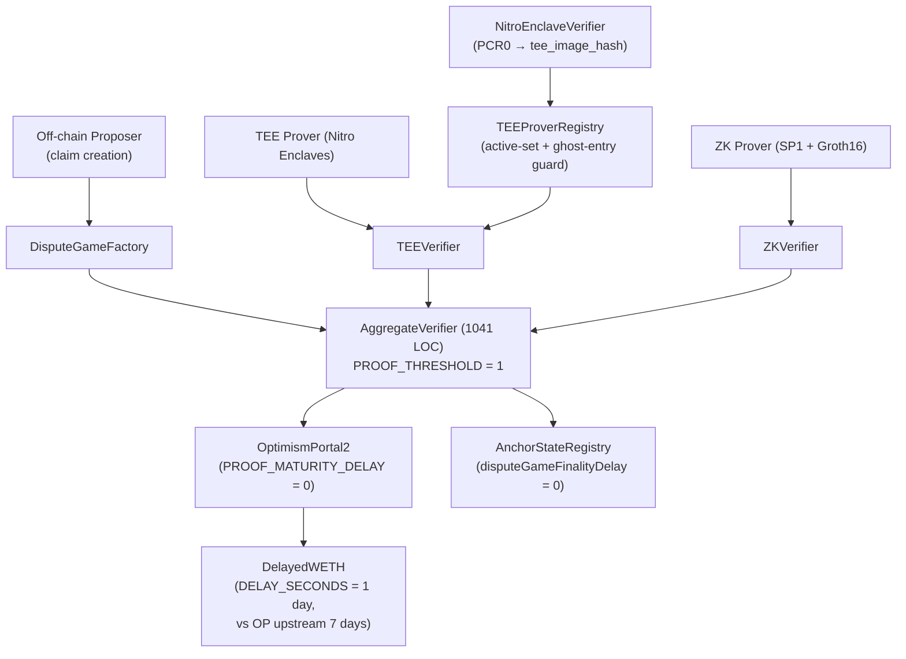
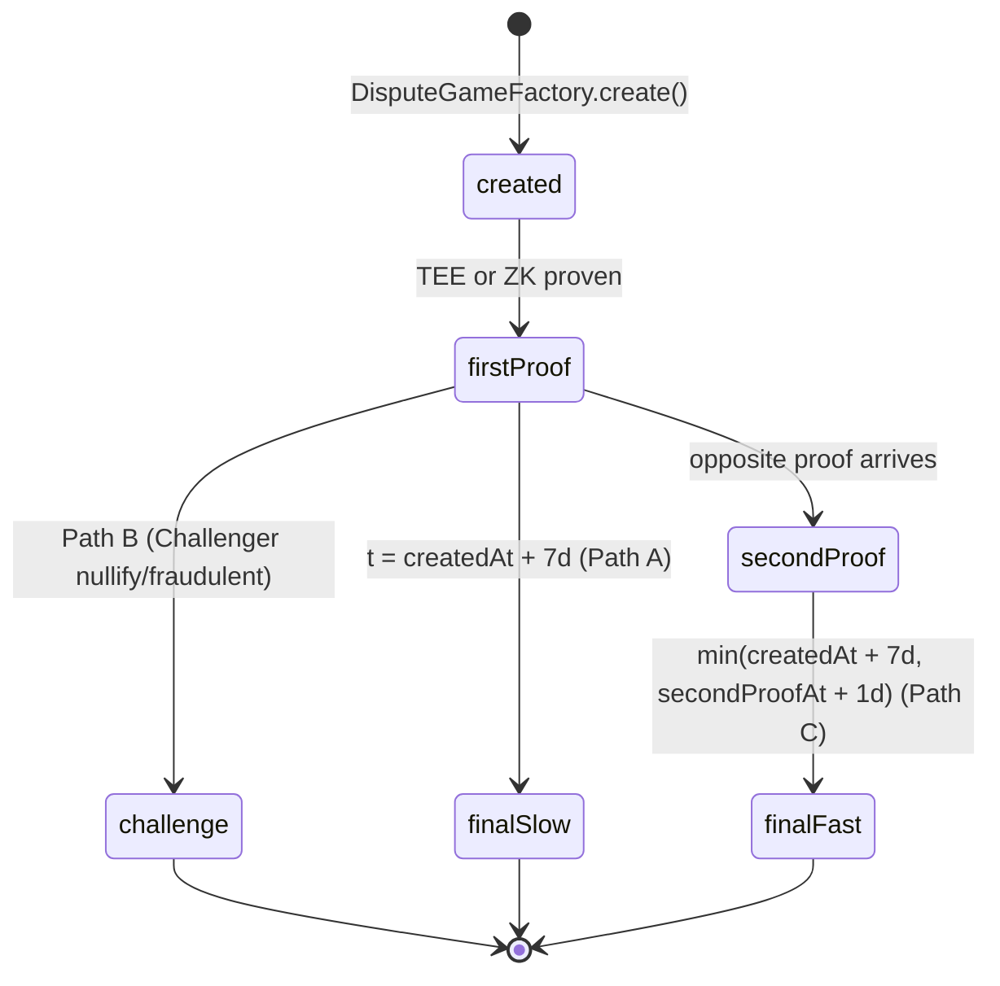
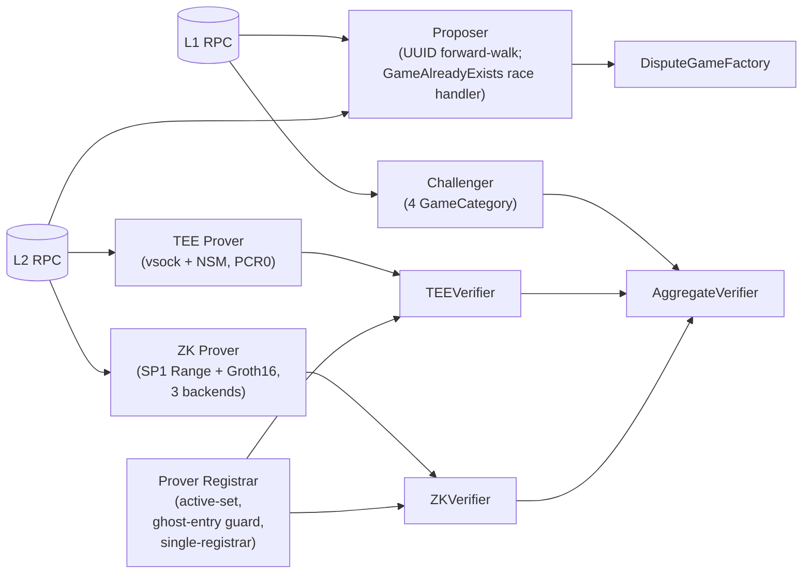
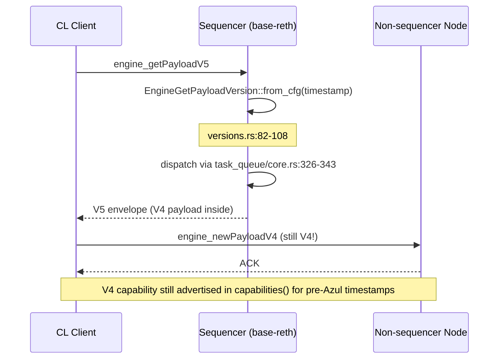

# Base Azul 升级解析 — Final Synthesis Report for Mantle Engineering

| Field | Value |
|---|---|
| **Project slug** | `base-azul-upgrade` |
| **Report date** | 2026-05-18 |
| **Author** | Technical Writer Agent (Multica Research Squad) |
| **Repository** | `Whisker17/multica-research` |
| **Report path** | `base-azul-upgrade/report/final-report.md` |
| **Diagram assets** | `base-azul-upgrade/report/assets/` (Mermaid embedded inline — see §10 Methodology Notes) |
| **Source sections aggregated** | 6 — see §9 Traceability Matrix |
| **Cut-off date for upstream evidence** | 2026-05-17 (snapshots referenced in research-sections) |

## Abstract

Base **Azul** is the upgrade that first **detaches Base's runtime from the OP Stack on three layers simultaneously** (single-client `base-reth-node`, Multiproof aggregate verifier, network-layer rewrite), while staying within the Karst-equivalent EIP envelope. This report synthesizes six research issues (WHI-27 through WHI-32) into one document organized by theme, not by issue. For Mantle engineering, the headline number is **6 of 13 canonical Azul features are already live** via the **Limb** hardfork (mainnet 2026-01-14); the remaining seven split into 4 break-change decisions, 1 verify-track item, and 2 deferred Base-only references. Section-level conclusions, cross-section conflicts, and integration gaps are surfaced explicitly in §6 and §10.

## Table of Contents

1. Executive Summary — read this first
2. Theme A — Strategic Context: why Azul detaches from OP Stack
3. Theme B — EVM Layer (Osaka EIPs) and how Base wires them
4. Theme C — Proof System Re-architecture: on-chain Multiproof
5. Theme D — Off-Chain Proof Infrastructure (5 Rust services)
6. Theme E — Network & API Layer (Flashblocks, eth/69, Engine V5, eth_config)
7. Theme F — Cross-Cutting Analysis: conflicts, consensus, gaps
8. Theme G — Mantle Impact Assessment & Recommended Actions
9. Appendix — Traceability Matrix
10. Appendix — Methodology Notes & Glossary

---

## 1. Executive Summary

**What Azul is.** A Base-only hardfork — not an OP Stack point release — built on three pillars:

1. **`base-reth-node`** replaces the legacy `op-geth + op-node` two-binary stack with a single Reth-derived client embedding REVM. ([base-strategy-azul-overview/final.md](../research-sections/base-strategy-azul-overview/final.md))
2. **Multiproof aggregate verifier** with `PROOF_THRESHOLD = 1` and dual TEE + ZK proofs that converge on a shared `OptimismPortal2` exit. Path-C "fast finality" computes `min(createdAt + 7d, secondProofAt + 1d)` so a second corroborating proof can shorten exit latency from 7 days to 1 day, but never extend it. ([multiproof-architecture/final.md](../research-sections/multiproof-architecture/final.md))
3. **Network rewrite** that combines Flashblocks payload simplification, EIP-7642 `eth/69` wire, EIP-7910 `eth_config` JSON-RPC, and an Engine API V5 envelope (carrying a still-V4 payload). ([flashblocks-network-changes/final.md](../research-sections/flashblocks-network-changes/final.md))

**EVM layer.** Azul is **specification-equivalent** to Ethereum Osaka for the five EVM EIPs (7825, 7823, 7883, 7939, 7951) — but Base reaches Osaka semantics via the single switch `BaseUpgrade::Azul => SpecId::OSAKA` in REVM, with a **deposit-transaction exemption** for the per-tx gas cap. The `p256Verify` precompile transitions from 3,450 gas (Fjord / RIP-7212) to **6,900 gas** (EIP-7951); the historical 3,450 figure is **retired**, not in conflict. ([osaka-evm-changes/final.md](../research-sections/osaka-evm-changes/final.md))

**Off-chain infrastructure.** Five **Rust services** orchestrate the Multiproof world:
Proposer (UUID forward-walk, no backward scan), Challenger (4 `GameCategory` lifecycle), TEE Prover (Nitro Enclaves + NSM, signing key never leaves enclave), ZK Prover (SP1 Range + Groth16 Aggregation, 3 backends), Prover Registrar (single-registrar assumption, ghost-entry guard for the Solady `EnumerableSetLib` v0.0.245 bug). ([multiproof-provers-challengers/final.md](../research-sections/multiproof-provers-challengers/final.md))

**Mantle status.** 6 of 13 canonical Azul features are already live via **Limb** (2026-01-14): EIP-7823, 7883, 7939, 7951, 7642, 7910. **EIP-7825** is the only EVM EIP that is **not live** — the `MaxTxGas` constant is defined but the OP-Stack `!IsOptimism()` guard at `core/state_transition.go:510` opts every OP-derived chain (Mantle included) out of enforcement. **Flashblocks** is `partially_live` (plumbing in `op-conductor` ships in `mantle-v2@v1.5.4`; mainnet deployment-config and Azul payload-schema parity are unverified). Multiproof + TEE Prover + Engine API V5 + `base-reth-node` are deferred Base-only references. ([mantle-impact-assessment/final.md](../research-sections/mantle-impact-assessment/final.md))

**Highest-priority Mantle action items** (sorted by deadline proximity):

| # | Item | Priority | Deadline pressure |
|---|---|---|---|
| 1 | **EIP-7825 enforcement decision** — keep OP-Stack opt-out permanently OR backport a Mantle-only enforcement that bypasses `!IsOptimism()`. Document publicly either way. | High | Before any "Mantle is Osaka-equivalent" public claim |
| 2 | **`op-geth` deprecation response** — Mantle's `op-geth` fork inherits the upstream EOL at **2026-05-31**, three days after Base Azul code-set mainnet. Either extend Mantle-internal maintenance, or commit to a `base-reth-node`-style single-client migration. | High | 2026-05-31 hard, no extension |
| 3 | **Flashblocks verify-track** — confirm whether mainnet `op-conductor` runs with `OP_CONDUCTOR_ROLLUPBOOST_WS_URL` populated and whether payload schema matches Azul. Plumbing exists at `op-conductor/rpc/ws/flashblocks_handler.go:1-100,180-248`. | Medium | Before any "Mantle supports Flashblocks" claim |
| 4 | **Engine API V5 wiring** | Low | Blocked on upstream Karst |
| 5 | **Permissionless ZK / Kailua harness** | Low | Tied to future multi-prover decision |

---

## 2. Theme A — Strategic Context: Why Base Azul Detaches from OP Stack

### 2.1 Three-Layer Detachment

Azul is the first Base hardfork in which the runtime, the proof system, and the network layer all diverge from the OP Stack default simultaneously:

| Layer | Pre-Azul Base | Azul Base |
|---|---|---|
| **Execution client** | `op-geth` (Geth fork) | `base-reth-node` (Reth-derived, single-binary) |
| **Fault proof** | Cannon optimistic fault game | **AggregateVerifier** with TEE + ZK provers, `PROOF_THRESHOLD = 1` |
| **Spec governance** | `superchain-registry` standard config | Base-owned `specs.base.org` definitions ahead of upstream OP Karst |

Crucially, **only the EVM EIP envelope remains shared** with upstream. Azul deliberately stays inside the Karst-equivalent EIP set so the L1 contract surface (gas costs, opcode behavior, precompile addresses) stays interoperable with Ethereum Osaka.

### 2.2 Three Strategic Goals

The research consensus identifies three Coinbase-stated goals for Azul:

1. **Stage-2 progression on L2BEAT** — replacing the Security Council's veto with the `PROOF_THRESHOLD=1` aggregate verifier (multi-prover, no human signer in the happy path).
2. **Faster exits** — Path-C `min(7d, secondProofAt + 1d)` shrinks worst-case withdrawal latency 7× when both proofs agree.
3. **Performance / UX latency** — Flashblocks 200ms preconfirmations with a payload schema trimmed to the minimum required diff against the preceding block.

### 2.3 Canonical 13-Feature Inventory (compressed)

| # | Feature | Layer |
|---|---|---|
| 1 | EIP-7823 (MODEXP 1024-byte cap) | EL |
| 2 | EIP-7825 (per-tx gas cap 16,777,216) | EL |
| 3 | EIP-7883 (MODEXP gas formula) | EL |
| 4 | EIP-7939 (CLZ opcode) | EL |
| 5 | EIP-7951 (p256Verify 6,900 gas) | EL precompile |
| 6 | EIP-7642 (eth/69 wire) | Network |
| 7 | EIP-7910 (`eth_config` RPC) | Network/API |
| 8 | Flashblocks (200ms preconf payloads) | Network/API |
| 9 | Engine API V5 envelope | Network/API |
| 10 | AggregateVerifier / Multiproof | Proof |
| 11 | TEE Prover (Nitro Enclaves TDX-style) | Proof |
| 12 | ZK Prover (SP1 Range + Groth16) | Proof |
| 13 | `base-reth-node` single-client | Runtime |

### 2.4 Activation Dual-Track (CONFLICT surfaced)

- **Sepolia testnet**: activated at L1 timestamp `1_776_708_000` (2026-04-20 18:00 UTC). At report cut-off it has ~27 days of live activity.
- **Mainnet**: `base/base` config constant `1_779_991_200` (2026-05-28 18:00 UTC). The `specs.base.org` canonical specs page lists Azul mainnet as **TBD**. The 2026-05-28 date is therefore **code-set / spec-TBD** — it reflects on-chain code intent and the Coinbase Azul blog announcement, but is not externally finalized by `specs.base.org` as of the cut-off.

→ All Mantle planning that pivots on a specific Azul mainnet date must treat 2026-05-28 as intent and revalidate against `specs.base.org` before sequencing irreversible work. Recorded in §6 (Conflicts) and §10 (Caveats).

---

## 3. Theme B — EVM Layer Alignment (Osaka EIPs)

### 3.1 Five EVM EIPs, One Switch

Base implements all five Osaka EVM EIPs through a single switch in REVM:

```rust
BaseUpgrade::Azul => SpecId::OSAKA,
```

Every per-EIP behavior (CLZ opcode, MODEXP gas reformulation, p256Verify gas, MODEXP 1024-byte cap, per-tx gas cap) is inherited from REVM's `SpecId::OSAKA` table. This is a deliberate "thin diff" choice: Base does **not** maintain Azul-specific copies of these EVM EIPs.

### 3.2 EIP-7825 with Deposit-Transaction Exemption

EIP-7825 caps individual transaction gas at `2^24 = 16,777,216`. Base introduces a **deposit-transaction exemption** inside REVM's `validate_env`:

> If the transaction is an OP-Stack deposit transaction (`tx_type == 0x7E`), skip the per-tx gas cap. This preserves the OP-Stack invariant that L1 → L2 deposits must always be includable, even when their L1-originated gas limit exceeds the cap.

This is **the** sustained code-level deviation from upstream Ethereum Osaka.

### 3.3 p256Verify Gas Transition (apparent conflict, resolved)

| Era | Gas |
|---|---|
| Fjord / RIP-7212 (pre-Azul historical) | 3,450 |
| Azul / EIP-7951 (current) | **6,900** |

The 3,450 figure that appears in some legacy Base sources is **the Fjord activation cost** and is retired by Azul. The two numbers are sequential states of the same precompile, not a contradiction. Mantle's own Everest (3,450) → Limb (6,900) transition mirrors this exactly.

### 3.4 op-geth Transitional Pin and EOL

Base pins `op-geth` to `v1.101702.2-rc.3` (commit `e8800cf`) as a transitional reference. Upstream client-team support for `op-geth` ends with the Karst / Upgrade-19 window after **2026-05-31** — only **3 days after** Base Azul code-set mainnet. After 2026-05-31, Base assumes `base-reth-node` is the canonical node binary. ([osaka-evm-changes/final.md item-6](../research-sections/osaka-evm-changes/final.md))

### 3.5 Identified Gap (G-6)

The op-geth pin lacks a unit test that exercises the EIP-7823 oversize (>1024 byte) MODEXP input rejection path. Functional coverage relies on REVM and integration suites; if a downstream consumer reuses the op-geth code path for testing only, the rejection path is exercised indirectly. ([osaka-evm-changes/final.md §5 Gap Analysis](../research-sections/osaka-evm-changes/final.md))

---

## 4. Theme C — On-Chain Proof System Re-architecture (Multiproof)

This is the most architecturally novel layer of Azul. The full code-level walkthrough is in [multiproof-architecture/final.md](../research-sections/multiproof-architecture/final.md); the synthesis below extracts the invariants Mantle engineers need to know.

### 4.1 Aggregate Verifier Topology



**Key invariants** (all hardcoded constants in `AggregateVerifier.sol`):

| Constant | Value | Line |
|---|---|---|
| `PROOF_THRESHOLD` | 1 | L68 |
| `SLOW_FINALIZATION_DELAY` | 7 days | L51 |
| `FAST_FINALIZATION_DELAY` | 1 day | L54 |

`PROOF_THRESHOLD = 1` is a **hardcoded constant**, not a deploy-time parameter. Any single TEE OR single ZK valid proof satisfies the threshold; the second proof's role is to **accelerate** finality via Path C, not to lower the security floor.

### 4.2 Three Finality Paths



| Path | Trigger | Resolution |
|---|---|---|
| **A** | One proof, no second proof | `createdAt + 7d` (slow) |
| **B** | Challenger nullify / fraudulent ZK | early termination via `nullify()` |
| **C** | Both TEE and ZK valid proofs present | `min(createdAt + 7d, secondProofAt + 1d)` |

The Path-C minimum is implemented via `FixedPointMathLib.min` at line 776 of `AggregateVerifier.sol`. The function `_decreaseExpectedResolution()` is **strictly monotonic-decreasing** — a second proof can only pull resolution earlier, never push it later. ([multiproof-architecture/final.md item-6](../research-sections/multiproof-architecture/final.md))

### 4.3 TEEVerifier / ZKVerifier — Signer Registration vs Proof Submission

The TEE path is intentionally a **two-tier system**:

1. **Signer registration** flows through `NitroEnclaveVerifier`, which checks the Nitro Enclave attestation document (PCR0, PCR1, PCR2) and derives `tee_image_hash = keccak256(PCR0)`. Only enclaves whose image hash is on the `TEEProverRegistry`'s active set may register signing keys.
2. **Proof submission** uses a `secp256k1` ECDSA signature from the previously registered key. The enclave attestation is **not** re-checked per proof — this is the latency optimization that makes per-block TEE proving viable.

Critical invariant: **the signing private key never leaves the enclave**. The host process can shut down, restart, or be tampered — the registry tie to PCR0 means only the same code image can ever re-sign.

### 4.4 DelayedWETH — 1 Day vs OP Upstream 7 Days

`DelayedWETH.DELAY_SECONDS` is an **immutable constructor argument** (line 40); Base sets it to **1 day** versus OP Stack upstream's 7 days. A 14-day bond rescue window (`claimCredit()` lines 602-609) protects against permanent loss if the recipient does not claim in time. ([multiproof-architecture/final.md item-4](../research-sections/multiproof-architecture/final.md))

### 4.5 OptimismPortal2 + AnchorStateRegistry Zeros

Both `OptimismPortal2.PROOF_MATURITY_DELAY_SECONDS` and `AnchorStateRegistry.disputeGameFinalityDelaySeconds` are set to **0** under Azul. The full finality cost lives inside `AggregateVerifier` — these surrounding delays are zeroed so they do not stack on top.

### 4.6 Identified Gaps (G-1 through G-7)

Recorded inside [multiproof-architecture/final.md §5 Gap Analysis](../research-sections/multiproof-architecture/final.md). The most material for Mantle:

- **G-2**: `PROOF_THRESHOLD = 1` is hardcoded, so increasing it (e.g., a future "require both proofs" mode) requires a contract redeploy, not a governance call.
- **G-7**: There is no on-chain mechanism to retire a compromised TEE enclave image other than removing it from `TEEProverRegistry`'s active set — `tee_image_hash` is content-addressed via PCR0 so a fixed image cannot be silently patched.

---

## 5. Theme D — Off-Chain Proof Infrastructure (5 Rust Services)

The five Rust services are the operational counterpart to §4's on-chain contracts. Full architecture in [multiproof-provers-challengers/final.md](../research-sections/multiproof-provers-challengers/final.md).

### 5.1 Service Map



### 5.2 Proposer — UUID Forward Walk

The Proposer derives the next claim via a UUID **forward** walk (not a backward scan). `MAX_FACTORY_SCAN_LOOKBACK` exists in the codebase but is a **stale variable** — the production path never invokes a backward scan.

Race handling: when two Proposers attempt to register the same game, the loser receives `GameAlreadyExists` and recovers via `pipeline.rs:545-580`, fetching the winner's claim before continuing.

### 5.3 Challenger — Four Game Categories + TEE-First nullify() Invariant

The Challenger classifies every observed game into one of four `GameCategory` values at `scanner.rs:514-577` and chooses the dispute path accordingly. The critical invariant:

> **TEE-first proofs ALWAYS resolve via `nullify()`** (`pending.rs:158-178` `PendingProof::ready_tee`).
> `challenge()` is only used for the Path-1 ZK fallback after the TEE deadline elapses.

This means a Challenger detecting a divergent TEE-side state submits `nullify()`, not `challenge()`. The asymmetry is deliberate: TEE proofs are settled fast; ZK proofs accommodate the slower SP1 generation pipeline.

`process_fraudulent_zk_challenge` issues a direct `nullify()` on a ZK proof that fails verification — bypassing the standard challenge window.

### 5.4 TEE Prover — Nitro Enclaves + NSM

| Aspect | Detail |
|---|---|
| Host ↔ Enclave channel | **vsock** (Nitro virtual socket) |
| Attestation | **NSM** (Nitro Security Module) generates Cose-signed attestation document with PCR0/1/2 |
| Image identity | `tee_image_hash = keccak256(PCR0)` — content-addressed |
| Signing key | `secp256k1` ECDSA, generated **inside** enclave, never exfiltrated |

The host process is untrusted by design — it can be replaced, paused, or restarted, but the only way to bind a key to an attested image is via the on-chain registry.

### 5.5 ZK Prover — SP1 Range + Groth16 Aggregation

- **Range proof**: SP1 zkVM proves a range of L2 blocks.
- **Aggregation**: a Groth16 circuit aggregates multiple Range proofs into a single succinct proof.
- **Backends (3)**: `cluster` (in-house Succinct cluster), `mock` (devnet), `network` (Succinct Network as a service).
- **Outbox state machine**: DB-backed FSM that survives crash + restart and ensures exactly-once submission to `ZKVerifier`.

### 5.6 Prover Registrar — Three Guards

1. **Active-set guard**: only enclaves in `TEEProverRegistry`'s active set may register keys.
2. **Majority-reachability guard**: the Registrar refuses to mutate the registry if fewer than a majority of known signers are currently reachable — prevents accidentally pruning the live signer set during a network partition.
3. **Ghost-entry guard**: a Solidity-level workaround for the **Solady v0.0.245 `EnumerableSetLib` bug**, in which removed entries can leave dangling slot data that re-emerges on subsequent inserts. The Registrar pre-checks for ghost slots before any `add()` call.

The Registrar operates under a **single-registrar assumption** — only one Registrar instance runs at a time. This is operational, not enforced on-chain.

### 5.7 Comparison vs OP Stack Cannon

| Aspect | OP Stack Cannon (legacy) | Base Azul Multiproof |
|---|---|---|
| Proof model | Single interactive bisection | Aggregate of TEE + ZK |
| Threshold | 1 honest challenger needed | `PROOF_THRESHOLD = 1` valid proof needed |
| Finality | 7 days (Path A only) | 7 days (Path A) / `min(7d, sec+1d)` (Path C) |
| Off-chain services | op-challenger + op-proposer | 5 services (Proposer, Challenger, TEE, ZK, Registrar) |
| Trust assumption | Security Council fallback | TEE enclave image + Succinct network |

---

## 6. Theme E — Network & API Layer

Full detail in [flashblocks-network-changes/final.md](../research-sections/flashblocks-network-changes/final.md).

### 6.1 Flashblocks Payload Simplification

Base's `op-rbuilder` emits Flashblocks payloads via `#[skip_serializing_none]`-annotated structs. In the Azul branch, intermediate frames set most fields to `None`, so the wire form **drops** fields that legacy clients still receive (`chain_id`, `block_number`, `block_hash`, etc.) on every intermediate frame.

**Subtle divergence**: for the `access_list` field, the Azul wire form **omits the key** (because `#[skip_serializing_none]` strips `None`), whereas the legacy spec example shows `"access_list": null`. Consumers that distinguish "absent" from "null" will see a behavior change. ([flashblocks-network-changes/final.md item-1](../research-sections/flashblocks-network-changes/final.md))

### 6.2 EIP-7642 — `eth/69` via Reth v1.11.4

Base does not implement `eth/69` locally — it inherits it via the **`paradigmxyz/reth` v1.11.4** pin. There is no Base-specific wire-protocol code beyond version negotiation. ([flashblocks-network-changes/final.md item-2](../research-sections/flashblocks-network-changes/final.md))

### 6.3 Engine API V5 Envelope + V4 Payload

**Important nuance**: Azul ships an Engine API **V5 envelope**, but the contained payload is **still V4**. There is **no `engine_newPayloadV5`** method in Azul — only `engine_getPayloadV5` on the **sequencer** build path.



`EngineGetPayloadVersion::from_cfg(timestamp)` selects V5 vs V4 by activation timestamp. For non-sequencer nodes the inbound path is unchanged from V4. This is why some monitoring tools that probe `engine_newPayloadV5` will report it as absent — that is **by design**, not a regression.

### 6.4 EIP-7910 — `eth_config` with Base-Specific Trimming

Base's `BaseEthConfigHandler` at `config.rs:54-190` returns the EIP-7910 schema with two Base-specific behaviors:

1. **`zero_blob_params()`** zeros three blob fields on the wire while leaving `min_blob_fee = BLOB_TX_MIN_BLOB_GASPRICE = 1`. Consumers that special-case `0` versus `1` see a behavior change.
2. **`sanitize_system_contracts_for_fork`** applies a **white-list** that keeps only `BeaconRoots` and `HistoryStorage` system contracts in the response. Upstream `op-geth` returns the full list — Base returns the white-listed subset. ([flashblocks-network-changes/final.md item-4](../research-sections/flashblocks-network-changes/final.md))

---

## 7. Theme F — Cross-Cutting Analysis (Conflicts, Consensus, Gaps)

### 7.1 Cross-Section Consensus

All six research sections agree on:

1. The 13-feature canonical inventory (§2.3 above).
2. `PROOF_THRESHOLD = 1` is a hardcoded compile-time constant, not a deploy-time parameter. Round-1 misreading of "deploy-time" is **explicitly retracted** by `multiproof-architecture/final.md`.
3. Path C `min(7d, secondProofAt + 1d)` is a **monotonic decrease** — second proof can never extend finality.
4. Activation: Sepolia 2026-04-20 18:00 UTC is **live**; mainnet 2026-05-28 18:00 UTC is **code-set / spec-TBD**.

### 7.2 Cross-Section Conflicts Surfaced

Per the technical-writer-reporting skill rule, conflicts are surfaced explicitly rather than smoothed over.

| # | Conflict | Resolution |
|---|---|---|
| **C-1** | **Mainnet activation date dual-track**. `base/base` config constant `1_779_991_200` (2026-05-28 18:00 UTC) vs `specs.base.org` "TBD". Coinbase blog cites 2026-05-28. | Treat 2026-05-28 as **code-set intent**. Revalidate against `specs.base.org` before sequencing Mantle deliverables on the date. |
| **C-2** | **`p256Verify` gas (3,450 vs 6,900)**. | Resolved as historical: 3,450 is the **Fjord/RIP-7212 era cost** (retired). 6,900 is EIP-7951 Azul-era cost. Mantle's Everest (3,450) → Limb (6,900) transition mirrors this. |
| **C-3** | **Engine API V5 capability semantics**. V5 envelope is advertised; `engine_newPayloadV5` does not exist; `engine_getPayloadV5` exists only on sequencer build path. | Resolved by `EngineGetPayloadVersion::from_cfg(timestamp)` switch (`versions.rs:82-108`). V4 capability is still advertised for pre-Azul timestamps; this is by design. |
| **C-4** | **Flashblocks `access_list` field**: spec example shows `"access_list": null`; code emits the field **absent** via `#[skip_serializing_none]`. | Code is authoritative. Consumers that distinguish absent from null must update. Recorded in [flashblocks-network-changes/final.md item-1](../research-sections/flashblocks-network-changes/final.md). |
| **C-5** | **`op-geth` EOL 2026-05-31 vs Base Azul mainnet 2026-05-28**. The transitional `op-geth` pin loses upstream support **3 days after** Base Azul mainnet code-set. | Resolved on Base's side by `base-reth-node` becoming canonical. For Mantle this is an **open break-change** — see §8.2. |
| **C-6** | **EIP-7825 on Mantle: constant defined but not enforced**. `params/protocol_params.go:40` defines `MaxTxGas = 1 << 24`; `core/state_transition.go:510` gates enforcement behind `!IsOptimism()`. | This is an OP-Stack-wide opt-out, not a Mantle-specific bug. **[TW inference]**: Mantle either must keep the opt-out and document it, or backport a Mantle-specific guard. |

### 7.3 Open Gaps Carried Forward

From the union of research sections' Gap Analyses:

| Gap ID | Section | Description |
|---|---|---|
| G-1 to G-7 | multiproof-architecture | Coverage limits in tracing all conditional `_decreaseExpectedResolution` callers |
| G-6 (op-geth) | osaka-evm-changes | Missing oversize EIP-7823 test in op-geth pin |
| Mantle Flashblocks | mantle-impact-assessment | Mainnet `op-conductor` deployment-config + payload-schema parity unverified |
| Arsia timestamp | mantle-impact-assessment | 2026-04-16 (L2BEAT) vs 2026-04-22 07:00 UTC (mantle-v2 v1.5.4 config `1776841200`) — 6-day delta unresolved by current sources |
| Karst spec finalization | mantle-impact-assessment | Karst is "official-pending" upstream; Base Azul ships Karst-equivalent features ahead of finalization |

### 7.4 [TW inference] Cross-Cutting Risks

Marked with `[TW inference]` because these conclusions are written by the Technical Writer Agent across multiple sections, not produced by any single research issue:

1. **[TW inference]** The combination of `PROOF_THRESHOLD = 1` hardcoded + the strictly monotonic `_decreaseExpectedResolution()` means Azul cannot be configured to require **both** TEE and ZK proofs simultaneously without a contract redeploy. Any future "stricter security mode" for high-value bridges must plan for the redeploy path.
2. **[TW inference]** The `op-geth` EOL on 2026-05-31, the Base Azul code-set mainnet on 2026-05-28, and Mantle's lack of a publicly announced node-binary migration plan combine into a **~3-day window** where any downstream chain still running `op-geth` is exposed to an unsupported EL while shipping Azul-equivalent EIPs. This is the single highest-impact non-obvious integration risk for Mantle.
3. **[TW inference]** Flashblocks plumbing presence in `mantle-v2@v1.5.4` is **necessary but not sufficient** evidence of feature support. Until the mainnet `op-conductor` config is inspected, public claims of Mantle Flashblocks parity should be qualified.

---

## 8. Theme G — Mantle Impact Assessment & Recommended Actions

Synthesized from [mantle-impact-assessment/final.md](../research-sections/mantle-impact-assessment/final.md).

### 8.1 Headline Coverage

> **6 / 13 features (46.2%) are already live on Mantle today** via the **Limb** hardfork (mainnet 2026-01-14, op-geth v1.4.2).
>
> **2 features are `partially_live`**: ZK Prover (Mantle integrates Succinct SP1 single-prover via OP Succinct; Kailua-style permissionless not yet present) and **Flashblocks** (plumbing in `op-conductor` ships in `mantle-v2@v1.5.4`; mainnet deployment-config and payload-schema parity unverified).
>
> **5 features are `not_live`**: EIP-7825, Engine API V5, AggregateVerifier/Multiproof, TEE Prover, `base-reth-node`.
>
> **3 features are `base_only_reference`** (row-primary, no Mantle adoption planned today): AggregateVerifier, TEE, ZK permissionless Kailua harness.

### 8.2 Fork-Pair Alignment Recap

```mermaid
flowchart LR
  OPStack[OP Stack canonical] -->|Cancun-era| Mantle_Everest
  Mantle_Everest --> Mantle_Euboea --> Mantle_Skadi
  Mantle_Skadi -->|Osaka EL EIPs:<br/>7823,7883,7939,7951,7642,7910| Mantle_Limb[Mantle Limb<br/>2026-01-14]
  Mantle_Limb -->|CL catchup:<br/>Canyon→Jovian collapsed,<br/>EigenDA→4844| Mantle_Arsia[Mantle Arsia<br/>2026-04-16 / 2026-04-22]
  Mantle_Arsia -->|TBD post-Karst:<br/>Engine V5,<br/>permissionless ZK| Mantle_Karst_eq[Mantle Karst-equivalent<br/>future]
```



| Mantle fork | Equivalent OP Stack arc | Karst-equivalent? |
|---|---|---|
| Limb (2026-01-14) | Osaka EL EIPs (7823, 7883, 7939, 7951, 7642, 7910) | **Partial — EL only** |
| Arsia (2026-04) | Canyon → Jovian (CL collapsed) + DA switch | **Partial — CL through Jovian** |
| Karst-equivalent (TBD) | Engine V5 + AggregateVerifier (if adopted) | **Pending** |

### 8.3 Per-Feature Verdict Table

| # | Feature | Status | Code anchor (Mantle) | Action |
|---|---|---|---|---|
| 1 | EIP-7823 | already_live | `mantlenetworkio/op-geth@9c428cf` `core/vm/contracts.go:219,706` | verify_only |
| 2 | EIP-7825 | **not_live** | `params/protocol_params.go:40` + `core/state_transition.go:510` (`!IsOptimism()` opt-out) | **adopt_track decision** |
| 3 | EIP-7883 | already_live | `core/vm/contracts.go:219`; `osakaModexpGas` at `:619` | verify_only |
| 4 | EIP-7939 | already_live | `core/vm/eips.go:44`, `eips.go:315`, `jump_table.go:97` | verify_only |
| 5 | EIP-7951 | already_live | `core/vm/contracts.go:233`; `params/protocol_params.go:178` (6900 gas) | verify_only |
| 6 | EIP-7642 | already_live | `eth/protocols/eth/protocol.go:43,47` (`ProtocolVersions = []uint{ETH69, ETH68}`) | verify_only |
| 7 | EIP-7910 | already_live | `internal/ethapi/api.go:1428` | verify_only |
| 8 | Flashblocks | **partially_live** | `op-conductor/flags/flags.go:150-159`; `conductor/config.go:87-92,193-194`; `conductor/service.go:120,326-345,435-439`; `rpc/ws/flashblocks_handler.go:1-100,180-248` | **verify_track** |
| 9 | Engine API V5 | not_live (test stubs only) | `op-devstack/sysgo/engine_client.go:67`; `op-e2e/e2eutils/geth/fakepos.go:62` | adopt_track after Karst |
| 10 | Multiproof / AggregateVerifier | not_live | NOT FOUND in `mantle-v2/packages/contracts-bedrock/src` | adopt_track only if Mantle pursues multi-prover |
| 11 | TEE Prover | not_live | NOT FOUND anywhere in `mantle-op-geth` or `mantle-v2` | not_applicable today |
| 12 | ZK Prover (permissionless) | partially_live | `snapshots/abi/OPSuccinctFaultDisputeGame.json` (ABI only); SP1 via OP Succinct | adopt_track for permissionless harness |
| 13 | `base-reth-node` | not_live | `mantle-v2@v1.5.4` still ships full `op-node/` | adopt_track contingent on single-binary migration |

### 8.4 BREAK-CHANGE Items (Active Mantle Decisions)

1. **EIP-7825 enforcement decision** (high priority) — keep the OP-Stack opt-out permanently or backport a Mantle-only guard that bypasses `!IsOptimism()`. Either choice should be documented in Mantle's upgrade notes **before** any "Mantle is Osaka-equivalent" public claim, so that L1-porting dApps understand Mantle's posture.
2. **`base-reth-node` migration framing** (medium priority) — the `mantlenetworkio/op-geth` fork loses upstream support at the 2026-05-31 EOL. Either commit to extended Mantle-internal `op-geth` maintenance (more carry cost) or migrate to op-reth + kona + op-succinct. The 5-week post-Azul window is tight.
3. **Engine API V5 wiring** (low priority) — blocked on upstream OP Stack Karst landing. No Mantle-side pressure today.
4. **Permissionless ZK / Kailua harness** (low priority) — tied to any future Mantle multi-prover decision.

### 8.5 Verify-Track (round-3 new bucket)

5. **Flashblocks deployment-config + payload-schema audit** (medium priority). Three concrete steps:
   - **(a) Mainnet config check** — confirm whether `OP_CONDUCTOR_ROLLUPBOOST_WS_URL` is set in Mantle production. Gate at `service.go:328` (`if c.cfg.RollupBoostWsURL == ""`) leaves `flashblocksHandler` nil if empty.
   - **(b) Payload-schema parity** — if WS server is live, capture sample, decode against the Base Azul simplified schema. The upstream OP Stack rollup-boost variant currently inherits the **pre-Azul** payload shape.
   - **(c) Consumer track** — Mantle devnet manifest (`kurtosis-devnet/flash.yaml:67`) points at `op-reth`, not Mantle's `op-geth` fork. Decision needed: keep `op-reth` (folds into the BREAK-CHANGE #2 single-binary discussion) or run Mantle-specific consumer.

   No Azul-deadline pressure — Flashblocks lives above `op-geth`, so 2026-05-31 EOL does not bind it. But sequence ahead of any public "Mantle supports Flashblocks" claim.

### 8.6 Source-Confirmed Mantle Timeline (Helios Bundle Retracted)

| Date | Event | Source |
|---|---|---|
| 2024-12 | Succinct Labs announces SP1 ZK plan for Mantle (still on EigenDA) | Succinct Labs blog |
| Q1 2025 | Mantle SP1 testnet target | Succinct Labs blog |
| 2025-09-16 | OP Succinct mainnet upgrade for Mantle (SP1 live, single-prover) | L2BEAT chronicle |
| 2026-01-14 | Mantle Limb hardfork (Osaka EL EIPs go live) | op-geth v1.4.2 |
| 2026-04-16 / 2026-04-22 07:00 UTC | Mantle Arsia hardfork (CL catchup + DA switch from EigenDA to 4844) | L2BEAT vs mantle-v2 v1.5.4 config (6-day delta unresolved) |
| **2026-05-28 (code-set / spec-TBD)** | Base Azul mainnet — intent, not externally confirmed | Coinbase blog; `base/base` constant `1_779_991_200` |
| **2026-05-31** | `op-geth` upstream EOL (Ethereum Foundation EL client team) | EF announcement on OP Stack docs |

Round-1's bundled "2025-03-19 Helios" date claim is **explicitly retracted** — no source proves a unified RETH+REVM deployment on that date.

---

## 9. Appendix — Traceability Matrix

Every key conclusion in this report traces to a research issue and GitHub section path.

| Conclusion | Research issue | Final section path |
|---|---|---|
| Three-layer detachment from OP Stack | WHI-27 base-strategy-azul-overview | `base-azul-upgrade/research-sections/base-strategy-azul-overview/final.md` |
| Three strategic goals (Stage-2, fast exits, Flashblocks UX) | WHI-27 | same as above |
| 13-feature canonical inventory | WHI-27 | same as above |
| Activation dual-track Sepolia/Mainnet | WHI-27 | same as above |
| `BaseUpgrade::Azul => SpecId::OSAKA` single switch | WHI-28 osaka-evm-changes | `base-azul-upgrade/research-sections/osaka-evm-changes/final.md` |
| Deposit-tx exemption for EIP-7825 | WHI-28 | same as above |
| `p256Verify` 3450 → 6900 transition (not a conflict) | WHI-28 | same as above |
| `op-geth` pin `v1.101702.2-rc.3` + 2026-05-31 EOL | WHI-28 | same as above |
| Gap G-6 missing EIP-7823 oversize test | WHI-28 | same as above |
| `PROOF_THRESHOLD = 1` hardcoded at L68 | WHI-29 multiproof-architecture | `base-azul-upgrade/research-sections/multiproof-architecture/final.md` |
| `SLOW_FINALIZATION_DELAY = 7d` L51, `FAST = 1d` L54 | WHI-29 | same as above |
| Path C `min(createdAt+7d, secondProofAt+1d)` at L776 | WHI-29 | same as above |
| `_decreaseExpectedResolution()` strictly monotonic | WHI-29 | same as above |
| DelayedWETH `DELAY_SECONDS = 1d` vs OP upstream 7d | WHI-29 | same as above |
| OptimismPortal2 + AnchorStateRegistry delays = 0 | WHI-29 | same as above |
| 14-day bond rescue window `claimCredit()` L602-609 | WHI-29 | same as above |
| Flashblocks `#[skip_serializing_none]` + access_list absent vs null | WHI-30 flashblocks-network-changes | `base-azul-upgrade/research-sections/flashblocks-network-changes/final.md` |
| EIP-7642 inherited via reth v1.11.4 | WHI-30 | same as above |
| Engine API V5 envelope, V4 payload, no `engine_newPayloadV5` | WHI-30 | same as above |
| `EngineGetPayloadVersion::from_cfg` at versions.rs:82-108 | WHI-30 | same as above |
| `zero_blob_params()` zeros 3 fields but `min_blob_fee=1` | WHI-30 | same as above |
| `sanitize_system_contracts_for_fork` white-list (BeaconRoots + HistoryStorage) | WHI-30 | same as above |
| 5 Rust services (Proposer/Challenger/TEE/ZK/Registrar) | WHI-31 multiproof-provers-challengers | `base-azul-upgrade/research-sections/multiproof-provers-challengers/final.md` |
| Proposer UUID forward walk; `MAX_FACTORY_SCAN_LOOKBACK` stale | WHI-31 | same as above |
| GameAlreadyExists race handler at `pipeline.rs:545-580` | WHI-31 | same as above |
| Challenger 4 GameCategory at `scanner.rs:514-577` | WHI-31 | same as above |
| TEE-first ALWAYS uses `nullify()` (`pending.rs:158-178`) | WHI-31 | same as above |
| TEE vsock + NSM + `tee_image_hash = keccak256(PCR0)` | WHI-31 | same as above |
| ZK SP1 Range + Groth16 with 3 backends (cluster/mock/network) | WHI-31 | same as above |
| Registrar single-registrar assumption + ghost-entry guard (Solady v0.0.245 bug) | WHI-31 | same as above |
| 6/13 features (46.2%) already live on Mantle | WHI-32 mantle-impact-assessment | `base-azul-upgrade/research-sections/mantle-impact-assessment/final.md` |
| EIP-7825 Mantle opt-out via `!IsOptimism()` (`state_transition.go:510`) | WHI-32 | same as above |
| Flashblocks `partially_live` + verify-track | WHI-32 | same as above |
| 4 BREAK-CHANGE items + 1 verify-track | WHI-32 | same as above |
| Source-confirmed timeline; Helios bundle retracted | WHI-32 | same as above |

---

## 10. Appendix — Methodology Notes & Glossary

### 10.1 Methodology Notes

- **Synthesis approach**: organized by **theme** (Strategic / EVM / Proof / Off-chain / Network / Mantle Impact), not by research issue. Within each theme, the synthesis preserves direct citations to the source research section.
- **Conflicts are surfaced, not smoothed** (§7.2): six discrete cross-section conflicts (C-1 … C-6) are catalogued with their resolution status. Where no resolution exists in research, the conflict is marked **open** and inherited as an integration risk.
- **`[TW inference]` markers** distinguish Technical Writer cross-cutting synthesis (e.g., the `op-geth` EOL × Mantle migration timing risk in §7.4) from research-issue findings. Three TW inferences are marked in §7.4.
- **Diagrams**: rendered as **Mermaid** throughout. Per `diagram-upgrade-guide.md`, architecture/topology diagrams (e.g., §4.1, §5.1) would normally be upgraded with `/fireworks-tech-graph`, but that skill is **not accessible at runtime in this Technical Writer Agent's environment**. Per the fallback rule in the guide, all diagrams ship as Mermaid and this gap is recorded both here and in the §10.3 completion-comment integration gaps. The Mermaid source is inline in the report and renders natively on GitHub.
- **Source coverage**: each research issue includes its own per-source minimum requirement matrix (Source Coverage sections). This report does not re-verify those — it trusts the adversarial-review-approved state of each `final.md`.

### 10.2 Glossary (selected acronyms)

| Term | Definition |
|---|---|
| **AggregateVerifier** | Base Azul aggregate dispute-game verifier (1041 LOC Solidity). `PROOF_THRESHOLD = 1`. |
| **base-reth-node** | Base's single-binary client replacing `op-geth + op-node`. Reth-derived; embeds REVM. |
| **Cannon** | OP Stack's legacy single-prover interactive bisection fault-proof game. |
| **CLZ** | Count-leading-zeros opcode at 0x1E. EIP-7939. |
| **DelayedWETH** | OP-Stack contract holding bonded WETH with timed withdrawal delay; Azul uses 1 day vs upstream 7. |
| **eth/69** | EIP-7642 wire protocol. Removes Receipt's Bloom from gossip. |
| **`eth_config`** | EIP-7910 JSON-RPC method returning current/next/last chain config. |
| **Flashblocks** | Base's 200ms preconfirmation stream emitted by op-rbuilder via rollup-boost. |
| **GameCategory** | Challenger classification of an observed dispute game (4 values). |
| **Karst** | OP Stack canonical fork that lands the Osaka EL EIPs + Engine API V5. Official-pending at cut-off. |
| **Limb** | Mantle hardfork (2026-01-14) bringing Osaka EL EIPs. |
| **Arsia** | Mantle hardfork (2026-04) collapsing OP Stack Canyon→Jovian + DA switch from EigenDA to 4844. |
| **MODEXP** | Modular exponentiation precompile at 0x05. Subject to EIP-7823 (1024-byte cap) and EIP-7883 (new gas formula). |
| **NSM** | Nitro Security Module — generates Cose-signed attestation documents inside AWS Nitro Enclaves. |
| **`nullify()`** | TEE-first Challenger entry point in `AggregateVerifier`. |
| **PCR0** | Platform Configuration Register 0 — hash of the Nitro Enclave image. `tee_image_hash = keccak256(PCR0)`. |
| **`PROOF_THRESHOLD`** | Hardcoded constant in `AggregateVerifier.sol` (L68). Value = 1 under Azul. |
| **REVM** | Rust EVM implementation embedded in `base-reth-node`. |
| **SP1** | Succinct's zkVM. Used in two stages: Range proof + Groth16 aggregation. |
| **TEE Prover** | Base's AWS Nitro Enclaves-based prover service. `secp256k1` signing key stays inside the enclave. |
| **TEEProverRegistry** | On-chain registry of active enclave images (by `tee_image_hash`). |
| **vsock** | Linux virtual socket — host ↔ Nitro Enclave communication channel. |

### 10.3 Integration / Coverage Gaps (carried into completion comment)

The following gaps are recorded here so they propagate to the §8.10 completion comment:

1. **`/fireworks-tech-graph` unavailability** — all architecture and topology diagrams rendered as Mermaid per fallback rule. Future TW runs with the skill enabled should upgrade §4.1 (Aggregate verifier topology) and §5.1 (Off-chain service map) for polished spatial layout.
2. **Mainnet activation date** — 2026-05-28 is code-set / spec-TBD; `specs.base.org` should be re-verified before any Mantle action calendar pivots on the date.
3. **Mantle Flashblocks mainnet config + payload-schema parity** — not verified in source; verify-track item in §8.5.
4. **Arsia activation timestamp 6-day delta** — L2BEAT 2026-04-16 vs `mantle-v2 v1.5.4` config 2026-04-22 07:00 UTC; sources do not resolve.
5. **Multiproof Gap Analysis G-1 … G-7** — see [multiproof-architecture/final.md §5 Gap Analysis](../research-sections/multiproof-architecture/final.md).

---

*End of report.*
