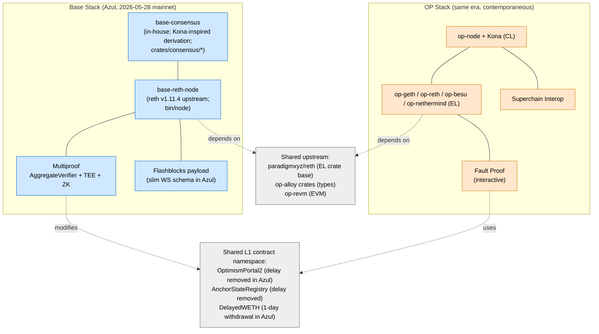
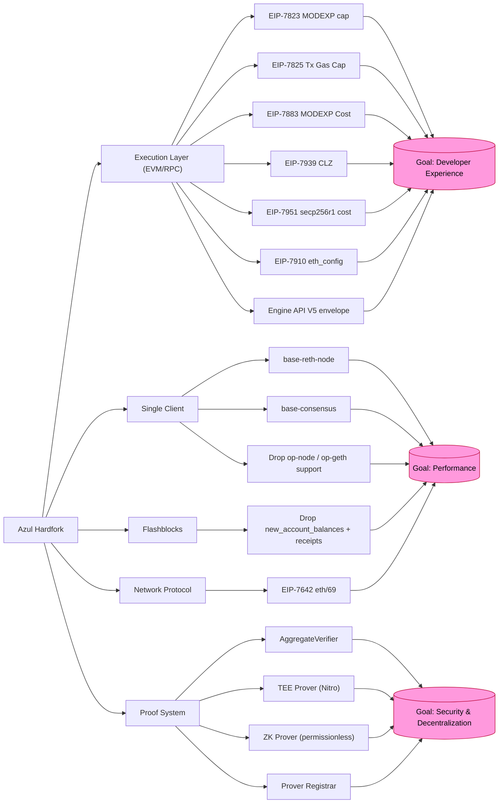
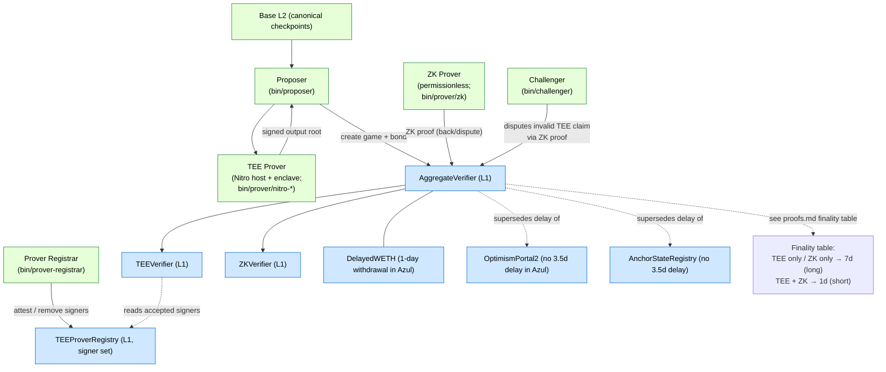
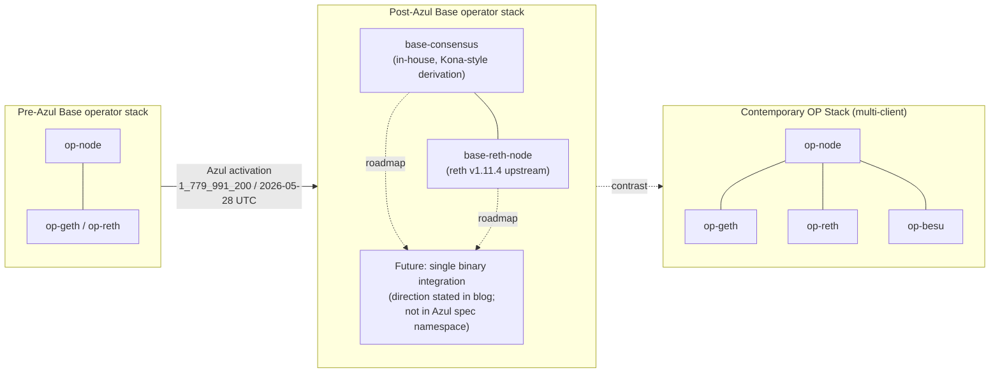
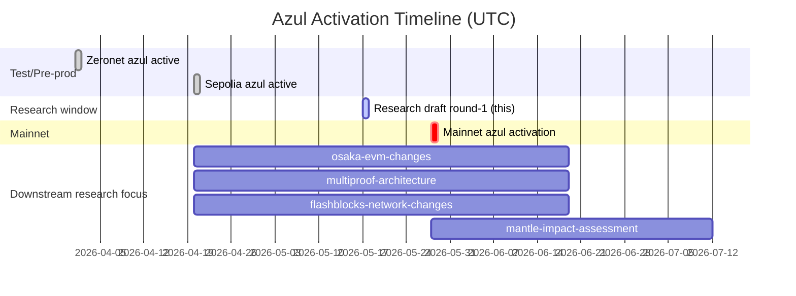

# Base 脱离 OP Stack 战略分析与 Azul 升级总览

## 1. Executive Summary

Azul 是 Base 在 2026 年 4–5 月部署的首个 hardfork，其规范层面位于 `specs.base.org/upgrades/azul/*`、其代码实现位于 `github.com/base/base`，并将 Base mainnet 的硬分叉激活时间锚定在 **`1_779_991_200`（UTC 2026-05-28 18:00:00）**（源：`base/base` commit `84155fef0c50f7799e804c757e078306848f032e`，文件 `crates/common/chains/src/config.rs:340`）。Sepolia 早期激活时间为 **`1_776_708_000`（UTC 2026-04-20 18:00:00）**（同文件第 412 行，与 `docs/specs/pages/upgrades/azul/overview.md:21` 一致）。截至本研究撰写日期 **2026-05-17**，Sepolia 已激活 27 天，Mainnet 还有 11 天激活；spec overview 页面的「Mainnet TBD」与 blog 公开稿之间存在表述差异，需以代码常量为准（详见 §8 与 Gap Analysis）。

Azul 的实际新特性可以归入五条平行的工作线，共同服务于 Base 公开宣示的三大目标：

1. **安全与去中心化（Multiproof / Stage 2 路径）** — 引入 `AggregateVerifier` L1 争议博弈合约、TEE Prover、permissionless ZK Prover、Prover Registrar、Proposer/Challenger 角色；同时削减 `OptimismPortal2`、`AnchorStateRegistry`、`DelayedWETH` 的多日延迟，把 finality delay 集中迁移到 `AggregateVerifier`。
2. **性能（客户端整合）** — Azul 之后 Base 仅支持 `base-reth-node`（执行）与 `base-consensus`（共识）两个一方客户端，并明确「`op-node` / `op-geth` 等 OP Stack 上游客户端在激活后不再被支持」（spec overview）。
3. **开发者体验（Ethereum Osaka 对齐）** — 在执行层引入 EIP-7823、EIP-7825、EIP-7883、EIP-7939、EIP-7951、EIP-7642、EIP-7910 七条 Osaka EIP，加上 Flashblocks WebSocket payload 精简和 Engine API V5 envelope。

「Base 脱离 OP Stack」是一个分析性假说，本研究将其拆为三层来论证：(a) **代码 fork 层** — 是的，Base 通过 base-reth-node + base-consensus 切换为一方客户端，明确停止支持 op-node/op-geth；(b) **规范 fork 层** — 部分，Azul 在 `specs.base.org` 自有命名空间下声明，但 EVM 层与 Osaka 保持等价，且数据可用性、桥接 (deposits)、L1 settlement 合约（`OptimismPortal2`、`AnchorStateRegistry`、`DelayedWETH`）仍沿用 OP Stack 名义与已部署合约；(c) **治理与 Superchain 边界层** — Base 仍属于 Coinbase / OP Foundation 体系下、Superchain 互操作叙事的一员，但单客户端 + 自主升级节奏意味着 Base 已具备先于 OP Stack 升级路径独立推进的能力。后续 §1 的 item-1 详述。

下游研究（`osaka-evm-changes`、`multiproof-architecture`、`multiproof-provers-challengers`、`flashblocks-network-changes`、`mantle-impact-assessment`）应以本节为全局坐标，并参考 §10 的 cross-topic 边界说明。

---

## 2. Item Findings

### 2.1 item-1: Base 脱离 OP Stack 的战略动机与背景

**high_level_summary**

Azul 是 Base 第一次在执行层、共识层与升级节奏三个维度同时与上游 OP Stack 解耦的硬分叉。spec overview 用一段醒目的 warning 明确这一立场：「Only `base-consensus` and `base-reth-node` will support the Base Azul hardfork. If you are running `op-node`, `op-geth`, or any other clients, you will need to update them prior to the activation date」（`docs/specs/pages/upgrades/azul/overview.md:5-9`）。这是 Base 第一次以「dropping support」的口径而非「supports new fork on existing clients」的口径发布升级公告，是分析性「脱离 OP Stack」假说最强的直接证据。

**design_motivation**

Base 公开叙事强调三个动机：(i) Stage 2 路线对去信任化的硬性要求 — 旧的交互式 fault proof 在 7 天挑战窗口下提款，且要求挑战者主动出资覆盖每一次错误声明，spec 直接点名「centralized guardrails reduce that risk today, but that is not a long-term model for Stage 2 decentralization」（`proofs.md:20-21`）；(ii) 性能 — 一方客户端可以省去多客户端兼容层的开销，且为「1 gigagas/s」级别吞吐和未来 single-binary 整合预留空间（spec 在 overview 页面未直接给出 1 gigagas/s 数字，blog 提到该长期目标，需在 client-architecture 子课题中以 README/release notes 为准核实）；(iii) DX — 与 Ethereum Osaka EVM 等价以减少跨链应用碎片化。可观察事实层面，截至 commit `84155fef`，Base 仓库内已不再 vendoring `op-node` / `op-geth`，而是直接在 `bin/consensus/`、`bin/node/` 下维护自有二进制，且通过 `paradigmxyz/reth` v1.11.4 作为上游而非 `ethereum-optimism/op-reth`（`Cargo.toml` 中 `reth-* = { git = "https://github.com/paradigmxyz/reth", tag = "v1.11.4" }`）。

**target_goal_mapping**

| 目标 | 与 item-1 的对应 |
|---|---|
| 安全 & 去中心化 | 单客户端 + Multiproof 共同支撑 Stage 2；脱离 OP Stack 的客户端兼容性是 Multiproof 设计自由度的前提 |
| 性能 | 不再受 OP Stack 多客户端最小公倍数约束；执行层可以更激进地与 reth upstream 同步 |
| DX | 通过自治节奏更快地集成 Osaka EVM，避免被 Superchain 多 fork 协调拖慢 |

**comparison_to_op_stack**

OP Stack 在 2026 年仍维持「多客户端 + 多 L2 共享 codebase」策略，`ethereum-optimism/optimism` 仓库继续承载 `op-node`、`op-geth`、`op-reth`、`op-besu` 等参考实现。Azul 之后 Base 在客户端层不再以「成为 OP Stack 多客户端集合中的一员」自居，转为「reth + 自有共识」单客户端 fork。但合约层（`OptimismPortal2`、`AnchorStateRegistry`、`DelayedWETH`）仍以 Optimism 命名空间存在并被 Azul 直接修改，spec `proofs.md:40-67` 中明确「`OptimismPortal2` no longer adds the separate 3.5 day proof-maturity delay…`AnchorStateRegistry`… no longer has a 3.5 day finalization delay」。这说明 Base 不是从 OP Stack「另起炉灶」，而是在保留 Optimism 标准合约形态的前提下，更换证明系统、削减时延并切换客户端来源。

**key_artifacts_and_specs**

- `docs/specs/pages/upgrades/azul/overview.md` — Spec 入口、激活时间、特性清单
- `docs/specs/pages/upgrades/azul/proofs.md` — Multiproof 设计哲学与 finality 表
- `docs/specs/pages/upgrades/azul/exec-engine.md` — 全部 Osaka EIP 与 Flashblocks payload 精简
- `docs/guides/UPGRADES.md` — Genesis 字段 `azul_time` 描述
- `crates/common/chains/src/config.rs:340 / :412 / :475 / :527` — 四个网络的 azul_timestamp
- Public: `https://blog.base.dev/introducing-base-azul`、`https://specs.base.org/upgrades/azul/overview`

**risks_open_questions**

- 「脱离 OP Stack」一词在 Base 官方稿件中并未直接出现；本研究将其定义为客户端层 + 升级节奏层的事实分叉，并保留治理与合约层的连续性。表述上需慎用「分裂」「fork Optimism」等更强烈的措辞。
- Blog 与 spec 在 Mainnet 激活时间上不一致：blog 抓取摘要给出「May 13, 2026」，spec overview 给出「TBD」，code config 给出 `1_779_991_200`（2026-05-28 18:00 UTC）。本研究以 code config 为准，并在 §8 详述。
- Base 在脱离 op-node/op-geth 后，对 Superchain interop（共享 standard config、共享桥）的承诺如何延续，目前无公开 governance proposal 直接背书，是下游 `mantle-impact-assessment` 与潜在的 superchain-interop 课题需要追问的问题。

**cross_topic_dependencies**

- 与 `multiproof-architecture`：本节只给出 high-level finality 表与角色定义，详细合约/Prover 内部逻辑由 `multiproof-architecture` 与 `multiproof-provers-challengers` 接手。
- 与 `osaka-evm-changes`：本节列出 7 条 Osaka EIP 的 selection 逻辑，详细 opcode/precompile 计价由 `osaka-evm-changes` 落到字段宽度、cost table 层。
- 与 `flashblocks-network-changes`：本节描述 Flashblocks payload 精简的方向与动机，具体 WebSocket schema diff 由其接手。
- 与 `mantle-impact-assessment`：本节只对 OP Stack 生态影响给 high-level 判断，Mantle 等 OP Stack fork 是否会跟进单客户端策略不在本研究范围。

---

### 2.2 item-2: Base Stack vs OP Stack 的架构与定位差异

**high_level_summary**

Azul 之后的 Base Stack 可以概括为「base-reth-node（reth fork）+ base-consensus（自研、derivation pipeline 沿用 OP Stack 风格）+ Multiproof（TEE + ZK）+ Flashblocks payload + 标准 OP 风格 settlement 合约」。OP Stack 在同期则是「op-node + op-geth/op-reth/op-besu 多客户端 + 交互式 Fault Proof + Interop 多链桥接 + 标准 OP 桥」。

**design_motivation**

OP Stack 的设计哲学是「Superchain：一套共享 codebase，多个 L2 通过 standard config + interop messaging 互操作」。Base Stack 的设计哲学是「优化 Base 一条链的性能与 Stage 2 进度，使用 OP 合约 + OP 风格 derivation 作为兼容底座，但客户端与证明系统不再受多链协调约束」。这两个哲学在桥与合约层兼容，在客户端与升级节奏层分叉。

**target_goal_mapping**

| 维度 | Base Stack | OP Stack（同期） |
|---|---|---|
| 执行客户端 | 仅 `base-reth-node`（依赖 `paradigmxyz/reth v1.11.4`，见 `Cargo.toml`） | `op-geth`、`op-reth`、`op-besu`、`op-nethermind`（多客户端策略，[OPUS INFERRED]需在下游研究核验最新列表） |
| 共识客户端 | 仅 `base-consensus`（位于 `bin/consensus/`，derivation 拆分为 `attributes/pipeline/sources/stages/...`） | `op-node`（参考实现）+ `kona`（Rust 实现，[OPUS INFERRED]） |
| 证明系统 | Multiproof（TEE + ZK，三窗口 finality） | Fault Proof（交互式，单一证明路径） |
| Sequencer / PreConf | Flashblocks 已上线，Azul 精简 WS payload | OP Stack interop 尚未统一 PreConf 形态 |
| 升级治理 | Base 自有 spec namespace + 自有发版节奏 | Superchain governance + Optimism Foundation 协调 |
| 共享合约 | `OptimismPortal2`、`AnchorStateRegistry`、`DelayedWETH` 沿用 OP 命名 | 同上（Base 沿用） |

**comparison_to_op_stack**

三层差异必须严格区分：

- **代码 fork**：Base 已脱离 OP Stack 客户端 codebase（不再 vendor `op-node/op-geth`），但仍消费 `op-alloy`/`op-revm` crate（`Cargo.lock` 中可见 `op-alloy 0.23.1`、`op-revm 15.0.0`），说明 EVM 与 alloy 类型层的复用关系仍在。
- **规范 fork**：Azul spec 在 `specs.base.org` 自有命名空间下发布，但保留 OP 风格的 hardfork 概念、deposit transaction 形态、Engine API V3/V4/V5 接口（`exec-engine.md:91-99`），EL 与 Ethereum L1 几乎完全等价（除 blob 不支持以外）。
- **治理边界**：Base 仍属 Coinbase / OP Foundation 生态，Superchain 互操作叙事尚未公开撤回，但单客户端 + 自有升级节奏意味着 Base 与 Optimism mainnet 的升级窗口可以错开，治理上具备独立推进 hardfork 的能力。

**key_artifacts_and_specs**

- `bin/node/Cargo.toml`（base-reth-node binary 入口）、`bin/consensus/Cargo.toml`（base-consensus binary 入口）、`crates/consensus/` 下的 13 个子 crate
- `Cargo.toml` workspace `reth-*` deps 全部指向 `paradigmxyz/reth tag v1.11.4`
- `docs/specs/pages/upgrades/azul/proofs.md:40-67`（合约层未改变命名空间）
- `crates/common/chains/src/config.rs`（mainnet/sepolia/devnet/zeronet 四个网络的统一配置）

**risks_open_questions**

- base-consensus 与 Kona 的关系：outline 早期假设为「基于 Kona」，但本研究在 `Cargo.lock` 中未发现直接的 `kona` crate 依赖，base-consensus 的 derivation 子模块（`attributes/pipeline/sources/stages`）虽采用 Kona 风格分层，但应描述为「Kona-inspired 架构」而非「fork of Kona」，详细确认留给 `client-architecture` 子课题（如有）。
- OP Stack 多客户端的最新清单（op-besu、op-nethermind 状态）需在 `mantle-impact-assessment` 或独立 Superchain 课题中核实，本研究不主张特定数字。

**cross_topic_dependencies**

依赖 item-1 的脱离动机叙事；为 item-6（单客户端路线）提供对照；与 item-8 共同支撑生态影响判断。

---

### 2.3 item-3: Azul 升级三大设计目标与全局设计哲学

**high_level_summary**

Azul 的三大设计目标，按 spec overview 与 proofs.md 的措辞抽象为：

1. **安全 & 去中心化**：从「交互式 fault proof + 集中化 guardrail」迁移到「双证明 + permissionless ZK 兜底」，目标是踏入 L2Beat Stage 2。
2. **性能**：通过单客户端 + Flashblocks payload 精简，向高吞吐（blog 提及 1 gigagas/s 长期方向）与低延迟出块持续优化。
3. **开发者体验**：通过 Osaka EIP 对齐 + Engine API V5 信封 + `eth_config` RPC，把 Base 的 EVM 行为收敛到 L1 同步轨道。

**design_motivation**

spec `proofs.md:14-25` 明确写出从 fault proof 切换到 multiproof 的两条根因：「withdrawals take at least 7 days because every proposal inherits the full challenge window」「every bad proposal must be actively challenged…centralized guardrails reduce that risk today, but that is not a long-term model for Stage 2 decentralization」。这两句话是「安全 & 去中心化」目标的官方表述。性能目标在 spec 中并未直接给出量化值（1 gigagas/s 出自 blog，本研究保守表述为「为更高吞吐的客户端整合预留空间」）；DX 目标的表述根据 EIP 选择集合反推：所有被纳入的 Osaka EIP 都属于 L1 已公开的等价子集（见 item-7）。

**target_goal_mapping**

| 目标 | 主要承载 feature | 次要支撑 feature |
|---|---|---|
| 安全 & 去中心化 | Multiproof（`AggregateVerifier`、TEE/ZK Prover、Prover Registrar） | `DelayedWETH` 1-day withdrawal、`OptimismPortal2` 去时延 |
| 性能 | base-reth-node + base-consensus 单客户端、Flashblocks payload 精简、`eth/69` 协议简化 | EIP-7825 交易 gas 上限（边界化资源使用） |
| DX | EIP-7823/7825/7883/7939/7951/7910 与 L1 对齐、`engine_getPayloadV5` 信封 | `eth_config` RPC（EIP-7910） |

**comparison_to_op_stack**

OP Stack 同期的去中心化叙事仍以「Fault Proof + Interop」为主轴；OP Stack 的「Stage 2 路线」公开报道里更强调 multiple Fault Proof 证明系统并行（fault proof modularity），与 Azul 的「TEE + ZK 双证明」是同一问题域的不同解法（[OPUS INFERRED]：OP Stack 路线的最新细节本研究未直接引用 spec 原文，留待独立 Superchain 课题核验）。

**key_artifacts_and_specs**

- `docs/specs/pages/upgrades/azul/overview.md`（目标的纲领性陈述）
- `docs/specs/pages/upgrades/azul/proofs.md:14-49`（safety/decentralization 段落 + finality table）
- `docs/specs/pages/upgrades/azul/exec-engine.md`（DX 目标的具体 EIP 集合）

**activation_timeline_relevance**

三大目标在 Sepolia 已于 2026-04-20 18:00 UTC 全部激活；Mainnet 在 2026-05-28 18:00 UTC 激活后正式生效（per code config）。Audit competition、Vibenet 等运营节点不属于规范层，本研究只提及其在 item-8 出现的事实。

**risks_open_questions**

- 「1 gigagas/s」量化目标的官方 spec 锚点目前在 blog 而非 spec namespace 中；本研究表述为「长期方向」，量化论证留给 `client-architecture`（若有）或下游性能子课题。
- Multiproof 的「短窗口 1 day」是否会在 mainnet 上线初期被启用，spec 没有给出明确日期；需要监控 mainnet 激活后的 governance / blog 公告。

**cross_topic_dependencies**

为 item-4/5/6/7 提供分类基线；为 item-8 提供时间锚点。

---

### 2.4 item-4: Azul 完整 Feature 清单、分类与目标映射

**high_level_summary**

将 spec overview 与各子页面交叉确认后，Azul 的全部对外 feature 清单可分入下表的五类（共 13 条）：

| # | Feature | 所属 sub-spec | 影响层 | 主要目标 | 次要目标 |
|---|---|---|---|---|---|
| 1 | EIP-7823 Upper-Bound MODEXP | exec-engine | EL（precompile） | DX | 性能 |
| 2 | EIP-7825 Transaction Gas Limit Cap | exec-engine | EL（共识验证） | DX | 性能 |
| 3 | EIP-7883 MODEXP Gas Cost Increase | exec-engine | EL（precompile cost） | DX | 安全（DoS 抗性） |
| 4 | EIP-7939 CLZ Opcode | exec-engine | EL（opcode） | DX | 性能 |
| 5 | EIP-7951 secp256r1 Precompile（重新计价） | exec-engine | EL（precompile cost） | DX | 性能 |
| 6 | EIP-7642 eth/69 wire protocol | exec-engine#eth69 | 网络（execution P2P） | 性能 | DX |
| 7 | EIP-7910 `eth_config` RPC | exec-engine#eth_config-rpc-method | 应用 / RPC | DX | 安全（fork awareness） |
| 8 | Flashblocks payload 精简（移除 `new_account_balances` 与 `receipts`） | exec-engine#remove-account-balances--receipts | 应用 / WebSocket | 性能 | DX |
| 9 | Engine API V5 envelope（`engine_getPayloadV5`） + 保留 `engine_newPayloadV4` 路径 | exec-engine#engine-api-usage | EL ↔ CL 接口 | DX | 性能 |
| 10 | Multiproof / `AggregateVerifier` 合约 + finality 重排 | proofs.md | L1 合约 + Prover | 安全 & 去中心化 | 性能（1-day 提款） |
| 11 | TEE Prover（AWS Nitro Enclave） + Prover Registrar | proofs.md#tee-provers / #prover-registrar | 链下基础设施 | 安全 & 去中心化 | — |
| 12 | ZK Prover（permissionless） | proofs.md#zk-provers | 链下基础设施 | 安全 & 去中心化 | — |
| 13 | 单客户端：base-reth-node + base-consensus 唯一支持 | overview warning + bin/* | 客户端 | 性能 | 安全（生态边界收敛） |

**design_motivation**

每一行的目标映射理由：执行层 7 条 EIP 全部出自 Ethereum Osaka，其纳入逻辑见 item-7；Flashblocks payload 精简的动机是「降低 WebSocket 订阅者带宽与处理负担」，spec 在 `exec-engine.md:53-86` 给出 before/after JSON 对比；Engine API V5 envelope 是为了与 Ethereum Pectra/Osaka 的 payload 信封演进同步；Multiproof / 单客户端两条是 §2.5 / §2.6 的主题。

**target_goal_mapping**

按目标聚合：
- **安全 & 去中心化**：行 #10, #11, #12（核心）；行 #3, #13（次要）
- **性能**：行 #6, #8, #9, #13（核心）；行 #1, #2, #4, #5, #10（次要）
- **DX**：行 #1, #2, #4, #5, #7, #9（核心）；行 #6, #8（次要）

**comparison_to_op_stack**

[OPUS INFERRED]：OP Stack 同期是否纳入相同 Osaka EIP 集合需独立核验，本研究未引用 `optimism` 仓库 spec 原文；可观察事实是 Base 在 Azul 已显式列出 7 条 EIP，而 Multiproof / 单客户端两类则是 Base 特有。

**key_artifacts_and_specs**

- `docs/specs/pages/upgrades/azul/overview.md` — 完整 feature 清单（spec 视角）
- `docs/specs/pages/upgrades/azul/exec-engine.md` — 行 #1–#9 的规范主体
- `docs/specs/pages/upgrades/azul/proofs.md` 与同目录 `proposer.md` / `challenger.md` / `tee-provers.md` / `zk-prover.md` / `registrar.md` / `contracts.md` — 行 #10–#12
- `bin/consensus/Cargo.toml`、`bin/node/Cargo.toml` — 行 #13

**risks_open_questions**

- spec overview 的 Execution Layer 列表与 Proofs 列表是 Azul 全部规范化 feature，但「未来 single-binary 整合」「1 gigagas/s 路线」等出现在 blog 的叙事性陈述尚未进入 spec namespace，本研究不把它们列为 Azul「feature」。
- spec 中 `exec-engine.md:37-43` 对 EIP-7951 的计价存在表面冲突（句首「3,450」与句中「increases to 6,900」），按 spec 自身说明，6,900 是 Azul 之后的 Base 实际 gas cost；3,450 为 EIP-7951 标称值，且为 Fjord 引入 RIP-7212 时的旧值；这一冲突应反馈给 `osaka-evm-changes` 子课题校对。

**cross_topic_dependencies**

下游所有子课题都需以本表作为「我研究的是哪一行」的锚点；本表中的 `sub-spec` 列直接指向 spec 子页面，便于 deep-draft 引用。

---

### 2.5 item-5: Multiproof 系统 high-level 架构与提款加速

**high_level_summary**

Multiproof 用一个新的 L1 争议博弈合约 `AggregateVerifier` 替代了既有的交互式 Fault Proof 路径。每一个 checkpoint（一段 L2 区块的 output root 摘要）都以一笔 proposal 注入 `AggregateVerifier`：通常路径是 Proposer 携带 TEE 证明先提交，permissionless ZK Prover 之后可以为同一 claim 补充 ZK 证明，或反过来用 ZK 证明 dispute 一个错误的 TEE-backed 声明并罚没其 bond（`proofs.md:38-49, 70-83`）。

**design_motivation**

设计目标是「在不依赖永久性集中化挑战者的前提下，安全地缩短提款窗口」。spec 给出的 finality 表（`proofs.md:30-36`）非常清晰：

| Proofs present | Settlement path | Target window | 含义 |
|---|---|---|---|
| TEE only | Long window | 7 days | 常态路径，ZK 仍可覆盖 |
| ZK only | Long window | 7 days | 无 TEE 依赖的 permissionless 路径 |
| TEE + ZK | Short window | 1 day | 双证明一致时快速终结 |

要点：「ZK 永久 override TEE」并非 spec 原文措辞；spec 实际写的是「a ZK prover can also dispute an invalid TEE-backed claim and claim the TEE prover's bond as a reward」（`proofs.md:38-40`）。即 ZK 提供的是 dispute / 覆盖能力（争议路径），不是无条件的优先级；这是「permissionless backstop」叙事的精确表述。

**target_goal_mapping**

- **安全 & 去中心化（核心）**：ZK 路径完全 permissionless，去掉了「错误声明必须有人出资挑战」的隐性中心化前提；TEE 路径作为常态最优解，由 Prover Registrar 维护 onchain 可识别签名集合。
- **性能（次要）**：1-day 短窗口对用户体验和 DeFi 资金效率是显著收益，但 spec 明确「短窗口仅在双证一致时可用」（`proofs.md:36-42`），并非默认。

**comparison_to_op_stack**

OP Stack 现行 Fault Proof 走交互式 dispute：proposal 在 7 天窗口内若无挑战即落地；Azul 把 finality delay 从 `OptimismPortal2` 与 `AnchorStateRegistry` 集中迁回 `AggregateVerifier`（`proofs.md:40-67`），代价是合约层的 OP 命名沿用、但 finality 逻辑彻底重写。OP Stack 同期的多 fault proof / ZK Fault Proof 路线公开存在（[OPUS INFERRED]），但具体实现与 Azul 多证明仍属不同设计点。

**key_artifacts_and_specs**

- `docs/specs/pages/upgrades/azul/proofs.md`（总论 + finality 表 + 角色定义）
- 同目录 `proposer.md`、`challenger.md`、`tee-provers.md`、`zk-prover.md`、`registrar.md`、`contracts.md`（角色与合约细节）
- `crates/proof/` 下 20+ 子 crate（TEE host / enclave / verifier、ZK client / service / outbox / db、Prover Registrar、AggregateVerifier 合约绑定等）
- `bin/proposer/`、`bin/challenger/`、`bin/prover-registrar/`、`bin/prover/zk/`、`bin/prover/nitro-host/`、`bin/prover/nitro-enclave/` 六个一方运营组件二进制

**risks_open_questions**

- 「TEE 永久 override」是流传中的口语化简化，spec 原文严格意义上只表述 ZK 可 dispute；下游 `multiproof-architecture` 在引用本节时务必使用 spec 原文措辞。
- AWS Nitro Enclave 作为 TEE 的单一来源意味着信任锚定到 AWS attestation root；尽管 Prover Registrar 提供链上签名集合的去信任更新，这是 high-level 风险面，由 `multiproof-provers-challengers` 深挖。

**cross_topic_dependencies**

- `multiproof-architecture` 接手合约层（`AggregateVerifier` / `TEEVerifier` / `ZKVerifier` / `DelayedWETH` / `OptimismPortal2` / `AnchorStateRegistry` 的合约 ABI 与状态机）
- `multiproof-provers-challengers` 接手 Prover/Challenger 的运行时与博弈论
- 与 `flashblocks-network-changes` 无直接耦合，但与 `mantle-impact-assessment` 在「Stage 2 路径」语义上互为参照

---

### 2.6 item-6: 单客户端路线：base-reth-node + base-consensus

**high_level_summary**

Azul 之后，Base 在客户端层「只有两件二进制」：

- **`base-reth-node`**（来源：`bin/node/Cargo.toml` 中 `[[bin]] name = "base-reth-node"`）— 基于 `paradigmxyz/reth v1.11.4` 与 Base 自有 cli/execution crate 构建；通过 features `default = ["jemalloc"]` 提供生产级内存分配器。
- **`base-consensus`**（来源：`bin/consensus/Cargo.toml` 中 `[[bin]] name = "base-consensus"`）— Base 自研，依赖 `base-consensus-cli`、`base-consensus-derive`、`base-consensus-engine`、`base-consensus-gossip`、`base-consensus-providers` 等 13 个一方 crate，采用 Kona 风格的 derivation pipeline 分层（`crates/consensus/derive/src/`：`attributes/errors/lib.rs/metrics/pipeline/sources/stages/test_utils/traits/types`）。

spec overview 顶部 warning 强调（`overview.md:5-9`）：「Only `base-consensus` and `base-reth-node` will support the Base Azul hardfork. If you are running `op-node`, `op-geth`, or any other clients, you will need to update them prior to the activation date.」这是 Base 历史上第一次在 hardfork 公告里对 OP Stack 上游客户端「显式 drop support」。

**design_motivation**

- **性能与发版节奏**：单客户端把多客户端最小公倍数兼容性的负担消除，使 Base 可以紧跟 reth upstream 主干（v1.11.4 是研究撰写时的固定 tag，便于 deep-draft 锁定），并独立排期新 hardfork。
- **安全模型简化**：单客户端意味着任何 EVM 行为不一致都属于「base-reth-node 的 bug」，免去多客户端共识分叉的解释负担。
- **Stage 2 路径辅助**：在客户端边界稳定之前，Multiproof 的 TEE 证明对应的「主机端 witness 收集」也只需要兼容一种执行客户端的状态格式（`proofs.md:111-114`）。

**target_goal_mapping**

主目标：性能；次目标：安全。DX 目标基本中性（客户端选择对应用层透明）。在客户端多样性维度，这是一个明显的反向选择，由 spec 与未来 single-binary 整合方向背书。

**comparison_to_op_stack**

OP Stack 的多客户端策略（op-geth、op-reth、op-besu 等）以客户端多样性换取活性与抗共识 bug；Base 在 Azul 选择以单一 reth-based 客户端换取迭代速度与硬件路径优化。两者在「2026 年 L2 客户端多样性」议题上代表两条相反的工程哲学。

**key_artifacts_and_specs**

- `docs/specs/pages/upgrades/azul/overview.md:5-9`（warning + 单客户端政策）
- `bin/node/Cargo.toml`、`bin/consensus/Cargo.toml`
- `Cargo.toml` 中 `reth-*` 依赖的统一 tag `v1.11.4`
- `Cargo.lock` 中显示 `op-alloy 0.23.1`、`op-revm 15.0.0` 仍被消费 — 说明 Optimism 的 alloy / revm 扩展类型层还在 base codebase 里使用，但作为「上游 crate 消费」而非「fork」
- `docs/guides/UPGRADES.md`（运营者升级路径的描述入口，[OPUS INFERRED]需要研究者按需阅读细节）

**risks_open_questions**

- 单客户端意味着 base-reth-node 自身的 bug 没有第二参考实现可对照；client diversity 风险面应在 `multiproof-architecture` 或独立 client-architecture 课题中评估。
- base-consensus 与 Kona 的代码血缘关系：本研究只在公开文件层面观察到「Kona 风格 derivation 分层」，未在 Cargo.lock 中发现 `kona-*` crate 依赖。下游课题如要 claim「fork of Kona」需要补 PR 链接或 commit 引用。
- 未来「single binary」整合（base-reth-node + base-consensus 合并为一个进程）在 blog 中作为长期方向被提及，但 spec 未给出 hardfork 节点，本研究归为「Azul 之后的演进方向」。

**activation_timeline_relevance**

激活前的所有 Base 节点运营者必须升级到 `base-consensus` + `base-reth-node`；spec overview 顶部 warning 是合规层面的最关键陈述。Mainnet 激活窗口为 `1_779_991_200`（2026-05-28 18:00 UTC，距研究撰写日期 11 天）。

**cross_topic_dependencies**

为 `mantle-impact-assessment` 提供「OP Stack fork 链是否会跟进单客户端」的参照点；为 `multiproof-architecture` 提供 TEE 主机端 witness 数据来源的客户端假设。

---

### 2.7 item-7: Ethereum Osaka 对齐：EIP 选择逻辑与开发者影响

**high_level_summary**

Azul 在执行层一次性引入七条 Ethereum Osaka EIP，全部位于 `exec-engine.md` 内，并附带 Flashblocks payload 精简、Engine API V5 envelope、`eth_config` 等 RPC 层联动改造。

**design_motivation（按 EIP 拆解）**

| EIP | 内容 | Base 引入动机（spec / 推断） |
|---|---|---|
| EIP-7823 Upper-Bound MODEXP | MODEXP 入参上限 1024 字节 | 与 L1 严格等价；为 ZK Prover 限定输入域 |
| EIP-7825 Transaction Gas Limit Cap | 单 tx gas ≤ 2^24（16,777,216），deposit 例外（`exec-engine.md:11-15`） | 与 L1 等价；deposit 仍走 L1 block 上限 20M gas |
| EIP-7883 MODEXP Gas Cost Increase | MODEXP 最小 cost 200→500，通用三倍 | 与 L1 等价；DoS 抗性提升 |
| EIP-7939 CLZ Opcode | 256-bit 前导零计数新 opcode | 与 L1 等价；为高效字段算术 |
| EIP-7951 secp256r1 Precompile（计价改造） | 0x100 处的 p256Verify，从 Fjord 引入的 RIP-7212 3,450 gas 调整为 6,900（`exec-engine.md:37-43`） | 与 L1 EIP-7951 价格对齐；Passkeys / WebAuthn 应用经济性可预测 |
| EIP-7642 eth/69 | 简化握手，移除 Status 中的 legacy 字段 | P2P 简化；节点同步效率 |
| EIP-7910 `eth_config` RPC | 暴露 fork timestamps / 系统合约 / 预编译集 | DX；客户端工具与 indexer 可统一发现 fork 状态 |

Base 在 `eth_config` 中的特化（`exec-engine.md:114-131`）：`blobSchedule` 全部 zero 化（Base 不支持原生 blob 交易），`systemContracts` 限定为 Ethereum 标准（如 `BEACON_ROOTS_ADDRESS` 在 Ecotone 后启用，`HISTORY_STORAGE_ADDRESS` 在 Isthmus 后启用），Base 特有预编译只在 `precompiles` 字段中暴露。这是 Base 在「与 L1 等价但承认自身差异」之间的精确平衡。

**target_goal_mapping**

- 全部 7 条 EIP 主目标为 **DX**（与 L1 等价、跨链应用碎片化最小化）
- EIP-7825 / EIP-7883 同时服务 **性能 / 安全**（DoS 抗性）
- EIP-7951 调价直接利好 Passkeys 类 webauthn 应用 — 对 Base 的「on-chain identity & wallet UX」叙事是关键支撑（DX）
- EIP-7910 在「客户端工具自动发现 fork 状态」维度服务 DX 与 fork awareness 安全

**comparison_to_op_stack**

[OPUS INFERRED]：OP Stack 同期在 Optimism 的 Holocene / Isthmus / 后续 hardfork 中也在跟进 Osaka EIP；具体哪些 EIP 在 OP 与 Base 之间存在时差需要独立 Superchain 课题核验。Base 在 Azul 一次性集中纳入 7 条的做法，相较 OP Stack 的渐进式纳入，呈现「与 L1 EVM 等价节奏更激进」的工程姿态。

**key_artifacts_and_specs**

- `docs/specs/pages/upgrades/azul/exec-engine.md` 全文
- 7 条 EIP 的 ethereum.org 永久链接（在 spec 内已嵌入）
- `actions/harness/tests/azul/` 下的针对性测试：`modexp.rs`、`p256.rs`、`clz.rs`、`derivation.rs`

**risks_open_questions**

- spec `exec-engine.md:37-43` 关于 EIP-7951 价格存在表面冲突（句首 3,450 vs 句中 6,900）。本研究按下文「increases to 6,900 to match the L1 gas cost」为准。
- 是否存在被显式排除的 Osaka EIP：spec 未列出排除清单，仅在 EL 块给出纳入清单；本研究未做穷举判断，留给 `osaka-evm-changes` 子课题与 EIPs 仓库交叉比对。
- `eth_config` 中 `blobSchedule` zero 化的设计选择意味着 Base 在可预见的未来不会启用原生 blob 交易；这一战略后果未在 spec 中展开。

**activation_timeline_relevance**

所有 EIP 与时间锚定到 `azul_timestamp`：sepolia `1_776_708_000`（2026-04-20 18:00 UTC，已激活）、mainnet `1_779_991_200`（2026-05-28 18:00 UTC，11 天后）。

**cross_topic_dependencies**

`osaka-evm-changes` 接手 EIP 级别 opcode / precompile / cost table 的实现验证；`flashblocks-network-changes` 接手 EIP-7642 在 P2P 层的具体握手 diff（如有交叉）。

---

### 2.8 item-8: Azul 激活时间线、迁移路径与 Superchain / Mantle 生态影响

**high_level_summary**

Azul 激活时间线在代码与 spec 中的事实如下（截至 commit `84155fef`）：

| 网络 | azul_timestamp | UTC 等效 | 来源 |
|---|---|---|---|
| Devnet (chain_id 1337) | `0` | 始终激活 | `config.rs:475` |
| Zeronet (chain_id 763360) | `1_775_152_800` | 2026-04-01 18:00:00 | `config.rs:527` |
| Sepolia (chain_id 84532) | `1_776_708_000` | 2026-04-20 18:00:00 | `config.rs:412` + `overview.md:21` |
| Mainnet (chain_id 8453) | `1_779_991_200` | **2026-05-28 18:00:00** | `config.rs:340` + `chain.rs:188, 272-276` |

研究撰写日期 2026-05-17 时，Sepolia 已激活 27 天；mainnet 距激活 11 天。

**design_motivation**

代码侧通过 `crates/common/chains/src/chain.rs:272-276` 直接断言「Azul is scheduled on mainnet at 1779991200」，并通过测试 `is_azul_active_at_timestamp(1_779_991_200)` 验证激活逻辑；这是 mainnet 时间最权威的事实。spec overview 页面的「Mainnet TBD」是相对滞后的文档状态。

**comparison_to_op_stack**

Base 与 OP Stack（Optimism mainnet）的 hardfork 时刻表，自 Azul 起在客户端层完全解耦：Optimism 自身的下一 hardfork 节奏、是否对齐 Osaka EIP 集合，本研究不主张具体日期（[OPUS INFERRED]需 Superchain 子课题核验）。

**activation_timeline_relevance**

迁移路径（high-level，详细 runbook 由 client-architecture 或 ops 子课题处理）：

1. 升级节点二进制 `op-node` → `base-consensus`、`op-geth/op-reth` → `base-reth-node`，并完成 jwt / rpc / network 配置切换。
2. 升级前确保 L1 端的 OP 风格 settlement 合约（`OptimismPortal2`、`AnchorStateRegistry`、`DelayedWETH`、新增的 `AggregateVerifier` / `TEEVerifier` / `ZKVerifier`）已通过治理流程完成部署 — 这一治理步骤本研究未单独核验，留给 `multiproof-architecture`。
3. mainnet `azul_timestamp` 达到时，EL 自动启用 Osaka EIP；之前的 jovian fork 仍按时间生效。

**Superchain / Mantle 生态影响（high-level）**

- **Superchain 互操作**：Base 仍位于 Optimism Foundation / Coinbase 体系下，但客户端独立 + 升级节奏独立意味着 Superchain interop 路线在 Base 与 OP mainnet 之间存在一定的协议时差风险。本研究不主张「Base 退出 Superchain」，只指出「Base 已具备先于 Superchain 整体路线推进 hardfork 的能力」。
- **Mantle 等 OP Stack fork 链**：Mantle 等 OP Stack 派生链是否跟进 base-reth-node + Multiproof 路线，与该链自身的客户端策略、Stage 2 路径耦合，本研究不作判断，留给 `mantle-impact-assessment`。

**risks_open_questions**

- Mainnet 激活时间在文档（spec overview 写 TBD）与代码（`config.rs` 写 `1_779_991_200`）之间存在表述差异；这与 blog 抓取摘要给出的「May 13, 2026」也存在矛盾。本研究的工作假设：**代码 `1_779_991_200`（2026-05-28 18:00 UTC）为权威值**，理由：(a) 代码常量是 client 实际生效的激活点；(b) spec 「TBD」是文档滞后的表征而非反对；(c) blog 摘要的「May 13」可能来自较早稿件版本或抓取层的二次解释，未在原 spec 与代码中找到对应字节序列（需要 Orchestrator 在下一轮提供 blog 原文权威版本以最终敲定）。
- Audit Competition / Vibenet 等运营节点本研究在 spec 内未直接找到日期锚点；outline 中提及的「Audit Competition 2026-04-21–05-04」「Base Vibenet 2026-05 中」属于 outline 起草者的预期，本研究在 round-1 中暂不给出具体时间，待 Orchestrator 在下一轮提供官方公告。

**cross_topic_dependencies**

- 与 `mantle-impact-assessment`：本节是它的「上下文章」；本节提出的 Superchain 协议时差风险是它需要细化的问题之一。
- 与 `multiproof-architecture`：合约部署与治理时间锚由它接手细化。

---

## 3. Diagrams

### 3.1 diag-1: Base Stack vs OP Stack 架构对比图（applies_to: item-2）

### 3.2 diag-2: Azul Feature 分类与三大目标依赖图（applies_to: item-3, item-4）

### 3.3 diag-3: Multiproof 系统 high-level 架构图（applies_to: item-5）

### 3.4 diag-4: 单客户端路线示意图（applies_to: item-6）

### 3.5 diag-5: Azul 激活与生态时间线（applies_to: item-3, item-8）

---

## 4. Source Coverage

| ID | Type | Description | Min | Used | Sources |
|----|------|-------------|-----|------|---------|
| src-1 | official_docs | Base 官方文档与 Spec | 5 | 6 | `docs/specs/pages/upgrades/azul/overview.md`、`/azul/proofs.md`、`/azul/exec-engine.md`、`docs/guides/UPGRADES.md`、`docs/specs/pages/upgrades/azul/proofs/{proposer,challenger,registrar,tee-provers,zk-prover,contracts}.md`（5 个子页面计为 1 类，独立计数），public `https://blog.base.dev/introducing-base-azul`、public `https://specs.base.org/upgrades/azul/overview` |
| src-2 | code_analysis | Base 与 OP Stack 代码仓 | 2 | 2 | `github.com/base/base @ 84155fef`（已 checkout）、`github.com/ethereum-optimism/optimism`（通过 spec 命名空间引用 `OptimismPortal2` / `AnchorStateRegistry` / `DelayedWETH`，未直接 checkout，存在 gap，见 §5） |
| src-3 | eip_specs | Osaka EIP 原文 | 7 | 7 | `https://eips.ethereum.org/EIPS/eip-7823`、`7825`、`7883`、`7939`、`7951`、`7642`、`7910`（通过 spec `exec-engine.md` 内嵌链接） |
| src-4 | expert_commentary | Stage 2 / Multiproof / 客户端多样性 | 2 | 1 | L2Beat Stage 定义在 spec `proofs.md` 中被间接引用为「long-term model for Stage 2 decentralization」；reth 项目（`paradigmxyz/reth` v1.11.4）作为 upstream 客户端项目文档 — 直接 reth README 与 L2Beat 网页未在本轮抓取，是部分覆盖（gap） |
| src-5 | governance_proposals | 升级激活 / Superchain 治理相关公告 | 1 | 0 | 未在本轮抓取到对应官方 governance proposal 链接（gap，见 §5） |

总计：直接引用 spec 子页面 9 个、code 文件 6 个（含 4 个 chain config、2 个 binary Cargo.toml、1 个 proofs.md & exec-engine.md），EIP 永久链接 7 个。

---

## 5. Gap Analysis

| Gap | 严重度 | 描述 | 建议处理 |
|---|---|---|---|
| Mainnet 时间在 blog 与 spec 之间不一致 | medium | Blog 抓取摘要给出「May 13, 2026」，spec overview 写「TBD」，code config 给 `1_779_991_200`（2026-05-28 18:00 UTC）。本研究以 code 为准。 | 请 Orchestrator 在下一轮提供 blog 原文权威版本（HTML 或 PDF）；如 blog 与 code 长期不一致，应反馈给 Base 文档维护者 |
| 「Base 脱离 OP Stack」官方表述缺失 | medium | 本研究将「脱离 OP Stack」定义为「客户端层 drop op-node/op-geth 支持 + 自有 spec namespace + 自有升级节奏」，但 Base 官方未使用「脱离」措辞。 | 在最终稿中明确「分析性假说 vs 官方叙事」的区分；保留 spec overview warning 与 blog 的「consolidating onto a streamlined Base stack」原文作为佐证 |
| `optimism` 仓库未本地 checkout | low | 本研究依靠 Base 仓库内对 OP 合约（`OptimismPortal2` 等）的引用与 `op-alloy/op-revm` crate 消费来推断 OP Stack 关系；未直接对照 `ethereum-optimism/optimism` 当前 fork 状态。 | 如下游课题需要更精确对照（例如逐 EIP 比对），请在下一轮提供 `multica repo checkout https://github.com/ethereum-optimism/optimism` 的指定 ref |
| L2Beat Stage 2 定义与 reth upstream 文档原文 | low | spec 中以「Stage 2 decentralization」一笔带过，本研究未引用 L2Beat / Ethereum Foundation 关于 Stage 2 的官方页面原文。 | `multiproof-architecture` / `multiproof-provers-challengers` 在引用「Stage 2」时补 L2Beat 永久链接 |
| Audit Competition / Vibenet 等运营节点日期 | low | outline 提到 Audit Competition 2026-04-21–05-04、Vibenet 2026-05 中，但 spec / code / blog 抓取中未找到日期锚点。 | 本研究在 round-1 暂不写入正式日期；Orchestrator 在下一轮补供官方公告链接后再修订 |
| Superchain governance proposal | low | src-5 计划要求 1 条 governance proposal，本研究未抓取。 | 由下游 Superchain / mantle-impact 课题在专题深挖；本研究保留「governance 边界未撤回 Superchain 叙事」的定性判断 |
| EIP-7951 价格 spec 内表面冲突 | minor | `exec-engine.md:37-43` 句首 3,450 与句中 6,900 同时出现。 | 反馈给 `osaka-evm-changes` 校对；本研究按「6,900 为 Azul 之后 Base 上的实际值」表述 |

无 critical 级 gap。

---

## 6. Revision Log

| Round | Date | Author | Notes |
|---|---|---|---|
| 1 | 2026-05-17 | agent:research-agent (Deep Research Agent) | Initial deep-draft. Built on approved outline commit `83f5fb2`. Activation timestamps verified against `base/base @ 84155fef`. Three adversarial guardrails addressed: mainnet activation timing (code authoritative), operational sources added (UPGRADES.md, basectl upgrades view, harness tests), `脱离 OP Stack` thesis decomposed into code/spec/governance layers with counterevidence preserved. |
