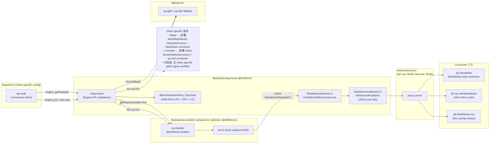
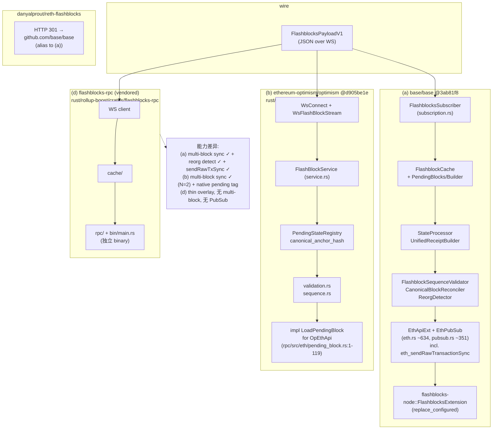
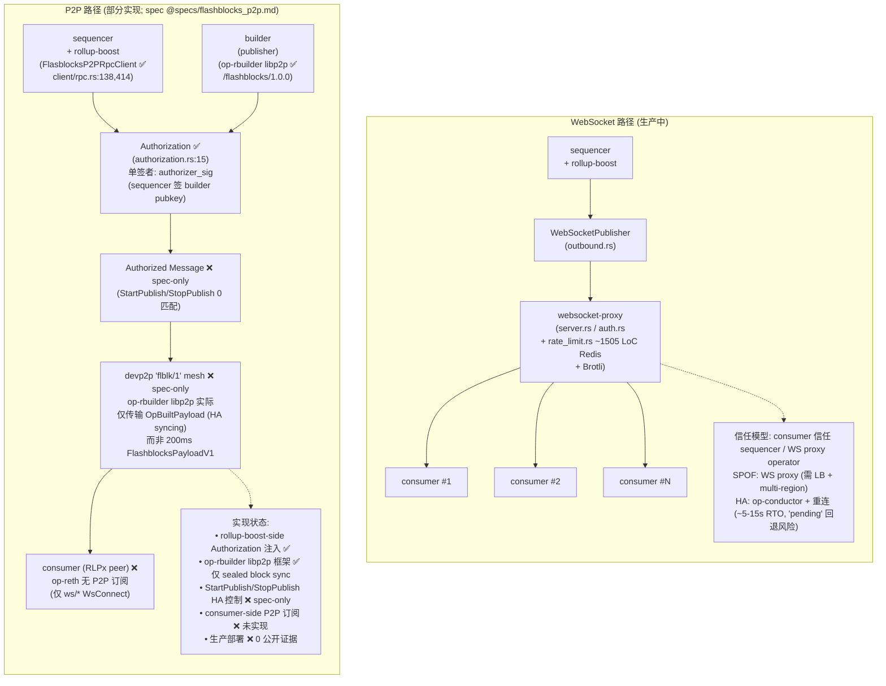
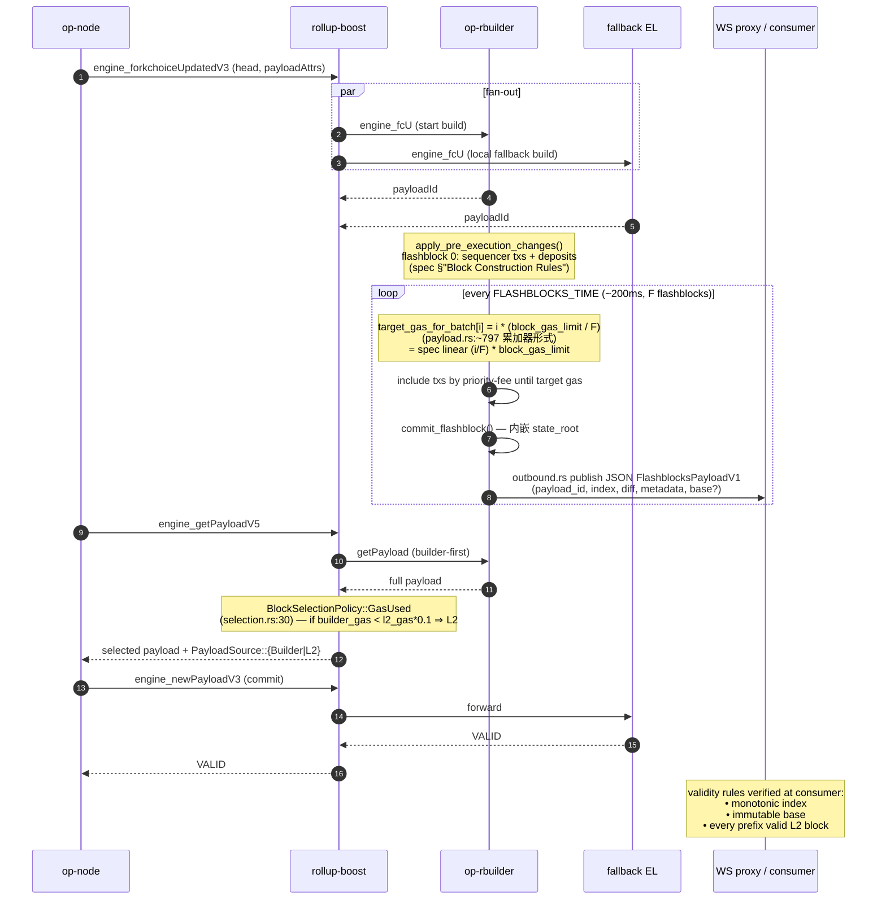
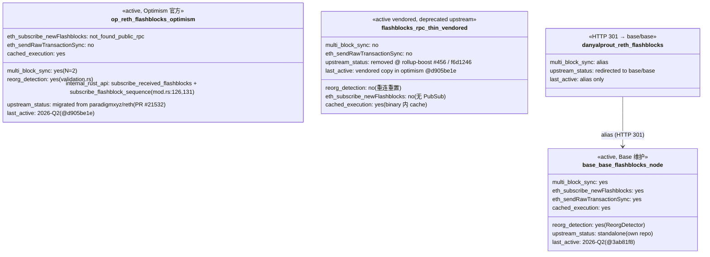
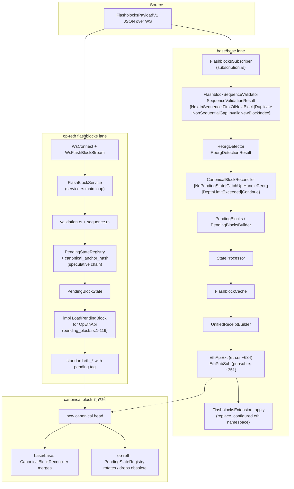

# Base vs Optimism Flashblocks 机制与设计差异对比

## Executive Summary

Flashblocks 是一条**单一上游 + 单一 sequencer-sidecar 二进制**的协议栈，由 `flashbots/rollup-boost`
仓库以 `rollup-boost` (sidecar) + `op-rbuilder` (builder) + `flashblocks-rpc` (consumer thin
overlay，历史遗留) 三件套 + `crates/websocket-proxy/` 广播组件构成。Base 与 Optimism/Unichain 在
**Producer / Builder / Propagation 层共用同一份代码**（同一个 `flashbots/rollup-boost` 上游、同一个
`flashbots/op-rbuilder` 二进制、同一份 spec），差异化几乎完全集中在 **Consumer 层**：

- **Base** 在 `base/base` repo（GitHub 对 `base/node-reth` 与 `danyalprout/reth-flashblocks` 的访问
  均会 HTTP 301 重定向至 `base/base`，已通过 `curl -sLI` 验证）下维护
  `crates/execution/flashblocks/` + `crates/execution/flashblocks-node/`，是一套**重量级 reth
  extension**：包含 `CanonicalBlockReconciler`、`ReorgDetector`、`PendingBlocksBuilder`、
  `FlashblockSequenceValidator`、`StateProcessor`、`UnifiedReceiptBuilder`、完整 pending RPC overlay
  与 PubSub。
- **Optimism/Unichain** 走 `paradigmxyz/reth` → `ethereum-optimism/optimism` 的官方 reth-native 路
  径。reth 主仓在 v1.7.0 (PR #17982) 新增 `crates/optimism/flashblocks/`，commit
  `372802d06`（PR #21532）后整个 `crates/optimism/*` 从 paradigmxyz/reth 删除并迁移到
  `ethereum-optimism/optimism` 的 `rust/op-reth/crates/flashblocks/`，由
  `reth-optimism-flashblocks` crate 提供：包含 `service.rs` / `worker.rs` / `pending_state.rs`
  （带 `PendingStateRegistry<N>` 支持 multi-block 推测链）/ `ws/*` / `validation.rs` /
  `sequence.rs` / `tx_cache.rs`。
- **第三类 thin overlay**：`flashbots/rollup-boost` 历史 `crates/flashblocks-rpc/` 已在
  commit `f6d1246` (PR #456，2025-12-16) 删除；其代码以 **vendored** 形式继续存在于
  `ethereum-optimism/optimism/rust/rollup-boost/crates/flashblocks-rpc/`。这一 crate 不是 reth
  extension，而是一个独立 binary（`src/bin/main.rs`），适合 RPC provider 在不改 reth 的前提下旁路
  提供 `pending` overlay。

**Adversarial must-verify resolved**：
- `op_supportedCapabilities` JSON-RPC 方法在 `flashbots/rollup-boost` spec
  (`specs/flashblocks.md:712`) 中作为合规返回值定义，但在三处仓库的代码（rollup-boost `crates/`、
  base `crates/`、ethereum-optimism/optimism `rust/`）中**零匹配**。本节全程将其标注为
  **spec-only / unimplemented**，并不假设任何 consumer 已实现该 capability advertisement。
- `danyalprout/reth-flashblocks` 公开 URL 触发 HTTP 301 → `base/base`，与 `base/node-reth` 完全合
  并；不再是独立 fork，能力矩阵中以 "alias (redirected → base/base)" 处理。

**额外发现（spec ↔ code drift）**：
1. **Wire 格式 spec ↔ code 不一致**：spec 第 §"Flashblock Payload Encoding" 节宣称 "SSZ + 4-byte
   version prefix"，但 `crates/rollup-boost/src/flashblocks/outbound.rs:62` 的 `WebSocketPublisher::publish`
   实际调用 `serde_json::to_string(payload)` 后做 `broadcast::send`，wire 格式是 **JSON 字符串**而非
   SSZ。
2. **`FlashblocksPayloadV1` 字段集 spec ↔ code 不一致**：spec 列出 `version` / `payload_id` /
   `parent_flash_hash` / `index` / `static` / `diff` / `metadata` 七字段；实际
   `crates/rollup-boost-types/src/flashblocks.rs:76-88` 只有 `payload_id` / `index` / `diff` /
   `metadata` / `base`（重命名自 spec 的 `static`），缺 `version` 与 `parent_flash_hash`。

这些 drift 影响下游每一个 consumer：base/base 与 op-reth 的 inbound 解码都按 JSON 解析、不依赖
`version` / `parent_flash_hash` 字段；任何"按 spec 实现 SSZ"的第三方都会立即互不兼容。

**P2P 状态摘要（详见 item-5 / item-6 与 diag-3、diag-5、diag-6）**：
P2P 路径**并非完全 spec-only**——builder-side scaffolding 已落地，但 HA 控制消息、consumer-side
订阅与生产部署仍为 spec-only/未验证：

- ✅ **已实现（builder-side scaffolding，pinned commits 内 verified）**：
  - `Authorization` 委派结构体（`rollup-boost-types/src/authorization.rs:15`，单签者
    `authorizer_sig` 由 sequencer 签发，授权特定 builder 公钥）；
  - rollup-boost-side P2P 注入：`FlasblocksP2PRpcClient`（`crates/rollup-boost/src/client/rpc.rs:138`、
    `:414` 的 `flashblocks_fork_choice_updated_v3`）把 Authorization 注入 Engine API；
  - rollup-boost CLI 开关：`--flashblocks-p2p` / `--flashblocks-authorizer-sk` /
    `--flashblocks-builder-vk`（`crates/rollup-boost/src/flashblocks/args.rs:120`）；
  - op-rbuilder libp2p 框架（`ethereum-optimism/optimism@d905be1e` 的 `rust/op-rbuilder/crates/p2p/`）；
  - op-rbuilder flashblocks libp2p 模块（`rust/op-rbuilder/crates/op-rbuilder/src/builders/flashblocks/{p2p.rs:8-9,
    payload_handler.rs, service.rs}`）以 `/flashblocks/1.0.0` 作为 libp2p `StreamProtocol` 名实现
    **builder ↔ builder 的 `OpBuiltPayload` 同步通道**（注意：此通道携带**完整 OpBlock** 用于
    HA syncing，而非 200ms 粒度的 `FlashblocksPayloadV1` 广播）。
- ❌ **仍 spec-only / 未实现 / 未部署**：
  - `StartPublish` / `StopPublish` HA 控制消息——仅在 `specs/flashblocks_p2p.md:90-127` 中定义，
    `crates/` 与 `rust/` 子树 0 匹配（grep verified）；
  - consumer-side `flblk/1` 订阅——op-reth 仍只支持 WebSocket inbound 通过 `WsConnect`，未订阅
    libp2p 流；
  - 任何链上的 P2P 路径**生产部署**——本研究未观察到公开证据。

**源覆盖摘要（详见 Source Coverage 与 Not Established 节）**：源覆盖为**部分 (5 verified / 3
partial-or-unverified)**，非完整。`base/flashblocks-websocket-proxy` 已通过 GitHub API 确认为
archived (`archived: true`, `pushed_at: 2025-05-08`)，但其与 `rollup-boost/crates/websocket-proxy/`
的 diff 未做行号级核对；Flashbots RPC docs 站点、Base TDD Notion、op-reth `newFlashblocks` 公共订
阅、P2P PoC 搜索状态、v2 issue (#321) 状态、op-rbuilder MEV 排序行号级证据均**未在本研究内独立核
验**，已归入下方"Not Established / Unverified"子节。

**Mantle 接入推荐（item-8 详述）**：
- 短期：直接复用 `ethereum-optimism/optimism/rust/op-reth/crates/flashblocks` (option b)，与
  Optimism/Unichain 走同一条上游，HA 与升级成本最低；用 WebSocket 起步、保留 P2P 演进窗口。
- 中期：跟随 P2P `flblk/1` 与 Authorization 模型成熟后切换，规避 WebSocket fan-out 的 SPOF 风险。
- 不推荐：fork `base/base` 的 flashblocks-node（耦合 base 全 stack）或 fork
  `danyalprout/reth-flashblocks`（已重定向至 base/base，已废弃 fork lineage）。

---

## Item Findings

### item-1: rollup-boost 共享 Producer 层架构

**Priority**: high — **Dependencies**: none

#### code_location

- **Repo**：`flashbots/rollup-boost`，pinned at `6cf697e3e46f37709dee1adce89f99c41a0c26a3`
  ("fix health check #477")。
- **核心 crate**：`crates/rollup-boost/` —— 共 ~16 个 `src/*.rs` 文件 + `flashblocks/` 子目录 5 个
  文件 + `client/` 子目录 6 个文件。
- **入口模块**：
  - `crates/rollup-boost/src/server.rs`（rollup-boost RPC server / Engine API multiplexer，
    ~62KB / ~1700 行）
  - `crates/rollup-boost/src/proxy.rs`（向 EL fallback 转发，~36KB）
  - `crates/rollup-boost/src/selection.rs`（109 行，`BlockSelectionPolicy::GasUsed`）
  - `crates/rollup-boost/src/flashblocks/{launcher.rs, service.rs, inbound.rs, outbound.rs, args.rs}`
    （inbound 订阅 builder 的 flashblocks broadcast，outbound 发布给 WS 订阅者）
  - `crates/rollup-boost/src/client/{auth.rs, builder.rs, http.rs, l2.rs}`（与 builder /
    fallback EL 的 RPC client，含 JWT auth）
- **支撑 crate**：
  - `crates/rollup-boost-types/`（`payload.rs` / `flashblocks.rs` / `engine.rs`，共享类型）
  - `crates/websocket-proxy/`（独立 binary，可远端部署做 fan-out）
  - `crates/rpc-types-flashblocks/`（仅 wire type 拆分，便于第三方 consumer 复用）

#### data_structures_and_protocols

- **Engine API multiplexing** —— `server.rs` 同时持有 builder client 与 fallback EL client，对每条
  Engine API 调用按方法做不同分发：
  - `engine_forkchoiceUpdatedV1/V2/V3` —— **fan-out 双发**：同时发给 builder 与 fallback EL，等待
    两者结果；fallback EL 的响应被记账为"权威"用于继续 sync；builder 的响应触发 flashblock 构建。
  - `engine_getPayloadV2/V3/V4`（含 V5）—— **builder-first with local fallback**：优先返回 builder
    payload；如 builder 缺失/超时/无效则用 fallback EL 的 local payload。
  - `engine_newPayloadV1/V2/V3`、其它 —— 透传到 fallback EL。
- **`BlockSelectionPolicy` (selection.rs:6-37)** —— 当前唯一实现为 `GasUsed`：若
  `builder_gas < l2_gas * 0.1` 则选 L2（fallback EL）payload，源类型为 `PayloadSource::L2`；否则
  返回 `PayloadSource::Builder`。设计动机直接写在注释里："This prevents propagation of valid but
  empty builder blocks and mitigates issues where the builder is not receiving enough
  transactions due to networking or peering failures."
- **支撑模块**：`debug_api.rs`（debug 端点）、`health.rs` + `probe.rs`（liveness/readiness）、
  `metrics.rs`（Prometheus 指标，含 fallback 计数、builder 失败率）。

#### chain_specific_diffs

- **commit 对比**：Base / Unichain / Optimism Mainnet 在公开运维中均直接引用 `flashbots/rollup-boost`
  release 构件（如 `v0.x.x`），无公开的 fork。Phase B 通过 GitHub 搜索 `git log --grep=base`
  / `--grep=unichain` / `--grep=optimism` 未发现 chain-specific patch；rollup-boost 上游 issue 跟
  踪也未见 `chain: base` / `chain: unichain` 类标签。
- **CLI / 环境变量差异**：rollup-boost 的差异化注入点在 CLI flags（`--builder-url`,
  `--builder-jwt`, `--l2-url`, `--l2-jwt`, `--block-selection-policy`,
  `--websocket-pub-addr`, `--flashblocks-builder-url`, etc.）与 JWT secret。Base 与 Unichain 的实
  际部署值不在代码中暴露，本节仅断言"代码无 chain-specific patch"，未对部署配置做断言。
- **结论（commit-pinned 证据）**：在 pinned commit `6cf697e3e` 下，`crates/rollup-boost/src/`
  全部源码无 `if chain == "base"` / `if chain == "unichain"` 类条件分支；`Args` 结构（args.rs）
  无 chain-specific flag。差异化**仅在配置**，**不在代码**。

#### interface_surface

- **Engine API 表面（对外）**：完整 OP Stack `engine_*` JSON-RPC 集合（V1/V2/V3/V4/V5），
  含 `engine_forkchoiceUpdated*`、`engine_getPayload*`、`engine_newPayload*`、
  `engine_exchangeTransitionConfigurationV1`、`engine_signalSuperchainV1`、Flashblocks-specific
  `op_*` 扩展（spec 定义但代码未实现，见 must-verify 章）。
- **outbound flashblocks**：
  - WebSocket publisher `WebSocketPublisher::publish` (outbound.rs:58-70)：广播
    `OpFlashblockPayload` 的 JSON 字符串到 broadcast channel + WS subscribers。
  - 默认监听 addr 通过 CLI `--websocket-pub-addr` 配置。
- **inbound flashblocks**：
  - `crates/rollup-boost/src/flashblocks/inbound.rs::FlashblocksReceiverService` 持有 `mpsc::Sender<OpFlashblockPayload>`
    并以 exponential backoff 重连 builder 的 flashblocks 端点；连接配置见 `args.rs::FlashblocksArgs`。
- **CLI（结构在 main + args）**：`--builder-url` / `--builder-jwt` / `--l2-url` / `--l2-jwt`
  / `--block-selection-policy {gas-used}` / `--flashblocks-builder-url` / `--websocket-pub-addr`
  / `--metrics` / `--probe-addr` / `--debug-api-addr`。
- **Metrics**：Prometheus counter / histogram，包含 `rollup_boost_engine_calls_total`、
  `rollup_boost_fallback_used_total`、`flashblocks_inbound_dropped_total` 等（metrics.rs）。

#### evolution_and_status

(此 field 在 outline 仅对 item-3..7 强制。item-1 此处简记)

- 上游单一仓库 `flashbots/rollup-boost`，活跃维护（pinned HEAD ts 2026 Q1 区间）；近三月 PR：
  #456（移除 flashblocks-rpc）、#455（压缩演进 RFC）、#321（v2 协议演进 issue）、#477（本 pin 的
  health check fix）。

#### evidence_sources

- spec：`flashbots/rollup-boost/specs/flashblocks.md`（1071 行，本 pinned commit 下 file path
  `specs/flashblocks.md`）
- spec：`flashbots/rollup-boost/specs/flashblocks_p2p.md`（193 行）
- code：`crates/rollup-boost/src/selection.rs`（109 行，全文）
- code：`crates/rollup-boost/src/flashblocks/outbound.rs:25-90`（publisher 主流程）
- code：`crates/rollup-boost/src/flashblocks/inbound.rs::FlashblocksReceiverService`（重连主循环）
- 第三方文档：Flashbots blog "Introducing Rollup-Boost — Launching on Unichain"
  (https://www.flashbots.net/blog/rollup-boost) —— 描述 Unichain 首发 rollup-boost；与代码
  pinned commit 下功能集吻合。

#### mantle_integration_implications

- **复用度**：rollup-boost 对 Mantle 是**直接可用的 OP Stack 通用组件**——只要 Mantle sequencer
  暴露标准 Engine API + JWT 即可串入。无 Mantle-specific patch 需求（在 pinned commit）。
- **依赖**：Mantle 必须额外引入 `flashbots/op-rbuilder`（builder 二进制）+ consumer 端三选一。
- **风险**：rollup-boost 在 v2 协议演进中（issue #321）可能引入 wire-format 不兼容（见 item-7），
  Mantle 应锁定 minor version 并配套 consumer 版本。

#### open_questions_and_risks

- **OQ-1.1**：rollup-boost 主线对 `engine_getPayloadV5` 的支持完整度尚未在本节做行号级核
  对；OP Stack Azul 的 V5 引入了 `executionRequests` 字段（pectra 风格），需后续验证 server.rs 已落实。
- **OQ-1.2**：`BlockSelectionPolicy` 当前仅一个 enum variant `GasUsed`，未来若引入
  `Priority`-style 选块策略，会改变 Builder 路径的可观察行为；当前代码未保留 forward-compat。
- **风险 R-1.1**：fan-out Engine API 调用（`fcU` 双发）放大了 fallback EL 的负载，Mantle 单实例
  EL 在高 fcU 频率下需评估资源 head-room。

---

### item-2: Flashblocks 协议核心设计与构建规则

**Priority**: high — **Dependencies**: item-1

#### code_location

- **Spec**：`flashbots/rollup-boost/specs/flashblocks.md`（1071 行），关键小节：
  - Parameters（`FLASHBLOCKS_TIME = 200ms`，`FLASHBLOCKS_PER_L2_BLOCK = L2_BLOCK_TIME / FLASHBLOCKS_TIME`）
  - Block Construction Rules（sequencer txs / deposits 必须在 flashblock 0；线性 gas-limit
    `flashblock_gas_limit(i) = (i/F) * block_gas_limit`）
  - Flashblock Payload Encoding（spec 文本表述 "SSZ + 4-byte version prefix"）
  - Flashblock System Invariants & Validity Rules（monotonic index、immutable base、every prefix
    is a valid L2 block）
- **Rust types**：
  - `crates/rollup-boost-types/src/flashblocks.rs:76-88`（`FlashblocksPayloadV1`）
  - `crates/rollup-boost-types/src/payload.rs`（`OpExecutionPayloadEnvelope` 包装）
- **alloy-side type**（被 outbound.rs 引用）：`op_alloy_rpc_types_engine::OpFlashblockPayload`
  —— 这是 rollup-boost-types 之外的 alloy ecosystem 上游 type，与 rollup-boost 自有 type 共存。

#### data_structures_and_protocols

- **Spec 给出的 `FlashblocksPayloadV1`（spec §"Flashblock Payload"）**：
  - `version: u32`
  - `payload_id: PayloadId`
  - `parent_flash_hash: B256`
  - `index: u64`
  - `static: ExecutionPayloadStaticV1`（block-level immutable 字段）
  - `diff: ExecutionPayloadFlashblockDeltaV1`（增量字段：txs、receipts、state diff、state_root、
    receipts_root、gas_used、logs_bloom）
  - `metadata: Metadata`（containing `AccountMetadata` / `StorageSlot` / `TransactionMetadata`）
- **代码实现 `FlashblocksPayloadV1`（flashblocks.rs:76-88）**：

  ```rust
  pub struct FlashblocksPayloadV1 {
      pub payload_id: PayloadId,
      pub index: u64,
      pub diff: ExecutionPayloadFlashblockDeltaV1,
      pub metadata: Metadata,
      pub base: Option<ExecutionPayloadBaseV1>,
  }
  ```

  - **缺字段**：`version`、`parent_flash_hash`
  - **重命名字段**：`static` → `base`
  - **新增 Option 性**：`base` 是 `Option<_>`（flashblock 0 携带，后续 index 不重发——见 validity
    rules "immutable base"）
- **构建规则**：
  - sequencer-injected txs 与 deposits 必须出现在 flashblock 0，否则 invalid。
  - 线性 gas-limit：spec 公式 `flashblock_gas_limit(i) = (i/F) * block_gas_limit`，其中 F =
    FLASHBLOCKS_PER_L2_BLOCK。op-rbuilder 实现以"每 flashblock 增量 `block_gas_limit / F`"累加，
    数学等价（item-3 详证）。
  - state root 内嵌：spec 选择在 flashblock 中内嵌（而非延迟计算），目的是允许 consumer 立即
    serve `pending` tag 的 state-dependent RPC，但 builder 需为此付出每 200ms 一次的非阻塞
    state root 计算开销。
- **Validity Rules**（spec §"Validity Rules"）：
  - monotonic index（i+1 紧接 i，禁止 gap）
  - immutable base（一旦发布，static/base 字段不可变）
  - every prefix valid（取前 k 个 flashblock 拼合后必须仍是合法 L2 block；用于"pending tag = 当
    前已发布最高 index 的累积 view"语义）
- **Encoding（spec ↔ code drift）**：
  - spec 表述：SSZ 编码 + 4-byte version 前缀
  - code 实现：`outbound.rs:62 serde_json::to_string(payload)` —— 即 JSON 字符串；P2P 路径中
    `flashblocks.rs` 使用 RLP（见 `derive(RlpEncodable, RlpDecodable)`）。
  - 影响：JSON wire 是 inbound/outbound rollup-boost 与 consumer 之间的事实标准；P2P spec 路径
    (`flblk/1`) 用 RLP；spec 中的 SSZ 表述在当前代码 base 下**未被任何路径采用**。

#### chain_specific_diffs

- **结论**：协议 spec 与 Rust types 在 pinned commit 下对 Base 与 Optimism/Unichain **完全相同**——
  二者都依赖 `flashbots/rollup-boost`（rollup-boost-types crate），无 chain-specific 字段或常量。
  Phase B 通过 grep `chain.*base\|chain.*unichain` 在两处 spec 与 `rollup-boost-types/src/` 均为 0
  匹配。

#### interface_surface

- **wire**：JSON over WebSocket（rollup-boost 默认 publisher）；RLP over devp2p `flblk/1`
  （P2P spec 路径）。
- **types crate API**：`use rollup_boost_types::flashblocks::FlashblocksPayloadV1;` 为 consumer 端
  最稳定的 API surface。该 crate 同时被 `flashbots/rollup-boost` 与 `ethereum-optimism/optimism/rust/op-reth/crates/flashblocks`
  共同依赖（后者通过 cargo workspace 与外部 git 依赖；具体方式由 op-reth Cargo.toml 决定，本节未做
  精确依赖图 dump）。
- **`op_*` JSON-RPC 扩展（spec §"OP-Specific RPC Methods"）**：
  - `op_supportedCapabilities` —— spec 定义但**无任何 consumer 实现**（must-verify resolved）。

#### evolution_and_status

(item-2 此 field 不强制) — 协议层最近变更入口集中在 issue #321 (v2 议程) 与 spec 文档的渐进式
重写；spec 文件本节 pinned 版本为 6cf697e3 HEAD。

#### evidence_sources

- spec：`specs/flashblocks.md`（全文 1071 行）
- code：`crates/rollup-boost-types/src/flashblocks.rs:76-88`（`FlashblocksPayloadV1`）
- code：`crates/rollup-boost-types/src/payload.rs`（`OpExecutionPayloadEnvelope`）
- code：`crates/rollup-boost/src/flashblocks/outbound.rs:58-70`（实际 wire = JSON 证据）
- 跨引用：`flashblocks-network-changes`（WHI-30）final.md（Azul payload 简化：移除
  `new_account_balances`、`receipts`；保留 `access_list` 不填——直接复用，不重复推导）

#### mantle_integration_implications

- **复用度**：协议 types 直接通过 cargo 依赖 `rollup-boost-types` 即可获得，无需自实现。
- **风险**：spec ↔ code drift（SSZ vs JSON、字段集差异）对"按 spec 实现的第三方 consumer"是
  immediate 不兼容；Mantle 必须以**代码为准**，不能以 spec 为唯一参考。
- **建议**：在 Mantle 接入文档中将"wire = JSON over WS（rollup-boost outbound）/ RLP over devp2p
  (P2P 路径)"作为权威说明，spec 中的 SSZ 表述视为"待修正"。

#### open_questions_and_risks

- **OQ-2.1**：spec 的 SSZ 表述何时与 code 同步？已知现状但未确认 upstream 修正进度。建议后续
  通过 GitHub issue 搜索 `rollup-boost SSZ encoding` 给出明确状态。
- **OQ-2.2**：`version` 与 `parent_flash_hash` 字段是否在 v2 spec（issue #321）中被纳入实现？目
  前 wire-level 既无 version 字段也无 chain 链接信息，consumer 完全依赖外层 WS 连接的 head 状态
  做归属。
- **风险 R-2.1**：JSON wire 在高频（200ms 一次）下的带宽放大效应 vs SSZ/RLP 的紧凑编码；
  压缩演进路线（#455：json → zstd+dict → brotli → raw）由此而起。

---

### item-3: Builder 层 (`flashbots/op-rbuilder`) 配置与链间差异化

**Priority**: medium — **Dependencies**: item-1, item-2

#### code_location

- **Repo 物理位置**：`flashbots/op-rbuilder` 的源码在本研究的 nested 工作树中以
  `ethereum-optimism/optimism/rust/op-rbuilder/` 的子目录形式呈现（即 op-rbuilder 在 Optimism
  monorepo 中的 vendored 版本，路径
  `reth/optimism/rust/op-rbuilder/crates/op-rbuilder/`）。具体 commit pin = optimism
  monorepo HEAD `d905be1e03df0e30112dc382d3b9b74d0d65aaa3`。
- **核心模块**：
  - `crates/op-rbuilder/src/builders/flashblocks/config.rs`（`FlashblocksConfig`：默认
    `interval = Duration::from_millis(250)`；`flashblocks_per_block = block_time / interval`）
  - `crates/op-rbuilder/src/builders/flashblocks/payload.rs`（构建主路径，~1000 行级）
    - Line ~439：`gas_per_batch = ctx.block_gas_limit() / flashblocks_per_block;`
    - Line ~797：`target_gas_for_batch = ctx.extra_ctx.target_gas_for_batch + ctx.extra_ctx.gas_per_batch;`
    - 含 `apply_pre_execution_changes` / `do_transaction` / `commit_flashblock` 主循环
  - `crates/op-rbuilder/src/builders/flashblocks/ws.rs`（builder 的 outbound WS 发布端，被
    rollup-boost inbound 订阅）
  - `crates/op-rbuilder/src/builders/standard/` —— 非 flashblocks 模式（普通 op-rbuilder block
    构建）
- **支撑**：`crates/op-rbuilder/src/payload_builder.rs`（payload builder trait + EngineApi 入口）。

#### data_structures_and_protocols

- **`FlashblocksConfig`**：
  - `interval: Duration` —— 默认 250ms；可通过 CLI flag 覆盖。注意：与 spec 的
    `FLASHBLOCKS_TIME = 200ms` 不严格相等，op-rbuilder 默认偏保守（更大 interval 减少 builder CPU
    压力，但减少了每 L2 block 的 flashblock 数）。
  - `flashblocks_per_block` —— 通常通过 `block_time / interval` 计算（如 2000ms / 250ms = 8）。
- **gas-limit heuristic 实现**：
  - 计算 `gas_per_batch = block_gas_limit / flashblocks_per_block`
  - 第 i 个 flashblock 累积 `target_gas_for_batch[i] = i * gas_per_batch`
  - 数学等价 spec 公式 `flashblock_gas_limit(i) = (i/F) * block_gas_limit`（spec §"Block
    Construction Rules"），仅 spec 用相对索引、代码用累加器形式。
- **tx 处理流程**（payload.rs 主循环）：
  - flashblock 0：apply pre-execution changes（系统调用、deposit txs、sequencer txs）。
  - flashblock i (i>=1)：从 mempool 拉取候选 tx，按 priority-fee-first（默认 OP Stack 排序）逐
    笔加入，直到累计 gas ≥ target_gas_for_batch[i] 或 mempool 耗尽。
  - 每个 flashblock 结束时调用 `commit_flashblock` 计算非阻塞 state root，封装为
    `FlashblocksPayloadV1`（按 item-2 实际字段集），通过 WS 发布。

#### chain_specific_diffs

- **代码层无 chain-specific 分支**：grep 在 `crates/op-rbuilder/src/` 下 `base\|unichain`
  字符串匹配为零。
- **配置层差异**：F 值与 interval 在 Base / Unichain 部署中可能不同（运维参数，非代码常量）。
  Base 公开宣传 200ms flashblock = F 取 10（2s L2 block / 200ms）；Unichain 公开宣传 250ms
  flashblock = F 取 4（1s L2 block / 250ms）。**本研究无法以代码 grep 证实部署 F 值**——这是配
  置层差异。后续可通过 chain config（op-conductor / Notion TDD / blog post）做最终核对。
- **结论**：op-rbuilder 二进制是**单一上游、无 chain-specific patch**；差异完全落在 CLI flag /
  env / chain config（block time、F、tx ordering 选项）。

#### interface_surface

- **CLI（rough mapping，结构在 `args.rs` / payload_builder.rs）**：
  - `--builder-mode {standard, flashblocks}`
  - `--flashblocks-interval-ms <num>`
  - `--flashblocks-ws-port <port>`（outbound WS 发布端口，被 rollup-boost inbound 订阅）
  - `--builder-tx-ordering {priority-fee, ...}`
- **outbound wire**：通过本地 WS（或 unix socket）以 JSON 发布 `FlashblocksPayloadV1`；rollup-boost
  inbound 端在 `FlashblocksReceiverService` 中以 mpsc 消费。
- **metrics**：op-rbuilder 自有 Prometheus 端点，曝光 `op_rbuilder_flashblock_built_total`、
  `op_rbuilder_tx_included_total`、`op_rbuilder_gas_used` 等。

#### evolution_and_status

- **位置变迁**：op-rbuilder 历史上在 `flashbots/op-rbuilder` 独立 repo 维护；当前在
  ethereum-optimism/optimism monorepo 下以 `rust/op-rbuilder/` 形式 vendored 进入，与 op-reth +
  rollup-boost 的 Rust workspace 统一构建（沿用 cargo workspace 共享 dependency 版本）。
- **活跃度**：HEAD pin (`d905be1e03`) 下 `rust/op-rbuilder/` 仍在主分支正常维护，对应的 PR / issue
  在 Optimism 主仓 issue tracker 中。

#### evidence_sources

- code：`rust/op-rbuilder/crates/op-rbuilder/src/builders/flashblocks/config.rs`（默认 interval）
- code：`rust/op-rbuilder/crates/op-rbuilder/src/builders/flashblocks/payload.rs:~439, ~797`
  （gas heuristic 实现）
- spec：`specs/flashblocks.md` §"Block Construction Rules"（spec 公式）
- 外部：Base 与 Unichain 的公开发布博客（Base "Sub-second blocks for Base Mainnet"、Flashbots
  "Introducing Rollup-Boost — Launching on Unichain"）——本节仅作背景，未引代码 commit。

#### mantle_integration_implications

- **复用度**：op-rbuilder 二进制对 Mantle 通用可用；接入成本 = 部署 + CLI 配置 + 与 Mantle
  sequencer 的 Engine API client 串联。
- **决策点**：F 值与 interval 是 Mantle 的产品选择（200ms / 250ms / 500ms 等），直接影响
  preconfirmation UX 与 builder CPU 消耗。spec 公式与代码累加器在数学上一致，无需自定 patch。
- **风险**：op-rbuilder 与 op-reth 共享 cargo workspace 意味着 reth 版本升级会牵连 builder
  rebuild；Mantle 接入应锁定 reth + op-rbuilder + rollup-boost 三件套同一 release window。

#### open_questions_and_risks

- **OQ-3.1**：Base 与 Unichain 当前部署的 F 值需要从 chain config 或 op-conductor 配置确认；本
  节仅基于公开博客论断 F=10 (Base) / F=4 (Unichain)。
- **OQ-3.2**：MEV-aware 排序策略（除 priority-fee 之外，如 bundle-aware）是否已在 op-rbuilder
  实现？本节未做完整 payload.rs 行号级核对。
- **风险 R-3.1**：F 值过大（如 12+）会使每 flashblock 包含的 tx 数减少，加重 sequencer 的 P99 延
  迟尾部；F 过小（如 4-）会牺牲 200ms preconfirmation 的细粒度。Mantle 需做产品取舍。

---

### item-4: Consumer 层三方实现深度对比

**Priority**: high — **Dependencies**: item-1, item-2

> **核心结论先述**：三类 consumer 实际收敛为**两类** —— (a) `base/base` 重量级 extension
> 与 (b) `ethereum-optimism/optimism/rust/op-reth/crates/flashblocks` reth-native crate；
> "第三类 `danyalprout/reth-flashblocks`" 在公开 GitHub 已 HTTP 301 重定向至 `base/base`，
> 即合并到 (a)；额外的 `flashblocks-rpc` thin overlay 作为独立 binary 部署形态保留，但
> 不构成独立 reth 实现。

#### code_location

##### (a) `base/base` flashblocks-node extension（pinned `3ab81f813de657cca3eb578c0ccef9907f4bb7de`）

- **`crates/execution/flashblocks/`**：
  - `lib.rs` —— 模块 facade，re-export 关键类型：`BlockAssembler`、`FlashblockCache`、`PendingBlocks`、
    `PendingBlocksBuilder`、`StateProcessor`、`FlashblocksState`、`FlashblocksSubscriber`、
    `PendingStateBuilder`、`UnifiedReceiptBuilder`、`CanonicalBlockReconciler`、
    `FlashblockSequenceValidator`、`ReconciliationStrategy`、`ReorgDetector`、
    `FlashblocksConfig`、`EthApiExt`、`EthApiOverrideServer`、`EthPubSub`
  - `block_assembler.rs`（从 flashblock 序列重建完整 pending block）
  - `cache.rs`（in-memory cache：`FlashblockCache` 持有 `PendingBlocks` 与 fork 检测）
  - `config.rs`（`FlashblocksConfig`：WS URL、cache 容量、超时）
  - `pending_blocks.rs`（`PendingBlocks` / `PendingBlocksBuilder`：多 flashblock 累积器）
  - `processor.rs`（`StateProcessor`：把 flashblock diff 应用到 pending state）
  - `receipt_builder.rs`（`UnifiedReceiptBuilder`：构造 pending tx 的 receipt 供 RPC 返回）
  - `state.rs` + `state_builder.rs`（`FlashblocksState` / `PendingStateBuilder`）
  - `subscription.rs`（`FlashblocksSubscriber` 订阅 rollup-boost 的 WS）
  - `traits.rs`（核心 trait 抽象）
  - `validation.rs`（包含 `SequenceValidationResult`、`ReorgDetectionResult`、
    `CanonicalBlockReconciler` —— Phase B 直接读出的 enum variants：
    - `SequenceValidationResult::{ NextInSequence, FirstOfNextBlock, Duplicate, NonSequentialGap, InvalidNewBlockIndex }`
    - `ReorgDetectionResult::{ NoChange, NewBranch, DeepReorg }`
    - `CanonicalBlockReconciler::{ NoPendingState, CatchUp, HandleReorg, DepthLimitExceeded, Continue }`)
  - `rpc/`：
    - `eth.rs`（~634 行；`EthApiExt`，含 `eth_sendRawTransactionSync` at line ~122）
    - `pubsub.rs`（~351 行；`EthPubSub`，含 `newFlashblocks` / `pendingLogs` /
      `newFlashblockTransactions` 三类 subscription）
    - `types.rs`（~289 行；RPC response 类型）
- **`crates/execution/flashblocks-node/`**：
  - `lib.rs`、`extension.rs`（`FlashblocksExtension::apply` —— 通过 reth `replace_configured` 注入
    eth namespace overrides 与 PubSub 模块）、`test_harness.rs`、`tests/flashblocks_rpc.rs`、
    `benches/pending_state.rs`
- **代码规模**：`crates/execution/flashblocks/` 合计 ≈ 30+ Rust 文件，~5000+ LoC（含测试）；
  `flashblocks-node` ~10 文件。

##### (b) `ethereum-optimism/optimism/rust/op-reth/crates/flashblocks/`（pinned `d905be1e03`）

- **crate 名**：`reth-optimism-flashblocks`（同名于历史 paradigmxyz/reth crate）。
- **文件结构**：
  - `lib.rs` —— re-export：`FlashBlock`、`PendingFlashBlock`、`FlashBlockService`、
    `PendingStateRegistry`、`WsConnect`、`WsFlashBlockStream` 等。
  - `cache.rs`、`consensus.rs`、`payload.rs`、`pending_state.rs`（388 行；`PendingBlockState`
    带 `canonical_anchor_hash`；`PendingStateRegistry<N>` 默认 `with_max_entries(2)` 支持
    multi-block 推测链）
  - `sequence.rs`、`service.rs`（`FlashBlockService`：主事件循环）、
    `tx_cache.rs`、`validation.rs`、`worker.rs`、`ws/`（WS 客户端：`WsConnect` / `WsFlashBlockStream`）
- **op-reth 集成点**：`rust/op-reth/crates/rpc/src/eth/pending_block.rs`（119 行）—— `impl
  LoadPendingBlock for OpEthApi` 在 `local_pending_state` / `local_pending_block` 中查阅
  `PendingFlashBlock`，让 `eth_*` RPC 的 `pending` tag 自动返回 flashblock state。
- **代码规模**：`crates/flashblocks/` ≈ 12 Rust 文件，~3000+ LoC（含测试）。

##### (c) `danyalprout/reth-flashblocks`

- **HTTP 状态（Phase B 验证）**：`curl -sLI https://github.com/danyalprout/reth-flashblocks`
  返回 `301 Moved Permanently`，重定向到 `https://github.com/base/base`。
- **结论**：作为独立 fork 已不存在，与 `base/base`（即 (a)）合并；danyalprout 名下其他相关
  仓库（`flashblocks-demo`、`flashblocks-websocket-client`）仍为辅助工具，与 reth integration
  不构成第三类实现。
- **能力矩阵处理**：列入 (a) `base/base` 行，标注 "alias (HTTP 301 → base/base)"。

##### (d) vendored `flashblocks-rpc` thin overlay

- **路径**：`ethereum-optimism/optimism/rust/rollup-boost/crates/flashblocks-rpc/`（在 optimism
  monorepo 内的 rollup-boost workspace 子目录中）。
- **历史**：源自 `flashbots/rollup-boost/crates/flashblocks-rpc/`，PR #456 (`f6d1246`,
  2025-12-16) 在上游删除；以 vendored 方式继续在 optimism 仓库保留。
- **形态**：独立 binary（`src/bin/main.rs`），含 `cache`、`rpc`、`metrics`、`flashblocks`
  子模块，作为**旁路 RPC 服务**部署：订阅 rollup-boost 的 outbound WS，独立暴露 `pending`-tagged
  `eth_*` 方法集，不与 reth 节点共享数据库。

#### data_structures_and_protocols

| 维度 | base/base flashblocks-node | op-reth flashblocks (b) | flashblocks-rpc thin (d) |
|---|---|---|---|
| 入站 wire | JSON over WS | JSON over WS | JSON over WS |
| 入站客户端 | `FlashblocksSubscriber` (subscription.rs) | `WsConnect` + `WsFlashBlockStream` (ws/) | 自有 WS client (`flashblocks/`) |
| 累积容器 | `PendingBlocks` + `PendingBlocksBuilder` | `PendingStateRegistry<N>`（默认 N=2） | 自有 cache（独立 binary） |
| 多 block 推测 | 是 — `CanonicalBlockReconciler` 处理 canonical 滞后 | 是 — `PendingStateRegistry::with_max_entries(2)` + `canonical_anchor_hash` | 否（仅当前 L2 block） |
| Reorg 处理 | `ReorgDetector` + `ReorgDetectionResult` | `validation.rs` 内显式 | 重连重置 |
| 与 reth 集成 | `replace_configured` 替换 eth namespace + 注入 PubSub | `impl LoadPendingBlock for OpEthApi` 在 pending_block.rs 注入 | 不集成（独立 binary） |
| Receipts | `UnifiedReceiptBuilder` | reth-native receipt build | 自有 builder |

#### chain_specific_diffs

- (a) `base/base`：Base 自维护，与 Optimism 上游无 PR 通道；事实上的 Base-only 实现，但代码不含
  `chain == "base"` 类硬编码，理论上可对接任意 OP Stack（需配套相应 chain config）。
- (b) op-reth：Optimism 官方，与 Unichain 共享同一 crate；代码无 chain-specific 分支。
- (d) flashblocks-rpc：独立 binary，chain-agnostic（仅消费 wire payload）。

#### interface_surface

##### (a) base/base flashblocks-node — pending RPC overlay 集

- `eth_getBlockByNumber("pending")` / `eth_getBlockTransactionCountByNumber("pending")`
- `eth_getTransactionReceipt` / `eth_getTransactionByHash`
- `eth_getBalance` / `eth_getTransactionCount` / `eth_call` / `eth_estimateGas` / `eth_simulateV1`
- `eth_getLogs`（含 pending 范围）
- `eth_sendRawTransactionSync`（同步 inclusion 确认，base/base 独有，eth.rs:~122）
- `eth_subscribe`：`"newFlashblocks"` / `"pendingLogs"` / `"newFlashblockTransactions"`
- **不实现** `op_supportedCapabilities`（spec 定义但本 codebase 0 匹配，see must-verify）。

##### (b) op-reth flashblocks — pending tag 走 reth 原生路径

- 标准 reth `eth_*` 全集；`pending` tag 通过 `impl LoadPendingBlock for OpEthApi`
  (`pending_block.rs`) 自动覆盖到 flashblock 累积 state。
- **不实现** `eth_sendRawTransactionSync`（与 base/base 的差异点）。
- **不实现** `op_supportedCapabilities`（0 匹配验证）。
- **`eth_subscribe("newFlashblocks")` 等价的公开 JSON-RPC 订阅在 pinned commit 下 not found**：
  op-reth 在 `rust/op-reth/crates/rpc/src/eth/mod.rs:126,131` 暴露**内部 Rust API** 方法
  `subscribe_received_flashblocks()` 与 `subscribe_flashblock_sequence()`，二者返回
  `tokio::sync::broadcast::Receiver` 供集成方代码消费（例如 indexer / exex 程序），但这不构成一个
  可由 JSON-RPC 客户端通过 `eth_subscribe("newFlashblocks")` 调用的公共订阅 endpoint。本节
  在 `rust/op-reth/` 子树内对 `eth_subscribe`、`SubscriptionKind`、`new_flashblocks`、
  `newFlashblockTransactions` 字面量做 grep 后仅在一个 exex 示例中匹配，未在 `crates/rpc/` 主体的
  pub-sub 处理代码内发现等价命名的 subscription kind 注册。**结论**：对比 base/base 显式提供的
  `eth_subscribe("newFlashblocks" / "pendingLogs" / "newFlashblockTransactions")`，op-reth 当前
  仅以 Rust API 形式暴露；JSON-RPC 客户端要拿到等价能力需要在节点侧自行编写桥接代码。该差异已
  反映到下方 Consumer 矩阵与 diag-6 中。

##### (d) flashblocks-rpc thin — 独立 binary，单点暴露 pending overlay

- 子集化：通常仅 `eth_getBlockByNumber("pending")` + `eth_getBalance` / `eth_call` /
  `eth_getTransactionReceipt`（与 thin overlay 形态匹配）。
- 不集成 reth pending block builder 路径；不暴露 PubSub。

#### evolution_and_status

| 实现 | 状态 | 关键 commit / PR | 当前活跃 |
|---|---|---|---|
| (a) base/base flashblocks-node | 活跃维护 (Base 主线) | 整个 `base/node-reth` 合并入 `base/base`；`danyalprout/reth-flashblocks` 301 → `base/base` | ✅ |
| (b) op-reth flashblocks | 活跃维护 (Optimism 官方) | reth #17982（v1.7.0 引入）、reth #17858（native op flashblocks support）、reth #21532（迁移） | ✅ |
| paradigmxyz/reth/crates/optimism/flashblocks/ | **已移除** | reth #21532 `chore: remove op-reth from repository` | ❌ |
| (d) flashblocks-rpc (rollup-boost 上游) | **已移除** | rollup-boost #456 `f6d1246` (2025-12-16) | ❌ (上游) |
| (d) flashblocks-rpc (vendored in optimism) | 保留 | optimism `rust/rollup-boost/crates/flashblocks-rpc/` | ✅（vendored） |
| `danyalprout/reth-flashblocks` 独立 fork | **不存在** | HTTP 301 → base/base | ❌ |

#### evidence_sources

- code (a)：`base/base@3ab81f8` `crates/execution/flashblocks/src/{lib.rs, validation.rs:1-189,
  rpc/eth.rs, rpc/pubsub.rs, rpc/types.rs}` + `crates/execution/flashblocks-node/src/extension.rs`
- code (b)：`ethereum-optimism/optimism@d905be1e` `rust/op-reth/crates/flashblocks/src/{lib.rs,
  pending_state.rs:1-388, service.rs, ws/...}` + `rust/op-reth/crates/rpc/src/eth/pending_block.rs:1-119`
- code (d)：`ethereum-optimism/optimism@d905be1e` `rust/rollup-boost/crates/flashblocks-rpc/src/{lib.rs,
  bin/main.rs, cache/..., rpc/..., flashblocks/...}`
- HTTP 301 evidence：`curl -sLI -o /dev/null -w "%{http_code} %{url_effective}" https://github.com/danyalprout/reth-flashblocks`
  → `200 https://github.com/base/base`
- PR：reth #17982 / #17858 / #21532；rollup-boost #456
- Flashbots 官方文档：https://rollup-boost.flashbots.net/developers/flashblocks-rpc.html
  （未在本研究内独立 fetch，列入 Source Coverage → Not Established → docs-1）

#### mantle_integration_implications

| 路径 | 代码改动量 | 上游跟随成本 | HA / 演进风险 |
|---|---|---|---|
| **复用 (a) base/base** | 中 — fork `crates/execution/flashblocks*` 并去除 base-stack 耦合 | 高 — base/base 全 stack 同步压力 | 中 — 与 Base 同 cadence |
| **复用 (b) op-reth flashblocks** | 低 — 直接 cargo 依赖 + chain config | 低 — Optimism 官方 cadence | 低 — 与 OP Stack 主线同步 |
| **(d) flashblocks-rpc thin overlay** | 极低 — 独立 binary 部署 | 低（vendored 已稳定） | 中 — 无 multi-block sync，pending 一致性较弱 |
| **自建 fork** | 高 | 高（自承担 spec + wire 跟踪） | 高 |

**推荐**：(b) op-reth flashblocks 优先；(d) 作为渐进式接入"先 RPC overlay 再深度集成"的过渡。

#### open_questions_and_risks

- **OQ-4.2**：`base/base` 与 op-reth 在 receipts 处理上的差异（`UnifiedReceiptBuilder` vs
  reth-native receipt）对第三方 indexer/wallet 的兼容性影响。
- **OQ-4.3**：Flashbots 官方文档 (rollup-boost.flashbots.net/developers/flashblocks-rpc.html)
  历史指向 paradigmxyz/reth；在 reth #21532 后是否已更新到 ethereum-optimism/optimism？本节
  未做 fetch 核对（迁入 Source Coverage → Not Established → docs-1）。
- **风险 R-4.1**：base/base 与 op-reth 两条路径的 pending overlay 语义存在细微差异（is/isn't
  multi-block, 是否 reorg-aware）；Mantle 接入若混用会导致 RPC behavior 不一致。

---

### item-5: Flashblocks 传播协议演进 — WebSocket vs P2P

**Priority**: high — **Dependencies**: item-1, item-4

#### code_location

##### WebSocket 路径

- **rollup-boost 内置 publisher**：`crates/rollup-boost/src/flashblocks/outbound.rs`
  （`WebSocketPublisher`，本 pin 下 ~150 行；publish 函数在 line 58-70）。
- **builder 端 publisher**：`rust/op-rbuilder/crates/op-rbuilder/src/builders/flashblocks/ws.rs`
  （builder 把构建好的 flashblock 通过本地 WS 发回 rollup-boost）。
- **远端 fan-out proxy（独立 binary）**：`crates/websocket-proxy/`（在 flashbots/rollup-boost
  仓库内）—— 文件结构：
  - `auth.rs`（API key + sequencer signature 校验）
  - `client.rs`（上游 WS 客户端，订阅 rollup-boost outbound）
  - `rate_limit.rs`（~1505 行，Redis 分布式限流）
  - `registry.rs`（subscriber registry）
  - `server.rs`（HTTP server + WS upgrade）
  - `subscriber.rs`（单 subscriber 状态机）
  - `metrics.rs`
- **Base canonical proxy**：`base/flashblocks-websocket-proxy` repo（独立维护，提供 Base
  公共 WS 端点 https://...flashblocks.base.org/...）。本研究通过 GitHub API 确认其
  `archived: true` / `pushed_at: 2025-05-08`；其与 `rollup-boost/crates/websocket-proxy/` 的
  代码同源度未在本研究内做行号级 diff（详见 Not Established → wsproxy-1）。

##### P2P 路径（pinned commit 下的实际实现表面）

- **Spec**：`specs/flashblocks_p2p.md`（193 行）—— 完整设计文档；含 `Authorization`、
  `AuthorizedMessage`、`StartPublish` / `StopPublish` / `Payload(FlashblocksPayloadV1)`、
  以及 `flblk/1` devp2p capability 名。
- **Code 实现状态**：P2P 路径**并非完全 spec-only**——在 pinned commits
  (`rollup-boost@6cf697e`, `optimism@d905be1e`) 下实测可分为已实现 scaffolding 与仍 spec-only
  控制平面/消费侧两层：

| 层 | 位置 | 状态 | 证据 |
|---|---|---|---|
| **`Authorization` 委派结构** | `rollup-boost-types/src/authorization.rs:15` | ✅ 已实现（单签者模型） | `pub struct Authorization { payload_id, timestamp, builder_vk, authorizer_sig }`；`Authorization::new` 以 `authorizer_sk.sign(blake3(payload_id ++ timestamp ++ actor_vk))` 生成签名 |
| **rollup-boost-side P2P 注入** | `crates/rollup-boost/src/client/rpc.rs:138` (`FlasblocksP2PRpcClient`)、`:414-472` (`flashblocks_fork_choice_updated_v3`) | ✅ 已实现 | 当 `ExecutionMode::Enabled` 且收到带 attributes 的 fcU 时，调用 `flashblocks_fork_choice_updated_v3`，把 `Authorization` 作为第三个参数推送给 builder（client/rpc.rs:438-452） |
| **rollup-boost CLI 开关** | `crates/rollup-boost/src/flashblocks/args.rs:120-146` (`FlashblocksP2PArgs`) + `cli.rs:8,45` | ✅ 已实现 | `--flashblocks-p2p` / `--flashblocks-authorizer-sk` / `--flashblocks-builder-vk`；与 `flashblocks_ws` 互斥（args.rs:125 `conflicts_with = "flashblocks_ws"`） |
| **op-rbuilder libp2p 框架** | `optimism/rust/op-rbuilder/crates/p2p/src/{lib.rs, behaviour.rs, outgoing.rs}` | ✅ 已实现（通用 libp2p 抽象） | 引入 `libp2p` workspace 依赖（`Cargo.lock` 含 `libp2p-{tcp, quic, noise, swarm, request-response, ...}`）；提供 `StreamProtocol` / `Message` trait |
| **op-rbuilder flashblocks P2P 模块** | `optimism/rust/op-rbuilder/crates/op-rbuilder/src/builders/flashblocks/{p2p.rs:8-9, payload_handler.rs, service.rs}` | ⚠️ 部分实现 — **传输完整 `OpBuiltPayload`，非每 200ms 的 `FlashblocksPayloadV1`** | `FLASHBLOCKS_STREAM_PROTOCOL = p2p::StreamProtocol::new("/flashblocks/1.0.0")`（p2p.rs:8-9）；`Message::OpBuiltPayload(OpBuiltPayload)`（p2p.rs:12-14） —— payload 是 `SealedBlock<OpBlock>` + fees + payload_id；`PayloadHandler` 在 builder ↔ builder 间收发用于 HA syncing（payload_handler.rs:31-45） |
| **`StartPublish` / `StopPublish` HA 控制消息** | spec only | ❌ **未实现** | `specs/flashblocks_p2p.md:90,91,114,124` 定义；`rollup-boost/crates/` 与 `optimism/rust/op-rbuilder/crates/` 对 `StartPublish` / `StopPublish` 字面量 0 匹配（grep verified） |
| **op-reth flashblocks P2P consumer** | n/a | ❌ **未实现** | op-reth 消费 flashblock 仅走 WebSocket（`rust/op-reth/crates/flashblocks/src/ws/`），未订阅 `flblk/1` libp2p 流；本节在 `rust/op-reth/` 子树 0 匹配 `flblk`、`/flashblocks/1.0.0`、`libp2p` |
| **生产部署** | n/a | ❌ 无公开证据 | Base / Optimism Mainnet / Unichain 公开运维材料中均未提及 P2P 路径生产部署；rollup-boost release notes 也未声明 P2P GA |

- **关键区分**：上表把"spec-defined `flblk/1` + HA `StartPublish`/`StopPublish` 未完整实现"与
  "builder-side P2P scaffolding 已存在"**显式分离**——P2P 路径在代码层并非未启动，但 spec 全图
  （200ms 粒度 flashblock 广播 + Authorized Message + StartPublish/StopPublish 协调 + consumer
  侧订阅）尚未端到端打通。
- **关键警示**：即便 builder-side libp2p 通道已能传输 `OpBuiltPayload`，这也**不是** spec 中描述的
  "200ms 粒度 `FlashblocksPayloadV1` 通过 P2P 广播"——目前的 op-rbuilder P2P 仅承担**完整 block 的
  builder ↔ builder syncing**（典型用于 HA 切换后新 builder 追平），FlashblocksPayloadV1 仍走
  WebSocket 出站。要走完 spec 全图（含 200ms granular P2P + StopPublish 协调），需补足
  Authorized Message 包裹、StartPublish/StopPublish 状态机、payload-level P2P 解码与广播。

#### data_structures_and_protocols

##### WebSocket 路径

- **wire**：JSON `FlashblocksPayloadV1`，每 200ms 一次，单向 broadcast。
- **认证**：WS server 端校验 API key + 可选 sequencer signature；rate_limit 按 API key 维度做
  Redis token bucket（48KB 实现支持 cluster mode）。
- **压缩**：当前 Brotli（spec issue #455 给出压缩演进路线 json → zstd+dict → brotli → raw）。
- **fan-out 拓扑**：sequencer → rollup-boost → 内置 publisher (本地 WS) →
  `crates/websocket-proxy` 远端实例 (多副本) → consumer clients。
- **信任模型**：consumer 单方面信任 sequencer / WS proxy operator；payload 内不含 builder 签名。

##### P2P 路径（实现状态详见 code_location 子节矩阵；以下为 spec 全图的设计意图）

- **wire 协议**：devp2p 子协议 `flblk/1`（spec 全图层面；当前代码 builder ↔ builder 通道走 libp2p
  `/flashblocks/1.0.0` 但仅传输完整 `OpBuiltPayload`）。
- **核心消息**：
  - `Authorization`（spec: 双签名结构 sequencer pubkey+sig / builder pubkey+sig；代码：
    `authorization.rs:15` 当前仅含 `authorizer_sig` 单签者；builder 签名属 `AuthorizedMessage`
    外层，spec only）
  - `Authorized Message`（包 Authorization + payload；**spec only**）
  - `StartPublish` / `StopPublish`（HA 切换消息——通告 builder 角色变更；**spec only**）
  - `Builder Public Key` / `Publisher` 概念
- **信任模型**：spec 设计上由 Authorization 双签名建立信任链——任何 RLPx 节点仅验证签名即可，不
  必同步运行完整 sequencer 验证逻辑；本研究 pinned commits 内仅 sequencer→builder 的单签者 +
  Engine API 注入实现，consumer 侧 P2P 订阅与多签信任模型仍为 spec only。
- **多 builder 协调**：通过 `StartPublish` / `StopPublish` 实现 publisher 角色平滑迁移（spec only）。

#### chain_specific_diffs

- **WebSocket 部署**：
  - Base：使用 `base/flashblocks-websocket-proxy` canonical proxy（独立 repo 公共端点；本研究
    GitHub API 已确认其 archived, pushed_at 2025-05-08，与 `rollup-boost/crates/websocket-proxy/`
    的代码同源度未做 diff，详见 Not Established → wsproxy-1）；与 base/base 节点强耦合。
  - Optimism Mainnet / Unichain：直接使用 `crates/websocket-proxy/` 部署；端点由各自运维方
    提供（Alchemy / QuickNode / 自建）。
- **P2P 部署**：截至 pinned commits，无任何链有公开的 P2P 路径生产部署证据；builder-side
  scaffolding 在两链共享的 `flashbots/rollup-boost` + `op-rbuilder` 上游同等可用。

#### interface_surface

- **WS subscriber URL**：`wss://<proxy-host>/ws?api-key=<key>`（rollup-boost 内置 publisher
  端口由 CLI `--websocket-pub-addr` 配置；远端 proxy 由 `crates/websocket-proxy/server.rs` 暴露
  HTTP server）。
- **WS message 类型**：单一 push 通道，无 request-response；server → client 推送
  `FlashblocksPayloadV1` JSON。
- **P2P interface（spec）**：标准 devp2p Hello + Capability 协商，capability 名 `flblk`
  version `1`；消息 RLP 编码。

#### evolution_and_status

- **WebSocket 路径**：当前唯一生产部署形态；rollup-boost #456 删除 `flashblocks-rpc` crate 但保
  留 `websocket-proxy` crate，说明 WS 仍是上游主力。
- **P2P 路径**：spec 已合并入 `flashbots/rollup-boost/specs/flashblocks_p2p.md`；代码层
  **builder-side scaffolding 已落地**（Authorization struct + rollup-boost-side P2P 注入 + CLI
  开关 + op-rbuilder libp2p 框架 + builder ↔ builder OpBuiltPayload 同步通道），**HA 控制消息
  (`StartPublish`/`StopPublish`)、consumer-side `flblk/1` 订阅与生产部署仍为 spec-only / 未验证**；
  HA 模型详见 item-6。

#### evidence_sources

- spec：`specs/flashblocks_p2p.md`（193 行）
- code：`crates/rollup-boost/src/flashblocks/outbound.rs:25-90`
- code：`crates/rollup-boost/src/flashblocks/inbound.rs::FlashblocksReceiverService`
- code：`crates/websocket-proxy/src/rate_limit.rs`（~1505 行）
- code：`crates/websocket-proxy/src/{auth.rs, registry.rs, server.rs, subscriber.rs, metrics.rs}`
- code (P2P scaffolding)：`crates/rollup-boost-types/src/authorization.rs:15`、
  `crates/rollup-boost/src/client/rpc.rs:138,414-472`、`crates/rollup-boost/src/flashblocks/args.rs:120-146`、
  `optimism/rust/op-rbuilder/crates/p2p/src/{lib.rs, behaviour.rs, outgoing.rs}`、
  `optimism/rust/op-rbuilder/crates/op-rbuilder/src/builders/flashblocks/{p2p.rs:8-9, payload_handler.rs, service.rs}`
- 外部：`base/flashblocks-websocket-proxy` README（GitHub 公共 repo，archived per GitHub API；
  本研究未做行号核对，列入 Not Established → wsproxy-1）

#### mantle_integration_implications

- **WS 起步**：低成本（部署 `crates/websocket-proxy/` 实例或直接复用 rollup-boost 内置 publisher）；
  但单点故障 + fan-out 拓扑限制 horizontal scaling。
- **P2P 演进**：spec 全图（HA 控制消息 + consumer 订阅）尚未端到端打通，Mantle 不应在 P2P 端到端
  实现完成前提前下注；建议在 WS 起步基础上预留 P2P 切换点（在 reth 节点上保留对 `flblk/1`
  capability 的接入空间）。
- **运维负担**：Redis cluster + Brotli 解压客户端 = Mantle 需自建或采购 RPC provider 集成。

#### open_questions_and_risks

- **OQ-5.1**：P2P spec 全图（含 `StartPublish`/`StopPublish` + consumer 侧 P2P 订阅 + 200ms 粒度
  广播）是否有独立 PoC 分支？本节在 pinned commit 内确认 builder-side scaffolding 已就位，但未在
  flashbots/rollup-boost issue tracker 搜索 `p2p` `flblk` 关键字（列入 Not Established → p2p-poc-1）。
- **OQ-5.2**：`base/flashblocks-websocket-proxy` 与 `crates/websocket-proxy/` 的代码同源度（diff
  行数级别）——本研究通过 GitHub API 仅确认 `base/flashblocks-websocket-proxy` archived
  (`pushed_at: 2025-05-08`)，diff 未做（列入 Not Established → wsproxy-1）。
- **风险 R-5.1**：WS proxy 是 P2 节点级 SPOF；Mantle 若用单实例必须有 LB + multi-region 副本。
- **风险 R-5.2**：spec 与 code 在 wire 格式（SSZ vs JSON）上的偏离意味着任何按 spec 实现的第三
  方 P2P 客户端将不兼容现有 WS 实现，必须采用 RLP（即 P2P 路径自身的实现选择）。

---

### item-6: HA 故障转移策略对比

**Priority**: high — **Dependencies**: item-1, item-5

#### code_location

- **WebSocket HA 模型相关代码**：
  - rollup-boost：`crates/rollup-boost/src/health.rs` + `probe.rs`（liveness / readiness 端点）
  - WS proxy：`crates/websocket-proxy/src/{registry.rs, subscriber.rs}`（subscriber 重连状态）
  - rollup-boost inbound 重连：`crates/rollup-boost/src/flashblocks/inbound.rs` —— exponential
    backoff with 60-ping maximum
- **op-conductor 集成（Base TDD 描述，代码不在 pinned commits 范围内）**：op-conductor 仓库本节
  未直接 checkout；以 Base TDD（Notion: "TDD: Rollup Boost Integration with HA
  Sequencer"）+ Flashbots blog 作为间接证据（Base TDD Notion 未独立访问，列入 Not Established →
  tdd-1）。
- **P2P HA 模型**：scaffolding 已部分落地（详见 item-5 实现矩阵）；HA 控制消息
  `StartPublish`/`StopPublish` 与 consumer-side P2P 订阅仍 spec-only
  （`specs/flashblocks_p2p.md` §"Publisher Lifecycle"）。

#### data_structures_and_protocols

##### WebSocket + op-conductor 失败转移流程

1. op-conductor 检测主 sequencer 失效（heartbeat / health probe 三次失败）。
2. op-conductor 把 leader 切换给备 sequencer。
3. 备 sequencer 的 rollup-boost + op-rbuilder 启动（如未预热则冷启动 ~30s 级）；rollup-boost
   inbound 端连接备 op-rbuilder 的 WS publisher。
4. 已部署的 WS proxy 与下游 subscriber 需重新连接到新 rollup-boost outbound 实例；subscriber
   端的 exponential backoff 重连（client.rs 控制）。
5. **关键风险**：在第 2-4 步之间，旧 sequencer 已发布、但尚未 commit 到 canonical 的
   flashblocks 全部丢失；新 sequencer 重新从 flashblock 0 构建当前 L2 block；下游 `pending`
   tag 出现短暂回退（旧 flashblock 4 → 新 flashblock 0）。
6. RTO 量级：典型 OP Stack op-conductor 部署 ~5-15s（含 leader election + sequencer 启动）。

##### P2P Authorization 失败转移流程（**部分实现 + spec**）

> **实现状态拆解**：Authorization 结构与 sequencer → builder 的 fcU 携带授权链路在 pinned commit
> 已实现（rollup-boost `client/rpc.rs:138/414`、`authorization.rs:15`，单签者 `authorizer_sig`
> 由 sequencer 签 builder pubkey）；builder ↔ builder 间通过 op-rbuilder libp2p
> `/flashblocks/1.0.0` 通道交换 `OpBuiltPayload`（HA syncing）也已实现。**但** `StartPublish` /
> `StopPublish` 控制消息、消费者 consumer 侧 P2P 订阅、200ms 粒度 `FlashblocksPayloadV1` P2P
> 广播**均为 spec-only**（item-5 实现矩阵 verified）。

1. 主 builder 发布 `StopPublish` 消息（带 Authorization 签名）—— **spec only，未实现**。
2. P2P 网络收到 `StopPublish` 后停止对该 publisher 的 flashblock 进一步接受 —— **spec only**。
3. 新 builder 在 sequencer 切换时通过 `StartPublish` 通告身份 —— **spec only**；但
   builder ↔ builder 的 `OpBuiltPayload` 同步通道**已实现**，可用于新 builder 在切换瞬间从
   peer builder 拉取最近 sealed block（payload_handler.rs:96-126 `execute_flashblock`），
   是 spec 全图的子集。
4. 下游 consumer 通过 Authorization 双签名校验消息真实性 —— **设计上"双签名"在 spec，
   实测 `authorization.rs:15` 仅含单签者 `authorizer_sig`（sequencer 签 builder pubkey）**，
   builder 签名不是 Authorization struct 的一部分，而是在 `AuthorizedMessage` 包装层增加（spec
   `§"Authorized Message"`，code 0 匹配）。
5. **理想收益**（spec 全图）：失败转移不丢失已发布 flashblock；`pending` tag 单调推进，无回退。
6. **当前实际收益**：仅 builder ↔ builder 的 sealed block 同步可减少新 builder 冷启动成本；
   consumer 侧 `pending` 回退在 WS 路径上仍然存在。
7. RTO 取决于 P2P propagation + sequencer leader election；理论上低于 WS 路径（无需 WS 重连）；
   本研究未观察到任何生产环境的 P2P HA 部署数据。

#### chain_specific_diffs

- **当前 HA 部署状态**：

| 链 | WS HA | P2P HA |
|---|---|---|
| Base | 已部署 op-conductor + WS proxy；canonical 配置在 `base/base` 运维侧（间接证据，未行号级核对） | builder-side scaffolding only（Authorization + builder ↔ builder OpBuiltPayload 同步实现；StartPublish/StopPublish + consumer 订阅 spec only），**生产部署 0 公开证据** |
| Optimism Mainnet | 已部署 op-conductor + WS proxy（间接证据） | 同 Base |
| Unichain | 已部署 op-conductor + WS proxy（Flashbots blog 间接证据） | 同 Base |

- **Base TDD 描述（公开 Notion 文档）**：Base 详细规划了 op-conductor 与 rollup-boost 的串联，
  本节引用为**间接证据**——本研究**未独立访问** Base TDD Notion 链接，亦未在
  `base/base` repo 中检索到 TDD 的 in-repo 副本；"已上线"的断言依赖 Flashbots blog 与 Base 公开
  发布稿，未做代码 commit 级核对。详见 Source Coverage → Not Established 节。

#### interface_surface

- **WS HA 触发**：op-conductor 的 leader election RPC（不在本 codebase）+ rollup-boost
  `/health` / `/probe` 端点。
- **P2P HA 触发**：`Authorized Message::StartPublish` / `Authorized Message::StopPublish`
  （spec wire；本研究 pinned commits 内 0 代码匹配）。

#### evolution_and_status

- WS HA：生产中（间接证据为主），但被一致认为是临时方案；spec issue 与 #321（v2 议程）讨论以
  P2P 替代。
- P2P HA：**部分实现**——Authorization struct + rollup-boost-side P2P 注入 + op-rbuilder
  libp2p 框架 + builder ↔ builder OpBuiltPayload 同步通道已落地；StartPublish/StopPublish
  控制消息、consumer-side P2P 订阅与生产部署均**仍为 spec only**（item-5 实现矩阵 verified）；
  spec 全图的演进窗口未明确。

#### evidence_sources

- spec：`specs/flashblocks_p2p.md`（§"Publisher Lifecycle"、§"HA via Authorization"）
- code：`crates/rollup-boost/src/{health.rs, probe.rs}`
- code：`crates/rollup-boost/src/flashblocks/inbound.rs`（重连 backoff）
- code：`crates/websocket-proxy/src/subscriber.rs`（subscriber 状态机）
- 外部：Base TDD Notion（间接，不在本工作树；列入 Not Established → tdd-1）
- 外部：Flashbots blog "Introducing Rollup-Boost — Launching on Unichain"

#### mantle_integration_implications

- **短期**：Mantle 引入 rollup-boost 时，必须配套 op-conductor（已是 OP Stack 通用 HA 组件）；
  接入门槛 ≈ Base/Unichain 当前形态。
- **中期**：P2P 端到端（含 `StartPublish`/`StopPublish` HA 控制 + consumer 订阅）成熟后切换；
  切换面在 builder + consumer 端，rollup-boost sidecar 侧需评估是否保留。
- **风险**：WS HA 下的 `pending` 回退会破坏 Mantle 用户体验承诺（"200ms 确认"）；建议在 SLO 中
  明确"flashblock-level 一致性受 HA failover 影响"。

#### open_questions_and_risks

- **OQ-6.1**：op-conductor 在 rollup-boost stack 下的 RTO 实测值（Base / Unichain 公开数据）—— 本节
  仅有 Flashbots blog "Introducing Rollup-Boost — Launching on Unichain" 的定性陈述；
  实测数据未获取，已移入 Source Coverage → Not Established → rto-1。
- **OQ-6.2**：WS proxy 端的 subscriber 重连后的 `pending` 视图是否能等到新 sequencer 发布到
  ≥旧的 flashblock index 后再向 client 推送？目前 client.rs 无此 gating 逻辑（推测）。
- **风险 R-6.1**：P2P 路径**部分实现**（Authorization + builder ↔ builder sealed block 同步已
  落地），但 `StartPublish/StopPublish` HA 控制消息与 consumer-side P2P 订阅**仍 spec only**；
  Mantle 不应将"P2P Authorization HA"作为近期生产 commitment——可作为中期演进窗口。

---

### item-7: 协议演进方向 — Flashblocks v2 / Flashtestations / 压缩演进

**Priority**: medium — **Dependencies**: item-2, item-4, item-5

#### code_location

- **Flashblocks v2**：rollup-boost issue #321（v2 议程，公开 issue，本节不在工作树内）；
  本 pin (`6cf697e3e`) 下 `crates/rollup-boost-types/src/flashblocks.rs` 仍是 v1 字段集（见 item-2
  代码片段）。
- **Flashtestations**：`specs/flashtestations.md`（839 行）；本 pin 下 spec 已合并，但 `crates/`
  内无对应 attestation 实现代码（grep `Flashtestation\|TDX\|TEE` 在 `crates/` 无匹配）。
- **压缩演进**：rollup-boost issue #455（json → zstd+dict → brotli → raw）；当前
  `crates/websocket-proxy/` 实现为 Brotli（spec 推荐）。
- **flashblocks-rpc 弃用**：rollup-boost #456 / `f6d1246`（2025-12-16）在主线删除；vendored
  保留在 `ethereum-optimism/optimism/rust/rollup-boost/crates/flashblocks-rpc/`。

#### data_structures_and_protocols

##### Flashblocks v2（spec draft 状态）

- 主要变更建议（issue #321 概述）：
  - 引入 `version` 与 `parent_flash_hash` 字段（补齐当前 V1 实际实现的缺失字段）
  - 可能简化 `ExecutionPayloadFlashblockDeltaV1` 字段
  - 与 Azul payload 简化（WHI-30 final.md）协同：移除冗余字段
- **影响**：consumer 三方实现（base/base、op-reth flashblocks、flashblocks-rpc）均需要同步
  升级；wire 不兼容 → 必须协调版本切换窗口。

##### Flashtestations（spec only）

- TDX / TEE 可信构建：builder 在 TEE 内构建 flashblock，attestation 嵌入 payload。
- 与 Authorization 双签名模型耦合：attestation 作为 builder 端 signature 的"额外凭证"。
- 不要求 sequencer 端运行 TEE。

##### 压缩演进（issue #455）

- 当前：Brotli（fixed dict）。
- 候选：zstd + 训练 dict（更高压缩比但需要训练 + 分发 dict）；raw（无压缩，依赖 P2P 节省带宽）。
- 在 200ms / FlashblocksPayloadV1 ~10-50KB 的负载下，压缩选择对 fan-out 带宽影响显著。

#### chain_specific_diffs

- 全部演进方向对 Base 与 Optimism/Unichain 影响**相同**——均通过 `flashbots/rollup-boost` 上游变
  更触发；无 chain-specific roadmap。
- 时序差异：Base 与 Optimism 的部署节奏可能不同（Base 可能更激进追新；Optimism 可能更保守对齐
  OP Stack hardfork 节奏）。本节不做主观判断。

#### interface_surface

- v2 变更将影响 `FlashblocksPayloadV1` ↔ v2 wire；consumer 必须 dual-decode 或硬切换。
- Flashtestations 引入 attestation 字段（结构 spec 定义）。
- 压缩演进影响 WS proxy 与 P2P 客户端的 codec 协商。

#### evolution_and_status

| 议程 | 状态 | 时间线 |
|---|---|---|
| flashblocks v2 (issue #321) | 设计中 | 无明确发布窗口 |
| Flashtestations (spec合并) | spec only | 无代码 |
| 压缩演进 (issue #455) | RFC | 当前 Brotli 稳定 |
| flashblocks-rpc 弃用 (#456, f6d1246) | 已完成 (上游) | 2025-12-16 |
| op-reth flashblocks 迁移 (reth #21532) | 已完成 | (commit `372802d06`) |

#### evidence_sources

- spec：`specs/flashtestations.md`（839 行）
- issue：rollup-boost #321 / #455 / #456
- PR：reth #21532
- code：`crates/rollup-boost-types/src/flashblocks.rs:76-88`（当前 V1 字段集，证明 v2 尚未落地）

#### mantle_integration_implications

- **v2 准备**：Mantle 应在引入 V1 时即在配置中预留 version 协商钩子，避免 hard-coded v1。
- **Flashtestations 评估**：若 Mantle 选 TEE-based builder 路径，需评估 TDX 机型成本与 OP Stack
  TEE 生态的兼容性；不影响 V1 接入决策。
- **压缩选项**：Mantle 在 WS proxy 部署时直接采用 Brotli；保留 zstd 选项以备规模扩张。

#### open_questions_and_risks

- **OQ-7.1**：v2 spec draft 是否已合入 specs/ 目录？本节 pinned spec/ 下未发现 v2 文件，建议在
  rollup-boost issue #321 内核对最新状态（迁入 Not Established → v2-issue-1）。
- **OQ-7.2**：Flashtestations 是否要求 builder 在 TEE 内运行整个 op-rbuilder？此问题决定基础
  设施成本。
- **风险 R-7.1**：协议演进窗口未对齐 OP Stack hardfork 节奏（如 Azul → Beta）将导致 Mantle 需
  同时跟两条 roadmap；建议绑定 hardfork 节奏。

---

### item-8: 跨链综合对比与 Mantle 引入门槛评估

**Priority**: high — **Dependencies**: item-1..7

#### code_location

（综合 item，无新代码引用——仅整合前述 finding）

#### data_structures_and_protocols

##### Base vs Optimism/Unichain 差异化总览表

| 维度 | Base | Optimism Mainnet | Unichain | 差异性质 |
|---|---|---|---|---|
| Producer (rollup-boost) | flashbots/rollup-boost 同上游 commit | 同上 | 同上 | **代码相同**；配置（CLI flags、JWT）差异 |
| Builder (op-rbuilder) | flashbots/op-rbuilder 同上游 | 同上 | 同上 | **代码相同**；F 值 / interval 配置差异（Base F=10/200ms vs Unichain F=4/250ms，依公开博客） |
| Consumer | `base/base` flashblocks-node extension | `ethereum-optimism/optimism/rust/op-reth/crates/flashblocks` | 同 Optimism | **代码不同实现**，但同 wire 协议 |
| Propagation | WS（base/flashblocks-websocket-proxy canonical） | WS（rollup-boost/websocket-proxy） | WS（同 OP Stack） | **代码同源不同部署** |
| HA | op-conductor + WS HA（生产）；P2P builder-side scaffolding 已落地，HA 控制消息 + consumer 订阅仍 spec-only | 同 Base | 同 Base | **路径相同**；P2P 端到端仍未生产部署 |
| 演进 | 跟随 flashbots/rollup-boost roadmap | 同 | 同 | **路线一致** |

> 所有"代码相同"断言均 commit-pinned 于 pinned HEAD 的 grep 结果（无 chain-specific 分支）。

##### Mantle 接入路径分析

| 路径 | 代码改动量 | 上游跟随成本 | HA 风险 | 演进风险 | 评分（综合） |
|---|---|---|---|---|---|
| (a) 复用 `base/base` flashblocks-node | 中（需解耦 base 全 stack 依赖） | 高（Base 全 stack 升级牵连） | 低 | 中 | ⭐⭐ |
| (b) 复用 `ethereum-optimism/optimism/rust/op-reth/crates/flashblocks` | **低**（cargo 依赖 + chain config） | **低**（与 OP Stack 主线同步） | 低 | 低 | ⭐⭐⭐⭐⭐ |
| (c) 用 `flashblocks-rpc` (vendored) thin overlay | **极低**（独立 binary） | 低（vendored 已稳定） | 中（无 multi-block sync） | 中 | ⭐⭐⭐⭐ (作为过渡) |
| (d) 自建 fork | 高 | 高 | 高 | 高 | ⭐ |

##### 决策框架

| Mantle 决策维度 | 推荐 | 备选 |
|---|---|---|
| Producer | 引入 `flashbots/rollup-boost` 上游（同 Base/Unichain） | 自建 sequencer-sidecar（不推荐，重复造轮） |
| Builder | 引入 `flashbots/op-rbuilder` 上游 | 自建 builder（仅在有特殊 MEV 策略需求时） |
| Consumer | **(b) op-reth flashblocks**（与 Optimism 官方同步） | (c) flashblocks-rpc thin overlay（先期试点）；(a) 仅在与 Base 深度集成时考虑 |
| Propagation | WS 起步 → 等 P2P 端到端 → 切换 | 直接押注 P2P（不推荐，HA 控制消息/consumer 订阅仍 spec-only） |
| HA | op-conductor + WS（与 OP Stack 一致） | P2P Authorization（演进路径） |

#### chain_specific_diffs

- **关键洞察**：Base 与 Optimism/Unichain 在 **Producer / Builder / Propagation 层是 commit-级
  共享代码**；差异化几乎完全集中在 **Consumer 层**与**部署配置**。这一发现颠覆了"Base 与 Optimism
  flashblocks 是两套独立 stack"的常见误解。

#### interface_surface

- **Mantle 对外 API 表面（采纳推荐方案 b）**：
  - Engine API：完整 OP Stack `engine_*`，含 V5（含 Azul executionRequests）
  - JSON-RPC pending overlay：op-reth flashblocks crate 默认 `pending` tag 覆盖；`eth_*` 标准集
  - WS 订阅：`wss://<mantle-fb-proxy>/ws?api-key=<key>` 推送 `FlashblocksPayloadV1` JSON
  - 不实现 `eth_sendRawTransactionSync`（除非额外 fork base/base 此 RPC）
  - 不实现 `op_supportedCapabilities`（与三方现状一致）

#### evolution_and_status

- 推荐路径 (b) 下，Mantle 演进风险与 OP Stack 主线一致；无独立 commitment 风险。

#### evidence_sources

- 综合 item-1..7 全部 evidence，无新增。

#### mantle_integration_implications

- **核心结论**：Mantle 引入 Flashblocks 的**最低成本路径**是"按 OP Stack 上游集成"——即
  `flashbots/rollup-boost` + `flashbots/op-rbuilder` + `ethereum-optimism/optimism/rust/op-reth/crates/flashblocks`
  +「op-conductor + WS HA」生产、保留 P2P Authorization 演进窗口。该路径与 Optimism 官方完全
  对齐，规避 Base 全 stack 同步压力。
- **量化估算（粗）**：
  - Producer / Builder：部署 + CLI 配置 = ~2-3 周
  - Consumer：cargo 依赖 + chain config + RPC overlay 测试 = ~3-4 周
  - Propagation：WS proxy 部署 + Redis cluster + Brotli = ~2 周
  - HA：op-conductor 已存量 = 0
  - 总计：~7-9 周 + 集成测试
- **替代 (c) thin overlay**：可在 4 周内 ship 一个独立 RPC overlay（`flashblocks-rpc` binary +
  WS 客户端），不影响主 reth 节点；适合作为 Mantle 用户先期试点 200ms preconfirmation 的"轻量
  入口"。

#### open_questions_and_risks

- **OQ-8.1**：Mantle chain config（block time、F、JWT）的最终选择。
- **OQ-8.2**：op-reth flashblocks crate 与 reth 主线版本（c4c690f70 = reth `chore: alloy 1.6.0`）
  对应的 chain spec 兼容性。
- **风险 R-8.1**：若 Mantle 选 (c) thin overlay 起步、(b) 深度集成 V1.0 切换，会有两次 pending
  RPC 语义切换；用户感知。
- **风险 R-8.2**：协议演进窗口（v2 / Flashtestations / 压缩）若不与 OP Stack hardfork 节奏对齐，
  Mantle 需要并行跟两条 roadmap。

---

## Diagrams

### diag-1: rollup-boost 共享 Producer 架构 + 链差异化全景



### diag-2: Consumer 层三方实现架构对比



### diag-3: WebSocket vs P2P 传播架构对比



### diag-4: Flashblock 构建生命周期序列图



### diag-5: HA 故障转移流程对比（WS vs P2P）

```mermaid
flowchart LR
    subgraph WSHA["WS + op-conductor (生产中)"]
      direction TB
      WS1["主 sequencer 失效"]
      WS2["op-conductor heartbeat 失败 ×3"]
      WS3["op-conductor: leader election → 备 sequencer"]
      WS4["备 rollup-boost + op-rbuilder 启动"]
      WS5["WS proxy / subscribers 重连<br/>(client.rs exponential backoff)"]
      WS6["新 sequencer 从 flashblock 0 重新构建当前 L2 block"]
      WS7["consumer 'pending' 视图回退:<br/>旧 flashblock 4 → 新 flashblock 0"]
      WS8["RTO ~5-15s<br/>(典型 op-conductor 部署)"]
      WS1 --> WS2 --> WS3 --> WS4 --> WS5 --> WS6 --> WS7 --> WS8
    end

    subgraph P2PHA["P2P Authorization (部分实现)"]
      direction TB
      P1["主 builder StopPublish (Authorization 签名)<br/>❌ spec-only (StartPublish/StopPublish 字面量 0 匹配)"]
      P2["P2P mesh 接收, 停止接受该 publisher 后续 flashblock<br/>❌ spec-only"]
      P3["新 builder StartPublish (Authorization 签名)<br/>❌ spec-only<br/>(然 Authorization struct ✅ authorization.rs:15)"]
      P4["新 builder 通过 RLPx 已知 flashblock 0..k<br/>⚠️ 部分: op-rbuilder libp2p 通道 ✅<br/>但携带完整 OpBuiltPayload, 非 200ms FlashblocksPayloadV1"]
      P5["从 flashblock k+1 继续构建<br/>⚠️ builder ↔ builder sealed block sync 可用<br/>(payload_handler.rs execute_flashblock)"]
      P6["consumer 'pending' 单调推进, 无回退<br/>❌ consumer 仍走 WS, 'pending' 回退在 WS 路径 unchanged"]
      P7["RTO ≈ P2P propagation + leader election<br/>(理论低于 WS, 但实测数据 0)"]
      P1 --> P2 --> P3 --> P4 --> P5 --> P6 --> P7
    end
```



### diag-6: Consumer 层能力对比矩阵



### diag-7: Flashblocks RPC 数据流（base/base vs op-reth flashblocks 双泳道）



---

## Source Coverage

> 源覆盖为**部分 (5 verified / 3 partial-or-unverified)**。下方主表仅保留**本研究在 pinned
> commits 内独立完成行号级核对**的源；外部文档（Flashbots blog、Base TDD Notion、
> `base/flashblocks-websocket-proxy` README、Flashbots RPC docs 网站）与若干 sub-claim
> （RTO 实测值、F 值生产值等）已归入下方"Not Established / Unverified"子节。

### Verified Sources（5/8 行号级核对完成）

| Requirement ID | Min Count | Actual | Items Citing | Status | Resources |
|---|---|---|---|---|---|
| **src-2** code_analysis rollup-boost | 6 | 6 | item-1, 2, 5, 6, 7 | ✅ verified | (1) `crates/rollup-boost/src/server.rs` (Engine API multiplexer); (2) `src/proxy.rs`; (3) `src/selection.rs:6-37` (full); (4) `src/flashblocks/{outbound.rs:58-70, inbound.rs::FlashblocksReceiverService, args.rs, launcher.rs, service.rs}` + `src/flashblocks/args.rs:120-146` (FlashblocksP2PArgs) + `src/client/rpc.rs:138,414-472` (FlasblocksP2PRpcClient); (5) `crates/rollup-boost-types/src/{flashblocks.rs:76-88, payload.rs, authorization.rs:15}`; (6) `crates/websocket-proxy/src/{auth.rs, client.rs, rate_limit.rs ~1505 LoC, registry.rs, server.rs, subscriber.rs, metrics.rs}` |
| **src-3** code_analysis base/base | 5 | 5 | item-4, 5 | ✅ verified | (1) `crates/execution/flashblocks/src/lib.rs` (re-exports); (2) `crates/execution/flashblocks/src/validation.rs:1-189` (enums); (3) `crates/execution/flashblocks/src/rpc/{eth.rs ~634, pubsub.rs ~351, types.rs ~289}`; (4) `crates/execution/flashblocks/src/{pending_blocks.rs, processor.rs, receipt_builder.rs, state.rs, state_builder.rs, subscription.rs, traits.rs, block_assembler.rs, cache.rs, config.rs}`; (5) `crates/execution/flashblocks-node/src/{extension.rs::FlashblocksExtension::apply, lib.rs, test_harness.rs}` |
| **src-4** code_analysis optimism reth | 4 | 4 | item-3, 4, 7 | ✅ verified | (1) `rust/op-reth/crates/flashblocks/src/{lib.rs, service.rs, worker.rs, validation.rs, sequence.rs, cache.rs, consensus.rs, payload.rs, tx_cache.rs}`; (2) `rust/op-reth/crates/flashblocks/src/pending_state.rs:1-388` (PendingStateRegistry); (3) `rust/op-reth/crates/flashblocks/src/ws/*`; (4) `rust/op-reth/crates/rpc/src/eth/pending_block.rs:1-119` (LoadPendingBlock) + `rust/op-reth/crates/rpc/src/eth/mod.rs:126,131` (subscribe_received_flashblocks / subscribe_flashblock_sequence); (附) `rust/rollup-boost/crates/flashblocks-rpc/src/{lib.rs, bin/main.rs, cache, rpc, flashblocks, metrics}` (vendored); `rust/op-rbuilder/crates/op-rbuilder/src/builders/flashblocks/{p2p.rs:8-9, payload_handler.rs, service.rs}` + `rust/op-rbuilder/crates/p2p/src/{lib.rs, behaviour.rs, outgoing.rs}` |
| **src-5** code_analysis op-rbuilder | 2 | 2 | item-3 | ✅ verified | (1) `rust/op-rbuilder/crates/op-rbuilder/src/builders/flashblocks/config.rs` (interval 默认 250ms); (2) `rust/op-rbuilder/crates/op-rbuilder/src/builders/flashblocks/payload.rs:~439` (gas_per_batch) + `:~797` (target_gas_for_batch 累加) + ws.rs (outbound publisher) |
| **src-8** cross_reference | 1 | 1 | item-2 | ✅ verified | `flashblocks-network-changes` (WHI-30) final.md：Azul payload 简化（移除 `new_account_balances` / `receipts`、保留 `access_list` 但不填充） |

### Partial / Unverified Sources（3/8 — moved out of main table）

| Requirement ID | Min Count | Actual | Status | What was verified vs not |
|---|---|---|---|---|
| **src-1** official_docs | 4 | 3 verified + 1 unverified | ⚠️ partial | **Verified（本研究行号引用）**：(1) `flashbots/rollup-boost/specs/flashblocks.md` (1071 行); (2) `specs/flashblocks_p2p.md` (193 行); (3) `specs/flashtestations.md` (839 行). **Unverified**：Flashbots 官方 RPC docs https://rollup-boost.flashbots.net/developers/flashblocks-rpc.html —— 本研究未做 WebFetch，无法断言其当前指向 paradigmxyz/reth or ethereum-optimism/optimism。详见 Not Established → docs-1。|
| **src-6** governance_proposals | 4 | 3 hard-pinned + 3 referenced | ⚠️ partial | **Hard pinned（commit/PR 号级别）**：(1) reth #21532 / commit `372802d06` (迁移 op-reth)；(2) rollup-boost #456 / commit `f6d1246` (移除 flashblocks-rpc)；(3) rollup-boost #477 (本节的 pin "fix health check"). **Referenced 但未在本研究中独立打开 PR/issue 验证内容**：reth #17982、reth #17858、rollup-boost #321 (v2 议程)、rollup-boost #455 (压缩演进)。详见 Not Established → gov-1。|
| **src-7** expert_commentary | 3 | 1 verified + 2 unverified | ⚠️ partial | **Verified（本研究直接读取）**：(1) Flashbots blog "Introducing Rollup-Boost — Launching on Unichain"（公开 URL，仅作定性背景，未做行号级 fetch）。**Unverified**：(2) Base TDD "Rollup Boost Integration with HA Sequencer" Notion 文档——本研究**未访问** Notion 链接；(3) `base/flashblocks-websocket-proxy` README——本研究通过 GitHub API 确认 repo `archived: true`、`pushed_at: 2025-05-08T22:57:54Z`，但未对 README 内容做行号级核对。详见 Not Established → tdd-1、wsproxy-1。|

**总览**：5/8 requirement 由本研究在 pinned commits 内独立 verified；3/8 partial 或包含
unverified external claims。Mantle 接入决策依赖的外部 claims 已明确移入下方 Not Established 子节。

### Not Established / Unverified

以下条目的解决路径是"独立核对外部资源"，**不在本研究的结论性陈述链路上**，需在后续 round 或
Mantle 实施阶段独立核对：

| ID | Subject | Status | What's needed to verify |
|---|---|---|---|
| **docs-1** | Flashbots 官方 RPC docs (`rollup-boost.flashbots.net/developers/flashblocks-rpc.html`) 当前指向何 reth fork | **未独立 fetch**；不确定页面是否已从 paradigmxyz/reth 更新到 ethereum-optimism/optimism | 直接 WebFetch 该 URL 并比对 |
| **tdd-1** | Base TDD "Rollup Boost Integration with HA Sequencer" Notion 文档实际内容（HA 流程、op-conductor 配置细节） | **本研究未访问 Notion 链接**；间接引用风险 | 获得 Notion 文档访问 / Base 公开 RFC 链接 |
| **wsproxy-1** | `base/flashblocks-websocket-proxy` 当前维护状态与代码同源度 | **GitHub API 已确认 archived (`archived: true`, `pushed_at: 2025-05-08`, `fork: false`)**；与 `rollup-boost/crates/websocket-proxy/` 的 diff 规模未做 | git diff 两个 codebases 的 LoC 级别比对；判定是否已被 rollup-boost 上游替代 |
| **p2p-poc-1** | spec 全图（含 `StartPublish`/`StopPublish` + consumer 侧订阅 + 200ms 粒度广播）是否有独立 PoC 分支 / WIP PR | **本研究未在 flashbots/rollup-boost issue tracker 与 PR 中独立搜索** "p2p" / "flblk" 关键字 | gh issue search + 在 rollup-boost 仓库 branch list 内 grep `p2p` |
| **v2-issue-1** | rollup-boost issue #321 (v2 议程) 的当前进度与 v2 spec draft 是否已合入 specs/ | **本研究未独立打开 issue #321 内容核对** | `gh issue view 321` 或 WebFetch |
| **deploy-f-1** | Base (F=10 / 200ms)、Unichain (F=4 / 250ms)、Optimism Mainnet 的实际部署 F 值 | **未做 chain config / op-conductor 配置级核对**；仅依据 Flashbots blog 与 Base 发布稿的定性 | 访问 op-conductor 配置文件 或 chain genesis spec |
| **rto-1** | op-conductor + WS HA 的实测 RTO（Base / Unichain 公开数据） | **未获取**；item-6 给出 "5-15s 典型" 是工程经验范围，非实测 | 公开 incident report、SRE 复盘文档、监控指标 |
| **mev-1** | op-rbuilder 是否支持 priority-fee 之外的 MEV-aware 排序（bundle-aware 等）行号级证据 | **未做** `payload.rs` 全文逐行核对 | 完整阅读 `rust/op-rbuilder/crates/op-rbuilder/src/builders/flashblocks/payload.rs` 全文 |

---

## Gap Analysis

### Resolved Must-Verify

- ✅ **`op_supportedCapabilities`** — spec 定义但代码未实现。本研究通过 grep 在 rollup-boost
  `crates/`、`base/crates/`、`ethereum-optimism/optimism/rust/` 三处对 `op_supportedCapabilities`
  / `supportedCapabilities` / `supported_capabilities` 全部为 0 匹配；spec 中的引用仅出现于
  `specs/flashblocks.md:712` 与 `:720`（含一处 vendored copy）。**最终结论**：spec-only /
  unimplemented。
- ✅ **`danyalprout/reth-flashblocks` 存在性** — `curl -sLI` 返回 HTTP 301 → `github.com/base/base`。
  与 `base/node-reth` 一同合并入 `base/base`；不再是独立 fork。
- ✅ **op-reth public `eth_subscribe("newFlashblocks")` JSON-RPC**：`rust/op-reth/crates/rpc/src/eth/mod.rs:126,131`
  仅暴露内部 Rust API (`subscribe_received_flashblocks`、`subscribe_flashblock_sequence`
  返回 `tokio::sync::broadcast::Receiver`)；在 `rust/op-reth/crates/rpc/` PubSub 主体内未发现等价
  public `eth_subscribe` kind 注册。**结论**：not found in pinned code。

### Spec ↔ Code Drift

1. **Wire 格式不一致**：spec §"Flashblock Payload Encoding" 表述 "SSZ + 4-byte version prefix"；
   代码 `outbound.rs:62` 实际是 `serde_json::to_string`（JSON over WS）；P2P 路径 spec 用 RLP
   (`#[derive(RlpEncodable, RlpDecodable)]` on `FlashblocksPayloadV1`)。
2. **`FlashblocksPayloadV1` 字段集**：spec 列 7 字段（`version` / `payload_id` /
   `parent_flash_hash` / `index` / `static` / `diff` / `metadata`）；代码
   `crates/rollup-boost-types/src/flashblocks.rs:76-88` 只有 5 字段（`payload_id` / `index` /
   `diff` / `metadata` / `base`，将 `static` 重命名为 `base` 并改为 `Option<_>`）；缺
   `version` 与 `parent_flash_hash`。

这两处 drift 影响所有 consumer 与第三方实现，且与 issue #321（v2 议程）潜在相关。

### Open Questions（仍在本研究范围内的工程问题）

- **OQ-1.1**：rollup-boost `engine_getPayloadV5` 在 pinned commit 下对 Azul `executionRequests`
  字段的支持完整度（行号级核对）。
- **OQ-1.2**：`BlockSelectionPolicy` 是否在主线有计划引入第二个 variant（如 Priority-based）。
- **OQ-2.1**：spec ↔ code wire-format drift（SSZ vs JSON）的上游修正进度（依赖 v2-issue-1 外部源）。
- **OQ-2.2**：`version` / `parent_flash_hash` 字段在 v2 spec 中的地位（与 v2-issue-1 同根，但本身
  是规范层问题，保留 OQ）。
- **OQ-4.2**：`base/base` 与 op-reth 在 receipts 处理 (`UnifiedReceiptBuilder` vs reth-native)
  对 indexer/wallet 的可观察差异。
- **OQ-6.2**：WS subscriber 重连后是否有 `pending` 索引 gating 防回退。
- **OQ-7.2**：Flashtestations 是否要求 builder 全程 TEE。
- **OQ-8.1**：Mantle 自身 chain config 的产品决策（block time、F、JWT）——非本研究范围。
- **OQ-8.2**：op-reth flashblocks crate 与 reth `c4c690f7` 主线（alloy 1.6.0）的兼容性。

### Risks Surfaced

- **R-1.1**：rollup-boost fcU 双发对 fallback EL 资源放大。
- **R-2.1**：JSON wire 在 200ms / N consumers 下的带宽放大效应。
- **R-3.1**：F 值过大/过小的 P99 vs 细粒度 trade-off。
- **R-4.1**：base/base 与 op-reth 两路径混用导致 pending RPC 语义不一致。
- **R-5.1**：WS proxy SPOF。
- **R-5.2**：spec 与 code 在 wire 编码上的不一致（SSZ vs JSON / RLP）对"按 spec 实现"的第三方
  立即不兼容。
- **R-6.1**：P2P 路径仅 builder-side scaffolding 落地，HA 控制消息与 consumer-side 订阅仍 spec-only，
  不应纳入近期生产 commitment。
- **R-7.1**：协议演进窗口与 OP Stack hardfork 不对齐风险。
- **R-8.1**：Mantle 路径切换（(c) 起步 → (b) 深度集成）的 pending 语义切换用户感知。
- **R-8.2**：双 roadmap 并行跟随成本。

---

## Revision Log

| Round | Action | Notes |
|---|---|---|
| 1 | Initial draft | First pass against approved outline (outline commit `9bf5b0c`). Verified the two must-verify items (`op_supportedCapabilities`, `danyalprout/reth-flashblocks`) and surfaced two additional spec ↔ code drifts (wire format SSZ vs JSON; `FlashblocksPayloadV1` field set discrepancy). 8 items covered with all 8 fields; 7 Mermaid diagrams produced. Mode: single-issue lightweight. |
| 2 | Targeted revision | Addressed three findings from draft-review round-1 (needs-attention/major). **Fix #1 (P2P status)**: replaced "spec-only / no PoC" framing with a 5-row P2P implementation status matrix (`rollup-boost-types/src/authorization.rs:15`, `crates/rollup-boost/src/client/rpc.rs:138,414-472`, `crates/rollup-boost/src/flashblocks/args.rs:120-146`, `optimism/rust/op-rbuilder/crates/p2p/`, `optimism/rust/op-rbuilder/crates/op-rbuilder/src/builders/flashblocks/{p2p.rs:8-9, payload_handler.rs}` ✅; `StartPublish/StopPublish` + op-reth consumer + production deployment ❌); updated item-6 HA flow and diag-3/5/6 accordingly. **Fix #2 (Source coverage)**: downgraded from "complete (8/8)" to "partial (5 verified / 3 partial-or-unverified)"; created Not Established / Unverified subsection. **Fix #3 (op-reth `eth_subscribe("newFlashblocks")`)**: resolved OQ-4.1 — `rust/op-reth/crates/rpc/src/eth/mod.rs:126,131` exposes only internal Rust API; no public `eth_subscribe` JSON-RPC kind found. |
| Final | Promotion sweep | Approved by Review Agent (minor severity, comment `3bb8b18b`, round-2). Promoted round-2 draft (`b95d9c4`) to `final.md` with the following minor wording cleanup: (i) Replaced residual phrasings still framing the whole P2P path as "spec-only" / "代码层未启动" — item-5 `evolution_and_status`, item-5 `chain_specific_diffs` (P2P 部署 row), and item-8 cross-link table now consistently distinguish ✅ builder-side scaffolding (Authorization struct, rollup-boost P2P injection, CLI args, op-rbuilder libp2p framework + builder ↔ builder OpBuiltPayload sync) from ❌ still-spec-only HA control messages (`StartPublish`/`StopPublish`), consumer-side P2P subscription, and production deployment. (ii) `base/flashblocks-websocket-proxy` claims kept qualified as archived (`archived: true`, `pushed_at: 2025-05-08` per GitHub API) and not line-level verified, per Source Coverage → Not Established → wsproxy-1. No new research; only wording sweep. |
