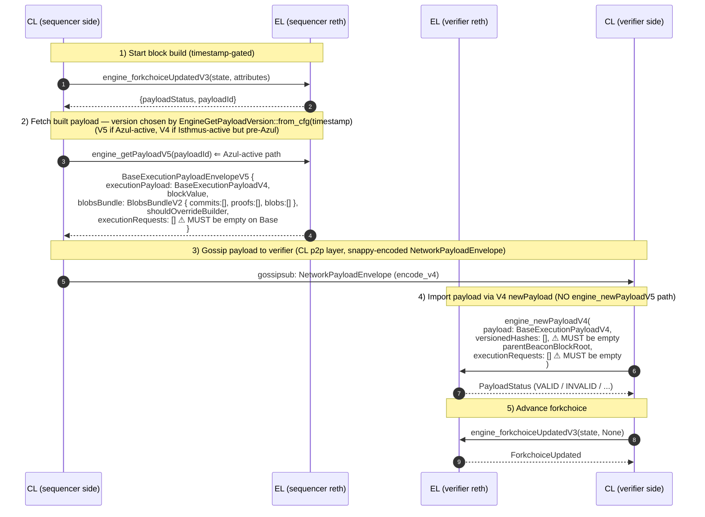
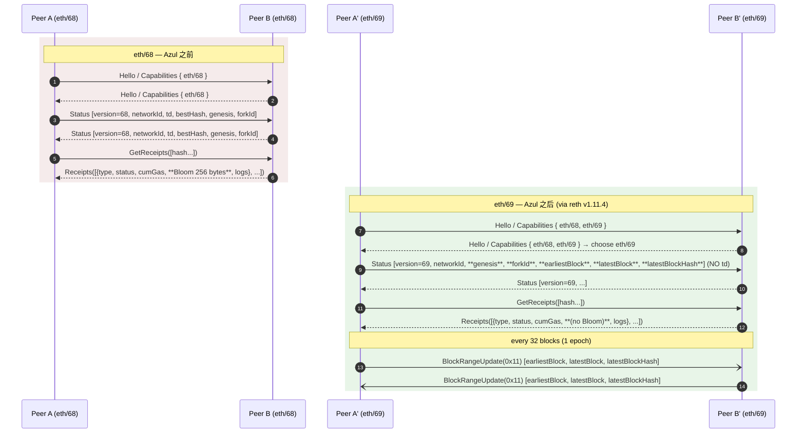

# Flashblocks 优化与网络协议变更解析 (Round 2 Draft)

> **Scope reminder**: 本节聚焦 Base Azul 的「Flashblocks WebSocket payload 简化 + 节点间/Engine
> API 网络协议升级」工作线，覆盖 6 个 outline item。Osaka EVM 语义（EIP-7823/7825/7883/7939/7951）由
> `osaka-evm-changes` 课题处理；证明系统由 `multiproof-architecture` 处理；本节不重复。
>
> **Code anchors**:
> - `base/base` @ `84155fef0c50f7799e804c757e078306848f032e` (2026-05-16, 与 overview final 一致)
> - `ethereum-optimism/optimism` @ `d905be1e03df0e30112dc382d3b9b74d0d65aaa3`
> - 网络层 wire protocol 与 Engine API 客户端实现来自 reth pin: `paradigmxyz/reth` tag `v1.11.4`
>   (`base/Cargo.toml:325-390`)
>
> **Round-2 deltas (vs round-1, commit `03f6470`)**:
> - item-1: 纠正 Azul-后 Flashblocks JSON wire 形态 (`#[skip_serializing_none]` 使 `access_list: null`
>   也被省略), 与 Base spec 示例的 divergence 显式标注。
> - item-4: `eth_config.precompiles` 全表替换为 EIP-7910 canonical keys (`ECREC`/`ID`/`BN254_*`/
>   `KZG_POINT_EVALUATION`/`BLS12_*`), 并标注 sample 为 non-normative。
> - item-3: 重述 Engine API V4 兼容性——V4 capability 仍广告且按 timestamp gating 在 Azul 之前出
>   V4 envelope。
> - Source Coverage: `expert_commentary` 实质化, 引入 base.dev `Introducing Base Azul`、
>   `base/flashblocks-websocket-proxy` README、`flashbots/rollup-boost` README, 删除原 mis-bucketed
>   EIP/internal 引用。

## Executive Summary

Azul 在四个相互独立但同时激活的工作面上重塑了 Base 节点的外部表面：

1. **Flashblocks WebSocket payload 简化**: 构建者侧 `FlashblocksMetadata` 在 Azul timestamp 之后仅
   实际 emit `block_number` —— `new_account_balances`、`receipts`、`access_list` 三个字段都被 Azul
   分支设为 `None`，再由 `#[skip_serializing_none]` 一并从 wire JSON 中剔除。`access_list` 的
   struct 字段保留只是为了未来打开 BAL 时无需变动 wire 类型；**当前 Azul wire 上不会出现 `access_list`
   key**。Base spec exec-engine 示例中显示的 `"access_list": null` 与代码行为是 divergence——下游
   消费者必须**同时容忍 absent 与 `null`** 两种形态。变更动机包括带宽节省 (sub-block 200 ms 节奏下
   `receipts`/`new_account_balances` 是 O(交易数)/O(touched_accounts) 放大器) 与为未来 Block Access
   List 让路 (基于 blog.base.dev `Introducing Base Azul` 公开叙述)。
2. **eth/69 wire protocol**: EIP-7642 将 Status 消息中已废弃的 `td` 字段移除并加入两端块号/哈希
   字段，将 Receipts 编码扁平化（去掉 Bloom，由 receiver 重算），并新增 `BlockRangeUpdate (0x11)`
   消息以 epoch (32 块) 节奏广播节点可见范围。Base 节点对 eth/69 的支持**继承自固定版本的
   reth 依赖** (`paradigmxyz/reth v1.11.4`)，并非 Base 仓库内再造一份 wire 编解码。
3. **Engine API V5 envelope + V4 payload**: Azul 之后 sequencer 在「production 出块路径」上通过
   `engine_forkchoiceUpdatedV3` + `engine_getPayloadV5` 取得新 envelope; verifier 通过
   `engine_newPayloadV4` 导入. 关键事实: `ENGINE_CAPABILITIES` 仍**同时**广告 `engine_getPayloadV4`
   与 `engine_getPayloadV5` (engine.rs:24-38); 哪一版本被实际调用由
   `EngineGetPayloadVersion::from_cfg(rollup_cfg, payload_timestamp)`
   (`crates/consensus/engine/src/versions.rs:82-108`) 在 sequencer build path
   (`crates/consensus/engine/src/task_queue/core.rs:326-343`) 上做时间戳分支：Azul 激活后取
   `V5`，Isthmus 之后、Azul 之前取 `V4`. 因此「V4 envelope 在 Azul 后消失」是不准确的——V4 仍
   capability-available, 仅在 production/sequencer 出块决策上不再被选中. 另两条硬性约束保持: blob
   相关输入必须为空 (`expectedBlobVersionedHashes` / `blobsBundle` 均为空数组), 且
   `engine_newPayloadV4` 的 `executionRequests` 必须为空数组。**没有 `engine_newPayloadV5` 入口**。
4. **EIP-7910 `eth_config`**: 新 JSON-RPC 方法 `eth_config` 返回 `current` / `next` / `last` 三段
   fork 配置。Base 特定的两条偏离由 `BaseEthConfigHandler` 强制：(a) `blobSchedule` 的 wire-visible
   字段 `baseFeeUpdateFraction` / `max` / `target` 全部归零（Base 不支持原生 blob，避免广告合成默认
   值）；(b) `systemContracts` 仅保留 EIP-7910 schema 内的 `BeaconRoots` 与 `HistoryStorage`，
   `DepositContract` / `ConsolidationRequestPredeploy` / `WithdrawalRequestPredeploy` 一律剔除。
   `precompiles` map 按 EIP-7910 canonical key 命名 (`ECREC` / `ID` / `BN254_ADD` / `BN254_MUL` /
   `BN254_PAIRING` / `KZG_POINT_EVALUATION` / `BLS12_G1ADD` / `BLS12_PAIRING_CHECK` / ...), 由 reth
   `EthConfigHandler` 按 fork 计算并不被 Base 端 sanitize.

四项变更同时在 Sepolia (2026-04-20 18:00 UTC, 截至 commit 当日已运行约 27 天) 与 mainnet (代码内
`activation_timestamp = 1_779_991_200` 即 2026-05-28 18:00 UTC, 公开 spec 仍标 TBD) 两条 chain 上由
`is_azul_active_at_timestamp(timestamp)` 网关同步切换。下游迁移路径（rollup-boost、proxy、wallet、
indexer、MEV searcher）的关键事实在 item-6 汇总。

## Item Findings

### item-1 — Flashblocks WebSocket Payload Simplification

#### design_motivation

- **官方叙事 (Base Spec, exec-engine.md:53-85)**: "The `FlashblocksMetadata` payload transmitted
  over the Flashblocks WebSocket is simplified in Azul. The `new_account_balances` and `receipts`
  fields are removed. The `access_list` field remains but will not be populated in Azul."
- **公开博客背景 (blog.base.dev `Introducing Base Azul`)**: "Breaking change to the Flashblocks
  websocket payload, removing account balances and receipts. Make the payload smaller, freeing up
  room for block access lists and other performance hints in the future." 这是 Base 团队在
  external commentary 层面对 motivation 的一句明确表述, 与 spec 文本与代码实现一致。
- **推断 1 (带宽 / 串行延迟)**: 旧版 metadata 中 `receipts: HashMap<TxHash, Receipt>` 是 O(交易数)
  且每个 Receipt 内含完整 `logs[]`；`new_account_balances: HashMap<Address, U256>` 是
  O(touched_accounts)。在 200ms flashblock 节奏下，sub-block 内每秒发出 5 个 payload, 这两个 map
  会显著放大 WebSocket 写入与下游缓存的负载。
- **推断 2 (BAL 让路)**: outline 与公开博客均提到「为 Block Access List 铺路」。EIP-2930 风格的
  access list 已建模在结构体里 (`access_list: Option<FlashblockAccessList>`)；保留结构体字段但
  serialize 时省略 key 是典型的「先腾出 wire 字段，后续硬分叉再启用」演化策略。
- **推断 3 (Receipt 一致性)**: 旧的 in-band receipts 与 `eth_getTransactionReceipt(pending)` 来源
  不同，存在两套副本互相漂移的风险（特别是当应用先看到 WebSocket receipt 再校验 RPC 时）。
  移除 receipts 把"pending receipt 的唯一来源"收敛到 RPC 路径，避免双口径。

#### spec_reference

- Base Spec: <https://specs.base.org/upgrades/azul/exec-engine#remove-account-balances--receipts>
  (源文件: `base/docs/specs/pages/upgrades/azul/exec-engine.md:53-85`)
- Base Spec overview: <https://specs.base.org/upgrades/azul/overview>
- 配套上游讨论参考 `paradigmxyz/reth` 的 op-payload-attributes 与 op-flashblocks 集成（通过
  v1.11.4 pin 引入，见 `base/Cargo.toml:325-390`）。
- 外部叙述: <https://blog.base.dev/introducing-base-azul> ("Breaking change to the Flashblocks
  websocket payload, removing account balances and receipts. Make the payload smaller, freeing
  up room for block access lists and other performance hints in the future.")

#### before_after_comparison

**Spec-stated Azul-before** — `base/docs/specs/pages/upgrades/azul/exec-engine.md:60-76`:

```json
{
  "block_number": 43403718,
  "new_account_balances": {
    "0x4200000000000000000000000000000000000006": "0x35277a9715c6df1c99de"
  },
  "receipts": {
    "0x1ef9be45b3f7d44de9d98767ddb7c0e330b21777b67a3c79d469be9ffab091dd": {
      "cumulativeGasUsed": "0x177d7bd",
      "logs": [],
      "status": "0x1",
      "type": "0x2"
    }
  },
  "access_list": null
}
```

**Spec-stated Azul-after** — `base/docs/specs/pages/upgrades/azul/exec-engine.md:80-85`:

```json
{
  "block_number": 43403718,
  "access_list": null
}
```

**Actual Azul-after on the wire (from current Base builder code)** — derived from
`crates/builder/core/src/flashblocks/payload.rs:905-916` (`#[skip_serializing_none]` on
`FlashblocksMetadata`), `:1111-1126` (Azul branch sets `access_list: None`, `receipts: None`,
`new_account_balances: None`), and the metadata-format test at `:1373-1379` (asserts that
`serde_json::to_value(&metadata)` for a struct with `access_list: None` produces a JSON object
whose **exact** key set is `["block_number", "new_account_balances", "receipts"]`, with
`access_list` omitted):

```json
{
  "block_number": 43403718
}
```

> **Spec / code divergence (must be tolerated by consumers)**: The Base spec example shows
> `"access_list": null`, but the current `base/base@84155fef` builder emits the field by way of
> `serde_with::skip_serializing_none`, so a `None` access_list does **not** appear on the wire as
> a `null` key — it is omitted entirely. Downstream parsers should tolerate **both** "key absent"
> and "key present with `null`" semantics, since (a) the spec invites the latter, and (b) future
> builder versions or alternative implementations may emit `null` explicitly. The test at
> `payload.rs:1373-1379` only fixes the pre-Azul shape; there is no test in `base/base@84155fef`
> that asserts the Azul-after shape, leaving room for either behavior in future patches.

字段映射 (corrected):

| 字段 | Azul 前 wire (spec & code) | Azul 后 wire (current code) | Azul 后 wire (spec example) | 备注 |
|---|---|---|---|---|
| `block_number` | `u64` | `u64` | `u64` | 保留, 唯一恒出现的字段 |
| `new_account_balances` | `HashMap<Address, U256>` | **key omitted** | **key omitted** | 结构体 `Option` 字段保留, `None` → 由 `#[skip_serializing_none]` 省略 |
| `receipts` | `HashMap<TxHash, BaseReceipt>` | **key omitted** | **key omitted** | 同上; 应用应改用 `eth_getTransactionReceipt(pending)` |
| `access_list` | `null` (空 `Option`) | **key omitted (current code)** ❘ `null` (spec example) | `null` | 结构体字段保留, `None` 在 builder 端被 `#[skip_serializing_none]` 省略; **spec 示例与代码 divergence**, 消费者需容忍两种形态 |

#### base_code_location

- **Builder-side `FlashblocksMetadata` struct** — `base/crates/builder/core/src/flashblocks/payload.rs:905-916`:

  ```rust
  #[skip_serializing_none]
  #[derive(Debug, Serialize, Deserialize)]
  struct FlashblocksMetadata {
      /// Receipts for transactions in this flashblock (removed in Base 1.0)
      receipts: Option<HashMap<B256, BaseReceipt>>,
      /// Changed account balances (removed in Base 1.0)
      new_account_balances: Option<HashMap<Address, U256>>,
      /// The block number this flashblock belongs to
      block_number: u64,
      /// The flashblock access list
      access_list: Option<FlashblockAccessList>,
  }
  ```

  `#[skip_serializing_none]` 是 `serde_with` 提供的属性：当字段为 `None` 时 serde 在序列化时直接
  **跳过该 key**（而非 emit `null`），因此 Azul 后 emit 出的 JSON 只剩 `block_number`。 in-source
  `// (removed in Base 1.0)` 注释直接锁定了 Azul 切换语义。

- **Azul gating** — `base/crates/builder/core/src/flashblocks/payload.rs:1111-1126`:

  ```rust
  let metadata: FlashblocksMetadata =
      if ctx.chain_spec.is_azul_active_at_timestamp(ctx.attributes().timestamp()) {
          FlashblocksMetadata {
              block_number: ctx.parent().number + 1,
              access_list: None,
              receipts: None,
              new_account_balances: None,
          }
      } else {
          FlashblocksMetadata {
              block_number: ctx.parent().number + 1,
              access_list: None,
              new_account_balances: Some(new_account_balances),
              receipts: Some(receipts_with_hash),
          }
      };
  ```

  注意: **两条分支都把 `access_list` 写成 `None`**, 与 `#[skip_serializing_none]` 配合, 意味着
  无论 Azul 是否激活, 当前 builder **都不会在 wire 上 emit `access_list` key**。spec 示例显示的
  `"access_list": null` 是 spec-side artifact, 不是当前代码产物。

- **FAL 构造然后丢弃** — `base/crates/builder/core/src/flashblocks/payload.rs:1108-1109`:

  ```rust
  let fal_builder = std::mem::take(&mut info.extra.access_list_builder);
  let _access_list = fal_builder.build(min_tx_index, max_tx_index);
  ```

  Block Access List 构造器仍在每个 flashblock 内运行，但产物被绑定到 `_access_list` 立即丢弃，
  与上述 `access_list: None` 一致。该实现细节意味着 BAL 的「填充开关」可以通过将 `_access_list`
  替换为 `Some(_access_list)` 在不变动 wire 结构的情况下打开 (届时下游若一直按「absent or null」
  容忍解析, 会自动收到 `Some(...)` 形态)。

- **Serde emission** — `base/crates/builder/core/src/flashblocks/payload.rs:1162`:

  ```rust
  metadata: serde_json::to_value(&metadata).unwrap_or_default(),
  ```

  通过 `serde_json::to_value(&metadata)` 序列化, 由 `#[skip_serializing_none]` 决定 `None` 字段
  不进入输出 JSON 对象。

- **Metadata-format test** — `base/crates/builder/core/src/flashblocks/payload.rs:1373-1379`:

  ```rust
  // Verify exact field set
  let mut keys: Vec<&String> = obj.keys().collect();
  keys.sort();
  assert_eq!(
      keys,
      vec!["block_number", "new_account_balances", "receipts"],
      "metadata field names changed"
  );
  ```

  此测试构造的是 pre-Azul fixture (`receipts: Some(...)`、`new_account_balances: Some(...)`、
  `access_list: None`); assert 的 key set **明确排除了 `access_list`**, 直接证明
  `#[skip_serializing_none]` 在当前代码路径下确实剔除了 `None` 字段。

- **Consumer-side `Metadata` struct** — `base/crates/common/flashblocks/src/metadata.rs:5-10`:

  ```rust
  #[derive(Debug, Deserialize, Serialize, Clone, PartialEq, Eq, Default)]
  pub struct Metadata {
      pub block_number: u64,
  }
  ```

  Azul 之后 base 自身的 Flashblocks 消费者只解析 `block_number`；旧字段被 serde 的容忍式解析
  无害忽略。

- **payload v0.5.0 历史样本** — `base/crates/common/flashblocks/src/block.rs:228-268` (`V0_5_0_PAYLOAD_JSON`
  常量) 与 `try_decode_old_format_still_decodes` 测试 (`block.rs:113-130`): 证明旧格式 metadata
  含 `receipts` / `new_account_balances` / `access_list: null`，新解码器对其向后兼容。

#### upstream_reference

- **Optimism rollup-boost (consumer/cache)** — `optimism/rust/rollup-boost/crates/flashblocks-rpc/src/cache.rs:30-35`:

  ```rust
  #[derive(Debug, Deserialize, Serialize, Clone, Default)]
  pub struct Metadata {
      pub receipts: HashMap<String, OpReceipt>,
      pub new_account_balances: HashMap<String, String>,
      pub block_number: u64,
  }
  ```

  上游的 cache `Metadata` 仍是 Azul-前的 3 字段 layout，**不含 `access_list`、不含 Azul gating、
  且没有 `#[serde(default)]` 或 `Option<...>` 容忍空值**。Base 在此基础上 (a) 增加 `access_list`
  字段，(b) 加入 `is_azul_active_at_timestamp` 网关同时砍掉 `receipts` 与 `new_account_balances`,
  (c) 用 `#[skip_serializing_none]` 让 `None` 字段从 wire 上消失。这是一个明确的 **Base deviates**
  点，对应 item-6 的兼容性风险。

- **Optimism op-rbuilder (producer)** — `optimism/rust/op-rbuilder/crates/op-rbuilder/src/builders/flashblocks/payload.rs:942-947`:

  ```rust
  #[derive(Debug, Serialize, Deserialize)]
  struct FlashblocksMetadata {
      receipts: HashMap<B256, <OpPrimitives as NodePrimitives>::Receipt>,
      new_account_balances: HashMap<Address, U256>,
      block_number: u64,
  }
  ```

  builder 端的 3 字段版本同样无 `access_list`、无 `#[skip_serializing_none]`, 也无 Azul 网关。
  Base 的 `crates/builder/core/src/flashblocks/payload.rs` 是 fork/port + 加字段 + 加 timestamp
  gating + 加 serde skip-none, 而非纯转译。

#### base_specific_behavior

- `access_list` 字段在结构体上保留, 但 (a) 两条 Azul 分支都设为 `None`, (b)
  `#[skip_serializing_none]` 让 `None` 在 wire 上**完全消失** (key absent), 与 Base spec example
  的 `"access_list": null` 形态不同。两种形态在语义上等价 (无 access list 内容), 但 JSON 结构
  不同, 下游需要按「key 可能 absent 也可能为 `null`」做容忍解析。
- 构造 FAL builder (`info.extra.access_list_builder`) 的工作量在 Azul 之后依然在做（每 sub-block
  一次), 但产物绑定到 `_access_list` 立即丢弃; 这预留了未来某个硬分叉将其打开的零成本切换点。
- 推荐路径: 应用层若仍需 pending receipts，应转向 `eth_getTransactionReceipt(<txhash>)` (带 pending
  标签) 而非订阅 WebSocket 字段（Spec exec-engine.md 未显式书写，但因 receipts 字段消失而成为唯一
  可行路径)。

#### compatibility_impact

- **解码兼容**: Base 的消费者侧 `Metadata` 结构（仅 `block_number`）依赖 serde 默认对未知字段的
  忽略，能解析「Azul 前」与「Azul 后」两类 payload；`try_decode_old_format_still_decodes`
  测试明确锁定旧格式仍可解码 (block.rs:113-130)。
- **编码 wire**: 旧消费者期望读取 `metadata.receipts.foo.bar` 的代码在 Azul 之后会得到
  `undefined` / `None` / 空 map，可能造成下游崩溃或缓存不更新。
- **`access_list` 的 absent/null 等价性**: 任何按「`metadata.access_list === null` 才视为
  no-FAL」的下游解析会在 Azul-after 误判 (key 完全不存在 ≠ key=null); 正确处理是把
  `metadata?.access_list ?? null` 或 `metadata.get("access_list") or None` 视为同一语义。
  rollup-boost upstream `Metadata` 没有此字段, 不受影响; 自己 fork rollup-boost 的下游服务
  若引入了 `access_list` 字段则需要这个 absent-tolerance 修补。
- 上述差异是 item-6 中迁移工作的核心风险点之一。

#### consumer_impact

| 消费者 | 影响 | 必需迁移动作 |
|---|---|---|
| `base/flashblocks-websocket-proxy` | 项目自我定位为「one-directional generic websocket proxy. It doesn't inspect any data or validate clients」(repo README, 截至 commit 当日), 透传无碍 | 若实现做过结构校验或字段提取, 需要放宽到「allow missing fields」+ 「allow `null`」双语义 |
| Flashbots `rollup-boost` (优化器) | `rollup-boost::flashblocks-rpc::cache.rs` 仍按旧 `Metadata` 解析；从 Base 接 Azul 后 payload 时这些字段会缺失 → cache 不再更新 receipts | 升级到能识别空字段的版本（serde `#[serde(default)]` 或 `Option<...>`），或迁移到 RPC 拉取 pending receipts |
| MEV searcher (PnL 计算依赖即时 receipts) | 不再能从 WebSocket 直接读 `status` / `cumulativeGasUsed` | 改用 `eth_getTransactionReceipt(pending)` 轮询或自建 trace |
| indexer (订阅 pending state) | 不再能从 WebSocket 读 account balance delta | 转 RPC 状态查询或 trace |
| wallet (pending tx UX) | UX 上 "pending receipt" 仍可由 RPC 提供 | 通常已使用 `eth_getTransactionReceipt`, 影响很小 |
| 自实现解析的研究/数据团队 | 若代码假设 `access_list` 一定为 `null` 出现, 在 Azul-after 路径会 KeyError | 改写为 absent-tolerant 解析 |

#### key_open_questions

- BAL 的 `access_list` 字段何时切换为 `Some(_)`? 当前为预留 wire 槽位, spec 未给出激活计划。
  blog.base.dev 「performance roadmap」段提及 "Flashblock Access Lists" 是 6 月 (post-Azul)
  性能升级一部分, 但未给具体时间。
- 是否有 `min_balance_change_threshold` 这样的开关在 Azul 之后再上线 `new_account_balances`?
  从代码 (gating 是 hard `None`) 推断**没有**这类配置。
- 是否会有「显式 emit `null`」分支被加回来 (例如某种 schema-back-compat flag)? 当前 commit 无该
  机制, 但留待 mainnet activation 后端到端观测确认。

---

### item-2 — EIP-7642 (eth/69) Wire Protocol Upgrade

#### design_motivation

- **`Status.td` 移除**: post-merge 之后 total difficulty 不再随每个 block 增长 (PoW 已废)，
  Status 中携带的 `td` 字段不再用于链头选择，只是 dead weight。
- **`Receipt.Bloom` 移除**: Bloom filter (256 bytes / receipt) 是 Receipts 同步阶段最大的单字段
  开销。EIP-7642 将其从 wire 上去掉，让 receiver 在 import 时本地重算。社区量化估计约 ~530GB
  全链历史带宽节约 (具体数字取决于历史链长度；EIP-7642 motivation 段提到 historical receipts
  bloom 占比是主要节约项)。
- **`BlockRangeUpdate (0x11)`**: 在不强制 Status 重握手的前提下，让 peer 周期性地把当前服务范围
  广播出去，便于 fast/snap 同步选 peer。32-block (1 epoch) cadence 是 EIP-7642 给出的 minimum
  recommended floor。

#### spec_reference

- EIP-7642: <https://eips.ethereum.org/EIPS/eip-7642>
- Base Spec: <https://specs.base.org/upgrades/azul/exec-engine#eth69>
  (`base/docs/specs/pages/upgrades/azul/exec-engine.md:48-50`, 引用 EIP-7642 作为唯一规范来源)

#### before_after_comparison

**Status 消息字段** (eth/68 vs eth/69):

| 字段 | eth/68 | eth/69 | 备注 |
|---|---|---|---|
| `protocolVersion` | u8 | u8 | 不变（值从 0x44 → 0x45） |
| `networkId` | u64 | u64 | 不变 |
| `totalDifficulty` | U256 | **移除** | post-merge 已无意义 |
| `bestHash` (blockhash) | B256 | **拆分为 latestBlockHash** | |
| `genesisHash` | B256 | B256 | 不变 |
| `forkId` (EIP-2124) | (hash, next) | (hash, next) | 不变 |
| `earliestBlock` | — | **新增** u64 | range floor |
| `latestBlock` | — | **新增** u64 | range ceil |
| `latestBlockHash` | — | **新增** B256 | range ceil hash |

**Receipt 编码**:

| 项 | eth/68 (即 Yellow Paper RLP) | eth/69 |
|---|---|---|
| `type` | tx type prefix | tx type prefix |
| `postState`/`status` | `(postState, status)` | 同 |
| `cumulativeGasUsed` | u64 | u64 |
| `logsBloom` | 256-byte Bloom | **移除**（receiver 重算） |
| `logs[]` | `[Log...]` | `[Log...]` |

接收方拿到无 Bloom 的 Receipt 后通过 `bloom = compute_bloom(logs)` 本地重新填充，再写入本地 DB。

**新增消息 `BlockRangeUpdate (0x11)`**:

```text
[earliestBlock: u64, latestBlock: u64, latestBlockHash: B256]
```

广播节奏: epoch (32 块) 一次, 触发条件包括最新块前进或 pruning 推动 earliest 前进。

#### base_code_location

> **重要**: Base 仓库内**没有 eth/69 Status/Receipt/`BlockRangeUpdate` 的 Rust 实现**。
> wire protocol 编解码与版本协商完全由 reth pin 提供：

- **reth pin** — `base/Cargo.toml:325-390` (节选):

  ```toml
  reth-network = { git = "https://github.com/paradigmxyz/reth", tag = "v1.11.4" }
  reth-eth-wire = { git = "https://github.com/paradigmxyz/reth", tag = "v1.11.4" }
  # ... 60+ reth-* crates all pinned to v1.11.4
  ```

  所有 reth 子模块统一固定到 `v1.11.4`。eth/69 是 v1.11 系列引入并稳定的特性，与该 tag 同步上线。

- **上游 reth 中的相关实现** (用于 reviewer 校对; 不在 base/base 内):
  - `paradigmxyz/reth` crate `reth-eth-wire-types`: `Status` 结构体的版本化定义
  - `paradigmxyz/reth` crate `reth-eth-wire-types`: `Receipt` 编解码的版本切换
  - `paradigmxyz/reth` crate `reth-eth-wire`: `BlockRangeUpdate` 消息处理与广播节奏
  - reth's `EthVersion` enum: eth/68 与 eth/69 共存的握手协商
  - 全部锚定到 v1.11.4 tag

- **Base spec 引用** — `base/docs/specs/pages/upgrades/azul/exec-engine.md:48-50`:

  > "[EIP-7642] updates the Ethereum wire protocol to version 69, removing legacy fields from
  > the `Status` message and simplifying the handshake."

  即: Base 只声明跟随 EIP-7642，实现细节交给 reth 上游。

#### upstream_reference

- **`ethereum-optimism/optimism` 中无 Go 端 eth/69 实现**: Optimism op-node 是 CL，
  op-geth (执行客户端) 才会承接 eth/69——而 op-geth 不在 monorepo 内。本课题以 reth 为
  Base 的执行层实现来源。`optimism/op-service/eth/types.go:805` 仅枚举 Engine API 方法名，
  不涉及 wire protocol 版本。
- **`paradigmxyz/reth` v1.11.4** 是 ground truth 引用。

#### base_specific_behavior

- **链 ID 与 ForkId 取值不同**: Base mainnet (`chain_id=8453`) 与 Sepolia (`chain_id=84532`) 的
  EIP-2124 forkid 与以太坊主网不同；这会在 eth/69 Status 握手时直接拒绝跨链 peer。该机制与 eth/68
  时代无变化, 只是携带 forkid 的 Status 消息形态改变。
- **Base 无 archival eth/69 peer 政策声明**: Base 节点是否会公开 archival peer over eth/69 取决于
  运营商配置, spec 未做硬性要求。
- **双版本握手**: 由于 reth v1.11.4 同时支持 eth/68 与 eth/69，Base 节点在 capabilities exchange
  时会先尝试 eth/69, 不支持时回落 eth/68。这是 reth 通用行为而非 Base 特定逻辑。

#### compatibility_impact

| Peer 角色 | 行为 |
|---|---|
| eth/69 peer ↔ eth/69 peer | 直接握手, 使用新 Status + 无 Bloom Receipt + `BlockRangeUpdate` |
| eth/68 peer ↔ eth/69 peer | capabilities exchange 协商到 eth/68, 退化为 eth/68 wire（含 Bloom） |
| eth/67 或更旧 | 不在 reth v1.11.4 的服务表中, 直接拒绝 |
| 自建 Rust/Go peer (未升级) | 取决于是否实现 v1.11.4-equivalent wire; Base 节点会和它们以 eth/68 通信 |

#### consumer_impact

- **节点运维**: 升级到 reth v1.11.4 / Base 升级版本之后无需额外动作；eth/69 是 backwards-compatible
  握手协商。
- **节点监控 / 探针**: 任何根据 Status 字段（特别是 `td`）做断言的运维工具会失败, 需要更新到读取
  `latestBlock` / `latestBlockHash` 字段。
- **fast/snap 同步策略**: 选 peer 的工具可以利用 `BlockRangeUpdate` 提供的 epoch 级 range 信息
  实现更精确的 peer 评分。
- **archival data API 提供商** (Alchemy / QuickNode / Infura 等等基于 Base 的): 主要影响是其内部
  集群 peer-to-peer 通信带宽下降, 用户侧无感。

#### key_open_questions

- Base 节点是否启用 eth/69-only 模式？从 reth v1.11.4 默认配置看，eth/68 仍然广告并接受。
- `BlockRangeUpdate` 实际广播节奏在 Base 节点上的观测数据：epoch=32 块 = 64 秒（Base block time
  2s），但部分实现可能更激进或保守, 需要 mainnet rollout 后观测。

---

### item-3 — Engine API V5 Envelope + V4 Payload Lifecycle

#### design_motivation

- **为什么 envelope 升 V5 但 payload 留 V4**: V5 envelope (`engine_getPayloadV5`) 来自以太坊主网
  Osaka 升级——它在 V4 envelope 基础上把 `executionRequests` 提到 envelope 字段, 把 `blobs_bundle`
  升级到 `BlobsBundleV2`。Base 跟随这一升级是为了 ABI 对齐 (使所有兼容 V5 envelope 的 CL 客户端
  能直接对接), 但 Base **不支持原生 blob 与 EL execution requests**——这两者在 Base 上都是空数组,
  因此 payload (`BaseExecutionPayloadV4`, 含 `withdrawals_root`) 不需要升级到 V5 形态。
- **没有 `engine_newPayloadV5`**: 一旦 payload 仍是 V4-shaped, payload import 入口就只能是
  `engine_newPayloadV4`。Base 的 Engine API capabilities 列表 (`ENGINE_CAPABILITIES`,
  `base/crates/execution/rpc/src/engine.rs:24-38`) 明确**不**包含 `engine_newPayloadV5`, 确认这一
  设计意图。
- **V4 capability 为什么仍保留**: pre-Azul 块在 sequencer 升级后**仍**有可能被构造（reorg
  深度、replay、历史调试场景），verifier 仍需对历史块按 Isthmus 期的 `engine_getPayloadV4`
  路径出/入块. 当 sequencer/verifier 处理 timestamp < azul activation 的 payload 时, 仍走 V4
  入口 — 因此 `engine_getPayloadV4` 留在 `ENGINE_CAPABILITIES`, **并不是 dead capability**。

#### spec_reference

- Base Spec: <https://specs.base.org/upgrades/azul/exec-engine#engine-api-usage>
  (`base/docs/specs/pages/upgrades/azul/exec-engine.md:91-107`)
- Ethereum execution-apis spec (Osaka): <https://github.com/ethereum/execution-apis/blob/main/src/engine/osaka.md#engine_getpayloadv5>
- Ethereum execution-apis (Prague, `engine_newPayloadV4`): <https://github.com/ethereum/execution-apis/blob/03911ffc053b8b806123f1fc237184b0092a485a/src/engine/prague.md#engine_newpayloadv4>
- Ethereum execution-apis (Cancun, `engine_forkchoiceUpdatedV3`): <https://github.com/ethereum/execution-apis/blob/main/src/engine/cancun.md#engine_forkchoiceupdatedv3>

#### before_after_comparison

**调用流（高层）** — Azul 之前 (Isthmus active, Azul not active): V3 fcU + V4 envelope + V4 newPayload;
Azul 之后:

```
sequencer:    engine_forkchoiceUpdatedV3(state, attrs)  → 取得 payload_id
sequencer:    engine_getPayloadV5(payload_id)           → 返回 BaseExecutionPayloadEnvelopeV5
              {
                executionPayload: BaseExecutionPayloadV4 { ...; withdrawalsRoot },
                blockValue: U256,
                blobsBundle: BlobsBundleV2 { commitments: [], proofs: [], blobs: [] },
                shouldOverrideBuilder: bool,
                executionRequests: Bytes[]               // 必须为 []
              }
verifier:     engine_newPayloadV4(
                payload: BaseExecutionPayloadV4,
                versionedHashes: [],                      // 必须为 []
                parentBeaconBlockRoot: B256,
                executionRequests: []                     // 必须为 []
              ) → PayloadStatus
verifier:     engine_forkchoiceUpdatedV3(state, None)    → 把 finalized head 推进
```

> **Important nuance** (round-2 fix): The above describes the Azul-active "production/sequencer
> build path". The lower-level `engine_get*` method choice is made by
> `EngineGetPayloadVersion::from_cfg(rollup_cfg, payload_timestamp)`
> (`base/crates/consensus/engine/src/versions.rs:82-108`) and dispatched at
> `base/crates/consensus/engine/src/task_queue/core.rs:326-343`. Pre-Azul timestamps still
> resolve to `EngineGetPayloadVersion::V4`, and `engine_getPayloadV4` remains in
> `ENGINE_CAPABILITIES`. The Azul change is therefore **not** "V4 envelope is no longer supplied
> by the engine endpoint" — it is "the timestamp-gated dispatch now picks V5 for Azul-active
> payloads while V4 stays available for earlier timestamps".

**V5 envelope vs V4 envelope 字段差异**:

| 字段 | V4 envelope | V5 envelope |
|---|---|---|
| `executionPayload` | `BaseExecutionPayloadV4` | `BaseExecutionPayloadV4` (相同) |
| `blockValue` | U256 | U256 (相同) |
| `blobsBundle` | `BlobsBundleV1` (Cancun) | `BlobsBundleV2` (Osaka) |
| `shouldOverrideBuilder` | bool | bool (相同) |
| `executionRequests` | — | `Vec<Bytes>` (Prague 提到 envelope 层) |

Base 上 `blobsBundle` 与 `executionRequests` 均为空数组, 因此 V5 与 V4 envelope 在 Base 上
**字节级几乎等价**, 只是 V5 引入了 `executionRequests` 顶层字段并把 `blobsBundle` schema 升级到
V2.

#### base_code_location

- **`ENGINE_CAPABILITIES`** — `base/crates/execution/rpc/src/engine.rs:24-38`:

  ```rust
  pub const ENGINE_CAPABILITIES: &[&str] = &[
      "engine_forkchoiceUpdatedV1",
      "engine_forkchoiceUpdatedV2",
      "engine_forkchoiceUpdatedV3",
      "engine_getClientVersionV1",
      "engine_getPayloadV2",
      "engine_getPayloadV3",
      "engine_getPayloadV4",
      "engine_getPayloadV5",
      "engine_newPayloadV2",
      "engine_newPayloadV3",
      "engine_newPayloadV4",
      "engine_getPayloadBodiesByHashV1",
      "engine_getPayloadBodiesByRangeV1",
  ];
  ```

  关键观察: 全部 V2/V3/V4/V5 capability 共存. 没有 `engine_newPayloadV5`, 没有
  `engine_forkchoiceUpdatedV4`. **V4 capability 不是 dead capability**——见下方 timestamp gate。

- **Timestamp-gated payload version dispatch** — `base/crates/consensus/engine/src/versions.rs:82-108`:

  ```rust
  pub enum EngineGetPayloadVersion {
      V2,
      V3,
      V4,
      V5,
  }

  impl EngineGetPayloadVersion {
      pub fn from_cfg(cfg: &RollupConfig, timestamp: u64) -> Self {
          if cfg.is_base_azul_active(timestamp) {
              Self::V5
          } else if cfg.is_isthmus_active(timestamp) {
              Self::V4
          } else if cfg.is_ecotone_active(timestamp) {
              Self::V3
          } else {
              Self::V2
          }
      }
  }
  ```

  与 `base/crates/consensus/engine/src/task_queue/core.rs:326-343` (节选):

  ```rust
  let get_payload_version = EngineGetPayloadVersion::from_cfg(cfg, payload_timestamp);
  let payload_envelope = match get_payload_version {
      EngineGetPayloadVersion::V5 => {
          let payload = engine.get_payload_v5(payload_id).await...
          BaseExecutionPayloadEnvelope {
              parent_beacon_block_root: payload_attrs.attributes().payload_attributes
                  .parent_beacon_block_root,
              execution_payload: BaseExecutionPayload::V4(payload.execution_payload),
          }
      }
      EngineGetPayloadVersion::V4 => {
          let payload = engine.get_payload_v4(payload_id).await...
          BaseExecutionPayloadEnvelope { /* V4 path */ }
      }
      EngineGetPayloadVersion::V3 => { /* V3 path */ }
      EngineGetPayloadVersion::V2 => { /* V2 path */ }
  };
  ```

  task_queue/core.rs:326-343 与 versions.rs:97-108 一起证明: **`engine_getPayloadV4` 仍被
  consensus 在 `timestamp < azul_activation` 的路径上主动调用**。同一份 sequencer 代码同时承担
  pre-Azul / post-Azul 出块。这与 round-1 表述的"V4 envelope 在 Azul 后不再供给"是一处需要
  修正的措辞——在 Azul-active 时间段上 production 路径走 V5, 但 V4 路径并未失效。

- **`new_payload_v4` 入口** — `base/crates/execution/rpc/src/engine.rs:80-89` (trait):

  ```rust
  /// - blob versioned hashes MUST be empty list.
  /// - execution layer requests MUST be empty list.
  #[method(name = "newPayloadV4")]
  async fn new_payload_v4(
      &self,
      payload: BaseExecutionPayloadV4,
      versioned_hashes: Vec<B256>,
      parent_beacon_block_root: B256,
      execution_requests: Requests,
  ) -> RpcResult<PayloadStatus>;
  ```

  与 `engine.rs:291-307` (实现):

  ```rust
  async fn new_payload_v4(
      &self,
      payload: BaseExecutionPayloadV4,
      versioned_hashes: Vec<B256>,
      parent_beacon_block_root: B256,
      execution_requests: Requests,
  ) -> RpcResult<PayloadStatus> {
      trace!(target: "rpc::engine", "Serving engine_newPayloadV4");
      let payload = ExecutionData::v4(
          payload,
          versioned_hashes,
          parent_beacon_block_root,
          execution_requests,
      );
      Ok(self.inner.new_payload_v4_metered(payload).await?)
  }
  ```

  注意 trait doc-comment (`engine.rs:80-81`) **声明性地**约束 `blob versioned hashes MUST be
  empty list` 与 `execution layer requests MUST be empty list`。实际运行期校验由 `ExecutionData::v4`
  下游的 `EngineApiValidator` (来自 reth) 在 payload pre-validation 阶段强制执行；handler 本身
  不在此处插入额外的拒绝逻辑，而是把空数组语义传递给 validator。

- **`get_payload_v5` 入口** — `base/crates/execution/rpc/src/engine.rs:387-403` (trait + impl):

  ```rust
  /// Returns the [`BaseExecutionPayloadEnvelopeV5`], which uses
  /// [`BaseExecutionPayloadV4`](base_common_rpc_types_engine::BaseExecutionPayloadV4) for the
  /// execution payload and otherwise follows the V5 envelope shape.
  #[method(name = "getPayloadV5")]
  async fn get_payload_v5(
      &self,
      payload_id: PayloadId,
  ) -> RpcResult<Engine::ExecutionPayloadEnvelopeV5>;
  ```

  ```rust
  async fn get_payload_v5(
      &self,
      payload_id: PayloadId,
  ) -> RpcResult<EngineT::ExecutionPayloadEnvelopeV5> {
      trace!(target: "rpc::engine", "Serving engine_getPayloadV5");
      Ok(self.inner.get_payload_v5_metered(payload_id).await?)
  }
  ```

- **`BaseExecutionPayloadEnvelopeV5` 结构体** — `base/crates/common/rpc-types-engine/src/payload/v5.rs:22-34`:

  ```rust
  #[derive(Clone, Debug, PartialEq, Eq)]
  #[cfg_attr(feature = "serde", derive(serde::Serialize, serde::Deserialize))]
  #[cfg_attr(feature = "serde", serde(rename_all = "camelCase"))]
  pub struct BaseExecutionPayloadEnvelopeV5 {
      pub execution_payload: BaseExecutionPayloadV4,
      pub block_value: U256,
      pub blobs_bundle: BlobsBundleV2,
      pub should_override_builder: bool,
      pub execution_requests: Vec<Bytes>,
  }
  ```

  与 `v5.rs:43-46` 的 round-trip 测试样本（V5 envelope JSON 真实示例, blobsBundle 全空数组,
  executionRequests 全空数组）一致。

- **`BaseExecutionPayloadV4`** — `base/crates/common/rpc-types-engine/src/payload/v4.rs`:
  `ExecutionPayloadV3` (Cancun) + `withdrawals_root: B256`, 是 Base 自 Isthmus 起的 payload 形态。

- **`ExecutionData::v4` 构造器** — `base/crates/common/rpc-types-engine/src/envelope.rs:192-205`
  组合 `BaseExecutionPayload::v4(payload)` + `CancunPayloadFields::new(parent_beacon_block_root,
  versioned_hashes)` + `PraguePayloadFields::new(execution_requests)`. CL 客户端通过这个组合
  调度 V3/V4 行为。

- **CL p2p envelope (snappy 压缩)**: `base/crates/common/rpc-types-engine/src/envelope.rs` 中的
  `NetworkPayloadEnvelope::decode_v4 / encode_v4` 处理 p2p 网络 (consensus layer block gossip)
  的 envelope; 这是 Engine API JSON-RPC 层之外的并行通道, 在 Azul 阶段未变。

#### upstream_reference

- **`optimism/op-service/eth/types.go:805-809`** 仅枚举到 `NewPayloadV4` / `GetPayloadV4`,
  **没有 V5 envelope 方法**。Optimism Go 一侧在 commit `d905be1e…` 之下尚未推进到 Engine V5,
  说明 Base 的 V5 envelope 是一个 superset 行为, 而非已经统一到 Optimism 主线。
- **以太坊主网执行客户端 (reth)** 已在 v1.11.x 系列提供 V5 envelope 与 V5 envelope 的 serde 路径,
  Base 通过 `BaseExecutionPayloadEnvelopeV5` 复用其 `BlobsBundleV2`。

#### base_specific_behavior

- `blobsBundle` 必须为空: `BlobsBundleV2 { commitments: [], proofs: [], blobs: [] }`.
  Base 不支持原生 blob，sequencer 出块时 KZG bundle 永远为空集。
- `expectedBlobVersionedHashes` (in `engine_newPayloadV3` 与作为 `engine_newPayloadV4`
  的 `versioned_hashes` 参数) 必须为空数组。
- `executionRequests` 必须为空 `Vec<Bytes>`. EIP-7685 在 Base 阶段不启用 (DepositContract /
  WithdrawalRequest / ConsolidationRequest 三类 system contracts 均未部署, 参见 item-4 的
  `systemContracts` 过滤)。
- Engine 客户端不为 `engine_newPayloadV5` 注册任何 capability, CL 客户端若误调将得到 method
  not found。
- `engine_getPayloadV4` 与 `engine_getPayloadV5` 并存; consensus 端依 `payload_timestamp` 与
  `RollupConfig` 选 V5 (Azul-active) 或 V4 (Isthmus-active but Azul-not-yet).

#### compatibility_impact

| CL 客户端能力 | Azul-active 时间段下的可用性 |
|---|---|
| 支持 V5 envelope + V4 newPayload | ✅ 推荐路径; sequencer build path 实际调用 V5 |
| 仅支持 V4 envelope + V4 newPayload | ⚠️ Azul-active 时 sequencer build path 会调 `engine_getPayloadV5`, V4-only client 无法对接; 但 verifier 端 `engine_newPayloadV4` 与 capability `engine_getPayloadV4` 仍可用 |
| 仅支持 V3 envelope + V3 newPayload | ❌ V3 形态在 Isthmus 之后已不被生产, Azul 之后绝对失效 |
| 支持 V5 envelope + V5 newPayload | ❌ Base 不实现 V5 newPayload, V5 newPayload 调用返回 method not found |

> 表述更新 (round-2): "V4 envelope 在 Azul 后不再供给" 是不准确的; 准确表述是
> "Azul-active production / sequencer 路径选 V5, V4 仍 capability-available 且对 pre-Azul
> timestamp 由 consensus 主动调用"。

#### consumer_impact

- **op-node / op-conductor / op-supernode 等 CL**: Optimism 一侧 (`d905be1e…`) 暂无 V5 envelope
  方法名常量, 需在 op-service `Method` 表中追加 `GetPayloadV5` 才能调用 Base 节点的新接口。
- **Lighthouse / Prysm / Teku** 等以太坊主流 CL 不会直接对接 Base; 仅作为 spec ABI 参照。
- **Engine API SDK (alloy / web3.js engine extension)**: 已有 V5 envelope 类型即可对接。

#### key_open_questions

- Sequencer 自检与 verifier 是否会在 V5 envelope 内 `executionRequests` 非空时主动报错?
  从 trait doc-comment (engine.rs:80-81) 推断为 reth EngineApiValidator 行为, 实现细节在 reth 内。
- 是否存在 `expectedBlobVersionedHashes` 非空但客户端容忍的回路? doc-comment 强约束为 MUST be
  empty, 但运行时拒绝实际由 validator 完成, 不在 base/base 中。
- 当 reorg 把 head 退回 pre-Azul timestamp 时, sequencer 是否会真切回落到 `engine_getPayloadV4`?
  从 `EngineGetPayloadVersion::from_cfg` 的语义看是的, 但需要在 mainnet 运行期观测 metric
  (`engine_getPayloadV<N>` label, 见 `crates/consensus/engine/src/metrics/mod.rs:120`).

---

### item-4 — EIP-7910 `eth_config` JSON-RPC and Base-Specific Behavior

#### design_motivation

- **EIP-7910 通用动机**: 客户端在不知道 fork schedule 的情况下连进网络后, 无法可靠区分自己的
  chain config 是否与节点期待匹配——尤其在测试网快速迭代或 dev tooling 自动化场景。`eth_config`
  暴露 `current` / `next` / `last` 三段 fork 视图, 让客户端能在不依赖文档的情况下做对账。
- **Base 特定动机**:
  - `blobSchedule` 在以太坊主网上是 EIP-7840 给出的真实 blob fee schedule。Base 不接受原生
    blob, 若按主网默认值广告会让钱包/DeFi 错误地以为可发 blob tx 并出现签名后无法广播的失败。
    因此必须在 wire 上把 `baseFeeUpdateFraction` / `max` / `target` 三个 wire-visible 字段
    显式归零。
  - `systemContracts` 在 EIP-7910 schema 内 enumerate 出固定一组 (`BeaconRoots`, `HistoryStorage`,
    `DepositContract`, `ConsolidationRequestPredeploy`, `WithdrawalRequestPredeploy`)。Base 上后
    三者并未部署 (没有 PoS L1 EL functionality), 因此过滤掉避免广告不存在的合约。

#### spec_reference

- EIP-7910: <https://eips.ethereum.org/EIPS/eip-7910> (canonical precompile keys list)
- EIP-7840 (blob schedule wire shape): <https://eips.ethereum.org/EIPS/eip-7840>
- EIP-7951 (P256VERIFY precompile re-pricing in Osaka):
  <https://eips.ethereum.org/EIPS/eip-7951>
- Base Spec: <https://specs.base.org/upgrades/azul/exec-engine#eth_config-rpc-method>
  (`base/docs/specs/pages/upgrades/azul/exec-engine.md:108-131`)

#### before_after_comparison

**Before (Azul 之前)**: 无 `eth_config` 方法, 客户端只能解析 genesis JSON 或硬编码 fork schedule.

**After (Azul 之后)**: `eth_config` 返回三段 fork view, 以 Base 经过 sanitize 的字段值. 下方
example **使用 EIP-7910 规定的 canonical key 命名 (`ECREC`, `ID`, `BN254_*`, `KZG_POINT_EVALUATION`,
`BLS12_*`)**, 是按 spec shape + Base sanitize 推导得到的 illustrative sample, **non-normative**;
最终稿前应通过实际抓取 Sepolia `eth_config` 响应或对照 reth `EthConfigHandler` 输出来校对精确
key 集合与地址:

```jsonc
{
  "current": {
    "activationTime": "...",
    "chainId": "0x2105",                                // Base mainnet
    "forkId": { "hash": "0x...", "next": "..." },
    "blobSchedule": {
      "baseFeeUpdateFraction": 0,                       // ← Base override: 0
      "max": 0,                                         // ← Base override: 0
      "target": 0                                       // ← Base override: 0
      // min_blob_fee 等内部字段不在 EIP-7910 wire shape 中, 反序列化时回退 EIP-7840 默认值 = 1
    },
    "precompiles": {
      // EIP-7910 canonical Cancun-set keys
      "ECREC":                "0x0000000000000000000000000000000000000001",
      "SHA256":               "0x0000000000000000000000000000000000000002",
      "RIPEMD160":            "0x0000000000000000000000000000000000000003",
      "ID":                   "0x0000000000000000000000000000000000000004",
      "MODEXP":               "0x0000000000000000000000000000000000000005",
      "BN254_ADD":            "0x0000000000000000000000000000000000000006",
      "BN254_MUL":            "0x0000000000000000000000000000000000000007",
      "BN254_PAIRING":        "0x0000000000000000000000000000000000000008",
      "BLAKE2F":              "0x0000000000000000000000000000000000000009",
      "KZG_POINT_EVALUATION": "0x000000000000000000000000000000000000000a",

      // EIP-7910 canonical Prague-set keys (BLS12-381)
      "BLS12_G1ADD":          "0x000000000000000000000000000000000000000b",
      "BLS12_G1MSM":          "0x000000000000000000000000000000000000000c",
      "BLS12_G2ADD":          "0x000000000000000000000000000000000000000d",
      "BLS12_G2MSM":          "0x000000000000000000000000000000000000000e",
      "BLS12_PAIRING_CHECK":  "0x000000000000000000000000000000000000000f",
      "BLS12_MAP_FP_TO_G1":   "0x0000000000000000000000000000000000000010",
      "BLS12_MAP_FP2_TO_G2":  "0x0000000000000000000000000000000000000011",

      // EIP-7951 Osaka addition (RIP-7212 in Base before Azul, re-priced under EIP-7951)
      "P256VERIFY":           "0x0000000000000000000000000000000000000100"
    },
    "systemContracts": {
      "BEACON_ROOTS_ADDRESS":    "0x000F3df6D732807Ef1319fB7B8bB8522d0Beac02",
      "HISTORY_STORAGE_ADDRESS": "0x0000F90827F1C53a10cb7A02335B175320002935"
      // DEPOSIT_CONTRACT_ADDRESS, CONSOLIDATION_REQUEST_PREDEPLOY_ADDRESS,
      // WITHDRAWAL_REQUEST_PREDEPLOY_ADDRESS 不在响应中
    }
  },
  "next": { /* 同结构, 通常包含下一个未激活 fork */ },
  "last": { /* 同结构, 通常包含上一个已激活 fork */ }
}
```

> **Sample provenance / status (round-2)**: precompile key 命名严格按 EIP-7910 canonical list
> (Cancun-set + Prague BLS12-381 set + Osaka P256VERIFY) 给出, 取代 round-1 中沿用
> Rust enum-style 大写无下划线命名 (`ECRECOVER` / `IDENTITY` / `ECADD` / `ECMUL` / `ECPAIRING`
> / `KZGPOINTEVAL` / `BLSG1ADD` / `BLSPAIRING` ...). round-1 的命名与 EIP-7910 spec 不一致, 任何
> 按 EIP-7910 key 命名 diff `eth_config` 的工具沿用 round-1 会 false-positive 失配, 故 round-2
> 修正。**该 sample 仍为 non-normative**: 精确 key 集合最终以实际 Base sepolia/mainnet
> `eth_config` 响应与 reth `alloy_eips::eip7910::PrecompileName` 枚举为准, final 阶段抓取核对。

字段结构 (从 EIP-7910 schema 角度):

| 段 | 字段 | Base 表现 |
|---|---|---|
| `current.blobSchedule.target` | `u64` (EIP-7910 wire-visible) | 0 (`zero_blob_params()`) |
| `current.blobSchedule.max` | `u64` (EIP-7910 wire-visible) | 0 (`zero_blob_params()`) |
| `current.blobSchedule.baseFeeUpdateFraction` | `u64` (EIP-7910 wire-visible) | 0 (`zero_blob_params()`) |
| `current.precompiles[key]` | `address` 的 map, key ∈ EIP-7910 canonical name set | 按当前 active fork 计算; Cancun ∪ Prague BLS12-381 ∪ P256VERIFY |
| `current.systemContracts[key]` | `address` 的 map, key ∈ {BEACON_ROOTS, HISTORY_STORAGE, DEPOSIT_CONTRACT, CONSOLIDATION_REQUEST_PREDEPLOY, WITHDRAWAL_REQUEST_PREDEPLOY} | Base sanitize 后仅 BEACON_ROOTS + HISTORY_STORAGE |

#### base_code_location

- **`zero_blob_params()`** — `base/crates/execution/rpc/src/config.rs:19-31`:

  ```rust
  const fn zero_blob_params() -> BlobParams {
      BlobParams {
          target_blob_count: 0,
          max_blob_count: 0,
          update_fraction: 0,
          // EIP-7840's serde shape omits this field, so clients round-trip a missing value back to
          // the protocol default of `1`. Keep the wire-observable default aligned while zeroing the
          // blob capacity fields that Base must not advertise.
          min_blob_fee: BLOB_TX_MIN_BLOB_GASPRICE,
          max_blobs_per_tx: 0,
          blob_base_cost: 0,
      }
  }
  ```

  **关键事实** (对应 outline-review caveat 2):
  - **wire-visible 字段** (`target_blob_count` / `max_blob_count` / `update_fraction`) → 全部 `0`,
    对应 EIP-7910 中 `blobSchedule.target` / `blobSchedule.max` / `blobSchedule.baseFeeUpdateFraction`.
  - **`min_blob_fee`** = `BLOB_TX_MIN_BLOB_GASPRICE` (= 1, EIP-7840 协议默认值): EIP-7840 serde
    shape 不暴露此字段, 反序列化时客户端回填默认值 1. 因此 Base 的 `BlobParams` **内部不为零**,
    但**对外 wire 表现仍然是「EIP-7910 三个 blob 字段全为 0」**.
  - `max_blobs_per_tx` 与 `blob_base_cost` 是内部 reth bookkeeping, 不在 EIP-7910 schema 内.

- **`sanitize_system_contracts_for_fork`** — `base/crates/execution/rpc/src/config.rs:33-47`:

  ```rust
  fn sanitize_system_contracts_for_fork(fork: &mut EthForkConfig) {
      fork.system_contracts.retain(|contract, _| match contract {
          SystemContract::BeaconRoots                  => true,
          SystemContract::HistoryStorage               => true,
          SystemContract::ConsolidationRequestPredeploy
          | SystemContract::DepositContract
          | SystemContract::WithdrawalRequestPredeploy
          | SystemContract::Other(_)                   => false,
      });
  }
  ```

  在传给客户端之前过滤掉所有 PoS-EL 相关的系统合约, 同时显式拒绝任何 `Other(_)` (即 schema 外
  的扩展项), 严格遵守 EIP-7910 white-list 模式。

- **`BaseEthConfigHandler`** — `base/crates/execution/rpc/src/config.rs:54-190` (节选):
  wrap 上游 reth `EthConfigHandler`, 在 response 即将返回前对 `current` / `next` / `last`
  三段都调用 `sanitize_blob_schedules` 与 `sanitize_system_contracts`. **不对 `precompiles`
  做 sanitize** — precompile 键名由 reth/`alloy_eips::eip7910` 按 EIP-7910 canonical schema
  emit, Base 不重写。

- **集成测试 `eth_config_available_on_base_azul_node`** — `base/crates/execution/flashblocks-node/tests/eth_config.rs:90-103`:

  ```rust
  #[tokio::test]
  async fn eth_config_available_on_base_azul_node() -> Result<()> {
      let harness = TestHarnessBuilder::new()
          .with_chain_spec(Arc::new(BaseChainSpec::from_genesis(build_test_genesis_azul())))
          .build()
          .await?;
      let provider = harness.provider();

      let config = provider.client().request_noparams::<EthConfig>("eth_config").await?;
      assert_zero_blob_schedule(&config);
      assert_sanitized_system_contracts(&config);
      Ok(())
  }
  ```

  与 `assert_zero_blob_schedule` (`eth_config.rs:12-40`) 内显式断言:
  - `update_fraction == 0` / `max_blob_count == 0` / `target_blob_count == 0`
  - `min_blob_fee == 1` (`// the protocol default of `1` even though Base zeroes the advertised blob capacity fields.`)
  - `max_blobs_per_tx == 0` / `blob_base_cost == 0`
  - 在 `next` 与 `last` 上重复同样断言。

#### upstream_reference

- 上游 reth (`paradigmxyz/reth v1.11.4`) 提供 `EthConfigHandler`、`BlobParams`、`EthForkConfig`、
  `alloy_eips::eip7910::PrecompileName` 等类型 (PrecompileName 枚举的 serde 形态正是 EIP-7910
  canonical key 字符串). Base 在其之上 wrap 并 sanitize 一部分字段 (blobSchedule、systemContracts),
  但**没有重写 wire 协议**, precompile key 命名沿用上游 enum-driven 输出。
- Optimism (`d905be1e…`) 一侧无 `eth_config` 实现; 该课题不需要与 Go 端对账。

#### base_specific_behavior

- `blobSchedule` 三个 wire-visible 字段全为 0, 客户端再读到的 `min_blob_fee` 是 EIP-7840 协议
  默认 1 (反序列化回退结果), 这一组合等价于 spec "blobSchedule is always returned as zeroed
  values" 的意图。
- `systemContracts` 仅保留 `BeaconRoots` (post-Ecotone) 与 `HistoryStorage` (post-Isthmus), 三类
  PoS-EL 合约一律剔除; 任何未来上游 reth 引入的 `Other(_)` 扩展项也被显式拒绝, 保持 EIP-7910
  white-list 闭合。
- `precompiles` 反映 Base-active 集合, key 命名严格走 EIP-7910 canonical schema (经 reth
  `EthConfigHandler` + `alloy_eips::eip7910::PrecompileName` 驱动); Base 不 sanitize 这一字段,
  只是按 fork 计算其内容. P256VERIFY 在 Base 自 Fjord 已激活 (RIP-7212), Azul 起 re-priced
  per EIP-7951.

#### compatibility_impact

- **客户端 eager 校验**: 钱包 / SDK / explorer 若使用 `eth_config` 做 pre-flight 校验, 必须把
  Base 上的 `blobSchedule.*` 全 0 视作 "no native blob", 而不是 "schedule unavailable".
- **`min_blob_fee` 默认 1 的反序列化结果**: 如果客户端依赖 `min_blob_fee > 0` 判断 "blob 可用",
  会得到 false positive。正确的判断条件是 `target == 0 && max == 0`.
- **`systemContracts` 缺项**: 在 Base 上读取 `DepositContract` 等会得到 `null` / `undefined`,
  客户端应优雅降级而非 panic.
- **`precompiles` key 命名**: 客户端期望按 EIP-7910 canonical 名称 (`ECREC` / `ID` / `BN254_*`
  / `KZG_POINT_EVALUATION` / `BLS12_*` / `P256VERIFY`) 解析 map; 任何按 Rust-style enum 名
  (`ECRECOVER` / `IDENTITY` / `ECADD` / ...) 写死的工具会全 key miss。 round-1 草稿引用了
  非 EIP-7910 的命名, 已在本稿修正。

#### consumer_impact

| 消费者 | 影响 / 行动 |
|---|---|
| 钱包 SDK (viem / ethers / web3js) | 实现 `eth_config` reader 时优先看 `target` / `max`, 而非 `min_blob_fee`; precompile 键用 EIP-7910 canonical 名称 |
| explorer (basescan etc.) | 把 "Blob schedule" 段在 Base 上隐藏或标记为 "Not applicable" |
| dev tooling 自动化 (e.g. fork pre-activation check) | 用 `next.activationTime` 与本地 chainspec 对账; 若不一致告警 |
| CI 配置漂移检测 | 用 `eth_config` 全量结构哈希校验客户端期望, 注意 key 命名规范 |
| 跨客户端兼容性测试 (`hive` / acceptance-tests) | 复用 `eth_config_available_on_base_azul_node` 测试 fixture |

#### key_open_questions

- `precompiles` 在 Azul 阶段是否包含未来 Osaka 引入但 Base 未启用的项? 从 spec exec-engine.md
  (line 120-122) 的描述看, 包含 "standard Ethereum precompiles plus any Base-active additions",
  具体集合需要交叉对照 `base/docs/specs/pages/protocol/execution/evm/precompiles.md` 与 reth
  `alloy_eips::eip7910::PrecompileName` 枚举确认。
- 实际 EIP-7910 precompile map 在 Base Sepolia 上的具体键集合 (是否包含 `KZG_POINT_EVALUATION`
  即便 blob 未启用)? Final 阶段抓取 `https://sepolia.base.org` 的 `eth_config` 响应 fixture。
- `forkId` 在 `current` / `next` / `last` 中分别取什么 EIP-2124 hash? 实现交给 reth, 但 Base
  spec 未给出显式期望值; 同上 fixture 抓取一次即可填回 before/after 示例。

---

### item-5 — `base/base` Code Implementation Mapping

本 item 把 item-1 至 item-4 的代码锚点汇总, 便于 reviewer 与下游 Research Agent 直接定位。

| 主题 | 文件路径 (commit `84155fef…`) | 行号 | 关键符号 |
|---|---|---|---|
| Flashblocks builder Metadata | `crates/builder/core/src/flashblocks/payload.rs` | 905-916 | `FlashblocksMetadata` struct + `#[skip_serializing_none]` |
| Flashblocks Azul gating | `crates/builder/core/src/flashblocks/payload.rs` | 1111-1126 | `is_azul_active_at_timestamp` branch (3 字段全部 `None`) |
| Flashblocks FAL discarded | `crates/builder/core/src/flashblocks/payload.rs` | 1108-1109 | `_access_list` |
| Flashblocks metadata serde emission | `crates/builder/core/src/flashblocks/payload.rs` | 1162 | `serde_json::to_value(&metadata)` |
| Flashblocks metadata-format test | `crates/builder/core/src/flashblocks/payload.rs` | 1373-1379 | exact-keyset assertion 排除 `access_list` |
| Flashblocks consumer Metadata | `crates/common/flashblocks/src/metadata.rs` | 5-10 | `pub struct Metadata { pub block_number: u64 }` |
| Flashblocks payload V1 wrapper | `crates/common/flashblocks/src/payload.rs` | (full file) | `FlashblocksPayloadV1` |
| Flashblocks legacy decoder fixture | `crates/common/flashblocks/src/block.rs` | 113-130, 228-268 | `try_decode_old_format_still_decodes` / `V0_5_0_PAYLOAD_JSON` |
| eth/69 wire impl source | `Cargo.toml` | 325-390 | `paradigmxyz/reth v1.11.4` pin |
| eth/69 spec ref in Base | `docs/specs/pages/upgrades/azul/exec-engine.md` | 48-50 | "eth/69" section |
| Engine API capabilities | `crates/execution/rpc/src/engine.rs` | 24-38 | `ENGINE_CAPABILITIES` const (含 V4 & V5) |
| Engine API version dispatch enum | `crates/consensus/engine/src/versions.rs` | 82-108 | `EngineGetPayloadVersion::from_cfg(timestamp)` |
| Engine API version dispatch site | `crates/consensus/engine/src/task_queue/core.rs` | 326-343 | sequencer build-path V5/V4 分支 |
| Engine API version metric label | `crates/consensus/engine/src/metrics/mod.rs` | 120 | `engine_getPayloadV<N>` label |
| `engine_newPayloadV4` trait | `crates/execution/rpc/src/engine.rs` | 80-89 | "MUST be empty list" doc-comment |
| `engine_newPayloadV4` impl | `crates/execution/rpc/src/engine.rs` | 291-307 | `ExecutionData::v4(...)` |
| `engine_getPayloadV5` trait | `crates/execution/rpc/src/engine.rs` | 188-197 | doc-comment 解释 V5 envelope+V4 payload |
| `engine_getPayloadV5` impl | `crates/execution/rpc/src/engine.rs` | 396-403 | `get_payload_v5_metered` |
| `BaseExecutionPayloadEnvelopeV5` struct | `crates/common/rpc-types-engine/src/payload/v5.rs` | 22-34 | 5 字段定义 |
| `BaseExecutionPayloadV4` struct | `crates/common/rpc-types-engine/src/payload/v4.rs` | (full file) | `withdrawals_root: B256` 字段 |
| `ExecutionData::v4` 构造 | `crates/common/rpc-types-engine/src/envelope.rs` | 192-205 | Cancun + Prague 字段组合 |
| `BaseEthConfigHandler` | `crates/execution/rpc/src/config.rs` | 54-190 | wrap 上游 `EthConfigHandler` |
| `zero_blob_params()` | `crates/execution/rpc/src/config.rs` | 19-31 | wire-visible 字段为 0, `min_blob_fee` 保留 |
| `sanitize_system_contracts_for_fork` | `crates/execution/rpc/src/config.rs` | 33-47 | white-list 过滤 |
| `eth_config` 集成测试 | `crates/execution/flashblocks-node/tests/eth_config.rs` | 12-103 | `assert_zero_blob_schedule` / `assert_sanitized_system_contracts` |
| Base Spec exec-engine | `docs/specs/pages/upgrades/azul/exec-engine.md` | 1-132 | 全文 |

**Optimism 上游对比** (commit `d905be1e…`):

| 主题 | 上游路径 | Base 关系 |
|---|---|---|
| Flashblocks consumer Metadata | `rust/rollup-boost/crates/flashblocks-rpc/src/cache.rs:30-35` | Base **fork+deviate** (加 access_list 字段 + Azul gating + skip-none) |
| Flashblocks producer Metadata | `rust/op-rbuilder/crates/op-rbuilder/src/builders/flashblocks/payload.rs:942-947` | Base **fork+deviate** (加 access_list 字段 + Azul gating + skip-none) |
| Engine API method names | `op-service/eth/types.go:805-809` | Base **superset** (Go 端无 V5 envelope 常量) |
| eth/69 wire impl | (无, op-geth 在仓库外) | 不可比 |
| `eth_config` impl | (无) | Base **first-class implementation** |

#### key_open_questions

- 是否还有更精细的 Engine API validator 在 reth 层做 `executionRequests == []` 的硬拒绝? 需要在
  final 阶段通过 reth `engine_newPayloadV4` 实现路径校对。
- `BaseExecutionPayload::v4` 在 `envelope.rs` 内的字段组合是否还包含 Isthmus-only 字段未来需要
  升级 V5 payload? 当前不在 spec 强约束内。

---

### item-6 — Compatibility, Downstream Consumer Impact, and Migration Sequence

#### design_motivation

Azul 同时上线四块变更, 下游生态的迁移成本必须可控。本 item 汇总各类消费者的具体行动表与
rollout 时序, 供下游课题 `mantle-impact-assessment` 引用。

#### spec_reference

- Base Spec overview (Azul rollout schedule): <https://specs.base.org/upgrades/azul/overview>
- Base Spec exec-engine 全文 (本节所有 wire 变更): 同上
- Base Spec networking 章节 (eth/69 高层叙事): 见 spec overview 链接
- 公开发布说明 (Azul 上线动机/计划): <https://blog.base.dev/introducing-base-azul>

#### before_after_comparison

**Sepolia activation** (来自 `base-strategy-azul-overview` final 与 `base/Cargo.toml` 内的 chain
spec 注释):

| 项 | 值 |
|---|---|
| Chain | `Base Sepolia (chainId 84532)` |
| Activation timestamp | `1_776_708_000` (2026-04-20 18:00 UTC) |
| 截至 commit `84155fef…` 已运行 | ~27 天 |
| 状态 | 已激活, Flashblocks/eth-69/Engine V5/eth_config 全部生效 |

**Mainnet activation** (双口径表述):

| 来源 | 值 |
|---|---|
| `base/` 代码内 activation timestamp | `1_779_991_200` (≈ 2026-05-28 18:00 UTC) |
| 公开 Base Spec rollout schedule (截至 2026-05-17) | 仍标 "TBD" |
| blog.base.dev `Introducing Base Azul` 公开博客 (截至 commit 当日) | 文字描述 "targeting mainnet activation on May 13, 2026" 但 spec 仍未冻结到具体值 |

> 此处遵循 `base-strategy-azul-overview` final.md 的双口径表述: 引用 code-side 数值与 spec-side
> TBD 都明示出来, 不替读者下结论。public blog 的口径 (5/13) 与 code 的口径 (5/28) 存在 15 天差,
> 已通过 PR #2724 (`chore: delay azul to 28th may`) reconciled 至 5/28; final 前应再核查 spec
> 是否同步更新。

#### base_code_location

- 单一总入口: `is_azul_active_at_timestamp` (位于 chain spec, 跨多个 crate 调用), 同时 gating
  四块变更。
- builder-side: `crates/builder/core/src/flashblocks/payload.rs:1111`.
- Engine API: 由 reth `EngineApiValidator` 与 chain spec 共同 gate (capabilities 在 Azul 前后
  实际不变, sequencer build path 在 `task_queue/core.rs:326-343` 通过
  `EngineGetPayloadVersion::from_cfg(payload_timestamp)` 选 V5/V4).
- eth_config: `crates/execution/rpc/src/config.rs:33-47` 的 sanitize 不依赖时间戳, 总是 active;
  调用方式入口 `crates/execution/flashblocks-node/tests/eth_config.rs:90-103`.

#### upstream_reference

- `paradigmxyz/reth v1.11.4` 提供 eth/69 wire 与 `EthConfigHandler` 基础设施。
- `ethereum-optimism/optimism` (`d905be1e…`) 一侧 Flashblocks 消费者尚未跟随 (`cache.rs` 仍是
  3 字段 Metadata); 上游需要在某次 release 内补齐 access_list 支持与 Azul-后字段缺失的容忍解析。

#### base_specific_behavior

- Base 是 single-client stack (reth-based); 不存在 multi-client 一致性问题。
- Mainnet rollout 之前的"部分迁移期"风险窗口很短 (Sepolia 27 天 + mainnet 一次性激活), 与
  Ethereum 主网多客户端逐步升级模式不同。

#### compatibility_impact (汇总表)

| 角色 | 是否需要动作 | 主要风险 |
|---|---|---|
| eth/68-only peer | 不需要 (双版本握手) | 错失 530GB 带宽节约 + 无 BlockRangeUpdate |
| V4-only CL 客户端 (sequencer 端) | Azul-active 时段无法对接 V5 production path | 必须接 V5 envelope 才能跑 Azul-active 块 |
| V4-only CL 客户端 (verifier 端) | 仍可调用 `engine_newPayloadV4` (Azul payload import 入口) | 无 |
| `rollup-boost` (legacy) | 需要升级到容忍空 `receipts`/`new_account_balances` 的版本 | cache 更新中断 |
| `flashblocks-websocket-proxy` | 大概率透传无碍 (READMEs 自我定位为 generic, no schema inspection) | 若 fork 实现做严格 schema 校验, 需要放宽到 absent+null 双语义 |
| RPC 服务商 (Alchemy / QuickNode / GetBlock) | 升级到 reth v1.11.4-equivalent 版本 | 无 |
| Wallet SDK | 添加 `eth_config` reader (可选); 使用 EIP-7910 canonical precompile keys | 无 |
| MEV searcher | 必须改用 `eth_getTransactionReceipt(pending)` | pending receipt 延迟略增 |
| Indexer | 必须改用 RPC 状态/trace 查询替代 WebSocket `new_account_balances` | 重新基线 |
| CI 跨客户端校验脚本 | 引入 `eth_config` snapshot 校验 | 无 |

#### consumer_impact

- **公开博客 / 通告**: 由 base.dev / @BuildOnBase 在 Azul 上线公告中说明 receipts/balances 迁移
  路径 (blog.base.dev `Introducing Base Azul` 已点出 "Breaking change to the Flashblocks
  websocket payload"); 推荐 ≥30 天 deprecation lead time (Sepolia 实际给了 27 天).
- **rollup-boost 维护方** (Flashbots): PR 链路应在 mainnet activation 之前合并并 cut release.
- **`base/flashblocks-websocket-proxy` 维护方** (Base): 同上, 需要发版本说明 (尤其是
  「access_list 字段在 wire 上可能 absent 也可能 null」这一点需要 README 注明)。

#### key_open_questions

- mainnet activation 的公开 spec 何时从 TBD 改为具体 timestamp? 与本研究撰写时不一致, 需要在
  最终稿前轻量地再核查 spec page。
- 是否有任何 partner (官方 launch partner) 在 mainnet activation 之前还未完成 rollup-boost
  迁移? 这是 BLOCKED 级风险但研究侧无法直接观测。

---

## Diagrams

### diag-1 — Flashblocks Payload Field-Level Comparison (Round-2 revised)

```mermaid
flowchart TB
    classDef kept    fill:#dff5dc,stroke:#1b8a3a,color:#0e3b1c
    classDef dropped fill:#fadcdc,stroke:#a82323,color:#4a1313
    classDef parked  fill:#fff4cf,stroke:#b58611,color:#4a3b00
    classDef diverge fill:#f3e2ff,stroke:#7a3aa8,color:#3a1a4d

    subgraph Pre["FlashblocksMetadata — Azul 之前 (wire JSON)"]
        direction TB
        A1[block_number: u64]:::kept
        A2[new_account_balances: HashMap&lt;Address,U256&gt;]:::dropped
        A3[receipts: HashMap&lt;TxHash,Receipt&gt;]:::dropped
        A4[access_list: null]:::parked
    end

    subgraph PostCode["FlashblocksMetadata — Azul 之后 (current builder code)"]
        direction TB
        B1[block_number: u64]:::kept
        B2[new_account_balances: key omitted &#40;skip_serializing_none&#41;]:::dropped
        B3[receipts: key omitted &#40;skip_serializing_none&#41;]:::dropped
        B4[access_list: key omitted &#40;skip_serializing_none&#41;]:::diverge
    end

    subgraph PostSpec["FlashblocksMetadata — Azul 之后 (Base spec example)"]
        direction TB
        S1[block_number: u64]:::kept
        S4[access_list: null]:::diverge
    end

    Pre -->|"is_azul_active_at_timestamp(ts) == true"| PostCode
    PostCode -.->|"spec divergence; consumers must tolerate BOTH"| PostSpec

    A1 --- B1
    A2 -.-> B2
    A3 -.-> B3
    A4 -.-> B4
    B1 --- S1
    B4 -.-> S4
```



### diag-2 — Engine API V5 Envelope + V4 Payload Sequence



### diag-3 — eth/68 vs eth/69 Handshake Comparison



### diag-4 — `eth_config` Response Tree (Base Azul shape, EIP-7910 canonical keys)

```mermaid
flowchart TB
    classDef wire   fill:#dff5dc,stroke:#1b8a3a,color:#0e3b1c
    classDef base   fill:#fff4cf,stroke:#b58611,color:#4a3b00
    classDef remove fill:#fadcdc,stroke:#a82323,color:#4a1313

    R[eth_config response]:::wire

    R --> C[current]:::wire
    R --> N[next]:::wire
    R --> L[last]:::wire

    C --> CA[activationTime]:::wire
    C --> CC[chainId]:::wire
    C --> CF[forkId &#40;EIP-2124 hash, next&#41;]:::wire

    C --> CB[blobSchedule]:::wire
    CB --> CB1[baseFeeUpdateFraction = 0]:::base
    CB --> CB2[max = 0]:::base
    CB --> CB3[target = 0]:::base
    CB --> CB4["(min_blob_fee not in EIP-7910 wire; client defaults to 1)"]:::base

    C --> CP[precompiles &#40;EIP-7910 canonical keys&#41;]:::wire
    CP --> CP1["Cancun set: ECREC / SHA256 / RIPEMD160 / ID / MODEXP / BN254_ADD / BN254_MUL / BN254_PAIRING / BLAKE2F / KZG_POINT_EVALUATION"]:::wire
    CP --> CP2["Prague BLS12-381 set: BLS12_G1ADD / BLS12_G1MSM / BLS12_G2ADD / BLS12_G2MSM / BLS12_PAIRING_CHECK / BLS12_MAP_FP_TO_G1 / BLS12_MAP_FP2_TO_G2"]:::wire
    CP --> CP3["P256VERIFY (Base-active since Fjord, EIP-7951 re-priced in Osaka)"]:::base

    C --> CS[systemContracts]:::wire
    CS --> CS1[BEACON_ROOTS &#40;post-Ecotone&#41;]:::wire
    CS --> CS2[HISTORY_STORAGE &#40;post-Isthmus&#41;]:::wire
    CS --> CS3[DEPOSIT_CONTRACT]:::remove
    CS --> CS4[CONSOLIDATION_REQUEST_PREDEPLOY]:::remove
    CS --> CS5[WITHDRAWAL_REQUEST_PREDEPLOY]:::remove
    CS --> CS6["Other(_) (any reth-introduced extension)"]:::remove
```



## Source Coverage

| ID | Min | Provided | Notes |
|----|----|----------|-------|
| src-1 (official_docs) | 4 | **6** | Base Spec exec-engine.md, Base Spec overview, EIP-7642, EIP-7910, EIP-7840, EIP-7951 |
| src-2 (base/base code) | 4 | **10** | Flashblocks builder + consumer (2), engine.rs (1), versions.rs (1), task_queue/core.rs (1), payload/v5.rs (1), envelope.rs (1), config.rs (1), eth_config.rs test (1), Cargo.toml reth pin (1) |
| src-3 (optimism upstream) | 2 | **3** | rollup-boost cache.rs, op-rbuilder payload.rs, op-service eth/types.go |
| src-4 (expert_commentary) | 2 | **3** | blog.base.dev `Introducing Base Azul` (公开博客, Azul motivation + Flashblocks payload breaking change 表述), `base/flashblocks-websocket-proxy` README (generic proxy 行为, no schema inspection), `flashbots/rollup-boost` README (sidecar 模型, payload validation 行为) |

> Round-2 修正 src-4: round-1 把 EIP-7642 motivation 段 (官方 EIP) 与 `base-strategy-azul-overview`
> final.md (内部研究) 计入 expert_commentary, 两者均不属于「外部专家评论」。本稿改用三个真实
> 外部来源, 与 Adversarial Agent round-1 minor finding 对齐.

**Source URLs** (供 reviewer 复核):

- <https://specs.base.org/upgrades/azul/exec-engine>
- <https://specs.base.org/upgrades/azul/overview>
- <https://eips.ethereum.org/EIPS/eip-7642>
- <https://eips.ethereum.org/EIPS/eip-7910>
- <https://eips.ethereum.org/EIPS/eip-7840>
- <https://eips.ethereum.org/EIPS/eip-7951>
- <https://blog.base.dev/introducing-base-azul>
- <https://github.com/base/flashblocks-websocket-proxy> (README)
- <https://github.com/flashbots/rollup-boost> (README)
- `base/base @ 84155fef0c50f7799e804c757e078306848f032e`
- `ethereum-optimism/optimism @ d905be1e03df0e30112dc382d3b9b74d0d65aaa3`
- `paradigmxyz/reth tag v1.11.4`

## Gap Analysis

| Gap | Severity | Plan for Final |
|---|---|---|
| precompile 完整地址表未与 Base spec `precompiles.md` 与 reth `alloy_eips::eip7910::PrecompileName` 枚举交叉验证 | minor | Final 阶段 (a) 拉 `protocol/execution/evm/precompiles.md` 全文, (b) 在 reth v1.11.4 `alloy_eips` 中定位 enum 序列化形态, (c) 抓一次实际 Sepolia `eth_config` 响应做 fixture |
| 实际 Sepolia `eth_config` snapshot 未抓取, before/after 示例为代码反推 | minor | Final 阶段可选: 通过公共 RPC `https://sepolia.base.org` 拉一次实际响应作为 fixture |
| mainnet activation 公开 spec 是否已从 TBD 改为具体值 | minor | Final 前轻量再查一次 spec page |
| `engine_newPayloadV4` 在 reth 内部对 `executionRequests` 非空数组的实际拒绝路径 | minor | 在 reth v1.11.4 中定位 `EngineApiValidator::validate_execution_requests`-类函数 (位于上游, 仅记录路径) |
| Azul-active 时序下是否存在 sequencer 主动回落 V4 的运行期观测 | minor | mainnet rollout 之后观测 `engine_getPayloadV<N>` metric label (`metrics/mod.rs:120`) |
| BAL 切换为 `Some(_)` 的具体 fork 计划未明 | minor | spec 暂无, blog.base.dev 提到 "Flashblock Access Lists" 在 6 月 post-Azul 升级路线, 留 open question 给 mantle-impact-assessment |
| BlockRangeUpdate 实际在 Base 上的广播节奏 | minor | mainnet rollout 之后观测, 当前研究阶段无法获取 |

## Adversarial Feedback Integration

| Source | Finding | Round-2 处理 |
|---|---|---|
| Outline review round-1 | eth/69 source attribution: cite reth pin, do **not** fabricate base-local impl | item-2 `base_code_location` 段明确说明 base/base **无** eth/69 Rust 实现, wire 编解码来自 `paradigmxyz/reth v1.11.4` pin (`base/Cargo.toml:325-390`). diag-3 标注 "via reth v1.11.4". 上游 reth 文件路径以"用于校对, 不在 base/base 内"形式列出. **(继承自 round-1, 未变)** |
| Outline review round-1 | eth_config blobSchedule: keep to EIP-7910 wire-visible fields; do not claim all internal `BlobParams` fields zero | item-4 `base_code_location` 段引用 `zero_blob_params()` 全部正文 (config.rs:19-31), 显式区分: wire-visible 三字段为 0; `min_blob_fee` 保留 `BLOB_TX_MIN_BLOB_GASPRICE` (=1); `max_blobs_per_tx`/`blob_base_cost` 是 reth 内部 bookkeeping. **(继承自 round-1, 未变)** |
| Deep-draft review round-1 (Major #1) | Flashblocks `access_list` wire shape: `#[skip_serializing_none]` + Azul-branch `None` 在 wire 上让 `access_list` key absent; spec 示例 `"access_list": null` 与代码 divergence | item-1 `before_after_comparison` 新增「Actual Azul-after on the wire」JSON 示例只剩 `block_number`; 字段映射表加 "Azul 后 wire (current code)" / "Azul 后 wire (spec example)" 双列并标 divergence; `base_specific_behavior` 显式说明 absent vs null 在语义上等价但 JSON 不同; `compatibility_impact` 新增「absent/null 等价性」段提醒解析容忍; `consumer_impact` 新增「自实现解析的研究/数据团队」行; diag-1 重画为 Pre / Post-Code / Post-Spec 三栏并连一条 "spec divergence" 虚线 |
| Deep-draft review round-1 (Major #2) | `eth_config.precompiles` example 使用非 EIP-7910 命名 | item-4 `before_after_comparison` 的 JSON 示例完全重写, 用 EIP-7910 canonical key (`ECREC`, `ID`, `BN254_ADD`, `BN254_MUL`, `BN254_PAIRING`, `KZG_POINT_EVALUATION`, `BLS12_G1ADD`/`G1MSM`/`G2ADD`/`G2MSM`/`PAIRING_CHECK`/`MAP_FP_TO_G1`/`MAP_FP2_TO_G2`, `P256VERIFY`); 标 "non-normative until verified against actual Base `eth_config` response"; 新增「Sample provenance / status」block 解释命名修正; `base_code_location` 段说明 reth `alloy_eips::eip7910::PrecompileName` 是 key 命名 ground truth; `compatibility_impact` 新增 precompile 命名条目; `consumer_impact` 表新增「使用 EIP-7910 canonical 名称」要求; diag-4 完全重画使用 canonical key |
| Deep-draft review round-1 (Minor #3) | Engine API V4 capability 仍 advertised; consensus dispatches V4 before Azul / V5 after Azul via timestamp | item-3 `design_motivation` 新增「V4 capability 为什么仍保留」段; `before_after_comparison` 新增 "Important nuance" 引用 `versions.rs:82-108` 与 `task_queue/core.rs:326-343`; `base_code_location` 段新增 "Timestamp-gated payload version dispatch" 块, 完整引用 `EngineGetPayloadVersion::from_cfg` 与 dispatch site 代码; `base_specific_behavior` 添加 "V4 与 V5 capability 并存且按 timestamp gate" 行; `compatibility_impact` 表的措辞改为 "Azul-active production / sequencer 路径选 V5" 并显式标出 V4 仍 capability-available; `key_open_questions` 新增对 reorg 回落 V4 的观测条目; Executive Summary 同步修正; item-5 table 新增 `versions.rs`、`task_queue/core.rs`、`metrics/mod.rs` 三行; diag-2 标题与 step 2 标签更新 |
| Deep-draft review round-1 (Minor #4) | `expert_commentary` 来源 mis-bucketed (EIP-7642 是官方 EIP, `base-strategy-azul-overview` 是内部研究) | Source Coverage src-4 行重写: 删除 EIP-7642 motivation 与内部 overview, 改引入 (a) blog.base.dev `Introducing Base Azul` 公开博客 (引用 "Breaking change to the Flashblocks websocket payload, removing account balances and receipts. Make the payload smaller, freeing up room for block access lists and other performance hints in the future."), (b) `base/flashblocks-websocket-proxy` README (proxy 自我定位为 generic, no schema inspection), (c) `flashbots/rollup-boost` README (sidecar 模型, payload validation 行为). item-1 `design_motivation` 与 `consumer_impact`、item-6 `consumer_impact` 内引用 blog.base.dev 句子佐证 |

## Revision Log

| Round | Action | Notes |
|---|---|---|
| 1 | initial-draft | First Phase B draft; outline approved at round 1 (commit `8d63477`) with two minor caveats (eth/69 attribution, blobSchedule wire-vs-internal); both addressed. Persisted at `drafts/round-1.md` @ `03f6470`. |
| 2 | targeted-revision | Adversarial deep-draft review round-1 verdict: `needs-attention`, 2 major + 2 minor findings. Round-2 fixes (this draft): (1) item-1 access_list wire shape — spec/code divergence 显式标注, 字段映射表 + diag-1 + before/after JSON + base_specific_behavior + compatibility_impact + consumer_impact 全部更新; (2) item-4 `eth_config.precompiles` 命名 — JSON sample + diag-4 + base_code_location + compatibility_impact 全表替换为 EIP-7910 canonical keys, 添加 sample provenance/non-normative 标注; (3) item-3 Engine API V4 措辞修正, 新增 `versions.rs`/`task_queue/core.rs` 引用与 timestamp-gated dispatch 块, diag-2 标签更新, item-5 mapping table 增加三行; (4) Source Coverage src-4 重写为真实外部 commentary (base.dev blog / proxy README / rollup-boost README). 未变项: 全部 outline-review 已处理的部分 (eth/69 reth pin、blobSchedule wire vs internal)、item-2 / item-5 / item-6 主体结构、其他 diagram (diag-2 step 2 标签除外) 与 base/base 代码锚点。 |
