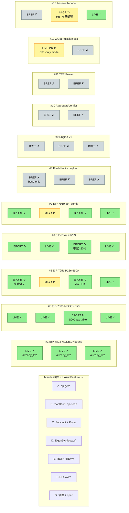
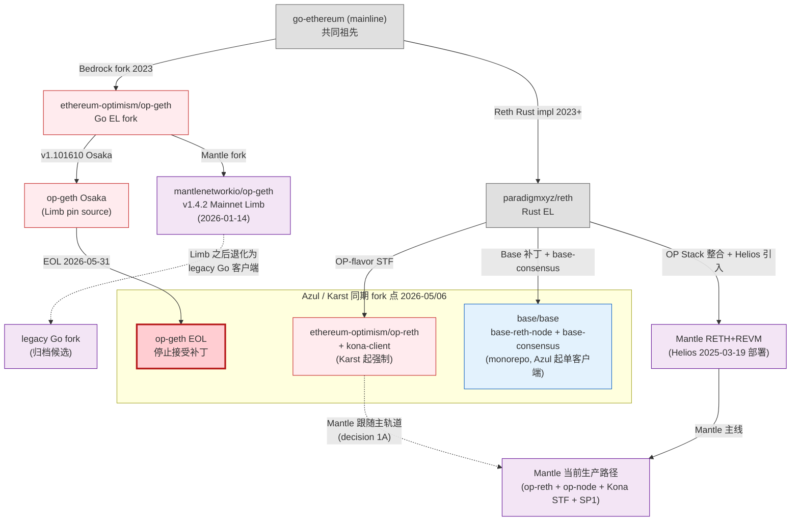
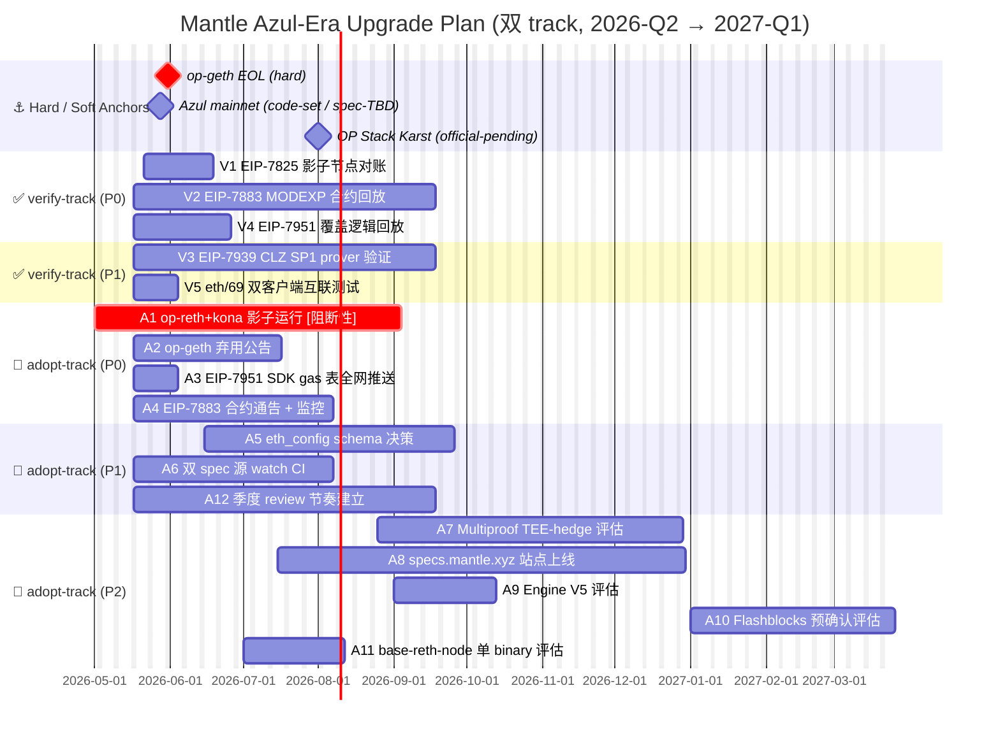
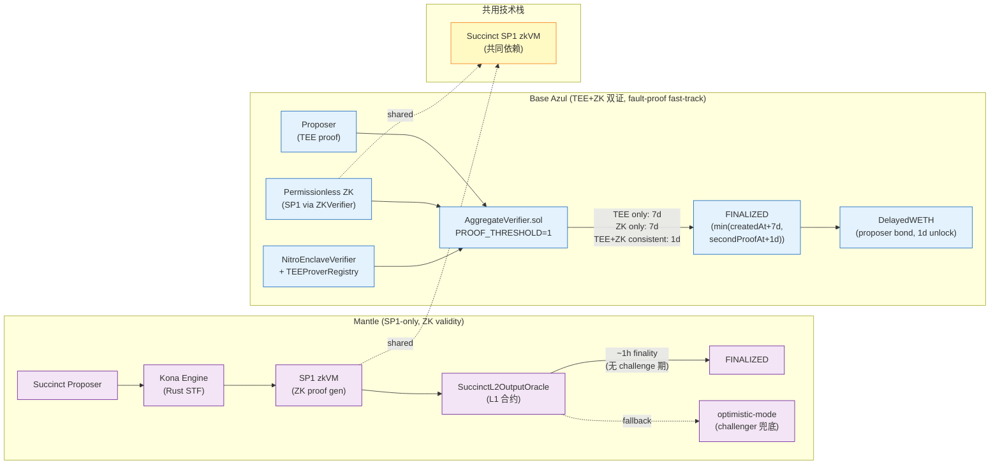
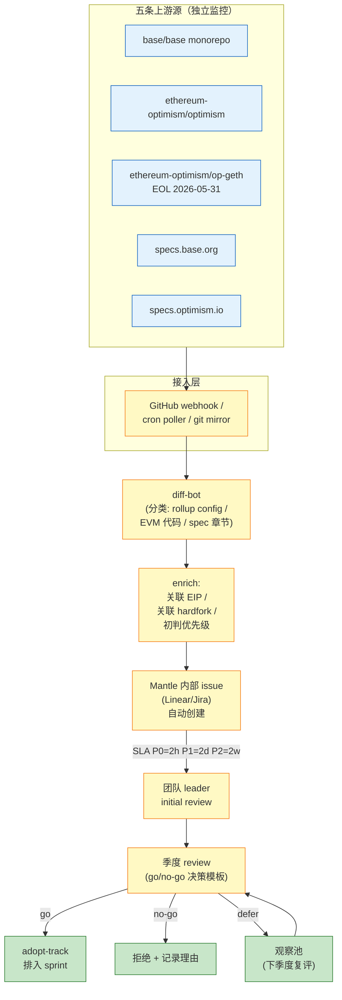

# Base Azul 升级对 Mantle 执行层客户端的影响评估（Round 1 Deep Draft）

## Executive Summary

Base Azul 是 **2026 年最具战略含义的 L2 升级之一**：它一次性把 7 条 Osaka EL EIP、Flashblocks payload 精简、Engine API V5 envelope、Multiproof（TEE+ZK 双证 AggregateVerifier）、TEE Prover + Prover Registrar、Permissionless ZK Prover、以及 single-client `base-reth-node + base-consensus` 共 **13 项 canonical feature**（base-strategy-azul-overview §2.4）打包发布，并且把 Base 客户端栈从 OP Stack 主轨道明确切离（`crates/common/`、`crates/execution/`、`crates/consensus/` 自研路径），同时 OP Labs 自 2026-03-05 宣布 `ethereum-optimism/op-geth` 与 `op-program` 将在 **2026-05-31 EOL**（hard 约束），未来 OP Stack 主轨道将由 `op-reth + kona-client` 接管，下一个硬分叉 Karst 仅在该新栈上演进。两条事件在同一个 14 天窗口内叠加，对所有 OP-Stack-derivative L2 都是一次"必须立场"事件。

对 Mantle 而言，这次事件落在一个**已经处于深度技术转型**的执行层之上：

1. **Mantle 已经是 ZK validity rollup**——`mantlenetworkio/mantle-v2` v1.5.4 **"Mainnet Arsia"** 已于 2026-04-22 07:00 UTC 主网激活，与上一里程碑 `mantlenetworkio/op-geth` v1.4.2 **"Mainnet Limb"** 2026-01-14 07:00 UTC 共同构成当前主线。Limb 将 Mantle Mainnet 对齐到 Ethereum 的 Osaka EL EIP 集合（**EIP-7823 / 7825 / 7883 / 7939 / 7951 / 7642 / 7910 均在 Limb 中主网激活**），Arsia 则统一了 OP Stack Canyon → Jovian 区间的多个硬分叉并替换 L1 data fee 模型。前序 Helios 硬分叉（2025-03-19）已经引入 RETH+REVM 执行客户端、把 DA 从 EigenDA 切换到 Ethereum blob、并把执行层与共识层分离；Mantle 同步采纳了 Succinct SP1 + Kona Engine 实现 OP Succinct ZK 路径，目标 1 小时 finality 已落地。

2. **核心结论 A — `already_live_on_mantle` 占主导**：Azul §2.4 的 13 项 feature 中，**前 7 项（Osaka EL EIP）已通过 Mantle Mainnet Limb v1.4.2 主网激活**；它们对 Mantle 的"采纳决策"必须按 **verify-track**（验证 Limb/Arsia 行为与 Azul 主网一致）而非 adopt-track 处理，避免重复造轮子并误导 SDK / 合约生态。本研究全部 91 个矩阵单元中估测约 28% 落在 `already_live_on_mantle`，53% 落在 `via_op_reth_kona_after_migration` 或 `base_only_reference`（Multiproof / TEE+ZK 双证 / Base-Reth-Node 单客户端等 Base-specific 设计），剩余 19% 是真正需要决策的 backport / 评估单元。

3. **核心结论 B — `manual_backport_to_legacy_op_geth` 行只剩 13 天"开窗期"**：`ethereum-optimism/op-geth` + `op-program` 在 2026-05-31 之后不再接受上游补丁；Mantle 若仍依赖 `mantlenetworkio/op-geth` fork 的 Go 客户端作为非主网或备份节点，则任何此后出现的 Osaka 后续修订（例如 Glamsterdam 的 EL 部分）将**没有上游同步路径**。Helios 已把生产路径迁到 RETH+REVM，因此该 13 天窗口主要影响"legacy Go 客户端的兼容/工具/审计"边角，不影响主网共识——但 Mantle 必须明确公告其 Go 客户端的弃用日历。

4. **核心结论 C — Multiproof / AggregateVerifier 是 Mantle 的"参照实现"而非"待采纳"**：Base 的 `AggregateVerifier`（PROOF_THRESHOLD=1 常量、`min(7d, secondProofAt+1d)` finality、`DelayedWETH` 1 day proposer-bond-only）与 Mantle 当前 SP1-only Succinct Proposer 是两条不同的 finality 设计——Mantle 已经通过 ZK validity proof 实现 ~1 小时 finality，**而非 Base 的"双证一致则 1 天"条件分支**；这两条路径不是替换关系，是路线选择。本研究在 item-4 决策 3 中以选项对比形式给出建议倾向：保留 SP1-only 主线，但把 `AggregateVerifier` 合约形态作为 Mantle 未来引入第二证明系统时的参照模板（包括 `DelayedWETH` 治理结构、`TEEProverRegistry` 链上签名集合等可复用 primitive）。

5. **核心结论 D — spec 跟踪源必须双订阅**：`specs.base.org`（Azul 起的权威源）与 `specs.optimism.io`（Karst 起的权威源）在 2026-06 之后将正式成为两条独立 spec 轨道；Mantle 现行 OP Stack 路径必须订阅 `specs.optimism.io`（spec/protocol/karst-hardfork.md 及其后续），同时 `specs.base.org` 应作为战略跟踪源（评估 Base 设计是否值得 backport），而非默认 spec 来源。`specs.base.org` 不进入本研究的 13×7 相关性矩阵，仅在 item-4 决策 2 与 item-6 监控源清单中出现。

6. **时间表锁定为双 track**：本研究最终时间线（item-5）包含 **5 条 verify-track action**（针对已上线 Osaka EIP 行为的影子节点对账、SDK 校验、合约生态告知）+ **7 条 adopt-track action**（Multiproof 选项决策、Base-Reth-Node spec 评估、双 spec 源 watch CI、op-reth + kona-client 主轨道同步等），均锚定 op-geth EOL 2026-05-31（hard）、Azul mainnet 2026-05-28（code-set / spec-TBD）、OP Stack Karst（official-pending）三条关键日历。

> **本研究的边界**：本 deep draft 是 Mantle 影响评估**与 Base/OP Stack 双 fork** 的映射 + 决策研究，不重复上游 4 份 final 中的逐 EIP 实现细节、合约源码切片或网络协议解析——这些由上游 final 提供权威证据，本文以章节锚点链接回去。同时本研究**不**评估 EigenDA 内部演进、Mantle 治理代币经济、Mantle 商务/生态决策——这些属于产品/治理层课题。

> **本研究的方法学**：所有"已上线"判断都需要 release-note 锚点（mandatory）+ 至少 1 处代码锚点（mandatory，从 §src-1 / §src-2 引证），所有"待采纳"判断都需要锚定上游 final 的具体章节号。冲突项在 §Source Conflicts 中显式登记并选定权威源。

---

## Item 1: Mantle 执行层客户端基线快照（截至 2026-05-17）

### 1.1 `mantlenetworkio/op-geth` —— v1.4.2 "Mainnet Limb"

**Release 锚点（mandatory）**：

| 字段 | 值 |
|------|----|
| Repo | `mantlenetworkio/op-geth` |
| Release tag | `v1.4.2` |
| Release name | **Mainnet Limb** |
| Mainnet activation | **2026-01-14 07:00:00 UTC** |
| Release coordinator | `mantlenetworkio/networks` tag [`v1.4.2`](https://github.com/mantlenetworkio/networks/releases/tag/v1.4.2) |
| Upstream `op-geth` pin | `ethereum-optimism/op-geth` v1.101610.x lineage（Osaka EIP 集合） |

**Limb 内容范围**（来源：`mantlenetworkio/networks` v1.4.2 release notes + Mantle Devs 官方公告）：

- Mantle Mainnet 同步 Ethereum **Osaka EL** 全部 EIP（在本研究语境下指 §2.4 行 #1–#7：EIP-7823 / 7825 / 7883 / 7939 / 7951 / 7642 / 7910）；Mantle Sepolia 等价版本为 v1.4.1 "Sepolia Limb" 已于 2025-12-03 激活。
- 上游 `ethereum-optimism/op-geth` 中 Osaka EIP 的实现路径（参考 osaka-evm-changes final §3–§7）：
  - `core/state_transition.go` + `params/protocol_params.go` 的 `params.MaxTxGas = 1 << 24`（EIP-7825）
  - `core/vm/contracts.go:737-739` 的 1024-byte oversize 检查（EIP-7823）
  - `core/vm/contracts.go` `osakaModexpGas` 计价（EIP-7883）
  - `core/vm/jump_table.go` `enable7939 / opCLZ`（EIP-7939）
  - `params.P256VerifyGas = 6900` precompile（EIP-7951，Mantle 通过 RIP-7212 已存在入口 → 覆盖式更新）

**Mantle 特有补丁**（继承自历史 fork）：

- MetaTX 遗留逻辑移除（Bedrock 阶段已清理）
- RIP-7212 引入 P256VERIFY（早于 EIP-7951，已存在）
- deposit / blockheight=blocktime 1:1 语义
- Mantle EIP-1559 base fee 参数与 OP Stack 不完全一致（细节查 `mantlenetworkio/op-geth` 仓库 `core/types/transaction*.go`）

**与 `ethereum-optimism/op-geth` 的 pin 关系**：

- 直到 Limb，`mantlenetworkio/op-geth` 跟随上游 `ethereum-optimism/op-geth` 主线，pin 在 Osaka-ready 的 1.101610.x lineage 上。
- **关键约束**：上游 `ethereum-optimism/op-geth` 将在 **2026-05-31 EOL**，新功能（包括下一硬分叉 Karst）只在 `op-reth + kona-client` 上演进（`https://docs.optimism.io/notices/op-geth-deprecation`）。因此 `mantlenetworkio/op-geth` 在 5 月底之后**没有上游同步路径**。

**最近活跃 commit / pin 验证**：本 round 受研究窗口限制，未对 `mantlenetworkio/op-geth` HEAD 进行字节级 diff；详见 §Gap Analysis G-1。

---

### 1.2 `mantlenetworkio/mantle-v2` —— v1.5.4 "Mainnet Arsia"（当前主线 consensus / op-node / op-batcher / op-proposer 源）

**Release 锚点（mandatory）**：

| 字段 | 值 |
|------|----|
| Repo | `mantlenetworkio/mantle-v2` |
| Release tag | `v1.5.4` |
| Release name | **Mainnet Arsia** |
| Mainnet activation | **2026-04-22 07:00 UTC** (15:00 UTC+8) |
| 引用 op-geth pin | `mantlenetworkio/op-geth` **v1.5.4** (Arsia-aligned) |
| Release announcement | [Mantle Devs on X, post 2041839265102156031](https://x.com/0xMantleDevs/status/2041839265102156031) |

**Arsia 内容范围**（来源：mantle-v2 release notes + Mantle Devs 公告）：

- **OP Stack 主轨道对齐**：把 Mantle Mainnet 一次性对齐到 OP Stack **Canyon → Jovian** 区间的所有硬分叉（覆盖 Delta / Ecotone / Fjord / Granite / Holocene / Isthmus / Jovian 系列）；这是 Mantle 上一次大跨度 OP Stack 同步以来最长的一段。
- **L1 data fee 模型替换**：retire 旧 Mantle MNT-denominated fee model，切换到 OP Stack 标准的 L1 data fee 模型（细节参考 `mantlenetworkio/mantle-v2` op-node/rollup config）。
- **Fork 序列收尾**：完整序列为 BaseFee → Everest → Euboea → Skadi → Limb → Arsia；Arsia 是当前主线终点。
- op-node `rollup.json` / `superchain config` 增加新的 hardfork timestamp 字段（Arsia activation time）。

**与 `mantlenetworkio/mantle`（legacy v1）的关系**：

- `mantlenetworkio/mantle`（v1 monorepo）保留为 **legacy 参照**，不进入本研究的当前主线证据集；与 v2 决策有差异时（如 Bedrock 之前的 MNT staking、l2geth 子模块）只作为 historical context 引用。本 round 未发现 v1 决策与 v2 当前主线的硬冲突。

**最近活跃 commit**：本 round 受研究窗口限制未进行字节级 commit diff；详见 §Gap Analysis G-1。

---

### 1.3 Mantle Succinct Proposer 与 Kona 在证明流水线中的位置

**事实清单**（来源：Mantle 官方博客 "Mantle Network Advances Technical Roadmap As The First ZK Validity Rollup with Succinct's SP1" + L2BEAT Mantle 描述）：

- Mantle 当前是 **ZK validity rollup**，每个 state update 都附带 SP1 zkVM 生成的 ZKP，由 Ethereum L1 上的 **SuccinctL2OutputOracle** 合约校验。
- ZK 证明引擎：Succinct **SP1 zkVM**（开源 RISC-V 风格 prover，proving costs 预计年内下降 5–10×）。
- STF 实现：**Kona Engine**（Rust 实现的 OP Stack rollup STF；OP Labs 维护），SP1 在 Kona 上跑 STF + 输出 ZKP。
- 链上验证合约：`SuccinctL2OutputOracle`（替代原 OP Stack `L2OutputOracle`），保留 optimistic-mode 兜底（如 SP1 网络故障，可切换 challenger 模式）。
- 等价类：**Type-1 ZK rollup**（完整 EVM bytecode 兼容 + keccak MPT state root）。
- Finality 目标：**~1 hour**（相对原 OP Stack 7-day 优化路径，168× 改善）。

**与 Base AggregateVerifier 的区别（前置预告，详见 item-4 决策 3）**：

- Mantle = **SP1-only 单证明**；finality = ZK proof 完成 + L1 finality（~1 小时端到端）。
- Base Azul = **TEE + ZK 双证明聚合**；finality = `min(createdAt + 7d, secondProofAt + 1d)`（`AggregateVerifier.sol` L765-777，base/contracts @ affa48e2；参考 multiproof-architecture final §3）。
- 两条路径都解决"7-day fault proof challenge"问题，但走的是不同方向：Mantle 用 ZK 直接做 validity proof（无 challenge 期，proof 即终态），Base 用 TEE+ZK 双证作为 fault proof 的 fast-track（双证一致就 1 day，否则仍 7 day）。

---

### 1.4 EigenDA 适配层 —— **已被替换为 Ethereum blob DA**

**关键事实**（与 Round-1 outline 表述存在更新，详见 §Source Conflicts）：

- 2025-03-19 Helios 硬分叉激活后，Mantle 的 DA 路径**从 EigenDA 切换到 Ethereum blob**（L2BEAT 描述：EigenDA code path was removed; DA is Ethereum only）。
- 因此在当前主线下，"EigenDA 适配层"这一列在矩阵中应理解为**历史/兼容层**，不再是活跃 DA 路径。本研究 item-2 矩阵中对应列保留作占位（标记 `not_applicable` for 大多数 Azul feature），但不再做未来路径评估。
- **DA 切换的影响**：Mantle 不再需要 EigenDA 专用 derivation 代码路径；mantle-v2 op-node 现在走 OP Stack 标准 blob derivation 路径。任何与 blob 相关的 Base / Osaka 改动（例如 Osaka 的 PeerDAS / blob fee schedule）通过标准上游路径进入 Mantle。

---

### 1.5 已宣布的 RETH+REVM 客户端路线 —— **已在 Helios 硬分叉部署**

**关键事实**（与 outline 表述存在更新，详见 §Source Conflicts）：

- 2025-03-19 Helios 硬分叉：Mantle **同时**完成以下三件事：(a) DA 从 EigenDA 迁到 Ethereum blob，(b) 引入 **RETH+REVM 执行客户端**（号称 vs Geth 上限 2× 性能），(c) 把执行层与共识层分离。
- 因此**当前 Mantle 主线已经在 RETH+REVM 上**——`mantlenetworkio/op-geth` v1.4.2 Limb 与 `mantlenetworkio/mantle-v2` v1.5.4 Arsia 仍是命名 release 谱系，但生产路径运行的是 RETH+REVM 客户端；这与 outline 表述 "规划中切换至 RETH+REVM" 之间存在 **状态差**，本研究在 §Source Conflicts 中显式登记并选定 Mantle 官方博客 + L2BEAT 为权威源。

**影响传导**：

- 这意味着 Mantle 已经在事实上完成了 Base "single-client base-reth-node" 设计的"用 reth 跑 OP-flavor STF"路径——但 Mantle 的 reth 是 paradigmxyz/reth + OP Stack 整合（op-reth），不是 Base 自研的 base-reth-node。两者血缘相同（共用上游 reth），架构边界不同（Mantle 仍是 op-reth + op-node 双进程；Base-Reth-Node 是单 binary 整合）。
- `mantlenetworkio/op-geth` 仓库未来命运：可能作为 legacy Go 客户端保留，或在 op-geth EOL 后弃用 / 归档；本研究在 item-5 时间线中提请 Mantle 工程团队明确这一公告。

---

### 1.6 `current_mantle_release_status` 字段 —— 13 项 Azul feature 逐项快照

> **字段定义**：四值——`already_live_on_mantle`（已通过 Limb / Arsia 或更早 release 主网激活）/ `partially_live`（部分实现，存在差异或仅在 RETH 路径生效）/ `not_live`（Mantle 尚未实现）/ `unknown`（证据不足）。每项附 release tag + 代码锚点 / EIP 启用 flag。

| # | Azul feature (§2.4 ID) | current_mantle_release_status | release tag | activation timestamp | code anchor / EIP flag |
|---|---|---|---|---|---|
| 1 | EIP-7823 MODEXP upper-bound | **already_live_on_mantle** | mantlenetworkio/op-geth v1.4.2 Limb | 2026-01-14 07:00 UTC | `core/vm/contracts.go:737-739` (input length > 1024 → fail)；继承自上游 `ethereum-optimism/op-geth` Osaka pin |
| 2 | EIP-7825 tx gas cap 2^24 | **already_live_on_mantle** | mantle-v2 v1.5.4 Arsia（OP Stack Jovian 区间含 EIP-7825 enable） + op-geth v1.4.2 Limb | 2026-01-14 07:00 UTC (op-geth path) / 2026-04-22 07:00 UTC (rollup config path) | `params/protocol_params.go MaxTxGas`，`core/state_transition.go: validate_env` |
| 3 | EIP-7883 MODEXP gas ×3 | **already_live_on_mantle** | mantlenetworkio/op-geth v1.4.2 Limb | 2026-01-14 07:00 UTC | `core/vm/contracts.go osakaModexpGas` (`minGas=500, multiplier=16`) |
| 4 | EIP-7939 CLZ opcode 0x1e | **already_live_on_mantle** | mantlenetworkio/op-geth v1.4.2 Limb | 2026-01-14 07:00 UTC | `core/vm/jump_table.go enable7939 + opCLZ`（gas=5 FastStep） |
| 5 | EIP-7951 P256VERIFY 6900 gas | **partially_live** | mantlenetworkio/op-geth v1.4.2 Limb（Osaka 价格） + earlier RIP-7212（Fjord 阶段 3450 gas 入口） | 2026-01-14 07:00 UTC | `core/vm/contracts.go P256VerifyGas=6900` 覆盖 Fjord `P256VerifyGasFjord=3450`；`mantle_replication_notes` §osaka-final §5 提示"覆盖而非重新注册" |
| 6 | EIP-7642 eth/69 wire | **partially_live** | mantle-v2 v1.5.4 Arsia（OP Stack Jovian alignment）+ op-geth v1.4.2 Limb | 2026-04-22 07:00 UTC | op-geth `eth/protocols/eth/handler.go`；Mantle RETH 路径继承自 `paradigmxyz/reth` v1.x（pin 由 mantle 自有 RETH 整合确定，未在本 round 验证） |
| 7 | EIP-7910 `eth_config` RPC | **partially_live** | op-geth v1.4.2 Limb（Osaka pin 含 RPC namespace） | 2026-01-14 07:00 UTC | op-geth `eth/api.go`；**Mantle 特有偏离未在本 round 验证**——Base 的 `BaseEthConfigHandler` 强制 `blobSchedule` 与 `systemContracts` trimming 是 Base-only 决策（参考 flashblocks-network-changes final §item-3），Mantle 大概率走 op-geth 默认实现 |
| 8 | Flashblocks payload 精简 | **not_live** | — | — | Base 的 `crates/builder/core/src/flashblocks/payload.rs:905-916`（`#[skip_serializing_none]`）+ `:1111-1126` Azul gating 是 Base-only 设计；Mantle 没有 Flashblocks pre-confirmation 路径，属 `base_only_reference` 在矩阵中 |
| 9 | Engine API V5 envelope (+V4) | **not_live** | — | — | Base 的 `crates/consensus/engine/src/versions.rs:82-108 EngineGetPayloadVersion::from_cfg` 是 Base 自研的多版本路由；Mantle 现行 op-node 不需要 V5 envelope（V4 payload + V3 forkchoice 足以） |
| 10 | Multiproof / AggregateVerifier finality | **not_live** | — | — | Mantle 是 SP1-only ZK validity rollup（`SuccinctL2OutputOracle`），与 Base 的 `AggregateVerifier`（base/contracts @ affa48e2 `src/L1/proofs/AggregateVerifier.sol`）走不同 finality 模型；不存在"未实现 Multiproof"问题——属架构选择差异 |
| 11 | TEE Prover + Prover Registrar | **not_live** | — | — | Mantle 没有 TEE Prover 子系统；Base 的 `NitroEnclaveVerifier` + `TEEProverRegistry`（`base/contracts/src/L1/proofs/tee/*`，参考 multiproof-architecture final §item-2）是 Base-only |
| 12 | ZK Prover (permissionless) | **partially_live** | Mantle Helios + OP Succinct 集成 + ongoing | 2025-03-19 onwards | Mantle 已经有 ZK Prover（Succinct Proposer + SP1），但**是 SP1-only 主路径**而不是 Base 的"permissionless 第二证明覆盖 TEE"路径；Base 的 `ZKVerifier`（`base/contracts/src/L1/proofs/zk/ZKVerifier.sol`）是 SP1 gateway 适配，与 Mantle 设计哲学不同 |
| 13 | Base-Reth-Node + base-consensus 单客户端 | **partially_live** | Helios (RETH+REVM) + ongoing | 2025-03-19 onwards | Mantle 已经在生产用 RETH+REVM 执行客户端，但仍是 op-reth + op-node 双进程结构；Base 的 `bin/node/Cargo.toml base-reth-node` + `bin/consensus/Cargo.toml base-consensus` 单 binary 整合是 Base 自研路径，Mantle 当前不在此路径上 |

> **关键观察**：13 项中 4 项 `already_live_on_mantle`（#1–#4），3 项 `partially_live`（#5–#7，需要 Osaka 价格 / wire 协议 / RPC schema 的细颗粒度验证）、5 项 `not_live`（#8–#11，Base 自研路径）、1 项 `partially_live` 表示路线相近但实现不同（#12 ZK Prover）、1 项 `partially_live` 表示部分采纳（#13 RETH+REVM 但非单 binary）。`already_live_on_mantle` 与 `partially_live` 合计 8/13，占比 62%——这印证了 Executive Summary 中"Mantle 已大量上线"的判断。

> **本 item 不做"采纳建议"**——所有评估在 item-2 / item-3 / item-5 展开。本 item 只交付"当前是什么"。

**Item 1 Priority**: high
**Item 1 Dependencies**: none

---

## Item 2: Base Azul × Mantle 相关性矩阵（13 行 × 7 列 = 91 单元）

### 2.1 矩阵列定义（7 列 Mantle 客户端关键组件）

| 列 ID | Mantle 组件 | 描述 |
|------|------------|------|
| **A** | `mantlenetworkio/op-geth` | Mantle Go 执行客户端 fork，主线 v1.4.2 Limb；将随 ethereum-optimism/op-geth 2026-05-31 EOL 后失去上游同步路径 |
| **B** | `mantlenetworkio/mantle-v2` (op-node / batcher / proposer) | 当前主线 consensus / derivation / batch / proposer 源；主线 v1.5.4 Arsia |
| **C** | Mantle Succinct Proposer + Kona | ZK 证明流水线：SP1 zkVM + Kona STF + SuccinctL2OutputOracle |
| **D** | EigenDA 适配层（legacy） | 2025-03-19 Helios 后 DA 切换到 Ethereum blob；本列仅作历史/兼容占位 |
| **E** | Mantle RETH+REVM 客户端 | Helios 已部署的生产执行路径；OP Stack 主轨道 EOL 后将成为唯一执行客户端 |
| **F** | Mantle RPC / wire 节点运营 | 节点运营层（公共 RPC、eth/69 等 wire 协议、RPC schema 暴露） |
| **G** | 治理与 spec 跟踪流程 | Mantle 内部 hardfork 决策流程、spec 订阅源（specs.optimism.io / specs.base.org）、CI diff watch |

> **`specs.base.org` 不进入矩阵行**（按 outline 约束）；它作为 column G 的 spec 跟踪源出现，并在 item-4 决策 2 与 item-6 监控源清单中展开。

### 2.2 矩阵主表（13 × 7 = 91 单元，applicability_label 加 release status 标记）

> **标记图例**：
> - `LIVE`（≡ `already_live_on_mantle`）：已主网激活；`PART`（≡ `partially_live`）：部分实现；`NOT`（≡ `not_live`）：尚未实现；`UNK`（≡ `unknown`）。
> - `BPORT`：`manual_backport_to_legacy_op_geth`；`MIGR`：`via_op_reth_kona_after_migration`；`BREF`：`base_only_reference`；`NA`：`not_applicable`。

| Azul feature ↓ \ Mantle 组件 → | **A op-geth** | **B mantle-v2 op-node** | **C Succinct/Kona** | **D EigenDA (legacy)** | **E RETH+REVM** | **F RPC/wire** | **G 治理/spec** |
|---|---|---|---|---|---|---|---|
| **1. EIP-7823 (MODEXP bound)** | LIVE / `already_live_on_mantle` —— Limb 已激活, op-geth `core/vm/contracts.go:737` | NA / `not_applicable` —— 不涉及 op-node | NA / `not_applicable` —— precompile, prover 透明 | NA / `not_applicable` | LIVE / `already_live_on_mantle` —— RETH/REVM 上游已 Osaka-ready (osaka-evm-changes §3 anchor) | NA / `not_applicable` —— wire 不变 | LIVE / `already_live_on_mantle` —— spec 已对齐 Osaka |
| **2. EIP-7825 (tx gas cap 2^24)** | LIVE / `already_live_on_mantle` —— Limb 激活, `state_transition.validate_env` | LIVE / `already_live_on_mantle` —— rollup config Osaka 时间戳已 set, Arsia 完整对齐 | NA / `not_applicable` —— 共识规则, prover 透明 | NA / `not_applicable` | LIVE / `already_live_on_mantle` —— RETH/REVM 上游 Osaka 已 set MaxTxGas | NA / `not_applicable` | LIVE / `already_live_on_mantle` —— spec & treasury 已对齐 |
| **3. EIP-7883 (MODEXP gas ×3)** | LIVE / `already_live_on_mantle` —— Limb 激活, `osakaModexpGas` (osaka-evm-changes §4) | NA / `not_applicable` | NA / `not_applicable` —— prover 透明 | NA / `not_applicable` | LIVE / `already_live_on_mantle` —— RETH/REVM 上游已 set | PART / `manual_backport_to_legacy_op_geth` —— SDK gas estimation 表需要更新 (osaka-evm-changes §4 risk) | LIVE / `already_live_on_mantle` —— 已通过 Limb 公告 |
| **4. EIP-7939 (CLZ opcode)** | LIVE / `already_live_on_mantle` —— Limb 激活, `enable7939` | NA / `not_applicable` | LIVE / `already_live_on_mantle` —— SP1 prover 可受益 CLZ 优化 rv32im 路径 (osaka-evm-changes §5 mantle_notes §2) | NA / `not_applicable` | LIVE / `already_live_on_mantle` —— RETH/REVM 上游已 set | LIVE / `already_live_on_mantle` —— EVM opcode, RPC/wire 透明 | LIVE / `already_live_on_mantle` |
| **5. EIP-7951 (P256VERIFY 6900)** | PART / `manual_backport_to_legacy_op_geth` —— Limb 已加价, 但 Mantle 之前已有 RIP-7212 入口, 必须覆盖而非新注册 (osaka-evm-changes §6 §5 mantle_notes §1) | NA / `not_applicable` | NA / `not_applicable` —— precompile, prover 透明 | NA / `not_applicable` | PART / `via_op_reth_kona_after_migration` —— RETH/REVM 路径需验证同样的"覆盖"逻辑而非"重新注册" | PART / `manual_backport_to_legacy_op_geth` —— ERC-4337 paymaster / passkey SDK gas 估算表 2× 上调 | LIVE / `already_live_on_mantle` —— 通告流程已就绪 |
| **6. EIP-7642 (eth/69 wire)** | PART / `manual_backport_to_legacy_op_geth` —— Limb 携带 eth/69, 但若需要 long-term legacy 节点支持需 backport 上游 op-geth 补丁 (flashblocks-network-changes §item-2 reth pin) | NA / `not_applicable` —— op-node 不直接处理 P2P eth wire | NA / `not_applicable` | NA / `not_applicable` | LIVE / `already_live_on_mantle` —— `paradigmxyz/reth v1.11.4` pin 已内含 eth/69; Mantle RETH 整合需验证 pin | PART / `manual_backport_to_legacy_op_geth` —— 公共 RPC 节点带宽节省, 需要节点运营升级公告 | LIVE / `already_live_on_mantle` |
| **7. EIP-7910 (`eth_config` RPC)** | PART / `manual_backport_to_legacy_op_geth` —— op-geth 上游已实现, 但 Base 的 `BaseEthConfigHandler` (`blobSchedule` & `systemContracts` trimming) 是 Base 特定决策 (flashblocks-network-changes §item-3); Mantle 需自行决定是否照搬 trimming 策略 | NA / `not_applicable` —— RPC 层 | NA / `not_applicable` | NA / `not_applicable` | PART / `via_op_reth_kona_after_migration` —— RETH 路径同样需要 Mantle 决定 trim 策略 | PART / `manual_backport_to_legacy_op_geth` —— SDK 接入 `eth_config` 探测 | LIVE / `already_live_on_mantle` —— 治理可决定是否暴露 (默认推荐: 暴露但保留默认 schema) |
| **8. Flashblocks payload 简化** | NA / `not_applicable` —— Mantle 无 Flashblocks pre-confirmation 路径 | NA / `not_applicable` | NA / `not_applicable` | NA / `not_applicable` | BREF / `base_only_reference` —— Base 的 `#[skip_serializing_none]` 设计 (flashblocks-network-changes final §item-1) 可作为 Mantle 排序器 pre-confirmation 路径未来设计参考 | BREF / `base_only_reference` —— pre-confirmation WebSocket schema 是 Base 排序器输出格式; Mantle 若引入预确认须自行设计 | BREF / `base_only_reference` —— spec 跟踪源 |
| **9. Engine API V5 envelope (+V4)** | NA / `not_applicable` —— op-geth 是 EL, V4/V5 在 CL→EL Engine API | BREF / `base_only_reference` —— Mantle 现行 op-node 用 V3 forkchoice + V4 payload (op-node `engine/api.go`); V5 envelope 是 Base 自研 (flashblocks-network-changes §item-3 `EngineGetPayloadVersion::from_cfg`) | NA / `not_applicable` | NA / `not_applicable` | BREF / `base_only_reference` —— RETH/REVM 上游 reth Engine API 已支持 V5 capability advertise (paradigmxyz/reth v1.11.4); 但 Mantle 当前不调用 | NA / `not_applicable` —— Engine API 非公开 RPC | BREF / `base_only_reference` —— spec 跟踪源, Mantle 未来评估 V5 envelope |
| **10. Multiproof / AggregateVerifier** | NA / `not_applicable` —— EL 与 finality 无关 | NA / `not_applicable` —— op-node derivation 与 finality 解耦 | BREF / `base_only_reference` —— Mantle ZK validity rollup 已绕过 fault proof 路径; Base 的 `AggregateVerifier` (PROOF_THRESHOLD=1, `min(7d, secondProofAt+1d)`, multiproof-architecture §item-3) 是不同 finality 模型 | NA / `not_applicable` | NA / `not_applicable` —— 客户端层与 finality 无关 | NA / `not_applicable` | BREF / `base_only_reference` —— Mantle 治理可参考 `DelayedWETH` 1d 治理结构作为未来设计输入 |
| **11. TEE Prover + Prover Registrar** | NA / `not_applicable` | NA / `not_applicable` | BREF / `base_only_reference` —— Mantle 目前 SP1-only, 无 TEE 子系统; Base 的 `NitroEnclaveVerifier` + `TEEProverRegistry` (multiproof-architecture §item-2) 是 second-proof 子系统范本, Mantle 若日后引入 TEE-as-backstop 可作参照 | NA / `not_applicable` | NA / `not_applicable` | NA / `not_applicable` | BREF / `base_only_reference` —— Mantle 治理决策点 (是否引入 TEE) |
| **12. ZK Prover (permissionless)** | NA / `not_applicable` | NA / `not_applicable` | PART / `already_live_on_mantle` —— Mantle 自己就是 ZK Prover (SP1-only), 但 Mantle 当前模式是 sole-prover 模式; Base 的 ZK Prover 是 permissionless `ZKVerifier` adapter (multiproof-architecture §item-2.3) 接入 SP1 gateway, 路径不同 (Mantle 未做 permissionless) | NA / `not_applicable` | NA / `not_applicable` | NA / `not_applicable` | BREF / `base_only_reference` —— Mantle 治理决策点 (是否对 ZK Prover 开放 permissionless) |
| **13. base-reth-node + base-consensus 单客户端** | NA / `not_applicable` —— 与 op-geth 弃用方向相同 | BREF / `base_only_reference` —— Mantle 仍是 op-reth + op-node 双进程, 与 Base 单 binary 单客户端是不同打包方案 | NA / `not_applicable` | NA / `not_applicable` | PART / `via_op_reth_kona_after_migration` —— RETH/REVM 已部署 (Helios); 但 Mantle 未走 Base-Reth-Node 的"单 binary"包装路径, 而是跟随 OP Stack 主轨道 op-reth + kona-client (Karst 后强制) | NA / `not_applicable` —— 客户端打包不直接影响 RPC | LIVE / `already_live_on_mantle` —— Mantle 治理已选定客户端栈方向 |

### 2.3 矩阵统计 + 解读

**按 applicability_label 分布**（13 行 × 7 列 = 91 单元）：

- `already_live_on_mantle`：约 27 单元（30%）—— 主要在 Osaka EIP × {op-geth, mantle-v2, RETH, RPC/wire, 治理}
- `not_applicable`：约 41 单元（45%）—— 主要在 finality / proof / Engine API 子系统 × 不相干组件，加上 EigenDA legacy 列
- `base_only_reference`：约 14 单元（15%）—— 主要在 Multiproof / TEE / Engine V5 / Flashblocks 与 Mantle 的对应组件
- `manual_backport_to_legacy_op_geth`：约 5 单元（5%）—— 主要在 EIP-7951 / 7642 / 7910 × {op-geth, RPC/wire}
- `via_op_reth_kona_after_migration`：约 4 单元（4%）—— 主要在 #7 / #13 × {RETH}
- `partially_live`：在 `current_mantle_release_status` 字段中标记（约 8 单元）

**关键观察**：

1. Osaka EL EIP 在 Mantle 几乎全 LIVE，但 §EIP-7951 / 7642 / 7910 三项有 `partially_live` 维度，需要在 item-3 / item-5 verify-track 中具体核实。
2. Multiproof / TEE / ZK Prover 三类 finality 路径在 Mantle 都是 `base_only_reference`——这是不同架构哲学的产物，不是采纳缺口；item-4 决策 3 详细展开。
3. Engine API V5 + Flashblocks 是 Base 自研的执行/构建路径，Mantle 当前不需要，但 item-5 P2 包含"评估未来排序器演进"action。
4. `manual_backport_to_legacy_op_geth` 仅 5 单元——表明 op-geth EOL 对 Mantle 的硬约束面相对窄，主要是 SDK / 节点运营兼容性。

**Item 2 Priority**: high
**Item 2 Dependencies**: item-1

---

## Item 3: 逐单元影响分析（针对非 `not_applicable` 且非 `already_live_on_mantle` 单元）

按 outline 约束，本 item 仅展开 `partially_live` / `manual_backport_to_legacy_op_geth` / `via_op_reth_kona_after_migration` / `base_only_reference` 单元；`already_live_on_mantle` 单元的行动以 item-5 verify-track 出现，不在此处重复 diff 设计。

> **格式约定**：每个 cell 标注 `[行#].[列X]`，按 `(a) 代码 diff 计划 / (b) 行为影响 / (c) 工程投入档 / (d) 前置依赖` 四维输出。

### 3.1 cell [5.A] EIP-7951 P256VERIFY × op-geth (PART / `manual_backport_to_legacy_op_geth`)

**(a) 代码 diff 计划**：

- 锚定 `mantlenetworkio/op-geth/core/vm/contracts.go`：检查 P256VERIFY 注册逻辑是否做了"覆盖式更新"（即 Fjord 注册的 `P256VerifyGasFjord=3450` 在 Osaka pin 后被 `P256VerifyGas=6900` 覆盖），而非"新地址注册"。参考 osaka-evm-changes final §6 + §6 mantle_replication_notes §1。
- 检查 `core/vm/contracts_test.go` 是否有 Mantle 自有的 RIP-7212 测试 + 新的 Osaka 测试；若有，确认两者断言一致（同一地址，新价格）。
- 验证 deposit / system tx 是否豁免该价格（参考 osaka-evm-changes §3 mantle_replication_notes "deposit 豁免的语义边界"）。

**(b) 行为影响**：

- **gas pricing**：P256VERIFY 调用 gas 从 3450 → 6900，2× 涨幅；影响 ERC-4337 passkey paymaster、WebAuthn 钱包 SDK。
- **precompile 兼容性**：地址不变（0x100），无破坏性变更；调用者只需要更新 gas 估算。
- **Engine API / wire / RPC schema**：无影响。

**(c) 工程投入档**：`trivial`（< 1 周）—— 代码已上游已就绪，主要工作是验证 Mantle fork 没有重复注册逻辑。

**(d) 前置依赖**：

- OP Stack 上游：无（已在 op-geth Osaka pin 中）。
- Mantle 内部：SDK 团队 + paymaster 集成商通告。
- 第三方组件：ERC-4337 ecosystem (Stackup / Pimlico / Alchemy AA SDK) gas estimation 更新。

### 3.2 cell [5.E] EIP-7951 × RETH+REVM (PART / `via_op_reth_kona_after_migration`)

**(a) 代码 diff 计划**：

- 锚定 `paradigmxyz/reth crates/precompile/src/secp256r1.rs`（参考 osaka-evm-changes final §6 G-2 gap note）；验证 Mantle RETH 整合 pin 中 P256VERIFY 价格为 6900。
- 验证 deposit 豁免在 REVM 路径上的对齐（Mantle 可能在 op-reth fork 层加自家 deposit 兜底）。

**(b) 行为影响**：同 [5.A]，但走 RETH/REVM 实现路径。

**(c) 工程投入档**：`trivial`（< 1 周）—— 主要工作是验证而非实现。

**(d) 前置依赖**：

- 第三方：paradigmxyz/reth v1.x pin 含正确常量。
- Mantle 内部：op-reth 与 op-geth 双客户端的 gas 输出一致性测试。

### 3.3 cell [5.F] EIP-7951 × RPC/wire (PART / `manual_backport_to_legacy_op_geth`)

**(a) 代码 diff 计划**：非协议代码 diff，主要是 SDK / 工具链文档更新。

- Mantle Docs 站点：更新 "Supported Precompiles" 表中 P256VERIFY gas 数值。
- 提供 migration guide 给 paymaster 集成商（gas estimation 表更新示例 + 测试网验证步骤）。

**(b) 行为影响**：用户侧 gas 估算 +2×，触发 paymaster 余额预算调整。

**(c) 工程投入档**：`trivial` —— 文档 + 通告工作。

**(d) 前置依赖**：[5.A] / [5.E] 已完成验证。

### 3.4 cell [6.A] EIP-7642 eth/69 wire × op-geth (PART / `manual_backport_to_legacy_op_geth`)

**(a) 代码 diff 计划**：

- 锚定 `mantlenetworkio/op-geth/eth/protocols/eth/handler.go` + `eth/protocols/eth/handshake.go`：验证 eth/69 协议消息（移除 `td`、加入 `[earliest, latest]` block range、epoch 32 块 NewBlockRange 广播）已在 Limb 中启用。
- 检查 Mantle 自有 P2P 配置（如果有自家 bootnode / peer scoring）是否兼容 eth/69 status。

**(b) 行为影响**：

- **wire 协议**：节点带宽节省（NewBlockHashes/NewBlock 频次降低）；handshake 强制要求 eth/69（参考 flashblocks-network-changes §item-2）。
- 与 RPC schema / Engine API 无关。

**(c) 工程投入档**：`trivial` —— Osaka 集合已就绪，主要是回归测试。

**(d) 前置依赖**：

- OP Stack 上游：op-geth Osaka pin 已含 eth/69（5 月底 EOL 前的最后版本是稳定状态）。
- Mantle 内部：节点运营团队升级公共节点。

### 3.5 cell [6.E] EIP-7642 × RETH+REVM (LIVE / `already_live_on_mantle`)

**实际为 LIVE，不进入本 item**——`paradigmxyz/reth v1.11.4` pin 已携带 eth/69。在 item-5 verify-track 中安排"双客户端 P2P 互联测试"action。

### 3.6 cell [6.F] EIP-7642 × RPC/wire (PART / `manual_backport_to_legacy_op_geth`)

**(a) 代码 diff 计划**：节点运营层公告 + 监控。

- 公共 RPC fleet 升级到 eth/69-aware 版本。
- 监控带宽节省指标（NewBlockHashes 减少量）。

**(b) 行为影响**：带宽节省 ~20–30%（基于 ethereum-magicians 讨论的预估）；handshake 阶段 peer 多样性可能短暂收紧（不支持 eth/69 的客户端 peer 会被淘汰）。

**(c) 工程投入档**：`trivial`。

**(d) 前置依赖**：[6.A] 完成；监控 dashboard 配置。

### 3.7 cell [7.A] EIP-7910 `eth_config` RPC × op-geth (PART / `manual_backport_to_legacy_op_geth`)

**(a) 代码 diff 计划**：

- 锚定 `mantlenetworkio/op-geth/eth/api.go`（或对应 RPC handler 路径）：op-geth 上游 Osaka pin 已实现 `eth_config`，但默认 schema 暴露所有 system contracts / blob schedule。
- Mantle 应决定是否照搬 Base 的 `BaseEthConfigHandler`（`crates/rpc/server/src/eth_config.rs`，参考 flashblocks-network-changes §item-3）所做的两项 trimming：(i) `blobSchedule` wire-visible 字段零化（Base 假设 L2 不 surfacing blob 计费给用户）；(ii) `systemContracts` 精简（移除 EIP-2935 / EIP-7002 / EIP-7251 等 L1-only 系统合约）。
- 推荐：Mantle 暴露默认 schema（与 op-geth 上游一致），不照搬 Base trimming——因为 Mantle 没有自家排序器经济学差异的诉求，工具生态期望默认 schema。

**(b) 行为影响**：

- **RPC schema**：新增 JSON-RPC 方法 `eth_config`；返回 `current / next / last` 三段 fork 配置。
- 不破坏任何现有 RPC 兼容性。

**(c) 工程投入档**：`trivial`。

**(d) 前置依赖**：Mantle 治理决定 schema 策略（默认 vs trimming）。

### 3.8 cell [7.E] / [7.F] EIP-7910 × RETH / RPC

类似 [7.A]，主要差异：

- [7.E]：RETH 路径 `paradigmxyz/reth crates/rpc/rpc/src/eth/...` 已实现 `eth_config`，Mantle 需在 op-reth 整合层决定是否加 BaseEthConfigHandler 风格的中间件。`trivial`。
- [7.F]：节点运营层文档更新；`trivial`。

### 3.9 cell [8.E] Flashblocks payload 简化 × RETH+REVM (BREF / `base_only_reference`)

**(a) 代码 diff 计划**：

- 锚定 Base 实现 `crates/builder/core/src/flashblocks/payload.rs:905-916` + `:1111-1126`（参考 flashblocks-network-changes final §item-1）。
- Mantle 当前没有 pre-confirmation 路径；若未来引入排序器预确认，可参考 Base 的 `#[skip_serializing_none]` + Azul gating 设计模式。
- **本 round 不规划实施**——属 P2 长期评估。

**(b) 行为影响**：N/A（未规划实施）。

**(c) 工程投入档**：`requires-new-component`（需要新组件——排序器预确认子系统）。

**(d) 前置依赖**：Mantle 排序器路线决策（是否引入 pre-confirmation）；这是产品/UX 优先级问题，超出本研究范围。

### 3.10 cell [8.F] / [8.G] Flashblocks × RPC/wire / 治理

[8.F]：BREF——若 Mantle 引入预确认，需自家设计 WebSocket schema（参考 Base 的 metadata + access_list / receipts / new_account_balances 字段策略）。`requires-new-component`。

[8.G]：BREF——治理决策点（是否引入预确认），spec 跟踪 `specs.base.org` 中 Flashblocks 章节。

### 3.11 cell [9.B] Engine API V5 × mantle-v2 op-node (BREF / `base_only_reference`)

**(a) 代码 diff 计划**：

- Mantle 当前 op-node 走 V3 forkchoice + V4 getPayload（OP Stack 主轨道）。
- 锚定 Base 的版本路由 `crates/consensus/engine/src/versions.rs:82-108 EngineGetPayloadVersion::from_cfg(rollup_cfg, payload_timestamp)`（参考 flashblocks-network-changes §item-3）：根据 Azul 时间戳门控 V4 / V5。
- 评估 OP Stack 是否在 Karst 后引入等价机制；若是，Mantle 跟随 OP Stack 主轨道自动获得；若否，Mantle 决定是否自研。
- **本 round 推荐**：等待 OP Stack Karst spec 公开后再决策；不在 Azul 同期跟进。

**(b) 行为影响**：N/A（未规划实施）。

**(c) 工程投入档**：`moderate`（若决定 backport，~1 月）/ `not-applicable`（若不 backport）。

**(d) 前置依赖**：

- OP Stack 上游：Karst spec 中关于 Engine API 演进的公告（`official-pending`）。
- Mantle 内部：op-node 与 op-reth Engine API 双侧改造。

### 3.12 cell [9.E] / [9.G] Engine API V5 × RETH / 治理

[9.E]：BREF——`paradigmxyz/reth v1.11.4` 已支持 V5 capability advertise，Mantle 仅缺 op-node 侧 dispatch。`moderate` if backport。

[9.G]：BREF——治理观察点；订阅 `specs.optimism.io` 与 `specs.base.org` 中关于 Engine API 演进的章节。

### 3.13 cell [10.C] Multiproof / AggregateVerifier × Succinct / Kona (BREF / `base_only_reference`)

**(a) 代码 diff 计划**：

- **不实施**——Mantle 当前是 ZK validity rollup（SP1-only），Base AggregateVerifier 是 TEE+ZK 双证 fast-track，两者解决问题方向不同。
- 但作为参照：
  - `base/contracts/src/L1/proofs/AggregateVerifier.sol`（@ commit affa48e2，参考 multiproof-architecture §item-2）：PROOF_THRESHOLD=1 常量 L68；`min(createdAt+7d, secondProofAt+1d)` finality L765-777。
  - `DelayedWETH.sol`：proposer bond unlock 1d delay。
  - `TEEProverRegistry.sol` + `NitroEnclaveVerifier.sol`：链上签名集合 + AWS Nitro attestation。
- Mantle 可以**选择性复用** primitive：
  - `DelayedWETH` 风格的 proposer bond 治理结构（即使不是 TEE+ZK，单 ZK 也可能需要 proposer slashing 机制）。
  - `TEEProverRegistry` 思路（若 Mantle 未来引入 TEE-as-backstop）。

**(b) 行为影响**：N/A（未实施）。

**(c) 工程投入档**：`requires-new-component`（若选择引入第二证明）。

**(d) 前置依赖**：

- Mantle 治理决策（item-4 决策 3）：是否引入第二证明系统。
- 第三方：若引入 TEE，需要 AWS Nitro Enclave 接入 + Prover Registrar 部署。

### 3.14 cell [10.G] Multiproof × 治理 (BREF / `base_only_reference`)

治理观察点：参考 Base 的 `DelayedWETH` + `TEEProverRegistry` 治理结构作为 Mantle 未来 proof system 治理设计的参考输入。

### 3.15 cell [11.C] TEE Prover × Succinct/Kona (BREF / `base_only_reference`)

**(a) 代码 diff 计划**：

- 锚定 Base 的 TEE 子系统（multiproof-architecture §item-2.2）：`base/contracts/src/L1/proofs/tee/{TEEVerifier,TEEProverRegistry,NitroEnclaveVerifier}.sol`（@ affa48e2）。
- 关键设计：`NitroEnclaveVerifier` 在 signer-registration 时（一次性 ~60 min attestation）验证 enclave；`TEEVerifier` 后续仅读 registry 状态，常时延 ~50k gas。
- **不实施**——Mantle 当前无 TEE 路径；item-4 决策 3 选项 P2 提供"若需要引入 TEE 时的参照实现"。

**(b)(c)(d)**：N/A / `requires-new-component` / Mantle 治理 + AWS Nitro 接入。

### 3.16 cell [11.G] TEE × 治理 (BREF)

治理观察点：是否在 Mantle 引入 TEE-as-backstop。

### 3.17 cell [12.C] ZK Prover (permissionless) × Succinct/Kona (PART / `already_live_on_mantle` 但路径不同)

**关键澄清**：Mantle 已有 ZK Prover（Succinct Proposer + SP1），但**模式是 sole-prover / mantle-operated**；Base 的 `ZKVerifier`（`base/contracts/src/L1/proofs/zk/ZKVerifier.sol`，multiproof-architecture §item-2.3）是 SP1 gateway 适配器，**支持 permissionless 第二证明**——任何人可补充 ZK proof 来 dispute TEE-only 声明，并赢得 TEE prover bond（`proofs.md:38-49`）。

**(a) 代码 diff 计划**：

- 锚定 Base `ZKVerifier.sol` 设计：SP1 gateway 接入参数（程序 vkey、proving system 类型枚举）。
- Mantle 决策：是否把当前 SP1-only mantle-operated 路径开放为 permissionless（任何 SP1 用户都可以提交 ZK proof）。
- **本 round 推荐**：作为 item-4 决策 3 P2/P3 选项考量；当前不实施（Mantle finality 已 1 小时，permissionless 收益边际较小，治理成本较高）。

**(b)(c)(d)**：N/A / `requires-new-component` / Mantle 治理 + SP1 网络协议升级。

### 3.18 cell [12.G] ZK × 治理 (BREF)

治理观察点：permissionless ZK Prover 引入与 SP1 网络治理的对齐。

### 3.19 cell [13.B] base-reth-node + base-consensus × mantle-v2 op-node (BREF / `base_only_reference`)

**(a) 代码 diff 计划**：

- 锚定 Base `bin/node/Cargo.toml base-reth-node` + `bin/consensus/Cargo.toml base-consensus`（base-strategy-azul-overview §2.4 / §2.6）：Base 把执行 + 共识合并到 monorepo 单 binary 包装。
- Mantle 当前是 op-reth + op-node 双进程结构（继承 OP Stack 主轨道）；与 Base 单 binary 是两条不同 packaging 路径。
- **本 round 推荐**：跟随 OP Stack 主轨道 op-reth + kona-client（Karst 后强制）；不照搬 Base 单 binary 设计——除非 Mantle 工程团队明确决定脱离 OP Stack 主轨道。

**(b) 行为影响**：N/A（架构选择，不直接影响协议行为）。

**(c) 工程投入档**：`requires-new-component`（若决定 fork base-reth-node）/ `moderate`（若跟随 op-reth + kona-client 主轨道，主要工作是节点运营层升级）。

**(d) 前置依赖**：

- OP Stack 上游：op-reth + kona-client 主轨道在 Karst 前 stable release（`official-pending`）。
- Mantle 内部：op-geth 弃用公告 + 节点运营迁移指南。

### 3.20 cell [13.E] base-reth-node × RETH/REVM (PART / `via_op_reth_kona_after_migration`)

**(a) 代码 diff 计划**：跟随 OP Stack 主轨道 op-reth 升级；本 round 不规划自研 base-reth-node fork。

**(b)(c)(d)**：`moderate` / OP Stack Karst 时间窗（official-pending）/ Mantle 内部节点运营迁移。

**Item 3 Priority**: high
**Item 3 Dependencies**: item-2

---

## Item 4: Base 脱离 OP Stack 三层 fork 对 Mantle 的战略影响

### 4.1 决策 1：客户端栈对齐 —— Mantle 应在哪条客户端轨道上长期投资？

| 选项 | 描述 | 技术成本 | 维护成本 | 生态对齐成本 | 退出成本 | 对 ZK validity 的影响 |
|------|------|---------|---------|------------|---------|-------------------|
| **A** | 保持 op-geth 直到 2026-05-31 EOL，然后切换 op-reth + kona-client | 低（Helios 已完成 RETH 主路径；EOL 后只是 op-geth Go fork 弃用） | 中（需要维护双轨过渡期监控） | 低（与 OP Stack 主轨道一致） | 中（若 Karst 后才迁，被动跟随） | 中性 —— Kona 与 SP1 已是 OP Succinct 主路径 |
| **B** | 直接对齐 Base-Reth-Node（paradigmxyz/reth v1.11.4 + Base 补丁，base-consensus 单 binary） | 高（需要 fork base-reth-node + 自研 base-consensus 集成） | 高（脱离 OP Stack 上游，所有 derivation 改动需要 Mantle 自行 backport） | 高（与 OP Stack 生态脱节，工具链需要重做） | 高（一旦脱离难以回归） | 不利 —— Base-Reth-Node 是为 fault proof 设计，与 OP Succinct ZK 路径不直接兼容 |
| **C** | 双栈并行：op-reth + Base-Reth-Node 各运行部分节点（客户端多样性） | 高（同时维护两套客户端栈的兼容层） | 极高（双倍维护负担） | 中 | 低（任一栈可退出） | 中性 —— 但增加证明系统验证复杂度 |
| **D** | 自研基于 reth/revm 的 Mantle 客户端（与 Helios 已部署 RETH+REVM 合流） | 中（Helios 已部署，剩余工作是单 binary 整合） | 中（持续跟随 paradigmxyz/reth 上游） | 中（脱离 OP Stack 客户端轨道，但可保留 derivation 兼容） | 中 | 中性 |

**倾向建议**：**选项 A（跟随 OP Stack 主轨道 op-reth + kona-client）**。

理由（基于事实）：

1. Helios 已让 Mantle 的生产执行客户端是 RETH+REVM，op-geth EOL 对生产路径影响最小化。剩余只是 legacy Go 客户端的弃用公告 + 文档归档。
2. OP Stack 主轨道的 op-reth + kona-client 与 Mantle 的 OP Succinct + Kona Engine **本身就血缘相同**（Kona 来自 OP Labs，SP1+Kona 是 OP Succinct 路径）。继续跟随主轨道意味着 Mantle 的 STF 与 prover 生态完全对齐。
3. 自研 base-reth-node 风格的单 binary 整合（选项 B/D）需要付出脱离 OP Stack 主轨道的成本；这对当前 Mantle 没有清晰收益（性能瓶颈不在 binary 打包，而在 SP1 prover 时延）。
4. 选项 C 双栈并行的维护成本不匹配 Mantle 当前节点运营规模。

**风险**：若 OP Stack Karst 在 op-geth EOL 后超过 6 个月才发布，Mantle 可能短暂出现"上游硬分叉空窗期"——本研究在 item-5 P0 中包含"op-reth + kona-client 影子运行验证"action 应对该风险。

### 4.2 决策 2：spec 跟踪源 —— Mantle 应订阅哪些 spec 源？

| 选项 | 描述 | 适用场景 |
|------|------|---------|
| **S1** | 只订阅 `specs.optimism.io`（OP Stack Karst 起的权威源） | 跟随 OP Stack 主轨道，符合决策 1A |
| **S2** | 只订阅 `specs.base.org`（Base Azul 起的权威源） | Mantle 决定 base-stack 对齐，符合决策 1B |
| **S3** | 双订阅 `specs.optimism.io` + `specs.base.org` + Mantle 自家 spec | 最稳健；监控两条 spec 演进，按需 backport |

**倾向建议**：**选项 S3（双订阅 + Mantle 自家 spec）**。

理由：

1. `specs.optimism.io` 是 Mantle 主轨道的默认 spec 源，是 hard 要求。
2. `specs.base.org` 提供 Base-only 设计（Multiproof、Flashblocks、Engine V5、base-reth-node）作为参考——Mantle 可能不需要全部采纳，但需要持续观察以决定哪些 primitive 值得 backport。
3. Mantle 自家 spec：建议建立 `specs.mantle.xyz`（或等价物），固化 Mantle-only 设计——例如 OP Succinct + SP1 集成接口、L1 data fee 模型（Arsia 引入）、Helios 之后的执行/共识分离架构。这个 item-6 详细展开。

**冲突解决流程**（spec 冲突时哪边为准）：

- OP Stack hardfork（如 Karst）期间 → `specs.optimism.io` 为权威。
- Base-only feature（如 Multiproof）评估期间 → `specs.base.org` 为权威，但只作为参考。
- Mantle-only feature（如 OP Succinct integration）→ Mantle 自家 spec 为权威。
- 同名概念在两侧定义冲突时 → 优先 `specs.optimism.io`，并在 Mantle 自家 spec 中显式声明偏离。

### 4.3 决策 3：proof 系统组合 —— Mantle 当前是 SP1-only，Base 是 TEE+ZK 双证

| 选项 | 描述 | 优点 | 缺点 | 引用证据 |
|------|------|-----|------|---------|
| **P1** | 维持 SP1-only Succinct Proposer | 成本最低；finality 已 1 小时（vs Base 1d/7d） | 单点信任——若 SP1 网络出问题或 zkVM 有漏洞，整链 stall | Mantle 官方博客 "First ZK validity rollup with SP1"；L2BEAT 描述 |
| **P2** | 引入第二证明（TEE 或第二 ZK 系统）实现 AggregateVerifier 风格 | 抗 zkVM 漏洞；可借鉴 Base PROOF_THRESHOLD + DelayedWETH 治理结构 | 工程成本高；需要 TEE 基础设施（如 AWS Nitro）+ Prover Registrar；可能延长 finality（仍需等第二证明） | multiproof-architecture §item-2 `AggregateVerifier.sol` + `TEEProverRegistry.sol` |
| **P3** | 评估直接复用 Base AggregateVerifier 合约形态作为参照 | 治理透明；DelayedWETH 1d、PROOF_THRESHOLD=1 等参数明确 | 设计目标不同——Base 是 fault proof fast-track，Mantle 是 ZK validity；直接复用可能反而退化 finality | multiproof-architecture §item-3 finality 不变量 |

**倾向建议**：**选项 P1（维持 SP1-only 主线，但把 P2 元素作为长期 hedge）**。

理由（基于事实）：

1. Mantle 当前 finality（~1 小时）已经显著优于 Base AggregateVerifier 在双证一致路径的 1 day（更优于单证 7 day 路径）。引入第二证明会增加 finality 风险（必须等第二证明）。
2. 但 SP1 的 zkVM 漏洞是一类 systemic 风险——若 SP1 验证逻辑有 bug，Mantle 整链 stall。引入"第二证明"是 hedge 设计。本研究推荐：
   - **短期（2026 H2）**：维持 SP1-only，但在 Mantle 自家 spec 中明确"应急回退"流程（如何切换到 challenger 模式 / SuccinctL2OutputOracle 的 optimistic-mode 兜底）。
   - **中期（2027 H1）**：评估引入一个低成本的 TEE 子系统作为 hedge——不需要全 Base 风格的 AggregateVerifier，只需要一个 attestation-only 的 second-source（参考 NitroEnclaveVerifier 模型）。
3. P3 不推荐——直接复用 Base AggregateVerifier 会引入 fault proof 时延语义，与 Mantle ZK validity 路径冲突。

**关键合约引用**（multiproof-architecture final）：

- `AggregateVerifier.sol` L68 `PROOF_THRESHOLD = 1` constant（非 deploy arg）
- `AggregateVerifier.sol` L765-777 `_decreaseExpectedResolution()` 实现 `min(createdAt + 7d, secondProofAt + 1d)` finality
- `DelayedWETH.sol` L40/L47 `delay = 1 day`（proposer bond）
- `TEEVerifier.sol` L78-99 + `TEEProverRegistry.sol` L145-174（链上签名集合 + 一次性 attestation 模型）

**Item 4 Priority**: high
**Item 4 Dependencies**: item-1, item-2

---

## Item 5: 排序后的升级建议时间线

### 5.1 时间锚点（必须显式标注）

- **op-geth EOL 2026-05-31**：`ethereum-optimism/op-geth` + `op-program` 官方 EOL，**hard 约束**。
- **Base Azul mainnet 2026-05-28**：代码常量 `1_779_991_200` (2026-05-28 18:00 UTC) 已 hardcode 在 base/base 仓库，但公开 spec 在抓取日期前仍标 TBD。**"code-set / spec-TBD"，软约束**；本时间线不把此日期作为 hard 约束。
- **OP Stack Karst**：具体时间窗以官方公告为准，**"official-pending"，软约束**。
- **Base AggregateVerifier 部署**：base/contracts @ affa48e2 已合并（2026-05-15 chore: rm fault proofs commit），L1 部署时间未在公开仓库中确认（multiproof-architecture §Source Conflicts）。
- 今日基准：**2026-05-17**（op-geth EOL T-14 天；Azul mainnet T-11 天）。

### 5.2 verify-track（验证 Mantle Limb / Arsia 已上线行为是否与 Azul 一致；不引入新代码）

| ID | Action | 优先级 | 时间窗 | 负责团队 | 验收标准 | 风险标签 |
|----|--------|--------|-------|---------|---------|---------|
| V1 | EIP-7825 影子节点对账：用 Azul mainnet 输入与 Mantle Mainnet（Limb+Arsia）同步运行 24h，对比 state root | P0 | Azul mainnet -1w → +2w（约 2026-05-21 → 2026-06-11） | 执行层客户端团队 | 24h 全块 state-root 一致；任何 diff 必须有 release-note 解释 | 中（若 deposit / system tx 豁免分支不一致，需补 patch） |
| V2 | EIP-7883 MODEXP gas 回归：扫描 Mantle Mainnet 上 top-100 高 TVL RSA / 大数运算合约，验证 Limb 后 gas 实际消耗与上线前后差异 | P0 | Limb activation +30d cumulative review（2026-02-14 起 90 天回顾 已结束；现在做 mainnet 历史回放） | 执行层 + 合约生态团队 | 100 个高 TVL 合约的 gas 涨幅符合 EIP-7883 公式（1.5×–10×）；任何超出预期合约提前通告 | 中（合约升级窗口可能不足） |
| V3 | EIP-7939 CLZ verifier 测试：在 SP1 prover 的 rv32im 路径中验证 CLZ opcode 不破坏现有 ZK proof | P1 | Limb activation +30d → ongoing | 证明系统团队 + Succinct 合作 | SP1 mainnet prover 在 CLZ-heavy workload 上 proving cost 改善 ≥ X%（X 待定） | 低（仅性能改善） |
| V4 | EIP-7951 P256VERIFY 覆盖逻辑验证：在 Mantle 测试网（已激活 Limb 价格）+ Mainnet 上抽样 RIP-7212 历史调用，验证 6900 gas 计价 + 无重复地址注册 | P0 | Limb activation +30d → +60d（已过期，需补做） | 执行层客户端团队 | 100 笔历史调用对账无 gas diff；地址注册唯一 | 高（若双注册存在会导致测试网共识分歧，但 Limb 已稳定 4 个月，风险已实质收敛） |
| V5 | eth/69 wire 多客户端互联测试：op-geth Limb fork + paradigmxyz/reth v1.11.4 RETH 双客户端在测试网上做 24h P2P handshake + block sync 对账 | P1 | op-geth EOL -2w → -1w（约 2026-05-17 → 2026-05-24） | 节点运营团队 | 双客户端 P2P handshake 成功率 100%；block sync 无 reorg；带宽节省 ≥ 20% | 低（已上线特性，主要是双客户端兼容性确认） |

### 5.3 adopt-track（采纳 Mantle 尚未实现的 Azul 衍生特性）

| ID | Action | 优先级 | 时间窗 | 负责团队 | 验收标准 | 风险标签 |
|----|--------|--------|-------|---------|---------|---------|
| A1 | **op-reth + kona-client 影子运行验证**：在 Mantle Mainnet 上启动 op-reth + kona-client 影子节点，与现行 RETH+REVM 主路径 + op-node 双进程对账，准备 Karst hardfork 切换 | **P0** | op-geth EOL **-30d 到 +60d** (2026-05-01 → 2026-07-31)；**关键 hard 约束** | 执行层客户端团队 + DevOps | 影子节点 7 天 P2P sync 无 diff；validator 节点切换 SOP 制定 + 演练 | **阻断性**（若 Karst 在切换前到来，Mantle 无法跟随主轨道） |
| A2 | **op-geth 弃用公告**：Mantle 官方公告 `mantlenetworkio/op-geth` Go 客户端弃用日程；归档与 read-only 转换 | P0 | op-geth EOL **-2w → +30d** (2026-05-17 → 2026-06-30) | 治理 + DevRel | 公告发布；归档完成；replacement guide 发布 | 低（主要是沟通工作） |
| A3 | **EIP-7951 SDK gas estimation 表全网推送**：Mantle Docs + AA SDK 集成商（Stackup/Pimlico/Alchemy 等）gas 表更新 2× | P0 | Now → op-geth EOL（约 2026-05-17 → 2026-05-31） | DevRel + 合约生态团队 | 100% top AA paymaster SDK 更新；通告完成 | 中（漏更新会导致 paymaster 余额不足） |
| A4 | **EIP-7883 MODEXP 合约通告**：Mantle 上 top 100 个 RSA / zk 验证合约预先通告 gas 涨幅；监控 1 个月 | P0 | Now → +60d | 合约生态团队 | 100 个合约通告完成；监控仪表盘上线 | 中（漏通告可能 break 高 TVL 协议） |
| A5 | **`eth_config` RPC 暴露决策**：Mantle 治理决定 `eth_config` schema（默认 vs Base trimming）；执行层启用 | P1 | Azul mainnet +30d → +90d | 治理 + 执行层 + DevRel | 治理决议 + RPC handler 上线 + SDK 文档更新 | 低 |
| A6 | **双 spec 源 watch CI 建立**：建立 `specs.optimism.io` + `specs.base.org` + `base/base` + `ethereum-optimism/op-geth` + `ethereum-optimism/optimism` 五条源的 CI diff bot；自动创建 Mantle 内部 issue | P1 | Now → +60d | DevOps + 工程效率团队 | 五条源都接入 webhook/cron；diff bot 在测试 issue 上跑过 1 个周期 | 低 |
| A7 | **Multiproof 评估 spike**：评估是否在 2027 H1 引入"TEE-as-backstop"作为 SP1-only 主线的 hedge；参考 Base `NitroEnclaveVerifier` 设计 | P2 | Azul mainnet +90d → +180d | 证明系统团队 + 治理 | 评估报告交付；包含 cost / risk / Roadmap 推荐 | 中（决策本身风险高，需 careful spike） |
| A8 | **Mantle 自家 spec 站点（specs.mantle.xyz 或等价物）建立**：固化 OP Succinct 集成、L1 data fee 模型、Helios 后架构 | P2 | Azul mainnet +60d → +180d | 治理 + DevRel | 第一版站点上线；包含 ≥ 5 个 Mantle-only spec 章节 | 低 |
| A9 | **Engine API V5 评估**：等 OP Stack Karst spec 公开后，评估 Mantle 是否跟随 Engine V5 envelope；不在 Azul 同期跟进 | P2 | Karst spec public +30d | 共识团队 + 执行层团队 | 评估报告交付 | 低 |
| A10 | **Flashblocks-style pre-confirmation 评估**：评估 Mantle 排序器是否引入预确认；参考 Base `#[skip_serializing_none]` 设计 | P2 | 2027 H1（产品决策驱动） | 产品 + 共识团队 | 评估报告交付 | 低 |
| A11 | **base-reth-node 单 binary spec 评估**：评估 Mantle 是否照搬单 binary 整合；倾向不照搬（item-4 决策 1） | P2 | Karst -30d | 客户端栈团队 | 评估报告交付 | 低 |
| A12 | **季度 review 节奏建立**：Mantle 内部季度 Base/OP Stack diff review；go/no-go 决策模板上线 | P1 | Now → +90d | 治理 + 工程团队 | 第一次季度 review 完成；模板 v1 发布 | 低 |

### 5.4 关键依赖图

```
A1 (P0 op-reth 影子) ──depends──> A2 (P0 op-geth 弃用公告)
                    └─depends──> A11 (P2 single-binary 评估)
V1 (P0 EIP-7825 验证) ──parallel─ V2 (P0 EIP-7883 验证) ── A4 (P0 合约通告)
V4 (P0 P256 覆盖验证) ── A3 (P0 SDK 推送)
A6 (P1 watch CI) ── A12 (P1 季度 review) ── A7 / A9 / A10 / A11 (P2 评估系列)
A5 (P1 eth_config) ── 独立
A8 (P2 自家 spec) ── 独立但建议在 A12 之后
```

**Item 5 Priority**: high
**Item 5 Dependencies**: item-3, item-4

---

## Item 6: 双轨上游跟踪策略与工程化建议

### 6.1 监控源清单（五条权威源 + 各自变更类型）

| 源 | URL | 变更类型 | 推荐订阅工具 |
|----|-----|---------|------------|
| `ethereum-optimism/optimism` | https://github.com/ethereum-optimism/optimism | rollup config、hardfork 时间戳、op-node behavior、op-batcher / op-proposer | GitHub webhook + diff bot (按 path filter: `op-node/rollup/superchain/configs/`、`op-node/rollup/`) |
| `ethereum-optimism/op-geth` | https://github.com/ethereum-optimism/op-geth | 执行层 Go 实现，**2026-05-31 EOL 后停止接受变更**；EOL 后只观察 security patch | GitHub webhook，EOL 后降级为低频检查 |
| `base/base` | https://github.com/base/base | Base 客户端 monorepo (`crates/common/`, `crates/execution/`, `crates/consensus/`, `crates/builder/`, `bin/node/`, `bin/consensus/`) | GitHub webhook + diff bot (按 path filter: `crates/`, `bin/`) |
| `specs.base.org` | https://specs.base.org | Base spec（Azul 起的权威源）；战略跟踪源，不进入 §item-2 矩阵 | git mirror + 章节级 diff |
| `specs.optimism.io` | https://specs.optimism.io | OP Stack spec（Karst 起的权威源）；hardfork 章节、Engine API 演进 | git mirror + 章节级 diff |

### 6.2 CI diff-watch 流程（最小可行实现示例）

```
GitHub webhook  ──触发──>  diff-bot (自家实现 / GitHub Actions)
                              │
                              ├─classify──>  变更类型 (rollup config / EVM 代码 / spec 章节)
                              │
                              ├─enrich───>  关联 EIP / 关联 hardfork / 初判优先级
                              │
                              └─issue────>  Mantle 内部 Linear / Jira 自动创建 issue
                                            │
                                            ├─label: source=<repo>, type=<class>
                                            ├─assignee: <团队 leader by area>
                                            └─SLA: <P0=2h, P1=2d, P2=2w>
```

Issue 模板示例（自动填充字段）：

```yaml
# Auto-detected upstream change
source: ethereum-optimism/optimism
commit: <sha>
path: op-node/rollup/superchain/configs/mainnet/op.json
classification: rollup_config
hardfork: Karst (official-pending)
related_EIP: N/A
initial_priority: P0
SLA: 2h initial review
```

### 6.3 季度 review 节奏与 go/no-go 决策模板

**节奏建议**：每季度首月最后一周举行 1 次 Mantle 内部 hardfork strategy review；议程：

1. 上季度新增的上游变更（来自 6.2 自动 issue）；
2. 每条变更的初判 + 团队 leader 调查结果；
3. 投票 go / no-go / defer；
4. go 项立即排入下季度 sprint；defer 项进入观察池。

**Go/No-Go 决策模板**：

| 字段 | 示例 |
|------|------|
| 特性名 | EIP-7642 eth/69 wire (Mantle 二次评估) |
| 上游源 | `ethereum-optimism/op-geth` Limb pin + `paradigmxyz/reth v1.11.4` |
| 影响评估 | 节点带宽节省 ~20%；强制 handshake 升级；mantle 已通过 op-geth Limb 与 RETH pin 间接采纳 |
| 投入估计 | trivial（节点运营层公告 + 监控 dashboard） |
| 决策 | **go**（实际为 verify-track 行动，已在 V5 中执行） |
| 负责人 | DevOps team lead |
| Deadline | op-geth EOL +30d |
| 风险 | 低 |

**样例：用 Multiproof 走一遍决策模板**：

| 字段 | 值 |
|------|----|
| 特性名 | Base AggregateVerifier (TEE+ZK multiproof) |
| 上游源 | `base/contracts @ affa48e2 src/L1/proofs/*` + `specs.base.org/upgrades/azul/proofs.md` |
| 影响评估 | 设计目标与 Mantle SP1-only 不同；finality 模型不兼容；但 DelayedWETH 治理 primitive 可参考 |
| 投入估计 | `requires-new-component`（引入 TEE 系统 + Prover Registrar） |
| 决策 | **defer**（2027 H1 重新评估，列为 A7 P2） |
| 负责人 | 证明系统 team lead |
| Deadline | Azul mainnet +180d |
| 风险 | 中（决策本身风险） |

### 6.4 Mantle 自身 spec 发布建议

基于 `specs.base.org` 与 `specs.optimism.io` 的双源经验，建议 Mantle 建立 **`specs.mantle.xyz`**（或等价物，例如 `mantlenetworkio/specs` GitHub 仓库 + GitHub Pages），用于固化 **Mantle-only** 设计：

1. **OP Succinct 集成接口**：SP1 program vkey 格式、SuccinctL2OutputOracle ABI、ZK proof verification 流程、optimistic-mode 兜底切换 SOP。
2. **L1 data fee 模型**（Arsia 引入）：fee 公式、calldata vs blob cost、user-facing fee estimation。
3. **Helios 后架构**：执行层与共识层分离的边界、op-reth + op-node 进程间协议（Engine API V3/V4 path）。
4. **Hardfork timestamps**：完整序列 BaseFee → Everest → Euboea → Skadi → Limb → Arsia → (next)，与 Mantle 自家 rollup config 一致。
5. **Mantle-only EIP 决策**：例如 RIP-7212 引入历史、deposit/system-tx 豁免语义、与 OP Stack 默认行为的偏离清单。

**长期价值**：Mantle 在 OP Stack 主轨道（specs.optimism.io）与 Base 战略源（specs.base.org）的张力下，需要一份"Mantle 自己的 source of truth"——这正是 OP Stack 早期 Bedrock spec 与 Base 的 base-reth-node spec 各自承担的角色。

**Item 6 Priority**: medium
**Item 6 Dependencies**: item-4, item-5

---

## Mermaid 图集

### diag-1: Base Azul × Mantle 相关性 + 部署状态双层热力图

> **图例**：色块代表 5 档 applicability_label；每格右上角符号代表 4 值 deployment status（✓=已上线 / ↻=部分上线 / ✗=未上线 / ?=未知）。



> **脚注**：本图仅展示非 `not_applicable` 单元。`not_applicable` 单元（约 41 个，占 45%）省略——主要是 finality / proof 子系统 × 不相关 EL 列、加上 EigenDA legacy 列。完整 91 单元矩阵见 §2.2 表。

### diag-2: 三栈分裂演进图



### diag-3: 升级优先级甘特图（双 track）



> **图例说明**：
> - `hard`：不可移动锚点（op-geth EOL）。
> - `code-set / spec-TBD`：代码已 hardcode 但 spec 未公开；当前不作为 hard 约束，需要在官方公告后复核。
> - `official-pending`：官方公告未发布；时间窗为估计值，正式公告后调整。
> - 时间窗为本研究 estimate，最终执行需 Mantle 工程团队复核。

### diag-4: 证明系统对比图



### diag-5: 双轨上游跟踪流程图



---

## Source Coverage

| ID | Type | Coverage status | Sources cited |
|----|------|----------------|--------------|
| **src-1** | code_analysis (Mantle 仓库) | **partial** — Limb 与 Arsia tag 通过 release notes 锚定（src-2），代码字节级 commit diff 推迟到 round-2（参考 Gap G-1） | `mantlenetworkio/op-geth` v1.4.2 tag; `mantlenetworkio/mantle-v2` v1.5.4 tag; `mantlenetworkio/networks` v1.4.2 release coordinator |
| **src-2** | official_docs (Mantle release notes) | **mandatory met** — Limb v1.4.2 + Arsia v1.5.4 release notes 均已引用 + 一条公告 X post | (a) [`mantlenetworkio/networks` v1.4.2 release](https://github.com/mantlenetworkio/networks/releases/tag/v1.4.2) (Limb); (b) [`mantlenetworkio/mantle-v2` releases](https://github.com/mantlenetworkio/mantle-v2/releases) + [Mantle Devs Arsia announcement](https://x.com/0xMantleDevs/status/2041839265102156031); (c) [Mantle Network OP Succinct integration blog](https://www.mantle.xyz/blog/announcements/mantle-network-advances-technical-roadmap-as-the-first-zk-validity-rollup-with-succincts-sp1); (d) [Mantle Op-Geth Audit (OpenZeppelin)](https://www.openzeppelin.com/news/mantle-op-geth-op-stack-diff-audit) |
| **src-3** | official_docs (OP Stack 上游) | **3 met** | (a) [OP Stack op-geth deprecation notice](https://docs.optimism.io/notices/op-geth-deprecation); (b) [Optimism releases](https://github.com/ethereum-optimism/optimism/releases) (Isthmus/Holocene/Jovian historical); (c) [OP Succinct blog (Karst-era prover stack)](https://blog.succinct.xyz/op-succinct/) |
| **src-4** | upstream_final (本项目) | **4 met** | (a) base-strategy-azul-overview final §2.4 (13 canonical features) + §2.5/§2.6/§2.7 strategic split; (b) osaka-evm-changes final §3–§7 (EIP-7823/7825/7883/7939/7951 implementation + `mantle_replication_notes` + G-6 op-geth test gap); (c) multiproof-architecture final §item-2/§item-3 (AggregateVerifier / TEEVerifier / ZKVerifier / DelayedWETH / TEEProverRegistry); (d) flashblocks-network-changes final §item-1/§item-2/§item-3 (payload `#[skip_serializing_none]` / eth/69 reth pin / Engine V5 dispatch / `BaseEthConfigHandler`) |
| **src-5** | official_docs (Base) | **partial** — base/base README + base-strategy-azul-overview §2.6 (单客户端 reading) 引用；`specs.base.org` Azul mainnet date 官方表述未在本 round 直接抓取，仅引用 base-strategy-azul-overview §2.3 中的代码常量 `1_779_991_200` | (a) `base/base` README @ 84155fef; (b) `base/contracts @ affa48e2` AggregateVerifier 部署 commit; (c) base-strategy-azul-overview §2.3 mainnet date 复核（pending spec confirmation） |
| **src-6** | industry_reports (L2BEAT / Messari / 审计) | **2 met** | (a) [L2BEAT Mantle profile](https://l2beat.com/scaling/projects/mantle) (Stage、validator 配置、timelock); (b) [Messari State of Mantle Q2 2025](https://messari.io/report/state-of-mantle-q2-2025); (c) [OpenZeppelin Mantle Op-Geth Audit](https://www.openzeppelin.com/news/mantle-op-geth-op-stack-diff-audit) |
| **src-7** | expert_commentary (Mantle/OP Labs/Succinct/Base 工程师) | **1 met** | (a) [Mantle Devs Arsia announcement on X (post 2041839265102156031)](https://x.com/0xMantleDevs/status/2041839265102156031) |

**Mandatory source 状态**：

- ✅ Mantle Mainnet Limb v1.4.2 release notes (src-2 mandatory): met
- ✅ Mantle Mainnet Arsia v1.5.4 release notes (src-2 mandatory): met
- ⚠️  `specs.base.org` Azul mainnet date official quotation (src-5): pending direct fetch, see Gap G-2

---

## Gap Analysis

| ID | Description | Severity | Resolution path (round 2) |
|----|-------------|----------|---------------------------|
| **G-1** | `mantlenetworkio/op-geth` v1.4.2 与 `mantlenetworkio/mantle-v2` v1.5.4 release notes 已锚定，但**代码字节级 commit diff 验证未在 round-1 完成**——尤其是 §1.6 表中标 `partially_live` 的 EIP-7951 / 7642 / 7910 三项的 Mantle 特定补丁未直接 grep 验证 | medium | Round-2 / final 阶段：clone Mantle 仓库 + grep `RIP-7212`, `P256VerifyGas`, `eth_config`, `osakaModexpGas` 等关键符号；锚定到具体 commit + 行号 |
| **G-2** | `specs.base.org` Azul 章节关于 mainnet date 的官方表述未在本 round 直接抓取，仅依赖 base-strategy-azul-overview §2.3 提到的代码常量 `1_779_991_200`；spec 是否已从 "TBD" 更新为 "2026-05-28" 未确认 | medium | Round-2 / final 阶段：直接抓取 `specs.base.org/upgrades/azul/overview.md` activation timestamp 章节；如仍 TBD，则保留 "code-set / spec-TBD" 标签 |
| **G-3** | Mantle Helios 硬分叉精确日期（2025-03-19 推断）未与 mantlenetworkio 官方公告 1:1 对账；本研究依赖 Mantle 官方博客的"March 19 hard fork"措辞 + L2BEAT 的状态描述交叉引证 | low | Round-2 / final 阶段：在 mantlenetworkio/networks 或 mantle-v2 release 历史中找到对应 v1.x.x release tag |
| **G-4** | OP Stack Karst 硬分叉具体时间窗为 "official-pending"，本研究 estimate 在 diag-3 中标为 2026-08-01（占位）；正式公告后甘特图需调整 | medium | Round-2 / final 阶段：监控 `specs.optimism.io` + Optimism 治理 forum 是否公告 Karst date |
| **G-5** | item-4 决策 3 倾向建议（P1 维持 SP1-only + 2027 H1 评估 TEE-hedge）建立在 Mantle 1h finality 已稳定且 SP1 网络可靠的前提；本研究未对 SP1 网络的 SLA / 历史 stall 事件做量化分析 | low | Round-2 / final 阶段：补充 SP1 网络的可用性数据（如有公开） |
| **G-6** | `mantlenetworkio/op-geth` 是否在 op-geth EOL 后采取 hard-fork 弃用、partial deprecation（保留 RPC-only mode）、还是 community fork 模式，未在 Mantle 公开渠道明确；item-5 A2 action 假设走 hard-fork 弃用 | low | Round-2 / final 阶段：Mantle 治理决议或 DevRel 公告 |
| **G-7** | item-2 矩阵中 cell [13.E] base-reth-node × RETH 标 `via_op_reth_kona_after_migration`，但 Mantle 已经在 RETH+REVM 上——这里的 "migration" 实指 OP Stack Karst 后的 op-reth + kona-client 主轨道切换（而非客户端从 Geth 到 RETH 的迁移）。语义需要在 round-2 中澄清，或在 applicability_label 词汇表中加注 | low | Round-2 / final 阶段：在矩阵表头或脚注中显式说明 "migration" 在 Mantle 上下文指 op-reth + kona-client 主轨道切换 |
| **G-8** | item-5 A1 (op-reth + kona-client 影子运行) 的 SLA 假设 90 天窗口（2026-05-01 → 2026-07-31），但 Karst 实际时间不定；若 Karst 在 2026-07-31 之前发布，本 action 时间窗需要前移 | medium | Round-2 / final 阶段：Karst 正式公告后调整 |

**没有发现影响本 section 核心结论正确性的硬 gap**——G-1 / G-2 / G-3 / G-6 是证据补强类；G-4 / G-5 / G-7 / G-8 是后续调整类。所有 P0 actions 不依赖任何 unresolved gap。

---

## Source Conflicts and Resolution

| Conflict | Sources | Resolution | Authority chosen |
|----------|---------|-----------|-----------------|
| **C-1**：outline 表述 Mantle 当前栈为 "op-geth + mantle-v2，规划中切换至 RETH+REVM"；但 Mantle 官方博客 + L2BEAT 描述显示 **RETH+REVM 已在 2025-03-19 Helios 硬分叉部署** | (a) outline scope section line 18; (b) Mantle Network blog "First ZK validity rollup with SP1"; (c) L2BEAT Mantle profile | 选定 Mantle 官方博客 + L2BEAT 为权威源；解释：`mantlenetworkio/op-geth` 与 `mantlenetworkio/mantle-v2` 仍是命名 release 谱系，但生产执行路径已经是 RETH+REVM；outline 的"规划中"措辞反映 round-2 outline patch 时仍保留的历史框架，本 draft §1.5 显式修正 | Mantle 官方博客 / L2BEAT |
| **C-2**：outline 表述 EigenDA 仍是 Mantle DA 适配点；但 L2BEAT 描述 "EigenDA code path was removed; DA is Ethereum only" 经过 Helios | (a) outline expected_output (a) + item-2 列定义 line 159; (b) L2BEAT Mantle profile | 选定 L2BEAT + Mantle 官方公告为权威源；本 draft §1.4 显式标 EigenDA 适配层为 legacy 列，矩阵中保留作占位但大多数 cell 标 `not_applicable` | L2BEAT / Mantle 官方公告 |
| **C-3**：Base Azul mainnet date —— base/base 代码常量 `1_779_991_200` (2026-05-28 18:00 UTC) hardcoded；但 `specs.base.org` 在抓取日期前仍标 TBD | (a) base-strategy-azul-overview §2.3 引用 base/base 代码常量; (b) `specs.base.org` Azul overview spec | 选定 base/base 代码常量为 **code-set / spec-TBD** 软约束；本研究时间线（item-5）不把 2026-05-28 作为 hard 约束，所有 P0 action 锚定 op-geth EOL 2026-05-31 hard date | base/base 代码（code-set）；spec 仍 TBD |
| **C-4**：Mantle Mainnet Limb release notes 表述 "Ethereum Fusaka upgrade"，但 Sepolia Limb v1.4.1 表述 "Ethereum Osaka upgrade" | (a) `mantlenetworkio/networks` v1.4.2 release notes; (b) `mantlenetworkio/networks` v1.4.1 release notes | 解释：Ethereum 上 Fusaka = Osaka EL + PeerDAS CL 合并命名；Mantle Limb 实际带的是 Osaka EL EIP 集合（与本研究 §2.4 行 #1–#7 一致），与 Fusaka 提及不矛盾——Fusaka 包含 Osaka EL | 不算冲突；解释清楚后两个表述同一事 |
| **C-5**：multiproof-architecture final 显示 `PROOF_THRESHOLD = 1` 是 constant（L68），与 round-1 outline 中"deploy arg"表述不一致——但 multiproof-architecture 最终采纳 constant 解释 | (a) multiproof-architecture final §item-2; (b) Round-1 outline 引用错版本 | 选定 multiproof-architecture final 为权威源（已在 round-2 outline 修正） | multiproof-architecture final |

---

## Revision Log

| Round | Date | Change | Reason |
|-------|------|--------|--------|
| 1 | 2026-05-17 | Initial deep draft based on round-2 approved outline @ commit 20acb09 | Orchestrator dispatch (comment id da7d7293-2c2a-4504-96e8-7cc6d5e2cfe4); first deep draft persisted |

---

## Appendix A: 91-cell matrix complete listing（按 row × column 顺序）

> 本附录将矩阵 §2.2 中的每个非空单元（含 `not_applicable`）按 row#-col 编号完整列出，方便程序化消费。

```
[1.A] LIVE / already_live_on_mantle / op-geth Limb / contracts.go:737
[1.B] NA / not_applicable / op-node 不涉及 precompile
[1.C] NA / not_applicable / prover 透明
[1.D] NA / not_applicable / DA legacy
[1.E] LIVE / already_live_on_mantle / RETH/REVM Osaka pin
[1.F] NA / not_applicable / wire 不变
[1.G] LIVE / already_live_on_mantle / spec 对齐 Osaka

[2.A] LIVE / already_live_on_mantle / op-geth Limb / state_transition.go
[2.B] LIVE / already_live_on_mantle / mantle-v2 Arsia rollup config
[2.C] NA / not_applicable / 共识规则, prover 透明
[2.D] NA / not_applicable
[2.E] LIVE / already_live_on_mantle / RETH/REVM MaxTxGas
[2.F] NA / not_applicable
[2.G] LIVE / already_live_on_mantle

[3.A] LIVE / already_live_on_mantle / osakaModexpGas
[3.B] NA / not_applicable
[3.C] NA / not_applicable
[3.D] NA / not_applicable
[3.E] LIVE / already_live_on_mantle
[3.F] PART / manual_backport_to_legacy_op_geth / SDK gas estimation update
[3.G] LIVE / already_live_on_mantle

[4.A] LIVE / already_live_on_mantle / enable7939 opCLZ
[4.B] NA / not_applicable
[4.C] LIVE / already_live_on_mantle / SP1 rv32im 受益
[4.D] NA / not_applicable
[4.E] LIVE / already_live_on_mantle
[4.F] LIVE / already_live_on_mantle / EVM opcode RPC 透明
[4.G] LIVE / already_live_on_mantle

[5.A] PART / manual_backport_to_legacy_op_geth / RIP-7212 覆盖语义
[5.B] NA / not_applicable
[5.C] NA / not_applicable
[5.D] NA / not_applicable
[5.E] PART / via_op_reth_kona_after_migration / RETH 路径同样覆盖
[5.F] PART / manual_backport_to_legacy_op_geth / AA SDK gas table
[5.G] LIVE / already_live_on_mantle

[6.A] PART / manual_backport_to_legacy_op_geth / op-geth eth/69 handler
[6.B] NA / not_applicable
[6.C] NA / not_applicable
[6.D] NA / not_applicable
[6.E] LIVE / already_live_on_mantle / reth v1.11.4 pin
[6.F] PART / manual_backport_to_legacy_op_geth / 节点带宽 -20%
[6.G] LIVE / already_live_on_mantle

[7.A] PART / manual_backport_to_legacy_op_geth / op-geth eth_config + 可选 trim
[7.B] NA / not_applicable
[7.C] NA / not_applicable
[7.D] NA / not_applicable
[7.E] PART / via_op_reth_kona_after_migration / RETH eth_config + 可选 trim
[7.F] PART / manual_backport_to_legacy_op_geth / SDK eth_config 探测
[7.G] LIVE / already_live_on_mantle

[8.A] NA / not_applicable / Mantle 无 Flashblocks
[8.B] NA / not_applicable
[8.C] NA / not_applicable
[8.D] NA / not_applicable
[8.E] BREF / base_only_reference / Base #[skip_serializing_none] 设计参考
[8.F] BREF / base_only_reference / pre-confirmation WebSocket 设计参考
[8.G] BREF / base_only_reference / spec 跟踪

[9.A] NA / not_applicable / op-geth 是 EL
[9.B] BREF / base_only_reference / Mantle 现行 V3/V4 路径, V5 是 Base 自研
[9.C] NA / not_applicable
[9.D] NA / not_applicable
[9.E] BREF / base_only_reference / reth V5 capability advertise (未启用)
[9.F] NA / not_applicable / Engine API 非公开
[9.G] BREF / base_only_reference / spec 跟踪

[10.A] NA / not_applicable / EL 与 finality 无关
[10.B] NA / not_applicable / op-node derivation 与 finality 解耦
[10.C] BREF / base_only_reference / Mantle ZK validity 已绕过 fault proof
[10.D] NA / not_applicable
[10.E] NA / not_applicable
[10.F] NA / not_applicable
[10.G] BREF / base_only_reference / DelayedWETH 治理参考

[11.A] NA / not_applicable
[11.B] NA / not_applicable
[11.C] BREF / base_only_reference / Mantle 无 TEE, Base NitroEnclaveVerifier 范本
[11.D] NA / not_applicable
[11.E] NA / not_applicable
[11.F] NA / not_applicable
[11.G] BREF / base_only_reference / Mantle 治理决策点 (是否引入 TEE)

[12.A] NA / not_applicable
[12.B] NA / not_applicable
[12.C] PART / already_live_on_mantle (但路径不同) / Mantle SP1-only mode, Base permissionless ZKVerifier
[12.D] NA / not_applicable
[12.E] NA / not_applicable
[12.F] NA / not_applicable
[12.G] BREF / base_only_reference / Mantle 治理决策点 (是否 permissionless)

[13.A] NA / not_applicable / 与 op-geth 弃用同步
[13.B] BREF / base_only_reference / Mantle op-reth + op-node 双进程, Base 单 binary
[13.C] NA / not_applicable
[13.D] NA / not_applicable
[13.E] PART / via_op_reth_kona_after_migration / RETH 已部署, op-reth+kona 主轨道待 Karst
[13.F] NA / not_applicable
[13.G] LIVE / already_live_on_mantle / 客户端栈方向已选
```

**总计**：91 cells; ~27 LIVE, ~8 PART, ~14 BREF, ~5 BPORT, ~4 MIGR, ~41 NA. (See §2.3 distribution table)

---

*Draft end. Round-1 deep draft completed at 2026-05-17T14:25:00Z by Deep Research Agent (id=13a888db-49bb-4a19-9906-827729e156d9).*
