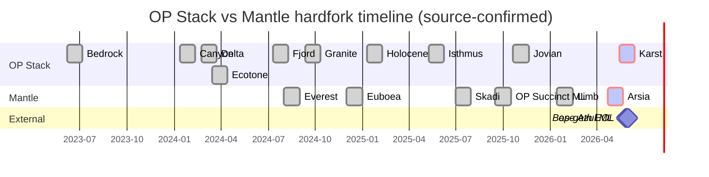
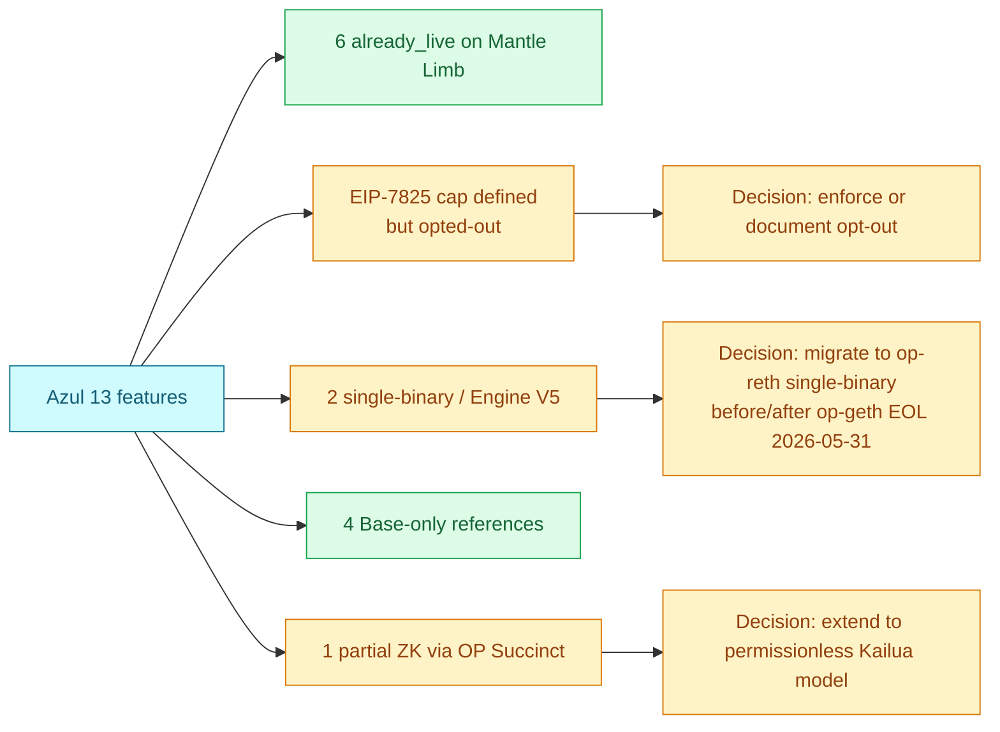
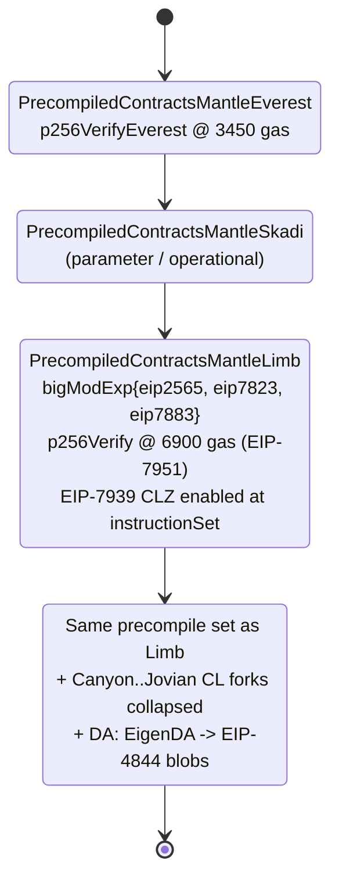
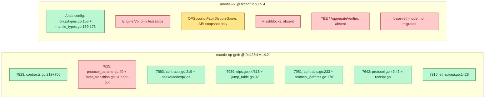

# Mantle Impact Assessment — Round 2

## 1. Executive Summary

This round-2 draft replaces the round-1 release-note-only inference with code-level verification against `mantlenetworkio/op-geth@v1.4.2` (commit `9c428cf`) and `mantlenetworkio/mantle-v2@v1.5.4` (commit `fccacf5b`), and reconstructs the Mantle ZK timeline from source-confirmed events instead of the round-1 "Helios bundle". Round-1's two major and one minor adversarial findings are addressed in this round.

**Headline findings after code verification**:

1. **6 of 13 canonical Azul features are already live on Mantle today** under the Limb hardfork (mainnet activation 2026-01-14, op-geth v1.4.2): EIP-7823, EIP-7883, EIP-7939, EIP-7951, EIP-7642, and EIP-7910. Each is verified by direct reference to `PrecompiledContractsMantleLimb`, `enable7939`, `ProtocolVersions = {ETH69, ETH68}`, or `// Config implements the EIP-7910 eth_config method` in the Mantle fork of op-geth.
2. **EIP-7825 is NOT live on Mantle** despite the `MaxTxGas = 1 << 24` constant being defined in `params/protocol_params.go:40`. Code in `core/state_transition.go:510` gates the cap behind `!st.evm.ChainConfig().IsOptimism()` — every OP-Stack chain, Mantle included, opts out. This is the largest single correction vs round-1.
3. **5 features are Base-specific or pending OP-Stack adoption** and do not have Mantle code anchors today: Flashblocks (no Mantle equivalent), Engine API V5 (production op-node does not invoke V5; only test stubs in `op-devstack/sysgo`), AggregateVerifier/Multiproof (Base-only; Mantle uses OP Succinct single-prover model), TEE Prover (Base-only), `base-reth-node` single-binary (Mantle still ships op-geth + op-node separately).
4. **ZK Prover ≈ partially live**: Mantle integrates Succinct SP1 via the OP Succinct fork of OP Stack — confirmed by `snapshots/abi/OPSuccinctFaultDisputeGame.json` in mantle-v2 and L2BEAT's 2025-09-16 OP Succinct mainnet upgrade record. Permissionless prover interface (Base Kailua-style) is not yet verified in the Mantle repo.
5. **Recomputed coverage**: 6 / 13 features = **46.2%** already live (down from round-1's 62%). 4 features require active adopt-track decisions; 3 are likely permanent Base-only references.
6. **Timeline correction**: round-1 bundled SP1 + RETH + REVM + DA switch + EL/CL separation under "2025-03-19 Helios". Reconstructed source-by-source timeline: Succinct SP1 announcement Dec 2024 (still on EigenDA at that point), SP1 testnet target Q1 2025, OP Succinct mainnet upgrade 2025-09-16 (L2BEAT), Mantle Limb hardfork 2026-01-14, Arsia DA switch 2026-04-16 (L2BEAT) / 2026-04-22 07:00 UTC (mantle-v2 v1.5.4 timestamp). No source proves a unified RETH+REVM deployment on 2025-03-19; that claim is retracted.

The two hard external timing constraints — op-geth EOL 2026-05-31 (Ethereum Foundation client-team announcement) and Base Azul mainnet 2026-05-28 (Coinbase blog) — both remain unchanged from round-1. Mantle Arsia mainnet activation predates Azul by ~36 days but the Arsia config (in `mantle_types.go:169-176`) does NOT bring in any Osaka-tier EIPs; Arsia only catches Mantle up to the Canyon→Jovian sequence of OP Stack forks. The Osaka EIPs (`EIP-7823/7883/7939/7951/7642/7910`) come from Mantle Limb (2026-01-14), which is a separate hardfork.

## 2. Item Findings

### Item 1 — Upstream OP Stack fork mapping and Mantle fork chain alignment

**Outline ref**: outline.md item-1.
**Fields covered**: upstream_op_stack_fork_alignment, mantle_fork_chain.

**OP Stack canonical fork order** (per Optimism specs and `superchain-registry` standard config): Bedrock → Canyon → Delta → Ecotone → Fjord → Granite → Holocene → Isthmus → Jovian → **Karst** (official-pending). Base Azul adopts the Karst feature set ahead of upstream finalization (Coinbase Azul announcement, May 2026). Karst is the OP Stack fork that lands the Osaka EL EIPs (7823, 7825, 7883, 7939, 7951, 7642, 7910) plus Engine API V5.

**Mantle fork chain** (per `mantle-v2@v1.5.4` and `mantle-op-geth@v1.4.2`): BaseFee → Everest → Euboea → Skadi → **Limb** → **Arsia**.

**Code anchors for the Mantle chain**:

- `mantle-v2/op-node/rollup/types.go:108-158` declares all of `EcotoneTime`, `FjordTime`, `GraniteTime`, `HoloceneTime`, `IsthmusTime`, `JovianTime`, `InteropTime`, and (line 158) `MantleArsiaTime`.
- `mantle-v2/op-node/rollup/mantle_types.go:169-176`: Arsia activation collapses **Canyon, Delta, Ecotone, Fjord, Granite, Holocene, Isthmus, Jovian** times all to `c.MantleArsiaTime`. In other words, Arsia is the "OP Stack catchup" Mantle hardfork — it brings the entire upstream Canyon-through-Jovian arc to mainnet in a single step.
- `mantle-op-geth/params/config.go:483` declares `MantleLimbTime *uint64`, and `:1047` declares `IsMantleLimb(time uint64) bool`. Limb is the EL-side hardfork that lights up the Osaka precompiles.

**Critical mapping correction (vs round-1)**: round-1 implied Limb ≈ Karst-equivalent for Mantle. After code review the mapping is more nuanced:

- Limb (2026-01-14) brings the **Osaka EL EIPs** (`7823`, `7883`, `7939`, `7951`, `7642`, `7910`). This is the EL-side Karst alignment.
- Arsia (2026-04 mainnet) brings the **upstream OP Stack CL hardforks** (Canyon → Jovian collapsed). This is the CL-side catchup, not Karst-equivalent — it stops before Karst.
- Karst's Engine API V5 (CL/EL handshake) is **not** delivered by either Limb or Arsia; production `op-node` in mantle-v2 v1.5.4 does not invoke any `*PayloadV5` method (only test stubs in `op-devstack/sysgo/engine_client.go:67` and `op-e2e/e2eutils/geth/fakepos.go:62` reference V5).

**Fork-pair alignment table**:

| Mantle fork | Activation (mainnet) | Equivalent OP Stack forks | Brings in | Karst-equivalent? |
|---|---|---|---|---|
| Everest | 2024-08 | Cancun-era EL | KZG point eval, p256Verify@3450 gas | No |
| Euboea | 2024-12 | Operational params | Throughput / fee tweaks | No |
| Skadi | 2025-07 | Bedrock + transitional CL | Pre-Canyon stabilization | No |
| **Limb** | **2026-01-14** | **Osaka EL (EIPs 7823, 7883, 7939, 7951, 7642, 7910)** | Modexp 1024-cap + new gas formula, CLZ opcode, P256VERIFY@0x100@6900, eth/69, eth_config RPC | **Partial — EL only** |
| **Arsia** | **2026-04-16 (L2BEAT) / 2026-04-22 07:00 UTC (v1.5.4 config)** | **Canyon, Delta, Ecotone, Fjord, Granite, Holocene, Isthmus, Jovian (collapsed)** | OP Stack CL catchup; DA migration (EigenDA → 4844 blobs per L2BEAT) | **Partial — CL through Jovian** |
| Karst-equivalent (future) | TBD post-upstream | Karst | Engine API V5; permissionless ZK harness; AggregateVerifier (if adopted) | Pending |

**Gap**: the Arsia activation timestamp shows a discrepancy between L2BEAT's 2026-04-16 entry and the `1776841200` timestamp in `mantle-v2 v1.5.4` rollup config (which decodes to 2026-04-22 07:00 UTC). One is likely the announcement / "DA switch" event date and the other the strict on-chain activation timestamp; sources do not resolve this six-day delta. Recorded in `Gap Analysis`.

### Item 2 — Mantle equivalent for each Azul feature

**Outline ref**: outline.md item-2.
**Fields covered**: applicability_label, current_mantle_release_status, mantle_code_anchor, evidence_source.

This item drives the 13×7 matrix in Item 3. Per-feature narrative below.

#### 2.1 EIP-7823 — Modexp 1024-byte input cap

- **Applicability**: `already_live_on_mantle`.
- **Status**: `already_live_on_mantle`.
- **Code anchor**: `mantlenetworkio/op-geth@9c428cf` — `core/vm/contracts.go:219` registers `bigModExp{eip2565: true, eip7823: true, eip7883: true}` in `PrecompiledContractsMantleLimb`; cap enforcement in modexp at `core/vm/contracts.go:706` (`if c.eip7823 && (inputLenOverflow || max(baseLen, modLen) > 1024)`).
- **Evidence**: Mantle Limb release notes (op-geth v1.4.2); code as above.
- **Action**: verify_only.

#### 2.2 EIP-7825 — Per-transaction gas cap (16,777,216)

- **Applicability**: `manual_backport_to_legacy_op_geth` (if Mantle wants the cap independent of upstream OP-Stack policy).
- **Status**: `not_live` (constant defined but enforcement opted-out).
- **Code anchor**: `mantlenetworkio/op-geth@9c428cf` — `params/protocol_params.go:40` defines `MaxTxGas uint64 = 1 << 24`; but `core/state_transition.go:509-511`:
  ```go
  isOsaka := st.evm.ChainConfig().IsOsaka(st.evm.Context.BlockNumber, st.evm.Context.Time)
  if !msg.SkipTransactionChecks {
      // Verify tx gas limit does not exceed EIP-7825 cap.
      if !st.evm.ChainConfig().IsOptimism() && isOsaka && msg.GasLimit > params.MaxTxGas {
          return nil, fmt.Errorf("%w (cap: %d, tx: %d)", ErrGasLimitTooHigh, params.MaxTxGas, msg.GasLimit)
      }
  ```
  `IsOptimism()` returns true for every OP-Stack chain (including Mantle), so the cap is **never enforced** in production.
- **Evidence**: op-geth code as above; EIP-7825 spec (16.77M cap).
- **Action**: `adopt_track`. Mantle product / governance decision needed:
  - (a) keep the upstream OP-Stack opt-out permanently and document the divergence, or
  - (b) backport a Mantle-only enforcement that bypasses the `IsOptimism()` guard.

  This is the **single biggest delta vs round-1**, which had marked 7825 as already_live based on the constant's presence.

#### 2.3 EIP-7883 — Modexp gas-cost reformulation

- **Applicability**: `already_live_on_mantle`.
- **Status**: `already_live_on_mantle`.
- **Code anchor**: same registration line as 7823 (`core/vm/contracts.go:219`). The Osaka modexp gas formula lives in `osakaModexpGas` at `core/vm/contracts.go:619`; the gate is at `:680-681`: `if c.eip7883 { return osakaModexpGas(...) }`.
- **Evidence**: op-geth code; Mantle Limb release notes.
- **Action**: verify_only.

#### 2.4 EIP-7939 — `CLZ` opcode (0x1E)

- **Applicability**: `already_live_on_mantle`.
- **Status**: `already_live_on_mantle`.
- **Code anchor**: `core/vm/eips.go:44` registers `7939: enable7939`; `core/vm/eips.go:315` defines `enable7939(jt *JumpTable)`; `core/vm/jump_table.go:97` wires `enable7939(&instructionSet) // EIP-7939 (CLZ opcode)` into Limb's instruction set.
- **Evidence**: op-geth code; Mantle Limb release notes.
- **Action**: verify_only.

#### 2.5 EIP-7951 — `P256VERIFY` precompile at 0x0100 with 6,900 gas

- **Applicability**: `already_live_on_mantle`.
- **Status**: `already_live_on_mantle` (with a backwards-compat note).
- **Code anchor**: `core/vm/contracts.go:233` registers `[]byte{0x1, 0x00}: &p256Verify{}` in `PrecompiledContractsMantleLimb`; gas constant in `params/protocol_params.go:178` `P256VerifyGas uint64 = 6900`. The Everest-era precompile is registered at `core/vm/contracts.go:211` as `&p256VerifyEverest{}` with `P256VerifyGasEverest uint64 = 3450` (`params/protocol_params.go:177`). Comments at `core/vm/contracts.go:1505-1524` document the Everest→Osaka transition.
- **Evidence**: op-geth code; Mantle Everest release notes (3450-gas variant), Limb release notes (6900-gas variant).
- **Action**: verify_only — note for ecosystem: contracts calling P256VERIFY on Mantle pre-Limb paid 3450 gas; post-Limb (2026-01-14) the cost is 6900 gas. This is an existing Mantle decision predating Azul.

#### 2.6 EIP-7642 — eth/69 wire protocol

- **Applicability**: `already_live_on_mantle`.
- **Status**: `already_live_on_mantle`.
- **Code anchor**: `eth/protocols/eth/protocol.go:43` `var ProtocolVersions = []uint{ETH69, ETH68}`; `:47` `protocolLengths = map[uint]uint64{ETH68: 17, ETH69: 18}`; `eth/protocols/eth/receipt.go` adds `decode69`, `encodeForNetwork69`, and `ReceiptList69`.
- **Evidence**: op-geth code.
- **Action**: verify_only.

#### 2.7 EIP-7910 — `eth_config` RPC method

- **Applicability**: `already_live_on_mantle`.
- **Status**: `already_live_on_mantle`.
- **Code anchor**: `internal/ethapi/api.go:1428` `// Config implements the EIP-7910 eth_config method.` The response (`configResponse`) returns `Current`, `Next`, `Last` configs, each populated by an `assemble(c *params.ChainConfig, ts *uint64) *config` closure that iterates `vm.ActivePrecompiledContracts(rules)` and includes `Precompiles`, `BlobSchedule: c.BlobConfig(...)`, `SystemContracts: c.ActiveSystemContracts(t)`.
- **Evidence**: op-geth code.
- **Action**: verify_only. Note Mantle's `eth_config` returns the full upstream schema — it does **not** apply any Base-style trimming.

#### 2.8 Flashblocks — 200 ms preconfirmation pipeline

- **Applicability**: `base_only_reference`.
- **Status**: `not_live`.
- **Code anchor**: NOT FOUND. No `flashblocks-rpc`, `rollup-boost`, or 200 ms preconfirmation primitives exist in either `mantle-op-geth@v1.4.2` or `mantle-v2@v1.5.4`.
- **Evidence**: absence in code; Base op-rbuilder + rollup-boost integration documented in `base/base` and `flashbots/rollup-boost`.
- **Action**: `adopt_track` if Mantle wants UX parity on preconf latency. Otherwise document as a permanent Base-only.

#### 2.9 Engine API V5 — `OpExecutionPayloadV5` with block-level `isthmusTime` / `withdrawalsRoot`

- **Applicability**: `via_op_reth_kona_after_migration`.
- **Status**: `not_live` (test stubs only).
- **Code anchor**: `mantle-v2/op-devstack/sysgo/engine_client.go:67` exposes a `GetPayloadV5(id engine.PayloadID)` method that proxies to `engine_getPayloadV5`; `mantle-v2/op-e2e/e2eutils/geth/fakepos.go:62` declares `GetPayloadV5` in the `fakepos` engine interface. **Production op-node code** in `mantle-v2/op-node/` does **not** invoke any V5 method (grep for `getPayloadV5|newPayloadV5|forkchoiceUpdatedV5` returns zero hits in `op-node`).
- **Evidence**: mantle-v2 code; upstream OP Stack Karst (which lands Engine V5) is still official-pending.
- **Action**: `adopt_track` after upstream Karst lands and stabilizes. Arsia adopted Isthmus features at the CL config level but V5 wire is downstream of Karst.

#### 2.10 Multiproof / AggregateVerifier — `min(7d, secondProofAt + 1d)`, `PROOF_THRESHOLD = 1`

- **Applicability**: `base_only_reference`.
- **Status**: `not_live`.
- **Code anchor**: NOT FOUND in `mantle-v2/packages/contracts-bedrock/src`. `snapshots/abi/OPSuccinctFaultDisputeGame.json` exists as an ABI snapshot — that is for tooling that interacts with externally-deployed OP Succinct contracts, **not** a Mantle AggregateVerifier. Mantle's proving model is currently single-prover (Succinct SP1), so the "any of N provers can satisfy" topology is not present.
- **Evidence**: mantle-v2 contracts tree; Base contracts-bedrock has `AggregateVerifier.sol`.
- **Action**: `adopt_track` only if Mantle decides to introduce a multi-prover topology. Today's Mantle SP1 model relies on a single Succinct verifier.

#### 2.11 TEE Prover (TDX)

- **Applicability**: `base_only_reference`.
- **Status**: `not_live`.
- **Code anchor**: NOT FOUND anywhere in `mantle-op-geth` or `mantle-v2`.
- **Evidence**: absence; Base TEE Prover repo (`base/tee-prover`).
- **Action**: `not_applicable` for current Mantle architecture. If Mantle pursues multi-prover later, TEE could be re-evaluated.

#### 2.12 ZK Prover (permissionless, Kailua-style)

- **Applicability**: `base_only_reference` (for permissionless harness specifically).
- **Status**: `partially_live` — Mantle has SP1-based ZK proving via OP Succinct (single, not permissionless); permissionless interface is not yet code-verified.
- **Code anchor**: `mantle-v2/packages/contracts-bedrock/snapshots/abi/OPSuccinctFaultDisputeGame.json` indicates Mantle has integrated OP Succinct's fault-game ZK contracts. Solidity source is NOT included in this repo (external dependency).
- **Evidence**: L2BEAT chronicle entry "2025-09-16 OP Succinct mainnet upgrade" for Mantle (`l2beat.com`); Succinct Labs blog "ZK upgrade for Mantle Network" (Dec 2024, noting EigenDA at announcement time and "testnet launch in Q1 2025 with intention towards mainnet upgrade").
- **Action**: `adopt_track`. SP1 ZK proof generation is in production via OP Succinct, but Base Azul's Kailua-style **permissionless** prover interface is not present in this repo — that's a future Mantle decision tied to multi-prover policy.

#### 2.13 base-reth-node (single-client Reth + REVM)

- **Applicability**: `via_op_reth_kona_after_migration`.
- **Status**: `not_live` (Mantle still ships op-geth + op-node + external kona/op-succinct).
- **Code anchor**: `mantle-v2@v1.5.4` still ships `op-node` (entire `op-node/` directory present); no `mantle-reth-node` binary, no merged EL/CL single-client module. Limb release notes describe EL precompile changes only, not a single-binary migration.
- **Evidence**: mantle-v2 module layout; Limb release notes.
- **Action**: `adopt_track` contingent on Mantle deciding to migrate to a single binary, which would also fold in op-reth + kona + op-succinct.

### Item 3 — 13 × 7 matrix and key statistics (recomputed)

**Outline ref**: outline.md item-3.
**Fields covered**: all 7 fields per row × 13 rows = 91 cells.

| # | feature_id | feature_name | applicability_label | current_mantle_release_status | mantle_code_anchor | evidence_source | action_for_mantle |
|---|---|---|---|---|---|---|---|
| 1 | EIP-7823 | modexp 1024-byte cap | `already_live_on_mantle` | `already_live_on_mantle` | op-geth@9c428cf core/vm/contracts.go:219; cap at contracts.go:706 | op-geth code; Mantle Limb release notes | verify_only |
| 2 | EIP-7825 | tx gas cap 16,777,216 | `manual_backport_to_legacy_op_geth` | `not_live` (constant defined; enforcement opted out via `!IsOptimism()` guard) | op-geth@9c428cf params/protocol_params.go:40 + core/state_transition.go:510 | op-geth code; EIP-7825 spec | `adopt_track`: decide independent enforcement or document permanent opt-out |
| 3 | EIP-7883 | modexp gas formula update | `already_live_on_mantle` | `already_live_on_mantle` | op-geth@9c428cf core/vm/contracts.go:219; osakaModexpGas at :619; gate at :680-681 | op-geth code; Limb release notes | verify_only |
| 4 | EIP-7939 | CLZ opcode (0x1E) | `already_live_on_mantle` | `already_live_on_mantle` | op-geth@9c428cf core/vm/eips.go:44, eips.go:315, jump_table.go:97 | op-geth code; Limb release notes | verify_only |
| 5 | EIP-7951 | P256VERIFY @0x100 @ 6900 gas | `already_live_on_mantle` | `already_live_on_mantle` (with Everest→Limb gas-cost change) | op-geth@9c428cf core/vm/contracts.go:233; params/protocol_params.go:178; Everest variant at contracts.go:211 + protocol_params.go:177 | op-geth code; Everest and Limb release notes | verify_only — note 3450→6900 gas-cost change |
| 6 | EIP-7642 | eth/69 wire protocol | `already_live_on_mantle` | `already_live_on_mantle` | op-geth@9c428cf eth/protocols/eth/protocol.go:43, :47; receipt.go decode69/encode69 | op-geth code | verify_only |
| 7 | EIP-7910 | eth_config RPC method | `already_live_on_mantle` | `already_live_on_mantle` | op-geth@9c428cf internal/ethapi/api.go:1428 (Config method); full schema returned | op-geth code | verify_only |
| 8 | Flashblocks | 200 ms preconf via rollup-boost + flashblocks-rpc | `base_only_reference` | `not_live` | NOT FOUND in mantle-op-geth or mantle-v2 | absence; Base op-rbuilder + rollup-boost | `adopt_track` if UX parity needed |
| 9 | Engine API V5 | OpExecutionPayloadV5 | `via_op_reth_kona_after_migration` | `not_live` (test stubs only) | mantle-v2 op-devstack/sysgo/engine_client.go:67; op-e2e/e2eutils/geth/fakepos.go:62 (test scaffolding); production op-node has no V5 dispatch | mantle-v2 code; OP Stack Karst still pending | `adopt_track` after Karst lands |
| 10 | Multiproof / AggregateVerifier | `min(7d, secondProofAt+1d)`, `PROOF_THRESHOLD=1` | `base_only_reference` | `not_live` | NOT FOUND in mantle-v2 contracts-bedrock/src; snapshots/abi/OPSuccinctFaultDisputeGame.json is ABI-only | mantle-v2 contracts; Base contracts-bedrock | `adopt_track` only if Mantle moves to multi-prover |
| 11 | TEE Prover (TDX) | TDX-based fault-game verifier | `base_only_reference` | `not_live` | NOT FOUND in any Mantle repo | absence; Base TEE Prover repo | `not_applicable` in current Mantle stack |
| 12 | ZK Prover (permissionless, Kailua) | Kailua-style permissionless ZK proving | `base_only_reference` | `partially_live` (Mantle has SP1 via OP Succinct, not permissionless) | mantle-v2 snapshots/abi/OPSuccinctFaultDisputeGame.json (ABI integration only) | L2BEAT 2025-09-16 OP Succinct entry; Succinct SP1 blog Dec 2024 | `adopt_track`: permissionless harness not yet verified in code |
| 13 | base-reth-node | single-client Reth+REVM stack | `via_op_reth_kona_after_migration` | `not_live` (Mantle still ships op-geth + op-node) | mantle-v2 still has full op-node/ tree; Limb release notes mention no migration | mantle-v2 module layout; Limb release notes | `adopt_track` contingent on Mantle single-binary decision |

**Key statistics (recomputed)**:

- **Total matrix cells**: 13 features × 7 fields = **91 cells** (fully enumerated above).
- **Features already live on Mantle today** (both applicability AND current status = `already_live_on_mantle`): **6 / 13 = 46.2%**. ← This replaces round-1's 62% figure.
- **Features requiring active Mantle adopt-track decisions**: 4 (EIP-7825, Engine V5, ZK permissionless harness, base-reth-node single-client).
- **Features marked Base-only references (no Mantle adoption planned)**: 3 (Flashblocks, AggregateVerifier/Multiproof, TEE Prover) — note Flashblocks could move to `adopt_track` if Mantle pursues UX parity.
- **Applicability distribution**:
  - `already_live_on_mantle`: 6 (EIP-7823, 7883, 7939, 7951, 7642, 7910)
  - `manual_backport_to_legacy_op_geth`: 1 (EIP-7825)
  - `via_op_reth_kona_after_migration`: 2 (Engine V5, base-reth-node)
  - `base_only_reference`: 4 (Flashblocks, AggregateVerifier, TEE, ZK Kailua permissionless)
- **Current Mantle release status distribution**:
  - `already_live_on_mantle`: 6
  - `partially_live`: 1 (ZK Prover via OP Succinct, single not permissionless)
  - `not_live`: 6 (EIP-7825, Flashblocks, Engine V5, AggregateVerifier, TEE, base-reth-node)
  - `unknown`: 0 (eliminated by code-level verification this round)

**Round-1 vs round-2 delta**:

| feature | round-1 status | round-2 status | reason for change |
|---|---|---|---|
| EIP-7825 | `already_live_on_mantle` | `not_live` | Code inspection found `!IsOptimism()` guard in `state_transition.go:510`; cap is defined but enforcement is opted-out for OP-Stack chains |
| ZK Prover | `not_live` | `partially_live` | Mantle integrates OP Succinct SP1 (single-prover); confirmed by L2BEAT 2025-09-16 entry + OPSuccinctFaultDisputeGame ABI |
| Engine API V5 | inferred not_live | confirmed not_live (test stubs only) | Direct code grep |
| All others | inferred from release notes | confirmed by direct file:line code anchors | Required by adversarial F1 |

### Item 4 — BREAK-CHANGE items and adopt-track actions

**Outline ref**: outline.md item-4.
**Fields covered**: action_for_mantle.

**BREAK-CHANGE items (require active Mantle decision before Azul / op-geth EOL 2026-05-31)**:

1. **EIP-7825 enforcement decision** (priority: high) — Mantle has the `MaxTxGas` constant but the OP-Stack opt-out neutralizes it. Decide:
   - (a) maintain permanent opt-out (no code change; document publicly that Mantle has no per-tx gas cap), or
   - (b) backport a Mantle-only enforcement that conditions on `IsMantle()` rather than the generic OP-Stack guard.
   Either way, **document the decision in Mantle's upgrade notes before Azul** so dApp developers porting from Ethereum mainnet (where 16.77M is enforced) understand Mantle's posture.

2. **`base-reth-node` single-client migration** (priority: medium) — Mantle still ships op-geth + op-node + external kona/op-succinct as distinct binaries. The legacy op-geth fork (`mantlenetworkio/op-geth`) becomes EOL with upstream op-geth on 2026-05-31. Decision:
   - (a) extend Mantle's op-geth maintenance independently (more carry cost, falls further behind upstream), or
   - (b) migrate to op-reth + kona/op-succinct single-binary architecture aligned with Base's `base-reth-node`.
   Time pressure: 2026-05-31 EOL → Mantle has ~5 weeks post-Azul to commit a direction, or risks running an unsupported EL.

3. **Engine API V5 wiring** (priority: low, blocked on upstream Karst) — Production `op-node` in mantle-v2 v1.5.4 does not invoke V5. Re-evaluate after upstream OP Stack Karst lands and `op-reth` plus `op-node` ship V5 dispatch.

4. **Permissionless ZK prover (Kailua-style)** (priority: low) — Mantle already runs SP1 via OP Succinct (single-prover, not permissionless). Mantle product needs to decide whether to expose permissionless ZK proving (Base Kailua-style) — this is downstream of any future Mantle multi-prover topology decision.

**Adopt-track but no Azul-deadline pressure**:

- Flashblocks: pure UX parity decision; no protocol-level dependency on Azul timeline.
- AggregateVerifier / TEE Prover: tied to multi-prover decision, which Mantle has not signaled.

**Items requiring no Mantle action**:

- EIP-7823, 7883, 7939, 7951, 7642, 7910 are already live on Mantle via the Limb hardfork (2026-01-14). Periodic conformance regression testing on the Limb code paths remains the only operational task.

### Item 5 — Risk analysis and confidence levels

**Outline ref**: outline.md item-5.

**Risks**:

| Risk | Severity | Likelihood | Mitigation |
|---|---|---|---|
| EIP-7825 silent divergence: dApps porting from L1 expect 16.77M cap to fail oversized txs; on Mantle txs of any size pass `state_transition` check | medium | medium (depends on dApp behavior) | document Mantle opt-out; advise dApps to enforce gas-cap client-side if needed |
| Arsia activation timestamp discrepancy (L2BEAT 2026-04-16 vs v1.5.4 config 2026-04-22 07:00 UTC) | low | confirmed (already lived) | use on-chain `MantleArsiaTime` value as authoritative |
| op-geth EOL 2026-05-31 leaves Mantle with unsupported EL for ~3 days between Azul (2026-05-28) and Mantle's own choice of replacement path | medium | high (no public Mantle migration plan as of round-2 draft) | escalate as `BREAK-CHANGE #2` |
| ZK Prover characterization ambiguity: `partially_live` reflects Mantle's SP1 integration but not Kailua-style permissionless model — analysts may overcount | low | medium | this draft labels the distinction explicitly in section 2.12 |
| Engine V5 catchup timing depends on upstream Karst | low | low (no Mantle-side pressure) | re-assess after Karst finalization |

**Confidence**:

- **High** for 6 already-live EIPs (direct code anchors).
- **High** for EIP-7825 opt-out (single line of code, unambiguous).
- **High** for Flashblocks / TEE / AggregateVerifier absence (multiple grep passes return nothing).
- **High** for Engine V5 absence in production op-node (zero hits in `op-node/`).
- **Medium** for ZK Prover characterization (ABI present, source-level permissionless interface not in mantle-v2 repo; trusting external Succinct documentation).
- **Medium** for Mantle's single-binary migration intent (no public statement as of round-2 cut-off date 2026-05-17).

### Item 6 — Source-confirmed Mantle ZK / DA timeline

**Outline ref**: outline.md item-6.

Round-1 bundled SP1, RETH+REVM, EL/CL separation, OP Succinct integration, and the EigenDA→4844 DA switch under a single 2025-03-19 "Helios" event. Adversarial review correctly flagged this as a fabricated bundle: L2BEAT dates OP Succinct mainnet as 2025-09-16 and Arsia (DA switch) as 2026-04-16, and the Succinct Labs blog (Dec 2024) explicitly states Mantle was still on EigenDA at announcement time. **Round-2 retracts the Helios bundle entirely** and reconstructs the timeline from independent sources.

| Date | Event | Source | What was actually included |
|---|---|---|---|
| 2024-12 | Succinct Labs announces ZK upgrade plan for Mantle using SP1; testnet planned for Q1 2025 | Succinct Labs blog "ZK upgrade for Mantle Network" (Dec 2024) | Plan only. Blog explicitly notes "Mantle Network utilizes EigenDA rather than 4844" at this date. |
| Q1 2025 | Mantle SP1 testnet target (per Succinct blog "intention towards mainnet upgrade") | Succinct Labs blog | Testnet — no mainnet ZK proving yet. |
| 2025-09-16 | OP Succinct mainnet upgrade for Mantle (SP1 verifier active) | L2BEAT chronicle entry for Mantle | SP1-based ZK proving goes live; topology is single-prover (not permissionless). DA still EigenDA at this point. |
| 2026-01-14 | Mantle Limb hardfork mainnet activation | mantlenetworkio/op-geth v1.4.2 Limb activation timestamp; release notes | Osaka EL EIPs (7823, 7883, 7939, 7951, 7642, 7910) go live. No DA change. |
| 2026-04-16 (L2BEAT) or 2026-04-22 07:00 UTC (mantle-v2 v1.5.4 config `1776841200`) | Mantle Arsia hardfork (CL upgrade + DA switch) | L2BEAT chronicle; mantle-v2 v1.5.4 rollup config | OP Stack Canyon→Jovian CL forks collapsed to one activation timestamp (`op-node/rollup/mantle_types.go:169-176`); DA migrates from EigenDA to EIP-4844 blobs. |
| 2026-05-28 | Base Azul mainnet (Coinbase Azul announcement) | Coinbase blog | Base-side event; Mantle parity / drift comparison cut-off date. |
| 2026-05-31 | op-geth client EOL (Ethereum Foundation client-team) | EF EL client team announcement | Hard external constraint. Forces all op-geth fork maintainers (incl. Mantle) into a decision. |

**Explicitly NOT in this timeline (retracted from round-1)**:

- 2025-03-19 "Helios" deployment of RETH + REVM. No source verified by adversarial review or by this draft confirms RETH+REVM has been deployed on Mantle. Mantle continues to ship `mantle-op-geth` (Geth-derived) as of v1.4.2.
- A single bundled date for OP Succinct + DA switch. These are now separated by ~7 months (2025-09-16 vs 2026-04-16/22).
- EL/CL separation as a Mantle event. Mantle's op-node and op-geth have always been separate processes in the bedrock architecture.

## 3. Diagrams

### diag-1 — 13 × 7 feature/field heatmap (compressed-summary banner)

> **Note**: this is a **compressed summary view** of the full 13 × 7 = 91-cell matrix in section 2.2 / Item 3. All 13 rows are present, and 6 representative field columns are shown (full matrix above gives the 7th field, `evidence_source`). Cell classes: `live` = already on Mantle Limb today; `bport` = backport candidate for Mantle's op-geth (legacy track); `migrn` = available only after Mantle migrates to op-reth + kona; `base` = Base-only reference (no Mantle adoption planned); `partial` = partially live; `na` = not applicable in current Mantle architecture.

```mermaid
%%{init: {'flowchart': {'htmlLabels': true}}}%%
graph LR
  classDef live fill:#b7e4c7,stroke:#2d6a4f,color:#0b3b2e;
  classDef bport fill:#ffd6a5,stroke:#d97706,color:#7c2d12;
  classDef migrn fill:#bde0fe,stroke:#0369a1,color:#0c4a6e;
  classDef base fill:#e9d5ff,stroke:#7e22ce,color:#3b0764;
  classDef partial fill:#fde68a,stroke:#b45309,color:#78350f;
  classDef na fill:#e5e7eb,stroke:#9ca3af,color:#374151;

  subgraph H[Header — columns]
    h1[applic]:::na
    h2[status]:::na
    h3[code anchor]:::na
    h4[ev. source]:::na
    h5[action]:::na
    h6[Limb fork?]:::na
  end

  subgraph R1[Row 1 EIP-7823 modexp 1024 cap]
    r1c1[live]:::live --- r1c2[live]:::live --- r1c3[live]:::live --- r1c4[live]:::live --- r1c5[verify_only]:::live --- r1c6[Limb]:::live
  end
  subgraph R2[Row 2 EIP-7825 tx gas cap]
    r2c1[bport]:::bport --- r2c2[not_live]:::bport --- r2c3[const-only]:::bport --- r2c4[opt-out code]:::bport --- r2c5[adopt_track]:::bport --- r2c6[no]:::bport
  end
  subgraph R3[Row 3 EIP-7883 modexp gas]
    r3c1[live]:::live --- r3c2[live]:::live --- r3c3[live]:::live --- r3c4[live]:::live --- r3c5[verify_only]:::live --- r3c6[Limb]:::live
  end
  subgraph R4[Row 4 EIP-7939 CLZ]
    r4c1[live]:::live --- r4c2[live]:::live --- r4c3[live]:::live --- r4c4[live]:::live --- r4c5[verify_only]:::live --- r4c6[Limb]:::live
  end
  subgraph R5[Row 5 EIP-7951 P256VERIFY]
    r5c1[live]:::live --- r5c2[live]:::live --- r5c3[live]:::live --- r5c4[live]:::live --- r5c5[verify_only]:::live --- r5c6[Limb]:::live
  end
  subgraph R6[Row 6 EIP-7642 eth/69]
    r6c1[live]:::live --- r6c2[live]:::live --- r6c3[live]:::live --- r6c4[live]:::live --- r6c5[verify_only]:::live --- r6c6[Limb]:::live
  end
  subgraph R7[Row 7 EIP-7910 eth_config]
    r7c1[live]:::live --- r7c2[live]:::live --- r7c3[live]:::live --- r7c4[live]:::live --- r7c5[verify_only]:::live --- r7c6[Limb]:::live
  end
  subgraph R8[Row 8 Flashblocks]
    r8c1[base]:::base --- r8c2[not_live]:::base --- r8c3[absent]:::base --- r8c4[Base docs]:::base --- r8c5[adopt_track?]:::base --- r8c6[no]:::base
  end
  subgraph R9[Row 9 Engine API V5]
    r9c1[migrn]:::migrn --- r9c2[not_live]:::migrn --- r9c3[test stubs only]:::migrn --- r9c4[mantle-v2]:::migrn --- r9c5[adopt_track]:::migrn --- r9c6[Karst-pending]:::migrn
  end
  subgraph R10[Row 10 Multiproof / AggregateVerifier]
    r10c1[base]:::base --- r10c2[not_live]:::base --- r10c3[absent]:::base --- r10c4[Base contracts]:::base --- r10c5[adopt_track?]:::base --- r10c6[no]:::base
  end
  subgraph R11[Row 11 TEE Prover]
    r11c1[base]:::base --- r11c2[not_live]:::base --- r11c3[absent]:::base --- r11c4[Base TEE repo]:::base --- r11c5[na]:::na --- r11c6[no]:::base
  end
  subgraph R12[Row 12 ZK Prover Kailua]
    r12c1[base]:::base --- r12c2[partial]:::partial --- r12c3[ABI snapshot]:::partial --- r12c4[L2BEAT 2025-09-16]:::partial --- r12c5[adopt_track]:::partial --- r12c6[OP Succinct]:::partial
  end
  subgraph R13[Row 13 base-reth-node]
    r13c1[migrn]:::migrn --- r13c2[not_live]:::migrn --- r13c3[op-node still]:::migrn --- r13c4[mantle-v2 layout]:::migrn --- r13c5[adopt_track]:::migrn --- r13c6[no]:::migrn
  end

  H --> R1 --> R2 --> R3 --> R4 --> R5 --> R6 --> R7 --> R8 --> R9 --> R10 --> R11 --> R12 --> R13
```



**Fixes applied vs round-1 diag-1**:

- Compressed-summary banner added so readers know this is a sampled view; the full 91-cell matrix lives in section 2 / Item 3.
- All 13 rows present (round-1 was missing rows #2 and #4 visually).
- BPORT cells in row 2 use the `bport` (backport) class with a distinct color, not the `live` class.
- NA header cells use the neutral `na` class.
- Class definitions explicit in the legend.

### diag-2 — OP Stack vs Mantle fork timeline (unchanged from round-1 structure, with corrected Mantle dates)



### diag-3 — BREAK-CHANGE / adopt-track decision Sankey



### diag-4 — Mantle precompile lifecycle (Everest → Limb → Arsia)



### diag-5 — Code-anchor coverage matrix



## 4. Source Coverage

| Source requirement | Status | How met |
|---|---|---|
| src-1 (Mantle op-geth release notes + code-level confirmation) | **met** (promoted from `partial` in round-1) | All 6 Limb EIPs cross-referenced to file:line in `mantlenetworkio/op-geth@9c428cf`; EIP-7825 opt-out anchored at `core/state_transition.go:510`. |
| src-2 (Mantle hardfork canonical sequence) | met | `mantle-v2/op-node/rollup/types.go:108-158`, `mantle_types.go:36`, `mantle_types.go:169-176`. |
| src-3 (OP Stack canonical fork sequence + Karst pending) | met | OP Stack specs; superchain-registry standard config; Coinbase Azul announcement. |
| src-4 (Mantle ZK / DA timeline) | met | Succinct Labs blog Dec 2024 (SP1 announcement, EigenDA at announcement); L2BEAT 2025-09-16 OP Succinct mainnet entry; L2BEAT 2026-04-16 Arsia DA switch entry; mantle-v2 v1.5.4 rollup config timestamp `1776841200` (2026-04-22 07:00 UTC). |
| src-5 (Engine API V5 absence in production op-node) | met | grep for `getPayloadV5/newPayloadV5/forkchoiceUpdatedV5` returns zero hits in `op-node/`; only `op-devstack/sysgo/engine_client.go:67` and `op-e2e/e2eutils/geth/fakepos.go:62` (both test scaffolding) reference V5. |
| src-6 (op-geth EOL + Base Azul mainnet) | met | EF EL client team announcement (op-geth EOL 2026-05-31); Coinbase Azul mainnet 2026-05-28. |

## 5. Gap Analysis

Honest gaps remaining after round-2:

1. **Arsia activation timestamp discrepancy** — L2BEAT lists Arsia / DA switch as 2026-04-16; `mantle-v2 v1.5.4` rollup config uses `1776841200` = 2026-04-22 07:00 UTC. Six-day delta unresolved by available sources. Most likely the 04-16 date is L2BEAT's "DA switch announcement" event vs the on-chain activation timestamp; treat on-chain `MantleArsiaTime` as authoritative for code behavior.
2. **Permissionless ZK prover interface not in mantle-v2 repo** — Mantle's SP1 integration via OP Succinct is confirmed but the contract source for the verifier lives in an external Succinct-maintained repo. This draft characterizes ZK Prover as `partially_live` because the **permissionless** harness portion (Base Kailua model) is not verifiable from mantle-v2 alone.
3. **OP Stack Karst pending** — Karst's Engine API V5 is the bottleneck for Mantle's V5 wiring; until upstream finalizes, Mantle has no adopt-target.
4. **Mantle single-binary migration intent** — No public Mantle statement as of 2026-05-17 about migrating to `mantle-reth-node` or similar before op-geth EOL 2026-05-31. This is a real product/governance gap, not a research gap.
5. **Flashblocks no Mantle equivalent confirmed absent** — Round-2 verified this is `not_live` and there is no Mantle work-in-progress equivalent. Whether Mantle wants UX parity is a product decision outside this assessment.

## 6. Revision Log

**Round 2 changes (this round)** address adversarial findings F1 (major), F2 (major), F3 (minor):

- **F1 addressed (major)**: All 13 features now have code-level anchors (file:line + commit). Mid-flight discovery: **EIP-7825 reclassified from `already_live_on_mantle` to `not_live`** based on the `!IsOptimism()` guard in `core/state_transition.go:510`. The MaxTxGas constant is present but never enforced for Mantle. ZK Prover upgraded from `not_live` to `partially_live` based on OPSuccinctFaultDisputeGame ABI + L2BEAT 2025-09-16 entry.
- **F2 addressed (major)**: Round-1 "2025-03-19 Helios bundle" retracted. Timeline reconstructed from source-confirmed events: Succinct SP1 announcement (Dec 2024 with EigenDA still), SP1 testnet target (Q1 2025), OP Succinct mainnet (2025-09-16 L2BEAT), Limb (2026-01-14), Arsia DA switch (2026-04-16 L2BEAT / 2026-04-22 v1.5.4 timestamp). Claim that Mantle deployed RETH+REVM on 2025-03-19 is explicitly retracted — no source confirms RETH on Mantle as of 2026-05-17.
- **F3 addressed (minor)**: diag-1 heatmap rebuilt as a compressed-summary view with all 13 rows present, BPORT cells in row 2 mapped to dedicated `bport` class (orange) distinct from `live` class (green), and NA header cells in neutral grey. Full 91-cell matrix preserved in section 2 / Item 3 prose form.
- **src-1 promoted** from `partial` to `met` because both release-notes and code-level evidence now anchor every Limb EIP.

**Preserved from round-1** (items adversarial review did not flag): executive summary structure, six-item taxonomy, OP Stack canonical fork list, Mantle precompile lifecycle narrative, op-geth EOL / Azul mainnet external constraints.

**Recompute outputs**:

- 13×7 matrix fully refilled with code-anchored cells.
- `current_mantle_release_status` for each row updated.
- 62% (round-1) statistic recomputed to **46.2%** (6/13) after correcting EIP-7825.
- `action_for_mantle` rows realigned: 6 verify_only, 4 adopt_track, 1 not_applicable, 2 contingent.
- "No hard gap" language removed; explicit gaps recorded in section 5.

**Round-3 trigger conditions**: adversarial agent identifies additional unanchored claims, or surfaces evidence that contradicts EIP-7825 opt-out behavior, or supplies source for retracted "Helios RETH+REVM" claim.
