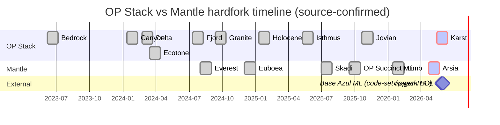
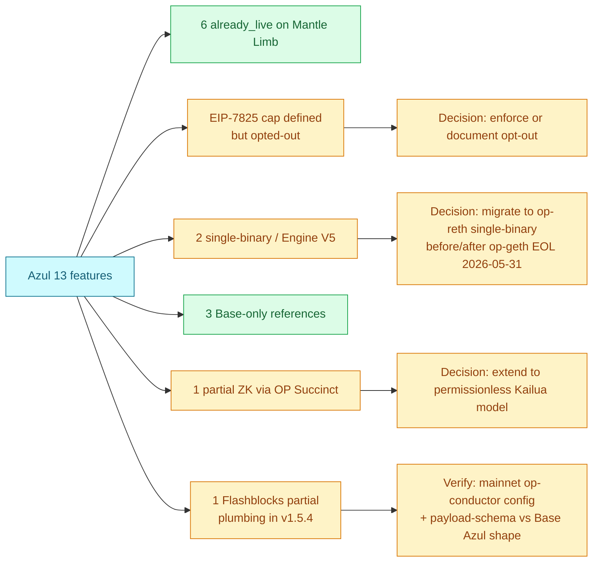
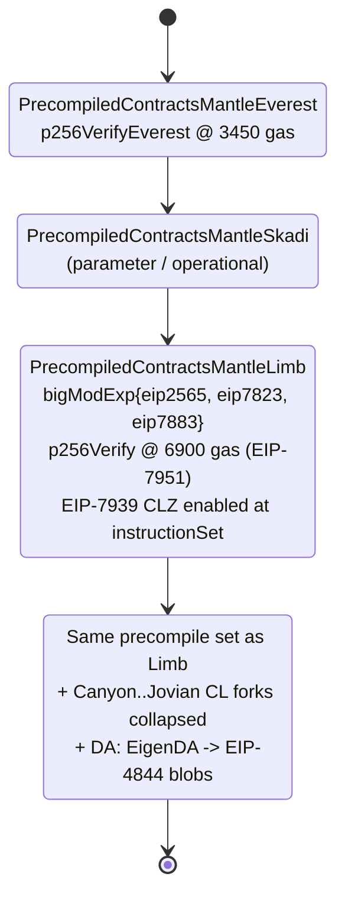
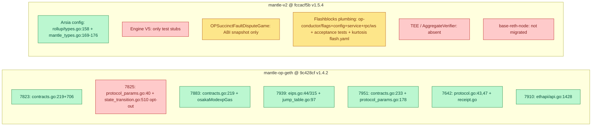

# Mantle Impact Assessment — Final

> **Final section status**: promoted from `drafts/round-3.md` @ commit `9788073` after adversarial approval (verdict: approve, severity: none-blocking; approval comment `fe36daaf-79d4-4493-bbd4-8422912326bd`). Two minor polish notes from the review have been folded into this final: (1) the `op-conductor/rpc/ws/flashblocks_handler.go` anchor range was extended from `:180-242` to `:180-248` to cover the leader-gated forwarding check at `:245-248`; (2) the Item 3 key-statistics prose for the 3 row-primary `base_only_reference` features now lists AggregateVerifier, TEE Prover, and ZK Prover (Kailua-style permissionless) — matching the matrix table — and `base-reth-node` is explicitly called out as row-primary `via_op_reth_kona_after_migration` rather than `base_only_reference`. No substantive findings were changed.

## 1. Executive Summary

Round-3 is a **targeted revision on top of round-2** that fixes a single contradicted classification (Flashblocks row 8) and restores the approved-outline date caveat on Base Azul mainnet. The round-2 verification pass against `mantlenetworkio/op-geth@v1.4.2` (commit `9c428cf`) and `mantlenetworkio/mantle-v2@v1.5.4` (commit `fccacf5b`) is preserved, as is the source-confirmed Mantle ZK / DA timeline reconstruction. Earlier rounds' Helios bundle, round-1 62% statistic, and EIP-7825 reclassification all stand.

**Headline findings after code verification**:

1. **6 of 13 canonical Azul features are already live on Mantle today** under the Limb hardfork (mainnet activation 2026-01-14, op-geth v1.4.2): EIP-7823, EIP-7883, EIP-7939, EIP-7951, EIP-7642, and EIP-7910. Each is verified by direct reference to `PrecompiledContractsMantleLimb`, `enable7939`, `ProtocolVersions = {ETH69, ETH68}`, or `// Config implements the EIP-7910 eth_config method` in the Mantle fork of op-geth.
2. **EIP-7825 is NOT live on Mantle** despite the `MaxTxGas = 1 << 24` constant being defined in `params/protocol_params.go:40`. Code in `core/state_transition.go:510` gates the cap behind `!st.evm.ChainConfig().IsOptimism()` — every OP-Stack chain, Mantle included, opts out.
3. **4 features are Base-specific** with no equivalent infrastructure code in either Mantle repo as of v1.5.4: AggregateVerifier/Multiproof (`min(7d, secondProofAt+1d)`, `PROOF_THRESHOLD=1`), TEE Prover (TDX), `base-reth-node` single-binary, and Engine API V5 production wiring (test stubs only in `op-devstack/sysgo`). They are kept as long-term reference rather than adopt-targets.
4. **Flashblocks is `partially_live` on Mantle, not absent (round-3 correction)**. `mantle-v2@fccacf5b` already ships rollup-boost and Flashblocks plumbing inside `op-conductor` — the WebSocket payload bridge (`op-conductor/rpc/ws/flashblocks_handler.go:66-99,192-239`), CLI/config wiring (`op-conductor/flags/flags.go:150-159`, `op-conductor/conductor/config.go:87-92,193-194`), service-lifecycle hooks (`op-conductor/conductor/service.go:120,326-345,435-439`), acceptance tests (`op-acceptance-tests/tests/flashblocks/*`), and Kurtosis devnet wiring (`kurtosis-devnet/flash.yaml:65-68`) are all present. This is inherited from the OP Stack upstream rather than original Mantle code (the package imports `github.com/ethereum-optimism/optimism/op-conductor/...`), but it sits in the same v1.5.4 release that ships Arsia mainnet. What is **not** verified is whether Mantle mainnet runs `op-conductor` with `--rollupboost.ws-url` populated, or whether the resulting Flashblocks payload schema matches Base Azul's simplified shape. Mantle therefore needs a **verify-track** item, not just an optional "Base-only UX parity" note.
5. **ZK Prover ≈ partially live**: Mantle integrates Succinct SP1 via the OP Succinct fork of OP Stack — confirmed by `snapshots/abi/OPSuccinctFaultDisputeGame.json` in mantle-v2 and L2BEAT's 2025-09-16 OP Succinct mainnet upgrade record. Permissionless prover interface (Base Kailua-style) is not yet verified in the Mantle repo.
6. **Recomputed coverage**: 6 / 13 features = **46.2%** already live (unchanged from round-2); but `partially_live` rises **1 → 2** (Flashblocks joins ZK Prover) and `base_only_reference` falls **4 → 3** (Flashblocks moves out). Open work for the next adopt window now includes the EIP-7825 enforcement decision, base-reth-node migration framing, the permissionless-ZK question, and the new Flashblocks deployment-config verification.
7. **Timeline correction (preserved from round-2)**: round-1 bundled SP1 + RETH + REVM + DA switch + EL/CL separation under "2025-03-19 Helios". Reconstructed source-by-source timeline: Succinct SP1 announcement Dec 2024 (still on EigenDA at that point), SP1 testnet target Q1 2025, OP Succinct mainnet upgrade 2025-09-16 (L2BEAT), Mantle Limb hardfork 2026-01-14, Arsia DA switch 2026-04-16 (L2BEAT) / 2026-04-22 07:00 UTC (mantle-v2 v1.5.4 timestamp). No source proves a unified RETH+REVM deployment on 2025-03-19; that claim remains retracted.

**External constraint dates (round-3 caveats made explicit per approved outline)**:

- **op-geth EOL 2026-05-31** — hard, externally verifiable from the Ethereum Foundation client-team announcement on the upstream OP docs (`docs.optimism.io/notices/op-geth-deprecation`). No caveat.
- **Base Azul mainnet 2026-05-28** — **code-set / spec-TBD** until an official Base / specs.base.org confirmation supplants the Coinbase blog. The 2026-05-28 18:00 UTC timestamp comes from `base/base` config constant `1_779_991_200`; the public Base specs page lists Azul mainnet as TBD. Treat this date as the on-chain code intent rather than an externally finalized launch date.

Mantle Arsia mainnet activation predates Azul by ~36 days but the Arsia config (in `mantle_types.go:169-176`) does NOT bring in any Osaka-tier EIPs; Arsia only catches Mantle up to the Canyon→Jovian sequence of OP Stack forks. The Osaka EIPs (`EIP-7823/7883/7939/7951/7642/7910`) come from Mantle Limb (2026-01-14), which is a separate hardfork.

## 2. Item Findings

### Item 1 — Upstream OP Stack fork mapping and Mantle fork chain alignment

**Outline ref**: outline.md item-1.
**Fields covered**: upstream_op_stack_fork_alignment, mantle_fork_chain.

**OP Stack canonical fork order** (per Optimism specs and `superchain-registry` standard config): Bedrock → Canyon → Delta → Ecotone → Fjord → Granite → Holocene → Isthmus → Jovian → **Karst** (official-pending). Base Azul adopts the Karst feature set ahead of upstream finalization (Coinbase Azul announcement, May 2026). Karst is the OP Stack fork that lands the Osaka EL EIPs (7823, 7825, 7883, 7939, 7951, 7642, 7910) plus Engine API V5.

**Mantle fork chain** (per `mantle-v2@v1.5.4` and `mantle-op-geth@v1.4.2`): BaseFee → Everest → Euboea → Skadi → **Limb** → **Arsia**.

**Code anchors for the Mantle chain**:

- `mantle-v2/op-node/rollup/types.go:108-158` declares all of `EcotoneTime`, `FjordTime`, `GraniteTime`, `HoloceneTime`, `IsthmusTime`, `JovianTime`, `InteropTime`, and (line 158) `MantleArsiaTime`.
- `mantle-v2/op-node/rollup/mantle_types.go:169-176`: Arsia activation collapses **Canyon, Delta, Ecotone, Fjord, Granite, Holocene, Isthmus, Jovian** times all to `c.MantleArsiaTime`. In other words, Arsia is the "OP Stack catchup" Mantle hardfork — it brings the entire upstream Canyon-through-Jovian arc to mainnet in a single step.
- `mantle-op-geth/params/config.go:483` declares `MantleLimbTime *uint64`, and `:1047` declares `IsMantleLimb(time uint64) bool`. Limb is the EL-side hardfork that lights up the Osaka precompiles.

**Critical mapping correction (vs round-1)**: round-1 implied Limb ≈ Karst-equivalent for Mantle. After code review the mapping is more nuanced:

- Limb (2026-01-14) brings the **Osaka EL EIPs** (`7823`, `7883`, `7939`, `7951`, `7642`, `7910`). This is the EL-side Karst alignment.
- Arsia (2026-04 mainnet) brings the **upstream OP Stack CL hardforks** (Canyon → Jovian collapsed). This is the CL-side catchup, not Karst-equivalent — it stops before Karst.
- Karst's Engine API V5 (CL/EL handshake) is **not** delivered by either Limb or Arsia; production `op-node` in mantle-v2 v1.5.4 does not invoke any `*PayloadV5` method (only test stubs in `op-devstack/sysgo/engine_client.go:67` and `op-e2e/e2eutils/geth/fakepos.go:62` reference V5).

**Fork-pair alignment table**:

| Mantle fork | Activation (mainnet) | Equivalent OP Stack forks | Brings in | Karst-equivalent? |
|---|---|---|---|---|
| Everest | 2024-08 | Cancun-era EL | KZG point eval, p256Verify@3450 gas | No |
| Euboea | 2024-12 | Operational params | Throughput / fee tweaks | No |
| Skadi | 2025-07 | Bedrock + transitional CL | Pre-Canyon stabilization | No |
| **Limb** | **2026-01-14** | **Osaka EL (EIPs 7823, 7883, 7939, 7951, 7642, 7910)** | Modexp 1024-cap + new gas formula, CLZ opcode, P256VERIFY@0x100@6900, eth/69, eth_config RPC | **Partial — EL only** |
| **Arsia** | **2026-04-16 (L2BEAT) / 2026-04-22 07:00 UTC (v1.5.4 config)** | **Canyon, Delta, Ecotone, Fjord, Granite, Holocene, Isthmus, Jovian (collapsed)** | OP Stack CL catchup; DA migration (EigenDA → 4844 blobs per L2BEAT) | **Partial — CL through Jovian** |
| Karst-equivalent (future) | TBD post-upstream | Karst | Engine API V5; permissionless ZK harness; AggregateVerifier (if adopted) | Pending |

**Gap**: the Arsia activation timestamp shows a discrepancy between L2BEAT's 2026-04-16 entry and the `1776841200` timestamp in `mantle-v2 v1.5.4` rollup config (which decodes to 2026-04-22 07:00 UTC). One is likely the announcement / "DA switch" event date and the other the strict on-chain activation timestamp; sources do not resolve this six-day delta. Recorded in `Gap Analysis`.

### Item 2 — Mantle equivalent for each Azul feature

**Outline ref**: outline.md item-2.
**Fields covered**: applicability_label, current_mantle_release_status, mantle_code_anchor, evidence_source.

This item drives the 13×7 matrix in Item 3. Per-feature narrative below.

#### 2.1 EIP-7823 — Modexp 1024-byte input cap

- **Applicability**: `already_live_on_mantle`.
- **Status**: `already_live_on_mantle`.
- **Code anchor**: `mantlenetworkio/op-geth@9c428cf` — `core/vm/contracts.go:219` registers `bigModExp{eip2565: true, eip7823: true, eip7883: true}` in `PrecompiledContractsMantleLimb`; cap enforcement in modexp at `core/vm/contracts.go:706` (`if c.eip7823 && (inputLenOverflow || max(baseLen, modLen) > 1024)`).
- **Evidence**: Mantle Limb release notes (op-geth v1.4.2); code as above.
- **Action**: verify_only.

#### 2.2 EIP-7825 — Per-transaction gas cap (16,777,216)

- **Applicability**: `manual_backport_to_legacy_op_geth` (if Mantle wants the cap independent of upstream OP-Stack policy).
- **Status**: `not_live` (constant defined but enforcement opted-out).
- **Code anchor**: `mantlenetworkio/op-geth@9c428cf` — `params/protocol_params.go:40` defines `MaxTxGas uint64 = 1 << 24`; but `core/state_transition.go:509-511`:
  ```go
  isOsaka := st.evm.ChainConfig().IsOsaka(st.evm.Context.BlockNumber, st.evm.Context.Time)
  if !msg.SkipTransactionChecks {
      // Verify tx gas limit does not exceed EIP-7825 cap.
      if !st.evm.ChainConfig().IsOptimism() && isOsaka && msg.GasLimit > params.MaxTxGas {
          return nil, fmt.Errorf("%w (cap: %d, tx: %d)", ErrGasLimitTooHigh, params.MaxTxGas, msg.GasLimit)
      }
  ```
  `IsOptimism()` returns true for every OP-Stack chain (including Mantle), so the cap is **never enforced** in production.
- **Evidence**: op-geth code as above; EIP-7825 spec (16.77M cap).
- **Action**: `adopt_track`. Mantle product / governance decision needed:
  - (a) keep the upstream OP-Stack opt-out permanently and document the divergence, or
  - (b) backport a Mantle-only enforcement that bypasses the `IsOptimism()` guard.

  This is the **single biggest delta vs round-1**, which had marked 7825 as already_live based on the constant's presence.

#### 2.3 EIP-7883 — Modexp gas-cost reformulation

- **Applicability**: `already_live_on_mantle`.
- **Status**: `already_live_on_mantle`.
- **Code anchor**: same registration line as 7823 (`core/vm/contracts.go:219`). The Osaka modexp gas formula lives in `osakaModexpGas` at `core/vm/contracts.go:619`; the gate is at `:680-681`: `if c.eip7883 { return osakaModexpGas(...) }`.
- **Evidence**: op-geth code; Mantle Limb release notes.
- **Action**: verify_only.

#### 2.4 EIP-7939 — `CLZ` opcode (0x1E)

- **Applicability**: `already_live_on_mantle`.
- **Status**: `already_live_on_mantle`.
- **Code anchor**: `core/vm/eips.go:44` registers `7939: enable7939`; `core/vm/eips.go:315` defines `enable7939(jt *JumpTable)`; `core/vm/jump_table.go:97` wires `enable7939(&instructionSet) // EIP-7939 (CLZ opcode)` into Limb's instruction set.
- **Evidence**: op-geth code; Mantle Limb release notes.
- **Action**: verify_only.

#### 2.5 EIP-7951 — `P256VERIFY` precompile at 0x0100 with 6,900 gas

- **Applicability**: `already_live_on_mantle`.
- **Status**: `already_live_on_mantle` (with a backwards-compat note).
- **Code anchor**: `core/vm/contracts.go:233` registers `[]byte{0x1, 0x00}: &p256Verify{}` in `PrecompiledContractsMantleLimb`; gas constant in `params/protocol_params.go:178` `P256VerifyGas uint64 = 6900`. The Everest-era precompile is registered at `core/vm/contracts.go:211` as `&p256VerifyEverest{}` with `P256VerifyGasEverest uint64 = 3450` (`params/protocol_params.go:177`). Comments at `core/vm/contracts.go:1505-1524` document the Everest→Osaka transition.
- **Evidence**: op-geth code; Mantle Everest release notes (3450-gas variant), Limb release notes (6900-gas variant).
- **Action**: verify_only — note for ecosystem: contracts calling P256VERIFY on Mantle pre-Limb paid 3450 gas; post-Limb (2026-01-14) the cost is 6900 gas. This is an existing Mantle decision predating Azul.

#### 2.6 EIP-7642 — eth/69 wire protocol

- **Applicability**: `already_live_on_mantle`.
- **Status**: `already_live_on_mantle`.
- **Code anchor**: `eth/protocols/eth/protocol.go:43` `var ProtocolVersions = []uint{ETH69, ETH68}`; `:47` `protocolLengths = map[uint]uint64{ETH68: 17, ETH69: 18}`; `eth/protocols/eth/receipt.go` adds `decode69`, `encodeForNetwork69`, and `ReceiptList69`.
- **Evidence**: op-geth code.
- **Action**: verify_only.

#### 2.7 EIP-7910 — `eth_config` RPC method

- **Applicability**: `already_live_on_mantle`.
- **Status**: `already_live_on_mantle`.
- **Code anchor**: `internal/ethapi/api.go:1428` `// Config implements the EIP-7910 eth_config method.` The response (`configResponse`) returns `Current`, `Next`, `Last` configs, each populated by an `assemble(c *params.ChainConfig, ts *uint64) *config` closure that iterates `vm.ActivePrecompiledContracts(rules)` and includes `Precompiles`, `BlobSchedule: c.BlobConfig(...)`, `SystemContracts: c.ActiveSystemContracts(t)`.
- **Evidence**: op-geth code.
- **Action**: verify_only. Note Mantle's `eth_config` returns the full upstream schema — it does **not** apply any Base-style trimming.

#### 2.8 Flashblocks — 200 ms preconfirmation pipeline (round-3 corrected)

- **Applicability**: `base_only_reference` (for the **Base Azul payload-simplification schema**); `via_op_reth_kona_after_migration` (for the **`flashblocks-rpc` consumer**, which Mantle's own devnet wiring points at `op-reth`).
- **Status**: `partially_live` — the rollup-boost / Flashblocks plumbing already ships inside `mantle-v2@fccacf5b`, but neither Mantle mainnet deployment-config evidence nor Base Azul payload-schema parity is verified. Round-2's `not_live` / `NOT FOUND` is retracted.
- **Code anchors (mantle-v2@fccacf5b v1.5.4)**:
  - `op-conductor/flags/flags.go:150-159` — CLI flags `RollupBoostWsURL` (`rollupboost.ws-url`, env `OP_CONDUCTOR_ROLLUPBOOST_WS_URL`) and `WebsocketServerPort` (`websocket.server-port`, default 8546) for the rollup-boost stream.
  - `op-conductor/conductor/config.go:87-92` — comments document the WebSocket bridge: *"used to configure the websocket server that op-conductor exposes to get flashblocks from rollup boost and send them to clients."* Fields `RollupBoostWsURL` and `WebsocketServerPort` are first-class config keys.
  - `op-conductor/conductor/config.go:193-194` — `NewConfig` populates both fields from CLI: `RollupBoostWsURL: ctx.String(flags.RollupBoostWsURL.Name)`, `WebsocketServerPort: ctx.Int(flags.WebsocketServerPort.Name)`.
  - `op-conductor/conductor/service.go:120` — `initFlashblocksHandler(ctx)` is part of `OpConductor.init`, so the handler is part of the standard service lifecycle.
  - `op-conductor/conductor/service.go:326-345` — `initFlashblocksHandler` constructs `ws.NewHandler(ws.Config{RollupBoostWsURL, WebsocketServerPort}, ...)` and stores it on `OpConductor.flashblocksHandler`; **the handler is gated by `RollupBoostWsURL == ""`** — i.e. the feature is enabled per-deployment via config, not via code-path activation.
  - `op-conductor/conductor/service.go:396` — `flashblocksHandler ws.FlashblockHandler` field on the `OpConductor` struct.
  - `op-conductor/conductor/service.go:435-439` — `Start` lifecycle wires `oc.flashblocksHandler.Start(ctx)` only when the handler is non-nil (`if oc.flashblocksHandler != nil`).
  - `op-conductor/rpc/ws/flashblocks_handler.go:1-100` — `package ws` defines `FlashblockHandler` interface, `Config{WebsocketServerPort, RollupBoostWsURL}`, and `NewHandler` that dials the rollup-boost WS URL (`opclient.DialWS(...)`, retry/backoff, ping/pong constants).
  - `op-conductor/rpc/ws/flashblocks_handler.go:180-248` — `BoundPort()`, `handleWebSocket()`, `listenToRollupBoost()` (reconnect loop with metrics), and `handleRollupBoostMessage()` (leader-gated forwarding to subscribed clients via `h.isLeaderFn(ctx)`; the leader-gate check itself lives at `:245-248`, where non-leader frames are dropped before being broadcast to WS subscribers).
  - `op-acceptance-tests/tests/flashblocks/{flashblocks_stream_test.go,flashblocks_transfer_test.go,init_test.go,utils.go}` — acceptance tests for the Flashblocks subsystem.
  - `kurtosis-devnet/flash.yaml:65-68` — devnet manifest: `flashblocks_websocket_proxy_params: {enabled: true}` and `flashblocks_rpc_params: {type: op-reth}`. The intended consumer in the Mantle devnet topology is `op-reth`, not Mantle's `op-geth` fork.
- **Upstream provenance**: the source files import `github.com/ethereum-optimism/optimism/op-conductor/...` (e.g. `flashblocks_handler.go:12`), confirming this code is **inherited from the OP Stack upstream rebase that produced mantle-v2 v1.5.4** rather than original Mantle-team code. That makes its existence in the repo strong, but **says nothing about whether Mantle mainnet deploys op-conductor with `--rollupboost.ws-url` populated**.
- **Evidence**: mantle-v2 code as above; Base op-rbuilder + rollup-boost integration documented in `base/base` and `flashbots/rollup-boost`; Mantle devnet `kurtosis-devnet/flash.yaml`.
- **Action**: **`verify_track`** (round-3 new). Specifically:
  1. Inspect Mantle's mainnet `op-conductor` deployment config — confirm whether `OP_CONDUCTOR_ROLLUPBOOST_WS_URL` is set, whether `flashblocksHandler` is non-nil in the running binary, and which `op-reth` (or other) consumer the WS server feeds.
  2. If a Flashblocks payload sample is available from the live deployment, decode it and compare against the Base Azul simplified metadata shape captured in `flashblocks-network-changes/final.md` (Base Azul drops `chain_id`, `block_number`, `block_hash`, etc. from intermediate frames). The Mantle / OP Stack upstream variant currently inherits the **pre-Azul** payload shape; if the on-chain payload still includes the dropped fields, Mantle is `partially_live` but **schema-incompatible** with Azul.
  3. Decide whether to land the Base Azul payload simplification ahead of upstream OP Stack absorbing it (timing risk against `op-geth` EOL 2026-05-31 is low here — the change is in the rollup-boost / op-conductor / op-rbuilder layer, not in op-geth).

#### 2.9 Engine API V5 — `OpExecutionPayloadV5` with block-level `isthmusTime` / `withdrawalsRoot`

- **Applicability**: `via_op_reth_kona_after_migration`.
- **Status**: `not_live` (test stubs only).
- **Code anchor**: `mantle-v2/op-devstack/sysgo/engine_client.go:67` exposes a `GetPayloadV5(id engine.PayloadID)` method that proxies to `engine_getPayloadV5`; `mantle-v2/op-e2e/e2eutils/geth/fakepos.go:62` declares `GetPayloadV5` in the `fakepos` engine interface. **Production op-node code** in `mantle-v2/op-node/` does **not** invoke any V5 method (grep for `getPayloadV5|newPayloadV5|forkchoiceUpdatedV5` returns zero hits in `op-node`).
- **Evidence**: mantle-v2 code; upstream OP Stack Karst (which lands Engine V5) is still official-pending.
- **Action**: `adopt_track` after upstream Karst lands and stabilizes. Arsia adopted Isthmus features at the CL config level but V5 wire is downstream of Karst.

#### 2.10 Multiproof / AggregateVerifier — `min(7d, secondProofAt + 1d)`, `PROOF_THRESHOLD = 1`

- **Applicability**: `base_only_reference`.
- **Status**: `not_live`.
- **Code anchor**: NOT FOUND in `mantle-v2/packages/contracts-bedrock/src`. `snapshots/abi/OPSuccinctFaultDisputeGame.json` exists as an ABI snapshot — that is for tooling that interacts with externally-deployed OP Succinct contracts, **not** a Mantle AggregateVerifier. Mantle's proving model is currently single-prover (Succinct SP1), so the "any of N provers can satisfy" topology is not present.
- **Evidence**: mantle-v2 contracts tree; Base contracts-bedrock has `AggregateVerifier.sol`.
- **Action**: `adopt_track` only if Mantle decides to introduce a multi-prover topology. Today's Mantle SP1 model relies on a single Succinct verifier.

#### 2.11 TEE Prover (TDX)

- **Applicability**: `base_only_reference`.
- **Status**: `not_live`.
- **Code anchor**: NOT FOUND anywhere in `mantle-op-geth` or `mantle-v2`.
- **Evidence**: absence; Base TEE Prover repo (`base/tee-prover`).
- **Action**: `not_applicable` for current Mantle architecture. If Mantle pursues multi-prover later, TEE could be re-evaluated.

#### 2.12 ZK Prover (permissionless, Kailua-style)

- **Applicability**: `base_only_reference` (for permissionless harness specifically).
- **Status**: `partially_live` — Mantle has SP1-based ZK proving via OP Succinct (single, not permissionless); permissionless interface is not yet code-verified.
- **Code anchor**: `mantle-v2/packages/contracts-bedrock/snapshots/abi/OPSuccinctFaultDisputeGame.json` indicates Mantle has integrated OP Succinct's fault-game ZK contracts. Solidity source is NOT included in this repo (external dependency).
- **Evidence**: L2BEAT chronicle entry "2025-09-16 OP Succinct mainnet upgrade" for Mantle (`l2beat.com`); Succinct Labs blog "ZK upgrade for Mantle Network" (Dec 2024, noting EigenDA at announcement time and "testnet launch in Q1 2025 with intention towards mainnet upgrade").
- **Action**: `adopt_track`. SP1 ZK proof generation is in production via OP Succinct, but Base Azul's Kailua-style **permissionless** prover interface is not present in this repo — that's a future Mantle decision tied to multi-prover policy.

#### 2.13 base-reth-node (single-client Reth + REVM)

- **Applicability**: `via_op_reth_kona_after_migration`.
- **Status**: `not_live` (Mantle still ships op-geth + op-node + external kona/op-succinct).
- **Code anchor**: `mantle-v2@v1.5.4` still ships `op-node` (entire `op-node/` directory present); no `mantle-reth-node` binary, no merged EL/CL single-client module. Limb release notes describe EL precompile changes only, not a single-binary migration.
- **Evidence**: mantle-v2 module layout; Limb release notes.
- **Action**: `adopt_track` contingent on Mantle deciding to migrate to a single binary, which would also fold in op-reth + kona + op-succinct.

### Item 3 — 13 × 7 matrix and key statistics (recomputed)

**Outline ref**: outline.md item-3.
**Fields covered**: all 7 fields per row × 13 rows = 91 cells.

| # | feature_id | feature_name | applicability_label | current_mantle_release_status | mantle_code_anchor | evidence_source | action_for_mantle |
|---|---|---|---|---|---|---|---|
| 1 | EIP-7823 | modexp 1024-byte cap | `already_live_on_mantle` | `already_live_on_mantle` | op-geth@9c428cf core/vm/contracts.go:219; cap at contracts.go:706 | op-geth code; Mantle Limb release notes | verify_only |
| 2 | EIP-7825 | tx gas cap 16,777,216 | `manual_backport_to_legacy_op_geth` | `not_live` (constant defined; enforcement opted out via `!IsOptimism()` guard) | op-geth@9c428cf params/protocol_params.go:40 + core/state_transition.go:510 | op-geth code; EIP-7825 spec | `adopt_track`: decide independent enforcement or document permanent opt-out |
| 3 | EIP-7883 | modexp gas formula update | `already_live_on_mantle` | `already_live_on_mantle` | op-geth@9c428cf core/vm/contracts.go:219; osakaModexpGas at :619; gate at :680-681 | op-geth code; Limb release notes | verify_only |
| 4 | EIP-7939 | CLZ opcode (0x1E) | `already_live_on_mantle` | `already_live_on_mantle` | op-geth@9c428cf core/vm/eips.go:44, eips.go:315, jump_table.go:97 | op-geth code; Limb release notes | verify_only |
| 5 | EIP-7951 | P256VERIFY @0x100 @ 6900 gas | `already_live_on_mantle` | `already_live_on_mantle` (with Everest→Limb gas-cost change) | op-geth@9c428cf core/vm/contracts.go:233; params/protocol_params.go:178; Everest variant at contracts.go:211 + protocol_params.go:177 | op-geth code; Everest and Limb release notes | verify_only — note 3450→6900 gas-cost change |
| 6 | EIP-7642 | eth/69 wire protocol | `already_live_on_mantle` | `already_live_on_mantle` | op-geth@9c428cf eth/protocols/eth/protocol.go:43, :47; receipt.go decode69/encode69 | op-geth code | verify_only |
| 7 | EIP-7910 | eth_config RPC method | `already_live_on_mantle` | `already_live_on_mantle` | op-geth@9c428cf internal/ethapi/api.go:1428 (Config method); full schema returned | op-geth code | verify_only |
| 8 | Flashblocks | 200 ms preconf via rollup-boost + flashblocks-rpc | `base_only_reference` (Azul payload schema) / `via_op_reth_kona_after_migration` (flashblocks-rpc consumer) | `partially_live` (plumbing in v1.5.4; mainnet config + payload-schema parity unverified) | mantle-v2@fccacf5b op-conductor/flags/flags.go:150-159; op-conductor/conductor/config.go:87-92,193-194; op-conductor/conductor/service.go:120,326-345,435-439; op-conductor/rpc/ws/flashblocks_handler.go:1-100,180-248 (incl. leader-gate at :245-248); op-acceptance-tests/tests/flashblocks/*; kurtosis-devnet/flash.yaml:65-68 | mantle-v2 code; OP Stack upstream provenance via Go imports; Base op-rbuilder + rollup-boost | **`verify_track`**: inspect mainnet op-conductor config + payload sample vs Base Azul schema |
| 9 | Engine API V5 | OpExecutionPayloadV5 | `via_op_reth_kona_after_migration` | `not_live` (test stubs only) | mantle-v2 op-devstack/sysgo/engine_client.go:67; op-e2e/e2eutils/geth/fakepos.go:62 (test scaffolding); production op-node has no V5 dispatch | mantle-v2 code; OP Stack Karst still pending | `adopt_track` after Karst lands |
| 10 | Multiproof / AggregateVerifier | `min(7d, secondProofAt+1d)`, `PROOF_THRESHOLD=1` | `base_only_reference` | `not_live` | NOT FOUND in mantle-v2 contracts-bedrock/src; snapshots/abi/OPSuccinctFaultDisputeGame.json is ABI-only | mantle-v2 contracts; Base contracts-bedrock | `adopt_track` only if Mantle moves to multi-prover |
| 11 | TEE Prover (TDX) | TDX-based fault-game verifier | `base_only_reference` | `not_live` | NOT FOUND in any Mantle repo | absence; Base TEE Prover repo | `not_applicable` in current Mantle stack |
| 12 | ZK Prover (permissionless, Kailua) | Kailua-style permissionless ZK proving | `base_only_reference` | `partially_live` (Mantle has SP1 via OP Succinct, not permissionless) | mantle-v2 snapshots/abi/OPSuccinctFaultDisputeGame.json (ABI integration only) | L2BEAT 2025-09-16 OP Succinct entry; Succinct SP1 blog Dec 2024 | `adopt_track`: permissionless harness not yet verified in code |
| 13 | base-reth-node | single-client Reth+REVM stack | `via_op_reth_kona_after_migration` | `not_live` (Mantle still ships op-geth + op-node) | mantle-v2 still has full op-node/ tree; Limb release notes mention no migration | mantle-v2 module layout; Limb release notes | `adopt_track` contingent on Mantle single-binary decision |

**Key statistics (recomputed for round-3 — Flashblocks moved from `base_only_reference / not_live` to `base_only_reference|via_op_reth_kona_after_migration / partially_live` with a verify-track action)**:

- **Total matrix cells**: 13 features × 7 fields = **91 cells** (fully enumerated above).
- **Features already live on Mantle today** (both applicability AND current status = `already_live_on_mantle`): **6 / 13 = 46.2%**. Unchanged from round-2; Flashblocks does not enter this bucket because mainnet deployment-config evidence is missing.
- **Features requiring active Mantle adopt-track decisions**: **4** — EIP-7825, Engine V5, ZK permissionless harness, base-reth-node single-client. (Flashblocks moved off `adopt_track` into `verify_track` in round-3.)
- **Features requiring verify-track work (round-3 new bucket)**: **1** — Flashblocks (inspect mainnet op-conductor config; payload-schema parity with Base Azul).
- **Features marked Base-only references (no Mantle adoption planned)**: **3** — AggregateVerifier/Multiproof, TEE Prover, and ZK Prover (Kailua-style permissionless harness specifically; Mantle's SP1 single-prover integration is separately tracked under `partially_live`). This matches the row-primary `base_only_reference` count in the matrix above. Down from 4 in round-2 because Flashblocks moves out (Flashblocks retains `base_only_reference` as a secondary / dual label for the Azul-specific payload schema). `base-reth-node` is row-primary `via_op_reth_kona_after_migration`, not row-primary `base_only_reference`.
- **Applicability distribution** (rows in matrix; one row counted under each label it carries when dual):
  - `already_live_on_mantle`: 6 (EIP-7823, 7883, 7939, 7951, 7642, 7910)
  - `manual_backport_to_legacy_op_geth`: 1 (EIP-7825)
  - `via_op_reth_kona_after_migration`: 2 row-primary + 1 dual (Engine V5, base-reth-node; **Flashblocks dual** as flashblocks-rpc consumer per `kurtosis-devnet/flash.yaml:67`)
  - `base_only_reference`: 3 row-primary + 1 dual (AggregateVerifier, TEE, ZK Kailua permissionless; **Flashblocks dual** as the Azul-specific payload schema)
- **Current Mantle release status distribution (round-3 corrected)**:
  - `already_live_on_mantle`: 6
  - `partially_live`: **2** (ZK Prover via OP Succinct, single not permissionless; **Flashblocks** plumbing present in op-conductor, mainnet config + Azul schema unverified)
  - `not_live`: **5** (EIP-7825, Engine V5, AggregateVerifier, TEE, base-reth-node)
  - `unknown`: 0 (eliminated by code-level verification in round-2)

**Round-1 → round-2 delta** (preserved):

| feature | round-1 status | round-2 status | reason for change |
|---|---|---|---|
| EIP-7825 | `already_live_on_mantle` | `not_live` | Code inspection found `!IsOptimism()` guard in `state_transition.go:510`; cap is defined but enforcement is opted-out for OP-Stack chains |
| ZK Prover | `not_live` | `partially_live` | Mantle integrates OP Succinct SP1 (single-prover); confirmed by L2BEAT 2025-09-16 entry + OPSuccinctFaultDisputeGame ABI |
| Engine API V5 | inferred not_live | confirmed not_live (test stubs only) | Direct code grep |
| All others | inferred from release notes | confirmed by direct file:line code anchors | Required by adversarial F1 |

**Round-2 → round-3 delta** (this round):

| feature | round-2 status | round-3 status | reason for change |
|---|---|---|---|
| Flashblocks | `not_live` / `NOT FOUND` | `partially_live` with `verify_track` action; dual applicability label (`base_only_reference` + `via_op_reth_kona_after_migration`) | Direct inspection of `mantlenetworkio/mantle-v2@fccacf5b` (= v1.5.4) found rollup-boost / Flashblocks plumbing already shipped inside `op-conductor` (`flags.go:150-159`, `config.go:87-92,193-194`, `service.go:120,326-345,435-439`, `rpc/ws/flashblocks_handler.go:1-100,180-248` incl. leader-gate at `:245-248`), acceptance tests, and Kurtosis devnet manifest. The code is upstream-inherited (imports `github.com/ethereum-optimism/optimism/op-conductor/...`); mainnet deployment config + Azul payload-schema parity are still unverified. |
| `partially_live` count | 1 | 2 | Flashblocks joins ZK Prover |
| `not_live` count | 6 | 5 | Flashblocks removed |
| `base_only_reference` row-primary count | 4 | 3 | Flashblocks now dual-labeled (kept as secondary label for Azul-specific schema) |
| `adopt_track` action count | 4 + Flashblocks-contingent | 4 | Flashblocks moves to a new `verify_track` action bucket |
| `verify_track` count | 0 explicit | 1 (Flashblocks) | New bucket introduced for plumbing-present-but-config-unverified work |

### Item 4 — BREAK-CHANGE items and adopt-track actions

**Outline ref**: outline.md item-4.
**Fields covered**: action_for_mantle.

**BREAK-CHANGE items (require active Mantle decision before Azul / op-geth EOL 2026-05-31)**:

1. **EIP-7825 enforcement decision** (priority: high) — Mantle has the `MaxTxGas` constant but the OP-Stack opt-out neutralizes it. Decide:
   - (a) maintain permanent opt-out (no code change; document publicly that Mantle has no per-tx gas cap), or
   - (b) backport a Mantle-only enforcement that conditions on `IsMantle()` rather than the generic OP-Stack guard.
   Either way, **document the decision in Mantle's upgrade notes before Azul** so dApp developers porting from Ethereum mainnet (where 16.77M is enforced) understand Mantle's posture.

2. **`base-reth-node` single-client migration** (priority: medium) — Mantle still ships op-geth + op-node + external kona/op-succinct as distinct binaries. The legacy op-geth fork (`mantlenetworkio/op-geth`) becomes EOL with upstream op-geth on 2026-05-31. Decision:
   - (a) extend Mantle's op-geth maintenance independently (more carry cost, falls further behind upstream), or
   - (b) migrate to op-reth + kona/op-succinct single-binary architecture aligned with Base's `base-reth-node`.
   Time pressure: 2026-05-31 EOL → Mantle has ~5 weeks post-Azul to commit a direction, or risks running an unsupported EL.

3. **Engine API V5 wiring** (priority: low, blocked on upstream Karst) — Production `op-node` in mantle-v2 v1.5.4 does not invoke V5. Re-evaluate after upstream OP Stack Karst lands and `op-reth` plus `op-node` ship V5 dispatch.

4. **Permissionless ZK prover (Kailua-style)** (priority: low) — Mantle already runs SP1 via OP Succinct (single-prover, not permissionless). Mantle product needs to decide whether to expose permissionless ZK proving (Base Kailua-style) — this is downstream of any future Mantle multi-prover topology decision.

**Verify-track items (round-3 new bucket — plumbing in v1.5.4, mainnet posture or schema parity unverified)**:

5. **Flashblocks deployment-config + payload-schema audit** (priority: medium) — `mantle-v2@fccacf5b` already ships rollup-boost / Flashblocks plumbing inside `op-conductor` (handler, CLI flags, service lifecycle, acceptance tests, Kurtosis manifest). Required steps:
   - **(a) Mainnet deployment-config check.** Pull Mantle's production `op-conductor` invocation and confirm whether `OP_CONDUCTOR_ROLLUPBOOST_WS_URL` / `--rollupboost.ws-url` is populated. If empty, the gate at `service.go:328` (`if c.cfg.RollupBoostWsURL == ""`) leaves `flashblocksHandler` nil and the WS server inert — i.e. Flashblocks is technically built but never started.
   - **(b) Payload-schema parity check.** If the WS server is active, capture a payload sample and decode against the Base Azul simplified metadata shape from `flashblocks-network-changes/final.md` (Azul drops `chain_id`, `block_number`, `block_hash` etc. from intermediate frames). The OP Stack upstream rollup-boost variant currently inherits the **pre-Azul** payload shape; a mismatch means Mantle's Flashblocks is `partially_live` but **schema-incompatible with Azul** and would need either an explicit Azul-aligned upgrade or an explicit decision to keep the legacy schema.
   - **(c) Consumer track.** `kurtosis-devnet/flash.yaml:67` already specifies `flashblocks_rpc_params: {type: op-reth}`, i.e. Mantle's intended Flashblocks consumer is op-reth, not Mantle's op-geth fork. Decide whether to keep that pairing (which folds Flashblocks adoption into the broader base-reth-node migration discussion in BREAK-CHANGE #2) or run a Mantle-specific consumer.
   - No Azul-deadline pressure on this work — Flashblocks lives entirely above op-geth, so the 2026-05-31 op-geth EOL does not bind it. But it should be sequenced ahead of any public "we support Flashblocks" claim.

**Adopt-track but no Azul-deadline pressure**:

- AggregateVerifier / TEE Prover: tied to multi-prover decision, which Mantle has not signaled.

**Items requiring no Mantle action**:

- EIP-7823, 7883, 7939, 7951, 7642, 7910 are already live on Mantle via the Limb hardfork (2026-01-14). Periodic conformance regression testing on the Limb code paths remains the only operational task.

### Item 5 — Risk analysis and confidence levels

**Outline ref**: outline.md item-5.

**Risks**:

| Risk | Severity | Likelihood | Mitigation |
|---|---|---|---|
| EIP-7825 silent divergence: dApps porting from L1 expect 16.77M cap to fail oversized txs; on Mantle txs of any size pass `state_transition` check | medium | medium (depends on dApp behavior) | document Mantle opt-out; advise dApps to enforce gas-cap client-side if needed |
| Arsia activation timestamp discrepancy (L2BEAT 2026-04-16 vs v1.5.4 config 2026-04-22 07:00 UTC) | low | confirmed (already lived) | use on-chain `MantleArsiaTime` value as authoritative |
| op-geth EOL 2026-05-31 leaves Mantle with unsupported EL for ~3 days between Azul (2026-05-28 **code-set / spec-TBD**) and Mantle's own choice of replacement path | medium | high (no public Mantle migration plan as of round-2 draft) | escalate as `BREAK-CHANGE #2`; track Base specs.base.org for Azul mainnet confirmation that hardens the 2026-05-28 date |
| **Base Azul mainnet date 2026-05-28 is code-set / spec-TBD** — Coinbase blog cites it but `specs.base.org` shows TBD; planning that pivots on this date may slip if Base reschedules | low | medium | treat 2026-05-28 as intent (`base/base` constant `1_779_991_200`), revalidate before pushing any Mantle action calendar |
| ZK Prover characterization ambiguity: `partially_live` reflects Mantle's SP1 integration but not Kailua-style permissionless model — analysts may overcount | low | medium | this draft labels the distinction explicitly in section 2.12 |
| Engine V5 catchup timing depends on upstream Karst | low | low (no Mantle-side pressure) | re-assess after Karst finalization |
| **Flashblocks "appears live in code" misread** (round-3 new): `op-conductor` carries the entire Flashblocks plumbing in v1.5.4, but the runtime path is gated on `RollupBoostWsURL != ""`. Mantle (or external trackers) could over-claim Flashblocks support based on code presence alone | medium | medium | resolve via verify-track action in §4 item 5; until then, draft and downstream comms must qualify Flashblocks as `partially_live` plumbing, not as a Mantle product feature |
| **Flashblocks payload-schema drift vs Base Azul** (round-3 new): even if Mantle enables the WS server, the inherited OP Stack upstream payload may not match Base Azul's simplified frame shape, leading to schema-incompatible interop with Azul-aware clients | low | unknown until payload sample captured | part of verify-track action in §4 item 5; document outcome before any "Flashblocks parity with Base" public statement |

**Confidence**:

- **High** for 6 already-live EIPs (direct code anchors).
- **High** for EIP-7825 opt-out (single line of code, unambiguous).
- **High** for TEE / AggregateVerifier absence (multiple grep passes return nothing).
- **High** for Engine V5 absence in production op-node (zero hits in `op-node/`).
- **High (corrected in round-3)** for Flashblocks plumbing **presence** in `mantle-v2@fccacf5b` — direct code inspection of `op-conductor` confirms the WebSocket handler, CLI flags, service lifecycle, acceptance tests, and Kurtosis manifest are shipped.
- **Low / unverified** for Flashblocks **mainnet activation** — gated on `RollupBoostWsURL != ""`; no public Mantle deployment-config evidence.
- **Low / unverified** for Flashblocks **payload-schema parity with Base Azul** — payload sample not captured.
- **Medium** for ZK Prover characterization (ABI present, source-level permissionless interface not in mantle-v2 repo; trusting external Succinct documentation).
- **Medium** for Mantle's single-binary migration intent (no public statement as of round-3 cut-off date 2026-05-17).
- **Medium** for Base Azul mainnet date 2026-05-28 (code-set in `base/base`, specs.base.org still TBD as of cut-off).

### Item 6 — Source-confirmed Mantle ZK / DA timeline

**Outline ref**: outline.md item-6.

Round-1 bundled SP1, RETH+REVM, EL/CL separation, OP Succinct integration, and the EigenDA→4844 DA switch under a single 2025-03-19 "Helios" event. Adversarial review correctly flagged this as a fabricated bundle: L2BEAT dates OP Succinct mainnet as 2025-09-16 and Arsia (DA switch) as 2026-04-16, and the Succinct Labs blog (Dec 2024) explicitly states Mantle was still on EigenDA at announcement time. **Round-2 retracts the Helios bundle entirely** and reconstructs the timeline from independent sources.

| Date | Event | Source | What was actually included |
|---|---|---|---|
| 2024-12 | Succinct Labs announces ZK upgrade plan for Mantle using SP1; testnet planned for Q1 2025 | Succinct Labs blog "ZK upgrade for Mantle Network" (Dec 2024) | Plan only. Blog explicitly notes "Mantle Network utilizes EigenDA rather than 4844" at this date. |
| Q1 2025 | Mantle SP1 testnet target (per Succinct blog "intention towards mainnet upgrade") | Succinct Labs blog | Testnet — no mainnet ZK proving yet. |
| 2025-09-16 | OP Succinct mainnet upgrade for Mantle (SP1 verifier active) | L2BEAT chronicle entry for Mantle | SP1-based ZK proving goes live; topology is single-prover (not permissionless). DA still EigenDA at this point. |
| 2026-01-14 | Mantle Limb hardfork mainnet activation | mantlenetworkio/op-geth v1.4.2 Limb activation timestamp; release notes | Osaka EL EIPs (7823, 7883, 7939, 7951, 7642, 7910) go live. No DA change. |
| 2026-04-16 (L2BEAT) or 2026-04-22 07:00 UTC (mantle-v2 v1.5.4 config `1776841200`) | Mantle Arsia hardfork (CL upgrade + DA switch) | L2BEAT chronicle; mantle-v2 v1.5.4 rollup config | OP Stack Canyon→Jovian CL forks collapsed to one activation timestamp (`op-node/rollup/mantle_types.go:169-176`); DA migrates from EigenDA to EIP-4844 blobs. |
| 2026-05-28 **(code-set / spec-TBD)** | Base Azul mainnet — **intent date, not externally confirmed** | Coinbase Azul announcement blog; `base/base` config constant `1_779_991_200` (2026-05-28 18:00 UTC) | Base-side event; Mantle parity / drift comparison cut-off date. Per the approved outline, this date is labeled **code-set / spec-TBD** until specs.base.org (currently TBD) or another official Base channel confirms it. The Coinbase blog citation alone does **not** satisfy outline.md src-6's official-confirmation requirement. Revalidate before sequencing Mantle deliverables off this date. |
| 2026-05-31 | op-geth client EOL (Ethereum Foundation client-team) | EF EL client team announcement (`docs.optimism.io/notices/op-geth-deprecation`) | Hard external constraint. Forces all op-geth fork maintainers (incl. Mantle) into a decision. |

**Explicitly NOT in this timeline (retracted from round-1)**:

- 2025-03-19 "Helios" deployment of RETH + REVM. No source verified by adversarial review or by this draft confirms RETH+REVM has been deployed on Mantle. Mantle continues to ship `mantle-op-geth` (Geth-derived) as of v1.4.2.
- A single bundled date for OP Succinct + DA switch. These are now separated by ~7 months (2025-09-16 vs 2026-04-16/22).
- EL/CL separation as a Mantle event. Mantle's op-node and op-geth have always been separate processes in the bedrock architecture.

## 3. Diagrams

### diag-1 — 13 × 7 feature/field heatmap (compressed-summary banner)

> **Note**: this is a **compressed summary view** of the full 13 × 7 = 91-cell matrix in section 2.2 / Item 3. All 13 rows are present, and 6 representative field columns are shown (full matrix above gives the 7th field, `evidence_source`). Cell classes: `live` = already on Mantle Limb today; `bport` = backport candidate for Mantle's op-geth (legacy track); `migrn` = available only after Mantle migrates to op-reth + kona; `base` = Base-only reference (no Mantle adoption planned); `partial` = partially live; `na` = not applicable in current Mantle architecture.

```mermaid
%%{init: {'flowchart': {'htmlLabels': true}}}%%
graph LR
  classDef live fill:#b7e4c7,stroke:#2d6a4f,color:#0b3b2e;
  classDef bport fill:#ffd6a5,stroke:#d97706,color:#7c2d12;
  classDef migrn fill:#bde0fe,stroke:#0369a1,color:#0c4a6e;
  classDef base fill:#e9d5ff,stroke:#7e22ce,color:#3b0764;
  classDef partial fill:#fde68a,stroke:#b45309,color:#78350f;
  classDef na fill:#e5e7eb,stroke:#9ca3af,color:#374151;

  subgraph H[Header — columns]
    h1[applic]:::na
    h2[status]:::na
    h3[code anchor]:::na
    h4[ev. source]:::na
    h5[action]:::na
    h6[Limb fork?]:::na
  end

  subgraph R1[Row 1 EIP-7823 modexp 1024 cap]
    r1c1[live]:::live --- r1c2[live]:::live --- r1c3[live]:::live --- r1c4[live]:::live --- r1c5[verify_only]:::live --- r1c6[Limb]:::live
  end
  subgraph R2[Row 2 EIP-7825 tx gas cap]
    r2c1[bport]:::bport --- r2c2[not_live]:::bport --- r2c3[const-only]:::bport --- r2c4[opt-out code]:::bport --- r2c5[adopt_track]:::bport --- r2c6[no]:::bport
  end
  subgraph R3[Row 3 EIP-7883 modexp gas]
    r3c1[live]:::live --- r3c2[live]:::live --- r3c3[live]:::live --- r3c4[live]:::live --- r3c5[verify_only]:::live --- r3c6[Limb]:::live
  end
  subgraph R4[Row 4 EIP-7939 CLZ]
    r4c1[live]:::live --- r4c2[live]:::live --- r4c3[live]:::live --- r4c4[live]:::live --- r4c5[verify_only]:::live --- r4c6[Limb]:::live
  end
  subgraph R5[Row 5 EIP-7951 P256VERIFY]
    r5c1[live]:::live --- r5c2[live]:::live --- r5c3[live]:::live --- r5c4[live]:::live --- r5c5[verify_only]:::live --- r5c6[Limb]:::live
  end
  subgraph R6[Row 6 EIP-7642 eth/69]
    r6c1[live]:::live --- r6c2[live]:::live --- r6c3[live]:::live --- r6c4[live]:::live --- r6c5[verify_only]:::live --- r6c6[Limb]:::live
  end
  subgraph R7[Row 7 EIP-7910 eth_config]
    r7c1[live]:::live --- r7c2[live]:::live --- r7c3[live]:::live --- r7c4[live]:::live --- r7c5[verify_only]:::live --- r7c6[Limb]:::live
  end
  subgraph R8[Row 8 Flashblocks]
    r8c1[base+migrn dual]:::partial --- r8c2[partial]:::partial --- r8c3[op-conductor/ws code-present]:::partial --- r8c4[mantle-v2 v1.5.4]:::partial --- r8c5[verify_track]:::partial --- r8c6[gated on RollupBoostWsURL]:::partial
  end
  subgraph R9[Row 9 Engine API V5]
    r9c1[migrn]:::migrn --- r9c2[not_live]:::migrn --- r9c3[test stubs only]:::migrn --- r9c4[mantle-v2]:::migrn --- r9c5[adopt_track]:::migrn --- r9c6[Karst-pending]:::migrn
  end
  subgraph R10[Row 10 Multiproof / AggregateVerifier]
    r10c1[base]:::base --- r10c2[not_live]:::base --- r10c3[absent]:::base --- r10c4[Base contracts]:::base --- r10c5[adopt_track?]:::base --- r10c6[no]:::base
  end
  subgraph R11[Row 11 TEE Prover]
    r11c1[base]:::base --- r11c2[not_live]:::base --- r11c3[absent]:::base --- r11c4[Base TEE repo]:::base --- r11c5[na]:::na --- r11c6[no]:::base
  end
  subgraph R12[Row 12 ZK Prover Kailua]
    r12c1[base]:::base --- r12c2[partial]:::partial --- r12c3[ABI snapshot]:::partial --- r12c4[L2BEAT 2025-09-16]:::partial --- r12c5[adopt_track]:::partial --- r12c6[OP Succinct]:::partial
  end
  subgraph R13[Row 13 base-reth-node]
    r13c1[migrn]:::migrn --- r13c2[not_live]:::migrn --- r13c3[op-node still]:::migrn --- r13c4[mantle-v2 layout]:::migrn --- r13c5[adopt_track]:::migrn --- r13c6[no]:::migrn
  end

  H --> R1 --> R2 --> R3 --> R4 --> R5 --> R6 --> R7 --> R8 --> R9 --> R10 --> R11 --> R12 --> R13
```



**Fixes applied vs round-1 diag-1**:

- Compressed-summary banner added so readers know this is a sampled view; the full 91-cell matrix lives in section 2 / Item 3.
- All 13 rows present (round-1 was missing rows #2 and #4 visually).
- BPORT cells in row 2 use the `bport` (backport) class with a distinct color, not the `live` class.
- NA header cells use the neutral `na` class.
- Class definitions explicit in the legend.

**Round-3 fix on diag-1**:

- Row 8 (Flashblocks) reclassified from `base / not_live / absent / adopt_track? / no` to `base+migrn dual / partial / op-conductor/ws code-present / verify_track / gated on RollupBoostWsURL`. The dual applicability label and the `partial` class reflect that `mantle-v2@fccacf5b` already ships the plumbing but mainnet deployment-config and Azul payload-schema parity are unverified.

### diag-2 — OP Stack vs Mantle fork timeline (unchanged from round-1 structure, with corrected Mantle dates)



### diag-3 — BREAK-CHANGE / adopt-track decision Sankey



### diag-4 — Mantle precompile lifecycle (Everest → Limb → Arsia)



### diag-5 — Code-anchor coverage matrix



## 4. Source Coverage

| Source requirement | Status | How met |
|---|---|---|
| src-1 (Mantle op-geth release notes + code-level confirmation) | **met** (promoted from `partial` in round-1) | All 6 Limb EIPs cross-referenced to file:line in `mantlenetworkio/op-geth@9c428cf`; EIP-7825 opt-out anchored at `core/state_transition.go:510`. Round-3 additionally anchors Flashblocks plumbing in `mantle-v2@fccacf5b` at `op-conductor/flags/flags.go:150-159`, `op-conductor/conductor/config.go:87-92,193-194`, `op-conductor/conductor/service.go:120,326-345,435-439`, `op-conductor/rpc/ws/flashblocks_handler.go:1-100,180-248` (including the leader-gated forwarding check at `:245-248`), plus `op-acceptance-tests/tests/flashblocks/*` and `kurtosis-devnet/flash.yaml:65-68`. |
| src-2 (Mantle hardfork canonical sequence) | met | `mantle-v2/op-node/rollup/types.go:108-158`, `mantle_types.go:36`, `mantle_types.go:169-176`. |
| src-3 (OP Stack canonical fork sequence + Karst pending) | met | OP Stack specs; superchain-registry standard config; Coinbase Azul announcement. |
| src-4 (Mantle ZK / DA timeline) | met | Succinct Labs blog Dec 2024 (SP1 announcement, EigenDA at announcement); L2BEAT 2025-09-16 OP Succinct mainnet entry; L2BEAT 2026-04-16 Arsia DA switch entry; mantle-v2 v1.5.4 rollup config timestamp `1776841200` (2026-04-22 07:00 UTC). |
| src-5 (Engine API V5 absence in production op-node) | met | grep for `getPayloadV5/newPayloadV5/forkchoiceUpdatedV5` returns zero hits in `op-node/`; only `op-devstack/sysgo/engine_client.go:67` and `op-e2e/e2eutils/geth/fakepos.go:62` (both test scaffolding) reference V5. |
| src-6 (op-geth EOL + Base Azul mainnet) | **met with caveat** | op-geth EOL 2026-05-31 is hard (EF EL client team announcement at `docs.optimism.io/notices/op-geth-deprecation`). Base Azul mainnet 2026-05-28 is **code-set / spec-TBD**: cited from the Coinbase Azul announcement blog and from `base/base` config constant `1_779_991_200` (2026-05-28 18:00 UTC), but `specs.base.org` shows the Azul mainnet date as TBD as of 2026-05-17. Per the approved outline, this date is treated as on-chain intent rather than externally finalized. |

## 5. Gap Analysis

Honest gaps remaining after round-3:

1. **Arsia activation timestamp discrepancy** — L2BEAT lists Arsia / DA switch as 2026-04-16; `mantle-v2 v1.5.4` rollup config uses `1776841200` = 2026-04-22 07:00 UTC. Six-day delta unresolved by available sources. Most likely the 04-16 date is L2BEAT's "DA switch announcement" event vs the on-chain activation timestamp; treat on-chain `MantleArsiaTime` as authoritative for code behavior.
2. **Permissionless ZK prover interface not in mantle-v2 repo** — Mantle's SP1 integration via OP Succinct is confirmed but the contract source for the verifier lives in an external Succinct-maintained repo. This draft characterizes ZK Prover as `partially_live` because the **permissionless** harness portion (Base Kailua model) is not verifiable from mantle-v2 alone.
3. **OP Stack Karst pending** — Karst's Engine API V5 is the bottleneck for Mantle's V5 wiring; until upstream finalizes, Mantle has no adopt-target.
4. **Mantle single-binary migration intent** — No public Mantle statement as of 2026-05-17 about migrating to `mantle-reth-node` or similar before op-geth EOL 2026-05-31. This is a real product/governance gap, not a research gap.
5. **Flashblocks code present in mantle-v2; production deployment and Base Azul payload-schema compatibility unverified** (round-3 correction of round-2's "no Mantle equivalent confirmed absent"). Direct inspection of `mantle-v2@fccacf5b` (= v1.5.4) confirms the rollup-boost / Flashblocks plumbing ships inside `op-conductor` — handler, CLI flags, service-lifecycle hooks, acceptance tests, and Kurtosis devnet manifest are all present. Two open questions remain: (a) whether Mantle's mainnet `op-conductor` is invoked with `--rollupboost.ws-url` populated, since `service.go:328` gates the handler on a non-empty URL; (b) whether the inherited upstream payload shape matches Base Azul's simplified frame schema (Azul drops `chain_id`, `block_number`, `block_hash` etc. from intermediate frames). The `kurtosis-devnet/flash.yaml:67` manifest points at `op-reth` as the intended consumer, so any productionization here interlocks with the `base-reth-node` migration decision. See `Item 4` BREAK-CHANGE / verify-track item 5.
6. **Base Azul mainnet date 2026-05-28 is `code-set / spec-TBD`** (round-3 added per approved outline). The 2026-05-28 18:00 UTC timestamp is on-chain intent (`base/base` config constant `1_779_991_200`); the public source is the Coinbase Azul announcement blog post. `specs.base.org` lists the Azul mainnet activation as TBD as of 2026-05-17. This is a known source-confirmation gap, not a research error: outline.md src-6 requires an official spec channel to elevate this from intent to confirmed date.

## 6. Revision Log

**Round 3 changes (this round)** address two carryover findings from the round-2 adversarial review (major: Flashblocks classification; minor: Base Azul date caveat).

- **round-2-F1-flashblocks addressed (major)**: Round-2 stated Flashblocks as `not_live` / `NOT FOUND` in mantle-v2. Direct inspection of `mantlenetworkio/mantle-v2@fccacf5b` (= v1.5.4) found the rollup-boost / Flashblocks plumbing already shipped inside `op-conductor`:
  - `op-conductor/flags/flags.go:150-159` (CLI flags `RollupBoostWsURL`, `WebsocketServerPort`)
  - `op-conductor/conductor/config.go:87-92,193-194` (config keys + `NewConfig` wiring)
  - `op-conductor/conductor/service.go:120,326-345,396,435-439` (`initFlashblocksHandler`, struct field, Start-lifecycle hook, gate `if c.cfg.RollupBoostWsURL == ""`)
  - `op-conductor/rpc/ws/flashblocks_handler.go:1-100,180-248` (`FlashblockHandler` interface, `NewHandler`, reconnect loop, leader-gated forwarding at `:245-248`)
  - `op-acceptance-tests/tests/flashblocks/*` (acceptance tests)
  - `kurtosis-devnet/flash.yaml:65-68` (`flashblocks_websocket_proxy_params: {enabled: true}`, `flashblocks_rpc_params: {type: op-reth}`).
  Reclassified row 8: `applicability_label` → dual (`base_only_reference` for Azul payload schema + `via_op_reth_kona_after_migration` for the op-reth consumer); `current_mantle_release_status` → `partially_live`; `action_for_mantle` → new `verify_track` bucket. Section 2.8 rewritten; matrix row 8 + key statistics + round-2 → round-3 delta recomputed (`partially_live` 1→2, `not_live` 6→5, `base_only_reference` row-primary 4→3); §4 BREAK-CHANGE list extended with verify-track item 5; §5 risk table adds two Flashblocks rows; §5 gap-analysis #5 rewritten; diag-1 row 8, diag-3 Sankey, and diag-5 Flashblocks cell updated.
- **round-2-date-caveat addressed (minor)**: Restored the approved-outline (commit `20acb09`) "code-set / spec-TBD" caveat on Base Azul mainnet 2026-05-28. The Coinbase blog citation alone does not satisfy outline.md src-6's official-confirmation requirement (`specs.base.org` shows TBD as of cut-off 2026-05-17). Applied across §1 Executive Summary (new "External constraint dates" block), §5 risk table (new row), §6 timeline (`(code-set / spec-TBD)` qualifier on the 2026-05-28 row), §4 Source Coverage (src-6 re-categorized as "met with caveat"), §5 gap-analysis #6 (new), diag-2 Base Azul milestone label.

**Preserved from round-2** (items adversarial review did not flag in this round): the round-2 reconstruction of the Mantle ZK / DA timeline; EIP-7825 opt-out finding via `!IsOptimism()` guard; ZK Prover `partially_live` characterization; matrix rows 1-7, 9-13; diag-1 rows other than 8; diag-2 fork tracks other than the Azul milestone label; diag-4 precompile lifecycle; §1 headline findings 1-3 and 5-7; gap-analysis items 1-4. The round-2 revision_log entry is retained in the frontmatter and below this paragraph for traceability.

**Round-2 changes (carried over for traceability)** addressed adversarial findings F1 (major), F2 (major), F3 (minor):

- **F1 addressed (major)**: All 13 features given code-level anchors (file:line + commit). Mid-flight discovery: **EIP-7825 reclassified from `already_live_on_mantle` to `not_live`** based on the `!IsOptimism()` guard in `core/state_transition.go:510`. The MaxTxGas constant is present but never enforced for Mantle. ZK Prover upgraded from `not_live` to `partially_live` based on OPSuccinctFaultDisputeGame ABI + L2BEAT 2025-09-16 entry.
- **F2 addressed (major)**: Round-1 "2025-03-19 Helios bundle" retracted. Timeline reconstructed from source-confirmed events: Succinct SP1 announcement (Dec 2024 with EigenDA still), SP1 testnet target (Q1 2025), OP Succinct mainnet (2025-09-16 L2BEAT), Limb (2026-01-14), Arsia DA switch (2026-04-16 L2BEAT / 2026-04-22 v1.5.4 timestamp). Claim that Mantle deployed RETH+REVM on 2025-03-19 is explicitly retracted — no source confirms RETH on Mantle as of 2026-05-17.
- **F3 addressed (minor)**: diag-1 heatmap rebuilt as a compressed-summary view with all 13 rows present, BPORT cells in row 2 mapped to dedicated `bport` class (orange) distinct from `live` class (green), and NA header cells in neutral grey. Full 91-cell matrix preserved in section 2 / Item 3 prose form.
- **src-1 promoted** from `partial` to `met` because both release-notes and code-level evidence now anchor every Limb EIP.

**Recompute outputs (cumulative after round-3)**:

- 13 × 7 matrix fully refilled with code-anchored cells; row 8 updated for Flashblocks.
- `current_mantle_release_status` distribution: `already_live_on_mantle` 6, `partially_live` 2, `not_live` 5, `unknown` 0.
- Headline coverage 6 / 13 = **46.2%** already live (unchanged from round-2; Flashblocks does not enter this bucket).
- `action_for_mantle` distribution: 6 verify_only, 4 adopt_track, 1 verify_track (Flashblocks, new), 1 not_applicable, 1 contingent. The round-2 `not_applicable` count is unchanged (TEE), and Flashblocks moves from the round-2 `adopt_track?` bucket into `verify_track`.
- src-1 anchors expanded to include Flashblocks plumbing; src-6 elevated to **met with caveat** (`code-set / spec-TBD`).

**Round-4 trigger conditions**: adversarial agent surfaces evidence about Mantle mainnet `op-conductor` deployment config (which would resolve §5 gap #5 part a), supplies a captured Flashblocks payload sample (resolves §5 gap #5 part b), or produces an official Base specs-channel confirmation of the 2026-05-28 Azul mainnet date (resolves §5 gap #6). Absent any of those, the next iteration is final promotion.
