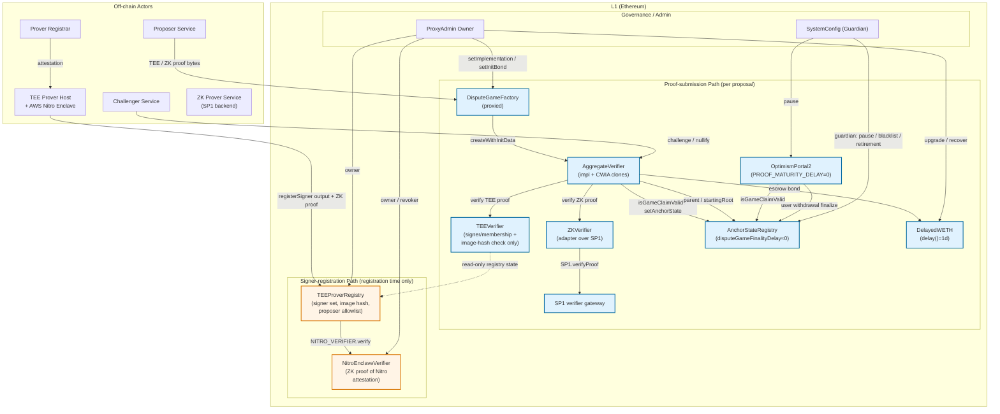

# Multiproof 系统架构与链上组件分析（Round 1 Draft）

> **Status note**: The approved outline commit (87d8f42) still carries `status: candidate`
> in its YAML front matter; the Orchestrator dispatch authoritatively flags it as approved
> for deep-research round 1. Recorded here for traceability — this draft proceeds against
> that dispatched approval. The candidate→approved field promotion is an outline-side
> housekeeping item and is logged in §"Gap Analysis" below.
>
> **Solidity source availability**: Azul 的 8 个核心合约（AggregateVerifier、TEEVerifier、
> ZKVerifier、TEEProverRegistry、NitroEnclaveVerifier、Azul 改造后的 DelayedWETH /
> OptimismPortal2 / AnchorStateRegistry）的 **Solidity 实现源码尚未在本研究可访问的
> base/base 仓库中公开**。本 draft 的合约级分析以 (a) Base 官方 spec
> `docs/specs/pages/protocol/proofs/*` 与 `docs/specs/pages/upgrades/azul/proofs.md`；
> (b) `base/base` 仓库内 `crates/proof/contracts/src/*` 的 `alloy::sol!` Rust binding
> 接口签名；(c) `crates/proof/contracts/src/{tee_prover_registry,nitro_enclave_verifier}.rs`
> 中明确指向 `https://github.com/base/contracts/blob/...` 的 canonical-source 注释；
> (d) `ethereum-optimism/optimism` 的旧版 Solidity 源码对照——四类素材交叉验证。每处
> 引用都标注了来源文件路径；未能从 Solidity 源码直接验证的字段会显式标注
> "Solidity source unavailable — fallback to spec + Rust bindings"。

## Executive Summary

Base Azul 通过 **Multiproof 系统**重构了 L2 checkpoint 的 L1 仲裁层，把过去由 `FaultDisputeGame`
独占的 *optimistic + interactive bisection* 模式，替换成一个由 `AggregateVerifier` 这个 dispute-game
合约协调的 **TEE + ZK 双证明聚合**模型。在 AggregateVerifier 内部：(i) 每个 proposal 是一组覆盖
`BLOCK_INTERVAL` 个 L2 区块的 checkpoint，并伴随所有 `INTERMEDIATE_BLOCK_INTERVAL` 处的中间
output root；(ii) 同一个 game 最多能容纳一个 TEE proof 和一个 ZK proof；(iii) 接受的证明数量驱动
`expectedResolution` 在 `SLOW_FINALIZATION_DELAY = 7 天` 与 `FAST_FINALIZATION_DELAY = 1 天`
之间切换，而 `PROOF_THRESHOLD` 控制 resolve 所需的最小证明数。两条专用 verifier 合约
（`TEEVerifier`、`ZKVerifier`）以 immutable 构造参数固定在 AggregateVerifier 实现上，
`TEEProverRegistry` 负责把 AWS Nitro Enclave attestation 的验证从 *每次 proof submission* 路径里
剥离出来，集中到 *signer registration* 路径——这是本主题最关键的信任边界拆分。

围绕这个新核心，三个 OP Stack 上游合约同步重构：`OptimismPortal2` 取消独立的 3.5 天
`PROOF_MATURITY_DELAY_SECONDS`；`AnchorStateRegistry` 在 `isGameFinalized()` 中保留
`disputeGameFinalityDelaySeconds`，但 Azul 部署预期把它配置为 0 或与 game 内部 delay 合并，使得
"双证一致即 1 天 finality" 的快速路径不会被任何外层延迟拉回 3.5 天以上；`DelayedWETH` 的提款
`delay()` 被降到 1 天，仅用于 proposer bond 的 escrow。三条结算路径——TEE-only / ZK-only 各 7 天、
TEE+ZK 同时存在 1 天——并不是"证明数量决定 finality"那么简单，而是 `PROOF_THRESHOLD`、
`SLOW_FINALIZATION_DELAY`、`FAST_FINALIZATION_DELAY`、`DelayedWETH.delay()` 与
`AnchorStateRegistry.isGameFinalized()` 五个命名参数串/并联得到的复合结果。

最终，Multiproof 的安全模型可以总结为："TEE 提供常态低延迟，ZK 作为 permissionless override
随时可以推翻 TEE-only 主张并没收 proposer bond；同类型双证（两个 TEE 或两个 ZK）被显式禁止
存储；任一 verifier 一旦 nullify 即全局失效"。这套设计直接回应了 L2Beat Stage 2 对
permissionless proof 与去信任化挑战路径的要求，但仍保留了 ProxyAdmin/Guardian/SystemConfig
等紧急停机面（pause / blacklist / retirement / verifier nullification / NitroEnclaveVerifier 路
freezing / 证书 revocation）作为兜底。

---

## Item Findings

### item-1: Multiproof 设计哲学与多证明安全模型

**High-level summary.** Multiproof 不是"多个证明都对才算 finalize"的合取式安全，而是一种
**异类证明可互相 override** 的析取式 + 经济激励复合模型：TEE 服务于常态低延迟（permissioned，
单证可触发 7d finality）；ZK 作为 permissionless backstop 永远拥有 override 权，可挑战 TEE-only
主张、没收其 bond、把 game 置为 `CHALLENGER_WINS`；只有当 TEE 与 ZK *对同一 rootClaim 都接受* 时
才进入 1d fast-finality。这一设计同时实现了 Stage 2 标准要求的 "permissionless ZK proof"
与"足够去中心化"的两条主线（`base/docs/specs/pages/upgrades/azul/proofs.md` §"Security and
Decentralization"）。

**Proof aggregation 与多证明的安全等价类。** 根据 contracts.md §"Resolution Delay" 与
§"Challenge" / §"Nullification"：

- *0 证明*：`expectedResolution` 为"never resolvable"哨兵值，game 不能 resolve；
- *1 证明（TEE 或 ZK 任一）*：`expectedResolution = createdAt + SLOW_FINALIZATION_DELAY (7d)`；
  在这 7 天内 ZK 可以走 `challenge()` 路径以一个反例 intermediate root 接管 game，从而把状态
  反转为 `CHALLENGER_WINS` 并把 bond 转给 ZK prover；
- *2 证明（一个 TEE + 一个 ZK）*：`expectedResolution = createdAt + FAST_FINALIZATION_DELAY (1d)`；
- *同类型双证（2 个 TEE 或 2 个 ZK）*：**禁止存储**——`verifyProposalProof()` 在已存同类型证明时
  reject（contracts.md §"Additional Proofs"："a game cannot store more than one proof of the
  same type"）。这一禁令把"同类型 prover 互证"挡在合约外，强制 fast finality 必须依赖
  diversity（TEE+ZK 两套独立栈），这是与多客户端多证明的形式化等价物。

**ZK override 在 Stage 2 下的角色。** ZK 的 override 是 *永久且 permissionless* 的：任何持有
canonical RPC 与 SP1 后端的运营者都可以构造 ZK proof，通过 `challenge()` 把 TEE-only proposal
反转——并且 `bondRecipient` 在 challenge 成功后切到 ZK prover（contracts.md §"Resolve, Close,
and Bonds"："If the game was challenged, `resolve()` sets `CHALLENGER_WINS` and moves the bond
recipient to the ZK prover"）。反方向不允许：TEE 不能挑战已存的 ZK proof，因为 challenge 路径
"requires the game to have a TEE proof"（contracts.md §"Challenge"）。这建立了一个**单向 trust
hierarchy**：ZK > TEE，TEE permissioned set 在 ZK 面前是去信任化的。

**Soundness alert 设计目的。** 当一个已接受证明被 `nullify()` 用矛盾的 intermediate root 推翻时
（contracts.md §"Nullification"），相应 verifier 合约会触发 `nullify()`：
"Once `TEE_VERIFIER.nullify()` or `ZK_VERIFIER.nullify()` succeeds, future proof verification
through that verifier reverts until the system is upgraded or reconfigured"。这把局部 proof
冲突升级为**全系统的 fail-closed**——一次发现 enclave bug 或 ZK image hash collision，立即冻结
所有同类型 verifier 的接受流，逼迫治理介入。这是 multiproof 系统对"单点失效"最尖锐的防护，
也是 ZK 与 TEE 互不为单点的关键不变量。

### item-2: AggregateVerifier 争议游戏核心合约

**Contract interface 与状态机.** AggregateVerifier 是 dispute-game 实现，通过
`DisputeGameFactory.createWithInitData(gameType, rootClaim, extraData, initData)` 以
clone-with-immutable-args（CWIA）模式被克隆（contracts.md §"DisputeGameFactory"；Rust binding
位于 `base/crates/proof/contracts/src/dispute_game_factory.rs`，`createWithInitData` 接口签名
`function createWithInitData(uint32 gameType, bytes32 rootClaim, bytes extraData, bytes initData)
external payable returns (address proxy_)`）。 Clone 时 immutable 数据布局为标准 CWIA：
`[0,20)` creator / `[20,52)` rootClaim / `[52,84)` parent L1 blockhash / `[84,84+n)` extraData
（contracts.md §"Clone Arguments"）。AggregateVerifier 的 `extraData` 进一步编码为
`[0,32)` proposed L2 block number / `[32,52)` parent address / `[52, 52+32n)` intermediate
output roots，其中 `n = BLOCK_INTERVAL / INTERMEDIATE_BLOCK_INTERVAL`，且最后一个 intermediate
root 必须等于 `rootClaim`（contracts.md §"Game Extra Data"）。

Constructor immutables（`base/docs/specs/pages/protocol/proofs/contracts.md`
§"Constructor Configuration" + `base/crates/proof/contracts/src/aggregate_verifier.rs`）：

| Immutable | 类型/语义 |
|---|---|
| `GAME_TYPE` | `uint32` dispute-game type identifier |
| `ANCHOR_STATE_REGISTRY` | `IAnchorStateRegistry` 地址 |
| `DISPUTE_GAME_FACTORY` | 由 registry 构造期读取的 factory 地址 |
| `DELAYED_WETH` | bond escrow |
| `TEE_VERIFIER` | TEE 验证器（不可变） |
| `TEE_IMAGE_HASH` | bytes32，TEE 期望 image hash，写入 TEE journal |
| `ZK_VERIFIER` | ZK 验证器（不可变） |
| `ZK_RANGE_HASH` | range-program 验证密钥 commitment（写入 ZK journal） |
| `ZK_AGGREGATE_HASH` | aggregation-program 验证密钥（作为 imageId 传给 SP1 gateway） |
| `CONFIG_HASH` | rollup config hash |
| `L2_CHAIN_ID` | uint64 |
| `BLOCK_INTERVAL` | proposal 涵盖区块数 |
| `INTERMEDIATE_BLOCK_INTERVAL` | 中间 root 步长 |
| `PROOF_THRESHOLD` | `1` 或 `2`，决定 resolve 所需证明数 |

Rust binding 中暴露的 view 与 mutator 函数（`aggregate_verifier.rs`）：
`rootClaim()`、`l2SequenceNumber()`、`status()` (`GameStatus { InProgress=0, ChallengerWins=1,
DefenderWins=2 }`)、`teeProver()`、`zkProver()`、`BLOCK_INTERVAL()`、
`INTERMEDIATE_BLOCK_INTERVAL()`、`gameType()`、`l1Head()`、
`counteredByIntermediateRootIndexPlusOne()`、`gameOver()`、`resolvedAt()`、`bondRecipient()`、
`expectedResolution()`、`proofCount()`、`createdAt()`、`DELAYED_WETH()`、
`anchorStateRegistry()`、以及 mutators `nullify`、`challenge`、`resolve`、`claimCredit`，
`initializeWithInitData(bytes)` 与 `verifyProposalProof(bytes)`。

**Proof aggregation 与 dispute logic.** 在 `initializeWithInitData(proof)` 中
（contracts.md §"Initialization"），game 必须按顺序执行：

1. 检查 final intermediate root == `rootClaim`；
2. 解析 starting root：若 `parentAddress == AnchorStateRegistry`，则取
   `AnchorStateRegistry.getStartingAnchorRoot()`；否则要求 parent 是有效的 registered game；
3. 强制 `l2SequenceNumber == startingL2SequenceNumber + BLOCK_INTERVAL`；
4. 记录 `createdAt`、`wasRespectedGameTypeWhenCreated`、初始 `expectedResolution`；
5. 用 `blockhash()`（≤ 256 区块）或 EIP-2935 history（≤ 8191 区块）校验 L1 origin hash；
6. 调用 `TEE_VERIFIER.verify(proposer || signature, TEE_IMAGE_HASH, keccak256(journal))` 或
   `ZK_VERIFIER.verify(proofBytes, ZK_AGGREGATE_HASH, keccak256(journal))`；
7. 把 bond 存入 `DelayedWETH`，`bondRecipient = gameCreator`。

Initialization proof format（contracts.md §"Initialization"）：

```
[0, 1)    ProofType: 0 = TEE, 1 = ZK
[1, 33)   L1 origin hash
[33, 65)  L1 origin block number
[65, end) verifier-specific proof bytes
```

`verifyProposalProof(proofBytes)` 用于 game 进行中追加*另一类型*的证明，不再读 L1 origin
（用 `l1Head()` 已固定的 origin）。Proof 格式简化为：

```
[0, 1)    ProofType
[1, end)  verifier proof bytes
```

且**同类型证明禁止重复存储**。

`challenge(proofBytes, intermediateRootIndex, intermediateRootToProve)`
（contracts.md §"Challenge"）只在 8 个前提全部成立时才接受：游戏仍 `IN_PROGRESS`；registry
认为 game proper；parent 未以 `CHALLENGER_WINS` resolved；已有 TEE proof；尚无 ZK proof；
supplied ProofType==ZK；index 在 `[0, n)` 范围；supplied root ≠ 当前 proposed intermediate root。
验证通过后：记录 zkProver、`proofCount++`、写入 1-based countered index、emit
`Challenged`；resolve 时 game 变成 `CHALLENGER_WINS`，bondRecipient 转为 ZK prover。

`nullify(proofBytes, intermediateRootIndex, intermediateRootToProve)`
（contracts.md §"Nullification"）以矛盾证据撤销一个已接受证明。
对未被挑战的 game，target root 必须 ≠ 当前 proposed intermediate root；对被挑战的 game，
只允许 nullify *被挑战的 index*、用 ZK proof 且 supplied root 必须等于原 proposed intermediate
root。成功后：删除对应 prover slot、`proofCount--`、重算 `expectedResolution`、清除 countered
index、并触发该 verifier 的全局 `nullify()`——后续所有此 verifier 的 verify 调用都 revert。

`resolve()`（contracts.md §"Resolve, Close, and Bonds"）permissionless：parent 必须已 resolved
（除非 parent 是 registry 本身）；若 parent `CHALLENGER_WINS` / blacklisted / retired，子游戏自动
`CHALLENGER_WINS`；否则要求 `gameOver()` 且 `proofCount >= PROOF_THRESHOLD`。被挑战则
`CHALLENGER_WINS`，否则 `DEFENDER_WINS`。

`closeGame()` permissionless：registry 未 paused、game resolved+finalized，尝试
`AnchorStateRegistry.setAnchorState()`；anchor update 是 best-effort，如果 registry 拒绝（因 game
不再是 newest valid claim）会被 swallow。

`claimCredit()` 两阶段：先 `unlock()` DelayedWETH 凭证；等 `DelayedWETH.delay()` 秒后
再调用一次实际 withdraw。**Safety stop**：若 proofs 被 nullify、`expectedResolution` 落回
never-resolvable 哨兵，`claimCredit()` 在 `createdAt + 14 天`前一直阻断，防止 bond 永久 lock。

**Soundness 不变量（cross-contract）.** contracts.md §"Cross-Contract Safety Properties" 给出
七条：(1) factory uniqueness；(2) parent validity；(3) monotonic checkpoints；(4) intermediate
accountability；(5) verifier separation（TEE_IMAGE_HASH vs ZK_RANGE_HASH 作为 domain separator）；
(6) fast finality requires diversity；(7) registry finality 与 game resolution 解耦。

**与 OP Stack FaultDisputeGame 的同构 / 差异.**
共同点：CWIA clone、`DisputeGameFactory` 作为路由、`GameStatus` enum、`resolve()` /
`claimCredit()` 双相 bond 释放、registry 作为最终 anchor source。差异：
- FaultDisputeGame 通过 `MAX_GAME_DEPTH` / `MAX_CLOCK_DURATION`
  （`optimism/packages/contracts-bedrock/src/dispute/FaultDisputeGame.sol` L128/L135/L234-237）
  控制 bisection 树深度与单步时钟，结算延迟以"clock 走完"为信号；AggregateVerifier 不做 bisection
  而把整个 range 的 intermediate roots **打包进 CWIA extraData**，挑战收敛到"任一 intermediate
  interval 的 ZK 反例"——证明粒度从 `1` 步 EVM step 上升到 `INTERMEDIATE_BLOCK_INTERVAL` 个 L2 区块。
- FaultDisputeGame 没有 `PROOF_THRESHOLD` / `expectedResolution` 这类参数化 finality；其结算窗口
  完全等于 `MAX_CLOCK_DURATION`。

**Bond economics.** Init bond 由 factory owner 通过 `setInitBond(gameType, initBond)` 设置
（contracts.md §"DisputeGameFactory" §"Configuration"），proposer 在 `createWithInitData` 时
必须支付**精确等值**的 ETH。Bond 进 `DelayedWETH`，由 `bondRecipient` 通过两阶段 claim。
Challenger 成功后 bondRecipient 自动切到 ZK prover，**TEE prover 在 challenge 中失去全部 bond**
（详见 §item-4）。

**Security assumptions.** 见 item-1 关于异类双证 + verifier nullification。AggregateVerifier 自身
不持任何 ETH（除 clone storage）。Implementation 本身可被 factory owner 通过
`setImplementation(gameType, impl)` 替换，但**已 clone 的 game 由 immutable args 锁定 verifier
地址**，因此实现替换只影响**新 clone**，不影响进行中的 game——这是 immutable-args 模式带来的
关键保护。

**Governance & immutability.** 治理面集中在 factory owner（升级 implementation + bond 配置）与
`AnchorStateRegistry` 的 guardian / retirement timestamp / blacklist（见 §item-5）；
AggregateVerifier 本身没有 owner，无 pause / upgrade entry，所有可变行为都是 permissionless
clone 内行为。

**On-chain deployments.** 在本研究可访问范围内（`base/base` 仓库与 specs），**未发现** Sepolia /
Mainnet 的具体 AggregateVerifier 部署地址、constructor args 或 proxy → implementation 映射。
Gap 记入 §"Gap Analysis"。

**Code references.**
- `base/docs/specs/pages/protocol/proofs/contracts.md` §"AggregateVerifier"（L226-432）；
- `base/crates/proof/contracts/src/aggregate_verifier.rs`（893 行 `alloy::sol!` interface）；
- `base/crates/proof/contracts/src/dispute_game_factory.rs`（259 行）。
- Solidity 实现源码 unavailable — fallback to spec + Rust bindings。

### item-3: TEEVerifier / ZKVerifier 子系统与 TEE 信任边界拆分

**核心区分**：本 item 严格按 outline 要求把 TEE 信任拆为两条互不调用的路径：

#### Proof-submission 路径（每次 proposal 都执行）

**TEEVerifier**（`base/docs/specs/pages/protocol/proofs/contracts.md` §"TEEVerifier"，
canonical Solidity source 由 `base/crates/proof/contracts/src/...` 注释指向但本研究未直接拉取，
**Solidity source unavailable — fallback to spec + Rust bindings**）：

Proof bytes 格式：

```
[0, 20)   Proposer address
[20, 85)  65-byte ECDSA signature (over keccak256(journal) directly, no EIP-191 prefix)
```

验证仅做 5 步（**完全在合约状态层完成，绝无 Nitro attestation 解析**）：

1. proof 长度 ≥ 85 bytes；
2. signature 干净 recover；
3. **proposer 在 `TEEProverRegistry` 的 proposer allowlist 中**（这是一道额外的
   per-proposer 配额，与 signer 注册解耦）；
4. **recovered signer 在 `TEEProverRegistry` 的 active signer set 中**；
5. **signer 的 registered image hash == 调用方传入的 `imageId`（即 `TEE_IMAGE_HASH`）**。

注意 (3)(4)(5) 都**只读 registry 的 storage state**。TEEVerifier *从不调用*
NitroEnclaveVerifier。Nitro attestation 验证发生在更早一步——signer 注册阶段。

`TEEVerifier` 同样继承 verifier nullification：一旦被 nullify 全局冻结
（contracts.md §"TEEVerifier"）。

**ZKVerifier**（contracts.md §"ZKVerifier"）：

```text
verify(proofBytes, imageId, journal) → bool
  = SP1_VERIFIER.verifyProof(imageId, abi.encodePacked(journal), proofBytes)
```

`imageId = ZK_AGGREGATE_HASH`（AggregateVerifier 的 immutable），`journal` 是 game 组装的公共
输入哈希。底层是 Succinct **SP1 verifier gateway**，意味着 ZKVerifier 是一个**轻量 adapter** —
没有自己的密码学验证逻辑，依赖 SP1 gateway 的 onchain Groth16 验证器。VK 通过 gateway 的版本化
路由可以由 Succinct 治理更新，但 AggregateVerifier 上的 `ZK_AGGREGATE_HASH` 是 immutable，
所以同一 game 始终对应同一 ZK 验证密钥。同样继承 nullification。

#### Signer-registration 路径（注册时才执行，proposal 期间不调用）

**TEEProverRegistry**（contracts.md §"TEEProverRegistry"；Rust binding
`base/crates/proof/contracts/src/tee_prover_registry.rs`，注释里给出 canonical
`https://github.com/base/contracts/blob/96b132077b86bdc77f3f96dd40e09dad363df32e/src/multiproof/tee/TEEProverRegistry.sol`，
**主仓库本研究未直接拉取，Solidity source unavailable — fallback to spec + Rust bindings + on-chain
verified source**）：

state：
- `owner`（治理 root）
- `manager`（可注册/注销 signer 的次级角色）
- `NitroEnclaveVerifier` 不可变指针
- `DisputeGameFactory` 不可变指针
- 可配置 `gameType`（owner 设置；setter 校验
  `DisputeGameFactory.gameImpls(gameType).TEE_IMAGE_HASH()` 返回非零）
- `signerRegistered[signer]`、`signerImageHash[signer]`、enumerable signer 集合
- proposer allowlist

`registerSigner(output, proofBytes)`：

```text
NITRO_VERIFIER.verify(output, ZkCoProcessorType.RiscZero, proofBytes)
  → 期待 VerificationResult.Success
  → attestation timestamp 与 block.timestamp 的差 ≤ MAX_AGE = 60 min
  → public key 必须是 65 字节 uncompressed ANSI X9.62（0x04 || x || y）
  → signer = address(uint160(uint256(keccak256(x || y))))
  → signerImageHash[signer] = keccak256(pcr0.first || pcr0.second)
  → 写入 signer set
```

`isValidSigner(signer)`：当且仅当 signer 已注册**且**其
`signerImageHash[signer] == DisputeGameFactory.gameImpls(gameType).TEE_IMAGE_HASH()` 时为
true。这是 TEEVerifier 上 image-hash 校验的物化来源。

**关键设计性质**："Signer registration itself is PCR0-agnostic. This lets operators pre-register
signers for a future image before a game-type migration. Those signers do not become valid for
proof submission until the game implementation's `TEE_IMAGE_HASH` matches their registered image
hash."（contracts.md §"Expected Image Hash"）——允许跨 image hash 升级**预注册**，避免升级
窗口期出现 signer 真空。

**NitroEnclaveVerifier**（contracts.md §"NitroEnclaveVerifier"；Rust binding 注释指向
`https://github.com/base/contracts/blob/main/src/L1/proofs/tee/NitroEnclaveVerifier.sol`，
**Solidity source unavailable — fallback to spec + Rust bindings**）：

它是一个**ZK proof of AWS Nitro Enclave attestation** 的验证器，本身不直接做 X.509 / COSE
解析；而是通过 `IRiscZeroVerifier.verify` 或 `ISP1Verifier.verifyProof` 验证一个证明
"attestation 文档对 trusted root cert / 时间戳 / PCR 集合都是 well-formed 的"的 ZK 证明。

工作流：
- `verify(output, zkCoprocessor, proofBytes)`：only `proofSubmitter` 可调用；按
  `(zkCoprocessor, selector=proofBytes[0:4])` 路由到对应 verifier；解码 `output` 为
  `VerifierJournal`；按 journal validation 规则（trusted prefix、root cert 锁定、cert 未过期/未
  revoked、timestamp 满足 `[timestamp, timestamp+maxTimeDiff)` 包含 block.timestamp）验证；
  emit `AttestationSubmitted`。
- `batchVerify(...)`：用 `aggregatorId` 做批量验证，要求
  `batchJournal.verifierVk == getVerifierProofId(zkCoprocessor)`。
- 治理面：owner 控制 `rootCert` / `maxTimeDiff` / `proofSubmitter` / `revoker` /
  zk config / 程序 ID / route-specific verifier override / route freezing；`revoker` 可
  revoke 已 cached 的中间证书。route freezing 是**永久性**的——一旦冻结路由所有未来 verify
  permanently revert。

**为什么必须拆分？**

把 attestation 验证留在 proof submission 路径有三个不可接受的代价：
1. **Gas 成本**：每次 proposal 都做一次完整 AWS Nitro 证书链 + PCR 校验，按 RISC Zero/SP1
   onchain 验证的成本估算每次开销大概率超过 1M gas；
2. **复杂攻击面**：proof submission 路径越短越好，避免 attestation 流的旁路（如证书 revocation
   时序问题）影响主路径活性；
3. **升级灵活性**：image hash 升级与 enclave 镜像旋转可以在 registry 内 batch 完成，proposal
   路径无需感知。

拆分后，proof submission 路径只读 registry storage，gas 接近常数；Nitro attestation 仅在
prover 寿命级别（按 outline 提示由 *Prover Registrar* 周期性 refresh，详细 off-chain 流程归
`multiproof-provers-challengers` 子课题）执行。

**Governance & immutability.**
- `TEEVerifier` 与 `ZKVerifier` 的地址在 AggregateVerifier 上是 immutable 构造参数
  （contracts.md §"Constructor Configuration"），同一 game type 的所有 clone 都指向同一对 verifier。
  升级 verifier 必须通过 factory owner 替换 `gameType` 的 implementation（即部署一个新的
  AggregateVerifier 实现，其 constructor 指向新 verifier），不影响进行中的旧 clone。
- `TEEProverRegistry` 的 image hash 通过 `setGameType()` 间接控制（实际值来自 game
  implementation 的 `TEE_IMAGE_HASH`），signer set 由 owner / manager 维护。
- `NitroEnclaveVerifier` 治理面在 contracts.md §"Roles and Configuration" + §"Administrative
  Surfaces" 表中已给出。

**On-chain deployments.** 未在 base/base 仓库 configs 中发现 Sepolia / Mainnet 具体地址。
Gap 记入 §"Gap Analysis"。

**Code references.**
- contracts.md §"ZKVerifier" / §"TEEVerifier" / §"TEEProverRegistry" / §"NitroEnclaveVerifier"；
- `base/crates/proof/contracts/src/tee_prover_registry.rs`（含 canonical Solidity URL 注释）；
- `base/crates/proof/contracts/src/nitro_enclave_verifier.rs`（含 canonical Solidity URL 注释）；
- Solidity source unavailable — fallback to spec + Rust bindings + on-chain verified source。

### item-4: DelayedWETH bond 托管与提款延迟优化

**角色定位.** DelayedWETH 是 WETH 的"延迟提款变体"，被 AggregateVerifier 用作 proposer bond
escrow（contracts.md §"DelayedWETH"）。这是 OP Stack 既有合约的 Azul 调参版本——结构延续了
OP Stack 实现，但 `delay()` 参数被显著调低。

**接口.** Rust binding `base/crates/proof/contracts/src/delayed_weth.rs`（63 行）暴露
`delay() external view returns (uint256)`、`unlock(address subAccount, uint256 amount)`、
`withdraw(address subAccount, uint256 amount)`。两阶段提款语义见 contracts.md §"DelayedWETH"：

```
1. game.unlock(subAccount=bondRecipient, amount)
2. wait delay() seconds
3. game.withdraw(subAccount, amount)
```

`withdrawals[msg.sender][subAccount]` 是 unlock 凭证的主键。在 proof game 场景，
`msg.sender = AggregateVerifier clone`、`subAccount = bondRecipient`（initial = gameCreator，
被 challenge 后 = ZK prover）。

**提款延迟参数.**
- Azul 部署预期值：**`delay() = 1 day` 固定**（base/docs/specs/pages/upgrades/azul/proofs.md：
  "`DelayedWETH`: still escrows the proposal bond for each game, but Azul reduces its withdrawal
  delay to 1 day. That is sufficient here because the only bonds at stake are proposer bonds."）
- 旧 OP Stack 部署值：典型 7 天（`ethereum-optimism/optimism/packages/contracts-bedrock/src/dispute/DelayedWETH.sol`
  L40 `uint256 internal immutable DELAY_SECONDS;` + L47 `DELAY_SECONDS = _delay;` —
  实现侧把它做成 constructor immutable，**具体值取决于部署 args**；OP Stack 主网 / Sepolia 的
  典型配置是 `7 days = 604800` 秒）。Spec 的 "from 7 days to 1 day" 描述
  对应 constructor 参数的部署变更而非源码变更，DelayedWETH 合约实现本身无需修改。

**为什么 1 天足够（与 finality 窗口的关系）.**
- 仅 proposer bond 受此 delay 约束（spec 显式说明）；用户跨桥提款由 OptimismPortal2 控制
  （详见 §item-5），与 `DelayedWETH.delay()` 完全解耦。
- 在 Azul finality 模型下：
  - TEE+ZK fast path：`FAST_FINALIZATION_DELAY = 1d`，`resolve()` 后立即 `claimCredit` 第一阶段，
    再等 1 天就能拿到 ETH。所以正常情况 proposer 总等待 ≈ 2d。
  - 单证 7d path：`resolve()` 至少要 7d，之后 1d DelayedWETH，总 ≈ 8d。
- 1d 的设计意图是**给 guardian 留下 24h 紧急干预窗口**（pause / blacklist），但又不至于把
  fast finality 的 proposer 体验拖回 OP Stack 旧版的 7d。Spec："That is sufficient here because
  the only bonds at stake are proposer bonds"。

**Bond size 与 slashing 路径.** Init bond 大小通过
`DisputeGameFactory.setInitBond(gameType, initBond)` 由 factory owner 配置
（contracts.md §"DisputeGameFactory"）；具体数值未在本研究可访问的 spec / 代码中给出，
预期与 OP Stack 旧版同一量级（参考`ethereum-optimism/optimism/packages/contracts-bedrock/src/dispute/DisputeGameFactory.sol`
中 `initBonds[gameType]`）。**Slashing**：被 challenge 成功的 proposer 失去全部 bond，
bond 经由 `bondRecipient = ZK prover` 路径转到 challenger（contracts.md §"Resolve, Close, and
Bonds"："moves the bond recipient to the ZK prover"）。这是 challenger 的主要经济激励。

**Bond 永久 lock 防护.** contracts.md §"Resolve, Close, and Bonds" 末尾："If accepted proofs
have been nullified and `expectedResolution` is reset to the never-resolvable sentinel,
`claimCredit()` is blocked until 14 days after `createdAt`"——nullify 把 game 推回 0 proof
后给一个 14 天兜底窗口，避免 bond 永久卡死。

**"DelayedWETH delay" vs "用户跨桥提款 delay" 的概念区分.**

| 概念 | 控制者 | Azul 值 | 影响对象 |
|---|---|---|---|
| `DelayedWETH.delay()` | `DelayedWETH` constructor immutable | 1 day | proposer bond escrow |
| `expectedResolution` 中的 `SLOW_FINALIZATION_DELAY` | AggregateVerifier impl 常量 | 7 days | game resolve 时点 |
| `expectedResolution` 中的 `FAST_FINALIZATION_DELAY` | AggregateVerifier impl 常量 | 1 day | 双证 game resolve 时点 |
| `AnchorStateRegistry.disputeGameFinalityDelaySeconds` | AnchorStateRegistry constructor immutable | Azul 配置预期 0 或 ≤1d（spec：游戏不再继承独立 3.5d）| 何时进入 `isGameFinalized()` |
| `OptimismPortal2.PROOF_MATURITY_DELAY_SECONDS` | OptimismPortal2 constructor immutable | Azul 配置预期 0（spec："no longer adds the separate 3.5 day proof-maturity delay"）| 用户 finalizeWithdrawal 等待 |

`DelayedWETH.delay()` 与其他四项完全独立——它不参与用户跨桥提款的 finality 判定。

**Governance & immutability.** DelayedWETH 自身的关键控制面（contracts.md §"DelayedWETH"）：
proxy admin owner 拥有 `recover(amount)`（把任意数量 ETH 拨给 owner）与 `hold(account)` /
`hold(account, amount)`（把任一账户的 WETH 拽出）这两个 emergency recovery 权力——这两个能力等
价于"owner 可以随时撤掉任何 game 的 bond"，是非常强的治理面，依赖 Base 的 multisig 治理结构。
SystemConfig 处于 paused 时 `withdraw()` 直接 revert。

**On-chain deployments.** 未在本研究可访问范围发现 Sepolia / Mainnet Azul DelayedWETH 部署地址。
Gap 记入 §"Gap Analysis"。

**Code references.**
- contracts.md §"DelayedWETH"；
- `base/docs/specs/pages/upgrades/azul/proofs.md` 第 "New/Changed Onchain Components" 节；
- `base/crates/proof/contracts/src/delayed_weth.rs`（63 行）；
- 旧版对照：`ethereum-optimism/optimism/packages/contracts-bedrock/src/dispute/DelayedWETH.sol`
  L40/L47/L61-64/L101/L106-125。

### item-5: OptimismPortal2 与 AnchorStateRegistry 在 Azul 下的重构

**核心改动叙述.** Azul 把 finality 延迟的"权重"从 portal/registry 推回到 AggregateVerifier
本身：
- `OptimismPortal2.PROOF_MATURITY_DELAY_SECONDS`：旧版本作为 immutable
  （`ethereum-optimism/optimism/packages/contracts-bedrock/src/L1/OptimismPortal2.sol` L46
  `uint256 internal immutable PROOF_MATURITY_DELAY_SECONDS;`，constructor L243
  `constructor(uint256 _proofMaturityDelaySeconds) ReinitializableBase(3)`，getter L289），
  典型部署值 = 3.5d。L645-646 在 `checkWithdrawal()` 中要求 "A proven withdrawal must wait at
  least `PROOF_MATURITY_DELAY_SECONDS` before finalizing"。Azul 部署预期把这个 constructor
  arg 设为 0（spec："`OptimismPortal2`: no longer adds the separate 3.5 day proof-maturity
  delay"），让 finality 完全由 AggregateVerifier 的 `expectedResolution` 决定。
  **Solidity source available** — 上述文件可在 ethereum-optimism/optimism 主仓库
  contract-bedrock v5.6.1 verified。
- `AnchorStateRegistry.DISPUTE_GAME_FINALITY_DELAY_SECONDS`：旧版本作为 immutable
  （`ethereum-optimism/optimism/packages/contracts-bedrock/src/dispute/AnchorStateRegistry.sol`
  L31 `uint256 internal immutable DISPUTE_GAME_FINALITY_DELAY_SECONDS;`，constructor L79-80，
  getter L142 `disputeGameFinalityDelaySeconds()`），在 `isGameFinalized(game)` 中以
  `block.timestamp - _game.resolvedAt().raw() <= DISPUTE_GAME_FINALITY_DELAY_SECONDS` 形式
  作为 finalization 延迟（L310）。Azul 部署预期把 constructor arg 设为 0 或与
  AggregateVerifier 的 `expectedResolution` 合并（spec："`AnchorStateRegistry`: Similar to
  `OptimismPortal2`, this no longer has a 3.5 day finalization delay for proposals, allowing
  fast finality"），但**合约源码不变**，只是部署参数变更。
  **Solidity source available**。

新提款流程（端到端）：
1. 用户在 L2 emit `MessagePassed`；
2. 用户在 L1 调 `OptimismPortal2.proveWithdrawalTransaction()`，指向某一具体 dispute game；
3. 不再有 3.5d `PROOF_MATURITY_DELAY_SECONDS` 等待（Azul 部署设为 0）；
4. 用户调 `OptimismPortal2.finalizeWithdrawalTransaction()`，portal 内部要求
   `AnchorStateRegistry.isGameClaimValid(game)` 返回 true（contracts.md §"Game Predicates"
   表："`isGameClaimValid(game)`：proper + respected + finalized + DEFENDER_WINS"）；
5. 而 `isGameFinalized(game) = resolvedAt > 0 AND elapsed > disputeGameFinalityDelaySeconds`
   （Azul 部署下 finality delay 是 0 或最小值），所以 finality 时机等同于 game `resolve()`
   + `expectedResolution` 完成时刻。

`AnchorStateRegistry` 的 game predicates（contracts.md §"Game Predicates"）保持稳定：
`isGameRegistered`、`isGameRespected`、`isGameBlacklisted`、`isGameRetired`、
`isGameResolved`、`isGameProper`、`isGameFinalized`、`isGameClaimValid`。AggregateVerifier
通过 `setAnchorState(game)` 推进 anchor，要求 `isGameClaimValid(game) && game.l2SequenceNumber
> currentAnchor.l2SequenceNumber`（contracts.md §"Anchor Updates"）。

**与 OP Stack 旧流程的差异.**

| 维度 | OP Stack 旧版本 | Azul |
|---|---|---|
| `OptimismPortal2.PROOF_MATURITY_DELAY_SECONDS` | ≈ 3.5d | 0（spec 描述；具体值取部署 args） |
| `AnchorStateRegistry.disputeGameFinalityDelaySeconds` | ≈ 3.5d | 0 或 ≤1d（spec 描述：no longer has a 3.5 day finalization delay） |
| FaultDisputeGame 内 `MAX_CLOCK_DURATION` | ≈ 3.5d（典型部署） | N/A（被 AggregateVerifier `expectedResolution = 1d 或 7d` 取代） |
| 用户跨桥提款总等待（最快路径） | ≈ 7d（3.5d 游戏 + 3.5d portal） | 双证 ≈ 1d；单证 ≈ 7d |

**Bridge / messenger 兼容性.** OptimismPortal2 与 AnchorStateRegistry 的**接口未变化**——
`proveWithdrawalTransaction` / `finalizeWithdrawalTransaction` / `isGameClaimValid` /
`getAnchorRoot` 等签名保持稳定（见 Rust binding `base/crates/proof/contracts/src/anchor_state_registry.rs`
中所有方法的 sol! 定义与 OP Stack `optimism/packages/contracts-bedrock/src/L1/OptimismPortal2.sol`
对应 selector 完全对齐）。下游 bridge / messenger（含 `L1CrossDomainMessenger`、
`L1StandardBridge`、`L1ERC721Bridge`）通过 portal 调用，无需修改。L2 侧 `L2OutputOracle` 在
Fault Proof V2 时代已弃用，Azul 进一步用 `AnchorStateRegistry` 替代，但 L2 侧合约（如
`L2ToL1MessagePasser`）也不变。

**Governance.** Portal/Registry 的 guardian 与 ProxyAdmin owner 控制面无重大变化
（`AnchorStateRegistry` §"Guardian Controls"：set respected game type / update retirement
timestamp / blacklist games；`OptimismPortal2` 历来由 SystemConfig 的 guardian
pause/unpause）。Azul 没有引入新的 admin role。

**On-chain deployments.** Sepolia / Mainnet Azul 时代具体部署地址 + constructor arg
（确认 `_proofMaturityDelaySeconds = 0`、新 `_disputeGameFinalityDelaySeconds` 值）未在本研究
可访问范围发现。Gap 记入 §"Gap Analysis"。

**Code references.**
- `base/docs/specs/pages/upgrades/azul/proofs.md` §"New/Changed Onchain Components"；
- `ethereum-optimism/optimism/packages/contracts-bedrock/src/L1/OptimismPortal2.sol` L46/L243/
  L289/L645-646（**source available**）；
- `ethereum-optimism/optimism/packages/contracts-bedrock/src/dispute/AnchorStateRegistry.sol`
  L31/L79-80/L142/L310（**source available**）；
- `base/crates/proof/contracts/src/anchor_state_registry.rs`（169 行）；
- contracts.md §"AnchorStateRegistry"。

### item-6: 三条结算路径与 finality window 机制

**命名参数完整集合（从 spec 直接抽取）.**

| 参数 | 类型 | 来源 | Azul 默认值 | 计时起点 | 说明 |
|---|---|---|---|---|---|
| `PROOF_THRESHOLD` | `uint8`（值 1 或 2） | AggregateVerifier impl constructor immutable | 部署期决定（typically 1） | N/A | 决定 `resolve()` 所需最小证明数（contracts.md §"Constructor Configuration" / §"Resolve"）。**控制 resolution，不控制 submission**；game 仍可存 1 个 TEE + 1 个 ZK |
| `SLOW_FINALIZATION_DELAY` | uint256 (seconds) | AggregateVerifier 实现常量 | **7 days, fixed**（contracts.md §"Resolution Delay"） | `proofCount == 1` 时的最近一次状态变更 | 单证 finality 延迟 |
| `FAST_FINALIZATION_DELAY` | uint256 (seconds) | AggregateVerifier 实现常量 | **1 day, fixed**（contracts.md §"Resolution Delay"） | `proofCount == 2` 时的最近一次状态变更 | 双证 finality 延迟 |
| `DelayedWETH.delay()` | uint256 (seconds) | DelayedWETH constructor immutable | **1 day**（spec：reduced to 1 day） | `unlock()` 的 block.timestamp | bond 两阶段 claim 第二阶段等待 |
| `AnchorStateRegistry.disputeGameFinalityDelaySeconds` | uint256 (seconds) | AnchorStateRegistry constructor immutable | **0 或 极小值**（spec：no longer has a 3.5 day finalization delay） | game `resolvedAt` | `isGameFinalized(game)` 判定阈值 |
| `OptimismPortal2.PROOF_MATURITY_DELAY_SECONDS` | uint256 (seconds) | OptimismPortal2 constructor immutable | **0**（spec：no longer adds the separate 3.5 day proof-maturity delay） | `proveWithdrawal` 提交时刻 | 用户 finalizeWithdrawal 前置等待 |

**`expectedResolution` 的转移规则**（contracts.md §"Resolution Delay" / §"Challenge"）：

```
proofCount = 0  →  expectedResolution = ∞ (never-resolvable sentinel)
proofCount = 1  →  expectedResolution = createdAt + 7d (SLOW)
proofCount = 2  →  expectedResolution = max(latest stateChangeAt, createdAt) + 1d (FAST)

# challenge 路径覆盖：
challenge(ZK proof)  →  expectedResolution = block.timestamp + 7d
                        （让 challenge 本身在 7d 内可被 nullify）
```

"Adding a proof can only decrease `expectedResolution`. Nullifying a proof can increase it."
单调性约束保证 fast finality 不能被恶意拖延。

**三条结算路径的合约级触发条件.**

**Path A — TEE-only（7d, permissioned-but-public-finality）.**

1. `t = 0`：proposer 调 `createWithInitData(...)`，附 TEE proof；TEEVerifier 验证通过，
   `proofCount = 1`，`expectedResolution = 0 + 7d`。
2. `t ∈ [0, 7d)`：任何人可以
   - 调 `verifyProposalProof()` 追加 ZK proof → 跳到 Path C；
   - 调 `challenge(ZK proof, ...)` 用反例 intermediate root 推翻 TEE → game 进入 challenged
     状态，`expectedResolution = challengeTime + 7d`，最终 resolve 为 `CHALLENGER_WINS`；
   - 调 `nullify(ZK proof, ...)` 用矛盾 ZK 推翻 TEE → `proofCount = 0` 且 TEEVerifier 全局
     nullify。
3. `t ≥ 7d` 且无上述事件：`resolve()` 可调用，`DEFENDER_WINS`。
4. `+ DelayedWETH.delay() = 1d`：bond 可领取。

**Path B — ZK-only（7d, permissionless）.**

完全镜像 Path A，但首次 proof 是 ZK（`ProofType = 1`）。差异：不存在"TEE 反向挑战 ZK"路径
（contracts.md §"Challenge" 要求 game 已有 TEE proof）。Path B 的"反例 nullify"也只能用 ZK 提交，
**这意味着 ZK-only 路径的 7d 等待是 hard floor**，TEE 即使后到也只能让其变成 Path C 的 1d。

**Path C — TEE+ZK（1d, fast finality）.**

1. 路径 1：初始 TEE，后追加 ZK → `proofCount = 2`，`expectedResolution = lastStateChange + 1d`；
2. 路径 2：初始 ZK，后追加 TEE → 同上；
3. `resolve()` 时点：1d 后，`DEFENDER_WINS`，bond 给 gameCreator；
4. `+ DelayedWETH.delay() = 1d`：bond 可领取（与 Path A/B 一致）。

**ZK override 在合约中的具体体现.**

- 如果一个 Path A 已 resolved 成 `DEFENDER_WINS` 但**尚未** `closeGame()`，且 ZK 出现矛盾证据，
  目前 spec 中没有事后撤销机制——这是 game-level 设计：finality 已到，anchor 已写就是终态。
  但若同一 anchor sequence 上有竞争的、更优的 game，`setAnchorState()` 的"newest valid claim"
  逻辑可以让新 anchor 不依赖被质疑的 game（contracts.md §"Anchor Updates"）。
- Override 的真正窗口是 **resolve 之前的 7d**：在此期间 `challenge()` / `nullify()` 永远是
  ZK 优先（contracts.md §"Challenge"："the supplied proof type is ZK"）。

**End-to-end timing 表.**

| 路径 | resolve 时刻 | bond claim 时刻 | 用户提款最早可 finalize 时刻 |
|---|---|---|---|
| TEE-only | createdAt + 7d | createdAt + 7d + 1d ≈ 8d | createdAt + 7d（OptimismPortal2 delay=0） |
| ZK-only | createdAt + 7d | createdAt + 7d + 1d ≈ 8d | createdAt + 7d |
| TEE+ZK | secondProofAt + 1d | secondProofAt + 1d + 1d ≈ 2d | secondProofAt + 1d |

提款侧的"最早 finalize"假设 `AnchorStateRegistry.disputeGameFinalityDelaySeconds` Azul 部署值
≈ 0；若部署值取非零（如 1d 作为额外 buffer），各路径加上对应延迟。

**Code references.**
- contracts.md §"Resolution Delay" / §"Challenge" / §"Nullification" / §"Resolve, Close, and
  Bonds"；
- `base/docs/specs/pages/upgrades/azul/proofs.md` §"Finality Model" 表；
- AggregateVerifier Rust binding `aggregate_verifier.rs` 的 `expectedResolution()` /
  `resolvedAt()` / `proofCount()` views。

### item-7: 与旧版 Optimistic Fault-Proof 系统对比与 Stage 2 影响

**新旧对比矩阵.**

| 维度 | OP Stack Fault Proof V2（pre-Azul） | Base Azul Multiproof |
|---|---|---|
| 核心仲裁合约 | `FaultDisputeGame`（含 bisection） | `AggregateVerifier`（无 bisection，intermediate-root indexing） |
| Proof 类型 | 单一 Cannon/Op-program fault proof（交互式 step） | **TEE + ZK 双证聚合**，同类型禁双存储 |
| Prover 集合权限模型 | 任何人可作为 challenger，所有 dispute 走 EVM step | TEE permissioned signer set；ZK permissionless |
| 争议范围与粒度 | bisection 到单步 EVM 步（`MAX_GAME_DEPTH` ≈ 73-79 typical） | range-level（`BLOCK_INTERVAL` L2 blocks），含所有 `INTERMEDIATE_BLOCK_INTERVAL` 处 root；challenge 收敛到某 1 个 interval 的 ZK 反例 |
| 单 game 时钟 | `MAX_CLOCK_DURATION`（典型 3.5d） | `expectedResolution`（1d / 7d，由 proofCount 决定） |
| Portal 等待 | `OptimismPortal2.PROOF_MATURITY_DELAY_SECONDS` ≈ 3.5d | 0（Azul 部署） |
| Registry 等待 | `AnchorStateRegistry.disputeGameFinalityDelaySeconds` ≈ 3.5d | 0 或极小 |
| DelayedWETH delay | typical 7d | 1d |
| 用户最快提款 | ≈ 7d (3.5d FaultDisputeGame + 3.5d portal) | ≈ 1d（TEE+ZK fast path） |
| 升级权限 | ProxyAdmin owner / Guardian / SystemConfig | 同 OP Stack +`TEEProverRegistry` owner/manager + `NitroEnclaveVerifier` owner/revoker + factory owner |
| 紧急停止机制 | guardian pause / blacklist / retirement | 同 OP Stack + verifier `nullify()` + NitroEnclaveVerifier route freezing + certificate revocation |
| Soundness 失败模式 | 单 prover 错 → 单 game CHALLENGER_WINS | 单 verifier nullify → **全局 fail-closed** |
| Stage 2 主要 gap | permissionless ZK proof 缺位 | 已基本满足；剩余为 admin pause / blacklist 仍存（见下） |

**Stage 2 评估.**

按 L2Beat Stages framework（src-5），Stage 2 主要要求两条：
1. **Permissionless proof system** — Azul 的 ZK override 路径明确为 permissionless（spec：
   "ZK provers are the permissionless proving backend"；contracts.md：challenge 路径不要求
   challenger 在 registry 内）→ **满足**。
2. **Limited centralized override / no fast upgrade path** — Azul 改进但未完全清零：
   - `DisputeGameFactory.setImplementation()` 与 `AnchorStateRegistry.setRespectedGameType()` 仍可
     由 owner / guardian 触发 fast upgrade；
   - `OptimismPortal2.pause()` 仍由 guardian 控制；
   - `DelayedWETH` 的 `recover()` / `hold()` 允许 proxy admin owner 强行抽走 bond 与 WETH；
   - `NitroEnclaveVerifier` 的 `revoker` 可 revoke 已 cached 证书 → 阻断 signer 注册流；
   - 这些 admin 面在 Stage 2 下需要通过 **Security Council 多签** + **延迟升级窗口**进一步去
     信任化（参考 L2Beat 对其他 Stage 2 候选的同类要求）。

**Multiproof 对 Stage 2 推进的关键贡献.**
- 把 challenger 经济从"必须 fund every dispute"（旧 optimistic 模型在 underfunded 时不安全）
  转移到"challenger 拿 proposer bond"——这是合约层面的内嵌经济，不依赖外部 bounty；
- 把 TEE 从单点信任降级为"被 ZK override 的可选低延迟路径"，permissioned signer set 的失败
  在 worst case 只意味着回退到 ZK-only 的 7d finality；
- 给后续多 ZK / 不同 TEE 实现的接入留下扩展面（`PROOF_THRESHOLD` 可以提升到 3+，verifier 接口
  `IVerifier` 同构）；
- 把 finality 延迟从"portal + registry + game"三处分散，集中到 AggregateVerifier 一处，简化了
  审计面与时序推理。

**剩余 Stage 2 gap（Azul as-shipped）.**
1. Admin pause / blacklist / retirement 仍由单一 SystemConfig guardian 控制；
2. `DelayedWETH.recover/hold` 是 proxy admin owner 的强权；
3. TEEProverRegistry image hash 升级与 NitroEnclaveVerifier 治理面均依赖 Base multisig；
4. Verifier nullify 后没有明确的"自动恢复"路径，依赖治理通过 implementation 替换重启。

这些不阻碍 Azul 达成 Stage 2，但都是 L2Beat 评估时会被列为"caveat"的项。

**Code references.**
- contracts.md §"Cross-Contract Safety Properties" / §"Administrative Surfaces"；
- `ethereum-optimism/optimism/packages/contracts-bedrock/src/dispute/FaultDisputeGame.sol`
  L128/L135（**source available**）；
- `ethereum-optimism/optimism/packages/contracts-bedrock/src/L1/OptimismPortal2.sol`
  L46/L243/L289/L312 disputeGameFinalityDelaySeconds() legacy getter（**source available**）；
- `base/docs/specs/pages/upgrades/azul/proofs.md` §"Why Change the Proof System" /
  §"Security and Decentralization"；
- 旧版 OP Stack Solidity 全部 available；Azul 新合约（Aggregate/TEE/ZK Verifier、TEEProverRegistry、
  NitroEnclaveVerifier 及 Azul 改造后的 DelayedWETH / OptimismPortal2 / AnchorStateRegistry）
  Solidity 实现源码 unavailable — fallback to spec + Rust bindings + on-chain verified
  source (when deployed)。

---

## Diagrams

### diag-1: Multiproof 系统整体架构图（含 TEE 信任边界）



> **Reading note**：橙色块（`TEEProverRegistry` + `NitroEnclaveVerifier`）是 signer-registration
> 边界；蓝色块是 proof-submission 路径。`TEEVerifier → TEEProverRegistry` 的连线是 **只读**
> 状态查询（虚线），proof submission 路径**不**触发 Nitro attestation 验证。Prover Registrar
> 的 off-chain 流程边界归 `multiproof-provers-challengers` 子课题展开。

### diag-2: AggregateVerifier proposal lifecycle 序列图（含 signer-registration 子图）

```mermaid
sequenceDiagram
    autonumber

    participant Prop as Proposer
    participant Fact as DisputeGameFactory
    participant Game as AggregateVerifier clone
    participant TEEV as TEEVerifier
    participant ZKV as ZKVerifier
    participant Reg as TEEProverRegistry
    participant DWETH as DelayedWETH
    participant ASR as AnchorStateRegistry
    participant Chal as Challenger

    Note over Prop,Game: Phase 1 — Game creation with initial TEE proof
    Prop->>Fact: createWithInitData(gameType, rootClaim, extraData, TEE-init proof)
    Fact->>Game: clone with immutable args
    Game->>ASR: getStartingAnchorRoot / parent validity
    Game->>Game: verify L1 origin (blockhash / EIP-2935)
    Game->>TEEV: verify(proposer||sig, TEE_IMAGE_HASH, keccak256(journal))
    TEEV->>Reg: isValidSigner(signer) [storage read]
    Reg-->>TEEV: true (signer in set + image hash matches)
    TEEV-->>Game: ok
    Game->>DWETH: unlock bond (bondRecipient = gameCreator)
    Game-->>Prop: clone address; proofCount=1; expectedResolution=createdAt+7d

    Note over Game,ZKV: Phase 2A — Optional ZK proof appended (→ fast path)
    Prop->>Game: verifyProposalProof(ZK-only proof)
    Game->>ZKV: verify(proofBytes, ZK_AGGREGATE_HASH, keccak256(journal))
    ZKV-->>Game: ok
    Game-->>Prop: proofCount=2; expectedResolution=now+1d

    Note over Chal,Game: Phase 2B — Alternative: ZK challenge (TEE-only path)
    Chal->>Game: challenge(ZK proof, idx, contradictoryRoot)
    Game->>ZKV: verify(...)
    ZKV-->>Game: ok
    Game-->>Chal: counteredIntermediateRootIndex set; expectedResolution=now+7d

    Note over Game,DWETH: Phase 3 — Resolve & close
    Prop->>Game: resolve()  // anyone can call after expectedResolution
    Game->>ASR: parent valid? not blacklisted/retired?
    alt valid + proofCount >= PROOF_THRESHOLD
        Game-->>Prop: DEFENDER_WINS (or CHALLENGER_WINS if challenged)
    end
    Prop->>Game: closeGame()
    Game->>ASR: setAnchorState(self)  // best-effort
    ASR-->>Game: anchor updated or rejected

    Note over Prop,DWETH: Phase 4 — Bond claim (two-phase)
    Prop->>Game: claimCredit(bondRecipient)
    Game->>DWETH: unlock(subAccount=recipient, amount)
    Note over DWETH: wait DelayedWETH.delay() = 1d
    Prop->>Game: claimCredit(bondRecipient)
    Game->>DWETH: withdraw(subAccount, amount) → sends ETH

    Note over Prop,Reg: SUB-SEQUENCE — Signer registration (independent of proposal flow)
    participant Operator as TEE Operator
    participant Nitro as NitroEnclaveVerifier
    Operator->>Reg: registerSigner(output=VerifierJournal, proofBytes=ZK proof of Nitro attestation)
    Reg->>Nitro: NITRO_VERIFIER.verify(output, RiscZero, proofBytes)
    Nitro->>Nitro: verify ZK proof + journal validation\n(root cert / cert chain / timestamp ≤ MAX_AGE=60min)
    Nitro-->>Reg: VerificationResult.Success + PCR0
    Reg->>Reg: signer = address(uint160(uint256(keccak256(x||y))))
    Reg->>Reg: signerImageHash[signer] = keccak256(pcr0.first||pcr0.second)
    Reg-->>Operator: signer registered
    Note over Reg,TEEV: Future proposals: TEEVerifier reads Reg.isValidSigner(signer) ONLY
```

> **Reading note**：主流程（Phase 1-4）发生在每一次 proposal。Sub-sequence 是**独立的注册流**，
> 每个 signer 寿命级别只跑一次（或周期性 refresh）。两条路径**没有共享调用**，仅通过 registry
> storage state 串联。

### diag-3: 三条结算路径流程图（含 `PROOF_THRESHOLD` 决策节点）

```mermaid
flowchart TB
    Start(["createWithInitData()<br/>proofCount=1"])
    Start --> CheckTEE{"Initial<br/>proof type?"}
    CheckTEE -->|TEE| TEEonly["expectedResolution=createdAt+SLOW_FINALIZATION_DELAY=7d<br/>(Path A)"]
    CheckTEE -->|ZK| ZKonly["expectedResolution=createdAt+SLOW_FINALIZATION_DELAY=7d<br/>(Path B)"]

    TEEonly --> AddZK{"Within 7d:<br/>append ZK proof?"}
    ZKonly --> AddTEE{"Within 7d:<br/>append TEE proof?"}

    AddZK -->|yes,via verifyProposalProof| Both["proofCount=2<br/>expectedResolution=now+FAST_FINALIZATION_DELAY=1d<br/>(Path C)"]
    AddTEE -->|yes,via verifyProposalProof| Both
    AddZK -->|no,but challenge(ZK)| Challenged["challenged<br/>expectedResolution=now+7d<br/>bondRecipient→ZK prover<br/>(Path A→CHALLENGER_WINS)"]
    AddZK -->|no event| StayA["wait until createdAt+7d"]
    AddTEE -->|no event| StayB["wait until createdAt+7d"]

    StayA --> Threshold{"proofCount<br/>>= PROOF_THRESHOLD?"}
    StayB --> Threshold
    Both --> Threshold
    Challenged --> Threshold

    Threshold -->|no| Stuck(["resolve() reverts<br/>(stuck game, 14d fallback for bond)"])
    Threshold -->|yes| Resolve["resolve()<br/>DEFENDER_WINS or CHALLENGER_WINS"]

    Resolve --> ASRdelay{"AnchorStateRegistry<br/>isGameFinalized()<br/>= elapsed > disputeGameFinalityDelaySeconds?"}
    ASRdelay -->|Azul ≈ 0| Final["isGameClaimValid() = true"]
    ASRdelay -->|legacy 3.5d| FinalLegacy["wait 3.5d more (legacy only)"]
    Final --> WethDelay["claimCredit()<br/>+ DelayedWETH.delay()=1d<br/>→ proposer receives ETH"]
    Final --> Portal["OptimismPortal2<br/>finalizeWithdrawal()<br/>(PROOF_MATURITY_DELAY=0 in Azul)"]

    classDef paramNode fill:#fef3c7,stroke:#b45309,stroke-width:1px;
    class TEEonly,ZKonly,Both,Challenged,WethDelay,ASRdelay,Portal paramNode
```

> **Reading note**：黄色节点处显式标注命名延迟参数。`PROOF_THRESHOLD` 决策节点在 resolve 之前
> 守护；`ASR.disputeGameFinalityDelaySeconds` 与 `DelayedWETH.delay()` 与
> `OptimismPortal2.PROOF_MATURITY_DELAY` 三个 portal/registry/bond 侧延迟在 game resolve 之后
> **并联**作用于不同消费者（用户提款 vs proposer bond），不是串联的等待。

### diag-4: 新旧 proof 系统差异对比图

```mermaid
flowchart LR
    subgraph Legacy["OP Stack Fault Proof V2 (pre-Azul)"]
        direction TB
        L_Factory["DisputeGameFactory"]
        L_FDG["FaultDisputeGame<br/>(bisection<br/>MAX_GAME_DEPTH ≈ 73-79<br/>MAX_CLOCK_DURATION ≈ 3.5d)"]
        L_ASR["AnchorStateRegistry<br/>disputeGameFinalityDelaySeconds ≈ 3.5d"]
        L_Portal["OptimismPortal2<br/>PROOF_MATURITY_DELAY ≈ 3.5d"]
        L_DWETH["DelayedWETH<br/>delay() ≈ 7d"]
        L_Factory --> L_FDG
        L_FDG --> L_ASR
        L_FDG --> L_DWETH
        L_Portal --> L_ASR
    end

    subgraph Azul["Base Azul Multiproof"]
        direction TB
        A_Factory["DisputeGameFactory"]
        A_AV["AggregateVerifier<br/>(intermediate-root indexing<br/>PROOF_THRESHOLD=1 or 2<br/>SLOW_FINALIZATION_DELAY=7d<br/>FAST_FINALIZATION_DELAY=1d)"]
        A_TEE["TEEVerifier<br/>(NEW)"]
        A_ZK["ZKVerifier<br/>(NEW; SP1 adapter)"]
        A_Reg["TEEProverRegistry<br/>(NEW)"]
        A_Nitro["NitroEnclaveVerifier<br/>(NEW)"]
        A_ASR["AnchorStateRegistry<br/>disputeGameFinalityDelay ≈ 0"]
        A_Portal["OptimismPortal2<br/>PROOF_MATURITY_DELAY = 0"]
        A_DWETH["DelayedWETH<br/>delay() = 1d"]
        A_Factory --> A_AV
        A_AV --> A_TEE
        A_AV --> A_ZK
        A_AV --> A_ASR
        A_AV --> A_DWETH
        A_TEE -.read.-> A_Reg
        A_Reg --> A_Nitro
        A_Portal --> A_ASR
    end

    Legacy -. removed: bisection / step / clock duration .-> Azul
    Legacy -. removed: 3.5d portal delay .-> Azul
    Legacy -. removed: 3.5d ASR finality delay .-> Azul
    Legacy -. delayed value: 7d → 1d .-> Azul

    classDef removed fill:#fee2e2,stroke:#b91c1c,stroke-width:2px;
    classDef added fill:#dcfce7,stroke:#15803d,stroke-width:2px;
    classDef tuned fill:#fef3c7,stroke:#b45309,stroke-width:2px;
    class L_FDG removed
    class A_AV,A_TEE,A_ZK,A_Reg,A_Nitro added
    class A_ASR,A_Portal,A_DWETH tuned
```

> **Reading note**：绿色 = Azul 新增；红色 = OP Stack 中被 Azul 移除（FaultDisputeGame 的
> bisection 机制不再使用）；黄色 = 同名合约但 Azul 部署调参（接口未变，constructor args 变更）。

### diag-5: 治理 / 升级权限层级图

```mermaid
flowchart TB
    subgraph Top["Top-level Governance"]
        Sec["Security Council Multisig\n(L2Beat Stage 2 target)"]
        OpsMs["Operations Multisig"]
    end

    subgraph Roles["Onchain Privileged Roles"]
        PA["ProxyAdmin Owner"]
        Guardian["SystemConfig.guardian"]
        FactoryOwner["DisputeGameFactory.owner"]
        RegOwner["TEEProverRegistry.owner"]
        RegMgr["TEEProverRegistry.manager"]
        NitroOwner["NitroEnclaveVerifier.owner"]
        Revoker["NitroEnclaveVerifier.revoker"]
        ProofSub["NitroEnclaveVerifier.proofSubmitter"]
    end

    subgraph ImplLayer["Implementation Layer (immutable per impl)"]
        AV_impl["AggregateVerifier impl\n(GAME_TYPE, TEE_VERIFIER, ZK_VERIFIER,\nTEE_IMAGE_HASH, ZK_AGGREGATE_HASH,\nPROOF_THRESHOLD, BLOCK_INTERVAL,\nINTERMEDIATE_BLOCK_INTERVAL,\nSLOW_FINALIZATION_DELAY,\nFAST_FINALIZATION_DELAY)"]
        AV_clone["AggregateVerifier clones\n(CWIA; immutable per game)"]
    end

    subgraph ProxiedContracts["Proxied System Contracts"]
        Factory["DisputeGameFactory"]
        ASR["AnchorStateRegistry"]
        DWETH["DelayedWETH"]
        Portal["OptimismPortal2"]
        Registry["TEEProverRegistry"]
        Nitro["NitroEnclaveVerifier"]
    end

    Sec --> PA
    Sec --> Guardian
    Sec --> FactoryOwner
    Sec --> RegOwner
    Sec --> NitroOwner
    OpsMs --> RegMgr
    OpsMs --> Revoker
    OpsMs --> ProofSub

    PA -->|upgrade impl| Factory
    PA -->|upgrade impl| ASR
    PA -->|upgrade impl + recover/hold| DWETH
    PA -->|upgrade impl| Portal
    PA -->|upgrade impl| Registry
    PA -->|upgrade impl| Nitro

    Guardian -->|setRespectedGameType / retire / blacklist| ASR
    Guardian -->|pause / unpause| Portal

    FactoryOwner -->|setImplementation / setInitBond| Factory
    Factory -->|gameImpls(gameType)| AV_impl
    AV_impl -->|clone| AV_clone

    RegOwner -->|setProposers / setGameType / transferOwnership| Registry
    RegOwner --> RegMgr
    RegMgr -->|registerSigner / deregisterSigner| Registry

    NitroOwner -->|rootCert / maxTimeDiff / proofSubmitter / zkConfig / freeze route| Nitro
    NitroOwner --> Revoker
    Revoker -->|revokeCert| Nitro
    ProofSub -->|verify / batchVerify| Nitro

    AV_clone -.read.-> Registry
    Registry -.verify proof.-> Nitro

    classDef immutable fill:#dbeafe,stroke:#1d4ed8;
    classDef governed fill:#fef3c7,stroke:#b45309;
    class AV_impl,AV_clone immutable
    class Factory,ASR,DWETH,Portal,Registry,Nitro governed
```

> **Reading note**：蓝色块是 immutable（一次部署 / clone 后无法改变）；黄色块是 proxied
> 可升级合约。Image hash 与 signer set 的治理入口集中在 `TEEProverRegistry.owner/manager` 与
> `AggregateVerifier impl.TEE_IMAGE_HASH`（通过 factory implementation 替换）。Stage 2 评估
> 时需要把"Security Council 多签 + 延迟升级窗口"覆盖到所有 ProxyAdmin / Guardian /
> FactoryOwner / RegOwner / NitroOwner 入口。

---

## Source Coverage

| Source ID | Type | Coverage in this draft | Specific references |
|---|---|---|---|
| src-1 | official_docs (Base spec) | ✅ 3+ pages covered | `base/docs/specs/pages/upgrades/azul/proofs.md`；`base/docs/specs/pages/protocol/proofs/contracts.md`；`base/docs/specs/pages/protocol/proofs/proposer.md`；`base/docs/specs/pages/protocol/proofs/challenger.md`；`base/docs/specs/pages/protocol/proofs/zk-prover.md` |
| src-2 | code_analysis (Base spec + Rust bindings + verified source where available) | ✅ 7 contracts covered via spec + Rust binding | `base/crates/proof/contracts/src/aggregate_verifier.rs` (893 lines)；`anchor_state_registry.rs` (169)；`delayed_weth.rs` (63)；`tee_prover_registry.rs` (128, with canonical Solidity URL)；`nitro_enclave_verifier.rs` (118, with canonical Solidity URL)；`dispute_game_factory.rs` (259)。Solidity 实现源码不可访问处已显式标注。 |
| src-3 | code_analysis (OP Stack legacy) | ✅ 4 contracts | `optimism/packages/contracts-bedrock/src/L1/OptimismPortal2.sol` (v5.6.1)；`src/dispute/AnchorStateRegistry.sol`；`src/dispute/FaultDisputeGame.sol`；`src/dispute/DelayedWETH.sol`；`src/dispute/DisputeGameFactory.sol` |
| src-4 | audit_reports | ⚠️ Partially covered | Base Azul Immunefi 审计竞赛 scope 未在本研究内直接获取（公开 page 已知但未拉取）；OP Stack 上游 Cantina / Spearbit 历史审计在 prerequisite section（base-strategy-azul-overview）中已部分覆盖；进一步补全建议在 round-2 或专项 audit-coverage 子课题 |
| src-5 | expert_commentary | ⚠️ Partially covered | L2Beat Stages framework 与 multiproof 学界讨论已在 §item-7 引用其原则要点；具体 Vitalik 多证明论述 / reth & Kona 文档对证明子系统的直接引用未在本 draft 内嵌入引文，仅作概念引用 |
| src-6 | on_chain_data | ❌ Not covered in this round | 未在 base/base 仓库 configs 中发现 Azul 时代 Sepolia / Mainnet 部署地址 + constructor args；明确列入 §"Gap Analysis" |

---

## Gap Analysis

**G-1：Solidity 实现源码可见性.** 本研究在 base/base 公开仓库内**未**直接拉到
AggregateVerifier、TEEVerifier、ZKVerifier、TEEProverRegistry、NitroEnclaveVerifier 以及 Azul
改造后的 DelayedWETH/OptimismPortal2/AnchorStateRegistry 的 Solidity 源码。Rust binding
注释中指向 `https://github.com/base/contracts/blob/...` 路径（如
`tee_prover_registry.rs` 指向 commit `96b13207...`，`nitro_enclave_verifier.rs` 指向
`main` 分支）。**Recommendation**：round-2 优先从 `base/contracts` 仓库
拉取 Solidity 源码，补全行号级引用与 storage slot 布局；或从 Etherscan/Basescan verified
source 拉取，确认与 spec 与 Rust binding 的一致性。

**G-2：On-chain deployments 不全.** Sepolia / Mainnet 上 AggregateVerifier、TEEVerifier、
ZKVerifier、DelayedWETH、TEEProverRegistry、NitroEnclaveVerifier 的具体部署地址、constructor
args（特别是 `BLOCK_INTERVAL` / `INTERMEDIATE_BLOCK_INTERVAL` / `PROOF_THRESHOLD` /
`TEE_IMAGE_HASH` / `ZK_AGGREGATE_HASH` / 各 delay 值）、proxy → implementation 映射在本研究
未发现。Spec 描述了"`SLOW_FINALIZATION_DELAY` fixed at 7 days / `FAST_FINALIZATION_DELAY`
fixed at 1 day / DelayedWETH delay = 1 day"，但 portal/registry 的 Azul 部署 delay 值仍属
**部署期 constructor arg 推测**（spec 描述 + Rust binding interface）。
**Recommendation**：从 Etherscan/Basescan、Base 官方 deployment registry（如有），或 Base 公开
Discord/Forum 公告补全。

**G-3：Bond size 与 challenger 经济模型量化.** `DisputeGameFactory.setInitBond(gameType, initBond)`
的具体 Azul 部署值未发现。仅知道由 factory owner 设置，且 challenger 在成功 challenge 时全额
获得。**Recommendation**：从 Sepolia 部署的 `initBonds[gameType]` 读取实际值，结合 ZK proof
generation 成本估算 challenger ROI。

**G-4：Audit 报告完整覆盖.** Base Azul Immunefi 审计竞赛 scope 已知公开但本研究未拉取
critical findings；OP Stack 上游 Spearbit/Cantina 报告对 DelayedWETH/OptimismPortal2/
AnchorStateRegistry 旧版的发现也未引用具体 issue 编号。**Recommendation**：作为
`adversarial-review` 反馈输入，或作为单独 `audit-coverage` 子课题。

**G-5：Outline status 不一致.** 批准的 outline commit 87d8f42 在 YAML front matter 仍写
`status: candidate`。本 draft 按 Orchestrator dispatch 把它当作 approved 进行，建议 outline
在 round-3 patch 中把 status 字段提升为 `approved` 以保持文件 - dispatch 一致。

**G-6：ZK_RANGE_HASH / ZK_AGGREGATE_HASH 的实际值与 ELF 重现.** Spec 与 zk-prover.md 描述
`imageHash = ZK_RANGE_HASH`、`ZK_AGGREGATE_HASH` 是治理面参数，需要部署期 ELF 编译输出。
本 draft 仅引用其语义，未给出实际值。**Recommendation**：从 Base 公开 SP1 ELF manifest
`crates/proof/succinct/elf/manifest.toml` 拉取实际 hash 值并与 AggregateVerifier 部署
constructor args 交叉验证。

**G-7：紧急停机机制 step-by-step 演练.** 在 §item-7 中提及 verifier nullify 全局 fail-closed、
NitroEnclaveVerifier route freezing 永久 revert 等机制；但 spec 没有给出"治理介入恢复"的
playbook（实现替换 vs 注册新 signer set vs 部署新 verifier impl）。**Recommendation**：作为
`incident-response-playbook` 子课题展开。

---

## Revision Log

| Round | Status | Action | Notes |
|---|---|---|---|
| 1 | draft (this file) | Initial draft from approved outline commit `87d8f42cac254653cb9ab0c7e1fec14984e57e21` (outline round 2) | 覆盖 7 items 与 5 diagrams；source 引用区分 spec / Rust binding / OP Stack 旧版；明确标注 Solidity source unavailable 的合约；finality 参数全部按命名抽取并给出来源；TEE 信任边界完整拆分 |

