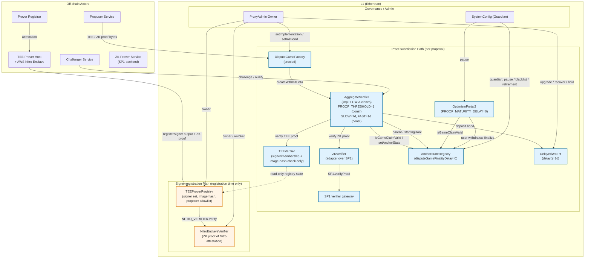

# Multiproof 系统架构与链上组件分析（Final）

> **Status**: final · **Source draft**: `drafts/round-2.md` @ `e5cced464661a7b9726d3a2e34b8840c338fa645`
> · **Adversarial verdict**: approve (confidence 0.86, comment `60247112-8b58-4237-9764-bbe302392851`).
> The body below is promoted verbatim from the approved round-2 draft; only the frontmatter
> `status`/`metadata` and this header were changed. The round-1 → round-2 revision summary
> and remaining open caveats (G-2, G-3, G-4, G-6, G-7) are preserved inline so the final
> section is self-contained and the deltas stay traceable without re-opening the draft.

# Multiproof 系统架构与链上组件分析（Round 2 Draft）

> **Revision summary (round 1 → round 2)**. Round 1 closed adversarial review `1a489b9a`
> with two **major** and one **minor** finding. Round 2 addresses all three plus a
> derived inconsistency in `PROOF_THRESHOLD`:
> - **Major — Fast-finality timer correction.** Path C 终态时间被改写为
>   `min(existingExpectedResolution, secondProofAt + FAST_FINALIZATION_DELAY)`，反映
>   `AggregateVerifier._decreaseExpectedResolution()` 的实际 Solidity 语义（L765-777）。
>   item-2 / item-6 / diag-3 / End-to-end timing 表全部同步更新。
> - **Major — Resolve G-1: Solidity source now available.** `base/contracts` 公开仓库
>   @ commit `affa48e250b298bd91e4b3ccaf669077b05c2a8f` 包含全部 8 个核心合约的 Solidity
>   实现（`src/L1/proofs/{AggregateVerifier,AnchorStateRegistry,DelayedWETH,DisputeGameFactory,
>   Verifier}.sol`、`src/L1/proofs/tee/{TEEVerifier,TEEProverRegistry,NitroEnclaveVerifier}.sol`、
>   `src/L1/proofs/zk/ZKVerifier.sol`、`src/L1/OptimismPortal2.sol`）。所有 "source unavailable"
>   caveat 已替换为行号级引用；G-1 在 §Gap Analysis 中标注 resolved。
> - **Major — PROOF_THRESHOLD reconciliation**：`base/contracts` @ affa48e2 的
>   `AggregateVerifier.sol` L68 把 `PROOF_THRESHOLD` 写成 `uint256 public constant
>   PROOF_THRESHOLD = 1`，**不是** round-1 描述的 "1 或 2 deploy-time constructor arg"。
>   item-1 / item-2 / item-6 / diag-3 / item-7 已全部按"PROOF_THRESHOLD 当前固定为 1，
>   常量"重写；同时显式标注：fast finality 的"必须双证"约束并非来自 `PROOF_THRESHOLD`，
>   而是来自 `expectedResolution` 在 `_getDelay()` 中按 `proofCount` 切换的逻辑（L824-832）。
> - **Minor — diag-2 label fix.** Phase 1 中 `DelayedWETH` 节点的 "unlock bond" 改成
>   "deposit/escrow bond"——与 `initializeWithInitData` 末尾的 `DELAYED_WETH.deposit{value:
>   msg.value}()`（AggregateVerifier.sol L404）一致。Unlock 仅在 `claimCredit()` 第一次
>   调用时触发（L611-614）。
>
> Remaining gaps as caveats（未被本轮覆盖）：G-2 (Sepolia/Mainnet 部署地址 + constructor args)、
> G-3 (`initBonds[gameType]` 实际数值)、G-4 (audit reports)、G-6 (ZK 实际 imageId 链上值)、
> G-7 (incident-response playbook)。详见 §Gap Analysis。

## Executive Summary

Base Azul 通过 **Multiproof 系统**重构了 L2 checkpoint 的 L1 仲裁层，把过去由
`FaultDisputeGame` 独占的 *optimistic + interactive bisection* 模式替换成由
`AggregateVerifier` 这个 dispute-game 合约协调的 **TEE + ZK 双证明聚合**模型。在
AggregateVerifier 内部：(i) 每个 proposal 是一组覆盖 `BLOCK_INTERVAL` 个 L2 区块的
checkpoint，并伴随所有 `INTERMEDIATE_BLOCK_INTERVAL` 处的中间 output root
（`AggregateVerifier.sol` L102-108）；(ii) 同一个 game 最多能容纳一个 TEE proof 和
一个 ZK proof（`verifyProposalProof` L417-418 的 `AlreadyProven` 检查）；(iii) 接受
的证明数量驱动 `expectedResolution` 在 `SLOW_FINALIZATION_DELAY = 7 days`（L51）与
`FAST_FINALIZATION_DELAY = 1 days`（L54）之间切换；(iv) `PROOF_THRESHOLD` 在 `base/contracts`
@ `affa48e2` 是 `uint256 public constant = 1`（L68），即 `resolve()` 在 `proofCount >= 1`
时就允许通过（L453），**与"双证 vs 单证"finality 的差异完全由 `_getDelay()` 的
`proofCount` 分支决定，而非 `PROOF_THRESHOLD`**。两条专用 verifier 合约（`TEEVerifier`、
`ZKVerifier`）以 immutable 构造参数固定在 AggregateVerifier 实现上（L82/L88），
`TEEProverRegistry` 负责把 AWS Nitro Enclave attestation 的验证从 *每次 proof submission*
路径里剥离出来，集中到 *signer registration* 路径——这是本主题最关键的信任边界拆分
（`TEEVerifier.sol` L78-99 vs `TEEProverRegistry.sol` L145-174）。

围绕这个新核心，三个 OP Stack 上游合约同步重构：`OptimismPortal2`
（`base/contracts/src/L1/OptimismPortal2.sol` L46/L217）把 `PROOF_MATURITY_DELAY_SECONDS`
做成 constructor immutable，Azul 部署把它配置为 0（与 spec 描述一致）；
`AnchorStateRegistry`（`base/contracts/src/L1/proofs/AnchorStateRegistry.sol` L32/L80）
保留 `DISPUTE_GAME_FINALITY_DELAY_SECONDS` 在 `isGameFinalized()` 中（L304），但 Azul 部署
预期把它配置为 0 或与 game 内部 delay 合并；`DelayedWETH`
（`base/contracts/src/L1/proofs/DelayedWETH.sol` L40/L47）的提款 `delay()` 仍是 constructor
immutable，Azul 部署值=1 day（仅用于 proposer bond escrow）。

**关键 finality 不变量**（本 round 修正点）。三条结算路径——TEE-only / ZK-only 各 7d、
TEE+ZK 同时存在 ≤1d——并不是 "两证就 1d、单证就 7d" 那么简单。`AggregateVerifier`
的 `_decreaseExpectedResolution()`（L765-777）在每次新增证明时执行：

```solidity
uint64 newResolution = uint64(block.timestamp) + delay;
expectedResolution = Timestamp.wrap(uint64(FixedPointMathLib.min(newResolution, expectedResolution.raw())));
```

`delay` 来自 `_getDelay()`（L824-832）：`proofCount == 1` 返回 `SLOW_FINALIZATION_DELAY`（7d），
`proofCount >= 2` 返回 `FAST_FINALIZATION_DELAY`（1d）。**新加入的 proof 只能让
`expectedResolution` 单调减小**——一旦 Path A/B 在 t=0 把 deadline 锁定到 createdAt+7d，
后到的 ZK/TEE 把 fast-path 候选时间设为 `secondProofAt + 1d`，但实际生效的是
`min(secondProofAt + 1d, createdAt + 7d)`。**Path C 的真实 finality
= `min(createdAt + SLOW_FINALIZATION_DELAY, secondProofAt + FAST_FINALIZATION_DELAY)`**：
- 若两证在游戏创建 tx 同一区块内全部完成（一个走 `initializeWithInitData`、一个走紧随其后的
  `verifyProposalProof`），fast path = createdAt + 1d；
- 若第二个 proof 在 `t = createdAt + 6d` 才提交，`min(7d, 6d+1d) = 7d`——双证存在但 finality
  仍然=单证 slow path；fast finality 在剩余窗口 < 1d 时**无加速**。

最终，Multiproof 的安全模型可以总结为："TEE 提供常态低延迟，ZK 作为 permissionless override
随时可以推翻 TEE-only 主张并没收 proposer bond；同类型双证（两个 TEE 或两个 ZK）被显式禁止
存储（`AggregateVerifier.sol` L417-418）；任一 verifier 一旦 `nullify` 即全局失效
（`Verifier.sol` L39-49）"。这套设计直接回应了 L2Beat Stage 2 对 permissionless proof
与去信任化挑战路径的要求，但仍保留了 ProxyAdmin/Guardian/SystemConfig 等紧急停机面
作为兜底（详见 item-7）。

---

## Item Findings

### item-1: Multiproof 设计哲学与多证明安全模型

**High-level summary.** Multiproof 不是"多个证明都对才算 finalize"的合取式安全，而是一种
**异类证明可互相 override** 的析取式 + 经济激励复合模型：TEE 服务于常态低延迟（permissioned，
单证可触发 7d finality）；ZK 作为 permissionless backstop 永远拥有 override 权，可挑战 TEE-only
主张、没收其 bond、把 game 置为 `CHALLENGER_WINS`；只有当 TEE 与 ZK *对同一 rootClaim 都接受*
时才进入"≤1d fast-finality"。这一设计同时实现了 Stage 2 标准要求的 "permissionless ZK proof"
与"足够去中心化"的两条主线（`base/base/docs/specs/pages/upgrades/azul/proofs.md`
§"Security and Decentralization"；Solidity 实现在 `AggregateVerifier.sol` 中表现为：
challenge 路径只接受 ZK proof 且只能在 TEE proof 存在时触发，L495-499）。

**Proof aggregation 与多证明的安全等价类**（按 `AggregateVerifier.sol` `_getDelay()` L824-832 与
`initializeWithInitData` L302-405 / `verifyProposalProof` L410-432 实际行为，而非靠 spec
推断）：

- *0 证明*：`expectedResolution = type(uint64).max`（L375，"never resolvable" 哨兵）；
  `_getDelay()` 返回 `type(uint64).max`。
- *1 证明（TEE 或 ZK 任一）*：`_getDelay()` 返回 `SLOW_FINALIZATION_DELAY`（L827-828），
  `_decreaseExpectedResolution()` 把 `expectedResolution` 从 `uint64.max` 减为
  `block.timestamp + 7d`。
- *2 证明（一个 TEE + 一个 ZK）*：`_getDelay()` 返回 `FAST_FINALIZATION_DELAY`
  （L825-826），`expectedResolution = min(now + 1d, existing)`——见 Executive Summary。
- *同类型双证（2 个 TEE 或 2 个 ZK）*：**禁止存储**——`verifyProposalProof()`
  在 `proofTypeToProver[proofType] != address(0)` 时 revert `AlreadyProven(proofType)`
  （`AggregateVerifier.sol` L417-418）。这一禁令把"同类型 prover 互证"挡在合约外，
  强制 fast finality 必须依赖 diversity（TEE+ZK 两套独立栈）。

**关键澄清：`PROOF_THRESHOLD` 当前不是"1 vs 2"的开关**。在 `base/contracts` @ affa48e2
的实现中 `PROOF_THRESHOLD = 1`（L68，`uint256 public constant`）——这意味着：

- `resolve()` 在 `proofCount >= 1` 即可通过（L453）。
- "TEE+ZK 才能 fast finalize" 的约束完全来自 `_getDelay()` 的 `proofCount` 分支——`proofCount == 2`
  时窗口 1d，`proofCount == 1` 时窗口 7d——而**不是** `PROOF_THRESHOLD` 提到 2。
- 若未来治理希望强制"必须双证才能 resolve"，需要部署新的 AggregateVerifier 实现把
  `PROOF_THRESHOLD` 提升到 2 并通过 `DisputeGameFactory.setImplementation(gameType, impl)`
  替换（已 clone 的 game 通过 immutable args 保留旧值，见 item-2）。
- Round-1 描述的 "PROOF_THRESHOLD 1 或 2 deploy-time" 是基于 spec 的误读；本 round 按 Solidity
  事实订正。

**ZK override 在 Stage 2 下的角色.** ZK 的 override 是 *永久且 permissionless* 的：任何持有
canonical RPC 与 SP1 后端的运营者都可以构造 ZK proof，通过 `challenge()` 把 TEE-only
proposal 反转——`AggregateVerifier.sol` `challenge()` L475-536 不要求 challenger 在任何
allowlist 内，但严格要求：(1) game `IN_PROGRESS`（L483）；(2) game 是 proper（L486）；
(3) 父 game 未 `CHALLENGER_WINS`（L489）；(4) 已有 TEE proof（L492）；(5) 尚无 ZK proof
（L495）；(6) 提交的 ProofType == ZK（L498-499）。在 `resolve()` 阶段，
`counteredByIntermediateRootIndexPlusOne > 0` 触发 `status = CHALLENGER_WINS` 且
`bondRecipient = proofTypeToProver[ProofType.ZK]`（L456-458）。反方向不允许：TEE 不能
挑战已存的 ZK proof，因为 challenge 要求 `proofTypeToProver[ProofType.TEE]` 已设置（L492）。
这建立了一个**单向 trust hierarchy**：ZK > TEE，TEE permissioned set 在 ZK 面前是去信任化的。

**Soundness alert 设计目的**（更新引用）。当一个已接受证明被 `nullify()` 用矛盾的
intermediate root 推翻时（`AggregateVerifier.sol` L543-594），相应 verifier 合约会被
显式 nullify：`L589-593` 在 nullify 成功后调用
`IVerifier(ZK_VERIFIER).nullify()` 或 `IVerifier(TEE_VERIFIER).nullify()`。被 nullify 之后，
所有未来对该 verifier 的 `verify()` 调用 revert with `Nullified()`（`Verifier.sol`
L26-30 `notNullified` modifier；`Verifier.sol` L39-49 `nullify()` 实现要求调用方是 registered/
respected/non-blacklisted/non-retired 的 dispute game）。这把局部 proof 冲突升级为
**全系统的 fail-closed**——一次发现 enclave bug 或 ZK image hash collision，立即冻结所有
同类型 verifier 的接受流，逼迫治理介入。这是 multiproof 系统对"单点失效"最尖锐的防护，
也是 ZK 与 TEE 互不为单点的关键不变量。

### item-2: AggregateVerifier 争议游戏核心合约

**Contract location**: `base/contracts/src/L1/proofs/AggregateVerifier.sol` @ commit
`affa48e250b298bd91e4b3ccaf669077b05c2a8f`（1041 lines；`pragma solidity 0.8.15`；
`contract AggregateVerifier is Clone, ReentrancyGuard, ISemver`，custom:semver `0.1.0`，L1038）。

**Contract interface 与状态机**。AggregateVerifier 是 dispute-game 实现，通过
`DisputeGameFactory.createWithInitData(gameType, rootClaim, extraData, initData)` 以
clone-with-immutable-args（CWIA）模式被克隆（继承 `lib/solady/src/utils/Clone.sol`，
`AggregateVerifier.sol` L23 / L30；Clone-data 偏移由 `_getArgAddress(0x00)` 等读取，
L729-753）。Clone-data 布局：

| Offset | Length | Field | Source line |
|---|---|---|---|
| `0x00` | 20 | `gameCreator()` | L730-732 (`_getArgAddress(0x00)`) |
| `0x14` | 32 | `rootClaim()` | L735-737 (`_getArgBytes32(0x14)`) |
| `0x34` | 32 | `l1Head()` | L740-742 |
| `0x54` | 32 | `l2SequenceNumber()` (extraData) | L746-748 (`_getArgUint256(0x54)`) |
| `0x74` | 20 | `parentAddress()` (extraData) | L751-753 |
| `0x88 + 0x20*i` | 32 | `intermediateOutputRoot(i)` (extraData) | L714-717 |

`intermediateOutputRootsCount() = BLOCK_INTERVAL / INTERMEDIATE_BLOCK_INTERVAL`（L703-705），
且**最后一个 intermediate root 必须等于 `rootClaim`**（L337-341，
`intermediateOutputRoot(count-1) != rootClaim().raw()` revert
`IntermediateRootMismatch`）。

Constructor immutables（`AggregateVerifier.sol` L262-296）：

| Immutable | Solidity 行号 | 语义 |
|---|---|---|
| `GAME_TYPE` | L114, L281 | dispute-game type identifier |
| `ANCHOR_STATE_REGISTRY` | L73, L282 | IAnchorStateRegistry 地址 |
| `DISPUTE_GAME_FACTORY` | L76, L283 | 由 registry 构造期读取 (`ANCHOR_STATE_REGISTRY.disputeGameFactory()`) |
| `DELAYED_WETH` | L79, L284 | bond escrow |
| `TEE_VERIFIER` | L82, L285 | TEE 验证器（不可变） |
| `ZK_VERIFIER` | L88, L286 | ZK 验证器（不可变） |
| `TEE_IMAGE_HASH` | L85, L287 | bytes32，TEE 期望 image hash，写入 TEE journal |
| `ZK_RANGE_HASH` | L91, L288 | range-program VK commitment（写入 ZK journal） |
| `ZK_AGGREGATE_HASH` | L94, L289 | aggregation-program VK（imageId 传给 SP1 gateway） |
| `CONFIG_HASH` | L97, L290 | rollup config hash |
| `L2_CHAIN_ID` | L100, L291 | uint256 |
| `BLOCK_INTERVAL` | L104, L292 | proposal 涵盖区块数 |
| `INTERMEDIATE_BLOCK_INTERVAL` | L108, L293 | 中间 root 步长 |
| `INITIALIZE_CALLDATA_SIZE` | L111, L295 | `0x8E + 0x20 * intermediateOutputRootsCount()`，用作 calldata 长度校验 |

Constants（不是 immutable，是 `public constant`，全实例共享）：

| Constant | Solidity 行号 | 当前值 |
|---|---|---|
| `SLOW_FINALIZATION_DELAY` | L51 | `7 days` |
| `FAST_FINALIZATION_DELAY` | L54 | `1 days` |
| `EIP2935_CONTRACT` | L59 | `0x0000F90827F1C53a10cb7A02335B175320002935` |
| `BLOCKHASH_WINDOW` | L62 | `256` |
| `EIP2935_WINDOW` | L65 | `8191` |
| `PROOF_THRESHOLD` | L68 | `1`（**round-2 关键订正**） |

**Proof aggregation 与 dispute logic**。`initializeWithInitData(proof)` 路径
（L302-405）按顺序：

1. `initialized` 检查（L304）；
2. `expectedCallDataSize` 严格校验，防止"extraData 多/少字节 → 同一 proposal 不同 UUID"
   (L312-334)；
3. final intermediate root 必须等于 `rootClaim`（L337-341）；
4. 解析 starting root：若 `parentAddress == address(ANCHOR_STATE_REGISTRY)`（L344），
   取 `ANCHOR_STATE_REGISTRY.getStartingAnchorRoot()`（L356）；否则要求 parent 是有效
   game（`_isValidGame()` L963-967，要求 registered + respected + !blacklisted + !retired
   + not CHALLENGER_WINS）；
5. 强制 `l2SequenceNumber() == startingOutputRoot.l2SequenceNumber + BLOCK_INTERVAL`
   （L360-362）；
6. 标记 `initialized = true`、记录 `createdAt`、`wasRespectedGameTypeWhenCreated`、
   初始化 `expectedResolution = type(uint64).max`（L364-375）；
7. 用 `blockhash()`（≤ 256 区块）或 EIP-2935 history（≤ 8191 区块）校验 L1 origin
   （`_verifyL1Origin()` L972-1004）；
8. 调用 `_verifyProof()` 路由到 `_verifyTeeProof()` 或 `_verifyZkProof()`
   （L850-874 路由 + L879-942 实现）；
9. `_proofVerifiedUpdate()` 写入 prover、`proofCount += 1`、调用
   `_decreaseExpectedResolution()`、emit `Proved`（L755-762）；
10. `bondRecipient = gameCreator()`（L400）；
11. **`DELAYED_WETH.deposit{ value: msg.value }();`**（L404）——这是**存入**bond
    （`DelayedWETH.sol` 继承 WETH98，`deposit()` 给 caller 增发 WETH 余额）。**不是 unlock**；
    unlock 在 `claimCredit()` 中（L611-614）。

Initialization proof bytes 格式（L378-394）：

```
[0, 1)    ProofType: 0 = TEE, 1 = ZK (`ProofType` enum L36-39)
[1, 33)   L1 origin hash
[33, 65)  L1 origin block number
[65, end) verifier-specific proof bytes
```

`verifyProposalProof(proofBytes)`（L410-432）用于 game 进行中追加*另一类型*的证明：
要求 `status == IN_PROGRESS`（L412）、`!gameOver()`（L415）、`proofTypeToProver[proofType]
== address(0)`（L417-418）。proof bytes 格式简化为：

```
[0, 1)    ProofType
[1, end)  verifier proof bytes
```

L1 origin 使用 `l1Head()`（即 CWIA 中固定的 parent L1 blockhash），不再读 L1 origin
新值。同类型证明禁止重复存储——`AlreadyProven(proofType)`。

`challenge(proofBytes, intermediateRootIndex, intermediateRootToProve)` (L475-536)
精确前提（前述 item-1 已列出 6 条 + 索引边界 + root 必须不同）。验证通过后：
- `proofTypeToProver[ProofType.ZK] = msg.sender`（L519）；
- `proofCount += 1`（L526）；
- `expectedResolution = block.timestamp + SLOW_FINALIZATION_DELAY`（L529，**注释 L521-525
  解释这里"故意"用 slow 而不是 fast：让 ZK challenge 本身在 7d 内可被 nullify**）；
- `counteredByIntermediateRootIndexPlusOne = intermediateRootIndex + 1`（L532，1-based）；
- emit `Challenged`（L535）。

`nullify(proofBytes, intermediateRootIndex, intermediateRootToProve)` (L543-594):
- 对未被挑战的 game：`_checkIntermediateRoot()` 要求 supplied root ≠ 当前 proposed
  intermediate root（L566 + L1010-1015）；
- 对**被挑战**的 game：`intermediateRootIndex == counteredByIntermediateRootIndexPlusOne - 1`
  且 `intermediateRootToProve == intermediateOutputRoot(intermediateRootIndex)`（即 nullify
  必须证明*被挑战的*那个 intermediate root *确实*等于 proposed 值，从而否定 challenger）
  且 supplied ProofType 必须是 ZK（L557-564）；
- 成功后 `_proofRefutedUpdate()`：删除该 prover、若 ZK 则清除 countered index、
  `proofCount -= 1`、`_increaseExpectedResolution()` 把 deadline 重置到 `now + delay`
  甚至 `uint64.max`（L780-794, L796-809）；
- emit `Nullified`；
- **触发对应 verifier 的 `nullify()`**（L589-593），从此 verifier 全局 revert。

`resolve()` (L435-469) permissionless：
- `status` 必须 `IN_PROGRESS`（L437）；
- parent 必须已 resolved；若 parent `CHALLENGER_WINS`，本 game 自动也 `CHALLENGER_WINS`
  （L441-446）；否则先 `_updateProofCount()`（L449，扫两个 verifier 是否被 nullify，
  如是同步 `_proofRefutedUpdate()`）；
- 要求 `gameOver()`（即 `expectedResolution <= block.timestamp`，L697-699）；
- 要求 `proofCount >= PROOF_THRESHOLD`（L453；`PROOF_THRESHOLD == 1`，所以等价于
  `proofCount >= 1`）；
- 被挑战 → `CHALLENGER_WINS` 且 `bondRecipient = proofTypeToProver[ProofType.ZK]`
  （L456-458）；否则 `DEFENDER_WINS`（L460）；
- emit `Resolved`、记录 `resolvedAt`（L464-466）。

`closeGame()` (L629-651) permissionless：要求 ASR 未 paused、game `resolvedAt != 0`、
`ASR.isGameFinalized(this) == true`；尝试 `ANCHOR_STATE_REGISTRY.setAnchorState(this)`，
anchor update 是 best-effort（`try { } catch { }`，L650）。

`claimCredit()` (L598-626) 两阶段：
- 第一次调用：`!bondUnlocked` → 调 `DELAYED_WETH.unlock(bondRecipient, bondAmount)`、
  `bondUnlocked = true`、return（L611-615）；
- 等 `DELAYED_WETH.delay()` 秒后再调一次：`bondClaimed = true`，
  `DELAYED_WETH.withdraw(bondRecipient, bondAmount)`，`bondRecipient.call{value:...}`
  转账（L617-625）。
- **Safety stop**（L602-609）：若 `expectedResolution == type(uint64).max`（即 nullify 把
  proofs 全部撤掉后 deadline 又回到 sentinel），需要等到 `createdAt + 14 days` 才允许
  绕过 resolve 检查领回 bond——避免 bond 永久 lock，14d 是治理介入窗口。

**Soundness 不变量（cross-contract）**。
1. **Verifier separation**：`_verifyTeeProof()` 把 `TEE_IMAGE_HASH` 显式写入 journal（L901），
   `_verifyZkProof()` 把 `ZK_RANGE_HASH` 写入 journal（L936）——两类 proof 不能跨域
   重放，因为 journal hash 不一致。
2. **Same-type duplication banned**：见 item-1。
3. **L1 origin consistency**：initialize 用 proof 携带的 L1 origin（L380-383），后续
   `verifyProposalProof`/`challenge`/`nullify` 用 CWIA 中固定的 `l1Head()`（L424/L510/L576），
   保证同一 game 的 5 个 verify 路径都共享一个 L1 origin。
4. **PROOF_THRESHOLD 与 expectedResolution 解耦**：`resolve()` 的 proof 数量门与 fast/slow
   delay 是两层独立机制，前者控制*能否*，后者控制*何时*。
5. **Immutable verifier per game instance**：clone 一旦创建，`TEE_VERIFIER` / `ZK_VERIFIER`
   不能改变（L82, L88），工厂 owner 替换 implementation 只影响**未来**clone。

**与 OP Stack FaultDisputeGame 的同构 / 差异**。
共同点：CWIA clone、`DisputeGameFactory` 作为路由、`GameStatus` enum
（`GameStatus { IN_PROGRESS, CHALLENGER_WINS, DEFENDER_WINS }`，引用自
`src/libraries/bridge/Types.sol`）、`resolve()` / `claimCredit()` 双相 bond 释放、
registry 作为最终 anchor source。差异：
- FaultDisputeGame 通过 `MAX_GAME_DEPTH` / `MAX_CLOCK_DURATION`
  （`optimism/packages/contracts-bedrock/src/dispute/FaultDisputeGame.sol`
  L128/L135/L234-237）控制 bisection 树深度与单步时钟，结算延迟以"clock 走完"为信号；
  AggregateVerifier 不做 bisection 而把整个 range 的 intermediate roots **打包进 CWIA
  extraData**，挑战收敛到"任一 intermediate interval 的 ZK 反例"——证明粒度从 `1` 步 EVM
  step 上升到 `INTERMEDIATE_BLOCK_INTERVAL` 个 L2 区块。
- FaultDisputeGame 没有 `PROOF_THRESHOLD` / `expectedResolution` 这类参数化 finality；
  其结算窗口完全等于 `MAX_CLOCK_DURATION`。Azul 把 finality 与 proof 数量耦合。

**Bond economics**。Init bond 由 factory owner 通过 `setInitBond(gameType, initBond)` 设置
（`base/contracts/src/L1/proofs/DisputeGameFactory.sol` L352-353），proposer 在
`createWithInitData` 时必须支付**精确等值**的 ETH（L215：`if (msg.value != initBonds[_gameType])
revert IncorrectBondAmount()`）。Bond 由 AggregateVerifier 在 `initializeWithInitData()` 末尾
`DELAYED_WETH.deposit{value: msg.value}()` 存入（L403-404），`bondRecipient` 通过两阶段
`claimCredit()` 领取。Challenger 成功后 `bondRecipient = proofTypeToProver[ProofType.ZK]`
自动切换（L458），**TEE prover 在 challenge 中失去全部 bond**——这是 challenger 的主要
经济激励。Init bond 的 Sepolia/Mainnet 实际数值未在本研究范围内取得（G-3）。

**Security assumptions**。见 item-1 关于异类双证 + verifier nullification。AggregateVerifier
自身不持任何 ETH（除 CWIA storage）；bond 始终在 `DelayedWETH` 中托管。Implementation 本身
可被 factory owner 通过 `setImplementation(gameType, impl)` 替换，但**已 clone 的 game 由
immutable args 锁定 verifier 地址**，因此实现替换只影响**新 clone**，不影响进行中的 game。

**Governance & immutability**。AggregateVerifier 本身没有 owner，无 pause / upgrade entry，
所有可变行为都是 permissionless clone 内行为；治理面集中在
- `DisputeGameFactory.owner`（升级 implementation + `setInitBond`）；
- `AnchorStateRegistry` 的 guardian / retirement timestamp / blacklist（详见 item-5）。

**On-chain deployments**. 在本研究可访问范围内（`base/base` + `base/contracts`
+ specs），**未发现** Sepolia / Mainnet 的具体 AggregateVerifier 部署地址、constructor
args 或 proxy → implementation 映射。Gap 记入 §"Gap Analysis"（G-2）。

**Code references**.
- `base/contracts/src/L1/proofs/AggregateVerifier.sol` @ affa48e2（1041 lines）;
- `base/contracts/src/L1/proofs/DisputeGameFactory.sol` @ affa48e2（356 lines）;
- `base/base/docs/specs/pages/protocol/proofs/contracts.md`（背景，但 round-2 优先 Solidity）;
- 对比：`optimism/packages/contracts-bedrock/src/dispute/FaultDisputeGame.sol`
  L128/L135（**source available**）。

### item-3: TEEVerifier / ZKVerifier 子系统与 TEE 信任边界拆分

**核心区分**：本 item 严格按 outline 要求把 TEE 信任拆为两条互不调用的路径，引用全部
来自 `base/contracts` @ affa48e2 实际 Solidity。

#### Proof-submission 路径（每次 proposal 都执行）

**TEEVerifier**（`base/contracts/src/L1/proofs/tee/TEEVerifier.sol`，106 lines，
`pragma solidity 0.8.15`，custom:semver `0.2.0` L102；`contract TEEVerifier is Verifier,
ISemver` L20）：

Proof bytes 格式（L52）：

```
[0, 20)   Proposer address
[20, 85)  65-byte ECDSA signature (over journal directly, no eth-signed-message prefix)
```

`verify(proofBytes, imageId, journal)`（L57-99）按 5 步执行（**完全在合约状态层完成，绝无
Nitro attestation 解析**）：

1. `proofBytes.length >= 85`（L68）；
2. `ECDSA.tryRecover(journal, signature)`（L75）干净 recover——签名直接覆盖 journal hash，
   注释 L73-74 显式说明无 EIP-191 prefix；
3. **proposer 在 `TEEProverRegistry.isValidProposer[proposer]` 中**（L81-83）——
   per-proposer 配额，与 signer 注册解耦；
4. **recovered signer 在 `TEEProverRegistry.isRegisteredSigner[signer]` 中**（L86-88）；
5. **signer 的 registered image hash == 调用方传入的 `imageId`**——
   `registeredImageHash = TEE_PROVER_REGISTRY.signerImageHash(signer)`；
   `if (registeredImageHash != imageId) revert ImageIdMismatch(...)`（L93-96）。

注意 (3)(4)(5) 都**只读 registry 的 storage state**（`mapping(address => bool)` /
`mapping(address => bytes32)`）。TEEVerifier *从不调用* NitroEnclaveVerifier。Nitro
attestation 验证发生在更早一步——signer 注册阶段（见下方 sub-section）。

`TEEVerifier` 继承 `Verifier`（`base/contracts/src/L1/proofs/Verifier.sol` L8-50），
带 `notNullified` modifier（`Verifier.sol` L27-30）：一旦被 nullify 全局冻结。`verify()`
function 标注 `notNullified`（`TEEVerifier.sol` L65）。

**ZKVerifier**（`base/contracts/src/L1/proofs/zk/ZKVerifier.sol`，48 lines；
`contract ZKVerifier is Verifier` L14；custom:semver `0.1.0`，L44；no ISemver—— note：
ZKVerifier 没有继承 ISemver，与 TEEVerifier 略有差异）：

```solidity
function verify(bytes calldata proofBytes, bytes32 imageId, bytes32 journal)
    external view override notNullified returns (bool)
{
    SP1_VERIFIER.verifyProof(imageId, abi.encodePacked(journal), proofBytes);
    return true;
}
```
（`ZKVerifier.sol` L29-42）

`imageId = ZK_AGGREGATE_HASH`（来自 `AggregateVerifier.sol` `_verifyZkProof` L941，
`ZK_VERIFIER.verify(proofBytes, ZK_AGGREGATE_HASH, journal)`）。`journal` 是
`AggregateVerifier` 用 `keccak256(abi.encodePacked(proposer, l1OriginHash, startingRoot,
startingL2SequenceNumber, endingRoot, endingL2SequenceNumber, intermediateRoots,
CONFIG_HASH, ZK_RANGE_HASH))` 组装的公共输入 commitment（L926-938；注意 `ZK_RANGE_HASH`
进 journal，`ZK_AGGREGATE_HASH` 进 imageId——双重 commitment）。底层 `SP1_VERIFIER`
（`L16-22`）是 Succinct **SP1 verifier gateway**，意味着 ZKVerifier 是一个**轻量 adapter** —
没有自己的密码学验证逻辑，依赖 SP1 gateway 的 onchain Groth16 验证器。VK 通过 gateway 的版本化
路由可以由 Succinct 治理更新，但 AggregateVerifier 上的 `ZK_AGGREGATE_HASH` / `ZK_RANGE_HASH`
是 immutable，所以同一 game 始终对应同一对 ZK 验证密钥。同样继承 nullification
（`Verifier.sol` L26-30 / L39-49）。

#### Signer-registration 路径（注册时才执行，proposal 期间不调用）

**TEEProverRegistry**（`base/contracts/src/L1/proofs/tee/TEEProverRegistry.sol`，260 lines；
`pragma solidity 0.8.15`；`contract TEEProverRegistry is OwnableManagedUpgradeable, ISemver`
L26；custom:semver `0.5.0`，L238）：

state（L29-63）：
- `MAX_AGE = 60 minutes`（L29，constant）；
- `MS_PER_SECOND = 1000`（L34，private constant，AWS Nitro 时间戳是毫秒）；
- `NITRO_VERIFIER`（L37，immutable INitroEnclaveVerifier）；
- `DISPUTE_GAME_FACTORY`（L40，immutable）；
- `gameType`（L44，public，owner-settable via `setGameType()` L121-131）；
- `isRegisteredSigner[signer]`（L47，`mapping(address => bool)`）；
- `signerImageHash[signer]`（L55，`mapping(address => bytes32)`）；
- `isValidProposer[signer]`（L58，proposer allowlist，由 `setProposer` L113-116 管理）；
- `_registeredSigners`（L63，`EnumerableSetLib.AddressSet`，提供 O(1) enumerable）；
- owner / manager 角色由 `OwnableManagedUpgradeable` 提供（L26）；构造里 init 给
  `address(0xdEaD)`（L103-104，部署后通过 proxy initializer 由 ProxyAdmin owner 接手）。

`registerSigner(output, proofBytes)`（L145-174）：

```text
journal = NITRO_VERIFIER.verify(output, ZkCoProcessorType.RiscZero, proofBytes)
  → 要求 journal.result == VerificationResult.Success（L148）
  → 要求 journal.timestamp/1000 + MAX_AGE > block.timestamp（L152，attestation ≤ 60min 旧）
  → publicKey 必须是 65 字节 ANSI X9.62（0x04 || x || y）（L162）
  → enclaveAddress = address(uint160(uint256(keccak256(x||y))))（L164-168，assembly skip
    first byte 0x04 prefix，hash 64 bytes）
  → pcr0Hash = keccak256(abi.encodePacked(pcr0.first, pcr0.second))
    （`_extractPCR0Hash()` L251-259）
  → isRegisteredSigner[enclaveAddress] = true（L170）
  → signerImageHash[enclaveAddress] = pcr0Hash（L171）
  → _registeredSigners.add(enclaveAddress)（L172）
```

`isValidSigner(signer)`（L191-193）：
```solidity
return isRegisteredSigner[signer] && signerImageHash[signer] == _getExpectedImageHash();
```
`_getExpectedImageHash()`（L242-248）：通过 staticcall 读
`DISPUTE_GAME_FACTORY.gameImpls(gameType).TEE_IMAGE_HASH()`。**关键性质**：当 AggregateVerifier
implementation 升级到新 image hash 时，旧 signers 自动失效（注释 L186-188）。**注意**：
TEEVerifier.sol L86-96 实际**没有调用** `isValidSigner()`，而是分别检查
`isRegisteredSigner[signer]` 与 `signerImageHash[signer] == imageId`；语义等价但是直接展开。

`setGameType(gameType_)` (L121-131) 验证新 game type 的 AggregateVerifier 实现确实
返回非零 TEE_IMAGE_HASH，否则回滚旧值（L126-129）。

**关键设计性质**："Signer registration itself is PCR0-agnostic"（contract NatSpec 注释
L22-25 + `registerSigner` 注释 L137-142）——允许跨 image hash 升级**预注册**，避免升级
窗口期出现 signer 真空。

**NitroEnclaveVerifier**（`base/contracts/src/L1/proofs/tee/NitroEnclaveVerifier.sol`，
709 lines；SPDX `Apache2.0` L1，**与其它 MIT 合约不同**；`pragma solidity ^0.8.0`；
`contract NitroEnclaveVerifier is Ownable, INitroEnclaveVerifier, ISemver` L44；
NatSpec 注明 "Custom version of Automata's NitroEnclaveVerifier" L20-21）：

它是一个**ZK proof of AWS Nitro Enclave attestation** 的验证器，本身不直接做 X.509 / COSE
解析；而是通过 `IRiscZeroVerifier.verify` 或 `ISP1Verifier.verifyProof` 验证一个证明
"attestation 文档对 trusted root cert / 时间戳 / PCR 集合都是 well-formed 的"的 ZK 证明
（L13-14 imports；L260-265 root cert 验证；L633 timestamp 校验，要求
`timestamp + maxTimeDiff > block.timestamp && timestamp < block.timestamp`）。

主要 state / 治理面（L45-70）：
- `proofSubmitter`（L50，仅此地址可调用 verify/batchVerify，L487/L519）；
- `revoker`（L53，可吊销已 cached 中间证书）；
- `zkConfig[ZkCoProcessorType]`（L56，RISC Zero / SP1 路由）；
- `trustedIntermediateCerts`（L59，certHash → notAfter）；
- `maxTimeDiff`（L62，timestamp tolerance window）；
- `rootCert`（L65，bytes32 root cert hash；通过 `setRootCert()` L540 更换）；
- `_zkVerifierRoutes`（L68）+ FROZEN sentinel `address(0xdead)`（L47）；
- `_verifierProofIds`（L71）。

`verify(output, zkCoprocessor, proofBytes)`（路由表 + 验证逻辑，L420-490 区域；
`freezeVerifyRoute()` L421-431 **永久性 freezing**）。Route freezing 是**永久且不可逆**——
一旦冻结路由所有未来 verify 调用都 revert。`revokeCert(certHash)`（L347）可由 owner 或
revoker 调用，吊销已 cached 中间证书。

#### 拆分必要性（unchanged from round-1，但增加 Solidity 引用）

把 attestation 验证留在 proof submission 路径有三个不可接受的代价：
1. **Gas 成本**：每次 proposal 都做一次完整 AWS Nitro 证书链 + PCR 校验，按 RISC Zero/SP1
   onchain 验证的成本估算每次开销大概率超过 1M gas；
2. **复杂攻击面**：proof submission 路径越短越好，避免 attestation 流的旁路（如证书 revocation
   时序问题）影响主路径活性；
3. **升级灵活性**：image hash 升级与 enclave 镜像旋转可以在 registry 内 batch 完成，proposal
   路径无需感知。

拆分后，proof submission 路径只读 registry storage（`isRegisteredSigner`、`signerImageHash`、
`isValidProposer`，三个 mapping 读取，gas 接近常数）；Nitro attestation 仅在 prover
寿命级别（按 outline 提示由 *Prover Registrar* 周期性 refresh，详细 off-chain 流程归
`multiproof-provers-challengers` 子课题）执行。

**Governance & immutability**.
- `TEEVerifier` 与 `ZKVerifier` 的地址在 AggregateVerifier 上是 immutable 构造参数
  （AggregateVerifier.sol L82, L88），同一 game type 的所有 clone 都指向同一对 verifier。
  升级 verifier 必须通过 factory owner 替换 `gameType` 的 implementation（即部署一个新的
  AggregateVerifier 实现，其 constructor 指向新 verifier）。
- `TEEProverRegistry` 的 image hash 通过 `setGameType()` 间接控制（实际值来自 game
  implementation 的 `TEE_IMAGE_HASH`），signer set 由 owner / manager 维护
  （`setProposer` `onlyOwner`，`registerSigner` `onlyOwnerOrManager` L145；
  `deregisterSigner` `onlyOwnerOrManager` L178）。
- `NitroEnclaveVerifier` 治理面：root cert (`setRootCert` L540) / `maxTimeDiff`
  / `proofSubmitter` / `revoker` / `zkConfig` / route override (`updateZkVerifierRoute`
  附近) / route freezing (`freezeVerifyRoute` L421)，全部 `onlyOwner`。

**On-chain deployments**. 未在 base/contracts repo configs 或 base/base 仓库中发现
Sepolia / Mainnet 具体地址。Gap 记入 §"Gap Analysis"（G-2）。

**Code references**.
- `base/contracts/src/L1/proofs/tee/TEEVerifier.sol` @ affa48e2（106 lines）；
- `base/contracts/src/L1/proofs/tee/TEEProverRegistry.sol` @ affa48e2（260 lines）；
- `base/contracts/src/L1/proofs/tee/NitroEnclaveVerifier.sol` @ affa48e2（709 lines）；
- `base/contracts/src/L1/proofs/zk/ZKVerifier.sol` @ affa48e2（48 lines）；
- `base/contracts/src/L1/proofs/Verifier.sol` @ affa48e2（50 lines，abstract base + nullify
  共享逻辑）。

### item-4: DelayedWETH bond 托管与提款延迟优化

**角色定位**. DelayedWETH 是 WETH 的"延迟提款变体"，被 AggregateVerifier 用作 proposer bond
escrow。`base/contracts/src/L1/proofs/DelayedWETH.sol`（130 lines；
`pragma solidity 0.8.15`；`string public constant version = "1.5.0"` L34；继承
`Initializable, ProxyAdminOwnedBase, ReinitializableBase, WETH98, ISemver` L25）。

**接口**. 关键方法（行号取自 `base/contracts` @ affa48e2）：

| Function | Line | Semantics |
|---|---|---|
| `constructor(uint256 _delay)` | L46-49 | 把 `_delay` 存入 immutable `DELAY_SECONDS`（L40），`_disableInitializers()` |
| `delay()` | L63-65 | external view，返回 `DELAY_SECONDS` |
| `initialize(ISystemConfig _systemConfig)` | L53-59 | proxy initializer，绑定 SystemConfig（提供 paused / superchainConfig） |
| `unlock(address _guy, uint256 _wad)` | L76-85 | 写 `withdrawals[msg.sender][_guy] = {amount: existing+_wad, timestamp: block.timestamp}` |
| `withdraw(address _guy, uint256 _wad)` | L96-104 | 要求 `!systemConfig.paused()`、unlock 已存在、`timestamp + DELAY_SECONDS <= block.timestamp`、`amount >= _wad`；通过后扣减并 `super.withdraw(_wad)`（WETH98 burn + send ETH） |
| `recover(uint256 _wad)` | L108-113 | proxy admin owner pull 任意 ETH（emergency） |
| `hold(address _guy)` / `hold(_guy, _wad)` | L117-129 | proxy admin owner pull 任一账户的 WETH |

两阶段提款语义（在 proof game 场景下，由 `AggregateVerifier.claimCredit()` 驱动）：

```
1. game.claimCredit(): first call
     → DELAYED_WETH.unlock(bondRecipient, bondAmount)  // writes timestamp
     → bondUnlocked = true; return
2. wait DELAY_SECONDS seconds
3. game.claimCredit(): second call
     → DELAYED_WETH.withdraw(bondRecipient, bondAmount)
     → bondRecipient.call{value: bondAmount}(hex"")
```

`withdrawals[msg.sender][subAccount]` 是 unlock 凭证的主键（L37、L82）。在 proof game
场景：`msg.sender = AggregateVerifier clone`、`_guy = bondRecipient`（initial =
`gameCreator()`，被 challenge 后 = `proofTypeToProver[ProofType.ZK]`）。

**提款延迟参数**。
- Azul 部署预期值：**`delay() = 1 day` 固定**（spec：
  `base/base/docs/specs/pages/upgrades/azul/proofs.md`："`DelayedWETH`: still escrows the
  proposal bond for each game, but Azul reduces its withdrawal delay to 1 day. That is
  sufficient here because the only bonds at stake are proposer bonds."）
- 对应 Solidity：`uint256 internal immutable DELAY_SECONDS;`（L40）+
  `constructor(uint256 _delay)`（L46-47），即**真值在部署 constructor arg**——同一份合约源码
  在 OP Stack 上游典型部署值是 7d、Azul 部署值是 1d（86400 s）。源码层面 OP Stack 与
  base/contracts 是同一 spec、差异仅在 `_delay` constructor arg 与 `version` constant
  （base/contracts @ affa48e2: "1.5.0"，L34）。Sepolia / Mainnet 实际部署常数未在本研究
  范围内取得（G-2 partial / G-3 related）。

**为什么 1 天足够（与 finality 窗口的关系）**.
- 仅 proposer bond 受此 delay 约束（spec 显式说明）；用户跨桥提款由 OptimismPortal2 控制
  （详见 §item-5），与 `DelayedWETH.delay()` 完全解耦。
- 在 Azul finality 模型下：
  - TEE+ZK fast path：`expectedResolution = min(createdAt + 7d, secondProofAt + 1d)`，
    `resolve()` 后立即 `claimCredit()` 第一阶段，再等 1 天就能拿到 ETH。最快情况下
    （两证同区块）proposer 总等待 ≈ 1d + 1d = 2d。
  - 单证 7d path：`resolve()` 至少要 7d，之后 1d DelayedWETH，总 ≈ 8d。
- 1d 的设计意图是**给 guardian 留下 24h 紧急干预窗口**（pause / blacklist），但又不至于把
  fast finality 的 proposer 体验拖回 OP Stack 旧版的 7d。

**Bond size 与 slashing 路径**. Init bond 大小通过
`DisputeGameFactory.setInitBond(gameType, initBond)` 由 factory owner 配置
（`base/contracts/src/L1/proofs/DisputeGameFactory.sol` L352-353）；具体数值未在本研究可访问
范围内给出。**Slashing**：被 challenge 成功的 proposer 失去全部 bond，
bond 经由 `bondRecipient = ZK prover` 路径（`AggregateVerifier.sol` L458）转到 challenger。
这是 challenger 的主要经济激励。

**Bond 永久 lock 防护**. `AggregateVerifier.claimCredit()` L602-609：

```solidity
if (expectedResolution.raw() != type(uint64).max) {
    if (resolvedAt.raw() == 0) revert GameNotResolved();
} else {
    if (block.timestamp < createdAt.raw() + 14 days) revert GameNotOver();
}
```

——nullify 把 game 推回 0 proof（`_increaseExpectedResolution` L796-809 在 `delay ==
uint64.max` 时重置 `expectedResolution = type(uint64).max`）后给一个 **14 天**兜底窗口，
避免 bond 永久卡死。

**"DelayedWETH delay" vs "用户跨桥提款 delay" 的概念区分**。

| 概念 | 控制者 | Azul 期望值 | 影响对象 | Solidity 引用 |
|---|---|---|---|---|
| `DelayedWETH.delay()` | constructor immutable | 1 day | proposer bond escrow | `DelayedWETH.sol` L40/L63 |
| `AggregateVerifier.SLOW_FINALIZATION_DELAY` | impl constant | 7 days | 单证 game resolve | `AggregateVerifier.sol` L51 |
| `AggregateVerifier.FAST_FINALIZATION_DELAY` | impl constant | 1 day | 双证 game resolve | `AggregateVerifier.sol` L54 |
| `AnchorStateRegistry.disputeGameFinalityDelaySeconds()` | constructor immutable | Azul 配置预期 0 | `isGameFinalized()` 阈值 | `AnchorStateRegistry.sol` L32/L80/L130/L304 |
| `OptimismPortal2.proofMaturityDelaySeconds()` | constructor immutable | Azul 配置 0 | 用户 finalizeWithdrawal 等待 | `OptimismPortal2.sol` L46/L217/L258/L544 |

`DelayedWETH.delay()` 与其他四项完全独立——它不参与用户跨桥提款的 finality 判定。

**Governance & immutability**. DelayedWETH 的关键控制面：
- `recover(_wad)` (L108-113)：把任意数量 ETH 拨给 `proxyAdminOwner()`；
- `hold(_guy)` / `hold(_guy, _wad)` (L117-129)：把任一账户的 WETH 拽出到
  `proxyAdminOwner()`——通过 `_allowance[_guy][msg.sender] = _wad; transferFrom(_guy, msg.sender, _wad)`
  实现（绕过 normal allowance）。
- 这两个能力等价于"owner 可以随时撤掉任何 game 的 bond"，是非常强的治理面，依赖 Base 的
  multisig 治理结构。
- SystemConfig 处于 paused 时 `withdraw()` 直接 revert（L97）。

**On-chain deployments**. 未在本研究可访问范围发现 Sepolia / Mainnet Azul DelayedWETH
部署地址 + constructor arg 实际值（G-2 partial）。

**Code references**.
- `base/contracts/src/L1/proofs/DelayedWETH.sol` @ affa48e2（130 lines）；
- `base/contracts/src/L1/proofs/AggregateVerifier.sol` L403-404、L598-626；
- spec：`base/base/docs/specs/pages/upgrades/azul/proofs.md`
  §"New/Changed Onchain Components"；
- 对比：`optimism/packages/contracts-bedrock/src/dispute/DelayedWETH.sol` L40/L47/L61-64/
  L101/L106-125（**source available**，与 base/contracts 实现高度一致，仅 version
  字符串差异）。

### item-5: OptimismPortal2 与 AnchorStateRegistry 在 Azul 下的重构

**核心改动叙述**. Azul 把 finality 延迟的"权重"从 portal/registry 推回到 AggregateVerifier
本身。`base/contracts` @ affa48e2 同时持有 Azul 版本的 OptimismPortal2.sol 与
AnchorStateRegistry.sol，使我们能直接审计这一改动（不再需要从 OP Stack 旧版对照推断
schema 变更）。

#### OptimismPortal2 (base/contracts @ affa48e2)

`base/contracts/src/L1/OptimismPortal2.sol`（custom:semver `5.2.0`，L213）。关键引用：

- `uint256 internal immutable PROOF_MATURITY_DELAY_SECONDS;`（L46）
- `constructor(uint256 _proofMaturityDelaySeconds) ReinitializableBase(3)`（L217）—— delay
  作为 constructor arg（**未硬编码 0**）；Azul 部署期望传入 0，但合约本身保留对非零值
  的支持
- getter `proofMaturityDelaySeconds()` L258-260
- `disputeGameFinalityDelaySeconds()` getter（L281-283）已变成 *legacy*，转发到
  `anchorStateRegistry.disputeGameFinalityDelaySeconds()`（保持 ABI 兼容）
- `checkWithdrawal()` L543-545：
  ```solidity
  if (block.timestamp - provenWithdrawal.timestamp <= PROOF_MATURITY_DELAY_SECONDS) {
      revert OptimismPortal_ProofNotOldEnough();
  }
  ```
  —— 当 Azul 部署 `_proofMaturityDelaySeconds = 0` 时，此条件等价于
  `block.timestamp - timestamp <= 0`，对几乎所有 finalize 调用都跳过（除非在 prove 同一区块
  内立刻 finalize，但 `disputeGameProxy` 也需要 already finalized；不会 race）。
- `isGameClaimValid(disputeGameProxy)` 校验（L547-549）。

#### AnchorStateRegistry (base/contracts @ affa48e2)

`base/contracts/src/L1/proofs/AnchorStateRegistry.sol`（365 lines；custom:semver `3.7.0`，L29）：

- `uint256 internal immutable DISPUTE_GAME_FINALITY_DELAY_SECONDS;`（L32）
- `constructor(uint256 _disputeGameFinalityDelaySeconds) ReinitializableBase(2)`（L80）
- getter `disputeGameFinalityDelaySeconds()` L130-132
- `isGameFinalized(IDisputeGame _game)` L296-309：
  ```solidity
  if (!isGameResolved(_game)) { return false; }
  if (block.timestamp - _game.resolvedAt().raw() <= DISPUTE_GAME_FINALITY_DELAY_SECONDS) {
      return false;
  }
  return true;
  ```
  —— Azul 部署期望 `_disputeGameFinalityDelaySeconds = 0`，让 `isGameFinalized` 等价于
  `isGameResolved`。

`AnchorStateRegistry` 的 game predicates 集合（每个都有独立 Solidity 函数，使用方便组合）：
| Predicate | Line | Semantics |
|---|---|---|
| `isGameRegistered` | L202-220 | factory 注册 + 同 ASR |
| `isGameRespected` | L225-230 | `wasRespectedGameTypeWhenCreated` |
| `isGameBlacklisted` | L235-237 | `disputeGameBlacklist[game]` |
| `isGameRetired` | L242-246 | `createdAt <= retirementTimestamp` |
| `isGameResolved` | L251-254 | `resolvedAt != 0 && status in {DEFENDER_WINS, CHALLENGER_WINS}` |
| `isGameProper` | L269-291 | registered + !blacklisted + !retired + !paused |
| `isGameFinalized` | L296-309 | see above |
| `isGameClaimValid` | L314-336 | isGameProper + isGameRespected + isGameFinalized + DEFENDER_WINS |

`setAnchorState(_game)` (L340-357) permissionless：要求 `isGameClaimValid(game)`
（L344）且 `game.l2SequenceNumber() > anchorL2BlockNumber`（L350）；更新
`anchorGame` 并 emit `AnchorUpdated`。

#### 新提款流程（端到端）

1. 用户在 L2 emit `MessagePassed`；
2. 用户在 L1 调 `OptimismPortal2.proveWithdrawalTransaction()`，指向某一具体 dispute game；
3. Azul 部署 `_proofMaturityDelaySeconds = 0` → no 3.5d portal wait（`OptimismPortal2.sol`
   L544 condition trivially true after a single block）；
4. 用户调 `OptimismPortal2.finalizeWithdrawalTransaction()`，portal 内部要求
   `AnchorStateRegistry.isGameClaimValid(game)` 返回 true（L547-549）；
5. `isGameClaimValid` (`AnchorStateRegistry.sol` L314-336) 要求：proper + respected
   + finalized + DEFENDER_WINS。`isGameFinalized` 在 Azul 部署下退化为 `isGameResolved`，
   所以 finality 时机等同于 game `resolve()` 完成时刻 + `expectedResolution`。

#### 与 OP Stack 旧流程的差异

| 维度 | OP Stack legacy（pre-Azul） | Base Azul (`base/contracts` @ affa48e2) |
|---|---|---|
| `OptimismPortal2.PROOF_MATURITY_DELAY_SECONDS` | ≈ 3.5d（部署期 arg） | 0（部署期 arg） |
| `AnchorStateRegistry.disputeGameFinalityDelaySeconds()` | ≈ 3.5d | Azul 期望 0 |
| FaultDisputeGame 内 `MAX_CLOCK_DURATION` | ≈ 3.5d（典型部署） | N/A（被 AggregateVerifier `expectedResolution = min(7d, secondProof+1d)` 取代） |
| 用户跨桥提款总等待（最快路径） | ≈ 7d（3.5d 游戏 + 3.5d portal） | ≈ 1d（两证同区块 fast path） |

#### Bridge / messenger 兼容性

OptimismPortal2 与 AnchorStateRegistry 的**接口未变化**——`proveWithdrawalTransaction` /
`finalizeWithdrawalTransaction` / `isGameClaimValid` / `getAnchorRoot` 等签名保持稳定
（`OptimismPortal2.sol` selector 与 OP Stack 上游对齐）。下游 bridge / messenger（含
`L1CrossDomainMessenger`、`L1StandardBridge`、`L1ERC721Bridge`）通过 portal 调用，无需修改。
L2 侧 `L2OutputOracle` 在 Fault Proof V2 时代已弃用，Azul 进一步用 `AnchorStateRegistry`
替代，但 L2 侧合约（如 `L2ToL1MessagePasser`）也不变。

#### Governance

Portal/Registry 的 guardian 与 ProxyAdmin owner 控制面无重大变化
（`AnchorStateRegistry.sol` §"Guardian Controls"：`setRespectedGameType` L141-148、
`updateRetirementTimestamp` L151-158、`blacklistDisputeGame` L162-169，全部
`_assertOnlyGuardian()` L360-364）；`OptimismPortal2` 历来由 SystemConfig 的 guardian
pause/unpause。Azul 没有引入新的 admin role。

**On-chain deployments**. Sepolia / Mainnet Azul 时代具体部署地址 + constructor arg
（确认 `_proofMaturityDelaySeconds = 0`、`_disputeGameFinalityDelaySeconds = 0`）未在本研究
可访问范围发现。Gap 记入 §"Gap Analysis"（G-2）。

**Code references**.
- `base/contracts/src/L1/OptimismPortal2.sol` @ affa48e2 L46/L213/L217/L258/L281/L544
  （**source available**，Azul 版本）；
- `base/contracts/src/L1/proofs/AnchorStateRegistry.sol` @ affa48e2 L29/L32/L80/L130/L296-309
  （**source available**，Azul 版本）；
- `base/base/docs/specs/pages/upgrades/azul/proofs.md` §"New/Changed Onchain Components"；
- 对比：`optimism/packages/contracts-bedrock/src/L1/OptimismPortal2.sol` (v5.6.1) L46/L243/
  L289/L645-646（**source available**，OP Stack legacy）。

### item-6: 三条结算路径与 finality window 机制

**命名参数完整集合（按 `base/contracts` @ affa48e2 Solidity 实际写法订正）**.

| 参数 | 类型 | 来源 | Azul 实际值 | 计时起点 | 说明 |
|---|---|---|---|---|---|
| `PROOF_THRESHOLD` | `uint256` | AggregateVerifier impl `public constant` | **`1` (硬编码常量)** (L68) | N/A | `resolve()` 所需最小 proofCount。**当前不允许在部署期切换；要改成 2 需部署新 implementation** |
| `SLOW_FINALIZATION_DELAY` | uint64 | AggregateVerifier `public constant` (L51) | **`7 days` (硬编码常量)** | 最近一次 `_decreaseExpectedResolution()` 时的 `block.timestamp` | 单证 finality 延迟 |
| `FAST_FINALIZATION_DELAY` | uint64 | AggregateVerifier `public constant` (L54) | **`1 days` (硬编码常量)** | 同上 | 双证 finality 延迟 |
| `DelayedWETH.delay()` | uint256 | DelayedWETH constructor immutable (L40/L47) | **`1 day`**（spec & 部署 arg） | `unlock()` 的 `block.timestamp`（L82-83） | bond 两阶段 claim 第二阶段等待 |
| `AnchorStateRegistry.disputeGameFinalityDelaySeconds()` | uint256 | constructor immutable (L32/L80) | **Azul 期望 0** | game `resolvedAt` | `isGameFinalized()` 判定阈值 (L304) |
| `OptimismPortal2.proofMaturityDelaySeconds()` | uint256 | constructor immutable (L46/L217) | **Azul 期望 0** | `proveWithdrawal` 提交时刻 | 用户 finalizeWithdrawal 前置等待 (L544) |

**`expectedResolution` 的实际转移规则（按 Solidity 字面语义订正，round-2 关键修正）**.

```solidity
// AggregateVerifier.sol L824-832
function _getDelay() internal view returns (uint64) {
    if (proofCount >= 2) {
        return FAST_FINALIZATION_DELAY;            // 1 day
    } else if (proofCount == 1) {
        return SLOW_FINALIZATION_DELAY;            // 7 days
    } else {
        return type(uint64).max;                   // sentinel; never resolvable
    }
}

// AggregateVerifier.sol L765-777
function _decreaseExpectedResolution() internal {
    uint64 delay = _getDelay();
    if (delay == type(uint64).max) {
        expectedResolution = Timestamp.wrap(type(uint64).max);
        return;
    }
    uint64 newResolution = uint64(block.timestamp) + delay;
    // Only allow decreases to the expected resolution.
    expectedResolution = Timestamp.wrap(
        uint64(FixedPointMathLib.min(newResolution, expectedResolution.raw()))
    );
}
```

转移规则：

```
proofCount = 0  →  expectedResolution = type(uint64).max (never-resolvable sentinel)
proofCount = 1  →  expectedResolution = min(uint64.max, block.timestamp + 7d)
                                      = block.timestamp + 7d
proofCount = 2  →  expectedResolution = min(prevExpectedResolution, block.timestamp + 1d)
                                      = min(createdAt+7d, secondProofAt+1d)
                                        【round-1 漏掉的 min(...) 行为】
```

注：`block.timestamp` 在 initialize 是 `createdAt`；在 verifyProposalProof 是 second proof
arrival。**关键**：因为 `_decreaseExpectedResolution()` 使用 `FixedPointMathLib.min(...)`
（L776），第二个 proof 只能让 `expectedResolution` **减小**——不能让它从 7d 跳回更晚。

```
# challenge 路径覆盖（L529）：
challenge(ZK proof)  →  expectedResolution = block.timestamp + SLOW_FINALIZATION_DELAY (7d)
                        【注释 L521-525 解释：让 challenge 本身在 7d 内可被 nullify】
```

注意：`challenge()` 的 `expectedResolution` 是**直接赋值**（L529 `expectedResolution =
Timestamp.wrap(uint64(block.timestamp + SLOW_FINALIZATION_DELAY))`），不经过 `min(...)`。
这是 round-2 才注意到的细节——`challenge` 可以**延后**resolve 时间，而正常 proof 不行。

> "Adding a proof can only decrease `expectedResolution`. Nullifying a proof or challenging
> can increase it."
> ——单调性约束保证 fast finality 不能被恶意拖延；但 challenge / nullify 通过
> `_increaseExpectedResolution()`（L796-809，使用 `block.timestamp + delay` 直接赋值不取 min）
> 可以重置 deadline，给治理留出反应时间。

#### 三条结算路径的合约级触发条件

**Path A — TEE-only（7d, permissioned-but-public-finality）**.

1. `t = 0`：proposer 调 `createWithInitData(...)`，附 TEE proof；`initializeWithInitData()`
   验证通过，`_proofVerifiedUpdate(ProofType.TEE, gameCreator)`：`proofCount = 1`、
   `_decreaseExpectedResolution()` 设 `expectedResolution = 0 + 7d = 7d`。
2. `t ∈ [0, 7d)`：任何人可以
   - 调 `verifyProposalProof(ZK proof)` → 跳到 Path C；
   - 调 `challenge(ZK proof, idx, contradictoryRoot)` → game 进入 challenged 状态，
     `proofCount = 2`、`expectedResolution = challengeTime + 7d`（**注意不取 min**，可能让
     deadline 比原 7d 还晚），`bondRecipient` 在 resolve 时切到 ZK prover；
   - 调 `nullify(ZK proof, idx, root)` 用矛盾 ZK 推翻 TEE → `proofCount = 0`、
     TEEVerifier 全局 nullify（L592）。
3. `t ≥ expectedResolution` 且 `proofCount >= PROOF_THRESHOLD(=1)`：`resolve()` 可调用，
   `DEFENDER_WINS`。
4. `+ DelayedWETH.delay() = 1d`：bond 可领取。

**Path B — ZK-only（7d, permissionless）**.

完全镜像 Path A，但首次 proof 是 ZK（`ProofType = 1`）。差异：不存在"TEE 反向挑战 ZK"路径
（`AggregateVerifier.sol` `challenge()` L492 要求 game 已有 TEE proof）。Path B 的"反例
nullify"也只能用 ZK 提交（L564 `if (proofType != ProofType.ZK) revert InvalidProofType()`
路径——但**注意**这只对 *被挑战的* game 强制；对未挑战的 game，`nullify` 可以用任一类型，
只要 `_checkIntermediateRoot` 通过且 `proofTypeToProver[proofType]` 非空，L553-554）。**这意味着
ZK-only 路径的 7d 等待是 hard floor**——TEE 即使后到也只能让其变成 Path C，且 Path C 的实际
finality 受限于 `min(createdAt+7d, secondProofAt+1d)`。

**Path C — TEE+ZK（fast finality, but ≤ 1d only if second proof comes early）**.

按 `_decreaseExpectedResolution()` 的 `min` 语义：

1. 路径 1：初始 TEE，后追加 ZK at `t = secondProofAt`：
   - `_proofVerifiedUpdate(ZK, msg.sender)` 调 `_decreaseExpectedResolution()`；
   - `delay = FAST_FINALIZATION_DELAY = 1d`；
   - `newResolution = secondProofAt + 1d`；
   - `expectedResolution = min(secondProofAt + 1d, prevExpectedResolution = createdAt + 7d)`。
2. 路径 2：初始 ZK，后追加 TEE → 对称。
3. **`resolve()` 时点**：`expectedResolution <= now`，即
   `now >= min(createdAt + 7d, secondProofAt + 1d)`。
4. `+ DelayedWETH.delay() = 1d`：bond 可领取（与 Path A/B 一致）。

⚠️ **Round-1 表述错误更正**："Path C finality = secondProofAt + 1d" 在 second proof 很晚到达
时**不成立**。**正确表述**：`Path C finality = min(createdAt + SLOW_FINALIZATION_DELAY,
secondProofAt + FAST_FINALIZATION_DELAY)`。fast-finality "1 day" 的市场承诺只在
**两证在同一区块**（即 `secondProofAt ≈ createdAt`，可以通过同一交易块内的两次 onchain tx
实现，但不可能在 atomic txn 内做两次外部调用 because `initializeWithInitData` 和
`verifyProposalProof` 是两个独立的外部入口）的极限情形下兑现。

更现实的预期：proposer 服务通常同时提交 TEE + ZK 两个 tx，第二个 tx 在 init 之后的几个
L1 区块内确认，所以实际 fast-path 总等待 ≈ `createdAt + 1d + δ`，其中 δ 是第二个 proof
到达的几秒到几分钟。

#### ZK override 在合约中的具体体现

- 如果一个 Path A 已 resolved 成 `DEFENDER_WINS` 但**尚未** `closeGame()`，且 ZK 出现矛盾
  证据，目前 spec 与 Solidity 中没有事后撤销机制——`resolve()` L437 已经把 `status` 推到
  终态（`ClaimAlreadyResolved`）。但若同一 anchor sequence 上有竞争的、更优的 game，
  `setAnchorState()` 的 `isGameClaimValid` + `l2SequenceNumber` 检查（`AnchorStateRegistry.sol`
  L344, L350）可以让新 anchor 不依赖被质疑的 game。
- Override 的真正窗口是 **resolve 之前的 7d**：在此期间 `challenge()` / `nullify()` 永远是
  ZK 优先（`AggregateVerifier.sol` L498-499 的 challenge proofType 校验；L564 的 nullify
  challenged-game 路径）。

#### End-to-end timing 表（round-2 订正）

| 路径 | resolve 时刻（`expectedResolution`） | bond claim 完成时刻 | 用户提款最早 finalize 时刻 |
|---|---|---|---|
| TEE-only (Path A) | `createdAt + 7d` | `+ 1d ≈ createdAt + 8d` | `createdAt + 7d`（Azul portal delay=0） |
| ZK-only (Path B) | `createdAt + 7d` | `+ 1d ≈ createdAt + 8d` | `createdAt + 7d` |
| TEE+ZK (Path C, second proof at `t = s`) | `min(createdAt + 7d, s + 1d)` | `+ 1d` | `min(createdAt + 7d, s + 1d)` |
| TEE+ZK (Path C, ideal: `s ≈ createdAt`) | `createdAt + 1d` | `createdAt + 2d` | `createdAt + 1d` |
| TEE+ZK (Path C, late: `s ≥ createdAt + 6d`) | `createdAt + 7d` | `createdAt + 8d` | `createdAt + 7d`（无加速） |
| TEE-only challenged by ZK | `challengeTime + 7d` (CHALLENGER_WINS) | `+ 1d` | N/A (proposer bond → ZK prover) |

提款侧的"最早 finalize"假设 `AnchorStateRegistry.disputeGameFinalityDelaySeconds()` Azul
部署值 = 0（与 spec 一致）；若部署值取非零（如 1d 作为额外 buffer），各路径再加上对应延迟。

**Code references**.
- `AggregateVerifier.sol` @ affa48e2 L51/L54/L68/L302-405/L410-432/L435-469/L475-536/L543-594/
  L755-777/L780-809/L824-832；
- `AnchorStateRegistry.sol` @ affa48e2 L130/L296-309/L314-336；
- `OptimismPortal2.sol` @ affa48e2 L46/L217/L258/L544；
- `DelayedWETH.sol` @ affa48e2 L40/L47/L63/L76-85/L96-104；
- spec: `base/base/docs/specs/pages/upgrades/azul/proofs.md` §"Finality Model"。

### item-7: 与旧版 Optimistic Fault-Proof 系统对比与 Stage 2 影响

**新旧对比矩阵（按 Solidity 实际行为订正）**.

| 维度 | OP Stack Fault Proof V2（pre-Azul） | Base Azul Multiproof (`base/contracts` @ affa48e2) |
|---|---|---|
| 核心仲裁合约 | `FaultDisputeGame`（含 bisection） | `AggregateVerifier`（无 bisection，intermediate-root indexing） |
| Proof 类型 | 单一 Cannon/Op-program fault proof（交互式 step） | **TEE + ZK 双证聚合**，同类型禁双存储 |
| Prover 集合权限模型 | 任何人可作为 challenger，所有 dispute 走 EVM step | TEE permissioned signer set（`TEEProverRegistry.isRegisteredSigner` + `signerImageHash`）；ZK permissionless |
| 争议范围与粒度 | bisection 到单步 EVM 步（`MAX_GAME_DEPTH` ≈ 73-79 typical） | range-level（`BLOCK_INTERVAL` L2 blocks），含所有 `INTERMEDIATE_BLOCK_INTERVAL` 处 root；challenge 收敛到某 1 个 interval 的 ZK 反例 |
| 单 game 时钟 | `MAX_CLOCK_DURATION`（典型 3.5d） | `expectedResolution = min(createdAt+7d, secondProof+1d)`，按 proofCount 切换（`_getDelay` L824-832） |
| Portal 等待 | `OptimismPortal2.PROOF_MATURITY_DELAY_SECONDS` ≈ 3.5d | 0（Azul constructor arg） |
| Registry 等待 | `AnchorStateRegistry.disputeGameFinalityDelaySeconds` ≈ 3.5d | 0 (constructor arg) |
| DelayedWETH delay | typical 7d | 1d (constructor arg) |
| 用户最快提款 | ≈ 7d (3.5d FaultDisputeGame + 3.5d portal) | ≈ 1d（TEE+ZK fast path，两证同区块） |
| `PROOF_THRESHOLD` | N/A | `1` (constant, L68) ⚠️ 不是部署期可调；目前不强制双证才能 resolve |
| 升级权限 | ProxyAdmin owner / Guardian / SystemConfig | 同 OP Stack + `TEEProverRegistry` owner/manager + `NitroEnclaveVerifier` owner/revoker + factory owner |
| 紧急停止机制 | guardian pause / blacklist / retirement | 同 OP Stack + verifier `nullify()` (`Verifier.sol` L39-49) + NitroEnclaveVerifier route freezing (`NitroEnclaveVerifier.sol` L421) + certificate revocation (`revokeCert` L347) |
| Soundness 失败模式 | 单 prover 错 → 单 game CHALLENGER_WINS | 单 verifier nullify → **全局 fail-closed** |
| Stage 2 主要 gap | permissionless ZK proof 缺位 | 已基本满足；剩余为 admin pause / blacklist 仍存（见下） |

**Stage 2 评估**.

按 L2Beat Stages framework，Stage 2 主要要求两条：
1. **Permissionless proof system** — Azul 的 ZK override 路径明确为 permissionless：
   `AggregateVerifier.challenge()` 不要求 challenger 在任何 registry/allowlist 内
   （L475-536，无 access modifier）→ **满足**。
2. **Limited centralized override / no fast upgrade path** — Azul 改进但未完全清零：
   - `DisputeGameFactory.setImplementation()` (`DisputeGameFactory.sol` 中 `onlyOwner`) 与
     `AnchorStateRegistry.setRespectedGameType()` (`AnchorStateRegistry.sol` L141-148，
     `_assertOnlyGuardian` L360-364) 仍可由 owner / guardian 触发 fast upgrade；
   - `OptimismPortal2.pause()` 仍由 guardian 控制；
   - `DelayedWETH` 的 `recover()` / `hold()` (L108-129) 允许 proxy admin owner 强行抽走 bond
     与 WETH；
   - `NitroEnclaveVerifier` 的 `revoker` 可 revoke 已 cached 证书 → 阻断 signer 注册流；
   - 这些 admin 面在 Stage 2 下需要通过 **Security Council 多签** + **延迟升级窗口**进一步去
     信任化。

**Multiproof 对 Stage 2 推进的关键贡献**.
- 把 challenger 经济从"必须 fund every dispute"（旧 optimistic 模型在 underfunded 时不安全）
  转移到"challenger 拿 proposer bond"——这是合约层面的内嵌经济，不依赖外部 bounty
  （`AggregateVerifier.sol` L458 `bondRecipient = proofTypeToProver[ProofType.ZK]`）；
- 把 TEE 从单点信任降级为"被 ZK override 的可选低延迟路径"，permissioned signer set 的失败
  在 worst case 只意味着回退到 ZK-only 的 7d finality；
- 给后续多 ZK / 不同 TEE 实现的接入留下扩展面：当前 `PROOF_THRESHOLD = 1` 表明合约语义并不
  强制双证（只在 fast-vs-slow 延迟上区分），未来需要通过 implementation 替换 + 新 verifier
  interface 接入完成"3-of-N proof types"等模式；
- 把 finality 延迟从"portal + registry + game"三处分散，集中到 AggregateVerifier 一处，简化了
  审计面与时序推理。

**剩余 Stage 2 gap（Azul as-shipped）**.
1. Admin pause / blacklist / retirement 仍由单一 SystemConfig guardian 控制；
2. `DelayedWETH.recover/hold` 是 proxy admin owner 的强权；
3. `TEEProverRegistry` image hash 升级与 `NitroEnclaveVerifier` 治理面均依赖 Base multisig；
4. Verifier `nullify` 后没有明确的"自动恢复"路径，依赖治理通过 implementation 替换重启
   （详见 G-7）；
5. `PROOF_THRESHOLD = 1` 意味着"单证（即使 TEE-only）足以 resolve"，纵深防御依赖
   "ZK override 在 resolve 前 7d 内随时挑战"的实际可用性——若 ZK 路径活性下降，弱化保护。

**Code references**.
- `base/contracts/src/L1/proofs/AggregateVerifier.sol` @ affa48e2 L68/L458/L475-536/L824-832；
- `base/contracts/src/L1/proofs/Verifier.sol` @ affa48e2 L26-30/L39-49；
- `base/contracts/src/L1/proofs/AnchorStateRegistry.sol` @ affa48e2 L141-148/L160-169/L360-364；
- `base/contracts/src/L1/proofs/DelayedWETH.sol` @ affa48e2 L108-129；
- `base/contracts/src/L1/proofs/tee/NitroEnclaveVerifier.sol` @ affa48e2 L347/L421；
- `optimism/packages/contracts-bedrock/src/dispute/FaultDisputeGame.sol` L128/L135
  （**source available**，OP Stack legacy 对照）；
- `base/base/docs/specs/pages/upgrades/azul/proofs.md` §"Why Change the Proof System"
  / §"Security and Decentralization"。

---

## Diagrams

### diag-1: Multiproof 系统整体架构图（含 TEE 信任边界）



> **Reading note**：橙色块（`TEEProverRegistry` + `NitroEnclaveVerifier`）是 signer-registration
> 边界；蓝色块是 proof-submission 路径。`TEEVerifier → TEEProverRegistry` 的连线是 **只读**
> 状态查询（虚线），proof submission 路径**不**触发 Nitro attestation 验证。Prover Registrar
> 的 off-chain 流程边界归 `multiproof-provers-challengers` 子课题展开。Round-2 在
> AggregateVerifier 节点显式标注三个核心 constant（`PROOF_THRESHOLD = 1`、`SLOW = 7d`、
> `FAST = 1d`）。

### diag-2: AggregateVerifier proposal lifecycle 序列图（含 signer-registration 子图）

```mermaid
sequenceDiagram
    autonumber

    participant Prop as Proposer
    participant Fact as DisputeGameFactory
    participant Game as AggregateVerifier clone
    participant TEEV as TEEVerifier
    participant ZKV as ZKVerifier
    participant Reg as TEEProverRegistry
    participant DWETH as DelayedWETH
    participant ASR as AnchorStateRegistry
    participant Chal as Challenger

    Note over Prop,Game: Phase 1 — Game creation with initial TEE proof
    Prop->>Fact: createWithInitData(gameType, rootClaim, extraData, TEE-init proof)
    Fact->>Game: clone with immutable args
    Game->>ASR: getStartingAnchorRoot / parent validity
    Game->>Game: verify L1 origin (blockhash / EIP-2935)
    Game->>TEEV: verify(proposer||sig, TEE_IMAGE_HASH, keccak256(journal))
    TEEV->>Reg: isRegisteredSigner(signer) + signerImageHash(signer) [storage read]
    Reg-->>TEEV: registered + hash matches
    TEEV-->>Game: ok
    Game->>DWETH: deposit/escrow bond {value: msg.value} (bondRecipient = gameCreator)
    Game-->>Prop: clone address; proofCount=1; expectedResolution=createdAt+7d

    Note over Game,ZKV: Phase 2A — Optional ZK proof appended (→ fast path)
    Prop->>Game: verifyProposalProof(ZK-only proof)
    Game->>ZKV: verify(proofBytes, ZK_AGGREGATE_HASH, keccak256(journal))
    ZKV-->>Game: ok
    Game-->>Prop: proofCount=2; expectedResolution=min(prev, now+1d)

    Note over Chal,Game: Phase 2B — Alternative: ZK challenge (TEE-only path)
    Chal->>Game: challenge(ZK proof, idx, contradictoryRoot)
    Game->>ZKV: verify(...)
    ZKV-->>Game: ok
    Game-->>Chal: counteredIntermediateRootIndex set; expectedResolution=now+7d (direct set)

    Note over Game,DWETH: Phase 3 — Resolve & close
    Prop->>Game: resolve()  // anyone can call after expectedResolution
    Game->>ASR: parent valid? not blacklisted/retired?
    alt proofCount >= PROOF_THRESHOLD(=1) and gameOver()
        Game-->>Prop: DEFENDER_WINS (or CHALLENGER_WINS if challenged)
    end
    Prop->>Game: closeGame()
    Game->>ASR: setAnchorState(self)  // best-effort
    ASR-->>Game: anchor updated or rejected

    Note over Prop,DWETH: Phase 4 — Bond claim (two-phase)
    Prop->>Game: claimCredit(bondRecipient)
    Game->>DWETH: unlock(subAccount=recipient, amount)
    Note over DWETH: wait DelayedWETH.delay() = 1d
    Prop->>Game: claimCredit(bondRecipient)
    Game->>DWETH: withdraw(subAccount, amount) → sends ETH

    Note over Prop,Reg: SUB-SEQUENCE — Signer registration (independent of proposal flow)
    participant Operator as TEE Operator
    participant Nitro as NitroEnclaveVerifier
    Operator->>Reg: registerSigner(output=VerifierJournal, proofBytes=ZK proof of Nitro attestation)
    Reg->>Nitro: NITRO_VERIFIER.verify(output, RiscZero, proofBytes)
    Nitro->>Nitro: verify ZK proof + journal validation\n(root cert / cert chain / timestamp ≤ MAX_AGE=60min)
    Nitro-->>Reg: VerifierJournal{result=Success, pcrs[], publicKey}
    Reg->>Reg: signer = address(uint160(uint256(keccak256(x||y))))
    Reg->>Reg: signerImageHash[signer] = keccak256(pcr0.first||pcr0.second)
    Reg-->>Operator: signer registered
    Note over Reg,TEEV: Future proposals: TEEVerifier reads Reg.isRegisteredSigner + signerImageHash ONLY
```

> **Reading note**：主流程（Phase 1-4）发生在每一次 proposal。Sub-sequence 是**独立的注册流**，
> 每个 signer 寿命级别只跑一次（或周期性 refresh）。两条路径**没有共享调用**，仅通过 registry
> storage state 串联。
>
> **Round-2 修正点**：
> 1. Phase 1 第 9 步 DelayedWETH 标签从 "unlock bond" 改为 "deposit/escrow bond"，
>    对应 `AggregateVerifier.sol` L404 `DELAYED_WETH.deposit{value: msg.value}()`。Unlock
>    只发生在 `claimCredit()` 第一次调用时（L611-614）。
> 2. Phase 2A 末尾 expectedResolution 标注为 `min(prev, now+1d)`，对应
>    `_decreaseExpectedResolution()` 的 `min(...)` 语义（L765-777）。
> 3. Phase 2B 末尾 expectedResolution 标注为"direct set"，对应 `challenge()` L529
>    直接赋值（无 min 约束，可能延后 resolve）。
> 4. Phase 3 `PROOF_THRESHOLD(=1)` 显式给出常量值。

### diag-3: 三条结算路径流程图（含 `PROOF_THRESHOLD` 与 min(...) 节点）

```mermaid
flowchart TB
    Start(["createWithInitData()<br/>proofCount=1, t=createdAt"])
    Start --> CheckTEE{"Initial<br/>proof type?"}
    CheckTEE -->|TEE| TEEonly["_decreaseExpectedResolution()<br/>expectedResolution=createdAt+SLOW_FINALIZATION_DELAY=7d<br/>(Path A)"]
    CheckTEE -->|ZK| ZKonly["_decreaseExpectedResolution()<br/>expectedResolution=createdAt+SLOW_FINALIZATION_DELAY=7d<br/>(Path B)"]

    TEEonly --> AddZK{"Within 7d:<br/>append ZK proof?"}
    ZKonly --> AddTEE{"Within 7d:<br/>append TEE proof?"}

    AddZK -->|yes via verifyProposalProof at t=s| Both["proofCount=2<br/>expectedResolution=<b>min(createdAt+7d, s+1d)</b><br/>(Path C)"]
    AddTEE -->|yes via verifyProposalProof at t=s| Both
    AddZK -->|no but challenge(ZK) at t=c| Challenged["proofCount=2 (challenged)<br/>expectedResolution=c+7d (direct set, NO min)<br/>bondRecipient→ZK prover<br/>(Path A→CHALLENGER_WINS)"]
    AddZK -->|no event| StayA["wait until createdAt+7d"]
    AddTEE -->|no event| StayB["wait until createdAt+7d"]

    StayA --> Threshold{"proofCount<br/>>= PROOF_THRESHOLD<br/>(=1, constant)?"}
    StayB --> Threshold
    Both --> Threshold
    Challenged --> Threshold

    Threshold -->|no, e.g. nullified to 0| Stuck(["resolve() reverts<br/>(stuck game, 14d fallback for bond)"])
    Threshold -->|yes| Resolve["resolve()<br/>DEFENDER_WINS or CHALLENGER_WINS<br/>resolvedAt=block.timestamp"]

    Resolve --> ASRdelay{"AnchorStateRegistry<br/>isGameFinalized()<br/>= elapsed > disputeGameFinalityDelaySeconds?"}
    ASRdelay -->|Azul = 0| Final["isGameClaimValid() = true"]
    ASRdelay -->|legacy 3.5d| FinalLegacy["wait 3.5d more (legacy only)"]
    Final --> WethDelay["claimCredit()<br/>+ DelayedWETH.delay()=1d<br/>→ proposer receives ETH"]
    Final --> Portal["OptimismPortal2<br/>finalizeWithdrawal()<br/>(PROOF_MATURITY_DELAY=0 in Azul)"]

    classDef paramNode fill:#fef3c7,stroke:#b45309,stroke-width:1px;
    classDef minNode fill:#fde68a,stroke:#92400e,stroke-width:2px;
    class TEEonly,ZKonly,Challenged,WethDelay,ASRdelay,Portal paramNode
    class Both minNode
```

> **Reading note**：黄色节点处显式标注命名延迟参数。**深黄色的 Path C 节点**是 round-2 的关键
> 修正——`expectedResolution = min(createdAt + 7d, secondProofAt + 1d)`。
> `PROOF_THRESHOLD` 决策节点在 resolve 之前守护；当前值是常量 `1`，意味着 fast finality 的
> "必须双证"约束完全来自 `_getDelay()` 的 `proofCount` 分支而非 threshold 本身。
> `ASR.disputeGameFinalityDelaySeconds` 与 `DelayedWETH.delay()` 与
> `OptimismPortal2.PROOF_MATURITY_DELAY` 三个 portal/registry/bond 侧延迟在 game resolve 之后
> **并联**作用于不同消费者（用户提款 vs proposer bond），不是串联的等待。

### diag-4: 新旧 proof 系统差异对比图

```mermaid
flowchart LR
    subgraph Legacy["OP Stack Fault Proof V2 (pre-Azul)"]
        direction TB
        L_Factory["DisputeGameFactory"]
        L_FDG["FaultDisputeGame<br/>(bisection<br/>MAX_GAME_DEPTH ≈ 73-79<br/>MAX_CLOCK_DURATION ≈ 3.5d)"]
        L_ASR["AnchorStateRegistry<br/>disputeGameFinalityDelaySeconds ≈ 3.5d"]
        L_Portal["OptimismPortal2<br/>PROOF_MATURITY_DELAY ≈ 3.5d"]
        L_DWETH["DelayedWETH<br/>delay() ≈ 7d"]
        L_Factory --> L_FDG
        L_FDG --> L_ASR
        L_FDG --> L_DWETH
        L_Portal --> L_ASR
    end

    subgraph Azul["Base Azul Multiproof"]
        direction TB
        A_Factory["DisputeGameFactory"]
        A_AV["AggregateVerifier<br/>(intermediate-root indexing<br/>PROOF_THRESHOLD=1 (constant)<br/>SLOW_FINALIZATION_DELAY=7d<br/>FAST_FINALIZATION_DELAY=1d<br/>Path C = min(createdAt+7d, s+1d))"]
        A_TEE["TEEVerifier<br/>(NEW)"]
        A_ZK["ZKVerifier<br/>(NEW; SP1 adapter)"]
        A_Reg["TEEProverRegistry<br/>(NEW)"]
        A_Nitro["NitroEnclaveVerifier<br/>(NEW)"]
        A_ASR["AnchorStateRegistry<br/>disputeGameFinalityDelay = 0"]
        A_Portal["OptimismPortal2<br/>PROOF_MATURITY_DELAY = 0"]
        A_DWETH["DelayedWETH<br/>delay() = 1d"]
        A_Factory --> A_AV
        A_AV --> A_TEE
        A_AV --> A_ZK
        A_AV --> A_ASR
        A_AV --> A_DWETH
        A_TEE -.read.-> A_Reg
        A_Reg --> A_Nitro
        A_Portal --> A_ASR
    end

    Legacy -. removed: bisection / step / clock duration .-> Azul
    Legacy -. removed: 3.5d portal delay .-> Azul
    Legacy -. removed: 3.5d ASR finality delay .-> Azul
    Legacy -. delayed value: 7d → 1d .-> Azul

    classDef removed fill:#fee2e2,stroke:#b91c1c,stroke-width:2px;
    classDef added fill:#dcfce7,stroke:#15803d,stroke-width:2px;
    classDef tuned fill:#fef3c7,stroke:#b45309,stroke-width:2px;
    class L_FDG removed
    class A_AV,A_TEE,A_ZK,A_Reg,A_Nitro added
    class A_ASR,A_Portal,A_DWETH tuned
```

> **Reading note**：绿色 = Azul 新增；红色 = OP Stack 中被 Azul 移除（FaultDisputeGame 的
> bisection 机制不再使用）；黄色 = 同名合约但 Azul 部署调参（接口未变，constructor args 变更）。
> Round-2 在 AggregateVerifier 节点显式标注了 Path C 的 min(...) 公式。

### diag-5: 治理 / 升级权限层级图

```mermaid
flowchart TB
    subgraph Top["Top-level Governance"]
        Sec["Security Council Multisig\n(L2Beat Stage 2 target)"]
        OpsMs["Operations Multisig"]
    end

    subgraph Roles["Onchain Privileged Roles"]
        PA["ProxyAdmin Owner"]
        Guardian["SystemConfig.guardian"]
        FactoryOwner["DisputeGameFactory.owner"]
        RegOwner["TEEProverRegistry.owner"]
        RegMgr["TEEProverRegistry.manager"]
        NitroOwner["NitroEnclaveVerifier.owner"]
        Revoker["NitroEnclaveVerifier.revoker"]
        ProofSub["NitroEnclaveVerifier.proofSubmitter"]
    end

    subgraph ImplLayer["Implementation Layer (immutable per impl)"]
        AV_impl["AggregateVerifier impl\n(GAME_TYPE, TEE_VERIFIER, ZK_VERIFIER,\nTEE_IMAGE_HASH, ZK_RANGE_HASH, ZK_AGGREGATE_HASH,\nCONFIG_HASH, BLOCK_INTERVAL,\nINTERMEDIATE_BLOCK_INTERVAL\n+ constants:\nPROOF_THRESHOLD=1, SLOW=7d, FAST=1d)"]
        AV_clone["AggregateVerifier clones\n(CWIA; immutable per game)"]
    end

    subgraph ProxiedContracts["Proxied System Contracts"]
        Factory["DisputeGameFactory"]
        ASR["AnchorStateRegistry"]
        DWETH["DelayedWETH"]
        Portal["OptimismPortal2"]
        Registry["TEEProverRegistry"]
        Nitro["NitroEnclaveVerifier"]
    end

    Sec --> PA
    Sec --> Guardian
    Sec --> FactoryOwner
    Sec --> RegOwner
    Sec --> NitroOwner
    OpsMs --> RegMgr
    OpsMs --> Revoker
    OpsMs --> ProofSub

    PA -->|upgrade impl| Factory
    PA -->|upgrade impl| ASR
    PA -->|upgrade impl + recover/hold| DWETH
    PA -->|upgrade impl| Portal
    PA -->|upgrade impl| Registry
    PA -->|upgrade impl| Nitro

    Guardian -->|setRespectedGameType / retire / blacklist| ASR
    Guardian -->|pause / unpause| Portal

    FactoryOwner -->|setImplementation / setInitBond| Factory
    Factory -->|gameImpls(gameType)| AV_impl
    AV_impl -->|clone| AV_clone

    RegOwner -->|setProposer / setGameType / transferOwnership| Registry
    RegOwner --> RegMgr
    RegMgr -->|registerSigner / deregisterSigner| Registry

    NitroOwner -->|setRootCert / setMaxTimeDiff / setProofSubmitter / setZkConfig / freezeVerifyRoute| Nitro
    NitroOwner --> Revoker
    Revoker -->|revokeCert| Nitro
    ProofSub -->|verify / batchVerify| Nitro

    AV_clone -.read.-> Registry
    Registry -.verify proof.-> Nitro

    classDef immutable fill:#dbeafe,stroke:#1d4ed8;
    classDef governed fill:#fef3c7,stroke:#b45309;
    class AV_impl,AV_clone immutable
    class Factory,ASR,DWETH,Portal,Registry,Nitro governed
```

> **Reading note**：蓝色块是 immutable（一次部署 / clone 后无法改变）；黄色块是 proxied
> 可升级合约。Image hash 与 signer set 的治理入口集中在 `TEEProverRegistry.owner/manager` 与
> `AggregateVerifier impl.TEE_IMAGE_HASH`（通过 factory implementation 替换）。Stage 2 评估
> 时需要把"Security Council 多签 + 延迟升级窗口"覆盖到所有 ProxyAdmin / Guardian /
> FactoryOwner / RegOwner / NitroOwner 入口。Round-2 在 ImplLayer 内显式列出 round-1 漏掉的
> 三个 constants（`PROOF_THRESHOLD=1`、`SLOW=7d`、`FAST=1d`），与 immutable constructor
> args 在视觉上区分（前者全实例共享，后者每个 impl 部署期决定）。

---

## Source Coverage

| Source ID | Type | Coverage in this draft | Specific references |
|---|---|---|---|
| src-1 | official_docs (Base spec) | ✅ 3+ pages covered | `base/base/docs/specs/pages/upgrades/azul/proofs.md`；`base/base/docs/specs/pages/protocol/proofs/contracts.md`；`base/base/docs/specs/pages/protocol/proofs/proposer.md`；`base/base/docs/specs/pages/protocol/proofs/challenger.md`；`base/base/docs/specs/pages/protocol/proofs/zk-prover.md` |
| src-2 | code_analysis (Base Solidity primary) | ✅ **NEW in round-2**: 9 contracts covered via direct Solidity at `base/contracts` @ affa48e2 | `AggregateVerifier.sol` (1041)；`Verifier.sol` (50)；`DelayedWETH.sol` (130)；`AnchorStateRegistry.sol` (365)；`DisputeGameFactory.sol` (356)；`tee/TEEVerifier.sol` (106)；`tee/TEEProverRegistry.sol` (260)；`tee/NitroEnclaveVerifier.sol` (709)；`zk/ZKVerifier.sol` (48)；`L1/OptimismPortal2.sol`。所有 round-1 标注"Solidity source unavailable"的位置都已替换为行号级引用。 |
| src-3 | code_analysis (OP Stack legacy) | ✅ 4 contracts | `optimism/packages/contracts-bedrock/src/L1/OptimismPortal2.sol` (v5.6.1)；`src/dispute/AnchorStateRegistry.sol`；`src/dispute/FaultDisputeGame.sol`；`src/dispute/DelayedWETH.sol`；`src/dispute/DisputeGameFactory.sol` |
| src-4 | audit_reports | ⚠️ Partially covered | Base Azul Immunefi 审计竞赛 scope 未在本研究内直接获取（公开 page 已知但未拉取）；OP Stack 上游 Cantina / Spearbit 历史审计在 prerequisite section（base-strategy-azul-overview）中已部分覆盖；进一步补全建议作为单独 `audit-coverage` 子课题 |
| src-5 | expert_commentary | ⚠️ Partially covered | L2Beat Stages framework 与 multiproof 学界讨论已在 §item-7 引用其原则要点；具体 Vitalik 多证明论述 / reth & Kona 文档对证明子系统的直接引用未在本 draft 内嵌入引文，仅作概念引用 |
| src-6 | on_chain_data | ❌ Not covered in this round | 未在 `base/base` / `base/contracts` 仓库 configs 中发现 Azul 时代 Sepolia / Mainnet 部署地址 + constructor args；明确列入 §"Gap Analysis"（G-2） |

---

## Gap Analysis

**G-1: Solidity 实现源码可见性** — ✅ **Resolved in round 2.** `base/contracts` 公开仓库
@ commit `affa48e250b298bd91e4b3ccaf669077b05c2a8f` 包含全部 8 个核心合约的 Solidity
实现，已在 src-2 中收录，本 draft 所有合约级断言都换成行号级引用。剩余只追：(a) Etherscan/
Basescan 上 Sepolia/Mainnet 实际部署后的 verified-source 一致性核查；(b) Storage slot layout
（compiler config: solc 0.8.15 + via_ir? 等编译器开关待 round-3 或 audit-coverage 子课题
补充）。

**G-2: On-chain deployments 不全** — ⚠️ **Still gap.** Sepolia / Mainnet 上 AggregateVerifier、
TEEVerifier、ZKVerifier、DelayedWETH、TEEProverRegistry、NitroEnclaveVerifier 的具体部署
地址、constructor args（特别是 `BLOCK_INTERVAL` / `INTERMEDIATE_BLOCK_INTERVAL` /
`TEE_IMAGE_HASH` / `ZK_RANGE_HASH` / `ZK_AGGREGATE_HASH` / `DelayedWETH._delay` /
`AnchorStateRegistry._disputeGameFinalityDelaySeconds` /
`OptimismPortal2._proofMaturityDelaySeconds`）、proxy → implementation 映射在本研究未发现。
**Recommendation**：从 Etherscan/Basescan、Base 官方 deployment registry（如有），或 Base
公开 Discord/Forum 公告补全。Round-2 的合约级分析已经把这些 args 在 Solidity 中的存储位置
全部抽出，剩下只需要把"on-chain 配置值"填进表里。

**G-3: Bond size 与 challenger 经济模型量化** — ⚠️ **Still gap.** `DisputeGameFactory.setInitBond(gameType, initBond)`
的具体 Azul 部署值未发现。`DisputeGameFactory.sol` @ affa48e2 L68 / L215 / L352-353 显示
存储与写入路径，但**实际值需要读取链上 `initBonds[gameType]`**。**Recommendation**：从
Sepolia 部署读取，结合 ZK proof generation 成本（off-chain 子课题 `multiproof-provers-challengers`
正在分析）估算 challenger ROI。

**G-4: Audit 报告完整覆盖** — ⚠️ **Still gap.** Base Azul Immunefi 审计竞赛 scope 已知公开
但本研究未拉取 critical findings；OP Stack 上游 Spearbit/Cantina 报告对 DelayedWETH /
OptimismPortal2 / AnchorStateRegistry 旧版的发现也未引用具体 issue 编号。
**Recommendation**：作为 `adversarial-review` 反馈输入，或作为单独 `audit-coverage` 子课题。

**G-5: Outline status 不一致** — ⚠️ **Pending.** 批准的 outline commit 87d8f42 在 YAML
front matter 仍写 `status: candidate`。本 draft 按 Orchestrator dispatch 把它当作 approved
进行，建议 outline 在下次 patch 中把 status 字段提升为 `approved` 以保持文件 - dispatch
一致。

**G-6: ZK_RANGE_HASH / ZK_AGGREGATE_HASH 的实际值与 ELF 重现** — ⚠️ **Partially resolved.**
`base/base/crates/proof/succinct/elf/manifest.toml` 已抽取 ELF sha256：
- `range-elf-embedded`：`5c2d9215dd28b4ee5a5ad12588e839dcc62fd4116b87f15f81226db20386072c`
- `aggregation-elf`：`bef8337ba75c1d72ee659455b8bdf1c15f5cb18e6cdfeda9eb8401b8627fca20`

但 **SP1 VK / imageId 是从 ELF 通过 SP1 编译器派生的，不等于 ELF sha256**——所以这些值
不能直接作为 `ZK_RANGE_HASH` / `ZK_AGGREGATE_HASH` 链上 immutable 值使用，只是 binding
commitment（任何"换 ELF 但保留同一 imageId" 都会被这两个 sha256 抓住）。**Recommendation**：
跑 SP1 ELF compile + verify-key extraction（`just succinct build-elfs` per manifest.toml
NatSpec），或从 Sepolia AggregateVerifier 链上读 `ZK_RANGE_HASH()` / `ZK_AGGREGATE_HASH()`
做交叉验证。

**G-7: 紧急停机机制 step-by-step 演练** — ⚠️ **Still gap.** 在 §item-7 中提及 verifier
nullify 全局 fail-closed（`Verifier.sol` L39-49）、NitroEnclaveVerifier route freezing 永久
revert（L421-431）、certificate revocation（`revokeCert` L347）等机制；但 spec / Solidity
没有给出"治理介入恢复"的 playbook（实现替换 vs 注册新 signer set vs 部署新 verifier impl）。
**Recommendation**：作为 `incident-response-playbook` 子课题展开。

---

## Revision Log

| Round | Status | Action | Notes |
|---|---|---|---|
| 1 | superseded | Initial draft from approved outline commit `87d8f42cac254653cb9ab0c7e1fec14984e57e21` (outline round 2) | 覆盖 7 items 与 5 diagrams；source 引用区分 spec / Rust binding / OP Stack 旧版；明确标注 Solidity source unavailable 的合约；finality 参数全部按命名抽取并给出来源；TEE 信任边界完整拆分。Prior commit: `06844b163ead1a0153764c9ab8a46608f7cde4a0`. |
| 2 | draft (this file) | Address adversarial review `1a489b9a` (2 major + 1 minor) | (a) **Major**: Path C finality 从 `secondProofAt + 1d` 改为 `min(createdAt + SLOW, secondProofAt + FAST)`，对应 `AggregateVerifier._decreaseExpectedResolution()` 的 `FixedPointMathLib.min(...)` 语义（L765-777）；End-to-end timing 表 / item-2 / item-6 / diag-3 同步更新。(b) **Major**: G-1 resolved；切换 source 基准到 `base/contracts` @ affa48e2 Solidity（9 个合约 + 1 个 OptimismPortal2），所有 "source unavailable" caveat 替换为行号级引用。(c) **Major (derived)**: `PROOF_THRESHOLD` 在 `affa48e2` 是 `public constant = 1`（L68）而非 1/2 可配置——round-1 描述纠正；item-1/item-2/item-6/item-7 / diag-3 全部按"PROOF_THRESHOLD = 1 + fast/slow 由 _getDelay() proofCount 切换"重写。(d) **Minor**: diag-2 Phase 1 DelayedWETH label "unlock bond" → "deposit/escrow bond"，对应 `AggregateVerifier.sol` L404 `DELAYED_WETH.deposit{value: msg.value}()`。(e) G-6 part-resolve：从 `succinct/elf/manifest.toml` 抽出 ELF sha256（但 SP1 imageId 仍未取得）。 |
