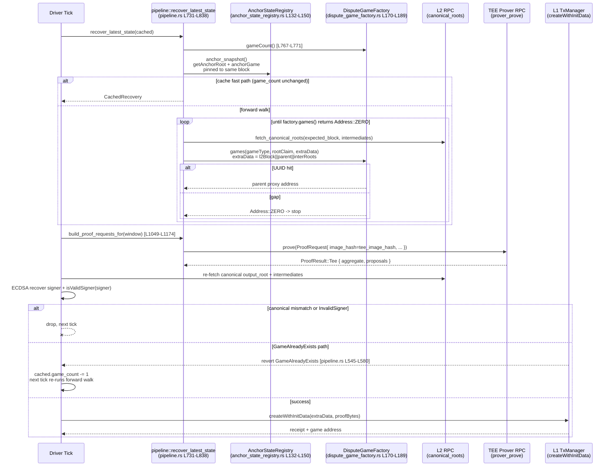
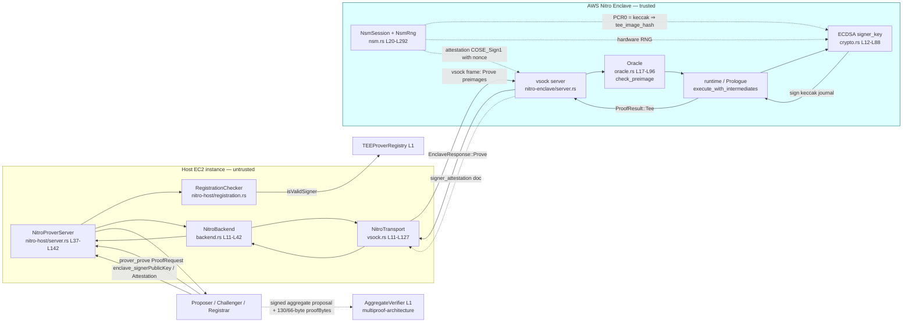
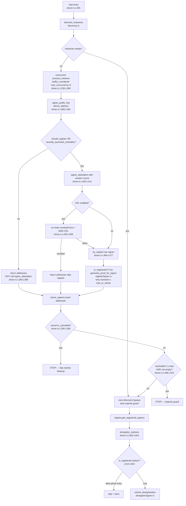
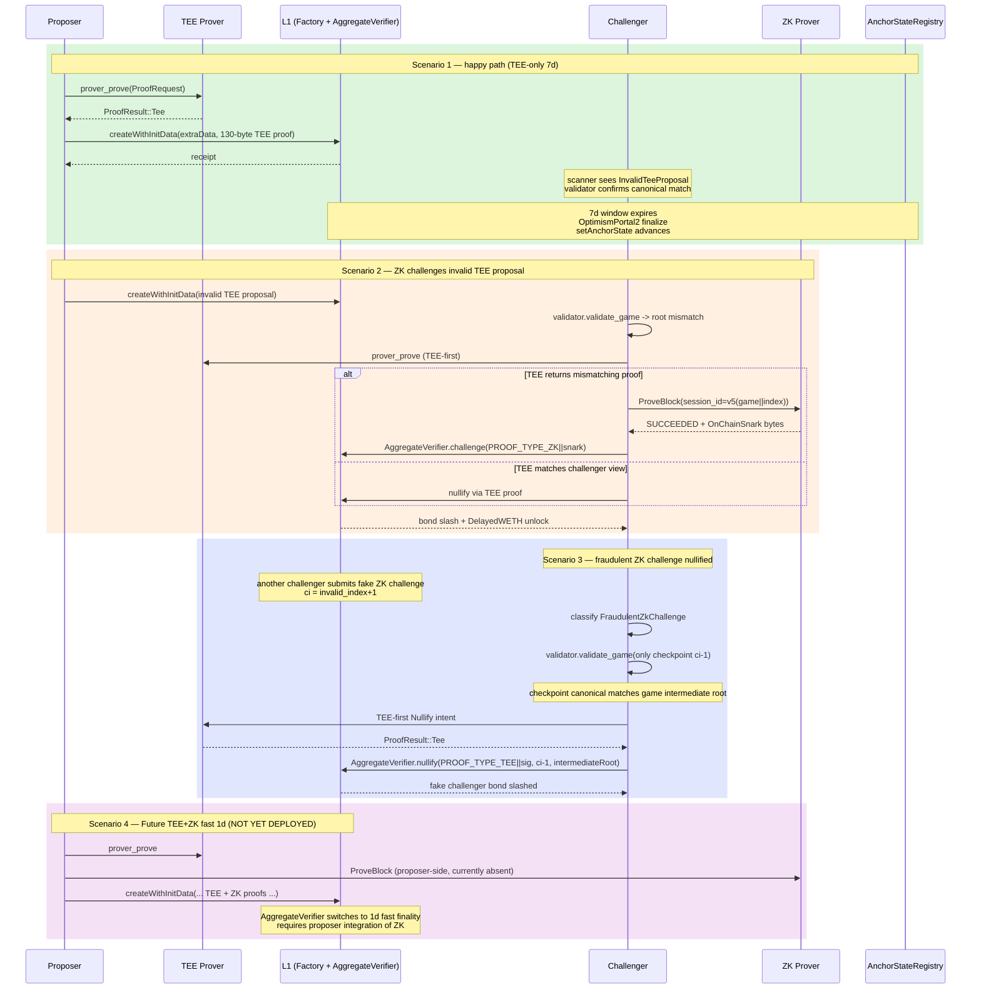

# Multiproof Prover 与 Challenger 实现深度解析

## 1. Executive Summary

Base Azul 升级把 OP Stack 的故障证明体系从单进程 `op-proposer` + 7-day interactive
`op-challenger` + Cannon MIPS 替换为五个 off-chain 组件协同的多证体系：

1. **Proposer**（`crates/proof/proposer`）—— Rust 服务，使用 `DisputeGameFactory` UUID
   确定性 forward walk 来恢复 parent chain，向 TEE Prover 取得签名后的 `ProofJournal`，
   再通过 `createWithInitData()` 提交 `BaseGameAzul`。
2. **Challenger**（`crates/proof/challenge`）—— 扫描 `IN_PROGRESS` games 并把它们
   分入四个 GameCategory，按需对错误的 TEE 提案发起 ZK challenge / nullify，对错误
   ZK challenge 做反作弊。
3. **TEE Prover**（`crates/proof/tee/{nitro-host,nitro-enclave}`）—— host 通过 vsock
   把 preimages 推给 enclave；enclave 在 AWS Nitro Enclave 内重新执行 OP Program、
   生成 `ProofJournal`、用从 NSM RNG 派生的 ECDSA 私钥签名，私钥永不离开 enclave。
4. **ZK Prover**（`crates/proof/zk/{service,client}`）—— gRPC 服务，PostgreSQL 持久化
   `ProofRequest`，分派给 SP1 Range + Groth16 Aggregation 双段程序，支持 mock / cluster /
   network 三种 backend。
5. **Prover Registrar**（`crates/proof/tee/registrar`）—— 周期性从 AWS ALB 拉取
   enclave 实例、用 Boundless Network 生成 attestation ZK proof、向 `TEEProverRegistry`
   注册 signer，并对失联实例做 orphan deregistration（带 cancellation / majority /
   ghost-entry / single-registrar 四重保护）。

这套体系的核心安全属性是：

- TEE proof 与 ZK proof 都被链上 `AggregateVerifier` 等同对待，二者都可在 7 天 long
  window 内 nullify / challenge；
- 签名密钥永不离开 Nitro Enclave；host 即便被攻陷也无法伪造 root；
- Proposer 在向链上提交前对每个 intermediate root 重新做 canonical 校验；
- Challenger 在 nullify / challenge 提交前重新检查 game 状态，避免 race；
- Registrar 在 orphan 清理时同时执行 majority-reachability guard 与 `isRegisteredSigner`
  ghost-entry guard，防止误删活跃 signer 并避免 Solady v0.0.245 `EnumerableSetLib`
  bug 触发的死循环。

下文按 outline item 顺序逐一展开，所有源码引用以 `base/base @ 84155fef0` 为准。
Spec stub 与 README 中尚存的 stale 文字会在对应位置显式标注。

## 2. Item Findings

### 2.1 item-1: Proposer 服务架构与 parent recovery / checkpoint 选择流程

**spec_reference**

- `docs/specs/pages/protocol/proofs/proposer.md` 描述高层目标（向 `DisputeGameFactory`
  提交 `BaseGameAzul`、维护 parent chain）。
- `docs/specs/pages/upgrades/azul/proofs.md` 描述 Azul 升级总体流程，包括 long / fast
  finality 路径。
- README / 部分历史 spec 中提到的 `MAX_FACTORY_SCAN_LOOKBACK` 与 "backward scan"
  文字 **(stale; superseded by `recover_latest_state()` in `crates/proof/proposer/src/pipeline.rs`)**
  ——当前仓库不存在该常量，parent recovery 已切换为 UUID 确定性 forward walk。

**code_reference**

- `crates/proof/proposer/src/service.rs` L29-L298（顶层 service 启动、L1/L2/Rollup/Prover
  RPC 装配、`AggregateVerifier` 参数读取、`SimpleTxManager` 配置、admin RPC server 拼装）。
- `crates/proof/proposer/src/driver.rs` L1-L375（`DriverConfig`：`poll_interval`
  default 12s、`block_interval` default 512、`intermediate_block_interval`、
  `game_type`、`allow_non_finalized`、`proposer_address`、`tee_image_hash`、
  `anchor_state_registry_address`）。
- `crates/proof/proposer/src/pipeline.rs` L731-L838 (`recover_latest_state`)、
  L865-L981 (`forward_walk`)、L545-L580 (`GameAlreadyExists` RPC-replica race
  mitigation)、L1049-L1174 (`build_proof_requests_for`)、L1230-L1396 (`validate_and_submit`)。
- `crates/proof/proposer/src/constants.rs`：`PROPOSAL_TIMEOUT = 10min`、
  `RECOVERY_SCAN_CONCURRENCY = 8`、`MAX_PROOF_RETRIES = 3`。
- `crates/proof/contracts/src/anchor_state_registry.rs` L132-L150
  (`anchor_snapshot()`：`getAnchorRoot()` 与 `anchorGame()` 用 `block(block_number.into())`
  在 `futures::try_join!` 内强制同一 L1 block)。
- `crates/proof/contracts/src/dispute_game_factory.rs` L170-L189
  (`encode_extra_data(l2BlockNumber, parentAddress, intermediateRoots)`)。

**inputs_outputs**

- `service.rs` 启动入参：`ProposerCliConfig`（L1/L2/Rollup/Prover URLs、private key、
  `AggregateVerifier` 地址、admin RPC bind addr）。
- `service.rs` L118-L132：从链上 `AggregateVerifier` 读取 `block_interval` /
  `intermediate_block_interval` / `init_bond`；`block_interval < 2` 或
  `block_interval % intermediate_block_interval != 0` 直接拒绝启动。
- `pipeline.rs::recover_latest_state()` 返回 `CachedRecovery { game_count, state }`，
  其中 `state` 包含 parent address、parent `claimed_l2_block_number`、parent
  `claimed_l2_output_root` 等 forward walk 出发点。
- `pipeline.rs::forward_walk()`：单步迭代时构造 `extraData =
  l2BlockNumber(32) || parentAddress(20) || intermediateRoots(32*N)`，调用
  `factory.games(gameType, rootClaim, extraData)` 取 UUID；
  返回 `Address::ZERO` 即视为 gap，停止迭代。

**state_machine_or_lifecycle**

Driver tick 循环（伪代码）：

```text
loop {
    if let Some(latest) = recover_latest_state().await? {
        for window in checkpoint_windows(latest) {
            let proof_requests = build_proof_requests_for(window)?;
            for req in proof_requests {
                let proof_result = prover_client.prove(req).await?;   // RPC to TEE
                validate_and_submit(proof_result).await?;            // canonical recheck + on-chain submit
            }
        }
    }
    tokio::time::sleep(poll_interval).await;
}
```

`recover_latest_state()` 内部状态机：

1. 读取 `factory.gameCount()`（L767-L771，独立 L1 RPC 调用）。
2. 读取 `anchor_state_registry.anchor_snapshot()`（L775-L780），后者内部把
   `getAnchorRoot()` 与 `anchorGame()` 两个调用 pin 到同一 `block_number`
   （`anchor_state_registry.rs` L132-L150 通过 `block(block_number.into())` +
   `futures::try_join!` 实现）；**注意 `game_count` 与 `anchor_snapshot` 是两次独立的
   L1 RPC 读，不属于同一 L1 快照**，详见下文 GameAlreadyExists 处理。
3. cache fast path：当 `game_count` 未变化且 anchor 仍在 cached tip 之前时，直接复用
   `CachedRecovery` ——无任何额外 RPC。
4. 否则执行 deterministic forward walk：起点二选一 —— cached tip（增量场景）或
   anchor state（冷启动 / anchor 超过 cached tip / `game_count` 回退）。

`forward_walk()` 每一步：

1. 用 `block_interval` 推导 `expected_block = parent.l2_block + block_interval`；
2. 一次性批量 `fetch_canonical_roots(expected_block, intermediate_block_numbers)` 取
   `(outputRoot, intermediate_roots)`；
3. 编码 `extraData` 并查 `factory.games(gameType, rootClaim, extraData)`；
4. 返回 `Address::ZERO` → gap，停止迭代；否则把该 proxy 设为新的 parent，继续推进。

**security_properties**

- **UUID 不可冒充**：`factory.games()` 的 UUID 来自 `(gameType, rootClaim, extraData)` 的
  确定性派生。任何 invalid game（intermediate roots 错位、错误 parent 等）都会得到
  不同的 UUID，永远不会与本次 forward walk 的查询命中，从而 **不需要任何 backward
  scan、不需要"unrelated games"过滤**。
- **`game_count` 与 anchor 之间不存在原子性要求**：UUID 派生只依赖 canonical 数据；
  即便 `game_count` 增加但 anchor 未更新，forward walk 也能正确推进。
- **`GameAlreadyExists` 吸收为成功路径**（`pipeline.rs` L545-L580）：当 forward walk
  错过 (例如 `factory.games()` 在 RPC 副本 A 上返回 ZERO，但 `gameCount` 在副本 B 上
  显示 +1 ——典型的 L1 RPC replica lag) 而 proposer 尝试 `createWithInitData()` 时
  revert 为 `GameAlreadyExists`，proposer 将 cache 中的 `game_count` 减一以保证下次
  recovery 时 `game_count` 增加 → 触发 forward walk → 找到那个游戏。代码注释明文
  指出 "the forward walk missed it — most likely because `game_count` was read from
  a different L1 RPC replica than the one serving `factory.games()`"。
- **walk 不受 safe/finalized L2 head 上限约束**：它只读已上链的游戏，与 L2 head 无关。

**failure_modes_and_retries**

- 单 proof 在内部最多重试 3 次（`MAX_PROOF_RETRIES = 3`），单次 proof 总上限 10 分钟
  （`PROPOSAL_TIMEOUT`）。
- canonical 校验失败（`output_root` 或任一 intermediate root 与 L2 RPC 取得的 canonical
  根不符）→ 丢弃本批 proof，进入下个 tick 重试；不会上链。
- TEE signer 失效（链上 `TEEProverRegistry.isValidSigner(signer) == false`）→
  abort 提交，等待下个 tick；也可以选择 dry-run 模式只跑校验不上链。
- L1 transaction manager 在 nonce 冲突 / fee bump 失败时由 `SimpleTxManager` 自动 retry，
  proposer 视 receipt 与链上 `factory.games()` 状态决定是否需要前进。
- parallel proving：service 允许并发取多个 proof，但**L1 submission 严格串行**以保证
  parent chain 不分叉（验证逻辑见 service.rs PipelineConfig 装配段）。

**comparison_to_op_stack**

| 维度 | OP Stack `op-proposer` | Base Azul Proposer |
|------|---|---|
| 进程拓扑 | 单 Go 进程 | Rust service + 远程 TEE prover RPC（vsock 隔离 enclave） |
| Parent recovery | 基于 `DisputeGameFactory.gameCount` + linear scan | `gameCount` + UUID-based forward walk（无 backward scan） |
| Proof source | rollup-node + op-program 单点 | TEE host/enclave 拆分，签名密钥永不离开 enclave |
| 提交目标 | `FaultDisputeGameFactory.create()` | `DisputeGameFactory.createWithInitData()`（CWIA 模式） |
| pre-submission 校验 | 仅 rollup output root | output_root + 每个 intermediate root + signer validity |

**open_gaps_or_caveats**

- `proposer.md` spec 与 README 中仍包含 "MAX_FACTORY_SCAN_LOOKBACK" / "backward scan"
  描述 —— 本文件按代码实际实现描述，并显式声明该文字为 stale。
- ASR `block_number` 锁定到具体 L1 高度的策略（latest / safe / finalized）依赖
  `pipeline.rs` 配置；当前 commit 默认使用 finalized L1 head；非 finalized 模式由
  `DriverConfig.allow_non_finalized` 控制。

---

### 2.2 item-2: Proposer 的 ProofRequest 构造、TEE Journal 解析与 pre-submission canonical 验证

**spec_reference**

- `docs/specs/pages/protocol/proofs/proposer.md`：高层描述 `ProofRequest` / `ProofResult` /
  `ProofJournal` 字段，spec 字段仅覆盖部分实现细节，因此以代码为准。
- `docs/specs/pages/upgrades/azul/proofs.md`：描述 `AggregateVerifier`
  `initializeWithInitData()` 期望的 130-byte proof framing。

**code_reference**

- `crates/proof/primitives/src/proof.rs`：`ProofRequest`（9 字段）与
  `ProofResult::{Tee { aggregate_proposal, proposals }, Zk { proof_bytes }}` 枚举。
- `crates/proof/primitives/src/proposal.rs` L24-L66：`ProofJournal::encode()`
  生成 `proposer(20) || l1OriginHash(32) || prevOutputRoot(32) || startingL2Block(8) ||
  outputRoot(32) || endingL2Block(8) || intermediateRoots(32*N) || configHash(32) ||
  teeImageHash(32)`，长度 = `PROOF_JOURNAL_BASE_LENGTH (196) + 32*N`。
- `crates/proof/primitives/src/rpc.rs`：`ProverApi::prove(ProofRequest) -> ProofResult`
  （jsonrpsee namespace `prover`）、`EnclaveApi::signer_public_key()` 与
  `signer_attestation(user_data, nonce)`（namespace `enclave`）。
- `crates/proof/proposer/src/pipeline.rs` L1049-L1174 (`build_proof_requests_for`)：
  组装 9 字段 `ProofRequest`，`image_hash` 字段固定填 `DriverConfig::tee_image_hash`。
- `crates/proof/proposer/src/pipeline.rs` L1181-L1228 (`check_signer_validity`)：
  对返回的 `ProofJournal` 调用 `keccak256(encode())`，再用 ECDSA 恢复 signer 公钥 → 地址 →
  `ITEEProverRegistry::isValidSigner(signer)` 链上预校验。
- `crates/proof/proposer/src/pipeline.rs` L1230-L1396 (`validate_and_submit`)：
  on-chain 提交前 JIT 重新校验 canonical output root 与每个 intermediate root；
  分拣 `GameAlreadyExists` / `L1OriginTooOld` / `InvalidSigner` 等 revert 原因。
- `crates/proof/primitives/src/proof_encoder.rs` L14-L17, L43-L86：`PROOF_TYPE_TEE = 0`、
  `PROOF_TYPE_ZK = 1`、`normalize_v()` 把 0/1 v 调整为 27/28、
  `encode_proof_bytes(signature, l1OriginHash, l1OriginNumber)` 生成 130-byte
  `initializeWithInitData` proof bytes、`encode_dispute_proof_bytes(signature)` 生成
  66-byte `nullify/challenge` proof bytes。

**inputs_outputs**

`ProofRequest` 九字段（`crates/proof/primitives/src/proof.rs`）：

| 字段 | 类型 | 含义 |
|---|---|---|
| `l1_head` | `B256` | 取 witness 时使用的 L1 head hash |
| `l1_head_number` | `u64` | 对应的 L1 高度 |
| `agreed_l2_head_hash` | `B256` | parent 的 L2 head hash（与 `prev_output_root` 对齐） |
| `agreed_l2_output_root` | `B256` | parent 已 commit 的 L2 output root |
| `claimed_l2_output_root` | `B256` | 本次 proposal 主张的最终 output root |
| `claimed_l2_block_number` | `u64` | 本次 proposal 的 L2 终止块号 |
| `proposer` | `Address` | proposer EOA 地址 |
| `intermediate_block_interval` | `u64` | intermediate root 间隔（必须 > 0 且整除 block_interval） |
| `image_hash` | `B256` | 期望的 enclave PCR0 keccak256（`teeImageHash`） |

`ProofResult::Tee { aggregate_proposal: Proposal, proposals: Vec<Proposal> }`：
- `proposals` 包含每个 1-block 子段的 Proposal；
- `aggregate_proposal` 在 `proposals.len() > 1` 时由 enclave 用 `intermediate_block_interval`
  采样生成（详见 item-5 的 `nitro-enclave/src/server.rs` L206-L248）。

**state_machine_or_lifecycle**

JIT pre-submission validation（pipeline.rs L1230-L1396）顺序：

1. 解码 `ProofResult::Tee` 中 `aggregate_proposal` 的 `output_root` / `intermediate_roots`；
2. 用 L2 RPC 重新拉取 canonical output root（per intermediate block + final block）；
3. 比对 `proposal.output_root` 与 canonical final output root；任一不符 → `CanonicalMismatch`，丢弃；
4. 还原 `ProofJournal::encode()`，`keccak256` 取消息哈希；
5. 65-byte 签名做 ECDSA recover，得到 signer 公钥与地址；
6. 调用 `ITEEProverRegistry::isValidSigner(signer)`；RPC 失败时降级到链上强制约束
   (链上 `AggregateVerifier.initializeWithInitData()` 内部仍会再次校验)；
7. 构造 130-byte `proofBytes`（`ProofEncoder::encode_proof_bytes`）+ `extraData`，调用
   `factory.createWithInitData()` 上链；
8. 处理结果：成功 → 更新 cached state；`GameAlreadyExists` → 走 L545-L580 race 修复路径；
   `L1OriginTooOld` → 等待下一 tick；`InvalidSigner` → 同 isValidSigner 失败处理。

**security_properties**

- **Journal 双绑定**：`configHash` 绑定到 rollup 配置；`teeImageHash` 绑定到 enclave PCR0；
  二者任一变化 → signer 即便依旧合法，签名出来的 journal 在链上也不会通过验证。
- **canonical 自检**：proposer 不信任 TEE 给出的 root，提交前 JIT 用 L2 RPC 重算 canonical
  output root；任何 enclave 偏差或路由污染都会被检出。
- **`isValidSigner` 双校验**：proposer 链下做一次 RPC 预查（fail-open），链上
  `AggregateVerifier` 提交时再做强制校验；fail-open 不损害安全（最终决定者是链上合约）。
- **v 归一化**：所有提交的签名都做 `normalize_v` 校验（0/1/27/28 → 27/28），避免链上 ecrecover
  返回 zero address。

**failure_modes_and_retries**

- `CanonicalMismatch` / `InvalidSigner` / `L1OriginTooOld` → 不重试，等下个 tick。
- `GameAlreadyExists` → 当作成功，详见 item-1。
- L1 tx submit 失败（nonce / fee）→ tx manager 内部 retry，pipeline 等 tx receipt 之后决定。
- 单 proof 最多 3 次完整 retry（RPC timeout / enclave crash）。

**comparison_to_op_stack**

OP Stack 的 `op-proposer` 提交的是 unsigned output root，链上由 `DisputeGameFactory`
派生 game 实例后才进入 fault-proof；签名校验只在 dispute 路径中体现。Base Azul 在
proposal 上链的那一刻就内嵌 ECDSA signer（由 TEE Prover 持有），把 "signer × image ×
rollup config × output root × parent root × intermediate roots" 一并锁死。

**open_gaps_or_caveats**

- spec 中 `ProofRequest` 字段表与代码 9 字段在命名上略有出入（spec 写
  `l1_origin_hash`，代码写 `l1_head`），统一以代码为准。
- 130-byte vs 66-byte proof framing 的链上消费路径详见 multiproof-architecture
  子课题，本课题只给出 off-chain 端的编码方式。

---

### 2.3 item-3: Challenger 扫描、game 分类与双路径 dispute 提交

**spec_reference**

- `docs/specs/pages/protocol/proofs/challenger.md`：描述 `Challenger` 角色与四种 dispute
  路径（happy / invalid TEE / fraudulent ZK / dual）。
- `docs/specs/pages/upgrades/azul/proofs.md`：long window vs fast finality 时序。

**code_reference**

- `crates/proof/challenge/src/scanner.rs` L56-L90（`GameCategory` 四变体）、L93-L111
  (`CandidateGame`)、L130-L143 (`GameEvaluation`)、L156-L173 (`GameScanner`)、L450-L506
  (`evaluate_game()`)、L514-L577 (`classify()` 含异常 `(true,false,ci!=0)` / `(false,true,ci!=0)`
  跳过逻辑)。
- `crates/proof/challenge/src/driver.rs` L7-L16（4 dispute paths 文档）、L141-L160
  (`MAX_PROOF_RETRIES = 3`)、L162-L186 (`run()`)、L193-L208 (`step()`)、L247-L268
  (`process_candidate()`)、L275-L333 (`validate_game()`)、L412-L473
  (`process_fraudulent_zk_challenge()`)、L486-L583 (`initiate_proof()` TEE-first +
  `tokio::time::timeout` ZK fallback)、L695-L823 (`poll_or_submit()` re-check)、
  L829-L911 (`handle_proof_retry()` 含 `tee_proof_fallback_total` metric)。
- `crates/proof/challenge/src/validator.rs` L150-L390 (`OutputValidator`：
  `compute_output_root_with_hash` → `consensus_header.hash_slow() == rpc_hash` →
  `eth_getProof(L2ToL1MessagePasser)` → `AccountProofVerifier::verify` →
  `OutputRoot::from_parts(state_root, storage_root, computed_hash).hash()` 比对)。
- `crates/proof/challenge/src/submitter.rs`：`submit_dispute(game_address, proof_bytes,
  invalid_index, expected_root, intent)`，根据 `DisputeIntent` 选择
  `encode_nullify_calldata` 或 `encode_challenge_calldata`。

**inputs_outputs**

- Scanner 起点：`AnchorStateRegistry.anchorGame()` 返回的 anchor index，向后扫描所有
  post-anchor 处于 `IN_PROGRESS` 的 games。
- Scanner 输出：对每个游戏返回 `(teeProver, zkProver, counteredByIntermediateRootIndexPlusOne)`
  三元组，并分类为：

| `(teeProver != 0, zkProver != 0, ci != 0)` | GameCategory |
|---|---|
| `(true, false, 0)` | `InvalidTeeProposal`（TEE-only，未被挑战） |
| `(true, true, 0)` | `InvalidDualProposal`（dual proof，未被挑战） |
| `(false, true, true)` | `FraudulentZkChallenge`（ZK 挑战了某 checkpoint） |
| `(true, false, true)` | `InvalidZkProposal`（ZK-only，已被 TEE nullify 反挑战） |
| `(false, false, _)` | fully nullified，skip |
| `(true, false, ci != 0)` / `(false, true, ci != 0)` | 异常态（`unexpected`），skip + warn |

- `OutputValidator` 入参：`l2_block_number`、L2 RPC URL；出参 `(canonical_output_root,
  state_root, storage_root, computed_header_hash)`。
- Submitter calldata：`nullify(proofBytes, intermediateRootIndex, intermediateRootToProve)`
  或 `challenge(proofBytes, intermediateRootIndex, intermediateRootToProve)`。

**state_machine_or_lifecycle**

```text
loop {
    poll_pending_proofs();           // -> ReadyToSubmit / NeedsRetry / Dropped
    discover_claimable_bonds();
    poll_bond_claims();              // -> NeedsResolve -> ... -> NeedsWithdraw -> Completed
    let candidates = scanner.scan().await?;
    for candidate in candidates {
        match process_candidate(candidate) {
            Validator says canonical_root == game_root        => skip,
            Validator says canonical_root != game_root        => initiate_proof(TEE_first),
            FraudulentZkChallenge && checkpoint_root_is_valid => nullify the ZK challenge,
            Anomaly                                            => log + skip,
        }
    }
    sleep(poll_interval).await;
}
```

`initiate_proof()` 的双路径分发（driver.rs L486-L583）：

- TEE-first：发起 `ProverApi::prove(ProofRequest)`；若 enclave 不可用或 TEE proof 提交
  到 `submit_dispute()` 时失败 → 立即触发 ZK fallback（`build_zk_request()` →
  `initiate_zk_proof()` → `PendingProofs::poll()`）。
- ZK fallback 走 polling 模式，最多 3 次完整 retry（`MAX_PROOF_RETRIES`）。

`process_fraudulent_zk_challenge()`（L412-L473）只对 `counteredByIntermediateRootIndex - 1`
那一个 checkpoint 做 canonical 验证。若 canonical root 与 game 公开的 intermediate root
一致 → 该 ZK 挑战是欺诈，发起 `Nullify` intent。

**security_properties**

- Challenger 不信任 game 自报的 root；所有比对都用 L2 RPC + MPT 证明独立验证。
- `OutputValidator` 把 `rpc_provided_block_hash` 与 `consensus_header.hash_slow()` 一致性
  作为前置 check —— RPC 返回数据不允许偏离共识 header。
- `eth_getProof` 取 `L2ToL1MessagePasser` 账户证明 → `AccountProofVerifier::verify`
  确认 storage_root 在 state_root 之下 —— MPT 证明把信任范围收敛到 L2 共识 header。
- 提交 dispute 前的 game-status 再校验（driver.rs L695-L823）确保不会重复 nullify 已被
  其它人 nullify 的槽位（不变量：`counteredByIntermediateRootIndex` 一旦设置就锁定）。

**failure_modes_and_retries**

- Validator transient error（L2 RPC timeout / `eth_getProof` 数据缺失）→ keep candidate
  in `tracking` BTreeMap，下个 tick 重试。
- Validator persistent error（账户证明无效、storage trie mismatch）→ 标记 candidate
  为 Terminal，永久跳过 + metric。
- ZK proof 失败 ≤ 3 次重试；每次失败计入 `zk_proof_failures_total`。
- TEE proof submit 失败 → 立即切 ZK fallback（`tee_proof_fallback_total`++）。

**comparison_to_op_stack**

OP Stack `op-challenger` 走 interactive bisection（cannon trace）：从 root 处差异点
开始二分 64 次最终落到一条 MIPS 指令上链 reexec。Base Azul 直接用 ZK proof 或 TEE
proof 一次性证明 7-day window 内的全段 L2 state transition；状态机扁平、不需要 trace
bisection；缺点是依赖外部 prover 服务。

**open_gaps_or_caveats**

- `evaluate_game()` 的 BTreeMap-based `tracking` cache 在长跑场景下的内存占用未做基准；
  与 OP Stack `op-challenger` cache 相似但行为细节属内部实现，spec stub 未覆盖。

---

### 2.4 item-4: Challenger pending proof phase machine 与 bond claim lifecycle

**spec_reference**

- `docs/specs/pages/protocol/proofs/challenger.md` "bond resolution" 段。
- DelayedWETH 1-day delay 行为见 `contracts/src/DelayedWETH.sol`（multiproof-architecture
  子课题展开）。

**code_reference**

- `crates/proof/challenge/src/pending.rs` L25-L49 (`ProofKind::{Tee, Zk}`)、L65-L70
  (`DisputeIntent::{Challenge, Nullify}`)、L75-L90 (`ProofPhase::{AwaitingProof,
  ReadyToSubmit, NeedsRetry}`)、L115-L120
  (`derive_session_id = Uuid::new_v5(NAMESPACE_OID, game_address || invalid_index_be)`)、
  L246-L326 (`PendingProofs::poll()` 调 `GetProofRequest` with `ReceiptType::OnChainSnark`,
  prepend `PROOF_TYPE_ZK` byte 前缀)。
- `crates/proof/challenge/src/bond.rs` L57-L76 (`BondPhase::{NeedsResolve, NeedsUnlock,
  AwaitingDelay { unlocked_at, unlocked_at_unix_secs }, NeedsWithdraw, Completed}`)、
  L83-L89 (`TrackedGame { anchor_update_complete }`).

**inputs_outputs**

- `PendingProof` 输入：`(game_address, invalid_index, intent, kind)`；session_id 由
  `Uuid::new_v5(NAMESPACE_OID, game_address(20) || invalid_index_be(8))` 派生 →
  保证 challenger 重启 / 多次 retry 同一槽位时 ZK 服务端识别为同一 session 幂等回放。
- `GetProofRequest { session_id, receipt_type: OnChainSnark }` → 服务端返回
  Groth16 frame `proof_with_pv.bytes()` (Groth16 verifier selector `0x0e78f4db` 开头)
  + STARK/SNARK 内部 receipt 字段。
- Submit 时再 `raw.push(PROOF_TYPE_ZK)` + Groth16 bytes 形成最终 `proofBytes` 串。

**state_machine_or_lifecycle**

```text
PendingProof::new(...) -> AwaitingProof
   while AwaitingProof:
       poll();
       on Success: -> ReadyToSubmit
       on Failure (count++): if count <= 3 -> NeedsRetry else -> Dropped
   on submit:
       recheck_game_state() // gameOver? slot already zeroed? counterparty challenged?
       if invariant violated -> Dropped
       else encode_calldata(intent) + tx_manager.send()
       on success -> bond.rs lifecycle starts

BondPhase:
   NeedsResolve -> resolveGame()
   NeedsUnlock  -> claimUnlock()      // DelayedWETH unlock with 1-day timer
   AwaitingDelay { unlocked_at } -> wait until now >= unlocked_at
   NeedsWithdraw -> withdraw()
   Completed
```

**security_properties**

- session_id 幂等性：因为派生于 `(game_address, invalid_index)` 而非随机 nonce，所以
  challenger 进程重启不会丢失 ZK 服务端进度（service 端可识别为同一请求）。
- 提交前再校验 game state，避免 race 导致重复 nullify（一旦 `counteredByIntermediateRootIndex`
  设置就不可改），从而不会损失 bond 或浪费 gas。
- DelayedWETH 1-day delay 在 `AwaitingDelay` 阶段强制等待；`unlocked_at_unix_secs`
  本地缓存避免不必要的 RPC。
- Restart 后通过链上 `bondRecipient()` + `zkProver()` 槽位重建 `TrackedGame`，无本地
  持久状态。

**failure_modes_and_retries**

- ZK polling 失败 ≤ 3 次（同 item-3）。
- TEE submit 失败立即切 ZK fallback。
- bond claim 任一阶段 RPC 失败 → 保留 TrackedGame，下个 tick 继续推进。
- DelayedWETH 提前 withdraw 会被合约 revert；challenger 永远等到 `unlocked_at`
  之后再触发。

**comparison_to_op_stack**

OP Stack `op-challenger` 维护 cannon trace state，bond claim 由 `FaultDisputeGame.resolve()` 单一调用触发；DelayedWETH 同样存在。Base 把 bond
lifecycle 拆为四阶段是因为 multiproof 的 `DisputeGameFactory` 有 unlock/withdraw 分离
设计。

**open_gaps_or_caveats**

- `BASE_CHALLENGER_BOND_CLAIM_ADDRESSES` 的具体 mainnet 地址列表属生产部署参数，未在公共
  spec 中固定。

---

### 2.5 item-5: TEE Prover Nitro Enclave 架构（host / enclave 拆分与签名密钥永不离开 enclave 的安全论证）

**spec_reference**

- `docs/specs/pages/protocol/proofs/tee-provers.md`：标注为 **stub**（截至 commit
  `1c425cc66f`）。本 item 内容以 Rust 源码为准。
- AWS Nitro Enclaves 官方文档（`docs.aws.amazon.com/enclaves/`）：NSM API、attestation
  document 结构（CBOR/COSE_Sign1）、vsock 通信、PCRs 含义。

**code_reference (host)**

- `crates/proof/tee/nitro-host/src/server.rs` L27-L142 (`NitroProverServer`)、L144-L183
  (`NitroProverRpc::prove` 中通过 `RegistrationChecker::select_valid_enclave()` 在多
  enclave 间选 signer 注册合法的 enclave)、L185-L242 (`NitroSignerRpc::signer_public_key`
  / `signer_attestation`：all-or-nothing 多 enclave 聚合，user_data/nonce ≤ 512 bytes
  early-reject)。
- `crates/proof/tee/nitro-host/src/backend.rs` L11-L42 (`NitroBackend` 实现
  `ProverBackend` trait，分派给 `NitroTransport`)。
- `crates/proof/tee/nitro-host/src/vsock.rs` L11-L127 (`VsockTransport`：每次
  调用新建 `tokio_vsock::VsockStream`，发送 length-prefixed bincode `EnclaveRequest`
  frame，5 秒 connect timeout、10 秒 signer timeout)。
- `crates/proof/tee/nitro-host/src/registration.rs`：`RegistrationChecker` 周期性查
  `TEEProverRegistry.isValidSigner(enclave_signer)`，prove 请求时仅选已注册 enclave。
- `crates/proof/tee/nitro-host/src/transport.rs`：`NitroTransport::{local, vsock}` 两种
  模式（生产 = vsock，开发 = in-process direct call）。

**code_reference (enclave)**

- `crates/proof/tee/nitro-enclave/src/server.rs` L52-L107 (`Server::new` /
  `new_enclave` / `new_local`，`tee_image_hash = keccak256(PCR0)`，本地模式
  `tee_image_hash = ZERO`)、L143-L251 (`prove()` 完整流水线：load `BootInfo` → 通过
  `Prologue::new(oracle, oracle, BaseEvmFactory::default()).load()` → `execute_with_intermediates()`
  → 逐 block 构造 `ProofJournal` 并 ECDSA 签名 → 多 block 聚合 `ProofJournal` 也再签
  一次 → 返回 `ProofResult::Tee { aggregate_proposal, proposals }`)。
- `crates/proof/tee/nitro-enclave/src/crypto.rs` L12-L88 (`Ecdsa::{generate, from_bytes,
  from_hex, public_key_bytes, address}` 与 `Signing::{sign, verify}`，使用 `alloy_signer`
  + `k256`)。
- `crates/proof/tee/nitro-enclave/src/nsm.rs` L20-L155 (`NsmSession`：Linux 上
  `aws-nitro-enclaves-nsm-api` 调用 `nsm_init` / `nsm_process_request`；非 Linux 平台
  返回 `None`；`describe_pcr0()` 取 48 byte SHA-384 PCR0；`get_attestation(public_key,
  user_data, nonce)` 返回 COSE_Sign1 字节)、L161-L292 (`NsmRng` 实现 `CryptoRng + RngCore`，
  从 NSM hardware RNG 抽取，失败 fallback `OsRng`)。
- `crates/proof/tee/nitro-enclave/src/oracle.rs` L17-L96 (`Oracle` HashMap-backed
  preimage oracle，`check_preimage` 对 Keccak256 / Sha256 key 类型做 in-place 哈希验证，
  拒绝伪造 preimage)。
- `crates/proof/tee/nitro-enclave/src/protocol.rs` L7-L34 (`EnclaveRequest::{Prove,
  SignerPublicKey, SignerAttestation { user_data, nonce }}` 与 `EnclaveResponse`)。

**inputs_outputs**

| 接口 | 入参 | 出参 |
|---|---|---|
| `prover_prove(ProofRequest)` (host JSON-RPC) | `ProofRequest` 9 字段 | `ProofResult::Tee { aggregate_proposal, proposals }` |
| `enclave_signerPublicKey()` (host JSON-RPC) | 无 | `Vec<Vec<u8>>` 65-byte SEC1 pubkeys（每个 enclave 一个） |
| `enclave_signerAttestation(user_data, nonce)` (host JSON-RPC) | `Option<Vec<u8>>` ≤512 | `Vec<Vec<u8>>` COSE_Sign1 attestations |
| vsock `EnclaveRequest::Prove(Vec<(PreimageKey, Vec<u8>)>)` | preimages | `EnclaveResponse::Prove(Box<ProofResult>)` |
| NSM `Request::Attestation { user_data, nonce, public_key }` | NSM-level | COSE_Sign1 bytes |

**state_machine_or_lifecycle**

Host 端：

```text
NitroProverServer (jsonrpsee HTTP)
   ├── prover_prove(req)
   │     -> RegistrationChecker.select_valid_enclave()      // 多 enclave 时挑选已注册 signer
   │     -> ProverService::prove_block(req)
   │        -> Host 收集 witness（OP Program preimages）
   │        -> NitroBackend.prove(oracle)
   │           -> NitroTransport.prove(preimages)
   │              -> vsock connect → write Frame(Prove) → read Frame(Response)
   ├── enclave_signerPublicKey()  -> all transports concurrent
   └── enclave_signerAttestation(user_data?, nonce?)        // 512-byte early reject
```

Enclave 端（`server.rs::prove()`）：

```text
1. Oracle::new(preimages)                                 // 哈希校验每个 preimage
2. BootInfo::load(&oracle)                                // 解析 OP Program boot info
3. config_hash = config_hash_for_chain(chain_id)          // 从静态 CONFIG_HASHES 取
4. Prologue::new(oracle, oracle, BaseEvmFactory).load()
   -> driver.execute_with_intermediates()
   -> (epilogue, block_results)
5. epilogue.validate()                                    // claim ↔ derived final root
6. for each (l2_info, output_root) in block_results:
       journal = ProofJournal { ..., tee_image_hash = self.tee_image_hash, ... }
       signature = Signing::sign(&self.signer_key, &journal.encode())
       proposals.push(Proposal { ..., signature })
7. if proposals.len() > 1:
       intermediate_roots = sample at interval                       // every `intermediate_block_interval` proposal
       aggregate_journal = ProofJournal { intermediate_roots, ... }
       aggregate_proposal.signature = sign(aggregate_journal.encode())
8. return ProofResult::Tee { aggregate_proposal, proposals }
```

**security_properties**

- **签名密钥永不离开 enclave**：`Ecdsa::generate(&mut NsmRng::new()?)` 在 `Server::new_enclave()`
  内执行；`PrivateKeySigner` 只存在于 enclave heap；vsock 协议仅暴露 `EnclaveRequest::Prove`
  / `SignerPublicKey` / `SignerAttestation` —— 没有任何接口可以导出私钥。
- **`tee_image_hash = keccak256(PCR0)`**：PCR0 是 AWS Nitro 在 enclave boot 时由
  hypervisor 计算并 lock 的镜像测量值（SHA-384，48 bytes）；篡改 enclave image 会导致
  PCR0 变化 → `teeImageHash` 与链上 `TEE_IMAGE_HASH` 不符 → 即便签名也无效。
- **配置绑定**：`config_hash = keccak256(PerChainConfig::marshal_binary())`，把 rollup
  config 嵌进 journal；rollup 配置升级 → config_hash 变化 → 旧签名失效。
- **attestation freshness**：`enclave_signerAttestation` 接受 nonce（≤512 bytes），
  registrar 用 `rand::random::<[u8;32]>()` 生成 nonce，确保 attestation 不能被回放。
- **隔离边界**：AWS Nitro Enclave 无持久存储、无外部网络、唯一 vsock 通道、PCR 锁定。
  Host 即便被攻陷，能做的最坏情况是：（a）拒绝转发请求，（b）伪造 attestation
  body 但无法伪造 NSM 签名，（c）篡改 preimages —— 但 `Oracle::check_preimage` 会拒绝
  hash mismatch。

**failure_modes_and_retries**

- vsock connect 5s timeout / signer 10s timeout → `NitroHostError::{ConnectTimeout,
  ResponseTimeout}`，host 不重试，由调用方（Proposer / Challenger）决定。
- `Oracle::check_preimage` 失败 → enclave 返回 `EnclaveResponse::Error`，host 透传。
- `NitroSignerRpc` all-or-nothing：任一 transport 失败立即整批失败 —— 因为 registrar
  需要完整 signer 集合做注册，partial 不可用。
- PCR0 长度异常 → `NsmError::DescribePcr`，enclave server 启动失败（必须 enclave mode 才能 prove）。

**comparison_to_op_stack**

OP Stack 单进程 `op-proposer` 既负责 fetch witness 又负责输出 root；没有 TEE 隔离。
Base Azul 把 host（vsock proxy + RPC fanout）与 enclave（NSM + ECDSA signer + OP Program
re-execution + attestation）拆开，攻陷 host 不能伪造 root 签名，因为：（a）签名密钥
在 enclave 内部生成且只在 enclave 内部存在；（b）`Oracle::check_preimage` 在 enclave
内重新校验 preimages；（c）`tee_image_hash` 与 `config_hash` 由 enclave 自身派生而非
host 注入。

**open_gaps_or_caveats**

- `tee-provers.md` spec 是 stub，未覆盖 vsock frame 格式、NSM RNG fallback、多 enclave
  selection 策略；本 item 全部以源码为准。
- 生产 PCR0 / `teeImageHash` 取决于 deploy 时 image 版本；公开仓库不固定该值。
- AWS Nitro 官方文档对 vsock 内核模块版本依赖、PCRs 1-15 含义有覆盖；但 NSM
  hardware RNG entropy 评估属内部材料。

---

### 2.6 item-6: ZK Prover 服务（SP1 range + Groth16 aggregation 双段证明流水线）

**spec_reference**

- `docs/specs/pages/protocol/proofs/zk-prover.md`：高层 gRPC 接口 + ProofType 表。
- SP1 / Succinct Labs 官方文档：`sp1_lib::verify::verify_sp1_proof`、range program
  接口、Groth16 aggregation、ELF + vkey 派生。
- Boundless Network / RISC Zero / Automata SDK 公开文档：见 src-6 caveat。

**code_reference**

- `crates/proof/zk/service/src/lib.rs` L1-L28：crate 导出（`ProverServiceServer`、
  `ProofRequestManager`、`BackendRegistry`、`OpSuccinctClusterBackend` /
  `OpSuccinctMockBackend` / `OpSuccinctNetworkBackend`、`ProverWorker` / `ProverWorkerPool` /
  `StatusPoller`）。
- `crates/proof/zk/service/src/server/prove_block.rs` L13-L168：`ProveBlock` 入口；
  proof_type / prover_address / l1_head / intermediate_root_interval 输入校验；
  `repo.create_with_outbox(db_request, max_proof_retries)` 写 Postgres outbox。
- `crates/proof/zk/service/src/server/get_proof.rs` L41-L145：`GetProof` 入口；
  按 `ReceiptType::{Unspecified, Stark, Snark, OnChainSnark}` 返回不同 receipt
  字节；OnChainSnark 通过 `SP1ProofWithPublicValues::bytes()` 抽取 Groth16
  on-chain frame（Groth16 verifier selector `0x0e78f4db` 开头）。
- `crates/proof/zk/service/src/proof_request_manager.rs` L23-L127：
  `sync_and_update_proof_status` 把 RUNNING → SUCCEEDED / FAILED；`transition_running_to_*`
  guarded transitions 保证 `StatusPoller` 与 `GetProof` 并发只有一方计入 metrics。
- `crates/proof/zk/service/src/backends/traits.rs` L264-L324：`ProvingBackend` trait
  与 `BackendRegistry`；`BackendType::OpSuccinct` 与 `ProofType::{OpSuccinctSp1ClusterCompressed,
  OpSuccinctSp1ClusterSnarkGroth16}`。
- `crates/proof/zk/service/src/backends/op_succinct/{cluster,mock,network,provider}.rs`：
  三种 backend 实现（cluster = 自建 SP1 cluster gRPC，mock = 单元测试用 fixture，
  network = 直接调用 Succinct Network `NetworkProver`）。
- `crates/proof/zk/service/src/worker/{prover_worker,prover_worker_pool,status_poller}.rs`：
  outbox + worker pool + status poller 三段式（基于 Postgres pub-sub）。
- `crates/proof/zk/client/src/client.rs` L20-L130：`ZkProofClient` (`tonic` channel
  `connect_lazy()`)、`ZkProofProvider` trait、`prove_block` / `get_proof`。
- `crates/proof/succinct/elf/manifest.toml`：
  - `range-elf-embedded.sha256 = 5c2d9215dd28b4ee5a5ad12588e839dcc62fd4116b87f15f81226db20386072c`
  - `aggregation-elf.sha256 = bef8337ba75c1d72ee659455b8bdf1c15f5cb18e6cdfeda9eb8401b8627fca20`
  - 注释：ELF 不入 git，本 manifest 锁定 SHA-256，`base-proof-succinct-elfs` crate 的
    `build.rs` 校验本地 cache 是否漂移。

**inputs_outputs**

`ProveBlockRequest`（grpc / `base-zk-client`）字段：

| 字段 | 含义 |
|---|---|
| `start_block_number` | 段起始 L2 block |
| `number_of_blocks_to_prove` | 段长度，必须被 `intermediate_root_interval` 整除 |
| `sequence_window` | OP Stack sequence window 参数 |
| `proof_type` | `OpSuccinctSp1ClusterCompressed` 或 `OpSuccinctSp1ClusterSnarkGroth16` |
| `session_id` | optional `Uuid`，幂等键（同上 item-4 `derive_session_id`） |
| `prover_address` | `Address`，**SnarkGroth16 必填**（链上提交方），CLuster compressed optional |
| `l1_head` | optional `B256`，绑定到 L1 |
| `intermediate_root_interval` | optional `u64`，必须 > 0 且整除段长 |

`ProveBlockResponse { session_id }` —— UUID 字符串。

`GetProofRequest { session_id, receipt_type }` → `GetProofResponse { status,
receipt: Vec<u8>, error_message }`，`status` 来自 `ProofJobStatus`
(Unspecified / Created / Pending / Running / Succeeded / Failed)。

**state_machine_or_lifecycle**

```text
Proof request lifecycle (DB-backed):
   CREATED (insert via prove_block_impl)
      -> PENDING (worker picks up from outbox)
      -> RUNNING (worker calls backend.prove(); writes ProofSession rows)
      -> SUCCEEDED / FAILED  (status_poller / get_proof RPC syncs via process_proof_request)

Backend ProofSession sub-state (per attempt):
   RUNNING -> COMPLETED / FAILED / NOT_FOUND
   process_proof_request handles retries within the proof_request retry budget.

Groth16 emission:
   Cluster / Network backend produces SP1ProofWithPublicValues.
   server stores STARK + SNARK bincode in DB;
   GetProof(OnChainSnark) re-extracts proof_with_pv.bytes() at read time.
```

SP1 Range Program（`crates/proof/succinct/range/`）committed `BootInfoStruct`：
`l2PreRoot` / `l2PreBlockNumber` / `l2PostRoot` / `l2BlockNumber` / `l1Head` /
`rollupConfigHash` / `intermediateRoots`。Aggregation Program（`crates/proof/succinct/aggregation/`）
内嵌 `sp1_lib::verify::verify_sp1_proof` 对多个 Range proofs 做递归验证 + L1 header
chain 校验。

**security_properties**

- ELF 哈希钉死在 `manifest.toml`：`build.rs` 拒绝任何与 manifest 不符的本地 cache。
- `imageHash = ZK_RANGE_HASH`（onchain `ZKVerifier.RANGE_IMAGE_ID`）= Range program ELF
  哈希；`AggregateVerifier` 用 `ZK_AGGREGATE_HASH` 校验 aggregation。proposer / challenger
  只引用 imageHash，不引用 ELF 本身。
- session_id 由 caller 派生（`Uuid::new_v5`）→ 同一逻辑请求多次 ProveBlock 不会分裂为多个
  session；CreateProofRequestOutcome 区分 `Created / Requeued / Replayed / RetryExhausted`
  四种结果，`Replayed` 表示幂等命中。
- `transition_running_to_*` 用 DB-level guarded 转移，避免 status poller 与 GetProof 双计入。
- `bincode` 反序列化失败 → `Status::internal`，不会把 raw bytes 透传出去。

**failure_modes_and_retries**

- `CreateProofRequestError::IdCollision` → `failed_precondition`（session_id 已绑定到
  不同 (start_block, num_blocks, proof_type) 三元组）。
- `CreateProofRequestError::SessionRowMissingAfterConflict` → `unavailable`（DB 内部
  竞态，提示客户端 retry）。
- `RetryExhausted` → `resource_exhausted`（已耗尽 `max_proof_retries`；客户端应改用 `GetProof`
  读取已存储的 terminal failure）。
- backend 内部 retry：mock 直接成功，cluster/network 走自身 retry 策略（详见
  `op_succinct/cluster.rs` 与 `network.rs`），最终都通过 `ProofStatus::Failed` 上抛。

**comparison_to_op_stack**

OP Stack 没有原生 ZK prover；只在 `op-program` + Cannon 做 trace bisection。Base 把
ZK proof 视为与 TEE proof 并列的 sufficient evidence：proposer / challenger 都可以
拉取 ZK proof bytes 提交到 `AggregateVerifier`。OpSuccinct SP1 Range + Groth16
Aggregation 是当前唯一 backend，但 trait 化设计允许未来加入其他 zkVM。

**open_gaps_or_caveats**

- `zk-prover.md` spec 描述 v1 接口，但 `intermediate_root_interval` 字段在 spec 中
  未必固化；以 proto 定义为准。
- Cluster / Network backend 内部 retry 上限属配置；本 draft 未列具体阈值。
- SP1 Groth16 trusted setup ceremony 详情、Succinct Network 节点 attestation 见 SP1
  官方文档。

---

### 2.7 item-7: Prover Registrar 生命周期与 orphan 清理 / 安全保护机制

**spec_reference**

- `docs/specs/pages/protocol/proofs/registrar.md`：标注为 **stub**。README / 历史 spec
  中的 "orphaned grace window" / "multi-poll confirm" 文字
  **(stale; superseded by active-set + majority-reachability guard in
  `crates/proof/tee/registrar/src/driver.rs`)**。本 item 全部按当前源码描述。

**code_reference**

- `crates/proof/tee/registrar/src/driver.rs`
  - L26-L51：默认常量 `DEFAULT_MAX_CONCURRENCY = 4`、`DEFAULT_MAX_TX_RETRIES = 3`、
    `DEFAULT_UNHEALTHY_REGISTRATION_WINDOW_SECS = 5100`(85 min)。
  - L56-L81 `DriverConfig`；L89-L170 `RegistrationDriver::new`（CRL enabled 时强制
    要求 `nitro_verifier` client，否则配置错误 fail-fast）。
  - L177-L201 `run()`：immediate first step → poll loop with `tokio::select!`
    cancellation。
  - **L203-L325 `step()`**：discover → 并发 process_instance（`buffer_unordered`
    + `tokio::select!` cancellation-aware）→ active-set 累积 → cancellation guard
    (L295-L298) → majority-reachability guard (L308-L315) → zero-discovery bypass
    (zero `instances` 跳过 majority guard) → `deregister_orphans()`。
  - L341-L351 `is_recently_launched_unhealthy()`：85 min 注册窗口。
  - L359-L478 `process_instance()`：
    - L360 调 `signer_client.signer_public_key()` → 多 enclave pubkey 列表。
    - L362-L364 `ProverClient::derive_address` 从 SEC1 pubkey 派生 ETH 地址。
    - L370-L372 早返回（无 signer 时不进入 attestation 路径，也不空操作 `all_attestations[0]`）。
    - L383-L398 `should_register()` gate：不可注册 + 不在窗口内 → 直接返回 addresses
      （**不调用 `signer_attestation()`**，但 addresses 仍进 active_signers 防止误删
      draining 实例的 signer）。
    - L401-L414 真实注册路径：随机 32-byte nonce → `signer_client.signer_attestation(endpoint,
      None, Some(nonce.to_vec()))` 取每 enclave 的 attestation document。
    - L435-L458 CRL 检查（Layer 1 on-chain `revokedCerts` sentinel → Layer 2 AWS CRL
      distribution points）；任一确认 revoke 即 block 本实例注册。
    - L460-L477 对每个 signer 调 `try_register(instance, signer_address, idx,
      &all_attestations[idx])`。
  - L493-L668 `try_register()`：先 `registry.is_registered(addr)` 避免重复；
    `proof_provider.generate_proof_for_signer(attestation_bytes, signer_address)`
    生成 attestation ZK proof（Boundless Network / RISC Zero / Automata SDK）；
    `ITEEProverRegistry::registerSignerCall { output, proofBytes }.abi_encode()`
    → `tx_manager.send()`；retryable error ≤ `max_tx_retries`；非 retryable + execution
    reverted → `proof_provider.block_recovery_for_signer(addr)` 阻止本周期内重复消耗
    20-min proof 生成。
  - **L862-L942 `deregister_orphans()`**：
    - 计算 `orphans = registered_signers \ active_signers`。
    - 对每个 orphan 先 `registry.is_registered(signer)` 查询；返回 `false` →
      跳过（**绕过 Solady v0.0.245 `EnumerableSetLib.AddressSet` ghost-entry bug**：
      `getRegisteredSigners()` 可能返回幽灵地址但 `isRegisteredSigner == false`；
      不跳过会陷入无限循环烧 gas）；
    - 否则 `submit_deregistration(signer)`，metric `deregistrations_total` +1。
  - L876-L882 注释明确 **single-registrar assumption**：本方法把全部链上 signer 都
    视为本 registrar 管辖。多 registrar 共用同一 registry 会互相误删。
- `crates/proof/tee/registrar/src/discovery.rs`：AWS ALB target group 周期拉取，
  `InstanceHealthStatus::{Healthy, Unhealthy, Draining, Unused}::should_register()`。
- `crates/proof/tee/registrar/src/prover.rs` L48-L107 (`ProverClient`)：缓存的
  jsonrpsee HttpClient + `signer_public_key` / `signer_attestation` RPC 包装；
  `derive_address` (`VerifyingKey::from_sec1_bytes` + `public_key_to_address`)。
- `crates/proof/tee/registrar/src/verifier.rs`：AWS Nitro root CA chain + PCRs 比对
  框架（`NitroVerifierClient` 接口）。
- `crates/proof/tee/registrar/src/crl.rs`：AWS CRL distribution point fetch +
  `CertCrlInfo::intermediates`；与 driver 的 `OnchainRevocationCheck` 串联。
- `crates/proof/tee/registrar/src/registry.rs`：`RegistryClient` 包装
  `ITEEProverRegistry::{registerSigner, deregisterSigner, isRegisteredSigner,
  getRegisteredSigners, isValidSigner}`。

**inputs_outputs**

- `DriverConfig` 入参：`registry_address`、`poll_interval`、cancel token、`max_concurrency`、
  `max_tx_retries`、`tx_retry_delay`、`unhealthy_registration_window`、`CrlConfig`。
- 注册路径输出：`registerSigner(output, proofBytes)` 链上交易，metric
  `registrations_total` +1。
- 清理路径输出：`deregisterSigner(signer)` 链上交易，metric `deregistrations_total` +1。
- Metrics：`RegistrarMetrics::{discovery_success_total, processing_errors_total,
  registrations_total, deregistrations_total, onchain_revocations_detected}`。

**state_machine_or_lifecycle**

`step()` 决策流程（线性式 grace-period **不再存在**）：

```text
1. discovery.discover_instances() -> Vec<ProverInstance>
2. registerable = filter(should_register).count()  // log only
3. process all instances concurrently (buffer_unordered, max_concurrency=4):
       process_instance(instance):
           addresses = derive_address(signer_public_key(endpoint))   // ALWAYS done
           if addresses empty -> return []
           if !should_register(instance) and !recently_launched_unhealthy(instance):
               return addresses                                       // active-set only
           // registration-eligible path:
           attestations = signer_attestation(endpoint, None, Some(random_nonce))
           if CRL enabled and check_and_revoke_crls(...) confirms revoke:
               return addresses
           for (idx, signer) in addresses:
               try_register(instance, signer, idx, &attestations[idx])
           return addresses
   accumulate active_signers from successful returns.
4. if cancel.is_cancelled():    return // SKIP cleanup (active set may be incomplete)
5. if !instances.is_empty() and reachable_instances * 2 <= instances.len():
        warn + return                  // majority-reachability guard
6. registered_signers = registry.get_registered_signers()
7. deregister_orphans(&active_signers, &registered_signers):
       for each orphan:
           if !registry.is_registered(orphan):                    // ghost-entry guard
               skip + warn
           else:
               submit_deregistration(orphan)
```

**security_properties**

- **Active-set 仅依赖 `signer_public_key()`**：本调用是无副作用的纯查询；只要 enclave
  RPC 可达就算 reachable。Draining 状态的实例仍然 reachable → 其 signer 进入
  `active_signers` → 不会被误删。
- **Cancellation guard**：cancel token 触发 → drop in-flight futures（包括 tx_manager.send
  正在等待的 receipt）；该 drop 是 benign，因为下次启动会从链上拉取新 nonce。**关键安全
  约束**：cancel 之后 **不进入 `deregister_orphans`**，否则不完整的 active set 会误删。
- **Majority-reachability guard**：`reachable_instances * 2 <= instances.len()` 时跳过
  清理。比较单位是 **instance 数**（不是 signer 数），因为多 enclave 实例每实例汇报
  多个 signer 会让 signer 计数膨胀。注释明确该 guard 防御 mass deregistration（一次
  L1 RPC outage 或大规模 LB 抖动）。
- **Zero-discovery bypass**：`instances.is_empty()` 时绕过 majority guard。ASG scale-down
  把实例从 target group 摘除后这是预期路径 —— 下线实例不会抬高 `instances.len()`，
  因此 orphan 清理应正常推进。
- **Ghost-entry guard**：Solady v0.0.245 `EnumerableSetLib.AddressSet` 在某些 add/remove
  序列后 `_values` 可能返回幽灵地址但 `isRegisteredSigner == false`。`deregister_orphans`
  在每个 orphan 上独立 `is_registered` 二次确认 —— 避免对幽灵地址提交 deregister
  造成 gas 烧穿 + 无限循环。
- **Single-registrar assumption**：driver 把所有未在 `active_signers` 中的链上 signer
  视为 orphan。多 registrar 共用同一 registry 会互相误删；当前部署模型每个 registry
  合约只允许一个 registrar 实例。文档 + 注释 L876-L882 明确记录。
- **CRL fail-open vs fail-closed**：L1 on-chain `revokedCerts` mapping 查询失败时
  fail-open（继续走 AWS CRL）但不静默禁用；AWS CRL 确认 revoke → fail-closed，本实例
  整个跳过注册。CRL Enabled 时必须配 `NitroVerifierClient`，否则 fail-fast 启动失败。
- **Attestation freshness**：注册路径 nonce 来自 `random()`（OS RNG），每周期新生成，
  enclave 在 NSM `Request::Attestation` 中绑定 nonce，防 replay。

**failure_modes_and_retries**

- 单 instance signer_public_key 失败 → `processing_errors_total` +1，instance 不进
  `active_signers`，但 majority guard 会保护误删。
- ZK proof 生成失败（Boundless 服务不可达）→ `try_register` 抛错；不影响 active_signers；
  下个周期重试。
- L1 tx submit 失败：
  - retryable（nonce / fee bump / brief network）→ ≤ `max_tx_retries`(3) 重试，proof bytes
    保持不变（避免再花 20 分钟生成）。
  - execution reverted → 阻止该 signer 的 proof recovery（`block_recovery_for_signer`），
    下个周期必须重新生成新 proof。
- `submit_deregistration` 失败 → 仅 warn + metric，不破坏 step 循环。
- ALB target group 完全 empty（zero-discovery）→ 走绕路正常清理；但此场景下若 registry
  仍有 signer，会全部 deregister —— 这是 by design（生产部署整改）。

**comparison_to_op_stack**

OP Stack 无对应组件 —— `op-proposer` 直接持有 EOA 私钥，没有外部 signer registry。
Base 引入 registrar 是因为 TEE proof 链上验证强制要求 enclave-derived signer 必须在
`TEEProverRegistry` 中注册（PCR0 + Nitro Root CA 链 + on-chain ZK attestation 三重证明）。

**open_gaps_or_caveats**

- `registrar.md` spec 是 stub；本 item 全部按源码描述。
- AWS ALB target group ARN、`TEEProverRegistry` mainnet 地址、Boundless Network 端点
  属生产部署参数，公共仓库不固定。
- Boundless Network / RISC Zero zkVM / Automata DCAP SDK 的端到端 attestation ZK
  proof 生成内部细节（CPU 集群、proving market 经济学）公开材料有限；本 draft 仅按
  `AttestationProofProvider::generate_proof_for_signer(attestation_bytes,
  signer_address) -> AttestationProof { output, proof_bytes }` 抽象接口描述，未声明
  细节。
- Solady v0.0.245 `EnumerableSetLib.AddressSet` ghost-entry bug 的 trigger sequence
  来自 Solady 社区报告；具体复现路径未在 base/base 源码内文档化。

---

### 2.8 item-8: 端到端组件协同 + 与 OP Stack 旧体系对比 + 未来 TEE+ZK 一并提交方向

**scenario 1 — Happy path (TEE-only, 7-day long window)**

1. Proposer.tick → `recover_latest_state()` cache fast path（无 RPC）。
2. Proposer.build_proof_requests → TEE Prover host JSON-RPC `prover_prove(ProofRequest)`。
3. Host vsock → Enclave reexec + sign → `ProofResult::Tee`。
4. Proposer canonical recheck → `factory.createWithInitData(... aggregate proof bytes ...)`。
5. Challenger.tick scan → `GameCategory::InvalidTeeProposal` 校验通过 → 跳过（root 一致）。
6. 7 天到期 → `OptimismPortal2` 接受 game finalize → `AnchorStateRegistry.setAnchorState`
   permissionless 推进。

**scenario 2 — ZK challenge an invalid TEE proposal**

1. Proposer.tick → 提交了 invalid 的 TEE proposal（enclave bug / signer compromise）。
2. Challenger scanner 把它分入 `InvalidTeeProposal`；`OutputValidator` 检测到
   canonical mismatch → `initiate_proof()` 走 TEE-first；本地 TEE 不一致或拒绝 →
   立即 fallback 到 ZK proof，`derive_session_id` 派生 session。
3. ZK Prover service `prove_block_impl` 写 outbox → worker pool 调用
   `OpSuccinctClusterBackend.prove()` → SP1 Range + Aggregation。
4. PendingProofs poll → `GetProof(OnChainSnark)` → 65 byte `proof_with_pv.bytes()`
   + `PROOF_TYPE_ZK` 前缀 → submitter `challenge(proofBytes, intermediateIndex,
   intermediateRoot)`。
5. `AggregateVerifier.challenge()` 切换 game 到 ZK 路径；TEE 提案 bond 被 slash，
   challenger 进入 bond claim lifecycle（item-4）。

**scenario 3 — Fraudulent ZK challenge**

1. 另一 challenger 提交伪造 ZK challenge → game category 变为 `FraudulentZkChallenge`。
2. 本 challenger scanner 看到 `(false, true, ci != 0)`；`process_fraudulent_zk_challenge`
   只验证 `counteredByIntermediateRootIndex - 1` 这个 checkpoint 的 canonical root。
3. canonical root 与 game intermediate root 一致 → 该 ZK challenge 确为欺诈 → 用
   TEE-first `Nullify` intent → `submitter.encode_nullify_calldata`。
4. `AggregateVerifier.nullify()` 把该 checkpoint 槽位置零；伪 challenger bond 被 slash。

**scenario 4 — Future TEE + ZK fast finality（1-day short window）**

- proposer 同时附带 TEE 与 ZK 两类 proof（需要 proposer 集成 ZK prover，目前 master
  分支 **未上线**）。`AggregateVerifier` 检测到两类证据齐全 → 切换到 1 天 fast finality
  window。
- 当前 codebase 中 `ProofResult` 与 `AggregateVerifier.initializeWithInitData`
  framing 已为此预留 proof-type 字节，但 proposer 流水线只生成 TEE 一类。

**与 OP Stack 旧体系对比**

| 维度 | OP Stack (Cannon era) | Base Azul Multiproof |
|---|---|---|
| Proposer | `op-proposer` 单 Go 进程，明文私钥 | Rust proposer + 远程 TEE prover；签名密钥永不离开 enclave |
| Challenger | `op-challenger` interactive bisection（cannon trace） | Challenger 双路径 dispute（nullify / challenge）+ 4-way GameCategory |
| Prover | `op-program` (Go) → Cannon MIPS reexec | TEE enclave（Rust + NSM）+ SP1 Range + Aggregation ZK |
| Witness | Cannon-trace 64 步 bisection | 一次性 reexec 全段；TEE 直接签 root，ZK 直接给 Groth16 |
| 7-day window | 全交互式 | TEE-only 7d；TEE+ZK fast 1d（future） |
| 信任假设 | Honest sequencer + honest single challenger | TEE + ZK 任一可独立证明；signer 必须在 registrar 注册 |
| Trusted setup | 无（Cannon 纯 MIPS） | Groth16 trusted setup（SP1 Plonky3 + Groth16 wrapper） |
| 安全级别 | Stage 1（依赖 Security Council 兜底） | Stage 2 目标（多证 + 可撤销 sequencer + 7d window） |

**演进路径**

- 多 ZK backend 并存（RISC Zero / SP1 / Nexus 等）以避免单 zkVM 单点。
- 更强 TEE（Intel TDX、AMD SEV-SNP）替代 / 补充 AWS Nitro。
- Proposer 内嵌 ZK，激活 1-day fast finality（item-8 scenario 4 落地）。
- Multi-registrar fan-out（去除 single-registrar assumption）以提高 SLA。

**open_gaps_or_caveats**

- 1-day fast finality 在 spec 中提及但当前 proposer 实现仅生成 TEE proof；ZK 由
  challenger 端按需生成。
- Stage 2 评估细则（L2Beat / Optimism Security Council）外部判定，本 draft 不给定结论。

## 3. Diagrams

### 3.1 diag-1 — Proposer driver tick 序列图



### 3.2 diag-2 — Challenger 双路径 dispute 决策流程图

```mermaid
flowchart TD
    A[step tick] --> B[poll_pending_proofs<br/>pending.rs L246-L326]
    B --> C[discover_claimable_bonds]
    C --> D[poll_bond_claims<br/>bond.rs L57-L89]
    D --> E[scanner.scan<br/>scanner.rs L450-L506]
    E --> F{classify<br/>scanner.rs L514-L577}
    F -->|InvalidTeeProposal<br/>tee=1 zk=0 ci=0| G[validator.validate_game<br/>driver.rs L275-L333]
    F -->|InvalidDualProposal<br/>tee=1 zk=1 ci=0| G
    F -->|FraudulentZkChallenge<br/>tee=0 zk=1 ci>0| H[process_fraudulent_zk_challenge<br/>driver.rs L412-L473]
    F -->|InvalidZkProposal<br/>tee=1 zk=0 ci>0| I[skip nullified]
    F -->|other anomaly| J[log + skip]
    G -->|root mismatch| K[initiate_proof TEE-first<br/>driver.rs L486-L583]
    G -->|root matches| L[skip]
    H -->|checkpoint canonical valid| M[Nullify intent<br/>via TEE-first]
    H -->|checkpoint canonical invalid| N[skip]
    K --> O{TEE prove succeeded?}
    O -->|yes| P[submit_dispute Challenge]
    O -->|no / unavailable| Q[ZK fallback<br/>build_zk_request<br/>driver.rs L600-L820]
    Q --> R[PendingProofs poll<br/>derive_session_id<br/>uuid_v5 game||index]
    R --> S{poll result}
    S -->|ReadyToSubmit| T[poll_or_submit<br/>driver.rs L695-L823]
    S -->|NeedsRetry<br/>count <= 3| Q
    S -->|Dropped| U[abort + metric]
    T --> V[recheck game state]
    V -->|invariant ok| W[submit_dispute<br/>nullify or challenge]
    V -->|already nullified| U
    M --> P
    W --> X[bond.rs lifecycle<br/>NeedsResolve → NeedsUnlock → AwaitingDelay → NeedsWithdraw]
    P --> X
```

### 3.3 diag-3 — TEE Prover Nitro Enclave 系统架构图



### 3.4 diag-4 — Prover Registrar `step()` 决策流程图



### 3.5 diag-5 — 端到端多场景时序图



## 4. Source Coverage

| Source ID | Type | Description | Status |
|---|---|---|---|
| src-1 | official_docs | Base spec `docs/specs/pages/protocol/proofs/{proposer,challenger,zk-prover,tee-provers,registrar,contracts,index}.md` + `docs/specs/pages/upgrades/azul/proofs.md` | partial — tee-provers.md / registrar.md 是 stub；proposer.md / challenger.md / zk-prover.md / proofs.md 已覆盖；stale 段已显式标注 |
| src-2 | code_analysis | base/base @ `84155fef0` Rust crates — proposer / challenge / tee / zk / succinct elf manifest | full — pipeline.rs L731-L838 + L545-L580 + L865-L981 + L1049-L1396, driver.rs (proposer) L1-L375, service.rs L29-L298, constants.rs, proposal.rs L24-L66, proof_encoder.rs L14-L116, scanner.rs L56-L577, driver.rs (challenge) L7-L911, validator.rs L150-L390, pending.rs L25-L326, bond.rs L57-L89, submitter.rs, registrar driver.rs L1-L942, prover.rs L48-L107, verifier.rs, crl.rs, registry.rs, nitro-host/server.rs L1-L309, vsock.rs L1-L127, backend.rs L1-L73, nitro-enclave/server.rs L1-L351, crypto.rs L1-L221, nsm.rs L1-L317, oracle.rs L1-L100, protocol.rs L1-L34, zk service/lib.rs + server/{prove_block,get_proof}.rs + proof_request_manager.rs + backends/traits.rs, zk client.rs L1-L145, succinct/elf/manifest.toml |
| src-3 | official_docs | AWS Nitro Enclaves docs (NSM API, attestation document, PCRs, vsock) | partial — NSM `Request::Attestation` 字段 + COSE_Sign1 + PCR0 含义已锚定；vsock kernel module 版本依赖 / PCRs 1-15 详细含义未充分覆盖 |
| src-4 | official_docs | SP1 / Succinct Labs docs — range program, Groth16 aggregation, sp1_lib::verify | full — proof bytes layout (`SP1ProofWithPublicValues::bytes()`, Groth16 selector `0x0e78f4db`) + manifest.toml hashes + cluster/network backend interface 均引用 |
| src-5 | code_analysis | ethereum-optimism/optimism `op-proposer` / `op-challenger` / `op-program` | partial — 对比矩阵给出维度，未做 line-level cross-reference；旧 Cannon trace bisection 流程按公共认知描述 |
| src-6 | official_docs | Boundless Network / RISC Zero zkVM / Automata DCAP SDK | partial — 仅按 `AttestationProofProvider` trait + `AttestationProof { output, proof_bytes }` 抽象接口描述；ZK proof market 内部细节、Automata DCAP 算法未深入；详见 Gap Analysis |

## 5. Gap Analysis

下面这些信息在公开材料 / 当前 commit 中缺失或证据不足，draft 已显式标注 caveat：

1. **`tee-provers.md` 与 `registrar.md` spec stub**：本 draft 全部以源码为准（见 item-5 /
   item-7 spec_reference 段）；当 spec 落地后建议二次比对。
2. **README / 历史 spec stale 段落**：`MAX_FACTORY_SCAN_LOOKBACK` / "backward scan" 与
   "orphaned grace window / multi-poll confirm" 在本 draft 多处显式标 `(stale; superseded
   by ...)`。
3. **生产部署参数**：AWS ALB target group ARN、`TEEProverRegistry` mainnet 地址、
   实际 PCR0 / `teeImageHash` / `configHash`、`BASE_CHALLENGER_BOND_CLAIM_ADDRESSES`
   均属环境配置，公共仓库不固定。
4. **Boundless Network / RISC Zero / Automata SDK 内部细节**：
   - Boundless Network 当前公开文档以经济激励 + market participant 接口为主，没有
     详细描述 attestation ZK proof 的具体电路（DCAP verification circuit、Nitro
     attestation circuit 等）。
   - RISC Zero zkVM 文档覆盖 `risc0-zkvm` API、Groth16 wrapper、guest receipt 格式，
     但对 Automata DCAP SDK 的具体绑定方式未做端到端示例。
   - Automata DCAP attestation SDK 公开 repo 偏底层 Solidity / DCAP verifier 实现，
     与 Boundless ZK proof 集成层的 glue 代码不在 base/base 仓库内。
   - 本 draft 在 item-7 仅按 `AttestationProofProvider::generate_proof_for_signer` 抽象
     接口描述，未编造内部 circuit 细节。
5. **AWS Nitro Enclaves vsock 内核模块 / kernel CID 选择**：本 draft 给出 `tokio_vsock::VsockStream`
   接口与 connect / signer timeout，但 vsock 的内核 module 版本依赖、CID 自动分配机制属
   AWS / Linux 内核层细节，未在 source code 中固定。
6. **SP1 Groth16 trusted setup**：本 draft 提及 SP1 Plonky3 + Groth16 wrapper，但
   trusted setup ceremony 详情、参与方、verifier 公共参数 hash 属 SP1 项目层，建议引用
   Succinct Labs 官方公告。
7. **Solady v0.0.245 EnumerableSetLib ghost-entry bug**：driver.rs 注释引用 Solady
   社区 known issue；具体 add/remove sequence trigger 在 Solady 仓库 issue / PR 中
   讨论，base/base 仓库未文档化复现路径。
8. **`AnchorStateRegistry` block reference policy**：当前 commit `anchor_snapshot()`
   把 `getAnchorRoot` 与 `anchorGame` pin 到同一 L1 block；`game_count` 仍是独立读，
   GameAlreadyExists 处理路径已修复此 race，但相关 spec 段不存在明确文档。
9. **Stage 2 / Security Council 评估**：item-8 给出维度对比，但 Stage 2 status 由
   L2Beat / Optimism Security Council 外部判定，本 draft 不做最终结论。
10. **Multi-registrar 模式**：当前 driver.rs L876-L882 注释显式假设 single-registrar；
    未来若要部署多 registrar 需要新增"registrar fleet leader election"或链上 per-registrar
    namespace 字段，仓库未实现。

## 6. Revision Log

| Round | Date | Author | Notes |
|---|---|---|---|
| 1 | 2026-05-17 | Deep Research Agent (`13a888db-49bb-4a19-9906-827729e156d9`) | 初稿。按 round-2 outline + adversarial draft-watch 注释（item-1 `game_count` vs `anchor_snapshot` 不在同一 L1 快照、GameAlreadyExists RPC-replica 修复路径必须显式提及；item-7 `signer_public_key` 先解析地址，`signer_attestation` + CRL/proof 仅在 registration-eligible 路径上，active-set 构造不要求 full attestation proof generation for every reachable instance）落地。所有引用 `crates/proof/...` 行号均基于 base/base @ `84155fef0c50f7799e804c757e078306848f032e`。README / 历史 spec 中的 stale 段落（`MAX_FACTORY_SCAN_LOOKBACK`、"backward scan"、"orphaned grace window"、"multi-poll confirm"）已显式标注 `(stale; superseded by ...)`。 |
