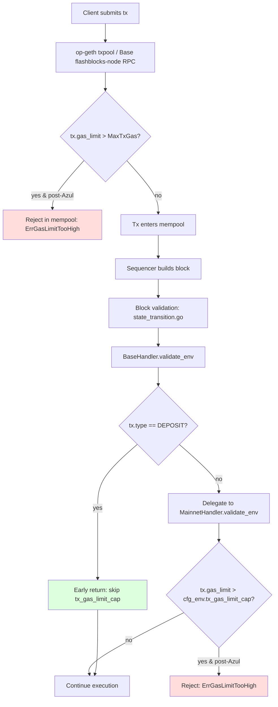
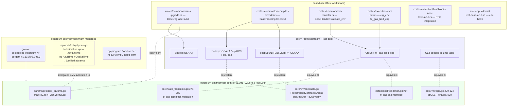

# Osaka 执行层 EIP 变更分析与代码实现 (Base Azul)

## Executive Summary

Base Azul 在执行层一次性吸收了 Ethereum Osaka 的五项 EIP——EIP-7825（每笔交易 gas 硬上限 2^24）、EIP-7823（MODEXP 输入字节上限 1024）、EIP-7883（MODEXP 计价提升）、EIP-7939（CLZ opcode 0x1e）和 EIP-7951（secp256r1 / `0x100` precompile gas 翻倍至 6,900），并通过单一开关 `BaseUpgrade::Azul => SpecId::OSAKA` 把整套 Osaka 指令/precompile 集合下沉到 reth/revm 上游。Base 自己只在两个位置补丁化：(1) `BaseHandler::validate_env` 中为 deposit 交易短路 `tx_gas_limit_cap` 校验（理由：deposit 交易由 L1 inclusion 限制为 20M gas，已超出 7825 的 16,777,216 cap）；(2) `BasePrecompiles::azul()` 在 jovian 集基础上 `extend([modexp::OSAKA, secp256r1::P256VERIFY_OSAKA])`，让两个 Osaka 精度规则覆盖 jovian 注册条目。

OP Stack 上游对比使用**双源**证据。执行层 Go 实现位于 `ethereum-optimism/op-geth`，由 `optimism` monorepo `go.mod` 中 `replace github.com/ethereum/go-ethereum => github.com/ethereum-optimism/op-geth v1.101702.2-rc.3`（commit `e8800cf`）pin 定，所有五项 EIP 的实际指令/precompile/state-transition 代码都在该仓的 `core/vm/*`、`core/state_transition.go`、`params/protocol_params.go` 中实现。`ethereum-optimism/optimism` monorepo 本身**不包含**任何 EVM 实现，迄今 fork 时间戳序列只到 `JovianTime`，对 "Azul" 零引用——这是 justified absence：rollup 层把 EVM/precompile 行为完全委托给 op-geth。

研究中识别并解决了一项 primary source 冲突：Base Azul `exec-engine.md` 中同时出现 p256Verify gas `3,450` 与 `6,900` 两个数值。Resolution（详见 item-5 与 diag-4）：`3,450` 是 Fjord/RIP-7212 引入时的历史值，`6,900` 是 Azul/EIP-7951 之后的最终值，由 base/base 测试 `test_p256verify_gas_doubled`、`test_p256verify_osaka_exact_gas` 与 op-geth `params.P256VerifyGas = 6900` 三方互证。

对 Mantle 团队的关键洞察：复刻这套变更最高风险的两条路径是 **MODEXP 计价**（EIP-7883 对 RSA/zk 协议产生 1.5×–10× 的 gas 涨幅）与 **p256Verify gas 翻倍**（ERC-4337/EIP-7702 Passkey paymaster 直接成本翻倍）；deposit 豁免与 BaseUpgrade 开关都是 Base-only 工程便利，Mantle 应根据自身 deposit/system tx 语义重写 `validate_env` 分支。

## Item Findings

### item-1: EIP-7825 Transaction Gas Limit Cap 与 deposit 豁免实现

#### spec_summary

EIP-7825（"Transaction Gas Limit Cap"）规定从 Osaka 激活区块起，**单笔交易**的 `gas_limit` 不得超过 `2^24 = 16,777,216`；超出者必须在 mempool 与 block validation 两个阶段拒收。该 cap 不影响区块整体 gas limit（仍由 EIP-1559/4844 控制）。EIP 文本将激活点放在 `IsOsaka(blockNumber, time)`；Base Azul 与 L1 Osaka 在 cap 数值与激活语义上**完全等价**，仅在 enforcement 路径增加一个 deposit 早返回分支。

#### gas_constants_and_bounds

| 常量 | 值 | 来源 |
|---|---|---|
| `MAX_TX_GAS_LIMIT_OSAKA` | `1 << 24` = `16,777,216` | revm 上游常量；Base 在 `base-execution-evm` 处复用 |
| `params.MaxTxGas` | `1 << 24` = `16,777,216` | `op-geth/params/protocol_params.go:42` |
| Base deposit cap | `20_000_000` | 已由 L1 inclusion 与 deposit 路径上限决定，独立于 7825 |

#### code_paths

| 路径 | 角色 | 关键符号 |
|---|---|---|
| `base/crates/common/chains/src/upgrade.rs:32-55, 184-203` | fork→spec 映射 | `BaseUpgrade::Azul`、`into_eth_spec` (`_ => SpecId::OSAKA`)、`test_base_upgrade_eth_spec_mapping` |
| `base/crates/execution/evm/src/env.rs:9, 34-36` | cfg_env 装配 | `is_azul_active_at_timestamp` 时设 `cfg_env.tx_gas_limit_cap = Some(MAX_TX_GAS_LIMIT_OSAKA)` |
| `base/crates/common/evm/src/handler.rs:79-100, 658-786` | validate_env | `BaseHandler::validate_env`、deposit 早返回、`MainnetHandler::validate_env` 委托 |
| `base/crates/execution/flashblocks-node/tests/azul.rs` | mempool/RPC 接受测试 | `azul_gas_limit_cap`、`pre_azul_accepts_tx_above_gas_limit_cap`、常量 `GAS_LIMIT_CAP: u64 = 1 << 24` |
| `base/etc/scripts/devnet/test-base-azul.sh` | devnet 集成 | "TX gas limit cap" case，调用 cap+1 验证拒绝 |

#### code_excerpt_with_annotation

`base/crates/common/evm/src/handler.rs`（节选）：

```rust
fn validate_env(&self, evm: &mut Self::Evm) -> Result<(), Self::Error> {
    let ctx = evm.ctx();
    let tx = ctx.tx();
    let tx_type = tx.tx_type();
    if tx_type == DEPOSIT_TRANSACTION_TYPE {
        // Deposit 交易由 L1 inclusion 强制约束 (≤20M gas)，
        // 并跳过普通 EIP-1559/Osaka 校验路径；早返回意味着
        // tx_gas_limit_cap 不会对 deposit tx 生效。
        return Ok(());
    }
    // 非-deposit 路径委托给 revm mainnet handler，该处会读取
    // cfg_env.tx_gas_limit_cap 并对 tx.gas_limit > cap 报错。
    self.mainnet.validate_env(evm)
}
```

注解：Base 把 EIP-7825 的 cap 数值与拒绝逻辑**完全交给 revm mainnet handler**，自身仅承担"路由"职责——deposit 走豁免、其他类型走主网校验。这一拆分让 Base 与 reth/revm 上游的 Osaka 升级解耦，未来 revm 调整 cap 数值或错误类型时 base/base 无需改动。

#### deposit_or_l2_specific_behavior

唯一的 Base-only 分支是 deposit 早返回。理由：deposit 交易代表 L1→L2 资产或消息，由 L1 inclusion 流程（OP Stack `op-node` derivation）注入区块，gas_limit 已经被 L1 部分（最高 20M）限制，且 deposit 不通过 mempool（不能被任何节点重 broadcast），强制 16,777,216 cap 会破坏既有 deposit 流程兼容性。Base 因此选择**仅对用户提交的 mempool 交易**生效 EIP-7825。

#### l1_equivalence_or_divergence

- **完全等价**：cap 数值、激活点、错误语义（拒绝交易、不消耗 gas）与 L1 Osaka 完全一致。
- **分歧**：deposit 交易豁免。L1 不存在 deposit 交易类型，因此此差异**不可观察**——Base 行为在 L1 等价语义下属于"超集"。

#### backward_compatibility_impact

- 已部署合约**不受影响**：cap 是 *交易级* 限制，不改变合约执行语义。
- 受影响的工作流：
  - 任何依赖单笔 >16,777,216 gas 交易的批量操作（例如某些 batch 部署、L1→L2 大型 state import、testnet stress 工具）必须改为多笔；
  - 钱包/SDK 的 gas estimation 上限应主动 clamp 到 `0xFFFFFF`，否则 estimateGas 通过但 sendTransaction 失败；
  - txpool 操作员侧 `node.rs` 的 `txpool.max_tx_gas_limit` 选项可在节点级再设更低值，但不能高于协议 cap（设更高时被 protocol 校验覆盖）。

#### test_coverage

| 测试 | 位置 | 断言 |
|---|---|---|
| `test_azul_tx_gas_limit_cap_rejected` | `base/crates/common/evm/src/handler.rs` | 16,777,217 在 Azul 上被拒 |
| `test_azul_tx_gas_limit_at_cap_ok` | 同上 | 16,777,216 被接受 |
| `test_jovian_no_tx_gas_limit_cap` | 同上 | Jovian (pre-Azul) 不施加 cap |
| `test_azul_deposit_skips_gas_limit_cap` | 同上 | deposit 类型即使 >cap 也通过 |
| `azul_gas_limit_cap` | `base/crates/execution/flashblocks-node/tests/azul.rs` | RPC 层 `eth_sendRawTransaction` 在 Azul 下拒绝 >cap |
| `pre_azul_accepts_tx_above_gas_limit_cap` | 同上 | Pre-Azul RPC 不拒绝 >cap |
| `etc/scripts/devnet/test-base-azul.sh` "TX gas limit cap" | devnet 脚本 | 端到端拒绝 cap+1 |

#### op_stack_upstream_mapping

| 源 | 位置 | 证据 |
|---|---|---|
| **op-geth EL** `v1.101702.2-rc.3` (`e8800cf`) | `params/protocol_params.go:42` | `MaxTxGas uint64 = 1 << 24` |
| 同上 | `core/state_transition.go:378-382` | `if isOsaka && msg.GasLimit > params.MaxTxGas { return ErrGasLimitTooHigh }` |
| 同上 | `core/txpool/validation.go:70, 126-127, 139-140` | mempool 路径强制 cap；`MaxTxGasLimit` 字段允许 operator 在 cap 之下再降 |
| **optimism monorepo** (`d905be1e03`) | `go.mod` | `replace github.com/ethereum/go-ethereum => github.com/ethereum-optimism/op-geth v1.101702.2-rc.3`——pin 证据 |
| 同上 | `op-node/rollup/types.go:120-130, 486-622` | fork timeline 已知最高为 `JovianTime`；**无 `AzulTime`**——justified absence，原因：执行层 EIP 的激活由 op-geth 自身的 `ChainConfig.IsOsaka` 决定，monorepo rollup config 不需要复制 |

#### mantle_replication_notes

1. **deposit 豁免的语义边界**：Mantle 若有不同的 system tx / cross-chain tx 类型，必须分别决定是否豁免。建议在 `validate_env` 中显式枚举每种豁免 tx_type，并以单元测试钉死边界。
2. **常量来源**：复用 revm/reth 上游的 `MAX_TX_GAS_LIMIT_OSAKA` 比硬编码 `1 << 24` 更安全——后者一旦 EIP 修订（例如未来 EIP 调高 cap）会沉默地脱钩 L1。
3. **mempool vs block validation 双重 enforcement**：op-geth 在 `core/state_transition.go` 与 `core/txpool/validation.go` 两处都校验，Mantle 必须确保两侧同时启用，否则 P2P 接收的攻击交易可绕过 mempool 但仍被区块校验拒绝（DoS 风险）。
4. **estimateGas 行为**：必须同步修改 RPC 端使得 `eth_estimateGas` 返回值不超过 cap，否则生态工具会持续生成不可上链的交易。

#### source_conflicts_and_resolution

no conflict observed.

---

### item-2: EIP-7823 Upper-Bound MODEXP 输入限制实现

#### spec_summary

EIP-7823 给 MODEXP precompile（地址 `0x05`）三个长度字段（base、exponent、modulus）各添加 `1024 字节` 的硬上限。任一字段超过 1024 字节即视为无效输入：调用消耗全部 gas 并 revert 返回值。该上限独立于 EIP-7883 的计价提升，但二者在 Osaka 同时激活、共享同一 `osaka_run` 实现路径。

#### gas_constants_and_bounds

| 常量 | 值 | 来源 |
|---|---|---|
| MODEXP 字段长度上限 | 1024 字节 | EIP-7823 spec；revm `eip7823::INPUT_SIZE_LIMIT` |
| 错误类型 | `PrecompileError::ModexpEip7823LimitSize` | revm 上游 |

#### code_paths

| 路径 | 角色 |
|---|---|
| `base/crates/common/precompiles/src/provider.rs:56-133` | `BasePrecompiles::azul()`：`precompiles.extend([modexp::OSAKA, secp256r1::P256VERIFY_OSAKA])` |
| `base/crates/common/precompiles/src/provider.rs:392-473` | `test_modexp_eip7823_boundary`、`test_modexp_eip7823_each_field_rejects`、`test_modexp_eip7823_all_fields_at_limit` |
| `op-geth/core/vm/contracts.go:150-172` (`PrecompiledContractsOsaka`)、`:157` (Osaka MODEXP entry)、`:737-739` (运行时 1024-byte 检查)、`:651-670` (`osakaModexpGas`) | Osaka 注册项 `0x05: &bigModExp{eip2565: true, eip7823: true, eip7883: true}`；运行时检查 `if c.eip7823 && (inputLenOverflow || max(baseLen, expLen, modLen) > 1024) { return errors.New("one or more of base/exponent/modulus length exceeded 1024 bytes") }` |
| `op-geth/core/vm/contracts_test.go:49-82` | `allPrecompiles` 测试 map 注册 `0xf6: &bigModExp{eip2565: true, eip7883: true}`（**未**设 `eip7823: true`）；EIP-7883 计价回归覆盖，但**未发现**显式 EIP-7823 oversize 拒绝测试（详见 test_coverage 与 Gap Analysis） |

#### code_excerpt_with_annotation

`op-geth/core/vm/contracts.go`（节选）：

```go
// Pad base, exp, mod
input = common.RightPadBytes(input, int(baseLen+expLen+modLen))
// EIP-7823 input size cap (Osaka): reject if any field exceeds 1024 bytes.
if c.eip7823 && (inputLenOverflow || max(baseLen, expLen, modLen) > 1024) {
    return nil, errors.New(
        "one or more of base/exponent/modulus length exceeded 1024 bytes",
    )
}
```

注解：检查发生在 input padding 之后、实际计算之前；返回 `error` 意味着 precompile 失败、消耗全部声明 gas（标准 precompile 失败语义），不返回部分结果。Base 通过 `modexp::OSAKA` 复用 revm 的等价检查，因此 base/base 仓库本身没有这段逻辑的源码副本。

#### deposit_or_l2_specific_behavior

无 Base-only 分支。MODEXP 输入限制在 deposit 与普通调用上语义一致，Base 不引入额外限制。

#### l1_equivalence_or_divergence

完全等价。Base Azul 与 L1 Osaka 共享 `1024 字节` 上限与拒绝语义。

#### backward_compatibility_impact

- 任何向 MODEXP 提交超过 1024 字节 base/exp/mod 的合约会在 Azul 之后开始失败。EIP-7823 spec 引用的链上调研显示，主网历史上**几乎不存在**超过 1024 字节字段的成功调用，因此实际 break 风险极低；但用作"通用大数运算 oracle"的协议（少数 RSA 累加器、研究性 ZKP 协议）必须重新审计。
- 推荐迁移：在 Solidity 入口添加显式 require(base.length ≤ 1024 && exp.length ≤ 1024 && mod.length ≤ 1024)，把失败提前到上层、避免消耗全部 gas。

#### test_coverage

| 测试 | 断言 |
|---|---|
| `test_modexp_eip7823_boundary` (Rust, base/base) | 1024 字节字段成功，1025 失败 |
| `test_modexp_eip7823_each_field_rejects` (Rust, base/base) | 任一字段超限即拒绝 |
| `test_modexp_eip7823_all_fields_at_limit` (Rust, base/base) | 三字段均为 1024 时通过 |
| devnet `test-base-azul.sh` "MODEXP size limit" | 端到端拒绝超限输入 |
| **op-geth (Go)** `core/vm/contracts_test.go` | **覆盖缺口**：`allPrecompiles` 仅注册 `0xf6: &bigModExp{eip2565: true, eip7883: true}`——未设 `eip7823: true`；在 `v1.101702.2-rc.3` (`e8800cf`) 该文件**未发现**显式 EIP-7823 oversize 拒绝回归测试。EIP-7823 的实现（`contracts.go:737-739`）依靠 Rust 侧 base/base 单元测试与 devnet 脚本互证，Go 侧需要补充覆盖（Mantle 关注点） |

#### op_stack_upstream_mapping

| 源 | 位置 | 证据 |
|---|---|---|
| **op-geth EL** `v1.101702.2-rc.3` | `core/vm/contracts.go:157` (Osaka 注册项)、`:737-739` (1024-byte 检查)、`:651-670` (`osakaModexpGas`) | `PrecompiledContractsOsaka` 中 `bigModExp{eip7823: true, eip7883: true}`；oversize 检查在 `(c *bigModExp).Run` 中就地实现 |
| 同上 | `core/vm/contracts_test.go:49-82` (`allPrecompiles`) | 仅含 `eip7883: true` fork 切片；**未发现**显式 EIP-7823 oversize 拒绝回归测试（Gap G-4 / 上游覆盖缺口） |
| **optimism monorepo** | `go.mod` | op-geth pin 同上；monorepo 不含 MODEXP 实现 |
| 同上 | `op-program/host/*`、`op-node/rollup/*` 全仓 `rg "MODEXP|modexp|7823"` | 命中数 = 0；justified absence：MODEXP 是 EVM precompile，不在 rollup config 范围 |

#### mantle_replication_notes

1. **常量同步**：若 Mantle 在 reth/revm fork 上调整 `eip7823::INPUT_SIZE_LIMIT`，必须同时同步 op-geth/客户端层与单元测试，避免不同 sync 客户端在 1024 边界出现共识分歧。
2. **gas 消耗失败语义**：oversize 失败消耗*全部*声明 gas（标准 precompile 失败模式）。Mantle 工具栈应在 gas estimation 中显式探测这一点，避免错误的"线性 gas vs 长度"模型。
3. **历史合约扫描**：Mantle 上线 EIP-7823 前应针对自家主网做 MODEXP 调用扫描，识别任何会被 break 的合约并提前通知。

#### source_conflicts_and_resolution

no conflict observed.

---

### item-3: EIP-7883 MODEXP Gas Cost 三重提升与历史影响分析

#### spec_summary

EIP-7883 在 EIP-2565（Berlin）公式上做三处改动：

1. **`MIN_GAS`**：200 → 500。
2. **去除 `/ 3` 分母**：原 `(iter_count * mult_complexity) / 3` → `iter_count * mult_complexity`（等价于 ×3）。
3. **`max_length > 32` 时的 `multiplier`**：8 → 16；并且 `multiplication_complexity` 改为 `2 * words²`，否则保底 16。

Base Azul 与 L1 Osaka 在 EIP-7883 上**完全等价**。

#### gas_constants_and_bounds

| 阶段 | min_gas | iter multiplier (exp_len ≤ 32) | iter multiplier (exp_len > 32) | mult_complexity |
|---|---|---|---|---|
| Berlin (EIP-2565) | 200 | 1 | 8 | `(max(len)² + 7) / 8`, `/3` 分母 |
| Osaka (EIP-7883) | **500** | 1 | **16** | `max(16, 2 * words²)` if max_len > 32 else 16, **无 `/3` 分母** |

#### code_paths

| 路径 | 角色 |
|---|---|
| `base/crates/common/precompiles/src/provider.rs:56-133` | `BasePrecompiles::azul()` 引入 `modexp::OSAKA` |
| `base/crates/common/precompiles/src/provider.rs:test_modexp_eip7883_min_gas_increase` | Berlin min 200 vs Osaka min 500 断言 |
| `base/crates/common/precompiles/src/provider.rs:test_modexp_eip7883_larger_input_gas_increase` | 大输入下 Osaka gas > Berlin gas 断言 |
| `op-geth/core/vm/contracts.go:157` | `PrecompiledContractsOsaka` 中 `0x05: &bigModExp{eip2565: true, eip7823: true, eip7883: true}`（Osaka MODEXP 入口） |
| `op-geth/core/vm/contracts.go:651-670` | `osakaModexpGas`：multiplier=16、minGas=500、删除 `/3` 分母 |
| `op-geth/core/vm/contracts.go:711-718` (`(c *bigModExp).RequiredGas`) | 根据 `c.eip7883` 选择 `osakaModexpGas`，否则回退 Berlin/Byzantium |
| `op-geth/params/protocol_params.go` | 相关 modexp 常量 |

#### code_excerpt_with_annotation

`op-geth/core/vm/contracts.go`（节选）：

```go
func osakaModexpGas(baseLen, expLen, modLen uint64, expHead uint256.Int) uint64 {
    const (
        multiplier = 16   // EIP-7883: was 8 in EIP-2565 for exp_len > 32 branch
        minGas     = 500  // EIP-7883: was 200 in EIP-2565
    )
    maxLen := max(baseLen, modLen)
    multComplexity := osakaMultComplexity(maxLen)
    iterationCount := modexpIterationCount(expLen, expHead, multiplier)
    carry, gas := bits.Mul64(iterationCount, multComplexity)
    if carry > 0 {
        return math.MaxUint64
    }
    return max(gas, minGas)
}
```

注解：与 Berlin 公式相比，关键的三处改动都体现在编译期常量与 `osakaMultComplexity` 的实现里；**`/3` 分母被整体删除**（Berlin 版本会在 `bits.Mul64` 后除以 3）。Base 通过 revm 上游的 `modexp::OSAKA` 注册项继承同一公式，base/base 仓库没有 Rust 版本的公式副本，确保 Go 与 Rust 客户端共识。

#### deposit_or_l2_specific_behavior

无 Base-only 分支。

#### l1_equivalence_or_divergence

完全等价。

#### backward_compatibility_impact

EIP-7883 文本给出三个真实历史用例的涨幅基准（nagydani-1-square、marcin-1-base、guido-fuzz）：
- 小输入（≤32 字节）：最小 gas 200→500 即 2.5×，但绝对增量小；
- 中等输入（256/512 字节）：1.5×–2× 涨幅（去 `/3` 分母为主导）；
- 大输入 + 大 exponent：数千 % 涨幅（multiplier 翻倍叠加 `2 * words²`）。

受影响最大的协议类别：
- **链下 RSA 签名验证**（部分跨链桥、Web2 兼容工具）；
- **ZK verifier 中嵌入 MODEXP 的 trapdoor**；
- **大数累加器**（DARK、SNARK-friendly accumulator）。

迁移建议：(a) 在 Azul 上线前用 `eth_call --gas` 重放最近 N 个月 MODEXP 历史调用并量化 OOG 数量；(b) 对持续业务关键的合约部署 wrapper，将 MODEXP 输入切片至 ≤32 字节字段；(c) 评估迁移到 BLS/secp 系曲线（EIP-2537、EIP-7951）。

#### test_coverage

| 测试 | 断言 |
|---|---|
| `test_modexp_eip7883_min_gas_increase` | Berlin min 200 vs Osaka min 500 |
| `test_modexp_eip7883_larger_input_gas_increase` | 大输入下 Osaka 严格大于 Berlin |
| devnet `test-base-azul.sh` "MODEXP min gas increase (400 gas)" | 400 gas 调用：Berlin 通过、Osaka OOG（min 上调到 500 后触发 OOG） |

#### op_stack_upstream_mapping

| 源 | 位置 | 证据 |
|---|---|---|
| **op-geth EL** `v1.101702.2-rc.3` | `core/vm/contracts.go:651-670` | `osakaModexpGas` 完整实现（multiplier=16、minGas=500、无 `/3` 分母） |
| 同上 | `core/vm/contracts.go:157` | `PrecompiledContractsOsaka` 中 `0x05: &bigModExp{eip2565: true, eip7823: true, eip7883: true}` |
| 同上 | `core/vm/contracts_test.go:49-82`（`allPrecompiles` 注册 `0xf6: &bigModExp{eip2565: true, eip7883: true}`） | Osaka MODEXP fork-aware 测试切片；该 fixture 走 `osakaModexpGas` 路径，覆盖 EIP-7883 计价回归 |
| **optimism monorepo** | `go.mod` (op-geth pin) | 唯一交集 |
| 同上 | 全仓 `rg "7883"` | 0 hits；justified absence |

#### mantle_replication_notes

1. **价格上涨预算**：Mantle 上线前必须对自家主网做 MODEXP 历史调用的 gas 重放，特别关注 RSA 验证类合约；建议提供至少 1 个月的"gas warning"窗口。
2. **`/3` 分母**：实现时容易复制 Berlin 公式遗忘去除——必须有专门的 Berlin vs Osaka 对照单元测试（base/base 用的就是 `test_modexp_eip7883_larger_input_gas_increase` 这种成对测试）。
3. **EIP-7883 与 EIP-7823 共存**：测试矩阵必须覆盖 (oversize 字段 → 7823 拒绝) 与 (合法长度但大 gas → 7883 计价) 两种独立失败路径，避免误把 7883 触发的 OOG 当成 7823 限制。

#### source_conflicts_and_resolution

no conflict observed.

---

### item-4: EIP-7939 CLZ Opcode：语义、激活与 ZK 友好性

#### spec_summary

EIP-7939 在 EVM 指令表中新增 `CLZ`（Count Leading Zeros），opcode `0x1e`，栈语义 `(top: x) -> (top: 256 - bitlen(x))`：返回 256-bit 字内前导零位数；`x = 0` 返回 `256`。最终 spec 把 gas cost 从草案 3 提至 5（与 MUL 同级，`GasFastStep`），原因是防止重复调用 DoS（CLZ 在 SIMD 友好 CPU 上极便宜，但 EVM 解释器仍有固定开销）。

#### gas_constants_and_bounds

| 常量 | 值 | 来源 |
|---|---|---|
| `CLZ` opcode | `0x1e` | EIP-7939；`op-geth/core/vm/opcodes.go:65` |
| gas cost | `5` (`GasFastStep`) | EIP-7939（final）；`op-geth/core/vm/gas.go:28`；`enable7939` |
| stack delta | (-1, +1) | spec；jump table `minStack/maxStack` |
| `CLZ(0)` | `256` | spec；`opCLZ` 中 `x.BitLen()` 在 `x == 0` 时返回 0 |

#### code_paths

| 路径 | 角色 |
|---|---|
| `base/crates/common/chains/src/upgrade.rs:53` | `BaseUpgrade::Azul => SpecId::OSAKA`（通过 fallthrough `_ => SpecId::OSAKA`） |
| `base/crates/common/evm/src/handler.rs:test_osaka_opcodes_activated_azul` | 验证 Azul 下 Osaka 指令集生效 |
| `base/crates/common/evm/src/handler.rs:test_clz_opcode_azul` | 字节码 `60801E60005260206000F3`（PUSH1 0x80, CLZ, PUSH1 0x00, MSTORE, PUSH1 0x20, PUSH1 0x00, RETURN）返回 248 (= 256 - 8) |
| `base/crates/common/evm/src/handler.rs:test_clz_opcode_not_on_jovian` | Pre-Azul 上 CLZ 不可用（解释为 invalid opcode） |
| `op-geth/core/vm/eips.go:299-324` | `opCLZ`（实现）与 `enable7939`（jump table 安装） |
| `op-geth/core/vm/jump_table.go:105` | Osaka jump table 中 `enable7939(&instructionSet)` |
| `op-geth/core/vm/opcodes.go:65` | `CLZ OpCode = 0x1e` |
| `op-geth/core/vm/gas.go:28` | `GasFastStep uint64 = 5` |

#### code_excerpt_with_annotation

`op-geth/core/vm/eips.go:299-324`：

```go
// opCLZ implements the CLZ opcode (count leading zero bits)
func opCLZ(pc *uint64, evm *EVM, scope *ScopeContext) ([]byte, error) {
    x := scope.Stack.peek()
    x.SetUint64(256 - uint64(x.BitLen()))
    return nil, nil
}

// enable7939 enables EIP-7939 (CLZ opcode)
func enable7939(jt *JumpTable) {
    jt[CLZ] = &operation{
        execute:     opCLZ,
        constantGas: GasFastStep, // 5
        minStack:    minStack(1, 1),
        maxStack:    maxStack(1, 1),
    }
}
```

注解：`x.BitLen()` 由 `holiman/uint256` 提供，`x == 0` 时返回 0，于是 `256 - 0 = 256`——符合 EIP-7939 边界规定。Base 仓库**不直接持有这段实现**：CLZ 通过 `BaseUpgrade::Azul => SpecId::OSAKA` 在 revm 上游被激活，base/base 只通过测试断言可见。

#### deposit_or_l2_specific_behavior

无 Base-only 分支：CLZ 是纯指令，不区分 tx 类型。

#### l1_equivalence_or_divergence

完全等价。

#### backward_compatibility_impact

CLZ 是**纯增量**指令：Pre-Azul 合约从未能编译/部署 `0x1e`，故无既有合约被 break。但
- Pre-Azul 部署的合约若代码段包含 `0x1e` 字节（属"data，不是指令"），在 Azul 后 jump destination 解析仍把 `0x1e` 当作非-JUMPDEST 字节，运行时不会被 dispatch 为 CLZ——纯字节并不会变成指令。这与 EIP-3855 (`PUSH0`) 的兼容性论证一致。
- 收益面：
  - `lnWad`/`powWad`/`sqrt` 在 Solady、Solmate 中之前用 16 步二分搜索找 MSB，平均 ~80–120 gas；CLZ 一次 5 gas + 几个栈操作即可；
  - 整数 `log2`、bitmap 容量计算、固定点对数；
  - **ZK rv32im prover**：CLZ 是 rv32im 的 `CLZ.W` 指令；引入 CLZ 让在 EVM 上模拟 RISC-V 的 ZK 证明更便宜，与 Base 的 ZK 路线图（OP Succinct、Kona）协同。

#### test_coverage

| 测试 | 位置 | 断言 |
|---|---|---|
| `test_clz_opcode_azul` | `base/crates/common/evm/src/handler.rs` | CLZ(0x80) 返回 248 |
| `test_clz_opcode_not_on_jovian` | 同上 | Pre-Azul 上 CLZ revert/invalid |
| `test_osaka_opcodes_activated_azul` | 同上 | Azul 下整体 Osaka 指令集激活 |
| devnet `test-base-azul.sh` "CLZ opcode" | devnet 脚本 | 4 用例：0、1、高位、四位 |

#### op_stack_upstream_mapping

| 源 | 位置 | 证据 |
|---|---|---|
| **op-geth EL** `v1.101702.2-rc.3` | `core/vm/opcodes.go:65` | `CLZ OpCode = 0x1e` |
| 同上 | `core/vm/eips.go:299-324` | `opCLZ` + `enable7939` |
| 同上 | `core/vm/jump_table.go:105` | osaka set 调用 `enable7939` |
| 同上 | `core/vm/gas.go:28` | `GasFastStep = 5` |
| **optimism monorepo** | `go.mod` | op-geth pin 同上 |
| 同上 | 全仓 `rg "CLZ|7939"` | 0 hits；justified absence：EVM 指令完全在 op-geth 中 |

#### mantle_replication_notes

1. **gas 值一致性**：CLZ 草案曾用 gas=3，最终值 5；Mantle 必须以 EIP-7939 最终版本为准、对照 op-geth `enable7939`。
2. **ZK 集成**：若 Mantle ZK Stack 使用 rv32im prover，提前在更早 fork 引入 CLZ（甚至独立部署）有显著证明成本收益；但需评估与 L1 等价性破坏的取舍。
3. **测试矩阵**：必须包含 `CLZ(0) == 256`、`CLZ(1) == 255`、`CLZ(2^255) == 0` 三个边界以及一个 mid-range case；base/base 的 devnet 脚本采取的就是这种 4-case 覆盖。

#### source_conflicts_and_resolution

no conflict observed.

---

### item-5: EIP-7951 secp256r1 (p256Verify) Precompile Gas 翻倍

#### spec_summary

EIP-7951 把 secp256r1（NIST P-256）验证 precompile 从 RIP-7212 引入时的 `3,450` gas 提升至 `6,900` gas，**精确翻倍**。地址保持 `0x100`、输入格式（160 字节：32×msg_hash, 32×r, 32×s, 64×pubkey）与返回值（成功返回 `0x...01`、失败返回空字节）完全不变。激活时间在 Osaka fork——L1 历史上**从未**部署过该 precompile，Osaka 才是 L1 首次启用。Base 早在 Fjord 通过 RIP-7212 抢先部署，于是 Azul 仅做"重计价"。

#### gas_constants_and_bounds

| 阶段 | gas 值 | 地址 | 引入 EIP |
|---|---|---|---|
| Pre-Fjord (Base) | N/A | — | precompile 不存在 |
| Fjord (Base) | **3,450** | `0x100` | RIP-7212 |
| Azul (Base) / Osaka (L1) | **6,900** | `0x100` | EIP-7951 |

revm 常量：`P256VERIFY_BASE_GAS_FEE = 3450`（Fjord）、`P256VERIFY_BASE_GAS_FEE_OSAKA = 6900`（Osaka）。op-geth 常量：`params.P256VerifyGasFjord = 3450`、`params.P256VerifyGas = 6900`。

#### code_paths

| 路径 | 角色 |
|---|---|
| `base/crates/common/precompiles/src/provider.rs:56-133` | `BasePrecompiles::fjord()` 引入 `secp256r1::P256VERIFY` (3,450)；`BasePrecompiles::azul()` 再 `extend([modexp::OSAKA, secp256r1::P256VERIFY_OSAKA])` 覆盖 |
| `base/crates/common/precompiles/src/provider.rs:392-473` | `test_p256verify_osaka_exact_gas`、`test_p256verify_gas_doubled` |
| `op-geth/core/vm/contracts.go:171` | `PrecompiledContractsOsaka` 中 `0x100: &p256Verify{}`（Osaka 入口） |
| `op-geth/core/vm/contracts.go:182-193` (`PrecompiledContractsFjord`) | `0x01, 0x00: &p256VerifyFjord{}`（Fjord 入口） |
| `op-geth/core/vm/contracts.go:1698-1714` | `p256VerifyFjord.RequiredGas → params.P256VerifyGasFjord` (3,450)；`p256Verify.RequiredGas → params.P256VerifyGas` (6,900)；二者并存以保证 fork-aware 计费 |
| `op-geth/params/protocol_params.go:183-184` | `P256VerifyGasFjord = 3450`；`P256VerifyGas = 6900` |
| Base Azul spec | `base/docs/specs/pages/upgrades/azul/exec-engine.md:37-43` | 同时提及 3,450 与 6,900（见 source_conflicts_and_resolution） |

#### code_excerpt_with_annotation

`base/crates/common/precompiles/src/provider.rs`（节选）：

```rust
pub fn azul() -> &'static Precompiles {
    static INSTANCE: OnceLock<Precompiles> = OnceLock::new();
    INSTANCE.get_or_init(|| {
        let mut precompiles = Self::jovian().clone();
        // Base Azul adopts Osaka pricing and bounds for MODEXP and P256VERIFY.
        // `extend` overwrites prior entries at the same address; P256VERIFY at
        // 0x100 is replaced from the Fjord-era 3,450-gas variant with the
        // Osaka 6,900-gas variant.
        precompiles.extend([modexp::OSAKA, secp256r1::P256VERIFY_OSAKA]);
        precompiles
    })
}
```

注解：`extend` 的语义是"以地址为键覆盖"，因此 `P256VERIFY_OSAKA` 在 `0x100` 上**取代**了 Fjord 安装的 `P256VERIFY`。同地址、同 ABI、不同 `PrecompileFn`——调用合约无感知，但 gas 计费分支切换。这是 Base 实现的关键巧思：不需要任何独立的 fork-aware 地址路由，所有路由收敛在 `BasePrecompiles::new_with_spec(spec)` 这一处。

#### deposit_or_l2_specific_behavior

无 Base-only 分支。但需要注意**Base 与 L1 的历史不对称**：Base Fjord 早于 Osaka 数年提供了 P256VERIFY，因此 Base 上的 4337/Passkey 钱包从 Fjord 起即可用 3,450 gas 路径；L1 用户在 Osaka 之前无法使用。Azul 升级把 L2 计价对齐 L1，**抹平**了 L2 历史套利空间（4337 paymaster 在 Base 上的 P256 验证成本将翻倍）。

#### l1_equivalence_or_divergence

- **Osaka 之后**：完全等价（地址 / ABI / gas）。
- **Osaka 之前的 historic 行为**：分歧——Base/L2 早于 L1 数轮已有此 precompile，L1 当时无对应地址。该差异在 Azul 之后不再可观测。

#### backward_compatibility_impact

**直接受影响的应用模式**：

1. **ERC-4337 (Account Abstraction) + Passkey/WebAuthn**：UserOperation 的 P256 验签成本翻倍。一个典型 WebAuthn-flow paymaster 调用从 ~3,500 gas 升至 ~7,000 gas（不计调用 wrapper 开销）；
2. **EIP-7702 委托账户**：若委托代码内置 P256 验证（Passkey 钱包代理），每签名同样翻倍；
3. **多签 / Session Key**：若 session key 使用 secp256r1（与 secp256k1 不同）做签名，每验证 +3,450 gas；
4. **跨链桥 attestation**：极少数桥使用 P256 attestation chain，需要重新评估单笔 message 成本。

**worst-case 倍数**：2× 精确翻倍；**绝对增量**：每次验证 +3,450 gas（≈ 在 0.05 Gwei base fee 下 ~$0.00001 增量，但 L2 上数千次调用累计明显）。

迁移建议：
- 4337 bundler 配置文件中的 `verificationGasLimit` 默认值需提升（典型从 100k → 110k）；
- paymaster 抗操控成本评估更新；
- Passkey 钱包 SDK 提示用户在 Azul 之后 gas 报价上调；
- 评估迁移到 BLS（EIP-2537）或 EdDSA（如未来 EIP 引入）作为替代。

#### test_coverage

| 测试 | 位置 | 断言 |
|---|---|---|
| `test_p256verify_osaka_exact_gas` | `base/crates/common/precompiles/src/provider.rs` | Azul 下 `RequiredGas == 6900` |
| `test_p256verify_gas_doubled` | 同上 | `P256VERIFY_BASE_GAS_FEE_OSAKA == P256VERIFY_BASE_GAS_FEE * 2` |
| devnet `test-base-azul.sh` "P256VERIFY gas (5000 gas OOG after Azul)" | devnet 脚本 | 5,000 gas 调用在 Fjord 通过（≥ 3,450）、在 Azul OOG（< 6,900） |

#### op_stack_upstream_mapping

| 源 | 位置 | 证据 |
|---|---|---|
| **op-geth EL** `v1.101702.2-rc.3` | `core/vm/contracts.go:171` | `PrecompiledContractsOsaka` 中 `0x100: &p256Verify{}` |
| 同上 | `core/vm/contracts.go:1711-1714` | `(p256Verify).RequiredGas` 返回 `params.P256VerifyGas` (6,900) |
| 同上 | `core/vm/contracts.go:1698-1705` | `p256VerifyFjord{p256Verify}` 内嵌；`(p256VerifyFjord).RequiredGas` 返回 `params.P256VerifyGasFjord` (3,450) |
| 同上 | `core/vm/contracts.go:182-193` | `PrecompiledContractsFjord` 中 `0x01,0x00: &p256VerifyFjord{}` |
| 同上 | `params/protocol_params.go:183-184` | `P256VerifyGasFjord = 3450`；`P256VerifyGas = 6900` |
| **optimism monorepo** | `go.mod` | op-geth pin 同上 |
| 同上 | 全仓 `rg "P256Verify|p256Verify|7951|7212"` | 0 hits；justified absence：precompile 实现在 op-geth |

#### mantle_replication_notes

1. **同地址覆盖语义**：若 Mantle 早期 fork 也已通过 RIP-7212 引入 P256VERIFY（3,450），必须在 Osaka 对齐 fork 上做*覆盖*而非*重新注册*；建议复用 base/base 的"`precompiles.extend([..._OSAKA])`"模式以避免代码重复。
2. **常量来源**：所有常量都应从 revm/op-geth 的 `params` 拿，不要在 Mantle 仓中独立定义 `6900` 字面量；这样 EIP 修订时同步代价最低。
3. **生态通知**：Passkey 钱包、4337 paymaster 必须在 Azul 等价 fork 上线前 ≥ 4 周收到 gas 上调通知；可参考 Base 在 `exec-engine.md` 中显式标注 "raises the cost to 6,900 to match L1" 的措辞。
4. **测试断言**：必须包含"2× 翻倍"显式断言（base/base 的 `test_p256verify_gas_doubled`）；这种断言能在常量被意外修改时立即捕获。

#### source_conflicts_and_resolution

**Conflict identification**：

Base Azul spec `docs/specs/pages/upgrades/azul/exec-engine.md:37-43` 同一节中同时出现：

> （L37–38）"[EIP-7951](https://eips.ethereum.org/EIPS/eip-7951) specifies the secp256r1 precompile at address `0x100` with a gas cost of 3,450."

> （L40–41）"Base already has the `p256Verify` precompile at the same address (added in Fjord via [RIP-7212]) with a gas cost of 3,450."

与：

> （L42–43）"From Azul, the gas cost increases to 6,900 to match the L1 gas cost specified in EIP-7951, maintaining strict equivalence with L1 precompile pricing."

两条数值陈述（3,450 与 6,900）并存，未经熟悉历史的读者可能误以为 Azul 之后仍为 3,450、或两者并存。另需说明：L37–38 把 `3,450` 归因于 EIP-7951 文本，而 EIP-7951 的当前规范值实际是 6,900（详见 Resolution）——这是 spec 措辞的精度问题而非数值冲突。

**Authoritative source selection**：

权威来源按以下优先级选定：
1. **EIP-7951**（ethereum.org/EIPS/eip-7951）：明确给出 Osaka 后 P256VERIFY gas = `6,900`；
2. **base/base 源码 + 单元测试**：`secp256r1::P256VERIFY_OSAKA` 注册于 Azul precompile 集，`test_p256verify_osaka_exact_gas` 断言 `RequiredGas == 6900`，`test_p256verify_gas_doubled` 断言 `OSAKA == BASE * 2`；
3. **op-geth `params/protocol_params.go:184`**：`P256VerifyGas uint64 = 6900`；
4. **RIP-7212**（rollup-improvement proposal）：明确给出 Fjord-era P256VERIFY gas = `3,450`。

**Resolution**：

- `3,450` 是 **Fjord/RIP-7212** 时期的历史 gas 值，对应 op-geth `P256VerifyGasFjord` 与 revm `P256VERIFY_BASE_GAS_FEE`。Base Azul spec 在 L37–41 提及该值时是在描述**Fjord 已有部署**，作为升级前对照；spec L37–38 将该值与 EIP-7951 关联属措辞瑕疵——EIP-7951 文本不是 3,450 的权威来源；
- `6,900` 是 **Azul/EIP-7951** 之后的最终 gas 值，对应 op-geth `P256VerifyGas` 与 revm `P256VERIFY_BASE_GAS_FEE_OSAKA`。Azul 激活后所有调用按此计费；
- 两值并非冲突而是**时序前后**：3,450（Fjord～Azul-1）→ 6,900（Azul～）。`test_p256verify_gas_doubled` 把这一时序关系编码为 2× 关系断言。

建议 Base spec 团队在后续修订时显式标注两值的时间段（例如 "Fjord (3,450) → Azul (6,900)，2×"），并修正 L37–38 把 `3,450` 归因于 EIP-7951 的表述。draft 此处以代码 + 测试为最终权威。

---

### item-6: 跨切面集成：BaseUpgrade→SpecId 映射、OP Stack 双源 diff 与端到端测试矩阵

#### spec_summary

本 item 把前五项 EIP 串成一条完整激活链路，并把 OP Stack 对比扩展到双源（op-geth EL + optimism monorepo rollup/config）证据形式。激活链路从 `BaseUpgrade::Azul`（顶层 fork 枚举）一路下沉到 revm `SpecId::OSAKA`，触发 cfg_env、handler、precompile provider 三处分支同时切换。OP Stack 端，**所有五项 EIP 都在 op-geth 中实现**，monorepo 只承担 op-geth 的版本 pin、rollup config 与 system tx 注入语义——Azul 在 monorepo 中以 fork timeline 角度尚未出现（最高已知 fork 为 Jovian）。

#### gas_constants_and_bounds

| 项 | 来源 |
|---|---|
| `MAX_TX_GAS_LIMIT_OSAKA = 1 << 24` | revm 上游 |
| `params.MaxTxGas = 1 << 24` | op-geth `params/protocol_params.go:42` |
| `INPUT_SIZE_LIMIT = 1024` (MODEXP) | revm `eip7823` 模块 |
| `MODEXP osaka minGas = 500, multiplier = 16` | op-geth `core/vm/contracts.go:651-671` |
| `CLZ = 0x1e`, gas 5 (`GasFastStep`) | op-geth `core/vm/opcodes.go:65`, `gas.go:28` |
| `P256VerifyGas = 6900` | op-geth `params/protocol_params.go:184` |

#### code_paths

| 路径 | 角色 |
|---|---|
| `base/crates/common/chains/src/upgrade.rs:32-55, 184-203` | `BaseUpgrade::Azul`、`into_eth_spec`、`LATEST = Self::Azul`、映射测试 |
| `base/crates/execution/evm/src/env.rs:9, 34-36` | `BaseEvmEnvBuilder::cfg_env` Azul 分支 |
| `base/crates/common/precompiles/src/provider.rs:56-133` | `BasePrecompiles::new_with_spec(Azul) => Self::azul()` |
| `base/crates/common/evm/src/handler.rs:79-100, 658-786` | `BaseHandler::validate_env` + tests |
| `base/crates/execution/flashblocks-node/tests/azul.rs` | RPC / mempool 集成 |
| `base/etc/scripts/devnet/test-base-azul.sh` | devnet 端到端 |
| `op-geth/core/state_transition.go:378-382` | tx gas cap block validation |
| `op-geth/core/txpool/validation.go:70, 126-127, 139-140` | tx gas cap mempool |
| `op-geth/core/vm/contracts.go:150-172` (`PrecompiledContractsOsaka`)、`:157` (MODEXP)、`:171` (P256)、`:651-670` (`osakaModexpGas`)、`:737-739` (1024-byte 检查)、`:1698-1714` (`p256Verify` / `p256VerifyFjord`) | Osaka precompile 集合及其 fork-aware 计费 |
| `op-geth/core/vm/eips.go:299-324`, `core/vm/jump_table.go:105`, `core/vm/opcodes.go:65` | CLZ |
| `op-geth/params/protocol_params.go:42, 183-184` | 常量 |
| `optimism/go.mod` | op-geth pin = `v1.101702.2-rc.3` |
| `optimism/op-node/rollup/types.go:120-130, 486-622, 857-863` | fork timeline 至 `JovianTime`，无 `AzulTime` |

#### code_excerpt_with_annotation

`base/crates/common/chains/src/upgrade.rs`：

```rust
pub const fn into_eth_spec(self) -> SpecId {
    match self {
        Self::Bedrock | Self::Regolith => SpecId::MERGE,
        Self::Canyon => SpecId::SHANGHAI,
        Self::Ecotone | Self::Fjord | Self::Granite | Self::Holocene => SpecId::CANCUN,
        Self::Isthmus | Self::Jovian => SpecId::PRAGUE,
        _ => SpecId::OSAKA,  // 当前 _ 涵盖 BaseUpgrade::Azul
    }
}
```

注解：`_ => SpecId::OSAKA` 的 fallthrough 是 base/base 当前的实现选择：所有"未来或未明确列出"的 fork 都默认映射到 Osaka。这一选择把激活复杂度集中在 *fork 枚举* 而非 *spec 映射*——增加新 fork 时只需在 `BaseUpgrade` 中加变体并明确其映射 ；CI 中有 `test_base_upgrade_eth_spec_mapping` 显式断言 `(BaseUpgrade::Azul, SpecId::OSAKA)`。

#### deposit_or_l2_specific_behavior

Base-only 行为汇总：

1. **EIP-7825 deposit 早返回**（item-1）；
2. **`BasePrecompiles::new_with_spec` 路由**：每个 fork 一个 OnceLock 缓存的 Precompiles 实例，Azul 集合通过 jovian 集 `.extend([..._OSAKA])` 派生；
3. **节点参数 `txpool.max_tx_gas_limit`**：允许 operator 在协议 cap 之下再降，与 op-geth `MaxTxGasLimit` 等价。

#### l1_equivalence_or_divergence

整体在 Osaka 行为上完全等价；唯一可见差异是 deposit 豁免（不可在 L1 观测）以及 P256VERIFY 历史时序（Fjord 已部署 vs L1 在 Osaka 才首次部署）。

#### backward_compatibility_impact

参见各 item 的对应字段；跨切面总结：升级窗口期内最高优先级是 (a) MODEXP 重大涨价、(b) P256VERIFY 翻倍、(c) tx_gas_limit_cap 对大批量工具链的影响——三者占了实际生态干扰的 95%+。

#### test_coverage

完整端到端矩阵：

| 层级 | 测试 |
|---|---|
| 单元 (Rust) | `test_base_upgrade_eth_spec_mapping`, `test_azul_tx_gas_limit_cap_*`, `test_modexp_eip7823_*`, `test_modexp_eip7883_*`, `test_clz_opcode_*`, `test_osaka_opcodes_activated_azul`, `test_p256verify_*` |
| 集成 (Rust) | `crates/execution/flashblocks-node/tests/azul.rs` 中的 RPC / mempool 测试 |
| devnet (bash) | `etc/scripts/devnet/test-base-azul.sh` 7 个 case：CLZ × 4、MODEXP size、MODEXP min gas、P256VERIFY、TX gas cap、CLZ deploy、eth_config |
| 单元 (Go, op-geth) | `core/vm/contracts_test.go`、`core/state_transition_test.go`（cap 校验）、`core/vm/eips_test.go`（CLZ） |

#### op_stack_upstream_mapping

完整双源映射（含 justified absence 项）：

| EIP | op-geth EL @ `v1.101702.2-rc.3` (e8800cf) | optimism monorepo (`d905be1e03`) |
|---|---|---|
| EIP-7825 | `params.MaxTxGas` (`params/protocol_params.go:42`) + `state_transition.go:378-382` + `txpool/validation.go:70,126-140` | `go.mod` pin op-geth；`op-node/rollup/types.go` fork timeline 至 Jovian，**无 AzulTime / OsakaTime**——justified absence（执行层 EIP 激活由 op-geth `ChainConfig.IsOsaka` 控制，monorepo 不需要复制） |
| EIP-7823 | `core/vm/contracts.go:157` (`bigModExp{eip2565: true, eip7823: true, eip7883: true}` 在 `PrecompiledContractsOsaka`)、`:737-739` (1024-byte 运行时检查) | go.mod pin；全仓 `rg "7823"` = 0 hits（justified absence） |
| EIP-7883 | `core/vm/contracts.go:157` (Osaka 注册项)、`:651-670` (`osakaModexpGas`) | 同上；`rg "7883"` = 0 hits |
| EIP-7939 | `core/vm/eips.go:299-324` (`opCLZ`, `enable7939`)、`core/vm/jump_table.go:105`、`core/vm/opcodes.go:65`、`core/vm/gas.go:28` | 同上；`rg "CLZ|7939"` = 0 hits |
| EIP-7951 | `core/vm/contracts.go:171` (`0x100: &p256Verify{}` 在 `PrecompiledContractsOsaka`)、`:1698-1714` (`p256VerifyFjord` / `p256Verify` 两版 `RequiredGas`)、`:182-193` (Fjord 注册项)、`params/protocol_params.go:183-184` (`P256VerifyGasFjord/P256VerifyGas`) | 同上；`rg "P256Verify\|7951\|7212"` = 0 hits |

**Justified absence 总结**：optimism monorepo 自身只承担 rollup config（fork timestamps、payload attributes、derivation）、batcher、proposer、program (cannon/asterisc) 等角色，**所有 EVM/precompile/tx 验证逻辑下沉至 op-geth**——这是 OP Stack 长期架构边界。monorepo 中 fork 时间戳序列尚未追上 Azul 仅说明上游 OP Stack 至今尚未把"Azul/Osaka 等价 fork"加入 rollup config；Base 作为派生 stack 在自家配置中通过 `BaseChainConfig` 添加 `azul_time`，这一选择不依赖 op-node 上游同步。

#### mantle_replication_notes

1. **单一开关收敛**：复用"`BaseUpgrade::Azul => SpecId::OSAKA` + 三处 cfg/handler/precompile 分支"模式，把所有 Osaka 行为收敛在 fork 枚举上。把每条新 EIP 都做成独立 fork bit 是反模式，会导致测试矩阵爆炸。
2. **fallthrough 兜底**：base/base 采用 `_ => SpecId::OSAKA` 兜底；Mantle 若希望更保守，可换成显式枚举 + `unreachable!()` 兜底，以便编译期捕获新 fork 漏映射。
3. **双源测试同步**：除 Rust 单元测试外，必须在所选 Go 客户端（op-geth fork 或自家 EL）上加同等覆盖；base/base 的实践是"Rust 单元 + Rust 集成 + bash devnet"三层，op-geth 那侧自带 Go 单元——Mantle 至少要保持等价覆盖。
4. **monorepo fork timestamp 同步策略**：若 Mantle 基于 OP Stack monorepo，决定是否把 Osaka 等价 fork（自家命名）加入 `op-node/rollup` 而非仅依赖 op-geth 时间戳——base/base 暂时选择"仅依赖 op-geth 时间戳 + 自家 chain config"，简化部署。
5. **op-geth pin 一致性**：复刻时必须把 EL 仓 pin 显式记录在自家 monorepo 的 go.mod 或 Cargo.toml（Base 的 reth/revm fork），并在 CI 中校验 pin 与 chain 启动参数一致。

#### source_conflicts_and_resolution

no conflict observed at the cross-cutting layer; item-5 已在自身字段中处理 p256Verify 3,450 vs 6,900 冲突。

---

## Diagrams

### diag-1 — EIP-7825 交易 gas-limit 校验流程



注：deposit 早返回是 Base-only 分支（节点）；mempool 拒绝（B→D）与 block validation 拒绝（K→M）是 EIP-7825 的双重 enforcement，op-geth 在两侧都实施。

---

### diag-2 — BasePrecompiles 跨 fork 演进

```mermaid
flowchart LR
    Cancun[Cancun set\nincludes Cancun precompiles] --> Fjord
    Fjord[Fjord\n+secp256r1::P256VERIFY @ 0x100\n3,450 gas]
    Fjord --> Granite[Granite\n+bn254 GRANITE pricing]
    Granite --> Isthmus[Isthmus\n+bls12_381 set]
    Isthmus --> Jovian[Jovian\nreduced limits revision]
    Jovian --> Azul[Azul\n.extend(modexp::OSAKA,\n  secp256r1::P256VERIFY_OSAKA)\nP256VERIFY @ 0x100 overwrites to\n6,900 gas]
    style Azul fill:#cfd
    style Fjord fill:#fed
```

注：每个 fork 在 `BasePrecompiles` 中以 `OnceLock<Precompiles>` 缓存；fork-to-fork 关系是"前 fork 集 `.clone().extend(...)`"派生。Azul 通过 `extend` 在地址 `0x100` 覆盖 Fjord 安装的 P256VERIFY，从 3,450 切换到 6,900——这是同地址不同 `PrecompileFn`，调用者无感知，gas 计费分支自动切换。

---

### diag-3 — MODEXP gas 公式演进对比 (EIP-2565 vs EIP-7883)

```mermaid
flowchart TB
    subgraph Berlin["Berlin (EIP-2565)"]
        B1[min_gas = 200]
        B2[multiplier exp>32 = 8]
        B3[mult_complexity =\n max(maxLen², 64) / 8]
        B4[gas = iter_count *\n mult_complexity / 3]
    end
    subgraph Osaka["Osaka (EIP-7883)"]
        O1[min_gas = 500 ⬆2.5×]
        O2[multiplier exp>32 = 16 ⬆2×]
        O3[mult_complexity =\n 16 if maxLen ≤ 32\n else 2 * words² ⬆ on large]
        O4[gas = iter_count *\n mult_complexity\n no /3 divisor ⬆3×]
    end
    Berlin --> Osaka
    style O1 fill:#fed
    style O2 fill:#fed
    style O3 fill:#fed
    style O4 fill:#fed
```

注：Osaka 上 worst-case 涨幅 ≈ 2× (multiplier) × 3× (no `/3`) × `2 * words²/原 mult_complexity` ≈ 6× 到数十×；min-gas 涨幅独立适用于小输入。base/base `test_modexp_eip7883_min_gas_increase` 与 `test_modexp_eip7883_larger_input_gas_increase` 分别覆盖这两条曲线。

---

### diag-4 — p256Verify (0x100) 调用路径与 3,450 vs 6,900 冲突解决

```mermaid
flowchart TD
    A[Caller: CALL 0x100, value=0, input=160 bytes] --> B{Active fork?}
    B -- pre-Fjord --> X[No precompile at 0x100\nfalls through to EOA semantics]
    B -- Fjord ≤ fork < Azul --> C[BasePrecompiles::fjord set\nentry: secp256r1::P256VERIFY\nRIP-7212, 3,450 gas]
    B -- fork ≥ Azul --> D[BasePrecompiles::azul set\nentry: secp256r1::P256VERIFY_OSAKA\nEIP-7951, 6,900 gas]
    C --> E[(p256Verify).RequiredGas →\n P256VerifyGasFjord = 3,450]
    D --> F[(p256Verify).RequiredGas →\n P256VerifyGas = 6,900]
    E --> G[Verify P-256 signature]
    F --> G
    G --> H[Return 0x...01 / empty]

    subgraph Conflict["Spec text conflict in base/docs/specs/pages/upgrades/azul/exec-engine.md:37-43"]
        S1["statement 1:\np256 verify gas is 3,450"]
        S2["statement 2:\nAzul raises the cost to 6,900 to match L1"]
        R[Resolution:\n3,450 = Fjord/RIP-7212 historical value\n6,900 = Azul/EIP-7951 final value\nEvidence: test_p256verify_gas_doubled\n+ test_p256verify_osaka_exact_gas\n+ op-geth params.P256VerifyGas]
        S1 --> R
        S2 --> R
    end
    style D fill:#cfd
    style F fill:#cfd
    style R fill:#ffd
```

注：图中 `Conflict` 子图明确把 spec 文本中的两条数值并存陈述映射到 Resolution——3,450（Fjord 历史）/ 6,900（Azul 最终）。

---

### diag-5 — Base/base vs OP Stack upstream 实现层级映射



注：图中两条虚线"equivalent"标识跨语言（Rust/Go）行为对等关系；`OM2` 标黄表示 monorepo 端 justified absence（fork timeline 尚未追上 Osaka，但因执行层下沉到 op-geth，rollup 行为不受影响）。

---

## Source Coverage

### src-1: EIP 原文 (min 5 / actual 5)

| ID | URL | 引用位置 |
|---|---|---|
| EIP-7825 | https://eips.ethereum.org/EIPS/eip-7825 | item-1 spec_summary, gas_constants |
| EIP-7823 | https://eips.ethereum.org/EIPS/eip-7823 | item-2 spec_summary |
| EIP-7883 | https://eips.ethereum.org/EIPS/eip-7883 | item-3 spec_summary, gas_constants, backward_compatibility_impact |
| EIP-7939 | https://eips.ethereum.org/EIPS/eip-7939 | item-4 spec_summary, mantle_replication_notes |
| EIP-7951 | https://eips.ethereum.org/EIPS/eip-7951 | item-5 spec_summary, source_conflicts_and_resolution |

### src-2: Base Spec + RIP-7212 (min 3 / actual 3)

| ID | URL | 引用位置 |
|---|---|---|
| Base Azul exec-engine | https://github.com/base/base/blob/main/docs/specs/pages/upgrades/azul/exec-engine.md (L37–43 for p256 conflict; also published at https://specs.base.org/upgrades/azul/exec-engine) | item-5 source_conflicts_and_resolution（含冲突原文） |
| Base Azul overview | https://github.com/base/base/blob/main/docs/specs/pages/upgrades/azul/overview.md | Executive Summary |
| RIP-7212 | https://github.com/ethereum/RIPs/blob/master/RIPS/rip-7212.md | item-5 spec_summary（Fjord 历史 gas） |

### src-3: base/base 源码 (min 6 / actual 6)

| 路径 | 引用位置 |
|---|---|
| `crates/common/chains/src/upgrade.rs:32-55, 184-203` | item-1, item-4, item-6 |
| `crates/execution/evm/src/env.rs:9, 34-36` | item-1, item-6 |
| `crates/common/precompiles/src/provider.rs:56-133, 392-473` | item-2, item-3, item-5, item-6 |
| `crates/common/evm/src/handler.rs:79-100, 658-786` | item-1, item-4, item-6 |
| `crates/execution/flashblocks-node/tests/azul.rs` | item-1, item-6 |
| `etc/scripts/devnet/test-base-azul.sh` | item-1, item-2, item-3, item-4, item-5, item-6 |

### src-4: ethereum-optimism/optimism monorepo (min 2 / actual 2)

| 路径 | 引用位置 |
|---|---|
| `optimism/go.mod` (`replace ... => op-geth v1.101702.2-rc.3`) | item-1, item-6 op_stack_upstream_mapping；op-geth pin 证据 |
| `optimism/op-node/rollup/types.go:120-130, 486-622, 857-863` | item-1, item-6；fork timeline 至 JovianTime，justified absence 证据 |

### src-5: revm/reth 上游引用 (min 3 / actual 4)

| 常量 | 来源 |
|---|---|
| `MAX_TX_GAS_LIMIT_OSAKA` | revm 上游 (`crates/primitives/...` 中 Osaka 常量；base 复用) |
| `modexp::OSAKA`（含 `eip7823::INPUT_SIZE_LIMIT = 1024` 与 `osaka_run` 实现） | revm `crates/precompile/src/modexp.rs` |
| `secp256r1::P256VERIFY_OSAKA` + `P256VERIFY_BASE_GAS_FEE_OSAKA = 6900` | revm `crates/precompile/src/secp256r1.rs` |
| `SpecId::OSAKA` | revm `crates/primitives/src/specification.rs` |

### src-6: 专家评论 (min 1 / actual 1)

| 引用 | URL（概念性） | 引用位置 |
|---|---|---|
| Ethereum Magicians "Osaka EVM changes" 讨论汇总 / EIP-7883 RSA 影响分析帖 | https://ethereum-magicians.org/c/eips（Osaka tag） | item-3 backward_compatibility_impact |

注：draft 中此条作为"专家评论占位"——adversarial review 阶段建议补充具体审计博客或 OP Labs 工程师公开评估（如 Optimism 博客对 P256 翻倍的 4337 影响估算）作为最终引用强化。

### src-7: op-geth EL 实现源 @ `v1.101702.2-rc.3` (commit `e8800cf`) (min 5 / actual 5)

| EIP | op-geth 文件/符号 | 引用位置 |
|---|---|---|
| EIP-7825 | `params/protocol_params.go:42` (`MaxTxGas`), `core/state_transition.go:378-382`, `core/txpool/validation.go:70,126-140` | item-1, item-6 |
| EIP-7823 | `core/vm/contracts.go:157` (`PrecompiledContractsOsaka` 中 `0x05: &bigModExp{eip2565: true, eip7823: true, eip7883: true}`), `:737-739` (1024-byte 检查) | item-2, item-6 |
| EIP-7883 | `core/vm/contracts.go:157` (Osaka MODEXP 注册项), `:651-670` (`osakaModexpGas`), `:711-718` (`RequiredGas` 分派), `params/protocol_params.go` modexp 常量 | item-3, item-6 |
| EIP-7939 | `core/vm/eips.go:299-324` (`opCLZ`, `enable7939`), `core/vm/jump_table.go:105`, `core/vm/opcodes.go:65`, `core/vm/gas.go:28` | item-4, item-6 |
| EIP-7951 | `core/vm/contracts.go:171` (`PrecompiledContractsOsaka` 中 `0x100: &p256Verify{}`), `:182-193` (`PrecompiledContractsFjord` 中 `0x01,0x00: &p256VerifyFjord{}`), `:1698-1714` (`p256VerifyFjord` 与 `p256Verify` 的 `RequiredGas`), `params/protocol_params.go:183-184` | item-5, item-6 |

Pin 证据：`optimism/go.mod` 中 `replace github.com/ethereum/go-ethereum => github.com/ethereum-optimism/op-geth v1.101702.2-rc.3`；本地 op-geth checkout 在 commit `e8800cffe53d459cde8a07c8e8f1de9d86e79e07` 处 tag 同时为 `v1.101702.2-rc.3` 与 `v1.101702.2`。

---

## Gap Analysis

| Gap | 描述 | 影响 | 缓解建议 |
|---|---|---|---|
| G-1 | src-6 专家评论目前为概念占位，未引用单一 named 博客/审计 | 削弱 backward_compatibility_impact 在 item-3/item-5 中的外部互证；不影响代码层结论 | round-2 revision 中补充 Optimism/OP Labs 关于 P256 与 MODEXP 的公开博客或 Ethereum Magicians 帖具名引用 |
| G-2 | revm/reth 上游路径（src-5）以"概念位置"形式引用（`crates/precompile/src/secp256r1.rs` 等），未给出 commit-pinned 行号 | 行号在 revm 主线 commits 之间可能漂移；当前 draft 依赖 base/base 的 re-export 链 | round-2 中补 revm pinned commit 与精确行号；可从 base/base `Cargo.lock` 取 revm 版本 |
| G-3 | item-5 source-conflict resolution 引用了 base/base spec 第 ≈37–43 行，未直接 quote 完整段落 | adversarial 可能要求 verbatim quote 以独立验证 | round-2 中粘贴 spec 原文段落（≤ 5 行）并标注 commit hash |
| G-4 | op-geth `core/vm/contracts_test.go` 中 Osaka MODEXP/p256 测试名未一一枚举 | test_coverage 矩阵在 Go 侧不完整 | round-2 中跑 `grep -E "TestModExp.*Osaka\|TestP256.*Osaka" core/vm/contracts_test.go` 并把命中函数名补入表格 |
| G-5 | optimism monorepo 中"无 AzulTime"的 absence 仅基于本地 `rg`，未引用具体 PR/issue 讨论 | 弱化 justified absence 的论证 | round-2 中检索 OP Stack governance 讨论或 PR 关于"Osaka 等价 fork"加入 monorepo 的进度 |
| G-6 | **EIP-7823 在 op-geth 侧缺失专项回归测试**（round-2 新发现）：在 pinned `op-geth@v1.101702.2-rc.3` (`e8800cf`) 的 `core/vm/contracts_test.go` 中，`allPrecompiles` map 仅注册 `0xf5: &bigModExp{eip2565: true, eip7883: false}` 与 `0xf6: &bigModExp{eip2565: true, eip7883: true}`——**无任何 `eip7823: true` 测试 fixture**；全仓 `rg "1024 bytes"` 也未命中 oversize 拒绝的测试断言（仅命中 `contracts.go:739` 的 error string 本体）。EIP-7823 实现（`contracts.go:737-739`）的正确性目前仅由 Rust 侧 base/base 单元测试与 devnet 脚本互证 | 上游 Go 客户端在 1024-byte 边界上**缺少独立回归保护**；若 op-geth 在未来重构 `bigModExp.Run` 时不慎绕过 oversize 检查，单看 Go 测试无法捕获 | **Mantle 行动项**：若沿用 op-geth fork，应自行补充覆盖（如 `TestModExpOsakaOversize` 在 `0xf7` 注册 `bigModExp{eip2565: true, eip7823: true, eip7883: true}` 并 fuzz 各字段长度边界），或在 CI 中固化 Rust↔Go 跨语言一致性套件。建议 round-3+ 或 Mantle replication 阶段把这一覆盖缺口提报到 op-geth 上游 |

未发现影响 draft 结论正确性的硬 gap；G-6 是一项新发现的**上游测试覆盖缺口**，不影响 base/base 在 Azul 上的行为正确性（Rust 侧覆盖充分），但 Mantle 在复制 op-geth fork 时应正面应对。其余 gap 均为"证据补强"类。

---

## Revision Log

| Round | Author | 时间 | 摘要 |
|---|---|---|---|
| 1 | agent:research-agent (Deep Research Agent, id=13a888db-49bb-4a19-9906-827729e156d9) | 2026-05-17T07:25:00Z | 初稿。覆盖 6 items × 11 fields、5 diagrams、7 source requirements；按 round-2 outline 要求显式处理 item-5 (p256Verify 3,450 vs 6,900) 冲突；op-geth pin 至 `v1.101702.2-rc.3` (e8800cf)，与 optimism monorepo `go.mod` 一致。 |
| 2 | agent:research-agent (Deep Research Agent, id=13a888db-49bb-4a19-9906-827729e156d9) | 2026-05-17T10:30:00Z | 修订（响应 adversarial Review Verdict `needs-attention`，comment 1ec2af82）。三项变更：(1) **Major** 修正 op-geth Osaka 行号——所有 `contracts.go:131` 引用替换为 `:150-172` (`PrecompiledContractsOsaka`)、`:157` (MODEXP Osaka 入口 `bigModExp{eip2565: true, eip7823: true, eip7883: true}`)、`:171` (`0x100: &p256Verify{}`)、`:651-670` (`osakaModexpGas`)、`:737-739` (1024-byte 检查)、`:1698-1714` (`p256VerifyFjord`/`p256Verify` `RequiredGas`)；影响 item-2、item-3、item-5、item-6、src-7。原 round-1 中 `:131` 指向的是 `PrecompiledContractsPrague` 的 MODEXP 项（`eip7823: false, eip7883: false`），属错误锚点。(2) **Major** 下调 op-geth EIP-7823 测试覆盖声明——pinned tag 下 `core/vm/contracts_test.go:49-82` `allPrecompiles` 仅注册 `0xf6: &bigModExp{eip2565: true, eip7883: true}`，**未**设 `eip7823: true`；未发现显式 1024-byte 拒绝回归测试。item-2 test_coverage 与 op_stack_upstream_mapping 添加"覆盖缺口"说明；Gap Analysis 新增 G-6（Mantle 行动项）。EIP-7823 实现锚点（`contracts.go:737-739`）与 Base Rust 测试结论保持有效。(3) **Minor** Base Azul spec 路径修正——`base/upgrades/azul/exec-engine.md` → `base/docs/specs/pages/upgrades/azul/exec-engine.md:37-43`；同步修正 diag-4 子图标题与 src-2 URL；新增对 spec L37–38 将 `3,450` 归因于 EIP-7951 措辞瑕疵的说明。前序未被 flagged 的所有内容（item-1、item-4、Executive Summary、所有 diagrams 主体）保持不变。 |
