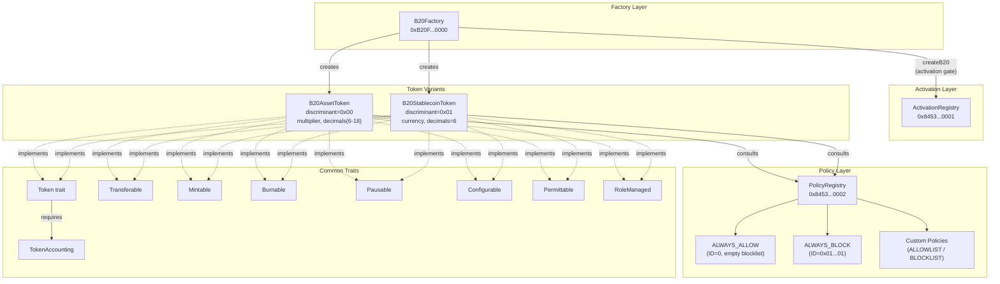

# B20 合规 Token 标准体系代码深度分析

## Executive Summary

本文对 Base Beryl 硬分叉中 B20 原生 Token 标准体系进行 commit/代码级深度分析，基于 v1.1.1（mainnet，commit `01e732cdb`）和 v1.1.0（Sepolia，commit `a3c3011b1`）的 ship 代码。B20 是 Base 链的预编译级 ERC-20 兼容 Token 标准，包含 Asset 和 Stablecoin 两个变体，通过 B20Factory 单例预编译进行确定性地址创建，使用 PolicyRegistry 实现四维策略控制（TransferSender/Receiver/Executor + MintReceiver），并通过 ActivationRegistry 进行功能激活治理。

系统实现了 7 角色 AccessControl 模型（DefaultAdmin, Mint, Burn, BurnBlocked, Pause, Unpause, Metadata），支持 mint/burn/burnBlocked（冻结账户强制回收）、三维 pause（TRANSFER/MINT/BURN）、multiplier 余额缩放（Asset 独有）和 decimals=6 硬编码（Stablecoin 独有，BOP-349/PSRC-27 修复）。v1.1.1 包含大量 BOP/PSRC 审计加固修复，覆盖 gas 计量、ABI 完整性、权限控制、存储安全和激活体验等维度。

> **引用说明**：B20 标准的概念设计与行业对比分析已在合规 Token 标准调研项目（issue `bc5cf45c`）中覆盖。本文仅补充 Beryl 实际 ship 的实现细节与审计加固增量。

> **证据锚定约定**：所有代码引用以 `v1.1.1`/`v1.1.0` release tag + 文件路径 + 行号为主锚点。BOP-*/PSRC-* 原始 PR/commit 引用作为补充来源上下文标注，标注为修复起源而非发布锚点。部分原始 fix commit 不是 v1.1.1 的直接祖先，其修改通过 backport 或聚合发布 commit 纳入发布代码。

---

## §1 B20 组件全景

### 1.1 Variant 架构

B20 定义两个 Token 变体，通过 `B20Variant` 枚举区分：

```
pub enum B20Variant {
    Asset = 0,
    Stablecoin = 1,
}
```

**代码位置**：`v1.1.1 @ crates/common/precompiles/src/b20_factory/variant.rs:7-11`

#### 确定性地址格式

每个 B20 Token 的地址由以下结构化格式组成（共 20 字节）：

| Byte 位置 | 内容 | 说明 |
|-----------|------|------|
| `[0]` | `0xb2` | B20 前缀标识字节 (`PREFIX_BYTE`) |
| `[1..10]` (9 bytes) | `0x00 * 9` | 零填充 |
| `[10]` | variant discriminant | `0x00` = Asset, `0x01` = Stablecoin |
| `[11..20]` (9 bytes) | keccak tail | `keccak256(abi_encode(creator, salt))` 的前 9 字节 |

**代码位置**：
- `address_prefix()`: `v1.1.1 @ variant.rs:86-89` — 构建 `[PREFIX_BYTE, 0, 0, 0, 0, 0, 0, 0, 0, 0, self.discriminant()]`
- `from_address()`: `v1.1.1 @ variant.rs:53-72` — 校验 `bytes[0] == 0xb2 && bytes[1..10] == [0u8; 9]`，从 `bytes[10]` 提取 discriminant
- `compute_address()`: `v1.1.1 @ variant.rs:116-130` — `keccak256((creator, salt).abi_encode())` → 取结果前 9 字节拼接到 prefix 后

双路径设计：`compute_address_from_hash()` 接受预计算的 hash 值，避免在 Factory dispatch 中重复 keccak 操作（与 gas metering 配合使用）。

**代码位置**：`v1.1.1 @ variant.rs:132-140`

### 1.2 Trait 继承体系

B20 采用分层 trait 设计，共享逻辑定义于 `common/ops/` 目录下的能力 trait 中：

**核心 trait**：
- `Token` — 核心接口，关联类型 `Accounting: TokenAccounting` 和 `Policy: Policy`
- `TokenAccounting` — 存储抽象端口，定义 balance/allowance/supply/role/policy/pause 等所有数据读写操作

**能力 trait**（均以 `Token` 为 supertrait，提供默认实现）：
- `Transferable` — transfer/transferFrom（含 EIP-2612 permit 集成）
- `Mintable` — mint/mintWithMemo
- `Burnable` — burn/burnBlocked/burnWithMemo
- `Pausable` — pause/unpause（三维 bitmask）
- `Configurable` — updateSupplyCap/updateName/updateSymbol/updateContractURI
- `Permittable` — EIP-2612 permit 签名验证
- `RoleManaged` — AccessControl 角色管理（grant/revoke/renounce）

**变体实现**：

`B20AssetToken<S: AssetAccounting, P: Policy>` (`v1.1.1 @ b20_asset/token.rs:22-25`) 实现全部 7 个能力 trait（`v1.1.1 @ b20_asset/token.rs:67-73`），并增加：
- `OPERATOR_ROLE` (`keccak256("OPERATOR_ROLE")` = `0x97667070...`) — 用于 `updateMultiplier`
- `METADATA_ROLE` (`keccak256("METADATA_ROLE")` = `0x6bd6b531...`) — 用于 `updateExtraMetadata`
- `batchMint` — 批量 mint 操作
- 乘子/缩放余额转换

`B20StablecoinToken<S: StablecoinAccounting, P: Policy>` (`v1.1.1 @ b20_stablecoin/token.rs:18-21`) 同样实现全部 7 个能力 trait（`v1.1.1 @ b20_stablecoin/token.rs:55-61`），无额外角色或批量操作。

### 1.3 角色模型

B20 实现 7 个内建角色，使用 OpenZeppelin AccessControl 风格的 `keccak256` 角色 ID：

**代码位置**：`v1.1.1 @ crates/common/precompiles/src/common/ops/roles.rs`

| 角色 | ID 常量 | keccak256 源 | 权限范围 |
|------|---------|-------------|---------|
| DefaultAdmin | `B256::ZERO` (`0x00...00`) | OpenZeppelin 标准 | 管理所有角色、updateSupplyCap、updatePolicy |
| Mint | `0x154c0081...` | `keccak256("MINTER_ROLE")` | mint, mintWithMemo |
| Burn | `0xe97b1372...` | `keccak256("BURNER_ROLE")` | burn, burnWithMemo |
| BurnBlocked | `0x7408fdc0...` | `keccak256("BURN_BLOCKED_ROLE")` | burnBlocked (冻结账户强制销毁) |
| Pause | `0x139c2898...` | `keccak256("PAUSER_ROLE")` | pause |
| Unpause | `0x265b220c...` | `keccak256("UNPAUSER_ROLE")` | unpause |
| Metadata | `0x6bd6b531...` | `keccak256("METADATA_ROLE")` | updateName, updateSymbol, updateContractURI |

**关键安全设计**：

1. **Resurrection Guard**：`grant_role()` 对 `DEFAULT_ADMIN_ROLE` 强制执行 resurrection guard，即使在 privileged 路径（factory initCalls）中也不跳过。防止已放弃管理权的 token 被重新授予 DefaultAdmin。
   - **代码位置**：`v1.1.1 @ roles.rs` — grant_role 中的 resurrection guard 逻辑

2. **LastAdminCannotRenounce 终态**：`revoke_role()` 在移除最后一个 DefaultAdmin 时 revert `LastAdminCannotRenounce`，强制通过 `renounce_last_admin()` 显式进入永久终态。`renounce_last_admin()` emit `LastAdminRenounced` 事件，此后无法恢复。
   - **代码位置**：`v1.1.1 @ roles.rs` — `role_member_count` 追踪 DefaultAdmin 数量

3. **Pause/Unpause 分离**：Pause 和 Unpause 使用独立角色，避免单一 Pause 持有者既能暂停又能恢复。

**BOP 修复来源**：privileged call 中的 role admin mutation guard — BOP-233, fix origin `7478fc065` (#3160)。

### 1.4 存储布局

B20 使用 ERC-7201 命名空间隔离存储：

**B20CoreStorage** — 命名空间 `"base.b20"` (`v1.1.1 @ common/core_storage.rs`)

| Slot | 字段 | 类型 |
|------|------|------|
| 0 | name | String |
| 1 | symbol | String |
| 2 | contract_uri | String |
| 3 | total_supply | U256 |
| 4 | balances | Mapping<Address, U256> |
| 5 | allowances | Mapping<Address, Mapping<Address, U256>> |
| 6 | roles | Mapping<B256, Mapping<Address, bool>> |
| 7 | role_admins | Mapping<B256, B256> |
| 8 | admin_count | U256 |
| 9 | transfer_sender/receiver/executor_policy_id (packed) | u64 packed |
| 10 | mint_receiver_policy_id | u64 |
| 11 | paused | U256 |
| 12 | supply_cap | U256 |
| 13 | nonces | Mapping<Address, U256> |

**B20AssetExtensionStorage** — 命名空间 `"base.b20.asset"` (`v1.1.1 @ b20_asset/storage.rs:14-26`)

| Slot | 字段 | 类型 | 说明 |
|------|------|------|------|
| 0 | decimals | u8 | 自定义精度 (6-18) |
| 1 | multiplier | U256 | WAD 精度缩放乘子 |
| 2 | used_announcement_ids | Mapping<String, bool> | 已消费公告 ID |
| 3 | extra_metadata | Mapping<String, String> | 额外元数据 KV |

**B20StablecoinExtensionStorage** — 命名空间 `"base.b20.stablecoin"` (`v1.1.1 @ b20_stablecoin/storage.rs:14-19`)

| Slot | 字段 | 类型 | 说明 |
|------|------|------|------|
| 0 | currency | String | ISO 4217 货币代码 (如 "USD") |

### 1.5 历史重命名

B20Asset 经历了从 "B20Security" 到 "B20Asset" 的重命名：

1. `46f6f751d` — rename `B20Security → B20Asset` and storage namespace `base.b20.security → base.b20.asset`
   - **BOP 来源**：BOP-241/BOP-246
2. `ad4c7a4ae` — remove `base.b20_token` feature and rename `base.b20_security → base.b20_asset` (activation feature)
   - **BOP 来源**：BOP-246, fix origin `ad4c7a4ae` (#3157)
3. `7ee6c48f2` — remove Default B20 variant from B20Factory (仅保留 Asset 和 Stablecoin 两个变体)

---

## §2 B20Factory

### 2.1 工厂单例

B20Factory 是部署在固定地址的单例预编译：

```
B20FactoryStorage::ADDRESS = address!("B20F000000000000000000000000000000000000")
```

**代码位置**：`v1.1.1 @ crates/common/precompiles/src/b20_factory/storage.rs:24`

### 2.2 确定性地址派生

地址派生公式：

```
address_hash = keccak256(abi_encode(creator, salt))
tail = address_hash[0..9]  // 前 9 字节
address = [0xb2, 0x00*9, variant_discriminant, tail[0], tail[1], ..., tail[8]]
```

Factory dispatch 中使用 `ctx.metered_keccak256()` 先扣除 keccak gas 费用再执行 hash 计算，然后将 `address_hash` 传入 `create_b20_with_observer()` 避免重复 hashing：

**代码位置**：
- `createB20` dispatch: `v1.1.1 @ b20_factory/dispatch.rs` — `ctx.metered_keccak256()` 调用
- `getB20Address` dispatch: 同样使用 `ctx.metered_keccak256()`
- **BOP 修复来源**：keccak gas metering fix, backported to v1.1.0 via `ba84de45e` (#3416), fix origin `b12d0c913` (#3369)

### 2.3 Marker Code Hash

Factory 使用 `FACTORY_MARKER_CODE_HASH` 验证 token 是否已初始化：

```
FACTORY_MARKER_CODE_HASH = b256!("309b8896ee4c1ff7ec1966155373dee42663b6b40c3fedc70ba501684848d2a3")
// = keccak256(0xef)
```

创建流程中 Factory 在 token 地址写入 `Bytecode::new_legacy(0xef)` 作为 marker stub。`is_b20_initialized()` 通过 `code_hash == FACTORY_MARKER_CODE_HASH` 验证。

**代码位置**：
- 常量定义: `v1.1.1 @ b20_factory/storage.rs:36-37`
- `is_b20_initialized()`: `v1.1.1 @ b20_factory/storage.rs:117-122`
- **BOP 修复来源**：BOP-311, marker hash verification fix, fix origin `7c824c5ad` (#3382)

### 2.4 NonPayable 守卫

所有 Factory selector 前置 `NonPayable` 检查：

```rust
if !ctx.call_value().is_zero() {
    return Err(revert(IB20Factory::NonPayable {}));
}
```

**代码位置**：`v1.1.1 @ b20_factory/dispatch.rs` — dispatch 函数入口处
- 同样适用于 B20Asset dispatch 和 B20Stablecoin dispatch
- **BOP 修复来源**：fix origin `037ff71b3` (#3381) 和 `7eb308d2a` (#3362)

### 2.5 创建流程

`create_b20_with_observer()` 的完整创建流程：

1. **激活门控**：`ActivationRegistryStorage::ensure_activated(variant.activation_feature().id())` — 检查对应 variant 的 feature 是否已激活
   - **代码位置**：`v1.1.1 @ b20_factory/storage.rs:76-77`

2. **参数解码**：`TokenCreateParams::decode()` 解析 variant 特定参数，设置 `DEFAULT_SUPPLY_CAP` 和 `INITIAL_MULTIPLIER`

3. **版本校验**：检查 creation version 有效性
   - **BOP 修复来源**：BOP-225, fix origin `b7c1e4336` (#3149)

4. **地址计算**：`compute_address_from_hash(address_hash)` 使用预计算的 hash 值

5. **重复部署防护**：检查 `!info.is_empty_code_hash()` — 如果地址已有 code 则 revert
   - **代码位置**：`v1.1.1 @ b20_factory/storage.rs:83-89`

6. **Checkpoint 事务**：`storage.checkpoint()` 开始事务
   - **代码位置**：`v1.1.1 @ b20_factory/storage.rs:91`

7. **Marker 写入**：`set_code(Bytecode::new_legacy(0xef))` 写入 marker stub
   - Prefunded 场景（地址已有余额但无 code）收取额外 create gas
   - **BOP 修复来源**：prefunded create costs, fix origin `0eef808b3` (#3371) 和 `6a15a147d` (#3370, BOP-321)

8. **Token 初始化**：根据 variant 调用 `init_stablecoin()` 或 `init_asset_token()`
   - 如果 `initial_admin` 非零地址，grant `DefaultAdmin` role
   - 通过 `with_caller(Self::ADDRESS)` 建立 privileged 窗口，执行 `initCalls` 数组

9. **事务提交**：`checkpoint.commit()` — init 失败时全部回滚
   - **代码位置**：`v1.1.1 @ b20_factory/storage.rs:105`
   - **BOP 修复来源**：checkpoint revert field restoration, BOP-359, fix origin `21bb92a93` (#3387)

### 2.6 initCalls 特权窗口

Factory 创建后通过 `with_caller(Self::ADDRESS)` 建立 privileged 窗口：

**代码位置**：`v1.1.1 @ b20_factory/storage.rs:162-177`

窗口内操作：
- `privileged = true` — 跳过 role 检查和部分 policy 检查
- 可执行 mint、设置 supplyCap、设置 contractURI 等初始化操作
- **但 pause 检查不跳过** — 确保即使在 privileged 路径中也不能绕过暂停状态

**安全边界**：
- Resurrection guard 对 `DEFAULT_ADMIN_ROLE` 仍然强制执行
- MintReceiver policy 检查在 privileged 模式下仍然运行
- Factory 自身地址作为 caller 意味着 initCalls 的权限来源是 Factory 而非外部用户

### 2.7 严格 ABI 解码

Factory dispatch 使用 `decode_precompile_call!` 宏进行严格 ABI 解码，拒绝 dirty words。

**代码位置**：`v1.1.1 @ b20_factory/dispatch.rs` — `decode_precompile_call!` 宏使用
- **BOP 修复来源**：strict ABI decoding, fix origin `bddf7f879` (#3368)

---

## §3 PolicyRegistry 与 Policy-based Transfer

### 3.1 四维策略 Slot

B20 定义 4 个内建 policy slot，每个 slot 对应一种操作维度的授权检查：

**代码位置**：`v1.1.1 @ crates/common/precompiles/src/common/policy_type.rs:5-12`

| Policy Slot | keccak256 ID | 检查时机 |
|-------------|-------------|---------|
| TransferSender | `0xb81736c8...` | transfer/transferFrom 中检查发送方 |
| TransferReceiver | `0x8a4b3fa2...` | transfer/transferFrom 中检查接收方 |
| TransferExecutor | `0x10be5173...` | transferFrom 中检查执行者（spender≠from 时） |
| MintReceiver | `0xa0d5ae03...` | mint 中检查接收方 |

### 3.2 PolicyRegistry 预编译

PolicyRegistry 部署于固定地址：

```
PolicyRegistryStorage::ADDRESS = address!("8453000000000000000000000000000000000002")
```

**代码位置**：`v1.1.1 @ crates/common/precompiles/src/policy/storage.rs:77`

#### 策略类型

支持两种策略类型，通过 policy ID 的高字节编码类型：

- **BLOCKLIST** (type=0): 在列表中的账户被拒绝，不在列表中的被授权。空 blocklist = 授权所有人。
- **ALLOWLIST** (type=1): 在列表中的账户被授权，不在列表中的被拒绝。空 allowlist = 拒绝所有人。

Policy ID 结构：`[type_byte (8 bits) | counter (56 bits)]`

**代码位置**：`v1.1.1 @ policy/storage.rs:89-93` — `COUNTER_MASK`, `POLICY_ID_TYPE_SHIFT`

#### 内建策略

| 内建策略 | ID | 语义 | 说明 |
|---------|-----|------|------|
| ALWAYS_ALLOW | `0` | BLOCKLIST type + counter=0 → 空 blocklist → 授权所有人 | EVM 零默认值，未初始化的 policy slot 默认指向此策略 |
| ALWAYS_BLOCK | `(1 << 56) \| 1` | ALLOWLIST type + counter=1 → 空 allowlist → 拒绝所有人 | 用于完全冻结某个操作维度 |

**代码位置**：`v1.1.1 @ policy/storage.rs:82-87`

**关键设计**：`ALWAYS_ALLOW_ID = 0` 是 EVM 的零默认值，因此任何未初始化的 policy ID 字段自动映射到 "授权所有人"。这确保了新创建的 token 默认无转账限制。

#### Admin 管理模型

- **两步转移**：`stage_update_admin(policyId, newAdmin)` → `finalize_update_admin(policyId)`（新 admin 确认）
  - **代码位置**：`v1.1.1 @ policy/storage.rs:257-292`
- **永久放弃**：`renounce_admin(policyId)` — admin 设为 Address::ZERO，永久不可逆
  - **代码位置**：`v1.1.1 @ policy/storage.rs:295-305`
- **零地址清除**：`stage_update_admin` 传入 `Address::ZERO` 可清除之前 staged 的 pending admin
  - **代码位置**：`v1.1.1 @ policy/storage.rs:259-261`

#### 批量大小限制

每次批量操作（`createPolicyWithAccounts`、`updateAllowlist`、`updateBlocklist`）最多 64 个账户：

```rust
const MAX_ACCOUNTS_PER_BATCH: usize = 64;
```

**代码位置**：`v1.1.1 @ policy/storage.rs:98`
- **BOP 修复来源**：BOP-391/PSRC-29, batch size cap enforcement, backported via `6707bc703` (#3453)

#### 首次初始化

`ensure_initialized_and_get_counter()` 在首次调用时写入两个内建策略并将 counter 设为 2（custom policies 从 2 开始）：

**代码位置**：`v1.1.1 @ policy/storage.rs:163-184`

### 3.3 Transfer Guard Chain

Transfer 操作的 guard 检查顺序严格定义，确保错误码的可预测性：

#### `transfer()` (`v1.1.1 @ common/ops/transferable.rs`)

```
pause(TRANSFER) → transfer_inner():
  → zero-address check (to)
  → zero-address check (from)
  → sender policy (TransferSender)
  → receiver policy (TransferReceiver)
  → balance check (from >= amount)
  → state mutation (balance 扣减/增加, total_supply 不变)
  → emit Transfer(from, to, amount)
```

#### `transfer_from()` (`v1.1.1 @ common/ops/transferable.rs`)

```
pause(TRANSFER)
  → zero-address check (to, from)
  → allowance check (spender allowance >= amount)
  → executor policy (TransferExecutor, 仅当 !privileged && spender != from)
  → transfer_inner() [same as above: sender → receiver → balance → mutation]
  → allowance decrement (跳过 MAX allowance 的 infinite approval)
```

**关键安全设计**：
- **Privileged 模式跳过 policy 但不跳过 pause** — 即使 Factory initCalls 也不能绕过暂停
- **Executor policy 独立于 allowance** — BOP-227 修复确保即使 spender 有无限 allowance 也必须通过 executor policy
  - **BOP 修复来源**：BOP-227, fix origin `cdee452f2` (#3150)

### 3.4 Activation Gate 与 Calldata 分类

PolicyRegistry dispatch 在 activation gate 之前对 calldata 进行分类：

```rust
// View calls (read-only) bypass activation gate:
Some(sel) if sel == isAuthorizedCall::SELECTOR
          || sel == policyExistsCall::SELECTOR
          || sel == policyAdminCall::SELECTOR
          || sel == pendingPolicyAdminCall::SELECTOR =>
{
    self.inner(calldata, &observer)  // 直接执行，不检查 activation
}
// Write calls require activation:
Some(sel) if valid_selector(sel) => {
    // ABI 解码验证在 activation gate 之前
    abi_decode_validate(calldata)?;
    ensure_activated(PolicyRegistry)?;
    self.inner(calldata, &observer)
}
```

**代码位置**：`v1.1.1 @ crates/common/precompiles/src/policy/dispatch.rs:46-69`

**设计意图**：
- View 函数（`isAuthorized`、`policyExists`、`policyAdmin`、`pendingPolicyAdmin`）在 feature deactivated 后仍可查询已有策略状态
- Write 函数需要 feature activated 才能执行
- ABI 解码验证在 activation gate 之前执行，确保 malformed calldata 返回 `AbiDecodeFailed` 而非 `FeatureNotActivated`

**BOP 修复来源**：
- BOP-378/PSRC-26, calldata classification fix, fix origin `ce1b1df05` (#3421)
- BOP-232, view function availability, fix origin `50e8ee6c2` (#3156)

---

## §4 ActivationRegistry / Activation Admin

### 4.1 预编译地址

```
ActivationRegistryStorage::ADDRESS = address!("8453000000000000000000000000000000000001")
```

**代码位置**：`v1.1.1 @ crates/common/precompiles/src/activation/storage.rs`

### 4.2 三个 Activation Feature

| Feature | Canonical Name | keccak256 ID | 说明 |
|---------|---------------|-------------|------|
| PolicyRegistry | `"base.policy_registry"` | `0xb582ebae...` | 策略注册表写操作激活 |
| B20Stablecoin | `"base.b20_stablecoin"` | `0xecfa0def...` | 稳定币 Token 创建激活 |
| B20Asset | `"base.b20_asset"` | `0xcdcc772f...` | 资产 Token 创建激活 |

**代码位置**：`v1.1.1 @ activation/storage.rs:27-50`

### 4.3 激活/去激活机制

**`activate(feature_id)`**：
1. Static call guard — `is_static()` 检查
2. Zero-address caller 拒绝 — `caller != Address::ZERO`
3. Admin 校验 — `caller == admin_address`
4. 幂等性守卫 — 已激活则 revert `AlreadyActivated`
5. 存储写入 — `features.at_mut(&feature).write(true)`
6. 事件发射 — emit `FeatureActivated`

**`deactivate(feature_id)`**：
- 相同的前置检查（static, zero-address, admin, 幂等性 `FeatureNotActivated`）
- 使用 `delete()` 清零存储 — 触发 EIP-3529 SSTORE 退款

**代码位置**：`v1.1.1 @ activation/storage.rs:78-126`

### 4.4 网络 Admin 地址

| Network | Chain ID | activation_admin_address | Beryl Timestamp |
|---------|----------|-------------------------|-----------------|
| Mainnet | 8453 | `0xcE3a3bEE7E72E2A24079f3c0Cb3b97740ED425A9` | 1782410400 (2026-06-25 18:00 UTC) |
| Sepolia | 84532 | `0x5F43072722f59964d886CBb507F6a85ca0759D42` | 1781805600 (2026-06-18 18:00 UTC) |
| Zeronet | 763360 | `0xF5969A85a555671EeD766C4ff0C61426AA626b11` | 1780678800 (2026-06-05 17:00 UTC) |
| Devnet | 1337 | `0x9965507D1a55bcC2695C58ba16FB37d819B0A4dc` | Beryl not yet scheduled |

**代码位置**：`v1.1.1 @ crates/common/chains/src/config.rs`
- Mainnet: line 376-377
- Sepolia: line 449-450
- Zeronet: line 569
- Devnet: line 515

**BOP 修复来源**：BOP-382, update Sepolia and Mainnet activation admin addresses, fix origin `996ebbf20` (#3450), backport `bd4d4ba53` (#3463)

### 4.5 零地址拒绝

```rust
// 即使 admin 配置为 Address::ZERO，零地址 caller 仍被拒绝
if caller == Address::ZERO {
    return Err(revert(ZeroAddressCaller {}));
}
```

**设计意图**：防止 deposit transaction（`msg.sender == 0x0`）意外切换激活状态。在 EVM 中 deposit tx 的发送者为零地址，如果 admin 也恰好配置为零地址，不做此检查将允许 deposit tx 操作激活状态。

**代码位置**：`v1.1.1 @ activation/storage.rs:84-87`

---

## §5 发行方控制

### 5.1 Mint 操作

Guard 顺序：`pause(MINT) → role(Mint) → zero-address(to) → MintReceiver policy → supply cap → balance/supply mutation → Transfer(0x0→to)`

**代码位置**：`v1.1.1 @ crates/common/precompiles/src/common/ops/mintable.rs`

关键细节：
- Role 检查在 privileged 模式下跳过
- **MintReceiver policy 检查始终执行**（即使 privileged） — 确保即使 Factory initCalls 也不能 mint 到被策略拒绝的地址
- Supply cap 检查：`total_supply + amount <= supply_cap`

### 5.2 Burn 操作

Guard 顺序：`pause(BURN) → role(Burn) → burn_inner(balance check → balance/supply mutation → Transfer(from→0x0))`

**代码位置**：`v1.1.1 @ crates/common/precompiles/src/common/ops/burnable.rs`

### 5.3 BurnBlocked（冻结账户强制回收）

Guard 顺序：`pause(BURN) → role(BurnBlocked) → ensure_blocked(from) → burn_inner → emit BurnedBlocked`

**`ensure_blocked` 逻辑**：检查 TransferSender policy 对 `from` 账户**不授权**（inverted logic）。即该账户必须被 TransferSender 策略冻结（在 blocklist 中或不在 allowlist 中），才能执行 burnBlocked。

**代码位置**：
- burnBlocked: `v1.1.1 @ burnable.rs:67-78`
- ensure_blocked: `v1.1.1 @ common/ops/guards.rs` — `ensure_blocked` 读取 TransferSender policy，检查 `!is_authorized`

**设计意图**：允许合规发行方销毁被冻结（transfer-blocked）账户的 token，实现监管强制回收。BurnBlocked 角色与 Burn 角色独立，确保只有专门授权的操作者能执行此敏感操作。

### 5.4 Pause/Unpause

三个可暂停 feature：

| Feature | 枚举值 | Bitmask |
|---------|--------|---------|
| TRANSFER | 0 | `1 << 0` = 1 |
| MINT | 1 | `1 << 1` = 2 |
| BURN | 2 | `1 << 2` = 4 |

**代码位置**：`v1.1.1 @ crates/common/precompiles/src/common/pausable_feature.rs`

操作语义：
- `pause(features)`: role(Pause) → `paused |= mask(features)` → emit `Paused`
- `unpause(features)`: role(Unpause) → `paused &= !mask(features)` → emit `Unpaused`
- 空 feature 集 revert `EmptyFeatureSet`
- 各 feature 独立控制，可以只暂停 TRANSFER 而 MINT/BURN 正常工作

**代码位置**：`v1.1.1 @ common/ops/pausable.rs`

### 5.5 UpdateMultiplier（Asset 独有）

multiplier 用于余额缩放，仅 Asset variant 支持：

**转换公式**：
- 读取（raw→scaled）：`scaledBalance = rawBalance × multiplier / WAD`
- 写入（scaled→raw）：`rawBalance = scaledBalance × WAD / multiplier`

其中 `WAD = 1e18`（`v1.1.1 @ b20_asset/storage.rs:76`）

**零乘子拒绝**：

```rust
if new_multiplier.is_zero() {
    return Err(revert(IB20Asset::InvalidMultiplier {}));
}
```

**代码位置**：`v1.1.1 @ b20_asset/token.rs:205-207`

**初始 multiplier**：Factory 创建时 `INITIAL_MULTIPLIER = U256::ZERO`（`v1.1.1 @ b20_factory/storage.rs:33`）。存储中零值映射为 WAD (1:1)：读取 multiplier 时如果存储值为 0，返回 WAD。

**代码位置**：`v1.1.1 @ b20_asset/storage.rs:80-83` — `decimals` 的 zero-fallback 逻辑（类似地，multiplier 的 zero→WAD 映射在 AssetAccounting derive macro 中实现）

**权限**：需要 `OPERATOR_ROLE`（`keccak256("OPERATOR_ROLE")` = `0x97667070...`）

**代码位置**：`v1.1.1 @ b20_asset/token.rs:99-100` — `ensure_operator_role`

### 5.6 Supply Cap

`updateSupplyCap` 约束：
- 需要 `DefaultAdmin` 角色
- `new_cap >= total_supply` — 不能低于当前流通量
- `new_cap <= B20_MAX_SUPPLY_CAP` — 不能超过 `u128::MAX` (= 2^128 - 1)

```rust
pub const B20_MAX_SUPPLY_CAP: U256 = U256::from_limbs([u64::MAX, u64::MAX, 0, 0]);
// = 2^128 - 1
```

**代码位置**：
- Supply cap 逻辑: `v1.1.1 @ common/ops/configurable.rs:18-37`
- MAX_SUPPLY_CAP: `v1.1.1 @ common/token_accounting.rs:8`
- Factory 创建时默认 cap = `B20_MAX_SUPPLY_CAP`（`v1.1.1 @ b20_factory/storage.rs:34` — `DEFAULT_SUPPLY_CAP`）

### 5.7 Metadata 更新

| 操作 | 所需角色 | 事件 | 附加行为 |
|------|---------|------|---------|
| `updateName` | Metadata | `NameUpdated` + `EIP712DomainChanged` | ERC-5267 domain 变更通知 |
| `updateSymbol` | Metadata | `SymbolUpdated` | — |
| `updateContractURI` | Metadata | `ContractURIUpdated` | ERC-7572 URI |

**关键设计**：Metadata 角色独立于 DefaultAdmin — DefaultAdmin 单独不能更新 metadata（测试 `update_contract_uri_with_only_default_admin_reverts` 验证）。

**代码位置**：`v1.1.1 @ common/ops/configurable.rs:40-74`

---

## §6 B20Stablecoin 特性

### 6.1 Decimals=6 硬编码（BOP-349/PSRC-27）

Stablecoin 的 `decimals()` 调用**不读取存储**，直接返回 `B20Variant::Stablecoin.decimals()` = 固定 6：

```rust
C::decimals(_) => U256::from(
    B20Variant::Stablecoin
        .decimals()
        .expect("stablecoin has fixed 6-decimal precision"),
)
```

**代码位置**：`v1.1.1 @ crates/common/precompiles/src/b20_stablecoin/dispatch.rs:134-138`

`B20Variant::decimals()` 的实现：

```rust
pub const fn decimals(self) -> Option<u8> {
    match self {
        Self::Stablecoin => Some(6),
        Self::Asset => None,
    }
}
```

**代码位置**：`v1.1.1 @ b20_factory/variant.rs:99-103`

#### Zero-Return Window 问题

**问题**：在 Factory bootstrap 期间，`decimals` 存储尚未写入。如果 `decimals()` 从存储读取，会在创建事务的 checkpoint 完成前返回 0（零值窗口），导致 ERC-20 客户端错误地显示 Token 精度。

**修复**：BOP-349/PSRC-27 将 stablecoin 的 `decimals()` 改为直接从 `B20Variant` 枚举返回硬编码值，完全绕过存储读取。

**BOP 修复来源**：BOP-349/PSRC-27, fix origin `fb638bcbe` (#3385), 相关改动 `3b68c8084` (#3345)

### 6.2 Asset Decimals 对比

Asset variant 的 `decimals()` 从存储读取，支持 6-18 范围的自定义精度：

```rust
pub const MIN_DECIMALS: u8 = 6;
pub const MAX_DECIMALS: u8 = 18;
```

**代码位置**：`v1.1.1 @ b20_asset/storage.rs:72-74`

未初始化的 decimals 存储 slot（值为 0）fallback 到 `MIN_DECIMALS` (6)：

**代码位置**：`v1.1.1 @ b20_asset/storage.rs:80-83`

### 6.3 Currency Code

Stablecoin 特有 `currency` 字段，存储于 `B20StablecoinExtensionStorage` 命名空间 `"base.b20.stablecoin"` 的 slot 0：

**代码位置**：`v1.1.1 @ b20_stablecoin/storage.rs:14-19`

初始化时验证 currency：
- 非空检查：空 currency → revert `MissingRequiredField("currency")`
- 格式验证：仅允许 `A-Z` ASCII 大写字母 → 否则 revert `InvalidCurrency`

**代码位置**：`v1.1.1 @ b20_stablecoin/storage.rs:55-65`

### 6.4 Stablecoin 创建参数

`B20StablecoinInit` 与 `B20AssetInit` 对比：

| 参数 | Stablecoin | Asset |
|------|-----------|-------|
| name | ✓ | ✓ |
| symbol | ✓ | ✓ |
| supply_cap | ✓ | ✓ |
| currency | ✓ (ISO 4217) | ✗ |
| multiplier | ✗ | ✓ (WAD) |
| decimals | ✗ (硬编码 6) | ✓ (6-18) |

---

## §7 安全/审计加固线索

### 7.1 BOP/PSRC 修复清单

以下为 v1.1.1 tag 可达范围内的 BOP/PSRC 修复，按安全维度分类。v1.1.1 release 代码通过 backport/aggregate commit 包含这些修复；原始 fix commit 引用标注为修复起源。

| 维度 | BOP/PSRC ID | 修复要点 | 相关 PR | 代码锚点 (v1.1.1) |
|------|------------|---------|--------|-------------------|
| **Gas Metering** | — | keccak gas 先计价后调用 | #3369 (origin `b12d0c913`) | `b20_factory/dispatch.rs` |
| **Gas Metering** | BOP-321 | prefunded address create gas | #3370, #3371 | `b20_factory/storage.rs:91-93` |
| **Gas Metering** | BOP-380 | gas deduction before sload | #3438 | precompile-storage |
| **ABI Integrity** | — | strict ABI decoding, reject dirty words | #3368 (origin `bddf7f879`) | `b20_factory/dispatch.rs` |
| **ABI Integrity** | BOP-391/PSRC-29 | batch size cap before ABI decode | backport `6707bc703` (#3453) | `policy/storage.rs:98` |
| **Access Control** | BOP-233 | role admin mutation guard for privileged calls | #3160 (origin `7478fc065`) | `common/ops/roles.rs` |
| **Access Control** | BOP-227 | executor policy in transferFrom regardless of allowance | #3150 (origin `cdee452f2`) | `common/ops/transferable.rs` |
| **Storage Safety** | BOP-359 | checkpoint revert field restoration | #3387 (origin `21bb92a93`) | `b20_factory/storage.rs` |
| **Storage Safety** | BOP-350 | remove unused token arg from checkpoint_commit | #3406 (origin `d7daff09b`) | precompile-storage |
| **Storage Safety** | — | slot arithmetic checked-add migration | #3427 | precompile-storage |
| **Storage Safety** | — | CallerGuard hardening | #3404 | precompile-storage |
| **Activation UX** | BOP-232 | view functions work when feature is disabled | #3156 (origin `50e8ee6c2`) | `policy/dispatch.rs:49-55` |
| **Activation UX** | BOP-378/PSRC-26 | calldata classification before activation gate | #3421 (origin `ce1b1df05`) | `policy/dispatch.rs:46-69` |
| **Address Derivation** | BOP-311 | marker hash verification (isB20Initialized) | #3382 (origin `7c824c5ad`) | `b20_factory/storage.rs:36-37` |
| **Address Derivation** | BOP-229 | getB20Address returns zero on invalid variant | #3155 (origin `39dabd494`) | `b20_factory/dispatch.rs` |
| **Token Precision** | BOP-349/PSRC-27 | stablecoin decimals hardcode, fix zero-return window | #3385 (origin `fb638bcbe`) | `b20_stablecoin/dispatch.rs:134-138` |
| **Admin Governance** | BOP-382 | update Sepolia/Mainnet activation admin addresses | #3450/#3463 (origin `996ebbf20`/`bd4d4ba53`) | `chains/config.rs` |
| **Naming/Refactor** | BOP-241 | B20Security → B20Asset rename | #3168 (origin `6ee3da632`) | `b20_asset/` |
| **Naming/Refactor** | BOP-246 | remove base.b20_token feature, rename activation feature | #3157 (origin `ad4c7a4ae`) | activation feature |
| **Naming/Refactor** | BOP-237 | SECURITY_OPERATOR_ROLE → OPERATOR_ROLE, Security Identifiers → Extra Metadata | #3142/#3151 | `b20_asset/token.rs` |
| **Naming/Refactor** | BOP-238 | share ratio → multiplier rename | #3153 (origin `5a3d101de`) | `b20_asset/` |
| **Naming/Refactor** | BOP-231 | align asset coding style | #3159 (origin `41bd53e48`) | `b20_asset/` |
| **Naming/Refactor** | BOP-211 | rename policy_id_checked to policy_id | #3123 (origin `3c0a08857`) | `b20_stablecoin/` |
| **NonPayable** | — | factory/token NonPayable guard | #3381, #3362 | `b20_factory/dispatch.rs`, `b20_stablecoin/dispatch.rs` |

**Backport 聚合 commit**（v1.1.0/v1.1.1 release branch）：
- `ba84de45e` (#3416) — backport BOP fixes to v1.1.0
- `b4ab04744` (#3395) — backport BOP precompile fixes
- `f85959303` (#3396) — backport BOP follow-up fixes
- `2312bc5b3` (#3423) — BOP Batch 4 fixes
- `3097bf384` (#3447) — BOP Batch 6 fixes
- `526d5361c` (#3426) — backport PSRC precompile fixes
- `6707bc703` (#3453) — straggler precompile fixes

### 7.2 设计权衡总结

审计加固体现了 B20 系统四个层面的设计权衡：

#### (1) 预防性 vs 反应性安全

- **NonPayable guard**（所有 precompile dispatch 入口）：预防性拒绝意外的 ETH 转入，而非事后退款
- **零地址拒绝**（ActivationRegistry）：预防性阻止 deposit tx 操作激活状态，而非依赖外部治理修复

#### (2) Gas 精确性 vs 实现简单性

- **Metered keccak**：gas 先计价后执行，避免"先算后收费"导致的 gas refund 漏洞
- **Deduct-before-sload**（BOP-380）：gas 扣减在 storage 读取之前，确保即使 revert 也已收取基础 gas

#### (3) 终态不可逆性

- **renounceLastAdmin**：永久终态，emit `LastAdminRenounced`，此后无法恢复 DefaultAdmin
- **Resurrection guard**：防止已放弃管理权的 token 被通过 privileged 路径重新 grant DefaultAdmin
- **renounceAdmin (policy)**：policy admin 放弃后永久不可逆

#### (4) 向后兼容性

- **Decimals hardcode**（BOP-349/PSRC-27）：优先保证 ERC-20 接口正确性，牺牲了"所有数据从存储读取"的架构一致性
- **View function availability**（BOP-232/378）：feature deactivated 后 view 函数仍可用，保护已创建 token/policy 的可查询性

> 以上设计权衡分析可作为 WHI-249 信心分析的输入材料。

---

## Diagrams

### Diagram 1: B20 组件交互与继承关系图



### Diagram 2: B20 Token 操作 Guard 链


---

## Source Coverage

### Primary Sources

| Source | Coverage | 使用 Item |
|--------|----------|----------|
| `v1.1.1 @ b20_factory/variant.rs` | ✅ 完整读取 | Item 1 (variant arch), Item 2 (address derivation), Item 6 (decimals) |
| `v1.1.1 @ b20_factory/storage.rs` | ✅ 完整读取 | Item 2 (factory), Item 5 (supply cap default) |
| `v1.1.1 @ b20_factory/dispatch.rs` | ✅ 完整读取 | Item 2 (keccak, nonpayable, ABI) |
| `v1.1.1 @ common/ops/roles.rs` | ✅ 完整读取 | Item 1 (role model) |
| `v1.1.1 @ common/core_storage.rs` | ✅ 完整读取 | Item 1 (storage layout) |
| `v1.1.1 @ common/ops/transferable.rs` | ✅ 完整读取 | Item 3 (guard chain) |
| `v1.1.1 @ common/ops/guards.rs` | ✅ 完整读取 | Item 3 (policy delegation), Item 5 (ensure_blocked) |
| `v1.1.1 @ common/ops/mintable.rs` | ✅ 完整读取 | Item 5 (mint) |
| `v1.1.1 @ common/ops/burnable.rs` | ✅ 完整读取 | Item 5 (burn, burnBlocked) |
| `v1.1.1 @ common/ops/pausable.rs` | ✅ 完整读取 | Item 5 (pause) |
| `v1.1.1 @ common/ops/configurable.rs` | ✅ 完整读取 | Item 5 (supply cap, metadata) |
| `v1.1.1 @ common/policy_type.rs` | ✅ 完整读取 | Item 3 (four policy slots) |
| `v1.1.1 @ policy/storage.rs` | ✅ 完整读取 | Item 3 (ALLOWLIST/BLOCKLIST, admin model) |
| `v1.1.1 @ policy/dispatch.rs` | ✅ 完整读取 | Item 3 (calldata classification) |
| `v1.1.1 @ activation/storage.rs` | ✅ 完整读取 | Item 4 (activation mechanism) |
| `v1.1.1 @ chains/config.rs` | ✅ 完整读取 | Item 4 (admin addresses) |
| `v1.1.1 @ b20_asset/token.rs` | ✅ 完整读取 | Item 1 (trait impl), Item 5 (multiplier) |
| `v1.1.1 @ b20_asset/storage.rs` | ✅ 完整读取 | Item 1 (storage), Item 5 (WAD), Item 6 (decimals range) |
| `v1.1.1 @ b20_stablecoin/token.rs` | ✅ 完整读取 | Item 1 (trait impl) |
| `v1.1.1 @ b20_stablecoin/storage.rs` | ✅ 完整读取 | Item 6 (currency) |
| `v1.1.1 @ b20_stablecoin/dispatch.rs` | ✅ 部分读取 (160行) | Item 6 (decimals hardcode) |
| `v1.1.1 @ common/token_accounting.rs` | ✅ 完整读取 | Item 5 (MAX_SUPPLY_CAP) |
| `v1.1.1 @ common/pausable_feature.rs` | ✅ 完整读取 | Item 5 (bitmask) |
| `v1.1.1 @ git log --grep="BOP\|PSRC"` | ✅ 30 条 | Item 7 (security inventory) |

### Secondary Sources

| Source | Coverage | 使用 Item |
|--------|----------|----------|
| 合规 Token 标准调研 (issue `bc5cf45c`) | 引用，不复述 | Executive Summary |
| Beryl 变更范围界定 | 引用 PR/commit 清单 | Item 7 |

---

## Gap Analysis

1. **B20 官方 spec 文档**（`docs.base.org/base-chain/specs/upgrades/beryl/b20`）：未进行 web 访问。代码分析完整覆盖了所有 ship 行为，但未与官方 spec 文档进行交叉验证。Gap 等级：**minor**。

2. **max_balance_cap 修复**（Item 5 `max_balance_cap` field）：outline 列出 fix commits `56fd4a4cc` (#3464) 和 `39ccde519`。git log 中未出现这些 commit（可能在 v1.1.1 之后或使用不同的 commit message 模式）。相关代码行为未在读取的源文件中发现独立的 per-account balance cap 实现。Gap 等级：**minor**，可能为 v1.1.1 之后的变更。

3. **部分 BOP/PSRC fix commit 不在 v1.1.1 ancestor 中**：如 outline 所述，部分 fix origin commit 不是 v1.1.1 的直接祖先。本文已按证据锚定约定将 v1.1.1 tag 代码位置作为主锚点，fix origin 作为补充。Gap 等级：**none**（已按要求处理）。

4. **EIP-2612 permit 实现细节**：`Permittable` trait 的具体 permit 验证逻辑未深入分析（不在 outline 重点范围内）。Gap 等级：**minor**，与研究范围的边界相符。

---

## Revision Log

| Round | 变更内容 |
|-------|---------|
| 1 | 初始 draft — 覆盖全部 7 个 Research Item，2 张组件/角色表，2 张 Mermaid 图，BOP/PSRC 分类表 |
