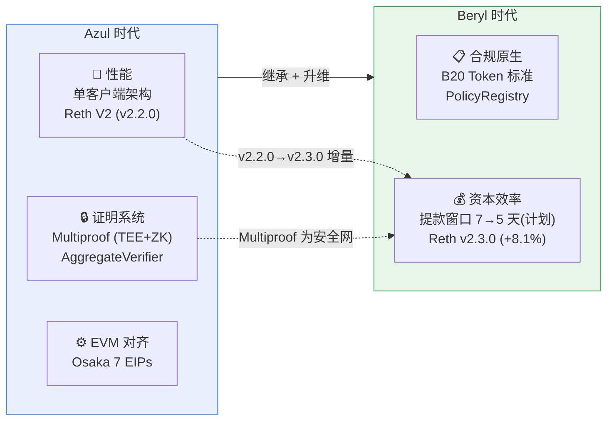
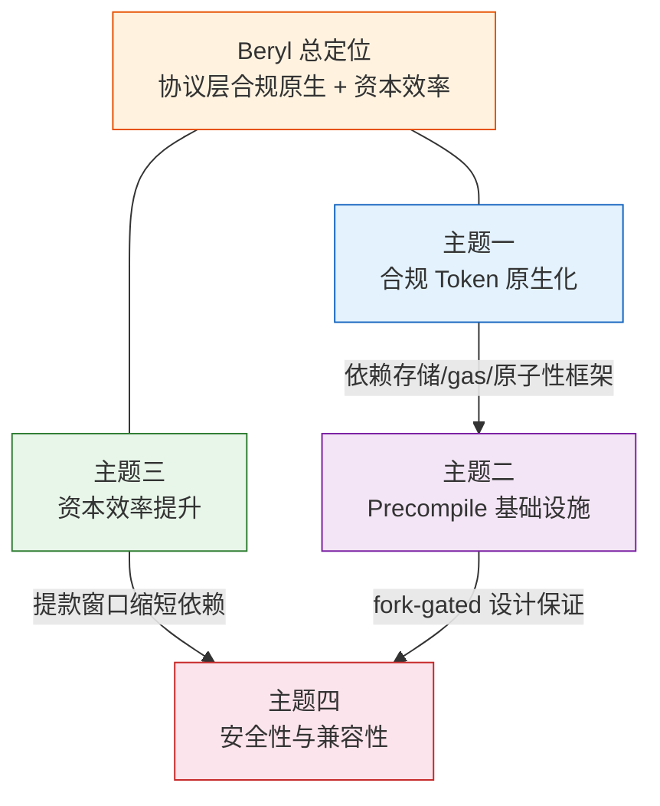

# Beryl 新增内容的叙事性 High-Level 总结

## Executive Summary

Beryl 是 Base 继 Azul 之后的第二次重大硬分叉。如果说 Azul 回答的是「Base 能否脱离 OP Stack 独立运行」这一基础设施问题，那么 Beryl 回答的是「Base 如何在协议层面服务受监管的机构客户」这一产品化问题。

Beryl 的核心贡献在两个方向：**协议层合规原生化**——通过 B20 预编译级 Token 标准，将合规能力（策略引擎、角色权限、功能门控）从应用层下沉至协议层；**资本效率提升**——将 single-proof 提款最终确认窗口从 7 天计划缩短至 5 天（源码已确认的计划变更；L1 部署待 Beryl mainnet 激活后新 AggregateVerifier 注册完成），同时通过 Reth v2.2.0→v2.3.0 增量升级获得 +8.1% 执行吞吐提升。

这些变更建立在 Azul 已奠定的基础之上——单客户端架构、Multiproof 证明系统、Reth V2 执行引擎——Beryl 是延续而非替代。

本文综合三篇 M1 深度研究（参见 b20-token-system/final.md、beryl-precompile-infra/final.md、protocol-reth-withdrawal/final.md），为战略读者提供跨 scope 的整合叙事。

---

## §1 升级定位叙事：从 Azul 到 Beryl

### Azul 时代：性能 / 证明 / EVM 三位一体

2026 年上半年部署的 Azul 硬分叉是 Base 的「独立宣言」。它在三个维度同时与 OP Stack 解耦（参见 base-strategy-azul-overview/final.md §1-2）：

- **性能**：脱离 OP Stack 多客户端兼容框架，切换为 base-reth-node + base-consensus 单客户端架构，执行引擎采用 Reth V2（v2.2.0），引入 Storage V2 与 Proof V2 两大核心改进。~50% 的磁盘占用缩减与 state root pipeline 重写属于这一代升级确立的基线能力（源自 Reth 1.x→2.0 的架构跃迁）。
- **证明系统**：引入 AggregateVerifier L1 合约 + TEE/ZK 双证明的 Multiproof 架构（PROOF_THRESHOLD=1），为 Stage 2 去信任化铺路。
- **EVM 对齐**：集成 Osaka 7 条 EIP，保持与 Ethereum 主网的 spec 等价。

Azul 解决的是**「Base 能否独立运行」**的问题。

### Beryl 时代：合规原生 + 资本效率

2026 年 6 月部署的 Beryl 硬分叉标志着 Base 从基础设施建设转向协议层产品化（参见 beryl-scope-inventory/final.md §1）：

- **协议层合规原生**：B20 预编译级 Token 标准将合规能力——策略引擎（blocklist/allowlist）、7 角色权限模型、功能激活门控——嵌入协议层，使受监管 Token 发行不再依赖应用层合约。
- **资本效率**：Single-proof 提款窗口计划从 7 天缩短至 5 天（源码已确认的计划变更；L1 部署待 Beryl mainnet 激活后新 AggregateVerifier 注册完成），预期直接降低桥接 LP 资本成本约 28.6%。

Beryl 解决的是**「Base 如何服务机构客户」**的问题。

### 演进逻辑

这不是两代功能的简单叠加，而是一次战略升维：Azul 建立了独立运行的基础设施底座（性能、证明、EVM），Beryl 在这个底座上构建面向机构客户的协议层产品。Beryl 的 4 个动态预编译通过 `>= BaseUpgrade::Beryl` 门控安装在 Azul 的 fork 体系之上，`beryl()` 返回 `azul()` 确保所有标准预编译不受影响。Reth v2.2.0→v2.3.0 是 Azul 已确立的执行引擎路线的增量延续，而非架构切换。

---

## §2 四大叙事主题

### 主题一：合规 Token 原生化——从应用层到协议层

B20 是 Base 链的预编译级 Token 标准，支持 Asset（含乘子、批量铸造）和 Stablecoin（6 位精度、货币代码）两个变体。它内置 PolicyRegistry 策略引擎，支持四维策略控制（转账发送方/接收方/执行方 + 铸造接收方），配合 7 角色权限模型和 ActivationRegistry 功能门控。这意味着受监管机构发行 Token 时，合规能力由链协议原生提供，而非依赖 DApp 开发者逐个实现。对 Base 而言，这是从「开发者友好的通用 L2」向「机构合规的专用 L2」的定位扩展（参见 b20-token-system/final.md §1-§4）。

### 主题二：Precompile 基础设施成型——可编程协议层的技术底座

B20 不是孤立的产品——它建立在一套可复用的 stateful precompile 开发框架之上。该框架包含宏系统（编译期自动生成存储布局和调度逻辑）、存储提供者接口（30+ 方法，完整的 EVM gas 语义和事务原子性保证）、以及 11 个 metrics 家族的可观测性体系。B20 是这个框架的第一个产品化应用，但框架本身支持未来更多协议级内置模块的开发。这一基础设施的成熟度意味着 Base 已具备在协议层快速迭代定制功能的工程能力（参见 beryl-precompile-infra/final.md §1-§3）。

### 主题三：资本效率提升——缩短提款窗口 + 执行层增量优化

Single-proof 提款最终确认窗口计划从 7 天缩短至 5 天（源码已确认；L1 部署待 Beryl mainnet 激活后新 AggregateVerifier 注册完成）。一旦生效，将直接释放桥接流动性提供者的资本。以年化收益率框架衡量，锁仓期缩短约 28.6% 意味着单次桥接的 LP 资本成本同比例下降，最终传导为用户桥接费率的下行压力。Dual-proof 快路径（1 天）保持不变，因 ZK 证明生成成本高，实际使用率低。

与此同时，Reth v2.2.0→v2.3.0 增量升级带来 +8.1% 的执行吞吐提升（1.4→1.5 Ggas/s），以及 EL peer defaults 提升至 80/80、Flashblocks pipeline 优化、BLAKE3 snapshotter 等改进。需要明确的是：~50% 的磁盘占用缩减属于 Azul 时期已引入的 Reth 2.0 lineage（Storage V2 架构跃迁），不计入 Beryl 的增量贡献（参见 protocol-reth-withdrawal/final.md §1-§2）。

### 主题四：安全性与向后兼容——additive + fork-gated 设计哲学

Beryl 的所有新增预编译通过 `>= BaseUpgrade::Beryl` 门控安装，对 Azul 及更早的标准预编译零影响。Blast radius 分析结论明确：标准以太坊预编译地址范围的风险为零，B20 结构编码的地址空间匹配残余概率极低（2^{-87}）。Reth v2.2.0→v2.3.0 是增量升级，不触及已在 Azul 稳定运行的 Storage V2 / Proof V2 核心架构。提款窗口缩短以 Multiproof 双证明架构为安全前提——Multiproof 将 finalization delay 的核心用途收窄为检测并禁用故障 prover。Dual-proof 快路径（proofCount ≥ 2，即 TEE 与 ZK 均确认时触发 1 天 FAST_FINALIZATION_DELAY）在设计上提供了额外的确认速度，但由于 ZK 证明生成成本高，实际触发率低，不应视为 single-proof 路径出现争议时的保底回退机制（参见 beryl-precompile-infra/final.md §2、protocol-reth-withdrawal/final.md §4）。

### 跨主题关联

四个主题之间不是孤立的，而是相互支撑的：合规 Token（主题一）依赖 precompile 基础设施（主题二）的存储、gas 语义和事务原子性框架；资本效率（主题三）的提款窗口缩短以 Multiproof 安全性（主题四）为前提——没有可靠的证明系统，缩短窗口将增加安全风险。四者共同构成「协议层合规原生 + 资本效率」的总体定位。

---

## §3 Azul→Beryl 能力对比表

下表覆盖 Beryl 官方三大 scope，展示 Azul 基线能力与 Beryl 新增/变更。

| 维度 | Azul 基线 | Beryl 新增 / 变更 | 战略意义 |
|------|----------|-----------------|---------|
| **原生 Token 标准** | 无（依赖 ERC-20 合约部署） | B20 预编译级 Token（Asset / Stablecoin 双变种）、B20Factory 单例部署器 | 合规 Token 发行从应用层下沉到协议层 |
| **合规策略引擎** | 无 | PolicyRegistry 四维策略控制 + ActivationRegistry 功能门控 | 机构合规能力由链原生提供 |
| **Token 权限模型** | 无 | 7 角色 AccessControl + ERC-2612 permit / EIP-712 签名 + 供应上限 + 三维暂停 | 满足受监管机构对 Token 管理的精细控制需求 |
| **预编译框架**（precompile = 协议级内置模块） | 静态预编译集（标准 Ethereum 预编译）、12 个 BaseUpgrade 分叉 | 4 个动态预编译 + 宏系统 + 存储提供者接口 + 完整 gas 语义 + 11 个 metrics 家族 | 具备在协议层快速开发新内置模块的工程能力 |
| **动态预编译安装** | 无 | `>= BaseUpgrade::Beryl` fork-gated 安装、BerylLookup 动态地址匹配 | 新功能安全引入，不影响现有预编译 |
| **执行引擎版本** | Reth v2.2.0（含 Storage V2 + Proof V2；~50% 磁盘缩减属于此基线，源自 Reth 1.x→2.0 lineage） | Reth v2.3.0 增量升级：+8.1% 执行吞吐（1.4→1.5 Ggas/s）、80/80 EL peer defaults、Flashblocks pipeline 优化、BLAKE3 snapshotter | 执行层持续增量优化，非架构切换 |
| **提款窗口**（single-proof） | 7 天（604,800 秒） | 5 天（432,000 秒）— 源码已确认的计划变更；L1 部署待 Beryl mainnet 激活后新 AggregateVerifier 注册完成 | 桥接 LP 资本成本预期降低约 28.6% |
| **提款窗口**（dual-proof 快路径） | 1 天（86,400 秒），需 proofCount ≥ 2（TEE 与 ZK 均确认） | 不变；因 ZK 成本高实际触发率低 | 设计层面的额外确认加速，非 single-proof 争议时的保底回退 |
| **证明系统** | Multiproof（TEE+ZK，PROOF_THRESHOLD=1） | 不变（Beryl 继承） | Beryl 合规 + 资本效率建立在此安全底座之上 |
| **EVM 对齐** | Osaka 7 EIPs | 不变（Beryl 继承） | Beryl 聚焦协议层，不改 EVM spec |

---

## §4 Mantle 战略解读

Base 在 Beryl 中展示的战略选择对 Mantle 具有直接的竞争参考价值。以下从四个维度解读：

### 协议层合规 vs 应用层合规

Base 通过 B20 在协议层嵌入合规 Token 标准，意味着 RWA（真实世界资产）Token 化可在 L2 层原生实现。Mantle 目前在合规 Token 领域采用应用层方案。两种路径各有权衡：协议层方案提供更强的一致性保证和更低的 DApp 集成成本，但牺牲了灵活性并增加了协议升级复杂度；应用层方案更灵活且不增加协议负担，但合规执行依赖各 DApp 自行实现，覆盖率和一致性难以保证。如果 Mantle 追求 RWA/机构化战略，需评估是否需要类似的协议层合规能力，以及在 OP Stack 兼容架构下实现的可行性。

### 预编译框架的可复用性

Beryl 的 precompile 基础设施不只是 B20 的载体，而是一个通用的 stateful precompile 开发框架。如果 Mantle 未来需要定制协议层功能（如原生 DID、链上身份、或定制化 gas 模型），Beryl 的框架设计提供了参考路径。需要评估的是：Mantle 基于 OP Stack 的架构（op-geth / mantle-v2）是否具备类似的协议层扩展性，还是需要更大的架构投入才能实现等价能力。

### 资本效率对标

Beryl 计划将 single-proof 提款窗口从 7 天缩短至 5 天（源码已确认的计划变更；L1 部署待 Beryl mainnet 激活后新 AggregateVerifier 注册完成）。根据 L2Beat 数据，Mantle 当前的挑战期（challenge period）为 7 天。Base 官方声明"窗口将继续缩短"——这意味着一旦 Beryl mainnet 激活并完成 L1 部署，资本效率差距可能进一步拉大。对 Mantle 的 fast-bridge 和流动性策略而言，需关注：(a) Mantle 自身是否有缩短挑战窗口的路线图；(b) 如果 Base 持续缩短窗口，对两链之间桥接流动性的竞争格局有何影响。Mantle 已通过 OP Succinct 引入 ZK 证明（partially live），这为未来缩短窗口提供了技术基础（参见 mantle-impact-assessment/final.md §1）。

### 战略要点

1. **合规能力差距正在形成**：Base 已在协议层嵌入合规 Token 标准（B20）。如果 Mantle 追求 RWA/机构化，需在下一个升级周期内评估是否需要等价的协议层合规能力，或者应用层方案是否足以满足目标客户需求。
2. **资本效率竞争即将启动**：Base 提款窗口计划从 7 天缩短至 5 天（源码已确认，L1 部署待 Beryl mainnet 激活），且声明将继续缩短。Mantle 需评估自身挑战窗口缩短的技术可行性和时间线，尤其是在 ZK 证明能力已部分就绪的情况下。
3. **协议层可编程性值得关注**：Beryl 的 precompile 框架展示了在协议层快速构建定制功能的能力。Mantle 可将此作为参考，评估自身架构在协议层定制化方面的扩展空间。

---

## Source Coverage

| Source Requirement | Coverage | Notes |
|-------------------|----------|-------|
| `b20-token-system/final.md` | ✅ Met | §1 合规 Token 叙事、§2 主题一、§3 Token 能力对比行 |
| `beryl-precompile-infra/final.md` | ✅ Met | §2 主题二、§3 预编译框架对比行 |
| `protocol-reth-withdrawal/final.md` | ✅ Met | §1 Azul/Beryl 基线、§2 主题三/四、§3 执行引擎/提款窗口行 |
| `beryl-scope-inventory/final.md` | ✅ Met | §1 Beryl scope 确认（三大官方 scope） |
| `base-strategy-azul-overview/final.md` | ✅ Met | §1 Azul 时代定位（性能/证明/EVM 三位一体） |
| `mantle-impact-assessment/final.md` | ✅ Met | §4 Mantle 对标（46.2% 覆盖率、Flashblocks partially live、ZK partially live） |
| L2Beat Base & Mantle | ✅ Met | §4 提款窗口对标数据 |

## Gap Analysis

| Gap | Severity | Description |
|-----|----------|-------------|
| `beryl_mainnet_not_yet_activated` | Info | Beryl mainnet 计划 2026-06-25 激活，截至本研究时间（2026-06-21）尚未激活。提款窗口 7→5 天的变更已在源码（base/contracts @ v8.2.0）确认，但 L1 部署（新 AggregateVerifier 合约注册）待激活后完成。本叙事性总结中统一标注为"源码已确认的计划变更；L1 部署待 Beryl mainnet 激活后新 AggregateVerifier 注册完成"。 |

## Revision Log

- **Round 1** (initial draft): 综合三篇 M1 深度研究产出叙事性总结。按 round-2 outline 和 adversarial feedback 要求，准确区分 Azul baseline（含 Reth v2.2.0 + Storage V2 + Proof V2）与 Beryl 增量（v2.3.0 +8.1%、80/80 peers、Flashblocks 优化、BLAKE3、7→5 天提款窗口）。~50% 磁盘缩减标注为 Reth 1.x→2.0 lineage background，不计入 Beryl 增量。
- **Round 2** (revision): 修复两项 adversarial review 反馈：(1) **部署状态一致性**——全文统一标注提款窗口 7→5 天为"源码已确认的计划变更；L1 部署待 Beryl mainnet 激活后新 AggregateVerifier 注册完成"，消除 Executive Summary、§2 主题三、§4 Mantle 战略要点中隐含"已部署"的措辞不一致。(2) **双证明安全回退误述**——重写 §2 主题四中关于 dual-proof 的描述：明确 1 天快路径需 proofCount ≥ 2（TEE 与 ZK 均确认）、因 ZK 成本高实际触发率低、不应视为 single-proof 争议时的保底回退机制；同步更新 §3 能力对比表 dual-proof 行增加触发条件和使用率说明。
