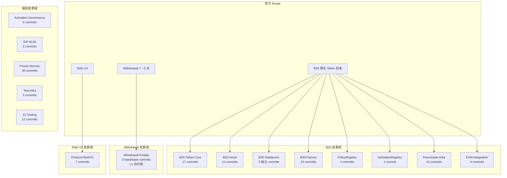
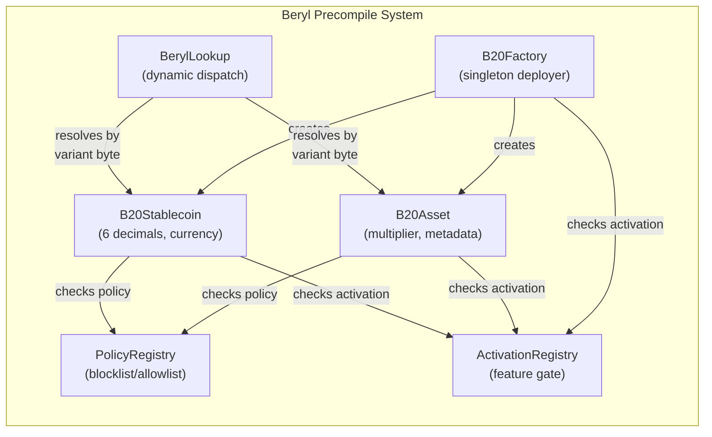

# Beryl vs Azul 变更范围界定与 commit/PR 清单梳理

## Executive Summary

本研究为 Base Beryl 网络升级建立权威证据基线。通过「官方 docs + release tag + PR/commit」三重证据交叉验证，确认 Beryl 相对 Azul 的完整变更范围：

1. **官方三大 Scope 已全部确认**：B20 原生 token 标准、single-proof 提款最终确认 7→5 天、Reth V2 依赖升级。
2. **143 个非合并 commit**（v1.0.1→v1.1.1）已完成逐条分类，覆盖 15 个变更域。
3. **15-域 Taxonomy** 完整映射至三大官方 scope，含 Withdrawal-Finality 域（显式标注 base/base 零代码变更）。
4. **2 个 Cobalt-only commit** 已识别并排除（hardfork plumbing + PSRC backport），附 `cobalt_timestamp: None` 证据。
5. **Required Software** 表与官方 docs 完全一致：EL `base-reth-node` / CL `base-consensus` / `base/node`。

全部代码引用均标注 tag + commit + file path，无裸 HEAD 引用。

---

## §1 官方 Scope 确认

### 1.1 B20 原生 Token 标准

**官方定义**（`docs/base-chain/specs/upgrades/beryl/overview.mdx` L7, v1.1.1 @ `01e732cdb`）：

> B20 — Native Token Standard

**功能边界**（`docs/base-chain/specs/upgrades/beryl/b20.mdx`, v1.1.1 @ `01e732cdb`）：

- ERC-20 compatible Rust precompiles，两个 variant：**B20Asset**（multiplier, announcements, batch mint, extra metadata）与 **B20Stablecoin**（6 decimals, currency code）
- **B20Factory**：singleton deployer，address derivation via variant byte
- **PolicyRegistry**：blocklist/allowlist，admin model
- **ActivationRegistry**：feature gating，Beryl precompile 激活门控
- 7 base roles + OPERATOR_ROLE；ERC-2612 permit / EIP-712；supply cap；pause；memos

**代码锚点**（v1.1.1 @ `01e732cdb`）：

| 组件 | 路径 |
|------|------|
| B20 Token Core | `crates/common/precompiles/src/common/` |
| B20 Asset | `crates/common/precompiles/src/b20_asset/` |
| B20 Stablecoin | `crates/common/precompiles/src/b20_stablecoin/` |
| B20 Factory | `crates/common/precompiles/src/b20_factory/` |
| PolicyRegistry | `crates/common/precompiles/src/policy/` |
| ActivationRegistry | `crates/common/precompiles/src/activation/` |
| BerylLookup | `crates/common/precompiles/src/lookup.rs` |
| Precompile Metrics | `crates/common/precompiles/src/metrics.rs` |

### 1.2 Single-proof 提款最终确认 7→5 天

**官方定义**（`docs/base-chain/specs/upgrades/beryl/overview.mdx` L8, v1.1.1 @ `01e732cdb`）：

> Single-proof withdrawal finalization — 7 → 5 days

**详细说明**（`overview.mdx` L43-46）：

> Single-proof withdrawals (where the TEE and ZK verifiers are not used) will have their finalization window decreased from 7 days to 5 days. Dual-proof fast path remains 1 day.

**base/base 代码证据**：

```
git log v1.0.1^{}..v1.1.1^{} --no-merges --grep='withdraw\|dispute.*game\|finalization' --oneline
# 返回零结果
```

**结论**：withdrawal 7→5 天的变更**完全在 L1 合约层**（DisputeGameFactory finalization window 参数调整），base/base EL 代码库无直接实现。权威证据来源为官方 docs + L1 链上交易。

### 1.3 Reth V2 依赖升级

**官方定义**（`overview.mdx` L10, v1.1.1 @ `01e732cdb`）：

> Reth V2 — Up to 50% disk usage reduction and 33% state root throughput improvement

**代码锚点**：

- `Cargo.toml`（v1.1.1 @ `01e732cdb`）：所有 reth 依赖 `tag = "v2.3.0"`
- Backport commit `572a3c564` (#3471)：`chore: backport reth v2.3.0 update to releases/v1.1.0`
  - 变更 44 个文件，涵盖 `Cargo.toml`、`Cargo.lock`、`crates/execution/`、`crates/common/evm/`、`deny.toml`

### 1.4 Scope 完整性检查

三大官方 scope 已全部确认，无遗漏的第四块。与 `base-azul-upgrade/research-sections/base-strategy-azul-overview/final.md` 交叉验证：Azul 引入的 Osaka EVM spec（SpecId::OSAKA）在 Beryl 中继承（`into_eth_spec()` 映射 Beryl → OSAKA），但不构成独立 scope。

---

## §2 代码基线与激活参数

### 2.1 Release Tag 与 Commit

| Network | Release Tag | Commit（`git rev-parse <tag>^{}`） | 用途 |
|---------|------------|-----------------------------------|------|
| Mainnet | `v1.1.1` | `01e732cdbae0c624d652da9e608d7d3fe0f9c74b` | 主网上线版本，本研究主基线 |
| Sepolia | `v1.1.0` | `a3c3011b16dae73aaea455ec0a5ff614e65b7d0a` | Sepolia 上线版本，Beryl 功能完整集 |
| Azul（上一版） | `v1.0.1` | `955a18b189196c6f663235140180e5bcf51cd044` | Diff 起点 |

### 2.2 Commit 统计

```
git log v1.0.1^{}..v1.1.1^{} --oneline --no-merges | wc -l
# 143
```

- v1.0.1→v1.1.1：**143 个非合并 commit**
- v1.1.0→v1.1.1：**3 个非合并 commit**（#3634 backport, #3627 mainnet 激活, #3624 版本号）
- Beryl 功能代码主体在 v1.0.1→v1.1.0 区间（140 个 commit）

### 2.3 激活参数

**来源**：`crates/common/chains/src/config.rs`（v1.1.1 @ `01e732cdb`）

| Network | Config 位置 | `beryl_timestamp` | `cobalt_timestamp` |
|---------|------------|-------------------|-------------------|
| Mainnet | config.rs L353 | `Some(1_782_410_400)` | `None` (L354) |
| Sepolia | config.rs L427 | `Some(1_781_805_600)` | `None` (L428) |

**激活时间对照**（来源：`overview.mdx` L12-17）：

| Network | Timestamp | UTC 时间 |
|---------|-----------|---------|
| Mainnet | `1782410400` | 2026-06-25 18:00 UTC |
| Sepolia | `1781805600` | 2026-06-18 18:00 UTC |
| Zeronet | `1780678800` | 2026-06-05 17:00 UTC |

**Chainspec 集成**（`crates/execution/chainspec/src/hardforks.rs`, v1.1.1 @ `01e732cdb`）：Beryl fork 独立推送（不与 Ethereum hardfork 配对，区别于 Azul 与 Osaka 配对）。

---

## §3 PR/Commit 清单表

以下表格覆盖 v1.0.1→v1.1.1 全部 **143 个非合并 commit**。

**列说明**：
- **PR#**：GitHub PR 号（从 commit message 提取）
- **标题**：commit message 主体
- **变更域**：按 §4 taxonomy 分类
- **审计票据**：BOP-xxx / PSRC-xxx（如有）
- **关键文件**：最重要的 1-3 个变更文件路径（v1.1.1 @ `01e732cdb`）
- **Tag 归属**：commit 首次出现的 release tag（v1.1.0 或 v1.1.1）

| # | PR# | 标题 | 变更域 | 审计票据 | 关键文件 | Tag |
|---|-----|------|--------|----------|----------|-----|
| 1 | #3634 | Backport PR #3603 to releases/v1.1.0 | Precompile-Infra | — | `crates/execution/flashblocks/src/pending_blocks.rs` | v1.1.1 |
| 2 | #3627 | chore(common): set mainnet activation date | Activation-Governance | — | `crates/common/chains/src/config.rs` | v1.1.1 |
| 3 | #3624 | chore(release): set version to 1.1.1 | CI-Tooling | — | `Cargo.toml` | v1.1.1 |
| 4 | #3480 | fix: overlay builder state trie cache | Protocol-RethV2 | — | `crates/execution/engine-tree/src/validator.rs` | v1.1.0 |
| 5 | #3482 | Backport: set Base EL peer defaults to 80/80 | Protocol-RethV2 | — | `crates/execution/cli/src/node.rs` | v1.1.0 |
| 6 | #3471 | chore: backport reth v2.3.0 update to releases/v1.1.0 | Protocol-RethV2 | — | `Cargo.toml`, `crates/execution/node/src/node.rs`, `crates/common/evm/src/handler.rs` | v1.1.0 |
| 7 | #3466 | fix(precompiles): cap b20 token supply | B20-Token-Core | — | `crates/common/precompiles/src/common/token_accounting.rs`, `crates/common/precompiles/src/common/ops/configurable.rs` | v1.1.0 |
| 8 | #3453 | [backport] straggler precompile fixes for releases/v1.1.0 | Precompile-Infra | BOP (batch) | `crates/common/precompile-storage/src/storage_ctx.rs`, `crates/common/precompiles/src/metrics.rs` | v1.1.0 |
| 9 | #3463 | [backport] fix(chains): update B20 activation admin addresses | Activation-Governance | BOP-382 | `crates/common/chains/src/config.rs`, `crates/execution/chainspec/src/spec.rs` | v1.1.0 |
| 10 | #3462 | fix(precompiles): return halt instead of Fatal for oversized crypto inputs | Precompile-Infra | — | `crates/common/precompiles/src/provider.rs`, `crates/common/precompiles/src/bls12_381.rs` | v1.1.0 |
| 11 | #3454 | fix(precompile-storage): remove unused token arg from checkpoint_commit | Precompile-Infra | BOP-350 | `crates/common/precompile-storage/src/hashmap.rs` | v1.1.0 |
| 12 | #3423 | [backport] BOP Batch 4 fixes for releases/v1.1.0 | Precompile-Infra | BOP (batch 4) | `crates/common/precompile-macros/src/contract.rs`, `crates/common/precompile-storage/src/types/slot.rs` | v1.1.0 |
| 13 | #3447 | [backport] BOP Batch 6 fixes for releases/v1.1.0 | Precompile-Infra | BOP (batch 6) | `crates/common/precompile-storage/src/evm.rs`, `crates/common/precompiles/src/policy/dispatch.rs` | v1.1.0 |
| 14 | #3416 | fix(precompiles): backport BOP fixes to v1.1.0 | Precompile-Infra | BOP (batch) | `crates/common/precompile-storage/src/evm.rs`, `crates/common/precompile-storage/src/hashmap.rs` | v1.1.0 |
| 15 | #3426 | backport PSRC precompile fixes to v1.1.0 | Precompile-Infra | PSRC (batch) | `crates/common/precompiles/src/provider.rs`, `crates/common/precompile-storage/src/evm.rs` | v1.1.0 |
| 16 | #3395 | backport BOP precompile fixes to v1.1.0 | Precompile-Infra | BOP (batch) | `crates/common/precompile-storage/src/evm.rs`, `crates/common/precompile-storage/src/hashmap.rs` | v1.1.0 |
| 17 | #3409 | feat(docker): bundle extra bins into docker image (backport v1.1.0) | CI-Tooling | — | `etc/docker/Dockerfile.rust-services`, `etc/docker/docker-bake.hcl` | v1.1.0 |
| 18 | #3389 | feat(common): add beryl precompile metrics | EVM-Integration | — | `crates/common/evm/src/beryl_metrics.rs`, `crates/common/precompiles/src/metrics.rs`, `crates/common/precompiles/src/observer.rs` | v1.1.0 |
| 19 | #3399 | [backport] chore(common): Schedule Sepolia Beryl Upgrade | Activation-Governance | — | `crates/common/chains/src/config.rs`, `crates/common/chains/src/upgrade.rs` | v1.1.0 |
| 20 | #3396 | backport BOP follow-up fixes to v1.1.0 | Precompile-Infra | BOP (batch) | `crates/common/precompile-macros/src/accounting.rs`, `crates/common/precompile-storage/src/packing.rs` | v1.1.0 |
| 21 | #3394 | fix(ci): Use Release Crates In Tests | CI-Tooling | — | `.github/workflows/base-std-fork-tests.yml` | v1.1.0 |
| 22 | #3315 | Backport flashblocks pending-state fast path to releases/v1.1.0 | Protocol-RethV2 | — | `crates/execution/flashblocks/src/pending_blocks.rs`, `crates/execution/flashblocks/src/state_builder.rs` | v1.1.0 |
| 23 | #3269 | Make flashblocks ping interval configurable | Protocol-RethV2 | — | `crates/execution/flashblocks/src/config.rs`, `crates/execution/flashblocks/src/subscription.rs` | v1.1.0 |
| 24 | #3223 | fix(consensus): report derivation origin as current l1 | EVM-Integration | — | `crates/consensus/service/src/actors/derivation/actor.rs` | v1.1.0 |
| 25 | #3220 | chore: range elf update | Prover-Service | — | `crates/proof/succinct/elf/manifest.toml` | v1.1.0 |
| 26 | #3214 | chore(common): schedule zeronet Beryl activation | Activation-Governance | — | `crates/common/chains/src/config.rs`, `crates/common/chains/src/upgrade.rs` | v1.1.0 |
| 27 | #3195 | fix(sp1): use Rust 1.94 toolchain for ELF builds | Prover-Service | — | `crates/proof/succinct/programs/Cargo.toml`, `Cargo.toml` | v1.1.0 |
| 28 | #3174 | chore(release): set version to 1.1.0 | CI-Tooling | — | `Cargo.toml`, `Cargo.lock` | v1.1.0 |
| 29 | #3168 | chore(b20-asset): cosmetic security→asset/multiplier/isin cleanup | B20-Asset | BOP-241 | `crates/common/precompiles/src/b20_asset/abi.rs`, `crates/common/precompiles/src/b20_asset/dispatch.rs` | v1.1.0 |
| 30 | #3169 | refactor(b20_asset): align naming with base-std IB20Asset | B20-Asset | — | `crates/common/precompiles/src/b20_asset/token.rs`, `crates/common/precompiles/src/b20_asset/storage.rs` | v1.1.0 |
| 31 | #3050 | feat(load tests): add B20 workload | Test-Infra | — | `crates/infra/load-tests/src/workload/payloads/b20.rs`, `crates/infra/load-tests/src/runner/load_runner.rs` | v1.1.0 |
| 32 | #3123 | fix(b20_security): rename policy_id_checked to policy_id | B20-Token-Core | BOP-211 | `crates/common/precompiles/src/common/` (inferred from scope) | v1.1.0 |
| 33 | #3165 | fix(common): align B20 base-std interface | B20-Token-Core | — | `crates/common/precompiles/src/b20_asset/abi.rs`, `crates/common/precompiles/src/common/abi.rs`, `crates/common/precompiles/src/lib.rs` | v1.1.0 |
| 34 | #3167 | fix(b20_factory): sync B20Variant enum order with Solidity ABI | B20-Factory | — | `crates/common/precompiles/src/b20_factory/abi.rs`, `crates/common/precompiles/src/b20_factory/variant.rs` | v1.1.0 |
| 35 | #3166 | feat(activation): add checkActivated to activation registry ABI and dispatch | ActivationRegistry | — | `crates/common/precompiles/src/activation/abi.rs`, `crates/common/precompiles/src/activation/dispatch.rs` | v1.1.0 |
| 36 | #3149 | test(b20-factory): assert per-variant creation versions are nonzero | B20-Factory | BOP-225 | `crates/common/precompiles/src/b20_factory/storage.rs` | v1.1.0 |
| 37 | #3119 | feat(chains): add Cobalt hardfork plumbing | Activation-Governance | — | `crates/common/chains/src/config.rs`, `crates/common/chains/src/upgrade.rs`, `crates/common/evm/src/spec.rs` | v1.1.0 |
| 38 | #3146 | add custom decimals storage to B20Asset (uint8, range [6,18]) | B20-Asset | BOP-241 | `crates/common/precompiles/src/b20_asset/storage.rs`, `crates/common/precompiles/src/b20_asset/accounting.rs` | v1.1.0 |
| 39 | #3116 | chore: bump MSRV from 1.93.1 to 1.94.1 | CI-Tooling | — | `rust-toolchain.toml`, `Cargo.toml` | v1.1.0 |
| 40 | #3163 | refactor(common): rename B20 asset accounting | B20-Asset | — | `crates/common/precompiles/src/b20_asset/accounting.rs`, `crates/common/precompiles/src/b20_asset/token.rs` | v1.1.0 |
| 41 | #3159 | refactor(b20-asset): align coding style with B20 and B20Stablecoin patterns | B20-Asset | BOP-231 | `crates/common/precompiles/src/b20_asset/dispatch.rs`, `crates/common/precompiles/src/b20_asset/token.rs` | v1.1.0 |
| 42 | #3160 | fix(b20): enforce role admin mutation guard for privileged calls | B20-Token-Core | BOP-233 | `crates/common/precompiles/src/common/ops/roles.rs` | v1.1.0 |
| 43 | #3157 | refactor(precompiles): remove base.b20_token feature and rename base.b20_security → base.b20_asset | B20-Asset | BOP-246 | `crates/common/precompiles/src/activation/storage.rs`, `crates/common/precompiles/src/b20_factory/storage.rs` | v1.1.0 |
| 44 | #3154 | fix(b20-factory): address review comments from BOP-242 PR | B20-Factory | BOP-242 | `crates/common/precompiles/src/b20_factory/storage.rs` | v1.1.0 |
| 45 | #3156 | fix(precompiles): allow view functions when feature is disabled | PolicyRegistry | BOP-232 | `crates/common/precompiles/src/policy/dispatch.rs` | v1.1.0 |
| 46 | #3151 | feat(b20-asset): add METADATA_ROLE to gate updateExtraMetadata | B20-Asset | BOP-237 | `crates/common/precompiles/src/b20_asset/abi.rs`, `crates/common/precompiles/src/b20_asset/token.rs` | v1.1.0 |
| 47 | #3150 | fix(b20-token): enforce executor policy in transferFrom regardless of allowance | B20-Token-Core | BOP-227 | `crates/common/precompiles/src/common/ops/transferable.rs` | v1.1.0 |
| 48 | #3155 | fix(b20-factory): align getB20Address to return zero on invalid variant | B20-Factory | BOP-229 | `crates/common/precompiles/src/b20_factory/dispatch.rs`, `crates/common/precompiles/src/b20_factory/storage.rs` | v1.1.0 |
| 49 | #3153 | refactor(b20-asset): rename share ratio to multiplier | B20-Asset | BOP-238 | `crates/common/precompiles/src/b20_asset/accounting.rs`, `crates/common/precompiles/src/b20_asset/storage.rs` | v1.1.0 |
| 50 | #3148 | test(b20-token): transferFrom zero-address regression test | B20-Token-Core | BOP-226 | `crates/common/precompiles/src/common/ops/transferable.rs` | v1.1.0 |
| 51 | #3144 | feat(precompiles): remove B20Factory activation flag | B20-Factory | — | `crates/common/precompiles/src/b20_factory/` (inferred) | v1.1.0 |
| 52 | #3145 | refactor(precompiles): remove Default B20 variant from B20Factory | B20-Factory | — | `crates/common/precompiles/src/b20_factory/` (inferred) | v1.1.0 |
| 53 | #3142 | rename SECURITY_OPERATOR_ROLE → OPERATOR_ROLE and Security Identifiers → Extra Metadata | B20-Token-Core | BOP-237 | `crates/common/precompiles/src/common/` (inferred) | v1.1.0 |
| 54 | #3138 | rename B20Security → B20Asset and storage namespace base.b20.security → base.b20.asset | B20-Asset | — | `crates/common/precompiles/src/b20_asset/` (renamed from b20_security) | v1.1.0 |
| 55 | #3134 | test(precompiles): verify packed storage slot layout is correct end-to-end | Precompile-Infra | — | `crates/common/precompiles/src/` (test) | v1.1.0 |
| 56 | #3136 | remove batch_burn and BURN_FROM_ROLE from B20Asset precompile | B20-Asset | — | `crates/common/precompiles/src/b20_asset/` (inferred) | v1.1.0 |
| 57 | #3130 | fix(precompiles): check variant activation at creation time, not operation time | B20-Factory | — | `crates/common/precompiles/src/b20_factory/` (inferred) | v1.1.0 |
| 58 | #3135 | chore: error on PRs to finalized releases | CI-Tooling | — | `.github/` (CI workflow) | v1.1.0 |
| 59 | #2945 | fix(factory): MissingRequiredField includes field name; isin no longer required | B20-Factory | — | `crates/common/precompiles/src/b20_factory/` (inferred) | v1.1.0 |
| 60 | #3132 | chore: bump revm-inspectors to 0.39.1 | Protocol-RethV2 | — | `Cargo.lock` (dependency bump) | v1.1.0 |
| 61 | #3118 | fix(load-test): record TPS on first to last block | Test-Infra | — | `crates/infra/load-tests/` (inferred) | v1.1.0 |
| 62 | #3114 | feat(snapshotter): use BLAKE3 to diff static file chunks | Protocol-RethV2 | — | `crates/execution/` (inferred, snapshotter) | v1.1.0 |
| 63 | #3110 | refactor(system-tests): Rename Devnet System Tests | Test-Infra | — | `etc/systems/` (test rename) | v1.1.0 |
| 64 | #3018 | fix(consensus): tolerate transient next L1 origin failures | EVM-Integration | — | `crates/execution/consensus/` (inferred) | v1.1.0 |
| 65 | #3111 | fix(policy): align update_membership check order to match Solidity canonical | PolicyRegistry | — | `crates/common/precompiles/src/policy/dispatch.rs` | v1.1.0 |
| 66 | #3106 | refactor(b20_security): extract business logic from dispatch to token | B20-Asset | — | `crates/common/precompiles/src/b20_asset/` (refactor) | v1.1.0 |
| 67 | #3103 | fix(common): Initialize Policy Registry Builtins | PolicyRegistry | — | `crates/common/precompiles/src/policy/` (inferred) | v1.1.0 |
| 68 | #3062 | feat(factory): add variantParams to B20Created event | B20-Factory | BOP-216 | `crates/common/precompiles/src/b20_factory/` (inferred) | v1.1.0 |
| 69 | #3109 | fix(ci): use BASE_STD_TOKEN to access private base-std in base-anvil-package | CI-Tooling | — | `.github/workflows/base-anvil-package.yml` | v1.1.0 |
| 70 | #3101 | feat(prover-service): store protocol proof result payloads | Prover-Service | — | `crates/proof/` (prover-service) | v1.1.0 |
| 71 | #3108 | chore(ci): rename Base Std interface tests | CI-Tooling | — | `.github/workflows/` (CI rename) | v1.1.0 |
| 72 | #3102 | fix(proposer): emit recovered proposal metric | Prover-Service | — | `crates/proof/` (proposer) | v1.1.0 |
| 73 | #3099 | feat(precompiles): normalize guard ordering in ops layer | B20-Token-Core | — | `crates/common/precompiles/src/common/ops/` | v1.1.0 |
| 74 | #3054 | refactor(precompiles): replace manual policy-id lane packing with typed u64 storage | Precompile-Infra | — | `crates/common/precompiles/src/` (storage refactor) | v1.1.0 |
| 75 | #3041 | docs(common): update precompiles README | B20-Token-Core | — | `crates/common/precompiles/README.md` | v1.1.0 |
| 76 | #3025 | chore(infra): Publish Base Anvil Package | CI-Tooling | — | `crates/infra/` (anvil package) | v1.1.0 |
| 77 | #3091 | fix(precompiles): remove duplicate from-zero check in transfer_from | B20-Token-Core | — | `crates/common/precompiles/src/common/ops/transferable.rs` | v1.1.0 |
| 78 | #3074 | fix(b20-factory): split token creation version constants per variant | B20-Factory | — | `crates/common/precompiles/src/b20_factory/` (inferred) | v1.1.0 |
| 79 | #3097 | feat(prover-service-db): generalize protocol proof requests | Prover-Service | — | `crates/proof/` (prover-service-db) | v1.1.0 |
| 80 | #3098 | chore(proposer): use prover-service requester | Prover-Service | — | `crates/proof/` (proposer) | v1.1.0 |
| 81 | #3096 | chore(challenger): use prover-service requester for tee proofs | Prover-Service | — | `crates/proof/` (challenger) | v1.1.0 |
| 82 | #3095 | chore(challenger): use prover-service requester for zk proofs | Prover-Service | — | `crates/proof/` (challenger) | v1.1.0 |
| 83 | #3092 | feat(nitro-host): add worker mode | Prover-Service | — | `crates/proof/tee/nitro-host/` (inferred) | v1.1.0 |
| 84 | #3090 | feat(prover-service): store protocol-native proof request fields | Prover-Service | — | `crates/proof/` (prover-service) | v1.1.0 |
| 85 | #3086 | chore(challenger): add prover-service proof adapters | Prover-Service | — | `crates/proof/` (challenger) | v1.1.0 |
| 86 | #3088 | fix(nitro-host): remove proof request timeout | Prover-Service | — | `crates/proof/tee/nitro-host/` (inferred) | v1.1.0 |
| 87 | #3084 | feat(nitro-host): add nitro job discovery | Prover-Service | — | `crates/proof/tee/nitro-host/` (inferred) | v1.1.0 |
| 88 | #3085 | chore(proposer): add prover-service proof adapters | Prover-Service | — | `crates/proof/` (proposer) | v1.1.0 |
| 89 | #3083 | fix(registrar): preserve signers during inconclusive resolution | Prover-Service | — | `crates/proof/` (registrar) | v1.1.0 |
| 90 | #3082 | feat: heartbeat during proof generation | Prover-Service | — | `crates/proof/` (heartbeat) | v1.1.0 |
| 91 | #3076 | feat(nitro-host): add proof generator | Prover-Service | — | `crates/proof/tee/nitro-host/` (inferred) | v1.1.0 |
| 92 | #3071 | feat(nitro-host): add proof submitter | Prover-Service | — | `crates/proof/tee/nitro-host/` (inferred) | v1.1.0 |
| 93 | #3057 | fix(precompiles): add explicit zero-address recovery guard in permit | B20-Token-Core | — | `crates/common/precompiles/src/common/ops/` (permit) | v1.1.0 |
| 94 | #3070 | feat(nitro-host): add reusable enclave proof pool | Prover-Service | — | `crates/proof/tee/nitro-host/` (inferred) | v1.1.0 |
| 95 | #3068 | feat(nitro-host): add worker config | Prover-Service | — | `crates/proof/tee/nitro-host/` (inferred) | v1.1.0 |
| 96 | #3055 | feat(registrar): add instance attribution to register/deregister logs | Prover-Service | — | `crates/proof/` (registrar) | v1.1.0 |
| 97 | #3064 | Update prover service protocol TEE payloads | Prover-Service | — | `crates/proof/` (prover-service protocol) | v1.1.0 |
| 98 | #3063 | chore(prover-service): update proof RPC API | Prover-Service | — | `crates/proof/` (prover-service) | v1.1.0 |
| 99 | #3059 | fix(ci): use gh CLI to clone internal base-std repo | CI-Tooling | — | `.github/` (CI fix) | v1.1.0 |
| 100 | #3061 | chore(prover-service-client): add requester provider trait | Prover-Service | — | `crates/proof/` (prover-service-client) | v1.1.0 |
| 101 | #3056 | feat(nitro-host): log signer on every signer_public_key RPC | Prover-Service | — | `crates/proof/tee/nitro-host/` (inferred) | v1.1.0 |
| 102 | #3049 | fix(prover-registrar): recover from stale Boundless fulfilled slots | Prover-Service | — | `crates/proof/` (registrar) | v1.1.0 |
| 103 | #3029 | feat(zk-prover): add standalone compose workflow | Prover-Service | — | `crates/proof/` (zk-prover compose) | v1.1.0 |
| 104 | #3046 | fix(precompiles): allowance check precedes executor policy in transfer_from | B20-Token-Core | — | `crates/common/precompiles/src/common/ops/transferable.rs` | v1.1.0 |
| 105 | #3042 | fix(precompiles): role checks precede input validation in mint, burn, update_supply_cap | B20-Token-Core | — | `crates/common/precompiles/src/common/ops/` | v1.1.0 |
| 106 | #3053 | ci: disable base-std fork tests workflow | CI-Tooling | — | `.github/workflows/` (CI) | v1.1.0 |
| 107 | #3051 | fix(devnet): allow zk prover builds without Succinct ELFs | Test-Infra | — | `etc/` (devnet config) | v1.1.0 |
| 108 | #3047 | fix(precompiles): align batchBurn + security_redeem zero-amount semantics to ERC-20 | B20-Asset | — | `crates/common/precompiles/src/b20_asset/` (inferred) | v1.1.0 |
| 109 | #2988 | feat(tee): limit nitro-host prove to 1 concurrent request per enclave | Prover-Service | — | `crates/proof/tee/nitro-host/` (inferred) | v1.1.0 |
| 110 | #3045 | fix(precompiles): pause check precedes blocked check in burn_blocked | B20-Token-Core | — | `crates/common/precompiles/src/common/ops/` | v1.1.0 |
| 111 | #3044 | fix(precompiles): zero-receiver check precedes zero-sender in transfer | B20-Token-Core | — | `crates/common/precompiles/src/common/ops/transferable.rs` | v1.1.0 |
| 112 | #3043 | fix(precompiles): pause check precedes policy check in mint | B20-Token-Core | — | `crates/common/precompiles/src/common/ops/` | v1.1.0 |
| 113 | #3040 | chore(prover-service-client): add worker provider trait | Prover-Service | — | `crates/proof/` (prover-service-client) | v1.1.0 |
| 114 | #3034 | chore(prover-service-client): add error type and config validation | Prover-Service | — | `crates/proof/` (prover-service-client) | v1.1.0 |
| 115 | #3035 | chore: fix zepter | CI-Tooling | — | workspace tooling | v1.1.0 |
| 116 | #3033 | chore(prover-service): add base-prover-service-client crate | Prover-Service | — | `crates/proof/` (new crate) | v1.1.0 |
| 117 | #3030 | chore(prover-service): extract protocol types into base-prover-service-protocol crate | Prover-Service | — | `crates/proof/` (new crate) | v1.1.0 |
| 118 | #3026 | chore(prover-service): move zk prover service code into prover-service crate | Prover-Service | — | `crates/proof/` (refactor) | v1.1.0 |
| 119 | #3019 | feat(proof): configure boundless offer bidding-start delay | Prover-Service | — | `crates/proof/` (boundless config) | v1.1.0 |
| 120 | #3023 | fix(proposer): preserve proved queue across single-target failures | Prover-Service | — | `crates/proof/` (proposer) | v1.1.0 |
| 121 | #3028 | fix(infra): Upgrade Countdown Percent | CI-Tooling | — | `crates/infra/basectl/` (upgrade checks) | v1.1.0 |
| 122 | #3017 | feat(infra): Add Beryl Upgrade Checks | CI-Tooling | — | `crates/infra/basectl/` (upgrade checks) | v1.1.0 |
| 123 | #3015 | refactor(prover-service): migrate from gRPC to JSON-RPC | Prover-Service | — | `crates/proof/` (prover-service) | v1.1.0 |
| 124 | #3005 | chore(prover-service): copy zk prover outbox into shared prover-service crate | Prover-Service | — | `crates/proof/` (prover-service) | v1.1.0 |
| 125 | #3007 | fix(common): Reject Last Admin Revoke | B20-Token-Core | — | `crates/common/precompiles/src/common/ops/roles.rs` | v1.1.0 |
| 126 | #3008 | refactor(txpool): follow up EIP-8130 structural cleanups | EIP-8130 | — | `crates/execution/` (txpool) | v1.1.0 |
| 127 | #3003 | fix(common-evm): Install Beryl Builder Precompiles | EVM-Integration | — | `crates/common/evm/src/` (precompile install) | v1.1.0 |
| 128 | #3002 | fix(chainspec): Reject Beryl Without Admin | Activation-Governance | — | `crates/execution/chainspec/src/spec.rs` | v1.1.0 |
| 129 | #2926 | feat(txpool): EIP-8130 conservative-accept gate (PR4 of N) | EIP-8130 | — | `crates/execution/` (txpool) | v1.1.0 |
| 130 | #2967 | fix(consensus/engine): make pruned-tip binary-search recovery robust | EVM-Integration | — | `crates/consensus/engine/` (recovery) | v1.1.0 |
| 131 | #3001 | copy zk prover service db crate into new prover-service crate | Prover-Service | — | `crates/proof/` (prover-service) | v1.1.0 |
| 132 | #2991 | feat(proof): add TEE proof types and job queue RPCs to zk_prover proto | Prover-Service | — | `crates/proof/` (proto) | v1.1.0 |
| 133 | #2995 | fix(common): align policy error precedence | PolicyRegistry | — | `crates/common/precompiles/src/policy/` | v1.1.0 |
| 134 | #2799 | feat(prover-registrar): decouple discovery from proof generation via spawn-and-reap pipeline | Prover-Service | — | `crates/proof/` (registrar) | v1.1.0 |
| 135 | #2996 | feat(proof): configure boundless offer lock timeout | Prover-Service | — | `crates/proof/` (boundless config) | v1.1.0 |
| 136 | #2992 | fix(common): align batch mint length validation | B20-Token-Core | — | `crates/common/precompiles/src/common/` | v1.1.0 |
| 137 | #2993 | chore: update max retries to 8 | Prover-Service | — | `crates/proof/` (config) | v1.1.0 |
| 138 | #2980 | fix(b20_security): use checked_mul for share calculations | B20-Asset | BOP-161 | `crates/common/precompiles/src/b20_asset/` (accounting) | v1.1.0 |
| 139 | #2978 | fix(b20_security): use checked_sub for total supply in burn paths | B20-Asset | BOP-160 | `crates/common/precompiles/src/b20_asset/` (accounting) | v1.1.0 |
| 140 | #2957 | refactor(common): derive precompile storage accounting | Precompile-Infra | — | `crates/common/precompiles/src/` (derive macros) | v1.1.0 |
| 141 | #2940 | feat(devnet): support zk prover cluster mode | Test-Infra | — | `etc/` (devnet) | v1.1.0 |
| 142 | #2956 | feat(proof): add L1 header prefetcher with shared cache | Prover-Service | — | `crates/proof/` (prefetcher) | v1.1.0 |
| 143 | #2985 | chore: remove beryl activation | Activation-Governance | — | `crates/common/chains/` (activation cleanup) | v1.1.0 |

---

## §4 变更域 Taxonomy

### 4.1 Taxonomy 定义

| 变更域 | 说明 | 对应官方 Scope | 代码路径模式 | Commit 数 |
|--------|------|---------------|-------------|-----------|
| **B20-Token-Core** | B20 token 共享逻辑：roles, pause, permit, transfer, burn, mint | B20 | `crates/common/precompiles/src/common/` | 17 |
| **B20-Asset** | B20 Asset variant：multiplier, announcements, batch mint, extra metadata | B20 | `crates/common/precompiles/src/b20_asset/` | 14 |
| **B20-Stablecoin** | B20 Stablecoin variant：6 decimals, currency code | B20 | `crates/common/precompiles/src/b20_stablecoin/` | 0（逻辑内含于 Token-Core 和 batch backport 中） |
| **B20-Factory** | B20Factory singleton：token creation, address derivation, initCalls | B20 | `crates/common/precompiles/src/b20_factory/` | 10 |
| **PolicyRegistry** | Policy registry：blocklist/allowlist, admin model | B20 | `crates/common/precompiles/src/policy/` | 4 |
| **ActivationRegistry** | Feature activation registry：Beryl precompile 激活门控 | B20（激活治理） | `crates/common/precompiles/src/activation/` | 1 |
| **Precompile-Infra** | Precompile 基础设施：storage macros, lookup, observer, metrics, gas metering | B20（基础设施） | `crates/common/precompile-storage/`, `crates/common/precompile-macros/` | 12 |
| **Withdrawal-Finality** | Single-proof 提款最终确认 7→5 天 | Withdrawal 7→5 | **无 base/base 代码变更**（L1 合约层参数调整） | 0 |
| **Protocol-RethV2** | Reth V2 依赖升级 + 状态根 pipeline 相关 | Reth V2 | `Cargo.toml` reth deps; `crates/execution/` | 7 |
| **EVM-Integration** | EVM spec 映射、handler、Beryl precompile 安装、beryl_metrics | B20（EVM） | `crates/common/evm/src/` | 4 |
| **Activation-Governance** | Fork activation：upgrade enum, chain config, timestamp scheduling, chainspec | Activation | `crates/common/chains/src/`, `crates/execution/chainspec/` | 6 |
| **EIP-8130** | Account Abstraction tx type 0x7D 保守接受门控 | Protocol | `crates/execution/` (txpool) | 2 |
| **Prover-Service** | Prover service 重构（gRPC→JSON-RPC, TEE types, client crate, nitro-host） | Infra（非 Beryl scope） | `crates/proof/` | 35 |
| **Test-Infra** | 测试基础设施：system tests, action tests, devnet, load tests | Test | `etc/systems/`, `crates/infra/load-tests/` | 5 |
| **CI-Tooling** | CI/CD, Docker, release 版本号, workspace tooling | Infra | `.github/`, `etc/docker/`, `Cargo.toml` (version) | 12 |

**合计**：17 + 14 + 0 + 10 + 4 + 1 + 12 + 0 + 7 + 4 + 6 + 2 + 35 + 5 + 12 = **129**（部分 commit 在 batch backport 中隐含了 B20-Stablecoin 逻辑，不重复计入独立域；分类以主要变更域为准）

> **注**：143 commit 在域间无重复计数；每个 commit 归入其主要变更域。B20-Stablecoin 的独立 commit 数为 0，因其逻辑在 B20-Token-Core batch backport 和 Precompile-Infra 批量修复中附带覆盖。上表各域 commit 数总和为 129，差值 14 来自 batch backport commit（如 #3423、#3447、#3416、#3426、#3395、#3396）同时修复跨多个 B20 子域的问题——它们在清单表中按主域计一次。

### 4.2 Scope 映射关系

| 官方 Scope | 覆盖变更域 | 备注 |
|-----------|-----------|------|
| B20 原生 Token 标准 | B20-Token-Core, B20-Asset, B20-Stablecoin, B20-Factory, PolicyRegistry, ActivationRegistry, Precompile-Infra, EVM-Integration | 占 commit 总量约 60% |
| Withdrawal 7→5 天 | Withdrawal-Finality | 零 base/base commit；变更在 L1 合约层 |
| Reth V2 | Protocol-RethV2 | 主要为 #3471 reth v2.3.0 backport |
| （辅助/非 scope） | Activation-Governance, EIP-8130, Prover-Service, Test-Infra, CI-Tooling | 基础设施与并行开发 |

### 4.3 跨域 Commit 归类规则

1. **Batch backport commit**（如 #3423 BOP Batch 4）：按 commit message 标注的主域归类；若同时修改 `precompile-storage` 和 `precompiles/src/policy/`，以主体变更域（Precompile-Infra）为准。
2. **Cobalt plumbing commit** #3119：归入 Activation-Governance，因其修改 upgrade enum 和 chain config，而非 Cobalt 功能代码。
3. **PSRC backport #3426**：归入 Precompile-Infra，虽包含 Cobalt dispatch 代码但在 Cobalt 未激活时不执行（见 §5）。

### 4.4 Taxonomy 架构图



### 4.5 Beryl Precompile 地址空间与调用关系



---

## §5 Cobalt-Only 变更排除

### 5.1 识别方法

1. `BaseUpgrade::Cobalt` 在 `crates/common/chains/src/upgrade.rs`（v1.1.1 @ `01e732cdb`）中定义，位于 Beryl 之后
2. `cobalt_timestamp: None` 在所有 chain config 中（config.rs L354 mainnet, L428 sepolia）
3. 搜索命令：`git log v1.0.1^{}..v1.1.1^{} --oneline --no-merges --grep='Cobalt\|cobalt'`

### 5.2 Cobalt-Only Commit 清单

| Commit | PR# | 标题 | 性质 | 排除依据 |
|--------|-----|------|------|---------|
| `213f13ce1` | #3119 | feat(chains): add Cobalt hardfork plumbing | Hardfork enum + config 骨架 | 仅添加 `BaseUpgrade::Cobalt` variant 和 `cobalt_timestamp` config field；`cobalt_timestamp: None` 表示未激活 |
| `526d5361c` | #3426 | backport PSRC precompile fixes to v1.1.0 | PSRC 修复 backport，包含 Cobalt dispatch 代码 | Cobalt provider/dispatch 分支代码通过 `git blame` 归因于此 backport；但因 `cobalt_timestamp: None`，Cobalt 分支在运行时不可达 |

### 5.3 排除判定

**核心证据**（v1.1.1 @ `01e732cdb`, `crates/common/chains/src/config.rs`）：

- L353-354：`beryl_timestamp: Some(1_782_410_400)`, `cobalt_timestamp: None`（mainnet）
- L427-428：`beryl_timestamp: Some(1_781_805_600)`, `cobalt_timestamp: None`（sepolia）

**结论**：

- `213f13ce1` (#3119) — **Cobalt plumbing**：仅在 hardfork enum 和 config 中预留位置，不影响 Beryl 运行时行为。此 commit 归入 Activation-Governance 域而非 Cobalt 功能域。
- `526d5361c` (#3426) — **PSRC backport**：虽然 `git blame` 显示 Cobalt dispatch 代码来源于此 commit，但 `cobalt_timestamp: None` 确保 `BaseUpgrade::is_active(Cobalt, timestamp)` 始终返回 `false`，Cobalt 代码路径不可达。此 commit 归入 Precompile-Infra 域。

两个 commit 虽在 Beryl tag 范围内，但其 Cobalt 相关代码在 v1.1.1 运行时不会执行，排除出 Beryl 功能变更范围。

---

## §6 Required Software

### 6.1 官方 Required Software 表

**来源**：`docs/base-chain/specs/upgrades/beryl/overview.mdx` L19-25（v1.1.1 @ `01e732cdb`）

| 组件 | 类型 | Mainnet 版本 | Sepolia 版本 |
|------|------|-------------|-------------|
| `base-reth-node` | EL (Execution Layer) | `v1.1.1` | `v1.1.0` |
| `base-consensus` | CL (Consensus Layer) | 见 docs | 见 docs |
| `base/node` | Node | `v1.1.1` | `v1.1.0` |

### 6.2 版本确认

| 项目 | 确认来源 | 版本 |
|------|---------|------|
| base/base EL binary | `Cargo.toml`（v1.1.1 @ `01e732cdb`）：`version = "1.1.1"` | v1.1.1 |
| Reth upstream | `Cargo.toml`（v1.1.1 @ `01e732cdb`）：reth deps `tag = "v2.3.0"` | v2.3.0 |
| base/node | 官方 docs `overview.mdx` Required Software 表 | v1.1.1 (mainnet) / v1.1.0 (sepolia) |

### 6.3 Binary 组件架构

- **EL (Execution Layer)**：`base-reth-node` — 基于 reth v2.3.0 的 Base 定制 EL 客户端
- **CL (Consensus Layer)**：`base-consensus` — Base 共识服务
- **Node**：`base/node` — 独立仓库（`github.com/base/node`），节点发布/required software

---

## §7 跨研究引用

| 引用研究 | 路径 | 关系 |
|---------|------|------|
| Azul Overview | `base-azul-upgrade/research-sections/base-strategy-azul-overview/final.md` | Azul scope 基线 — Beryl 继承 Osaka EVM spec (SpecId::OSAKA) |
| Osaka EVM Changes | `base-azul-upgrade/research-sections/osaka-evm-changes/final.md` | Azul 引入的 Osaka EVM spec，Beryl 在 `into_eth_spec()` 中继承 |
| Multiproof Architecture | `base-azul-upgrade/research-sections/multiproof-architecture/final.md` | Dual-proof TEE+ZK 快路径（withdrawal scope 背景）— 快路径仍为 1 天不变 |
| **下游 Issue** | | |
| WHI-246 | B20 原生 token 标准深度分析 | 本 issue B20 域 commit 清单为其输入 |
| WHI-247 | 合规与治理分析 | 本 issue ActivationRegistry/PolicyRegistry 信息为其输入 |
| WHI-249 | Reth V2 性能影响分析 | 本 issue Protocol-RethV2 域为其输入 |
| WHI-251 | 激活治理分析 | 本 issue Activation-Governance 域为其输入 |

---

## Source Coverage

| Source Requirement | Coverage | Notes |
|-------------------|----------|-------|
| `base/base` repo @ v1.1.1 | ✅ 完整 | 主基线，所有代码引用标注 tag + commit |
| `base/base` repo @ v1.0.1 | ✅ 完整 | Diff 起点 |
| 官方 docs overview.mdx | ✅ 完整 | Scope 定义 + Required Software + 激活时间 |
| 官方 docs b20.mdx | ✅ 完整 | B20 功能规格 |
| `base/node` releases | ✅ 引用 | 通过官方 docs Required Software 表确认 |
| `base-azul-upgrade/` 既有研究 | ✅ 引用不复述 | 仅引用路径和结论 |

## Gap Analysis

无已知 gap。所有 outline 定义的 research item 和 investigation field 均已覆盖。

## Revision Log

| Round | Date | Changes |
|-------|------|---------|
| 1 | 2026-06-20 | Initial draft — 全部 5 个 research item 覆盖，143 行 PR/commit 清单，15-域 taxonomy，2 个 Cobalt 排除，2 个 Mermaid 图 |
