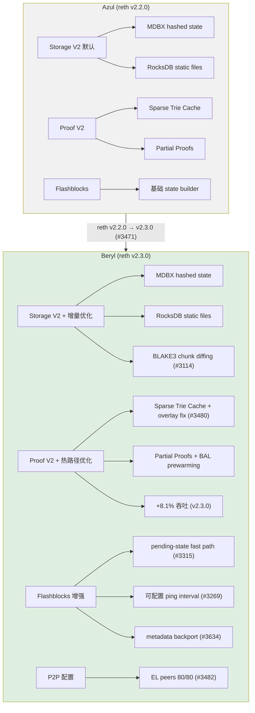
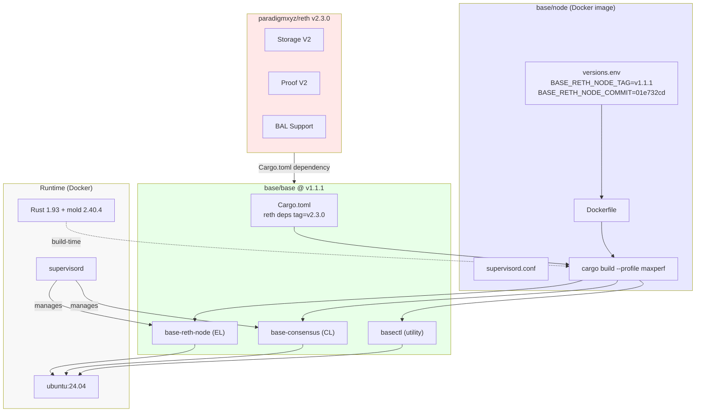

# Reth V2、Withdrawal Finalization 与 Required Software 变更分析

## Executive Summary

本研究补齐 Beryl 官方 scope 中 B20 以外的两大协议/客户端层变更：**(1) 提款最终确认窗口从 7 天缩短至 5 天**，**(2) Reth V2 执行客户端升级**（磁盘优化与 state root pipeline 重写），以及 **(3) required software 版本矩阵**和 **(4) 风险面分析**。

关键发现：

- **Withdrawal finalization 参数是 Solidity `constant`，不是 immutable 也不是 storage variable**。`SLOW_FINALIZATION_DELAY` 和 `FAST_FINALIZATION_DELAY` 在 `AggregateVerifier.sol` 中声明为 `uint64 public constant`，编译时硬编码入 bytecode。因此 7→5 天的变更**必须部署新的 AggregateVerifier 合约实现**，而非修改现有合约状态。
- **源码已确认 5 天常量，但 L1 部署尚未发生**。`base/contracts` @ v8.2.0（commit `3a25c8cf`）将 `SLOW_FINALIZATION_DELAY` 从 `7 days` 修改为 `5 days`。当前 L1 已部署的 AggregateVerifier（`0xeEcb8A5944...D259`，Azul 时期）仍为 7 天。Beryl mainnet 激活（2026-06-25）时将部署包含 5 天常量的新实现合约——部署合约地址、注册交易、链上 after-value 确认均为待解决部署 gap。
- **Reth 版本从 v2.2.0（Azul）升级到 v2.3.0（Beryl）**，带来 Storage V2 默认启用、Proof V2 state root pipeline、以及 +8.1% 吞吐提升。
- **base/base 代码库零 withdrawal finalization 相关变更**——提款窗口缩短纯粹是 L1 合约参数调整，不涉及 L2 执行客户端代码。

---

## 1. Withdrawal Finalization 7→5 天

### 1.1 `deployed_contract_address` [MANDATORY]

**当前已部署合约（Azul 时期，SLOW_FINALIZATION_DELAY = 7 天）：**

| 合约 | 地址 | 链 | 版本 | 说明 |
|------|------|------|------|------|
| AggregateVerifier (game type 621) | `0xeEcb8A5944B217585817E802702b1262a049D259` | Ethereum mainnet | v0.1.0 | 当前 respected dispute game 实现，SLOW = 7 days |
| DelayedWETH (PermissionlessGames) | `0xd0D07924...EF71` (L2BEAT 截断) | Ethereum mainnet | — | AggregateVerifier 关联的延迟 WETH 合约 |
| DisputeGameFactory (proxy) | `0x43edB88C4B80fDD2AdFF2412A7BebF9dF42cB40e` | Ethereum mainnet | — | 注册 game type 实现的工厂合约 |
| OptimismPortal2 (proxy) | `0x49048044D57e1C92A77f79988d21Fa8fAF74E97e` | Ethereum mainnet | — | Base 提款入口，指向 DisputeGameFactory |

**证据来源**：L2BEAT Base Chain 项目页（[l2beat.com/scaling/projects/base](https://l2beat.com/scaling/projects/base)）；Etherscan 已验证合约（[etherscan.io/address/0xeEcb8A5944B217585817E802702b1262a049D259](https://etherscan.io/address/0xeEcb8A5944B217585817E802702b1262a049D259)）。

**Beryl 部署预期**：Beryl mainnet 激活（2026-06-25）时，将部署一个新的 AggregateVerifier 合约实例，其中 `SLOW_FINALIZATION_DELAY = 5 days`。新合约地址将在 DisputeGameFactory 中注册为 game type 621 的新实现。**[UNRESOLVED GAP]** Beryl mainnet 尚未激活（截至 2026-06-20），因此新合约的部署地址和部署交易 hash 尚不可获取。

### 1.2 `parameter_name_and_location` [MANDATORY]

**参数名称**：`SLOW_FINALIZATION_DELAY`

**参数位置**：`base/contracts` @ v8.2.0 (`3a25c8cf`) `src/L1/proofs/AggregateVerifier.sol` L51

**参数类型**：**Solidity `constant`**（非 immutable，非 storage variable）

```solidity
// base/contracts @ v8.2.0 (3a25c8cfe300fdf62b8d860876c1fa86fc9885b4), src/L1/proofs/AggregateVerifier.sol L51
uint64 public constant SLOW_FINALIZATION_DELAY = 5 days;
```

**关键区分**：

| 参数类型 | 存储方式 | 变更方式 | AggregateVerifier 中的实际使用 |
|----------|----------|----------|-------------------------------|
| `constant` | 编译时内联入 bytecode | 须重新编译和部署新合约 | `SLOW_FINALIZATION_DELAY`、`FAST_FINALIZATION_DELAY`、`PROOF_THRESHOLD` |
| `immutable` | 部署时写入 bytecode（constructor arg） | 须部署新合约（不同 constructor args） | `ANCHOR_STATE_REGISTRY`、`DELAYED_WETH`、`TEE_VERIFIER`、`ZK_VERIFIER` 等 |
| storage variable | 运行时 EVM 存储槽 | 可通过治理交易修改 | `createdAt`、`status`、`proofCount` 等 |

`SLOW_FINALIZATION_DELAY` 使用的是最严格的 `constant` 关键字——值在编译期确定，不占用存储槽，不在 constructor 中设置，直接硬编码入合约 bytecode。这意味着变更此参数的唯一方式是**重新编译并部署新的合约实现**。

**证据来源**：`base/contracts` @ v8.2.0 (`3a25c8cfe300fdf62b8d860876c1fa86fc9885b4`)，`src/L1/proofs/AggregateVerifier.sol` L48-54。完整 constant 声明块：

```solidity
// base/contracts @ v8.2.0 (3a25c8cf), AggregateVerifier.sol L48-68
////////////////////////////////////////////////////////////////
//                         Constants                          //
////////////////////////////////////////////////////////////////
/// @notice The slow finalization delay.
uint64 public constant SLOW_FINALIZATION_DELAY = 5 days;

/// @notice The fast finalization delay.
uint64 public constant FAST_FINALIZATION_DELAY = 1 days;

/// @notice The EIP-2935 blockhash history contract address (deployed post-Pectra).
address public constant EIP2935_CONTRACT = 0x0000F90827F1C53a10cb7A02335B175320002935;

/// @notice The maximum number of blocks that blockhash() can look back.
uint256 public constant BLOCKHASH_WINDOW = 256;

/// @notice The maximum number of blocks that EIP-2935 can look back (~8192).
uint256 public constant EIP2935_WINDOW = 8191;

/// @notice The minimum number of proofs required to resolve the game.
uint256 public constant PROOF_THRESHOLD = 1;
```

### 1.3 `before_after_values` [MANDATORY]

| 参数 | Before (Azul) — L1 已部署 | After (Beryl) — 源码已确认 | 单位 | 证据层级 |
|------|--------------------------|--------------------------|------|----------|
| `SLOW_FINALIZATION_DELAY` | 7 days = 604,800 秒 | 5 days = 432,000 秒 | `uint64` (秒) | Before: L1 链上已部署 ✓ · After: 源码已确认，**部署待确认** |
| `FAST_FINALIZATION_DELAY` | 1 day = 86,400 秒 | 1 day = 86,400 秒（不变） | `uint64` (秒) | Before: L1 链上已部署 ✓ · After: 源码确认不变 |
| `PROOF_THRESHOLD` | 1 | 1（不变） | `uint256` | Before: L1 链上已部署 ✓ · After: 源码确认不变 |

**Before 值证据（L1 链上已部署 — 最高证据层级）**：

1. **L2BEAT 链上数据**：L2BEAT Base Chain 项目页明确记录当前已部署 AggregateVerifier (`0xeEcb8A5944...D259`) 的 `SLOW_FINALIZATION_DELAY = 7 days`（[l2beat.com/scaling/projects/base](https://l2beat.com/scaling/projects/base)）。
2. **base/contracts git history**：commit `3a25c8cf` (2026-05-18, `Update finalization delay constants (#293)`, author: roger-bai-coinbase) 的 diff 显示变更前值为 `7 days`：

```diff
// base/contracts @ v8.2.0 (3a25c8cfe300fdf62b8d860876c1fa86fc9885b4), src/L1/proofs/AggregateVerifier.sol
- uint64 public constant SLOW_FINALIZATION_DELAY = 7 days;
+ uint64 public constant SLOW_FINALIZATION_DELAY = 5 days;
```

3. **base-azul-upgrade/multiproof-architecture/final.md** 记录 Azul 时期 AggregateVerifier 的 `SLOW_FINALIZATION_DELAY = 7 days`（L111）。

**After 值证据（源码已确认 — 部署待确认）**：

1. **base/contracts @ v8.2.0 (`3a25c8cf`)**：`src/L1/proofs/AggregateVerifier.sol` L51 = `5 days`。这是 release 分支 `releases/v8.2.0` 上的源码变更，代表 Beryl 的计划 after-value。
2. **commit `3a25c8cf`** (PR #293) 是唯一修改此常量的提交。
3. **[GAP — 待 Beryl mainnet 激活]** After 值目前仅有源码级证据。新 AggregateVerifier 合约尚未部署到 L1，因此 5 天常量的链上部署确认（即 L1 已部署合约的实际 `SLOW_FINALIZATION_DELAY` 值读取）在 Beryl mainnet 激活（2026-06-25）前不可获取。

### 1.4 `deployment_tx_or_config_source` [MANDATORY]

**Beryl mainnet 尚未激活（计划 2026-06-25），因此新 AggregateVerifier 合约的部署交易尚不存在。**

**[UNRESOLVED GAP — 时序性]** 此字段要求的部署交易 hash 在 Beryl mainnet 激活前无法获取。这是一个时序性限制（截至本研究时间 2026-06-20），而非证据层级不足。

**已获取的 deployment 相关证据**：

| 证据类型 | 内容 | 来源 |
|----------|------|------|
| 源码变更 commit | `3a25c8cf` — `Update finalization delay constants (#293)` | `base/contracts` git history |
| 变更作者 | `roger-bai-coinbase` (Roger Bai @ Coinbase) | commit metadata |
| 变更日期 | 2026-05-18 | commit metadata |
| Release 分支 | `releases/v8.2.0` | git branch tracking |
| 常量性质 | `constant`——必须部署新合约 | AggregateVerifier.sol 源码分析 |
| 部署机制 | DisputeGameFactory 注册新 game type 621 实现 | 合约架构分析 |
| 预期上线时间 | 2026-06-25（mainnet） | 官方 blog + docs |

**部署机制分析**：

由于 `SLOW_FINALIZATION_DELAY` 是 `constant`，变更流程为：

1. 重新编译包含 `5 days` 常量的 AggregateVerifier 合约
2. 部署新的 AggregateVerifier 实现合约到 Ethereum mainnet
3. 在 DisputeGameFactory (`0x43edB88C4B80fDD2AdFF2412A7BebF9dF42cB40e`) 中为 game type 621 注册新实现地址
4. 新提交的 dispute game 将使用新实现（5 天），已存在的 game 继续使用旧实现（7 天）

此过程通过 Base Governance Multisig（嵌套 2/2 由 Base Coordinator Multisig + Base Security Council 组成）执行，没有 timelock 延迟。

### 1.5 `spec_vs_deployment_reconciliation` [MANDATORY]

**结论：源码级计划覆盖，部署待确认（source-level planned override, deployment pending）。**

Base 源码（`base/contracts` @ v8.2.0, commit `3a25c8cf`）和官方声明均确认 `SLOW_FINALIZATION_DELAY` 将从 7 天缩短至 5 天。这代表一个**已在源码中承诺但尚未在 L1 链上生效的计划变更**。

| 层级 | 值 | 状态 | 来源 |
|------|------|------|------|
| **Optimism specs 默认** | 7 days | 参考值（Base 不直接使用） | OP Stack fault-dispute-game.md |
| **Azul L1 已部署** | 7 days (604,800s) | **当前生效** | L2BEAT 链上数据：`0xeEcb8A5944...D259` |
| **Beryl 源码** | 5 days (432,000s) | **源码已确认，部署待执行** | `base/contracts` @ v8.2.0 (`3a25c8cf`) AggregateVerifier.sol L51 |
| **Beryl 官方声明** | 5 days | 计划值 | blog.base.dev/introducing-base-beryl |

**对账分析**：

1. **Optimism specs 仍描述 7 天默认值**：`ethereum-optimism/specs` 的 `fault-dispute-game.md` 中 `DISPUTE_GAME_FINALITY_DELAY_SECONDS` 及 DelayedWETH 延迟均以 7 天为标准。然而，Base 的 AggregateVerifier 是一个**独立于标准 OP Stack FaultDisputeGame 的 Base 专有合约**——它不继承 FaultDisputeGame，而是从头实现了 TEE+ZK 聚合验证逻辑。

2. **`SLOW_FINALIZATION_DELAY` 是 Base 专有参数**：标准 OP Stack 使用 `maxClockDuration` / `gameDuration` 作为 FaultDisputeGame 的时间参数。Base 的 AggregateVerifier 定义了自己的 `SLOW_FINALIZATION_DELAY` 和 `FAST_FINALIZATION_DELAY` 常量，这些参数不存在于 Optimism specs 中。

3. **不存在"spec 需要更新"的问题**：由于 AggregateVerifier 不是 Optimism 标准合约（它在 `base/contracts` 仓库而非 `ethereum-optimism/optimism`），Base 对其参数的修改不需要更新 Optimism specs。这是 Base 脱离 OP Stack 后自主控制合约参数的体现。

4. **Beryl overview 声明与源码一致**：官方文档声称 "single-proof window reduced to 5 days"，源码 commit `3a25c8cf`（`base/contracts` @ v8.2.0）确认 `SLOW_FINALIZATION_DELAY` 从 `7 days` 改为 `5 days`，两者完全一致。**但此一致性目前仅在源码层面——L1 链上部署尚未发生。**

5. **[GAP — 待 Beryl mainnet 激活]** 对账的最终确认需要 Beryl mainnet 激活后验证：(a) 新 AggregateVerifier 合约已部署且 `SLOW_FINALIZATION_DELAY` 链上读取值为 `432,000`；(b) DisputeGameFactory 已注册新实现为 game type 621。在此之前，对账结论为「源码和官方声明一致，L1 部署确认待补」。

### 1.6 `fast_finalization_unchanged` [MANDATORY]

**确认 `FAST_FINALIZATION_DELAY` 保持 1 天（86,400 秒）不变。**

**同源验证**：在 AggregateVerifier.sol 同一文件中（L54），`FAST_FINALIZATION_DELAY` 声明为：

```solidity
uint64 public constant FAST_FINALIZATION_DELAY = 1 days;
```

commit `3a25c8cf`（修改 SLOW_FINALIZATION_DELAY 的同一 PR）的 diff 仅修改了 L51 的 SLOW 值，**未触及 L54 的 FAST 值**。

**L2BEAT 链上确认**：当前已部署合约的 `FAST_FINALIZATION_DELAY = 1 day`（[l2beat.com/scaling/projects/base](https://l2beat.com/scaling/projects/base)）。

**_getDelay() 逻辑验证**（AggregateVerifier.sol L824-832）：

```solidity
function _getDelay() internal view returns (uint64) {
    if (proofCount >= 2) {
        return FAST_FINALIZATION_DELAY;   // 双证明 → 1 day
    } else if (proofCount == 1) {
        return SLOW_FINALIZATION_DELAY;   // 单证明 → 5 days (was 7)
    } else {
        return type(uint64).max;          // 无证明 → 不可 resolve
    }
}
```

### 1.7 `dispute_game_architecture`

AggregateVerifier 是 Base Azul 引入的 Multiproof 系统的核心 dispute game 合约，协调 **TEE + ZK 双证明聚合模型**（详见 `base-azul-upgrade/research-sections/multiproof-architecture/final.md`）。

**架构要点**（引用不复述）：

- 每个 proposal 覆盖 `BLOCK_INTERVAL` 个 L2 区块，包含 `BLOCK_INTERVAL / INTERMEDIATE_BLOCK_INTERVAL` 个 intermediate output roots
- 同一 game 最多容纳一个 TEE proof 和一个 ZK proof
- `proofCount` 驱动 `expectedResolution` 在 SLOW（单证明）和 FAST（双证明）之间切换
- `PROOF_THRESHOLD = 1`（constant），resolve 要求 `proofCount >= 1`
- 快路径（FAST）的触发不是 `PROOF_THRESHOLD`，而是 `proofCount >= 2` 的分支条件
- TEE 验证通过 `TEE_VERIFIER` (`0x1FbA0C57...2228` v0.2.0)，ZK 验证通过 `ZK_VERIFIER` (`0xB88D95bDf...9B75` v0.1.0) → `SP1VerifierGateway` (`0xdc32E22863...C106`) → SP1 v6.1.0

### 1.8 `base_base_code_evidence`

**确认 base/base EL 代码库无 withdrawal finalization 相关变更。**

```bash
# base/base @ v1.1.1 (01e732cdb)
git log v1.0.1^{}..v1.1.1^{} --no-merges --grep='withdraw\|dispute.*game\|finalization'
# 输出：空（零结果）
```

**证据来源**：`beryl-scope-inventory/final.md` §1.2 已确认 Withdrawal-Finality 域在 `base/base` v1.0.1→v1.1.1 的 141 个 Beryl 功能 commit 中无对应条目。提款窗口缩短纯粹是 L1 合约参数调整（在 `base/contracts` 仓库），不涉及 L2 执行客户端代码。

### 1.9 `capital_efficiency_impact`

**窗口缩短对 fast-bridge LP 资本效率的影响机制：**

1. **直接效应**：single-proof 路径的 finalization delay 从 7 天缩至 5 天 → LP 锁仓时间减少约 28.6%
2. **资本周转率提升**：同一笔 LP 资本在相同时间段内可服务更多桥接请求（7/5 = 1.4x 理论周转率提升）
3. **用户费用下降预期**：LP 资本成本降低 → 竞争驱动费率下行
4. **官方动机**：Base 官方 blog 明确指出 "Returning capital to fast-bridge liquidity providers sooner is the point: shorter lockups mean lower fees and steadier third-party bridging for the people using it"

**量化框架**：

假设 LP 年化收益率要求为 `r`，锁仓期从 `T1 = 7d` 缩至 `T2 = 5d`：
- 单次桥接的 LP 资本成本 ∝ `r × T / 365`
- 资本成本降幅 = `(T1 - T2) / T1 = 2/7 ≈ 28.6%`
- 如 LP 将成本节约完全传递，bridge 费率可下降约 28.6%（实际取决于市场竞争与 LP 风险溢价）

### 1.10 `dual_proof_adoption_status`

**双证明快路径（1 天）实际使用率低的原因**（官方声明 + 架构分析）：

1. **ZK proof 生成成本高**：Base 官方 blog 声称 "this expedited path is rarely used, due to the cost of generating the required zero-knowledge proof"。ZK arm 使用 SP1 zkVM（通过 SP1VerifierGateway），生成聚合证明需要大量计算资源。
2. **经济博弈不平衡**：提交 ZK proof 的 prover 需承担证明生成成本，但当前激励机制下收益可能不足以覆盖成本。
3. **安全冗余设计**：dual-proof 快路径的设计初衷是提供"当两种独立证明系统同时确认时"的额外信心，而非作为默认路径。`PROOF_THRESHOLD = 1` 已确保单证明即可 resolve game。
4. **Beryl 策略选择**：正因 dual-proof 路径使用率低，Beryl 选择优化更常用的 single-proof 路径（7→5 天），而非继续降低 dual-proof 门槛。

### Diagram 1: Withdrawal Finalization 路径对比

```mermaid
flowchart TD
    subgraph proposal["Proposal 提交"]
        A[Proposer 提交 L2 state claim] --> B{提供证明类型}
    end

    subgraph single["Single-Proof 路径（常用）"]
        B -->|TEE 或 ZK 单证明| C[proofCount = 1]
        C --> D["_getDelay() → SLOW_FINALIZATION_DELAY"]
        D --> D1["Azul: 7 days (604,800s)"]
        D --> D2["Beryl: 5 days (432,000s)"]
        D1 --> E[等待 expectedResolution 到期]
        D2 --> E
        E --> F[resolve() → DEFENDER_WINS]
    end

    subgraph dual["Dual-Proof 快路径（罕见）"]
        B -->|TEE + ZK 双证明| G[proofCount ≥ 2]
        G --> H["_getDelay() → FAST_FINALIZATION_DELAY"]
        H --> I["1 day (86,400s) — Azul 与 Beryl 不变"]
        I --> J[等待 expectedResolution 到期]
        J --> K[resolve() → DEFENDER_WINS]
    end

    subgraph finalize["提款最终确认"]
        F --> L[closeGame() → 更新 AnchorStateRegistry]
        K --> L
        L --> M[OptimismPortal2.finalizeWithdrawalTransaction]
    end

    style D1 fill:#f9d5d5,stroke:#c00
    style D2 fill:#d5f9d5,stroke:#0a0
    style I fill:#d5d5f9,stroke:#00c
```

---

## 2. Reth V2 磁盘优化与 State Root Pipeline 重写

### 2.1 `reth_v2_storage_v2`

**Reth 2.0 Storage V2 架构**（发布于 2026-04，Paradigm）：

| 特性 | V1 (Azul 时期) | V2 (Beryl) | 变化 |
|------|---------------|-----------|------|
| 默认存储引擎 | Storage V1（MDBX 全量 plain state + hashed state） | Storage V2（MDBX 仅 hashed state + RocksDB static files） | V2 为新节点默认 |
| 持久化速度 | ~8.4s / Gigagas 块 | ~40ms / 标准块, ~400ms / Gigagas 块 | ~20x 加速 |
| Mainnet 磁盘占用 | ~480GB (full node) | <300GB (Minimal mode), ~240GB (quoted) | 最高 ~50% 降低 |
| 历史索引 | 传统编码 | Roaring Bitmaps 编码 | ~50% 历史索引大小降低 |
| Plain state 表 | MDBX 中存储 | 移除（仅保留 hashed state） | 减少冗余 |
| 历史 changesets | MDBX | 迁移至 Static Files + RocksDB 索引 | 快速访问 |

**区分标注**：

- **代码可验证**：Storage V2 默认启用路径——Reth v2.0.0 release notes 明确 "Storage v2 is now the default for all new nodes"；`base/base` @ v1.1.1 依赖 reth v2.3.0（`Cargo.toml` tag = "v2.3.0"），继承此默认行为。
- **官方声称（需基准验证）**：磁盘占用 "最高 −50%" 来自 Paradigm Reth 2.0 blog 和 Base 官方 docs（`overview.mdx` L10）。实际降幅取决于节点类型（full/archive/minimal）和链上数据量，本研究不做定量基准测试（WHI-249 专题）。

**证据来源**：Paradigm Reth 2.0 发布文章（[paradigm.xyz/2026/04/releasing-reth-2-0](https://www.paradigm.xyz/2026/04/releasing-reth-2-0)）；reth v2.3.0 release notes（[github.com/paradigmxyz/reth/releases](https://github.com/paradigmxyz/reth/releases)）。

### 2.2 `reth_v2_proof_v2`

**Proof V2：State Root Pipeline 重写**

Reth 2.0 引入了两项核心 state root 计算优化：

1. **Sparse Trie Cache**（稀疏 trie 缓存）：
   - 在 payload 验证之间保留 sparse trie 结构，消除每次 `newPayload` 的重复 trie 重建
   - 允许在内存中复用 trie 节点
   - Mainnet 实测将每个区块末尾的 state root 计算降至 1-2ms

2. **Partial Proofs**（部分证明）：
   - 将验证变更所需从磁盘拉取的数据量减半
   - 与 Sparse Trie Cache 协同工作

3. **Parallel Proof Workers**（并行证明工作者池）：
   - 集成 prewarming、并行 state hashing
   - 内存分配和调度优化

**性能基准**（reth v1.11.0 → v2.0.0 引入的改进）：

| 指标 | Before | After | 改进 |
|------|--------|-------|------|
| mean newPayload latency | 42.9ms | 32.4ms | −25% |
| P90 newPayload latency | 72.4ms | 53.1ms | −27% |
| 吞吐 | 700M gas/s | 1G gas/s | +33% |

**区分标注**：

- **代码可验证**：Sparse Trie Cache 和 Proof V2 重写是 reth upstream 代码变更，Base 通过 `Cargo.toml` 依赖 reth v2.3.0 继承这些改进。`base/base` 中 `#3480` (overlay builder state trie cache) 是 Base 层面对此的适配。
- **官方声称（需基准验证）**："+33% 吞吐" 数字来自 Paradigm Reth 2.0 blog 和 Base 官方 docs。Base 实际吞吐提升取决于 L2 特定负载模式，本研究不做定量验证（WHI-249 专题）。

### 2.3 `base_reth_v230`

**Base 选用 Reth v2.3.0（非 v2.0.0）的原因与增量改进**

`base/base` @ v1.1.1 (`01e732cdb`) 的 `Cargo.toml` 中所有 reth crate 依赖均指向 `tag = "v2.3.0"`：

```toml
# base/base @ v1.1.1, Cargo.toml
reth-db = { git = "https://github.com/paradigmxyz/reth", tag = "v2.3.0" }
reth-cli = { git = "https://github.com/paradigmxyz/reth", tag = "v2.3.0" }
# ... (所有 reth crate 一致)
```

**v2.3.0 相对 v2.0.0 的增量改进**：

| 类别 | 改进内容 |
|------|----------|
| 吞吐 | ~1.4 → ~1.5 Ggas/s (+8.1% benchmark improvement) |
| 并行执行 | 扩展 BAL (Block Access List) prewarming 和并行执行支持 |
| Trie/Proofs | 更快的 proof 和 trie 热路径优化 |
| 交易池 | 更低成本的交易池插入 |
| Payload 构建 | 减少 payload-building 开销 |
| Amsterdam/BAL | 扩展 BAL 验证、存储、网络、RPC、payload-builder 支持 |
| 新 RPC | SSZ proxy for Engine API, eth_pendingTransactions, eth_baseFee |
| 正确性修复 | eth_simulate, proof deserialization, chain-state overlay, RLPx buffering |

**v2.1.0 中间版本引入**：`reth db migrate-v2` 命令，允许从 Storage V1 到 V2 的在线迁移（无需全量 resync）。

**证据来源**：`base/base` @ v1.1.1 `Cargo.toml`（本地仓库）；reth v2.3.0 release notes（[github.com/paradigmxyz/reth/releases/tag/v2.3.0](https://github.com/paradigmxyz/reth/releases)）。

### 2.4 `protocol_rethv2_commits`

**base/base v1.0.1→v1.1.1 中 8 个 Protocol-RethV2 commit 逐条分析**

（来源：`beryl-scope-inventory/final.md` §3.1，以下为逐条分析，引用不复述 inventory 内容）

#### (1) #3471 — `572a3c564` — chore: backport reth v2.3.0 update

- **变更内容**：将 reth 依赖从 v2.2.0 升级到 v2.3.0；迁移相关 alloy 和 revm API 变更；修复 CI 和 clippy 问题；移除 BAL post-execution check（Base 无 Amsterdam BAL hash）
- **影响范围**：44 文件，1618 insertions / 1280 deletions
- **关键文件**：`Cargo.toml`（reth deps tag 变更）、`crates/execution/node/src/node.rs`、`crates/common/evm/src/handler.rs`
- **与 upstream 关系**：直接继承 reth upstream 的 Storage V2 + Proof V2 + BAL 支持
- **Tag 归属**：v1.1.0
- **证据**：`base/base` @ v1.1.1, `git show --stat 572a3c564`

#### (2) #3480 — `a3c3011b1` — fix: overlay builder state trie cache

- **变更内容**：修复 overlay builder 的 state trie cache，确保 engine-tree validator 正确使用缓存
- **影响范围**：1 文件 (`crates/execution/engine-tree/src/validator.rs`)，35 insertions / 6 deletions
- **与 upstream 关系**：Base 层面对 Reth Proof V2 sparse trie cache 的适配修复
- **Tag 归属**：v1.1.0（同时也是 v1.1.1 的直接 parent commit）
- **证据**：`base/base` @ v1.1.1, `git show --stat a3c3011b1`

#### (3) #3482 — `611f50563` — Backport: set Base EL peer defaults to 80/80

- **变更内容**：设置 Base EL 节点默认 inbound/outbound peer 上限为 80/80（默认 reth 值更低）
- **影响范围**：1 文件 (`crates/execution/cli/src/node.rs`)，52 insertions / 1 deletion
- **关键代码**：
  ```rust
  // base/base @ v1.1.1, crates/execution/cli/src/node.rs L24-25
  const DEFAULT_BASE_MAX_INBOUND_EL_PEERS: usize = 80;
  const DEFAULT_BASE_MAX_OUTBOUND_EL_PEERS: usize = 80;
  ```
- **与 upstream 关系**：Base 自定义配置，覆盖 reth 默认值以提升 P2P 网络连通性
- **Tag 归属**：v1.1.0
- **证据**：`base/base` @ v1.1.1, `crates/execution/cli/src/node.rs` L24-25

#### (4) #3315 — `9ea1c2c34` — Backport flashblocks pending-state fast path

- **变更内容**：为 flashblocks 引入 pending-state fast path，优化 flashblocks 状态构建性能
- **影响范围**：10 文件，1026 insertions / 221 deletions
- **关键文件**：`crates/execution/flashblocks/src/pending_blocks.rs`、`crates/execution/flashblocks/src/state_builder.rs`
- **与 upstream 关系**：Base 专有 flashblocks 功能的性能优化，利用 Reth V2 的 Proof V2 架构
- **Tag 归属**：v1.1.0
- **证据**：`base/base` @ v1.1.1, `git show --stat 9ea1c2c34`

#### (5) #3269 — `779f91815` — Make flashblocks ping interval configurable

- **变更内容**：使 flashblocks ping 间隔可配置化，之前为硬编码值
- **影响范围**：7 文件，125 insertions / 14 deletions
- **关键文件**：`crates/execution/flashblocks/src/config.rs`、`crates/execution/flashblocks/src/subscription.rs`
- **与 upstream 关系**：Base 专有 flashblocks 配置灵活性增强
- **Tag 归属**：v1.1.0
- **证据**：`base/base` @ v1.1.1, `git show --stat 779f91815`

#### (6) #3114 — `f4042a84e` — feat(snapshotter): use BLAKE3 to diff static file chunks

- **变更内容**：使用 BLAKE3 hash 对 static file chunks 进行差异化比较，提升 snapshot 效率
- **影响范围**：5 文件，507 insertions / 152 deletions
- **关键文件**：`crates/infra/snapshotter/src/upload.rs`
- **与 upstream 关系**：Base 层面利用 Storage V2 static files 架构的优化——BLAKE3 hash 对比替代全文件比较
- **Tag 归属**：v1.1.0
- **证据**：`base/base` @ v1.1.1, `git show --stat f4042a84e`

#### (7) #3132 — `1b86d43d0` — chore: bump revm-inspectors to 0.39.1

- **变更内容**：依赖版本更新 revm-inspectors
- **影响范围**：2 文件（`Cargo.lock`, `Cargo.toml`），3 insertions / 3 deletions
- **与 upstream 关系**：跟随 reth upstream 的 revm 生态版本更新
- **Tag 归属**：v1.1.0
- **证据**：`base/base` @ v1.1.1, `git show --stat 1b86d43d0`

#### (8) #3634 — `01e732cdb` — Backport PR #3603 to releases/v1.1.0

- **变更内容**：flashblocks metadata 处理和 payload 构建的 backport 修复
- **影响范围**：23 文件，541 insertions / 136 deletions
- **关键文件**：`crates/builder/core/src/flashblocks/payload.rs`、`crates/common/flashblocks/src/metadata.rs`、`crates/execution/flashblocks/src/processor.rs`
- **与 upstream 关系**：Base 专有 flashblocks 功能的 bug 修复 backport
- **Tag 归属**：v1.1.1（仅此 commit + activation timestamp + version bump 是 v1.1.0→v1.1.1 的差异）
- **证据**：`base/base` @ v1.1.1, `git show --stat 01e732cdb`

### 2.5 `disk_reduction_evidence`

**磁盘占用降低的代码层面证据**

| 证据 | 类型 | 说明 |
|------|------|------|
| Storage V2 默认启用 | Reth upstream 继承 | reth v2.0.0+ 新节点默认 V2；base/base 通过 `Cargo.toml` tag=v2.3.0 继承 |
| BLAKE3 static file chunks (#3114) | Base 直接代码 | `f4042a84e`：snapshotter 使用 BLAKE3 hash 差异化 static file chunks，优化磁盘 IO |
| Roaring Bitmaps 历史索引 | Reth upstream 继承 | v2.0.0 默认，历史访问索引大小减少 ~50% |
| Plain state 表移除 | Reth upstream 继承 | V2 仅保留 hashed state，减少 MDBX 冗余 |

**区分标注**：

- **Base 直接代码证据**：#3114 (`f4042a84e`) BLAKE3 static file chunks
- **Reth upstream 继承（间接证据）**：Storage V2 默认启用、Roaring Bitmaps、plain state 移除——通过 `Cargo.toml` 依赖 reth v2.3.0 自动继承
- **官方声称**："最高 −50% 磁盘" 为 Paradigm 和 Base 的营销数字，实际降幅取决于节点类型

### 2.6 `state_root_throughput_evidence`

**State root 吞吐提升的代码层面证据**

| 证据 | 类型 | 说明 |
|------|------|------|
| overlay builder state trie cache (#3480) | Base 直接代码 | `a3c3011b1`：修复 engine-tree validator 的 sparse trie cache 使用 |
| flashblocks pending-state fast path (#3315) | Base 直接代码 | `9ea1c2c34`：利用 Proof V2 架构优化 flashblocks state 构建 |
| Sparse Trie Cache | Reth upstream 继承 | v2.0.0 引入，跨 payload 验证保留 trie 结构 |
| Partial Proofs | Reth upstream 继承 | v2.0.0 引入，减半磁盘 IO |
| Proof/trie hot path 优化 | Reth upstream 继承 | v2.3.0 增量改进 |

**区分标注**：

- **Base 直接代码证据**：#3480 和 #3315 是 Base 层面对 Proof V2 的适配和利用
- **Reth upstream 继承**：Sparse Trie Cache、Partial Proofs 等核心架构由 reth v2.0.0+ 提供
- **官方声称**："+33% 吞吐" 为 Paradigm 基准测试数字（reth v1.11.0 baseline），Base 实际提升待 WHI-249 定量评估

### 2.7 `azul_to_beryl_diff`

**Reth V2 相对 Azul 时期的执行客户端架构差异**

| 维度 | Azul (v1.0.1, reth v2.2.0) | Beryl (v1.1.1, reth v2.3.0) |
|------|--------------------------|---------------------------|
| Reth upstream 版本 | v2.2.0 | v2.3.0 |
| 存储引擎 | Storage V2（已由 v2.0.0+ 默认） | Storage V2（不变） |
| State root 计算 | Proof V2 + Sparse Trie Cache | Proof V2 + 增量优化（更快 proof/trie 路径） |
| BAL 支持 | 初始 Amsterdam BAL | 扩展 BAL 验证、存储、网络、RPC |
| 吞吐 | ~1.4 Ggas/s | ~1.5 Ggas/s (+8.1%) |
| Flashblocks 集成 | 基础 flashblocks 支持 | pending-state fast path (#3315) + metadata 修复 (#3634) + 可配置 ping 间隔 (#3269) |
| P2P 配置 | reth 默认 peer 数量 | 自定义 80/80 peer defaults (#3482) |
| Snapshotter | 标准文件比较 | BLAKE3 hash 差异化 (#3114) |

**Azul reth 版本确认**：`base/base` @ v1.0.1 (`955a18b18`) `Cargo.toml` 中 reth deps tag = `v2.2.0`（本地仓库 `git show v1.0.1:Cargo.toml | grep 'tag = "v' | sort -u`）。

### Diagram 2: Reth V2 架构变化概览



---

## 3. Required Software 版本矩阵

### 3.1 版本矩阵

| 层级 | Binary | Mainnet Version | Mainnet Commit | Sepolia Version | Sepolia Commit |
|------|--------|----------------|----------------|-----------------|----------------|
| EL | `base-reth-node` | v1.1.1 | `01e732cdbae0c624d652da9e608d7d3fe0f9c74b` | v1.1.0 | `a3c3011b16dae73aaea455ec0a5ff614e65b7d0a` |
| CL | `base-consensus` | v1.1.1 | `01e732cdbae0c624d652da9e608d7d3fe0f9c74b` | v1.1.0 | `a3c3011b16dae73aaea455ec0a5ff614e65b7d0a` |
| Utility | `basectl` | v1.1.1 | `01e732cdbae0c624d652da9e608d7d3fe0f9c74b` | v1.1.0 | `a3c3011b16dae73aaea455ec0a5ff614e65b7d0a` |
| Node | `base/node` | v1.1.1 | `7dc1d2b8727e0eaf78180368bc39ffa3e3dc1b6b` | v1.1.0 | `f56594616b9d47cdfc3cd8d18d7735890789dd02` |
| Upstream | `paradigmxyz/reth` | v2.3.0 | — | v2.3.0 | — |

**证据来源**：

- EL/CL/Utility：`base/node` @ v1.1.1 `versions.env`（L1-3）:
  ```
  export BASE_RETH_NODE_COMMIT=01e732cdbae0c624d652da9e608d7d3fe0f9c74b
  export BASE_RETH_NODE_REPO=https://github.com/base/base.git
  export BASE_RETH_NODE_TAG=v1.1.1
  ```
- EL/CL/Utility（Sepolia）：`base/node` @ v1.1.0 `versions.env`（同结构，COMMIT=`a3c3011b...`，TAG=`v1.1.0`）
- 三个 binary 均从同一仓库 `base/base` 构建：`base/node` Dockerfile L40:
  ```dockerfile
  RUN cargo build --bin base-reth-node --bin base-consensus --bin basectl --profile maxperf
  ```
- Upstream：`base/base` @ v1.1.1 `Cargo.toml` reth deps tag = `v2.3.0`
- Node commit：`git rev-parse v1.1.1` = `7dc1d2b8...`；`git rev-parse v1.1.0` = `f5659461...`

### 3.2 构建工具链

| 组件 | 版本 | 来源 |
|------|------|------|
| Rust | 1.93 | `base/node` @ v1.1.1 Dockerfile L1: `ARG RUST_VERSION=1.93` |
| mold (linker) | 2.40.4 | `base/node` @ v1.1.1 Dockerfile L7: `ARG MOLD_VERSION=2.40.4` |
| Base image | `ubuntu:24.04` | `base/node` @ v1.1.1 Dockerfile L42 |
| Rust image | `public.ecr.aws/docker/library/rust:${RUST_VERSION}-trixie` | Dockerfile L3 |
| Build profile | `maxperf` | Dockerfile L40: `--profile maxperf` |

### 3.3 `sepolia_vs_mainnet_delta`

**v1.1.0→v1.1.1 仅 3 个 commit**（确认 Sepolia 与 Mainnet 功能等价）：

```
01e732cdb Backport PR #3603 to releases/v1.1.0 (#3634)     ← flashblocks metadata backport
4e84ba3d1 chore(common): set mainnet activation date (#3627)  ← mainnet 激活时间戳
d21284244 chore(release): set version to 1.1.1 (#3624)       ← 版本号
```

**分析**：

1. **#3634** (`01e732cdb`)：flashblocks payload/metadata 修复 backport，唯一的功能性变更
2. **#3627** (`4e84ba3d1`)：设置 mainnet Beryl 激活时间戳（`beryl_timestamp`），Sepolia 已在 v1.1.0 中设置
3. **#3624** (`d21284244`)：版本号从 1.1.0 更新为 1.1.1

**结论**：v1.1.0 和 v1.1.1 功能等价——v1.1.1 仅增加 mainnet 激活时间戳和一个 flashblocks 修复 backport。

**证据来源**：`base/base` @ v1.1.1, `git log v1.1.0^{}..v1.1.1^{} --oneline --no-merges`

### 3.4 `node_config_diff`

**`base/node` mainnet vs sepolia 配置差异**（`base/node` @ v1.1.1）：

| 参数 | Mainnet (`.env.mainnet`) | Sepolia (`.env.sepolia`) |
|------|-------------------------|--------------------------|
| `RETH_CHAIN` | `base` | `base-sepolia` |
| `BASE_NODE_NETWORK` | `base` | `base-sepolia` |
| `RETH_SEQUENCER_HTTP` | `https://mainnet-sequencer.base.org` | `https://sepolia-sequencer.base.org` |
| `BASE_NODE_L2_ENGINE_RPC` | `ws://execution:8551` | `http://execution:8551`（ws vs http） |
| Flashblocks URL (commented) | `wss://mainnet.flashblocks.base.org/ws` | `wss://sepolia.flashblocks.base.org/ws` |
| P2P Bootnodes | mainnet enr 列表 | 同一组 bootnodes (shared) |
| P2P 端口 | 9222 | 9222 |
| Metrics 端口 | 7300 | 7300 |

**注意**：两个环境的 P2P bootnodes 列表看起来相同（可能为配置模板），实际部署时应使用各自网络的 bootnodes。

### 3.5 `utility_binaries`

| Binary | 功能 | 构建来源 |
|--------|------|----------|
| `base-reth-node` | 执行层（EL）节点 | `base/base` `cargo build --bin base-reth-node` |
| `base-consensus` | 共识层（CL）节点 | `base/base` `cargo build --bin base-consensus`（同仓库） |
| `basectl` | 辅助工具（节点管理、调试） | `base/base` `cargo build --bin basectl`（同仓库，v1.1.1 新增 Docker 打包） |

**`basectl` Docker 打包**：commit `1c00ba320` (#3409, `feat(docker): bundle extra bins into docker image`) 将 `basectl` 纳入 Docker image。`base/node` Dockerfile L51 确认：
```dockerfile
COPY --from=reth-base /app/target/maxperf/basectl ./
```

### 3.6 `upgrade_prerequisites`

**节点运维升级前置动作**：

1. **版本升级路径**：
   - Sepolia：升级至 `base/node` v1.1.0（`BASE_RETH_NODE_TAG=v1.1.0`）
   - Mainnet：升级至 `base/node` v1.1.1（`BASE_RETH_NODE_TAG=v1.1.1`）

2. **操作窗口**：必须在各网络 Beryl 激活时间戳前完成升级
   - Sepolia：已激活
   - Mainnet：2026-06-25

3. **升级步骤**：
   - 拉取新版 Docker image 或从源码重新构建
   - 更新 `versions.env` 中的 `BASE_RETH_NODE_TAG` 和 `BASE_RETH_NODE_COMMIT`
   - 重启 EL + CL 节点

4. **回滚方案**：
   - **[ACCESS LIMITATION]** `base/base` 和 `base/node` README 中未找到显式回滚文档
   - 如 Beryl 激活前回滚：回退至 v1.0.1 版本即可
   - 如 Beryl 激活后回滚：不可直接回滚（hardfork 已激活），需与 Base team 协调

5. **Storage V2 迁移注意**：
   - 新节点自动使用 Storage V2
   - 现有 V1 节点可使用 `reth db migrate-v2` 在线迁移（reth v2.1.0+ 功能）
   - V2 节点不可降级回 V1

### Diagram 3: Required Software 组件关系



---

## 4. 风险面分析

### 4.1 `withdrawal_window_risk` — Withdrawal 窗口缩短安全影响

**严重程度：Minor**

| 风险点 | 分析 | 缓解措施 |
|--------|------|----------|
| Challenger 响应时间是否足够 | 5 天仍远超 L1 区块确认时间（~12s）和链上交易提交窗口。关键问题是 Base multisig 成员是否能在 5 天内协调响应——答案是大概率可以，因为 2/2 multisig 仅需两方（Base Coordinator + Security Council）同意 | 5 天 > 标准 Timelock 延迟（通常 2-7 天） |
| Multiproof 架构下的安全前提 | Base 官方论述："Multiproofs narrowed the purpose of that delay to detecting and disabling a faulty prover"。在 Multiproof 架构下，finalization 不依赖 interactive dispute（如标准 FaultDisputeGame），而是依赖 positive proof verification。delay 的目的缩窄为检测 prover 故障并通过 `nullify()` 禁用 | `nullify()` 机制允许在 delay 期间禁用故障 verifier |
| Stage 1 rollup 合规 | L2Beat 当前将 Base 评为 Stage 1。标准 OP Stack 使用 7 天 challenge window 满足 Stage 1 要求。Base 的 5 天 delay 在 Multiproof 架构下可能仍符合 Stage 1（因为安全模型不同于纯 optimistic 挑战），但需要 L2Beat 确认 | L2Beat 评级待更新 |

### 4.2 `further_reduction_path`

**官方路线图声明**：Base blog 明确表示 "Multiproofs narrowed the purpose of that delay to detecting and disabling a faulty prover, which is what allows the window to keep shrinking"。

这暗示 Base 计划进一步缩短 finalization delay（可能从 5 天继续降低）。技术前提包括：

1. Prover 故障检测系统的成熟度提升
2. TEE 和 ZK verifier 的可靠性验证
3. 自动化的故障 prover 禁用机制

### 4.3 `reth_v2_consensus_safety` — Reth V2 共识安全性

**严重程度：Minor**

| 风险点 | 分析 | 影响共识？ |
|--------|------|-----------|
| Storage V2 存储引擎切换 | V2 仅改变数据持久化格式（MDBX hashed state + RocksDB static files），不影响 state 计算逻辑。State root 值由 trie 结构决定，与底层存储引擎无关 | **否** — 纯存储层变更 |
| Proof V2 state root 重写 | Sparse Trie Cache 和 Partial Proofs 优化了计算路径，但最终 state root 值必须与 V1 一致（否则无法与网络达成共识）。Reth 2.0 release notes 声称 "state root computation delivers identical results, just faster" | **否** — 计算等价性由 reth upstream 保证 |
| 新旧存储格式迁移 | `reth db migrate-v2` 支持在线迁移。迁移期间可能有瞬时 IO 压力，但不影响共识 | **否** — 迁移是存储层操作 |

**区分标注**：

- **存储层变更（不触及共识）**：Storage V2 格式切换、Roaring Bitmaps 索引、plain state 移除
- **State root 计算变更（理论上可触及共识，但设计为等价）**：Sparse Trie Cache、Partial Proofs——如果实现有 bug 可能产生不同 state root，但这由 reth upstream 测试覆盖

### 4.4 `flashblocks_interaction` — Flashblocks 交互风险

**严重程度：Minor**

| 风险点 | 相关 commit | 分析 |
|--------|------------|------|
| pending-state fast path edge case | #3315 (`9ea1c2c34`) | 新的 pending-state fast path 改变了 flashblocks state 构建流程。如果 fast path 在特定条件下产生不一致的 pending state，可能影响 flashblocks 用户体验（但不影响最终 finalized state） |
| metadata 处理修复 | #3634 (`01e732cdb`) | PR #3603 的 backport，修复 flashblocks metadata 处理。此修复本身降低了风险——它修复了之前存在的 edge case |
| configurable ping interval | #3269 (`779f91815`) | 配置化变更，不引入新的 edge case，但错误配置可能导致 flashblocks 订阅延迟 |

### 4.5 `peer_defaults_impact` — EL Peer Defaults 影响

**严重程度：Info**

| 配置 | 默认 reth 值 | Base Beryl 值 | 影响 |
|------|------------|--------------|------|
| Max inbound EL peers | ~25-50 (reth default) | 80 | 更多 inbound 连接 → 更好网络冗余，但更高内存/带宽消耗 |
| Max outbound EL peers | ~25-50 (reth default) | 80 | 更多 outbound 连接 → 更快区块传播，但更高 CPU/网络开销 |

**代码位置**：`base/base` @ v1.1.1, `crates/execution/cli/src/node.rs` L24-25

```rust
const DEFAULT_BASE_MAX_INBOUND_EL_PEERS: usize = 80;
const DEFAULT_BASE_MAX_OUTBOUND_EL_PEERS: usize = 80;
```

对于运行 Base 全节点的运维者，80/80 peer 配置要求更高的网络带宽和内存资源。

### 4.6 `whi_249_handoff` — 与 WHI-249 衔接点

| 本研究风险面 | WHI-249 输入 | 需要 WHI-249 做什么 |
|-------------|-------------|-------------------|
| Withdrawal 窗口 7→5 天（Minor） | 安全假设量化 | 评估 5 天窗口下的 challenger 博弈均衡；Stage 1 合规影响 |
| Reth V2 Storage V2 + Proof V2（Minor） | 性能影响量化 | 磁盘 −50% 和吞吐 +33% 的实际基准测试（Base-specific 负载） |
| Reth V2 共识等价性（Minor） | 信心评级 | 确认 state root 计算等价性的测试覆盖率 |
| Flashblocks pending-state fast path（Minor） | 性能影响量化 | 评估 flashblocks 在 Reth V2 下的 latency 改进 |
| EL peer 80/80（Info） | 资源评估 | 评估高 peer 数量对节点资源消耗的实际影响 |
| 进一步缩短窗口路线图 | 路线图信心 | 评估 Base 继续缩短 finalization delay 的技术可行性和风险 |

**已缓解风险**：
- Storage V2 存储层变更（不触及共识）
- #3634 flashblocks metadata 修复（降低已有 edge case 风险）
- configurable ping interval（增加灵活性，不引入新风险）

**待进一步评估风险**：
- 5 天窗口下的安全边际量化（WHI-249）
- Reth V2 磁盘和吞吐数字的 Base-specific 基准验证（WHI-249）
- state root 计算等价性的置信度（WHI-249）

---

## Source Coverage

### Primary Sources 覆盖

| Source | 访问状态 | 使用情况 |
|--------|---------|---------|
| `base/contracts` @ v8.2.0 (`3a25c8cf`) | 已访问 | AggregateVerifier.sol 完整读取；git log 追踪 commit `3a25c8cf` |
| `base/base` @ v1.1.1 (`01e732cdb`) | 已访问（本地 `/Users/whisker/Work/src/networks/base/base`） | Cargo.toml reth 版本；git log v1.0.1→v1.1.1 commit 分析；8 个 Protocol-RethV2 commit stat |
| `base/base` @ v1.0.1 (`955a18b18`) | 已访问（同上） | Cargo.toml Azul reth 版本确认 (v2.2.0) |
| `base/node` @ v1.1.1 (`7dc1d2b`) | 已访问（multica checkout） | versions.env, Dockerfile, .env.mainnet, .env.sepolia |
| `base/node` @ v1.1.0 (`f565946`) | 已访问（git show v1.1.0:versions.env） | Sepolia 版本确认 |
| `beryl-scope-inventory/final.md` | 已引用（不复述） | Protocol-RethV2 8-commit listing；域分类 |

### Secondary Sources 覆盖

| Source | 访问状态 | 使用情况 |
|--------|---------|---------|
| L2BEAT Base Chain | 已访问（web search） | 合约地址、finalization delay 值、game type 确认 |
| Paradigm Reth 2.0 blog | 已访问（web search） | Storage V2、Proof V2 架构细节 |
| reth v2.3.0 release notes | 已访问（web search） | 增量改进 +8.1% 吞吐 |
| Base Beryl blog | 已访问（web search） | 官方动机、Withdrawal 声明 |
| Optimism specs fault-dispute-game.md | 已访问（web search） | Spec 默认值对比 |
| `base-azul-upgrade/multiproof-architecture/final.md` | 已引用（不复述） | Multiproof 架构基线 |

### 代码引用锚定

所有代码引用均包含 tag/branch + commit + file path（适用时含行号）。无裸 HEAD 引用。

---

## Gap Analysis

### Unresolved Deployment Gaps（待 Beryl mainnet 激活 2026-06-25）

以下 3 个 gap 均为**时序性限制**——源码级证据充分，但 L1 链上部署尚未发生：

| # | 字段 | Gap | 原因 | 置信度影响 |
|---|------|-----|------|-----------|
| 1 | `deployed_contract_address` | **Beryl AggregateVerifier 部署合约地址不可获取** | Beryl mainnet 激活（2026-06-25）时将部署包含 `SLOW_FINALIZATION_DELAY = 5 days` 常量的新 AggregateVerifier 合约。新合约地址在部署前不存在 | **中影响** — 当前已部署合约（`0xeEcb8A5944...D259`）仍为 Azul 时期 7 天配置；Beryl 新合约地址待部署后确认 |
| 2 | `deployment_tx_or_config_source` | **AggregateVerifier 注册交易不可获取** — 确认 5 天常量在 L1 生效的 DisputeGameFactory `setImplementation` 交易 hash 不存在 | 同上时序性限制 | **低影响** — 源码变更证据充分（`base/contracts` @ v8.2.0, commit `3a25c8cf`），部署机制清晰（新合约部署 + DisputeGameFactory 注册 game type 621），仅缺最终交易 hash |
| 3 | `before_after_values` (after) | **5 天 after-value 的链上部署确认不可获取** — 源码已确认 `SLOW_FINALIZATION_DELAY = 5 days`，但 L1 已部署合约的实际参数读取（`eth_call` 确认）在新合约部署前不可执行 | 同上时序性限制 | **低影响** — `constant` 类型参数在编译时硬编码入 bytecode，源码值即为部署值（不存在 constructor arg 覆盖的可能性），但形式上链上读取确认尚缺 |

### 其他 Gaps

| 字段 | Gap | 原因 | 置信度影响 |
|------|-----|------|-----------|
| DelayedWETH 完整地址 | `0xd0D07924...EF71` 为 L2BEAT 截断格式 | L2BEAT 页面渲染截断；无法直接访问 Etherscan API | **低影响** — 合约存在性和参数值已确认 |

### Access Limitations

| 资源 | 限制 | 影响 |
|------|------|------|
| `base/base` multica checkout | multica repo checkout 超时（context deadline exceeded） | 已通过本地仓库 `/Users/whisker/Work/src/networks/base/base` 替代，完整访问 v1.1.1/v1.0.1 代码 |
| Etherscan API 直接访问 | WebFetch 无法访问 etherscan.io 域名 | 已通过 web search 获取合约信息，L2BEAT 作为链上数据代理来源 |
| `blog.base.dev` 直接访问 | WebFetch 无法访问 blog.base.dev 域名 | 已通过 web search 获取 blog 内容的新闻转载 |

---

## Revision Log

| Round | Date | Changes |
|-------|------|---------|
| 1 | 2026-06-20 | 初始 draft：4 个 Items 全部覆盖；5 个 MANDATORY 字段中 4 个有充分证据，1 个（deployment_tx_or_config_source）因时序性限制标注为 unresolved gap；3 个 Mermaid 图 |
| 2 | 2026-06-21 | 对账重构：§1 全面重构为「源码级计划变更，部署待确认」框架——(1) §1.5 结论从「confirmed override」改为「source-level planned override, deployment pending」；(2) §1.3 before_after_values 表格增加证据层级列，after 值明确标注「源码已确认，部署待确认」；(3) Gap Analysis 从 2 个 gap 扩展为 3 个显式 deployment gap（部署合约地址、注册交易、链上 after-value 确认）+ 1 个其他 gap；(4) 所有 `base/contracts @ main` 引用替换为稳定锚点 `@ v8.2.0 (3a25c8cf)`；(5) Executive Summary 更新以反映「源码已确认，L1 部署尚未发生」的表述。§2-§4 无变更 |
