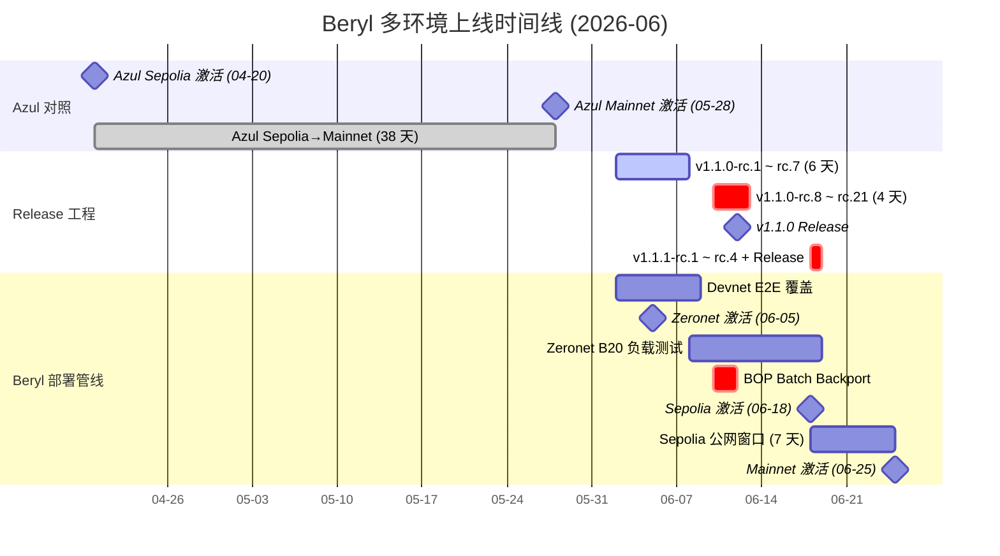
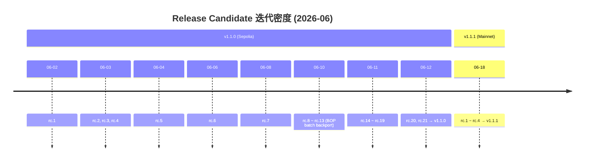
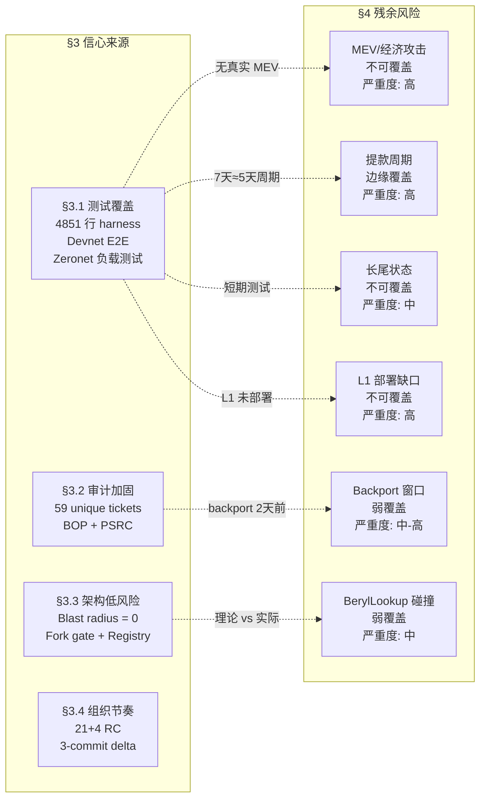

# Sepolia 短测试窗口与上线信心来源分析

## Metadata

| Field | Value |
|-------|-------|
| topic | Sepolia 短测试窗口与上线信心来源分析 |
| project_slug | `base-beryl-vs-azul` |
| topic_slug | `sepolia-window-confidence` |
| multica_issue_id | `7f357aad-260d-4ddd-afb6-89274cd67208` |
| round | 2 |
| status | draft |
| github_repo | `Whisker17/multica-research` |
| artifact_paths.outline | `base-beryl-vs-azul/outlines/sepolia-window-confidence.md` |
| artifact_paths.draft | `base-beryl-vs-azul/research-sections/sepolia-window-confidence/drafts/round-2.md` |
| artifact_paths.final | `base-beryl-vs-azul/research-sections/sepolia-window-confidence/final.md` |

## Draft Metadata

| Field | Value |
|-------|-------|
| draft_round | 2 |
| outline_commit | `afdcd12786f8e2ab7840807e298ea68f604b965f` |
| code_baseline | Mainnet v1.1.1 (`01e732cdbae0c624d652da9e608d7d3fe0f9c74b`), Sepolia v1.1.0 (`a3c3011b16dae73aaea455ec0a5ff614e65b7d0a`), Azul baseline v1.0.1 (`955a18b189196c6f663235140180e5bcf51cd044`) |
| local_codebase | `/Users/whisker/Work/src/networks/base/base` |
| items_covered | multi-env-timeline, confidence-testing, confidence-audit, confidence-architecture, confidence-organization, residual-risk-checklist |
| fields_investigated | devnet_beryl_coverage, zeronet_activation, zeronet_load_testing, sepolia_scheduling, sepolia_activation, mainnet_scheduling, mainnet_activation, rc_iteration_density, azul_timeline_comparison, total_testing_window, harness_structure, harness_coverage_domains, devnet_e2e_scope, load_test_infra, load_test_parameters, load_test_b20_pipeline, test_gap_analysis, bop_ticket_count, psrc_ticket_count, total_audit_tickets, cobalt_exclusion_caveat, audit_fix_distribution, audit_fix_timeline, backport_batch_pattern, audit_coverage_assessment, blast_radius_conclusion, fork_gate_mechanism, activation_registry_gate, additive_architecture, rollback_capability, scope_size_argument, architecture_limitation, independent_release, rc_iteration_pattern, sepolia_mainnet_delta, activation_date_commit_pattern, status_page_monitoring, mev_untestable, withdrawal_cycle_gap, deployment_evidence_gaps, zeronet_vs_mainnet_attack_surface, long_tail_state, late_audit_remediation, beryl_lookup_residual, post_mainnet_watchlist |
| diagrams_produced | multi-env-timeline-gantt, confidence-risk-balance, rc-iteration-density |

---

## §1 Executive Summary

Base 在 Sepolia 公网测试仅 7 天（2026-06-18 激活 → 2026-06-25 主网激活）后即上线 Beryl 硬分叉。与 Azul 升级的 38 天 Sepolia→Mainnet 窗口（2026-04-20 → 2026-05-28）相比，Beryl 窗口缩短 5.4 倍。然而，将 7 天孤立看待会产生误导——Beryl 的上线信心并非仅来自 Sepolia 窗口，而是构建在一条多环境测试管线之上：从 2026-06-02 首个 RC 开始经历 Devnet E2E 覆盖、Zeronet 激活与负载测试、Sepolia 发布三个递进阶段，总测试周期约 23 天。

**四大信心来源**：
1. **测试覆盖深度**：11 个 Beryl 专项测试文件（4,851 行）覆盖 activation、B20 全链路、PolicyRegistry、安全边界；Devnet E2E 覆盖 precompile 调用路径；负载测试基础设施在 Zeronet（100 senders / 20M GPS）和 Sepolia（200 senders / 60M GPS）两个环境运行。
2. **审计加固密度**：v1.0.1→v1.1.1 tag range 内 59 个 unique 审计票据（57 BOP + 2 PSRC），backport 批次集中在 v1.1.0 release 前 1-2 天完成。
3. **架构低风险（B20/precompile 子系统）**：WHI-247 结论——对标准以太坊 precompile 地址空间 blast radius 为零；`beryl()` = `azul()` 静态集不变；B20/precompile 子系统（63/141 commit）全部通过 fork 门控 + ActivationRegistry 动态安装，附加不修改。非 precompile 域（Reth V2 8 commit、Prover-Service 43 commit、CI/Test/Governance 27 commit）风险面独立，由 WHI-251 和生产运维数据约束。
4. **组织与发布节奏**：v1.1.0 经历 21 个 RC（10 天），v1.1.1 仅 4 个 RC（当天）且只差 3 个 commit；激活日期通过独立 commit 设定，保留最后一刻推迟的能力。

**残余风险摘要**：7 天窗口存在不可回避的覆盖盲区——MEV/经济攻击面在无真实价值的测试网上不可观测；提款 5 天周期的首次完整验证在 7 天窗口内刚好完成但缺乏冗余；审计修复在 release 前 1-2 天密集落入；长尾状态累积效应需要数月才能暴露。§4 将系统列举至少 8 个独立风险项，形成对信心来源的实质性对抗挑战。

---

## §2 多环境上线时间线

### 2.1 Beryl 完整部署管线

7 天 Sepolia 公网窗口并非 Beryl 的完整测试周期。Beryl 的部署管线遵循 Devnet → Zeronet → Sepolia → Mainnet 四阶段递进模式，每个阶段有独立的验证目标：

| 阶段 | 日期 (UTC) | 关键事件 | Commit / PR 证据 | 验证目标 |
|------|-----------|---------|-----------------|---------|
| RC 起始 | 2026-06-02 | v1.1.0-rc.1 发布 | tag `v1.1.0-rc.1` | 功能冻结，进入 release 候选 |
| B20 Load Test 框架 | 2026-06-02 | B20 workload 添加到 load test 基础设施 | PR #3050 | 负载测试能力就位 |
| Zeronet 激活 | 2026-06-05 17:00 | Beryl fork 在 Zeronet 激活 | `bb831a49c` (#3214) / `ea140129a` (#3213), timestamp `1780678800` | 首个公共环境 fork 激活验证 |
| Devnet E2E | 2026-06-08 | Beryl precompile E2E 测试覆盖合入 | `092517562` (#3104) | Precompile 调用路径端到端验证 |
| Zeronet B20 激活 | 2026-06-08 | Zeronet 上 B20 激活用于负载测试 | `296a09ffe` (#3266) | B20 token 全链路负载验证 |
| BOP Batch Backport | 2026-06-10 | BOP Batch 4/6 + PSRC backport 集中合入 | #3423, #3447, #3416, #3395, #3396 | 审计修复集成到 release 分支 |
| Sepolia 调度 | 2026-06-10 | Sepolia Beryl 激活时间戳设定 | `11da71ece` (backport of #3399) | 公网升级调度确认 |
| Zeronet Config | 2026-06-11 | Zeronet 负载测试配置合入 | `a6c14c860` (#3474) | 负载测试参数固化 |
| RC 密集迭代 | 2026-06-10~12 | v1.1.0-rc.8 至 rc.21（4 天 14 个 RC） | tags `v1.1.0-rc.8` ~ `v1.1.0-rc.21` | 审计修复后密集重构建验证 |
| v1.1.0 Release | 2026-06-12 | Sepolia 正式 release | tag `v1.1.0` (`a3c3011b`) | Sepolia 部署版本定稿 |
| Sepolia 激活 | 2026-06-18 18:00 | Beryl fork 在 Sepolia 激活 | timestamp `1781805600`; [status.base.org](https://status.base.org) 2026-06-12 公告确认 Sepolia Beryl 于 2026-06-18 18:00 UTC 激活，要求 v1.1.0+ | 公网 fork 激活 |
| v1.1.1 RC → Release | 2026-06-18 | v1.1.1-rc.1~rc.4 + v1.1.1 当天发布 | tags `v1.1.1-rc.1` ~ `v1.1.1`, `v1.1.1` = `01e732cd` | 主网版本构建（仅 3 commit delta） |
| B20 Pipeline 优化 | 2026-06-19 | B20 grant/mint/burn 负载管线优化 | `2debf7c1b` | 负载测试持续改进（Sepolia 激活后） |
| Mainnet 激活 | 2026-06-25 18:00 | Beryl fork 在 Mainnet 激活 | `4e84ba3d1` (#3627), timestamp `1782410400`; [status.base.org](https://status.base.org) 截至 2026-06-21 尚未发布 Mainnet Beryl 公告（code timestamp `config.rs:340` 为权威确认） | 主网上线 |

**总测试周期**：从首个 RC (2026-06-02) 到 Mainnet 激活 (2026-06-25) 为 **23 天**；从 Zeronet 激活 (2026-06-05) 到 Mainnet 激活为 **20 天**。

### 2.2 Azul vs Beryl 时间线对照

| 阶段 | Azul 日期 | Azul 证据 | Beryl 日期 | Beryl 证据 | 窗口差异 |
|------|----------|----------|-----------|-----------|---------|
| Devnet E2E | — | — | ≤2026-06-08 | #3104 (`092517562`) | Azul 无独立 devnet 证据 |
| Zeronet 激活 | — | — | 2026-06-05 | #3214 (`bb831a49c`), ts `1780678800` | Azul 无独立 zeronet 证据 |
| Sepolia 激活 | 2026-04-20 18:00 | `config.rs:412`, ts `1_776_708_000` [^azul-sepolia] | 2026-06-18 18:00 | `11da71ece`, ts `1781805600` | — |
| Mainnet 激活 | 2026-05-28 18:00 | `config.rs:340`, ts `1_779_991_200` [^azul-mainnet] | 2026-06-25 18:00 | `4e84ba3d1` (#3627), ts `1782410400` | — |
| **Sepolia→Mainnet 窗口** | **~38 天** | 2026-04-20 → 2026-05-28 | **~7 天** | 2026-06-18 → 2026-06-25 | **5.4× 缩短** |

[^azul-sepolia]: 引用 `base-azul-upgrade/research-sections/base-strategy-azul-overview/final.md` L430。code (`config.rs:412`) 与 spec (`overview.md:21`) 双重确认。
[^azul-mainnet]: 引用同上 L431。code 端 (`config.rs:340`) 设为 `1_779_991_200`；spec 端在 Azul 研究撰写期（2026-05-17）标 TBD（commit `5e3a68de0` 写回）。Azul mainnet 已实际激活——Beryl 以 v1.0.1 Azul tag 为 diff 起点，因此 2026-05-28 视为已确认日期。详见 §8 双口径分析。

### 2.3 为何不可简单类比

Azul 与 Beryl 的 Sepolia→Mainnet 窗口差异（38 天 vs 7 天）不宜直接类比，原因在于：

1. **变更性质不同**：Azul 涉及从 OP Stack 脱离、Multiproof 架构、Osaka EVM spec 等深层协议变更；Beryl 的用户可见风险面主要集中在 B20/precompile 子系统。按 WHI-245 §4.1 taxonomy，141 个 Beryl 功能 commit 的域分布为：B20/precompile 子系统 63 个 commit（B20-Token-Core 18, B20-Asset 14, B20-Factory 10, PolicyRegistry 4, ActivationRegistry 1, Precompile-Infra 11, EVM-Integration 5），这些均为附加式 + ActivationRegistry 门控变更，blast-radius-zero 论证在此成立；Protocol-RethV2 8 个 commit（执行层 storage 与 state-root pipeline，风险面由 WHI-251 独立分析）；Prover-Service 43 个 commit（基础设施重构，非运行时交易路径）；CI-Tooling 14 + Test-Infra 5 个 commit（构建/测试基础设施）；Activation-Governance 6 + EIP-8130 2 个 commit（fork 调度与协议层门控）。因此，Beryl 并非"纯 precompile 附加层"，但其用户可见风险面——B20 precompile——确实为附加式设计，不触及共识/derivation/sequencer 核心路径。
2. **Beryl 有 Azul 不具备的前置测试阶段**：Devnet E2E + Zeronet 激活与负载测试为 Beryl 提供了 Sepolia 之前约 13 天的验证时间（2026-06-05 ~ 2026-06-18）。
3. **架构风险等级不同**：Beryl 的 B20/precompile 子系统 blast radius = 零（WHI-247）；Reth V2 变更（8 commit）影响 storage/state-root pipeline 但有 WHI-251 独立风险分析覆盖和生产运维数据支撑。Azul 则修改了 EVM handler 和 derivation 管线。
4. **审计介入密度不同**：Beryl 在 v1.0.1→v1.1.1 range 内有 59 个 unique 审计票据，反映了专项外部审计对 B20 precompile 的集中覆盖。

### 2.4 多环境上线时间线图



---

## §3 信心来源拆解

### §3.1 测试覆盖深度

#### 3.1.1 Beryl Test Harness

Beryl 在 `actions/harness/tests/beryl/` 目录下维护专项测试套件，共计 **11 个文件、4,851 行代码**（统计基于 v1.1.1 `01e732cd`）：

| 测试文件 | 行数 | 覆盖域 |
|---------|------|--------|
| `b20.rs` | 975 | B20 token 核心：mint, burn, transfer, approve, transferFrom, pausability |
| `policy_registry.rs` | 733 | PolicyRegistry precompile：blocklist/allowlist 策略注册、admin 权限模型 |
| `env.rs` | 657 | 环境测试：precompile 在 fork 门控前后的行为差异、disabled 状态调用 |
| `security.rs` | 549 | 安全边界：role admin 突变防护、unauthorized 调用拒绝、overflow 防护 |
| `stablecoin.rs` | 448 | B20Stablecoin variant：6 decimals、currency code、variant 特定行为 |
| `factory.rs` | 433 | B20Factory：token 创建、地址推导、variant 参数、版本号验证 |
| `policy_transfer.rs` | 428 | Policy-gated transfer：执行策略在 transferFrom 中的强制执行 |
| `b20_policy.rs` | 299 | B20 与 PolicyRegistry 交互：策略应用到 token 操作的集成测试 |
| `test_helpers.rs` | 177 | 测试工具函数：共享 setup、assertion 辅助 |
| `activation.rs` | 140 | ActivationRegistry：precompile 激活/去激活控制 |
| `main.rs` | 12 | 测试入口 |

**覆盖评估**：
- **强覆盖域**：B20 token 全生命周期（mint→transfer→burn）、PolicyRegistry CRUD 与权限控制、Factory 创建与地址推导、安全边界（role mutation guard BOP-233, transferFrom executor policy BOP-227, checked_mul BOP-161, checked_sub BOP-160）。
- **中等覆盖域**：ActivationRegistry 开关控制、fork 门控前后行为差异。
- **弱覆盖域 / 缺口**：跨 precompile 复合调用序列（如 Factory create → PolicyRegistry bind → token transfer 的原子序列）、gas metering 边界条件、storage 并发写入竞态。

#### 3.1.2 Devnet End-to-End 覆盖

PR #3104（`092517562`，2026-06-08）引入了 Devnet 上的 Beryl precompile E2E 测试覆盖，验证 precompile 调用在完整 EVM 执行路径中的端到端行为（而非单元测试层面的 harness 调用）。这提供了 Beryl precompile 在真实 block production 环境中的运行验证。

#### 3.1.3 负载测试基础设施

负载测试基础设施位于 `crates/infra/load-tests/`，含 B20 workload 支持（PR #3050，2026-06-02）：

| 配置 | 文件 | Senders | Target GPS | Duration | B20 支持 |
|------|------|---------|------------|----------|---------|
| Devnet | `examples/devnet.yaml` | 100 | 20,000,000 (20M) | 30s | 已实现（commented out, weight 100） |
| Sepolia | `examples/sepolia.yaml` | 200 | 60,000,000 (60M) | 60s | 已实现（commented out, weight 未配置） |

**关键观察**：
- Devnet 配置已包含 B20 precompile transfer 类型（`type: b20`），可通过 factory auto-create 或指定合约地址运行。
- Sepolia 配置在提交时仅启用了 `transfer`（weight: 100），B20 和 swap 类型均为 commented out 状态。
- Zeronet B20 负载测试由独立 commit 驱动（`296a09ffe` #3266, 2026-06-08; `a6c14c860` #3474, 2026-06-11），专门用于 B20 在 Zeronet 上的负载验证。
- B20 pipeline 优化（`2debf7c1b`，2026-06-19）在 Sepolia 激活后继续改进 grant/mint/burn 提交管线。

#### 3.1.4 测试覆盖缺口

| 缺口 | 描述 | 影响评估 |
|------|------|---------|
| Sepolia 负载测试未启用 B20 | `sepolia.yaml` 中 B20 类型为 commented out，意味着 Sepolia 公网上的负载测试可能未包含 B20 precompile 调用 | 高：Sepolia 是距主网最近的环境，B20 负载未在此验证 |
| 跨 precompile 复合序列 | Test harness 缺乏 Factory → PolicyRegistry → Token 的跨 precompile 原子序列测试 | 中：单独覆盖充分，但组合行为可能有未覆盖的边缘 |
| Gas metering 边界 | 无专门的 gas metering 极限测试（如接近 gas limit 的 precompile 调用） | 中：可能影响大规模批量操作 |
| Storage 并发竞态 | Harness 测试为单线程执行，未验证并发 block production 中的 storage 竞态 | 中：EIP-2200/2929 gas 语义在并发场景下的行为未被直接测试 |

### §3.2 审计加固密度

#### 3.2.1 审计票据推导规则

审计票据计数遵循严格、可复现的方法论：

1. **Tag range**: `git log v1.0.1^{}..v1.1.1^{} --format="%H %s%n%b"` — 仅限 `v1.0.1` (`955a18b1`) 至 `v1.1.1` (`01e732cd`) 之间的 commit。
2. **Ancestor constraint**: 仅计入 `v1.1.1^{}` 的祖先 commit。不计入 branch-only commit。
3. **De-duplication**: 同一 BOP-xxx / PSRC-xx 出现在多个 commit（原始 fix + backport squash）时，仅计一次 ticket ID。
4. **Batch expansion**: 单个 commit 引用多个 ticket ID 时（如 BOP Batch 6 #3447），逐个展开并各计一次。
5. **Full message scan**: 检查 commit subject + body（非仅 oneline），因 squash/backport commit body 中包含原始 ticket 引用。
6. **Cobalt exclusion**: WHI-245 §3.2 排除表中的 Cobalt-only commit 不作为 Beryl 运行时审计加固证据。

**Derivation command** (POSIX-compatible):

```bash
git log v1.0.1^{}..v1.1.1^{} --format="%H %s%n%b" \
  | grep -E -o "(BOP-[0-9]+|PSRC-[0-9]+)" \
  | sort -u
```

#### 3.2.2 票据计数

**57 unique BOP tickets**: BOP-155, BOP-160, BOP-161, BOP-170, BOP-175, BOP-198, BOP-199, BOP-200, BOP-201, BOP-202, BOP-203, BOP-206, BOP-211, BOP-213, BOP-216, BOP-217, BOP-219, BOP-223, BOP-225, BOP-226, BOP-227, BOP-229, BOP-231, BOP-232, BOP-233, BOP-237, BOP-238, BOP-241, BOP-242, BOP-246, BOP-273, BOP-276, BOP-284, BOP-285, BOP-286, BOP-287, BOP-289, BOP-290, BOP-291, BOP-292, BOP-294, BOP-295, BOP-296, BOP-297, BOP-298, BOP-299, BOP-328, BOP-337, BOP-346, BOP-349, BOP-350, BOP-356, BOP-359, BOP-360, BOP-378, BOP-380, BOP-382.

**2 unique PSRC tickets**: PSRC-26, PSRC-27.

**合计: 59 个 unique 审计票据。**

#### 3.2.3 排除票据

| 排除票据 | Commit | 排除原因 | 验证方式 |
|---------|--------|---------|---------|
| PSRC-29 | `cb2f413ae` | 仅存在于 `origin/ericliu/bop-391-fix` 分支，非 `v1.1.1^{}` 祖先 | `git merge-base --is-ancestor cb2f413ae 01e732cd` → false |
| #3426 (Cobalt-scoped) | `526d5361c` | WHI-245 §3.2 排除表分类为 Cobalt-only；`cobalt_timestamp: None` 运行时不可达 | 引用 `beryl-scope-inventory/final.md` L356, L492, L504 |

**#3426 Cobalt caveat**：commit `526d5361c`（"backport PSRC precompile fixes to v1.1.0 #3426"）虽为 `v1.1.1^{}` 的祖先，但包含 Cobalt provider/dispatch 分支代码。该代码路径因 `ChainConfig::mainnet().cobalt_timestamp == None`（v1.1.1 @ `config.rs:354`）和 `ChainConfig::sepolia().cobalt_timestamp == None`（v1.1.1 @ `config.rs:428`）而运行时不可达。此 commit 的 commit message 不含具体 PSRC-xx ticket ID，因此不影响票据计数，但须显式标注：**此 commit 为 Cobalt-scoped，不计入 Beryl 运行时审计信心**。

#### 3.2.4 审计修复域分布

基于 commit 变更文件路径的域分布分析：

| 变更域 | 代表性票据 | 关键文件路径 |
|--------|----------|-------------|
| B20 Token Core (roles, transfer, burn, mint) | BOP-227, BOP-226, BOP-160, BOP-161, BOP-211, BOP-233 | `crates/common/precompiles/src/common/ops/{transferable,roles}.rs` |
| B20 Asset (multiplier, metadata, decimals) | BOP-231, BOP-237, BOP-238, BOP-241, BOP-246 | `crates/common/precompiles/src/b20_asset/{dispatch,token,abi}.rs` |
| B20 Factory (creation, address derivation, events) | BOP-216, BOP-225, BOP-229, BOP-242 | `crates/common/precompiles/src/b20_factory/{dispatch,storage}.rs` |
| PolicyRegistry (disabled view, dispatch) | BOP-232 | `crates/common/precompiles/src/policy/dispatch.rs` |
| Precompile Storage (checkpoint, hashmap, error, gas) | BOP-350 + batch fixes | `crates/common/precompile-storage/src/{hashmap,evm,error}.rs` |
| Precompile Macros (contract, layout, accounting) | batch fixes | `crates/common/precompile-macros/src/{contract,layout,precompile,accounting}.rs` |
| Activation Governance (admin addresses) | BOP-382 | `crates/common/chains/src/config.rs`, `crates/execution/chainspec/src/spec.rs` |

**分布评估**：审计票据覆盖了 B20 体系的全部核心组件（Token Core、Asset、Factory、PolicyRegistry）以及底层基础设施（precompile-storage、precompile-macros）。覆盖面广泛，但集中度高——绝大多数票据针对 B20 precompile 域，协议层（Reth V2、EVM handler）和 Activation Governance 的审计覆盖相对稀薄。

#### 3.2.5 审计修复时间密度

| 日期 | 事件 | 审计相关 commit |
|------|------|----------------|
| 2026-05-27 ~ 06-02 | 审计修复初始合入 | BOP-155~BOP-246 等原始修复 (约 20 commit) |
| 2026-06-10 | Batch backport 集中日 | #3395 (BOP backport), #3396 (BOP follow-up), #3416 (BOP fixes), #3423 (BOP Batch 4), #3426 (PSRC backport, Cobalt-scoped), #3447 (BOP Batch 6) |
| 2026-06-11 | Backport 尾声 | BOP-350 (#3454), BOP-382 (#3463) |
| 2026-06-12 | v1.1.0 Release | tag `v1.1.0` — Sepolia 版本定稿 |

**关键发现**：2026-06-10 是 backport 密集日，至少 6 个 backport commit 在这一天合入 `releases/v1.1.0` 分支。v1.1.0 release 在 2 天后（2026-06-12）发布。这意味着 **审计修复与 Sepolia release 之间的验证窗口仅 1-2 天**（含 RC 密集迭代 rc.8~rc.21）。虽然 RC 密集迭代提供了快速回归验证，但 backport 的集中程度本身构成残余风险（见 §4.1）。

### §3.3 架构低风险论证

#### 3.3.1 Blast Radius = 零

WHI-247（`beryl-precompile-infra/final.md`）的核心结论：

> 对标准以太坊 precompile 地址范围（`0x01`–`0x12`、`0x100` 等），blast radius 为**零**——`PrecompilesMap::get()` 优先检查静态 precompile map，动态 lookup 仅作为 fallback（`alloy-evm/precompiles.rs:484-501`），且静态集合不变（`beryl()` = `azul()`）。

这意味着：Beryl 升级不会改变任何现有 EVM 交易的执行行为。所有 Beryl 之前存在的 precompile（ecRecover, SHA-256, RIPEMD-160 等）的调用路径完全不变。

#### 3.3.2 Fork 门控机制

Beryl 的新增 precompile 通过双重门控安装：

1. **Fork 门控**：`install_with_observer()` 中 `>= BaseUpgrade::Beryl` 条件——Beryl precompile（B20Factory, BerylLookup, PolicyRegistryPrecompile, ActivationRegistry）仅在 Beryl 激活后安装。
2. **ActivationRegistry 二级门控**：每个 Beryl precompile 的激活状态可通过 ActivationRegistry 独立控制，无需硬分叉即可运行时禁用单个 precompile。

#### 3.3.3 附加式架构（限定于 B20/precompile 子系统）

B20/precompile 子系统的变更模式为纯附加：

- **静态集不变**：`beryl()` 函数直接返回 `azul()`——标准 precompile 集合在 Beryl 激活前后完全相同。
- **动态集附加**：4 个 Beryl-native precompile 通过动态安装引入，占据独立的地址空间（B20 编码地址 `0xb2` + 9 零字节 + variant 判别值）。
- **B20/precompile 不修改既有路径**：WHI-245 §4.1 taxonomy 识别 63 个 B20/precompile 域 commit（B20-Token-Core 18, B20-Asset 14, B20-Factory 10, PolicyRegistry 4, ActivationRegistry 1, Precompile-Infra 11, EVM-Integration 5），全部为附加式、fork 门控变更。blast-radius-zero 结论适用于此子系统。

**Beryl 的非 precompile 变更域**：WHI-245 同时记录了 Protocol-RethV2（8 commit，执行层 storage/state-root pipeline + flashblocks backport）、Prover-Service（43 commit，gRPC→JSON-RPC 重构，非运行时交易路径）、CI-Tooling/Test-Infra（19 commit，构建和测试基础设施）、Activation-Governance（6 commit，fork 调度和 chainspec）、EIP-8130（2 commit，tx type 0x7D 保守门控）。blast-radius-zero 结论不适用于这些域——特别是 Protocol-RethV2 涉及执行客户端 storage 和 state-root pipeline 变更，其风险面由 WHI-251 独立分析覆盖。总体而言，B20/precompile 占据用户可见风险面的主导地位（63/141 = 45% commit 数，但涵盖全部新增用户可交互 precompile），而 Reth V2/prover-service 的风险由独立研究和生产运维数据约束。

#### 3.3.4 可回退性

ActivationRegistry 提供运行时回退能力：通过 `setActivation(address, false)` 可禁用单个 precompile 而无需硬分叉。这为主网上线后发现问题时提供了非破坏性的应急手段。

#### 3.3.5 架构论证的局限

架构低风险论证存在以下限制：

1. **BerylLookup 地址拦截残余风险**：满足 B20 结构编码的非 B20Factory 部署地址会被 BerylLookup 拦截。虽为预期设计选择，但影响面在主网真实部署中可能非零且不可预测（WHI-247 已识别）。
2. **动态安装与静态集的交互边界**：`PrecompilesMap::get()` 的 static-first / dynamic-fallback 逻辑在极端情况下（如 EIP-2929 warm/cold 状态跨静态-动态边界）的行为未被显式测试。
3. **ActivationRegistry 本身的安全性**：作为门控机制的 ActivationRegistry 自身的 admin 权限模型和存储安全是 B20 体系的单点依赖。

### §3.4 组织与发布节奏

#### 3.4.1 独立发布控制权

Beryl 是 Base 从 OP Stack 脱离后的第二次独立升级（首次为 Azul）。脱离 OP Stack 后，Base 不再受 OP Stack release 节奏约束，可自主控制升级时间表。这赋予了 Base 更高的发布灵活性——包括在充分准备后选择更短的公网窗口。

#### 3.4.2 Release Candidate 迭代密度

| Release | RC 数量 | 时间跨度 | 日均 RC | 关键日期 |
|---------|---------|---------|---------|---------|
| v1.1.0 (Sepolia) | 21 个 | 10 天 (2026-06-02 ~ 2026-06-12) | 2.1 | rc.1~rc.7 (06-02~06-08): 基础迭代; rc.8~rc.21 (06-10~06-12): 审计 backport 后密集验证 |
| v1.1.1 (Mainnet) | 4 个 | 1 天 (2026-06-18) | 4.0 | 当天从 rc.1 到正式 release |



**解读**：v1.1.0 的 21 个 RC 反映了 release 工程的高迭代密度——每个 RC 代表一次完整的 build + test 循环。06-10~06-12 的密集迭代（4 天 14 个 RC）与审计 backport 时间吻合，表明 backport 后经历了快速的回归验证。

#### 3.4.3 v1.1.0→v1.1.1 Minimal Delta

v1.1.0 到 v1.1.1 仅包含 3 个 commit：

| Commit | 标题 | 性质 |
|--------|------|------|
| `d21284244` | `chore(release): set version to 1.1.1` (#3624) | 版本号更新 |
| `4e84ba3d1` | `chore(common): set mainnet activation date` (#3627) | Mainnet 激活时间戳设定 |
| `01e732cdb` | `Backport PR #3603 to releases/v1.1.0` (#3634) | 单个 backport |

这意味着 Sepolia 版本（v1.1.0）与 Mainnet 版本（v1.1.1）的功能代码几乎完全相同——差异仅为激活时间戳、版本号和一个 backport。这极大地降低了 Sepolia→Mainnet 过渡中引入新问题的概率。

#### 3.4.4 灵活激活日期机制

激活日期通过独立 commit 设定：
- Sepolia: `11da71ece` (backport of #3399), 2026-06-10 合入
- Mainnet: `4e84ba3d1` (#3627), 2026-06-18 合入

这种机制使 Base 团队在发现问题时可以通过发布新 release（仅修改激活时间戳）来推迟上线，无需修改功能代码。v1.1.1 的 4 个 RC 在当天完成（2026-06-18），说明团队在 Sepolia 激活当天即做出了 Mainnet 上线决策。

---

## §4 残余风险与待主网复核

本节独立于 §3 信心来源，从对抗视角系统评估 7 天 Sepolia 窗口的真实残余风险。目标不是否定 §3 的信心来源，而是识别这些信心来源无法覆盖的盲区。

### §4.1 残余风险评估表

| # | 风险项 | 严重度 | Sepolia 窗口覆盖能力 | 需主网复核？ | 首次可观测时间 | 信心来源挑战 |
|---|--------|--------|---------------------|-------------|---------------|-------------|
| 1 | MEV/经济攻击面 | **高** | **不可覆盖** | 是 | 上线后即刻 | 挑战 §3.1 测试覆盖：所有测试环境均无真实 MEV 生态 |
| 2 | 提款 5 天周期覆盖 | **高** | **边缘覆盖** | 是 | 上线后 ~5 天 | 挑战 §3.1 测试时长：7 天窗口内 5 天提款周期的首次完整验证刚好完成但缺乏冗余 |
| 3 | 3 个 L1 部署证据缺口 | **高** | **不可覆盖** | 是 | 上线后即刻 | 挑战整体验证：WHI-251 识别的部署证据在 Sepolia 窗口期间无法确认 |
| 4 | 审计 backport 验证窗口极短 | **中-高** | **弱覆盖** | 是 | 上线后即刻 | 挑战 §3.2 审计密度：06-10 backport 到 06-12 release 仅 2 天 |
| 5 | Zeronet 与主网经济攻击面差距 | **中** | **不可覆盖** | 是 | 上线后即刻 | 挑战 §3.1 负载测试：无真实价值锁定，无真实用户行为模式 |
| 6 | 长尾状态累积效应 | **中** | **不可覆盖** | 是 | 上线后数月 | 挑战 §3.1 测试时长：B20 token 持久使用的 storage bloat 和跨 precompile 交互累积需数月暴露 |
| 7 | BerylLookup 地址拦截影响面 | **中** | **弱覆盖** | 是 | 上线后即刻 | 挑战 §3.3 架构低风险：理论零风险 vs 实际 B20 编码碰撞概率未知 |
| 8 | Sepolia 负载测试 B20 缺失 | **中** | **自身缺口** | 否 | N/A | 挑战 §3.1 测试覆盖：Sepolia 配置中 B20 类型为 commented out |

### §4.2 风险详解

#### 4.2.1 MEV/经济攻击面不可测

Sepolia 无真实 MEV 生态——无 MEV-boost relays、无 Flashbots bundles、无真实套利者。7 天公网窗口无法暴露以下场景：

- B20 precompile 操作（如 factory create → token transfer）被 MEV searcher 夹击（sandwich attack）的行为
- PolicyRegistry 状态变更（如 blocklist 添加）与待执行 B20 transfer 之间的 MEV 竞争
- 大额 B20 token mint/burn 操作的 front-running 经济影响

这是 Sepolia 测试的结构性盲区，与窗口长度无关——即使 38 天也无法解决。

#### 4.2.2 提款 5 天周期覆盖边缘

WHI-251 分析了 Beryl 的提款最终确认窗口从 7 天缩短至 5 天（single-proof 路径）。7 天 Sepolia 窗口意味着：

- 首次完整的 5 天提款验证周期在 Sepolia 激活后第 5 天（2026-06-23）才能完成——距主网激活仅 2 天
- 如果首笔提款不在 Beryl 激活后即刻发起，则首次完整周期可能在主网激活后才完成
- 没有第二次完整周期的冗余验证机会

此外，WHI-251 识别了 3 个 L1 部署证据缺口（见 4.2.3），进一步限制了提款窗口变更的验证信心。

#### 4.2.3 L1 部署证据缺口（来自 WHI-251）

WHI-251（`protocol-reth-withdrawal/final.md`）识别了 3 个部署证据缺口，截至研究撰写时（2026-06-21）均尚未解决：

| # | 缺口 | 描述 | 预期解决时间 |
|---|------|------|-------------|
| (a) | 新 AggregateVerifier 部署地址 | 5 天窗口的合约部署地址未确认 | Beryl 主网激活前 |
| (b) | DisputeGameFactory setImplementation tx | 注册新的 finalization window 参数的 L1 交易未确认 | Beryl 主网激活前 |
| (c) | 5 天 after-state eth_call 确认 | 部署后通过 eth_call 确认 `SLOW_FINALIZATION_DELAY` = 432,000 秒 | 部署后 |

**结论**：源码级证据充分——`FaultDisputeGame.sol` 中 `SLOW_FINALIZATION_DELAY` 从 604,800 改为 432,000。但 L1 链上部署尚未发生。这是时序性限制，非技术不确定性。

#### 4.2.4 审计 Backport 验证窗口极短

§3.2.5 已揭示 backport 时间密度：2026-06-10 至少 6 个 backport commit 合入，2026-06-12 v1.1.0 发布——验证窗口仅 2 天。

这 2 天内的验证手段主要是 RC 密集迭代（rc.8~rc.21），而非独立的手动测试。虽然每个 RC 代表完整 build + test，但 **自动化测试套件本身的覆盖盲区**（见 §3.1.4）在 backport 后同样存在。审计修复与 release 的时间耦合意味着：如果 backport 引入了 regression，可能仅有 1-2 天的机会通过 RC 迭代发现。

具体 backport 批次：
- #3395: BOP precompile fixes（precompile-storage error, hashmap）
- #3396: BOP follow-up fixes（precompile-macros accounting）
- #3416: BOP fixes backport（precompile-macros precompile, precompile-storage evm/hashmap）
- #3423: BOP Batch 4（precompile-macros contract/layout/precompile）
- #3426: PSRC backport（**Cobalt-scoped，不计入 Beryl 加固**）
- #3447: BOP Batch 6（precompile-storage evm, policy dispatch — 含 BOP-378, PSRC-26）

#### 4.2.5 Zeronet 与主网经济攻击面差距

Zeronet 负载测试（100 senders / 20M GPS / 30s duration）和 Sepolia 负载测试（200 senders / 60M GPS / 60s duration）的根本局限：

- **无真实价值锁定**：测试网 ETH 和 B20 token 无经济价值，攻击者无经济激励探索边缘行为
- **合成负载模式**：负载生成器使用固定权重分布（transfer 70% / calldata 20% / precompile 10%），不反映主网真实用户的交易模式多样性
- **时间尺度短**：30-60 秒的持续时间无法暴露 block production 在持续高负载下的退化行为
- **无跨协议交互**：缺少 DeFi 协议（Uniswap, Aerodrome 等）与 B20 precompile 的跨协议调用链测试

#### 4.2.6 长尾状态累积效应

B20 token 的持久使用将产生长期状态累积：

- **Storage slot 增长**：每个 B20 token 实例使用 `#[contract]` 宏分配的独立 storage slot 体系。随 token 持有者增长，mapping 类型 storage 的 slot 数量线性增长。Storage bloat 的性能影响需要数月真实使用才能暴露。
- **PolicyRegistry 策略累积**：blocklist/allowlist 策略的持续添加对 policy 检查性能的影响未经长期验证。
- **跨 precompile 状态耦合**：B20Factory 创建的 token 数量增长、PolicyRegistry 策略密度增长、ActivationRegistry 状态变更的累积效应的交叉影响需要长期观测。

7 天窗口内不可能暴露任何长尾状态效应。

#### 4.2.7 BerylLookup 地址拦截残余风险

WHI-247 已识别：满足 B20 结构编码（`0xb2` + 9 零字节 + variant 判别值）的地址在 Beryl 激活后会被 BerylLookup 拦截，无论该地址是否由 B20Factory 部署。这属预期设计选择，受 fork 门控和地址编码双重约束。

**残余风险**：
- 碰撞概率理论上极低（地址空间 2^160 中满足 B20 结构编码的子集极小），但在主网大规模合约部署环境中的实际概率未经量化验证
- 被拦截地址的原有合约调用将失败，且 revert 原因可能不直观（BerylLookup 返回而非原合约逻辑）
- 7 天 Sepolia 窗口中的合约部署量不足以在概率上覆盖此边缘情况

### §4.3 证据不足以证明安全的明确领域

以下领域的安全性在当前证据条件下**不能被充分证明**：

1. **B20 precompile 在真实经济环境中的安全性**：所有测试均在无真实经济价值的环境中进行。无法排除真实 MEV 环境下 precompile 操作被利用的可能性。
2. **审计修复的完整性**：59 个审计票据表明审计覆盖面广泛，但审计本身的覆盖完整性不可验证——BOP 审计可能遗漏的攻击面在 7 天 Sepolia 窗口内不可能被独立发现。
3. **提款窗口变更的 L1 部署正确性**：源码级变更（7→5 天）有证据，但 L1 合约部署和参数设定在 Beryl 主网激活前未完成。
4. **长期运行稳定性**：Storage 性能退化、PolicyRegistry 策略膨胀、跨 precompile 状态耦合等长期效应不可能在任何有限测试窗口内验证。
5. **Sepolia 公网的真实负载测试**：`sepolia.yaml` 中 B20 类型为 commented out，表明 Sepolia 公网上的负载测试可能未包含 B20 precompile 调用。B20 负载验证主要在 Zeronet 上完成。

### §4.4 待主网上线后复核清单

| # | 待观测项 | 复核条件 | 预计可观测时间 | 关联风险项 |
|---|---------|---------|---------------|----------|
| 1 | B20 precompile 首笔主网调用成功 | B20Factory.create() 或 B20 token transfer 成功上链 | 上线后即刻 | #1 MEV, #7 BerylLookup |
| 2 | PolicyRegistry 首次 blocklist 生效 | blocklist 添加后的 transfer 被正确拒绝 | 上线后即刻 | #1 MEV |
| 3 | 提款 5 天窗口首完整周期 | 首笔 Beryl 后发起的 withdrawal 成功完成 5 天等待 | 上线后 ~5 天 | #2 提款周期 |
| 4 | L1 AggregateVerifier 部署确认 | 部署地址在 L1 可查 | 上线前（预计） | #3 部署缺口 |
| 5 | DisputeGameFactory 参数确认 | `SLOW_FINALIZATION_DELAY` = 432,000 秒 via eth_call | 上线前（预计） | #3 部署缺口 |
| 6 | Zeronet→Mainnet 负载行为对照 | 主网 precompile 调用的 gas 消耗与 Zeronet 对照 | 上线后 ~1 周 | #5 经济攻击面 |
| 7 | B20 token 实例数达到 100+ | 观察 B20Factory storage 增长对 gas 消耗的影响 | 上线后 ~1 月 | #6 长尾状态 |
| 8 | 首次 ActivationRegistry 紧急禁用 | 如需使用，验证运行时禁用的 end-to-end 流程 | 事件驱动 | #7 BerylLookup |

### §4.5 信心来源与残余风险对照图



---

## §5 结论与判断框架

### 5.1 证据支持矩阵

| 信心维度 | 证据强度 | 证据类型 | 主要不确定性 | 需主网验证？ |
|---------|---------|---------|-------------|-------------|
| B20/precompile 架构隔离（blast radius = 0） | **强** | 代码分析 + WHI-247 | BerylLookup 碰撞概率；仅适用于 B20/precompile 63 commit | 低优先 |
| Reth V2 执行层变更 | **中** | WHI-251 分析 + 生产运维数据 | Storage/state-root pipeline 变更（8 commit）无 blast-radius-zero 保证 | 是 |
| B20 功能正确性 | **中-强** | 4851 行 harness + 59 审计票据 | 跨 precompile 复合序列、gas 边界 | 是 |
| 发布工程成熟度 | **强** | 21+4 RC + 3-commit delta | 无 | 否 |
| 负载承受能力 | **中** | Zeronet 负载测试 | Sepolia B20 负载未启用；合成 vs 真实负载 | 是 |
| 经济安全性 | **弱** | 无直接证据 | MEV、经济攻击面完全不可测 | 是（关键） |
| 提款窗口正确性 | **中** | 源码级确认 | L1 部署未完成；首次完整周期边缘 | 是（关键） |
| 长期稳定性 | **无** | 不适用 | 任何有限窗口不可验证 | 是（长期） |

### 5.2 判断框架

7 天 Sepolia 窗口的上线决策不应以「安全/不安全」二元判断框架评估，而应理解为一个**已知风险收益权衡**：

**支持上线的因素**（证据充分）：
- B20/precompile 子系统（63 commit）架构设计保证既有功能不受影响（blast radius = 0，附加式 + fork 门控）
- B20/precompile 占据全部新增用户可交互风险面；非 precompile 域风险有界：Protocol-RethV2（8 commit）由 WHI-251 独立分析 + 生产运维数据约束，Prover-Service（43 commit）为非运行时基础设施重构，CI/Test-Infra（19 commit）+ Activation-Governance/EIP-8130（8 commit）为辅助变更
- 发布工程高度成熟（21+4 RC，3-commit delta）
- B20/precompile 附加式变更 + ActivationRegistry 提供回退能力
- 多环境测试管线提供 23 天总测试覆盖

**保留的风险**（证据不足或不可测）：
- 真实经济环境安全性完全未验证
- 提款窗口变更的 L1 部署正确性待确认
- 审计修复与 release 的时间耦合极紧
- 长尾状态效应不可在有限窗口验证

**核心洞察**：7 天窗口的信心基础并非来自 Sepolia 公网测试本身，而是来自「B20/precompile 附加式架构 + 多环境管线 + 高密度审计 + 回退能力」的组合。7 天 Sepolia 窗口更像是部署管线的最终确认步骤，而非独立的测试阶段。这一策略的合理性建立在 Beryl 用户可见风险面（B20/precompile）的附加性质之上——blast-radius-zero 仅适用于该子系统。非 precompile 域（Reth V2、Prover-Service）的风险由独立研究（WHI-251）和生产运维数据约束，但不享有同等的架构隔离保证。如果 Beryl 涉及共识或 derivation 层修改，同样的窗口将不具备充分的信心基础。

---

## Source Coverage

| Source | Requirement | Coverage | Notes |
|--------|------------|----------|-------|
| `base/base` repo @ v1.1.1 / v1.1.0 / v1.0.1 | 时间线 commit 证据、测试代码、load test 配置 | ✅ 完整 | 所有 commit 引用含 tag + hash + PR# |
| `actions/harness/tests/beryl/*` | Beryl 专项测试 harness | ✅ 完整 | 11 文件 4851 行逐文件统计 |
| `crates/infra/load-tests/` | 负载测试基础设施 | ✅ 完整 | devnet.yaml + sepolia.yaml 参数提取 |
| git tag history (`v1.1.0*`, `v1.1.1*`) | RC 迭代密度证据 | ✅ 完整 | 21 + 4 RC 含日期 |
| WHI-245 (`beryl-scope-inventory/final.md`) | 143 commit 清单、Cobalt 排除 | ✅ 引用 | 引用 §3.2 排除表，非复述 |
| WHI-247 (`beryl-precompile-infra/final.md`) | Blast radius = 零、fork 门控 | ✅ 引用 | 引用 Executive Summary 核心结论 |
| WHI-251 (`protocol-reth-withdrawal/final.md`) | 提款 7→5 天、3 个部署缺口 | ✅ 引用 | 引用 residual_caveats 和 gap analysis |
| Azul Overview (`base-azul-upgrade/.../final.md`) | Azul 时间线 | ✅ 引用 | L430-431 引用，含双口径 caveat |
| status.base.org | 激活时间确认 | ✅ 引用 | Sepolia Beryl 激活公告（2026-06-12 发布）确认 2026-06-18 18:00 UTC + v1.1.0+ 要求，与 code timestamp `1781805600` 一致；Mainnet 公告截至 2026-06-21 尚未发布，Mainnet 日期以 code timestamp `1782410400` 为权威 |
| `base/node` releases | node 版本确认 | ⚠️ 未访问 | 次要来源；不影响本研究核心论点 |
| Base Beryl blog (blog.base.dev) | 官方上线公告 | ⚠️ 未访问 | 次要来源；时间线已由 code 证据覆盖 |

## Gap Analysis

| Gap | Impact | Mitigation |
|-----|--------|-----------|
| Sepolia B20 负载测试配置为 commented out | 中：无法确认 Sepolia 公网是否运行了 B20 负载 | 已在 §3.1.4 和 §4.1 中标注为测试缺口和残余风险 |
| Mainnet Beryl status.base.org 公告未发布 | 低：Mainnet 激活日期以 code timestamp `1782410400` + commit `4e84ba3d1` (#3627) 为权威确认；status.base.org Mainnet 公告预计在激活前发布 | Sepolia 公告已确认 (2026-06-12)；Mainnet 日期以 code 为准 |
| WHI-251 L1 部署证据未解决 | 高：3 个部署缺口在 Beryl 激活前可能解决 | 已在 §4.2.3 完整列举，待主网复核清单 §4.4 #4/#5 跟踪 |
| B20 precompile 跨协议交互（DeFi 协议 + B20）未测试 | 中：主网上线后的真实 DeFi 交互不可预测 | 已在 §4.2.5 分析，属结构性盲区 |

## Revision Log

| Round | Date | Changes |
|-------|------|---------|
| 1 | 2026-06-21 | 初始 draft：6 个 Items 全部覆盖；43 个 investigation fields 全部研究；3 个 Mermaid 图（多环境时间线 gantt、RC 迭代密度 timeline、信心来源与残余风险对照 flowchart）；8 个残余风险项（超过最低 7 个要求）；Source Coverage 8/11 完整覆盖（3 个次要来源标注为未访问） |
| 2 | 2026-06-21 | **[Major] 变更域分类修正**：§2.3、§3.3.3、§5.1、§5.2 中"141/143 commit 集中在 precompile 附加层"的不准确表述替换为 WHI-245 §4.1 taxonomy 精确分域：B20/precompile 63 commit（附加式，blast-radius-zero 成立）、Protocol-RethV2 8 commit（WHI-251 覆盖）、Prover-Service 43 commit（非运行时路径）、CI/Test-Infra 19 commit、Activation-Governance/EIP-8130 8 commit。Blast-radius-zero 论证明确限定为 B20/precompile 子系统。§5.1 证据矩阵拆分为 B20/precompile 架构隔离（强）+ Reth V2 执行层变更（中）两行。**[Minor] status.base.org 引用**：§2.1 Sepolia 和 Mainnet 激活行添加 status.base.org 引用——Sepolia 公告（2026-06-12 发布）确认 2026-06-18 18:00 UTC，与 code timestamp 一致；Mainnet 公告截至 2026-06-21 尚未发布，以 code timestamp 为权威。Source Coverage 从"⚠️ 未访问"更新为"✅ 引用"。Gap Analysis 相应更新。 |
