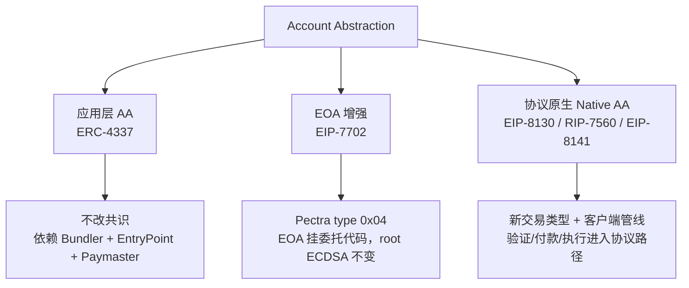
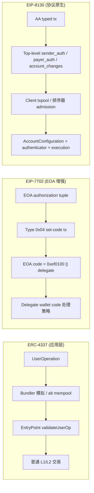
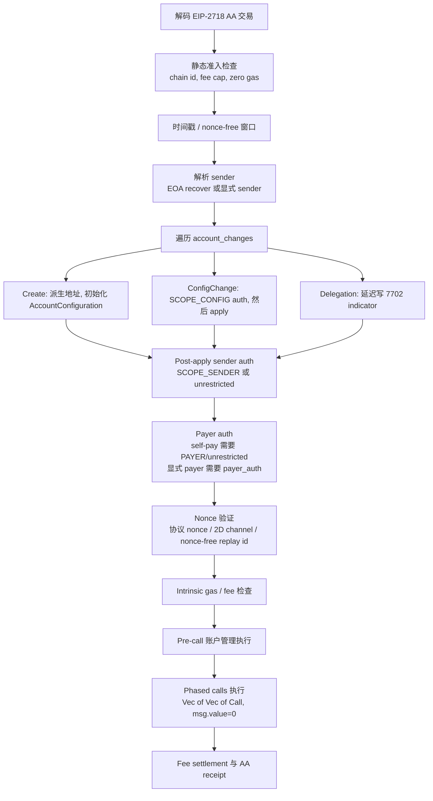
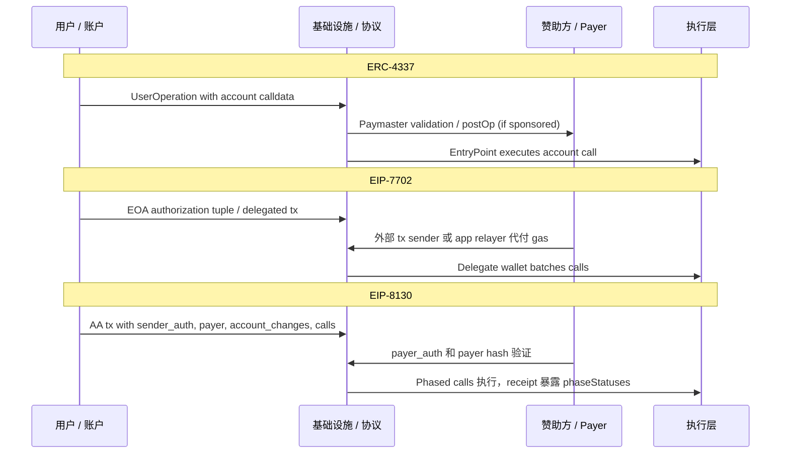
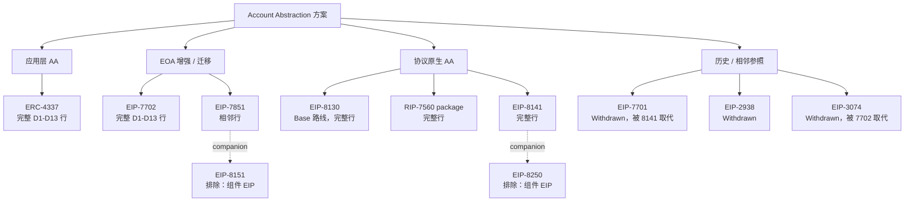
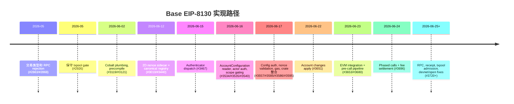
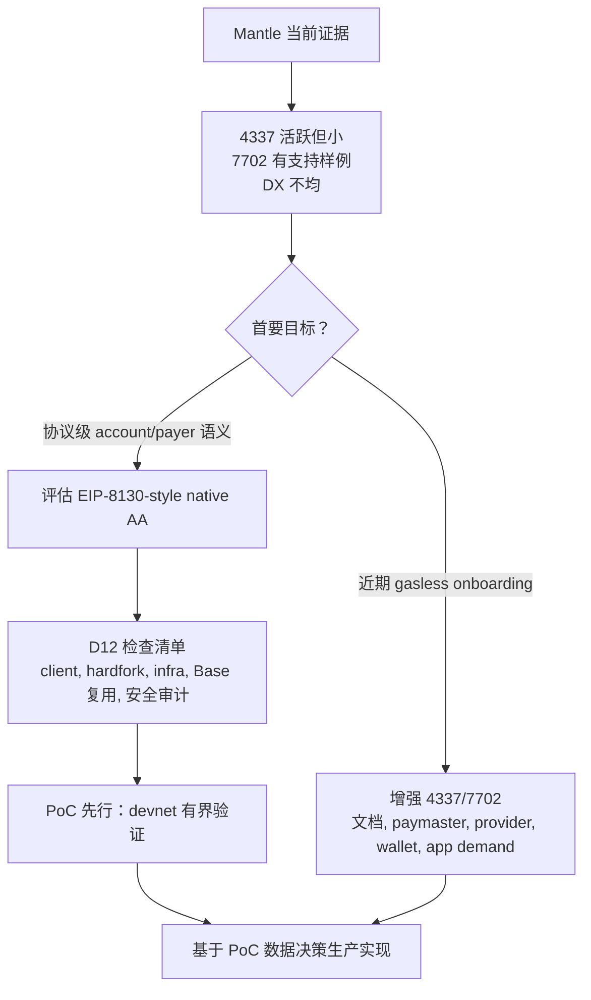

# 从 Base 的 EIP-8130 入手探索 Native AA 方案：最终调研报告

> **项目**: base-eip8130-native-aa
> **报告日期**: 2026-06-27
> **来源**: 8 个独立调研章节的主题化合成
> **语言**: zh-CN
> **报告分支**: research/base-eip8130-native-aa/final-report
> **Sections index**: `base-eip8130-native-aa/research-sections/_index.md`
> **目标读者**: Mantle 决策层（Executive Summary）、Mantle dev teams（工程科普与技术分析）

---

## Executive Summary（决策摘要）

### 给决策者的一段话

Base 正在以 EIP-8130 为核心构建协议原生 Account Abstraction（native AA）。调研表明，EIP-8130 相较于 ERC-4337 和 EIP-7702 的根本差异不是"谁更高级"，而是**验证和支付进入协议路径的深度不同**。ERC-4337 是应用层 AA（不改共识，依赖 Bundler/EntryPoint/Paymaster），EIP-7702 是 EOA 增强（让 EOA 挂委托代码，但根权限仍是 ECDSA），EIP-8130 则是协议原生 AA（把账户验证、付款、nonce、批量执行直接编入交易类型和客户端管线）。

**核心结论：Mantle 不应现在直接工程化生产实现 EIP-8130-style native AA。推荐「PoC 先行」：在 devnet 上做有界验证，生产实现放入「暂缓观察」门槛，等待 spec 稳定、Base 公开 rollout 数据、安全审计经验和钱包/provider 生态示例。**

推动 native AA 的论据不能建立在"Mantle 当前 4337/7702 效果不好"的前提上——Mantle 4337 有真实活动但量小（YTD 11,479 UserOps），7702 有基础设施支持但聚合采用证据不足。更准确的输入是"效果一般/部分指标偏弱"。Native AA 可以改善协议可见性和 txpool 控制力，但不会自动解决钱包分发、应用需求或 sponsor 经济模型的问题。

### 三档判断

| 选项 | 判定 | 理由 | 关键证据来源 |
|---|---|---|---|
| 现在实现 | **不建议作为主路径** | EIP-8130 仍是 Draft；需要 client/fork/txpool/RPC/receipt/security/tooling 全链路改造；钱包/provider 生态尚未证明可用 | S1/S3/S7/S8 |
| 暂缓观察 | **作为生产实现门槛** | 生产实现应等待：spec 稳定、Base public rollout、audit/DoS 经验、wallet/provider 示例、Mantle PoC 数据 | S5/S6/S8 |
| PoC 先行 | **主推荐** | Mantle 与 Base 同属 OP Stack 体系，Base PR catalog 提供低成本学习入口；PoC 可获取 diff sizing、native payer/account config 可行性、RPC/receipt 体验和共存经验 | S3/S7/S8 |

---

## 第一部分：工程科普——给 Dev Teams 的 AA 三层入门

### 1.1 三层 AA 分类

账户抽象方案可分为三个层级，按协议介入深度递增：

**Native AA 的严格定义**：交易有效性、账户验证、gas 支付或执行调度需要客户端/协议规则原生识别并执行，而不只靠合约和链下服务自愿配合。按此定义，ERC-4337 不是 native AA；EIP-7702 是协议级 EOA 增强但不是完整 native AA；EIP-8130/RIP-7560/EIP-8141 是完整 native AA 候选。[S1]

### 1.2 ERC-4337：应用层 AA

**一句话**：智能账户 UX 实现在协议之上，通过 UserOperation、Bundler、EntryPoint 和 Paymaster 协调账户验证与代付。

| 优势 | 劣势 |
|---|---|
| 不需要共识改动，部署门槛低 | 依赖 Bundler/alt mempool/EntryPoint 独立基础设施 |
| 生态成熟，Final ERC 状态 | Paymaster 运维成本，bundler 集中度风险 |
| 智能账户合约可灵活定义验证逻辑 | 通常需要新的智能账户地址，EOA 迁移摩擦 |
| 支持 passkey/session key/多签等 | 协议层看不到 AA 交易结构，txpool/sequencer 控制弱 |

Mantle 当前 4337 状态：2026 YTD 有 11,479 UserOps、1,107 账户、66 bundle senders、3 个 Paymaster，98.28% 为赞助交易。活跃但规模小、sponsor-heavy。[S4/S5]

### 1.3 EIP-7702：EOA 增强

**一句话**：让现有 EOA 原地址通过 type `0x04` set-code delegation 执行钱包代码，保留原地址。

| 优势 | 劣势 |
|---|---|
| 保留 EOA 原地址，用户无感迁移 | Root authority 仍是 ECDSA 私钥 |
| Final/Pectra 已上线，部署成熟 | 不定义原生 payer lifecycle/AccountConfiguration |
| 可实现 batching、sponsorship UX | 多 owner/key rotation 只能在 delegate code 中实现 |
| 与 ERC-4337 可组合 | chain_id=0 跨链 replay 风险 |

Mantle 7702 状态：op-geth 已有 type `0x04` 支持代码，RPC 中可见 live 交易样例。但 chainwide 聚合采用数据（unique authorizers、delegate targets、daily counts）未知。[S2/S5]

### 1.4 EIP-8130：协议原生 AA

**一句话**：把 sender/payer auth、AccountConfiguration、actor/scope、2D nonce、account changes、phased calls 变成 typed transaction 与客户端管线可见的协议语义。

EIP-8130 不是"又一种智能钱包合约"，而是把账户配置、验证者身份、付款关系、nonce 通道和批量执行放进 EIP-2718 交易类型。节点/排序器可以在 txpool 和 block inclusion 路径上看到这些结构。

| 核心字段 | 协议层含义 |
|---|---|
| `sender_auth` / authenticator | 验证方法对节点可见，可做结构性过滤 |
| `payer` / `payer_auth` | 赞助关系绑定到已解析 sender，不只是 app/paymaster 策略 |
| AccountConfiguration / actor / scope | 账户权限成为协议状态，非仅 delegate 逻辑 |
| 2D nonce / nonce-free expiry | 并行通道和 replay 控制进入协议 |
| `account_changes` | Create/config/delegation 写语义显式声明 |
| `Vec<Vec<Call>>` phased calls | 批量执行有原生 phase 语义和 receipt 结果 |

**8130 与 7702 的关系是 composition，不是 replacement**：8130 通过 `AccountChange::Delegation` 设置/清除 7702-style delegation indicator，但主授权模型不是复用 7702 的 `authorization_list` / `SignedAuthorization`。[S2/S3]

---

## 第二部分：EIP-8130 相较于 4337 和 7702 的原理区别与优势

> 对应用户核心问题：「EIP-8130 相较于 4337 和 7702 有什么原理上的区别和优势？」

### 2.1 根本分歧：验证和支付进入协议路径的深度

三个方案解决的不是同一层面的问题：

- **ERC-4337** 解决"如何在不改共识的情况下让智能账户被使用"——把验证放在 EntryPoint 合约，把 gas 代付放在 Paymaster 合约，把交易收集放在 Bundler。协议层看到的仍是一笔普通交易。
- **EIP-7702** 解决"如何让 EOA 也能执行智能账户逻辑"——给 EOA 挂代码指针。但根权限（私钥）不变，原生 payer/multi-owner/account config 不涉及。
- **EIP-8130** 解决"如何让协议本身理解账户验证、付款和执行结构"——交易体字段显式携带验证信息，节点可在 admission 阶段做结构性判断。

### 2.2 关键维度对比（D1-D13 精选）

| 维度 | ERC-4337 | EIP-7702 | EIP-8130 |
|---|---|---|---|
| **D1 抽象层级** | 应用层，不改共识 | 协议级 EOA 增强 | 协议原生 AA |
| **D2 协议改动** | 无 | Pectra type 0x04 | 新 tx type + txpool + RPC + receipt + EVM |
| **D3 基础设施** | 高（Bundler/EntryPoint/alt mempool/Paymaster） | 低（正常 tx 路径 + delegate wallet） | 中（client support + canonical authenticators + RPC/tooling） |
| **D4 所有权模型** | 合约自定义验证/多 owner/recovery | 残留 ECDSA root + delegate code 策略 | Actor/authenticator/scope 配置化账户 |
| **D5 Gas 代付** | Paymaster deposit/stake/postOp | 外部 sender 或 app 赞助 | 原生 `payer` 字段 + payer hash + SCOPE_PAYER |
| **D6 批量原子性** | Account calldata / wallet executor | Delegate code batching | Phased calls：phase 内 atomic，phase 间 first-failure-skip |
| **D7 Nonce/replay** | EntryPoint/account nonce lanes | Authority nonce + chain_id | 2D nonce + nonce-free expiry + replay id |
| **D10 成熟度** | Final ERC，生态成熟 | Final/Pectra 已部署 | Draft，Base 积极实现中 |
| **D12 Mantle 成本** | 低到中（已有活动） | 低（follow OP/Pectra plumbing） | 高（execution client/hardfork/txpool/RPC/receipt/安全审计） |

**关键结论**：8130 相对 4337 的优势是协议可见性和 bounded admission；代价是 client/hardfork/RPC/tooling 改造。8130 相对 7702 的优势是完整账户/付款/执行生命周期；7702 的优势是原地址迁移和部署成熟度。三者不是替代关系，而是不同深度的互补路径。[S1/S7]

### 2.3 EIP-8130 交易结构详解

EIP-8130 定义了一种新的 EIP-2718 交易类型（tx type `0x7B`），其核心字段语义如下：

| 字段 | 语义 | 安全/功能作用 |
|---|---|---|
| `sender: Option<Address>` | `None` 走 EOA recovery；`Some` 走 configured-account 认证 | 决定认证路径：裸 ECDSA vs authenticator+data |
| `nonce_key` + `nonce_sequence` | 2D compound nonce；`NONCE_KEY_MAX` 选 nonce-free | 支持并行 channel 与短窗口无 nonce 场景 |
| `expiry` | Unix 时间戳过期；nonce-free 必须非零且短窗口（10 秒） | Replay 安全边界 |
| `account_changes` | 5 类写语义：CreateEntry、InitialOwner、ConfigChange、OwnerChange、Delegation | 协议级账户管理，包括 7702-style delegation |
| `calls: Vec<Vec<Call>>` | 按 phase 分组；Call 只含 `to` + `data`，无 value | Phase 内 atomic，phase 间 first-failure-skip |
| `payer: Option<Address>` | `None` self-pay；`Some` sponsored | 原生赞助，payer hash 绑定已解析 sender |

签名域分隔是关键安全设计：sender hash 用 `tx_type || rlp(unsigned_body)` 前缀，payer hash 用独立 `payer_type || rlp(body_with_resolved_sender)` 前缀，保证 sender/payer 签名不可复用。[S3]

### 2.4 EIP-8130 验证/执行管线

Base 的实现管线已覆盖从交易类型定义到 EVM 执行的完整路径。截至 2026-06-27 核验仍有 3 个 open PR（#3698 e2e inclusion test、#3752 pending-state admission retry、#3775 codeless sender auto-delegation/TOCTOU gas budgeting），说明管线仍在活跃开发中。[S3]

### 2.5 Gas 赞助对比

[S3/S7]

---

## 第三部分：7702 之后的 Native AA 方案全景

> 对应用户核心问题：「7702 之后还有哪些比较流行的 native AA 方案？」

### 3.1 活跃候选方案一览

EIP-7702 之后，以太坊生态中有三个主要的协议原生 AA 候选方案：

| 方案 | 状态 | 设计哲学 | 验证模型 | 当前实现信号 |
|---|---|---|---|---|
| **EIP-8130** | Draft | 账户配置 + 有界认证 | 显式 authenticator，canonical set 过滤 | **Base 强实现信号**：30+ PR 已合并 |
| **RIP-7560** | Draft RIP | 把 4337 流程 native 化，面向 rollup | 账户/paymaster validation frame | 无 Base/OP 实现信号 |
| **EIP-8141** | Draft/CFI (Hegota) | Frame abstraction | VERIFY prefix，可执行 EVM 逻辑 | 无 Base 实现信号 |

### 3.2 设计哲学差异

三个方案的核心分叉在于验证面的开放程度和 DoS/mempool 控制策略：

| 维度 | EIP-8130 | RIP-7560 | EIP-8141 |
|---|---|---|---|
| 目标心智 | 账户配置 + 有界认证 | 把 4337 流程 native 化 | Frame abstraction |
| 验证面 | 显式 authenticator，canonical set 做 allowlist | 账户/paymaster validation frame | VERIFY prefix，可执行 EVM 逻辑 |
| 灵活性 | 中等：受 canonical set 限制 | 高：兼容 4337 智能账户模型 | 高：任意 user-defined validation/payment |
| DoS/mempool 成本 | 低到中：authenticator 身份显式 | 中到高：需 validation frame 规则和模拟 | 中到高：需 prefix 模拟和 gas/opcode 限制 |
| 后量子路线 | Canonical set 可新增算法 | 任意合约验证可支持 | 明确把 PQ off-ramp 写入动机 |
| OP Stack 落地 | Base 已大规模实现 | 需进一步适配 | 草案快变，短期 L2 rollout 风险高 |

[S1/S6]

### 3.3 候选方案范围图

EIP-8250（Keyed Nonces for Frame Transactions）和 EIP-8151（ECDSA-disabled aware ecRecover）被排除为独立矩阵行——它们是各自母方案的组件/companion EIP，不是独立的 native AA 候选。[S6/S7]

---

## 第四部分：Base 为什么选择 EIP-8130

> 对应用户核心问题：「Base 为什么没有选择那些方案而是选择了 8130？」

### 4.1 证据分级：严格的事实/推断分离

本报告严格沿用上游调研的证据标签纪律。关于 Base 选型动因的每一条陈述都标注为三级标签之一，**最终报告不得把推断升级为 Base 官方动因**。

| 证据等级 | 含义 |
|---|---|
| **明确陈述** (explicit-public-statement) | 公开文本直接陈述机制或对比 |
| **合理推断** (inference) | 从机制和实现信号合理综合 |
| **未发现明确理由** (unknown) | 上游调研未找到充分公开证据 |

### 4.2 Base 选择 8130 的可辩护解释

**最强可辩护解释**：Base/OP 倾向于 8130，因为它使验证方法和 payer/account 语义 top-level 且 bounded enough for OP Stack sequencer/txpool rollout。**这不等于证明 Base 正式拒绝了 RIP-7560 或 EIP-8141，也不意味着 4337/7702 失败。**

| 论据 | 证据等级 | 来源 | 置信度 |
|---|---|---|---|
| 8130 显式声明 authenticator/verifier，使验证方法对节点可见；8141 更 generic，可能需执行 tx 才知规则违反 | **明确陈述** | OP design-docs PR #378 comment | 高 |
| OP/Base design-doc 提议在 OP Stack 采用 EIP-8130 | **design-doc-signal** | OP design-docs PR #378 | 高 |
| Base 实现了广泛的 EIP-8130 pipeline：tx type → Cobalt gate → AccountConfiguration → actor auth → 2D nonce → account changes → txpool/RPC/receipt/estimateGas/phased calls | **code-pr-signal** | 30+ merged PRs in base/base | 高 |
| Base 可能偏好 bounded admission 和 top-level authenticator 可见性 | **合理推断** | 机制 + PR 推断 | 中高 |
| Base 正式拒绝 RIP-7560 | **未发现明确理由** | 未找到公开 memo | 未知 |
| Base 正式拒绝 EIP-8141 | **未发现明确理由** | OP #378 解释了取舍，但非正式拒绝 | 未知 |

[S3/S6/S7]

### 4.3 Base 实现时间线

[S3]

### 4.4 8130 vs 其他原生替代方案

| 替代方案 | 8130 可能更有吸引力的原因 | 保留的取舍 |
|---|---|---|
| RIP-7560 | Top-level authenticator/canonical set 比 arbitrary validation frame 更简单做 bounded sequencer 准入 | RIP-7560 可能更好复用 4337 心智模型和 paymaster 生态；无正式 Base 拒绝 |
| EIP-8141 | 更 opinionated，更早暴露 verifier/authenticator | 8141 更通用，长期可能与 L1/PQ/frame abstraction 更对齐 |
| 仅 EIP-7702 | 8130 覆盖 native payer/account config/2D nonce/phased calls | 7702 已 Final/Pectra，部署摩擦远低于 8130 |
| 仅 ERC-4337 | 8130 减少 alt mempool/bundler/EntryPoint simulation 依赖 | 4337 有成熟 infra，无需 hardfork |

[S6/S7]

---

## 第五部分：Mantle 是否应实现 Native AA

> 对应用户核心问题：「我们是否需要也去实现类似的 native AA 方案？」

### 5.1 Mantle 当前 AA 状况

#### ERC-4337

| 指标 | 数据 | 评价 |
|---|---|---|
| 2026 YTD UserOps | 11,479 | 有真实活动，但绝对量小 |
| 账户数 | 1,107 | 生态规模有限 |
| Bundle senders | 66 | |
| Paymaster 数 | 3 | 多样性弱 |
| 赞助比例 | 98.28% | Sponsor-heavy |
| 成功率 | 99.85% | 操作可靠 |
| 标准化比率 | ~0.0821 UserOps/100 tx | 与 Base (~0.0817) 可比，但小基数使比率脆弱 |

#### EIP-7702

- op-geth 已有 type `0x04` 支持代码和测试
- 至少一笔 live RPC 交易样例存在
- Mantlescan 有 authorization 解析 UI
- **但**：chainwide 聚合采用未知

#### 综合判定

**"效果一般 / 部分指标偏弱，7702 聚合采用证据不足"**——差距来源更像生态和可观测性（paymaster diversity、wallet/SDK 覆盖、应用需求、7702 analytics），不像节点能力或合约缺失。不能以"当前 AA 失败"为前提推动 native AA 决策。[S5]

### 5.2 Native AA 能为 Mantle 解决什么（和不能解决什么）

| 领域 | 机制 | 是否自动解决 |
|---|---|---|
| 协议可见 validation/payer 语义 | 排序器/txpool 可结构性识别 AA 交易 | ✅ 但需完整 client 实现 |
| 降低 Bundler/EntryPoint 依赖 | 原生交易路径不经过 alt mempool | ✅ 但需新的 RPC/SDK/wallet 支持 |
| Native payer/sponsor | payer 字段和 payer hash 绑定 | ✅ 但 sponsor 经济模型不变 |
| 多 owner/scoped session key | Actor/authenticator/scope 配置化 | ✅ 但 canonical set 治理和 wallet 适配仍需 |
| 钱包分发/应用需求 | — | ❌ native AA 不解决分发问题 |
| Paymaster/sponsor 经济 | — | ❌ payer 中心化可在 native AA 下重现 |
| SDK/文档覆盖 | — | ❌ 需要独立的生态建设 |

### 5.3 推荐策略：PoC 先行，暂缓生产

#### 短中期（0-6 个月）：增强现有 AA

- 改善 4337/7702 文档和开发者体验
- 增加 paymaster 数量和 provider 多样性
- 部署 7702 analytics（unique authorizers、delegate targets）
- 验证应用需求和 sponsor 经济模型

#### 中期（3-9 个月）：有界 PoC

| 阶段 | 目标 | 退出标准 |
|---|---|---|
| Phase 0 | 锁定目标场景和 EIP/Base commit 参考 | PoC charter |
| Phase 1 | Client diff sizing（Base-to-Mantle 复用度） | reuse/adapt/rewrite/unknown diff table |
| Phase 2 | 最小 devnet PoC（证明一条 AA tx 路径） | 本地/devnet demo + test vectors |
| Phase 3 | 失败模式测试（验证安全边界） | 失败测试可观测可约束 |
| Phase 4 | 生态 demo（SDK/wallet 脚本 + 共存文档） | 4337/7702 共存验证 |
| Phase 5 | 生产决策 gate | 书面 go/no-go memo |

#### 长期：基于数据的生产决策

生产实现应等待以下触发条件全部满足：

| 触发条件 | 当前状态 |
|---|---|
| EIP-8130 spec 稳定 | **未满足**：tx type 从 0x7D 变为 0x7B，语义仍在演进 |
| Base public rollout 有可观察数据 | **未满足**：Base 在实现中但无公开 rollout |
| 安全审计/DoS 经验 | **未满足**：无已知 native AA 审计 |
| 钱包/provider 生态有示例 | **未满足**：无已知 8130 钱包/provider |
| Mantle PoC 数据支持 | **未满足**：PoC 未启动 |

[S5/S7/S8]

### 5.4 风险登记

| 风险 | 影响 | 缓解措施 |
|---|---|---|
| EIP-8130 spec 继续大幅漂移 | PoC 返工 | PoC 限定范围，跟踪 spec 变化 |
| Base rollout 延迟或方向转变 | 失去工程复用价值 | 监控 Base PR 活动，不依赖单一信号 |
| Canonical authenticator set 治理复杂 | 安全和兼容性风险 | PoC 阶段只用 K1 path |
| Native AA 不解决分发问题 | 投入产出不匹配 | 并行推进 4337/7702 生态增强 |
| Mantle 与 Base 的 OP Stack 差异大于预期 | Client delta 工程量超预期 | PoC Phase 1 先做 diff sizing |

---

## 第六部分：跨章节分析

### 6.1 各章节共识

以下结论在 8 个独立调研章节中形成了一致共识：

1. **三层分类是有效的**：应用层（4337）、EOA 增强（7702）、协议原生（8130/7560/8141）的分类获得所有章节一致采用
2. **8130 与 7702 是 composition 不是 replacement**：通过 `AccountChange::Delegation`，8130 包含 7702-style delegation 作为一类账户变更效果
3. **Mantle 4337/7702 不是"失败"**：所有涉及 Mantle 状况的章节一致使用"效果一般/部分指标偏弱"
4. **Base 选择 8130 的官方动机未找到完整公开 memo**：所有章节一致使用推断标签
5. **PoC 先行优于直接工程化**：策略章节基于前 7 个章节的证据得出此结论

### 6.2 章节间冲突与解决

| 冲突 | 解决方式 | 依据 |
|---|---|---|
| D12 适配成本评分差异 | 以 S1（framework）的 D12 检查清单为规范：execution client、hardfork、infra 生态、Base 复用、安全审计。不做跨章节数字平均 | D12 是 Mantle-specific 适配成本 |
| 7702/8130 关系措辞差异 | 以 S2（eip7702-mechanism-limits）修正为准：composition via AccountChange::Delegation, not replacement | 若写成"8130 是 7702 加字段"，D4/D8 评价严重偏差 |
| Mantle AA 效果描述差异 | 以 S5（mantle-aa-status）四指标判定为准 | 不能以未证成的"失败"推动投资决策 |

### 6.3 开放问题

1. **Base/OP 为什么没有选择 RIP-7560/EIP-8141**：仅有推断，无正式拒绝 memo
2. **EIP-8130 spec 稳定性**：仍是 Draft，多处已发生漂移
3. **Mantle client diff sizing**：8 个章节均未执行 Mantle op-geth/reth/op-node 代码 diff
4. **7702 chainwide adoption**：Mantle 7702 有代码支持但无聚合采用数据
5. **Provider/私有遥测**：Rejected UserOps、bundler SLA、paymaster 策略失败等数据不可见
6. **D13 产品权重未确定**：Mantle 的产品优先级决定 native AA 评估的权重分配

---

## 附录 A：溯源矩阵

| 结论 | 来源章节 | multica_issue_id | main_integration_commit | final_path |
|---|---|---|---|---|
| 三层 AA taxonomy 与 native AA 定义 | S1: native-aa-framework | `8e4aa1e2-2554-48e2-847f-54f9f27a4084` | `aa0d69ba` | `native-aa-framework/final.md` |
| D1-D13 rubric 定义 | S1: native-aa-framework | `8e4aa1e2-2554-48e2-847f-54f9f27a4084` | `aa0d69ba` | `native-aa-framework/final.md` |
| EIP-7702 机制、3074 lineage、与 8130 composition | S2: eip7702-mechanism-limits | `14e24b1d-5f0d-475b-b100-defce4c76216` | `927e7470` | `eip7702-mechanism-limits/final.md` |
| EIP-8130 交易结构、Base 实现、PR timeline | S3: eip8130-deep-dive | `80d86900-2587-4726-a6af-c102dc5febab` | `c4a6deb2` | `eip8130-deep-dive/final.md` |
| ERC-4337 机制、gas overhead、Mantle/Base/Arbitrum 数据 | S4: erc4337-mechanism-limits | `5807f01c-922f-4969-bdbf-937f0740b6c8` | `6bf3e8a3` | `erc4337-mechanism-limits/final.md` |
| Mantle 4337/7702 现状与效果判定 | S5: mantle-aa-status | `456057db-ab81-4dfb-a6ff-a7ed666477c6` | `e507dffc` | `mantle-aa-status/final.md` |
| 7702 后 native AA 全景与 Base 选型证据 | S6: post7702-native-aa-landscape | `c1205b12-9d26-4200-a547-9e034a901dc9` | `60e395a5` | `post7702-native-aa-landscape/final.md` |
| D1-D13 横向对比矩阵与 inter-section tensions | S7: native-aa-cross-comparison | `97c9c1e3-020f-48c6-a6aa-9f7b7b13801c` | `b78d2b2d` | `native-aa-cross-comparison/final.md` |
| PoC 先行策略、路线图、风险登记 | S8: mantle-native-aa-strategy | `605b8c4f-1fdf-4e5c-9f04-f2b5e2d1d348` | `12b51544` | `mantle-native-aa-strategy/final.md` |

## 附录 B：章节索引参考

来源：`base-eip8130-native-aa/research-sections/_index.md`

| 序号 | topic_slug | 状态 | 依赖 |
|---|---|---|---|
| 1 | native-aa-framework | done | - |
| 2 | eip7702-mechanism-limits | done | native-aa-framework |
| 3 | eip8130-deep-dive | done | native-aa-framework |
| 4 | erc4337-mechanism-limits | done | native-aa-framework |
| 5 | mantle-aa-status | done | native-aa-framework |
| 6 | post7702-native-aa-landscape | done | native-aa-framework |
| 7 | native-aa-cross-comparison | done | 1, 2, 3, 4, 5, 6 |
| 8 | mantle-native-aa-strategy | done | 5, 3, 7 |

## 附录 C：图表资产

### 本报告内嵌 Mermaid 图表

1. 三层 AA 分类图（1.1）
2. 4337/7702/8130 验证路径对比图（2.1）
3. EIP-8130 验证/执行管线图（2.4）
4. Gas 赞助对比序列图（2.5）
5. 候选方案范围图（3.3）
6. Base EIP-8130 实现时间线（4.3）
7. Mantle native AA 决策漏斗图（5.3）

### 上游章节图表资产

| 图表 | 来源 | 类型 | 资产路径 |
|---|---|---|---|
| 三层 AA 架构图 | S8 mantle-native-aa-strategy | SVG+PNG | `research-sections/mantle-native-aa-strategy/assets/three-layer-aa.{svg,png}` |
| 为什么 8130 是 native | S8 mantle-native-aa-strategy | SVG+PNG | `research-sections/mantle-native-aa-strategy/assets/why-8130-native.{svg,png}` |

## 附录 D：方法论说明

1. **合成优先**：本报告是纯合成型——只汇总 8 个已通过对抗性审查并获批的 final sections，不引入新调研、不重跑链上数据、不把上游推断改写成官方事实。
2. **证据标签纪律**：所有"Base 为何选 8130"的陈述严格使用三级标签（明确陈述/合理推断/未发现明确理由），不得在合成过程中升级证据等级。
3. **主题化组织**：按用户的 4 个核心问题组织，而非按调研章节顺序拼接。每项结论通过溯源矩阵（附录 A）回溯到具体章节和 commit SHA。
4. **Mantle 效果判定**：严格遵循 S5 的四指标判定框架，使用"效果一般/部分指标偏弱"而非未经证成的"效果不好"。
5. **外部规范核验日期**：所有 EIP/ERC/RIP 状态均在 2026-06-26/27 核验。EIP-8130 为 Draft，EIP-7702 为 Final/Pectra，ERC-4337 为 Final ERC，RIP-7560 为 Draft RIP，EIP-8141 为 Draft/CFI (Hegota)。
6. **TW 推断声明**：本报告未引入超出上游 sections 的事实性推断。合成过程中的组织、叙事过渡和主题归纳基于上游已有证据。

---

*报告生成于 2026-06-27，分支 `research/base-eip8130-native-aa/final-report`。*
