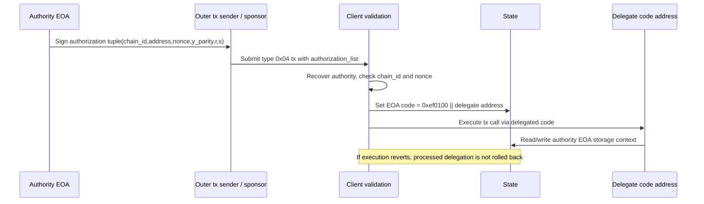
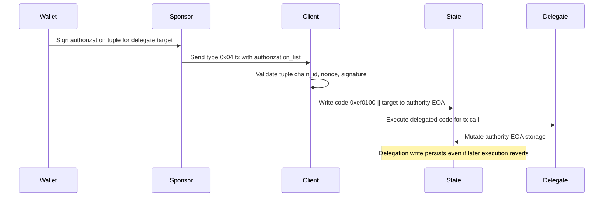
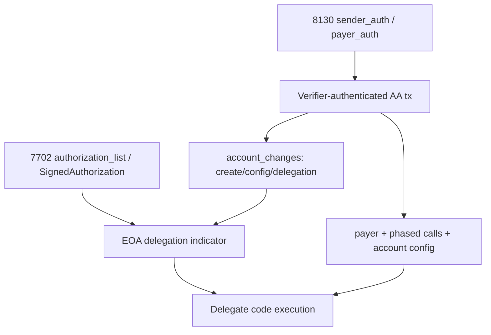

# EIP-7702 机制与局限性分析（含 EIP-3074 溯源）

## Executive Summary

EIP-7702 是 Pectra 已上线的 EOA set-code delegation 方案。它引入 type `0x04` transaction，通过 `authorization_list` 中的授权 tuple 把一个 EOA 的 code 设置为 `0xef0100 || address` delegation indicator，使这个 EOA 在后续调用中按目标地址代码执行。它的价值很明确：保留原 EOA 地址，允许 delegated wallet code 实现 batching、sponsorship pattern、session/permission logic 和 4337 兼容入口。但它不是完整 native AA：协议仍只识别 EOA 授权与 code 指针，不识别多 owner、key rotation、paymaster lifecycle、账户配置或任意验证策略。

EIP-3074 是 7702 的直接历史参照。3074 用 `AUTH`/`AUTHCALL` 把 EOA 临时授权给 invoker contract，能解决 batching 和 sponsor 体验，但需要新增 EVM opcode，安全边界集中在 invoker，且与未来智能账户路线更难组合。官方 EIP-3074 已 Withdrawn，withdrawal reason 是 superseded by EIP-7702。7702 用新交易类型和可持久 delegation 替代 invoker opcode 模型，把“谁执行逻辑”从 invoker CALL 迁移到 EOA 地址本身的 delegated code。

本节的关键校正是 7702 与 8130 的关系：调度文本中的“8130 reuses 7702 SignedAuthorization”不应按字面采信。当前 EIP-8130 规范和 Base 本地实现显示，8130 复用的是 EIP-7702 风格的 delegation indicator 和“标准 7702 交易仍可作为 portability path”的能力；8130 自己的 AA 交易主路径使用 `sender_auth`、`payer_auth`、`account_changes`、verifier/authenticator 语义，不是直接复用 EIP-7702 的 `authorization_list`/`SignedAuthorization` 作为主要授权模型。Base 实现中 `TxEip8130` 字段为 `account_changes`、`calls`、`payer`，签名 envelope 另有 `sender_auth`/`payer_auth`；`AccountChange::Delegation` 设置或清除 EIP-7702-style delegation；这支持“composition, not replacement”的结论。

对 Mantle 的直接含义是：7702 可作为短中期钱包 UX 增强，但不能单独证明“native AA 已完成”。若 Mantle 目标是消费者钱包、gasless onboarding 或 DeFi batching，7702 + delegated wallet + 4337 paymaster 仍是现实路径；若目标是协议级 payer、账户配置、多 owner/key rotation、native mempool validation 或 Base 8130 式产品差异化，则仍需要评估 8130/RIP-7560/EIP-8141 等 native AA 方案。D1-D13 scoring 中，7702 在 D8 EOA compatibility、D10 maturity 得分高，在 D4 key model、D5 native sponsorship、D7 nonce/replay flexibility、D11 delegated storage/security surface 上保留明显边界。

## Item Findings

### item-1: EIP-7702 set-code delegation 机制与 Pectra 状态

#### 1.1 状态与上线时间

EIP-7702 官方状态为 **Final**，类别为 Core，题名为 “Set Code for EOAs”。Pectra meta EIP-7600 为 Final，并列入 EIP-7702；EIP-7600 记录 Pectra mainnet activation timestamp 为 `1746612311`，即 2025-05-07 10:05:11 UTC。本文所有状态敏感结论按 2026-06-27 访问官方 EIP 页面核验。

#### 1.2 Transaction 与 authorization tuple

EIP-7702 定义 `SET_CODE_TX_TYPE = 0x04`，payload 格式沿用 EIP-2718 typed transaction envelope。核心新增字段是 `authorization_list = [[chain_id, address, nonce, y_parity, r, s], ...]`。每个 tuple 由 authority EOA 签名，表达“把这个 authority 的 code delegation 设置到 `address`”。外层 transaction signer 可以不同于 tuple authority，这意味着 sponsor/relayer 可以提交交易并支付 gas，而 authority 只签授权 tuple。

处理逻辑上，客户端逐个处理 authorization tuple：检查 `chain_id` 为当前链或 `0`，检查 `nonce` 与 authority account nonce 匹配，恢复 authority 地址，确认 authority account 不含非 delegation code，然后把 authority code 设置为 delegation indicator。规范中的 delegation indicator 是 `0xef0100 || address`，总长 23 bytes。后续执行中，如果读取到这种 code，EVM 把对 authority 地址的 code 执行解析到目标 `address` 的 code，但存储上下文仍是 authority 账户本身。

当 tuple 中的 `address` 是 zero address 时，EIP-7702 不写 delegation indicator，而是把 account code hash 重置为空 code hash；这就是清除 delegation 的协议路径。否则，写入的是 `0xef0100 || address` 指向的 delegate target。

#### 1.3 持久 delegation、清除路径与 revert 语义

7702 最容易误读的一点是“set-code transaction 是否只在单笔交易内临时生效”。当前 Final 版本是持久 delegation：authorization tuple 的处理会写账户 code，除非后续用新的 delegation 指向其他地址或用 zero-address tuple 清空。EIP-7702 的 Rationale 明确早期版本曾考虑只在交易执行期间生效，后续改为 delegation indicator 持久存储。另一个重要语义是，authorization tuple processing 发生在 execution 前，后续 execution revert 不回滚已经处理成功的 delegation。由此产生一个 UX/安全要求：钱包和应用不能把 set-code 与初始化调用当成完全原子迁移，除非 delegated code/流程自己做幂等初始化与失败补偿。

#### 1.4 机制图



#### 1.5 Evidence

- Official spec: EIP-7702, Final, accessed 2026-06-27, https://eips.ethereum.org/EIPS/eip-7702
- Pectra meta: EIP-7600, Final, accessed 2026-06-27, https://eips.ethereum.org/EIPS/eip-7600
- Local framework dependency: `base-eip8130-native-aa/research-sections/native-aa-framework/final.md` at repository commit base `aa0d69ba0d85a4ade25cf562f064eef98b64039c`.

### item-2: EIP-3074 AUTH/AUTHCALL/invoker 模型与转向 7702 的取舍

#### 2.1 3074 模型

EIP-3074 的核心是新增两个 opcode：`AUTH` 和 `AUTHCALL`。EOA 签一个授权消息，invoker contract 在执行中用 `AUTH` 验证签名并设置 authorized context，随后用 `AUTHCALL` 以 authority 的身份发起调用。这样 invoker 可以实现批量交易、sponsored transaction、限权脚本等体验；用户不需要迁移地址，也不需要部署智能账户。

这个模型的风险也集中在 invoker。用户授权的是“某个 invoker 的能力”，但 invoker 代码可以封装复杂调用；一旦 invoker 有 bug、升级治理出错或用户误签恶意 invoker 授权，authority EOA 的资产会暴露。3074 还要求引入新 opcode，把 EOA delegation 行为放入 EVM 执行期语义，而不是 transaction envelope 语义。

#### 2.2 为什么转向 7702

官方 EIP-3074 当前状态为 Withdrawn，withdrawal reason 是 superseded by EIP-7702。技术取舍上，7702 用 type `0x04` transaction 和 delegation indicator 替代 `AUTH`/`AUTHCALL` opcode：授权 tuple 在交易前处理，结果写入 EOA code；后续对 EOA 的调用按 delegated code 执行。这样做有三点优势：

1. 与 typed transaction / Pectra hardfork 集成更直接，不引入 `AUTHCALL` 这种长期 opcode 语义。
2. EOA 原地址可以“变成”执行 delegated wallet code 的地址，便于与 4337 smart account logic、钱包 SDK、batch executor 组合。
3. delegation 是可见的账户 code 状态，钱包、节点、indexer、explorer 能通过 code 指针识别账户当前委托对象。

代价是 7702 授权持久化带来了 storage layout、delegate switching、initialization race 等新风险；3074 的 invoker 授权则更偏“一次或一段流程内的 authority handoff”。7702 不是单方面更安全，而是在 EVM 技术债、状态可观察性、未来 AA 组合性之间做了不同取舍。

#### 2.3 3074 -> 7702 取舍表

| 维度 | EIP-3074 | EIP-7702 | 取舍结论 |
|---|---|---|---|
| 官方状态 | Withdrawn；superseded by EIP-7702 | Final；Pectra 已上线 | 7702 是当前主线 |
| 协议接口 | 新 opcode `AUTH`/`AUTHCALL` | 新 tx type `0x04` + `authorization_list` | 7702 避免长期 opcode 负担 |
| 执行主体 | invoker contract 代 authority 发 call | EOA 地址执行 delegated code | 7702 更像“EOA 原地挂智能账户代码” |
| 授权生命周期 | invoker 在执行中使用授权 | 授权处理后写入持久 delegation code | 7702 更可观察，但持久状态风险更高 |
| Sponsor | relayer/invoker 可 sponsor | outer tx sender 可 sponsor，delegate wallet 可封装 sponsor flow | 两者都能支持 sponsor pattern；都不是完整 paymaster protocol |
| Batching | invoker 内批量调用 | delegated code 内批量调用 | 7702 更利于复用 smart account code |
| 安全焦点 | invoker bug/恶意 invoker | delegate code、storage layout、签名 UI、delegation switching | 风险从 invoker 临时控制转移到持久 code delegation |
| 与 4337/native AA | 与未来 smart account roadmap 张力较大 | 可与 4337 delegated account、8130 delegation entry 组合 | 7702 组合性更强 |

#### 2.4 Evidence

- Official spec: EIP-3074, Withdrawn, accessed 2026-06-27, https://eips.ethereum.org/EIPS/eip-3074
- Official spec: EIP-7702, Final, accessed 2026-06-27, https://eips.ethereum.org/EIPS/eip-7702

### item-3: EIP-7702 的能力边界与“半原生 AA”定位

#### 3.1 7702 能直接带来的能力

7702 的强项是“EOA 原地址兼容”。现有用户无需换地址，就能把地址挂到 delegated wallet code。只要 delegated code 实现了相应逻辑，用户就能获得多调用 batching、session key、spend limit、sponsor-compatible entry function、privilege de-escalation 等体验。与 ERC-4337 组合时，7702 还能让 EOA 变成一个可由 4337 account logic 处理的账户，降低从 EOA 到 smart account 的迁移摩擦。

但这些能力不由 7702 协议自身保证。7702 只定义如何把 EOA code 设置为 delegation indicator，以及后续 code lookup 如何解析；真正的权限模型、批量原子性、sponsor 结算、签名策略、恢复流程都在 delegate wallet 合约或 4337 infrastructure 中。

#### 3.2 局限性表

| 限制类别 | 机制原因 | 影响 | 可缓解方式 | 残余风险 / 对应安全分析 |
|---|---|---|---|---|
| EOA ECDSA key dependency | authorization tuple 仍由 EOA secp256k1 私钥签署；EOA nonce 参与 replay control | 原私钥仍是最终 authority；私钥泄露可重新 delegation 到恶意代码 | 硬件钱包、delegate wallet 内部 session key/guardian、迁移到 native AA/4337 smart account | 不能协议级废止 EOA key；见 item-4.4 |
| 无协议级多 owner/key rotation | 7702 不定义 owner set、guardian、recovery、key rotation | 多签、恢复、企业权限只能靠 delegate code 或外部合约 | 使用 Safe/4337/delegate wallet 实现；或转 8130 actor/authenticator 模型 | delegate code/存储布局成为安全核心 |
| Sponsorship 非原生 | outer tx sender 可不同于 authority，但 7702 不定义 paymaster/payer lifecycle | sponsor 风控、退款、限额、反滥用需应用或 4337 paymaster 自行实现 | 4337 Paymaster、trusted relayer、delegate wallet sponsor module | sponsor 中心化、griefing、资金限额问题仍在 |
| Batching 非协议级账户能力 | delegated code 可 batching，但 7702 transaction 不定义 account call array | 原子性、失败策略、权限检查取决于 delegated wallet implementation | 使用 audited multicall/account executor | 合约 bug 直接影响 EOA 资产 |
| Storage collision | delegated code 在 authority EOA storage context 下执行 | 换 delegate、升级 delegate 或初始化失败可能误读/覆盖状态 | namespace storage、ERC-7201-like layout、初始化 guard、wallet UI 检查 | 与 item-4.2 重叠，安全风险需单列 |
| Delegation switching | EOA 可签新 authorization 指向其他 delegate 或 clear | 旧 delegate 认为的状态/权限可被新 delegate 重新解释 | wallet 显示当前 delegate、timelock/guard、delegate allowlist | 恶意签名诱导仍可 takeover；见 item-4.3 |
| Replay semantics | tuple 允许 `chain_id == 0`，并用 authority nonce 控制 | 跨链 replay 既是 portability feature 也是风险 | 默认链绑定、钱包强警告 chain_id 0、短流程使用 | 用户误签 chain_id 0 可能跨链生效 |
| Adoption 数据不足 | “Mantle 7702 效果不好”目前是主观输入 | 不能直接据此判断 native AA 必要性 | 用 native-aa-framework 的四类指标补证 | 本 draft 未做链上采用度统计，见 Gap Analysis |

#### 3.3 “半原生”归位

按 native-aa-framework 的 taxonomy，7702 是协议级 EOA 增强，而不是完整 native AA。它满足 D1/D2 中“新交易类型、协议改动、硬分叉上线”的条件，但不满足完整 native AA 对账户验证、gas 支付、nonce/account config、执行调度的一等公民化要求。最准确的定位是：7702 是让 EOA 接入智能账户逻辑的最低摩擦桥梁，而不是最终账户模型。

### item-4: 7702 新攻击面：storage、delegation switching、replay 与 wallet safety

本节只展开 item-3 limitations table 中“残余风险”列，避免重复功能限制。

#### 4.1 签名与授权 UI 风险

7702 authorization tuple 能改变 EOA 的执行语义，安全敏感度接近“账户升级”。钱包 UI 如果只把它展示成普通签名，用户很难判断 delegate address 的代码、升级权限、初始化状态和 sponsor 合约是否可信。尤其是 outer tx sender 与 authority EOA 可分离，用户可能只签 tuple 而不是完整 transaction；签名请求需要明确展示 chain_id、delegate target、authority nonce、是否 chain_id 0、是否会持久改变账户。

#### 4.2 Storage collision 与初始化失败

Delegated code 在 authority EOA 的 storage context 中执行。EOA 过去通常没有合约 storage，但一旦 delegated wallet 初始化后，storage 布局就成为账户资产安全边界。用户切换到另一个 delegate 后，新代码会读写同一 storage；如果两个 wallet 实现使用相同 slot 表达不同含义，就会出现状态污染、权限绕过或资产锁死。即使不切换 delegate，set delegation 成功后初始化调用如果 revert，也可能留下“已委托但未初始化”的账户状态。这个风险对应 item-3 表中的 storage collision 行，但在安全审查中应单独验证每个 delegate wallet 的 storage namespace、initializer guard 和 upgrade/switch policy。

#### 4.3 Delegation switching 与恶意 delegate takeover

EOA 私钥仍能签新的 authorization tuple，所以任何持有 EOA key 的攻击者可以把账户重新委托给恶意 delegate。即便 delegate wallet 内部有 session key、spend limit 或 guardian，它们也不能阻止 EOA root key 重新 delegation。这个性质对消费者钱包是兼容性优势，对企业/多 owner 场景则是根本限制：协议没有“多 owner 同意后才能换 delegate”的规则。

#### 4.4 Replay 与 chain_id 0

EIP-7702 authorization tuple 支持 `chain_id` 等于当前链或 `0`。`chain_id == 0` 能让同一授权跨链使用，利于多链迁移和 portability；同时也让用户误签后在多个链上生效。Authority nonce 提供 replay protection，但它是 EOA account nonce，不是智能账户式 key-space nonce。并行 session、分权限 nonce、payer-specific replay protection 仍要靠 delegate code 或 4337/native AA。

#### 4.5 Delegate code 与 sponsor operational risk

7702 把很多复杂性下放到 delegate wallet：批量执行顺序、签名聚合、sponsor 准入、fallback、ERC-1271、token allowance、升级代理等都可能成为攻击面。Sponsor/relayer 模式还会遇到 griefing：用户可签授权但让执行失败，或 delegate code 产生 sponsor 难以预估的 gas/refund 行为。因此 7702 可降低用户摩擦，但不会消除 paymaster/bundler/relayer 风险。

### item-5: EIP-7702 与 EIP-8130 的组合关系与术语校正

#### 5.1 Dispatch claim vs current spec

**核验结论：调度文本“8130 reuses 7702 SignedAuthorization”按字面不准确。** 当前 EIP-8130 规范定义的是新的 `AA_TX_TYPE` transaction，包含 `sender`、`account_changes`、`calls`、`payer` 等字段，并在签名 envelope 中使用 `sender_auth` 和 `payer_auth`。8130 的 account changes 中可以包含 delegation entry，用于设置或清除 EIP-7702-style delegation。规范还说明 standard EIP-7702 transaction 可用于在支持 8130 的链之间切换 delegation，以保持 portability。但这不等于 8130 主路径复用 EIP-7702 的 `authorization_list`/`SignedAuthorization`。

本地 Base 代码进一步支持该结论：

- `crates/common/consensus/src/transaction/eip8130/tx.rs` 定义 `TxEip8130`，字段包括 `account_changes: Vec<AccountChange>`、`calls: Vec<Vec<Call>>`、`payer: Option<Address>`；注释说明 signed form 是 `EIP8130_TX_TYPE || rlp([...all fields..., sender_auth, payer_auth])`。
- `crates/common/consensus/src/transaction/eip8130/signed.rs` 定义 `Eip8130Signed` 包装 `TxEip8130` 加 `sender_auth`/`payer_auth`。EOA path 下 `sender_auth` 是 65-byte ECDSA signature；configured-owner path 下是 `verifier(20) || verifier_data`；payer path 同理。
- `crates/common/consensus/src/transaction/eip8130/account_changes.rs` 定义 `AccountChange::Delegation(Delegation)`，注释为 “Set or clear an EIP-7702-style delegation”。
- `crates/common/consensus/src/transaction/eip8130/constants.rs` 定义 `DELEGATION_INDICATOR_PREFIX = [0xef, 0x01, 0x00]`，总长 23 bytes，即 EIP-7702-style delegation indicator。
- `crates/execution/txpool/src/validator.rs` 对 8130 做结构性 admission：校验 `sender_auth`、`payer_auth`、`account_changes`，并限制 at most one delegation。这是 8130 verifier/auth buffer 模型，不是 7702 authorization_list 模型。

需要注意一个实现细节：Base 的 `TxEip8130`/`Eip8130Signed` trait 实现中仍有 `authorization_list()` 方法返回 `self.tx.authorization_list()`，这是为了与通用 transaction trait/RPC 形状兼容，且当前 `TxEip8130` 中该方法返回 `None`。不能把这个 trait compatibility 误读成 8130 主路径使用 7702 `SignedAuthorization`。

#### 5.2 Evidence index for the authorization-model claim

| Claim | Evidence |
|---|---|
| 7702 uses `authorization_list` / SignedAuthorization-style tuples for code delegation | EIP-7702 official page, accessed 2026-06-27, lines matched by local verification: transaction payload includes `authorization_list`, tuple format `[[chain_id, address, nonce, y_parity, r, s], ...]`, delegation writes `0xef0100 || address`. |
| 8130 uses `sender_auth`/`payer_auth`, not 7702 `authorization_list`, as the AA transaction auth model | EIP-8130 official page, accessed 2026-06-27, lines matched by local verification: transaction format contains `sender_auth` and `payer_auth`; `account_changes` includes create/config/delegation entries. |
| 8130 delegation entries replace the need for 7702 `authorization_list` inside 8130 transactions | EIP-8130 official page, accessed 2026-06-27, local verification matched: “Delegation entries set EIP-7702-style code delegation ... replacing the need for an authorization_list ... authorized by sender_auth.” |
| Base implementation mirrors the same distinction | `/Users/whisker/Work/src/networks/base/base` at `01e732cdbae0c624d652da9e608d7d3fe0f9c74b`: `eip8130/tx.rs`, `eip8130/signed.rs`, `eip8130/account_changes.rs`, `eip8130/constants.rs`, `execution/txpool/src/validator.rs`. |

#### 5.3 Composition, not replacement

7702 与 8130 的关系应写成三层：

1. **7702 独立存在**：标准 type `0x04` transaction 可在 Pectra 链上使用，给 EOA 写 delegation indicator。
2. **8130 复用 7702-style delegation representation**：8130 的 delegation account change 写出的 code 形态仍是 `0xef0100 || target`，所以执行层 code lookup 可与 7702 delegation 语义对齐。
3. **8130 扩展完整 AA 能力**：8130 增加 sender/payer auth、account config、owner scopes、2D nonce/expiry、phased calls 等协议字段，试图把 7702 没有定义的账户/付款/执行生命周期带进 native path。

#### 5.4 组合关系图

```mermaid
flowchart TD
    A[EIP-7702 type 0x04 tx] --> B[authorization_list SignedAuthorization]
    B --> C[Set EOA code to 0xef0100 || delegate]
    C --> D[Calls to EOA execute delegate code in EOA storage]

    E[EIP-8130 AA tx] --> F[TxEip8130 body: sender, nonce_key, account_changes, calls, payer]
    F --> G[Eip8130Signed envelope: sender_auth + payer_auth]
    F --> H[AccountChange::Delegation target]
    H --> C
    G --> I[Verifier/authenticator validation path]
    F --> J[Phased calls and payer/account config semantics]

    B -. not main 8130 auth model .-> G
```

### item-6: D1-D13 rubric scoring for EIP-7702

评分为 1-5，5 表示该维度对“完整 native AA / Mantle target fit”最强。证据类型沿用 native-aa-framework。

| ID | Dimension | Score | Evidence type | EIP-7702 assessment |
|---|---:|---:|---|---|
| D1 | 抽象层级 | 3 | spec-cited, framework-cited | 协议级 EOA 增强；不是应用层，但也不是完整 native AA。 |
| D2 | 协议改动范围 | 4 | spec-cited | 已通过 Pectra 引入 type `0x04` tx、authorization processing、delegation indicator。 |
| D3 | 基础设施依赖 | 3 | spec-cited, inferred | 基础 delegation 不需 bundler；高级 sponsor/batching 仍依赖 delegate wallet、relayer 或 4337 infra。 |
| D4 | 所有权与密钥模型 | 2 | spec-cited | Root authority 仍是 EOA ECDSA key；多 owner/key rotation 只能在 delegate code 层模拟。 |
| D5 | Gas 代付 | 2 | spec-cited, inferred | Outer sender 可 sponsor，但无协议级 payer/paymaster lifecycle、stake/deposit/refund/reputation。 |
| D6 | 批量原子性 | 3 | spec-cited, inferred | Delegate code 可实现 batching；7702 transaction 本身不定义 account-level call array 或 phase semantics。 |
| D7 | Nonce 与防重放 | 2 | spec-cited | Authorization 依赖 authority nonce 和 chain_id；无 key-space/2D nonce，`chain_id == 0` 有跨链 replay 风险。 |
| D8 | EOA 兼容与迁移 | 5 | spec-cited | 核心优势：原地址 delegation、可切换/清除，相比合约账户迁移摩擦低。 |
| D9 | 签名灵活性与 PQ 准备度 | 2 | spec-cited, inferred | Authorization tuple 仍是 ECDSA；delegate code 可实现其他签名策略，但 root EOA key 仍存在。 |
| D10 | 成熟度与生态 | 4 | spec-cited | Final 且 Pectra mainnet 已激活；钱包/SDK 生态仍在迁移，不如 4337 成熟但比 Draft native AA 更成熟。 |
| D11 | 安全攻击面 | 2 | spec-cited, code-cited | 新增持久 delegation、storage collision、delegate switching、签名 UI、chain_id 0 replay 等风险。 |
| D12 | Mantle 适配成本 | 4 | framework-cited, inferred | Mantle 若已跟随 Pectra/OP Stack 支持 7702，协议适配成本低于 8130；但产品效果仍需数据验证。 |
| D13 | 目标用户/产品场景适配 | 3 | framework-cited, inferred | 消费者钱包、onboarding、DeFi batching 适配较好；企业多 owner、native payer、协议级权限较弱。 |

#### 6.1 Mantle 决策输入

7702 对 Mantle 的价值判断不能只看“支持了没有”。若要判断“效果不好”，必须按 native-aa-framework 的四类代理指标取证：7702 tx/type 占比与 active delegated EOA、delegate wallet/SDK 支持、sponsor/relayer 成本、钱包兼容与应用集成。当前 draft 没有链上采用度统计，因此不能下“7702 在 Mantle 失败”的结论；只能说，从机制上看，7702 本身不能解决完整 native AA 的 key model、payer、account config 和 protocol-level validation 问题。

## Diagrams

### diag-1: EIP-7702 set-code transaction flow



### diag-2: 3074 invoker flow vs 7702 delegation flow

```mermaid
flowchart LR
    subgraph EIP3074[EIP-3074]
      A1[EOA signs AUTH message] --> A2[Invoker contract runs AUTH]
      A2 --> A3[Invoker runs AUTHCALL as authority]
      A3 --> A4[Authority state changes via invoker flow]
    end

    subgraph EIP7702[EIP-7702]
      B1[EOA signs authorization tuple] --> B2[Type 0x04 tx processes authorization_list]
      B2 --> B3[EOA code becomes 0xef0100 || delegate]
      B3 --> B4[Calls to EOA execute delegate code]
    end
```

### diag-3: 7702 与 8130 组合关系



### diag-4: 局限性矩阵

```text
+----------------------+------------------------------+----------------------------+-----------------------------+
| limitation           | protocol cause               | workaround                 | residual risk               |
+----------------------+------------------------------+----------------------------+-----------------------------+
| EOA root key         | authorization uses ECDSA EOA | delegate session keys      | root key can re-delegate    |
| no native owners     | no owner/account config      | Safe/4337/delegate wallet  | contract-level only         |
| no native paymaster  | no payer/paymaster lifecycle | relayer or 4337 paymaster  | sponsor centralization      |
| storage collision    | delegate uses EOA storage    | namespaced storage         | switching/upgrade hazards   |
| replay semantics     | chain_id 0 + authority nonce | chain-bound signatures     | cross-chain user mistake    |
| adoption uncertainty | no local usage data here     | Dune/RPC/SDK matrix        | conclusion deferred         |
+----------------------+------------------------------+----------------------------+-----------------------------+
```

## Source Coverage

| Source req | Status | Evidence used |
|---|---|---|
| src-1 EIP-7702 official spec | covered | EIP-7702 official page, accessed 2026-06-27; cited for status, tx type, authorization tuple, delegation indicator, persistence/revert and security surface. |
| src-2 EIP-7600 Pectra meta | covered | EIP-7600 official page, accessed 2026-06-27; cited for Pectra inclusion and activation timestamp `1746612311`. |
| src-3 EIP-3074 official spec | covered | EIP-3074 official page, accessed 2026-06-27; cited for Withdrawn/superseded status and AUTH/AUTHCALL model. |
| src-4 EIP-8130 official spec | covered | EIP-8130 official page, accessed 2026-06-27; cited for AA transaction fields, `sender_auth`/`payer_auth`, account changes, 7702 compatibility. |
| src-5 local framework | covered | `base-eip8130-native-aa/research-sections/native-aa-framework/final.md` in repo at base commit `aa0d69ba`. |
| src-6 local Base code analysis | covered | `/Users/whisker/Work/src/networks/base/base` at commit `01e732cd...`; relevant files under `crates/common/consensus/src/transaction/eip8130/` and `crates/execution/txpool/src/validator.rs`. |
| src-7 ecosystem docs | partially covered | Used EIP-4337 as primary protocol context for paymaster/bundler complementarity. Wallet vendor matrix not collected in this round. |
| src-8 security discussion | partially covered | Used EIP security considerations and local implementation behavior. Independent audits/writeups not collected in this round. |

## Gap Analysis

1. **No Mantle chain adoption data yet.** This draft does not query Mantle RPC/Dune/indexers for EIP-7702 transaction counts, active delegated EOAs, 4337 UserOp counts, sponsor usage, or wallet/SDK support. Any statement that “7702 效果不好” remains unproven until WHI-281/WHI-282 or a dedicated metrics task supplies data.
2. **No wallet vendor support matrix.** The draft explains mechanism and limitations, but does not enumerate which wallets currently expose 7702 signing UX safely on Mantle/Base/Ethereum.
3. **No independent 7702 delegate-wallet audit corpus.** Security analysis is spec- and mechanism-based. A production recommendation should review specific delegate wallet implementations and their storage layout/initializer/switching policy.
4. **EIP-8130 is Draft and Base implementation is moving.** Local Base code was read at commit `01e732cdbae0c624d652da9e608d7d3fe0f9c74b`; later commits may change `sender_auth`/`payer_auth`, account_changes, txpool admission, or delegation semantics.

## Revision Log

| Round | Change | Source |
|---|---|---|
| 1 | Initial deep draft from approved outline; incorporated outline-review minor findings on 7702/8130 auth wording, item-3/item-4 cross-references, and local Base code verification. | Multica dispatch `cab6791c-3a77-49ad-ba86-01a2a8dd8109`; outline commit `51a70131a26856ae296c9ad41b8a8f0fec1bcc8c` |
