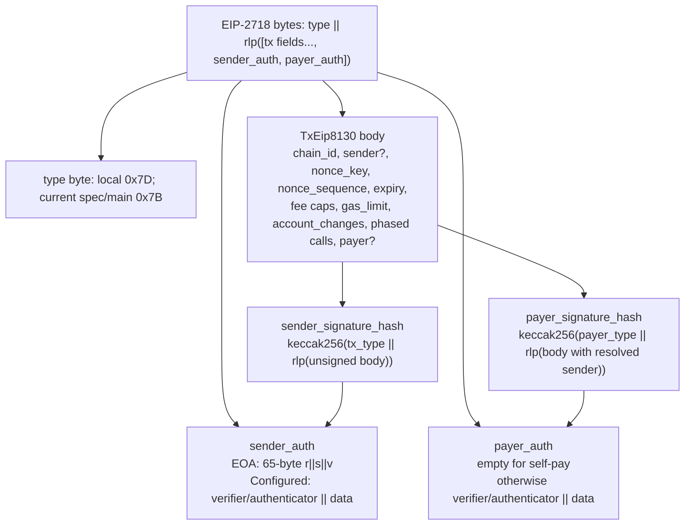
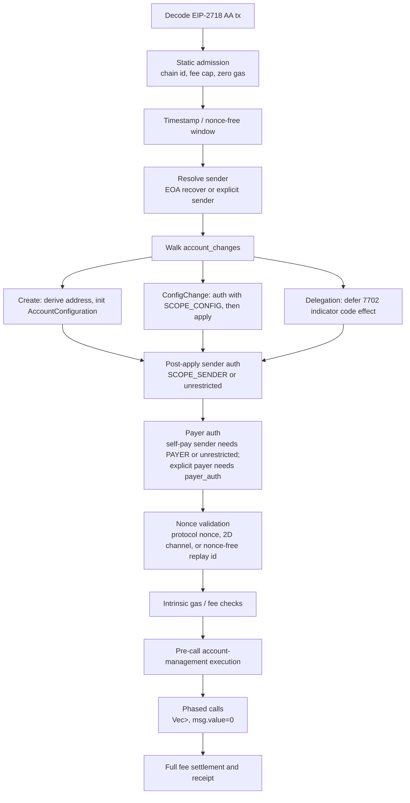
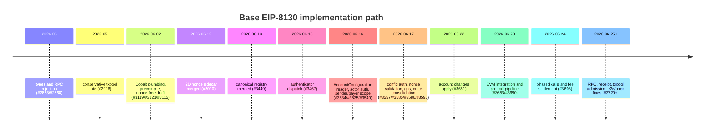

# EIP-8130 原理与 Base 实现深度分析

## 0. 基线、证据边界与结论摘要

本节以 Base 本地 checkout 作为第一层证据：`/Users/whisker/Work/src/networks/base/base`，commit `01e732cdbae0c624d652da9e608d7d3fe0f9c74b`，commit 日期 `Thu Jun 18 15:21:24 2026 -0500`。核验时工作区 `git status --short` 显示 `?? .mcp.json`，该未跟踪文件不参与任何源码结论。后续 PR 取证来自同一仓库的 fetched `origin/main`，核验 commit 为 `50e568c8e2204780465018bb596656071baeeb68`，以及 GitHub PR metadata。

证据分级：

| 分级 | 含义 | 本文用法 |
|---|---|---|
| `local-baseline-verified` | 在 Base 本地 commit `01e732c...` 的文件和行号中直接可见。 | `TxEip8130`、`Eip8130Signed`、`Scope` 数据模型、local constants、`account_changes` wire model。 |
| `remote-pr-diff` | 本地基线没有，但 fetched `origin/main` 或 GitHub PR 显示已经在后续 PR 中实现。 | Scope runtime enforcement、actor authorization、nonce/gas/apply/EVM/RPC/pipeline。 |
| `daily-intelligence-reuse` | Multica Daily Intelligence issues 提供 PR 种子和趋势信号。 | WHI-90/106/175/239/241/253/265 的 PR timeline seed。 |
| `spec-only` | 官方 EIP/ERC/RIP 文档语义，Base 尚未或不一定完全实现。 | EIP-8130 Draft 规范、EIP-7702 Final、ERC-4337 Final、RIP-7560 Draft、EIP-8141 Draft。 |
| `inference` | 从 PR 顺序和实现形态推断动机，非官方声明。 | Base 为什么更偏向 8130 而不是只依赖 4337/7702/8141。 |

核心结论：

1. EIP-8130 的核心不是“又一种智能钱包合约”，而是把账户配置、actor/owner scope、payer、2D nonce、nonce-free、account changes 与 phased calls 放进一种 EIP-2718 交易类型。节点/排序器可以在 txpool 和 block inclusion 路径上看到这些结构，而不需要先执行任意 wallet code 才知道交易是否可接受。
2. 与 ERC-4337 相比，8130 把 alt mempool、bundler、EntryPoint simulation、paymaster 这些应用层/基础设施职责下沉到协议交易和执行层验证。代价是更重的 client/L2 协议实现和更大的共识/排序器耦合。
3. 与 EIP-7702 相比，8130 不是替代 delegation，而是把 7702-style delegation 纳入 account-change 语义：7702 给 EOA 临时或持续挂代码，8130 额外定义谁能作为 sender/payer/config/signature actor、如何写 AccountConfiguration、如何 sponsored pay、如何 nonce/channel 化、如何 phased batch。
4. Base 的实现路径显示它在构建 native AA 的完整 pipeline：先类型和 RPC gate，再 Cobalt activation、precompile/registry、authenticator dispatch、AccountConfiguration reader、actor authorization、scope gating、nonce/gas/account-change apply、EVM integration、phased calls、RPC/receipt/txpool edge cases。这个方向明显超出“支持 7702”或“接入 4337”的范围。
5. 但 Base “为什么没有选择 8141/RIP-7560 而是选择 8130”的官方动机没有在本次证据中找到。本文只能给出实现形态层面的推断：8130 与 Base 想要的 AccountConfiguration storage、canonical authenticator set、payer hash、phased calls、EOA auto-delegation 和 txpool 可过滤性更直接对齐；8141 仍是 Draft/CFI，且 Frame Transaction 抽象更通用、更大范围。

## 1. Spec 与 Base 常量漂移

EIP-8130 官方状态是 Draft。local baseline 的 `constants.rs:13-15` 明确写着若干数字常量仍是 spec TBD 后的项目选择。local baseline 使用：

| 项 | local baseline | local anchor | current `origin/main` / spec drift | verification |
|---|---:|---|---:|---|
| AA tx type | `0x7D` | `constants.rs:23-30` | `0x7B` | local + remote |
| payer domain byte | `0xFA` | `constants.rs:32-39` | `0x7C` | local + remote |
| base intrinsic gas | `15_000` | `constants.rs:41-42` | 仍为 Base gas schedule 起点 | local + remote |
| nonce-free sentinel | `U256::MAX` | `constants.rs:44-48` | 同义 | local + remote |
| scope unrestricted | `0x00` | `constants.rs:50-63` | 同义，后续 execution crate 强制执行 | local + remote |
| delegation prefix | `0xef0100` | `constants.rs:65-77` | 与 EIP-7702 delegation indicator 一致 | local + spec |

重要漂移：current `origin/main:crates/common/consensus/src/transaction/eip8130/constants.rs:13-35` 已把 tx type 和 payer type 改为 EIP-8130 constant-table 值 `AA_TX_TYPE=0x7B`、`AA_PAYER_TYPE=0x7C`。因此本文所有 wire-format 结论按 local baseline 解释 `0x7D`/`0xFA`，但不得把它们写成最终规范值。

## 2. Transaction Anatomy: `TxEip8130` 与 `Eip8130Signed`

### 2.1 交易体字段语义

local baseline 的 `TxEip8130` 定义在 `crates/common/consensus/src/transaction/eip8130/tx.rs:44-68`：

| 字段 | 语义 | 关键风险/作用 | source |
|---|---|---|---|
| `chain_id` | EIP-155 chain binding。 | 防跨链 replay。 | `tx.rs:45-46` |
| `sender: Option<Address>` | `None` 进入 EOA recovery path；`Some` 进入 configured-account path。 | 决定 `sender_auth` 是裸 65-byte ECDSA 还是 `verifier||data`。 | `tx.rs:47-48` |
| `nonce_key` | 2D nonce key；`NONCE_KEY_MAX` 选择 nonce-free。 | 支持并行 channels 与 expiring nonce-free。 | `tx.rs:49-51`, `constants.rs:44-48` |
| `nonce_sequence` | channel 内 sequence。 | 普通 nonce-bearing path 的 replay ordering。 | `tx.rs:52-53` |
| `expiry` | Unix seconds；`0` 表示无过期。 | nonce-free 必须非零且短窗口。 | `tx.rs:54-55`, `signed.rs:166-180` |
| fee caps | `max_priority_fee_per_gas`, `max_fee_per_gas`。 | admission 检查 tip <= fee cap。 | `tx.rs:56-59`, `signed.rs:143-157` |
| `gas_limit` | 交易执行 gas limit。 | 不含某些 payer auth/gas schedule 细节，后续 PR 细化。 | `tx.rs:60-61` |
| `account_changes` | 执行 calls 前的账户配置写入。 | create/config/delegation 的协议级账户管理。 | `tx.rs:62-63` |
| `calls: Vec<Vec<Call>>` | calls 按 phase 分组。 | 支持 phased batch 与 phase failure boundary。 | `tx.rs:64-66`, `call.rs:8-24` |
| `payer: Option<Address>` | `None` self-pay；`Some` sponsored pay。 | 决定是否验证 `payer_auth` 与 payer hash。 | `tx.rs:67-68` |

RLP canonical order 是 `chain_id, sender, nonce_key, nonce_sequence, expiry, max_priority_fee_per_gas, max_fee_per_gas, gas_limit, account_changes, calls, payer`，见 `tx.rs:155-167`。`sender`/`payer` 的 `Option<Address>` 以空 bytes 表示 `None`，20-byte string 表示 `Some`，见 `tx.rs:72-97`。`calls` 是 nested RLP list，见 `tx.rs:99-137`。

### 2.2 签名域分隔

`TxEip8130::sender_signature_hash()` 的 preimage 是 `EIP8130_TX_TYPE || rlp(unsigned_body)`，见 `tx.rs:202-212`。`payer_signature_hash(resolved_sender)` 的 preimage 是 `EIP8130_PAYER_TYPE || rlp(body with sender slot replaced by resolved sender)`，见 `tx.rs:214-225`。这两个域分隔非常关键：

- sender hash 绑定完整交易体，包括 optional payer。
- payer hash 把 `sender` slot 替换为已解析 sender，使 EOA path 的 sender 即使 wire 上是 `None`，也被 payer 签名绑定。
- payer domain 使用独立 prefix，local baseline 是 `0xFA`，current spec/main 是 `0x7C`，防止 sender/payer 签名复用。

### 2.3 signed envelope

`Eip8130Signed` 在 `signed.rs:35-53` 持有 `tx`、`sender_auth`、`payer_auth` 和 cached EIP-2718 hash。

| path | `sender` | `sender_auth` | `payer_auth` | source |
|---|---|---|---|---|
| EOA sender, self-pay | `None` | 65-byte `r||s||v` over sender hash | empty | `signed.rs:38-50`, `signed.rs:195-240` |
| EOA sender, sponsored | `None` | 65-byte ECDSA | `verifier(20)||verifier_data` over payer hash with resolved sender | `signed.rs:45-50`, `tx.rs:220-225` |
| configured sender, self-pay | `Some(sender)` | `verifier(20)||verifier_data` | empty | `signed.rs:40-50` |
| configured sender, sponsored | `Some(sender)` | `verifier(20)||verifier_data` | `verifier(20)||verifier_data` | `signed.rs:40-50` |

Static admission checks are local to the signed wrapper: chain id mismatch, tip above fee cap, zero gas/fee cap rejection,见 `signed.rs:143-157`。timestamp-sensitive checks enforce nonce-free constraints: if `nonce_key == NONCE_KEY_MAX` then `nonce_sequence == 0` and `expiry != 0` and `expiry <= now + NONCE_FREE_MAX_EXPIRY_WINDOW`; otherwise nonzero expired `expiry` rejects,见 `signed.rs:166-180`。

### 2.4 交易结构图



## 3. AccountConfiguration、Scope 与写语义

### 3.1 Scope bits 与 `Scope(0)` 的陷阱

local baseline 定义 scope bits：

| scope | value | context | local source |
|---|---:|---|---|
| `SCOPE_SIGNATURE` | `0x01` | ERC-1271-style `verifySignature()` | `constants.rs:50-52` |
| `SCOPE_SENDER` | `0x02` | `sender_auth` validation | `constants.rs:53-55` |
| `SCOPE_PAYER` | `0x04` | `payer_auth` validation | `constants.rs:56-58` |
| `SCOPE_CONFIG` | `0x08` | config-change `auth` validation | `constants.rs:59-60` |
| `SCOPE_UNRESTRICTED` | `0x00` | actor/owner valid in all contexts | `constants.rs:62-63` |

local baseline 的 `Scope` wrapper 在 `account_changes.rs:17-72`，但它只有 `has_signature/has_sender/has_payer/has_config` bit helpers。这些 helpers 对 `Scope(0)` 都会返回 false，因为它们只是 bit test。因此，不能从 local baseline 的 helper 推导 runtime 授权语义。

runtime enforcement 来自后续 PR，而不是 local baseline：

- PR #3540 `feat(eip8130): transaction actor authorization (sender + payer scope gating)`，merge commit `0f629f69d45cf6e6932c75e3ff664c2e33b1cad7`，增加 `crates/execution/eip8130-tx/src/scope.rs`。
- PR #3595 `refactor(eip8130): consolidate validation crates`，merge commit `146681caf03e00a47ef2dafff88b2cb5921cdd13`，把路径整合到 current `origin/main:crates/execution/eip8130/src/scope.rs`。
- current `origin/main` 的 `Operation::is_granted_by` 在 `scope.rs:34-40` 明确执行 `scope == Eip8130Constants::SCOPE_UNRESTRICTED || scope & self.required_bit() != 0`。
- `ResolvedActor.scope` 注释写明 `0 = unrestricted`，`unrestricted()` 和 `is_unrestricted()` 分别在 `resolved.rs:28-40` 使用 `scope: 0` 和 `self.scope == 0`。

结论：`Scope(0)=UNRESTRICTED` 是 remote-pr-diff/current-main verified，不是 local-baseline runtime verified。local baseline 只定义了数据模型和常量。

### 3.2 `ECRECOVER_VERIFIER`、`REVOKED_VERIFIER` 与后续 `K1_AUTHENTICATOR`

local baseline 的 `constants.rs:94-101` 定义两个关键地址：

| constant | value | local semantics | later drift |
|---|---|---|---|
| `ECRECOVER_VERIFIER` | `address(1)` | lower-bound verifier；native ecrecover verifier 固定在 address(1)，小于它的 verifier 地址保留。 | current main 改名/重构为 `K1_AUTHENTICATOR`，`origin/main constants.rs:90-99` 说明 protocol 从 `data` blob `r||s||v` 直接恢复，不对 address(1) 做 STATICCALL。 |
| `REVOKED_VERIFIER` | `0xffffffffffffffffffffffffffffffffffffffff` | revoked owner slot sentinel；以该 verifier 前缀提交 auth data 必须被 hard reject。 | current main 的 actor model 改为 `DEFAULT_EOA_REVOKED` flag、empty sentinel、actor_config 删除/覆盖语义；未保留同名常量。 |

这回答 F2 的两个点：

1. `address(1)` 锚定 native ecrecover/K1 path。它让 k1 签名成为 canonical authenticator 中唯一不需要外部 contract STATICCALL 的特殊路径，Base 后续文档在 current main 明确说从 `data` blob 恢复。
2. `REVOKED_VERIFIER` 是 local-baseline 的 revoked owner slot sentinel。它不是“另一个 verifier”，而是 hard reject marker，避免被撤销的 owner slot 通过伪造 verifier 前缀重新进入认证路径。

### 3.3 Account changes 的 5 类写语义

issue 要求的“5 类 AccountChange”更准确地说是 5 类结构/写语义。local baseline 的 top-level enum 只有三类：`Create`、`ConfigChange`、`Delegation`，见 `account_changes.rs:225-243`。`InitialOwner` 是 `CreateEntry.initial_owners` 的元素，`OwnerChange` 是 `ConfigChange.owner_changes` 的元素。

| 结构 | 所属层级 | 字段 | 写入语义 | auth requirement | source |
|---|---|---|---|---|---|
| `CreateEntry` | top-level `AccountChange::Create` body | `user_salt`, `code`, `initial_owners` | counterfactual create account, install code, initialize owner/actor set。 | create semantics later enforce address match and initialization invariants。 | `account_changes.rs:185-197`; remote `apply.rs:333-363` |
| `InitialOwner` | create body item | `verifier`, `owner_id`, `scope` | 新账户初始 owner/actor slot。 | 初始 owner 本身不需要已有 `SCOPE_CONFIG`，但 create entry 有结构约束。 | `account_changes.rs:75-87` |
| `ConfigChange` | top-level `AccountChange::ConfigChange` body | `chain_id`, `sequence`, `owner_changes`, `auth` | 修改既有 account configuration 的 owner/actor set。 | `auth` 必须由已有 actor 授权，并具备 `SCOPE_CONFIG`。 | `account_changes.rs:199-213`; PR #3557 |
| `OwnerChange` | config body item | `change_type`, `verifier`, `owner_id`, `scope` | `Authorize` 新 owner 或 `Revoke` owner。 | config change 级别统一授权；revoke 的 scope ignored。 | `account_changes.rs:119-183` |
| `Delegation` | top-level `AccountChange::Delegation` body | `target` | 写入或清除 EIP-7702-style delegation indicator。`target=0` 清除。 | 作为 tx account_change，在后续 execution pipeline 中与 sender/account state 绑定。 | `account_changes.rs:215-243`; remote `apply.rs:154-177` |

remote current-main 的 `TransactionAuthorizer` 进一步确认执行顺序：先 resolve sender account；按顺序 interleave authorize/apply account changes；每个 `ConfigChange` against evolving state；最后对 sender/payer 做 final post-apply authentication。见 `origin/main:crates/execution/eip8130/src/transaction.rs:35-80` 和 `:98-166`。

### 3.4 Scope 与写语义表

```text
+----------------+-------+-------------------+-----------------------------+-------------------------------+
| Scope / struct | value | Applies to        | Required when               | Verification                  |
+----------------+-------+-------------------+-----------------------------+-------------------------------+
| UNRESTRICTED   | 0x00  | all operations    | actor can act everywhere    | remote scope.rs:34-40         |
| SIGNATURE      | 0x01  | ERC-1271 style    | verifySignature context     | local constants + remote op   |
| SENDER         | 0x02  | sender_auth       | configured sender / EOA     | remote verify.rs:108-139      |
| PAYER          | 0x04  | payer_auth        | sponsored payer or self-pay | remote verify.rs:70-91        |
| CONFIG         | 0x08  | cfg.auth          | account config changes      | PR #3557 / current lib export |
| CreateEntry    | n/a   | account_changes   | create/init account         | local + remote apply.rs       |
| InitialOwner   | n/a   | CreateEntry       | bootstraps actor set        | local data model              |
| ConfigChange   | n/a   | account_changes   | update actor set            | local + PR #3557              |
| OwnerChange    | n/a   | ConfigChange      | authorize/revoke actor      | local + remote apply.rs       |
| Delegation     | n/a   | account_changes   | set/clear 7702 indicator    | local + remote apply.rs       |
+----------------+-------+-------------------+-----------------------------+-------------------------------+
```

## 4. 验证与执行管线

### 4.1 EOA path

local baseline: 如果 `tx.sender == None`，`sender_auth` 是 65-byte `r||s||v`，对 `sender_signature_hash` 做 checked secp256k1 recovery，见 `signed.rs:195-240`。checked path 拒绝 upper-half `s` 值，保持 EIP-2 风格约束；unchecked path 留给需要兼容的 recoverable dispatcher，见 `signed.rs:217-229`。

remote current-main: `ActorTxVerifier::verify_sender` 在 EOA path recover 后调用 `ActorAuthorizer::authorize_k1`，再用 `Operation::Sender.is_granted` 强制 sender scope，见 `origin/main verify.rs:132-140`。这说明 EOA path 不是简单“恢复地址就通过”：它仍进入 actor/account-configuration 语义，尤其当默认 EOA 被 revoke 或显式 actor config 存在时。

### 4.2 configured-account path

如果 `tx.sender == Some(addr)`，wire 上已经有 sender address，`sender_auth` 变成 `authenticator/verifier(20)||data`。后续 pipeline 把该 auth blob 交给 AccountConfiguration state + authenticator dispatch 验证，并要求 `SCOPE_SENDER` 或 unrestricted scope。PR 链条是：

- #3467: enshrined authenticator dispatch。
- #3534: AccountConfiguration storage reader。
- #3535: actor authorization stateful authenticate step。
- #3540: sender/payer transaction actor authorization and scope gating。
- #3595: validation crates consolidation。

### 4.3 ERC-1271 / `SCOPE_SIGNATURE`

ERC-1271 本身已经从 EIP moved 到 ERC repository；它定义 smart-contract signature validation 的 interface。EIP-8130 把“message signature / contract signature”能力映射为 actor scope 的一个上下文：`SCOPE_SIGNATURE=0x01`。Base current-main 的 `Operation::Signature` 在 `scope.rs:18-30` 显式映射到 `SCOPE_SIGNATURE`。这意味着一个 actor 可以只被授权用于签名验证，而不能发交易、代付 gas 或改配置；unrestricted actor 例外。

### 4.4 payer path

`payer: None` 是 self-pay，但 remote current-main 仍检查 sender 是否具备 `Operation::Payer`，见 `verify.rs:70-78`。这说明 self-pay 也不是绕过 scope，而是“sender 作为 payer actor”。`payer: Some(account)` 时，pipeline 计算 `payer_signature_hash(resolved_sender)`，用 `payer_auth` 对 payer account 做 auth，并要求 `SCOPE_PAYER`，见 `verify.rs:83-91`。

这个设计解决两个攻击面：

- sponsored payer 不能只签“某个交易体”而不绑定真实 sender；payer hash 替换 resolved sender。
- sender actor 不能只拿 `SCOPE_SENDER` 发交易却消耗自己或第三方 fee budget，除非它也有 payer scope 或 unrestricted scope。

### 4.5 与 EIP-7702 的组合关系

local baseline 在 `constants.rs:65-77` 定义 EIP-7702 delegation indicator prefix `0xef0100`，在 `account_changes.rs:215-243` 定义 `Delegation { target }`，`target=0` 清除 delegation。EIP-7702 官方状态是 Final，它让 EOA 通过 `SET_CODE_TX_TYPE=0x04` 写入 delegation indicator。8130 的关系不是排斥 7702，而是把 delegation 变成 account-change 的一类效果：

- 7702 解决“EOA 可挂代码”的能力。
- 8130 解决“谁可以挂、谁可以作为 sender/payer/config actor、如何 replay/nonce、如何 batch/payer”的交易和账户配置语义。
- Base remote `apply.rs:154-177` 把 `DelegationEffect` 表示为 `DELEGATION_INDICATOR_PREFIX || target`，或 target zero 时清除。

### 4.6 验证/执行管线图



## 5. 2D nonce、nonce-free 与 replay protection

local baseline 中 `nonce_key + nonce_sequence` 是 compound nonce。`nonce_key == NONCE_KEY_MAX` 选择 nonce-free mode，见 `constants.rs:44-48`。`signed.rs:166-180` 约束 nonce-free:

- `nonce_sequence == 0`
- `expiry != 0`
- `expiry > now`
- `expiry <= now + NONCE_FREE_MAX_EXPIRY_WINDOW`

`NONCE_FREE_MAX_EXPIRY_WINDOW=10` 秒，见 `constants.rs:109-114`。这个短窗口不是 UX polish，而是 replay surface 的安全边界：nonce-free 不读写 nonce state，必须靠短期有效性和 replay-id/dedup 机制限制重放。

PR 证据：

| PR | status | role |
|---|---|---|
| #3010 `feat(txpool): add EIP-8130 2D nonce sidecar` | merged 2026-06-12, merge `7899552c8` | txpool 2D nonce sidecar。local git history 和 GitHub PR 均验证。 |
| #3115 `feat(txpool): support nonce-free EIP-8130 transactions in 2D nonce pool` | closed/unmerged, not open | 存在但未合并；review finding F1 已核实。其 commits 说明 nonce-free replay id 和 per-sender cap 思路，但不能作为 merged state。 |
| #3585 `feat(eip8130): 2D nonce validation (protocol, channel, nonce-free)` | merged 2026-06-17, merge `da4e5243` | stateful nonce validation：protocol nonce、2D channel、nonce-free replay id。 |
| #3752 `fix(eip8130): txpool EIP-8130 admit against pending state and retry on account-state lag` | open/in-flight at PR search time | 后续 admission edge case，不能写成 landed。 |

#3115 的具体状态：GitHub PR #3115 是 `CLOSED`，`mergedAt=null`，head branch `hh/eip-8130-nonce-free`，closed at `2026-06-16T14:49:19Z`。它不是 open/in-flight。它的 commit message 提供了设计信号：nonce-free tx keyed by `keccak256(resolved_sender || sender_signature_hash)` replay id，re-signed `payer_auth` 或 malleated `sender_auth` variants collapse to one logical mempool slot；后续还增加 per-sender cap 和 expiry index。但由于 PR 未合并，本文把这些作为 remote PR branch evidence，不作为 Base main landed fact。Base main landed fact 以 #3585 为准。

## 6. Native UX primitives: payer、batch、phased atomicity、`msg.value == 0`

### 6.1 payer sponsorship

EIP-8130 的 payer 不是 ERC-4337 paymaster 合约的直接复刻。它是交易体字段和签名域的一部分：

- tx body 有 `payer: Option<Address>`，见 `tx.rs:67-68`。
- `payer_auth` 只在 payer set 时非空，见 `signed.rs:45-50`。
- payer hash 用 resolved sender 替换 sender slot，见 `tx.rs:220-225`。
- remote `verify.rs:70-91` 把 self-pay 和 explicit payer 都纳入 `Operation::Payer` scope。

这让 Base 排序器/txpool 在 admission 阶段可见 payer relationship，而不是必须运行任意 wallet/paymaster code 后才知道 fee sponsor 是否有效。

### 6.2 batch 与 phased calls

`Call` 只包含 `to` 和 `data`，没有 value。local baseline 注释明确 dispatched call carries no value，ETH transfer must be performed by wallet bytecode via `CALL`，见 `call.rs:8-24`。`TxEip8130.calls` 是 `Vec<Vec<Call>>`，见 `tx.rs:64-66`，即 calls 按 phase 分组。

PR #3680 把 account-management transaction 接入 EVM pre-call execution pipeline，PR #3696 又加入 phased call execution、policy gate、full fee settlement。二者均已 merged：

- #3680 `feat(eip8130): enshrined pre-call execution pipeline (account-management txns)`, merged `2026-06-23`, merge `268820b3`。
- #3696 `feat(eip8130): phased call execution + policy gate + full fee settlement`, merged `2026-06-24`, merge `72d25e2f`。

current `origin/main:crates/common/evm/src/eip8130.rs:24-31` 进一步给出执行语义：一个 phase 内部的 calls 是 all-or-nothing；如果任一 call revert 或被 policy gate 阻挡，该 phase 的状态变更会被丢弃。phase 之间不是彼此独立的批量队列，而是 first-failure-skips-remaining：某个 phase revert 后，所有后续 phase 都被 skipped，但交易仍 included，nonce consumed，gas already consumed 仍被计费。receipt 侧通过 `phaseStatuses` 数组暴露 per-phase outcome，`0x01` 表示 committed，`0x00` 表示 reverted 或由于前序失败而 skipped，见 `origin/main:crates/common/evm/src/eip8130.rs:147-157`。

因此 phased batch 是 remote-pr-diff verified，不是 local baseline fully verified。local baseline 只证明 wire model 预留了 nested phases；remote current-main 证明了 phase 内 atomic、phase 间失败后跳过、receipt 可见每个 phase outcome 的 execution semantics。

### 6.3 gas 与 DoS admission caps

F2 要求覆盖 mempool DoS caps。local baseline 已有：

- `MAX_CONFIG_CHANGES_PER_TX=10`，见 `constants.rs:103-107`。
- `MAX_OWNERS_PER_ENTRY=32`，见 `constants.rs:116-123`。

local 注释写明它们限制 per-transaction memory/CPU，尤其 duplicate-owner detection。最坏情况下，本地语义将 owner work 约束在 `MAX_CONFIG_CHANGES_PER_TX * MAX_OWNERS_PER_ENTRY + MAX_OWNERS_PER_ENTRY`。

current main 进一步细化：

- `MAX_ACCOUNT_CHANGES_PER_TX=3`，`origin/main constants.rs:117-139`，作为 interim total-entry cap。
- `MAX_ACTORS_PER_ENTRY=32`，`origin/main constants.rs:148-151`。
- `MAX_ACTOR_CHANGES_PER_CONFIG=5`，`origin/main constants.rs:153-159`。
- `MAX_CODE_SIZE=24_576`，`origin/main constants.rs:161-164`。

txpool validator 在 `origin/main:crates/execution/txpool/src/validator.rs:1081-1102` 先 enforce total account-change cap；`validator.rs:1104-1168` enforce one create at index 0、one delegation、config count cap、chain binding；`validator.rs:1174-1216` enforce actor list/actor change caps、authenticator bounds 和 revoke empty-data requirement。这些是 D11 的核心 DoS 证据：Base 不只定义字段，还在 admission walk 中限制每笔交易可触发的 decode、duplicate detection、authenticator parsing、overlay mutation规模。

## 7. Base PR 时间线与设计动机

### 7.1 PR timeline

| stage | PRs | status and evidence | local coverage |
|---|---|---|---|
| type/RPC gate | #2863, #2866, #2868, #2926, #3008 | WHI-90 记录 #2868 在 RPC boundary reject 8130；WHI-106 记录 #2926 conservative accept gate；local git has related commits。 | partly local |
| txpool nonce | #3010, #3115, #3585, #3752 | #3010 merged 2026-06-12; #3115 closed/unmerged; #3585 merged; #3752 open。 | #3010 in local history |
| fork activation/precompile | #3119, #3121, #3170 | WHI-175 记录 Cobalt plumbing、transaction context precompile、activation gate。 | remote/local mixed |
| registry + auth | #3440, #3467, #3534, #3535, #3540, #3557 | #3440 canonical contract registry; #3467 dispatch; #3534 state reader; #3535 authorize; #3540 scope gating; #3557 config auth。 | remote-pr-diff |
| encoding/gas/structural cleanup | #3537, #3553, #3586, #3595, #3605 | compact codec, account-change wire types, gas validation, crate consolidation, single k1 path/DEFAULT_EOA_REVOKED。 | remote-pr-diff |
| account changes / EVM | #3651, #3653, #3680, #3696 | #3651 apply account changes; #3653 EVM foundation; #3680 pre-call execution; #3696 phased calls + fee settlement。 | remote-pr-diff |
| RPC/receipt/devnet/followups | #3649, #3720, #3722, #3723, #3748, #3749, #3753, #3754, #3755, #3763, #3766 | RPC extensions, txpool/RPC gating, EIP-161 system account handling, batch codec, AA receipt, operator fee, estimateGas, Sepolia addresses, counterfactual creates。 | remote-pr-diff |
| open/in-flight fixes | #3698, #3752, #3775 | e2e inclusion test, pending-state admission retry, auto-delegate codeless senders/TOCTOU gas budgeting。 | not landed at search time |

Curated PR state table, verified with `gh pr list/view` on `2026-06-27`:

| PR | State | Merged/closed time | Head branch | Title | Verification |
|---:|---|---|---|---|---|
| #2863 | merged | 2026-05-22 | `hh/eip-8130-types` | add EIP-8130 transaction types | local + PR |
| #2866 | merged | 2026-05-22 | `hh/eip-8130-rename` | rename Aa8130 to Eip8130 | local + PR |
| #2868 | merged | 2026-05-23 | `hh/eip-8130-rpc-ingress` | reject 8130 at `eth_sendRawTransaction` | daily + PR |
| #2926 | merged | 2026-05-28 | `hh/eip-8130-pool-stub` | conservative txpool accept gate | daily + PR |
| #3008 | merged | 2026-05-28 | `hh/eip-8130-pool-stub-cleanups` | structural cleanup | local + PR |
| #3010 | merged | 2026-06-12 | `hh/eip-8130-2d-nonce-pool` | 2D nonce sidecar | local + PR |
| #3115 | closed, unmerged | 2026-06-16 closed | `hh/eip-8130-nonce-free` | nonce-free in 2D nonce pool | PR branch only |
| #3119 | merged | 2026-06-02 | `hh/cobalt-hardfork` | Cobalt hardfork plumbing | daily + PR |
| #3121 | merged | 2026-06-10 | `hh/eip-8130-precompiles-tx-context` | transaction context and nonce-manager precompiles | daily + PR |
| #3170 | merged | 2026-06-11 | `hh/eip-8130-cobalt-fork-gate` | Cobalt activation gate | daily + PR |
| #3311 | merged | 2026-06-11 | `hh/eip-8130-owner-to-actor` | terminology realign and final tx type bytes | PR |
| #3440 | merged | 2026-06-12 | `hh/eip-8130-canonical-addresses` | canonical contract registry | daily + PR |
| #3467 | merged | 2026-06-15 | `hh/eip-8130-authenticator-dispatch` | authenticator dispatch | remote PR |
| #3534 | merged | 2026-06-16 | `hh/eip-8130-authorize` | AccountConfiguration storage reader | daily + PR |
| #3535 | merged | 2026-06-16 | `hh/eip-8130-authorize-step` | stateful actor authorization | daily + PR |
| #3537 | merged | 2026-06-16 | `hh/eip-8130-reth-compact-codec` | compact codec | daily + PR |
| #3540 | merged | 2026-06-16 | `hh/eip-8130-tx-auth` | sender/payer scope gating | remote PR |
| #3553 | merged | 2026-06-16 | `hh/eip-8130-account-changes-realign` | account-change wire type realign | PR |
| #3557 | merged | 2026-06-17 | `hh/eip-8130-config-auth` | config authorization (`SCOPE_CONFIG`) | remote PR |
| #3585 | merged | 2026-06-17 | `hh/eip-8130-nonce` | 2D nonce validation | remote PR |
| #3586 | merged | 2026-06-19 | `hh/eip-8130-gas` | intrinsic gas and fee/balance validation | remote PR |
| #3589 | merged | 2026-06-19 | `hh/eip-8130-validate` | transaction authorization orchestrator | remote PR |
| #3595 | merged | 2026-06-17 | `hh/eip8130-structural-cleanup` | consolidate validation crates | remote PR |
| #3605 | merged | 2026-06-19 | `hh/eip-8130-recover-once-low-s` | single K1 path and `DEFAULT_EOA_REVOKED` | remote PR |
| #3651 | merged | 2026-06-22 | `hh/eip-8130-account-changes-apply` | apply account changes | daily + PR |
| #3653 | merged | 2026-06-23 | `hh/eip-8130-evm-integration` | EVM integration foundation | remote PR |
| #3680 | merged | 2026-06-23 | `hh/eip-8130-handler-precall` | pre-call execution pipeline | daily + PR |
| #3696 | merged | 2026-06-24 | `hh/eip-8130-phased-calls` | phased calls and fee settlement | remote PR |
| #3698 | open | updated 2026-06-24 | `hh/eip-8130-rpc-gate` | end-to-end inclusion test | open PR |
| #3720 | merged | 2026-06-24 | `opencode/eip8130-txpool-rpc-validation` | txpool validation and RPC gating | remote PR |
| #3722 | merged | 2026-06-25 | `hh/eip-8130-eip161-system-accounts` | keep system accounts non-empty | remote PR |
| #3723 | merged | 2026-06-25 | `hh/eip-8130-devnet-cobalt-config` | schedule local devnet Cobalt | remote PR |
| #3748 | merged | 2026-06-24 | `hh/eip-8130-call-db-error-fatal` | DB errors fatal, not reverts | remote PR |
| #3749 | merged | 2026-06-24 | `bo/eip8130-span-batch` | 0x7B span batch codec | remote PR |
| #3752 | open | updated 2026-06-26 | `hh/eip-8130-admit-pending-state` | pending-state txpool admission retry | open PR |
| #3753 | merged | 2026-06-25 | `hh/eip-8130-rpc-receipts` | AA receipt | remote PR |
| #3754 | merged | 2026-06-24 | `hh/eip-8130-admission-operator-fee` | admission operator fee | remote PR |
| #3755 | merged | 2026-06-25 | `hh/eip-8130-rpc-simulate` | `eth_estimateGas` for 8130 | remote PR |
| #3763 | merged | 2026-06-25 | `update-eip8130-sepolia-addresses` | Sepolia address pin | remote PR |
| #3766 | merged | 2026-06-26 | `fix/eip8130-counterfactual-create-execution` | counterfactual create execution auth | remote PR |
| #3775 | open | updated 2026-06-26 | `eoa-auto-delegation-fix` | codeless sender auto-delegation and TOCTOU gas budgeting | open PR |

Timeline diagram:



### 7.2 Base 为什么重视 8130: 可证据化部分与推断部分

可证据化部分：

- Base 连续合并了从 consensus type 到 EVM execution 的完整 native pipeline PR，而不是只接钱包 SDK 或 bundler。PR 数量、模块范围和 Cobalt gate 说明这是协议/执行层项目。
- EIP-8130 field design 让 txpool 能直接处理 nonce/channel/payer/account_changes/caps。#3010、#3585、#3720、#3752 等 txpool PR 说明 Base 在把 AA 交易纳入排序器 admission rather than alt mempool。
- canonical authenticator / AccountConfiguration / scope gating 是安全基础设施。WHI-241 特别把 #3534/#3535/#3537 归入“协议层账户认证授权管线”。

推断部分：

- ERC-4337 的痛点是 alt mempool、bundler、EntryPoint simulation、paymaster DoS/simulation rules 和 wallet code variability。Base 作为 L2 sequencer 更有动力把 AA admission 内化到 txpool/block pipeline。
- EIP-7702 只给 EOA delegation 和 batching/sponsorship building block，不提供统一 AccountConfiguration、payer hash、scope bits、2D nonce 和 canonical authenticator filtering。8130 可以组合 7702-style delegation，同时补上这些 native envelope 语义。
- EIP-8141 是更通用的 Frame Transaction native AA proposal，但截至本次核验仍是 Draft/CFI 级别，不是已 scheduled fork feature；Base 的 8130 实现已经进入代码主线，短期工程路径更明确。

这不是官方 Base 设计动机声明。最终 report 应保持“implementation-inferred”措辞。

## 8. 与 4337、7702、7560、8141 的边界

| 方案 | 层级 | 与 8130 的关键差异 | 对 Mantle 判断的含义 |
|---|---|---|---|
| ERC-4337 | app/alt-mempool | UserOperation、Bundler、EntryPoint、Paymaster；避免 consensus changes，但依赖模拟与独立 infra。 | 易部署、生态成熟，但 sequencer/native txpool 控制弱。 |
| EIP-7702 | EOA enhancement | SET_CODE_TX_TYPE 让 EOA 委托代码；不定义统一 scope/payer/nonce/account config。 | Mantle 可继续支持，但它不等于完整 native AA。 |
| EIP-8130 | protocol-native tx + account config | AA tx type、AccountConfiguration、canonical authenticators、payer、2D nonce、phased calls。 | 功能最贴近 Base 当前路线；成本也最高。 |
| RIP-7560 | native AA | 更像把 4337 native 化：validation/execution/paymaster 分离、AA tx type。 | 值得横向比较，但 Base 当前代码不是按 7560 shape 推进。 |
| EIP-8141 | frame transaction | 用 frames 表达 verify/payment/execution，目标含 PQ/key rotation/batching。 | Draft/CFI，抽象更大；可作为未来替代方向观察。 |

## 9. WHI-275 D1-D13 rubric row for EIP-8130

评分口径：`1` 表示该维度弱/轻/低，`5` 表示该维度强/重/高。对 D12 “成本”，高分表示适配成本高，不表示更好。

| Dim | Score | Evidence | Confidence | Caveat |
|---|---:|---|---|---|
| D1 抽象层级 | 5 | EIP-2718 tx type + AccountConfiguration + execution pipeline。 | high | 仍是 Draft。 |
| D2 协议改动范围 | 4 | 新 tx type、txpool admission、EVM integration、receipt/RPC。 | high | Base L2 可控，L1 mainnet adoption 另议。 |
| D3 基础设施依赖 | 3 | 不需要 ERC-4337 bundler/EntryPoint，但需要 client support、canonical authenticators、RPC/tooling。 | medium | wallet ecosystem still required。 |
| D4 ownership/key model | 5 | actor/owner tuple + authenticator + scope + expiry/policy。 | high | local baseline owner nomenclature later drifted to actor。 |
| D5 gas sponsorship | 5 | native `payer` field, payer hash, `SCOPE_PAYER`, fee settlement PR。 | high | payer UX/policy tooling still immature。 |
| D6 batch atomicity | 4 | `Vec<Vec<Call>>` phases, PR #3696 phased execution；current `eip8130.rs` documents phase-internal all-or-nothing, first-failure-skips-remaining, and `phaseStatuses` receipt outcomes。 | high | Semantics verified in `origin/main`; broader UX/tooling support still immature。 |
| D7 nonce/replay | 5 | 2D nonce + nonce-free expiry + replay id (#3585), txpool sidecar (#3010)。 | high | #3752 open suggests pending-state edge cases remain。 |
| D8 EOA compatibility/migration | 4 | `sender=None` EOA path, K1 native ecrecover, 7702-style delegation, auto-delegation followups。 | medium | #3775 open around codeless sender auto-delegation/TOCTOU。 |
| D9 signature flexibility/PQ readiness | 4 | canonical authenticator model supports k1/p256/passkey/delegate style in spec; K1 native path in Base。 | medium | canonical set and gas schedule must be governed carefully。 |
| D10 maturity/ecosystem | 2 | Base active implementation; spec Draft; external wallet/infra adoption unknown。 | medium | cannot claim production maturity yet。 |
| D11 security attack surface | 3 | Stronger txpool visibility and caps, but more client code, authenticator dispatch, payer/scope/config complexity。 | medium-high | Needs audit of execution pipeline, reentrancy/state-journal, fee settlement。 |
| D12 Mantle adaptation cost | 4 | Requires OP Stack/client fork changes across consensus/txpool/execution/RPC; not just contract deploy。 | medium | Mantle codebase analysis belongs to WHI-280/282。 |
| D13 target users/use cases | 4 | Wallet batching, sponsored gas, scoped session keys, passkeys, account config, native batch execution。 | medium | Need Mantle product priorities and wallet partner input。 |

## 10. Source coverage and notable anchors

### 10.1 local source anchors

| claim | anchor |
|---|---|
| Local constants and Draft/TBD warning | `crates/common/consensus/src/transaction/eip8130/constants.rs:13-15` |
| local tx type / payer type | `constants.rs:23-39` |
| nonce-free sentinel and window | `constants.rs:44-48`, `constants.rs:109-114` |
| scope bits | `constants.rs:50-63`, `account_changes.rs:45-72` |
| delegation prefix | `constants.rs:65-77` |
| ecrecover/revoked verifier | `constants.rs:94-101` |
| DoS caps | `constants.rs:103-123` |
| TxEip8130 fields | `tx.rs:44-68` |
| RLP order | `tx.rs:155-167` |
| sender/payer hashes | `tx.rs:202-225` |
| signed envelope and auth payloads | `signed.rs:35-53` |
| static/timestamp admission | `signed.rs:143-180` |
| EOA recovery | `signed.rs:195-240` |
| account_changes structures | `account_changes.rs:75-243` |
| call no-value rule | `call.rs:8-24` |

### 10.2 remote/current-main anchors

| claim | anchor |
|---|---|
| tx type drift to `0x7B/0x7C` | `origin/main:.../constants.rs:13-35` |
| K1 native authenticator at address(1) | `origin/main:.../constants.rs:90-99` |
| current caps | `origin/main:.../constants.rs:117-164` |
| `scope == 0 || scope & bit != 0` enforcement | `origin/main:crates/execution/eip8130/src/scope.rs:34-40` |
| `ResolvedActor.scope` doc | `origin/main:crates/execution/eip8130/src/resolved.rs:15-40` |
| sender/payer scope checks | `origin/main:crates/execution/eip8130/src/verify.rs:70-91`, `:108-155` |
| interleaved account-change authorize/apply | `origin/main:crates/execution/eip8130/src/transaction.rs:35-80`, `:98-166` |
| apply write semantics | `origin/main:crates/execution/eip8130/src/apply.rs:193-363` |
| intrinsic gas components | `origin/main:crates/execution/eip8130/src/intrinsic.rs:80-220` |
| txpool account-change caps | `origin/main:crates/execution/txpool/src/validator.rs:1081-1216` |

### 10.3 implementation test anchors

| Test/evidence | What it confirms | Verification |
|---|---|---|
| local `call.rs:27-54` | `Call { to, data }` RLP roundtrip, including empty calldata. | local-baseline-verified |
| local `constants.rs:136-140` and following tests | AA tx type distinct from legacy/EIP-2930/EIP-1559/EIP-7702/deposit. | local-baseline-verified |
| remote `validator.rs:1797-1828` | initial actor cap accepts exactly max and rejects max+1. | remote-pr-diff |
| remote `validator.rs:1892-1921` | actor-change cap accepts exactly max and rejects max+1. | remote-pr-diff |
| remote `validator.rs:2001-2054` | config-change and total account-change caps tested. | remote-pr-diff |
| remote `apply.rs:731-770` | create initializes state/actors/address and rejects recreation. | remote-pr-diff |
| remote `apply.rs:832-843` | delegation indicator set/clear semantics. | remote-pr-diff |
| PR #3540 tests | payer signature bound to recovered EOA sender; wrong sender binding rejects. | PR metadata/commit message |
| PR #3585 tests | nonce modes cover protocol nonce, 2D channel, nonce-free replay set. | PR metadata/commit message |
| PR #3698 open | e2e inclusion test through `BaseBlockExecutor`; not landed at verification time. | open-pr |

### 10.4 external specs and WHI sources

Official specs checked on `2026-06-27`:

- EIP-8130: https://eips.ethereum.org/EIPS/eip-8130 and GitHub raw EIP.
- EIP-7702: https://eips.ethereum.org/EIPS/eip-7702.
- ERC-4337: https://eips.ethereum.org/EIPS/eip-4337 / ERC repository mirror.
- ERC-1271: moved from EIPs to https://github.com/ethereum/ercs/blob/master/ERCS/erc-1271.md.
- RIP-7560: https://github.com/ethereum/RIPs/blob/master/RIPS/rip-7560.md.
- EIP-8141: https://eips.ethereum.org/EIPS/eip-8141.

Daily Intelligence reuse:

- WHI-90: #2868 RPC reject EIP-8130 at `eth_sendRawTransaction` boundary.
- WHI-106: #2926 conservative txpool accept gate.
- WHI-175: #3119 Cobalt plumbing, #3121 context precompile, #3115 nonce-free draft, #3170 activation gate.
- WHI-239: #3010 2D nonce sidecar, #3440 canonical registry.
- WHI-241: #3534 state reader, #3535 actor authorization, #3537 compact codec.
- WHI-253: #3680 pre-call execution pipeline.
- WHI-265: #3651 account changes apply layer.
- WHI-275 final: taxonomy/rubric D1-D13 and status caveats for 8130/7702/4337/7560/8141.

## 11. Open questions and drift risks

1. Spec drift: EIP-8130 is Draft. Base already changed tx type bytes from local `0x7D/0xFA` to current `0x7B/0x7C`. TW aggregation must re-check spec constants.
2. Nomenclature drift: local baseline uses `owner/verifier`; current main uses `actor/authenticator` in many modules. They are conceptually aligned but not textually identical.
3. Runtime enforcement gap in local baseline: `Scope(0)` unrestricted enforcement is not present in local baseline; it is remote/current-main verified via #3540/#3595.
4. #3115 status: exists but closed/unmerged. Do not cite it as landed, though its commits are useful design evidence.
5. In-flight Base fixes: #3698/#3752/#3775 indicate inclusion tests, pending-state txpool admission, codeless sender auto-delegation and gas budgeting are still moving targets.
6. Mantle decision gap: D12/D13 remain provisional until Mantle codebase constraints, wallet partners, sequencer policy, ERC-4337/7702 adoption data and product priorities are analyzed in downstream issues.

## 12. Revision log

| Round | Change | Reason |
|---|---|---|
| 1 | Added full deep draft from approved outline. | Orchestrator dispatch `239cd974-74c3-4e63-bdc3-2acc7a066723`. |
| 1 | Added #3010 and explicit #3115 closed/unmerged status. | Addresses outline review F1. |
| 1 | Added `ECRECOVER_VERIFIER`, `REVOKED_VERIFIER`, K1 current-main drift, and mempool DoS caps. | Addresses outline review F2. |
| 1 | Traced `Scope(0)=UNRESTRICTED` enforcement to PR #3540/current `scope.rs`. | Addresses outline review F3. |
| Final promotion | Added phased call atomicity semantics, first-failure skip behavior, and `phaseStatuses` receipt meanings to Section 6.2; updated D6 caveat. | Incorporates draft review minor finding F1 before final promotion. |
