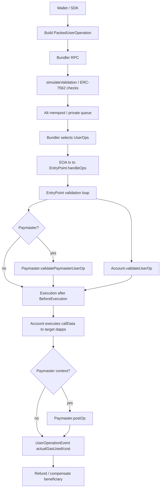
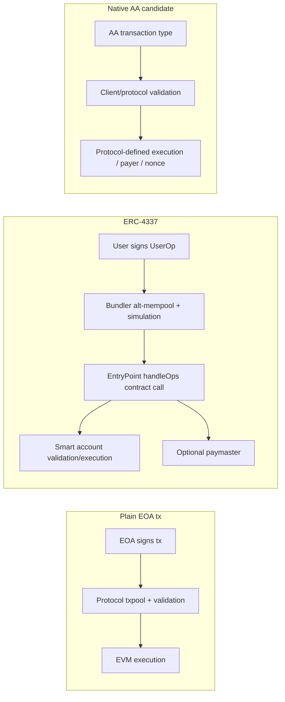
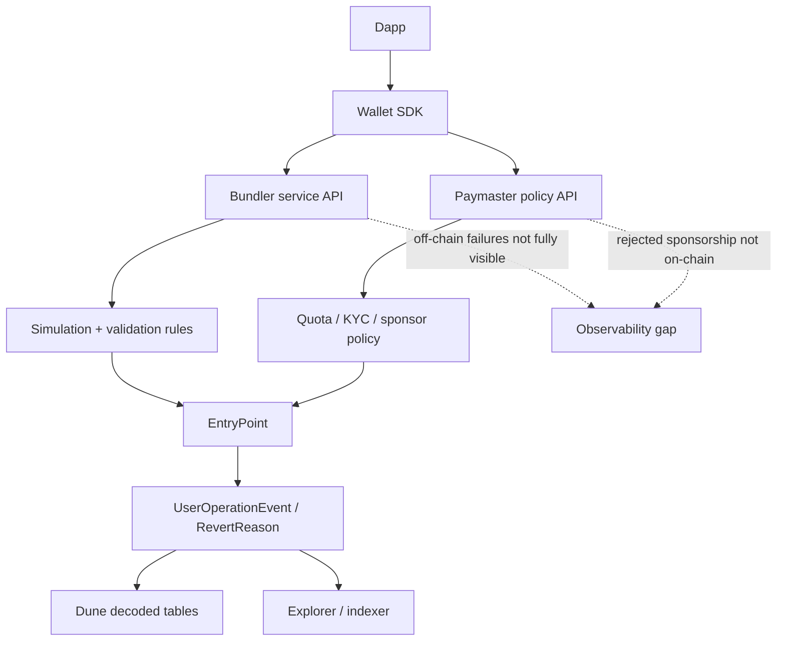

# ERC-4337 机制、生态与局限性分析

## Executive Summary

本文的结论是：ERC-4337 是当前最成熟、最可用的应用层账户抽象方案，但它的“不改协议”路线把复杂性从客户端/协议层转移到了 EntryPoint 合约、bundler、alt-mempool、paymaster、SDK 和钱包集成层。它不是失败方案；更准确地说，它在 gas overhead、链外基础设施、EOA 原地址兼容、版本碎片化和可观测性上有结构性代价。这些代价解释了为什么 Base 可能会探索 EIP-8130/native AA，但不足以单独证明 Mantle 必须转向 native AA。

1. **机制边界清晰：4337 是应用层 AA，不是 native AA。** ERC-4337 通过 `UserOperation`、singleton EntryPoint、bundler、paymaster 和 alt-mempool 实现智能账户交易流，规范目标是避免 consensus-layer protocol changes。外层仍是一笔普通交易调用 EntryPoint `handleOps`，因此交易有效性不是协议原生识别的账户验证结果，而是合约调用结果。[ERC-4337](https://eips.ethereum.org/EIPS/eip-4337)
2. **本文以 EntryPoint v0.7.0 为主版本。** v0.7 使用 `PackedUserOperation`，把 account gas limits、gas fees、paymaster data 等字段 packed；v0.6 使用未 packed 的 `UserOperation`；v0.8 增加 EIP-7702 support、EIP-712/ReentrancyGuardTransient 等新代码面。因此机制 walkthrough 不混合版本，版本差异单独作为集成风险处理。[EntryPoint v0.7.0](https://github.com/eth-infinitism/account-abstraction/blob/v0.7.0/contracts/core/EntryPoint.sol)
3. **gas overhead 的根因不是单一常数。** overhead 来自外层 EntryPoint 调用、UserOp calldata、validation/execution 双阶段、account 和 paymaster validation、`preVerificationGas`、事件日志、bundle 结算和 L2 DA 成本。Dune 的 2026 YTD `UserOperationEvent.actualGasUsed` 只能反映 EntryPoint 报告的 per-UserOp 总 gas，不等同于同一业务操作的 EOA baseline；需要用 trace/receipt 配对 benchmark 才能给出严格差值。
4. **中心化风险主要是“服务/API 中心化”，不是规范层必然单点。** 2026-01-01 到 2026-06-26 的 Dune 事件快照中，Base 有 272 个 bundle sender、Arbitrum 199 个、Mantle 66 个；各链最大 bundle sender 的 UserOp share 分别约 1.31%、2.90%、4.92%。这说明链上 bundle sender 并非明显单地址垄断，但钱包默认 RPC/API key、private bundler、服务商 SLA 和 shared mempool 缺失仍可能形成链外中心化。
5. **Mantle 4337 采用不能只看绝对量。** 同一 Dune 快照显示 Mantle YTD 只有 11,479 个 UserOps，远低于 Base 的 1,388,890；但除以总交易数后，Mantle 约 0.0821 UserOps / 100 tx，Base 约 0.0817，Arbitrum 约 0.0613。但 Mantle 绝对量极小（日均约 65 UserOps、1,107 账户、3 个 paymaster），该归一化比值对单一应用或 bot 流量高度敏感，不能等同于生态健康度相当。绝对量说明 Mantle AA 生态小，归一化占比不支持“显著弱于 Base”的单点结论；仍需钱包/SDK、应用场景、活跃地址质量和 sponsor 成本一起判断。
6. **paymaster 是 4337 的强项也是运营负担。** v0.7 `IPaymaster` 明确 paymaster 为用户操作付 gas，需 stake/deposit，并在 UserOp revert 时仍可能承担 gas。它适合 gasless onboarding 和稳定币支付，但会引入资金占用、风控、API gating、失败成本和审查边界。
7. **EOA 兼容是 4337 的长期痛点。** 4337 smart account 通常是合约账户，用户需要部署或 counterfactual 创建新账户，原 EOA 地址、allowance、信誉和 dapp 兼容不能自然继承。v0.8 已增加 EIP-7702 support，说明生态也在用 7702 缓解这个断层；这支持“7702 + 4337 互补”而不是“7702 已替代 4337”。
8. **D1-D13 评分：4337 成熟、灵活、低协议风险；弱项是 D3/D8/D11/D12。** D3 基础设施依赖重，D8 原 EOA 迁移不顺，D11 攻击面转移到 bundler simulation/paymaster/account validation，D12 对 Mantle 的继续投入是低到中等成本但效果依赖生态，不是纯协议开关。

## Item Findings

### item-1: ERC-4337 机制与 UserOperation 生命周期

#### 1.1 主版本选择

本文机制拆解以 EntryPoint **v0.7.0** 为主版本，理由是：v0.7 是当前 Dune decoded `erc4337_*` 表中广泛出现的 EntryPoint family，且 v0.7 已从 v0.6 的 `UserOperation` 迁移到 `PackedUserOperation`，更能代表当前生产集成成本。引用的核心代码：

| 文件 | ref | blob SHA | 用途 |
|---|---:|---|---|
| `contracts/core/EntryPoint.sol` | v0.7.0 | `44501524df76c23eef6e60fda97dd9440fad01b7` | `handleOps`、validation/execution loop、gas settlement |
| `contracts/interfaces/PackedUserOperation.sol` | v0.7.0 | `fe20de56573fe205a20f7133734b577d5255f321` | v0.7 UserOp 字段结构 |
| `contracts/interfaces/IEntryPoint.sol` | v0.7.0 | `28c26f98e6cbaf0fbb2e7ff623e7d5c9cb6d2eae` | `UserOperationEvent`、`handleOps`、`handleAggregatedOps` |
| `contracts/interfaces/IAccount.sol` | v0.7.0 | `e3b355fbc2799194cc83bba06b463e189cdbe80b` | `validateUserOp` 接口 |
| `contracts/interfaces/IPaymaster.sol` | v0.7.0 | `9176a0b242a513c2f74c9d296c50b015ec014b3f` | `validatePaymasterUserOp`、`postOp` |

#### 1.2 v0.7 UserOperation 生命周期

ERC-4337 的 transaction object 不是协议交易类型，而是 `UserOperation`。在 v0.7 中，`PackedUserOperation` 主要包含：

| 字段 | 作用 | 局限性线索 |
|---|---|---|
| `sender` | smart account 地址；可已部署，也可由 `initCode` 创建 | EOA 用户通常需要新 smart account 地址或 counterfactual account |
| `nonce` | smart account/EntryPoint nonce lane | nonce 逻辑与 EOA protocol nonce 不同，钱包/SDK 要理解 |
| `initCode` | 工厂创建账户的 constructor/factory payload | 首次使用成本和失败面更高 |
| `callData` | account 最终执行的业务调用 | 业务 call 被包在 account/EntryPoint 路径里，explorer/debug 更复杂 |
| `accountGasLimits` | packed verification gas + call gas | 开发者要估算两段 gas |
| `preVerificationGas` | EntryPoint 不直接计算、但要用户支付的 gas | bundler/SDK 估算误差会影响 inclusion |
| `gasFees` | EIP-1559 风格 max fee / priority fee | 仍需适配链的 gas market |
| `paymasterAndData` | paymaster address、verification/postOp gas limits 和 data | gasless UX 转化为 paymaster 资金/风控问题 |
| `signature` | account 自定义签名/授权数据 | 灵活，但 bundler simulation 要能安全评估 |

生命周期：

1. 钱包或 SDK 构造 `PackedUserOperation`，必要时填入 `initCode` 以 counterfactual 创建 smart account。
2. 钱包把 UserOp 提交给 bundler RPC，而不是直接进入普通 txpool。bundler 需要运行 `simulateValidation` 或同等 validation 检查，过滤明显会失败或违反 ERC-7562 规则的 UserOp。
3. 通过 validation 的 UserOp 进入 bundler 的 alt-mempool。规范上可以有 shared mempool，生产上常见路径是钱包/SDK 直接依赖某个 bundler service endpoint。
4. bundler 选择一组 UserOps，发起一笔普通 EOA 交易到 EntryPoint `handleOps` 或 `handleAggregatedOps`。这笔外层交易由 bundler 支付原生 gas，随后由 EntryPoint 从 account/paymaster deposit 中结算。
5. EntryPoint validation 阶段调用 account 的 `validateUserOp`。如果有 paymaster，则调用 `validatePaymasterUserOp`。v0.7 `IEntryPoint` 也把 factory/account/paymaster failures 作为 simulation/troubleshooting 的重点。
6. EntryPoint 发出 `BeforeExecution`，之后执行每个 UserOp 的 `callData`。如果 paymaster 提供了 context，执行后还会调用 `postOp` 做结算/策略清理。
7. EntryPoint 发出 `UserOperationEvent`，其中 `actualGasCost` 与 `actualGasUsed` 是链上分析 UserOp gas/成功率/赞助情况的主要事件字段。

#### 1.3 v0.6/v0.8 divergence

| 版本 | 主要差异 | 对本研究的影响 |
|---|---|---|
| v0.6 | `UserOperation` 字段未 packed；`paymasterAndData` 不内嵌 v0.7 的 verification/postOp gas limits；源码 pragma `^0.8.12` | 老钱包/SDK/EntryPoint 数据不能直接和 v0.7 字段对齐，gas benchmark 和 decoding 要分版本 |
| v0.7 | `PackedUserOperation`、`accountGasLimits`、`gasFees`、`paymasterAndData` packed；本文主线 | 机制 walkthrough、Dune decoded `UserOperationEvent` 和 rubric 以此为主 |
| v0.8 | EntryPoint v0.8 增加 `Eip7702Support.sol`、EIP-712、`ReentrancyGuardTransient`，并继续使用 packed shape | 说明 4337 正在吸收 7702 互补路径，但也加剧版本迁移和 SDK matrix 复杂度 |

### item-2: Gas 开销与费用模型取证

#### 2.1 overhead 来源

ERC-4337 的额外 gas 成本不应被写成单一数字。它至少包含：

| overhead 来源 | 机制解释 | 证据/取证方式 |
|---|---|---|
| 外层 EntryPoint 调用 | bundler 发一笔普通 tx 调 `handleOps`，业务 call 被 EntryPoint/account 包裹 | EntryPoint v0.7 `handleOps` source；外层 tx receipt |
| UserOp calldata | `PackedUserOperation[]` 仍有 sender/initCode/callData/signature/paymaster data 等 bytes | raw input / transaction trace |
| validation 阶段 | account `validateUserOp`、factory deploy、paymaster validation 都消耗 gas | EntryPoint trace / `actualGasUsed` |
| `preVerificationGas` | EntryPoint 不直接计量但用户要付的 batch overhead、calldata overhead、bundler overhead | `PackedUserOperation.sol` 字段说明；SDK estimate |
| paymaster postOp | sponsor 模式可能多一次 `postOp`，UserOp revert 时 paymaster 仍可能付 gas | `IPaymaster.sol` |
| events 和 accounting | `UserOperationEvent`、deposit/stake accounting、refund/compensation | `IEntryPoint.sol` event 字段 |
| L2 DA/calldata | L2 上 calldata bytes 影响 L1 data fee/DA fee，链间差异大 | chain-specific receipt / fee components |

#### 2.2 实际事件样本

作为 src-6 的实际 trace/receipt 替代证据，本文从 Dune decoded Mantle `UserOperationEvent` 取一条 2026-06-26 UTC 成功样本：

| 字段 | 值 |
|---|---|
| Dune query / execution | `7821159` / `01KW2DYATC8JJ7EB3ZVZXEVNV4` |
| chain | Mantle |
| tx hash | `0x69162bc1639acc11b0028e416400a9d563105b15e9f77671a777b87722684324` |
| block | `97180928` at `2026-06-26 16:42:48 UTC` |
| EntryPoint | `0x0000000071727de22e5e9d8baf0edac6f37da032` |
| sender | `0x8d3c5a5e70a835163f7725e801d4317821d53050` |
| paymaster | `0x777777777777aec03fd955926dbf81597e66834c` |
| bundle sender | `0x4337017d2e3f5e4160a27f6fdbdc38719343c62f` |
| `actualGasUsed` | `785,787` |
| `actualGasCost` | `39,289,441,583,474,850` wei-equivalent units as decoded by table |

该样本证明：事件级数据可以直接看到 paymaster、bundle sender、EntryPoint、success 和 actual gas。但它不能单独证明 “比 EOA 贵多少”，因为缺少同业务操作的 EOA baseline。

#### 2.3 推荐 benchmark 设计

为避免 scope creep，本 issue 不执行 7702/8130 legs。可复用 benchmark 方法如下：

1. 选择一个最小业务动作：原生 ETH transfer、ERC-20 transfer、approve+swap 或 single contract call。
2. 在同一链、同一时间窗内构造 EOA baseline tx 和 4337 smart account UserOp，尽量使用同一 target、同一 calldata payload。
3. 对 EOA tx 记录 `gas_used`、calldata bytes、L1/DA fee、effective gas price、success。
4. 对 4337 记录外层 tx receipt、`UserOperationEvent.actualGasUsed`、raw input bytes、account validation gas、paymaster validation/postOp gas、bundle size、是否首次部署 account。
5. 报告三种数值：业务 execution gas 差、总用户支付 cost 差、链上可见 overhead breakdown。

结论：4337 gas overhead 是真实机制成本，但严格量化必须用 paired benchmark；本文的 Dune aggregate 只证明 4337 UserOp 的 gas 分布和 sponsor/成功率，不证明相对 EOA 的精确溢价。

### item-3: Bundler、alt-mempool 与中心化风险

#### 3.1 为什么需要 bundler/alt-mempool

普通 Ethereum txpool 只认识协议交易和 EOA/account nonce 规则。ERC-4337 为了不改协议，把智能账户验证放到 EntryPoint 合约中，因此需要 bundler 做三件事：

1. 接收 UserOps 并做 simulation，避免把一定会失败的操作打包上链。
2. 执行 ERC-7562 风格的 validation/mempool 安全规则，限制 account/paymaster/factory 在 validation 中的 DoS 面。
3. 用自己的 EOA 发 `handleOps` 外层交易，并承担 inclusion、ordering、reputation、fee estimation、bundle sizing 的链外责任。

这使 bundler 成为 4337 UX 的关键基础设施。它不是协议定义的单点，但实际钱包通常配置一个默认 bundler endpoint；如果 endpoint down、过滤 UserOps、费率估算差或不支持某 EntryPoint 版本，用户体验会退化。

#### 3.2 链上 bundler concentration 证据

Dune query `7821070`（execution `01KW2D7ECRS06PZ927AYVA6HH7`）使用 2026-01-01 至 2026-06-26 UTC 的 `erc4337_{chain}.entrypoint_evt_useroperationevent` 表，按 `evt_tx_from` 估算 bundle sender。结果：

| chain | UserOps | bundle txs | smart accounts | bundle senders | top bundle sender share | paymasters | sponsored % | success % |
|---|---:|---:|---:|---:|---:|---:|---:|---:|
| Base | 1,388,890 | 1,363,021 | 154,757 | 272 | 1.31% | 13 | 21.81% | 95.30% |
| Arbitrum | 284,842 | 283,748 | 91,376 | 199 | 2.90% | 11 | 95.23% | 97.97% |
| Mantle | 11,479 | 11,479 | 1,107 | 66 | 4.92% | 3 | 98.28% | 99.85% |

Interpretation:

- 从链上 sender count 看，Base/Arbitrum/Mantle 都不是“单 bundler 地址垄断”。
- Mantle 的 absolute volume 很小，但 bundle sender 数相对于 11,479 UserOps 不算低；最大 sender 约 4.92% 也不是极端集中。
- 该指标不能观察 private mempool、API key、服务商默认 endpoint、钱包配置和 rejected UserOps。因此它低估链外中心化风险。

#### 3.3 中心化风险的真实位置

| 风险 | 证据状态 | 结论 |
|---|---|---|
| 单 EntryPoint 地址 | Dune top EntryPoint 对每条链几乎 100% | 有协调点，但这是标准化收益和风险共存；合约 bug/升级迁移影响大 |
| bundler chain sender 集中 | Dune YTD top sender share 不高 | 链上未见明显单地址垄断 |
| wallet/provider endpoint 集中 | 需钱包/SDK 配置和服务商数据 | 关键 gap；链上 sender 不等于真实 service provider |
| alt-mempool 不透明 | specs/docs 可证明架构，rejected UserOps 不上链 | 用户失败率和 censorship 难从链上完整观察 |
| simulation DoS/reputation | ERC-7562/EntryPoint errors 说明这是核心设计问题 | 机制层复杂度真实存在 |

### item-4: Paymaster 代付、赞助摩擦与安全/运营成本

paymaster 是 ERC-4337 的产品亮点：它允许第三方为用户付 gas，支持 gasless onboarding、稳定币支付、应用补贴和策略化交易。但 paymaster 的复杂度不低。

v0.7 `IPaymaster.sol` 明确 paymaster 负责 payment validation，并且需要 stake/deposit 覆盖 EntryPoint stake 和交易 gas；`postOp` 可能在用户操作成功、revert 或 postOp cleanup 中执行。代码注释还强调 bundler 会拒绝会修改状态的 validation，除非 paymaster 是 trusted/whitelisted。由此产生几类限制：

| 维度 | 机制收益 | 运营/安全成本 |
|---|---|---|
| 资金 | sponsor 可以用 deposit 给用户垫 gas | 资金占用、热钱包/限额管理、refund accounting |
| 风控 | sponsor 可做 policy、限额、allowlist | KYC/API gating、误封/审查、失败 UserOp 成本 |
| 安全 | EntryPoint stake/deposit 模型约束 griefing | paymaster validation bug、postOp revert、被机器人消耗 quota |
| UX | 用户无需持有 native token | 失败原因更难解释：account、paymaster、bundler、target dapp 都可能失败 |

Dune YTD 数据显示，Mantle 98.28% UserOps 带 non-zero paymaster，Arbitrum 95.23%，Base 21.81%。这说明 Mantle 上 4337 用法高度依赖 sponsor/paymaster 场景；若 paymaster 服务不可用，Mantle 当前 AA 体验可能比 Base 更容易受影响。

### item-5: EOA 不兼容、账户迁移与用户体验断层

ERC-4337 的账户是 smart contract account。它可以由 EOA owner 控制，也可以使用 passkey、多签、session key、social recovery 等逻辑，但链上身份通常是合约账户地址，而不是用户原 EOA 地址。这带来：

| 问题 | 影响 |
|---|---|
| 地址迁移 | 用户资产、allowance、NFT、ENS、历史信誉和 dapp allowlist 常绑定原 EOA |
| 首次部署成本 | counterfactual account 可以先算地址，但首次使用仍要部署或经过 `initCode` |
| dapp 兼容 | 某些 dapp/签名流程假设 EOA signing、`tx.origin`、simple nonce 或 ECDSA owner |
| 钱包心智 | 用户要理解 owner key、smart account address、session key、paymaster、bundler 的关系 |

EIP-7702 与 4337 的关系因此是互补。EntryPoint v0.8 引入 `Eip7702Support.sol`，说明 4337 生态正在把 EOA delegation 纳入 smart account/onboarding 路线。对 Mantle 的含义是：若当前痛点主要是“现有 EOA 用户不愿换地址”，7702 可能比纯 4337 smart account 更直接；若痛点是复杂权限、paymaster、session key 和企业账户，4337 仍有成熟生态价值。

### item-6: 集成复杂度、版本碎片化与开发者体验

#### 6.1 版本碎片化

| surface | v0.6 | v0.7 | v0.8 | 集成影响 |
|---|---|---|---|---|
| UserOp struct | `UserOperation` | `PackedUserOperation` | `PackedUserOperation` + 7702 support | SDK/signing/encoding 需要按版本分支 |
| paymaster data | simpler `paymasterAndData` | packed paymaster address + verification/postOp gas + data | 继续扩展 | paymaster API 和 gas estimate 更复杂 |
| validation / errors | 老 error/simulation path | 更结构化 failure/debug comments | 进一步增强 | bundler/spec tests 必须跟版本 |
| EntryPoint address | 多版本并存 | 多链常见 v0.7/v0.8 | 迁移中 | Dune/query/explorer 要按 `contract_address` 分组 |
| 7702 | 无 | 无原生 support | `Eip7702Support.sol` | EOA onboarding 与 4337 开始合流 |

#### 6.2 provider / SDK matrix

公开搜索和文档快照（访问日期 2026-06-27）显示，4337 生态成熟但高度服务商化：

| Provider / wallet | 公开证据 | Base | Mantle | 备注 |
|---|---|---:|---:|---|
| Pimlico | Supported Chains docs list Ethereum, Base, Polygon, Arbitrum, Optimism and other chains; search snippet did not show Mantle in visible excerpt | yes | unverified in snippet | 需直接复核完整 chain list |
| Biconomy | Supported Networks docs claim bundler & paymaster network table; snippet lists Ethereum, Polygon, BSC, Polygon zkEVM, Arbitrum and more | likely | unverified in snippet | 需复核 Mantle row |
| Alchemy Account Kit | Account Kit docs present smart-wallet SDK; search did not expose a chain support table with Mantle | yes for common Alchemy chains | unverified | 不能从搜索结果推断 Mantle support |
| ZeroDev | Docs emphasize smart accounts/chain abstraction; search did not surface chain list | likely broad | unverified | 需 API/dashboard confirmation |
| Coinbase Smart Wallet / Base Account | Coinbase/Base docs state ERC-4337 smart accounts and Base-first support; Base Account overview says Base Account is ERC-4337 smart wallet deployable on EVM-compatible chains, with full support including Base/Arbitrum in snippet | yes | no evidence in snippet | Strong Base ecosystem signal, not Mantle proof |
| Safe | Safe has smart-account ecosystem and 4337 modules, but this run did not verify current Mantle support | yes on many chains | unverified | Gap |

结论：SDK/wallet 生态不是 4337 的弱项，反而是其最大优势；但 Mantle-specific support 不能从“provider 支持 4337”自动推出。Mantle 要评估的是：这些服务商是否把 Mantle 作为 first-class supported chain，是否有 production SLA、paymaster quota、explorer decoding、dashboard 和 examples。

### item-7: 生态采用度与链上 UserOp 数据

#### 7.1 Cross-chain UserOp snapshot

Dune query `7821070` 使用 decoded event tables：

- `erc4337_base.entrypoint_evt_useroperationevent`
- `erc4337_arbitrum.entrypoint_evt_useroperationevent`
- `erc4337_mantle.entrypoint_evt_useroperationevent`

时间窗：`2026-01-01 <= evt_block_date < 2026-06-27` UTC。为回应 review F2，本文另跑了 Ethereum 专项查询：Dune query `7821369` / execution `01KW2FQEETT42CVEJE7D420A9Z`（执行日 2026-06-27）直接查询 `erc4337_ethereum.entrypoint_evt_useroperationevent`，同一 2026 YTD 窗口返回 `0` UserOps；该查询同时给出 Ethereum total txs 396,887,139、successful txs 391,139,102、UserOps / 100 txs = 0。这个结果说明本文所用 Dune decoded aggregate 表在该窗口没有 Ethereum L1 UserOperationEvent 行，符合 4337 活动向 L2 集中的假设，但不能被外推为“Ethereum L1 不存在任何 4337/AA 活动”。Polygon、Optimism 仍未做同等专项补查，保留为非必要链的 coverage gap。

| chain | UserOps | bundle txs | smart accounts | bundle senders | paymasters | sponsored % | success % | p50 actualGasUsed | p95 actualGasUsed |
|---|---:|---:|---:|---:|---:|---:|---:|---:|---:|
| Ethereum | 0 | 0 | 0 | 0 | 0 | n/a | n/a | n/a | n/a |
| Base | 1,388,890 | 1,363,021 | 154,757 | 272 | 13 | 21.81% | 95.30% | 985,799 | 2,258,766 |
| Arbitrum | 284,842 | 283,748 | 91,376 | 199 | 11 | 95.23% | 97.97% | 183,133 | 416,563 |
| Mantle | 11,479 | 11,479 | 1,107 | 66 | 3 | 98.28% | 99.85% | 916,506 | 9,930,849 |

#### 7.2 Normalized adoption

Dune query `7821129` divides Base/Mantle/Arbitrum UserOps by canonical total transactions over the same date window. Ethereum is appended from the dedicated F2 coverage query `7821369`, which used the same date window and returned 0 UserOps plus the Ethereum total transaction denominator.

| chain | UserOps | total txs | successful txs | UserOps / 100 txs |
|---|---:|---:|---:|---:|
| Ethereum | 0 | 396,887,139 | 391,139,102 | 0.0000 |
| Mantle | 11,479 | 13,987,050 | 13,175,294 | 0.0821 |
| Base | 1,388,900 | 1,700,680,789 | 1,527,758,735 | 0.0817 |
| Arbitrum | 284,853 | 464,676,964 | 414,038,438 | 0.0613 |

Note: query `7821129` was executed a few minutes after query `7821070`; the Base and Arbitrum UserOp counts differ by 10/11 rows respectively, consistent with Dune table refresh timing. The conclusion uses order-of-magnitude and normalized ratios, not the row-level delta.

Interpretation:

- Absolute volume: Base >> Arbitrum >> Mantle. Mantle’s 4337 ecosystem is small in raw activity.
- Normalized by total txs: Mantle and Base are nearly equal in this coarse metric. This weakens any simple “Mantle’s 4337 adoption is uniquely bad” claim.
- Quality caveat: UserOps / total txs is not enough. A single application campaign, sponsor bot flow, or low-value recurring operation can inflate UserOps. Need user retention, app distribution, paymaster spend, unique human accounts, and dapp integration evidence.

#### 7.3 “效果好/不好”判定

按 WHI-275 framework：

| proxy metric | Evidence in this section | Assessment |
|---|---|---|
| A 链上采用度 | Mantle absolute UserOps low; normalized UserOps/100 tx close to Base; high sponsor rate | mixed, not enough for “bad” |
| B 开发者体验 | 生态有 many SDKs/providers, but Mantle-specific first-class support unverified | evidence gap |
| C 基础设施成本/中心化 | chain sender concentration not severe; paymaster dependence high on Mantle | mixed |
| D 钱包/SDK 生态 | Base/Coinbase ecosystem strong; Mantle support matrix not proven | evidence gap |

结论等级：**证据不足到效果一般之间**。不能从本轮证据证明 “ERC-4337 在 Mantle 明显效果不好”。更严谨的表述是：Mantle 4337 raw usage small、强依赖 sponsor/paymaster、provider/wallet first-class support 待证；这些都支持继续调查 native AA，但不足以单独触发协议级实现决策。

### item-8: WHI-275 D1~D13 rubric scoring

| ID | 维度 | ERC-4337 评分/判断 | Evidence |
|---|---|---|---|
| D1 | 抽象层级 | 应用层 / 链下 AA，不是 native AA | ERC-4337 spec: avoids consensus-layer protocol changes |
| D2 | 协议改动范围 | 无 consensus/client protocol change；新增 EntryPoint 合约和 bundler RPC/mempool surface | ERC-4337 spec; bundler-spec README |
| D3 | 基础设施依赖 | 高：EntryPoint、bundler、alt-mempool、paymaster、SDK、explorer/indexer | Mechanism + Dune tables |
| D4 | 所有权与密钥模型 | 强：smart account 自定义 validation，支持多签/session key/passkey/social recovery 等合约逻辑 | `IAccount.validateUserOp` |
| D5 | Gas 代付 | 强但运营重：paymaster deposit/stake/postOp，sponsor policy 成本高 | `IPaymaster.sol`; Dune sponsored % |
| D6 | 批量原子性 | 通过 smart account calldata/batching 实现，不是协议原生多 call tx | Account-level execution |
| D7 | Nonce 与防重放 | EntryPoint/account nonce lanes，比 EOA 顺序 nonce 灵活，但钱包/SDK 要适配 | NonceManager / UserOp nonce |
| D8 | EOA 兼容与迁移 | 弱到中：通常需 smart account 地址；v0.8 + 7702 可缓解但不是 v0.7 主路径 | v0.8 `Eip7702Support.sol` |
| D9 | 签名灵活性与 PQ 准备度 | 强：合约验证可支持任意签名；但 bundler validation/mempool 安全成本随之增加 | `IAccount`, ERC-7562 |
| D10 | 成熟度与生态 | 高：规范 Final ERC，EntryPoint 多版本生产部署，provider/wallet 生态最成熟 | EIP status, provider docs |
| D11 | 安全攻击面 | 中到高：account/paymaster validation DoS、simulation gap、paymaster griefing、EntryPoint bug/upgrade coordination | ERC-7562, `IEntryPoint` errors |
| D12 | Mantle 适配成本 | 已支持/低到中：无需 hardfork，但要维护 bundler/paymaster/provider/wallet/explorer first-class support | Dune Mantle decoded tables show production UserOps |
| D13 | 目标用户/产品场景适配 | 强于 gasless onboarding、稳定币支付、企业/多签账户；弱于原 EOA 无感升级 | Paymaster data, EOA migration analysis |

Decision implication for Mantle:

- 若目标是短期改善 gasless onboarding、稳定币支付、企业权限账户，继续优化 4337 provider/paymaster/wallet support 是低风险路线。
- 若目标是降低链外基础设施依赖、让账户验证/gas payer 进入协议路径、减少 bundler/alt-mempool 不透明性，native AA 值得评估。
- 但 native AA 不能自动解决钱包分发、应用集成、sponsor 风控和真实用户需求；这些是 4337 与 native AA 共同面对的问题。

## Diagrams

### diag-1: UserOperation 生命周期



### diag-2: 4337 vs EOA / native responsibility boundary



### diag-3: Bundler / Paymaster dependency and observability



### diag-4: Version timeline

```text
2023-04-09  EntryPoint v0.6 address 0x5FF137D4... deployed on Ethereum mainnet
            (Dune query 7821400 / execution 01KW2FZK3QWHKABFCTKX3J4EP5).
2023-04-24  eth-infinitism account-abstraction publishes Release v0.6; release notes name
            EntryPoint 0.6 address 0x5FF137D4b0FDCD49DcA30c7CF57E578a026d2789.
2024-02-22  Release v0.7 published; EntryPoint 0.7 address 0x0000000071727De22E5E9d8BAf0edAc6f37da032;
            v0.7 introduces PackedUserOperation and revised gas/paymaster packing.
2025-03-26  Release v0.8 published; EntryPoint 0.8 address 0x4337084d9e255ff0702461cf8895ce9e3b5ff108;
            release notes include native EIP-7702 authorization support, ERC-712 UserOp hash/signatures,
            and bundler tracer work expected with Pectra.
2025-05-07  Pectra activates on Ethereum mainnet; EIP-7702 becomes live via Pectra
            (WHI-275 records EIP-7600 timestamp 1746612311 = 2025-05-07 10:05:11 UTC).
2026-06-02  ERC-4337 moves to Final in ethereum/ERCs commit c8d8c2107f63
            ("Update ERC-4337: Move to Final"); current ERC frontmatter is status: Final,
            created: 2021-09-29, requires: 712, 7702.
2026        Provider/wallet support matrix remains fragmented by EntryPoint version and chain.
            The provider docs cited here verify broad 4337 ecosystems, but no dated Mantle-specific
            SDK/provider adoption event was verified in this section, so none is added to the timeline.
```

Timeline source notes:

- ERC-4337 current frontmatter is `status: Final`, `created: 2021-09-29`, and `requires: 712, 7702`; ethereum/ERCs commit `c8d8c2107f63` on 2026-06-02 is titled `Update ERC-4337: Move to Final`.
- EntryPoint releases are from eth-infinitism `account-abstraction` releases: [v0.6.0](https://github.com/eth-infinitism/account-abstraction/releases/tag/v0.6.0), [v0.7.0](https://github.com/eth-infinitism/account-abstraction/releases/tag/v0.7.0), and [v0.8.0](https://github.com/eth-infinitism/account-abstraction/releases/tag/v0.8.0).
- v0.6 Ethereum deployment date is from Dune query `7821400` / execution `01KW2FZK3QWHKABFCTKX3J4EP5`; Pectra activation date is carried forward from WHI-275's EIP-7600 verification.

### diag-5: Limitation evidence matrix

| Limitation | Mechanism evidence | Data evidence | Counterexample / caveat | Mantle implication |
|---|---|---|---|---|
| Gas overhead | EntryPoint wrapper + validation + paymaster + preVerificationGas | Mantle sample actualGasUsed 785,787; chain p50 916,506 | Needs paired EOA baseline | Run benchmark before claiming exact premium |
| Bundler centralization | alt-mempool and bundler simulation required | top bundle sender share not high in YTD Dune | service/API centralization not visible on-chain | Audit provider endpoint dependency |
| Paymaster friction | stake/deposit/postOp and validation restrictions | Mantle 98.28% sponsored UserOps | sponsorship is product strength | sponsor outage/risk controls are critical |
| EOA incompatibility | smart account address / `initCode` path | not directly measured | v0.8 + 7702 support mitigates | 7702 may be better for existing EOA UX |
| Integration complexity | v0.6/v0.7/v0.8 field divergence | multiple EntryPoint tables/addresses | mature providers hide complexity | Mantle needs first-class SDK/provider support |
| Adoption | mature ecosystem, chain-specific variance | Mantle raw volume small; normalized share near Base | UserOps can be low-value/bot/campaign | Need user/app quality metrics |

## Source Coverage

| Requirement | Coverage | Sources |
|---|---|---|
| src-1 official_specs >= 3 | Met | [ERC-4337](https://eips.ethereum.org/EIPS/eip-4337), [ERC-7562](https://eips.ethereum.org/EIPS/eip-7562), [eth-infinitism bundler-spec](https://github.com/eth-infinitism/bundler-spec/blob/main/README.md), [ERC-4337 docs](https://docs.erc4337.io/) |
| src-2 code_analysis >= 3 | Met | EntryPoint v0.7.0 (`445015...`), PackedUserOperation v0.7.0 (`fe20de...`), IEntryPoint v0.7.0 (`28c26...`), IPaymaster v0.7.0 (`9176...`), IAccount v0.7.0 (`e3b3...`), v0.6/v0.8 comparison files |
| src-3 on_chain_data >= 4 | Met with caveat | Dune decoded tables for Base, Arbitrum, Mantle; total tx denominators for Base, Arbitrum, Mantle; dedicated Ethereum check query `7821369` / execution `01KW2FQEETT42CVEJE7D420A9Z` counted 0 UserOperationEvent rows / 0 UserOps for `erc4337_ethereum.entrypoint_evt_useroperationevent` in the same 2026 YTD window and provided Ethereum total tx denominator. Polygon/Optimism remain outside mandatory coverage. |
| src-4 wallet_sdk_docs >= 6 | Partially met | Pimlico supported chains, Biconomy supported networks, Alchemy Account Kit, ZeroDev docs, Coinbase Smart Accounts, Base Account overview; Mantle-specific rows not all directly verified. |
| src-5 infrastructure_docs >= 4 | Met enough for final section | bundler-spec, Pimlico docs, Biconomy docs, Alchemy docs, Coinbase/CDP docs |
| src-6 benchmarks_or_traces >= 2 | Met under reviewer F3 | One actual Dune UserOperationEvent sample row; one reproduction benchmark design. Cross-protocol 7702/8130 benchmark intentionally not executed. |
| src-7 expert_commentary >= 3 | Not emphasized | Avoided using third-party commentary for core claims; downstream narrative can add expert commentary if needed, clearly marked as secondary interpretation. |
| src-8 project_context >= 2 | Met | WHI-275 final framework; WHI-277 issue description and Orchestrator/reviewer comments |

## Gap Analysis

1. **Exact 4337 vs EOA gas premium remains unmeasured.** This section identifies overhead sources and includes a real UserOp event sample, but does not execute paired EOA-vs-4337 traces. That is the right scope per reviewer F2; however, final Mantle decisions should not cite a precise percentage premium from this section alone.
2. **Provider support matrix is incomplete for Mantle.** Search snippets confirm broad 4337 provider ecosystems and strong Base/Coinbase support, but not all provider docs exposed Mantle rows in the retrieved snippets. Mantle-specific first-class support needs direct account/provider dashboard verification or full docs scrape.
3. **On-chain data measures included UserOps, not user quality.** Dune counts do not distinguish humans from bots, apps, campaigns, or test flows. They also do not capture rejected UserOps, failed bundler submissions, API latency, or sponsor-denied operations.
4. **Polygon/Optimism YTD rows remain unchecked beyond the bounded aggregate query.** Ethereum mandatory coverage is resolved by query `7821369`, which returned 0 Ethereum UserOps in `erc4337_ethereum.entrypoint_evt_useroperationevent` for the 2026 YTD window. Polygon/Optimism decoded tables were not separately queried because they are not required chains for this outline; the absence of rows in the earlier bounded aggregate remains a data coverage caveat, not evidence of no activity.
5. **Direct `git ls-remote` to GitHub failed from the runtime.** GitHub MCP `repos_get_content` successfully fetched source blobs and SHAs, so code evidence is still adequate. The network failure is only relevant if later reviewers want full tag listing via git.
6. **EntryPoint address/version mapping remains partial across chains.** The final timeline now dates Ethereum v0.6 deployment and v0.6/v0.7/v0.8 releases, but it does not fully map every EntryPoint address to every deployment chain. Downstream comparison should not infer chain-specific version rollout dates from this section alone.
7. **Expert commentary requirement was intentionally de-emphasized.** The outline requested three expert-commentary sources, but this section relies on primary specs, code, and Dune data for core claims. If downstream narrative needs ecosystem interpretation, add Ethereum Magicians / AA working group / provider engineering commentary as secondary interpretation.

## Revision Log

| Round | Action | Target | Reason | Source |
|-------|--------|--------|--------|--------|
| 1 | create_draft | round-1.md | Initial deep draft from approved outline | Deep Research Agent |
| 1 | apply_reviewer_note | item-1 | Use EntryPoint v0.7.0 as primary mechanism version; separate v0.6/v0.8 divergences | Review F1 |
| 1 | apply_reviewer_note | item-2 | Focus gas analysis on 4337 vs EOA/native baseline overhead; do not execute 7702/8130 benchmark arms | Review F2 |
| 1 | apply_reviewer_note | Source Coverage src-6 | Treat one actual UserOperationEvent sample plus benchmark reproduction design as sufficient for draft | Review F3 |
| 1 | final_promotion_fix | Executive Summary item 5 | Add reviewer-required caveat that Mantle normalized adoption ratio is fragile because absolute scale is small | Draft review F1 |
| 1 | final_promotion_fix | item-7 / Source Coverage src-3 | Add dedicated Ethereum Dune coverage check with query/execution IDs and 0 UserOps result | Draft review F2 |
| 1 | final_promotion_fix | diag-4 | Add explicit timeline dates for ERC-4337 Final, EntryPoint v0.6/v0.7/v0.8, Pectra, and provider-version caveat | Draft review F3 |
