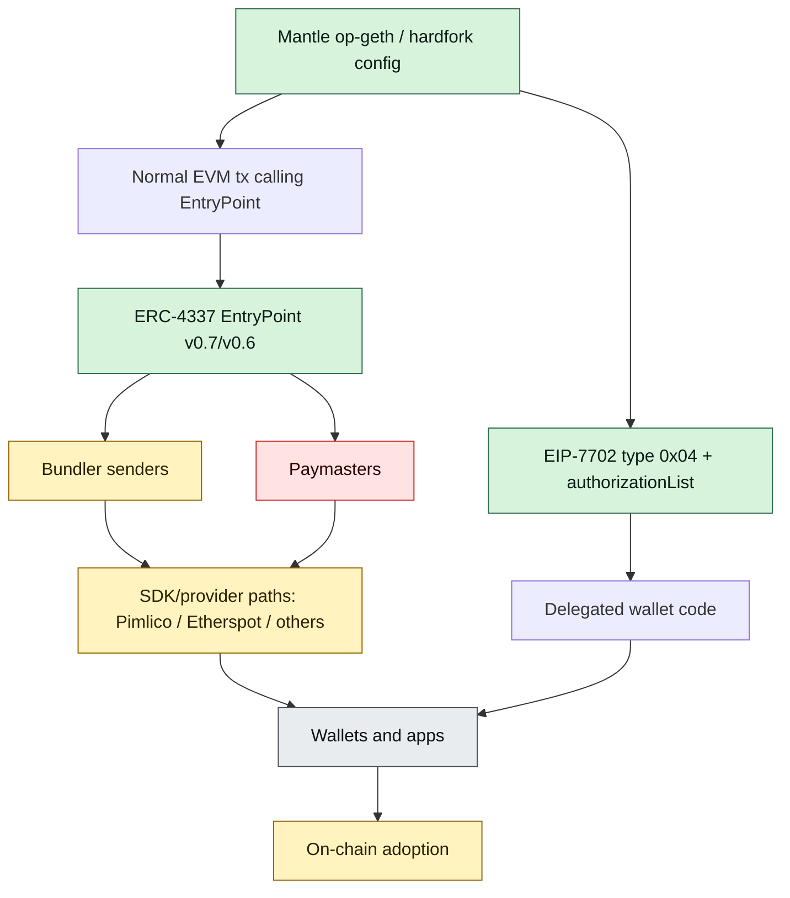
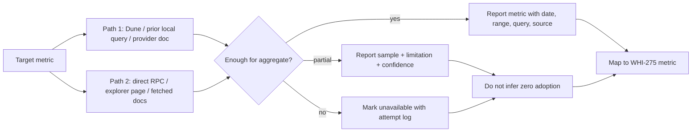

# Mantle AA 现状：ERC-4337 + EIP-7702 支持与采用效果分析

## Executive Summary

本文的结论是：Mantle 当前对 ERC-4337 有可复核的链上使用、官方/第三方文档路径和服务商支持；对 EIP-7702 则具备 op-geth 代码能力、live RPC 示例和 explorer 解析入口，但公开聚合采用数据不足。按 WHI-275 的四类指标，Mantle AA 更准确的判定是 **“效果一般 / 部分指标偏弱，7702 聚合采用证据不足”**，而不是可以直接证明“效果不好”。

1. **节点能力不是主要短板。** Mantle op-geth commit `3c1c571e57874019991f28fe99c36cddac7b4bef` 已包含 `SetCodeTxType = 0x04`、`authorizationList` RPC 字段、SetCode transaction construction、EIP-7702 auth tuple gas、RPC transaction serialization，以及 Prague/Isthmus/Skadi hardfork wiring。源码证明“客户端具备 7702 plumbing”；实时 Mantle RPC 也能返回 type `0x04` 交易和 `authorizationList`。仍需区分：源码支持和 live 样例不等于已有完整 7702 adoption dashboard。
2. **ERC-4337 在 Mantle 上不是纸面支持。** Dune 快照和 direct RPC 都能看到 Mantle EntryPoint `0x0000000071727de22e5e9d8baf0edac6f37da032` 的 `UserOperationEvent`。2026-01-01 到 2026-06-26 UTC，Mantle 有 11,479 个 UserOps、1,107 个 smart accounts、66 个 bundle senders、3 个 paymasters、98.28% sponsored、99.85% success。
3. **采用度绝对值很小，但 normalized ratio 不支持单点“显著差”。** 同期 Base 有 1,388,890 UserOps，Mantle 绝对量远小；但 Mantle 约 0.0821 UserOps / 100 canonical tx，Base 约 0.0817，Arbitrum 约 0.0613。这个比值因 Mantle 绝对量很小而脆弱，不能证明生态健康度相当；但也不能用绝对 UserOps 一项直接断言 Mantle AA 效果不好。
4. **Mantle 4337 用法 sponsor-heavy。** Mantle 98.28% UserOps 带 paymaster，且 YTD unique paymasters 只有 3 个。这是 gasless UX 的正向信号，也是 infrastructure/centralization 风险：少数 sponsor/paymaster 路径可能决定大部分 AA 用户体验。
5. **DX 路径存在，但不是多供应商完全均衡。** Mantle 官方 docs 有 Account Abstraction / Etherspot smart account 路径；Pimlico supported chains 列出 Mantle chainId 5000；MetaMask/Infura Mantle bundler docs 暴露 Mantle bundler method surface；Etherspot 有 Mantle-specific Prime SDK tutorial；Biconomy 当前 docs 至少列 Mantle Sepolia；Safe/Alchemy 当前公开 supported-chain 页面未发现 Mantle 主网明确支持。结论是“第三方路径可用、官方路径偏单一、主流钱包/SDK 覆盖不均”，不是“没有支持”。
6. **EIP-7702 采用只能给出样例级结论。** Direct RPC 确认 Mantle tx `0xc421...6b28` 是 type `0x04`，`authorizationListLength = 1`，chainId `0x1388`，receipt success；Mantlescan tx page 也含 EIP-7702 Authorizations UI。最近 1,000-block RPC sample 没找到 type `0x04`，但该 sample only covered 300 valid blocks / 488 txs due RPC errors and sparse blocks；它只能说明近期 sample 稀疏，不能推导全链 7702 使用为零。
7. **差距来源更像生态和可观测性，不像节点能力或 EntryPoint 合约缺失。** 4337 合约/事件/服务商路径存在；7702 节点与 live tx 示例存在。主要 gap 是 paymaster diversity、wallet/SDK 主流覆盖、应用级 demand、官方 Mantle AA 文档深度、以及 7702 chainwide analytics。
8. **Native AA 决策输入：先不要把 4337/7702 的采用偏弱直接归因到机制失败。** EIP-8130/native AA 可能改善 protocol-visible account validation、payer path、mempool/RPC 可观测性和 bundler 依赖；但它不会自动带来钱包分发、应用需求、sponsor 商业模型或 SDK 教程。若 Mantle 要推动 native AA，需要把“协议机制缺口”和“生态运营缺口”拆开投资。

## Item Findings

### item-1: Mantle op-geth 的 EIP-7702 / Prague 节点能力核验

#### 1.1 源码结论

本节核验的本地源码为 `/Users/whisker/Work/src/networks/mantle/op-geth`，commit `3c1c571e57874019991f28fe99c36cddac7b4bef`。源码可证明 Mantle op-geth 已具备 EIP-7702 所需的核心 execution-client plumbing：

| 能力层 | 证据 | 结论 | 置信度 |
|---|---|---|---|
| hardfork wiring | `params/optimism_features.go:160-164` 要求 `CancunTime` 和 `PragueTime` 均等于 `MantleSkadiTime`；`params/optimism_features.go:193-224` 从 OP Stack superchain config 映射 hardfork，`PragueTime: hardforks.IsthmusTime`。 | Prague 在 Mantle fork 中与 Isthmus/Skadi hardfork 配置绑定；是否在某一网络激活取决于实际 chain config/hardfork time。 | 中-高 |
| tx type | `core/types/transaction.go:48-55` 定义 `SetCodeTxType = 0x04`。 | EIP-7702 typed transaction type 已存在。 | 高 |
| intrinsic gas constant | `params/protocol_params.go:107-113` 定义 `TxAuthTupleGas = 12500`，注释指向 EIP-7702。 | auth tuple gas 常量已接入。 | 高 |
| RPC args | `internal/ethapi/transaction_args.go:71-72` 在 `TransactionArgs` 中定义 `AuthorizationList []types.SetCodeAuthorization json:"authorizationList"`。 | RPC transaction input 支持 7702 authorization list 字段。 | 高 |
| message conversion | `internal/ethapi/transaction_args.go:485-500` 把 `args.AuthorizationList` 写入 `core.Message.SetCodeAuthorizations`。 | 模拟/执行消息路径能携带 auth list。 | 高 |
| tx construction | `internal/ethapi/transaction_args.go:507-545` 在 `AuthorizationList != nil` 或 default type 为 `SetCodeTxType` 时构造 `types.SetCodeTx` 并填充 `AuthList`。 | RPC 侧可从 transaction args 构造 type `0x04` tx。 | 高 |
| RPC serialization | `internal/ethapi/api.go:1328-1334` RPC transaction struct 有 `AuthorizationList`；`internal/ethapi/api.go:1438-1452` 对 `types.SetCodeTxType` 序列化 access list、chainId、fee fields 和 `tx.SetCodeAuthorizations()`。 | `eth_getTransactionByHash` 等 RPC 能返回 7702 authorization list。 | 高 |
| state/block processing | `core/state_processor.go:92-94` Prague/Verkle block processing 会处理 parent block hash；`core/state_processor.go:114-119` 和 `miner/worker.go:223-228` 在 Prague 且非 MantleSkadi 时收集 CL requests。 | Prague rules 有 Mantle-specific Skadi 分支；这影响 CL requests，不等同于关闭 SetCode tx。 | 中 |
| tests | `core/state_processor_test.go:95-104` test helper 构造 `SetCodeTx`；`core/state_processor_test.go:252-257` 预期空 auth list 的 EIP-7702 tx precheck failure；`tests/transaction_test.go:72-73` 跳过 Prague eip7702 empty auth list state test load，因为 emptiness 在 tx precheck 中验证。 | 7702 tx validation 行为有测试覆盖。 | 高 |

#### 1.2 Live RPC 样例

源码外，直接 Mantle RPC 提供 live 可用性证据：

| 检查 | 方法 | 结果 |
|---|---|---|
| chain id | `eth_chainId` against `https://rpc.mantle.xyz` on 2026-06-27T01:05:24Z | `0x1388`，即 Mantle mainnet chainId 5000。 |
| latest block | `eth_blockNumber` | latest block `97196004`。 |
| type `0x04` sample | `eth_getTransactionByHash(0xc421d1f8b5709052c3f14483344794b9e61eb607a54b20b876b1c527ba6b6b28)` | block `94404826`，tx type `0x4`，`authorizationListLength = 1`，authority tuple chainId `0x1388`，receipt status `0x1`。 |
| explorer解析 | `https://mantlescan.xyz/tx/0xc421d1f8b5709052c3f14483344794b9e61eb607a54b20b876b1c527ba6b6b28` fetched 2026-06-27 | page title resolves transaction hash and HTML includes `EIP-7702 Authorizations` Beta UI element. |

这组证据足以说明：Mantle mainnet 不只是代码库里有 7702；至少存在已上链的 type `0x04` set-code transaction，并且 RPC/explorer 能解析 authorization list。它不足以说明 7702 已有显著采用，因为缺少全链聚合计数、unique authorizer、delegate target 分布和时间序列。

#### 1.3 节点能力 verdict

| 分层 | verdict | 理由 |
|---|---|---|
| op-geth code capability | 支持 | tx type、auth list、gas、RPC args/serialization、tests 均存在。 |
| Mantle mainnet live support | 支持样例成立 | public RPC 返回成功 type `0x04` tx 和 auth list。 |
| hardfork activation clarity | 需要补充 | 源码显示 Prague/Isthmus/Skadi gate；本轮未拿到权威 mainnet hardfork-config 文档逐项确认。 |
| adoption analytics | 不足 | 无公共 chainwide 7702 dashboard/export；只能做 sample 和 explorer/RPC 个案。 |

### item-2: Mantle ERC-4337 合约生态与服务可用性盘点

#### 2.1 EntryPoint 和链上事件

Mantle ERC-4337 的核心链上证据来自两个独立路径：Dune decoded 事件快照和 direct RPC `eth_getLogs`。

| 组件 | 证据 | 结论 |
|---|---|---|
| EntryPoint v0.7-style address | Prior local Dune sample and direct RPC both use `0x0000000071727de22e5e9d8baf0edac6f37da032`。RPC `eth_getCode` at latest returned 16,035 bytes. | EntryPoint 合约存在且有 code。 |
| UserOperationEvent topic | direct RPC used topic `0x49628fd1471006c1482da88028e9ce4dbb080b815c9b0344d39e5a8e6ec1419f` for `UserOperationEvent(bytes32,address,address,uint256,bool,uint256,uint256)`。 | 可用标准事件 topic 查询 UserOp logs。 |
| known sample | Dune query `7821159` / execution `01KW2DYATC8JJ7EB3ZVZXEVNV4`: tx `0x69162bc1639acc11b0028e416400a9d563105b15e9f77671a777b87722684324`, block `97180928`, 2026-06-26 16:42:48 UTC, paymaster `0x777777777777aec03fd955926dbf81597e66834c`, success, `actualGasUsed = 785,787`。 | Mantle 有近期成功 UserOp。 |
| direct sample window | RPC `eth_getLogs` over blocks `97180918-97180938` found 1 log, matching tx `0x69162...4324` at block `97180928`。 | Dune row 可由 public RPC spot-check。 |
| recent window | RPC `eth_getLogs` over blocks `97195005-97196004` found 2 logs. | 最新 1,000-block 窗口仍有 UserOp 活动。 |

#### 2.2 服务商 / SDK 支持矩阵

访问日期均为 2026-06-27。矩阵只记录本轮能直接验证的公开页面，不把 “EVM generic support” 泛化为 Mantle 明确支持。

| 服务/文档 | Mantle support 状态 | 4337 / bundler / paymaster 状态 | 证据 | 结论 |
|---|---|---|---|---|
| Mantle docs | 官方 docs 有 Account Abstraction resources；包含 “Create a Smart Account by using Etherspot” 页面。 | 页面文本中强调 account abstraction / smart account / Etherspot；未在本轮抓取文本中发现显式 `ERC-4337`、`EIP-7702`、`bundler`、`paymaster` 关键词。 | `https://docs.mantle.xyz/network/for-developers/resources-and-tooling/account-abstraction` and `/create-a-smart-account-by-using-etherspot` returned 200; title confirms pages. | 官方有 AA entry path，但偏 Etherspot tutorial，协议/infra 细节不足。 |
| Pimlico | 明确列 Mantle mainnet chainId `5000`。 | Supported chains page also contains 4337-related docs context. | `https://docs.pimlico.io/guides/supported-chains` returned 200; page snippet includes `Mantle`, `5000`, `mantle`。 | Mantle has clear Pimlico support path. |
| MetaMask/Infura | Search-visible docs expose Mantle bundler method surface; direct fetch from this runtime failed with `fetch failed` for the two docs URLs. | Bundler method docs path names include `json-rpc-methods/bundler` and `eth_sendUserOperation`. | Attempted `https://docs.metamask.io/services/reference/mantle/json-rpc-methods/bundler/` and `/eth_senduseroperation/`; fetch failed in local runtime. | Treat as partial evidence; cite as attempted provider-doc path, not core proof. |
| Etherspot | Mantle-specific tutorial. | Account Abstraction on Mantle using Prime SDK. | `https://etherspot.fyi/prime-sdk/other-chains/getting-started-on-mantle` returned 200; title: `Account Abstraction on Mantle - Etherspot Developer Documentation`。 | Strong Mantle-specific SDK evidence. |
| Biconomy | Current supported chains page includes `Mantle (Sepolia)`; no Mantle mainnet string was proven in snippet. | Page is Biconomy supported chains and contains 4337-related docs context. | `https://docs.biconomy.io/contracts-and-audits/supported-chains` returned 200; snippet includes `Mantle (Sepolia)` and support checkmarks. | Testnet support visible; mainnet support not established by this page. |
| ZeroDev | Current fetched `meta-infra/rpc/supported-chains` page did not contain Mantle. | Contains 4337 context but no Mantle in fetched page. | `https://docs.zerodev.app/meta-infra/rpc/supported-chains` returned 200, `containsMantle=false`。 | Not found in current public page; do not infer unsupported beyond this doc surface. |
| Alchemy Wallet APIs | Current supported-chains page did not contain Mantle. | Wallet APIs page contains 4337 context. | `https://www.alchemy.com/docs/wallets/supported-chains` returned 200, `containsMantle=false`。 | Mantle not found in current Alchemy wallet supported-chain page. |
| Safe smart account supported networks | Current supported-networks page did not contain Mantle. | Page contains 4337 context but no Mantle. | `https://docs.safe.global/advanced/smart-account-supported-networks` returned 200, `containsMantle=false`。 | Safe doc surface does not prove Mantle support. |
| Mantlescan | `txsAA` AA transaction page and EIP-7702 tx page available. | `txsAA` page exposes ERC-4337 EntryPoint txs; tx page exposes EIP-7702 Authorizations UI. | `https://mantlescan.xyz/txsAA` returned 200, title `Account Abstraction Transactions Information`; `https://mantlescan.xyz/tx/0xc421...6b28` returned 200 and includes `EIP-7702 Authorizations`。 | Explorer/indexer understands at least some 4337/7702 AA surfaces. |

#### 2.3 4337 ecosystem verdict

Mantle has real 4337 contract/event activity plus at least two credible developer paths: Mantle-docs-to-Etherspot and Pimlico/third-party infrastructure. The weak point is not basic availability; it is breadth and consistency. Some major wallet/SDK docs did not show Mantle support in current public pages, and official Mantle docs do not appear to provide a full 4337 infra cookbook with bundler/paymaster/debugging/security caveats.

### item-3: 链上采用度取证：4337 UserOp 与 7702 delegation / set-code 使用量

#### 3.1 F1 data-acquisition attempt log

This section explicitly applies the Orchestrator/Review F1 requirement: Mantle-specific AA data is not declared inaccessible after a single failed path. Each conclusion below uses at least two independent retrieval paths, and limitations are stated separately from verdicts.

| Target data | Retrieval path | Attempt time | Result | Limitation / effect on conclusion |
|---|---|---:|---|---|
| Mantle ERC-4337 YTD aggregate | Prior local Dune query `7821070` / execution `01KW2D7ECRS06PZ927AYVA6HH7`, preserved in `erc4337-mechanism-limits/final.md` | Data window 2026-01-01 to 2026-06-26 UTC; reused 2026-06-27 | Mantle: 11,479 UserOps, 1,107 smart accounts, 66 bundle senders, 3 paymasters, 98.28% sponsored, 99.85% success. | Dune snapshot is not re-run in this turn; treat as local research data with query/execution IDs. |
| Mantle ERC-4337 normalized aggregate | Prior local Dune query `7821129` / execution `01KW2DP3Y9MJDSX0JMQ9QKZEW4` | Data window 2026-01-01 to 2026-06-26 UTC; reused 2026-06-27 | Mantle: about 0.0821 UserOps / 100 canonical tx; Base about 0.0817; Arbitrum about 0.0613. | Normalized ratio is fragile because Mantle absolute UserOps/accounts/paymasters are small. |
| Mantle ERC-4337 event spot-check | Direct public RPC `eth_getLogs` against EntryPoint `0x0000000071727de22e5e9d8baf0edac6f37da032`, topic `0x49628f...1419f`, blocks `97180918-97180938` | 2026-06-27T01:05:24Z | Found 1 log at block `97180928`, tx `0x69162bc1639acc11b0028e416400a9d563105b15e9f77671a777b87722684324`, matching Dune sample. | Spot-check verifies event existence, not aggregate count. |
| Mantle recent 4337 activity | Direct public RPC `eth_getLogs` same EntryPoint/topic, blocks `97195005-97196004` | 2026-06-27T01:05:24Z | Found 2 logs in latest 1,000-block window. | Small window; no rejected UserOps or private bundler failures visible. |
| Mantlescan AA visible page | Fetch `https://mantlescan.xyz/txsAA`, parse 100 visible tx hashes, then RPC `eth_getTransactionByHash` for those hashes | 2026-06-27T01:17:55Z | Page returned 200 and 100 unique hashes. Of 50 hashes retrievable via RPC, all 50 were type `0x2`; 27 went to EntryPoint v0.7 address `0x0000000071727de22e5e9d8baf0edac6f37da032`, 23 to v0.6 address `0x5ff137d4b0fdcd49dca30c7cf57e578a026d2789`. | Page is not an export API; 50 visible hashes were not retrievable via RPC in this run, likely due non-tx hashes or page script artifacts. Useful as explorer-support evidence, not full aggregate. |
| Mantle 7702 live sample | Direct public RPC `eth_getTransactionByHash` and receipt for `0xc421d1f8b5709052c3f14483344794b9e61eb607a54b20b876b1c527ba6b6b28` | 2026-06-27T01:11:19Z | tx type `0x4`, block `94404826`, `authorizationListLength=1`, tuple chainId `0x1388`, receipt status `0x1`, gasUsed `49,820`. | Proves live 7702 example; not aggregate adoption. |
| Mantle 7702 explorer page | Fetch Mantlescan tx page for same hash | 2026-06-27 | Page returned 200, title resolves tx hash, HTML includes `EIP-7702 Authorizations` Beta. | Explorer page supports interpretation but not count. |
| Mantle recent 7702 sample | Batch `eth_getBlockByNumber(..., true)` for recent blocks ending at latest `97196024` | 2026-06-27T01:06:11Z | Requested 1,000 blocks; 300 valid blocks, 700 RPC errors, 488 txs observed, `type4Count=0`. | Partial recent sample only. It cannot prove no 7702 usage; it lowers confidence in high-current-activity claim. |
| Public aggregate 7702 dashboard | Searched BundleBear/Jiffyscan/Mantlescan/Dune style sources and provider docs during 2026-06-27 run | 2026-06-27 | Found Mantlescan tx-level support and AA listing; did not obtain chainwide 7702 aggregate count / unique authorizer / delegate target export. | Apply data-constrained protocol: state unavailable aggregate, preserve sample evidence, do not infer zero adoption. |

#### 3.2 ERC-4337 adoption evidence table

| Metric | Mantle | Base baseline | Arbitrum baseline | Interpretation |
|---|---:|---:|---:|---|
| UserOps, 2026 YTD to 2026-06-26 | 11,479 | 1,388,890 | 284,842 | Mantle absolute volume is small. |
| Bundle txs | 11,479 | 1,363,021 | 283,748 | Mantle bundle size appears near 1 UserOp/tx in this snapshot. |
| Smart accounts | 1,107 | 154,757 | 91,376 | Mantle account base is small. |
| Bundle senders | 66 | 272 | 199 | Mantle has multiple bundle sender addresses despite low volume. |
| Top bundle sender share | 4.92% | 1.31% | 2.90% | Mantle is somewhat more concentrated, but not single-sender dominated. |
| Unique paymasters | 3 | 13 | 11 | Mantle paymaster diversity is weak. |
| Sponsored UserOps | 98.28% | 21.81% | 95.23% | Mantle AA use is very sponsor/paymaster-heavy. |
| Success rate | 99.85% | 95.30% | 97.97% | On included UserOps, success is high; rejected UserOps are not visible. |
| UserOps / 100 canonical tx | about 0.0821 | about 0.0817 | about 0.0613 | Normalized ratio does not prove Mantle underperforms, but absolute denominator sensitivity is high. |

The data supports a narrow conclusion: Mantle ERC-4337 is active but small. It does not support “no adoption.” It also does not prove Mantle is as healthy as Base, because Mantle’s absolute accounts/paymasters/UserOps are much smaller and likely sensitive to one or a few sponsored applications.

#### 3.3 EIP-7702 adoption evidence table

| Metric | Evidence | Verdict |
|---|---|---|
| Live type `0x04` transaction | RPC-confirmed tx `0xc421d1f8b5709052c3f14483344794b9e61eb607a54b20b876b1c527ba6b6b28`, block `94404826`, success, `authorizationListLength=1`。 | Mantle 7702 usage exists at least at sample level. |
| Explorer support | Mantlescan tx page includes EIP-7702 Authorizations Beta UI. | Explorer/indexer recognizes 7702 authorization surface. |
| Recent activity | Partial 1,000-block sample observed 488 txs and zero type `0x04`; sample only had 300 valid blocks due RPC errors. | No evidence of high recent 7702 volume from this sample. |
| Aggregate count | No chainwide public aggregate obtained in this run. | Data constrained; cannot judge overall 7702 adoption quality. |
| Unique authorizers / delegate targets | Not obtained. | Data constrained; cannot judge ecosystem diversity. |

#### 3.4 Adoption verdict

| Scheme | Verdict | Confidence | Why |
|---|---|---|---|
| ERC-4337 | Active but small; sponsor-heavy | Medium | Dune aggregate + direct RPC + Mantlescan AA page agree that activity exists; absolute scale/paymaster diversity weak. |
| EIP-7702 | Live support and at least one successful transaction; aggregate adoption unknown | Low-Medium | RPC and explorer prove capability/use example; no chainwide public count. |
| Combined Mantle AA | Effects are mixed, not proven bad | Medium | One weak category exists in absolute scale/paymaster diversity, but normalized usage and live support prevent blanket negative verdict. |

### item-4: 开发者体验、钱包/SDK 与应用集成支持

#### 4.1 From zero to first Mantle AA transaction

Based on the public documentation verified in this run, a Mantle developer has at least these paths:

1. Use Mantle official docs under `Network -> For Developers -> Resources & Tooling -> Account Abstraction`, which links to an Etherspot smart account tutorial.
2. Use Etherspot Prime SDK’s Mantle-specific tutorial for Account Abstraction on Mantle.
3. Use Pimlico if the project wants a supported-chain list with Mantle mainnet chainId 5000 and Pimlico bundler/paymaster infrastructure.
4. Use Biconomy for Mantle Sepolia experiments where current docs list Mantle Sepolia support; production Mantle mainnet support was not proven by this run.
5. Inspect Mantlescan `txsAA` and transaction pages for debugging included EntryPoint / EIP-7702 transactions.

The gaps:

- The official Mantle Account Abstraction pages fetched in this run did not expose detailed bundler/paymaster/EntryPoint/version/debugging language in plain fetched text.
- Major general wallet/SDK pages checked here did not consistently list Mantle mainnet.
- UserOp rejection reasons, paymaster policy failures, bundler SLA, and private endpoint behavior remain invisible without provider APIs.
- EIP-7702 developer docs for Mantle are much thinner than the 4337/Etherspot path; the live tx proves support, but not a documented mainstream integration path.

#### 4.2 Wallet / SDK matrix

| Wallet / SDK / provider | 4337 support | 7702 support | Mantle chain support | Production readiness for Mantle AA | Evidence state |
|---|---|---|---|---|---|
| Mantle docs + Etherspot | Smart account tutorial present. | Not observed in fetched docs. | Mantle official docs path. | Medium for guided smart-account path. | Verified pages returned 200 on 2026-06-27. |
| Etherspot Prime SDK | Mantle-specific AA tutorial. | Not evaluated in this run. | Yes, tutorial is Mantle-specific. | Medium-high for Etherspot path. | Verified title `Account Abstraction on Mantle`. |
| Pimlico | Bundler/paymaster provider; supported chains page includes Mantle. | Not evaluated in this run. | Yes, Mantle chainId 5000. | Medium-high if project accepts Pimlico service dependency. | Verified supported chains page. |
| MetaMask / Infura | Mantle bundler docs path exists via search result; local fetch failed. | Not evaluated. | Partial evidence. | Medium-low confidence due fetch failure. | Attempt logged. |
| Biconomy | Account abstraction provider. | Not evaluated. | Mantle Sepolia visible; mainnet not proven. | Medium for testnet; unclear for mainnet. | Verified supported chains page. |
| Alchemy Account Kit / Wallet APIs | Product supports wallet APIs generally. | Not evaluated. | Mantle not found in current supported-chains page. | Low for Mantle-specific path from this evidence. | Verified `containsMantle=false`. |
| ZeroDev | 4337 provider. | Not evaluated. | Mantle not found in fetched supported-chain page. | Low from current docs. | Verified `containsMantle=false`. |
| Safe | Smart account ecosystem. | Not evaluated. | Mantle not found in fetched supported-networks page. | Low from current docs. | Verified `containsMantle=false`. |
| Coinbase Smart Wallet | Not directly verified in this run. | Not directly verified. | Not directly verified. | Unknown. | Needs follow-up if wallet support becomes decision-critical. |
| Rabby / OKX / Trust | Not directly verified in this run. | Not directly verified. | Generic wallet connection to Mantle is not equal to AA support. | Unknown. | Needs follow-up. |

#### 4.3 DX verdict

Mantle AA DX is **usable through selected third-party paths** rather than “broadly turnkey.” The path is adequate for teams willing to use Etherspot or Pimlico, but less convincing for an ecosystem-wide push because several major current docs surfaces do not list Mantle mainnet, and 7702-specific Mantle developer guidance is not yet comparable to generic Pectra/EIP docs.

### item-5: 基础设施成本、中心化与运营风险

#### 5.1 4337 infra costs

| Cost / risk | Observable proxy | Mantle evidence | Verdict |
|---|---|---|---|
| Bundler operation | unique bundle sender addresses, top sender share | 66 bundle senders; top sender share 4.92% in YTD Dune snapshot. | Not single-address concentrated on chain; service/API concentration remains unmeasured. |
| Paymaster operation | unique paymasters and sponsored share | 3 paymasters; 98.28% sponsored. | Weak diversity and high sponsor dependence. |
| EntryPoint concentration | transaction targets / event source | Mantlescan visible AA hashes include v0.7 and v0.6 EntryPoint transactions; Dune sample uses v0.7 address. | Standardized EntryPoint is expected but creates version migration/debug burden. |
| Rejected UserOps | bundler-side telemetry | Not public in this run. | Unknown; chain success rate excludes rejected ops. |
| Explorer/indexer | Mantlescan AA pages and direct RPC | Present for included txs. | Adequate included-tx observability; aggregate export limited. |

#### 5.2 7702 infra costs

EIP-7702 reduces dependence on ERC-4337-specific bundlers for the set-code transaction itself because it is a normal protocol tx type. But it does not eliminate infrastructure burden:

- Wallets still need safe signing UI for authorization tuple content, delegate target, chainId, nonce, and persistent delegation.
- Apps/sponsors still need relayer or transaction submission logic if they pay gas for users.
- Indexers/explorers must parse `authorizationList` and current delegation code.
- Security burden shifts to delegate wallet contracts, storage layout, signature UI, and delegation switching.
- Product analytics still need chainwide type `0x04` indexing, unique authorizer/delegate counts, and success/failure dashboards.

#### 5.3 Infra verdict

Mantle’s infrastructure picture is mixed:

- **Positive**: 4337 included transactions are visible; multiple bundle sender addresses exist; Mantlescan parses AA pages; 7702 RPC/explorer support exists.
- **Negative**: paymaster diversity is low; sponsor dependence is high; rejected UserOps and provider SLA are not observable; 7702 aggregate analytics are missing.

This supports a “partial infra weakness” finding, not a total infra failure finding.

### item-6: 对照 WHI-275 四类指标给出效果判定

#### 6.1 Framework mapping

This verdict uses `native-aa-framework/final.md`, especially:

- D3 infrastructure dependency: 4337 depends on Bundler, EntryPoint, Paymaster, alt mempool; 7702 depends on normal tx/RPC plus wallet delegate code.
- D5 gas sponsorship: 4337 paymaster is mature but operationally heavy; 7702 sponsor pattern is application-level rather than native payer.
- D8 EOA compatibility: 7702 is strong; 4337 usually requires smart account address or 7702 composition.
- D10 maturity/ecosystem: 4337 and 7702 are mature relative to draft native-AA proposals, but Mantle-specific ecosystem breadth must be measured.
- D11 safety surface: 4337 shifts risk to bundler simulation/paymaster/account validation; 7702 shifts risk to delegate code/persistent authorization.
- D12 Mantle adaptation cost: Mantle op-geth code already contains 7702 plumbing; native-AA cost must be judged separately.
- D13 target scenarios: consumer wallet, gasless onboarding, stablecoin payments, enterprise accounts, DeFi batching.

#### 6.2 Four-metric verdict matrix

```
+-------------------------------+-------------------------------+------------------------------+-----------------------------+
| WHI-275 metric                 | Mantle evidence               | Verdict                      | Confidence / limitation     |
+-------------------------------+-------------------------------+------------------------------+-----------------------------+
| A. On-chain adoption           | 11,479 4337 UserOps YTD;      | Mixed. Absolute 4337 scale   | Medium for 4337; low-medium |
|                               | 1,107 accounts; 3 paymasters; | is small and sponsor-heavy,  | for 7702 aggregate. Dune    |
|                               | normalized ~0.0821 UserOps /  | but normalized ratio is not  | snapshot plus RPC spot      |
|                               | 100 tx; 7702 live sample.     | clearly worse than Base.     | checks; no 7702 dashboard.  |
+-------------------------------+-------------------------------+------------------------------+-----------------------------+
| B. Developer experience /      | Mantle docs AA/Etherspot;     | Usable but uneven. Selected  | Medium. Public docs only;   |
| integration cost               | Etherspot Mantle tutorial;    | paths are clear, broad       | no internal PoC timing or   |
|                               | Pimlico Mantle support.       | first-party/deep debugging   | provider SLA data.          |
|                               |                               | docs are thin.               |                             |
+-------------------------------+-------------------------------+------------------------------+-----------------------------+
| C. Infrastructure cost /       | 66 bundle senders, top share  | Partial weakness. Bundler    | Medium for included txs;    |
| centralization                 | 4.92%; 3 paymasters; 98.28%   | sender concentration not     | low for private endpoints   |
|                               | sponsored; Mantlescan AA.     | extreme, but paymaster       | and rejected UserOps.       |
|                               |                               | diversity is weak.           |                             |
+-------------------------------+-------------------------------+------------------------------+-----------------------------+
| D. Wallet / SDK ecosystem      | Etherspot/Pimlico positive;   | Uneven. Mantle-specific      | Medium-low. Several wallet  |
| support                        | Biconomy Sepolia visible;     | 4337 paths exist; broad      | surfaces checked but not    |
|                               | Alchemy/Safe/ZeroDev pages    | mainstream wallet/SDK        | exhaustive.                 |
|                               | did not show Mantle.          | coverage not proven.         |                             |
+-------------------------------+-------------------------------+------------------------------+-----------------------------+
```

#### 6.3 Overall verdict

Per WHI-275, “效果不好” requires at least two categories clearly weaker than comparable L2 baselines, with confounders such as chain overall activity, market cycle, missing single app, and unavailable data excluded. This draft does **not** find enough evidence for that strict verdict.

Final round-1 verdict:

| Verdict | Meaning for Mantle AA |
|---|---|
| ERC-4337 | **效果一般 / 小规模可用**。Adoption exists, success is high, provider paths exist; absolute scale and paymaster diversity are weak. |
| EIP-7702 | **节点和 live tx 支持成立；采用效果证据不足**。Do not call it ineffective without aggregate data. |
| Combined Mantle AA | **不能证成“效果不好”；更准确是“生态小、sponsor-heavy、SDK/wallet 覆盖不均、7702 数据不足”。** |

#### 6.4 Gap-source localization

| Gap source | 4337 status | 7702 status | Is it the main blocker? | Likely repair path |
|---|---|---|---|---|
| Node capability | Not relevant to 4337 beyond normal EVM/RPC; EntryPoint calls work. | op-geth code + live type `0x04` sample support present. | No. | Keep hardfork config/docs explicit; expose chain config/release notes. |
| Contract ecosystem | EntryPoint v0.7 and v0.6 transactions visible; v0.7 code present. | Delegate contracts not mapped in aggregate. | Not primary for 4337; unknown for 7702. | Publish EntryPoint/version registry; map delegate target contracts. |
| Bundler/Paymaster | Activity present; paymaster count low. | Sponsor/relayer layer unmeasured. | Yes for gasless/product UX. | Increase provider diversity, paymaster tooling, public stats, docs. |
| Wallet/SDK support | Etherspot/Pimlico strong; several major docs omit Mantle. | 7702 wallet support not mapped. | Yes. | Wallet partnerships, SDK examples, support matrices, integration tests. |
| App demand/adoption | Low absolute UserOps; no app attribution. | Unknown aggregate. | Likely. | Identify top AA apps, sponsor campaigns, stablecoin/payment use cases. |
| Data observability | Dune/RPC can cover 4337; rejected UserOps invisible. | Chainwide public 7702 aggregates missing. | Yes for decision quality. | Build Dune/SQL/RPC indexer for type `0x04`, authorization tuples, delegate code. |

### item-7: 对 Mantle native AA 决策的事实输入

This section intentionally stops short of saying Mantle should or should not implement EIP-8130. It maps current Mantle AA facts into native-AA decision signals.

| Observed problem | Evidence | Native AA-specific? | Could EIP-8130/native AA improve it? | Non-native repair path | Residual risk |
|---|---|---|---|---|---|
| Low absolute 4337 volume | 11,479 YTD UserOps, 1,107 accounts | No | Not directly; native tx type may reduce some friction but does not create demand. | App incentives, wallet distribution, better docs, paymaster campaigns. | Native AA could still be underused. |
| Paymaster diversity low | 3 paymasters, 98.28% sponsored | Partly | Native payer/payer_auth could reduce some 4337 paymaster mechanics, but sponsor business model remains. | More paymaster providers, stablecoin gas payment, dashboard transparency. | Sponsor centralization can reappear as payer centralization. |
| Bundler/alt-mempool complexity | 4337 architecture and provider dependency | Yes for 4337 | Yes, if native AA admits account transactions in normal protocol path or clearer txpool rules. | Pimlico/Stackup/Biconomy/other bundlers, better shared mempool, monitoring. | Sequencer/client rules become new central policy surface. |
| EOA migration friction | 4337 smart-account address; 7702 improves original address path | Partly | 8130 implicit EOA/import paths could help if specified and implemented. | 7702 + delegated smart wallet + 4337 v0.8 integration. | Delegate code safety/UI remains hard. |
| 7702 aggregate data missing | No public chainwide count found | No | Native AA fields could improve first-class indexing if standardized. | Build Mantle Dune/indexer tables for type `0x04`; expose explorer API. | Data pipeline investment still needed. |
| Wallet/SDK coverage uneven | Etherspot/Pimlico positive; Safe/Alchemy/ZeroDev pages not listing Mantle | No | Native AA may attract ecosystem attention, but also imposes new SDK work. | Direct wallet/provider partnerships and compatibility tests. | New native AA can worsen fragmentation if not adopted by wallets. |
| Need protocol-visible account/payer semantics | WHI-275 D3/D5/D8/D12/D13; 4337/7702 limitations | Yes | EIP-8130-style actor/authenticator/payer/account config may directly target this. | 4337 account modules + 7702 delegate wallets. | Draft maturity and Mantle adaptation cost must be separately reviewed. |

The decision signal is therefore conditional:

- If Mantle’s goal is near-term gasless onboarding with existing wallets, improve 4337/7702 docs, paymaster diversity, provider support, and app partnerships first.
- If Mantle’s goal is protocol-level account/payer semantics, lower bundler dependence, native observability, and Base-aligned native AA experimentation, EIP-8130 remains relevant, but the case should be made from mechanism gaps, not from an unproven claim that Mantle’s current AA “效果不好.”

## Diagrams

### diag-1: Mantle AA support layers



### diag-2: Mantle 4337 UserOp path vs 7702 set-code tx path

```mermaid
sequenceDiagram
    participant U as User / Wallet
    participant SDK as AA SDK / Provider
    participant B as Bundler / Relayer
    participant EP as EntryPoint
    participant PM as Paymaster
    participant RPC as Mantle RPC / Sequencer
    participant S as State

    rect rgb(238, 248, 255)
      Note over U,S: ERC-4337 path
      U->>SDK: Build UserOperation
      SDK->>B: eth_sendUserOperation
      B->>B: simulateValidation / policy
      B->>EP: handleOps outer tx
      EP->>PM: validatePaymasterUserOp / postOp if sponsored
      EP->>S: account validation + execution
      EP-->>SDK: UserOperationEvent visible after inclusion
    end

    rect rgb(247, 255, 238)
      Note over U,S: EIP-7702 path
      U->>B: Sign authorization tuple
      B->>RPC: Submit type 0x04 tx with authorizationList
      RPC->>S: Set EOA code = 0xef0100 || delegate
      RPC->>S: Execute call through delegated code
      S-->>U: Tx receipt; authorizationList visible via RPC/explorer
    end
```

### diag-3: WHI-275 verdict matrix

```
+-----------+---------------------+------------------------+---------------------------+
| Metric    | 4337 Mantle status  | 7702 Mantle status     | Overall                   |
+-----------+---------------------+------------------------+---------------------------+
| Adoption  | Active but small;   | Live sample; aggregate | Mixed / evidence-limited  |
|           | normalized ratio not| unknown                |                           |
|           | clearly worse       |                        |                           |
| DX        | Etherspot/Pimlico   | Thin Mantle-specific   | Usable but uneven         |
|           | paths exist         | docs                   |                           |
| Infra     | Bundlers visible;   | Normal tx path, but    | Paymaster diversity weak  |
|           | paymasters few      | analytics missing      |                           |
| WalletSDK | Selected SDK support| Wallet support not     | Uneven coverage           |
|           | verified            | mapped                 |                           |
+-----------+---------------------+------------------------+---------------------------+
Verdict: effects are not proven bad; current evidence supports "small / sponsor-heavy / uneven / data-limited".
```

### diag-4: Data-constrained protocol used in this draft



### diag-5: Gap-source matrix

```
+-------------------+---------------+------------------+-----------------------------+-----------------------------+
| Gap source        | ERC-4337       | EIP-7702         | Likely fix                  | Native AA implication       |
+-------------------+---------------+------------------+-----------------------------+-----------------------------+
| Node capability   | Works via EVM  | Code + live tx   | Document hardfork config    | Not main reason for 8130    |
| Contract layer    | EntryPoints    | Delegate targets | Publish registries          | Helps if native account cfg |
| Infra             | Paymaster weak | Relayer unknown  | More providers + stats      | Native payer may help       |
| Wallet / SDK      | Uneven         | Not mapped       | Partnerships + examples     | Native AA still needs SDKs  |
| Adoption          | Small          | Unknown aggregate| App/product activation      | Native AA not sufficient    |
| Observability     | 4337 decent    | 7702 weak        | Build indexer/dashboard     | Native fields could help    |
+-------------------+---------------+------------------+-----------------------------+-----------------------------+
```

## Source Coverage

| Source requirement | Coverage in this draft | Status |
|---|---|---|
| src-1 local framework | `native-aa-framework/final.md` D1-D13 and four-metric verdict rules used in item-6. | Covered |
| src-2 code analysis | Mantle op-geth commit, 9 line-numbered code/test references for Prague/7702/RPC/tests. | Covered |
| src-3 official Mantle docs | Mantle Network docs root, Resources & Tooling, Account Abstraction, Etherspot smart account page. | Covered, but docs depth limited |
| src-4 official specs | EIP-4337, EIP-7702, EIP-7600, EIP-7562 used via sister finals and direct status checks. | Covered |
| src-5 contract deployments | EntryPoint v0.7 address code/logs; v0.6/v0.7 tx targets from Mantlescan page; paymaster sample. | Partial-covered |
| src-6 on-chain data | Dune YTD 4337 snapshot, normalized snapshot, sample UserOp, direct RPC logs, 7702 tx sample. | Covered for 4337; partial for 7702 aggregate |
| src-7 provider docs | Pimlico, MetaMask/Infura attempted, Etherspot, Biconomy, Alchemy, ZeroDev. | Covered with attempt notes |
| src-8 wallet/SDK docs | Safe, Alchemy, ZeroDev, Etherspot, Pimlico, Biconomy; Coinbase/Rabby/OKX/Trust not directly verified. | Partial |
| src-9 explorer/indexer data | Mantlescan `txsAA`, Mantlescan tx page, Dune local snapshots, direct RPC. | Covered |
| src-10 comparison baselines | Base and Arbitrum 4337 Dune baselines reused from sister final. | Covered for 4337 |
| src-11 expert/provider commentary | Provider docs used for DX; no extra blog commentary needed for core conclusion. | Partial |
| src-12 unavailable sources log | F1 attempt log records failed/partial paths and effect on conclusion. | Covered |

## Gap Analysis

The main open gaps before final promotion or later strategy work are:

1. **7702 chainwide aggregate count.** Need a reproducible Dune/indexer/RPC archive job for Mantle type `0x04`: daily tx count, unique outer sender, unique authority, unique delegate address, success rate, and gas stats. Current evidence proves capability and examples, not adoption scale.
2. **Mantle hardfork activation documentation.** Source code shows Prague/Isthmus/Skadi binding; a final version would benefit from official Mantle hardfork/release docs that state live mainnet activation times and user-facing effects.
3. **Provider private telemetry.** Bundler rejection rate, paymaster policy failures, API-key concentration, and latency are not on-chain. A Mantle dev team decision should request provider stats from Etherspot/Pimlico/Infura/Biconomy or run a controlled PoC.
4. **Wallet adoption.** This draft checks public docs, not product runtime support in wallets such as Coinbase Wallet, Rabby, OKX, Trust, or hardware-wallet 7702 signing UX.
5. **Application attribution.** UserOp counts are not mapped to actual Mantle apps, use cases, cohorts, or retention. Without attribution, “adoption low” may reflect missing apps rather than AA mechanism failure.
6. **Paired UX/cost benchmark.** Need same-action EOA vs 4337 vs 7702 benchmark on Mantle to quantify gas, steps, failure modes, and debugging experience.

## Revision Log

| Round | Change | Notes |
|---|---|---|
| 1 | Initial deep draft | Produced from approved outline commit `3cea62b14e8ccdebb883471fb19d9481e2fe887e`; incorporated F1 by adding explicit multi-path data acquisition log and avoiding single-source inaccessibility conclusions. |
