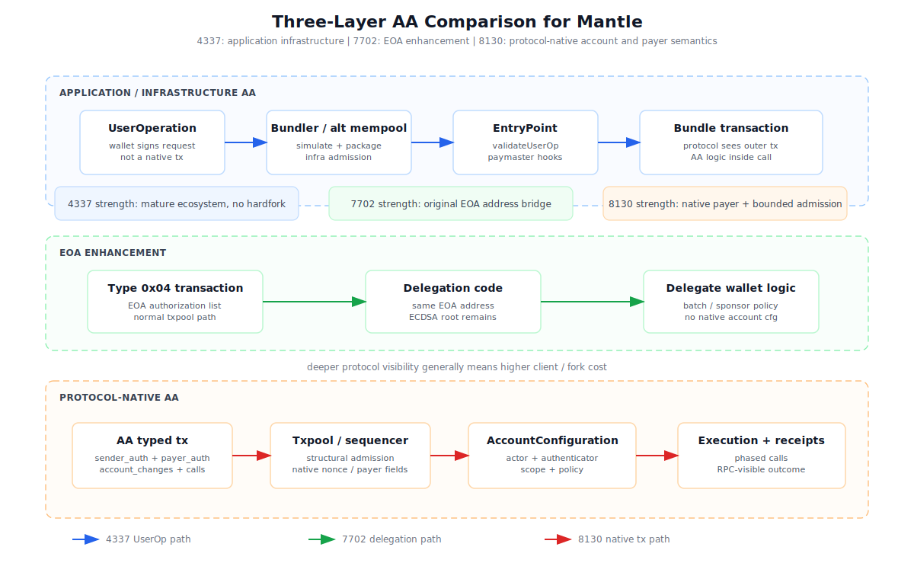
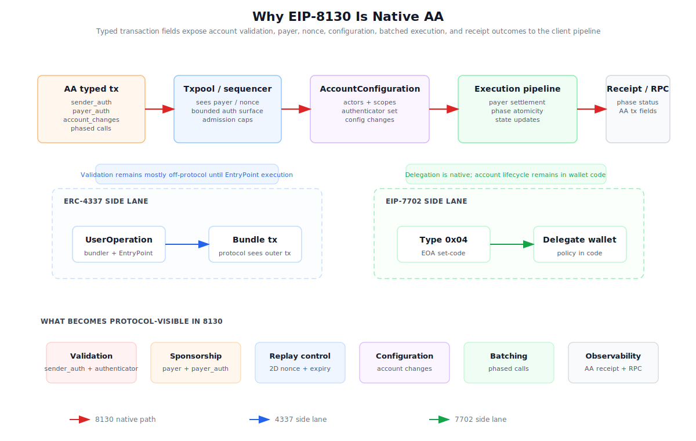

# Mantle native AA 策略建议与 dev team 科普材料

## Executive Summary

**主结论：Mantle 不应现在直接工程化生产实现 EIP-8130-style native AA；应选择「PoC 先行」，并把生产实现放入「暂缓观察」门槛。** 这个结论的证据基础是：WHI-281/S1 认为 EIP-8130 的机制优势在于协议可见 validation、payer、2D nonce、AccountConfiguration 和 phased calls，但 D12 Mantle 适配成本高；WHI-280/S2 证明 Mantle 当前 4337/7702 不是“没有效果/失败”，而是“效果一般 / 部分指标偏弱，7702 aggregate unknown”；WHI-276/S3 显示 Base 已投入完整 client/txpool/RPC/receipt/execution pipeline，但 EIP-8130 仍是 Draft 且 Base 实现有 spec drift 和 open follow-up 风险。

三档判断如下：

| Option | Verdict | Why | Evidence |
|---|---|---|---|
| 现在实现 | **不建议作为主路径** | EIP-8130 仍 Draft；需要 client/fork/txpool/RPC/receipt/security/tooling 改造；钱包/provider 生态尚未证明可用。 | S1 @ `b78d2b2`, S3 @ `c4a6deb` / main `b78d2b2` |
| 暂缓观察 | **作为生产实现门槛** | 生产实现应等待 spec 稳定、Base public rollout、audit/DoS 经验、wallet/provider 示例和 Mantle PoC 数据。 | S1 @ `b78d2b2`, S2 @ `e507dff`, S3 @ `c4a6deb` |
| PoC 先行 | **主推荐** | Mantle 与 Base 同属 OP Stack/op-geth 体系，Base 的 PR catalog 给了低成本学习入口；PoC 可买到 diff sizing、native payer/account config 可行性、RPC/receipt 体验和 coexistence 经验，而不承诺 mainnet。 | S1 @ `b78d2b2`, S2 @ `e507dff`, S3 @ `c4a6deb` |

对 Mantle dev teams 的一句话科普是：

- **ERC-4337**: 把 AA 做在协议上方，用 UserOperation、Bundler、EntryPoint、Paymaster 和 smart account 合约协调账户验证与代付。
- **EIP-7702**: 让既有 EOA 原地址通过 type `0x04` set-code delegation 执行 wallet code，但 root authority 和很多账户生命周期仍在 EOA/delegate code 层。
- **EIP-8130**: 把 sender/payer auth、AccountConfiguration、actor/scope、2D nonce、account changes、phased calls 和 AA receipt/RPC 变成 typed transaction 与 client pipeline 可见的协议语义。

这意味着 EIP-8130 对 Mantle 的价值不是“替代 4337/7702”，而是作为一个 **native account/payer semantics PoC**：验证 Mantle 是否真的需要把 AA admission、payer、account configuration 和 observability 下沉到协议层。如果 Mantle 的短期目标只是 gasless onboarding 和既有钱包 UX，应优先增强 4337/7702 文档、provider/paymaster 多样性、7702 analytics、SDK examples 和 app demand，而不是先 fork 一个 Draft native-AA 方案。

## Item Findings

### item-1: Source Corpus Lock And Evidence Ledger

本 draft 是 synthesis-first：没有重新做 Base PR 考古、没有重新抓链上数据、没有引入 fresh web research。F1 的处理方式是：**Base-side input 复用 S3/WHI-276 的 PR catalog；新增工作只定义 Mantle PoC 如何做 client delta sizing**。

| ID | Upstream final section | Commit anchor used here | Used for | Caveat preserved |
|---|---|---|---|---|
| S1 | `base-eip8130-native-aa/research-sections/native-aa-cross-comparison/final.md` | main snapshot `b78d2b2d3daa1fdf6a9c81a2a0583750dc0c3be2` | 4337/7702/8130 principle contrast, D12/D13, Base selection evidence labels, scheme boundaries | Base motivation is evidence-labelled; do not convert `inference` into official statement; do not claim 4337/7702 failed |
| S2 | `base-eip8130-native-aa/research-sections/mantle-aa-status/final.md` | section integration `e507dffc12d5735b113c4a552185915836b09bf6`, main snapshot `b78d2b2d3daa1fdf6a9c81a2a0583750dc0c3be2` | Mantle 4337/7702 status, usage evidence, DX/provider gaps, native-AA decision inputs | Mantle verdict is “效果一般 / 部分指标偏弱, 7702 aggregate unknown”, not “proved bad” |
| S3 | `base-eip8130-native-aa/research-sections/eip8130-deep-dive/final.md` | section integration `c4a6deb2d440630b40fcfaad8b371d2d88349987`, main snapshot `b78d2b2d3daa1fdf6a9c81a2a0583750dc0c3be2` | EIP-8130 mechanics, Base implementation PR catalog, Draft/spec drift, txpool/RPC/receipt/execution scope | EIP-8130 is Draft; Base constants and follow-up PRs can drift; implementation signal is not ecosystem maturity |

Evidence labels used in this draft:

| Label | Meaning |
|---|---|
| `fact-from-upstream-final` | Directly taken from one of S1/S2/S3. |
| `implementation-signal` | Based on S3's Base PR catalog or S1's code-pr-signal summary; not official strategy rationale. |
| `inference` | Reasonable synthesis from upstream mechanisms and evidence labels. |
| `strategy-judgment` | This draft's recommendation based on upstream evidence; not an upstream fact. |
| `unknown` | Upstream finals explicitly did not find enough public evidence. |

### item-2: Dev Team Primer For ERC-4337, EIP-7702, And EIP-8130

#### 2.1 Three mental models

| Scheme | One-sentence mental model | What the protocol sees | Evidence |
|---|---|---|---|
| ERC-4337 | Smart-account UX implemented above the protocol through UserOps, bundlers, EntryPoint and paymasters. | A normal transaction calling EntryPoint; account validation details are contract/infra level. | S1 @ `b78d2b2` |
| EIP-7702 | Existing EOA delegates execution to wallet code while keeping the original address path. | Type `0x04` transaction and authorization list; protocol writes delegation indicator, but account policy remains in delegate code. | S1 @ `b78d2b2`, S2 @ `e507dff` |
| EIP-8130 | Account validation, payer, nonce, configuration and batched execution become first-class typed-transaction/client semantics. | AA typed tx with `sender_auth`, `payer_auth`, account changes, 2D nonce, phased calls, AA receipt/RPC fields. | S1 @ `b78d2b2`, S3 @ `c4a6deb` |

#### 2.2 ERC-4337: application-layer AA

ERC-4337 gives mature account abstraction without a consensus/client fork. A wallet or app builds a `UserOperation`, a bundler simulates and packages it, EntryPoint calls account validation, and paymasters can sponsor gas. This is useful for gasless onboarding, stablecoin payment experiments, smart-account modules and enterprise/multisig use cases. The tradeoff is that mempool admission, bundler simulation, paymaster policy and many failure modes sit outside the normal protocol transaction path.

For Mantle, S2 shows 4337 is real but small: 2026 YTD snapshot had 11,479 UserOps, 1,107 accounts, 66 bundle senders, 3 paymasters, 98.28% sponsored and 99.85% success. This supports “active but small/sponsor-heavy,” not “failed.”

#### 2.3 EIP-7702: EOA enhancement, not full native AA

EIP-7702 gives EOA original-address UX by letting an EOA sign an authorization tuple and set delegation code via type `0x04`. This is a powerful bridge for wallets because users can keep the same address while gaining delegate-code behavior such as batching or policy checks. But it does not define native payer lifecycle, AccountConfiguration, multi-owner lifecycle, 2D nonce, canonical authenticator selection or phased-call receipt semantics.

For Mantle, S2 found op-geth plumbing and at least one live type `0x04` transaction sample, plus explorer parsing. But aggregate 7702 adoption remains unknown: unique authorizers, delegate targets, daily counts and app attribution are not available in the accepted evidence.

#### 2.4 EIP-8130: protocol-native account and payer semantics

EIP-8130 changes the abstraction layer. Instead of treating account validation as wallet code hidden behind EntryPoint or delegation code, the transaction envelope itself carries:

| Native field / concept | Why it matters for clients and sequencers | Evidence |
|---|---|---|
| `sender_auth` / authenticator | Validation method becomes top-level and structurally filterable. | S1 @ `b78d2b2`, S3 @ `c4a6deb` |
| `payer` / `payer_auth` | Sponsorship becomes a native relationship bound to the resolved sender, not only app/paymaster policy. | S3 @ `c4a6deb` |
| AccountConfiguration / actor / scope | Account ownership and permissions become configured account state, not only delegate wallet logic. | S3 @ `c4a6deb` |
| 2D nonce / nonce-free expiry | Parallel lanes and replay control become protocol-visible. | S1 @ `b78d2b2`, S3 @ `c4a6deb` |
| `account_changes` | Create/config/delegation changes are represented explicitly. | S3 @ `c4a6deb` |
| `Vec<Vec<Call>>` phased calls | Batch execution has native phase semantics and receipt outcomes. | S3 @ `c4a6deb` |
| AA receipt/RPC fields | Indexers, wallets and debuggers can see AA-specific outcomes. | S3 @ `c4a6deb` |

This is why EIP-8130 is “native” in the relevant sense: the sequencer/client can reason about account validation, payer and execution structure before arbitrary wallet code fully executes. The cost is correspondingly high: the execution client, fork activation, txpool, RPC, receipt, SDK/tooling and security model all become part of the implementation.

### item-3: Required Architecture Diagrams And Asset Plan

Two required diagrams were generated with the `fireworks-tech-graph` workflow as hand-authored SVGs using the skill's flat technical style. SVG XML validation passed for both, PNGs were exported via `rsvg-convert`, and both PNGs were visually reviewed for nonblank rendering, readable labels and basic arrow clarity.

#### diag-1: 三层 AA 架构对照图

Artifact paths:

- `base-eip8130-native-aa/research-sections/mantle-native-aa-strategy/assets/three-layer-aa.svg`
- `base-eip8130-native-aa/research-sections/mantle-native-aa-strategy/assets/three-layer-aa.png`

What it teaches: 4337 sits in application/infra AA, 7702 sits in EOA enhancement, and 8130 sits in protocol-native AA. The diagram deliberately shows increasing protocol visibility alongside increasing client/fork cost.

#### diag-2: 8130 为什么是 native

Artifact paths:

- `base-eip8130-native-aa/research-sections/mantle-native-aa-strategy/assets/why-8130-native.svg`
- `base-eip8130-native-aa/research-sections/mantle-native-aa-strategy/assets/why-8130-native.png`

What it teaches: 8130's native claim is not just “a new transaction type.” The typed transaction exposes sender auth, payer auth, account changes, nonce, phased calls and AA receipt/RPC outcome to the client pipeline. The 4337 and 7702 side lanes show why they remain useful but do not provide the same native account lifecycle.

Advisory note F3 incorporated: optional roadmap `diag-3` was not produced because it is not part of the acceptance criteria and does not require SVG+PNG export.

### item-4: Mantle Decision Frame And Three-Way Recommendation

#### 4.1 Primary recommendation

**Primary recommendation: PoC 先行.**

**Production implementation stance: 暂缓观察 until trigger conditions clear.**

**Not recommended: 现在实现 as a production engineering program.**

This is a single primary recommendation, not a balanced three-way handoff to the reader. The reason is straightforward: the mechanism gap is real enough to justify learning, but the Draft/spec/client/ecosystem risks are too high for immediate production commitment.

#### 4.2 Three-way decision table

| Option | Verdict | Evidence-backed rationale | What Mantle should do |
|---|---|---|---|
| 现在实现 | **Reject as default production path** | S3 shows Base implemented a broad 8130 pipeline, but also carries Draft/spec drift and open follow-up risk. S1 says D12 adaptation cost is high: client/fork/txpool/RPC/receipt/security/tooling, not contract deploy. S2 shows Mantle's current AA gap is mixed, not a proven emergency. | Do not start mainnet production implementation unless leadership explicitly accepts Draft churn, client security risk and ecosystem-building cost. |
| 暂缓观察 | **Use as production gate** | Waiting is rational for mainnet because spec, Base rollout, audit posture, wallet/provider support and production constants are not stable enough. But waiting with zero prep loses OP-Stack learning value. | Track EIP-8130 status, Base public rollout, OP Stack adoption, audit findings, wallet/provider examples and Mantle AA metrics. |
| PoC 先行 | **Primary recommendation** | Base's PR catalog gives Mantle a concrete reference path; Mantle can test client delta, native payer/account config semantics and RPC/receipt UX in a bounded devnet without making user-facing promises. | Run a scoped PoC and produce a go/no-go memo; keep 4337/7702 active and invest in ecosystem repairs in parallel. |

#### 4.3 Why not “just wait”?

Pure wait has opportunity cost. If Base continues toward an OP Stack-native AA path, Mantle will eventually need an informed position on whether the feature maps to its fork, sequencer policy, wallet partners and product goals. A small PoC buys that option value without implying mainnet commitment.

#### 4.4 Why not “implement now”?

Immediate production implementation would confuse mechanism potential with readiness. S3's Base PR catalog is a strong implementation signal, but S1's evidence discipline says implementation signal is not the same as official selection memo or ecosystem maturity. S2 also warns that Mantle's 4337/7702 evidence does not prove failure; native AA should be justified by target product semantics, not by an overclaimed “current AA failed” narrative.

### item-5: PoC Roadmap, Reuse Hypothesis, And Engineering Workstreams

#### 5.1 Reuse hypothesis

Mantle should treat Base as the reference implementation, not as a copy-paste drop-in. The Base-side input should be S3/WHI-276's PR catalog:

- tx type / RPC gate: #2863, #2866, #2868, #2926, #3008
- txpool / nonce: #3010, #3585, #3720, #3752 caveat
- fork activation / precompile / registry: #3119, #3121, #3170, #3440
- authenticator / AccountConfiguration / scope: #3467, #3534, #3535, #3540, #3557
- structural cleanup / gas / validation: #3537, #3553, #3586, #3589, #3595, #3605
- account changes / EVM / phased calls: #3651, #3653, #3680, #3696
- RPC/receipt/devnet/followups: #3720, #3722, #3723, #3748, #3749, #3753, #3754, #3755, #3763, #3766

New investigation should be limited to the **Mantle delta**:

| Mantle delta question | Why it matters | Output |
|---|---|---|
| Which Mantle execution-client fork points differ from Base's 8130 PR surface? | Determines reuse/adapt/rewrite scope. | Diff map by module: consensus tx type, txpool, RPC, receipt, EVM execution, fork config. |
| How does Mantle's hardfork schedule and op-geth wiring affect a devnet-only PoC? | Prevents accidental mainnet assumptions. | Devnet activation plan and feature gate. |
| Which existing 4337/7702 paths must coexist with the PoC? | Avoids fragmentation and regression risk. | Coexistence matrix and no-deprecation policy. |
| What minimum SDK/RPC/explorer demo proves developer value? | Protocol PoC without UX is not decision-ready. | One scripted wallet/app flow and receipt/indexer output. |

#### 5.2 Phased PoC plan

| Phase | Goal | Candidate tasks | Exit criteria |
|---|---|---|---|
| Phase 0: Decision prep | Confirm goal and risk appetite | Choose target scenarios: native payer, scoped session key, phased batch, AA receipt; lock EIP/Base commit references; choose devnet-only scope. | One-page PoC charter with non-production caveat. |
| Phase 1: Client diff sizing | Estimate Base-to-Mantle reuse | Use S3 PR catalog as Base-side input; compare Mantle execution client, txpool, RPC, receipt, fork config and tests. | `reuse / adapt / rewrite / unknown` diff table. |
| Phase 2: Minimal devnet PoC | Prove one AA tx path | Decode AA tx, verify simplified sender auth, verify payer auth, apply one account config, execute one phased call, return AA receipt. | Local/devnet demo plus test vectors. |
| Phase 3: Failure-mode tests | Check core safety envelope | Invalid authenticator, payer hash mismatch, account-change cap, replay/nonce issue, phase revert/skip behavior. | Failing tests are observable and bounded. |
| Phase 4: Ecosystem demo | Test usability | Minimal SDK/wallet script, explorer/indexer output, sample sponsored transaction, 4337/7702 coexistence doc. | Developer demo and integration checklist. |
| Phase 5: Production decision gate | Decide expand/pause/abandon | Review spec drift, Base rollout, audit findings, gas/DoS benchmarks, wallet/provider interest and Mantle product priority. | Written go/no-go memo; no default mainnet commitment. |

#### 5.3 What the PoC must not do

- It must not change Mantle mainnet.
- It must not imply 4337 or 7702 deprecation.
- It must not build a full wallet ecosystem before proving client feasibility.
- It must not re-investigate the Base implementation from scratch.
- It must not treat Draft EIP-8130 constants or Base-specific choices as stable standards.

### item-6: Risk Register And Trigger Conditions

#### 6.1 Risk register

| Risk | Likelihood | Impact | Evidence anchor | Mitigation |
|---|---|---:|---|---|
| EIP-8130 Draft/spec drift | High | High | S3 @ `c4a6deb` notes Draft status and tx type/payer constant drift | Pin spec/Base commit for PoC; production gate waits for stabilization. |
| Client/security complexity | High | High | S1 @ `b78d2b2` D12 high adaptation cost; S3 PR surface spans txpool/RPC/EVM/receipt | Devnet-only scope; include failure-mode tests; require audit plan before production. |
| Ecosystem maturity | Medium-high | High | S1 says EIP-8130 wallet/infra adoption unknown; S2 shows Mantle DX/provider coverage uneven | Pair PoC with SDK/demo and wallet/provider outreach. |
| Coexistence fragmentation | Medium | Medium-high | S2 shows Mantle already has 4337 and 7702 paths | No deprecation during PoC; write coexistence matrix. |
| Sponsor economics do not improve | Medium | Medium | S2 sponsor-heavy 4337 evidence; S1 says native payer does not create demand | Separate protocol payer mechanism from product subsidy model. |
| Base dependency mismatch | Medium | Medium-high | S3 is Base-specific PR catalog; Mantle delta not code-diffed here | Phase 1 diff sizing before any implementation commitment. |
| Overclaiming Base motivation | Medium | Medium | S1 labels Base rationale as explicit / signal / inference / unknown | Preserve labels; do not write official Base rejection/selection claims without source. |

#### 6.2 Trigger conditions

| Trigger | Effect on recommendation |
|---|---|
| EIP-8130 spec stabilizes and Base locks production constants | Move from small PoC toward implementation planning. |
| Base launches a public native-AA path with wallet/provider examples | Increase confidence in OP Stack reuse and ecosystem readiness. |
| Mantle product team selects native payer, scoped session key or phased-call scenarios as strategic priorities | Prioritize PoC and partner demos. |
| Mantle 4337/7702 ecosystem work materially improves usage and DX | Reduce urgency for native AA production path; keep watch mode. |
| Security review finds unacceptable payer/authenticator/txpool risk | Pause or abandon native AA implementation path. |
| Mantle client diff shows low reuse / high rewrite burden | Keep research/monitoring; do not expand PoC. |

### item-7: Draft Structure, Review Hooks, And Final Handoff Requirements

This draft intentionally keeps `_index.md` untouched. If approved and later promoted, Final Promotion Ready should include the Index Entry Proposal from the outline:

| order | topic_slug | multica_issue_id | final_path | dependencies | status |
|---:|---|---|---|---|---|
| 8 | mantle-native-aa-strategy | 605b8c4f-1fdf-4e5c-9f04-f2b5e2d1d348 | `base-eip8130-native-aa/research-sections/mantle-native-aa-strategy/final.md` | native-aa-cross-comparison, mantle-aa-status, eip8130-deep-dive | done |

Review hooks for the adversarial reviewer:

- Does the draft commit to a single recommendation? Yes: **PoC 先行**.
- Does it avoid immediate production implementation? Yes: production is **暂缓观察** until trigger conditions clear.
- Does every major conclusion trace to upstream final paths and commits? Check the Evidence Ledger and tables in Sections 4-6.
- Are the two required diagram assets present as SVG+PNG? Yes: `three-layer-aa.{svg,png}` and `why-8130-native.{svg,png}`.
- Does Phase 1 reuse S3's Base PR catalog instead of re-researching Base? Yes.
- Does the draft avoid claiming Base formally rejected RIP-7560/EIP-8141 or that 4337/7702 failed? Yes.

## Diagrams

| ID | Required asset | SVG validation | PNG export | Visual self-review |
|---|---|---|---|---|
| diag-1 | `base-eip8130-native-aa/research-sections/mantle-native-aa-strategy/assets/three-layer-aa.svg` / `.png` | Passed XML parse | Exported via `rsvg-convert`, 2400 x 1520 | Nonblank, labels fit, no incoherent overlaps after revision |
| diag-2 | `base-eip8130-native-aa/research-sections/mantle-native-aa-strategy/assets/why-8130-native.svg` / `.png` | Passed XML parse | Exported via `rsvg-convert`, 2400 x 1520 | Nonblank, labels fit, crossing guide arrows removed after review |

The SVGs are the canonical assets for GitHub rendering. PNGs are included for downstream report tooling and visual review.

## Source Coverage

| Requirement | Coverage | Status |
|---|---|---|
| Use WHI-281 cross-comparison | S1 used for mechanism contrast, D12/D13, Base selection labels and non-failure framing | Covered |
| Use WHI-280 Mantle status | S2 used for 4337 metrics, 7702 sample support, DX/provider gaps and bounded effectiveness verdict | Covered |
| Use WHI-276 EIP-8130/Base deep dive | S3 used for 8130 mechanism, Base PR catalog, Draft/spec drift and implementation scope | Covered |
| Two fireworks-tech-graph diagrams as SVG+PNG | `three-layer-aa` and `why-8130-native` assets generated, validated and visually reviewed | Covered |
| Single primary recommendation | `PoC 先行` selected; `现在实现` rejected; production implementation remains `暂缓观察` | Covered |
| PoC roadmap | Phase 0-5 plan with Base PR catalog reuse and Mantle delta scope | Covered |
| Risk register and triggers | Risks and trigger table included | Covered |
| No `_index.md` write | Draft only proposes later index entry; no index mutation | Covered |

## Gap Analysis

1. **Mantle client delta is not yet code-diffed.** This draft defines the PoC Phase 1 work, but does not inspect Mantle's current execution client against Base's EIP-8130 PR catalog.
2. **EIP-8130 is still Draft.** Production constants, txpool details and open follow-ups can drift; this is the main reason production implementation remains gated.
3. **Base production outcome is not proven.** Base implementation signal is strong, but public mainnet rollout, wallet/provider adoption and audit posture are separate questions.
4. **Mantle 7702 aggregate data remains unknown.** S2 has code/live sample/explorer evidence, not chainwide adoption.
5. **Provider private telemetry is absent.** Bundler rejection rate, paymaster policy failure, latency and API concentration are not visible in upstream data.
6. **Product priority is not fixed.** Native AA value depends on whether Mantle wants native payer, scoped session keys, phased-call UX or protocol-level observability badly enough to pay the client/security cost.
7. **Diagram style is intentionally technical and compact.** The diagrams are suitable for engineering review; a final public-facing report may want TW to refine labels or localize diagram text.

## Revision Log

| Round | Change | Evidence / trigger |
|---|---|---|
| 1 | Initial deep draft from approved outline. | Orchestrator dispatch `62358ccd-f729-4fe0-b6a4-83f865e409d8`; outline commit `f7699618b12d55786980859057f948e7a2f2b39b` |
| 1 | Incorporated F1 by using S3/WHI-276 PR catalog as Base-side input and limiting new work to Mantle client delta sizing. | Outline review comment `e091d218-62f8-4490-949b-58b401e47e66` |
| 1 | Incorporated F2 by committing to one primary recommendation: `PoC 先行`. | Outline review comment `e091d218-62f8-4490-949b-58b401e47e66` |
| 1 | Incorporated F3 by producing only the two mandatory SVG+PNG diagrams and skipping optional roadmap diagram. | Outline review comment `e091d218-62f8-4490-949b-58b401e47e66` |
