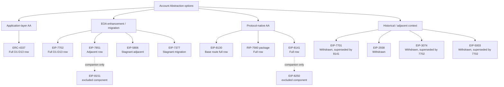
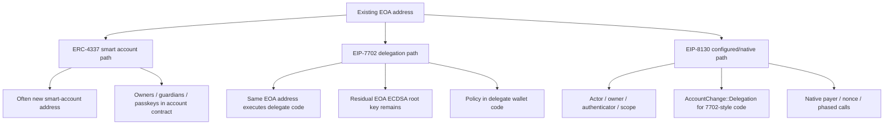
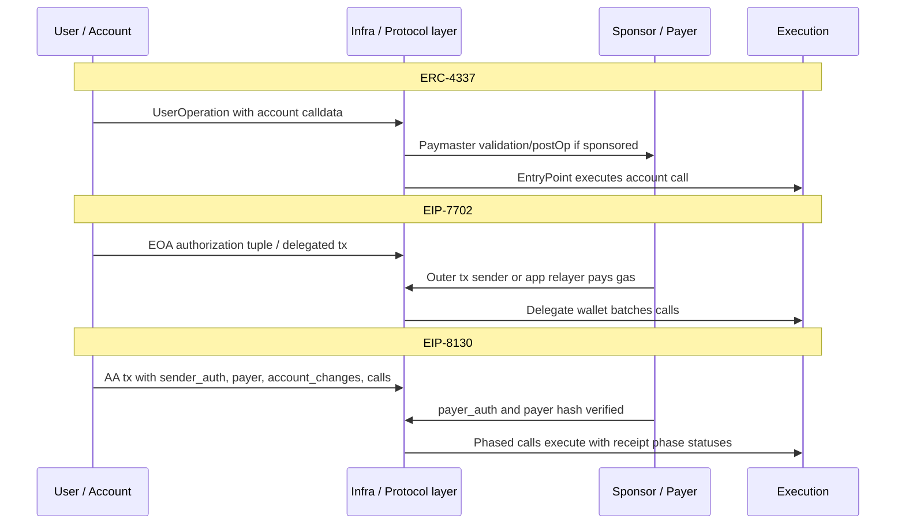
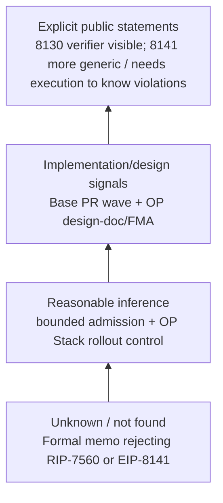
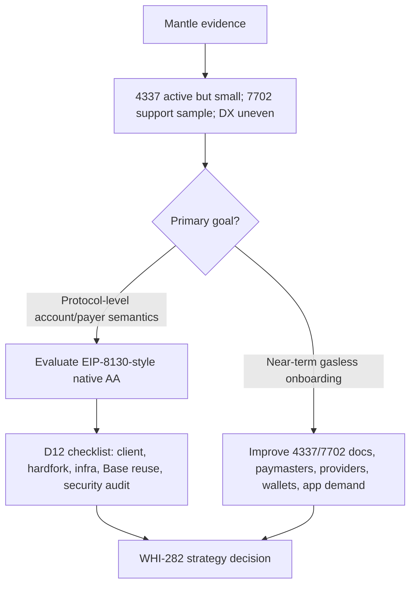

# native AA 方案横向对比（8130 vs 4337 vs 7702 vs 7560/7701）

## Executive Summary

本 draft 是 synthesis-only：只汇总六个已接受 final sections，不引入新调研、不重跑链上数据、不把上游推断改写成官方事实。后文所有短引用都用 `S1` 到 `S6` 回溯到 source ledger 中的文件路径和 commit SHA；若某项来自 sister final 的外部取证，本文保留其原证据标签和 caveat。

核心结论如下：

1. **8130、4337、7702 的原理差异不是“谁更高级”这么简单，而是验证和支付进入协议路径的深度不同。** ERC-4337 是应用层 AA：UserOperation、EntryPoint、Bundler、Paymaster 和 alt mempool 承担账户验证与代付协调，协议层仍看到普通交易。EIP-7702 是 EOA 增强：Pectra type `0x04` 让 EOA 原地址挂 delegation code，但协议仍不管理多 owner、key rotation、native payer 或账户配置生命周期。EIP-8130 是协议原生 native AA 候选：AA typed transaction 显式携带 `sender_auth`、`payer_auth`、account changes、2D nonce、phased calls 和 AccountConfiguration，使 txpool/sequencer/execution 路径能直接识别账户验证、付款与执行结构。
2. **8130 相对 4337 的优势是协议可见性和 bounded admission；代价是 client/hardfork/RPC/tooling 改造。** 4337 的优势是成熟生态和无需共识改动；弱点是 bundler/paymaster/EntryPoint/simulation 依赖、EOA 地址迁移摩擦和 paymaster 运维成本。8130 把一部分验证/付款/批量语义放进原生交易，使节点可按 canonical authenticator / payer / nonce / account_changes 做结构性过滤，但这也把复杂性转移到 OP Stack client、txpool、receipt、RPC、SDK、security audit 和 canonical set governance。
3. **8130 相对 7702 的优势是完整账户/付款/执行生命周期；7702 的优势是原地址迁移和部署成熟。** 7702 保留 EOA 原地址、适合作为短中期钱包 UX bridge；但 root authority 仍是 ECDSA EOA，sponsor、batch、session key、多 owner 主要由 delegate code 或 4337 infra 实现。8130 与 7702 的关系应写成 `composition via AccountChange::Delegation, not replacement`：8130 可设置/清除 EIP-7702-style delegation，但主授权模型不是复用 7702 `authorization_list` / `SignedAuthorization`。
4. **Base 为什么选 8130：最强可辩护解释是 bounded validation + OP Stack 可控 rollout，而不是“4337/7702 失败”。** 已有明确材料显示 8130 的 top-level authenticator/verifier 使验证方法对节点可见；OP design-doc PR comment 将 8130 描述为更 performant、更 opinionated，而 8141 更 generic、需要运行 tx 才知道是否违反规则。Base 的 code-pr-signal 很强，覆盖 tx type、Cobalt gate、AccountConfiguration、actor auth、txpool/RPC/receipt/estimateGas/phased calls 等完整 pipeline。未发现公开完整 memo 正式逐项拒绝 RIP-7560 或 EIP-8141。
5. **Mantle 决策不能建立在“当前 4337/7702 效果不好”这个未经证成的前提上。** Mantle 4337 有真实 UserOps，但绝对量小、sponsor-heavy、paymaster 数少；7702 有 op-geth plumbing 和 live type `0x04` 样例，但 aggregate adoption 未知。更准确的输入是：“效果一般 / 部分指标偏弱，7702 聚合采用证据不足”。Native AA 可以改善协议可见账户/付款语义、txpool/RPC observability 和 bundler dependency，但不会自动解决钱包分发、应用需求、sponsor economics 或 SDK 文档覆盖。

## Item Findings

### item-1: Source Corpus Lock And Evidence Normalization

#### Source ledger

| ID | Source final section | Commit SHA | Used for | Evidence discipline preserved |
|---|---|---|---|---|
| S1 | `base-eip8130-native-aa/research-sections/native-aa-framework/final.md` | `aa0d69ba0d85a4ade25cf562f064eef98b64039c` | native AA taxonomy, D1-D13 rubric, D12 checklist, D13 scenario frame | Mantle effect cannot be assumed poor; D12 uses checklist, not score averaging |
| S2 | `base-eip8130-native-aa/research-sections/eip8130-deep-dive/final.md` | `c4a6deb2d440630b40fcfaad8b371d2d88349987` | EIP-8130 mechanism, Base implementation path, EIP-8130 D1-D13 row | Base motivation remains inferred unless explicitly sourced; EIP-8130 Draft/spec drift caveat |
| S3 | `base-eip8130-native-aa/research-sections/erc4337-mechanism-limits/final.md` | `6bf3e8a39d9a6c069ed23746306108c42714cac2` | ERC-4337 mechanism, limits, Mantle/Base/Arbitrum UserOp data | 4337 is mature and not a failed scheme; Ethereum coverage caveat preserved |
| S4 | `base-eip8130-native-aa/research-sections/eip7702-mechanism-limits/final.md` | `927e7470f8929621dd373ced9f6af785a10ba593` | EIP-7702 mechanism, 3074 lineage, 7702/8130 composition correction, D1-D13 row | 8130 does not reuse 7702 SignedAuthorization as main auth model |
| S5 | `base-eip8130-native-aa/research-sections/post7702-native-aa-landscape/final.md` | `60e395a5b4e7ac967b39261e7fe9ba078dc7079d` | RIP-7560 package, EIP-8141, EIP-7701/historical/adjacent routes, Base/OP evidence labels | Keep `explicit-public-statement`, `code-pr-signal`, `design-doc-signal`, `roadmap-signal`, `inference`, `unknown` |
| S6 | `base-eip8130-native-aa/research-sections/mantle-aa-status/final.md` | `e507dffc12d5735b113c4a552185915836b09bf6` | Mantle 4337/7702 support and adoption evidence, effectiveness verdict, native-AA decision inputs | "效果一般 / 部分指标偏弱, 7702 aggregate unknown"; normalized ratio is fragile |

#### Evidence label normalization

| Label family | Meaning in this draft | Example use |
|---|---|---|
| `spec-cited` | A source final section cites an official EIP/ERC/RIP/spec for the mechanism or status. | 7702 type `0x04`, 8130 AA tx, RIP-7560 Draft. |
| `code-cited` / `code-pr-signal` | A sister final section inspected code or PRs showing implementation activity. | Base EIP-8130 txpool/RPC/receipt work; Mantle op-geth 7702 plumbing. |
| `data-cited` | A sister final section reused Dune/RPC/explorer data. | Mantle 4337 UserOps and normalized ratios. |
| `design-doc-signal` | OP/Base design-doc proposal or FMA exists, but not necessarily final governance approval. | OP design-docs PR #378 adoption proposal and FMA. |
| `explicit-public-statement` | Upstream public text directly states a mechanism or comparison. | OP #378 comment comparing 8130 vs 8141 validation visibility. |
| `inference` | Reasonable synthesis from mechanism and implementation signals. | Base likely preferred bounded admission and OP Stack rollout control. |
| `unknown` | Upstream finals found insufficient public evidence. | Formal Base rejection memo for RIP-7560/EIP-8141. |

#### Matrix scope and explicit exclusions

The full D1-D13 matrix covers current baseline schemes (ERC-4337, EIP-7702), Base route (EIP-8130), major native alternatives (RIP-7560 package, EIP-8141), and historical/adjacent rows needed for decision context.

EIP-8250 and EIP-8151 are explicitly **excluded from standalone matrix rows**. Per S5, EIP-8250 is a Hegota Proposed component/gap item for the EIP-8141 frame-transaction ecosystem: Keyed Nonces for Frame Transactions. EIP-8151 is a Hegota Proposed component/gap item related to EIP-7851: ECDSA-disabled aware `ecRecover`. They matter as companion semantics for nonce and ECDSA-disabled behavior, but they are not standalone native AA candidates with full D1-D13 account/payment/execution scope. This addresses outline-review F1.

#### Known inter-section tensions

| Tension | Canonical handling in this draft | Why it matters |
|---|---|---|
| D12 scoring differs across source finals | Use S1 Section 2.2 checklist as canonical: execution client, hardfork management, infra ecosystem, Base reuse, security audit. Do not average per-section numeric scores. | D12 is Mantle-specific adaptation cost, not a universal maturity score. A scheme can be mature but still expensive for Mantle, or Draft but highly reusable if OP Stack work maps cleanly. |
| 7702/8130 composition wording | Use S4 correction: 8130 composes with 7702-style delegation via `AccountChange::Delegation`; it does not reuse 7702 `SignedAuthorization` / `authorization_list` as the main auth model. | D4/D8 would be wrong if 8130 were treated as merely "7702 plus fields." Its main model is `sender_auth`/`payer_auth`, AccountConfiguration, authenticator/verifier, payer, scopes, and account changes. |
| Mantle current AA effectiveness | Use S6 verdict: "效果一般 / 部分指标偏弱, 7702 aggregate unknown"; do not upgrade to "4337/7702 failed." | The decision case for native AA should be based on mechanism gaps and target product needs, not on an unproven failure narrative. |

### item-2: Master Cross-Comparison Matrix By D1-D13

Cells are intentionally short. `Evidence` points to the source ledger above. Historical/adjacent rows are condensed after the full active rows.

#### Current and active candidate matrix

| Scheme | D1 抽象层级 | D2 协议改动范围 | D3 基础设施依赖 | D4 所有权与密钥模型 | D5 Gas 代付 | D6 批量原子性 | D7 Nonce / replay |
|---|---|---|---|---|---|---|---|
| ERC-4337 | Application-layer AA, not native; `spec-cited` S1/S3 | No consensus change; UserOperation + EntryPoint; S3 | High dependency on EntryPoint, bundlers, alt mempool, paymaster, SDK/explorer; S3 | Smart account contract defines validation, multi-owner, recovery, arbitrary signature; S3 | Mature paymaster deposit/stake/postOp, but ops-heavy; S3 | Account calldata / wallet executor batching, not protocol call array; S3 | EntryPoint/account nonce lanes; not native tx nonce model; S3 |
| EIP-7702 | Protocol EOA enhancement, not complete native AA; S1/S4 | Pectra type `0x04`, `authorization_list`, delegation indicator; S4 | Basic delegation uses normal tx path; advanced UX depends on delegate wallet, relayer, or 4337; S4 | Residual EOA ECDSA root authority; multi-owner/key rotation only in delegate code; S4 | Outer tx sender can sponsor, but no native payer/paymaster lifecycle; S4 | Delegate code can batch; no protocol call array/phase semantics; S4 | Authority nonce + chain_id; no 2D/keyspace nonce; chain_id 0 replay risk; S4 |
| EIP-8130 | Protocol-native AA via typed AA transaction + AccountConfiguration; S1/S2 | New AA tx, account config, precompile/registry, txpool/RPC/receipt/EVM changes; S2 | No 4337 bundler/EntryPoint for native path, but needs client support, canonical authenticators, RPC/tooling; S2 | Actor/owner tuple + authenticator/verifier + scope/policy; configured account model; S2 | Native `payer`, `payer_auth`, payer hash, `SCOPE_PAYER`, fee settlement; S2 | `Vec<Vec<Call>>` phased calls; phase-internal atomicity, phase status receipts; S2 | 2D nonce + nonce-free expiry/replay id; open txpool pending-state caveats carried; S2 |
| RIP-7560 package | Protocol-native AA for rollups, 4337-like; S1/S5 | `AA_TX_TYPE`, AA EntryPoint/predeploy, validation/execution/paymaster frames; S5 | Builder/mempool rules, RIP-7711/ERC-7562-like sandbox, paymaster/deployer ecosystem; S5 | Contract account validation; close to 4337 mental model; S5 | First-class paymaster validation/postOp; S5 | Execution frame; account interprets execution data; S5 | RIP-7712 2D `nonceKey` / `nonceSequence`; S5 |
| EIP-8141 | Protocol-native frame transaction; S1/S5 | `FRAME_TX_TYPE=0x06`, frames, signatures, introspection, APPROVE, mempool rules; S5 | Public mempool needs validation-prefix simulation/trace, banned opcodes/storage limits; S5 | Address-with-code, flexible frame validation/payment, signature list; S5 | VERIFY/APPROVE/payment frame sets payer; S5 | Atomic frame batches; DEFAULT/SENDER frames; S5 | Sender nonce; EIP-8250 keyed nonce is companion/gap, not standalone row; S5 |

| Scheme | D8 EOA 兼容与迁移 | D9 签名灵活性 / PQ | D10 成熟度与生态 | D11 安全攻击面 | D12 Mantle 适配成本 | D13 目标场景 |
|---|---|---|---|---|---|---|
| ERC-4337 | Usually new smart-account address; v0.8+7702 can reduce EOA migration friction; S3/S4 | Strong arbitrary contract signature; can adopt passkeys/PQ at account layer; S3 | Final ERC, mature ecosystem; version fragmentation remains; S3 | Bundler simulation DoS, paymaster griefing, EntryPoint coordination, validation complexity; S3 | Low-to-medium: Mantle already has activity; no hardfork, but infra/provider/wallet breadth remains; S1/S3/S6 | Gasless onboarding, stablecoin payments, enterprise/multisig, mature SDK path; weaker original-EOA UX; S1/S3 |
| EIP-7702 | Strong original-address delegation, switching, clearing; S4 | Root auth remains ECDSA; delegate code can add other signatures but cannot remove root by 7702 alone; S4 | Final/Pectra deployed; ecosystem migrating; S4/S6 | Persistent delegation, storage collision, delegate switching, wallet UI, chain_id 0 replay; S4 | Medium/low if Mantle follows OP/Pectra plumbing; product effect still needs data; S1/S4/S6 | Consumer wallet bridge, onboarding, DeFi batching; weaker enterprise/native payer/protocol permissions; S4 |
| EIP-8130 | Implicit EOA path, configured account import, EIP-7702-style delegation through `AccountChange::Delegation`; S2/S4 | Canonical authenticator set can support k1/P256/passkey/delegate style; direct path governed by canonical set/gas schedule; canonical authenticator set can add PQ algorithms, but direct-path adoption requires standardization and client acceptance; S1/S2 | Draft; Base active implementation; wallet/infra adoption unknown; S2/S5 | Authenticator bug, canonical set governance, payer/scope/config complexity, client consensus risk; S2 | High: execution client, hardfork, txpool, RPC/receipt, security audit; Base reuse may lower OP Stack path but Mantle diff not fully inspected; S1/S2 | Native payer, scoped session keys, phased calls, account config, Base-aligned native AA experimentation; S1/S2 |
| RIP-7560 package | Requires smart account route; EOA migration can use 7702 but is not intrinsic; S5 | Arbitrary account validation; flexible but harder bounded mempool; arbitrary contract validation can support PQ algorithms, but mempool/validation sandbox rules add complexity; S1/S5 | Draft RIP; no Base/OP implementation signal found; S5 | Arbitrary validation DoS, paymaster griefing, storage invalidation, sandbox complexity; S5 | High: client/txpool/batch/RPC/receipt changes plus wallet/paymaster ecosystem; 4337 reuse may help product migration; S1/S5 | 4337-wallet/paymaster native route, gasless onboarding, rollup AA; S5 |
| EIP-8141 | Requires 7702/default code/delegation support for EOA migration path; S5 | Stronger long-term signature/P256/PQ narrative via signature list and frame validation; S5 | Draft; Hegota CFI, not scheduled; no Base implementation signal; S5 | Validation-prefix DoS, mutable state dependencies, `MAX_VERIFY_GAS`, frame/payment complexity; S5 | High-to-very-high: new tx/frame execution, mempool tracing, opcodes/RPC/receipt/tooling; spec unstable; S1/S5 | Long-term L1-aligned programmable AA, PQ/key rotation, generic validation/payment; short-term L2 rollout risk high; S5 |

#### Historical and adjacent matrix rows

| Scheme | Matrix treatment | D1/D2/D4/D8/D10 summary | Decision relevance |
|---|---|---|---|
| EIP-7701 | Condensed historical row | Withdrawn native AA route; superseded by EIP-8141; old validation/execution/postOp role model should not be adopted directly; S5 | Explains why 8141, not 7701, is the current frame/native comparison target. |
| EIP-2938 | Condensed historical row | Early AA tx + PAYGAS; withdrawn as out of date/needs rewrite; S5 | Useful only for problem history: native validation DoS, payment before execution, mempool safety. |
| EIP-3074 | Historical EOA delegation row | AUTH/AUTHCALL invoker model; withdrawn and superseded by 7702; S4/S5 | Explains why current EOA bridge went to 7702 rather than invoker opcode. |
| EIP-5003 | Historical migration row | AUTHUSURP EOA code migration dependent on 3074/3607; withdrawn and superseded by 7702; S5 | Background for permanent EOA migration, not a current Mantle candidate. |
| EIP-7851 | Adjacent active row | 7702 lifecycle / ECDSA-disabled delegation; not full native AA because no native payer/batch/account config; S5 | Useful as complement to 7702 for residual ECDSA risk, not replacement for 8130/RIP-7560/8141. |
| EIP-5806 | Adjacent stagnant row | Delegate transaction / EOA execution enhancement, not full account/payment native AA; S5 | Background only unless EOA delegate tx research is revived. |
| EIP-7377 | Adjacent stagnant row | One-time migration transaction; no ongoing native validation/payer/account lifecycle; S5 | Background for migration discussions, not standalone native AA. |
| EIP-8250 | Excluded companion note | Hegota Proposed keyed nonces for frame transactions; component of EIP-8141 ecosystem; S5 | Mentioned in EIP-8141 D7 caveat only. |
| EIP-8151 | Excluded companion note | Hegota Proposed ECDSA-disabled aware `ecRecover`; companion to EIP-7851; S5 | Mentioned in EIP-7851/7702 lifecycle caveats only. |

### item-3: Principle Group Views For 8130 vs 4337 vs 7702

#### View mapping and diagram expectations

| View | Focus | Draft treatment |
|---|---|---|
| view-1 | Abstraction layer and validation locus | Table + diag-2 validation/admission diagram |
| view-2 | Infrastructure and mempool admission | Table + diag-2 validation/admission diagram |
| view-3 | Ownership/key model and EOA migration | Table + dedicated diag-3 ownership/key migration diagram |
| view-4 | Gas sponsorship and batching | Table + diag-4 sponsorship/batching diagram |

#### view-1 / view-2: validation locus and infrastructure dependency

| Scheme | Where validation is observed | Who filters before inclusion | What shifts compared with EOA txs | What this does not solve |
|---|---|---|---|---|
| ERC-4337 | EntryPoint contract `validateUserOp`; bundlers simulate UserOperations; S3 | Bundler/alt mempool/paymaster infra; protocol sees bundle tx; S3 | Enables smart account validation without consensus change. | Does not remove bundler/paymaster dependency or make account validation first-class protocol tx validity. |
| EIP-7702 | Protocol verifies EOA authorization tuple and sets delegation code; delegate wallet handles policy; S4 | Normal txpool handles type `0x04`; delegate logic risk remains outside native AA rules; S4 | Gives EOA original-address path to wallet code. | Does not define native multi-owner, payer, account config, or validation sandbox. |
| EIP-8130 | Typed AA tx declares sender/payer auth, account changes, nonce, calls; authenticator/verifier visible to node; S2/S5 | Client txpool/sequencer can apply structural + canonical authenticator/payer/nonce rules; S2 | Moves key AA semantics into txpool/execution/RPC/receipt path. | Does not avoid client complexity, canonical set governance, security audit, or wallet/tooling rollout. |

#### view-3: ownership/key model and EOA migration

| Scheme | Root ownership model | EOA migration model | Key rotation / multi-owner | Main caveat |
|---|---|---|---|---|
| ERC-4337 | Smart account contract owns validation policy; S3 | Usually new smart-account address; can combine with 7702 in newer flows; S3/S4 | Strong at contract layer; Safe/session/passkey patterns feasible. | Existing EOA address continuity is weak unless composed with 7702. |
| EIP-7702 | Root EOA ECDSA key signs authorization tuple; S4 | Original EOA address points to delegate code via `0xef0100 || address`; can switch/clear; S4 | Delegate code can simulate owners/keys, but root EOA authority remains unless future complements such as EIP-7851; S4/S5 | Wallet UI/delegate security and residual root key are central risks. |
| EIP-8130 | Configured account uses actor/owner + authenticator + scope/policy; S2 | Supports implicit EOA path and `AccountChange::Delegation` for EIP-7702-style delegation; S2/S4 | Authenticator model can support multiple keys/scopes and canonical signature paths; S2 | Draft status, canonical authenticator governance, and Base implementation churn remain. |

#### view-4: gas sponsorship and batching

| Scheme | Gas sponsor mechanism | Batch/execution mechanism | Product fit | Main caveat |
|---|---|---|---|---|
| ERC-4337 | Paymaster deposit/stake/postOp; S3 | Account calldata / wallet executor / bundler bundle; S3 | Mature gasless onboarding and stablecoin/payment experiments. | Paymaster ops, griefing, bundler dependency and provider concentration. |
| EIP-7702 | Outer tx sender or app sponsor pattern; no native payer lifecycle; S4 | Delegate wallet batching; S4 | EOA UX bridge and approve+swap-like flows. | Sponsor/refund/risk policy live in app/delegate/relayer, not protocol. |
| EIP-8130 | Native `payer` + `payer_auth` + payer signature hash + `SCOPE_PAYER`; S2 | Phased calls with receipt phase status; S2 | Protocol-visible payer, session/key scopes, native batch semantics. | More execution/receipt/RPC logic and payer replay/security surface. |

### item-4: Base Selection Verdict With Evidence Labels

This section answers "Base 为什么选 8130" with label discipline preserved from S5. The strongest defensible explanation from public evidence is: **Base/OP appear to prefer 8130 because it makes validation method and payer/account semantics top-level and bounded enough for OP Stack sequencer/txpool rollout, while still offering product primitives such as AccountConfiguration, payer, 2D nonce, EOA/delegation composition, and phased calls.** This is not the same as proving Base formally rejected RIP-7560 or EIP-8141, and it is not evidence that 4337/7702 failed.

| Claim | Label | Source anchor | Confidence | Caveat |
|---|---|---|---|---|
| 8130 explicitly declares authenticator/verifier, making validation method visible to nodes; 8141 validation is not top-level visible and may require running tx to know rule violations. | 明确陈述 / `explicit-public-statement` | S5 Section 3.2, OP design-doc PR #378 comment summary | High | Upstream final paraphrases public PR comment; this draft does not add a new quote. |
| OP/Base design-doc material proposes adopting EIP-8130 on OP Stack and frames 4337 infra/specialized mempool burden as a problem. | `design-doc-signal` | S5 Section 3.2 | High | PR/design-doc signal, not necessarily final governance approval. |
| Base implemented a broad EIP-8130 pipeline: tx type, Cobalt gate, AccountConfiguration, actor authorization, 2D nonce, account changes, txpool/RPC/receipt/estimateGas/phased calls. | `code-pr-signal` | S2 Executive Summary and S5 Section 3.3 | High | Implementation investment, not official selection memo. |
| Base likely preferred bounded admission and top-level authenticator visibility over RIP-7560/8141 arbitrary validation/frame simulation. | 合理推断 / `inference` | S1 taxonomy, S2 implementation path, S5 Sections 3.2-3.4 | Medium-high | Mechanism + PR inference, not official statement. |
| Base likely wanted protocol-visible payer/account config/phased calls, not only EOA UX improvement. | 合理推断 / `inference` | S2 D1-D13 row and S5 code-pr-signal table | High | Inferred from implementation surface. |
| Base may treat 4337 and 7702 as complementary migration/compatibility paths while 8130 is the native path. | 合理推断 / `inference` | S3, S4, S5 Section 3.4 | Medium-high | Do not write as "replaces 4337/7702." |
| Base formally rejected RIP-7560. | 未发现明确理由 / `unknown` | S5 Section 3.4 and Gap Analysis | Unknown | No public formal rejection memo found in source finals. |
| Base formally rejected EIP-8141. | 未发现明确理由 / `unknown` | S5 Sections 3.2 and 3.4 | Unknown | OP #378 comment explains tradeoff, but is not a formal rejection memo. |
| Base selected 8130 because Mantle/Base 4337/7702效果不好. | Not supported | S1, S3, S4, S6 | Low/unsupported | Source finals explicitly caution against this premise. |

#### 8130 vs native alternatives

| Alternative | Why 8130 may be more attractive to Base/OP | Tradeoff retained |
|---|---|---|
| RIP-7560 package | 8130's top-level authenticator/canonical set may be simpler for bounded sequencer ingress than arbitrary account/paymaster validation frames; S5 | RIP-7560 may better reuse 4337 mental model and paymaster ecosystem; no formal Base rejection found. |
| EIP-8141 | 8130 is more opinionated and exposes verifier/authenticator earlier; S5 | 8141 is more general and may align with long-term L1/PQ/frame abstraction, but has broader mempool/trace complexity and Draft/CFI uncertainty. |
| EIP-7701 | Withdrawn and superseded by 8141; S5 | Not a current candidate. |
| EIP-7702 only | 8130 covers native payer/account config/2D nonce/phased calls beyond EOA delegation; S2/S4 | 7702 is Final/Pectra and much lower-friction for original EOA UX. |
| ERC-4337 only | 8130 reduces reliance on alt mempool/bundler/EntryPoint simulation for native path; S2/S3 | 4337 has mature infra and no hardfork; native 8130 must build ecosystem from Draft. |

### item-5: Scheme Applicability Boundary Table

| Scheme | Strong fit | Weak fit / limits | Mantle relevance | Unverified / caveat |
|---|---|---|---|---|
| ERC-4337 | Mature smart accounts, paymaster, gasless onboarding, enterprise/multisig, SDK ecosystem; S3 | Alt mempool/bundler dependency, paymaster ops, EOA address migration, EntryPoint/version fragmentation; S3 | Mantle already has active but small/sponsor-heavy usage; S6 | Rejected UserOps, bundler SLA, app attribution and provider private telemetry not visible; S6 |
| EIP-7702 | Original EOA address, delegation, batching UX, short/medium-term wallet bridge; S4 | Not full native AA; residual ECDSA root key; no native payer lifecycle/account config; S4 | Mantle op-geth/live sample support exists; S6 | Aggregate adoption count, unique authorizers, delegate target distribution unknown; S6 |
| EIP-8130 | Protocol-visible validation, payer, actor/scope, 2D nonce, phased calls, Base-aligned OP Stack native AA experimentation; S2 | Draft, high client/tooling/security cost, canonical authenticator governance, open implementation churn; S2/S5 | Relevant if Mantle wants native account/payer semantics and lower bundler dependence; S1/S6 | Mantle adaptation cost not fully code-diffed in this issue; S1/S6 |
| RIP-7560 package | 4337 mental model native-ized for rollups, paymaster/account validation continuity; S5 | Arbitrary validation/mempool sandbox complexity, no Base implementation signal found; S5 | Possible if Mantle wants 4337-compatible native route; S5 | Public Base/OP rejection not found; Mantle client diff not inspected; S5/S1 |
| EIP-8141 | General frame abstraction, flexible validation/payment, stronger long-term PQ narrative; S5 | Draft/CFI, higher mempool/trace complexity, broad protocol surface; S5 | Long-term L1-aligned route to watch; S5 | Not scheduled; short-term L2 rollout risk high; companion EIP-8250 not standalone; S5 |
| EIP-7701 / historical | Explains route evolution into 8141; S5 | Withdrawn; not current adoption candidate; S5 | Background only | Should not be used for current Mantle implementation decision. |
| EIP-7851 / adjacent | Improves 7702 lifecycle / ECDSA-disable story; S5 | Not full native AA; no native payer/batch/account config; S5 | Possible future 7702 complement | EIP-8151 companion matters for `ecRecover`; not enough for native-AA decision alone. |
| EIP-5806 / EIP-7377 | EOA delegate tx / one-time migration context; S5 | Stagnant and not full native AA; S5 | Background for migration discussions | Excluded from main candidate set. |

### item-6: Mantle Decision Inputs And Effectiveness Caveats

| Decision input | Evidence from Mantle status | Implication for native-AA decision | Caveat |
|---|---|---|---|
| Mantle 4337 is active but small | 2026 YTD snapshot: 11,479 UserOps, 1,107 accounts, 66 bundle senders, 3 paymasters, 98.28% sponsored, 99.85% success; S6 | Existing AA is not absent; native AA should target gaps not already solved by 4337. | Dune snapshot reused from sister final; rejected UserOps/private provider failures not visible. |
| Normalized ratio does not prove a simple Base-vs-Mantle underperformance story | Mantle about 0.0821 UserOps / 100 canonical tx, Base about 0.0817, Arbitrum about 0.0613; S6 | Do not justify native AA by absolute UserOps alone. | Ratio fragile due small absolute Mantle volume. |
| Paymaster diversity is weak | 3 unique paymasters and 98.28% sponsored UserOps; S6 | Native payer semantics may reduce some 4337 paymaster mechanics, but sponsor economics remain. | Payer centralization can reappear under native AA if product economics do not change. |
| Mantle 7702 capability exists but aggregate adoption is unknown | op-geth has 7702 plumbing; live RPC type `0x04` sample and Mantlescan authorizations UI exist; S6 | 7702 is plausible EOA bridge; native AA case must explain what 7702 cannot cover. | Chainwide count, unique authorizers, delegate target distribution missing. |
| DX/provider coverage is uneven | Mantle docs/Etherspot/Pimlico paths positive; several major provider/wallet docs did not show Mantle mainnet; S6 | Protocol changes need ecosystem rollout plan. | Native AA can worsen fragmentation without wallet/provider support. |
| Protocol-visible account/payer semantics gap remains | 4337/7702 limitations plus Mantle sponsor-heavy usage; S1/S3/S4/S6 | Strengthens case for evaluating 8130-style native semantics if Mantle wants lower bundler dependence and native observability. | Not proof that current AA failed. |

Decision guardrail:

- If Mantle's near-term goal is gasless onboarding with existing wallets, first improve 4337/7702 docs, provider/paymaster diversity, wallet support, app partnerships and analytics.
- If Mantle's goal is protocol-level account/payer semantics, native observability, lower bundler dependence and Base-aligned OP Stack experimentation, EIP-8130 is the most relevant route to evaluate, with Draft/security/client-cost caveats.

## Diagrams

### diag-1: Candidate scope and matrix coverage



### diag-2: validation/admission path for 4337 vs 7702 vs 8130

```mermaid
flowchart LR
  subgraph A[ERC-4337]
    UO[UserOperation] --> Bundler[Bundler simulation / alt mempool]
    Bundler --> EP[EntryPoint validateUserOp]
    EP --> BundleTx[Normal L1/L2 transaction]
  end

  subgraph B[EIP-7702]
    Auth[EOA authorization tuple] --> Tx04[Type 0x04 set-code tx]
    Tx04 --> Delegation[EOA code = 0xef0100 || delegate]
    Delegation --> WalletCode[Delegate wallet code validates policy]
  end

  subgraph C[EIP-8130]
    AATx[AA typed tx] --> TopLevel[Top-level sender_auth / payer_auth / account_changes]
    TopLevel --> Txpool[Client txpool / sequencer admission]
    Txpool --> Exec[AccountConfiguration + authenticator + execution]
  end
```

### diag-3: ownership/key model and EOA migration



### diag-4: sponsorship and batching



### diag-5: Base selection evidence ladder



### diag-6: Mantle native AA decision funnel



## Source Coverage

| Requirement | Coverage in draft | Source anchors |
|---|---|---|
| Source corpus locked to accepted finals only | Covered; no new web/code/data research introduced | S1-S6 ledger |
| Master matrix covers D1-D13 for active/current candidates | Covered for ERC-4337, EIP-7702, EIP-8130, RIP-7560 package, EIP-8141 | item-2 matrix |
| Historical/adjacent candidates included enough for decision narrative | Covered through condensed rows for 7701, 2938, 3074, 5003, 7851, 5806, 7377 | S5 |
| F1 EIP-8250/EIP-8151 exclusion note | Covered in matrix scope and diagram; explicitly not standalone candidates | S5 Section 1.2 / Gap Analysis |
| F2 view-3 diagram | Covered by dedicated ownership/key migration table and diag-3 | item-3 / Diagrams |
| F3 known tensions | Covered: D12 canonical checklist, 7702/8130 composition, Mantle effectiveness | item-1 |
| Base selection verdict with label discipline | Covered with 明确陈述 / code-pr-signal / design-doc-signal / 合理推断 / 未发现明确理由 | S5, S2 |
| Mantle current AA caveats | Covered with data summary, normalized-ratio caveat, 7702 aggregate unknown | S6 |
| Applicability boundaries | Covered by scheme applicability table | item-5 |

## Gap Analysis

1. **No new Base/OP selection memo was discovered or claimed.** S5 did not find a complete public memo formally rejecting RIP-7560 or EIP-8141. This draft preserves that as `unknown`.
2. **EIP-8130 remains Draft and Base implementation is moving.** S2 carries open/unstable items such as txpool pending-state, auto-delegation/TOCTOU, and end-to-end inclusion tests. This draft does not re-verify PR states.
3. **Mantle D12 remains a synthesis-level estimate.** S1 provides the canonical checklist and S6 provides Mantle status, but this issue does not perform a Mantle op-geth/reth/op-node code diff for EIP-8130/RIP-7560/8141.
4. **Mantle 7702 aggregate adoption remains unknown.** S6 proves code/live sample/explorer support, not chainwide usage, unique authority counts, delegate target distribution, or app attribution.
5. **Provider/private telemetry is absent.** Rejected UserOps, bundler SLA, paymaster policy failures, private endpoint concentration, and wallet runtime support need provider or controlled PoC data.
6. **D13 product weighting is not decided in this draft.** The matrix maps scenario fit, but the final Mantle recommendation needs business/product priorities: consumer wallet, stablecoin/gasless payments, enterprise accounts, DeFi batching, cross-chain, or PQ differentiation.
7. **EIP-8250/EIP-8151 are not expanded beyond companion notes.** If the downstream report focuses on Hegota/L1 roadmap, those companion semantics should be reviewed separately; they are intentionally outside this matrix as standalone schemes.

## Revision Log

| Round | Change | Evidence / trigger |
|---|---|---|
| 1 | Initial deep draft from approved outline; produced source ledger, D1-D13 master matrix, principle views, Base-selection verdict, applicability boundaries, Mantle decision inputs, diagrams, source coverage and gaps. | Orchestrator dispatch `3aa7ee73-46ac-4eb7-a070-2d83fab5ccf0`; outline commit `7ce1f3a437fe411ada8ef7e46982b0c373b75649` |
| 1 | Addressed outline-review F1 by excluding EIP-8250/EIP-8151 as companion components rather than standalone native AA candidates. | Review verdict `46696536-5d0e-4f02-89d8-b7235c4b9b98` |
| 1 | Addressed outline-review F2 by adding a dedicated ownership/key/EOA migration diagram for view-3. | Review verdict `46696536-5d0e-4f02-89d8-b7235c4b9b98` |
| 1 | Addressed outline-review F3 by adding known inter-section tensions and applying corrected D12 and 7702/8130 composition framing. | Review verdict `46696536-5d0e-4f02-89d8-b7235c4b9b98` |
