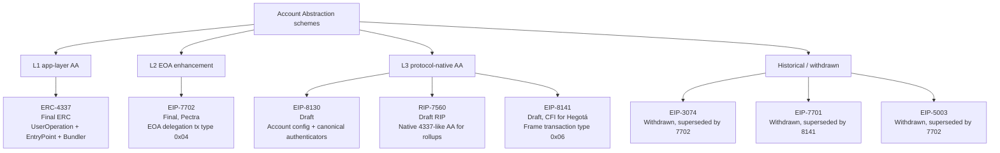
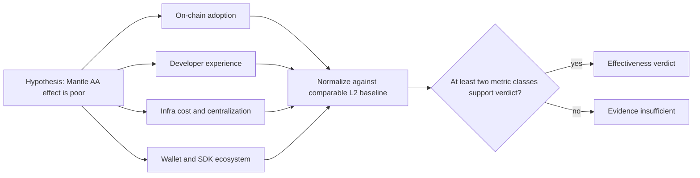
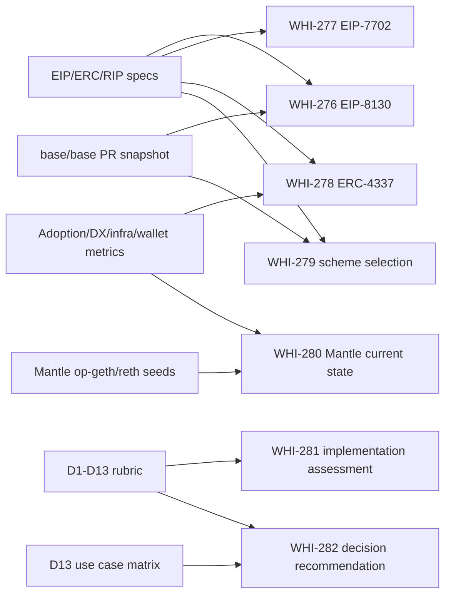

# 建立 native AA 研究框架、对比 rubric 与证据复用地图

## Executive Summary

本 draft 给后续 WHI-276 到 WHI-282 提供共同口径。核心结论不是“native AA 一定优于 4337/7702”，而是先把方案放进同一分类、同一维度、同一取证方式中，避免后续 issue 各自使用不同定义。

1. **三层 taxonomy 可以覆盖当前主流 AA 方案。** ERC-4337 是应用层 AA：不改共识，不引入原生交易类型，依赖 UserOperation、EntryPoint、Bundler、Paymaster 和替代 mempool。EIP-7702 是 EOA 增强：Pectra 已上线，给 EOA 写入 delegation indicator，让 EOA 临时/持续执行委托代码，但它不把智能账户完整提升为协议一等公民。EIP-8130、RIP-7560、EIP-8141 是协议原生 AA：都引入 EIP-2718 风格交易类型或原生交易处理，把账户验证、gas 支付、执行框架带进协议路径。
2. **“native AA”的边界应按协议强制面定义。** 本文将 native AA 限定为：交易有效性、账户验证、gas 支付或执行调度需要客户端/协议规则识别并执行，而不是只靠合约和链下服务自愿配合。按这个边界，ERC-4337 不是 native AA；EIP-7702 是协议级 EOA 增强但不是完整 native AA；EIP-8130/RIP-7560/EIP-8141 是完整 native AA 候选。
3. **EIP-8130 与 EIP-8141/RIP-7560 的核心分叉在验证模型。** EIP-8130 把交易验证收敛到显式声明的 authenticator，节点可按 canonical authenticator set 过滤交易，authenticator 通过 STATICCALL 执行或被链 enshrine 为固定 gas 成本。EIP-8141 与 RIP-7560 更接近完全可编程验证：验证 frame / validation frame 可以执行账户合约逻辑，但 public mempool 必须用模拟、trace、opcode/storage 限制来约束 DoS 风险。
4. **Base 当前选择 EIP-8130 的可验证信号是工程投入和 PR 轨迹，不是公开决策备忘录。** 截至 2026-06-26，base/base 已合并从交易类型、Cobalt gate、precompile、authenticator dispatch、2D nonce、gas、account changes、EVM integration、phased calls、txpool/RPC/receipt/estimateGas 到 counterfactual creates 的一系列 EIP-8130 PR。由此可以推断 Base 优先追求可预测 mempool admission、有限验证面和 OP Stack 可落地性；但“为什么没有选择 RIP-7560/EIP-8141”仍需要 WHI-279 用 Base/OP 设计文档和 ACD/PR 评论补强，不能在本 framework issue 中当作已证明事实。
5. **Mantle 决策要从 D12/D13 收束。** 4337/7702 是否“效果不好”不能直接作为结论；必须用链上采用度、开发者体验、基础设施成本/中心化、钱包/SDK 生态四类代理指标验证。最终是否实现 native AA，还要回到 Mantle 要服务的用户场景：消费者钱包、稳定币/gasless 支付、企业账户、多签/权限账户、gasless onboarding、DeFi 高级交易、跨链互操作、后量子准备度。

## Item Findings

### item-1: 三层 taxonomy 与 native AA 严格定义

#### 1.1 定义

**Native AA** 在本文中指协议或客户端必须原生识别的账户抽象路径，至少满足以下一项强条件，且目标是让非 ECDSA/智能账户验证进入交易有效性规则，而不只是合约层自愿执行：

| 判定项 | 含义 | 例子 |
|---|---|---|
| 新交易类型 | 使用 EIP-2718 transaction envelope 或等价链内交易类型承载账户抽象字段 | EIP-7702 `0x04`; EIP-8130 `0x7B`; EIP-8141 `0x06`; RIP-7560 `AA_TX_TYPE` |
| 协议级验证/支付 | 客户端在交易验证、gas 预扣、nonce、mempool admission 或 receipt 中识别 AA 字段 | EIP-8130 authenticator/payer/nonce; RIP-7560 sender/paymaster validation; EIP-8141 VERIFY/payment approval |
| 执行路径原生调度 | 协议定义多阶段或多 frame 执行语义 | EIP-8130 phased calls; RIP-7560 validation/execution/postOp frames; EIP-8141 VERIFY/SENDER frames |
| 不只是应用层合约 | 不依赖 “Bundler 调 EntryPoint” 这种外层交易包裹来赋予交易有效性 | ERC-4337 不满足此项 |

这个定义刻意把 EIP-7702 放在中间层：它是协议级 EOA 增强，能支持 batching、sponsorship、privilege de-escalation 等 AA UX，但 EIP-7702 本身仍以 EOA delegation 为核心，不提供完整的账户配置、任意账户验证或 paymaster/actor/policy 生命周期。

#### 1.2 Taxonomy 归位表

状态均按 2026-06-26 访问官方规范/仓库核验。

| 方案 | 层级 | 协议修改 | 账户/验证模型 | Gas 代付 | 批量/原子性 | 当前状态 | 主要证据 |
|---|---|---|---|---|---|---|---|
| ERC-4337 | L1 应用层 / 链下 AA | 无共识修改；无新原生 tx type；使用 UserOperation | Smart Contract Account 在 EntryPoint `validateUserOp` 中验证签名/nonce/费用；Bundler 先模拟 | Paymaster 合约 + EntryPoint deposit/stake | Account calldata / executeUserOp / bundler bundle | Final ERC；EIP 文件迁移到 ethereum/ercs | ERC-4337 规范说明 “completely avoids consensus-layer protocol changes”、UserOperation、EntryPoint、Bundler、Paymaster |
| EIP-7702 | L2 EOA 增强 | Pectra Core EIP；`SET_CODE_TX_TYPE=0x04`; delegation indicator `0xef0100 || address` | EOA 签 authorization tuple，把自身代码指向 delegate code；仍不是完整智能账户协议模型 | 可由 transaction sender 或应用模式实现 sponsorship，但 7702 本身不定义 Paymaster | delegate code 可实现 batching；delegation 写入不随 execution revert 回滚 | Final；Pectra mainnet activation timestamp `1746612311` = 2025-05-07 10:05:11 UTC | EIP-7702；EIP-7600 Pectra meta includes EIP-7702 |
| EIP-8130 | L3 协议原生 native AA | Draft Core；EIP-2718 tx type `AA_TX_TYPE=0x7B`; Account Configuration Contract; precompile/context | Actor + authenticator。Tx 显式声明 authenticator；canonical set 用于节点 allowlist；authenticator 通过 STATICCALL 或 enshrined native path 执行 | `payer` + `payer_auth`; PAYER scope；payer signature hash 与 sender 分离 | `calls` 是 phased two-level structure；phase 内 atomic，phase 间可部分提交 | Draft；Base 正在实现 | EIP-8130；base/base PR 快照 |
| RIP-7560 | L3 协议原生 native AA for rollups | RIP Draft；`AA_TX_TYPE` TBD；复用/enshrine ERC-4337 流程 | Sender validation frame、paymaster validation frame、execution frame、postOp frame；高度兼容 4337 合约心智 | Paymaster validation + postOp；gas 从 sender 或 paymaster 余额预扣 | executionData 由 account 解释；多 frame 生命周期 | Draft RIP | RIP-7560 规范 |
| EIP-8141 | L3 协议原生 native AA / frame tx | Draft Core；`FRAME_TX_TYPE=0x06`; frame abstraction；新 TX/FRAME/SIGNATURE introspection opcodes | 交易拆成 VERIFY、DEFAULT、SENDER frames；EVM 内用户自定义 validation/payment；signature list 支持 secp256k1/P256，未来可扩展 | payer 由 VERIFY frame 通过 APPROVE 设置；可做 sponsor/payment frame | frame flag 支持 atomic batch；后续 SENDER frames 执行 user op | Draft；EIP-8081 将其列为 Hegotá “Considered for Inclusion”，不是 Scheduled | EIP-8141；EIP-8081 |
| EIP-3074 | 历史 L2 类 EOA delegation | 新 opcodes `AUTH`/`AUTHCALL` | EOA 授权 invoker contract 代表自己发 call；原私钥仍保留最终权力 | Sponsored tx 是动机之一 | invoker 可实现 | Withdrawn；withdrawal reason: superseded by EIP-7702 | EIP-3074 |
| EIP-7701 | 历史 L3 类 native AA | 新 AA tx type + role opcodes | 分 validation/execution/postOp roles；依赖新 opcodes | sender/paymaster 分离 | AA tx flow | Withdrawn；withdrawal reason: superseded by EIP-8141 | EIP-7701 |
| EIP-5003 | 历史 EOA migration | `AUTHUSURP` opcode，依赖 3074/3607 | 在 EIP-3074 authorization 下把代码部署到 EOA 地址，迁移出 ECDSA | 不直接定义 | 不直接定义 | Withdrawn；withdrawal reason: superseded by EIP-7702 | EIP-5003 |

#### 1.3 EIP-8130、RIP-7560、EIP-8141 的设计哲学差异

| 维度 | EIP-8130 | RIP-7560 | EIP-8141 |
|---|---|---|---|
| 目标心智 | “账户配置 + 有界认证” | “把 4337 流程 native 化，面向 rollup” | “frame abstraction，把验证、支付、执行抽象为 frame” |
| 验证面 | 显式 authenticator；节点按 canonical set 接受；避免执行任意 wallet code 做 admission | 账户/paymaster validation frame，接近 4337 | VERIFY prefix，可执行 EVM 逻辑，但 public mempool 限制 prefix、gas、opcode/storage |
| 灵活性 | 中等：signature/authenticator 可扩展，但 direct 8130 path 受 canonical set 限制 | 高：兼容 4337 智能账户模型 | 高：任意 user-defined validation/payment，frame 能检查后续 frames |
| DoS/mempool 成本 | 低到中：authenticator 身份显式，STATICCALL/enshrined gas，节点可拒 unknown authenticator | 中到高：仍需 validation frame 规则和模拟 | 中到高：public mempool 必须模拟 validation prefix，限制 `MAX_VERIFY_GAS` |
| OP Stack 落地推断 | Base 已经大规模实现，说明工程路径清晰 | 需与 OP Stack mempool/derivation/RPC 进一步适配 | Ethereum L1 roadmap 相关性更高，但草案仍快变 |
| 后量子路线 | canonical authenticator set 可新增算法，但进入 direct path 需标准化/客户端接受 | 任意合约验证可支持，但 mempool 规则复杂 | 明确把 PQ off-ramp 写入动机，signature/frame 结构为未来聚合/大签名留空间 |

**对 Base 选型的谨慎推断**：Base 选择 EIP-8130 的可证明事实是实现轨迹，而不是公开选型报告。按官方 EIP-8130 motivation，它要避免节点在 admission 时模拟任意 wallet code，让节点看见 authenticator 身份即可判断计算边界。按 base/base PR 轨迹，Base 已围绕 Cobalt hardfork、txpool、RPC、receipt、span batch、EVM integration、counterfactual creates 持续推进 8130。因此，后续 WHI-279 可以把 “可预测 admission + 小 canonical set + OP Stack 工程可控” 作为强假设去验证；不能把它写成 Base 官方已声明理由，除非找到设计文档或核心维护者评论。

### item-2: 统一 rubric D1-D13

Rubric 的用途是“统一填表”，不是本 issue 直接给 Mantle 下结论。每个维度必须独立判定，并标注证据类型：`spec-cited`、`code-cited`、`data-cited`、`inferred`、`unknown`。D12/D13 是最终决策维度，应在 WHI-281/WHI-282 用真实 Mantle 约束和目标用户填充。

| ID | 维度 | 判定问题 | 可填值 / 标准化口径 | 必要证据 |
|---|---|---|---|---|
| D1 | 抽象层级 | 方案核心逻辑在哪一层？ | 应用层；EOA 增强；协议原生 native AA；历史/withdrawn | EIP/RIP status、是否新 tx type、是否共识/执行层修改 |
| D2 | 协议改动范围 | 需要改什么协议面？ | 无；新 tx type；新 opcode；precompile/system contract；mempool/RPC/receipt；硬分叉；需 EOF | Specification、Backwards Compatibility、meta EIP、实现 PR |
| D3 | 基础设施依赖 | 运行时依赖哪些链外/链上基础设施？ | Bundler；Paymaster；EntryPoint；alt mempool；RPC extension；canonical registry；account config contract；无链外依赖 | 交易流、RPC、mempool 章节、SDK/infra docs |
| D4 | 所有权与密钥模型 | 账户 authority 如何表达？ | 单 ECDSA；EOA delegate；contract-defined validation；actor/authenticator；multisig；session key；key rotation；social recovery | Auth/validation 章节、account config、wallet implementation |
| D5 | Gas 代付 | 第三方如何支付 gas？ | Paymaster deposit/stake；payer field；frame payment approval；fee delegation；仅应用层 relayer | Paymaster/payer/payment approval 章节 |
| D6 | 批量原子性 | 多操作是否原子？ | calldata batching；delegate code batching；phase atomic；frame atomic batch；multicall only；不支持 | Calls/frame/execution 章节 |
| D7 | Nonce 与防重放 | 支持怎样的并行和 replay 控制？ | 单顺序 nonce；2D nonce；keyed nonce；contract nonce；nonce-free short expiry；chainId=0 cross-chain | Nonce/signature payload/replay sections |
| D8 | EOA 兼容与迁移 | 现有 EOA 是否原地址升级？ | 无需迁移；需新合约地址；7702 reversible delegation；8130 implicit EOA path；永久迁移；不兼容 | EOA/account type/migration sections |
| D9 | 签名灵活性与 PQ 准备度 | 新签名算法如何进入系统？ | 仅 secp256k1；contract-defined arbitrary logic；canonical authenticator set；frame signature schemes；native PQ path | Signature/authenticator sections；status of P256/PQ support |
| D10 | 成熟度与生态 | 规范、部署、工具、活跃度如何？ | Final/deployed；Draft active；RIP draft；withdrawn；production infra；client PR activity；SDK/wallet support | EIP status、meta EIP、GitHub PR、wallet/SDK docs |
| D11 | 安全攻击面 | 新增哪些风险？ | Arbitrary validation DoS；authenticator bug；paymaster griefing；storage invalidation；delegation takeover；replay；policy escape；entrypoint central risk | Security Considerations、mempool rules、audits/tests |
| D12 | Mantle 适配成本 | Mantle OP Stack 要改多少？ | 已支持；低配置；中等 op-geth/op-node/RPC 修改；高硬分叉/双客户端；极高生态重建；unknown | Mantle op-geth/reth/op-node code、Base PR 工程量、hardfork process |
| D13 | 目标用户/产品场景适配 | 方案服务谁、解决哪个产品问题？ | 消费者钱包；稳定币/gasless 支付；企业账户；多签/权限账户；gasless onboarding；DeFi 高级交易；跨链；PQ 安全 | 用户场景需求、钱包/SDK、支付/企业产品证据 |

#### 2.1 D1-D11 的初步填表规则

| 方案 | D1 | D2 | D3 | D4 | D5 | D6 | D7 | D8 | D9 | D10 | D11 |
|---|---|---|---|---|---|---|---|---|---|---|---|
| ERC-4337 | 应用层 | 无共识修改 | Bundler, EntryPoint, Paymaster, alt mempool | 任意 smart-account validation | Paymaster | Account calldata / bundle | semi-abstracted nonce | 需合约账户；可和 7702 互补 | 合约任意逻辑 | Final ERC，生态最成熟 | Bundler simulation、EntryPoint 集中安全、Paymaster griefing |
| EIP-7702 | EOA 增强 | Pectra tx type, delegation indicator | 普通交易/RPC + wallet delegate code | EOA 签授权，delegate code 执行 | 应用或 sponsor 模式 | delegate code batching | authorization tuple nonce | 原地址 delegation | 主要仍由 EOA 签授权；delegate 可扩展 | Final, deployed | 授权 tuple 风险、delegate 合约安全、持久 delegation 风险 |
| EIP-8130 | 协议原生 | tx type, account config, precompile/context, client rules | canonical authenticator registry/account config/RPC updates | actor + authenticator + scope/policy | payer/payer_auth | phased calls, phase 内原子 | 2D nonce + nonce-free expiry | implicit EOA path + existing contract import + CREATE2 new account | canonical set 可扩展；direct path 受 allowlist | Draft；Base 活跃实现 | authenticator 逻辑 bug、canonical set 治理、policy gate escape、payer replay |
| RIP-7560 | 协议原生 | AA_TX_TYPE, validation/execution frames | paymaster/sender contracts, builder/mempool rules | contract account validation | paymaster validation/postOp | account execution frame | nonceKey/nonceSequence via RIP-7712 | 主要智能账户；requires 7702 | contract arbitrary validation | Draft RIP | programmable validation DoS、paymaster drain、storage invalidation |
| EIP-8141 | 协议原生 | frame tx type, frame/signature introspection, mempool rules | public mempool prefix simulation, frame contracts | arbitrary user-defined validation/payment | VERIFY frame sets payer | atomic frame batch | tx nonce + keyed nonces companion EIP | account as address with code; default account path | secp256k1/P256 now, PQ path explicit | Draft; CFI for Hegotá | VERIFY prefix DoS, opcode/storage restrictions, frame malleability |

#### 2.2 D12 Mantle 适配成本口径

Mantle 适配成本不能只写“Base 已经做了，所以 Mantle 可抄”。必须拆成以下检查项：

| 检查项 | 低成本信号 | 高成本信号 | 需取证位置 |
|---|---|---|---|
| Execution client | op-geth/reth 已有相关 fork hooks、tx type plumbing、receipt/RPC 模式可复用 | 需要大规模改交易池、state transition、receipt、debug trace、RPC, 且双客户端不一致 | `src/networks/mantle/op-geth`, Mantle reth/op-node |
| Hardfork 管理 | 有可控 L2 hardfork 窗口和 devnet/testnet 流程 | 升级牵涉 bridge、fault proof、sequencer/batcher、indexer 全链路 | Mantle release/hardfork docs |
| Infra 生态 | wallet/RPC/indexer 只需轻改 | 需要全新 bundler/paymaster/SDK 网络，或 explorer 无法解析 | Mantle infra docs and partner docs |
| Base 复用 | Base PR 可映射到 OP Stack 模块 | Base fork 与 Mantle fork 差异导致无法 cherry-pick | base/base PR + Mantle code diff |
| 安全审计 | 改动集中且可测试 | 交易有效性、payer、nonce、account changes 分散在多个共识关键模块 | test coverage, audit plan |

#### 2.3 D13 目标用户与产品场景适配

| 场景 | 关键需求 | 当前最强候选 | 8130 的适配点 | 7702/4337 的适配点 | 8141/RIP-7560 的适配点 | Mantle 决策备注 |
|---|---|---|---|---|---|---|
| 消费者钱包 | 原地址、低摩擦、session key、恢复、批量 | 7702 + 4337 近中期 | actor/scope/policy 支持原生权限，implicit EOA path 降低迁移 | 7702 立即服务现有 EOA；4337 生态成熟 | 8141 灵活但未成熟 | 若 Mantle 主目标是钱包 UX，先衡量 7702/4337 adoption 是否真的失败 |
| 稳定币/gasless 支付 | 代付、memo/payment ref、低延迟、低 infra 成本 | 4337/paymaster 已成熟；8130 有 native payer 潜力 | `payer`、metadata、PAYER scope 更原生 | 4337 paymaster 生态成熟；7702 sponsor 可做应用级 | frame payment sponsor 灵活 | 对 Mantle 很关键，需要真实支付量和 sponsor 成本数据 |
| 企业账户 | 多角色、权限、审计、强策略 | 4337 智能账户成熟；8130/8141 原生潜力 | actor/policy/account lock 与权限模型契合 | 4337 合约可实现复杂策略 | 8141 arbitrary validation 最灵活 | 需看企业是否更重视稳定生态还是协议原生 guarantees |
| 多签/权限账户 | 多签、guardian、time-lock、限额 | 4337/Safe 生态 | actor + policy manager 可做窄权限 | 7702 delegate 可接现有多签逻辑 | 完全可编程验证 | 不能只按协议优雅度，需要钱包/SDK/Safe 兼容 |
| Gasless onboarding | 新用户零 ETH、低失败率 | 4337 paymaster 当前可用 | payer path 可减少 bundler 依赖 | 7702 可让 EOA 使用 delegate onboarding flow | frame sponsor 灵活 | 衡量 “新增用户转化” 而不是交易技术指标 |
| DeFi 高级交易 | approve+swap 原子、session key、限价/自动化 | 7702/4337 已可 PoC | phased calls 与 policy session key | delegate / account calldata | frame atomic batch 强 | 需验证钱包和 DEX 集成成本 |
| 跨链互操作 | 多链同账户/签名/配置同步 | 4337 ecosystem + 8130 actor changes | chain_id 0 config changes、portable account config | 7702 chain_id 0 authorization 有跨链语义 | 需额外设计 | 要控制重放和跨链配置漂移 |
| 后量子安全 | 新签名算法、key rotation、迁移 | 8141 概念最明确；8130 可路线化 | canonical authenticator set 可扩展，但 direct path 需标准化 | 4337 任意合约可先试；7702 不完整 | 8141 明确 PQ off-ramp | 若 Mantle 要做长期差异化，纳入但不应驱动短期实现 |

### item-3: “效果好/不好”四类可观测代理指标

“Mantle 已支持 4337/7702 但效果不好”只能作为待检验假设。后续结论必须至少由两类指标支撑，并与 Base、OP、Arbitrum、Polygon 等同类链做归一化对比。

#### 3.1 指标 A: 链上采用度

| 子指标 | 计算口径 | 适用方案 | 数据源 |
|---|---|---|---|
| AA 交易占比 | AA tx / total tx，按日/周/月 | 7702/8130/8141/RIP-7560 原生 tx；4337 bundle 内 UserOp | RPC/archive node, explorer, Dune, custom indexer |
| 活跃账户 | unique AA sender / active address；新增/留存 | all | EntryPoint events, tx type scan, account config events |
| Gasless 使用 | sponsored UserOp/tx 占比；sponsor 数量；sponsor 费用 | 4337/8130/8141/RIP-7560 | Paymaster events, payer fields, receipt payer |
| 成功率与失败率 | submitted vs included；validation fail；revert；用户重试 | 4337 尤其关键；native txpool 也关键 | bundler API, RPC error logs, mempool telemetry |
| 成本差异 | 相同操作的 total gas/fee；额外 calldata/validation overhead | all | benchmark tx, trace, receipts |

取证要求：标注查询日期、链、区块范围、合约地址/tx type、采样方法。不要把 Mantle 绝对值与 Base 绝对值直接比，应除以总交易数、活跃地址、应用活动或 stablecoin/payment 流量。

#### 3.2 指标 B: 开发者体验与集成成本

| 子指标 | 计算口径 | 证据 |
|---|---|---|
| SDK 可用性 | 支持该方案的 SDK/AA infra 数量，是否支持 Mantle chainId | Alchemy Account Kit、Pimlico、Biconomy、ZeroDev、Coinbase Smart Wallet、Safe docs |
| 文档完整度 | 官方 docs 是否包含 quickstart、RPC、examples、debugging、security caveats | 官方文档、GitHub examples |
| PoC 时间 | Mantle 工程师从空项目到第一笔 sponsored/batched tx 的步骤数/天数 | 内部 PoC 日志 |
| 兼容成本 | 钱包、explorer、indexer、RPC、SDK 是否需要新字段 | chain infra 支持矩阵 |
| 错误可诊断性 | validation failure 是否有可读错误、receipt、trace | RPC/receipt/debug API |

#### 3.3 指标 C: 基础设施成本与中心化程度

| 子指标 | 4337 关注点 | native AA 关注点 |
|---|---|---|
| 运营节点 | Bundler 数量、可用性、地域/运营商集中度 | 普通节点是否必须支持新 mempool/RPC；sequencer 是否单点解释 AA |
| Paymaster/Payer | sponsor 数量、deposit/stake、资金占用、失败成本 | payer account 风险、payer hot wallet 限额、gas 预扣和 refund 语义 |
| DoS 成本 | UserOp simulation、trace、reputation、ban 规则 | authenticator allowlist、validation prefix gas、opcode/storage 限制 |
| 审查风险 | 少数 bundler 是否过滤 UserOp | sequencer/txpool 是否因新规则拒绝非 canonical authenticator |
| 升级成本 | EntryPoint 合约升级/多版本 | L2 hardfork、client release、indexer/explorer/RPC 同步升级 |

#### 3.4 指标 D: 钱包/SDK 生态支持

| 子指标 | 取证方式 |
|---|---|
| 主流钱包支持 | MetaMask、Coinbase Wallet、Safe、Rabby、OKX、Trust 等是否支持 4337/7702/native AA；是否支持 Mantle |
| SDK 支持链 | 各 AA SDK supported chains 中是否包含 Mantle、Base、OP 等；是否支持 paymaster/bundler |
| Explorer/indexer 解析 | 是否能显示 UserOp、7702 authorization、native tx type、payer、receipt substatus |
| 应用集成 | DEX、payment、NFT、consumer app 是否真实使用 AA 功能 |
| 标准稳定性 | Draft 方案是否变动频繁，SDK 是否愿意跟进 |

#### 3.5 判定规则

| 结论等级 | 条件 |
|---|---|
| 效果好 | 至少两类指标优于同类 L2 基线，且没有明显中心化/成本/安全负担转移 |
| 效果一般 | 单项指标好但 adoption、DX 或 infra 成本不成比例；或只在少数应用成功 |
| 效果不好 | 至少两类指标明显弱于同类 L2，且排除链整体活跃度、市场周期、单一应用缺失等混淆变量 |
| 证据不足 | 只有主观反馈、单一 anecdote、缺少时间区间或缺少对照链 |

### item-4: 证据复用地图

#### 4.1 官方规范与状态证据

| 证据源 | 状态快照 | 用于 | 复用规则 |
|---|---|---|---|
| EIP-8130: Account Abstraction by Account Configuration | Draft, Core, created 2025-10-14, verified 2026-06-26 | WHI-276, D1-D11 | 直接引用；所有细节仍需标注访问日期 |
| EIP-7702: Set Code for EOAs | Final, Core, verified 2026-06-26 | WHI-277, D1-D11 | 直接引用；Pectra 部署状态用 EIP-7600 佐证 |
| EIP-7600 Pectra meta | Final; includes EIP-7702; mainnet activation timestamp `1746612311` | WHI-277, deployment status | 直接引用 |
| ERC-4337 in ethereum/ercs | Final ERC, verified 2026-06-26 | WHI-278, D1-D11 | 直接引用；EntryPoint deployment addresses 需另取证 |
| RIP-7560 | Draft RIP, verified 2026-06-26 | WHI-279, D1-D11 | 直接引用；rollup/OP Stack adoption 需另取证 |
| EIP-8141: Frame Transaction | Draft, Core, verified 2026-06-26 | WHI-279, D1-D11 | 直接引用；草案活跃变更，必须重验 |
| EIP-8081 Hegotá meta | Draft Meta; EIP-8141 is Considered for Inclusion, not Scheduled | WHI-279 reviewer caveat | 直接引用；任何 “Hegotá” 说法必须写 CFI |
| EIP-3074 | Withdrawn, superseded by EIP-7702 | 历史参照 | 直接引用 |
| EIP-7701 | Withdrawn, superseded by EIP-8141 | 历史参照 | 直接引用 |
| EIP-5003 | Withdrawn, superseded by EIP-7702 | 历史参照 | 直接引用 |

#### 4.2 Base EIP-8130 实现证据

当前工作区只有 `multica-research` 仓库；issue 描述中的 `src/networks/base/base/...` 本地路径未附加为项目资源。本 draft 使用 GitHub API 对 `base/base` 上游做快照验证。后续 WHI-276 若能 checkout Base 源码，应以本地 commit 和代码行号重验。

| 证据源 | 2026-06-26 快照 | 用于 | 复用状态 |
|---|---|---|---|
| `base/base` main commit | `50e568c8e2204780465018bb596656071baeeb68`, message `fix(eip8130): authorize counterfactual smart-account creates in execution (#3766)` | 实现活跃度、当前源码 pin | 需更新验证 |
| Upstream source directory | `crates/common/consensus/src/transaction/eip8130/{account_changes.rs,addresses.rs,call.rs,constants.rs,mod.rs,signed.rs,tx.rs}` exists on GitHub main | WHI-276 source map | 需本地 checkout 后 code-cited |
| `tx.rs` source URL | `https://github.com/base/base/blob/main/crates/common/consensus/src/transaction/eip8130/tx.rs` | WHI-276 entry point | 需 commit permalink |

Base PR snapshot verified by `gh pr list --repo base/base --search "eip8130 OR 8130" --state all` on 2026-06-26:

| PR | 状态 | 主题 | 复用范围 |
|---|---|---|---|
| #2863 | merged 2026-05-22 | add EIP-8130 transaction types | D2 tx type timeline |
| #2866 | merged 2026-05-22 | rename Aa8130 to Eip8130 | terminology cleanup |
| #2868 | merged 2026-05-23 | RPC boundary rejects 8130 raw tx | ingress/RPC early gate |
| #2926 | merged 2026-05-28 | txpool conservative accept gate | mempool timeline |
| #3008 | merged 2026-05-28 | txpool structural cleanups | implementation maturity |
| #3119 | merged 2026-06-02 | Cobalt hardfork plumbing | D12 hardfork plumbing |
| #3121 | merged 2026-06-10 | transaction context and nonce manager precompiles | precompile/context |
| #3170 | merged 2026-06-11 | Cobalt upgrade gate for AA txs | activation gate |
| #3440 | merged 2026-06-12 | canonical contract registry | canonical addresses |
| #3467 | merged 2026-06-15 | enshrined authenticator dispatch | D4/D9 validation path |
| #3534/#3535/#3540 | merged 2026-06-16 | account config reader, actor authorization, tx actor authorization | D4/D11 |
| #3553/#3557 | merged 2026-06-16 to 17 | wire type realignment, config authorization | account changes |
| #3585/#3586/#3589 | merged 2026-06-17 to 19 | 2D nonce, intrinsic gas, transaction authorization orchestrator | D5/D7/D11 |
| #3651/#3653/#3680 | merged 2026-06-22 to 23 | account changes, EVM integration, pre-call execution pipeline | execution pipeline |
| #3696 | merged 2026-06-24 | phased call execution + policy gate + fee settlement | D6/D11 |
| #3720 | merged 2026-06-24 | txpool validation and RPC gating | txpool/RPC |
| #3749/#3753/#3754/#3755 | merged 2026-06-24 to 25 | span batch codec, AA receipt, operator fee, estimateGas | infra/tooling |
| #3763/#3766 | merged 2026-06-25 to 26 | Sepolia addresses, counterfactual smart-account creates | deployment/testnet, create path |
| #3698/#3752/#3775 | open as of 2026-06-26 | e2e inclusion, txpool pending state, auto-delegation/TOCTOU | latest risk/follow-up |

#### 4.3 Mantle 现状证据

| 证据源 | 当前状态 | 用于 | 复用规则 |
|---|---|---|---|
| `src/networks/mantle/op-geth` | issue 描述种子；当前工作区未附加 Mantle repo | WHI-280, D12 | 必须 checkout/inspect 后才能 code-cited |
| `src/networks/mantle/revm/crates/bytecode/src/eip7702.rs` | issue 描述种子；当前工作区未附加 | WHI-280, D8/D12 | 必须重验 |
| Mantle ERC-4337 infra | 未在本 draft 取证 | WHI-280, item-3 metrics | 需链上 EntryPoint/UserOp data |

#### 4.4 WHI / 内部研究复用

| 证据源 | 用于 | 复用方式 |
|---|---|---|
| Daily Intelligence WHI-90, WHI-106, WHI-175, WHI-239, WHI-241, WHI-253, WHI-265 | WHI-276/279 Base timeline and signals | 需读具体 issue/final 文本；本 draft 只保留索引 |
| `202606-internal-sharing/research-sections/competitor-optimism/final.md` design-docs 行 | Base/OP 选型语境 | 需在 WHI-279 引用具体行与 commit |
| 本 draft | WHI-276 至 WHI-282 | taxonomy, rubric, metrics, evidence map 可直接复用 |

#### 4.5 下游 issue 复用矩阵

| Issue | 本 draft 可直接复用 | 必须重新取证 |
|---|---|---|
| WHI-276 EIP-8130 深度 | taxonomy, D1-D11 rubric, Base PR seed, official EIP source | base/base local code line refs, exact Cobalt/devnet status, design motivation |
| WHI-277 EIP-7702 深度 | 7702 status, Pectra timestamp, D8/D11 framing | Mantle op-geth 7702 code, wallet support, Mantle usage data |
| WHI-278 ERC-4337 深度 | 4337 app-layer definition, metrics framework | Mantle/UserOp adoption, bundler/paymaster ecosystem, EntryPoint deployments |
| WHI-279 选型分析 | 8130 vs RIP-7560 vs 8141 tradeoff frame, Hegotá CFI caveat | Base/OP design docs, ACD notes, explicit rejection/selection rationale |
| WHI-280 Mantle 现状 | D12 checklist, metrics framework | Mantle code/resources, chain data, infra partner matrix |
| WHI-281 实施评估 | D12 categories, Base PR work breakdown | Mantle-specific engineering diff and risk assessment |
| WHI-282 决策建议 | D13 scenario matrix, effect verdict rules | Product priorities, KPI weights, Mantle business strategy |

#### 4.6 Source appendix

Primary-source URLs verified on 2026-06-26:

| Source | URL / identifier | Claims supported |
|---|---|---|
| EIP-8130 | `https://eips.ethereum.org/EIPS/eip-8130` / `https://raw.githubusercontent.com/ethereum/EIPs/master/EIPS/eip-8130.md` | Draft status; Account Configuration model; `AA_TX_TYPE`; authenticators; canonical authenticator set; payer; phased calls |
| EIP-7702 | `https://eips.ethereum.org/EIPS/eip-7702` / `https://raw.githubusercontent.com/ethereum/EIPs/master/EIPS/eip-7702.md` | Final status; `SET_CODE_TX_TYPE`; delegation indicator; batching/sponsorship/privilege de-escalation motivation |
| EIP-7600 | `https://eips.ethereum.org/EIPS/eip-7600` / `https://raw.githubusercontent.com/ethereum/EIPs/master/EIPS/eip-7600.md` | Pectra included EIPs; EIP-7702 inclusion; mainnet activation timestamp |
| ERC-4337 | `https://eips.ethereum.org/EIPS/eip-4337` redirects to `https://github.com/ethereum/ercs/blob/master/ERCS/erc-4337.md`; raw: `https://raw.githubusercontent.com/ethereum/ercs/master/ERCS/erc-4337.md` | Final ERC status; no consensus-layer changes; UserOperation, EntryPoint, Bundler, Paymaster model |
| RIP-7560 | `https://github.com/ethereum/RIPs/blob/master/RIPS/rip-7560.md`; raw: `https://raw.githubusercontent.com/ethereum/RIPs/master/RIPS/rip-7560.md` | Draft status; native AA tx type; validation/execution/paymaster frame model |
| EIP-8141 | `https://eips.ethereum.org/EIPS/eip-8141` / `https://raw.githubusercontent.com/ethereum/EIPs/master/EIPS/eip-8141.md` | Draft status; frame transaction type; VERIFY/SENDER frames; P256/secp256k1 signature list; PQ motivation; public mempool rules |
| EIP-8081 | `https://eips.ethereum.org/EIPS/eip-8081` / `https://raw.githubusercontent.com/ethereum/EIPs/master/EIPS/eip-8081.md` | Hegotá hardfork meta; EIP-8141 listed as Considered for Inclusion, not Scheduled |
| EIP-3074 | `https://eips.ethereum.org/EIPS/eip-3074` / `https://raw.githubusercontent.com/ethereum/EIPs/master/EIPS/eip-3074.md` | Withdrawn status; superseded by EIP-7702; AUTH/AUTHCALL model |
| EIP-7701 | `https://eips.ethereum.org/EIPS/eip-7701` / `https://raw.githubusercontent.com/ethereum/EIPs/master/EIPS/eip-7701.md` | Withdrawn status; superseded by EIP-8141; prior native AA role model |
| EIP-5003 | `https://eips.ethereum.org/EIPS/eip-5003` / `https://raw.githubusercontent.com/ethereum/EIPs/master/EIPS/eip-5003.md` | Withdrawn status; superseded by EIP-7702; AUTHUSURP migration model |
| base/base PR search | `gh pr list --repo base/base --search "eip8130 OR 8130" --state all --json number,title,state,mergedAt,updatedAt,url,headRefName --limit 100` | Base implementation activity snapshot and PR timeline |
| base/base main source | `https://github.com/base/base/tree/main/crates/common/consensus/src/transaction/eip8130`; snapshot commit `50e568c8e2204780465018bb596656071baeeb68` | Source directory existence and current upstream implementation pin |

## Diagrams

### diag-1: AA taxonomy

### diag-2: D1-D13 rubric flow

### diag-3: native AA validation flow comparison

```mermaid
flowchart TB
  subgraph EIP8130[EIP-8130]
    A1[Tx declares authenticator] --> A2[Node checks canonical allowlist]
    A2 --> A3[STATICCALL authenticator or native k1 path]
    A3 --> A4[Read actor scope / payer scope / nonce]
    A4 --> A5[Execute phased calls]
  end

  subgraph RIP7560[RIP-7560]
    B1[AA_TX_TYPE] --> B2[Sender validation frame]
    B2 --> B3[Optional paymaster validation]
    B3 --> B4[Execution frame]
    B4 --> B5[Optional paymaster postOp]
  end

  subgraph EIP8141[EIP-8141]
    C1[Frame tx type 0x06] --> C2[Validate outer signatures]
    C2 --> C3[Simulate validation prefix]
    C3 --> C4[VERIFY frame approves sender/payment]
    C4 --> C5[SENDER frames execute user operation]
  end
```

### diag-4: effectiveness evidence flow

### diag-5: evidence reuse map

## Source Coverage

| Requirement | Coverage | Notes |
|---|---|---|
| src-1 EIP-8130 official sources | Met/partial | EIP-8130 official spec used; ethereum/EIPs PR list includes initial EIP #11186 and permissionless payer #11388. eip8130.com was reachable but not used for normative claims. Magicians thread not inspected. |
| src-2 EIP-7702 / Pectra | Met/partial | EIP-7702 and EIP-7600 used. Magicians thread not inspected. |
| src-3 ERC-4337 | Met/partial | ethereum/ercs ERC-4337 and docs.erc4337.io landing pages checked. EntryPoint deployment addresses not verified in this draft. |
| src-4 RIP-7560 | Partial | RIP-7560 official spec used. OP Stack specs discussion and Magicians thread not inspected. |
| src-5 EIP-8141 | Met/partial | EIP-8141, EIP-8081 Hegotá meta, and ethereum/EIPs PR activity checked. eip8141.io reachable. Magicians thread not inspected. |
| src-5b EIP-7701 | Met | Official EIP-7701 withdrawn status verified. |
| src-6 Base EIP-8130 code/PR | Partial | Upstream GitHub source directory and PR list verified; local code checkout not available in this worktree. |
| src-7 Mantle op-geth / 4337 infra | Gap | Mantle code resources not attached; must be handled in WHI-280. |
| src-8 secondary analysis | Gap by design | Not needed for framework conclusions; should be used only as non-normative context in later issues. |
| src-9 on-chain AA data | Gap by design | This issue defines metrics; it does not collect adoption data. |

## Gap Analysis

1. **Outline frontmatter mismatch**: the outline file still says `status: candidate`; this draft proceeds because Orchestrator explicitly dispatched deep-draft after approving round 2 at commit `89025a59cfea9872cdb0c711962e60a1b65682f7`. If the pipeline requires file-level approval metadata, Orchestrator should patch the outline status during integration.
2. **Base motivation remains inferred**: Base PRs prove implementation investment, not the full selection rationale. WHI-279 must find Base/OP design docs, ACD notes, or maintainer comments before stating “Base chose 8130 because X” as fact.
3. **Mantle code was not available**: D12 remains a rubric/checklist, not an implementation estimate. WHI-280/281 must inspect Mantle op-geth/reth/op-node resources directly.
4. **No adoption data collected**: item-3 defines measurement. It does not prove 4337/7702 success or failure on Mantle.
5. **EIP statuses are time-sensitive**: EIP-8141 is Draft and CFI for Hegotá as of 2026-06-26. Any future use must revalidate EIP-8081/hardfork-meta and ACD sources.
6. **Secondary sources intentionally downweighted**: Biconomy/Ethernal/Alchemy-style explainers can help framing but should not override official specs or code.

## Revision Log

| Round | Action | Summary |
|---|---|---|
| 1 | initial draft | Produced taxonomy, D1-D13 rubric, effectiveness metrics, evidence reuse map, diagrams, source coverage, and gap analysis from approved outline round 2. |
