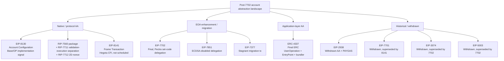
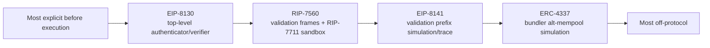
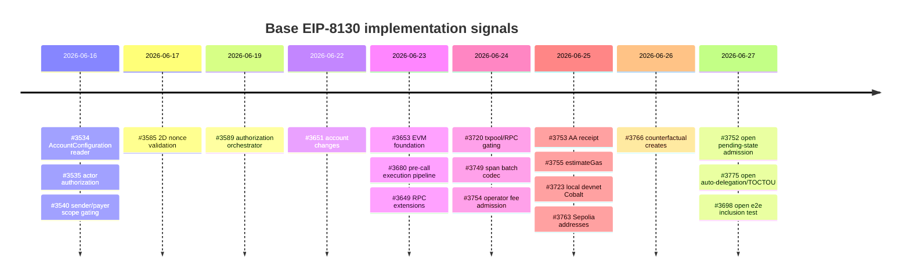

# 7702 之后的 native AA 方案全景与 Base 选型动因

## 0. 检索边界、证据分级与摘要

检索截止日期：**2026-06-27 23:59 Asia/Shanghai**。所有状态敏感结论以该时间点为准。本文重验了官方 EIP/ERC/RIP 文档、`base/base` PR、`ethereum-optimism/design-docs` PR #378、OP design-doc fork 文件、EIP-8081 Hegota meta，以及本项目已完成的 WHI-276/277/278 final sections。

证据分级：

| 分级 | 含义 | 本文用法 |
|---|---|---|
| `explicit-public-statement` | 规范文本、PR 评论或公开材料直接陈述某个事实/差异。 | EIP/RIP status、#378 `chunter-cb` 评论中 8130 vs 8141 对比。 |
| `code-pr-signal` | Base PR/commit 显示实际投入，但没有直接说“选择理由”。 | Cobalt/devnet/RPC/txpool/receipt/estimateGas/post-snapshot fixes。 |
| `design-doc-signal` | OP/Base design-doc proposal、FMA、adoption draft 等设计文档存在或提出方向。 | OP design-docs PR #378、adopt-eip-8130-on-op-stack.md、FMA。 |
| `roadmap-signal` | hardfork meta、CFI/Proposed/Scheduled 状态或路线图信号。 | EIP-8081 Hegota meta 中 EIP-8141/EIP-7851/EIP-8250/EIP-8151 状态。 |
| `inference` | 从实现节奏、方案差异、风险边界推断。 | Base 为什么偏向 8130 而不是 RIP-7560/8141/只用 4337/7702。 |
| `unknown` | 未发现足够证据或不应从现有证据外推。 | Base 是否正式评审并拒绝 RIP-7560；Mantle 适配成本精算。 |

核心结论：

1. **当前 7702 之后的 native/in-protocol AA 候选可分三类。** 主线候选是 EIP-8130、RIP-7560 package、EIP-8141；历史/withdrawn 参照是 EIP-2938、EIP-7701、EIP-3074、EIP-5003；相邻但不是完整 native AA 的活跃草案包括 EIP-7851、EIP-8250、EIP-8151 等。
2. **RIP-7560 不是单一文本可完整评估。** 本文按 review 要求把 RIP-7711 作为 validation/execution separation 与 mempool DoS 组件、RIP-7712 作为 2D nonce/`nonceKey` 组件，纳入 RIP-7560 package 的 D7/D11 和机制分析，不单列候选行。
3. **EIP-7701 应视为 EIP-8141 的旧版路线，而不是当前独立候选。** 官方状态为 Withdrawn，withdrawal reason 是 superseded by EIP-8141；本文只保留 7701 -> 8141 delta 的 condensed D1-D13 行。
4. **未发现 Base/OP 明确发布“选择 EIP-8130 而非 RIP-7560/EIP-8141”的完整官方选择 memo。** 最强的 explicit-public-statement 是 OP design-doc PR #378 及其评论：8130 的 top-level verifier/authenticator 使验证方法可见，8141 的验证方法不在 tx type 顶层可知，需要运行 tx 才知道是否违反规则；8130 被描述为更 performant、更 opinionated。
5. **Base 的 code-pr-signal 很强。** WHI-276 snapshot 后，`base/base` 继续合并或打开 EIP-8130 RPC、txpool、receipt、estimateGas、span batch codec、Sepolia addresses、counterfactual create、pending-state admission、auto-delegation/TOCTOU、end-to-end block executor test 等 PR。这说明 Base 已经把 8130 当作具体产品/协议 pipeline，而不是纸面研究。
6. **合理推断：Base/OP 倾向 8130 的原因是 bounded validation 与 OP Stack 可控 rollout。** 8130 把 authenticator/verifier 明确写在 tx 顶层，并把 canonical set 作为节点可过滤边界；这比 RIP-7560/EIP-8141 的任意 wallet/frame validation 更直接满足 sequencer ingress、txpool DoS、wallet baseline、OP Stack hardfork rollout 的约束。但这是 inference，不是 Base 官方选择声明。

## 1. 检索方法论与候选/排除清单

### 1.1 检索方法论

| 目标 | 方法 | 结果 |
|---|---|---|
| 官方状态 | `ethereum/EIPs` raw markdown 与 `ethereum/RIPs` raw markdown；状态、requires、withdrawal reason、created 字段逐项核对。 | EIP-8130/EIP-8141/RIP-7560/RIP-7711/RIP-7712 均为 Draft；EIP-7702/ERC-4337 Final；EIP-7701/EIP-3074/EIP-2938/EIP-5003 Withdrawn；EIP-5806/EIP-7377 Stagnant；EIP-7851 Draft。 |
| L1 hardfork meta | `ethereum/EIPs` EIP-8081 raw via GitHub API。 | EIP-8141 是 Hegota `Considered for Inclusion`，不是 scheduled；EIP-7851、EIP-8250、EIP-8151 是 Proposed for Inclusion。 |
| Base 实现信号 | `gh pr list --repo base/base --search "eip8130 OR 8130" --state all`，并抽样/重点 `gh pr view`。 | WHI-276 清单重验，并发现 #3649/#3720/#3749/#3752/#3753/#3754/#3755/#3763/#3766/#3775/#3698 等 post-snapshot/newer signals。 |
| OP/设计文档 | `gh pr view 378 --repo ethereum-optimism/design-docs`，并读取 fork branch 文件 `protocol/adopt-eip-8130-on-op-stack.md` 与 `security/adopt-eip-8130-on-op-stack-fma.md`。 | 发现 OP Stack 8130 adoption proposal 和 FMA；#378 公开评论直接比较 8130 与 8141。 |
| Forum/公开讨论 | 使用 EIP frontmatter `discussions-to` 的 Ethereum Magicians 链接；另做 gov.optimism/forum/site 搜索。 | 未发现 Base/OP governance forum 上单独的 8130 selection memo；官方 spec discussion links 可作为 forum seed，但本 draft 不把论坛评论作为已穷尽证据。 |
| 已完成研究复用 | 读取 WHI-276 `eip8130-deep-dive/final.md`、WHI-277 `eip7702-mechanism-limits/final.md`、WHI-278 `erc4337-mechanism-limits/final.md`、WHI-275 framework final。 | 复用 D1-D13 rubric、8130 PR seed、4337/7702 定位，避免重复证明。 |

### 1.2 候选/排除清单

| 分组 | 方案 | 状态快照 | 本文处理方式 | 原因 |
|---|---|---|---|---|
| 主候选 | EIP-8130 | Draft Core, created 2025-10-14 | 作为 Base 当前路线/对比基准 | Account Configuration + explicit authenticator + payer + phased calls。 |
| 主候选 | RIP-7560 + RIP-7711 + RIP-7712 | Draft RIP package | 完整候选行；7711/7712 作为组件 | 7560 是 native AA tx；7711 解决 validation/execution separation 与 public mempool DoS；7712 解决 2D nonce。 |
| 主候选 | EIP-8141 | Draft Core; Hegota CFI | 完整候选行 | Frame Transaction 是当前 L1 native AA 主要候选之一。 |
| 历史/压缩 | EIP-7701 | Withdrawn; superseded by EIP-8141 | condensed D1-D13 row | 只解释 7701 -> 8141 的路线变化。 |
| 历史 | EIP-2938 | Withdrawn; needs rewrite | condensed historical row | 早期 AA tx + PAYGAS，是 7560/7701/8141 的思想祖先。 |
| 历史 | EIP-3074 | Withdrawn; superseded by EIP-7702 | historical comparison | AUTH/AUTHCALL 是 7702 前史，解释为什么 7702/8130 不走 invoker opcode。 |
| 历史/相邻 | EIP-5003 | Withdrawn; superseded by EIP-7702 | excluded/adjacent | AUTHUSURP 迁移 EOA code，已被 7702 吸收。 |
| 相邻 | EIP-5806 | Stagnant | excluded/adjacent | Delegate transaction 是 EOA 增强，不是完整 AA。 |
| 相邻 | EIP-7377 | Stagnant | excluded/adjacent | Migration Transaction 是 EOA one-time code migration，不是完整 AA。 |
| 相邻活跃 | EIP-7851 | Draft; Hegota Proposed | adjacent row | 7702 delegated EOA 的 ECDSA authority burn，解决残余 ECDSA 权限，不是完整 AA。 |
| 组件活跃 | EIP-8250 | Hegota Proposed | gap/companion note | Keyed Nonces for Frame Transactions，属于 EIP-8141 生态组件；本 draft 未展开。 |
| 组件活跃 | EIP-8151 | Hegota Proposed | gap/companion note | ECDSA-disabled aware `ecRecover`，与 EIP-7851 相关；本 draft 未展开。 |
| 已有生态基线 | ERC-4337 | Final ERC | 作为 app-layer baseline | 完整生态但非 consensus native AA；WHI-278 已详述。 |
| 已上线 EOA 增强 | EIP-7702 | Final Core, Pectra | 作为 post-7702 基线 | 已上线 set-code delegation，但不是完整 native AA；WHI-277 已详述。 |

## 2. 方案原理与定位

### 2.1 EIP-8130: Account Configuration 路线

EIP-8130 引入新的 EIP-2718 AA transaction type 和 onchain Account Configuration。账户把 actor、authenticator、scope、policy、expiry 等配置写入 Account Configuration contract；交易显式声明 authenticator/verifier，节点可在进入任意 wallet execution 前看到验证路径。规范动机明确指出：把验证委托给 wallet code 会迫使节点在接收交易前模拟任意 EVM；8130 则让节点按 authenticator identity 过滤，只接受 canonical authenticator set。

定位：8130 是“较 opinionated 的 native AA”。它把 passkey/P256/k1/delegate 等认证路径标准化，把 payer、account changes、phased calls、2D nonce 等交易字段纳入一条 native path。优势是 ingress 可见、验证成本可界定、钱包 baseline 更统一；代价是 L2/client/hardfork/RPC/receipt/tooling 改动很大，而且 canonical authenticator set 会成为标准化/治理焦点。

### 2.2 RIP-7560 package: 4337 production model 的 native 化

RIP-7560 的抽象是把 ERC-4337 的 sender validation、paymaster validation、execution、postOp 等阶段搬进 native transaction。它定义 `AA_TX_TYPE`，交易包含 `sender`、`deployer`、`paymaster`、`executionData`、`builderFee`、gas limits、`authorizationList` 等字段。gas fee 可由 sender 或 paymaster 预扣，validation phase 要通过 `AA_ENTRY_POINT` approval callback 才算有效。

RIP-7711 是 7560 package 的 mempool/building 组件。它提出 bundle transaction type，让一串 AA transactions 先执行所有 validation frames，再执行所有 execution frames，降低 builder 因交易之间互相 invalidation 而重复 revalidate 的复杂度；同时引用 ERC-7562 风格规则约束 validation code。

RIP-7712 是 7560 package 的 nonce 组件。它给 RIP-7560 transaction 加 `nonceKey`/`nonceSequence` 二维 nonce，并通过 `AA_NONCE_MANAGER` 预部署合约管理 `(account, nonceKey) -> nonceSequence`。这使智能账户支持多 lane、并行交易、配置变更与普通操作分离。

定位：RIP-7560 更像“ERC-4337 的协议化版本”，兼容 4337 经验与 paymaster/deployer/account validation 模型。优势是和既有 4337 wallet/paymaster mental model 接近；弱点是 validation 仍是智能合约代码，public mempool/DoS 规则必须靠 7711/ERC-7562 风格沙箱继续维护。

### 2.3 EIP-8141: Frame Transaction 路线

EIP-8141 定义 `FRAME_TX_TYPE = 0x06`，把交易拆成 frames：`DEFAULT`、`VERIFY`、`SENDER` 三种 mode，外层包含 `sender`、`frames`、`signatures`、fee caps、blob hashes 等。签名列表支持 secp256k1 与 P256，frame 中可通过 `APPROVE` 更新交易级 approval context，直到 payer 被设置；交易最后必须有 payer。EIP-8141 还定义 `TXPARAM`、`FRAMEDATALOAD`、`FRAMEPARAM`、`SIGPARAM` 等 introspection opcodes/指令，以及 public mempool 的 validation-prefix 规则。

定位：8141 是更 general 的 L1 native AA 抽象，目标是“account simply becomes an address with code”。它比 8130 更通用：验证、支付、执行都可以是 frames；也因此 public mempool 规则更复杂，需要识别 validation prefix、限制 opcode/storage/state dependencies、设置 `MAX_VERIFY_GAS`。Hegota meta EIP-8081 仅把 EIP-8141 列为 Considered for Inclusion，未 scheduled。

### 2.4 EIP-7701 -> EIP-8141 delta

EIP-7701 官方状态 Withdrawn，withdrawal reason 是 superseded by EIP-8141。7701 也试图把 transaction scope 拆为 validation、execution、post-operation，并区分 authorization 与 gas payment；它的旧路线包含新 transaction type 与一组 opcode。8141 把路线重塑为 frame transaction：验证/支付/执行都成为可组合 frames，并引入 signature list、frame introspection、`APPROVE` 和更明确的 public mempool rules。

定位：7701 不应作为 2026-06-27 的独立候选；它是理解 8141 的历史版本。

### 2.5 EIP-3074 历史对照

EIP-3074 引入 `AUTH`/`AUTHCALL`。`AUTH` 用 ECDSA 签名设置当前 frame 的 `authorized` context，`AUTHCALL` 以 authorized account 身份发起 call。它允许 EOA 把控制权委托给 invoker contract，从而实现 sponsor/batch 等体验。官方状态 Withdrawn，withdrawal reason 是 superseded by EIP-7702。

与 8130/8141/RIP-7560 的区别：3074 不把账户变成协议级可配置对象，也不定义 native payer/nonce/account config；它是“EOA 授权给 invoker”的 opcode 路线。它的安全焦点是 invoker contract 和用户签名 UI，而不是 native AA mempool validation。

### 2.6 Historical and adjacent mechanisms

**EIP-2938** 是早期 native AA 原型：引入 AA transaction type、`PAYGAS` opcode 和验证/执行分界，让 contract account 在 `PAYGAS` 前证明会付费。它被 Withdrawn，原因是 very out of date / needs rewrite；后续 RIP-7560、EIP-7701、EIP-8141 都在继续处理它暴露的同一个问题：节点如何在不被任意验证代码 DoS 的情况下接收 native AA 交易。

**EIP-5806** 是 delegate transaction：EOA 直接签一种新交易，让目标合约代码以 EOA storage/context 通过 delegate-call-like 机制执行。它和 3074 的区别是没有 `AUTH`/`AUTHCALL` invoker 授权上下文，也不像 7702 那样把 delegation indicator 持久写入 EOA code；因此它是短期 EOA 执行能力增强，不是完整账户配置、payer、nonce、mempool native AA。

**EIP-5003** 依赖 EIP-3074 的 authorized context，引入 `AUTHUSURP` 把代码部署到被授权的 EOA 地址，从而让 EOA 永久迁移成 contract account，并通过 EIP-3607 语义废止原 ECDSA 交易权。它解决的是“从 EOA 迁出”的历史问题，但已被 EIP-7702 superseded；在 3074 -> 7702 -> 8130 脉络中，它对应的是 7702 delegation/migration 的旧 opcode 版本。

**EIP-7377** 定义 one-time migration transaction：EOA 发送一次特殊交易，把自己的 code 指向已有 `codeAddr` 的 code，并可写初始 storage。它避免逐项转移资产，但不定义持续的多 owner、paymaster、账户配置或 native validation mempool，因此属于 EOA 迁移工具，不是完整 native AA。

**EIP-7851** 扩展 EIP-7702：新增 `0xef0101` ECDSA-disabled delegation prefix 和 `SETSELFDELEGATE`，让 delegated wallet code 能永久禁用残余 ECDSA authority，同时继续由 wallet code 管理 delegation lifecycle。它补 7702 的安全缺口，但不定义 native payer、batch、actor scopes 或 account configuration；它更像 7702 向 8130/智能账户世界过渡时的 delegated-EOA lifecycle 组件。

## 3. Base/OP 选型动因：明确陈述 vs 合理推断

### 3.1 先给结论边界

**未发现明确选择理由；以下为基于代码/PR节奏/方案差异的推断。**

更精确地说：未发现 Base/OP 发布过一份完整 memo，逐项比较 RIP-7560、EIP-8141、EIP-7701、EIP-3074 并正式宣布“选择 EIP-8130、拒绝其他方案”。可公开引用的明确材料有三类：

1. EIP-8130 规范自身对 arbitrary wallet-code validation 的问题陈述。
2. OP design-docs PR #378 中的 “Adopt EIP-8130 on the OP Stack” proposal 和 FMA。
3. PR #378 评论区对 8130 vs 8141 的直接答复。

### 3.2 明确陈述证据

| 类型 | 信号 | 可支持的结论 | URL / commit |
|---|---|---|---|
| `explicit-public-statement` | EIP-8130 Motivation：delegate validation to wallet code 会要求节点在接收前模拟任意 EVM；8130 让交易显式声明 authenticator，节点可按 canonical set 过滤。 | 8130 的设计目标是 bounded/predictable validation，而非任意 wallet-code simulation。 | https://eips.ethereum.org/EIPS/eip-8130 |
| `design-doc-signal` | OP design-docs PR #378 Summary：提议 OP Stack 以 hardfork feature 采用 8130，目标是尽量与 upstream EIP semantic compatibility，且不需要 OP Stack-specific divergence，因为 no EVM changes/opcodes。 | OP 侧存在公开“采用 8130 on OP Stack”的设计提案。 | https://github.com/ethereum-optimism/design-docs/pull/378 |
| `design-doc-signal` | OP design doc Problem Statement：ERC-4337 需要 specialized mempools、bundlers、validation of wallet behavior；8130 把 authentication 从 wallet logic 中分离，tx 显式识别 sender/payer/auth path，sequencer/node 对 validation cost 可见。 | OP design doc 明确把 8130 与 4337 的 infra burden/validation visibility 对比。 | https://github.com/ethereum-optimism/design-docs/pull/378/files |
| `explicit-public-statement` | PR #378 comment by `chunter-cb`：8141 validation method 不在 tx type 顶层可知；8130 via verifier 显式声明；8141 tx 需要运行才知道是否违反规则；8130 更 performant、更 opinionated；8141 fully generic；8141 不支持 8130 的 external approval delegation。 | 这是公开材料中最强的 8130 vs 8141 选择/差异信号。 | https://github.com/ethereum-optimism/design-docs/pull/378#issuecomment-4401417034 |
| `design-doc-signal` | OP FMA：8130 主要风险包括 consensus bug、account takeover、mempool DoS/sequencer validation overload、receipt phase status、cross-chain owner changes；缓解包括 bounded canonical verifier set、mempool limits、defer nonceless mode。 | OP 采用 8130 时关注的主要安全边界与 rollout gate。 | https://github.com/ethereum-optimism/design-docs/pull/378/files |
| `roadmap-signal` | EIP-8081 Hegota meta：EIP-8141 是 Considered for Inclusion，不是 Scheduled for Inclusion。 | 8141 在 L1 hardfork 方向上仍未定稿/未 scheduled。 | https://github.com/ethereum/EIPs/blob/master/EIPS/eip-8081.md |

### 3.3 Base code-pr-signal：WHI-276 清单重验与 post-snapshot 新增

WHI-276 的 Base snapshot 基于 `01e732c...`，日期为 2026-06-18。本 draft 把它作为 PR floor 并重验/扩展。下表只列 selection-relevant signals，不穷尽全部 diff。

| 类型 | PR | 当前状态 | merge commit / state | selection signal |
|---|---|---|---|---|
| `code-pr-signal` | #3534 AccountConfiguration storage reader | merged 2026-06-16 | `396cf9873521dce364ab452e957691ae7cc3afec` | Account Configuration 是 8130 路线核心，而不是 4337/7702/RIP-7560 通用组件。 |
| `code-pr-signal` | #3535 actor authorization | merged 2026-06-16 | `1e4a6a6320054ee99577dba119d680c718f36717` | actor/authenticator stateful authenticate step 落地。 |
| `code-pr-signal` | #3540 tx actor authorization | merged 2026-06-16 | `0f629f69d45cf6e6932c75e3ff664c2e33b1cad7` | sender/payer scope gating，直接服务 8130 actor scope。 |
| `code-pr-signal` | #3585 2D nonce validation | merged 2026-06-17 | `da4e524313607db66ee2c257152f9ff1a8eda62e` | 8130 channel nonce/nonce-free 路径，和 RIP-7712 类似目标但在 Base 8130 pipeline 中实现。 |
| `code-pr-signal` | #3589 authorization orchestrator | merged 2026-06-19 | `f2a193ff242015ef1dbe967bba1c2cf95835ad65` | post-snapshot：统一 sender/payer/auth orchestration。 |
| `code-pr-signal` | #3651 account changes | merged 2026-06-22 | `d7825c65b06b1f96796252b955dd405a16a31c15` | create/config-change/delegation 进入 execution。 |
| `code-pr-signal` | #3653 EVM integration foundation | merged 2026-06-23 | `257c4121cb90c5c0b10c69f921aa57775542091c` | 8130 不只是 tx type，而是 EVM integration。 |
| `code-pr-signal` | #3680 pre-call execution pipeline | merged 2026-06-23 | `268820b38cb722e6a87fa424911720baff9daa20` | account-management txns 进入 block execution pipeline。 |
| `code-pr-signal` | #3720 txpool validation and RPC gating | merged 2026-06-24 | `a7c7fb10c9743340e99d5d4a79fe23df833c9edf` | txpool structural/stateful validation、Cobalt gate、payer funding、nonce/replay。 |
| `code-pr-signal` | #3649 RPC extensions | merged 2026-06-23 | `a81bdb6462b447dad407ae5b7d6f6ab6c71ef457` | `eth_getTransactionCount` 扩展 `nonce_key`，说明 tooling path 已开始。 |
| `code-pr-signal` | #3749 span batch codec | merged 2026-06-24 | `4509b0089f7b374376e98a65e82bfc06345ef537` | L2 batch/derivation path 支持 type `0x7B`。 |
| `code-pr-signal` | #3753 account-abstraction receipt | merged 2026-06-25 | `5b047190bf4b0a5d500c0cf6a8b6a6c03007e7b8` | receipt shape/tooling 已跟进，不只是 consensus validation。 |
| `code-pr-signal` | #3754 operator fee admission | merged 2026-06-24 | `d08ac8251a7f9353f0ab20f2d2d48d116e289180` | txpool admission gas/operator-fee edge case。 |
| `code-pr-signal` | #3755 estimateGas for 8130 | merged 2026-06-25 | `836ae417052d10cbacc92928acf47843b2286d5e` | RPC simulation/estimateGas 路径成熟化。 |
| `code-pr-signal` | #3723 local devnet Cobalt schedule | merged 2026-06-25 | `5bfda00b80eb6458d7bf858687817badc4dc5240` | devnet activation signal。 |
| `code-pr-signal` | #3763 Sepolia addresses | merged 2026-06-25 | `f6a4a2fbd1698efedd1ab3d83975d3bcc8d480d0` | Base Sepolia deployment/address pinning。 |
| `code-pr-signal` | #3766 counterfactual smart-account creates | merged 2026-06-26 | `50e568c8e2204780465018bb596656071baeeb68` | create path edge cases still active after WHI-276 snapshot。 |
| `code-pr-signal` | #3752 pending-state admission | open as of 2026-06-27 | open | txpool should validate against pending state and retry on lag；表明 mempool liveness 仍在调优。 |
| `code-pr-signal` | #3775 auto-delegate/TOCTOU | open as of 2026-06-27 | open | code-less sender auto-delegation、mempool gas budgeting TOCTOU；表明 EOA compatibility/gas safety still in flight。 |
| `code-pr-signal` | #3698 end-to-end inclusion test | open as of 2026-06-27 | open | BaseBlockExecutor e2e typed receipt inclusion test；验证 payload building/block import critical path。 |

这些 PR 不等于“官方选择理由”，但它们显示 Base 的资源已经投入到完整 8130 rollout：hardfork gate、txpool、EVM execution、precompiles/contracts、RPC、receipt、batch codec、devnet/Sepolia、tests。

### 3.4 合理推断清单

| 标注 | 推断 | 支撑证据 | 置信度 |
|---|---|---|---|
| `inference` | Base/OP 看重 8130 的 top-level authenticator/verifier 可见性，因为 sequencer ingress 需要 bounded validation。 | EIP-8130 Motivation；OP #378 problem statement；#378 8141 comparison comment；#3720/#3752/#3775 txpool work。 | 高 |
| `inference` | Base 不只想改善 EOA UX，而是要协议级账户配置、payer、2D nonce、phased calls 和 receipt/RPC 可观测性。 | #3534/#3535/#3540/#3585/#3651/#3680/#3753/#3755。 | 高 |
| `inference` | Base 选择 8130 而非直接等待 8141，可能因为 8141 更 generic、L1 CFI 未 scheduled、public mempool rules 更复杂，且不直接支持 8130 的 external approval delegation。 | EIP-8081；EIP-8141 mempool rules；#378 comment。 | 中高 |
| `inference` | Base 没选择 RIP-7560 的原因可能是 7560 更贴近 4337 frame/paymaster validation，仍需 ERC-7562-like validation sandbox；8130 canonical authenticator set 更适合 OP Stack conservative verifier rollout。 | RIP-7560/7711/7712；OP design doc canonical verifier policy；EIP-8130 canonical authenticator set。 | 中 |
| `inference` | 8130 与 4337/7702 不是替代关系：Base 更可能把 7702 delegation/4337 migration 作为兼容入口，同时把 8130 作为 native path。 | WHI-277/278；EIP-8130 account types；OP design doc says existing ERC-4337 flows continue and migration can be incremental。 | 高 |
| `unknown` | Base 是否正式评审并拒绝 RIP-7560。 | 未发现公开 PR/comment/design-doc 明确陈述。 | unknown |
| `unknown` | Base 是否正式评审并拒绝 EIP-8141。 | 只有 #378 comment 解释差异，不是正式 rejection memo。 | unknown |

## 4. D1-D13 预填：主候选与历史方案

Rubric 继承 WHI-275：D1 抽象层级，D2 协议改动范围，D3 基础设施依赖，D4 key/authorization model，D5 gas sponsorship，D6 batching/execution，D7 nonce/replay，D8 EOA compatibility/migration，D9 signature/crypto extensibility，D10 maturity/ecosystem，D11 security attack surface，D12 Mantle adaptation cost，D13 target users/product fit。

### 4.1 RIP-7560 package

| D# | value | evidence_type | source_anchor | confidence | caveat_or_unknown_reason |
|---|---|---|---|---|---|
| D1 | 协议原生 native AA，面向 rollup/L2，也借鉴 L1 AA。 | spec-cited | https://github.com/ethereum/RIPs/blob/master/RIPS/rip-7560.md §Abstract | high | — |
| D2 | 新 EIP-2718 `AA_TX_TYPE`，新增 AA EntryPoint/predeploy semantics、receipt shape、gas accounting、validation/execution phases。 | spec-cited | https://github.com/ethereum/RIPs/blob/master/RIPS/rip-7560.md §New Transaction Type / §Definition of the RIP-7560 Transaction | high | — |
| D3 | 需要 txpool/builder 支持 AA tx；public mempool 需要 RIP-7711/ERC-7562-like rules；仍需 wallet/paymaster/deployer ecosystem。 | spec-cited | https://github.com/ethereum/RIPs/blob/master/RIPS/rip-7711.md §Validation code sandboxing | high | — |
| D4 | Smart Contract Account 自定义 validation；sender validation frame 决定 validity。 | spec-cited | https://github.com/ethereum/RIPs/blob/master/RIPS/rip-7560.md §Multiple execution frames for a single transaction | high | — |
| D5 | paymaster first-class：`paymaster`、paymaster validation、postOp gas limits、gas precharge from sender/paymaster。 | spec-cited | https://github.com/ethereum/RIPs/blob/master/RIPS/rip-7560.md §Gas fees are charged directly from the contract balance | high | — |
| D6 | execution frame + optional deployer/paymaster frames；更接近 4337 `handleOps` lifecycle 的 native 化。 | spec-cited | https://github.com/ethereum/RIPs/blob/master/RIPS/rip-7560.md §Multiple execution frames for a single transaction | high | — |
| D7 | RIP-7712 引入 `nonceKey`/`nonceSequence` 与 `AA_NONCE_MANAGER`，支持 2D nonce。 | spec-cited | https://github.com/ethereum/RIPs/blob/master/RIPS/rip-7712.md §Non-sequential nonce support / §Nonce validation | high | — |
| D8 | requires EIP-7702；可兼容 7702 authorizationList，但 EOA 原地址迁移仍取决于 wallet/account path。 | spec-cited | https://github.com/ethereum/RIPs/blob/master/RIPS/rip-7560.md frontmatter `requires: 7702` and §New Transaction Type | medium | ecosystem-data-missing |
| D9 | 任意 account validation code，签名算法灵活但 mempool 更难 bounded。 | spec-cited | https://github.com/ethereum/RIPs/blob/master/RIPS/rip-7711.md §Motivation / §Validation code sandboxing | high | — |
| D10 | Draft RIP；与 ERC-4337 经验兼容，但未发现 Base/OP 实现投入。 | spec-cited | https://github.com/ethereum/RIPs/blob/master/RIPS/rip-7560.md frontmatter `status: Draft`; https://github.com/base/base/pulls?q=8130 | medium | no-public-statement |
| D11 | 主要风险是 arbitrary validation DoS、cross-validation invalidation、paymaster griefing；RIP-7711/ERC-7562-like sandbox 是核心缓解。 | spec-cited | https://github.com/ethereum/RIPs/blob/master/RIPS/rip-7711.md §Motivation / §Security Considerations | high | — |
| D12 | 对 Mantle 适配成本高：execution client、txpool、batch/derivation、RPC/receipt、wallet/paymaster 都要改；若复用 4337 ecosystem，产品迁移较顺。 | inference | base-eip8130-native-aa/research-sections/native-aa-framework/final.md §D12 Mantle 适配成本口径 | medium | mantle-not-inspected |
| D13 | 适合已有 4337 wallet/paymaster 生态、gasless onboarding、SCA 平滑 native 化。 | inference | base-eip8130-native-aa/research-sections/erc4337-mechanism-limits/final.md §Executive Summary and https://github.com/ethereum/RIPs/blob/master/RIPS/rip-7560.md §Motivation | medium | ecosystem-data-missing |

### 4.2 EIP-8141

| D# | value | evidence_type | source_anchor | confidence | caveat_or_unknown_reason |
|---|---|---|---|---|---|
| D1 | 协议原生 native AA / frame abstraction。 | spec-cited | https://eips.ethereum.org/EIPS/eip-8141 §Abstract | high | — |
| D2 | 新 `FRAME_TX_TYPE=0x06`，frames、signature list、`APPROVE`、TX/FRAME/SIG introspection 指令、receipt encoding、mempool rules。 | spec-cited | https://eips.ethereum.org/EIPS/eip-8141 §Frame Transaction / §APPROVE Instruction / §Introspection | high | — |
| D3 | 普通节点/txpool/public mempool 需要 validation-prefix simulation 和 trace rules；wallet/account code 要按 frames 编排。 | spec-cited | https://eips.ethereum.org/EIPS/eip-8141 §Mempool / §Validation Trace Rules | high | — |
| D4 | 账户 code 可通过 VERIFY frames approval 自定义 validation；default code 支持无 code account 的 secp256k1 path。 | spec-cited | https://eips.ethereum.org/EIPS/eip-8141 §Default code / §Behavior | high | — |
| D5 | `APPROVE_PAYMENT` / `APPROVE_EXECUTION_AND_PAYMENT` 让 payer 在 frame 中确定；付款者是 approval context。 | spec-cited | https://eips.ethereum.org/EIPS/eip-8141 §APPROVE Instruction | high | — |
| D6 | 多 frames、atomic batch flag、`SENDER` mode；unused frame gas refund 到 payer。 | spec-cited | https://eips.ethereum.org/EIPS/eip-8141 §Frame object / §Behavior / §Gas Accounting | high | — |
| D7 | 外层 nonce 是 sender nonce；EIP-8250 Keyed Nonces for Frame Transactions 是 companion/proposed item，本文未展开。 | unknown | https://eips.ethereum.org/EIPS/eip-8141 §Frame Transaction; https://github.com/ethereum/EIPs/blob/master/EIPS/eip-8081.md §Proposed for Inclusion | low | spec-gap |
| D8 | requires EIP-7702；default code 与 7702 delegation indicator 支持 EOA/code-empty 路径，但迁移体验依赖 wallet code。 | spec-cited | https://eips.ethereum.org/EIPS/eip-8141 frontmatter `requires: 7702` and §Default code | medium | ecosystem-data-missing |
| D9 | secp256k1/P256 signature list；Motivation 包含 PQ off-ramp；future aggregation 预留。 | spec-cited | https://eips.ethereum.org/EIPS/eip-8141 §Transaction Signatures / §Motivation | high | — |
| D10 | Draft Core；EIP-8081 列为 Hegota Considered for Inclusion，未 scheduled。 | roadmap-signal | https://eips.ethereum.org/EIPS/eip-8141 frontmatter `status: Draft`; https://github.com/ethereum/EIPs/blob/master/EIPS/eip-8081.md §Considered for Inclusion | high | status-unstable |
| D11 | 最大风险是 public mempool validation complexity：validation prefix、banned opcodes、mutable state dependencies、`MAX_VERIFY_GAS`、paymaster exceptions。 | spec-cited | https://eips.ethereum.org/EIPS/eip-8141 §Mempool / §Banned Opcodes | high | — |
| D12 | Mantle 适配成本高到极高：新 tx type、frame execution、mempool tracing、opcodes/predeploys/RPC/receipt/tooling，且 L1 spec 仍变动。 | inference | base-eip8130-native-aa/research-sections/native-aa-framework/final.md §D12 Mantle 适配成本口径; https://github.com/ethereum/EIPs/blob/master/EIPS/eip-8081.md §Considered for Inclusion | medium | mantle-not-inspected |
| D13 | 适合长期 L1-aligned、PQ/key rotation、generic programmable AA；短期 L2 product rollout 风险高。 | inference | https://eips.ethereum.org/EIPS/eip-8141 §Motivation; https://github.com/ethereum-optimism/design-docs/pull/378#issuecomment-4401417034 | medium | ecosystem-data-missing |

### 4.3 EIP-7701 condensed delta row

| D# | value | evidence_type | source_anchor | confidence | caveat_or_unknown_reason |
|---|---|---|---|---|---|
| D1 | 历史 native AA 草案；不再作为独立候选。 | spec-cited | https://eips.ethereum.org/EIPS/eip-7701 frontmatter `status: Withdrawn` | high | — |
| D2 | 新 transaction type + opcode family 的旧路线；已被 8141 frame abstraction 取代。 | spec-cited | https://eips.ethereum.org/EIPS/eip-7701 §Abstract and frontmatter `withdrawal-reason` | high | — |
| D3 | 与 8141 类似需要 client/mempool/execution 改动，但具体机制已过期。 | inference | https://eips.ethereum.org/EIPS/eip-7701 §Specification; https://eips.ethereum.org/EIPS/eip-8141 §Mempool | medium | status-unstable |
| D4 | 通过 validation steps 自定义 authorization。 | spec-cited | https://eips.ethereum.org/EIPS/eip-7701 §Abstract | high | — |
| D5 | 区分 authorization 与 gas fee payment，允许另一合约付费。 | spec-cited | https://eips.ethereum.org/EIPS/eip-7701 §Abstract | high | — |
| D6 | validation/execution/post-operation 分段。 | spec-cited | https://eips.ethereum.org/EIPS/eip-7701 §Abstract | high | — |
| D7 | 旧 spec 细节不应沿用；按 8141/8250 重新评估。 | unknown | https://eips.ethereum.org/EIPS/eip-7701 frontmatter `withdrawal-reason`; https://github.com/ethereum/EIPs/blob/master/EIPS/eip-8081.md §Proposed for Inclusion | low | spec-gap |
| D8 | 非当前迁移方案；被 8141 取代。 | spec-cited | https://eips.ethereum.org/EIPS/eip-7701 frontmatter `withdrawal-reason` | high | — |
| D9 | 自定义 validation 方向，但旧 opcode design 已被更新。 | inference | https://eips.ethereum.org/EIPS/eip-7701 §Abstract; https://eips.ethereum.org/EIPS/eip-8141 §Frame Transaction | medium | status-unstable |
| D10 | Withdrawn；withdrawal reason: superseded by EIP-8141。 | spec-cited | https://eips.ethereum.org/EIPS/eip-7701 frontmatter | high | — |
| D11 | 任意 validation/mempool DoS 问题需要新方案处理。 | inference | https://eips.ethereum.org/EIPS/eip-8141 §Mempool; https://github.com/ethereum-optimism/design-docs/pull/378#issuecomment-4401417034 | medium | spec-gap |
| D12 | 不建议 Mantle 采用；若评估，应评估 8141。 | inference | https://eips.ethereum.org/EIPS/eip-7701 frontmatter `status: Withdrawn`; base-eip8130-native-aa/research-sections/native-aa-framework/final.md §D12 Mantle 适配成本口径 | high | mantle-not-inspected |
| D13 | 只作为历史背景和 8141 delta。 | inference | https://eips.ethereum.org/EIPS/eip-7701 frontmatter `withdrawal-reason` | high | — |

### 4.4 EIP-2938 historical row

| D# | value | evidence_type | source_anchor | confidence | caveat_or_unknown_reason |
|---|---|---|---|---|---|
| D1 | 早期协议原生 AA。 | spec-cited | https://eips.ethereum.org/EIPS/eip-2938 §Simple Summary / §Abstract | high | — |
| D2 | 新 AA transaction type、`PAYGAS` opcode、`NONCE` opcode、verification/execution phase。 | spec-cited | https://eips.ethereum.org/EIPS/eip-2938 §Single Tenant / §PAYGAS Opcode | high | — |
| D3 | miner/node strategy 需要执行 validation until `PAYGAS`，限制外部 state/opcode access。 | spec-cited | https://eips.ethereum.org/EIPS/eip-2938 §Mining and Rebroadcasting Strategies | high | — |
| D4 | contract account code 定义 transaction validity。 | spec-cited | https://eips.ethereum.org/EIPS/eip-2938 §Abstract | high | — |
| D5 | `PAYGAS` 让合约支付 gas。 | spec-cited | https://eips.ethereum.org/EIPS/eip-2938 §PAYGAS Opcode | high | — |
| D6 | top-level AA frame，PAYGAS 前验证、PAYGAS 后执行。 | spec-cited | https://eips.ethereum.org/EIPS/eip-2938 §Rationale | high | — |
| D7 | 单 tenant 仍使用 target nonce；multi-tenant nonce/replay 仍需研究。 | spec-cited | https://eips.ethereum.org/EIPS/eip-2938 §Replay Protection / §Nonces still enshrined in single-tenant AA | high | — |
| D8 | 不是 EOA 原地址迁移方案。 | inference | https://eips.ethereum.org/EIPS/eip-2938 §Simple Summary; base-eip8130-native-aa/research-sections/eip7702-mechanism-limits/final.md §item-1 | medium | ecosystem-data-missing |
| D9 | 支持非 ECDSA 等自定义 wallet validation。 | spec-cited | https://eips.ethereum.org/EIPS/eip-2938 §Motivation | high | — |
| D10 | Withdrawn；withdrawal reason: very out of date, needs rewrite。 | spec-cited | https://eips.ethereum.org/EIPS/eip-2938 frontmatter | high | — |
| D11 | 外部 mutable state invalidation、verification gas cap、DoS 是核心问题。 | spec-cited | https://eips.ethereum.org/EIPS/eip-2938 §Miners refuse transactions that access external data | high | — |
| D12 | 不建议 Mantle 采用；只用于理解 native AA 问题史。 | inference | https://eips.ethereum.org/EIPS/eip-2938 frontmatter `status: Withdrawn`; base-eip8130-native-aa/research-sections/native-aa-framework/final.md §D12 Mantle 适配成本口径 | high | mantle-not-inspected |
| D13 | 历史理论基线。 | inference | https://eips.ethereum.org/EIPS/eip-2938 frontmatter `withdrawal-reason` | high | — |

### 4.5 EIP-3074 historical row

| D# | value | evidence_type | source_anchor | confidence | caveat_or_unknown_reason |
|---|---|---|---|---|---|
| D1 | EOA 增强，不是完整 native AA。 | spec-cited | https://eips.ethereum.org/EIPS/eip-3074 §Abstract / §Motivation | high | — |
| D2 | 新 EVM opcodes `AUTH`/`AUTHCALL`。 | spec-cited | https://eips.ethereum.org/EIPS/eip-3074 §AUTH / §AUTHCALL | high | — |
| D3 | 需要 invoker contract ecosystem 与 wallet signing UX。 | inference | https://eips.ethereum.org/EIPS/eip-3074 §Motivation / §Security Considerations | medium | ecosystem-data-missing |
| D4 | EOA secp256k1 签名授权 invoker；无 onchain account config。 | spec-cited | https://eips.ethereum.org/EIPS/eip-3074 §AUTH | high | — |
| D5 | sponsor pattern 可通过 invoker/relayer 实现，不是 paymaster protocol。 | spec-cited | https://eips.ethereum.org/EIPS/eip-3074 §Motivation / §Another Sponsored Transaction EIP | medium | — |
| D6 | invoker contract 内 batching。 | spec-cited | https://eips.ethereum.org/EIPS/eip-3074 §Motivation | medium | — |
| D7 | 依赖 EOA nonce in AUTH preimage。 | spec-cited | https://eips.ethereum.org/EIPS/eip-3074 §AUTH | high | — |
| D8 | 原 EOA 地址强兼容。 | spec-cited | https://eips.ethereum.org/EIPS/eip-3074 §Abstract | high | — |
| D9 | 主要是 secp256k1 EOA authorization，非多算法 native AA。 | spec-cited | https://eips.ethereum.org/EIPS/eip-3074 §AUTH | high | — |
| D10 | Withdrawn；superseded by EIP-7702。 | spec-cited | https://eips.ethereum.org/EIPS/eip-3074 frontmatter | high | — |
| D11 | invoker bug/恶意授权、签名 UI、sponsor griefing。 | inference | https://eips.ethereum.org/EIPS/eip-3074 §Security Considerations; base-eip8130-native-aa/research-sections/eip7702-mechanism-limits/final.md §item-2 | medium | ecosystem-data-missing |
| D12 | 不建议 Mantle 新采用；7702 是当前替代。 | inference | https://eips.ethereum.org/EIPS/eip-3074 frontmatter `withdrawal-reason`; base-eip8130-native-aa/research-sections/eip7702-mechanism-limits/final.md §Executive Summary | high | mantle-not-inspected |
| D13 | 历史参照：解释 7702/8130 为什么更偏 transaction/account-config 路线。 | inference | base-eip8130-native-aa/research-sections/eip7702-mechanism-limits/final.md §item-2 | high | — |

### 4.6 EIP-7851 adjacent row

| D# | value | evidence_type | source_anchor | confidence | caveat_or_unknown_reason |
|---|---|---|---|---|---|
| D1 | EOA delegation lifecycle 增强，不是完整 native AA。 | spec-cited | https://eips.ethereum.org/EIPS/eip-7851 §Abstract / §Motivation | high | — |
| D2 | 扩展 7702，新增 `0xef0101` ECDSA-disabled delegation prefix 与 `SETSELFDELEGATE`。 | spec-cited | https://eips.ethereum.org/EIPS/eip-7851 §Specification | high | — |
| D3 | wallet code、txpool/account-code read、ecRecover companion 需要支持。 | spec-cited | https://eips.ethereum.org/EIPS/eip-7851 §Validation / §Security Considerations | high | — |
| D4 | delegated wallet code 控制后续 delegation，可永久禁用 residual ECDSA authority。 | spec-cited | https://eips.ethereum.org/EIPS/eip-7851 §SETSELFDELEGATE / §Rationale | high | — |
| D5 | 不定义 native payer/paymaster。 | inference | https://eips.ethereum.org/EIPS/eip-7851 §Abstract; base-eip8130-native-aa/research-sections/eip7702-mechanism-limits/final.md §item-3 | medium | spec-gap |
| D6 | 不定义 native batching，只由 delegate code 实现。 | inference | https://eips.ethereum.org/EIPS/eip-7851 §Abstract; https://eips.ethereum.org/EIPS/eip-7702 §Motivation | medium | spec-gap |
| D7 | 继承 7702/EOA nonce；无完整 AA nonce model。 | inference | https://eips.ethereum.org/EIPS/eip-7851 §Validation; https://eips.ethereum.org/EIPS/eip-7702 §Set code transaction | medium | spec-gap |
| D8 | 很强：专为 7702 delegated EOA 迁移后烧掉原 ECDSA 权限。 | spec-cited | https://eips.ethereum.org/EIPS/eip-7851 §Motivation / §Security Considerations | high | — |
| D9 | 通过 wallet code 间接支持 passkeys/multisig，但 protocol 只处理 ECDSA-disabled code state。 | inference | https://eips.ethereum.org/EIPS/eip-7851 §Motivation; https://eips.ethereum.org/EIPS/eip-7702 §Motivation | medium | ecosystem-data-missing |
| D10 | Draft；EIP-8081 Proposed for Hegota。 | roadmap-signal | https://eips.ethereum.org/EIPS/eip-7851 frontmatter `status: Draft`; https://github.com/ethereum/EIPs/blob/master/EIPS/eip-8081.md §Proposed for Inclusion | high | status-unstable |
| D11 | irreversible ECDSA disable、wallet UX、contracts direct `ecrecover` 不自动感知。 | spec-cited | https://eips.ethereum.org/EIPS/eip-7851 §Security Considerations | high | — |
| D12 | 若 Mantle 已支持 7702，适配成本中等；但不是 8130 替代方案。 | inference | base-eip8130-native-aa/research-sections/eip7702-mechanism-limits/final.md §Executive Summary; base-eip8130-native-aa/research-sections/native-aa-framework/final.md §D12 Mantle 适配成本口径 | low | mantle-not-inspected |
| D13 | 适合“从 7702 过渡到 wallet-code controlled account”场景。 | inference | https://eips.ethereum.org/EIPS/eip-7851 §Motivation | medium | ecosystem-data-missing |

## 5. 8130 vs 替代方案：初步差异点

| 维度 | EIP-8130 | RIP-7560 package | EIP-8141 | ERC-4337 | EIP-7702 |
|---|---|---|---|---|---|
| 账户核心 | Account Configuration + actors/authenticators/scopes | Smart Contract Account validation frames | Account code + frames + approvals | Smart account contract + EntryPoint | EOA code delegation |
| validation 可见性 | tx 顶层声明 authenticator/verifier，canonical set 可过滤 | sender/paymaster validation 是 code frame，需 sandbox | validation prefix 需 simulation/trace rules | bundler simulation/alt mempool | 协议只验证 EOA authorization tuple |
| payer/sponsorship | payer first-class in tx/auth path | paymaster first-class | approval frame sets payer | paymaster contract/deposit | outer sponsor/delegate code pattern |
| nonce | 2D nonce / nonce-free in Base implementation/spec line | RIP-7712 `nonceKey`/`nonceSequence` | sender nonce；keyed nonce companion EIP-8250 | EntryPoint/account nonce lanes | EOA nonce |
| batching | phased calls | executionData/account execution | multiple frames + atomic batch | account `callData` / wallet implementation | delegate wallet implementation |
| EOA migration | default EOA/k1 path + 7702-style delegation/import | requires 7702; SCA model | default code + 7702 delegation support | v0.8 can use 7702 support but usually SCA | strongest原地址 UX，但非完整 AA |
| DoS boundary | canonical authenticator allowlist + bounded auth path | RIP-7711 + ERC-7562-like validation rules | public mempool validation-prefix rules, `MAX_VERIFY_GAS`, opcode/storage bans | bundler reputation/simulation/ERC-7562 | ordinary txpool plus delegated-code risks |
| OP Stack rollout | Base/OP 已有 adoption proposal 和 Base PR wave | 未发现 Base/OP 实现投入 | L1 CFI, not scheduled; no Base implementation found | production infra, no hardfork | already Pectra/L2 support varies |
| Product fit | passkeys, scoped actors, native payer, high-throughput nonce lanes | 4337 ecosystems moving native | long-term generic L1 AA/PQ | app-layer AA today | EOA UX bridge |

## 6. 图示

### diag-1: Post-7702 AA taxonomy

### diag-2: Validation visibility continuum

### diag-3: Base evidence timeline after WHI-276 floor

## 7. Source Coverage

| Source requirement | Coverage | Notes |
|---|---|---|
| EIP-8130 official spec | Covered | https://eips.ethereum.org/EIPS/eip-8130 |
| RIP-7560/RIP-7711/RIP-7712 official specs | Covered | https://github.com/ethereum/RIPs/blob/master/RIPS/rip-7560.md, rip-7711.md, rip-7712.md |
| EIP-8141 official spec | Covered | https://eips.ethereum.org/EIPS/eip-8141 |
| EIP-7701 official status | Covered | https://eips.ethereum.org/EIPS/eip-7701 |
| EIP-3074 historical status | Covered | https://eips.ethereum.org/EIPS/eip-3074 |
| EIP-2938/EIP-5003/EIP-5806/EIP-7377/EIP-7851 | Covered as historical/adjacent | Official EIP markdown checked 2026-06-27. |
| EIP-8081 Hegota meta | Covered | https://github.com/ethereum/EIPs/blob/master/EIPS/eip-8081.md |
| ERC-4337 and EIP-7702 baseline | Covered via WHI-278/277 and official specs | ERC-4337 raw moved to ethereum/ercs; EIP-7702 Final in Pectra already covered by WHI-277. |
| Base PR list and post-WHI-276 discovery | Covered | `gh pr list --repo base/base --search "eip8130 OR 8130" --state all`; targeted PR views for #3649/#3720/#3752/#3755/#3775/#3698 and commit table. |
| OP design docs | Covered | `ethereum-optimism/design-docs` PR #378 and fork branch files read. |
| OP/Base forum | Partial | No Base/OP governance/forum selection memo found in targeted search; EIP frontmatter Magicians links recorded but forum thread comments not exhaustively analyzed. |
| ACD / broader Ethereum governance | Partial | EIP-8081 meta checked; ACD call transcripts not exhaustively reviewed in this draft. |

## 8. Gap Analysis

1. **官方选择 memo 缺失。** 没有找到 Base/OP 明确逐项比较并正式拒绝 RIP-7560/EIP-8141 的公开文档。本文所有“为什么选 8130”的强结论都按 explicit vs inference 标注。
2. **OP design-doc #378 仍是 Draft/Open。** 它是强信号，但不能写成已最终批准的 OP Stack governance decision。
3. **Forum/ACD 覆盖不完整。** 本 draft 记录了官方 spec discussion links 和 Hegota meta，但没有逐条爬取 Ethereum Magicians/ACD transcript。若 final report 要把 L1 politics/roadmap 写得更重，应补一轮 governance-source pass。
4. **Mantle D12 仍是粗估。** 本 issue 没有 Mantle repo/code resource；D12 只能基于 Base PR work breakdown 和 OP Stack hardfork/RPC/tooling common sense 预填。
5. **EIP-8250/EIP-8151 等 companion drafts 未展开。** 它们不是完整 native AA 候选，但会影响 8141/7851 的 nonce 与 ecrecover semantics，后续若聚焦 L1 roadmap 应补。
6. **Base PR open items 仍在变化。** #3752/#3775/#3698 截止 2026-06-27 仍 open；final promotion 前建议再跑一次 PR state check。

## 9. Revision Log

| Round | Change | Notes |
|---|---|---|
| 1 | Initial deep draft | Created candidate/exclusion list, methodology, mechanism tables, Base/OP evidence split, D1-D13 prefill rows, diagrams, source coverage, and gaps. |
| 1 | Applied outline review F1 | RIP-7711/RIP-7712 treated as RIP-7560 package components for D7/D11. |
| 1 | Applied outline review F2 | EIP-7701 reduced to condensed withdrawal/delta row. |
| 1 | Applied outline review F3 | WHI-276 PR floor re-verified and post-2026-06-18 Base PR signals added. |
