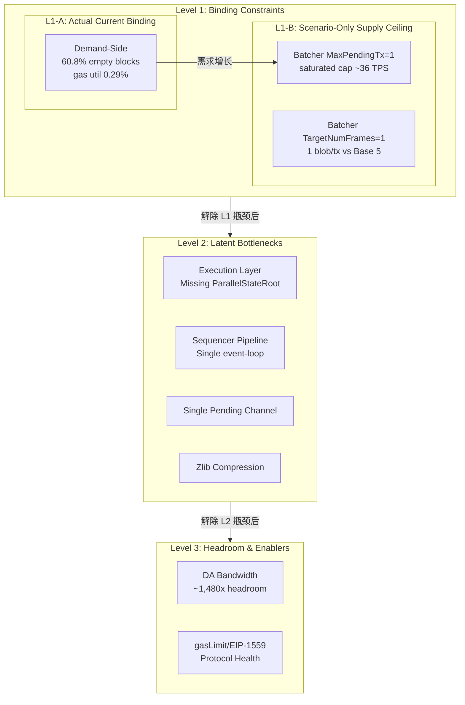
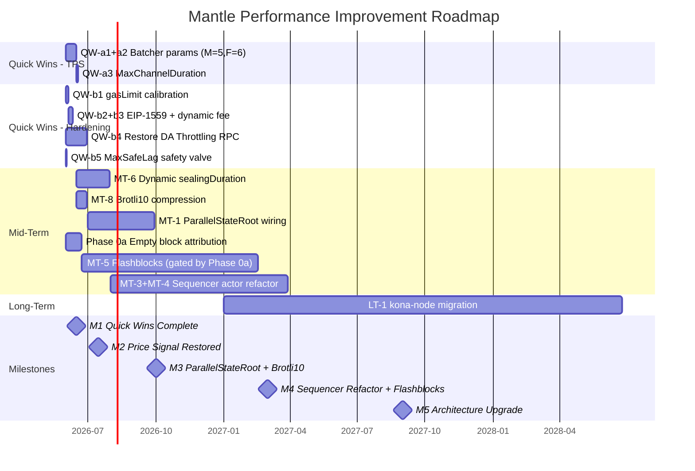

# 解析 Base 的性能提升方式：Mantle vs Base 全栈性能对比与改进路线图

## Executive Summary

本报告基于对 Base 和 Mantle 两条 OP Stack L2 rollup 的全栈深度源码分析，综合 8 个专题研究成果，系统剖析了 Base 在执行层、Block Builder、Gas 协议、Sequencer Pipeline、Batcher Pipeline、DA 带宽、背压机制等维度的性能提升方式，并为 Mantle 提出分级改进路线图。

### 核心发现

**1. Mantle 当前是 demand-bound 系统，非 supply-bound。** Mantle 实测 TPS 约 0.7–1.0（60.8% 区块为系统空块，gas 利用率仅 0.29%），而 Base 实测约 93.7 TPS。~90–130× 的 TPS 差距主因是交易需求不足，而非系统吞吐能力限制。

**2. 供给侧 Quick Wins 成本极低但价值巨大。** Batcher 参数调优（MaxPendingTransactions 从 1 提升至 5–10，TargetNumFrames 从 1 提升至 6）仅需 CLI flag 变更（≈0.1 人月），即可将饱和积压场景下的吞吐上限从 ~36 TPS 提升至 ~1,083 TPS（约 30× 改善），远超 Base 当前实测的 93.7 TPS。

**3. Base 的性能优势来自全栈协同优化。** Base 通过以下 7 层协同实现了其性能领先：

| 层次 | Base 方案 | Mantle 现状 | 差距性质 |
|------|----------|------------|---------|
| 执行层 | Tier C 架构：CachedExecutor + CachedPrecompile + 异步 ReceiptRootTask | Tier B 架构：TransactionCache + CachedReads，仅限 flashblocks 子块范围内 | 架构设计层次差异 |
| Block Builder | rollup-boost 双路 Engine API + Flashblocks 250ms 预确认 | 无 builder 分离、无 Flashblocks | 架构缺失 |
| Gas 协议 | gasLimit 375M（生效约束）+ 动态 EIP-1559 + EIP-7825 硬执行 | gasLimit 200B（装饰上限）+ 固定 base fee + EIP-7825 被 gate 关闭 | 参数/配置差异 |
| Sequencer | Rust tokio 5-actor 模型，Engine API 异步化 | Go 单 event-loop 同步 Engine API RPC | 架构差异 |
| Batcher | Rust 多 pending tx + Brotli10 + 5 blobs/tx | Go 单 pending tx + Zlib + 1 blob/tx | 配置 + 架构差异 |
| DA | 95% fill rate，14 blobs/L1 block | ~1,480× DA 余量，DA 非瓶颈 | 利用率差异 |
| 背压 | 完整 DA Throttling + miner_setGasLimit | DA Throttling 因 RPC 移除不可用；MaxSafeLag 默认禁用 | 机制缺失 |

**4. DA 带宽完全不是 Mantle 的瓶颈。** BPO2（target=14, max=21 blobs/block）后，Mantle 的 DA 利用率余量约 1,480×，DA ceiling 约 1,749 TPS。TPS 差距的根因在执行/sequencer/batcher 架构，而非 DA 层。

**5. Gas 协议参数是 Protocol Health Enablers，非 TPS Binding Constraints。** gasLimit 200B（装饰上限）、固定 base fee 0.02 gwei、EIP-1559 参数过粗等问题影响的是协议健康度和定价机制，不直接限制 sustained TPS。

### 现状对比快照

| 指标 | Mantle | Base | 差距 |
|------|--------|------|------|
| 实测 TPS | 0.7–1.0 | ~93.7 | ~90–130× |
| 平均 tx/block | 1.80 | 187 | ~104× |
| Gas 利用率 | 0.29% | 8.19% | 28× |
| 系统空块率 | 60.80% | 0.20% | 304× |
| Block time | 2s | 2s (+ 250ms flashblocks) | 1× (8× UX) |
| Batcher cadence | ~448s | ~49s | ~9× |
| Blobs/batch tx | 1 | 5 | 5× |
| DA 利用率 | ~97 B/s (~1,480× 余量) | ~95–99% fill rate | — |

---

## 第一章 执行层性能架构对比

> 来源：WHI-55 — `execution-layer-reth-fork-comparison/final.md`

### 1.1 Tier 分级架构对比

Base 和 Mantle 均基于 reth fork 构建执行层，但在性能优化的架构深度上存在显著差异。研究将执行层优化分为五个 Tier：

| Tier | 含义 | Base 状态 | Mantle 状态 |
|------|------|----------|------------|
| **Tier A** | Fork identity & OP Stack traits | 完整 | 完整 |
| **Tier B** | Flashblocks 范围内的缓存路径 | 完整 | 部分（TransactionCache、CachedReads、cached-prefix resume） |
| **Tier C** | 跨 Flashblock 的执行优化 | CachedExecutor + CachedPrecompile + 异步 ReceiptRootTask | **缺失** |
| **Tier D** | Mantle-specific features | N/A | MetaTx / token_ratio / operator-fee 等 |
| **Tier E** | revm 级别修改 | 内联 | mantle-xyz/revm（部分不可审计） |

### 1.2 关键差异

**Base Tier C 架构**（`validator.rs:780-793`）：
- `CachedExecutor`：跨 flashblock 连续复用 warm state，在 flashblocks build path 中深度整合
- `CachedPrecompile`：per-precompile 缓存，避免重复计算
- 异步 `ReceiptRootTaskHandle`：将 receipt root 计算从主执行路径分离，与下一个 flashblock 的执行并行

**Mantle Tier B 架构**（`tx_cache.rs:82`, `worker.rs:228,256,284`）：
- `TransactionCache<N>` + `CachedReads` + cached-prefix resume + bundle prestate reuse
- 仅在**同一 block + 同一 parent_hash** 的子块串行构造时对 matching cached-prefix 生效
- 不提供跨 block 的通用执行复用

### 1.3 改进建议

| 优先级 | 建议 | 预期收益 | 工程量 |
|--------|------|----------|--------|
| P0 | 接入 ParallelStateRoot + LazyOverlay + StateRootTask | ≥20–50% state-root 时间减少 | 低-中（~500 行 wire-up） |
| P1 | 引入 CachedPrecompile 层 | 降低 BLS/p256 重复计算开销 | 中 |
| P1 | 引入异步 receipt root task | 解耦 receipt root 与 block execution | 中 |

---

## 第二章 Block Builder 与 Flashblocks 吞吐量分析

> 来源：WHI-56 — `block-builder-flashblocks-throughput/final.md`

### 2.1 rollup-boost 双路 Engine API 架构

Base 通过 rollup-boost 将外部 block builder 接入 OP Stack sequencer 的 payload 生产链路：

- **FCU 双路分发**：`tokio::join!(l2_fut, builder_fut)` 并行下发给本地 L2 和外部 builder
- **`BlockSelectionPolicy::GasUsed`**：仅在 builder block 的 gas < L2 block 的 10% 时回退到本地 payload
- **newPayload fire-and-forget**：builder 路径不在 sequencer 关键路径上

关键结论：rollup-boost 不是"把 sequencer 工作卸载给 builder"，而是"并行复制 + 选块"——本地 L2 仍执行完整的 mempool ordering / EVM execute / state-root 工作。

### 2.2 Flashblocks 机制

Flashblocks 将 2s L2 block 拆为 8 × 250ms sub-block：
- 用户延迟从 ≤2s 压至 ≤250ms 预确认
- **不改变链最终吞吐**（finalized gas/s 不变）
- 改善的是 UX 感知 TPS，非 DA-finalized TPS

### 2.3 链上采样实测

| 指标 | Base（500 blocks） | Mantle（500 blocks） |
|------|-------------------|---------------------|
| 系统空块率 | 0.20% (1/500) | 60.80% |
| 平均 gas 利用率 | 8.19% | 0.29% |
| 用户 tx/block | 187 (median 158) | 1.80 (median 1) |

### 2.4 Mantle 引入 Flashblocks 的 ROI 评估

| 场景 | 假设 | 预期改善 |
|------|------|----------|
| Scenario A（100% timing-recoverable） | 所有空块都是 timing 导致 | ~2.13× |
| Scenario B（0% timing-recoverable） | 所有空块是真实需求缺位 | ~1.0× |
| Scenario C（50% timing-recoverable） | 混合 | ~1.56× |

**关键依赖**：需要 Phase 0a 空块归因采样（≥40% timing-recoverable 空块才值得 7–11 人月投入）。

Mantle reth 仓库中 `flashblocks/poc` 分支无实质 Flashblocks 代码（仅 2 个 commit：Cargo features + revm 升级），距离可用有较大差距。

---

## 第三章 Gas 协议与性能配置对比

> 来源：WHI-57 — `gas-protocol-perf-config/final.md`

### 3.1 关键参数对比

| 参数 | Base 主网 (Azul) | Mantle 主网 (Arsia) |
|------|-----------------|-------------------|
| Block gasLimit | ~375M（生效约束） | 200B（装饰上限） |
| EIP-1559 elasticity | 6 | 2 |
| EIP-1559 denominator | 250 (Canyon) | 8 |
| Base fee | 动态 | 0.02 gwei 固定（Arsia 起可动态） |
| EIP-7825 per-tx cap | 16,777,216（硬执行） | 未启用（`!IsOptimism()` gate） |
| Block time | 2s + 250ms flashblocks | 2s |

### 3.2 核心发现

1. **gasLimit 200B 是装饰上限**：Mantle 主网 rollup block gasLimit 200B 远超 op-geth 单节点 2 秒内的合理执行预算。实际 TPS 0.7–1.0 与"理论" TPS 数百万相差 6 个数量级。**方向反了——Mantle 应把 gasLimit 调到 1G–2G 匹配 sequencer 实际能力**，以恢复 EIP-1559 价格信号。

2. **EIP-7825 是最显著的 DoS surface 差异**：Base Azul 硬执行 per-tx 16.77M gas cap，Mantle 在 5 个执行点（`txpool/validation.go:128`, `state_transition.go:536`, `miner/worker.go:765`, `gasestimator.go:73,84`）都因 `!IsOptimism()` gate 被屏蔽。

3. **EIP-1559 在 Mantle 实际关闭**：Arsia 前 base fee 固定 0.02 gwei，elasticity=2/denominator=8 参数未真正起作用。Arsia 已解锁 Holocene-style 动态 1559 钩子，但主网默认未启用。

4. **MODEXP/BLS/p256 重计价已对齐**：Mantle 在 Skadi+Limb 后与 Base 同步了 Prague/Osaka precompile gas 调整，不再是 quick win 候选。

### 3.3 Quick Wins

| # | 调整 | 收益 | 复杂度 | 实施途径 |
|---|------|------|--------|----------|
| Q1 | EIP-7825 per-tx cap（移除 `!IsOptimism()` gate） | DoS 硬化 | 中（op-geth + hardfork） | 客户端 + 链 config |
| Q2 | EIP-1559 params: denominator=250, elasticity=6 | 突发吸收 + 价格稳定 | 低 | `SystemConfig.setEIP1559Params` |
| Q3 | 启用 dynamic base fee | 公平定价 + DoS 阻力 | 低 | Sequencer 配置 + SystemConfig |
| Q4 | gasLimit 200B → 1G–2G | 恢复价格信号 | 低 | `SystemConfig.setGasLimit` |

推荐执行顺序：Q4 → Q2 → Q3（同窗口"价格信号恢复"组合）→ Q1（独立 hardfork）

---

## 第四章 Sequencer Pipeline 与共识层优化

> 来源：WHI-58 — `sequencer-consensus-pipeline-perf/final.md`

### 4.1 架构对比

| 维度 | Base (base-consensus, Rust) | Mantle (op-node, Go) |
|------|---------------------------|---------------------|
| 并发模型 | 5 个独立 tokio task，类型化 mpsc channel 通信 | 单 driver eventLoop，`OnEvent` 同步分发 |
| Engine API | 独立 engine task 执行 FCU/NewPayload/GetPayload | EngineController 直接持有 ExecEngine 做同步 HTTP/JWT RPC |
| 每 block FCU 数 | Engine task 内部合并 | 2 次（onBuildStart + onPayloadSuccess） |
| Derivation | 独立 tokio task | 在主 event loop 内同步运行 |
| sealingDuration | 架构隐含 | 50ms 硬编码（`sequencer.go:25`） |

### 4.2 性能影响

- **非边界块开销**：Mantle ~155–330ms/block（含 2 次 FCU 同步 RPC）
- **L1 epoch 边界块开销**：Mantle ~200–480ms/block（含 derivation sync）
- **Base 隔离效果**：Engine API 开销在独立 task 内执行，不阻塞 sequencer 主循环

### 4.3 关键发现

- `mantle-xyz/kona` 是 cannon FP prestate client（FP-scope only），**不是**在线 sequencer 共识路径
- Mantle 在线 sequencer = mantle-v2 Go op-node fork
- `sealingDuration = 50ms` 硬编码常量是可配置的快速 win

### 4.4 改进路径

| 优先级 | 建议 | 预期改善 | 工程量 |
|--------|------|----------|--------|
| P0 | Dynamic sealingDuration | 0–30ms/block 边界改善 | 低（1–2 人月） |
| P1 | Engine API 异步化（actor + task queue） | 5–30ms/block | 中-高（6–10 人月） |
| P1 | Derivation 独立 goroutine | 5–200ms/block（L1 epoch 边界） | 中（4–8 人月） |
| P3 | kona-node 迁移 | 30–260ms/block compound | 极高（18–30 人月） |

---

## 第五章 Batcher Pipeline 架构与吞吐量瓶颈

> 来源：WHI-59 — `batcher-pipeline-architecture/final.md`

### 5.1 Pipeline 对比

两链 batcher 均实现 7 段 pipeline（block ingest → channel build → frame encode → compression → blob pack → L1 submit → receipt confirm），但关键差异在并发模型和默认配置。

### 5.2 三大串行瓶颈

**R1: MaxPendingTransactions=1（code-default, plausible runtime inference）**

Mantle 默认单 pending L1 tx 串行化提交，等同于阻塞式 send-wait-confirm，将 L1 inclusion 的 ~12s RTT 串行到 batcher 总吞吐路径上。链上观测 ~448s cadence 与 N=1 一致。

**R2b: TargetNumFrames=1（code-default, observed 1 blob/tx）**

每个 batch tx 仅 1 blob（130,044 bytes），而 Base 观测到 5 blobs/tx（655,360 bytes）。5× 的 per-tx 数据容量差距。

**R3: 单 pending channel（architecture constraint）**

`channel_manager.go:26-28` 限制同时仅 1 个 pending channel，即使 R1+R2b 优化后，channel 构建仍是串行的。

### 5.3 吞吐量公式

**Formula A（saturated capacity）**：
```
TPS_saturated = (N × F × blob_size) / (T_cycle × avg_tx_size)
```

| 配置 | Saturated Capacity (300B avg L2 tx) |
|------|-------------------------------------|
| 当前（M=1, F=1） | ~36 TPS |
| 推荐（M=5, F=6） | ~1,083 TPS |
| 激进（M=10, F=6） | ~2,166 TPS |

### 5.4 并发模型差异

| 维度 | Base (Rust) | Mantle (Go) |
|------|------------|------------|
| 主循环 | tokio::select! + biased 优先级 | 4 个独立 goroutine + Mutex |
| L1 提交 | Semaphore(max_pending) + FuturesUnordered | txmgr.Queue(1) 退化为阻塞 |
| 压缩算法 | Brotli10（默认） | Zlib（默认） |
| 去重 | last_applied 缓存跳过冗余 RPC | 无 |

### 5.5 Quick Win Rollout 方案

Day 0 canary: M=3, F=3, DA=blob → Week 1: M=5, F=6 + DynamicEthChannelConfig → Week 2-3: Brotli10 压缩（含 CPU 监控）

---

## 第六章 DA 带宽利用率与理论吞吐量上限

> 来源：WHI-60 — `da-bandwidth-throughput-ceiling/final.md`

### 6.1 L1 DA 物理上限

BPO2（EIP-8135, 2026-01-07 激活）后：
- **Target**: 14 blobs/L1 block
- **Max**: 21 blobs/L1 block
- **Usable payload per blob**: 130,044 bytes（OP Stack 31-byte encoding）
- **Physical DA BW**: ~151.72 KB/s sustained, ~227.58 KB/s burst

### 6.2 DA-Bound TPS 上限

| Metric | Base (153.03 B/UOP) | Mantle (82.38 B/UOP) |
|--------|---------------------|---------------------|
| DA ceiling (sustained) | ~942 TPS | ~1,749 TPS |
| DA ceiling (burst) | ~1,413 TPS | ~2,623 TPS |
| 实际 DA 利用率 | ~19% of ceiling | ~0.07% of ceiling |

### 6.3 关键判定

- **Mantle DA 极度不 binding**：当前 ~1.18 TPS 数据需求距 DA ceiling 有 ~1,480× 余量
- **Base "5k TPS" 需 ~5.3× 压缩改善**：当前 153.03 B/UOP 下 DA ceiling 仅 942 TPS；达到 5k TPS 需 bytes/tx 降至 ~29B
- **DA 优化应聚焦成本节省**而非 TPS 提升——Mantle 的 TPS 瓶颈在执行层与 sequencer

### 6.4 Blob 参数演进路线

| 阶段 | Target | Max | Physical DA BW |
|------|--------|-----|----------------|
| Cancun (EIP-4844) | 3 | 6 | 32.51 KB/s |
| Pectra (EIP-7691) | 6 | 9 | 65.02 KB/s |
| BPO1 (EIP-8134) | 10 | 15 | 108.37 KB/s |
| **BPO2 (current)** | **14** | **21** | **151.72 KB/s** |

---

## 第七章 Batcher-Sequencer 背压机制分析

> 来源：WHI-61 — `batcher-sequencer-backpressure/final.md`

### 7.1 核心发现：Mantle 无有效背压

Mantle 当前处于"无有效背压"状态——两种设计中的背压机制均不可用：

| 机制 | Mantle 状态 | Base 状态 |
|------|------------|----------|
| SequencerMaxSafeLag | CLI default=0（禁用） | 死代码（parsed but never wired） |
| DA Throttling | 代码默认启用（3.2MB），但 `miner_setMaxDASize` RPC 从 op-geth 移除 → batcher 失败 | 完整可用（Step/Linear 控制器） |
| miner_setGasLimit | RPC 存在但无 batcher 侧控制器集成 | 完整实现 |
| Engine 内存保护 | 500MB payload queue（last resort） | mpsc(1024) bounded channel |

### 7.2 Mantle DA Throttling 三态分析

- **状态 1（代码默认）**：`LowerThreshold = 3.2MB`，throttling loop 被启动
- **状态 2（实际效果）**：因 `miner_setMaxDASize` RPC 已从 op-geth 移除，batcher 检测到 "method not found" 后主动关闭
- **状态 3（可能的生产配置）**：可能通过 `LowerThreshold=0` 规避失败，但仓库中无 deployed_config 证据

### 7.3 四种因果链

| 因果链 | 描述 | Mantle 当前状态 |
|--------|------|----------------|
| A: Safe head → stall | MaxSafeLag 触发 sequencer 暂停 | MaxSafeLag=0 禁用 |
| B: Fee spiral | DA 积压 → blob fee 上升 → 恶性循环 | Throttling 不可用，无自动缓解 |
| C: Block size reduction | Throttling 降低 block DA size | Throttling 不可用 |
| D: Derivation lag | Batcher 慢 → safe head 滞后 | 始终活跃（~224 block span vs Base ~25） |

### 7.4 四种解耦策略评估

| 策略 | TPS/体验改善 | 复杂度 | 时间线 | 优先级 |
|------|-------------|--------|--------|--------|
| **A: 恢复 DA Throttling** | 中-高（连续化体验） | 中（2–4 人周） | 4–6 周 | **P0** |
| **D: 自适应 Gas Limit** | 中（精细控制） | 低-中（2–3 人周） | 3–5 周 | **P1** |
| B: 多 Batcher 实例 | 高（线性扩展） | 高（8–12 人周） | 12–16 周 | P2 |
| C: Flashblocks 解耦 | 中（延迟改善） | 高（12–20 人周） | 16–24 周 | P2 |

**P0 修复路径**：在 Mantle op-geth 中实现 `miner_setMaxDASize` RPC → 代码默认配置即可激活 throttling（LowerThreshold=3.2MB 已为非零值）。Mantle op-geth 已有 `miner_setGasLimit` RPC（`eth/api_miner.go:54-58`），可为策略 D 提供基础设施。

---

## 第八章 综合改进路线图

> 来源：WHI-62 — `perf-gap-analysis-recommendations/final.md`

### 8.1 瓶颈分层模型



### 8.2 Quick Wins 清单（≤4 周落地）

#### (a) 参数-TPS 杠杆

| # | 变更 | 当前值 | 目标值 | 预期影响 | 复杂度 |
|---|------|--------|--------|----------|--------|
| QW-a1 | MaxPendingTransactions | 1 | 5–10 | 5–10× saturated capacity | 极低（CLI flag） |
| QW-a2 | TargetNumFrames | 1 | 6 | ~6× per-L1-tx data capacity | 极低（CLI flag） |
| QW-a3 | MaxChannelDuration | 0 (disabled) | 5–10 L1 blocks | 平滑 burst 提交 | 极低 |

**联合效果**：QW-a1 + QW-a2 将 saturated capacity 从 ~36 TPS → ~1,083 TPS（~30× 改善）。

#### (b) 参数-硬化/定价杠杆

| # | 变更 | 目标 | 预期效果 | 复杂度 |
|---|------|------|----------|--------|
| QW-b1 | gasLimit 200B → 1G–2G | 恢复 EIP-1559 价格信号前提 | 不直接改变 TPS | 低 |
| QW-b2 | EIP-1559 denominator=250, elasticity=6 | 3× burst absorption | 低 |
| QW-b3 | 启用 dynamic base fee | 恢复价格信号 | 低（钱包兼容性需验证） |
| QW-b4 | 恢复 miner_setMaxDASize RPC | DA Throttling 背压安全网 | 中（需 op-geth 代码变更, 2–4 人周） |
| QW-b5 | SequencerMaxSafeLag = 5000 | 安全阀 | 极低 |

#### (c) 代码/协议变更

| # | 变更 | 描述 | 复杂度 |
|---|------|------|--------|
| QW-c1 | EIP-7825 per-tx cap | 移除 5 处 `!IsOptimism()` gate，下一次 hardfork 激活 | 中（hardfork 协调） |

### 8.3 ROI 分层评估

| Tier | 改进项 | TPS 影响（saturated-backlog %） | Cost | 风险 |
|------|--------|-------------------------------|------|------|
| **Tier 1** | QW-a1+a2 Batcher 参数 | ~2,900% (36→1,083 TPS) | 0.1 人月 | 低 |
| **Tier 1** | MT-8 Brotli10 压缩 | ~10–30% DA efficiency | 0.5 人月 | 极低 |
| **Tier 1** | MT-6 Dynamic sealingDuration | ~1–3% | 1.5 人月 | 极低 |
| **Tier 2** | MT-1 ParallelStateRoot | ~5–15% | 3.0 人月 | 中低 |
| **Tier 3** | MT-5 Flashblocks | ~0–113% (gated by Phase 0a) | 9.0 人月 | 中高 |
| **Tier 3** | MT-3+4 Sequencer 重构 | ~5–12% | 12.0 人月 | 中高 |
| **Tier 4** | LT-1 kona-node 迁移 | ~15–25% | 24.0 人月 | 极高 |
| **Enabler** | QW-b1–b3 价格信号恢复 | 协议健康度 | 0.5 人月 | 极低–中低 |
| **Enabler** | QW-b4+b5 背压安全网 | 系统稳定性 | 1.0 人月 | 极低–中低 |
| **Enabler** | QW-c1 EIP-7825 | DoS 硬化 | 2.0 人月 | 中 |

### 8.4 TPS 里程碑路线图

| 里程碑 | 时间线 | Saturated Ceiling | 前置条件 |
|--------|--------|-------------------|----------|
| M0: 当前 | Now | ~36 TPS | — |
| M1: Quick Wins | +2 周 | ~1,083 TPS | QW-a1+a2 |
| M2: 协议健康 | +6 周 | ~1,083 TPS + 价格信号 | QW-b1–b5 |
| M3: 执行层优化 | +3–4 月 | ~1,200–1,400 TPS | MT-1, MT-6, MT-8 |
| M4: 架构升级 | +6–9 月 | ~1,400–2,000 TPS | MT-3/4, MT-5 |
| M5: 全面重构 | +12–18 月 | ~2,000–3,000+ TPS | LT-1, LT-2, LT-5 |



---

## 推荐行动优先级

1. **立即 (Week 1–2)**：执行 QW-a1+a2 Batcher 参数调优 + QW-b5 MaxSafeLag 安全阀
2. **短期 (Week 2–6)**：QW-b1→b2→b3 价格信号恢复组合；启动 Phase 0a 空块归因采样；启动 QW-b4 DA Throttling RPC 恢复开发
3. **中期 (Month 2–6)**：MT-6 + MT-8 + MT-1 并行推进；根据 Phase 0a 结果决定 MT-5 Flashblocks 是否启动
4. **中长期 (Month 6–18)**：MT-3/MT-4 Sequencer 重构；LT-2 reth rebase
5. **长期 (Year 2+)**：LT-1 kona-node 迁移

---

## Caveats & Evidence Confidence

### 证据层级说明

本报告中的量化陈述均附带证据置信度标注：

| 标签 | 含义 |
|------|------|
| `observed` | 链上采样或代码直查，可复现 |
| `deployed-config-verified` | 链上部署配置已验证 |
| `code-default` | 代码默认值确认，但部署运行时配置未直接验证 |
| `inferred` | 基于架构推理或单一来源的间接推断 |
| `scenario-only` | 仅在特定负载场景下成立 |
| `upper_bound_only` | 仅给出上界估算 |

### 关键 Caveats

1. **Batcher 配置归因为推断**：MaxPendingTransactions=1 和 TargetNumFrames=1 基于 code-default + on-chain cadence 推理，非部署运行时配置直接确认
2. **TPS 增益为 scenario-only**：Quick Wins 的 ~1,083 TPS 上限仅在 saturated-backlog 下成立；当前 demand-bound 下实际增益趋近于零
3. **Flashblocks ROI 存在重大不确定性**：取决于 Phase 0a 空块归因结果
4. **Base 当前 effective gasLimit 处于快速调整窗口**：375M 为 2025-12 公开陈述基线，可能已变化
5. **Section 3 process caveat (C1)**：gas-protocol-perf-config 跳过了 outline revision cycle，adversarial feedback 在 final content 中实质性解决

### 未解决的 Gaps

| Gap ID | 来源 | 描述 |
|--------|------|------|
| G-exec-1 | WHI-55 | Base Azul/Reth benchmark 数值 `[PENDING VERIFICATION]` |
| G-exec-2 | WHI-55 | `mantle-xyz/revm` 行级声明 `[REPO_UNAVAILABLE]` |
| G-bb-1 | WHI-56 | Base "~2/day" 空块声明与链上采样 ~86/day 统计不一致（unresolved-discrepant） |
| G-bat-1 | WHI-59 | Mantle 部署运行时配置（env/helm/systemd）未取得 |
| G-bp-1 | WHI-61 | Mantle mainnet SequencerMaxSafeLag 实际部署值未知 |
| G-bp-2 | WHI-61 | Mantle op-geth 移除 miner_setMaxDASize 的 commit/PR 未追踪 |

---

## 研究来源索引

| # | 课题 | Issue | Final Path |
|---|------|-------|------------|
| 1 | 执行层 Reth Fork 对比 | WHI-55 | `execution-layer-reth-fork-comparison/final.md` |
| 2 | Block Builder 与 Flashblocks | WHI-56 | `block-builder-flashblocks-throughput/final.md` |
| 3 | Gas 协议配置对比 | WHI-57 | `gas-protocol-perf-config/final.md` |
| 4 | Sequencer Pipeline 与共识层 | WHI-58 | `sequencer-consensus-pipeline-perf/final.md` |
| 5 | Batcher Pipeline 架构 | WHI-59 | `batcher-pipeline-architecture/final.md` |
| 6 | DA 带宽与吞吐量上限 | WHI-60 | `da-bandwidth-throughput-ceiling/final.md` |
| 7 | Batcher-Sequencer 背压 | WHI-61 | `batcher-sequencer-backpressure/final.md` |
| 8 | 性能差距综合分析 | WHI-62 | `perf-gap-analysis-recommendations/final.md` |

### 关键代码引用

- `mantle-v2/op-batcher/flags/flags.go:63-68` — MaxPendingTransactions CLI default=1
- `mantle-v2/op-batcher/flags/flags.go:86-91` — TargetNumFrames CLI default=1
- `mantle-v2/op-node/rollup/sequencing/sequencer.go:25` — sealingDuration=50ms
- `mantle-v2/op-batcher/batcher/channel_manager.go:26-28` — single pending channel
- `mantle-v2/packages/contracts-bedrock/deploy-config/mantle-mainnet.json:21` — 200B gasLimit
- `op-geth/core/txpool/validation.go:128` — EIP-7825 `!IsOptimism()` gate
- `op-geth/core/state_transition.go:536` — EIP-7825 gate
- `op-geth/miner/worker.go:765` — EIP-7825 gate
- `op-geth/eth/api_miner.go:54-58` — miner_setGasLimit RPC (existing in Mantle)
- `base/crates/execution/engine-tree/src/validator.rs` — Tier C: ParallelStateRoot, CachedPrecompile
- `base/crates/consensus/service/src/actors/` — 5 tokio actors architecture
- `base/execution/rpc/src/miner.rs:12-27` — MinerApiExt (setMaxDASize, setGasLimit)
- `base/crates/batcher/core/src/submissions.rs:35-117` — SubmissionQueue + Semaphore
- `base/crates/batcher/core/src/throttle.rs` — DaThrottle
