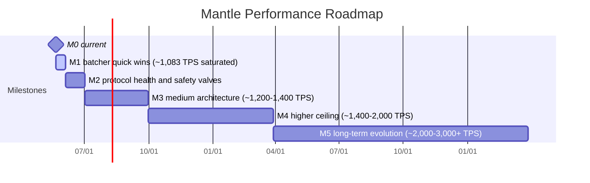
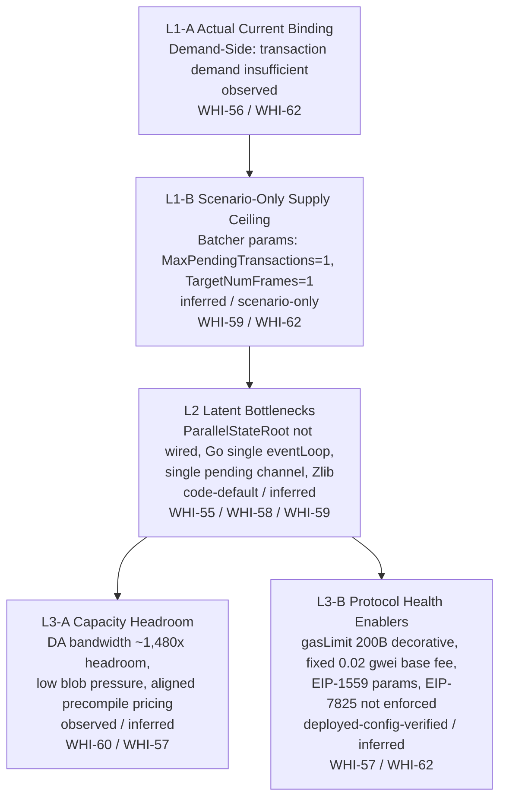
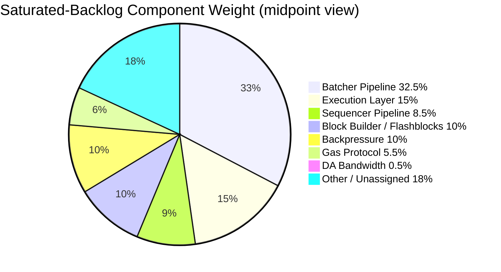
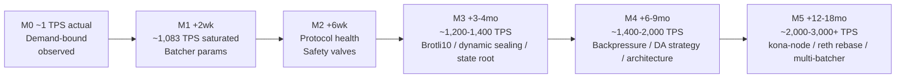

# 解析 Base 的性能提升方式 — Final Report

# 1. Executive Summary

本报告综合 8 个研究 section，对“解析 Base 的性能提升方式”给出面向 Mantle 的性能差距诊断、瓶颈归因和实施建议。核心结论是：Mantle 当前与 Base 的实际 TPS 差距主要不是执行层、DA 带宽或 gas 协议参数造成，而是需求不足造成的 demand-bound 状态；供应侧改造可以显著提高 saturated backlog 场景下的 ceiling，但在真实需求没有增长前，对 actual TPS 的直接影响接近 0。（evidence: observed / inferred；sources: WHI-56 `base-perf-analysis/research-sections/block-builder-flashblocks-throughput/final.md`, WHI-62 `base-perf-analysis/research-sections/perf-gap-analysis-recommendations/final.md`）

| 指标 | Mantle | Base | 解释 | Evidence / Source |
|---|---:|---:|---|---|
| Actual TPS | ~0.7-1.0 TPS | ~93.7 TPS | Mantle 与 Base 存在约 90-130× actual TPS gap。 | observed；WHI-62 `base-perf-analysis/research-sections/perf-gap-analysis-recommendations/final.md` |
| System-only / empty blocks | 60.8% | 0.20% | Mantle 大量区块没有真实用户交易，说明主要瓶颈是交易需求。 | observed；WHI-56 `base-perf-analysis/research-sections/block-builder-flashblocks-throughput/final.md`, WHI-62 `base-perf-analysis/research-sections/perf-gap-analysis-recommendations/final.md` |
| Gas utilization | 0.29% avg / 0.08% median | 8.19% avg / 7.31% median | Mantle 的 block space 远未被使用，供应侧还有大量闲置。 | observed；WHI-62 `base-perf-analysis/research-sections/perf-gap-analysis-recommendations/final.md` |
| Avg tx/block | 1.80 avg / 1 median | 187 avg / 158 median | Mantle 的交易到达量不足以填满 block。 | observed；WHI-56 `base-perf-analysis/research-sections/block-builder-flashblocks-throughput/final.md`, WHI-62 `base-perf-analysis/research-sections/perf-gap-analysis-recommendations/final.md` |
| DA utilization | ~97.1 B/s | n/a | Mantle DA 带宽约有 ~1,480× headroom，不是当前瓶颈。 | observed / inferred；WHI-60 `base-perf-analysis/research-sections/da-bandwidth-throughput-ceiling/final.md` |
| Batcher cadence | ~448s | ~49s | Mantle batcher 大部分时间处于 idle，与需求不足诊断一致。 | observed；WHI-59 `base-perf-analysis/research-sections/batcher-pipeline-architecture/final.md`, WHI-62 `base-perf-analysis/research-sections/perf-gap-analysis-recommendations/final.md` |

最高 ROI 的供应侧动作是调整 batcher 参数：`MaxPendingTransactions` 从 1 提到 5-10，`TargetNumFrames` 从 1 提到 6，在 saturated backlog 场景下可把 Mantle ceiling 从约 ~36 TPS 提到推荐配置下的 ~1,083 TPS，工程投入低于 0.1 person-month。（evidence: scenario-only / inferred；source: WHI-59 `base-perf-analysis/research-sections/batcher-pipeline-architecture/final.md`, WHI-62 `base-perf-analysis/research-sections/perf-gap-analysis-recommendations/final.md`）

Gas protocol 参数应被视为 Protocol Health Enablers，而不是当前 sustained TPS 的 binding constraints：`gasLimit=200B`、固定 `0.02 gwei` base fee、EIP-1559 参数不理想、EIP-7825 未强制等问题会影响安全边界、定价健康和异常场景韧性，但不能解释 Mantle 当前 ~0.7-1.0 TPS 的 actual throughput。（evidence: deployed-config-verified / inferred；source: WHI-57 `base-perf-analysis/research-sections/gas-protocol-perf-config/final.md`, WHI-62 `base-perf-analysis/research-sections/perf-gap-analysis-recommendations/final.md`）

推荐路线是先做 M0→M1 的 batcher quick wins 与安全阀恢复，随后再推进 protocol health、sequencer、execution layer、Flashblocks、multi-batcher 和 long-term Rust/kona-node 迁移。M1 足以在 saturated ceiling 上超过 Base 当前 ~93.7 TPS；M2-M5 主要服务 resilience、UX、更高 ceiling 和长期架构能力，而不是跨过 Base 当前 TPS 所必需。（evidence: inferred / scenario-only；source: WHI-55 `base-perf-analysis/research-sections/execution-layer-reth-fork-comparison/final.md`, WHI-56 `base-perf-analysis/research-sections/block-builder-flashblocks-throughput/final.md`, WHI-58 `base-perf-analysis/research-sections/sequencer-consensus-pipeline-perf/final.md`, WHI-59 `base-perf-analysis/research-sections/batcher-pipeline-architecture/final.md`, WHI-61 `base-perf-analysis/research-sections/batcher-sequencer-backpressure/final.md`, WHI-62 `base-perf-analysis/research-sections/perf-gap-analysis-recommendations/final.md`）

# 2. Thematic Sections

## Theme 1: Demand-Bound Diagnosis

Mantle 当前性能问题的第一层归因是 demand-bound，而不是 supply-bound。60.8% 的 Mantle blocks 为 system-only / empty blocks，而 Base 只有 0.20%；Mantle avg gas utilization 仅 0.29%、median 0.08%，Base avg 8.19%、median 7.31%；Mantle avg tx/block 为 1.80、median 1，Base avg tx/block 为 187、median 158。这组指标共同指向同一结论：Mantle 的真实用户交易需求不足以填满现有 block capacity。（evidence: observed；sources: WHI-56 `base-perf-analysis/research-sections/block-builder-flashblocks-throughput/final.md`, WHI-62 `base-perf-analysis/research-sections/perf-gap-analysis-recommendations/final.md`）

| Demand signal | Mantle | Base | 结论 | Evidence / Source |
|---|---:|---:|---|---|
| System-only / empty blocks | 60.8% | 0.20% | Mantle 的空块主要暴露交易到达不足。 | observed；WHI-56 `base-perf-analysis/research-sections/block-builder-flashblocks-throughput/final.md`, WHI-62 `base-perf-analysis/research-sections/perf-gap-analysis-recommendations/final.md` |
| Gas utilization avg | 0.29% | 8.19% | Mantle 不是 block gas supply 不够。 | observed；WHI-62 `base-perf-analysis/research-sections/perf-gap-analysis-recommendations/final.md` |
| Gas utilization median | 0.08% | 7.31% | Mantle 的典型 block 更接近空载状态。 | observed；WHI-62 `base-perf-analysis/research-sections/perf-gap-analysis-recommendations/final.md` |
| Avg tx/block | 1.80 | 187 | Base 的交易密度约高两个数量级。 | observed；WHI-56 `base-perf-analysis/research-sections/block-builder-flashblocks-throughput/final.md`, WHI-62 `base-perf-analysis/research-sections/perf-gap-analysis-recommendations/final.md` |
| Median tx/block | 1 | 158 | Mantle 的中位区块几乎没有用户交易。 | observed；WHI-56 `base-perf-analysis/research-sections/block-builder-flashblocks-throughput/final.md`, WHI-62 `base-perf-analysis/research-sections/perf-gap-analysis-recommendations/final.md` |

DA 数据进一步排除“数据发布带宽不足”作为当前瓶颈：Mantle DA utilization 约 ~97.1 B/s，推导出约 ~1,480× headroom。即使 Mantle 提高交易需求，当前 DA 带宽在短期内也不构成 binding constraint。（evidence: observed / inferred；source: WHI-60 `base-perf-analysis/research-sections/da-bandwidth-throughput-ceiling/final.md`）

Batcher cadence 也与需求不足一致：Mantle batcher cadence 约 ~448s，而 Base 约 ~49s。较长 cadence 不应直接解读为 batcher 慢，而应结合 empty blocks、tx/block 和 gas utilization 解释为 batcher 大部分时间没有足够数据可提交。（evidence: observed / inferred；sources: WHI-59 `base-perf-analysis/research-sections/batcher-pipeline-architecture/final.md`, WHI-62 `base-perf-analysis/research-sections/perf-gap-analysis-recommendations/final.md`）

因此，所有 supply-side 改进在当前真实流量下对 actual TPS 的影响接近 0；它们的价值主要体现在 saturated backlog、burst、future demand、UX latency 和 safety margin 场景。[TW inference] 这意味着 Mantle 的性能路线应同时分离两个目标：一是提升可承载上限，二是建立真实需求增长后的安全和弹性机制。（evidence: inferred；sources: WHI-56 `base-perf-analysis/research-sections/block-builder-flashblocks-throughput/final.md`, WHI-62 `base-perf-analysis/research-sections/perf-gap-analysis-recommendations/final.md`）

当前最关键未知是 Phase 0a empty block attribution：60.8% empty blocks 中有多少属于 timing-recoverable，有多少属于 demand-empty。如果大部分是 demand-empty，则 Flashblocks 和 builder pipeline 对 actual TPS 的 ROI 很低；如果存在大量 timing-recoverable empty blocks，则 block production 机制和 pre-confirmation 机制才可能直接改善实际观测表现。（evidence: unresolved-discrepant / inferred；source: WHI-56 `base-perf-analysis/research-sections/block-builder-flashblocks-throughput/final.md`）

## Theme 2: Supply-Side Bottleneck Hierarchy

供应侧瓶颈需要按“当前实际 binding”与“saturated backlog 场景下的 latent ceiling”分层。当前实际 binding 是交易需求不足；在交易需求充足的 scenario-only 条件下，batcher 参数成为第一层供应侧 ceiling；再往后才是 execution layer、sequencer pipeline、block builder / Flashblocks、backpressure、gas protocol 和 DA bandwidth。（evidence: observed / inferred / scenario-only；sources: WHI-55 `base-perf-analysis/research-sections/execution-layer-reth-fork-comparison/final.md`, WHI-56 `base-perf-analysis/research-sections/block-builder-flashblocks-throughput/final.md`, WHI-57 `base-perf-analysis/research-sections/gas-protocol-perf-config/final.md`, WHI-58 `base-perf-analysis/research-sections/sequencer-consensus-pipeline-perf/final.md`, WHI-59 `base-perf-analysis/research-sections/batcher-pipeline-architecture/final.md`, WHI-60 `base-perf-analysis/research-sections/da-bandwidth-throughput-ceiling/final.md`, WHI-61 `base-perf-analysis/research-sections/batcher-sequencer-backpressure/final.md`, WHI-62 `base-perf-analysis/research-sections/perf-gap-analysis-recommendations/final.md`）

| 层级 | 组件 / 问题 | 性质 | 关键判断 | Evidence / Source |
|---|---|---|---|---|
| L1-A | Demand-side | Actual Current Binding | 交易需求不足解释当前 ~0.7-1.0 TPS。 | observed；WHI-56 `base-perf-analysis/research-sections/block-builder-flashblocks-throughput/final.md`, WHI-62 `base-perf-analysis/research-sections/perf-gap-analysis-recommendations/final.md` |
| L1-B | Batcher params | Scenario-Only Supply Ceiling | `MaxPendingTransactions=1` 将 saturated capacity 限制在 ~36 TPS，`TargetNumFrames=1` 限制为 1 blob/tx，而 Base 使用 5。 | inferred / scenario-only；WHI-59 `base-perf-analysis/research-sections/batcher-pipeline-architecture/final.md`, WHI-62 `base-perf-analysis/research-sections/perf-gap-analysis-recommendations/final.md` |
| L2 | Execution layer | Latent Bottleneck | `ParallelStateRoot` 相关能力存在但未 wired，限制 state-root 并行收益。 | code-default / inferred；WHI-55 `base-perf-analysis/research-sections/execution-layer-reth-fork-comparison/final.md` |
| L2 | Sequencer pipeline | Latent Bottleneck | Mantle Go single event-loop sequencer 每 block 约 155-480ms，Base 是 5-actor tokio model。 | observed / inferred；WHI-58 `base-perf-analysis/research-sections/sequencer-consensus-pipeline-perf/final.md` |
| L2 | Channel and compression | Latent Bottleneck | Single pending channel 和 Zlib compression 限制 burst / DA efficiency。 | code-default / inferred；WHI-59 `base-perf-analysis/research-sections/batcher-pipeline-architecture/final.md` |
| L3-A | DA bandwidth | Capacity Headroom | DA 带宽约 ~1,480× headroom，当前不是 bottleneck。 | observed / inferred；WHI-60 `base-perf-analysis/research-sections/da-bandwidth-throughput-ceiling/final.md` |
| L3-A | Blob economics / precompile pricing | Capacity Headroom | 当前 blob pressure 低，precompile pricing 与性能瓶颈不直接绑定。 | inferred；WHI-57 `base-perf-analysis/research-sections/gas-protocol-perf-config/final.md`, WHI-60 `base-perf-analysis/research-sections/da-bandwidth-throughput-ceiling/final.md` |
| L3-B | Gas protocol params | Protocol Health Enablers | `gasLimit=200B`、fixed base fee、EIP-1559 参数和 EIP-7825 enforcement 问题影响健康度，不是当前 TPS binding。 | deployed-config-verified / inferred；WHI-57 `base-perf-analysis/research-sections/gas-protocol-perf-config/final.md`, WHI-62 `base-perf-analysis/research-sections/perf-gap-analysis-recommendations/final.md` |

在 saturated-backlog 场景下，component weight 估计显示 batcher pipeline 是最大单项杠杆，权重约 25-40%；execution layer 约 10-20%；sequencer pipeline 约 5-12%；block builder / Flashblocks 约 5-15%；backpressure 约 5-15%；gas protocol 约 3-8%；DA bandwidth 小于 1%。这些权重不是当前 actual TPS 归因，而是 backlog 充足时的供应侧改造优先级。（evidence: scenario-only / inferred；source: WHI-62 `base-perf-analysis/research-sections/perf-gap-analysis-recommendations/final.md`）

## Theme 3: Quick Wins (M0→M1, ≤4 weeks)

M0→M1 的目标不是立刻把 actual TPS 从 ~1 提升到 ~1,083，而是在需求到来时解除最明显的 saturated ceiling。最直接 TPS levers 是三个 batcher 参数动作：`MaxPendingTransactions` 从 1 提到 5-10，`TargetNumFrames` 从 1 提到 6，`MaxChannelDuration` 从 0 提到 5-10 L1 blocks。（evidence: scenario-only / inferred；sources: WHI-59 `base-perf-analysis/research-sections/batcher-pipeline-architecture/final.md`, WHI-62 `base-perf-analysis/research-sections/perf-gap-analysis-recommendations/final.md`）

| Quick Win | 改动 | 预期效果 | 风险 / 依赖 | Evidence / Source |
|---|---|---|---|---|
| QW-a1 | `MaxPendingTransactions` 1→5-10 | saturated capacity 提升 5-10×。 | CLI flag，约 0 effort；需要 backpressure safety net 才适合 aggressive 配置。 | scenario-only / inferred；WHI-59 `base-perf-analysis/research-sections/batcher-pipeline-architecture/final.md`, WHI-62 `base-perf-analysis/research-sections/perf-gap-analysis-recommendations/final.md` |
| QW-a2 | `TargetNumFrames` 1→6 | 每个 L1 tx 的 data capacity 约 6×；与 QW-a1 组合推荐值约 ~1,083 TPS。 | CLI flag；受 blob packing 和 channel behavior 影响。 | scenario-only / inferred；WHI-59 `base-perf-analysis/research-sections/batcher-pipeline-architecture/final.md`, WHI-62 `base-perf-analysis/research-sections/perf-gap-analysis-recommendations/final.md` |
| QW-a3 | `MaxChannelDuration` 0→5-10 L1 blocks | 平滑 burst submissions，减少过早 close channel。 | CLI flag；需监控 submission latency。 | inferred；WHI-59 `base-perf-analysis/research-sections/batcher-pipeline-architecture/final.md`, WHI-61 `base-perf-analysis/research-sections/batcher-sequencer-backpressure/final.md` |

| Config | Parameters | Saturated Capacity | 解读 | Evidence / Source |
|---|---|---:|---|---|
| Current | M=1, F=1 | ~36 TPS | backlog 充足时也低于 Base 当前 ~93.7 TPS。 | scenario-only；WHI-59 `base-perf-analysis/research-sections/batcher-pipeline-architecture/final.md`, WHI-62 `base-perf-analysis/research-sections/perf-gap-analysis-recommendations/final.md` |
| Conservative | M=3, F=3 | ~324 TPS | 已超过 Base 当前 actual TPS。 | scenario-only；WHI-59 `base-perf-analysis/research-sections/batcher-pipeline-architecture/final.md`, WHI-62 `base-perf-analysis/research-sections/perf-gap-analysis-recommendations/final.md` |
| Recommended | M=5, F=6 | ~1,083 TPS | 推荐 M1 ceiling，投入低且收益最大。 | scenario-only；WHI-59 `base-perf-analysis/research-sections/batcher-pipeline-architecture/final.md`, WHI-62 `base-perf-analysis/research-sections/perf-gap-analysis-recommendations/final.md` |
| Aggressive | M=10, F=6 | ~2,166 TPS | 需要更强 backpressure 和监控。 | scenario-only；WHI-59 `base-perf-analysis/research-sections/batcher-pipeline-architecture/final.md`, WHI-61 `base-perf-analysis/research-sections/batcher-sequencer-backpressure/final.md`, WHI-62 `base-perf-analysis/research-sections/perf-gap-analysis-recommendations/final.md` |

Quick wins 的第二类是 protocol hardening。`gasLimit` 从 200B 校准到 1-2G、EIP-1559 参数调整为 denominator=250 / elasticity=6、启用 dynamic base fee、恢复 `miner_setMaxDASize` RPC、把 `SequencerMaxSafeLag` 从 0 调为 5000，主要作用是建立更合理的安全边界和动态反馈，不是直接解释当前 TPS gap。（evidence: deployed-config-verified / inferred；sources: WHI-57 `base-perf-analysis/research-sections/gas-protocol-perf-config/final.md`, WHI-61 `base-perf-analysis/research-sections/batcher-sequencer-backpressure/final.md`, WHI-62 `base-perf-analysis/research-sections/perf-gap-analysis-recommendations/final.md`）

| Quick Win | 改动 | 目的 | Evidence / Source |
|---|---|---|---|
| QW-b1 | `gasLimit` 200B→1-2G | 让 advertised block gas capacity 接近实际可执行边界，避免 decorative limit。 | deployed-config-verified / inferred；WHI-57 `base-perf-analysis/research-sections/gas-protocol-perf-config/final.md`, WHI-62 `base-perf-analysis/research-sections/perf-gap-analysis-recommendations/final.md` |
| QW-b2 | EIP-1559 denominator=250, elasticity=6 | 改善 fee market 反应速度和弹性。 | deployed-config-verified / inferred；WHI-57 `base-perf-analysis/research-sections/gas-protocol-perf-config/final.md` |
| QW-b3 | Enable dynamic base fee | 避免固定 `0.02 gwei` base fee 在高负载时缺少价格反馈。 | deployed-config-verified / inferred；WHI-57 `base-perf-analysis/research-sections/gas-protocol-perf-config/final.md` |
| QW-b4 | Restore `miner_setMaxDASize` RPC | 为 aggressive batcher params 提供 DA safety net；需要 op-geth code change，约 2-4 person-weeks。 | code-default / inferred；WHI-61 `base-perf-analysis/research-sections/batcher-sequencer-backpressure/final.md` |
| QW-b5 | `SequencerMaxSafeLag` 0→5000 | 约 2.8h safety valve，防止 unsafe chain 长时间偏离 safe chain。 | deployed-config-verified / inferred；WHI-61 `base-perf-analysis/research-sections/batcher-sequencer-backpressure/final.md` |

第三类 quick wins 是 code / protocol changes。EIP-7825 per-tx gas cap 需要移除 5 个 enforcement points 上的 `!IsOptimism()` gate，并通过 hardfork 激活；`gasLimit >2G` 属于高风险项，必须先做 EL benchmark，不能作为 M1 的默认动作。（evidence: code-default / inferred；source: WHI-57 `base-perf-analysis/research-sections/gas-protocol-perf-config/final.md`, WHI-62 `base-perf-analysis/research-sections/perf-gap-analysis-recommendations/final.md`）

## Theme 4: Medium-Term Architecture (M2→M3, 1-3 quarters)

M2→M3 的中期架构工作应按低风险高确定性优先。`Brotli10` compression 是 Tier 1，约 0.5 PM，风险极低，可通过 CLI flag switch 取得约 10-30% DA efficiency；`dynamic sealingDuration` 是 Tier 1，约 1.5 PM，风险低，可替换 hardcoded 50ms sealingDuration，让 block production 更适配真实负载。（evidence: inferred / code-default；sources: WHI-59 `base-perf-analysis/research-sections/batcher-pipeline-architecture/final.md`, WHI-58 `base-perf-analysis/research-sections/sequencer-consensus-pipeline-perf/final.md`, WHI-62 `base-perf-analysis/research-sections/perf-gap-analysis-recommendations/final.md`）

| Item | Tier | Effort | 预期作用 | Evidence / Source |
|---|---:|---:|---|---|
| MT-8: Brotli10 compression | Tier 1 | 0.5 PM | 约 10-30% DA efficiency；极低风险。 | inferred；WHI-59 `base-perf-analysis/research-sections/batcher-pipeline-architecture/final.md`, WHI-60 `base-perf-analysis/research-sections/da-bandwidth-throughput-ceiling/final.md`, WHI-62 `base-perf-analysis/research-sections/perf-gap-analysis-recommendations/final.md` |
| MT-6: Dynamic sealingDuration | Tier 1 | 1.5 PM | 用动态计算替换 hardcoded 50ms，改善 burst 和低负载兼容性。 | code-default / inferred；WHI-58 `base-perf-analysis/research-sections/sequencer-consensus-pipeline-perf/final.md`, WHI-62 `base-perf-analysis/research-sections/perf-gap-analysis-recommendations/final.md` |
| MT-1: ParallelStateRoot + LazyOverlay + StateRootTask | Tier 2 | 3 PM | wire existing but unused libraries，目标是 ≥20-50% state-root time reduction；该数值仍需验证。 | code-default / inferred；WHI-55 `base-perf-analysis/research-sections/execution-layer-reth-fork-comparison/final.md` |
| MT-5: Flashblocks + rollup-boost | Tier 3 | 9 PM | 250ms pre-confirmation 和 block builder 改造；31-49 weeks total；必须由 Phase 0a ROI gate 决定是否启动。 | scenario-only / inferred；WHI-56 `base-perf-analysis/research-sections/block-builder-flashblocks-throughput/final.md`, WHI-62 `base-perf-analysis/research-sections/perf-gap-analysis-recommendations/final.md` |
| MT-3 + MT-4: Sequencer actor refactor | Tier 3 | 12 PM | 将 Go op-node single eventLoop 改为 actor model，减少 event-loop blocking。 | code-default / inferred；WHI-58 `base-perf-analysis/research-sections/sequencer-consensus-pipeline-perf/final.md` |
| MT-7: Multi-channel pre-build | Tier 3 | 4 PM | 打破 single pending channel 限制，提高 burst 下 channel readiness。 | code-default / inferred；WHI-59 `base-perf-analysis/research-sections/batcher-pipeline-architecture/final.md` |
| MT-2: Tier C cache upgrade | Tier 3 | 6 PM | 引入 cross-flashblock `CachedExecutor`、per-precompile cache、async receipt root 等更细粒度 cache 架构。 | inferred；WHI-55 `base-perf-analysis/research-sections/execution-layer-reth-fork-comparison/final.md` |

Execution layer 的关键不是“Base 有 cache、Mantle 没 cache”，而是 cache granularity 和 execution pipeline architecture 不同。Mantle 属于 Tier B flashblocks-scoped cache：`TransactionCache`、`CachedReads`、cached-prefix resume、bundle prestate reuse；Base 属于 Tier C：`CachedExecutor` cross-flashblock、`CachedPrecompile::wrap` per-precompile、`ReceiptRootTaskHandle` async、`ParallelStateRoot` / `StateRootTask` / `LazyOverlay` parallel state root。差距是架构粒度和跨 flashblock 生命周期管理，不是简单的 cache presence/absence。（evidence: code-default / inferred；source: WHI-55 `base-perf-analysis/research-sections/execution-layer-reth-fork-comparison/final.md`）

Sequencer architecture 的差距也更像架构模型差异。Base 是 5-actor tokio model，以 mpsc channels 连接，并包含 `PayloadSealer` 3-state machine；Mantle 是 Go `driver.go eventLoop` 单事件循环，`sealingDuration=50ms` hardcoded。Round 2 中 “per-block FCU = 4” 的说法已被修正，Mantle per-block FCU = 2；7 个 levers 的 ms/block estimates 应以 WHI-58 修正口径为准。（evidence: observed / code-default / inferred；source: WHI-58 `base-perf-analysis/research-sections/sequencer-consensus-pipeline-perf/final.md`）

[TW inference] 中期架构排序应采用“确定性收益优先、Phase 0a gating 高投入项”的原则：先做 Brotli10、dynamic sealingDuration、ParallelStateRoot wiring，再决定 Flashblocks / rollup-boost 和 actor refactor 是否值得进入主线。这个排序不否认 Flashblocks 的 UX 价值，但避免在 empty block 成因未确认前投入 7-11 engineer-months。（evidence: inferred / scenario-only；sources: WHI-55 `base-perf-analysis/research-sections/execution-layer-reth-fork-comparison/final.md`, WHI-56 `base-perf-analysis/research-sections/block-builder-flashblocks-throughput/final.md`, WHI-58 `base-perf-analysis/research-sections/sequencer-consensus-pipeline-perf/final.md`, WHI-62 `base-perf-analysis/research-sections/perf-gap-analysis-recommendations/final.md`）

## Theme 5: Long-Term Evolution (M4→M5, 3+ quarters)

M4→M5 的长期演进应服务于 1,400-3,000+ TPS ceiling、更强 backpressure、更好的 UX 和更低长期维护成本，而不是作为解决当前 ~90-130× actual TPS gap 的前置条件。当前跨过 Base ~93.7 TPS 的 saturated ceiling 不需要这些高风险长期项目；它们更适合在 M1-M3 验证流量、负载模型和安全阀后逐步启动。（evidence: inferred / scenario-only；sources: WHI-55 `base-perf-analysis/research-sections/execution-layer-reth-fork-comparison/final.md`, WHI-58 `base-perf-analysis/research-sections/sequencer-consensus-pipeline-perf/final.md`, WHI-59 `base-perf-analysis/research-sections/batcher-pipeline-architecture/final.md`, WHI-60 `base-perf-analysis/research-sections/da-bandwidth-throughput-ceiling/final.md`, WHI-61 `base-perf-analysis/research-sections/batcher-sequencer-backpressure/final.md`, WHI-62 `base-perf-analysis/research-sections/perf-gap-analysis-recommendations/final.md`）

| Item | Tier / Effort | 价值 | 风险与前置条件 | Evidence / Source |
|---|---:|---|---|---|
| LT-1: kona-node migration | Tier 4 / 24 PM | Go→Rust actor model，长期统一高性能 pipeline。 | Extreme high risk；18-30 person-months；需 port all Tier D features。 | inferred；WHI-58 `base-perf-analysis/research-sections/sequencer-consensus-pipeline-perf/final.md`, WHI-62 `base-perf-analysis/research-sections/perf-gap-analysis-recommendations/final.md` |
| LT-2: reth upstream rebase | Tier 4 / 4 PM | 从 v2.2.0 rebase 到 latest stable，吸收 upstream 性能改进。 | 需要重新适配 Tier E patches。 | inferred；WHI-55 `base-perf-analysis/research-sections/execution-layer-reth-fork-comparison/final.md` |
| LT-3: token_ratio refactor | Tier 4 / 8 PM | 消除 BVM_ETH ERC20 per-tx overhead。 | 预期节省 ≤1ms + 4500 gas + ≥6 U256 ops；涉及经济和兼容性逻辑。 | inferred；WHI-55 `base-perf-analysis/research-sections/execution-layer-reth-fork-comparison/final.md`, WHI-57 `base-perf-analysis/research-sections/gas-protocol-perf-config/final.md` |
| LT-4: DA strategy upgrade | Tier 4 / low risk | BPO2 target blob optimization，fill rate 45%→85%。 | 当前 DA 不是瓶颈，应作为成本效率优化。 | inferred / upper_bound_only；WHI-60 `base-perf-analysis/research-sections/da-bandwidth-throughput-ceiling/final.md` |
| LT-5: Full backpressure system | 25 PM | DA Throttling + Adaptive Gas Limit + Multi-Batcher + adaptive params。 | 高工程量；应在 QW-b4 safety net 后分阶段实现。 | inferred；WHI-61 `base-perf-analysis/research-sections/batcher-sequencer-backpressure/final.md` |
| LT-6: Multi-Batcher | 3 PM / high risk | Parallel batcher instances，提高极端吞吐。 | 复杂 nonce management，需严格模拟和回滚策略。 | inferred / scenario-only；WHI-59 `base-perf-analysis/research-sections/batcher-pipeline-architecture/final.md`, WHI-61 `base-perf-analysis/research-sections/batcher-sequencer-backpressure/final.md` |

[TW inference] Long-term work 的决策标准应从“是否能解释 Base 当前更高 TPS”改为“是否能在 Mantle 需求增长后保持安全、可预测、低延迟和低运维成本”。按这个标准，full backpressure system 和 reth / kona 方向比单点 throughput hack 更重要，但它们都不应阻塞 M1 quick wins。（evidence: inferred；sources: WHI-55 `base-perf-analysis/research-sections/execution-layer-reth-fork-comparison/final.md`, WHI-61 `base-perf-analysis/research-sections/batcher-sequencer-backpressure/final.md`, WHI-62 `base-perf-analysis/research-sections/perf-gap-analysis-recommendations/final.md`）

# 3. Cross-Cutting Analysis

## Consensus

| # | 共识结论 | Evidence / Source |
|---:|---|---|
| 1 | Mantle 是 demand-bound；只做 supply-side improvements 不会显著改变当前 actual TPS。 | observed / inferred；WHI-56 `base-perf-analysis/research-sections/block-builder-flashblocks-throughput/final.md`, WHI-62 `base-perf-analysis/research-sections/perf-gap-analysis-recommendations/final.md` |
| 2 | Batcher parameter tuning 是最高 ROI 的供应侧 intervention。 | scenario-only / inferred；WHI-59 `base-perf-analysis/research-sections/batcher-pipeline-architecture/final.md`, WHI-62 `base-perf-analysis/research-sections/perf-gap-analysis-recommendations/final.md` |
| 3 | DA bandwidth 不是瓶颈；各 section 收敛到约 ~1,480× headroom 的判断。 | observed / inferred；WHI-60 `base-perf-analysis/research-sections/da-bandwidth-throughput-ceiling/final.md`, WHI-62 `base-perf-analysis/research-sections/perf-gap-analysis-recommendations/final.md` |
| 4 | Gas protocol parameters 影响 protocol health，而非 sustained TPS 的当前 binding。 | deployed-config-verified / inferred；WHI-57 `base-perf-analysis/research-sections/gas-protocol-perf-config/final.md`, WHI-62 `base-perf-analysis/research-sections/perf-gap-analysis-recommendations/final.md` |
| 5 | Backpressure 当前缺失：DA Throttling RPC removed，`MaxSafeLag=0`。 | code-default / deployed-config-verified；WHI-61 `base-perf-analysis/research-sections/batcher-sequencer-backpressure/final.md` |

## Conflicts and Tensions

| # | 冲突 / 张力 | 影响 | 当前处理 | Evidence / Source |
|---:|---|---|---|---|
| 1 | Flashblocks ROI uncertainty：WHI-56 估计 improvement 可从 0× 到 2.13×，取决于 empty blocks 中 timing-recoverable 的比例。 | 若缺少 Phase 0a sampling，7-11 engineer-month 投入无法被充分证明。 | 将 Phase 0a 设为 Flashblocks / rollup-boost 的 gate。 | scenario-only / unresolved-discrepant；WHI-56 `base-perf-analysis/research-sections/block-builder-flashblocks-throughput/final.md`, WHI-62 `base-perf-analysis/research-sections/perf-gap-analysis-recommendations/final.md` |
| 2 | Base 5k TPS claim 与 WHI-60 DA-bound ceiling 不一致：WHI-60 计算 Base 约 ~942 TPS（153.03 B/UOP），Mantle 约 ~1,749 TPS（82.38 B/UOP）。 | 若要达到 claimed 5k TPS，需要约 ~5.3× bytes/UOP compression improvement。[TW inference] | 标记为 upper_bound_only / scenario-only，不把 5k 作为当前容量基线。 | upper_bound_only / scenario-only；WHI-60 `base-perf-analysis/research-sections/da-bandwidth-throughput-ceiling/final.md` |
| 3 | Arsia activation date discrepancy：WHI-60 记录 L2BEAT 为 Apr 16，official 为 Apr 22。 | 时间序列分析和前后对比窗口可能受影响。 | 标记为 unresolved-discrepant，避免用单一日期做强结论。 | unresolved-discrepant；WHI-60 `base-perf-analysis/research-sections/da-bandwidth-throughput-ceiling/final.md` |
| 4 | “~2 empty blocks/day” claim 与 WHI-56 Round 3 sampling 不一致：sampling 得到约 ~86/day（1/500 = 0.20%），Wilson 95% CI [15, 486]/day。 | Base empty block 频率的公开说法与样本统计不一致。 | 标记 unresolved-discrepant，不把 “~2/day” 当作 confirmed fact。 | unresolved-discrepant / observed；WHI-56 `base-perf-analysis/research-sections/block-builder-flashblocks-throughput/final.md` |
| 5 | Backpressure 既是 enabler 又是 constraint：WHI-61 视其为 aggressive batcher tuning 的安全前置，WHI-62 将其列为 5-15% supply-side weight。 | 若只把 backpressure 当性能项，会低估其安全作用；若只当安全项，又会低估其对 ceiling tuning 的释放作用。 | 双重归类：QW-b4 是 QW-a1/a2 aggressive params 的 safety prerequisite。 | inferred；WHI-61 `base-perf-analysis/research-sections/batcher-sequencer-backpressure/final.md`, WHI-62 `base-perf-analysis/research-sections/perf-gap-analysis-recommendations/final.md` |

## Open Questions

| # | Open Question | 为什么重要 | Evidence label / Source |
|---:|---|---|---|
| 1 | 60.8% empty blocks 中 timing-recoverable vs demand-empty 的比例是多少？ | 决定 Flashblocks、rollup-boost、builder pipeline 对 actual TPS 是否有直接 ROI。 | unresolved-discrepant / inferred；WHI-56 `base-perf-analysis/research-sections/block-builder-flashblocks-throughput/final.md` |
| 2 | Mantle 的 actual mempool arrival rate 是多少？ | 判断需求不足到底来自用户流量、mempool propagation、RPC ingress，还是 block production timing。 | inferred；WHI-56 `base-perf-analysis/research-sections/block-builder-flashblocks-throughput/final.md`, WHI-62 `base-perf-analysis/research-sections/perf-gap-analysis-recommendations/final.md` |
| 3 | Mantle Tier B flashblocks-scoped cache 的 real-world hit rate 是多少？ | WHI-55 G-11 仍需验证，直接影响是否值得升级到 Tier C cache architecture。 | code-default / PENDING VERIFICATION；WHI-55 `base-perf-analysis/research-sections/execution-layer-reth-fork-comparison/final.md` |
| 4 | Base 与 Mantle 的 MDBX env flag differences 是什么？ | 可能影响 execution layer I/O 性能归因，但当前未验证。 | PENDING VERIFICATION；WHI-55 `base-perf-analysis/research-sections/execution-layer-reth-fork-comparison/final.md` |
| 5 | Base Tier C enhancements 的 precise ms/block reduction 是多少？ | 需要 benchmark 才能把 architecture diff 转换为 Mantle roadmap 的确定收益。 | PENDING VERIFICATION；WHI-55 `base-perf-analysis/research-sections/execution-layer-reth-fork-comparison/final.md`, WHI-58 `base-perf-analysis/research-sections/sequencer-consensus-pipeline-perf/final.md` |

# 4. Appendix

## Input Research Sections Index

| # | Topic Slug | Issue | Final Path |
|---:|---|---|---|
| 1 | execution-layer-reth-fork-comparison | WHI-55 | `base-perf-analysis/research-sections/execution-layer-reth-fork-comparison/final.md` |
| 2 | block-builder-flashblocks-throughput | WHI-56 | `base-perf-analysis/research-sections/block-builder-flashblocks-throughput/final.md` |
| 3 | gas-protocol-perf-config | WHI-57 | `base-perf-analysis/research-sections/gas-protocol-perf-config/final.md` |
| 4 | sequencer-consensus-pipeline-perf | WHI-58 | `base-perf-analysis/research-sections/sequencer-consensus-pipeline-perf/final.md` |
| 5 | batcher-pipeline-architecture | WHI-59 | `base-perf-analysis/research-sections/batcher-pipeline-architecture/final.md` |
| 6 | da-bandwidth-throughput-ceiling | WHI-60 | `base-perf-analysis/research-sections/da-bandwidth-throughput-ceiling/final.md` |
| 7 | batcher-sequencer-backpressure | WHI-61 | `base-perf-analysis/research-sections/batcher-sequencer-backpressure/final.md` |
| 8 | perf-gap-analysis-recommendations | WHI-62 | `base-perf-analysis/research-sections/perf-gap-analysis-recommendations/final.md` |

Sections index path: `base-perf-analysis/research-sections/_index.md`

## Methodology Notes

| Methodology item | 说明 |
|---|---|
| Code analysis inputs | All research conducted via direct code analysis of `base/base` (`21a05eeb`), `mantle-xyz/reth` (`2ee23786`), `mantlenetworkio/mantle-v2`, `mantlenetworkio/op-geth`. |
| On-chain sampling | 500-block on-chain sampling per chain: Base blocks `45,931,886-46,231,286`; Mantle blocks `95,261,404-95,560,804`. |
| Evidence confidence labels | `observed`, `deployed-config-verified`, `code-default`, `inferred`, `scenario-only`, `upper_bound_only`, `unresolved-discrepant`. |
| Attribution model | 5-Tier attribution model: A (upstream reth), B (OP op-reth vendored), C (Base overlay), D (Mantle overlay), E (Mantle external patches). |
| Technical writer additions | TW-added conclusions are marked with `[TW inference]`. |

## Evidence Label Definitions

| Label | 本报告中的使用方式 |
|---|---|
| observed | 来自链上采样、配置观测或研究 section 已确认的实际数据。 |
| deployed-config-verified | 已部署配置或参数状态被研究 section 验证。 |
| code-default | 代码默认值、开关状态或未 wired 状态来自源码检查。 |
| inferred | 基于观测数据和代码结构推导，但不是直接测量结果。 |
| scenario-only | 只在 saturated backlog、future demand、benchmark 或压力场景下成立。 |
| upper_bound_only | 表示理论上限或粗粒度 ceiling，不应当作真实生产可达值。 |
| unresolved-discrepant | 研究中发现冲突信息，尚未被消解。 |

## Recommendation Summary

| Phase | 推荐动作 | 预期结果 | Evidence / Source |
|---|---|---|---|
| M0 | 建立 Phase 0a empty block attribution 和 mempool arrival rate measurement。 | 判断 actual TPS gap 中有多少可由 timing / builder 改善。 | unresolved-discrepant / inferred；WHI-56 `base-perf-analysis/research-sections/block-builder-flashblocks-throughput/final.md`, WHI-62 `base-perf-analysis/research-sections/perf-gap-analysis-recommendations/final.md` |
| M1 | 调整 `MaxPendingTransactions=5`、`TargetNumFrames=6`，并评估 `MaxChannelDuration=5-10`。 | recommended saturated ceiling 约 ~1,083 TPS。 | scenario-only；WHI-59 `base-perf-analysis/research-sections/batcher-pipeline-architecture/final.md`, WHI-62 `base-perf-analysis/research-sections/perf-gap-analysis-recommendations/final.md` |
| M1 / M2 | 恢复 `miner_setMaxDASize`，设置 `SequencerMaxSafeLag=5000`，校准 `gasLimit` 与 EIP-1559 / dynamic base fee。 | 让 aggressive batcher tuning 有安全阀，改善 protocol health。 | deployed-config-verified / code-default / inferred；WHI-57 `base-perf-analysis/research-sections/gas-protocol-perf-config/final.md`, WHI-61 `base-perf-analysis/research-sections/batcher-sequencer-backpressure/final.md` |
| M2 / M3 | 推进 Brotli10、dynamic sealingDuration、ParallelStateRoot wiring。 | 增加 DA efficiency、降低 sequencer latency、减少 state-root time。 | inferred / code-default；WHI-55 `base-perf-analysis/research-sections/execution-layer-reth-fork-comparison/final.md`, WHI-58 `base-perf-analysis/research-sections/sequencer-consensus-pipeline-perf/final.md`, WHI-59 `base-perf-analysis/research-sections/batcher-pipeline-architecture/final.md` |
| M3+ | 仅在 Phase 0a 支持时推进 Flashblocks + rollup-boost。 | 主要改善 UX pre-confirmation 和 timing-recoverable 空块，不保证 demand-empty 场景 actual TPS。 | scenario-only / unresolved-discrepant；WHI-56 `base-perf-analysis/research-sections/block-builder-flashblocks-throughput/final.md` |
| M4 / M5 | 分阶段推进 full backpressure、DA strategy、reth rebase、kona-node、multi-batcher。 | 服务 resilience、长期 ceiling 和维护成本，不阻塞超过 Base 当前 TPS。 | inferred / scenario-only；WHI-55 `base-perf-analysis/research-sections/execution-layer-reth-fork-comparison/final.md`, WHI-58 `base-perf-analysis/research-sections/sequencer-consensus-pipeline-perf/final.md`, WHI-60 `base-perf-analysis/research-sections/da-bandwidth-throughput-ceiling/final.md`, WHI-61 `base-perf-analysis/research-sections/batcher-sequencer-backpressure/final.md`, WHI-62 `base-perf-analysis/research-sections/perf-gap-analysis-recommendations/final.md` |
