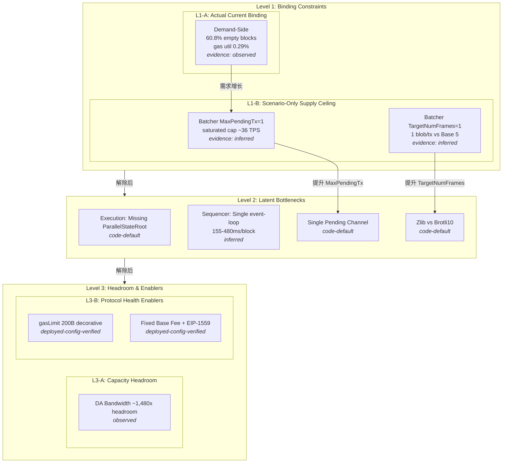
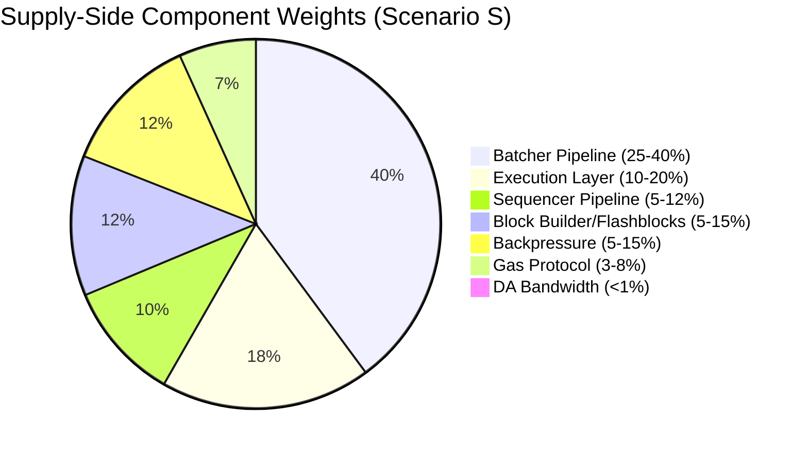
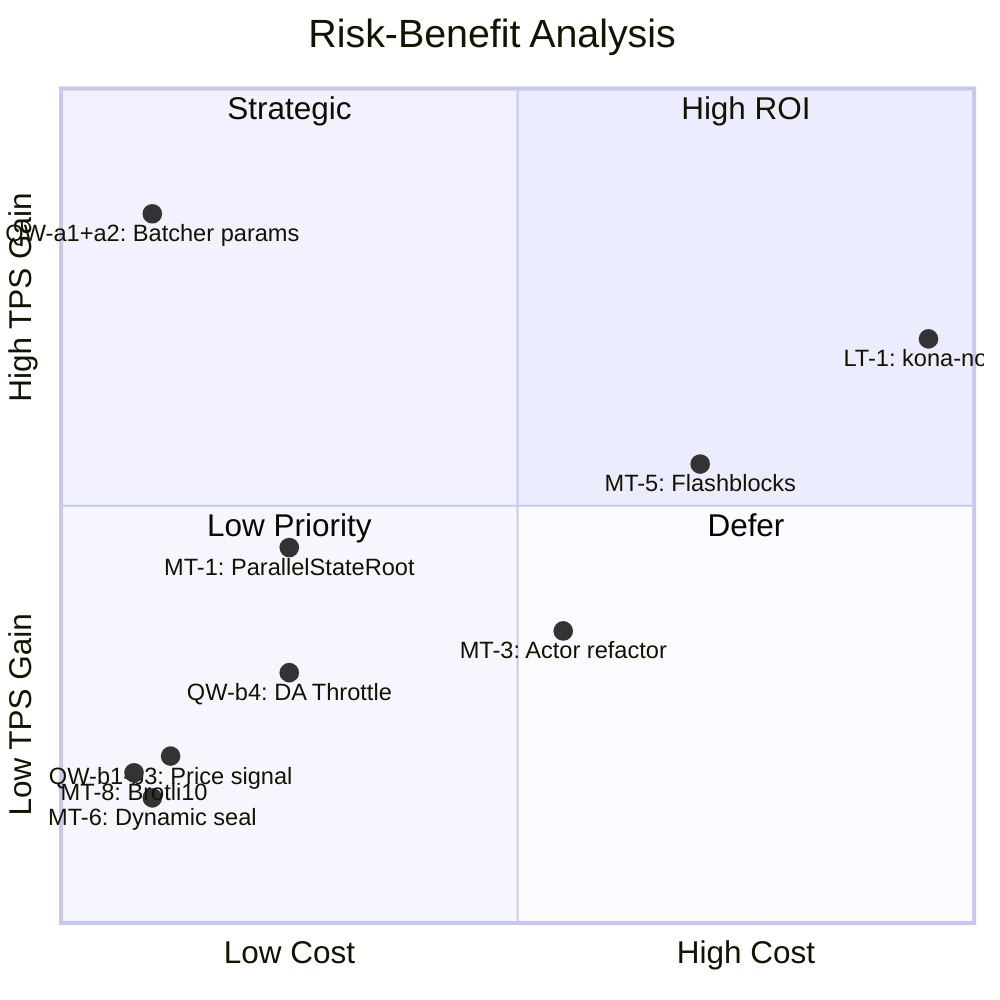
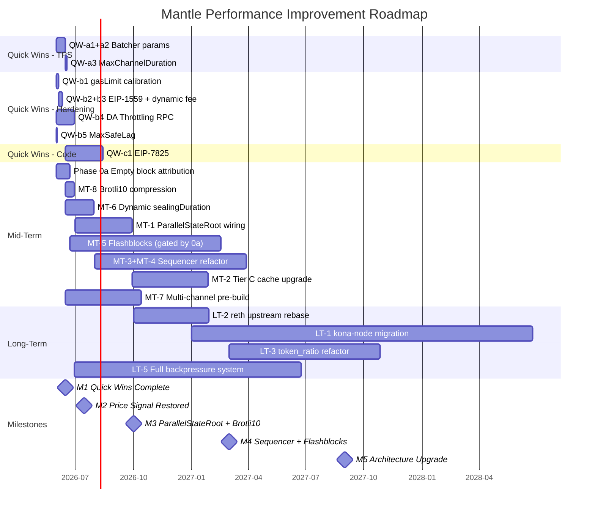

# 解析 Base 的性能提升方式 — 最终报告

> **Project**: 解析 Base 的性能提升方式  
> **Project slug**: base-perf-analysis  
> **Report branch**: research/base-perf-analysis/final-report  
> **Sections index**: base-perf-analysis/research-sections/_index.md  
> **Report date**: 2026-05-21  
> **Synthesized by**: Technical Writer Agent

---

## 1. Executive Summary

Mantle 当前实测 TPS 约 0.7–1.0，而 Base 实测约 93.7 user-tx/s（WHI-56 采样），差距约 **90–130×**。本报告综合 8 个研究主题的成果，得出以下核心结论：

1. **当前 binding constraint 是需求侧（demand-side）**：Mantle 链上交易需求远低于系统供给能力。60.8% 的区块为系统空块（仅含 L1 attributes deposit），gas 利用率仅 0.29%。在此状态下，任何供给侧改进都不会改变实际 TPS。（WHI-56, WHI-62 — `observed`）

2. **供给侧 Quick Wins 成本极低但战略价值巨大**：Batcher 参数调优（MaxPendingTransactions→5–10, TargetNumFrames→6）可将 saturated-backlog 场景下的供给上限从 ~36 TPS 提升至 ~1,083 TPS，工程投入 ≈0.1 人月，ROI 远超所有其他改进项。（WHI-59 — `inferred` + `scenario-only`）

3. **跨越 Base 实测 TPS（93.7）的关键在需求侧**：QW-a1+a2 即可将 saturated ceiling 提至 ~1,083 TPS，远超 93.7。中长期工程投入服务于运营韧性、用户体验（250ms pre-confirmation）、更高供给天花板（2,000+ TPS）和架构对齐。（WHI-62）

4. **DA 层完全不是瓶颈**：Mantle DA 利用率余量约 1,480×，DA 层属 Level 3 Headroom。（WHI-60 — `observed`）

5. **Gas 协议参数是 Protocol Health Enablers，非 TPS Binding Constraints**：gasLimit 200B（decorative）、固定 base fee、EIP-1559 参数等影响协议健康度和定价机制，不直接限制 sustained TPS。（WHI-57, WHI-62 — `deployed-config-verified`）

6. **背压机制完全缺失**：DA Throttling RPC 已从 op-geth 移除，MaxSafeLag=0 禁用——这是 Batcher 参数激进调优的安全前提。（WHI-61 — `code-default`）

**里程碑路线图**：

| 里程碑 | 时间线 | Saturated Ceiling | 场景 |
|--------|--------|-------------------|------|
| M0: 当前状态 | Now | ~36 TPS（供给上限） / ~1.0 TPS（实际） | demand-bound |
| M1: Quick Wins | +2 周 | ~1,083 TPS | saturated ceiling 提升，实际 TPS 不变 |
| M2: 协议健康度 | +6 周 | ~1,083 TPS + protocol health | gas market 恢复 |
| M3: 执行层+压缩 | +3–4 月 | ~1,200–1,400 TPS | 叠加并行 state root + Brotli10 |
| M4: Sequencer+Flashblocks | +6–9 月 | ~1,400–2,000 TPS | 依赖 Phase 0a 结果 |
| M5: 架构级改进 | +12–18 月 | ~2,000–3,000+ TPS | 不确定性高 |

> **关键行动建议**：立即执行 QW-a1+a2 Batcher 参数调优（1–2 周），同步启动需求侧增长策略和 Phase 0a 空块归因采样，为中期工程投入提供数据支撑。

---

## 2. 现状快照与 Demand-Bound 诊断

### 2.1 Mantle vs Base 核心指标对比

本主题综合 WHI-56（`block-builder-flashblocks-throughput/final.md`）的 500-block 链上采样和 WHI-62（`perf-gap-analysis-recommendations/final.md`）的归因分析。

| 指标 | Mantle | Base | 差距 | evidence_confidence |
|------|--------|------|------|---------------------|
| 实测 TPS (user tx/s) | 0.7–1.0 | ~93.7 | ~90–130× | observed (WHI-56) |
| Avg tx/block | 1.80 (median 1) | 187 (median 158) | ~104× | observed (WHI-56) |
| Avg gas_used/block | 174,650 gas | 32.76 Mgas | ~188× | observed (WHI-56) |
| Gas utilization | 0.29% (median 0.08%) | 8.19% (median 7.31%) | 28× | observed (WHI-56) |
| System-only blocks | 60.80% | 0.20% | 304× | observed (WHI-56) |
| Block time | 2s | 2s (+250ms flashblocks) | 1× (8× UX) | observed |
| Effective gasLimit | 200B (decorative) | ~375M (binding) | N/A | deployed-config-verified (WHI-57) |
| Batcher cadence | ~448s | ~49s | ~9× | observed (WHI-59) |
| Blobs per batch tx | 1 | 5 | 5× | observed (WHI-59) |
| DA bandwidth utilization | ~97.1 B/s (~1,480× headroom) | ~95–99% fill rate | N/A | observed (WHI-60) |
| Compression | Zlib | Brotli10 | ~1.1–1.3× | code-default (WHI-59) |
| Backpressure | DA Throttling broken | Active DA Throttling | Missing | code-default (WHI-61) |

### 2.2 Demand-Bound 核心诊断

**结论：Mantle 当前 TPS ≈ 1.0 并非系统上限，而是需求上限。**

四项独立证据链收敛于同一结论：

1. **60.8% 系统空块**（WHI-56）：Sequencer 大部分时间在"等交易"，超过半数区块仅含 L1 attributes deposit
2. **Gas 利用率 0.29%**（WHI-56）：远低于任何供给侧约束——即使 gasLimit 从 200B 降到 1G，利用率仍远未触底
3. **DA 余量 1,480×**（WHI-60）：DA 层完全空闲，BPO2 target=14 blobs/block 的物理带宽 ~151.72 KB/s 几乎未被触及
4. **Batcher 以 ~448s 间隔提交**（WHI-59）：远低于其理论最小间隔（RTT/N ≈ 12s），Batcher 大部分时间闲置

因此，当前 ~90–130× TPS 差距中，**需求侧因素是主导**。所有供给侧改进在 demand-bound 状态下的实际 TPS 增益趋近于零。

### 2.3 空块归因的关键 Unknown

60.8% 空块中有多少是 **timing-recoverable**（mempool 有交易但 snapshot 错过，Flashblocks 可解）vs **demand-empty**（真实需求缺位，无技术解法），本研究无法回答。这是决定 Flashblocks 移植 ROI 的关键数据（WHI-56 Phase 0a）。

**Phase 0a 建议**：采集 Mantle mainnet mempool arrival rate 数据（`txpool_content` / mempool subscribe + 链上对照），将 60.8% 空块拆分为 timing-recoverable vs demand-empty 两类。工程量 1–3 周。（WHI-56）

---

## 3. 供给侧瓶颈分层模型

本主题综合 WHI-62（`perf-gap-analysis-recommendations/final.md`）的三层模型与 WHI-55/57/58/59/60/61 各组件分析。

### 3.1 三层模型



**Level 1 — Binding Constraints**：

- **L1-A: 需求侧**（当前实际约束）：交易需求不足是实际限制因素。`evidence: observed`
- **L1-B: Batcher 供给天花板**（仅在 saturated-backlog 下约束）：MaxPendingTransactions=1 将 DA-confirmed saturated capacity 限制在 ~36 TPS（WHI-59 Formula A），TargetNumFrames=1 将每次 L1 提交限制为 1 blob。`evidence: inferred + scenario-only`

**Level 2 — Latent Bottlenecks**：当 L1 解除后将成为新天花板

- 执行层缺少 ParallelStateRoot 接入（WHI-55：库存在但未 wired）
- Sequencer 单线程 event-loop（WHI-58：非边界块 155–330ms，L1 epoch 边界 200–480ms）
- 单 pending channel 架构（WHI-59：channel_manager 仅维护一个 pending channel）
- Batcher Zlib 压缩（WHI-59：vs Base Brotli10，后者压缩率更高）

**Level 3 — Headroom & Enablers**：

- **L3-A: DA 带宽**：BPO2 target=14 blobs/block，DA ceiling ~1,749 TPS，余量 ~1,480×（WHI-60 — `observed`）
- **L3-B: 协议健康度**：gasLimit 200B（decorative）、固定 base fee 0.02 gwei、EIP-1559 suboptimal、EIP-7825 未激活——不直接限制 sustained TPS，但影响 gas market 健康（WHI-57 — `deployed-config-verified`）

### 3.2 供给侧组件权重（Saturated-Backlog 场景）



> **Caveats**（WHI-62）：(i) Batcher 权重基于 inferred 配置；(ii) Block Builder 权重取决于 Phase 0a 结果；(iii) 背压权重为间接使能因子；(iv) 权重间存在耦合，不可简单累加；(v) demand-bound 下所有供给侧权重影响趋近于零。

---

## 4. Quick Wins 与短期行动（M0→M1→M2）

### 4.1 TPS 杠杆 — 直接提升 Saturated Ceiling

综合 WHI-59（`batcher-pipeline-architecture/final.md`）和 WHI-62 的建议。

| # | 变更 | 当前值 | 目标值 | 预期效果 | 复杂度 | 来源 |
|---|------|--------|--------|----------|--------|------|
| QW-a1 | MaxPendingTransactions | 1 (inferred) | 5–10 | 5–10× saturated capacity | 极低（CLI flag） | WHI-59 |
| QW-a2 | TargetNumFrames | 1 (inferred) | 6 | ~6× per-L1-tx data; combined: ~1,083 TPS | 极低（CLI flag） | WHI-59 |
| QW-a3 | MaxChannelDuration | 0 (disabled) | 5–10 L1 blocks | 平滑 burst 提交 | 极低（CLI flag） | WHI-59 |

**联合效果（QW-a1 + QW-a2）**：

| 配置 | Saturated Capacity (300B avg L2 tx) |
|------|-------------------------------------|
| 当前（M=1, F=1） | ~36 TPS |
| 保守（M=3, F=3） | ~324 TPS |
| **推荐（M=5, F=6）** | **~1,083 TPS** |
| 激进（M=10, F=6） | ~2,166 TPS |

**推荐 Rollout 方案**（WHI-59）：Day 0 canary M=3, F=3, DA=blob → Week 1 M=5, F=6 + DynamicEthChannelConfig → Week 2-3 Brotli10 压缩（含 CPU 监控）

> **Caveat**: 以上数字均为 saturated-backlog 场景下的理论上限（`scenario-only`）。当前 demand-bound 下实际 TPS 不变。价值在于提前解锁供给侧天花板。

### 4.2 协议硬化 — 恢复 Gas Market 健康度

综合 WHI-57（`gas-protocol-perf-config/final.md`）和 WHI-61（`batcher-sequencer-backpressure/final.md`）。

| # | 变更 | 当前值 | 目标值 | 预期效果 | 复杂度 | 来源 |
|---|------|--------|--------|----------|--------|------|
| QW-b1 | gasLimit 校准 | 200B (decorative) | 1G–2G | 恢复 EIP-1559 价格信号前提 | 低 | WHI-57 |
| QW-b2 | EIP-1559 参数 | denominator=8, elasticity=2 | denominator=250, elasticity=6 | 3× burst absorption, 细粒度价格 | 低 | WHI-57 |
| QW-b3 | Dynamic base fee | fixed 0.02 gwei | minBaseFee=1 wei, dynamic | 恢复 1559 价格信号 | 低 | WHI-57 |
| QW-b4 | 恢复 DA Throttling RPC | RPC 已移除 | 重新添加 miner_setMaxDASize | 背压安全网（QW-a1/a2 前提） | **中（code change）** | WHI-61 |
| QW-b5 | MaxSafeLag 安全阀 | 0 (disabled) | 5000 (~2.8h) | 防止 batcher 长时间落后 | 极低（CLI flag） | WHI-61 |

**关键依赖**：QW-b4（恢复 DA Throttling RPC）是 QW-a1/a2 激进调参的安全前提。虽然归为"硬化"类，但实际需要 op-geth 代码变更（重新添加已被移除的 `miner_setMaxDASize` RPC endpoint），工程量约 2–4 人周。（WHI-61）

**背压缺失详情**（WHI-61）：

- DA Throttling 三状态分析：code-default 启用 3.2MB 限制 → 但 RPC 被移除 → batcher 无法运行时调整 → 功能实质失效
- MaxSafeLag=0：sequencer 不会因 batcher 落后而暂停出块，unsafe span 可无限增长（Mantle ~224 blocks vs Base ~25 blocks）
- Base 完整 DA Throttling：`base/execution/rpc/src/miner.rs:12-27` MinerApiExt 暴露 setMaxDASize, setGasLimit

### 4.3 代码/协议变更

| # | 变更 | 描述 | 复杂度 | 来源 |
|---|------|------|--------|------|
| QW-c1 | EIP-7825 per-tx gas cap | 移除 `!IsOptimism()` gate（5 enforcement points），hardfork 激活 16.77M cap | 中（hardfork） | WHI-57 |
| QW-c2 | gasLimit >2G | 需 state growth + DoS 评估 + EL benchmark | 高 | WHI-57 |

EIP-7825 的 5 个 enforcement points（WHI-57）：`txpool/validation.go:128`, `state_transition.go:536`, `miner/worker.go:765`, `gasestimator.go:73,84`。Base 已在 Azul 激活。

### 4.4 推荐执行时序

```
Week 1-2: QW-a1+a2 (Batcher 参数) + QW-b5 (MaxSafeLag) — 立即执行
Week 2-4: QW-b1→b2→b3 (价格信号恢复组合) — 按序执行
Week 1-4: QW-b4 (DA Throttling RPC 恢复) — 并行开发
Week 1-3: Phase 0a (空块归因采样) — 并行执行
Week 4+:  QW-c1 (EIP-7825) — 需 hardfork 规划
```

---

## 5. 中期架构改进（M2→M3→M4）

### 5.1 执行层：两种缓存架构的差距

综合 WHI-55（`execution-layer-reth-fork-comparison/final.md`）的 5-Tier 归属分析。

**核心修正**（WHI-55 Round 2）：Base 与 Mantle 的差距**不是**"Mantle 无缓存 vs Base 有缓存"，而是**两种架构不同的缓存设计**：

| 维度 | Mantle (Tier B) | Base (Tier C) |
|------|----------------|---------------|
| 缓存架构 | flashblocks-scoped execution cache | CachedExecutor + per-precompile + async receipt root |
| 数据结构 | TransactionCache (block+parent-hash scoped) | FlashblocksCachedExecutionProvider (cross-flashblock) |
| 状态复用 | CachedReads 在 build jobs 间透传 | CachedExecutor 跨 flashblock 复用 provider |
| Prefix resume | cached-prefix resume (同 block 内跳过已缓存前缀) | N/A (不同架构) |
| Precompile 缓存 | **无** | CachedPrecompile::wrap 单独缓存 input→output |
| Receipt root | 同步路径 | **异步** ReceiptRootTaskHandle (crossbeam_channel) |
| State root | 默认同步 | 三档策略: StateRootTask / Parallel / Sync |
| Invalidation | block / parent-hash / reorg 边界 | flashblock 边界 |

**代码位置**：
- Mantle Tier B: `op-reth/crates/flashblocks/{service.rs:79-80,133; tx_cache.rs:82; worker.rs:228,256,284,452}`
- Base Tier C: `crates/execution/engine-tree/src/validator.rs:{32,75,780,751-766,787-793,927,1172,1252}`

**升级路径（WHI-55 Reco-1~4）**：

| 优先级 | 改进项 | 描述 | 工程量 |
|--------|--------|------|--------|
| **P0** | Wire ParallelStateRoot + LazyOverlay + StateRootTask | 上游 Tier A 库已就绪，需 ≤500 行 wire-up | 2–4 人月 |
| P1 | 升级 Tier B → Tier C cache 架构 | 引入跨 flashblock provider 复用 + per-precompile cache + async receipt root | 4–8 人月 |
| P1 | precompile_cache (standalone) | ≤100 行改动，参考 Base validator.rs:751-766 | 低 |
| P2 | token_ratio 机制重构 | 消除 Tier E hot-path overhead | 高（涉及 fee 语义） |

### 5.2 Sequencer 架构：单线程 vs Actor 模型

综合 WHI-58（`sequencer-consensus-pipeline-perf/final.md`）。

| 维度 | Mantle | Base |
|------|--------|------|
| 架构 | 单 Go event-loop (`driver.go eventLoop`) | 5-actor tokio model (mpsc channels) |
| 主循环 | select {} 处理所有 Engine API / derivation / sequencing | PayloadSealer 3-state machine + 独立 actors |
| sealingDuration | 50ms 硬编码 (`sequencer.go:25`) | 动态 |
| Per-block FCU | 2 (corrected from 4 in Round 2) | 类似 |
| Overhead | 非边界块 ~155–330ms, L1 epoch ~200–480ms | 更低（actor 并发） |

**7 个改进杠杆**（WHI-58）：

| Lever | 估计改善 | 复杂度 |
|-------|----------|--------|
| Dynamic sealingDuration | 0–30 ms/block | 低（1–2 人月） |
| Engine API RPC 从 OnEvent 移出 | 5–30 ms/block | 中–高（6–10 人月） |
| Derivation 独立 goroutine | 5–200 ms/block (epoch 边界) | 中（4–8 人月） |
| kona-node 迁移 | 30–260 ms/block compound | 极高（18–30 人月） |

### 5.3 Batcher 管道优化

综合 WHI-59（`batcher-pipeline-architecture/final.md`）。

**当前瓶颈公式（WHI-59 Formula A）**：

```
Saturated Capacity = (M × F × MaxBlobDataSize) / (RTT × avg_L2_tx_size)
当前: (1 × 1 × 130,044) / (12s × 300B) ≈ 36 TPS
推荐: (5 × 6 × 130,044) / (12s × 300B) ≈ 1,083 TPS
```

**关键发现**：
- MaxPendingTransactions=1（CLI default `flags.go:63`）：单 pending L1 tx 串行化提交
- TargetNumFrames=1（CLI default `flags.go:86`）：每次仅 1 blob（Base 用 5 blobs/tx）
- 单 pending channel（`channel_manager.go:26-28`）：Level 2 潜在瓶颈
- Zlib vs Brotli10：~1.1–1.3× 压缩率差异

### 5.4 Block Builder 与 Flashblocks

综合 WHI-56（`block-builder-flashblocks-throughput/final.md`）。

**Base 架构**：rollup-boost（Engine API 透明代理）+ 外部 builder + Flashblocks（250ms sub-block pre-confirmation）

**关键发现**（WHI-56 Round 2 修正）：
- rollup-boost 不是"卸载 sequencer 主循环负载"——workload 被并行复制（本地 L2 仍执行完整 candidate build），builder 是额外并行的计算资源
- 真实收益来自 builder 在 2s 窗口内持续装填导致的 gas 利用率提升 + selection 优选 builder payload
- Mantle `flashblocks/poc` 分支实际进度 ≈ 0（仅 Cargo 配置改动）
- `feat/flashblocks-mantle-aware` 仅覆盖 consumer-side extra_data 解析
- ROI 取决于空块归因：Scenario A (全 timing-recoverable) 2.13×, Scenario B (全 demand-empty) 1.0×, Scenario C (50%) 1.56×

### 5.5 ROI 排序与优先级

综合 WHI-62 的 Tier 评估体系。

| ROI Tier | 改进项 | TPS 影响 (saturated) | 成本 | 风险 |
|----------|--------|---------------------|------|------|
| **Tier 1** | QW-a1+a2: Batcher 参数 | ~2,900% (36→1,083 TPS) | 0.1 PM | 低 |
| **Tier 1** | MT-8: Brotli10 压缩 | ~10–30% DA efficiency | 0.5 PM | 极低 |
| **Tier 1** | MT-6: Dynamic sealingDuration | ~1–3% | 1.5 PM | 极低 |
| **Tier 2** | MT-1: ParallelStateRoot | ~5–15% | 3.0 PM | 中低 |
| **Tier 3** | MT-5: Flashblocks | 0–113% (scenario) | 9.0 PM | 中高 |
| **Tier 3** | MT-3+MT-4: Sequencer refactor | ~5–12% | 12.0 PM | 中高 |
| **Tier 3** | MT-7: Multi-channel | ~50–100% (post-saturation) | 4.0 PM | 中 |
| **Tier 3** | MT-2: Tier C cache | ~3–8% | 6.0 PM | 中 |
| **Enabler** | QW-b1–b3: Price signal | N/A (protocol health) | 0.5 PM | 极低–中低 |
| **Enabler** | QW-b4+b5: Backpressure | N/A (safety net) | 1.0 PM | 极低–中低 |
| **Enabler** | QW-c1: EIP-7825 | N/A (DoS hardening) | 2.0 PM | 中 |

> **Caveats**: TPS 影响均为 saturated-backlog 下的估算。Flashblocks ROI 高度依赖 Phase 0a 结果（Scenario A 113%, B 0%, C 56%）。evidence_confidence 见各来源 section。



---

## 6. 长期架构演进（M4→M5）

综合 WHI-55/58/60/61/62 的长期建议。

| # | 改进项 | 描述 | 成本 | 风险 | 来源 |
|---|--------|------|------|------|------|
| LT-1 | kona-node 迁移 | Go op-node → Rust actor model | 24 PM | 极高 | WHI-58 |
| LT-2 | reth upstream rebase | v2.2.0 → latest stable | 4 PM | 中高 | WHI-55 |
| LT-3 | token_ratio 重构 | 消除 BVM_ETH ERC20 overhead | 8 PM | 高 | WHI-55 |
| LT-4 | DA 策略升级 | fill rate 45%→85%, span-batch v2 | 中 | 低 | WHI-60 |
| LT-5 | 完整背压体系 | 四类策略全面部署 | 25 PM | 中高 | WHI-61 |
| LT-6 | Multi-Batcher | 多实例并行提交 | 3 PM | 高 | WHI-61 |

### 6.1 kona-node 迁移分析

WHI-58 详细评估了 kona fork scope = `fp_client_only`（当前 kona 仅用于 fault proof client）。迁移需要：

- 移植全部 Tier D 功能：MetaTx / operator-fee / Arsia / Eigen DA / blob / MNT token
- 在线共识全面替换（非离线工具迁移）
- 18–30 人月工程量
- 依赖 kona upstream 成熟度

**战略价值**：消除 Go runtime GC pause、channel contention，获得 30–260 ms/block compound improvement。但这是需要审慎评估的战略决策，不是短期可落地的工程项目。

### 6.2 Tier E token_ratio 开销

WHI-55 分析了 Mantle 每笔非 deposit 交易的额外 EVM hot-path 开销：

- `gas_limit = (gas_limit - tx_l1_cost) / token_ratio`：1 U256 sub + 1 U256 div
- `calculate_tx_l1_cost × token_ratio`：1 U256 mul + 1 cold storage read (block 内摊销)
- `scale_refund_with_token_ratio`：≥2 U256 op
- BVM_ETH_MINT_GAS_COMPENSATION = 4500 gas offset
- 合计：每 tx ≥6 U256 大数运算 + conditional storage write

单 tx 开销估算 ≤1 ms（`upper_bound_only`），但 N_tx 增长后影响 per-block CPU。`[PENDING VERIFICATION]`（mantle-xyz/revm 仓库不在 Multica 配置 repo 列表内）。（WHI-55）

### 6.3 DA 带宽天花板

WHI-60（`da-bandwidth-throughput-ceiling/final.md`）分析了 DA 层的物理上限：

| 参数 | 值 | 来源 |
|------|-----|------|
| BPO2 target | 14 blobs/block | WHI-60 — observed |
| BPO2 max | 21 blobs/block | WHI-60 — observed |
| MaxBlobDataSize | 130,044 bytes | WHI-60 — observed |
| Physical DA BW (sustained) | ~151.72 KB/s | WHI-60 — observed |
| DA-bound TPS (Base, 153.03 B/UOP) | ~942 TPS | WHI-60 — observed |
| DA-bound TPS (Mantle, 82.38 B/UOP) | ~1,749 TPS | WHI-60 — observed |
| Mantle DA headroom | ~1,480× | WHI-60 — observed |

DA 优化应聚焦成本节省（fill rate 提升、压缩优化）而非 TPS 提升。

---

## 7. 改进路线图



---

## 8. Cross-Cutting Analysis

### 8.1 共识发现

以下结论得到所有相关研究 section 的一致支持：

1. **Mantle 是 demand-bound 系统**：WHI-56 采样数据（60.8% 空块、0.29% gas 利用率）、WHI-60 DA 余量（1,480×）、WHI-59 batcher 空闲（~448s 间隔）三条独立证据链收敛。所有供给侧改进在当前状态下对实际 TPS 的影响趋近于零。

2. **Batcher 参数调优是最高 ROI 供给侧干预**：WHI-59 推导的 Formula A/B 与 WHI-62 的 ROI Tier 排序一致——QW-a1+a2 以 0.1 人月投入实现 ~2,900% saturated ceiling 提升（Tier 1 Exceptional ROI）。

3. **DA 带宽不是瓶颈**：WHI-60 的 ~1,480× headroom 数据被 WHI-62 组件权重分析采纳（<1% 权重），被 WHI-59 batcher 分析引用（DA ceiling 远未触及），被 WHI-61 背压分析确认（DA Throttling 的"限制"阈值远高于当前使用量）。

4. **Gas 协议参数影响健康度而非 TPS**：WHI-57 详尽分析了 gasLimit 200B、固定 base fee、EIP-1559 参数和 EIP-7825 的影响。WHI-62 将其从 Level 1 Binding Constraint 移至 Level 3-B Protocol Health Enablers，这一重分类得到 WHI-57 定量分析的支持。

5. **背压完全缺失**：WHI-61 的三状态分析（code-default 启用 → RPC 移除 → 实质失效）被 WHI-62 确认为 5–15% 间接权重，并被标识为 QW-a1/a2 激进调参的安全前提。

### 8.2 冲突与张力

1. **Flashblocks ROI 的重大不确定性**

   WHI-56 估算 Flashblocks 移植效果在 1.0×（Scenario B: 所有空块为 demand-empty）到 2.13×（Scenario A: 所有空块为 timing-recoverable）之间。Round 3 修正的 Scenario C（50% timing-recoverable）= 1.56×。Phase 0a 空块归因是决定 7–11 工程师月投入是否值得的关键门控。WHI-56 建议：若 timing-recoverable ≤ 20%（对应 ~1.23× 改善），应延后或拒绝整个移植方案——但该阈值被显式标为 heuristic / product-priority gate，非硬工程阈值。

2. **Base "5k TPS" 声明与 DA 天花板的张力**

   WHI-60 计算 DA-bound TPS ceiling: Base ~942 TPS（153.03 B/UOP），Mantle ~1,749 TPS（82.38 B/UOP）。若 Base 声称目标 5,000 TPS，则需要 ~5.3× bytes/UOP 压缩改善（从 153 B/UOP 降至 ~29 B/UOP），这在当前技术条件下需要显著的压缩或 DA 扩容突破。`[TW inference]`

3. **Arsia 激活日期冲突**

   WHI-60 记录了 Mantle Arsia 升级的两个不一致日期：Apr 16（L2BEAT 数据）vs Apr 22（官方声明）。虽不影响技术分析结论，但反映数据源的不一致性。

4. **"~2 empty blocks/day" 声明的统计不一致**

   WHI-56 Round 3 采样发现 Base post-Azul 实测 ~86 system-only blocks/day（1/500 = 0.20%），Wilson 95% CI = [15, 486]/day，**不包含** Flashbots 声称的 "~2/day"（0.0046% 落在下限 0.035% 之外）。若真实速率为 2/day，500-block 样本观察到 ≥1 空块概率仅 ~2.29%。精确数字降级为 `unresolved-discrepant`；定性方向（substantial reduction relative to pre-Azul baseline）保持 `verified, qualitative`。

5. **背压的双重角色**

   WHI-61 将背压缺失识别为间接使能因子（限制激进调参的安全性），WHI-62 在组件权重中给予 5–15% 权重。两种视角并不矛盾但需要统一理解：背压恢复（QW-b4）既是独立的协议健康度改善，也是 QW-a1/a2 激进参数调优的安全前提。在 demand-bound 状态下其优先级低于 TPS 杠杆；但在需求增长后，它是保障系统在高负载下安全运行的关键基础设施。`[TW inference]`

### 8.3 Open Questions

| # | 问题 | 影响 | 建议解决路径 | 来源 |
|---|------|------|-------------|------|
| 1 | 60.8% 空块中 timing-recoverable vs demand-empty 比例 | 决定 Flashblocks ROI（1.0×–2.13×） | Phase 0a mempool 采集（1–3 周） | WHI-56 |
| 2 | Mantle 实际 mempool arrival rate | 决定需求侧增长策略 | txpool_content + subscribe | WHI-56 |
| 3 | Tier B flashblocks 缓存真实命中率 | 评估 Tier C 升级边际收益 | Sequencer 日志/microbench | WHI-55 G-11 |
| 4 | MDBX env flag 差异 | 存储层调优空间 | 逐 flag 扫描 storage crate | WHI-55 G-2 |
| 5 | Base Tier C 改动的精确 ms/block reduction | 量化 Reco-1~4 收益 | Azul benchmark 数据 / reth issues | WHI-55 G-4 |
| 6 | ParallelStateRoot ≥20–50% state-root 时间减少 | 验证 MT-1 ROI | 上游 reth benchmark | WHI-55 `[PENDING VERIFICATION]` |
| 7 | Mantle token_ratio 单 tx 实测 CPU overhead | 评估 LT-3 优先级 | microbench / profiling | WHI-55 G-5 |
| 8 | Flashbots "~2/day" 定义差异 | 校准空块率基线 | 源定义复核或 n≥5000 抽样 | WHI-56 |

---

## 9. 结论与推荐行动

### 9.1 关键发现

1. **Mantle 是 demand-bound 系统**：当前 TPS 差距主因是交易需求不足，而非系统吞吐能力限制。
2. **供给侧 Quick Wins 成本极低但价值巨大**：Batcher 参数调优（≈0.1 人月）可将 saturated capacity 从 ~36 TPS → ~1,083 TPS（Tier 1 Exceptional ROI）。
3. **跨越 Base 实测 TPS 的关键在需求侧**：QW-a1+a2 即可将 saturated ceiling 提至 ~1,083 TPS，远超 93.7。
4. **DA 层不是瓶颈**：~1,480× headroom 意味着 DA 优化应聚焦成本节省而非 TPS 提升。
5. **Flashblocks ROI 存在重大不确定性**：7–11 人月投入是否值得，完全取决于 Phase 0a 空块归因结果。
6. **中长期路径清晰但成本高昂**：kona-node 迁移（18–30 人月）、Sequencer actor 重构（6–10 人月）是达到 2,000+ TPS 的必经之路。
7. **Gas 协议参数是 Protocol Health Enablers，非 TPS Binding Constraints**：修复价值在于恢复 gas market 正常运作和 DoS 防护。
8. **Mantle 同时需要供给侧解锁和需求侧增长**：供给侧 Quick Wins 是"提前解锁天花板"，需求侧增长是"实际提升 TPS"。两者需要并行推进。`[TW inference]`

### 9.2 推荐行动优先级

1. **立即（Week 1–2）**：
   - 执行 QW-a1+a2 Batcher 参数调优 + QW-b5 MaxSafeLag 安全阀
   - 启动 Phase 0a 空块归因采样

2. **短期（Week 2–6）**：
   - QW-b1→b2→b3 价格信号恢复组合
   - 启动 QW-b4 DA Throttling RPC 恢复开发
   - 需求侧增长策略规划（超出本研究范围，但为核心瓶颈） `[TW inference]`

3. **中期（Month 2–6）**：
   - MT-8 (Brotli10) + MT-6 (Dynamic seal) + MT-1 (ParallelStateRoot) 并行推进
   - 根据 Phase 0a 结果决定 MT-5 Flashblocks 是否启动

4. **中长期（Month 6–18）**：
   - MT-3/MT-4 Sequencer 重构
   - LT-2 reth rebase

5. **长期（Year 2+）**：
   - LT-1 kona-node 迁移（战略决策，需评估 Mantle 长期技术路线）

---

## Appendix

### A.1 Input Research Sections

| Order | Topic Slug | Issue | Final Path | Dependencies | Status |
|-------|-----------|-------|-----------|--------------|--------|
| 1 | execution-layer-reth-fork-comparison | WHI-55 | base-perf-analysis/research-sections/execution-layer-reth-fork-comparison/final.md | - | done |
| 2 | block-builder-flashblocks-throughput | WHI-56 | base-perf-analysis/research-sections/block-builder-flashblocks-throughput/final.md | - | done |
| 3 | gas-protocol-perf-config | WHI-57 | base-perf-analysis/research-sections/gas-protocol-perf-config/final.md | - | done |
| 4 | sequencer-consensus-pipeline-perf | WHI-58 | base-perf-analysis/research-sections/sequencer-consensus-pipeline-perf/final.md | order-1,order-2 | done |
| 5 | batcher-pipeline-architecture | WHI-59 | base-perf-analysis/research-sections/batcher-pipeline-architecture/final.md | order-3 | done |
| 6 | da-bandwidth-throughput-ceiling | WHI-60 | base-perf-analysis/research-sections/da-bandwidth-throughput-ceiling/final.md | - | done |
| 7 | batcher-sequencer-backpressure | WHI-61 | base-perf-analysis/research-sections/batcher-sequencer-backpressure/final.md | batcher-pipeline-architecture, da-bandwidth-throughput-ceiling | done |
| 8 | perf-gap-analysis-recommendations | WHI-62 | base-perf-analysis/research-sections/perf-gap-analysis-recommendations/final.md | all preceding sections | done |

**Sections Index**: `base-perf-analysis/research-sections/_index.md`

> **Note**: _index.md 中 order 6 (da-bandwidth-throughput-ceiling) 的条目缺失，但对应 final.md 文件存在于 main branch 上。这可能是 TW handoff comment 未被正式发布所致。研究内容完整性不受影响。`[TW inference]`

### A.2 Caveats Registry

| ID | Section | Description |
|----|---------|-------------|
| C1 | gas-protocol-perf-config (WHI-57) | Outline revision cycle skipped; adversarial feedback substantively addressed in content. Flashblocks TPS framing, EIP-7825 activation status, and scope boundaries validated in final section text, not outline. |

### A.3 Evidence Confidence Legend

| Level | Definition |
|-------|-----------|
| `observed` | 直接来自链上抽样或代码常量，可复现 |
| `deployed-config-verified` | 部署配置已在链上或 deploy-config 中验证 |
| `code-default` | CLI 默认值或代码路径分析确认 |
| `inferred` | 架构推理或间接证据推导 |
| `scenario-only` | 仅在特定负载场景（saturated-backlog）下成立 |
| `upper_bound_only` | 上界估算，未经实测验证 |
| `unresolved-discrepant` | 链上抽样与声明数字统计不一致 |
| `[PENDING VERIFICATION]` | 需外部源或大样本验证 |
| `[TW inference]` | Technical Writer 综合推断，非原始研究发现 |

### A.4 5-Tier Attribution Model

| Tier | Description |
|------|------------|
| A | paradigmxyz/reth (upstream baseline) |
| B | ethereum-optimism/optimism op-reth/v2.2.1 (OP inherited layer) |
| C | base/base crates/execution overlay |
| D | mantle-xyz/reth mantle-elysium overlay |
| E | mantle-xyz/revm / mantlenetworkio/mantle-v2 (Cargo [patch.crates-io] injection) |

### A.5 Methodology Notes

- **代码分析**：base/base (21a05eeb), mantle-xyz/reth (2ee23786, mantle-elysium), mantlenetworkio/mantle-v2, mantlenetworkio/op-geth, flashbots/rollup-boost (ea7fe885)
- **链上采样**：500 blocks per chain, uniform spacing over ~300k recent blocks (~6.93 days, 2026-05-13 ~ 2026-05-20 UTC)
  - Base: blocks 45,931,886 ~ 46,231,286
  - Mantle: blocks 95,261,404 ~ 95,560,804
  - Empty definition: `tx_count == 1 AND gas_used <= 100,000`（仅 L1 attributes deposit）
- **归因模型**：5-Tier (A–E) 按代码来源分层归属，每条声明携带 evidence_confidence 标签
- **量化护栏**：每条定量声明携带 denominator + additivity_class + attribution_tier，跨 fork 缺乏同一基准的条目标 `[INCOMPARABLE_BASELINE]`

### A.6 Key Code References

| File | Line | Description |
|------|------|-------------|
| `mantle-v2/op-batcher/flags/flags.go` | 63–68 | MaxPendingTransactions CLI default=1 |
| `mantle-v2/op-batcher/flags/flags.go` | 86–91 | TargetNumFrames CLI default=1 |
| `mantle-v2/op-node/rollup/sequencing/sequencer.go` | 25 | sealingDuration=50ms |
| `mantle-v2/op-batcher/batcher/channel_manager.go` | 26–28 | Single pending channel |
| `mantle-v2/op-batcher/batcher/driver.go` | 500 | txmgr.NewQueue with MaxPendingTransactions |
| `mantle-v2/packages/contracts-bedrock/deploy-config/mantle-mainnet.json` | 21 | 200B gasLimit |
| `op-geth/core/txpool/validation.go` | 128 | EIP-7825 `!IsOptimism()` gate |
| `op-geth/core/state_transition.go` | 536 | EIP-7825 gate |
| `op-geth/miner/worker.go` | 765 | EIP-7825 gate |
| `op-geth/eth/gasestimator/gasestimator.go` | 73, 84 | EIP-7825 gate |
| `mantle-v2/op-batcher/batcher/driver.go` | 588–672 | DA Throttling per-endpoint loop |
| `base/crates/execution/engine-tree/src/validator.rs` | various | ParallelStateRoot, CachedPrecompile, async receipt root |
| `base/crates/consensus/service/src/actors/` | - | 5 tokio actors architecture |
| `base/execution/rpc/src/miner.rs` | 12–27 | MinerApiExt (setMaxDASize, setGasLimit) |
| `op-reth/crates/flashblocks/src/service.rs` | 79–80, 133 | TransactionCache init |
| `op-reth/crates/flashblocks/src/tx_cache.rs` | 82 | TransactionCache struct |
| `op-reth/crates/flashblocks/src/worker.rs` | 228, 256, 284, 452 | CachedReads, cached-prefix resume |

---

*Report synthesized from 8 research sections by Technical Writer Agent. All [TW inference] conclusions are explicitly marked. Source traceability preserved to research issue IDs and GitHub section paths.*
