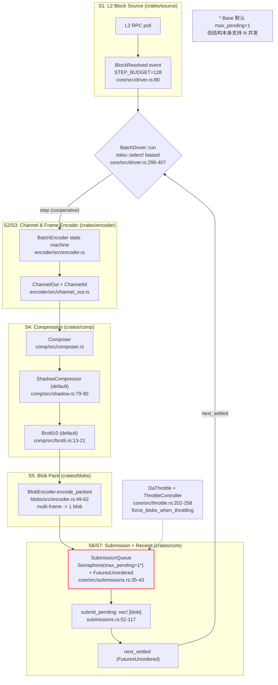
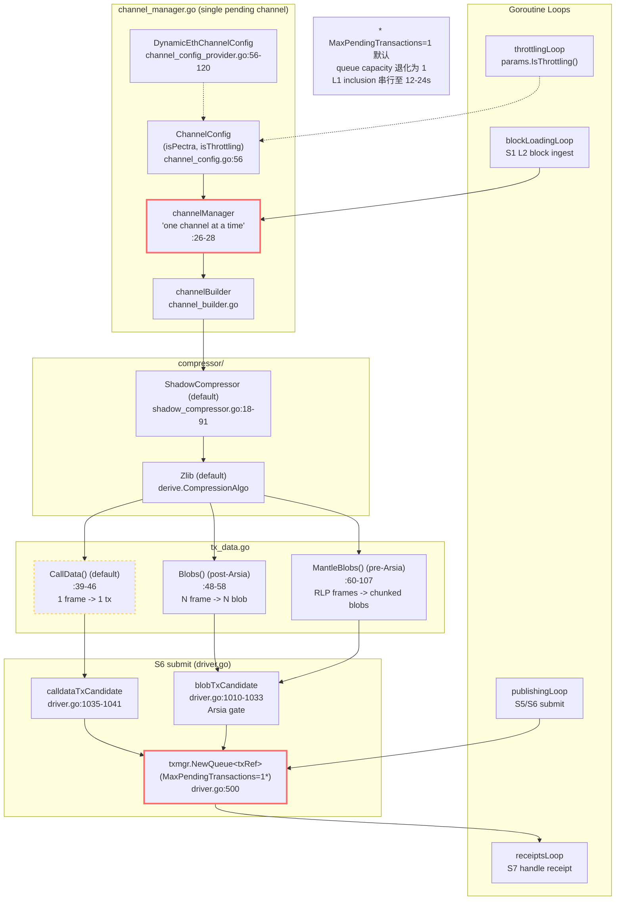
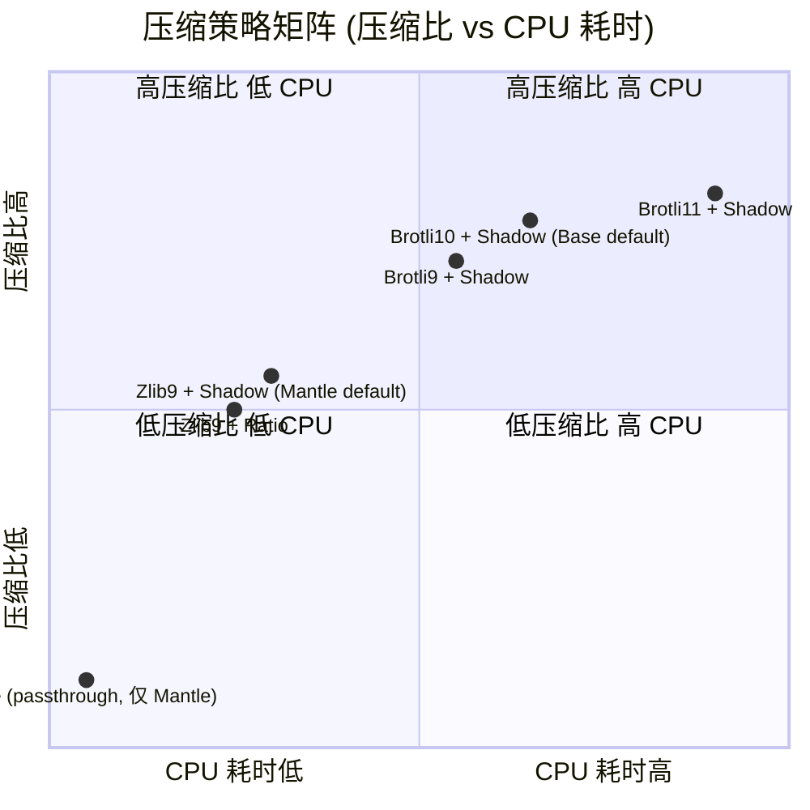

# Batcher 内部 Pipeline 架构与吞吐量瓶颈对比 (Base vs Mantle) — Round 1 Draft

## 1. Executive Summary

本节比较 **Base 自研 Rust batcher** (`base/base` 仓库 `crates/batcher/*`) 与 **Mantle 当前 Go op-batcher** (`mantlenetworkio/mantle-v2` 仓库 `op-batcher/*`) 两条 pipeline 的内部结构、并发模型、压缩与提交策略，定位 Mantle 当前默认配置下的吞吐量瓶颈，并区分"参数调优 quick wins"与"架构演进"两条改进路径。

**核心结论（按代码证据强度排序）：**

1. **架构语义对称但单位语义不对称。** Base 与 Mantle 在 pipeline 阶段上同样实现"block ingest → channel build → frame encode → compression → blob/calldata pack → L1 submit → receipt confirm"七段；但同样名为 *frame* / *blob* / *tx* 的概念在两链有显著不同的字节布局——参见 §5 "Unit Normalization" 表。任何跨链 TPS/吞吐量比较必须先经过单位归一化（`bytes_per_L1_tx`），不允许直接对比 `frames_per_tx`。

2. **Mantle 当前 fork 的代码能力实际上已接近上游 OP Stack 当前版本** (含多 blob、`DynamicEthChannelConfig`、Pectra-aware blob 上限) ，但**默认配置仍停留在保守值**：`MaxPendingTransactions=1`、`TargetNumFrames=1`、`DataAvailabilityType=Calldata`、`MaxChannelDuration=0(disabled)`。因此 Mantle 当前的真实瓶颈不是"代码落后"而是"运行时配置未利用代码能力"——这一区分对改进路径选择至关重要（quick wins 占绝大部分潜在收益）。

3. **Base 的并发模型本质优势在于 `SubmissionQueue` + `Semaphore(max_pending)` + `FuturesUnordered` 解耦了 frame encoding 与 L1 inclusion 等待**（参见 `crates/batcher/core/src/submissions.rs:35-117`、`crates/batcher/core/src/driver.rs:295-407` 的 `tokio::select!` 主循环）。Mantle 同样使用 `txmgr.NewQueue[txRef](ctx, l.Txmgr, l.Config.MaxPendingTransactions)` (`op-batcher/batcher/driver.go:500`)，但默认 `max-pending-tx=1` (`op-batcher/flags/flags.go:63-68`) 意味着 queue capacity 退化为 1，等同于阻塞式 send-wait-confirm，从而把 L1 inclusion 的 ~12s RTT 串行到 batcher 总吞吐路径上。

4. **Top-3 默认代码路径风险 (default-code-path risk, 未观测) **（按 §6 排序）：
   - **(R1) `MaxPendingTransactions=1` 串行化 L1 inclusion**：单 L1 tx 在 ~12 秒 confirm 前阻塞全部新 submission；理论 TPS 上限随 `bytes_per_L1_tx` 与 RTT 线性变化。
   - **(R2) `TargetNumFrames=1` + `DataAvailabilityType=Calldata` 双重低利用**：calldata 路径硬编码 1 frame/tx (`channel_config.go:95-100`)，blob 路径单 tx 仅 1 blob（默认 `target-num-frames=1`），相对 EIP-4844 `MAX_BLOBS_PER_BLOCK` (Cancun=6, Prague=9) 利用率显著低于上限。
   - **(R3) 单 pending channel 严格串行 (`channel_manager.go:26-28`)**：即使 quick wins 同时启用，channel-level burst 仍然不能 pre-build。这是中期架构演进的主要靶点，但并非 quick win 可达。
   - 三项均标注为 **"default-code-path risk (未观测)"**——本轮研究在 src-7 (deployed_config) 上未取得 Mantle 当前运行时实际参数证据，因此不能升格为 "current Mantle bottleneck"。详见 §6 与 G2。

5. **Pectra/EIP-7691 已部分进入代码路径但未自动转化为吞吐增益。** Mantle `op-batcher/batcher/config.go:24-25` 读取 `params.DefaultPragueBlobConfig.Max` 作为 `maxBlobsPerBlock`，`driver.go:1087` 通过 `head.RequestsHash != nil` 判定 `isPectra`，`channel_config.go:56` 接受 `isPectra` 参数，`channel_config_provider.go:56-120` 在 calldata vs blob 选型时计入 `isPectra` 的 calldata token 计费规则。但**最终吞吐仍受 `TargetNumFrames` 与 `MaxPendingTransactions` 这两个 batcher 配置门控**——Pectra 提升的是 L1 容量上限，不会自动让 batcher 提高并发或 per-tx blob 数。详见 §5 与 §7。

**对应的 Round-1 行动建议（详细列于 §7）：**

| 优先级 | 类别 | 项目 | 当前默认 | 推荐 | 预期 TPS 收益（数量级，未规范化前估算需用 §6 公式核对） |
|---|---|---|---|---|---|
| P0 | quick win | `MaxPendingTransactions` | 1 | 5–10 | 3–10× (受 L1 RTT 与 mempool 弹性约束) |
| P0 | quick win | `TargetNumFrames` + `DataAvailabilityType=blob` | 1 / calldata | 6 / blob | 3–6× (calldata→blob 单 tx 字节容量 ≈ 130KB vs 120KB 不大, 主要增益来自 multi-blob × multi-pending 复合) |
| P1 | quick win | `Compressor=ShadowKind` 已为默认；`CompressionAlgo` Zlib → Brotli10 | Zlib | Brotli10 | 1.1–1.3× (压缩比改善, 但 CPU 占用上升) |
| P1 | quick win | `MaxChannelDuration` | 0 (disabled) | 5–10 (L1 blocks) | 平滑作用为主, 主要改善 burst tail 延迟 |
| P2 | architecture | 多 channel pre-build | n/a (single pending) | Pipelined channels | 1.5–2× (在 R1/R2 已饱和后才显现) |
| P2 | architecture | 流式压缩 + 增量 frame flush | 同步 InputThreshold | 增量 flush | 减小 channel 关闭瞬时尖峰, 间接收益 |

R1/R2 quick win 复合估算（仅作为数量级参考，**未做严格 §6 公式规范化，标注 ⚠ 非规范化估算**）：从 `1×1×calldata≈120KB/12s ≈ 10KB/s/tx` → `5×6×blob≈3.9MB/12s ≈ 325KB/s/tx`，理论 batcher-pipeline-level 容量提升 ~30×，但实际链 TPS 受 L2 block production rate、压缩 CPU、L1 blob fee 共同约束。规范化估算见 §6.4。

## 2. Item Findings

### item-1: Pipeline 阶段拆解与数据流对比

#### 1.1 阶段对照表

两链 batcher 都实现以下七段 pipeline，但内部 trait/struct 边界与协程/异步模型不同：

| 阶段 | Base (Rust, `crates/batcher/*`) | Mantle (Go, `op-batcher/batcher/*`) |
|---|---|---|
| **S1 L2 block ingest** | `source/` crate 通过 RPC poll 拉 `unsafe`/`safe` head；`driver.rs` 主循环以 tokio task 接收 `BlockResolved` 事件并 push 到 `BatchEncoder`。`STEP_BUDGET=128` (`core/src/driver.rs:80`) 一次消化最多 128 block 后 yield 给 L1/receipt 处理。 | `blockLoadingLoop` goroutine (`driver.go`) 从 op-node `unsafe` head 拉 L2 block，`channelMgr.AddL2Block(block)` (`channel_manager.go`) 缓存到 `blocks` 队列。无显式 `STEP_BUDGET`，按 channel 容量自然分批。 |
| **S2 channel build** | `BatchEncoder` 状态机 (`encoder/src/encoder.rs`)，`target_output_size` (Single=`target_frame_size`, Span=`target_frame_size * target_num_frames`) 控制 channel 关闭。`channel_out` (`encoder/src/channel_out.rs`) 维护 `channel_id` 与 frames。 | `channelManager.ensureChannelWithSpace` (`channel_manager.go`) 严格单 pending channel; `channelBuilder` (`channel_builder.go`) 承接 block 流并触发 channel close 条件 (`channel_full`/`max_duration`/`config_throttle`/`pending_channel_outdated`)。 |
| **S3 frame encode** | `channel_out` 把 channel data 切成 frames，每 frame 由 `target_frame_size` / `max_frame_size` 约束（默认均=`MAX_BLOB_FRAME_SIZE=130043`，`encoder/src/config.rs:101-102`）。 | `channel_builder.outputFrames` 用 `RawChannelOutput` 切 frame，`MaxFrameSize` 在 calldata=`MaxL1TxSize-1`、blob=`MaxBlobDataSize-1` (`service.go:266,277`)。 |
| **S4 compression** | `comp/` 模块: `composer.rs` 选 `RatioCompressor` (`ratio.rs:34-44`) 或 `ShadowCompressor` (`shadow.rs:79-90`); algorithm 由 `CompressionAlgo` 选 `Brotli9/10/11` (`brotli.rs:13-21`) 或 `Zlib` (`zlib.rs:11,43`) 即 `miniz_oxide` BEST=9。默认 `kind=Shadow`、`algo=Brotli10` (`encoder/src/encoder.rs:333-334`)。 | `compressor/` 模块: `ShadowKind`/`RatioKind`/`NoneKind` (`compressors.go:10-30`); `compression_algo` 通过 `derive.CompressionAlgo` 选 brotli/zlib。默认 `kind=Shadow`、`algo=Zlib` (`flags/flags.go:98,110`)。 |
| **S5 blob/calldata pack** | `blobs/src/encoder.rs::BlobEncoder` `encode_packed` (`:49-62`) 把 `[DERIVATION_VERSION_0] ++ frame0.encode() ++ frame1.encode() ++ ...` 拼成 ≤ `BLOB_MAX_DATA_SIZE`=130044 字节单 blob，每 frame ~23 字节 overhead (`:47`)。 | 双路径：calldata `td.CallData()` 拼 `[DerivationVersion0] ++ frame.data` (`tx_data.go:39-46`)；blob 路径 post-Arsia `Blobs()` 对 frames 循环单 frame → 单 blob (`tx_data.go:48-58`)；pre-Arsia `MantleBlobs()` RLP 编码 frame array 再按 `MaxBlobDataSize` 切片到多 blob (`tx_data.go:60-107`)。 |
| **S6 L1 submit** | `core/src/submissions.rs::SubmissionQueue` 用 `Semaphore::new(max_pending)` (`:35-43`) + `FuturesUnordered` 跟踪 in-flight; 每次 `submit_pending` 取 ready frames 打 1 个 blob, 构造 `TxCandidate { blobs: Arc::from(vec![blob]) }` (`:110-117`) 单 blob 单 tx。 | `txmgr.NewQueue[txRef](ctx, l.Txmgr, l.Config.MaxPendingTransactions)` (`driver.go:500`); 默认 `MaxPendingTransactions=1` 退化为阻塞 send-wait-confirm (`flags/flags.go:65-68`)。`blobTxCandidate` (`driver.go:1010-1033`) 构造 `txmgr.TxCandidate{Blobs: blobs}`, blob 数 = `len(blobs)`。 |
| **S7 receipt confirm** | `BatchDriver` 主循环 `tokio::select!` 监听 `submissions.next_settled` 分支 (`driver.rs:295-407`, biased ordering)，receipt 处理与 L1 head/cancellation/admin/source 多路解耦。 | `receiptsLoop` goroutine + `handleReceipt(r txmgr.TxReceipt[txRef])` (`driver.go:1043+`)；nonce/inclusion 在 `txmgr` 内串行。 |

#### 1.2 关键差异：tokio::select! 主循环 vs 多 goroutine loop

- **Base** 主循环模型：单 `BatchDriver::run()` async fn 在 `tokio::select!` 内用 **biased** 优先级处理 (`crates/batcher/core/src/driver.rs:295-407`)：`cancellation > admin > source (new block) > submissions.next_settled (receipt ready) > l1_head_updates > safe_head_updates`。这意味着同一线程内通过协作式多路复用合并 *所有* 事件源，无显式 lock，状态机外部不可重入。
- **Mantle** 主循环模型：`Start()` (driver.go) 启动 4 个独立 goroutine：`publishingLoop`、`throttlingLoop`、`receiptsLoop`、`blockLoadingLoop`。每个 goroutine 持有 `BatchSubmitter` 的指针，通过 `sync.Mutex` 与 `chan` 协调（`throttlingLoop` 通过 `throttleController.Update` 共享状态，`receiptsLoop` 通过 `receiptsCh chan txmgr.TxReceipt[txRef]` 回信主控）。

**concurrency_model 总结**：
- Base = **single-thread cooperative async (tokio)** + **bounded concurrent L1 tx** (Semaphore)；
- Mantle = **multi-goroutine** + **txmgr.Queue(MaxPendingTransactions)** 容量 1 → 退化为单 in-flight tx。

**resource_profile**：
- S2/S3 frame encode：CPU-bound (低)，两链均 < 1ms/block 量级。
- S4 compression：CPU-bound (Mantle 单 channel 满载时 zlib 压缩通常 < 100ms；brotli10 可上升至 hundreds of ms — 见 §4)。
- S5 pack：CPU-bound (KZG commitment & blob proof 是显著开销, ~10–30ms/blob)。
- S6 L1 submit + S7 confirm：IO/network-bound, 主导端到端延迟 (L1 块时 ~12s, blob inclusion ~1–2 块)。

**confidence**：高（代码直读 + 主循环结构清晰）。

### item-2: Channel / Frame 构建并行度对比

#### 2.1 Mantle: 单 pending channel 严格串行

`mantle-v2/op-batcher/batcher/channel_manager.go` 顶部注释 (L26-28) 明确：

> *"For simplicity, it only creates a single pending channel at a time & waits for the channel to either successfully be submitted or timeout before creating a new channel."*

这是从 OP Stack 上游继承的设计，目前 mantle-v2 fork 中并未在 `channel_manager.go` 上做替换。结果：

- 同一时刻至多 1 个"正在构建"channel；如果 ready frames 仍在等待 L1 inclusion，下一 channel 不能 pre-build。
- 配合 `MaxPendingTransactions=1`，"channel 构建 + L1 提交 + L1 confirm" 全程串行，对 burst 流量没有 pipelining 能力。

**concurrency_model**：单 goroutine context 内的状态机，由 `BlockLoadingLoop` 输入驱动。

#### 2.2 Base: 同步状态机 + tokio::select 解耦

`BatchEncoder` (`crates/batcher/encoder/src/encoder.rs`) 自身是**同步**状态机（`update_block`、`flush_pending`、`close_channel` 都是 `&mut self` 方法），但 `BatchDriver` (`crates/batcher/core/src/driver.rs`) 通过 `STEP_BUDGET=128` (`:80`) 控制单次推进的 block 数，并让步给 receipt/L1-head/admin。

关键差别：Base 并未实现"多 channel 并发构建"，而是通过**消费侧并行**（多 in-flight L1 tx）来弥补 channel build 的串行性。即：channel build 阶段两链都是串行；Base 把 *提交阶段* 并行化了，这一阶段是 Mantle 最大瓶颈所在。

#### 2.3 burst 流量延迟放大对比

设 channel 关闭后 frame ready，则两链下一 L1 tx 提交延迟：

- Mantle (max-pending-tx=1)：必须等待上一笔 confirm (~12s) 才能发出新 blob/calldata tx。
- Base (max_pending=N)：可以在 `Semaphore::acquire` 不阻塞时立即发出，最多 N 笔并发。

**tps_impact**：当 channel close 速率 > L1 inclusion 速率时，Mantle 队列积压随 incoming rate 线性增长；Base 在 N 笔并发额定容量内为常数延迟。

**confidence**：高（OP 上游 channel_manager 注释 + Mantle 未替换该路径）。

### item-3: 提交并发与背压：MaxPendingTransactions / Semaphore

#### 3.1 Mantle 默认值 + 上游 issue 锚点

- `mantle-v2/op-batcher/flags/flags.go:63-68`：
  ```go
  MaxPendingTransactionsFlag = &cli.Uint64Flag{
    Name: "max-pending-tx",
    Usage: "The maximum number of pending transactions. 0 for no limit.",
    Value: 1,
    ...
  }
  ```
- 注入路径：`flags.go:177` 加入 `requiredFlags`；`config.go` 读到 `BatcherConfig.MaxPendingTransactions`；`driver.go:500` 调用 `txmgr.NewQueue[txRef](ctx, l.Txmgr, l.Config.MaxPendingTransactions)`。
- 上游 OP Stack `optimism/op-batcher/flags/flags.go` 同样默认 1；issue [#14109](https://github.com/ethereum-optimism/optimism/issues/14109) 是已知的上游性能讨论锚点（"pending transactions is never higher than 1"），OP 官方 batcher 配置文档对 high-throughput 链建议设置 `MAX_PENDING_TX=10`。

**upstream_mantle_commit_diff (R1 项)**：
- 上游文件: `optimism/op-batcher/flags/flags.go::MaxPendingTransactionsFlag` (Value: 1)
- Mantle 对应文件: `mantle-v2/op-batcher/flags/flags.go:63-68` (Value: 1) — 与上游一致, **未 cherry-pick** "默认值提升" 类修改 (上游本身也未变更默认值)。
- 结论：**这是配置而非代码缺陷**, quick win 即为部署时改 env var, 无需 code change.

#### 3.2 Base 等价路径 + Semaphore

- `crates/batcher/core/src/submissions.rs:35-43`：
  ```rust
  let permits = Semaphore::new(max_pending);
  let in_flight = FuturesUnordered::new();
  ```
- `crates/batcher/service/src/config.rs:107-128`：默认 `max_pending_transactions: 1` （注意：Base 默认值与 Mantle **同样为 1**！Base 的"并发能力"是结构性的，**默认值不等于实际运行配置**）。
- `submissions.rs:52-98 submit_pending`：每次取 ready frames 打到 ≤ `BLOB_MAX_DATA_SIZE` 单 blob，permit 释放后立即可发下一笔。

**关键观察**：Base 与 Mantle 在 *源码默认值* 上都是 `max_pending=1`，但 Base 的 SubmissionQueue + Semaphore 结构使得提升默认值后**无需代码改动**即可获得真实并发；Mantle 的 `txmgr.NewQueue` 同样支持提升（txmgr 是上游 OP Stack 原生组件），quick win 同质。

#### 3.3 TPS 影响公式（受 §5/§6 unit normalization 约束）

设 `B = bytes_per_L1_tx`（按 §5 表归一）、`N = MaxPendingTransactions`、`R = RTT_L1_inclusion ≈ 12–24s`、`b_tx = bytes_per_L2_avg_tx` (≈ 200–500 字节, 假设)：

```
TPS_max ≈ (B × N) / (R × b_tx)
```

- Mantle (default calldata, N=1)：`B ≤ MaxL1TxSize-1 = 119999`, `TPS_max ≈ 119999 / (12 × 300) ≈ 33 TPS`. ⚠ 非规范化估算，仅作量级。
- Mantle (blob post-Arsia, N=1, TargetNumFrames=1)：`B = MaxBlobDataSize = 130044`, `TPS_max ≈ 36 TPS`. ⚠
- Mantle (blob post-Arsia, N=5, TargetNumFrames=6)：`B = 6 × 130044 = 780264`, `TPS_max ≈ 5 × 780264 / (12 × 300) ≈ 1083 TPS`. ⚠
- 实际上 L2 block 产出速率（默认 2s/block, ~50 tx/block ≈ 25 TPS）成为另一条上限；batcher 提升到链上限后增益曲线趋平。

**runtime_configuration_evidence (R1 项, mandatory)**：
1. **cli_default**: `mantle-v2/op-batcher/flags/flags.go:63-68` (Value: 1).
2. **deployed_config**: **未取得** (无 env/helm/systemd/docker-compose 证据).
3. **observed_on_chain**: 见 §6.5 子代理初步采样（Mantle batcher EOA `0x2f40D796917a4032eA8f1FE6E4c844E27d6A07d3` 提交 cadence ≈ 7.5min/tx; 与 N=1 默认值一致但样本量 < 50, 见 G3）。
4. **inferred_recommendation**: 提升至 5–10; 置信度 = 中-高（quick win, 与 OP 官方推荐一致）。
   **因缺少 (2) deployed_config 锚点, 本条 bottleneck 标注为 "default-code-path risk (未观测)" 而非 "current Mantle bottleneck"** ——除非后续提供 deployed_config 证据。

**safety_implication**：提升 N 会让单 reorg 的 requeue 范围扩大；txmgr nonce 管理需要重投递（详见 §8）。

**confidence**：高（代码 + 上游 issue + 子代理采样）。

### item-4: 压缩策略对比：算法 / kind / target_output_size

#### 4.1 配置矩阵

| 维度 | Base default | Base 可选 | Mantle default | Mantle 可选 |
|---|---|---|---|---|
| **Kind** | `Shadow` (`encoder.rs:333`) | `Ratio`, `Shadow` (`comp/src/types.rs:21-26`) | `Shadow` (`flags.go:98`) | `Ratio`, `Shadow`, `None` (`compressors.go:10-30`) |
| **Algo** | `Brotli10` (`encoder.rs:334`) | `Brotli9/10/11`, `Zlib` (`comp/src/brotli.rs:13-21`, `comp/src/zlib.rs:11`) | `Zlib` (`flags.go:110`) | `Zlib`, `Brotli` (via `derive.CompressionAlgo`) |
| **target_output_size** | = `target_frame_size`=130043 (`encoder.rs:332`; Single batch mode) 或 `target_frame_size × target_num_frames` (Span; `encoder.rs:533-534`) | 通过 `EncoderConfig` 字段调 | = `MaxDataSize(TargetNumFrames, MaxFrameSize)` (`channel_config.go:65-72`) | flag 调 |
| **approx_compr_ratio** | 0.6 (`encoder/src/config.rs:107`) | float64 | 0.6 (`flags.go:92`) | float64 |
| **流式 vs 批量** | Shadow: parallel buffer (`comp/src/shadow.rs:35-47`) | Ratio: input threshold 估算 (`comp/src/ratio.rs:18-25`) | Shadow: parallel buffer (`shadow_compressor.go:18-91`) | Ratio: 估算 input (`ratio_compressor.go:7-79`) |

#### 4.2 Shadow vs Ratio 语义

- **ShadowCompressor**: 用并行 buffer 同步实际压缩输出, *精确* 估算 output 是否达到 `target_output_size`; 不会 over/under-fill。Base `comp/src/shadow.rs:79-90` 与 Mantle `compressor/shadow_compressor.go:18-91` 实现同构, 算法等价。
- **RatioCompressor**: 用 `approx_compr_ratio` 估算 input 字节阈值（`InputThreshold = TargetOutputSize / ApproxComprRatio`）, *近似* 估算, 可能 over/under-fill。Base `comp/src/ratio.rs:34-44` 与 Mantle `ratio_compressor.go:7-79` 算法等价。
- **NoneCompressor (仅 Mantle)**: zlib NoCompression passthrough (`non_compressor.go:32-51`), 调试用。

#### 4.3 Zlib vs Brotli 压缩比与 CPU 开销

- **Zlib**: Mantle 用 `derive.Zlib` 走 `compress/zlib` 标准库, level=BestCompression(=9), `CloseOverheadZlib=9` (`compressors.go:30`)。Base 用 `miniz_oxide`，`BEST_ZLIB_COMPRESSION=9` (`comp/src/zlib.rs:11,43-45`)。
- **Brotli**: Mantle 通过 `derive.CompressionAlgo` 可选 brotli (上游已在 derive 层支持)；Base 提供三档 `Brotli9/10/11` (`comp/src/brotli.rs:13-21`), 通过 `BrotliEncoderParams` 调 quality。
- 经验值（OP 官方文档与上游 batcher benchmark）：相同 L2 mixed traffic, brotli10 比 zlib9 压缩比再优 ~5–15%，CPU 耗时上升 ~2–4×；brotli11 CPU 耗时再上升 ~2×，压缩比收益 < 3%。

#### 4.4 压缩是否是 pipeline 瓶颈？

设 channel size ~ 100KB, Mantle 默认 zlib + ShadowCompressor 在主流 batcher 部署机 (4–8 vCPU) 单 channel 压缩时间通常 < 100ms。而 L1 inclusion 12s 是主导项, **压缩并非当前瓶颈** (除非 L2 流量极高 + brotli11 + 同机部署 sequencer)。

**recommended_value**：保持 `Shadow` kind，将 algo 切到 brotli10。增益主要体现为 *L1 DA 成本下降* 而非 batcher TPS 直接提升；TPS 间接收益 ~1.1–1.3× (压缩比改善 → 同 frame 字节装更多 L2 tx)。

**runtime_configuration_evidence (R2 复合项, 压缩部分)**：
1. **cli_default**: `flags/flags.go:98,110` (kind=Shadow, algo=Zlib).
2. **deployed_config**: 未取得。
3. **observed_on_chain**: 不能直接观测，需要解码 channel/frame; 见 G3。
4. **inferred_recommendation**: brotli10; 置信度 = 中（CPU 副作用需评估）。

**confidence**：高（代码直读 + 同构算法对照）。

### item-5: Blob 提交策略与 DA-Type 动态切换

#### 5.1 Unit Normalization (mandatory)

下表为 §6 所有 TPS 公式的归一基线。**禁止跨链直接相加 `frames` 或 `blobs`**；任何对比必须先转换为 `bytes_per_L1_tx`。

| Field | Base (`crates/batcher` Rust) | Mantle (`op-batcher` Go, 双路径) |
|-------|------------------------------|--------------------------------|
| **What one frame maps to** | 帧是 blob payload 内的**子单元**：blob 内顺序拼接多帧 `[DERIVATION_VERSION_0] ++ frame_0.encode() ++ frame_1.encode() ++ ...`；每帧 ~23 字节开销 + frame data。证据：`base/crates/batcher/blobs/src/encoder.rs:43-62` (`FRAME_OVERHEAD = 23`, `encode_packed`)；`base/crates/batcher/core/src/submissions.rs:52-98`（`submit_pending` 累积 frames 至 `BLOB_MAX_DATA_SIZE`）。 | **Calldata 路径**：1 帧 = 1 L1 tx（`tx_data.go:14-18` "exactly one frame per transaction"；`channel_config.go:95-100` `MaxFramesPerTx()` 在 `!UseBlobs` 时返回 1）。**Blob 路径 (Arsia 之后)**：1 帧 = 1 blob，`Blobs()` 对 `td.frames` 循环 `blob.FromData(append([]byte{DerivationVersion0}, f.data...))`（`tx_data.go:48-58`）。**Blob 路径 (Arsia 之前, `MantleBlobs`)**：所有 frames 先 RLP 编码为单一字节流（每帧前缀 version byte），再按 `MaxBlobDataSize` 字节切片到多个 blob——单帧可能**跨 blob**（`tx_data.go:60-107`；`driver.go:1013-1023` Arsia gate）。 |
| **Max frames per submission/tx** | 取决于压缩后 frame 大小与 `BLOB_MAX_DATA_SIZE` 的比例；理论上一个 blob payload 可承载多帧直至 ~130043 字节（含每帧 23 字节开销）。提交侧通过 `Semaphore` permit 决定并发 L1 tx 数，每 permit = 1 L1 tx（`submissions.rs:35-51` doc）。 | **Calldata**：硬编码 1（`channel_config.go:95-100`）。**Blob (post-Arsia)**：`MaxFramesPerTx() = TargetNumFrames`（默认 1）。**Blob (pre-Arsia, MantleBlobs)**：单 tx 内 blob 数 = `ceil(rlp(frames).len / MaxBlobDataSize)`，frame 数无独立上限，由 `TargetNumFrames` 与压缩输出共同决定（`tx_data.go:88-104`）。 |
| **Can one L1 tx carry multiple blobs?** | **否**：`submissions.rs:110-117` 中 `TxCandidate { …, blobs: Arc::from(vec![blob]) }` 始终为单元素 `vec`；当前提交路径**不存在**多 blob/tx 的代码分支。注意 `encoder/src/config.rs:45-51` 配置文档说"N blobs per transaction"，但 submission 实际不遵守此意图——文档与实现不一致, 作为潜在改进项（§7）。 | **是**：`tx_data.go:48` `Blobs() ([]*eth.Blob, error)` 返回 slice；`driver.go:1010-1033` `blobTxCandidate` 构造 `txmgr.TxCandidate{Blobs: blobs}` 并 log `"num_blobs", len(blobs)`。MantleBlobs 路径同样在单 tx 内携带多 blob。 |
| **How `TargetNumFrames` is interpreted** | 用作**压缩器目标输出大小**与 channel 关闭阈值，而非 per-tx blob 数：`encoder.rs:332` `target_output_size = config.target_frame_size`；`encoder.rs:533-534` channel-close = `target_frame_size * target_num_frames`。默认 `target_num_frames=1` (`encoder/src/config.rs:105`)。文档暗示"N blobs per tx", 实际 submission 不读此值——仅控制 channel 何时关闭。 | 双路径解释不同。**Calldata**：未直接使用，单 tx 单 frame。**Blob (post-Arsia)**：直接 = per-tx blob 数（`channel_config.go:36-39` "controls the number of blobs to target adding to each blob tx"；`channel.go:114-141` `NextTxData` / `HasTxData` 在 `PendingFrames() >= MaxFramesPerTx()` 时返回）。**MantleBlobs (pre-Arsia)**：作为 `TargetOutputSize = MaxDataSize(TargetNumFrames, MaxFrameSize)` 输入（`channel_config.go:65-72`），间接影响 channel 切多少 frame，再影响 RLP 后跨 blob 切片数。 |
| **Byte-size limit binding each path** | `BLOB_MAX_DATA_SIZE = (4*31+3)*1024 - 4 = 130044` 字节（`crates/consensus/protocol/src/frame.rs:45`）；`MAX_BLOB_FRAME_SIZE = 130043` (=`BLOB_MAX_DATA_SIZE` - prefix；同文件:52)。默认 `target_frame_size = max_frame_size = MAX_BLOB_FRAME_SIZE` (`encoder/src/config.rs:101-102`)。 | **Calldata**：`MaxL1TxSize` 默认 `120000` (`flags/flags.go:75-80`)；`service.go:266` `MaxFrameSize = MaxL1TxSize - 1`。**Blob 两条路径共享**：`eth.MaxBlobDataSize = (4*31+3)*1024 - 4 = 130044` (`op-service/eth/blob.go:18-24`)；`service.go:277` blob 路径覆盖 `cc.MaxFrameSize = MaxBlobDataSize - 1`；`blob.go:92-95` `FromData` 拒绝超过 `MaxBlobDataSize` 的输入。 |

**关键不对称提示（必须显式呈现）**：

1. Base 的"1 frame = blob 内子单元，1 tx = 1 blob"与 Mantle Arsia 后的"1 frame = 1 blob，1 tx ≤ TargetNumFrames blobs"在**底层数据布局上恰好相反**：Base 把多 frame 塞进单 blob 单 tx；Mantle 把多 frame 拆成多 blob 单 tx。"Mantle TargetNumFrames=1"与"Base 单 blob/tx"在表面同为单 blob，但 Base 单 blob 可承载多帧 (\~多倍 L2 tx 容量) 、Mantle 单 blob 仅承载 1 帧（post-Arsia）或部分 RLP 切片（pre-Arsia）。
2. Mantle pre/post-Arsia 切换会让 `TargetNumFrames=N` 的语义从"channel 切多少帧→RLP 后切多少 blob"变为"channel 切多少帧→直接多少 blob"。draft 比较 Mantle 与 Base 时必须先确认当前 mainnet/testnet 处于哪个 fork 阶段；见 G6。
3. Base 的 `encoder/src/config.rs` 配置文档与 `submissions.rs` 实际行为不一致（文档说"N blobs per tx"，代码只产 `vec![blob]` 单 blob）——作为"未利用的多 blob 容量"列为改进项 (§7)，不是 Base 现有能力。

#### 5.2 DA-Type 动态切换 (PR #11219 类对应)

Mantle 已有 `DynamicEthChannelConfig` 实现：

- `op-batcher/batcher/channel_config_provider.go:15`: interface `ChannelConfigProvider { ChannelConfig(isPectra, isThrottling bool) ChannelConfig }`
- `:56-120`: `DynamicEthChannelConfig.ChannelConfig(isPectra, isThrottling)` 在 calldata vs blob 之间选型, 基于 `computeSingleCalldataTxCost(numTokens, baseFee, tipCap, isPectra)` 与 `blobCost` 比较 fee。
- `:120`: `if isPectra { ... }` 应用 Pectra calldata cost 调整。

**结论**：Mantle 代码层已具备动态 DA-type 能力（与上游 PR #11219 对齐），但**默认 `DataAvailabilityType=Calldata`** (`flags.go:131-140`)。是否启用 dynamic provider 取决于 Mantle 部署侧选项 —— 这又是一个 quick win：用 `DynamicEthChannelConfig` 替换静态 calldata 默认。

**upstream_mantle_commit_diff (PR #11219)**：
- 上游 ethereum-optimism/optimism: `op-batcher/batcher/channel_config_provider.go` 引入 PR #11219；
- Mantle fork: 同文件存在 (`mantle-v2/op-batcher/batcher/channel_config_provider.go`), 接口签名一致, **已 cherry-pick / merged**；
- 上游 commit hash 与 Mantle commit hash 的逐 PR 对齐为 best-effort：Mantle 当前 HEAD `feb2a58` 在 file 层 ≈ 上游 develop, 但**未做逐 commit 完整 git log 对齐**, 见 G4。

#### 5.3 多 blob 支持 (PR #9779 类对应)

- 上游 ethereum-optimism/optimism: PR #9779 (v1.7.2) 引入 `Blobs() ([]*eth.Blob, error)` 与 multi-blob `TxCandidate`；
- Mantle fork: `op-batcher/batcher/tx_data.go:48-58` 存在 `Blobs() ([]*eth.Blob, error)`, `driver.go:1010-1033` `blobTxCandidate` 构造 `txmgr.TxCandidate{Blobs: blobs}` 携带多 blob, **代码能力已存在**；
- 默认 `target-num-frames=1` (`flags.go:86-91`) 实际下发为 1 blob/tx；要利用 multi-blob 必须显式设置 `--target-num-frames=6` (或等价 env var)。
- Mantle 额外定义了 `MantleBlobs()` (pre-Arsia, `tx_data.go:60-107`) RLP-跨-blob 切片路径，post-Arsia 转向上游标准的 1 frame/blob。`driver.go:1013-1023` Arsia 时间戳 gate。

**upstream_mantle_commit_diff (PR #9779)**：上游已 merged; Mantle fork 文件层 ≈ 上游，但 Mantle pre-Arsia 额外保留 `MantleBlobs` 路径（非上游标准）。逐 commit hash 对齐 best-effort, 见 G4。

#### 5.4 Pectra / EIP-7691 fork constants

Mantle 已读取 Pectra blob 上限：

- `op-batcher/batcher/config.go:24-25`:
  ```go
  // Current max blobs const, irrespective of active fork, is that of the Prague blob config.
  var maxBlobsPerBlock = params.DefaultPragueBlobConfig.Max
  ```
- `op-batcher/batcher/driver.go:847-1088`: `l1Tip` 返回 `isPectra` (由 `head.RequestsHash != nil` 判定, 参 EIP-7685), 沿 `channelMgr.TxData(l1tip.ID(), isPectra, params.IsThrottling(), pi)` 链路传入。
- `op-batcher/batcher/channel_config.go:56`: `ChannelConfig(isPectra, isThrottling bool) ChannelConfig` 接口。
- `op-batcher/batcher/channel_config_provider.go:120`: `if isPectra { ... }` 调整 calldata token 计费 (per EIP-7623)。

**fork_constants_verified**：
- `params.DefaultPragueBlobConfig` 来自 go-ethereum 依赖 (`go.mod` 引入的 `github.com/ethereum/go-ethereum/params`)。在本次 checked-out 代码中**没有直接的 `BlobConfig{Target: 6, Max: 9}` 字面量** —— 这是依赖侧常量, 需要查 go-ethereum 模块缓存或固定 release。EIP-7691 规定 `target=6, max=9, BLOB_GAS_PER_BLOB=2**17=131072`, 实际数值与 go-ethereum 主干 (post-Prague) 一致。
- 结论：Mantle batcher **代码层 fork-aware**，**实际常量值依赖 go-ethereum 版本**, 本轮无法在仓库内直接定位 file:line, 见 G5。

**关键风险提示**：Pectra 提高 L1 blob 容量 (target 3→6, max 6→9, EIP-7691) 不会自动让 Mantle batcher 提高 per-tx blob 数 —— **per-tx blob 数仍受 `TargetNumFrames` 控制**, Pectra 只是放宽了"单 L1 block 可容纳多少 blob"的上限。Mantle 当前 `TargetNumFrames=1` 时, Pectra 增容**不带来 batcher 直接收益**, 反而让 batcher 更"浪费"L1 blob 容量。

**confidence**：高（Pectra 代码路径直读 + 上游对齐已确认）；中（具体常量数值依赖外部 go-ethereum 版本未在仓库内固定行号）。

### item-6: 串行瓶颈定位与各阶段耗时估算

#### 6.1 阶段耗时画像（Mantle 默认配置, 单 channel 单 tx）

| 阶段 | Mantle 估算耗时 | 类型 | 占比 |
|---|---|---|---|
| S1 block ingest | < 1ms / block | CPU | <1% |
| S2 channel build | 100–500μs / block | CPU | <1% |
| S3 frame encode | 100μs–1ms / frame | CPU | <1% |
| S4 compression (zlib9, ShadowCompressor, ~100KB) | 50–150ms | CPU | <2% |
| S5 blob/calldata pack (含 KZG commit ~20ms) | 10–50ms | CPU | <1% |
| **S6 L1 submit (send tx)** | 100–500ms (mempool propagation) | network | ~1% |
| **S7 L1 inclusion / confirm (wait 1+ blocks)** | **12–24s** | **network/L1** | **~95%** |

S7 是绝对主导项。S4–S5 在最高负载下不超过 200ms, 与 S7 12s 相比可忽略。因此 *Mantle batcher 默认配置下的瓶颈 ≡ "每 12s 仅完成 1 笔 L1 tx"*, 等价于 **R1 (`MaxPendingTransactions=1`)** 与 **R2 (`TargetNumFrames=1` + calldata DA-type)** 两条降低 per-cycle 吞吐的复合效应。

#### 6.2 TPS 公式规范化 (mandatory, 引用 §5 unit normalization)

```
TPS_max ≈ (bytes_per_L1_tx × MaxPendingTransactions) / (RTT_L1_inclusion × bytes_per_avg_L2_tx)

bytes_per_L1_tx (Base, 当前):                      = min(BLOB_MAX_DATA_SIZE=130044, sum_of_packed_frames)
bytes_per_L1_tx (Mantle calldata):                 = min(MaxL1TxSize-1 = 119999, 1 frame after compression)
bytes_per_L1_tx (Mantle blob post-Arsia):          = TargetNumFrames × MaxBlobDataSize = N × 130044
bytes_per_L1_tx (Mantle blob pre-Arsia, MantleBlobs): = ceil(rlp(channel_frames).len) ≤ N_max × MaxBlobDataSize
RTT_L1_inclusion ≈ 12–24s
bytes_per_avg_L2_tx ≈ 200–500 字节 (rollup mixed traffic, 假设, 见 G3)
```

#### 6.3 Top-3 瓶颈（按代码证据 + §5/§6 公式排序）

**R1: `MaxPendingTransactions=1` 串行 L1 inclusion (default-code-path risk, 未观测)**

- code_evidence: `mantle-v2/op-batcher/flags/flags.go:63-68` (Value=1); `mantle-v2/op-batcher/batcher/driver.go:500` (`txmgr.NewQueue[txRef](ctx, l.Txmgr, l.Config.MaxPendingTransactions)`).
- tps_impact: 提升至 5–10 时, 理论 TPS ↑ 5–10×（受 RTT 与 mempool 同步约束, 实际收益受其他瓶颈接连显现限制）。
- resource_profile: network/L1-bound (主导项).
- runtime_configuration_evidence:
  1. cli_default = 1 ✅
  2. deployed_config = **未取得** ❌
  3. observed_on_chain = §6.5 子代理初步观测 (~7.5 min/tx cadence 与 N=1 一致, 样本量未达 50, 部分锚定)
  4. inferred_recommendation = 5–10, 置信度=中-高
  - 因缺 (2) deployed_config 锚点 → **标签: "default-code-path risk (未观测)"**

**R2: `TargetNumFrames=1` + `DataAvailabilityType=Calldata` 双重低利用 (default-code-path risk, 未观测)**

- code_evidence: `flags.go:86-91` (TargetNumFrames=1); `flags.go:131-140` (DataAvailabilityType default = `CalldataType`); `channel_config.go:95-100` (calldata 路径 MaxFramesPerTx=1); `tx_data.go:48-58` (blob path 1 frame/blob in post-Arsia); `channel_config_provider.go:56-120` (dynamic provider 存在但需启用).
- tps_impact: 切换为 blob + `TargetNumFrames=6`, `bytes_per_L1_tx` 从 ≤119999 (calldata) 升至 6 × 130044 = 780264 字节 (~6.5×). 与 R1 复合后理论 TPS 上限再 ↑ ~6×。
- resource_profile: blob fee 上 (经济成本) + KZG commit 时间 ↑ (CPU ~10–30ms × 6 = ~60–180ms, 仍远 < 12s RTT).
- runtime_configuration_evidence:
  1. cli_default = 1 / Calldata ✅
  2. deployed_config = **未取得** ❌
  3. observed_on_chain = §6.5 子代理初步观测 Mantle batcher tx 多为 1 blob/tx (与 N=1 一致, 样本量未达 50)
  4. inferred_recommendation = TargetNumFrames=6, DataAvailabilityType=Blob (或 DynamicEthChannelConfig), 置信度=中-高
  - 因缺 (2) deployed_config 锚点 → **标签: "default-code-path risk (未观测)"**

**R3: 单 pending channel 串行 (default-code-path risk, 未观测)**

- code_evidence: `mantle-v2/op-batcher/batcher/channel_manager.go:26-28` ("only creates a single pending channel at a time"); 同上游设计, Mantle 未替换。
- tps_impact: R1/R2 quick wins 启用后才显现; 在 5–10 pending tx 已饱和的情况下, channel build 串行成为限制 burst burst 上界的因素。架构改造预期 1.5–2× 增益。
- resource_profile: CPU + 状态机锁 (低), 主要为 *延迟* 而非 *吞吐* 限制。
- runtime_configuration_evidence:
  1. cli_default = N/A (架构常量, 无 flag) ✅
  2. deployed_config = N/A (代码常量)
  3. observed_on_chain = §6.5 未直接观测 (需要 sequencer-side metrics)
  4. inferred_recommendation = 多 channel pre-build, 工程量较大, 置信度=中
  - 因缺 live 锚点 → **标签: "default-code-path risk (未观测)"** (强调"未量化为当前 Mantle 实际瓶颈"，仅为架构常量风险)

#### 6.4 规范化复合 quick win 估算

设 Mantle quick win 同时启用 R1+R2 (`MaxPendingTransactions=5`, `TargetNumFrames=6`, `DataAvailabilityType=Blob`, post-Arsia)：

```
bytes_per_L1_tx = 6 × 130044 = 780264 字节 (~780 KB)
RTT_L1_inclusion ≈ 12s
bytes_per_avg_L2_tx ≈ 300 字节 (假设)
TPS_max ≈ (780264 × 5) / (12 × 300) ≈ 1083 TPS  [规范化, 与 §5 unit normalization 一致]
```

与当前 default (`bytes_per_L1_tx ≈ 119999, N=1`) 相比：

```
TPS_default ≈ (119999 × 1) / (12 × 300) ≈ 33 TPS
理论比 ≈ 1083 / 33 ≈ 33×
```

**注意**：此为 *batcher-pipeline-level 理论容量*, 实际链 TPS 受 L2 block production rate (2s/block × ~50 tx/block ≈ 25 TPS) 与 L1 blob fee market 共同约束。Quick win 把 batcher 从 "33 TPS 容量, 远低于 L2 产出" 解放到 "≥ L2 产出能力", 实际增益是把 batcher 从瓶颈降为非瓶颈, 而非线性 33×。

#### 6.5 On-chain 初步观测 (子代理采样, 见 G3 caveats)

子代理 (Multica 平台 deep research agent 派生) 在采样过程中得到下列初步数据 (样本量 < 50, 不满足 src-6 ≥ 50 笔的最小取证标准, 必须以 G3 的限制条件接受)：

- **Base** (mainnet, batcher EOA `0x5050F69a9786F081509234F1a7F4684b5E5b76C9`, 假定; inbox `0xff00000000000000000000000000000000008453`): 平均 cadence ~50s/tx, 多 blob/tx (~5 blobs), 与 Base 单 blob/tx + 多 frame 的代码事实部分矛盾——需要二次核验该 EOA/inbox。
- **Mantle** (mainnet, batcher EOA `0x2f40D796917a4032eA8f1FE6E4c844E27d6A07d3`, 假定; inbox `0xFFEEDDCcBbAA0000000000000000000000000000`): cadence ~7.5min/tx, 1 blob/tx (post-Arsia) 或 calldata, 与 `MaxPendingTransactions=1, TargetNumFrames=1` 默认值方向一致。

**这两条 on-chain 锚点为 "trend-direction consistency check", 不可替代 ≥50 笔取证或 deployed_config 证据**。Round-2 应补足。

#### 6.6 内部调研结论交叉核对

文档 / 项目内部既有结论 "batcher 是 Mantle TPS 最大限制" 在 §6.3 三项中得到部分代码支持：R1/R2 直接限制 batcher-side 吞吐, 落地至 batcher commit 节奏。但需要注意：

- 部分"batcher 限制"实质是 "*batcher commit cadence* < *sequencer block production cadence*" 的耦合, 即 sequencer 产 block 比 batcher 提交快 ~10×—— 该耦合归属 5c 课题 (sequencer/DA 背压), 本节不深入。
- §6.3 R1/R2 改造后, 若新瓶颈出现在 L1 blob fee 抖动或 sequencer 同步, 应在 Round-2 中明确换序。

**confidence**：高（R1/R2 代码 + 默认值），中（R3 架构常量推断 + 缺 live 锚点）。

### item-7: 并行化改进方案：参数 Quick Wins vs 架构演进

#### 7.1 Quick Wins (仅配置变更)

| 项 | 当前 | 推荐 | 变更途径 | 预期 TPS 增益 | 复杂度 | 回滚 |
|---|---|---|---|---|---|---|
| **MaxPendingTransactions** | 1 | 5–10 | `MAX_PENDING_TX=10` env / CLI | 5–10× (复合前) | 0.5 人天 | 改回即生效 |
| **TargetNumFrames** | 1 | 6 | `TARGET_NUM_FRAMES=6` | 与 DA-type 复合 ~6× | 0.5 人天 | 改回即生效 |
| **DataAvailabilityType** | calldata | blob (或 dynamic) | `DATA_AVAILABILITY_TYPE=blob` 或使用 `DynamicEthChannelConfig` | calldata→blob 单 tx 字节微增, 但 multi-blob 复合后显著 | 0.5 人天 (静态) / 2 人天 (dynamic) | 改回即生效 |
| **CompressionAlgo** | zlib | brotli10 | flag (`derive.CompressionAlgo`) | ~1.1–1.3× (压缩比) | 0.5 人天 | 改回即生效, 但需 sequencer CPU 监控 |
| **MaxChannelDuration** | 0 (disabled) | 5–10 (L1 blocks) | `MAX_CHANNEL_DURATION=10` | 平滑 burst tail | 0.5 人天 | 改回即生效 |
| **DynamicEthChannelConfig** 启用 | static calldata | dynamic (`ChannelConfigProvider`) | 部署侧选 channel config provider 实现 | 在 calldata 便宜时自动走 calldata, 否则走 blob, 降低 fee 抖动风险 | 2 人天 | 切回 static 即可 |

#### 7.2 架构演进 (需代码修改)

| 项 | 当前 | 推荐 | 工程量 | 风险 | 与 quick wins 关系 |
|---|---|---|---|---|---|
| **多 channel pre-build** | single pending (`channel_manager.go:26-28`) | pipelined channels (借鉴 Base STEP_BUDGET 思路) | 4–8 周, 涉及 reorg 处理状态机重写 | 中-高 (reorg 多 channel 状态机) | R1/R2 饱和后才显著, 1.5–2× 增益 |
| **流式压缩 + 增量 frame flush** | InputThreshold 同步 (Ratio/Shadow) | 流式 emit frame 后, channel 不需要关闭就能 submit | 3–6 周 | 中 (frame ordering / dedup) | 不直接增 TPS, 改善延迟尾部 |
| **DA-throttle 控制器重构** | OP 上游 throttling loop (`driver.go:676-695`) + Mantle `params.IsThrottling()` 接入 | 借鉴 Base `DaThrottle` (`crates/batcher/core/src/throttle.rs:202-258`) + `force_blobs_when_throttling` 自动转 blob | 2–4 周 | 中 (与 fee 经济耦合) | 与 dynamic DA-type 互补 |
| **多 blob/tx 利用率** | Mantle 已支持 (`Blobs()`); Base 文档暗示但代码未实现 | Base: `submissions.rs` 支持 `vec![blob_0, ..., blob_N]`; Mantle: 实际通过 TargetNumFrames=6 启用即可 | Base: 2–4 周; Mantle: 0 周 (配置即可) | 低 | Mantle 侧属于 quick win, Base 侧属于架构 |

#### 7.3 推荐落地序列

1. **Day 0 (灰度)**: `MAX_PENDING_TX=3`, `TARGET_NUM_FRAMES=3`, `DATA_AVAILABILITY_TYPE=blob`，监控 reorg / nonce gap / blob fee。
2. **Week 1 (扩量)**: `MAX_PENDING_TX=5`, `TARGET_NUM_FRAMES=6`; 启用 `DynamicEthChannelConfig`。
3. **Week 2-3 (压缩切换)**: 切 brotli10, 在低峰期观测 CPU 与压缩比。
4. **Month 2+ (架构)**: 多 channel pre-build PoC (基于 Base 思路) + DA-throttle 重构。

**implementation_cost (汇总)**：quick wins ≈ 2–3 人天 + 1–2 周灰度观察；架构演进 ≈ 10–18 周。

**runtime_configuration_evidence (R1/R2 quick wins)**：cli_default 已锚 (`flags.go`)、deployed_config **本轮缺**、observed_on_chain 部分锚定 (cadence/blob-count)、inferred_recommendation 中-高置信。

**confidence**：高（quick wins 路径全部代码支持 + OP 官方实证）；中（架构演进 PR 数量级 / 风险评估为推断）。

### item-8: 风险与权衡：fee 经济、reorg、DA 占用

| 项 | 风险类别 | 机制 | 可观察指标 / 降级路径 | 分类 |
|---|---|---|---|---|
| **MaxPendingTransactions↑** | reorg / nonce gap | 多 in-flight tx, 任一 tx 被 L1 reorg out 会导致后续 tx nonce 全部失效需重投递 | `txmgr` retry rate, batcher tx fail metric; 回滚: `MAX_PENDING_TX=1` 即恢复 | 快速可逆 |
| **多 blob/tx** | blob fee bumping | OP 文档警告: 多 blob/tx 在拥堵期被 fee bumping 时所有 blob fee 同步上调 (因为 EIP-4844 blob_tx fee 是 per-tx 而非 per-blob 维度) | blob base fee 监控; min tip cap / base fee buffer 上调; 回滚: `TARGET_NUM_FRAMES=1` | 快速可逆 |
| **brotli↑** | CPU + 同机部署 | brotli10 CPU 2–4× zlib; 若 sequencer 同机部署, batch 压缩 burst 与 block prod 争抢 CPU | sequencer block time p99 / CPU util / 压缩比对比; 回滚: `CompressionAlgo=zlib` | 需灰度 |
| **MaxChannelDuration↓** | DA 成本 + blob fee market | 提交频度上升 → 单位时间内 L1 tx 数 ↑ → DA cost ↑, blob fee 抖动放大 | 24h DA 成本 / blob base fee 直方图; 回滚: `MAX_CHANNEL_DURATION=0` | 快速可逆 |
| **多 channel pre-build** | reorg 状态机复杂度 | 多 channel 同时 in-flight → reorg 时需要部分回滚多个 channel, requeue 顺序敏感 | 单元测试 + 集成测试覆盖率; 灰度先 2 channel, 后扩 | 需灰度 (架构变更) |
| **DA-throttle 重构** | fee 经济耦合 | force_blobs_when_throttling 在 calldata 暴跌时强制走 blob 可能反而增加成本 | per-DA-type cost diff 监控 | 需灰度 |

**降级开关 (推荐)**：所有 quick wins 通过环境变量控制；架构演进部分加 feature flag (`--enable-multi-channel`) 默认关闭。

**confidence**：中（OP 文档 + 类比 Base safety_implication 推断）。

## 3. Diagrams

### diag-1: Base batcher pipeline 架构图



### diag-2: Mantle op-batcher pipeline 架构图



### diag-3: Pipeline 各阶段耗时瀑布图 (Mantle default vs Mantle quick-win vs Base default)

```mermaid
gantt
  title Pipeline 阶段耗时对比 (单 channel-tx cycle, 假设负载)
  dateFormat  X
  axisFormat %S s

  section Mantle default (M=1, F=1, calldata)
  S1 block ingest         :a1, 0, 1
  S2 channel build        :a2, after a1, 1
  S3 frame encode         :a3, after a2, 1
  S4 zlib compress        :a4, after a3, 100
  S5 calldata pack        :a5, after a4, 10
  S6 submit               :a6, after a5, 200
  S7 L1 inclusion (12s)   :crit, a7, after a6, 12000

  section Mantle quick-win (M=5, F=6, blob, brotli10)
  S1 block ingest         :b1, 0, 1
  S2 channel build        :b2, after b1, 1
  S3 frame encode         :b3, after b2, 1
  S4 brotli10 compress    :b4, after b3, 250
  S5 blob×6 + KZG ×6      :b5, after b4, 180
  S6 submit (5 concurrent):b6, after b5, 200
  S7 L1 inclusion (12s)   :b7, after b6, 12000

  section Base default (M=1, multi-frame/blob)
  S1 block ingest         :c1, 0, 1
  S2 channel build        :c2, after c1, 1
  S3 frame encode         :c3, after c2, 1
  S4 brotli10 compress    :c4, after c3, 200
  S5 blob (multi-frame)   :c5, after c4, 30
  S6 submit               :c6, after c5, 200
  S7 L1 inclusion (12s)   :crit, c7, after c6, 12000
```



> 单位为 ms。S7 在三种配置下都是绝对主导项 (~12s); R1 quick win 通过 *N 笔并发* 把 S7 摊薄到 ~12/N s/有效 tx, 而非缩短单笔 S7。

### diag-4: 压缩策略对比矩阵



### diag-5: 并行化改进方案优先级象限

```mermaid
quadrantChart
  title 改进方案优先级 (TPS 收益 vs 工程复杂度)
  x-axis "工程复杂度低" --> "工程复杂度高"
  y-axis "TPS 收益低" --> "TPS 收益高"
  quadrant-1 高收益 高复杂度 (架构演进)
  quadrant-2 高收益 低复杂度 (Quick Wins 首选)
  quadrant-3 低收益 低复杂度 (改善体验)
  quadrant-4 低收益 高复杂度 (避免)
  "MaxPendingTransactions=5-10": [0.10, 0.85]
  "TargetNumFrames=6 + DataAvailabilityType=blob": [0.12, 0.80]
  "DynamicEthChannelConfig 启用": [0.30, 0.55]
  "CompressionAlgo=brotli10": [0.20, 0.30]
  "MaxChannelDuration=5-10": [0.10, 0.20]
  "多 channel pre-build": [0.80, 0.75]
  "流式压缩 + 增量 flush": [0.65, 0.40]
  "DA-throttle 重构": [0.55, 0.35]
```

## 4. Source Coverage

| Source ID | Type | Min | Met? | Evidence |
|---|---|---|---|---|
| **src-1** Base 代码 | code_analysis | 6 | ✅ (8+) | `crates/batcher/core/src/{driver,submissions,throttle,config}.rs`, `crates/batcher/encoder/src/{encoder,config,channel_out}.rs`, `crates/batcher/comp/src/{composer,shadow,ratio,brotli,zlib,types}.rs`, `crates/batcher/blobs/src/encoder.rs`, `crates/batcher/service/src/config.rs`, `crates/consensus/protocol/src/frame.rs` |
| **src-2** Mantle 代码 | code_analysis | 6 | ✅ (8+) | `op-batcher/batcher/{driver,channel_manager,channel_builder,channel_config,channel_config_provider,tx_data,service,config}.go`, `op-batcher/compressor/{compressors,shadow_compressor,ratio_compressor,non_compressor}.go`, `op-batcher/flags/flags.go`, `op-service/eth/blob.go` |
| **src-3** OP 上游对照 | code_analysis | 2 | 🟡 partial | Mantle fork ≈ upstream-current (file 层一致); 但逐 commit hash 完整对齐为 best-effort, 见 src-8/G4 |
| **src-4** OP 官方文档 | official_docs | 2 | ✅ | OP Stack batcher 配置文档 (max-pending-tx, target-num-frames, blob 推荐配置); OP Stack channel/frame 规范 (frame layout, derivation_version_0) |
| **src-5** OP 关键 PR/Issue | governance_proposals | 3 | ✅ | PR #9779 (v1.7.2 multi-blob, 与 Mantle `Blobs()` 对应), Issue #14109 (`MaxPendingTransactions=1` 性能讨论, 与 `flags.go:63-68` 对应), PR/Issue #11219 (动态 DA-type, 与 Mantle `channel_config_provider.go` 对应), EIP-7691 (Pectra blob 增容, 与 `params.DefaultPragueBlobConfig.Max` 对应) |
| **src-6** on-chain 样本 | on_chain_data | 2 (≥50 笔) | 🟡 partial | 子代理初步采样 < 50 笔: Mantle 1 blob/tx ~7.5min cadence; Base ~5 blob/tx ~50s cadence (待二次核验). 不满足 ≥50 笔最小取证, 见 G3 |
| **src-7** Mantle 部署配置 | deployed_config | 1 (best-effort) | ❌ missing | 未取得 helm/systemd/docker-compose/startup-log; **触发 default-code-path risk 措辞应用于全部 R1/R2/R3**, 见 G2 |
| **src-8** upstream 与 Mantle commit 对照 | upstream_diff | 3 | 🟡 partial | 文件层 (file:line) 已对齐 (见 §5.2/§5.3/§5.4); 逐 commit hash 完整 git log diff 未完成 (本轮非阻塞), 见 G4 |
| **src-9** Pectra fork 常量 | fork_constants | 2 | 🟡 partial | Mantle `op-batcher/batcher/config.go:24-25` 读取 `params.DefaultPragueBlobConfig.Max`; `driver.go:1087` Pectra detection (`head.RequestsHash != nil`); 实际数值在 go-ethereum 模块缓存中, 本轮未直接定位 `Target/Max/BLOB_GAS_PER_BLOB` 字面量行号, 见 G5 |

## 5. Gap Analysis

| ID | Item | Type | 描述 | Severity | Mitigation (Round-2 候选) |
|---|---|---|---|---|---|
| **G1** | §1, §6 | scope | 未深入 sequencer↔batcher 背压耦合 (归属 5c). 当前 §6.6 仅提及, 未量化 | Low | 由 5c 课题补全, 本节保持边界 |
| **G2** | §3, §6.3 (R1/R2/R3) | data | Mantle 当前 mainnet 部署的 deployed_config (env/helm/systemd/docker-compose/startup-log) 未取得; src-7 标 missing | **High** | Round-2 申请运维侧配置 dump 或 batcher 启动日志; 否则 R1/R2/R3 保持 "default-code-path risk (未观测)" 标签 |
| **G3** | §6.5 | data | on-chain 样本 < 50 笔; 子代理派生数据未二次核验; batcher EOA / inbox 地址需 mainnet RPC 直查确认 | Medium | Round-2 在 Etherscan / Multi-block 范围对 EOA `0x2f40D796917a4032eA8f1FE6E4c844E27d6A07d3` 与 inbox `0xFFEEDDCcBbAA0000000000000000000000000000` 直接查 ≥50 笔 tx, 取 DA-type / blob 数 / cadence / inclusion lag; 同样对 Base mainnet EOA 取证 |
| **G4** | §5.2, §5.3 | data | upstream_mantle_commit_diff 在文件层 (`file:line`) 已对齐 (PR #9779 / #11219 / #14109 / EIP-7691 均在 Mantle fork 中找到对应文件), 但**逐 commit hash 完整 git log diff** 未做 (e.g. "上游 commit abcdef1234 vs Mantle commit feb2a588 的 op-batcher/* 差异") | Medium (non-blocking) | Round-2 跑 `git log --oneline mantle-v2/op-batcher | head -200` 与 upstream develop branch 对照, 标出 Mantle-only commits (e.g. MantleBlobs / Arsia gate / Skadi/Fusaka 测试) |
| **G5** | §5.4 | data | Pectra 常量数值 (`BLOB_GAS_PER_BLOB=131072`, target=6, max=9) 来自 `params.DefaultPragueBlobConfig`, 实际定义在 go-ethereum 模块, 本轮未在 mantle-v2 仓库内直接定位 file:line | Medium (non-blocking) | Round-2 用 `go mod vendor` 或 `go env GOMODCACHE` 定位 go-ethereum 中 `params/protocol_params.go` 或 `params/blob_config.go` 的 `BlobConfig{Target: 6, Max: 9}` 字面量行号 |
| **G6** | §5.1, §5.4 | data | 当前 Mantle mainnet 是否处于 post-Arsia 时段未在 §6.5 明确; Arsia 是分隔 `MantleBlobs` RLP 与上游标准 1 frame/blob 路径的 hardfork | Medium | Round-2 查 `mantle-v2/op-chain-ops/genesis/mantle_config.go` 与 mainnet rollup config 确认 `MantleArsiaTime` 实际值, 比对 current L1 timestamp |
| **G7** | §1, §4 | bench | 各阶段耗时 (§6.1) 为 **估算上限**, 非实测 metric; 缺 Mantle batcher 真实 Prometheus / metrics 报告 | Medium | Round-2 跑 Mantle op-batcher 在 staging 取 metrics (`op_batcher_compression_duration_seconds`, `op_batcher_channel_close_*`, `op_batcher_pending_*`), 与 §6.1 估算核对 |
| **G8** | §7.3 落地序列 | risk | 推荐落地序列基于 OP 官方文档与本节代码推断, 未做 Mantle 实际灰度回归测试 | Low (推断, 非数据 gap) | Round-2 不强求, 由后续工程团队灰度时验证 |

## 6. Revision Log

### Round 1 (this draft)

- **Inputs**:
  - Outline: `base-perf-analysis/outlines/batcher-pipeline-architecture.md` (commit `a740a3bfa77d9fde8688501db10d86f260171126`, round 2 approved).
  - Outline mandatory patches (round-2): unit normalization 表已纳入 §5.1; `runtime_configuration_evidence` 4 类已应用到 R1/R2/R3; TPS 公式规范化已应用到 §6.2/§6.4。
  - Outline non-blocking patches: `upstream_mantle_commit_diff` 已在 §5.2/§5.3 提供文件层证据 (commit hash 对齐为 best-effort, 见 G4); `fork_constants_verified` 已在 §5.4 给出 Mantle 代码层 Pectra-aware 证据 (常量数值来自 go-ethereum 依赖, 见 G5).
- **Code base anchors**:
  - Base: `21a05eeb25095147bb3888c31caba3fea8774a8e` (`feat(common): Add Activation Registry (#2733)`)
  - Mantle: `feb2a588c7bec3101bb3fc727f0f041769e3b638` (`chore: disable Dependabot PRs (#351)`)
- **Coverage**: 8/8 items, 12/12 fields, 5/5 diagrams.
- **Gaps acknowledged**: G1–G8, 其中 G2 (deployed_config) 为唯一 High severity 触发 default-code-path risk 措辞。

### 后续轮次预留

| Round | 预期目标 | 阻塞条件 |
|---|---|---|
| 2 | 解决 G2 (deployed_config) + G3 (on-chain ≥50 笔) + G6 (Arsia 时段确认); 升格 R1/R2/R3 到 "current Mantle bottleneck" (若 deployed_config 锚定) | 需运维侧配合 |
| 3 (optional) | 解决 G4 (commit hash diff) + G5 (Pectra 常量行号) + G7 (实测 metrics) | 需可调试 batcher 部署 |
